## Final Project Submission

Post Sale Opportunities in King County, WA

Three important questions.
<ul>
    <li>Is there a discernible geography pattern to the properties that have been sold in the time ? #### No</li>
    <li>What are the areas of high sales volume?</li>
    <li>Can we determine areas of high sales price?</li>
    <li>Combining features, what are areas of high volume with and high pricing and where are the new home sales in the county?</li>
</ul>


```python
import numpy as np
import pandas as pd

import scipy.stats as scs

import matplotlib.pyplot as plt
import seaborn as sns

import scipy.stats as scs
import statsmodels.api as sm

from sklearn.linear_model import LinearRegression
from sklearn.model_selection import train_test_split, cross_val_score

import warnings
warnings.filterwarnings('ignore')

from sklearn.metrics import mean_squared_error
from sklearn.model_selection import cross_val_score

import folium
from folium.plugins import HeatMap
import random

from sklearn.metrics import r2_score

import folium.plugins as HeatMapWithTime


target= 'price'
```

### Custom Function


```python
def generateBaseMap(default_location=[40.693943, -73.985880], default_zoom_start=12):
    '''Create base map for the folium plot'''
    base_map = folium.Map(location=default_location, control_scale=True, titles= 'Stamen Toner')
    return base_map 
def feature_heatmap(data, feature_column= 'price', radius= 8):
    '''Create heatmap for given groupby dataframe with latitude and longitude data'''
    base_map = generateBaseMap(default_location=[data.lat.mean()-data.lat.std(), data.long.median()], default_zoom_start=9.0)
    HeatMap(data=data[['lat', 'long', feature_column]].groupby(['lat', 'long']).sum().reset_index().values.tolist(), radius= radius, max_zoom=13, min_opacity=.1).add_to(base_map)
    return base_map
```

See <a href="https://towardsdatascience.com/data-101s-spatial-visualizations-and-analysis-in-python-with-folium-39730da2adf">Spatial Visualizations and Analysis in Python with Folium</a>, for the source of functions.


```python
def convert_cat_str_to_num(dataseries):
    '''Converting categorical feature in string from into arbituary numerical features'''
    count = 1
   
    for i in dataseries.unique():
        dataseries.loc[dataseries == i] = count
        count += 1
    return dataseries

def kfolds(data, k):
    #Force data as pandas dataframe
    data = pd.DataFrame(data)
    num_observations = len(data)
    fold_size = num_observations//k
    leftovers = num_observations%k
    folds = []
    start_obs = 0
    for fold_n in range(1,k+1):
        if fold_n <= leftovers:
            #Fold Size will be 1 larger to account for leftovers
            fold =  data.iloc[start_obs : start_obs+fold_size+1] 
            folds.append(fold)
            start_obs +=  fold_size + 1
        else:
            fold =  data.iloc[start_obs : start_obs+fold_size] 
            folds.append(fold)
            start_obs +=  fold_size
            
    return folds 

def resd_check(results, data, column):
    a=results.resid/results.resid.std()
    a = a.loc[a.abs() > 2]
    
    
    plt.figure(figsize= (13,8))
    sns.distplot(data[column].iloc[a.index])
    sns.distplot(data[column])
    plt.title('Checking Dist. Initial v. High,\n'+column)
    return

def binning_count(data_series, bins): # binning  numerical features
    data_series = data_series.astype(float)
    bins_rad = pd.cut(data_series, bins)
    print(bins_rad.isna().sum())
    bins_rad = bins_rad.cat.as_ordered()
    bins_rad = bins_rad.sort_values()
    return bins_rad.value_counts()

def binning(data_series, bins):
    data_series = data_series.astype(float)
    return pd.cut(data_series, bins)

def flip_diff(dataframe, column):
    """Adding new column to flip dataframe with the 
    difference of proceeding sales for given feature"""
    dataout=[]
    id_ = None
    previous_index = None
    for value in dataframe.id.unique():
            for index in dataframe.loc[dataframe.id == value].index:
                
                if id_ == dataframe.id.loc[index]:
                    dataout.append(dataframe[column].loc[index] - 
                                   dataframe[column].loc[previous_index])
                else:
                    dataout.append(np.nan)
                id_ = dataframe.id.loc[index]
                previous_index=index
    return dataout

#mean normalization
def mean_norm(dataseries):
    return (dataseries-dataseries.mean())/(dataseries.max()- dataseries.min())

#min-max scaling
def min_max(dataseries):
    return (dataseries-dataseries.min())/(dataseries.max()- dataseries.min())

def make_heatmap(data, columns=None, figsize=(20, 20)):
    if columns is None:
        corr = data.corr()
    else:
        corr = datadf[columns].corr()
    plt.figure(figsize=figsize)
    sns.heatmap(np.abs(corr), cmap=sns.color_palette('Blues'), annot=True, fmt='0.2g')
    plt.show()
    
def make_ols_model(df, target='price', columns_to_use=None, add_constant=True):
    
    '''Just build a model and see the output'''

    X = df[columns_to_use]
    y = df[target]

    # add a constant to my X
    if add_constant:
        X = sm.add_constant(X)
    
    ols = sm.OLS(y, X)
    results = ols.fit()
    print(results.summary())
    return ols, results

def make_ols_model1(df, target='price', columns_to_use=None, add_constant=True):
    
    '''Just build a model with summary'''

    X = df[columns_to_use]
    y = df[target]

    # add a constant to my X
    if add_constant:
        X = sm.add_constant(X)
    
    ols = sm.OLS(y, X)
    results = ols.fit()
    # print(results.summary())
    return ols, results


def scat_plot(data, column, target= 'price'):
    '''Provide scatterpolt for a given dataframe for a given column'''
    plt.figure(figsize= (13, 8))
    sns.scatterplot(x= data[column], y= data[target])

def bar_hist_plot(dataseries):
    plt.figure(figsize= (13, 8))
    a=dataseries.value_counts(sort=False);
    a.sort_index().plot(kind= 'barh')

def viol_plot(data, column, target= 'price'):
    plt.figure(figsize= (13, 8))
    sns.violinplot(x=column, y=target, data= data)

def equal_bin(dataseries):
    return [dataseries.min()-.01, dataseries.quantile(.25), dataseries.quantile(.5), 
            dataseries.quantile(.75), dataseries.max()]

def equal_bin10(dataseries, quantile_step=10):
    
    a = [dataseries.min()-.01]
    
    for quant in np.array(list(range(1,quantile_step)))/quantile_step:
        a.append(dataseries.quantile(quant))
    a.append(dataseries.max())  
    return a

def viol2(x, y):
    plt.figure(figsize= (13, 8))
    sns.violinplot(x=x, y=y)

from folium.plugins import HeatMap
```


```python

```

### Gather Data


```python
data = pd.read_csv('kc_house_data.csv')
data['ones'] = data.price* 0 + 1
```


```python
data.head()
```


<div>
<style scoped>
    .dataframe tbody tr th:only-of-type {
        vertical-align: middle;
    }

    .dataframe tbody tr th {
        vertical-align: top;
    }

    .dataframe thead th {
        text-align: right;
    }
</style>
<table border="1" class="dataframe">
  <thead>
    <tr style="text-align: right;">
      <th></th>
      <th>id</th>
      <th>date</th>
      <th>price</th>
      <th>bedrooms</th>
      <th>bathrooms</th>
      <th>sqft_living</th>
      <th>sqft_lot</th>
      <th>floors</th>
      <th>waterfront</th>
      <th>view</th>
      <th>...</th>
      <th>sqft_above</th>
      <th>sqft_basement</th>
      <th>yr_built</th>
      <th>yr_renovated</th>
      <th>zipcode</th>
      <th>lat</th>
      <th>long</th>
      <th>sqft_living15</th>
      <th>sqft_lot15</th>
      <th>ones</th>
    </tr>
  </thead>
  <tbody>
    <tr>
      <th>0</th>
      <td>7129300520</td>
      <td>10/13/2014</td>
      <td>221900.0</td>
      <td>3</td>
      <td>1.00</td>
      <td>1180</td>
      <td>5650</td>
      <td>1.0</td>
      <td>NaN</td>
      <td>0.0</td>
      <td>...</td>
      <td>1180</td>
      <td>0.0</td>
      <td>1955</td>
      <td>0.0</td>
      <td>98178</td>
      <td>47.5112</td>
      <td>-122.257</td>
      <td>1340</td>
      <td>5650</td>
      <td>1.0</td>
    </tr>
    <tr>
      <th>1</th>
      <td>6414100192</td>
      <td>12/9/2014</td>
      <td>538000.0</td>
      <td>3</td>
      <td>2.25</td>
      <td>2570</td>
      <td>7242</td>
      <td>2.0</td>
      <td>0.0</td>
      <td>0.0</td>
      <td>...</td>
      <td>2170</td>
      <td>400.0</td>
      <td>1951</td>
      <td>1991.0</td>
      <td>98125</td>
      <td>47.7210</td>
      <td>-122.319</td>
      <td>1690</td>
      <td>7639</td>
      <td>1.0</td>
    </tr>
    <tr>
      <th>2</th>
      <td>5631500400</td>
      <td>2/25/2015</td>
      <td>180000.0</td>
      <td>2</td>
      <td>1.00</td>
      <td>770</td>
      <td>10000</td>
      <td>1.0</td>
      <td>0.0</td>
      <td>0.0</td>
      <td>...</td>
      <td>770</td>
      <td>0.0</td>
      <td>1933</td>
      <td>NaN</td>
      <td>98028</td>
      <td>47.7379</td>
      <td>-122.233</td>
      <td>2720</td>
      <td>8062</td>
      <td>1.0</td>
    </tr>
    <tr>
      <th>3</th>
      <td>2487200875</td>
      <td>12/9/2014</td>
      <td>604000.0</td>
      <td>4</td>
      <td>3.00</td>
      <td>1960</td>
      <td>5000</td>
      <td>1.0</td>
      <td>0.0</td>
      <td>0.0</td>
      <td>...</td>
      <td>1050</td>
      <td>910.0</td>
      <td>1965</td>
      <td>0.0</td>
      <td>98136</td>
      <td>47.5208</td>
      <td>-122.393</td>
      <td>1360</td>
      <td>5000</td>
      <td>1.0</td>
    </tr>
    <tr>
      <th>4</th>
      <td>1954400510</td>
      <td>2/18/2015</td>
      <td>510000.0</td>
      <td>3</td>
      <td>2.00</td>
      <td>1680</td>
      <td>8080</td>
      <td>1.0</td>
      <td>0.0</td>
      <td>0.0</td>
      <td>...</td>
      <td>1680</td>
      <td>0.0</td>
      <td>1987</td>
      <td>0.0</td>
      <td>98074</td>
      <td>47.6168</td>
      <td>-122.045</td>
      <td>1800</td>
      <td>7503</td>
      <td>1.0</td>
    </tr>
  </tbody>
</table>
<p>5 rows × 22 columns</p>
</div>


```python
data.info()
#  date, sqft_basement contain string a n
```

    <class 'pandas.core.frame.DataFrame'>
    RangeIndex: 21597 entries, 0 to 21596
    Data columns (total 22 columns):
    id               21597 non-null int64
    date             21597 non-null object
    price            21597 non-null float64
    bedrooms         21597 non-null int64
    bathrooms        21597 non-null float64
    sqft_living      21597 non-null int64
    sqft_lot         21597 non-null int64
    floors           21597 non-null float64
    waterfront       19221 non-null float64
    view             21534 non-null float64
    condition        21597 non-null int64
    grade            21597 non-null int64
    sqft_above       21597 non-null int64
    sqft_basement    21597 non-null object
    yr_built         21597 non-null int64
    yr_renovated     17755 non-null float64
    zipcode          21597 non-null int64
    lat              21597 non-null float64
    long             21597 non-null float64
    sqft_living15    21597 non-null int64
    sqft_lot15       21597 non-null int64
    ones             21597 non-null float64
    dtypes: float64(9), int64(11), object(2)
    memory usage: 3.6+ MB
    


```python
data.describe()
#'date' 'sqft_basement' not included.
```


<div>
<style scoped>
    .dataframe tbody tr th:only-of-type {
        vertical-align: middle;
    }

    .dataframe tbody tr th {
        vertical-align: top;
    }

    .dataframe thead th {
        text-align: right;
    }
</style>
<table border="1" class="dataframe">
  <thead>
    <tr style="text-align: right;">
      <th></th>
      <th>id</th>
      <th>price</th>
      <th>bedrooms</th>
      <th>bathrooms</th>
      <th>sqft_living</th>
      <th>sqft_lot</th>
      <th>floors</th>
      <th>waterfront</th>
      <th>view</th>
      <th>condition</th>
      <th>grade</th>
      <th>sqft_above</th>
      <th>yr_built</th>
      <th>yr_renovated</th>
      <th>zipcode</th>
      <th>lat</th>
      <th>long</th>
      <th>sqft_living15</th>
      <th>sqft_lot15</th>
      <th>ones</th>
    </tr>
  </thead>
  <tbody>
    <tr>
      <th>count</th>
      <td>2.159700e+04</td>
      <td>2.159700e+04</td>
      <td>21597.000000</td>
      <td>21597.000000</td>
      <td>21597.000000</td>
      <td>2.159700e+04</td>
      <td>21597.000000</td>
      <td>19221.000000</td>
      <td>21534.000000</td>
      <td>21597.000000</td>
      <td>21597.000000</td>
      <td>21597.000000</td>
      <td>21597.000000</td>
      <td>17755.000000</td>
      <td>21597.000000</td>
      <td>21597.000000</td>
      <td>21597.000000</td>
      <td>21597.000000</td>
      <td>21597.000000</td>
      <td>21597.0</td>
    </tr>
    <tr>
      <th>mean</th>
      <td>4.580474e+09</td>
      <td>5.402966e+05</td>
      <td>3.373200</td>
      <td>2.115826</td>
      <td>2080.321850</td>
      <td>1.509941e+04</td>
      <td>1.494096</td>
      <td>0.007596</td>
      <td>0.233863</td>
      <td>3.409825</td>
      <td>7.657915</td>
      <td>1788.596842</td>
      <td>1970.999676</td>
      <td>83.636778</td>
      <td>98077.951845</td>
      <td>47.560093</td>
      <td>-122.213982</td>
      <td>1986.620318</td>
      <td>12758.283512</td>
      <td>1.0</td>
    </tr>
    <tr>
      <th>std</th>
      <td>2.876736e+09</td>
      <td>3.673681e+05</td>
      <td>0.926299</td>
      <td>0.768984</td>
      <td>918.106125</td>
      <td>4.141264e+04</td>
      <td>0.539683</td>
      <td>0.086825</td>
      <td>0.765686</td>
      <td>0.650546</td>
      <td>1.173200</td>
      <td>827.759761</td>
      <td>29.375234</td>
      <td>399.946414</td>
      <td>53.513072</td>
      <td>0.138552</td>
      <td>0.140724</td>
      <td>685.230472</td>
      <td>27274.441950</td>
      <td>0.0</td>
    </tr>
    <tr>
      <th>min</th>
      <td>1.000102e+06</td>
      <td>7.800000e+04</td>
      <td>1.000000</td>
      <td>0.500000</td>
      <td>370.000000</td>
      <td>5.200000e+02</td>
      <td>1.000000</td>
      <td>0.000000</td>
      <td>0.000000</td>
      <td>1.000000</td>
      <td>3.000000</td>
      <td>370.000000</td>
      <td>1900.000000</td>
      <td>0.000000</td>
      <td>98001.000000</td>
      <td>47.155900</td>
      <td>-122.519000</td>
      <td>399.000000</td>
      <td>651.000000</td>
      <td>1.0</td>
    </tr>
    <tr>
      <th>25%</th>
      <td>2.123049e+09</td>
      <td>3.220000e+05</td>
      <td>3.000000</td>
      <td>1.750000</td>
      <td>1430.000000</td>
      <td>5.040000e+03</td>
      <td>1.000000</td>
      <td>0.000000</td>
      <td>0.000000</td>
      <td>3.000000</td>
      <td>7.000000</td>
      <td>1190.000000</td>
      <td>1951.000000</td>
      <td>0.000000</td>
      <td>98033.000000</td>
      <td>47.471100</td>
      <td>-122.328000</td>
      <td>1490.000000</td>
      <td>5100.000000</td>
      <td>1.0</td>
    </tr>
    <tr>
      <th>50%</th>
      <td>3.904930e+09</td>
      <td>4.500000e+05</td>
      <td>3.000000</td>
      <td>2.250000</td>
      <td>1910.000000</td>
      <td>7.618000e+03</td>
      <td>1.500000</td>
      <td>0.000000</td>
      <td>0.000000</td>
      <td>3.000000</td>
      <td>7.000000</td>
      <td>1560.000000</td>
      <td>1975.000000</td>
      <td>0.000000</td>
      <td>98065.000000</td>
      <td>47.571800</td>
      <td>-122.231000</td>
      <td>1840.000000</td>
      <td>7620.000000</td>
      <td>1.0</td>
    </tr>
    <tr>
      <th>75%</th>
      <td>7.308900e+09</td>
      <td>6.450000e+05</td>
      <td>4.000000</td>
      <td>2.500000</td>
      <td>2550.000000</td>
      <td>1.068500e+04</td>
      <td>2.000000</td>
      <td>0.000000</td>
      <td>0.000000</td>
      <td>4.000000</td>
      <td>8.000000</td>
      <td>2210.000000</td>
      <td>1997.000000</td>
      <td>0.000000</td>
      <td>98118.000000</td>
      <td>47.678000</td>
      <td>-122.125000</td>
      <td>2360.000000</td>
      <td>10083.000000</td>
      <td>1.0</td>
    </tr>
    <tr>
      <th>max</th>
      <td>9.900000e+09</td>
      <td>7.700000e+06</td>
      <td>33.000000</td>
      <td>8.000000</td>
      <td>13540.000000</td>
      <td>1.651359e+06</td>
      <td>3.500000</td>
      <td>1.000000</td>
      <td>4.000000</td>
      <td>5.000000</td>
      <td>13.000000</td>
      <td>9410.000000</td>
      <td>2015.000000</td>
      <td>2015.000000</td>
      <td>98199.000000</td>
      <td>47.777600</td>
      <td>-121.315000</td>
      <td>6210.000000</td>
      <td>871200.000000</td>
      <td>1.0</td>
    </tr>
  </tbody>
</table>
</div>


### Scrubbing the Data
Cleaning null values and placeholders

#### date
Convert string values to datetime64 format (yyyy-mm-dd)


```python
data.date=pd.to_datetime(data.date)
```

#### sqft_basement
Changing 0 and ? to NaN, then back to zero.


```python
a=data.sqft_basement.replace(to_replace= '?',value= np.nan)
a= a.astype(float)
data.sqft_basement= a.replace(to_replace= 0, value= np.nan)
data.sqft_basement=data.sqft_basement.fillna(value=0)
data.sqft_basement.describe()
```


    count    21597.000000
    mean       285.716581
    std        439.819830
    min          0.000000
    25%          0.000000
    50%          0.000000
    75%        550.000000
    max       4820.000000
    Name: sqft_basement, dtype: float64


#### Used yr_built to make age


```python
data['age'] = 2015- data.yr_built

```

#### yr_renovated 
Changing 0 to NaN  


```python
data.yr_renovated = data.yr_renovated.replace(to_replace= 0, value= np.nan)
```

#### Using yr_renovated to make since_ren


```python
data['since_ren'] = 2015- data.yr_renovated 
```

#### waterfront
Changing waterfront to NaN to 0.


```python
data.waterfront = data.waterfront.fillna(value = 0)

```

#### view
Changing Nan values to 0


```python
data.view = data.view.fillna(value= 0)
```

#### sqft_basement
Change NaN values to 0


```python
data.sqft_basement = data.sqft_basement.fillna(value= 0)
```

#### yr_renovated
Change NaN values to 0


```python
data.yr_renovated = data.yr_renovated.fillna(value= 0)
```

#### since_ren
Change NaN values to 0


```python
data.since_ren = data.since_ren.fillna(value= 0)
```

#### renovated
Binary 0 or 1 (yes)


```python
#data['renovated'] = data.yr_renovated
data['renovated']=data.yr_renovated.loc[data.yr_renovated != 0]/data.yr_renovated.loc[data.yr_renovated != 0]
data.renovated = data.renovated.fillna(value= 0)
```


```python
data.grade.unique()
```


    array([ 7,  6,  8, 11,  9,  5, 10, 12,  4,  3, 13], dtype=int64)


```python
data.columns
```


    Index(['id', 'date', 'price', 'bedrooms', 'bathrooms', 'sqft_living',
           'sqft_lot', 'floors', 'waterfront', 'view', 'condition', 'grade',
           'sqft_above', 'sqft_basement', 'yr_built', 'yr_renovated', 'zipcode',
           'lat', 'long', 'sqft_living15', 'sqft_lot15', 'ones', 'age',
           'since_ren', 'renovated'],
          dtype='object')


#### month


```python
data['month'] = data.date.dt.month
```

#### Creating a Possible Flipped Sale Database
We identified 177 resales of property that were sold in the period of study. We had two meanful features:

<li>change_date ---  The days between sales.<li>change_price --- The cost differential between the previous sale and current sale price.</li>
    
Condition and grade were examined, but there was no change between any of the sales.

Step of creating resale dataframe.
<ol>
    <li>Identify the property ids that are in the dataset more than once.</li>
    <li>Mark those id rows in the dataframe.</li>
    <li>Pulled marked rows into separate dataframe.</li>
    <li>Calculate difference in important features from one sale to another.</li>
    <li>Remove intial sales</li>
    
        


```python
multiple = data.id.value_counts()
len(multiple.loc[multiple > 1])
resales = len(multiple.loc[multiple > 1])
# 176, The number of time a home has been resold in the time period.
resales/ len(data.id)
# Far less then 1% of homes have been sold in the time period.
multiple = multiple.loc[multiple > 1]
multiple = multiple.to_dict()
data['num_sales'] = data.id.map(multiple)
data['num_sales'] = data['num_sales'].fillna(1)
flip = data.loc[data.num_sales > 1]
data = data.drop(columns= 'num_sales')
flip = flip.sort_values('date')

# adding new column examine. 
flip['change_date'] = flip_diff(flip, 'date')

#flip = flip.change_date.apply(lambda x: x.days)      

flip['change_price'] = flip_diff(flip, 'price')

# Removing initial sales
flip = flip.dropna()

# converting timedelta to days
flip.change_date = flip.change_date.apply(lambda x: x.days)

# 
flip['percent_change'] = flip.change_price/(flip.price- flip.change_price)
```

### Data Condition

Methods for manipulating data to fit OLS assumptions.
<ul>
    <li>Binning values</li>
    <li>Playing with null values</li>
    <li>Normalizing data</li>
    <li>Standardizing data</li>
</ul>

Grouping data to create categories that might make sense for your data

#### id
Unique identified for a house. 
Although not valuable for predictive modeling, the feature id does identify homes that have been sold multiple times.


```python

multiple = data.id.value_counts()
len(multiple.loc[multiple > 1])
resales = len(multiple.loc[multiple > 1])
# 176, The number of time a home has been resold in the time period.
print(resales)

```

    176
    


```python
# Far less then 1% of homes have been sold in the time period.
resales/ len(data.id)  
```


    0.008149279992591563


#### date
The date  the house was sold. The initial value was a string value. The information was convert to a date. See Data Scrubbing section for more information. The date is 5/2/2014 to 5/27/2015. 


```python
print(data.date.min(),'-',data.date.max())

```

    2014-05-02 00:00:00 - 2015-05-27 00:00:00
    

The date range is 5/2/2014 to 5/27/2015

#### bedrooms
Number of Bedrooms/House
The initial values ranged from 1 to 33 bedrooms, but there are very fews value over 6. 


```python
plt.figure(figsize= (13, 8))
sns.violinplot(x='bedrooms', y='price', data= data)
plt.title('Bedrooms v. Price Violin Plot');
```


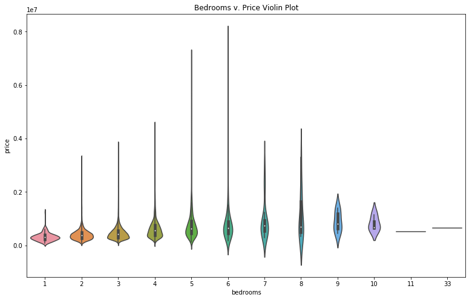


#### Bedrooms v. Price Violin Plot
-skewed to data in all categories


```python
a=data.bedrooms.value_counts(sort=False);
a.sort_index().plot(kind= 'barh')
plt.title('Initial Bedroom Data');
plt.xlabel('Count');
plt.ylabel('Bedrooms');

```


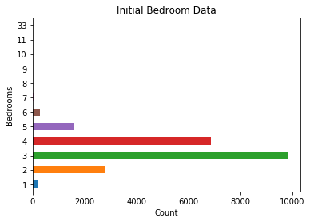


The majority of the entries have 3 and 4 bedrooms. 

#### bathrooms
Number of bathrooms/bedrooms


```python
a=data.bathrooms.value_counts(sort=False);
plt.figure(figsize= (13, 8))
a.sort_index().plot(kind= 'barh')
plt.title('Initial Bathroom Data');
plt.xlabel('Count');
plt.ylabel('Bathrooms');
```


#### bin_bathroom
Create to see if it limited skewness. It did not help


```python
bins = [0, 1.75, 3.75, 8.0]
data['bin_bathrooms'] = binning(data['bathrooms'], bins)
bar_hist_plot(data['bin_bathrooms'])
plt.title('Binned Bathroom Counts')
plt.xlabel('Count')
plt.ylabel('Number of Bathrooms')
```


    Text(0, 0.5, 'Number of Bathrooms')


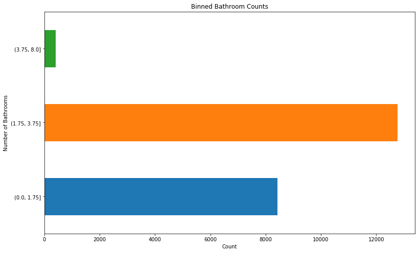


```python
plt.figure(figsize= (13, 8))
sns.violinplot(x='bin_bathrooms', y='price', data= data.loc[data.price< data.price.quantile(.95)])
plt.title('Bathrooms v. Price Violin Plot');
```


```python
data.bin_bathrooms = data.bin_bathrooms.astype(str)


data.bin_bathrooms.loc[data.bin_bathrooms == '(3.75, 8.0]'] = '1'
data.bin_bathrooms.loc[data.bin_bathrooms == '(0.0, 1.75]'] = '2'
data.bin_bathrooms.loc[data.bin_bathrooms == '(1.75, 3.75]'] = '3'
data.bin_bathrooms = data.bin_bathrooms.astype(int)
```


```python

```


```python
plt.figure(figsize= (13, 8))

#sns.violinplot(x= binning(data['bathrooms'],5), y= data[target]);
sns.scatterplot(x= data.bathrooms, y= data[target]);
plt.title('Bathrooms v. Price');
```


#### Bathroom 
<ul>
    <li>Skewed to data in all categories</li>
    <li>Simliar to bedroom</li>
    <li>High heteroscedasticity </li>
    <li>Seems to be a linearity relationship </li>
</ul>

#### sqft_living
Square footage of the home 

The range is 370 sqft to 13540 sqft. 


```python
plt.figure(figsize= (13, 8))
sns.distplot(data.sqft_living)
plt.title('Initial Living Space Sqft Data');
plt.xlabel('Sqft');

```


```python
plt.figure(figsize= (13, 8))
sns.violinplot(x= binning(data['sqft_living'],10), y= data[target]);
plt.title('Living Space Sqft v Price');
```


```python
plt.figure(figsize= (13, 8));
scat_plot(data, 'sqft_living');
plt.title('Living Space Sqft v Price');
```


    <Figure size 936x576 with 0 Axes>


#### Square Footage for Living Space v. Price Violin Plot
<ul>
    <li>Skewed to data in all categories</li>
    <li>Seems nonlinear, may need log tranform (</li>
    <li>High heteroscedasticity </li>
</ul>

Creating data log_sqft_living and price_per_sqft_living (not used)


```python
data['log_sqft_living'] = np.log(data["sqft_living"])
```


```python
data['price_per_sqft_living'] = data.price/ data.sqft_living
```

##### sqft_lot
Square footage of the lot
The range is 520 sqft to 1,651,359 sqft.
<ul>
    <li>Highly skewed</li>
    <li>Not used</li>
</ul>


```python
plt.figure(figsize= (13, 8))
sns.distplot(data.sqft_lot, hist=False)
plt.title('Initial Lot Space Sqft Data');
plt.xlabel('Sqft');
plt.ylabel('Count');
```


```python
plt.figure(figsize= (13, 8))
sns.scatterplot(x= data.sqft_lot, y= data.price)
plt.title('Initial Lot Space Sqft Data');
plt.xlabel('Sqft');
plt.ylabel('Count');
```


#### floors
Total floors (levels) in house
The range is 1 to 3.5 floor. 


```python
a=data.floors.value_counts(sort=False);
plt.figure(figsize= (13, 8))
a.sort_index().plot(kind= 'barh')
plt.title('Initial Floor Data');
plt.xlabel('Count');
plt.ylabel('Floors');
```


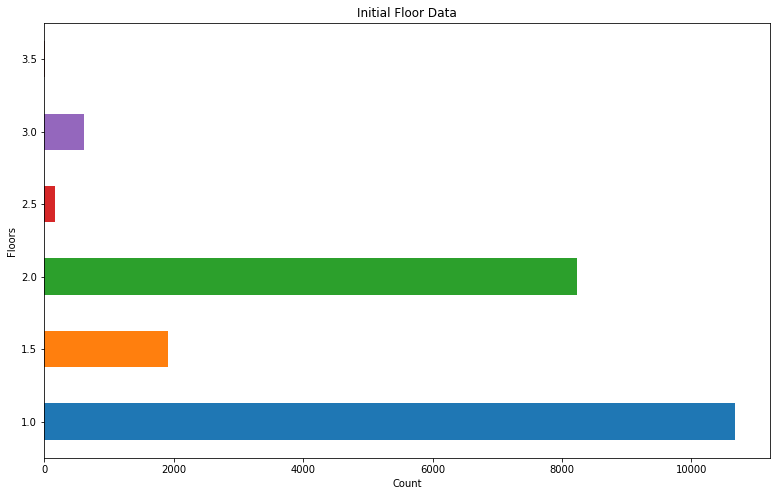


```python
plt.figure(figsize= (13, 8))
sns.violinplot(x='floors', y='price', data= data)
plt.title('Floors v. Price Violin Plot');
```


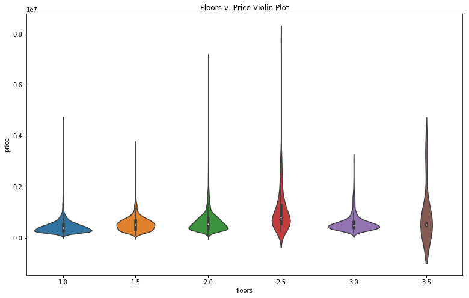


```python
scat_plot(data, 'floors')
plt.title('Floors v. Price');
```


#### bin_floors
Rounded half sizes down.


```python
bins= [0, 1.5, 2.5, 3.5]
```


```python
a= binning(data.floors, bins).astype(str)

```


```python
count = 1
for i in a.unique():
    b = a.loc[a == i]
    a.iloc[b.index] = count
    count += 1
data['bin_floors'] = a
```


```python
plt.figure(figsize= (13, 8))
sns.violinplot(x='bin_floors', y='price', data= data)
plt.title('bin_floors v. Price Violin Plot');
```


#### waterfront
House which has a view to a waterfront. Both values are skewed, but with waterfront is less skewed.


```python
data.waterfront.value_counts()
```


    0.0    21451
    1.0      146
    Name: waterfront, dtype: int64


```python
plt.figure(figsize= (13, 8))
sns.violinplot(x='waterfront', y='price', data= data)
plt.title('Waterfront v. Price Violin Plot');
```


#### view
Has been viewed
The range is 0 to 4.


```python
a = data.view.value_counts()
a.sort_index().plot(kind= 'barh')
plt.title('Initial View Data');
plt.xlabel('Count');
plt.ylabel('View');
```


```python
plt.figure(figsize= (13, 8))
sns.violinplot(x='view', y='price', data= data)
plt.title('view v. Price Violin Plot');
```


#### view Analysis
High skewedness

#### condition
How good the condition is ( Overall 
The range is 1 to 5.


```python
a = data.condition.value_counts()
a.sort_index().plot(kind= 'barh')
plt.title('Initial Condition Data');
plt.xlabel('Count');
plt.ylabel('Condition');
```


```python
viol_plot(data, 'condition')
```


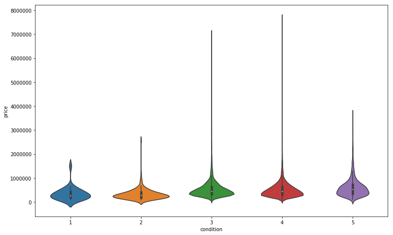


#### Analysis of Condition
High skewness in the high count values.

#### grade
overall grade given to the housing unit, based on King County grading system


```python
a = data.grade.value_counts()
a.sort_index().plot(kind= 'bar')
plt.title('Initial Grade Data');

plt.xlabel('Grade');
plt.ylabel('Count');
```


```python
viol_plot(data, 'grade')
```


```python
scat_plot(data, 'grade')
```


#### Analysis of Grade.
Skewness increase as the grade increases
High Heteroscedasticity, variability to increase as the grade goes up.

#### sqft_above
Square footage of house apart from basement


```python

plt.figure(figsize= (13, 8))
sns.distplot(data.sqft_above, bins=10)
plt.title('Initial Sqft Except from Basement Data');
plt.xlabel('Sqft');
plt.ylabel('Count');
```


```python
scat_plot(data, 'sqft_above')
```


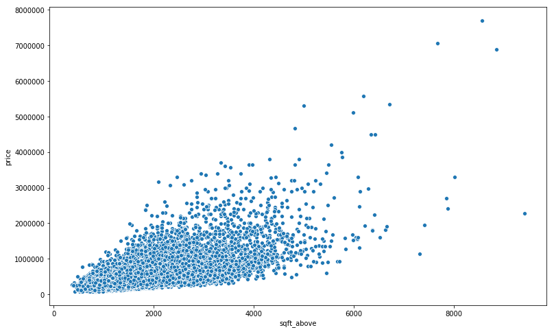


```python
data['binning_sqft_above'] = binning(data.sqft_above, 10)

bar_hist_plot(data.binning_sqft_above)
data = data.drop(columns= 'binning_sqft_above')
```


#### Analysis of sqft_above
-High Heteroscedasticity 

#### sqft_basement
Square footage of the basement.  ? is the place hold value and the feature is formated as a string. See Data Scrubbing 


```python
plt.figure(figsize= (13, 8))
sns.distplot(data.sqft_basement, bins=30)
plt.title('Initial Basement Sqft Data');
plt.xlabel('Sqft');
plt.ylabel('Count');
```


```python
scat_plot(data, 'sqft_basement')
```


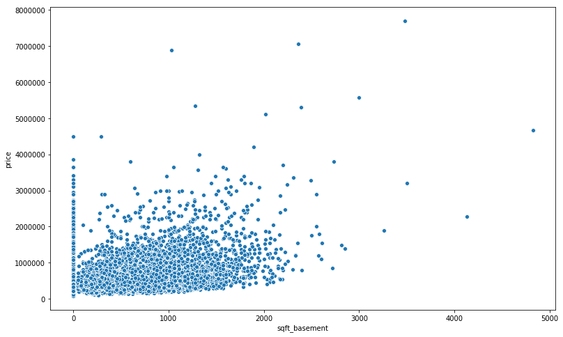


#### Analysis of sqft basement
-High Heteroscedasticity


#### yr_built
Built Year
The range is 1900 to 2015


```python
plt.figure(figsize= (13, 8))
sns.distplot(data.yr_built, bins=50)
plt.title('Initial Built Year Data');
plt.xlabel('Year');

```


```python
data.yr_built.describe()
[1899, 1951, 1975, 1997, 2015]
pd.cut(data.yr_built, [1899, 1912, 1929, 1939, 1951, 1975, 1997, 2016])

bar_hist_plot(pd.cut(data.yr_built, [1899, 1912, 1929, 1939, 1951, 1975, 1997, 2016]))

```


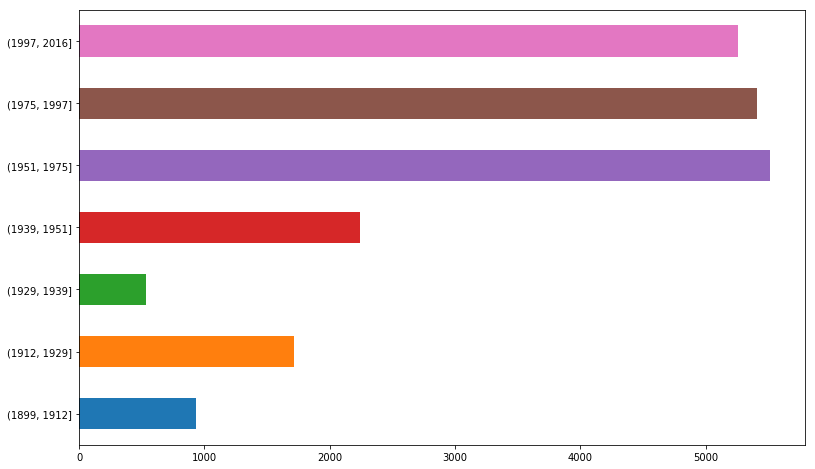


```python
plt.figure(figsize=(13,8))
sns.violinplot(x= pd.cut(data.yr_built, [1899, 1912, 1929, 1939, 1951, 1975, 1997, 2016]), y= data.price);


```


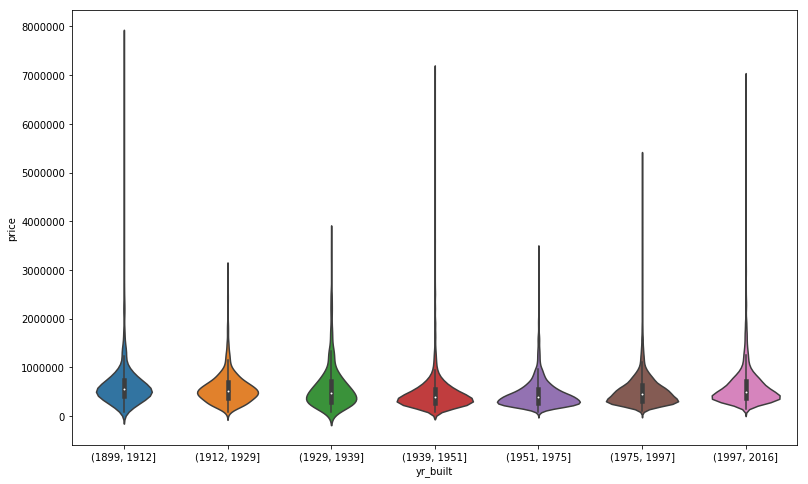


```python

```

#### yr_renovated
Year when house was renovated. The 744 have renovations.


```python
plt.figure(figsize= (13, 8))
sns.distplot(data.yr_renovated, bins=50)
plt.title('Initial Renovated Year Data');
plt.xlabel('Year');
```


#### zipcode


```python
plt.figure(figsize= (13, 8))
sns.distplot(data.zipcode, bins=70)
plt.title('Initial Zipcode Data');
plt.xlabel('Year');
```


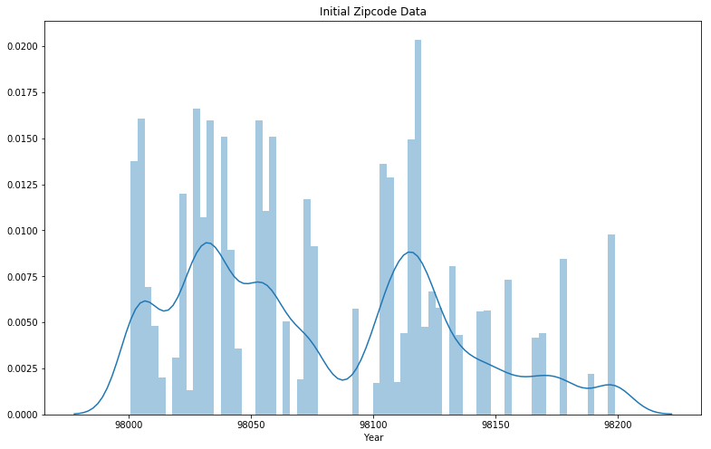


Zipcode is a categorical feature and does not lend it self to linear regression. The data will into a more usable form.It is an geographic area that could be associated with price using a pandas groupby method and statistic method like mean. 


```python
a=data.groupby(['zipcode'])['price'].mean()
data['zip_mean'] = data.zipcode.apply(lambda x: a[x])
scat_plot(data, 'zip_mean')
plt.title('Average Price by Zipcode v. Price')

```


    Text(0.5, 1.0, 'Average Price by Zipcode v. Price')


```python
a=data.groupby(['zipcode'])['price'].median()
data['zip_median'] = data.zipcode.apply(lambda x: a[x])
scat_plot(data, 'zip_median')
data['zip_median'].describe()
```


    count    2.159700e+04
    mean     4.859554e+05
    std      1.966655e+05
    min      2.350000e+05
    25%      3.350000e+05
    50%      4.459500e+05
    75%      5.720000e+05
    max      1.895000e+06
    Name: zip_median, dtype: float64


```python
a= binning(data.zip_median, 6)
viol2(x=a, y=data.price)
```


```python
a=data.groupby(['zipcode'])['price'].quantile(.75)
data['zip_75q'] = data.zipcode.apply(lambda x: a[x])
scat_plot(data, 'zip_75q')
data['zip_75q'].describe()
```


    count    2.159700e+04
    mean     6.180254e+05
    std      2.811627e+05
    min      2.685000e+05
    25%      4.052125e+05
    50%      5.517500e+05
    75%      7.190000e+05
    max      2.560000e+06
    Name: zip_75q, dtype: float64


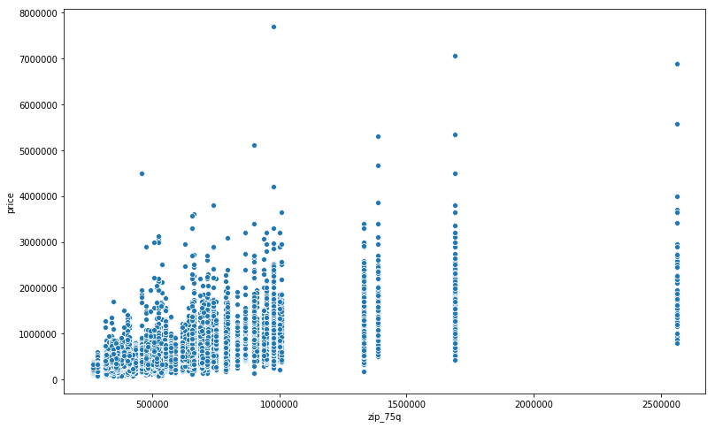


```python
a=data.groupby(['zipcode'])['price'].count()
data['zip_count'] = data.zipcode.apply(lambda x: a[x])
```

#### lat
Latitude coordinate. The range is 47.1559 to 47.7776


```python
print(max(data.lat), min(data.lat))
```

    47.7776 47.1559
    


```python
plt.figure(figsize= (13, 8))
sns.distplot(data.lat, bins=10)
plt.title('Initial Latitude Data');
plt.xlabel('Year');
```


```python
a= data.groupby(['zipcode'])['lat'].median()
data['zip_median_lat'] = data.zipcode.apply(lambda x: a[x])
data['zip_EW'] = (data['zip_median_lat'] >= data.lat)*1


a= data.groupby(['zipcode', 'zip_EW'])['price'].median()
b=[]
for index in range(0,len(data)):
    b.append(a[data.zipcode.iloc[index]][data.zip_EW.iloc[index]])
data['sub_zip_median'] = b    


a= data.groupby(['zipcode', 'zip_EW'])['price'].quantile(.75)
b=[]
for index in range(0,len(data)):
    b.append(a[data.zipcode.iloc[index]][data.zip_EW.iloc[index]])
data['sub_zip_75q'] = b 

```


```python
plt.figure(figsize= (13, 8))
sns.distplot(data['sub_zip_median'], bins=10);

```


#### long
Longitude coordinate


```python
plt.figure(figsize= (13, 8))
sns.distplot(data.long, bins=10)
plt.title('Initial Longitude Data');
plt.xlabel('Year');
```


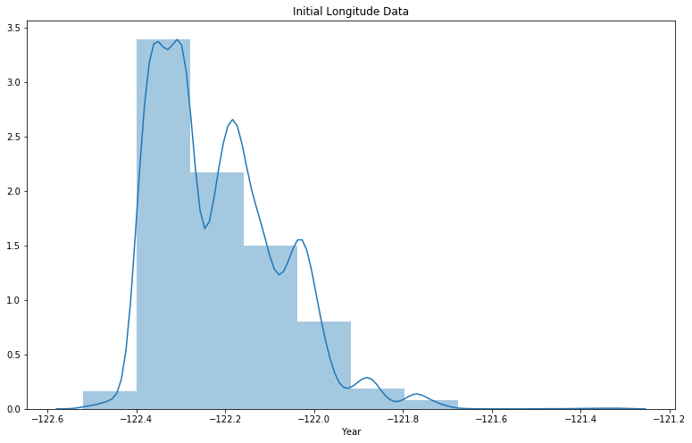


#### zone
Creates equal spaced zone boxes accross the latitude and longitude ranges of the dataset.


```python
a = np.array(range(1,50+1))* (data.lat.max()-data.lat.min())/ 50+ data.lat.min()
a[0]= a[0]-1
data['bin_lat'] = binning(data.lat, a)
data['bin_lat']  = data['bin_lat'].astype(str)
data['bin_lat'] = data['bin_lat'].fillna('1')
print ( a[1],',',  a[2],'The length of box latitude', a[2]-a[1])
# Each bin is 0.86 miles long.


a = np.array(range(1,50+1))* (data.long.max()-data.long.min())/ 50+ data.long.min()
a[0]= a[0]-1
data['bin_long'] = binning(data.long, a)
data['bin_long'] = data['bin_long'].astype(str)
data['bin_long'] = data['bin_long'].fillna('1')
print ( a[1],',', a[2],',The length of box longitude', a[2]-a[1])
# Each bins is 1.131 miles long.
print(1.131* .86,' sq miles bins')
a = convert_cat_str_to_num(data['bin_lat'])
b = convert_cat_str_to_num(data['bin_long'])
data['zone'] = b*100 + a
#multipling longitude bin number by 100 and add to latitude bin 
#to create unique bin number for zone
```

    47.180768 , 47.193202 The length of box latitude 0.012433999999998946
    -122.47084 , -122.44676 ,The length of box longitude 0.02407999999999788
    0.97266  sq miles bins
    


```python

data.plot.hexbin(x='long', y='lat', C='zone', figsize=(20, 20))
```


    <matplotlib.axes._subplots.AxesSubplot at 0x1803dc7db38>


```python
a= data.groupby(['zone'])['price'].mean()
data['zone_mean'] = data.zone.apply(lambda x: a[x])
scat_plot(data, 'zone_mean')
data['log_zone_mean'] = np.log(data['zone_mean'])

data['min_max_zone_mean'] = min_max(dataseries=data.zone_mean)

```


```python
a= data.groupby(['zone'])['price'].quantile(.95)
data['zone_95q'] = data.zone.apply(lambda x: a[x])
scat_plot(data, 'zone_95q')
```


```python
data['log_zone_95q'] = np.log(data['zone_95q'])
```


```python
a= data.groupby(['zone'])['price'].max()
data['zone_max'] = data.zone.apply(lambda x: a[x])
scat_plot(data, 'zone_max')


```


```python
a= data.groupby(['zone'])['price'].count()
data['zone_count'] = data.zone.apply(lambda x: a[x])
```


```python

a= data.groupby(['zone'])['price_per_sqft_living'].mean()
data['zone_price_sqft_living'] = data.zone.apply(lambda x: a[x])
scat_plot(data, 'zone_price_sqft_living')

```


#### sqft_living15
The square footage of interior housing living space for the nearest 15 neighbors. The range is 399 to 6210 sq ft


```python
plt.figure(figsize= (13, 8))
sns.distplot(data.sqft_living15, bins=100)
plt.title('Initial Living Space of Neighbors Data');
plt.xlabel('Year');
```


```python
scat_plot(data, 'sqft_living15')
```


```python
data.sqft_living15.describe()
sns.violinplot(x= binning(data.sqft_living15, [398, 1490, 1840, 2360, 6210]), y= data.price);
```


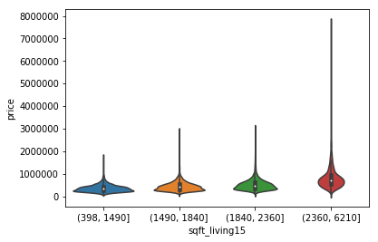


#### sqft_lot15
The square footage of the land lots of the nearest 15 neighbors. The range is 651 to 871,200 sq ft.


```python
plt.figure(figsize= (13, 8))
sns.distplot(data.sqft_lot15, bins=100)
plt.title('Initial Living Space of Neighbors Data');
plt.xlabel('Year');
```


```python

viol2(binning(data.sqft_lot15, equal_bin(data.sqft_lot15)), data.price)


```


#### change_date  (flip)


```python
plt.figure(figsize= (13, 8))
sns.distplot(flip.change_date, bins=30);


```


#### month

January = 1, February = 2, ... 


```python
plt.figure(figsize= (13, 8))
sns.violinplot(x= data.month, y= data.price);
```


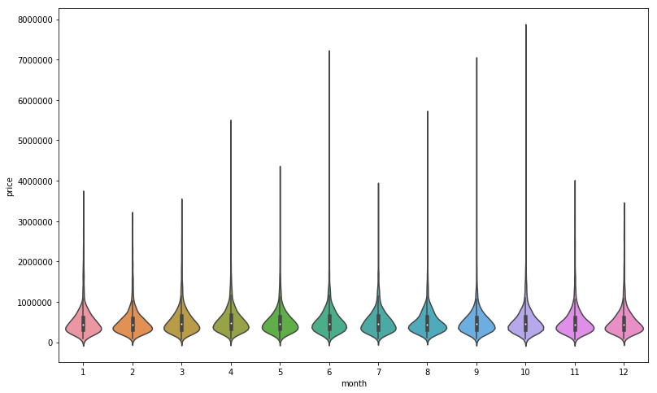


```python
plt.figure(figsize= (13, 8))
data[['zone', 'price', 'month']].groupby('month').quantile(.95).mean()
```


    0.95
    price    1.146417e+06
    zone     2.201550e+03
    dtype: float64


    <Figure size 936x576 with 0 Axes>


```python

```


```python

```


```python
plt.figure(figsize= (13, 8))
a = data.month.value_counts()
a.sort_index().plot(kind= 'barh');
plt.ylabel('Count');
```


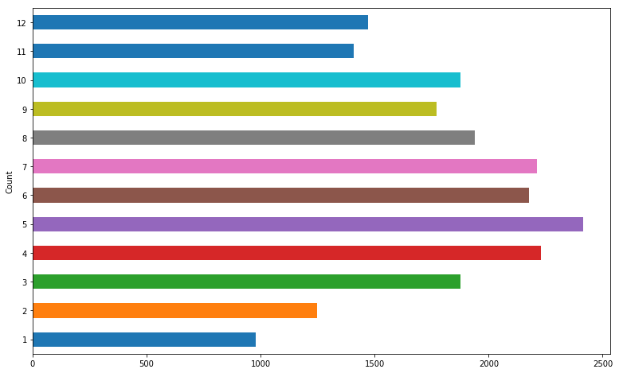


```python
data['log_grade'] = np.log(data["grade"])

```

#### Creating a Possible Flipped Sale Database
We identified 177 resales of property that were sold in the period of study. We two meanful features:
<ul>
    <li>change_date  The days between sales.</li>
    <li>change_price The cost differential between the previous sale and current sale pric</li>
</ul>

Condition and grade were examined, but there was no change between any of the sales. 


```python
multiple = data.id.value_counts()
len(multiple.loc[multiple > 1])
resales = len(multiple.loc[multiple > 1])
# 176, The number of time a home has been resold in the time period.
resales/ len(data.id)
# Far less then 1% of homes have been sold in the time period.
multiple = multiple.loc[multiple > 1]
multiple = multiple.to_dict()
data['num_sales'] = data.id.map(multiple)
data['num_sales'] = data['num_sales'].fillna(1)
flip = data.loc[data.num_sales > 1]
data = data.drop(columns= 'num_sales')
flip = flip.sort_values('date')

# adding new column examine. 
flip['change_date'] = flip_diff(flip, 'date')

#flip = flip.change_date.apply(lambda x: x.days)      

flip['change_price'] = flip_diff(flip, 'price')

# Removing initial sales
flip = flip.dropna()

# converting timedelta to days
flip.change_date = flip.change_date.apply(lambda x: x.days)

# 
flip['percent_change'] = flip.change_price/(flip.price- flip.change_price)

```


```python
scat_plot(flip, 'percent_change')
```


```python
data['scaled_log_grade'] = (data['log_grade']-np.mean(data['log_grade']))/np.sqrt(np.var(data['log_grade']))

```


```python
scat_plot(data, 'scaled_log_grade')
```


```python
sns.violinplot(x = (1 *(data.price > data.zone_95q)), y = data.price)

a = 1 *(data.price > data.zone_95q)
a.sum()/len(data)

```


    0.0682039172107237


```python

```

### Exploration (Analysis)

#### Confusion Matrix


```python
make_heatmap(data=data, figsize=(20, 20))
```


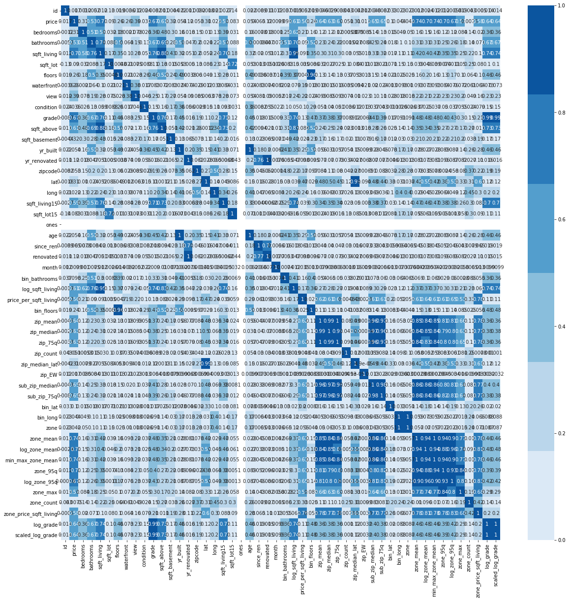


```python
data.corr().price.abs().sort_values(ascending= False)

```


    price                     1.000000
    min_max_zone_mean         0.739220
    zone_mean                 0.739220
    sqft_living               0.701917
    log_zone_mean             0.697515
    zone_95q                  0.696062
    log_zone_95q              0.668947
    grade                     0.667951
    sub_zip_75q               0.651066
    sub_zip_median            0.647361
    zip_mean                  0.638168
    scaled_log_grade          0.635153
    log_grade                 0.635153
    zip_75q                   0.634993
    zip_median                0.632561
    log_sqft_living           0.611839
    sqft_above                0.605368
    sqft_living15             0.585241
    zone_price_sqft_living    0.575843
    zone_max                  0.568236
    price_per_sqft_living     0.556056
    bathrooms                 0.525906
    view                      0.393497
    sqft_basement             0.321108
    zip_median_lat            0.310784
    bedrooms                  0.308787
    lat                       0.306692
    waterfront                0.264306
    floors                    0.256804
    bin_floors                0.237264
    yr_renovated              0.117855
    renovated                 0.117543
    bin_lat                   0.102327
    bin_bathrooms             0.097678
    sqft_lot                  0.089876
    sqft_lot15                0.082845
    since_ren                 0.064950
    age                       0.053953
    yr_built                  0.053953
    zipcode                   0.053402
    zip_count                 0.050969
    bin_long                  0.043968
    zone                      0.042110
    condition                 0.036056
    long                      0.022036
    zip_EW                    0.017120
    id                        0.016772
    month                     0.009928
    zone_count                0.007547
    ones                           NaN
    Name: price, dtype: float64


#### Scatter Matrix
Because living space is the most correlated variable, we going to start OLS with sqft_living and add to the OLS going down the correlation list above.  

#### Modeling / Cross Validation


```python
test= pd.DataFrame()
```


```python
make_ols_model1(df=data, target='price', columns_to_use='sqft_living' , add_constant=True);
```

#### Data OLS Test 1
<ul>
    <li>R squared is low</li>
    <li>cond no. is high. I will remove constant to see if the improves.</li>
<ul>


```python
make_ols_model1(df=data, target='price', columns_to_use='sqft_living' , add_constant=False);
```

#### Data OLS Test 2
<ul>
    <li>R squared improved</li>
    <li>Linearity good (only variable).</li>
    <li>Skewness is a problem. -Will try log transform.</li>
<ul>


```python
data['log_sqft_living'] = np.log(data["sqft_living"])
```


```python
make_ols_model(df=data, target='price', columns_to_use='log_sqft_living' , add_constant=False)
```

                                OLS Regression Results                            
    ==============================================================================
    Dep. Variable:                  price   R-squared:                       0.714
    Model:                            OLS   Adj. R-squared:                  0.714
    Method:                 Least Squares   F-statistic:                 5.390e+04
    Date:                Mon, 07 Oct 2019   Prob (F-statistic):               0.00
    Time:                        16:38:16   Log-Likelihood:            -3.0631e+05
    No. Observations:               21597   AIC:                         6.126e+05
    Df Residuals:                   21596   BIC:                         6.126e+05
    Df Model:                           1                                         
    Covariance Type:            nonrobust                                         
    ===================================================================================
                          coef    std err          t      P>|t|      [0.025      0.975]
    -----------------------------------------------------------------------------------
    log_sqft_living    7.3e+04    314.426    232.161      0.000    7.24e+04    7.36e+04
    ==============================================================================
    Omnibus:                    19995.129   Durbin-Watson:                   1.967
    Prob(Omnibus):                  0.000   Jarque-Bera (JB):          1400805.293
    Skew:                           4.276   Prob(JB):                         0.00
    Kurtosis:                      41.517   Cond. No.                         1.00
    ==============================================================================
    
    Warnings:
    [1] Standard Errors assume that the covariance matrix of the errors is correctly specified.
    


    (<statsmodels.regression.linear_model.OLS at 0x1803f6f49b0>,
     <statsmodels.regression.linear_model.RegressionResultsWrapper at 0x1803d8530b8>)


#### Data OLS Test 3

<ul>
    <li>R squared better</li>
    <li>Linearity good (only variable).</li>
    <li>Adding grade</li>
<ul>


```python
columns= ['log_sqft_living', 'grade']
make_ols_model1(df=data, target='price', columns_to_use=columns, add_constant=False)
```


    (<statsmodels.regression.linear_model.OLS at 0x1803f3fa668>,
     <statsmodels.regression.linear_model.RegressionResultsWrapper at 0x1803f3fa828>)


#### Data OLS Test 4
<ul>
    <li>R squared better</li>
    <li>Linearity good.</li>
    <li>Normality is better, but not good.</li>
    <li>Skewing got worst but only by a little. Will try log transform.</li>
</ul>


```python
data['log_grade'] = np.log(data["grade"])
columns= ['log_sqft_living', 'log_grade']
make_ols_model1(df=data, target='price', columns_to_use=columns, add_constant=False);
```

#### Data OLS Test 5

<ul>
    <li>R squared worse</li>
    <li>Linearity good</li>
    <li>Skewing got better. -Adding basementsqft</li>
</ul>


```python

columns= ['log_sqft_living', 'log_grade', 'sqft_basement']
make_ols_model1(df=data, target='price', columns_to_use=columns, add_constant=False);
```

#### Data OLS Test 8

<ul>
    <li>R squared worse</li>
    <li>Linearity got worse</li>
    <li>Skewing got better. -Will make basement a categorical feature</li>
</ul>


```python
data['basement'] = data.sqft_basement.replace(to_replace= 0, value= np.nan)
data.basement = data.basement/data.basement
data.basement = data.basement.fillna(0)
columns= ['log_sqft_living', 'log_grade', 'basement']
make_ols_model1(df=data, target='price', columns_to_use=columns, add_constant=False);
```

#### Data OLS Test 9
<ul>
    <li>R squared better</li>
    <li>Linearity better</li>
    <li>Normality is worse.</li>
    <li>Skewing got worst but only by a little. -Taking out basement and add lat next</li>
</ul>


```python

columns= ['log_sqft_living', 'grade', 'lat']

ols, results = make_ols_model1(df=data, target='price', columns_to_use=columns, add_constant=False)


```

#### Data OLS Test 10
<ul>
    <li>R squared better</li>
    <li>Skewing got worst but only by a little. -Try log transform</li>
</ul>


```python
data['log_lat'] = np.log(data.lat)
columns= ['log_sqft_living', 'log_grade', 'log_lat']
ols, results = make_ols_model1(df=data, target='price', columns_to_use=columns, add_constant=False)
```

#### Data OLS Test 11
<ul>
    <li>R squared worse</li>
    <li>I going to see if we can create better location feature. Going to replace lat with zip_mean.</li>
<ul>


```python
columns= ['log_sqft_living', 'grade', 'zip_mean']
ols, results = make_ols_model(df=data, target='price', columns_to_use=columns, add_constant=False)
tests= [results.rsquared, results.condition_number]
plt.figure(figsize= (13,8))
sns.distplot(results.resid, bins=100)
plt.title('Model Residual Dis');
```

                                OLS Regression Results                            
    ==============================================================================
    Dep. Variable:                  price   R-squared:                       0.861
    Model:                            OLS   Adj. R-squared:                  0.861
    Method:                 Least Squares   F-statistic:                 4.457e+04
    Date:                Mon, 07 Oct 2019   Prob (F-statistic):               0.00
    Time:                        16:38:16   Log-Likelihood:            -2.9852e+05
    No. Observations:               21597   AIC:                         5.970e+05
    Df Residuals:                   21594   BIC:                         5.971e+05
    Df Model:                           3                                         
    Covariance Type:            nonrobust                                         
    ===================================================================================
                          coef    std err          t      P>|t|      [0.025      0.975]
    -----------------------------------------------------------------------------------
    log_sqft_living -1.459e+05   1886.642    -77.333      0.000    -1.5e+05   -1.42e+05
    grade             1.65e+05   1929.936     85.500      0.000    1.61e+05    1.69e+05
    zip_mean            0.7104      0.008     93.239      0.000       0.695       0.725
    ==============================================================================
    Omnibus:                    23252.829   Durbin-Watson:                   1.976
    Prob(Omnibus):                  0.000   Jarque-Bera (JB):          4402774.802
    Skew:                           5.133   Prob(JB):                         0.00
    Kurtosis:                      72.190   Cond. No.                     9.48e+05
    ==============================================================================
    
    Warnings:
    [1] Standard Errors assume that the covariance matrix of the errors is correctly specified.
    [2] The condition number is large, 9.48e+05. This might indicate that there are
    strong multicollinearity or other numerical problems.
    


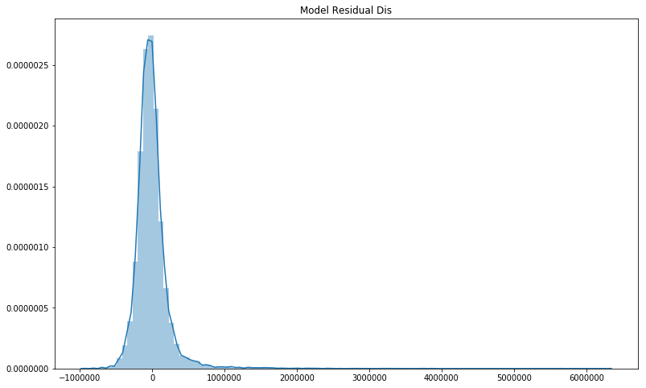


#### OLS Test 12
<ul>
    <li>R squared worst than test 9</li>
    <li>Cond. No. is out of control.</li>
<ul>


```python

columns= ['log_sqft_living', 'grade', 'zip_median']
ols, results = make_ols_model(df=data, target='price', columns_to_use=columns, add_constant=False)
tests= [results.rsquared, results.condition_number]
```

                                OLS Regression Results                            
    ==============================================================================
    Dep. Variable:                  price   R-squared:                       0.857
    Model:                            OLS   Adj. R-squared:                  0.857
    Method:                 Least Squares   F-statistic:                 4.326e+04
    Date:                Mon, 07 Oct 2019   Prob (F-statistic):               0.00
    Time:                        16:38:17   Log-Likelihood:            -2.9880e+05
    No. Observations:               21597   AIC:                         5.976e+05
    Df Residuals:                   21594   BIC:                         5.976e+05
    Df Model:                           3                                         
    Covariance Type:            nonrobust                                         
    ===================================================================================
                          coef    std err          t      P>|t|      [0.025      0.975]
    -----------------------------------------------------------------------------------
    log_sqft_living -1.484e+05   1910.590    -77.664      0.000   -1.52e+05   -1.45e+05
    grade            1.653e+05   1959.721     84.372      0.000    1.62e+05    1.69e+05
    zip_median          0.8232      0.009     89.032      0.000       0.805       0.841
    ==============================================================================
    Omnibus:                    23269.273   Durbin-Watson:                   1.973
    Prob(Omnibus):                  0.000   Jarque-Bera (JB):          4298977.267
    Skew:                           5.150   Prob(JB):                         0.00
    Kurtosis:                      71.346   Cond. No.                     8.43e+05
    ==============================================================================
    
    Warnings:
    [1] Standard Errors assume that the covariance matrix of the errors is correctly specified.
    [2] The condition number is large, 8.43e+05. This might indicate that there are
    strong multicollinearity or other numerical problems.
    

#### Test 13
Not much better than test 14. - tray higher quantile


```python
columns= ['log_sqft_living', 'grade', 'zip_75q']
ols, results = make_ols_model(df=data, target='price', columns_to_use=columns, add_constant=False)
tests= [results.rsquared, results.condition_number]

```

                                OLS Regression Results                            
    ==============================================================================
    Dep. Variable:                  price   R-squared:                       0.861
    Model:                            OLS   Adj. R-squared:                  0.861
    Method:                 Least Squares   F-statistic:                 4.468e+04
    Date:                Mon, 07 Oct 2019   Prob (F-statistic):               0.00
    Time:                        16:38:17   Log-Likelihood:            -2.9850e+05
    No. Observations:               21597   AIC:                         5.970e+05
    Df Residuals:                   21594   BIC:                         5.970e+05
    Df Model:                           3                                         
    Covariance Type:            nonrobust                                         
    ===================================================================================
                          coef    std err          t      P>|t|      [0.025      0.975]
    -----------------------------------------------------------------------------------
    log_sqft_living -1.442e+05   1885.103    -76.487      0.000   -1.48e+05    -1.4e+05
    grade            1.656e+05   1925.442     86.020      0.000    1.62e+05    1.69e+05
    zip_75q             0.5924      0.006     93.588      0.000       0.580       0.605
    ==============================================================================
    Omnibus:                    23249.600   Durbin-Watson:                   1.975
    Prob(Omnibus):                  0.000   Jarque-Bera (JB):          4426611.769
    Skew:                           5.130   Prob(JB):                         0.00
    Kurtosis:                      72.382   Cond. No.                     1.09e+06
    ==============================================================================
    
    Warnings:
    [1] Standard Errors assume that the covariance matrix of the errors is correctly specified.
    [2] The condition number is large, 1.09e+06. This might indicate that there are
    strong multicollinearity or other numerical problems.
    

#### Test 14 
Better than 13. 

Linearity is still problem


```python
columns= ['log_sqft_living', 'grade', 'sub_zip_median' ]
ols, results = make_ols_model(df=data, target='price', columns_to_use=columns, add_constant=False)
tests= [results.rsquared, results.condition_number]

```

                                OLS Regression Results                            
    ==============================================================================
    Dep. Variable:                  price   R-squared:                       0.860
    Model:                            OLS   Adj. R-squared:                  0.860
    Method:                 Least Squares   F-statistic:                 4.411e+04
    Date:                Mon, 07 Oct 2019   Prob (F-statistic):               0.00
    Time:                        16:38:17   Log-Likelihood:            -2.9862e+05
    No. Observations:               21597   AIC:                         5.972e+05
    Df Residuals:                   21594   BIC:                         5.973e+05
    Df Model:                           3                                         
    Covariance Type:            nonrobust                                         
    ===================================================================================
                          coef    std err          t      P>|t|      [0.025      0.975]
    -----------------------------------------------------------------------------------
    log_sqft_living -1.427e+05   1896.087    -75.287      0.000   -1.46e+05   -1.39e+05
    grade            1.598e+05   1958.203     81.630      0.000    1.56e+05    1.64e+05
    sub_zip_median      0.8146      0.009     91.797      0.000       0.797       0.832
    ==============================================================================
    Omnibus:                    23596.770   Durbin-Watson:                   1.975
    Prob(Omnibus):                  0.000   Jarque-Bera (JB):          4618311.007
    Skew:                           5.262   Prob(JB):                         0.00
    Kurtosis:                      73.862   Cond. No.                     8.59e+05
    ==============================================================================
    
    Warnings:
    [1] Standard Errors assume that the covariance matrix of the errors is correctly specified.
    [2] The condition number is large, 8.59e+05. This might indicate that there are
    strong multicollinearity or other numerical problems.
    

#### OLS Test 15
Not good. -Will go back to Test 10, and examine residuals


```python

columns= ['log_sqft_living', 'grade']

ols, results = make_ols_model(df=data, target='price', columns_to_use=columns, add_constant=False)
plt.figure(figsize= (13,8))
sns.distplot(results.resid, bins=100)
plt.title('Model Residual Dis');
```

                                OLS Regression Results                            
    ==============================================================================
    Dep. Variable:                  price   R-squared:                       0.805
    Model:                            OLS   Adj. R-squared:                  0.805
    Method:                 Least Squares   F-statistic:                 4.457e+04
    Date:                Mon, 07 Oct 2019   Prob (F-statistic):               0.00
    Time:                        16:38:17   Log-Likelihood:            -3.0217e+05
    No. Observations:               21597   AIC:                         6.044e+05
    Df Residuals:                   21595   BIC:                         6.044e+05
    Df Model:                           2                                         
    Covariance Type:            nonrobust                                         
    ===================================================================================
                          coef    std err          t      P>|t|      [0.025      0.975]
    -----------------------------------------------------------------------------------
    log_sqft_living -1.498e+05   2233.777    -67.044      0.000   -1.54e+05   -1.45e+05
    grade            2.189e+05   2180.541    100.404      0.000    2.15e+05    2.23e+05
    ==============================================================================
    Omnibus:                    19949.996   Durbin-Watson:                   1.973
    Prob(Omnibus):                  0.000   Jarque-Bera (JB):          1905587.098
    Skew:                           4.135   Prob(JB):                         0.00
    Kurtosis:                      48.268   Cond. No.                         17.2
    ==============================================================================
    
    Warnings:
    [1] Standard Errors assume that the covariance matrix of the errors is correctly specified.
    


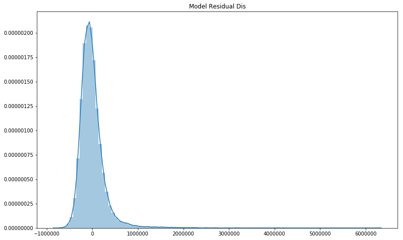


Residual is very skewed to the lower end. 


```python
len(a.loc[a.abs() > 2])/len(a)
```


    0.0


#### OLS Test 16
-will add zone_mean- Binned values of lat and long (quantities in each bin) with the mean of the sales price in the area

##### Residual Check 1
Around 3% of the residuals are outside of 2 standard deviations . I will check the model to see if the regression improves.


```python
columns= ['log_sqft_living', 'grade', 'zone_mean']

ols, results = make_ols_model(df=data, target='price', columns_to_use=columns, add_constant=False)
plt.figure(figsize= (13,8))
sns.distplot(results.resid, bins=100)
plt.title('Model Residual Dis');
```

                                OLS Regression Results                            
    ==============================================================================
    Dep. Variable:                  price   R-squared:                       0.884
    Model:                            OLS   Adj. R-squared:                  0.884
    Method:                 Least Squares   F-statistic:                 5.480e+04
    Date:                Mon, 07 Oct 2019   Prob (F-statistic):               0.00
    Time:                        16:38:18   Log-Likelihood:            -2.9657e+05
    No. Observations:               21597   AIC:                         5.932e+05
    Df Residuals:                   21594   BIC:                         5.932e+05
    Df Model:                           3                                         
    Covariance Type:            nonrobust                                         
    ===================================================================================
                          coef    std err          t      P>|t|      [0.025      0.975]
    -----------------------------------------------------------------------------------
    log_sqft_living -1.139e+05   1748.673    -65.161      0.000   -1.17e+05   -1.11e+05
    grade            1.295e+05   1837.322     70.467      0.000    1.26e+05    1.33e+05
    zone_mean           0.7659      0.006    121.165      0.000       0.754       0.778
    ==============================================================================
    Omnibus:                    23764.487   Durbin-Watson:                   1.986
    Prob(Omnibus):                  0.000   Jarque-Bera (JB):          5839291.087
    Skew:                           5.241   Prob(JB):                         0.00
    Kurtosis:                      82.870   Cond. No.                     1.00e+06
    ==============================================================================
    
    Warnings:
    [1] Standard Errors assume that the covariance matrix of the errors is correctly specified.
    [2] The condition number is large,  1e+06. This might indicate that there are
    strong multicollinearity or other numerical problems.
    


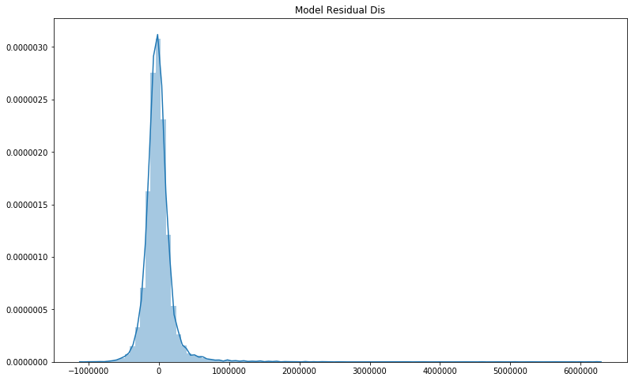


```python
a=results.resid/results.resid.std()
a = a.loc[a.abs() > 2]
len(a)/len(results.resid)
```


    0.03273602815205816


```python
 
for col in ['price',
    'log_zone_mean',
    'zone_mean', 
    'log_sqft_living',
    'sqft_living',
    'grade',
    'log_grade',
    'bedrooms', 
    'bathrooms',
    'sqft_lot',
    'floors',
    'waterfront',
    'view',
    'condition',
    'sqft_above',
    'sqft_basement',
    'yr_built',
    'yr_renovated',
    'sqft_living15',
    'sqft_lot15',
    'age',
    'since_ren',
    'renovated',
    'month',
    'basement',
    'log_lat',
    'zip_mean',
    'zip_median',
    'zip_75q',
    'sub_zip_median',
    'sub_zip_75q']:
    resd_check(results, data, col)
```


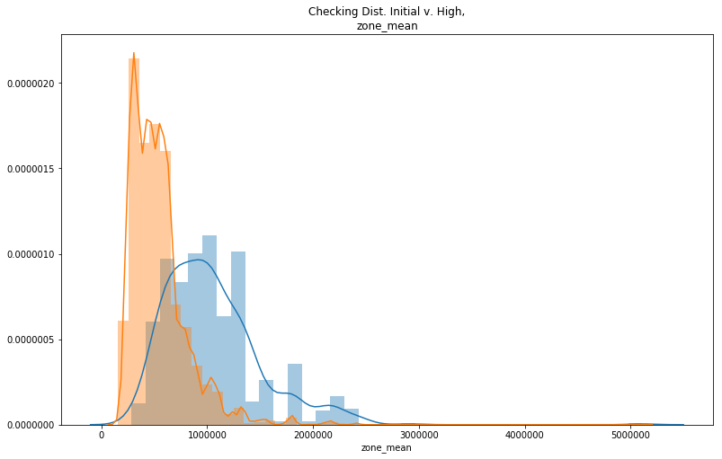


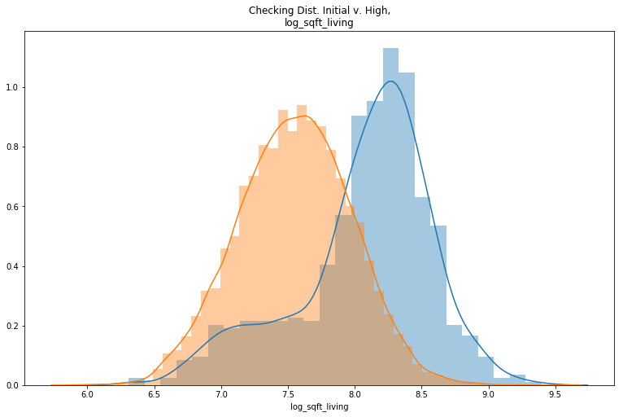


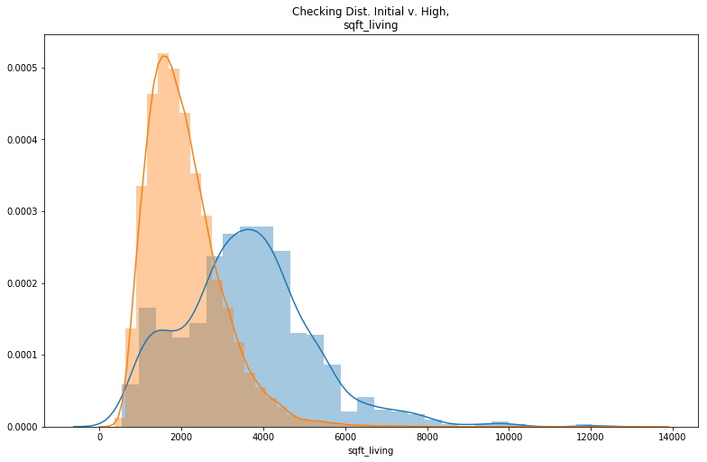


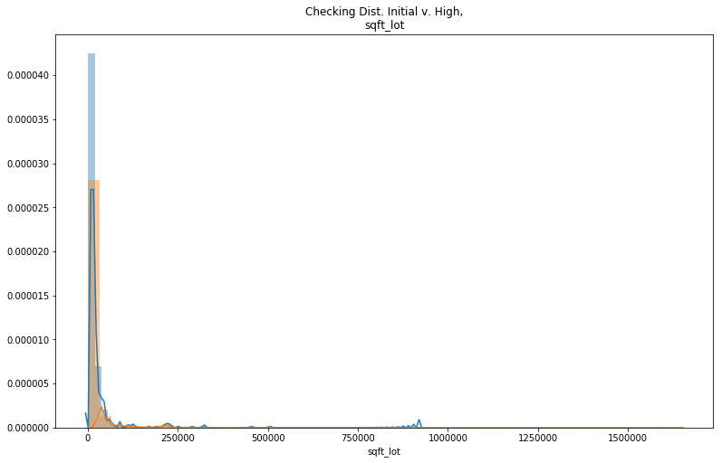


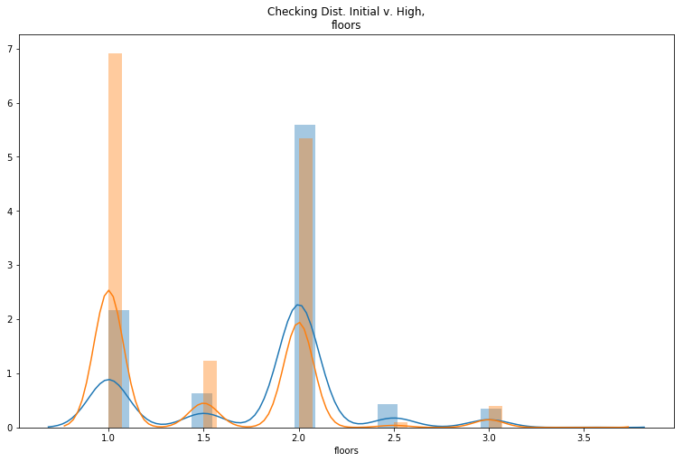


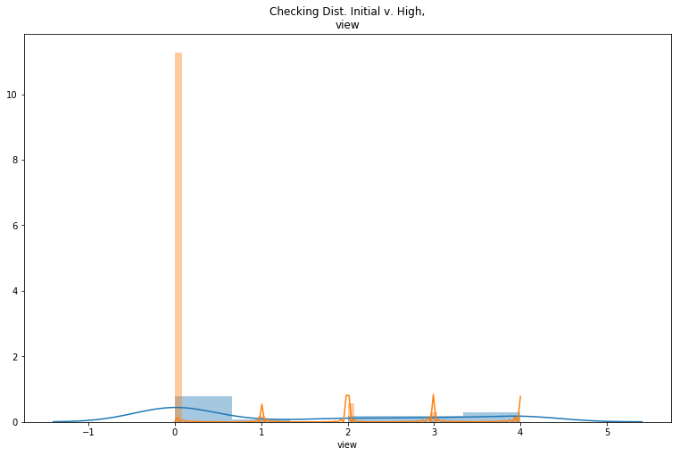


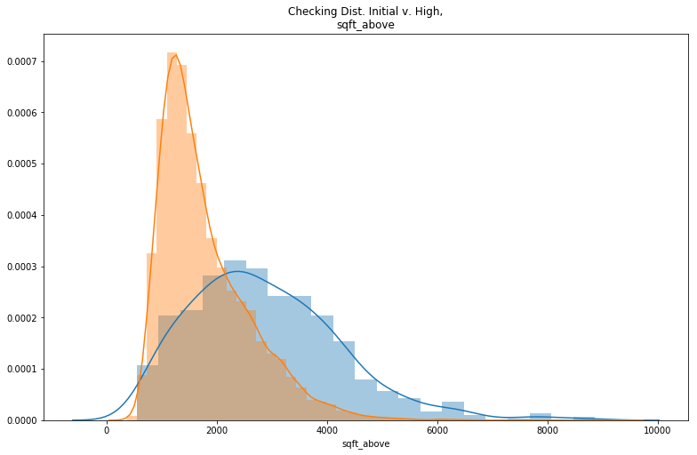


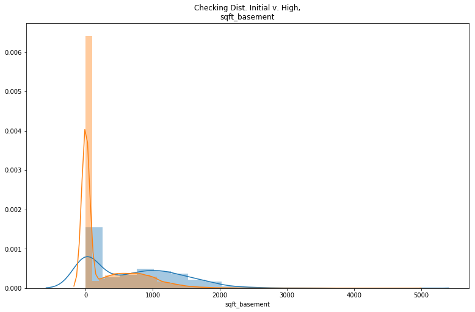


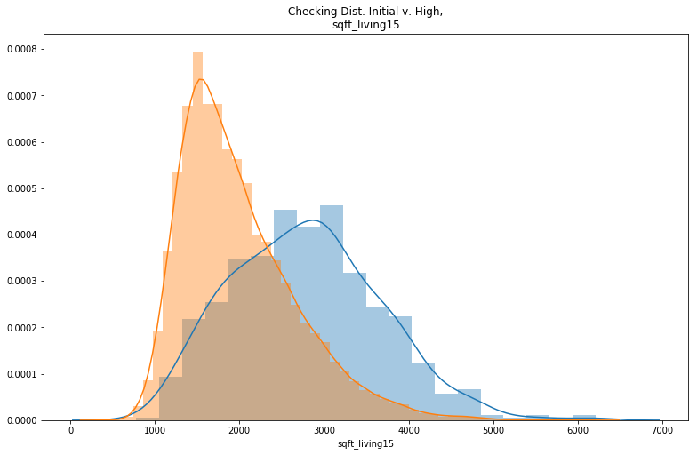


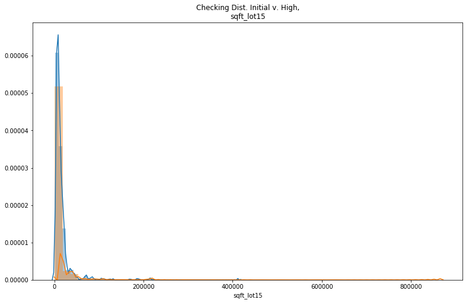


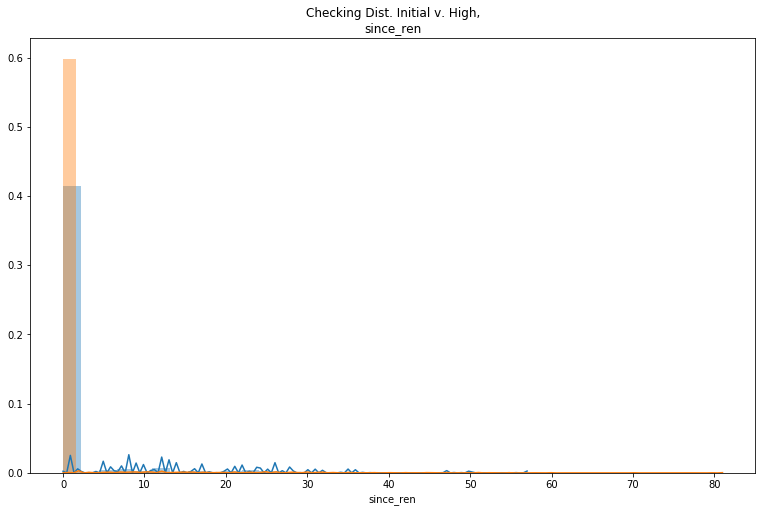


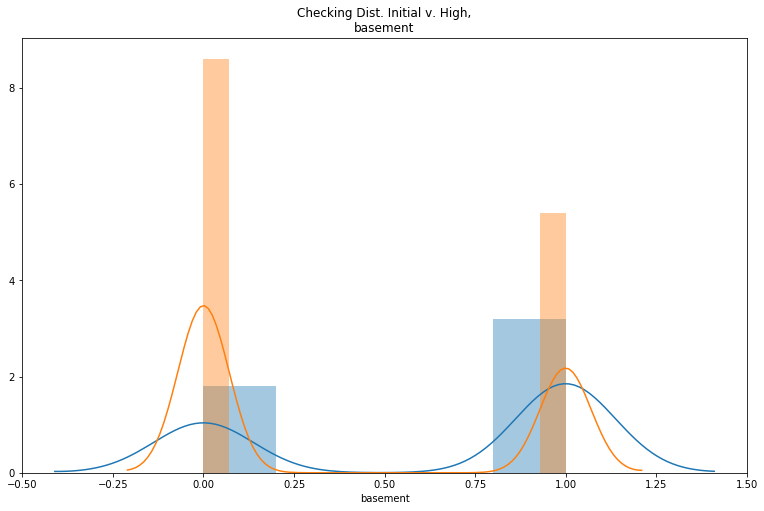


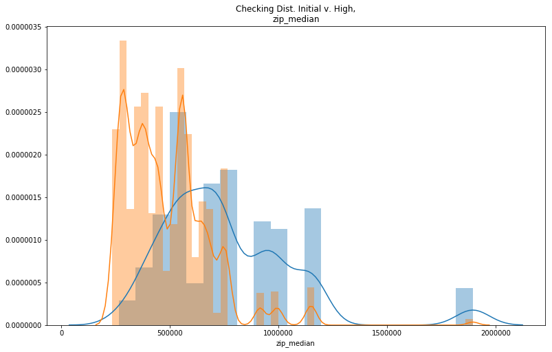


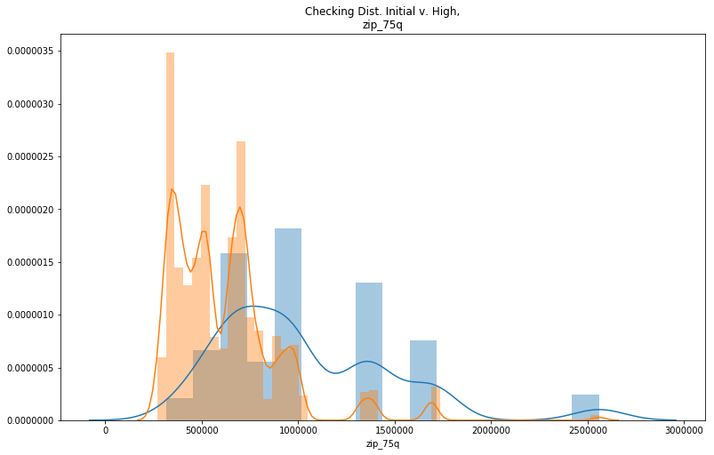


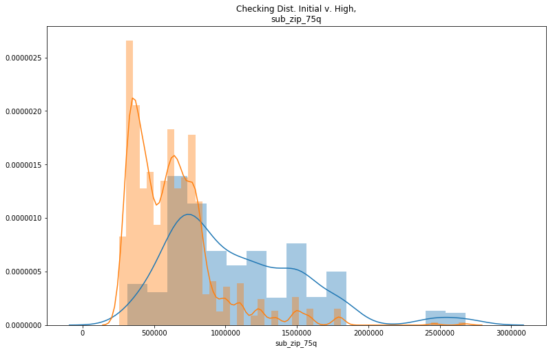


#### OLS Test 17
-will log transform  zone_mean

##### Residual Check 1
Around 3% of the residuals are outside of 2 standard deviations . I will check the model to see if the regression improves.


```python
columns= ['log_sqft_living', 'grade', 'log_zone_mean']

ols, results = make_ols_model(df=data, target='price', columns_to_use=columns, add_constant=False)
plt.figure(figsize= (13,8))
sns.distplot(results.resid, bins=100)
plt.title('Model Residual Dis');
```

                                OLS Regression Results                            
    ==============================================================================
    Dep. Variable:                  price   R-squared:                       0.805
    Model:                            OLS   Adj. R-squared:                  0.805
    Method:                 Least Squares   F-statistic:                 2.972e+04
    Date:                Mon, 07 Oct 2019   Prob (F-statistic):               0.00
    Time:                        16:38:31   Log-Likelihood:            -3.0217e+05
    No. Observations:               21597   AIC:                         6.043e+05
    Df Residuals:                   21594   BIC:                         6.044e+05
    Df Model:                           3                                         
    Covariance Type:            nonrobust                                         
    ===================================================================================
                          coef    std err          t      P>|t|      [0.025      0.975]
    -----------------------------------------------------------------------------------
    log_sqft_living -1.351e+05   5937.652    -22.754      0.000   -1.47e+05   -1.23e+05
    grade            2.176e+05   2240.300     97.113      0.000    2.13e+05    2.22e+05
    log_zone_mean   -7662.4648   2876.198     -2.664      0.008   -1.33e+04   -2024.904
    ==============================================================================
    Omnibus:                    19902.190   Durbin-Watson:                   1.973
    Prob(Omnibus):                  0.000   Jarque-Bera (JB):          1886354.554
    Skew:                           4.121   Prob(JB):                         0.00
    Kurtosis:                      48.037   Cond. No.                         57.4
    ==============================================================================
    
    Warnings:
    [1] Standard Errors assume that the covariance matrix of the errors is correctly specified.
    


#### Test 18
Linearity good. R squared acceptable. Take out outilier (3%) shouold get better.

Going to min_max scale the log_zone_mean


```python
for col in ['price',
'zone_mean', 
'sqft_living',
'grade',
'bedrooms', 
'bathrooms',
'sqft_lot',
'floors',
'waterfront',
'view',
'condition',
'sqft_above',
'sqft_basement',
'yr_built',
'yr_renovated',
'sqft_living15',
'sqft_lot15',
'age',
'since_ren',
'renovated',
'month',
'basement',
'sub_zip_median',
'sub_zip_75q']:
    resd_check(results, data, col)
```


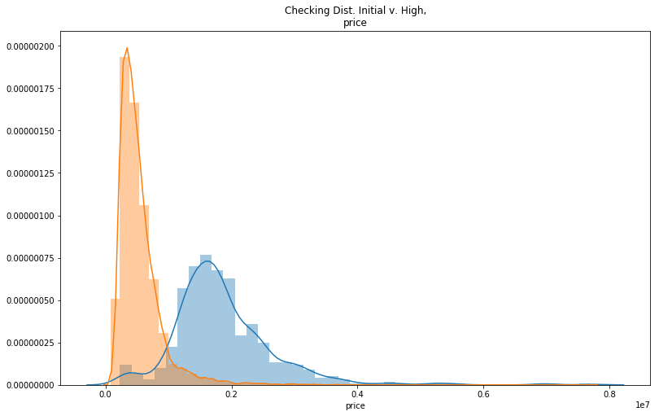


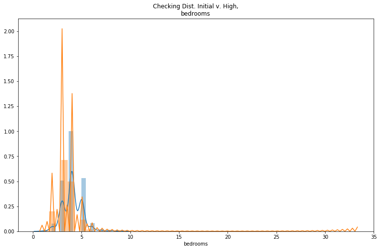


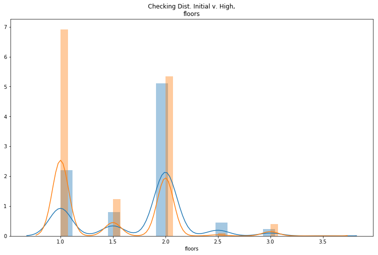


```python
sns.distplot(min_max(data.log_zone_mean))
data['min_max_log_zone_mean'] =min_max(data.log_zone_mean)

```


```python
columns= ['log_sqft_living', 'grade', 'min_max_log_zone_mean']

ols, results = make_ols_model(df=data, target='price', columns_to_use=columns, add_constant=False)
plt.figure(figsize= (13,8))
sns.distplot(results.resid, bins=100)
plt.title('Model Residual Dis');
```

#### Test 19
Going to min_max scale the grade


```python
data['min_max_grade'] = min_max(data.grade)
```


```python
sns.distplot(min_max(data.grade))

```


```python
columns= ['log_sqft_living', 'min_max_grade', 'min_max_log_zone_mean']

ols, results = make_ols_model1(df=data, target='price', columns_to_use=columns, add_constant=False)
plt.figure(figsize= (13,8))
sns.distplot(results.resid, bins=100)
plt.title('Model Residual Dis');
data['residual'] = results.resid
keep_data = data.loc[data.residual.abs() <= data.residual.std()*2] # removed anything above 3 std deviation in the residuals. 
removed_data = data.loc[data.residual.abs() > data.residual.std()*2]  
```


```python
for col in ['price',
'zone_mean', 
'sqft_living',
'grade',
'bedrooms', 
'bathrooms',
'sqft_lot',
'floors',
'waterfront',
'view',
'condition',
'sqft_above',
'sqft_basement',
'yr_built',
'yr_renovated',
'sqft_living15',
'sqft_lot15',
'age',
'since_ren',
'renovated',
'month',
'basement',
'sub_zip_median',
'sub_zip_75q']:
    resd_check(results, data, col)
```

#### Test 20
Adding waterfront


```python
columns= ['log_sqft_living', 'min_max_grade', 'min_max_log_zone_mean', 'waterfront']

ols, results = make_ols_model1(df=data, target='price', columns_to_use=columns, add_constant=False)
plt.figure(figsize= (13,8))
sns.distplot(results.resid, bins=100)
plt.title('Model Residual Dis');
data['residual'] = results.resid
keep_data = data.loc[data.residual.abs() <= data.residual.std()*2] # removed anything above 3 std deviation in the residuals. 
removed_data = data.loc[data.residual.abs() > data.residual.std()*2]  
```


```python
for col in ['price',
'zone_mean', 
'sqft_living',
'grade',
'bedrooms', 
'bathrooms',
'sqft_lot',
'floors',
'waterfront',
'view',
'condition',
'sqft_above',
'sqft_basement',
'yr_built',
'yr_renovated',
'sqft_living15',
'sqft_lot15',
'age',
'since_ren',
'renovated',
'month',
'basement',
'sub_zip_median',
'sub_zip_75q']:
    resd_check(results, data, col)
```

#### OLS Test 21

#### Separating  residual


```python
data['residual'] = results.resid
keep_data = data.loc[data.residual.abs() <= data.residual.std()*2] # removed anything above 3 std deviation in the residuals. 
removed_data = data.loc[data.residual.abs() > data.residual.std()*2]  
```

#### New Variable high_grade
Binary variable for grades with that have removed residual percentages in the last model (3 and grades over 11) other grades recieved a one.


```python
data['high_grade'] = data.grade
data.high_grade.loc[(data.high_grade <12) & (data.high_grade > 3)] = 1
data.high_grade.loc[(data.high_grade >= 12) | (data.high_grade == 3)] = 0
```


```python
columns= ['log_sqft_living', 'min_max_grade', 'min_max_log_zone_mean', 'waterfront', 'high_grade']

ols, results = make_ols_model1(df=data, target='price', columns_to_use=columns, add_constant=False)
plt.figure(figsize= (13,8))
sns.distplot(results.resid, bins=100)
plt.title('Model Residual Dis');
data['residual'] = results.resid
keep_data = data.loc[data.residual.abs() <= data.residual.std()*2] # removed anything above 3 std deviation in the residuals. 
removed_data = data.loc[data.residual.abs() > data.residual.std()*2]  
```


```python
for col in ['price',
'zone_mean', 
'sqft_living',
'grade',
'bedrooms', 
'bathrooms',
'sqft_lot',
'floors',
'waterfront',
'view',
'condition',
'sqft_above',
'sqft_basement',
'yr_built',
'yr_renovated',
'sqft_living15',
'sqft_lot15',
'age',
'since_ren',
'renovated',
'month',
'basement',
'sub_zip_median',
'sub_zip_75q']:
    resd_check(results, data, col)
```

#### OLS Test 22


```python
columns= ['log_sqft_living', 'min_max_grade', 'min_max_log_zone_mean', 'waterfront', 'high_grade', 'bin_floors']

ols, results = make_ols_model1(df=data, target='price', columns_to_use=columns, add_constant=False)
plt.figure(figsize= (13,8))
sns.distplot(results.resid, bins=100)
plt.title('Model Residual Dis');
data['residual'] = results.resid
keep_data = data.loc[data.residual.abs() <= data.residual.std()*2] # removed anything above 3 std deviation in the residuals. 
removed_data = data.loc[data.residual.abs() > data.residual.std()*2]  
```


```python
for col in ['price',
'zone_mean', 
'sqft_living',
'grade',
'bedrooms', 
'bathrooms',
'sqft_lot',
'floors',
'waterfront',
'view',
'condition',
'sqft_above',
'sqft_basement',
'yr_built',
'yr_renovated',
'sqft_living15',
'sqft_lot15',
'age',
'since_ren',
'renovated',
'month',
'basement',
'sub_zip_median',
'sub_zip_75q']:
    resd_check(results, data, col)
```

#### OLS Test 23


```python
columns= ['log_sqft_living', 'min_max_grade', 'min_max_log_zone_mean', 'waterfront', 'high_grade', 'bin_floors', 'condition']

ols, results = make_ols_model1(df=data, target='price', columns_to_use=columns, add_constant=False)
plt.figure(figsize= (13,8))
sns.distplot(results.resid, bins=100)
plt.title('Model Residual Dis');
data['residual'] = results.resid
keep_data = data.loc[data.residual.abs() <= data.residual.std()*2] # removed anything above 3 std deviation in the residuals. 
removed_data = data.loc[data.residual.abs() > data.residual.std()*2]  
```

#### OLS Test 24


```python
data['lot_living'] = data.sqft_lot15- data.sqft_living15
data.lot_living.loc[data.lot_living <= 0] = 0


```


```python
columns= ['log_sqft_living', 'min_max_grade', 'min_max_log_zone_mean', 'waterfront', 'high_grade', 'bin_floors', 'condition']

ols, results = make_ols_model1(df=data, target='price', columns_to_use=columns, add_constant=False)
plt.figure(figsize= (13,8))
sns.distplot(results.resid, bins=100)
plt.title('Model Residual Dis');
data['residual'] = results.resid
data['pred'] = results.predict
keep_data = data.loc[data.residual.abs() <= data.residual.std()*2] # removed anything above 3 std deviation in the residuals. 
removed_data = data.loc[data.residual.abs() > data.residual.std()*2]  
```

#### OLS Test 25
Using bin_bathrooms


```python
data.bin_bathrooms = data.bin_bathrooms.astype(str)
data['min_max_zone_mean'] = min_max(dataseries=data.zone_mean)

data.bin_bathrooms.loc[data.bin_bathrooms == '(3.75, 8.0]'] = '0'
data.bin_bathrooms.loc[data.bin_bathrooms == '(0.0, 1.75]'] = '1'
data.bin_bathrooms.loc[data.bin_bathrooms == '(1.75, 3.75]'] = '2'
data.bin_bathrooms = data.bin_bathrooms.astype(int)
```


```python
columns= ['log_sqft_living', 'min_max_grade', 'min_max_log_zone_mean', 'waterfront', 'high_grade', 'condition', 'bathrooms']

ols, results = make_ols_model1(df=data, target='price', columns_to_use=columns, add_constant=False)
plt.figure(figsize= (13,8))
sns.distplot(results.resid, bins=100)
plt.title('Model Residual Dis');
data['pred'] = results.predict()
data['residual'] = results.resid
keep_data = data.loc[data.residual.abs() <= data.residual.std()*2] # removed anything above 3 std deviation in the residuals. 
removed_data = data.loc[data.residual.abs() > data.residual.std()*2]  

```

#### OLS Test 26


```python
columns= ['log_sqft_living','min_max_grade', 'min_max_zone_mean', 'high_grade', 'condition', 'bedrooms', 'bathrooms']

ols, results = make_ols_model(df=data, target='price', columns_to_use=columns, add_constant=False)
plt.figure(figsize= (13,8))
sns.distplot(results.resid, bins=100)
plt.title('Model Residual Dis');
data['pred'] = results.predict()
data['residual'] = results.resid
keep_data = data.loc[data.residual.abs() <= data.residual.std()*2] # removed anything above 3 std deviation in the residuals. 
removed_data = data.loc[data.residual.abs() > data.residual.std()*2]  
```

#### OLS Test 27 Final

Below is the parameters of the linear regression.


```python
results.params
```


```python
a= results.params
print('Sqft Living does not have a easily translatable coefficient because of log transformation.')
print('Grade-- $', int(a[1]/(data.grade.max()-data.grade.min())), 'per change in grade', )
print('Mean Price of the Zone Area-- $', round(a[2]/
                (data.zone_mean.max()-data.zone_mean.min()), 2), 'per change in avg price')
print('Non Standard Grade Penalty-- -$', int(abs(a[3])), 'if grade 3 or grades over 11 ')
print('Condition-- $', int(a[4]), 'per change in condition', )
print('Bedrooms-- $', int(a[5]), 'per change in bedrooms', )
print('Bathrooms-- $', int(a[6]), 'per change in bathrooms', )

```

#### Cross Validation


```python
linreg = LinearRegression(fit_intercept= True)

X = keep_data[columns]
Y = keep_data.price


cvs = cross_val_score(linreg, X, Y, cv=20, scoring="r2", )

print('The cross validation R squared is ',round(cvs.mean(), 3),', and the standard deviation is ', round(cvs.std(), 3))


```

### Interpret

#### High Density Sales Areas

Below is the areas with more that 75 sales. The scale is from 75 to the max zone average, 188.


```python
base_map = folium.Map(
    location=[data.lat.mean()-data.lat.std(), data.long.median()],
    
    zoom_start=9)

HeatMap(data= data[['lat', 'long', 'ones']].loc[(data.zone_count>= 75) 
    ].groupby(['lat', 'long']).
        sum().reset_index().values.tolist(), radius=8, max_zoom=13).add_to(base_map)
#base_map

```


Notice the congregation of sales in the Seattle city center. This areas very desirable because of their proximity to work centers and entertainment venues. Also notice the smaller blobs in the west of the Seattle. These features may show established suburbs, or a new development that came on line in the timeframe on the map.

#### Areas of High Density and High Price.
Below is a map of show areas with high volume (above 75 sales) and high prices, area with the 10% zone means.


```python
base_map = folium.Map(
    location=[data.lat.mean()-data.lat.std(), data.long.median()],
   
    zoom_start=9)

HeatMap(data= data[['lat', 'long', 'ones']].loc[(data.zone_count> 75) 
    & (data.zone_mean > data.zone_mean.quantile(.9))].groupby(['lat', 'long']).
        sum().reset_index().values.tolist(), radius=10, max_zoom=13).add_to(base_map)
scat_plot(data.loc[(data.zone_count> 75) & (data.zone_mean > data.zone_mean.quantile(.9))], 'sqft_living')
plt.title('Sales in High Density and High Cost Area\n V. Living Space')
plt.xlabel('sqft')
plt.ylabel('$')
#base_map

```


The above shows areas in Seattle north of downtown showing both high sale density and high pricing. The scatter plot shows a fairly linearity relation between living space and price, and heteroscedasticity is less pronounced. When examining like individual or grouped areas, many of the problem of the entire dataset seems to diminish.

#### Mapping Sales in the 99th Percentile  of Price


```python
base_map = folium.Map(
    location=[data.lat.mean()-data.lat.std(), data.long.median()],
    tiles='Stamen Terrain',
    zoom_start=9)

HeatMap(data= data[['lat', 'long', 'ones']].loc[(data.price > data.price.quantile(.99))].groupby(['lat', 'long']).
        sum().reset_index().values.tolist(), radius=15, max_zoom=9).add_to(base_map)
print('$',data.price.quantile(.99), ' to ', data.price.max())
#base_map

```


The high sales price tend to be concentrated around the waterfront. There seems be a particular concentration around the Lake Washington in Bellevue and a piece of Seattle West across the Lake.

#### Mapping Sales
Below is a heatmap marking individual with one weight (a value 1), showing density sale throughout the county.


```python
base_map = folium.Map(
    location=[data.lat.mean()-data.lat.std(), data.long.median()],
    tiles='Stamen Terrain',
    zoom_start=9)

HeatMap(data= data[['lat', 'long', 'ones']].groupby(['lat', 'long']).
        sum().reset_index().values.tolist(), radius=7, max_zoom=9, min_opacity=.99).add_to(base_map)
#base_map
```


#### Mapping Sales Density of New Homes
The map shows high density sales areas on new homes (built since 2012). The weight for each sales is one. 


```python
base_map = folium.Map(
    location=[data.lat.mean()-data.lat.std(), data.long.median()],
    tiles='Stamen Terrain',
    zoom_start=9)


HeatMap(data= data[['lat', 'long', 'ones']].loc[(data.yr_built >= 2012)].groupby(['lat', 'long']).
        sum().reset_index().values.tolist(), radius=10, max_zoom=9, min_opacity=.99).add_to(base_map)
#base_map
```


According to the National Association of Home Builders, recent home buyer spending averages $2,368 more in new home then older homes. Pinpointing where new homes are built and sold will allow vendors, retails, contractors, and other professional the sale into the residential market to better target their customers.


```python
!jupyter nbconvert --to markdown index.ipynb
!mv index.md README.md
```
