## Final Project Submission

Please fill out:
* Student name: 
* Student pace: self paced / part time / full time
* Scheduled project review date/time: 
* Instructor name: 
* Blog post URL:


```python
import numpy as np
import pandas as pd

import scipy.stats as scs

import matplotlib.pyplot as plt
import seaborn as sns

import scipy.stats as scs
import statsmodels.api as sm

from sklearn.linear_model import LinearRegression
from sklearn.model_selection import train_test_split, cross_val_score

import warnings
warnings.filterwarnings('ignore')

from sklearn.metrics import mean_squared_error
from sklearn.model_selection import cross_val_score

import folium
from folium.plugins import HeatMap

target= 'price'
```

### Custom Function


```python


def kfolds(data, k):
    #Force data as pandas dataframe
    data = pd.DataFrame(data)
    num_observations = len(data)
    fold_size = num_observations//k
    leftovers = num_observations%k
    folds = []
    start_obs = 0
    for fold_n in range(1,k+1):
        if fold_n <= leftovers:
            #Fold Size will be 1 larger to account for leftovers
            fold =  data.iloc[start_obs : start_obs+fold_size+1] 
            folds.append(fold)
            start_obs +=  fold_size + 1
        else:
            fold =  data.iloc[start_obs : start_obs+fold_size] 
            folds.append(fold)
            start_obs +=  fold_size
            
    return folds 

def resd_check(results, data, column):
    a=results.resid/results.resid.std()
    a = a.loc[a.abs() > 2]
    
    
    plt.figure(figsize= (13,8))
    sns.distplot(data[column].iloc[a.index])
    sns.distplot(data[column])
    plt.title('Checking Dist. Initial v. High,\n'+column)
    return

def binning_count(data_series, bins): # binning  numerical features
    data_series = data_series.astype(float)
    bins_rad = pd.cut(data_series, bins)
    print(bins_rad.isna().sum())
    bins_rad = bins_rad.cat.as_ordered()
    bins_rad = bins_rad.sort_values()
    return bins_rad.value_counts()

def binning(data_series, bins):
    data_series = data_series.astype(float)
    return pd.cut(data_series, bins)

def flip_diff(dataframe, column):
    dataout=[]
    id_ = None
    previous_index = None
    for value in dataframe.id.unique():
            for index in dataframe.loc[dataframe.id == value].index:
                
                if id_ == dataframe.id.loc[index]:
                    dataout.append(dataframe[column].loc[index] - dataframe[column].loc[previous_index])
                else:
                    dataout.append(np.nan)
                id_ = dataframe.id.loc[index]
                previous_index=index
    return dataout

#mean normalization
def mean_norm(dataseries):
    return (dataseries-dataseries.mean())/(dataseries.max()- dataseries.min())

#min-max scaling
def min_max(dataseries):
    return (dataseries-dataseries.min())/(dataseries.max()- dataseries.min())

def make_heatmap(data, columns=None, figsize=(20, 20)):
    if columns is None:
        corr = data.corr()
    else:
        corr = datadf[columns].corr()
    plt.figure(figsize=figsize)
    sns.heatmap(np.abs(corr), cmap=sns.color_palette('Blues'), annot=True, fmt='0.2g')
    plt.show()
    
def make_ols_model(df, target='price', columns_to_use=None, add_constant=True):
    
    # just build a model and see the output

    X = df[columns_to_use]
    y = df[target]

    # add a constant to my X
    if add_constant:
        X = sm.add_constant(X)
    
    ols = sm.OLS(y, X)
    results = ols.fit()
    print(results.summary())
    return ols, results

def scat_plot(data, column, target= 'price'):
    plt.figure(figsize= (13, 8))
    sns.scatterplot(x= data[column], y= data[target])

def bar_hist_plot(dataseries):
    plt.figure(figsize= (13, 8))
    a=dataseries.value_counts(sort=False);
    a.sort_index().plot(kind= 'barh')

def viol_plot(data, column, target= 'price'):
    plt.figure(figsize= (13, 8))
    sns.violinplot(x=column, y=target, data= data)

def equal_bin(dataseries):
    return [dataseries.min()-.01, dataseries.quantile(.25), dataseries.quantile(.5), 
            dataseries.quantile(.75), dataseries.max()]

def equal_bin10(dataseries, quantile_step=10):
    
    a = [dataseries.min()-.01]
    
    for quant in np.array(list(range(1,quantile_step)))/quantile_step:
        a.append(dataseries.quantile(quant))
    a.append(dataseries.max())  
    return a

def viol2(x, y):
    plt.figure(figsize= (13, 8))
    sns.violinplot(x=x, y=y)

from folium.plugins import HeatMap
```


```python

```

### Gather Data


```python
data = pd.read_csv('kc_house_data.csv')
data['ones'] = data.price* 0 + 1
```


```python
data.head()
```


<div>
<style scoped>
    .dataframe tbody tr th:only-of-type {
        vertical-align: middle;
    }

    .dataframe tbody tr th {
        vertical-align: top;
    }

    .dataframe thead th {
        text-align: right;
    }
</style>
<table border="1" class="dataframe">
  <thead>
    <tr style="text-align: right;">
      <th></th>
      <th>id</th>
      <th>date</th>
      <th>price</th>
      <th>bedrooms</th>
      <th>bathrooms</th>
      <th>sqft_living</th>
      <th>sqft_lot</th>
      <th>floors</th>
      <th>waterfront</th>
      <th>view</th>
      <th>...</th>
      <th>sqft_above</th>
      <th>sqft_basement</th>
      <th>yr_built</th>
      <th>yr_renovated</th>
      <th>zipcode</th>
      <th>lat</th>
      <th>long</th>
      <th>sqft_living15</th>
      <th>sqft_lot15</th>
      <th>ones</th>
    </tr>
  </thead>
  <tbody>
    <tr>
      <th>0</th>
      <td>7129300520</td>
      <td>10/13/2014</td>
      <td>221900.0</td>
      <td>3</td>
      <td>1.00</td>
      <td>1180</td>
      <td>5650</td>
      <td>1.0</td>
      <td>NaN</td>
      <td>0.0</td>
      <td>...</td>
      <td>1180</td>
      <td>0.0</td>
      <td>1955</td>
      <td>0.0</td>
      <td>98178</td>
      <td>47.5112</td>
      <td>-122.257</td>
      <td>1340</td>
      <td>5650</td>
      <td>1.0</td>
    </tr>
    <tr>
      <th>1</th>
      <td>6414100192</td>
      <td>12/9/2014</td>
      <td>538000.0</td>
      <td>3</td>
      <td>2.25</td>
      <td>2570</td>
      <td>7242</td>
      <td>2.0</td>
      <td>0.0</td>
      <td>0.0</td>
      <td>...</td>
      <td>2170</td>
      <td>400.0</td>
      <td>1951</td>
      <td>1991.0</td>
      <td>98125</td>
      <td>47.7210</td>
      <td>-122.319</td>
      <td>1690</td>
      <td>7639</td>
      <td>1.0</td>
    </tr>
    <tr>
      <th>2</th>
      <td>5631500400</td>
      <td>2/25/2015</td>
      <td>180000.0</td>
      <td>2</td>
      <td>1.00</td>
      <td>770</td>
      <td>10000</td>
      <td>1.0</td>
      <td>0.0</td>
      <td>0.0</td>
      <td>...</td>
      <td>770</td>
      <td>0.0</td>
      <td>1933</td>
      <td>NaN</td>
      <td>98028</td>
      <td>47.7379</td>
      <td>-122.233</td>
      <td>2720</td>
      <td>8062</td>
      <td>1.0</td>
    </tr>
    <tr>
      <th>3</th>
      <td>2487200875</td>
      <td>12/9/2014</td>
      <td>604000.0</td>
      <td>4</td>
      <td>3.00</td>
      <td>1960</td>
      <td>5000</td>
      <td>1.0</td>
      <td>0.0</td>
      <td>0.0</td>
      <td>...</td>
      <td>1050</td>
      <td>910.0</td>
      <td>1965</td>
      <td>0.0</td>
      <td>98136</td>
      <td>47.5208</td>
      <td>-122.393</td>
      <td>1360</td>
      <td>5000</td>
      <td>1.0</td>
    </tr>
    <tr>
      <th>4</th>
      <td>1954400510</td>
      <td>2/18/2015</td>
      <td>510000.0</td>
      <td>3</td>
      <td>2.00</td>
      <td>1680</td>
      <td>8080</td>
      <td>1.0</td>
      <td>0.0</td>
      <td>0.0</td>
      <td>...</td>
      <td>1680</td>
      <td>0.0</td>
      <td>1987</td>
      <td>0.0</td>
      <td>98074</td>
      <td>47.6168</td>
      <td>-122.045</td>
      <td>1800</td>
      <td>7503</td>
      <td>1.0</td>
    </tr>
  </tbody>
</table>
<p>5 rows × 22 columns</p>
</div>


```python
data.info()
#  date, sqft_basement contain string a n
```

    <class 'pandas.core.frame.DataFrame'>
    RangeIndex: 21597 entries, 0 to 21596
    Data columns (total 22 columns):
    id               21597 non-null int64
    date             21597 non-null object
    price            21597 non-null float64
    bedrooms         21597 non-null int64
    bathrooms        21597 non-null float64
    sqft_living      21597 non-null int64
    sqft_lot         21597 non-null int64
    floors           21597 non-null float64
    waterfront       19221 non-null float64
    view             21534 non-null float64
    condition        21597 non-null int64
    grade            21597 non-null int64
    sqft_above       21597 non-null int64
    sqft_basement    21597 non-null object
    yr_built         21597 non-null int64
    yr_renovated     17755 non-null float64
    zipcode          21597 non-null int64
    lat              21597 non-null float64
    long             21597 non-null float64
    sqft_living15    21597 non-null int64
    sqft_lot15       21597 non-null int64
    ones             21597 non-null float64
    dtypes: float64(9), int64(11), object(2)
    memory usage: 3.6+ MB
    


```python
data.describe()
#'date' 'sqft_basement' not included.
```


<div>
<style scoped>
    .dataframe tbody tr th:only-of-type {
        vertical-align: middle;
    }

    .dataframe tbody tr th {
        vertical-align: top;
    }

    .dataframe thead th {
        text-align: right;
    }
</style>
<table border="1" class="dataframe">
  <thead>
    <tr style="text-align: right;">
      <th></th>
      <th>id</th>
      <th>price</th>
      <th>bedrooms</th>
      <th>bathrooms</th>
      <th>sqft_living</th>
      <th>sqft_lot</th>
      <th>floors</th>
      <th>waterfront</th>
      <th>view</th>
      <th>condition</th>
      <th>grade</th>
      <th>sqft_above</th>
      <th>yr_built</th>
      <th>yr_renovated</th>
      <th>zipcode</th>
      <th>lat</th>
      <th>long</th>
      <th>sqft_living15</th>
      <th>sqft_lot15</th>
      <th>ones</th>
    </tr>
  </thead>
  <tbody>
    <tr>
      <th>count</th>
      <td>2.159700e+04</td>
      <td>2.159700e+04</td>
      <td>21597.000000</td>
      <td>21597.000000</td>
      <td>21597.000000</td>
      <td>2.159700e+04</td>
      <td>21597.000000</td>
      <td>19221.000000</td>
      <td>21534.000000</td>
      <td>21597.000000</td>
      <td>21597.000000</td>
      <td>21597.000000</td>
      <td>21597.000000</td>
      <td>17755.000000</td>
      <td>21597.000000</td>
      <td>21597.000000</td>
      <td>21597.000000</td>
      <td>21597.000000</td>
      <td>21597.000000</td>
      <td>21597.0</td>
    </tr>
    <tr>
      <th>mean</th>
      <td>4.580474e+09</td>
      <td>5.402966e+05</td>
      <td>3.373200</td>
      <td>2.115826</td>
      <td>2080.321850</td>
      <td>1.509941e+04</td>
      <td>1.494096</td>
      <td>0.007596</td>
      <td>0.233863</td>
      <td>3.409825</td>
      <td>7.657915</td>
      <td>1788.596842</td>
      <td>1970.999676</td>
      <td>83.636778</td>
      <td>98077.951845</td>
      <td>47.560093</td>
      <td>-122.213982</td>
      <td>1986.620318</td>
      <td>12758.283512</td>
      <td>1.0</td>
    </tr>
    <tr>
      <th>std</th>
      <td>2.876736e+09</td>
      <td>3.673681e+05</td>
      <td>0.926299</td>
      <td>0.768984</td>
      <td>918.106125</td>
      <td>4.141264e+04</td>
      <td>0.539683</td>
      <td>0.086825</td>
      <td>0.765686</td>
      <td>0.650546</td>
      <td>1.173200</td>
      <td>827.759761</td>
      <td>29.375234</td>
      <td>399.946414</td>
      <td>53.513072</td>
      <td>0.138552</td>
      <td>0.140724</td>
      <td>685.230472</td>
      <td>27274.441950</td>
      <td>0.0</td>
    </tr>
    <tr>
      <th>min</th>
      <td>1.000102e+06</td>
      <td>7.800000e+04</td>
      <td>1.000000</td>
      <td>0.500000</td>
      <td>370.000000</td>
      <td>5.200000e+02</td>
      <td>1.000000</td>
      <td>0.000000</td>
      <td>0.000000</td>
      <td>1.000000</td>
      <td>3.000000</td>
      <td>370.000000</td>
      <td>1900.000000</td>
      <td>0.000000</td>
      <td>98001.000000</td>
      <td>47.155900</td>
      <td>-122.519000</td>
      <td>399.000000</td>
      <td>651.000000</td>
      <td>1.0</td>
    </tr>
    <tr>
      <th>25%</th>
      <td>2.123049e+09</td>
      <td>3.220000e+05</td>
      <td>3.000000</td>
      <td>1.750000</td>
      <td>1430.000000</td>
      <td>5.040000e+03</td>
      <td>1.000000</td>
      <td>0.000000</td>
      <td>0.000000</td>
      <td>3.000000</td>
      <td>7.000000</td>
      <td>1190.000000</td>
      <td>1951.000000</td>
      <td>0.000000</td>
      <td>98033.000000</td>
      <td>47.471100</td>
      <td>-122.328000</td>
      <td>1490.000000</td>
      <td>5100.000000</td>
      <td>1.0</td>
    </tr>
    <tr>
      <th>50%</th>
      <td>3.904930e+09</td>
      <td>4.500000e+05</td>
      <td>3.000000</td>
      <td>2.250000</td>
      <td>1910.000000</td>
      <td>7.618000e+03</td>
      <td>1.500000</td>
      <td>0.000000</td>
      <td>0.000000</td>
      <td>3.000000</td>
      <td>7.000000</td>
      <td>1560.000000</td>
      <td>1975.000000</td>
      <td>0.000000</td>
      <td>98065.000000</td>
      <td>47.571800</td>
      <td>-122.231000</td>
      <td>1840.000000</td>
      <td>7620.000000</td>
      <td>1.0</td>
    </tr>
    <tr>
      <th>75%</th>
      <td>7.308900e+09</td>
      <td>6.450000e+05</td>
      <td>4.000000</td>
      <td>2.500000</td>
      <td>2550.000000</td>
      <td>1.068500e+04</td>
      <td>2.000000</td>
      <td>0.000000</td>
      <td>0.000000</td>
      <td>4.000000</td>
      <td>8.000000</td>
      <td>2210.000000</td>
      <td>1997.000000</td>
      <td>0.000000</td>
      <td>98118.000000</td>
      <td>47.678000</td>
      <td>-122.125000</td>
      <td>2360.000000</td>
      <td>10083.000000</td>
      <td>1.0</td>
    </tr>
    <tr>
      <th>max</th>
      <td>9.900000e+09</td>
      <td>7.700000e+06</td>
      <td>33.000000</td>
      <td>8.000000</td>
      <td>13540.000000</td>
      <td>1.651359e+06</td>
      <td>3.500000</td>
      <td>1.000000</td>
      <td>4.000000</td>
      <td>5.000000</td>
      <td>13.000000</td>
      <td>9410.000000</td>
      <td>2015.000000</td>
      <td>2015.000000</td>
      <td>98199.000000</td>
      <td>47.777600</td>
      <td>-121.315000</td>
      <td>6210.000000</td>
      <td>871200.000000</td>
      <td>1.0</td>
    </tr>
  </tbody>
</table>
</div>


### Scrubbing the Data
Cleaning null values and placeholders

#### date
Convert string values to datetime64 format (yyyy-mm-dd)


```python
data.date=pd.to_datetime(data.date)
```

#### sqft_basement
Changing 0 and ? to NaN


```python
a=data.sqft_basement.replace(to_replace= '?',value= np.nan)
a= a.astype(float)
data.sqft_basement= a.replace(to_replace= 0, value= np.nan)
data.sqft_basement=data.sqft_basement.fillna(value=0)
data.sqft_basement.describe()
```


    count    21597.000000
    mean       285.716581
    std        439.819830
    min          0.000000
    25%          0.000000
    50%          0.000000
    75%        550.000000
    max       4820.000000
    Name: sqft_basement, dtype: float64


#### Used yr_built to make age


```python
data['age'] = 2015- data.yr_built

```

#### yr_renovated 
Changing 0 to NaN  


```python
data.yr_renovated = data.yr_renovated.replace(to_replace= 0, value= np.nan)
```

#### Using yr_renovated to make since_ren


```python
data['since_ren'] = 2015- data.yr_renovated 
```

#### waterfront
Changing waterfront to NaN to 0.


```python
data.waterfront = data.waterfront.fillna(value = 0)

```

#### view
Changing Nan values to 0


```python
data.view = data.view.fillna(value= 0)
```

#### sqft_basement
Change NaN values to 0


```python
data.sqft_basement = data.sqft_basement.fillna(value= 0)
```

#### yr_renovated
Change NaN values to 0


```python
data.yr_renovated = data.yr_renovated.fillna(value= 0)
```

#### since_ren
Change NaN values to 0


```python
data.since_ren = data.since_ren.fillna(value= 0)
```

#### renovated
Binary 0 or 1 (yes)


```python
#data['renovated'] = data.yr_renovated
data['renovated']=data.yr_renovated.loc[data.yr_renovated != 0]/data.yr_renovated.loc[data.yr_renovated != 0]
data.renovated = data.renovated.fillna(value= 0)
```


```python
data.grade.unique()
```


    array([ 7,  6,  8, 11,  9,  5, 10, 12,  4,  3, 13], dtype=int64)


```python
data.columns
```


    Index(['id', 'date', 'price', 'bedrooms', 'bathrooms', 'sqft_living',
           'sqft_lot', 'floors', 'waterfront', 'view', 'condition', 'grade',
           'sqft_above', 'sqft_basement', 'yr_built', 'yr_renovated', 'zipcode',
           'lat', 'long', 'sqft_living15', 'sqft_lot15', 'ones', 'age',
           'since_ren', 'renovated'],
          dtype='object')


#### month


```python
data['month'] = data.date.dt.month
```

#### Creating a Possible Flipped Sale Database
We identified 177 resales of property that were sold in the period of study. We two meanful features:

change_date  The days between sales.

change_price The cost differential between the previous sale and current sale price.

Condition and grade were examined, but there was no change between any of the sales.


```python
multiple = data.id.value_counts()
len(multiple.loc[multiple > 1])
resales = len(multiple.loc[multiple > 1])
# 176, The number of time a home has been resold in the time period.
resales/ len(data.id)
# Far less then 1% of homes have been sold in the time period.
multiple = multiple.loc[multiple > 1]
multiple = multiple.to_dict()
data['num_sales'] = data.id.map(multiple)
data['num_sales'] = data['num_sales'].fillna(1)
flip = data.loc[data.num_sales > 1]
data = data.drop(columns= 'num_sales')
flip = flip.sort_values('date')

# adding new column examine. 
flip['change_date'] = flip_diff(flip, 'date')

#flip = flip.change_date.apply(lambda x: x.days)      

flip['change_price'] = flip_diff(flip, 'price')

# Removing initial sales
flip = flip.dropna()

# converting timedelta to days
flip.change_date = flip.change_date.apply(lambda x: x.days)

# 
flip['percent_change'] = flip.change_price/(flip.price- flip.change_price)
```

### Data Condition

binning values, playing with null values, normalizing data, standardizing data
manipulating data to fit OLS assumptions
Grouping data to create categories that might make sense for your data

#### id
Unique identified for a house. 
Although not valuable for predictive modeling, the feature id homes that have been sold multiple times.


```python

multiple = data.id.value_counts()
len(multiple.loc[multiple > 1])
resales = len(multiple.loc[multiple > 1])
# 176, The number of time a home has been resold in the time period.
print(resales)

```

    176
    


```python
# Far less then 1% of homes have been sold in the time period.
resales/ len(data.id)  
```


    0.008149279992591563


#### date
The date  the house was sold. The initial value was a string value. The information was convert to a date. See Data Scrubbing section for more information.


```python
print(data.date.min(),'-',data.date.max())

```

    2014-05-02 00:00:00 - 2015-05-27 00:00:00
    


```python
data.date.value_counts().sort_index()
```


    2014-05-02     67
    2014-05-03      4
    2014-05-04      5
    2014-05-05     84
    2014-05-06     83
    2014-05-07     93
    2014-05-08     81
    2014-05-09     81
    2014-05-10      5
    2014-05-11      2
    2014-05-12     80
    2014-05-13     86
    2014-05-14     81
    2014-05-15     82
    2014-05-16     73
    2014-05-17      1
    2014-05-18      7
    2014-05-19     83
    2014-05-20    116
    2014-05-21     94
    2014-05-22     91
    2014-05-23     84
    2014-05-24     11
    2014-05-25      5
    2014-05-26      8
    2014-05-27    104
    2014-05-28    111
    2014-05-29     75
    2014-05-30     65
    2014-05-31      6
                 ... 
    2015-04-18      5
    2015-04-19      6
    2015-04-20     77
    2015-04-21    119
    2015-04-22    121
    2015-04-23    110
    2015-04-24    103
    2015-04-25     16
    2015-04-26     13
    2015-04-27    126
    2015-04-28    121
    2015-04-29    113
    2015-04-30     83
    2015-05-01     77
    2015-05-02      6
    2015-05-03     10
    2015-05-04    102
    2015-05-05     94
    2015-05-06     88
    2015-05-07     76
    2015-05-08     54
    2015-05-09      3
    2015-05-10      2
    2015-05-11     40
    2015-05-12     49
    2015-05-13     31
    2015-05-14     11
    2015-05-15      1
    2015-05-24      1
    2015-05-27      1
    Name: date, Length: 372, dtype: int64


The date range is 5/2/2014 to 5/27/2015

#### bedrooms
Number of Bedrooms/House
The initial values ranged from 1 to 33 bedrooms, but there are very fews value over 6. 


```python
plt.figure(figsize= (13, 8))
sns.violinplot(x='bedrooms', y='price', data= data)
plt.title('Bedrooms v. Price Violin Plot');
```


#### Bedrooms v. Price Violin Plot
-skewed to data in all categories


```python
a=data.bedrooms.value_counts(sort=False);
a.sort_index().plot(kind= 'barh')
plt.title('Initial Bedroom Data');
plt.xlabel('Count');
plt.ylabel('Bedrooms');

```


```python

```

#### bathrooms
Number of bathrooms/bedrooms


```python
a=data.bathrooms.value_counts(sort=False);
plt.figure(figsize= (13, 8))
a.sort_index().plot(kind= 'barh')
plt.title('Initial Bathroom Data');
plt.xlabel('Count');
plt.ylabel('Bathrooms');
```


```python
bins = [0, 1.75, 3.75, 8.0]
data['bin_bathrooms'] = binning(data['bathrooms'], bins)
bar_hist_plot(data['bin_bathrooms'])
```


```python
plt.figure(figsize= (13, 8))
sns.violinplot(x='bin_bathrooms', y='price', data= data.loc[data.price< data.price.quantile(.95)])
plt.title('bathrooms v. Price Violin Plot');
```


```python
plt.figure(figsize= (13, 8))

#sns.violinplot(x= binning(data['bathrooms'],5), y= data[target]);
sns.scatterplot(x= data.bathrooms, y= data[target]);
```


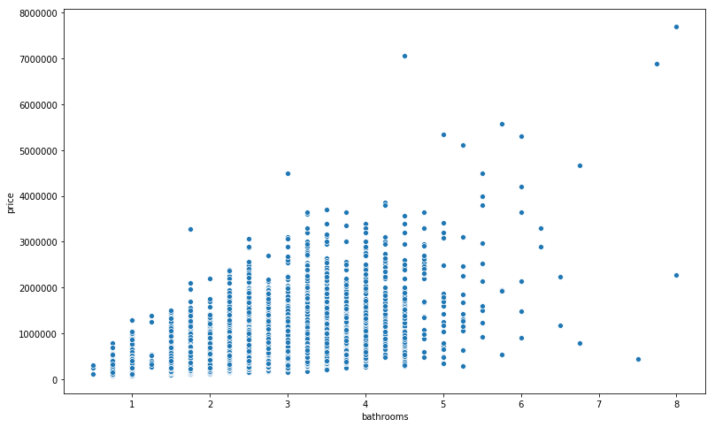


#### Bathroom v. Price Violin Plot
-skewed to data in all categories

-simliar to Bedroom

-High heteroscedasticity 

#### sqft_living
Square footage of the home 

The range is 370 sqft to 13540 sqft. 


```python
# binning values
bins = [370, 1000, 2000, 3000, 4000, 5000, 13540]


plt.figure(figsize= (13, 8))

sns.distplot(data.sqft_living)
plt.title('Initial Living Space Sqft Data');
plt.xlabel('Sqft');


```


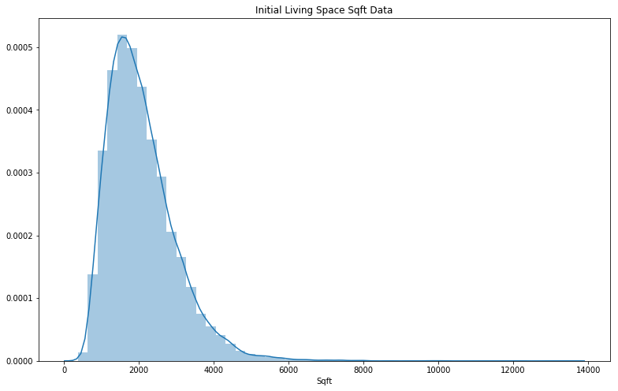


```python
plt.figure(figsize= (13, 8))
sns.violinplot(x= binning(data['sqft_living'],10), y= data[target]);
```


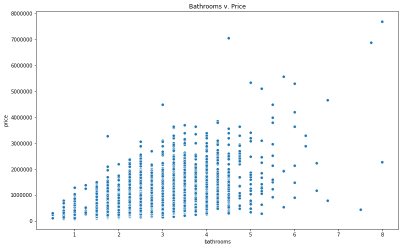


```python
plt.figure(figsize= (13, 8));
scat_plot(data, 'sqft_living');
```


    <Figure size 936x576 with 0 Axes>


#### Square Footage for Living Space v. Price Violin Plot
-skewed to data in all categories

-simliar to Bedroom

-There is high heterodiacity

##### sqft_lot
Square footage of the lot
The range is 520 sqft to 1,651,359 sqft.


```python

plt.figure(figsize= (13, 8))
sns.distplot(data.sqft_lot, hist=False)
plt.title('Initial Lot Space Sqft Data');
plt.xlabel('Sqft');
plt.ylabel('Count');

```


```python
plt.figure(figsize= (13, 8))
sns.scatterplot(x= data.sqft_lot, y= data.price)
plt.title('Initial Lot Space Sqft Data');
plt.xlabel('Sqft');
plt.ylabel('Count');
```


#### KDE plot for Lot Space
-Looks like it is a highly skewed.

#### floors
Total floors (levels) in house
The range is 1 to 3.5 floor. 


```python
a=data.floors.value_counts(sort=False);
plt.figure(figsize= (13, 8))
a.sort_index().plot(kind= 'barh')
plt.title('Initial Floor Data');
plt.xlabel('Count');
plt.ylabel('Floors');
```


```python
plt.figure(figsize= (13, 8))
sns.violinplot(x='floors', y='price', data= data)
plt.title('Floors v. Price Violin Plot');
```


```python
scat_plot(data, 'floors')
```


#### bin_floors


```python
bins= [0, 1.5, 2.5, 3.5]
```


```python
a= binning(data.floors, bins).astype(str)

```


```python
count = 1
for i in a.unique():
    b = a.loc[a == i]
    a.iloc[b.index] = count
    count += 1
data['bin_floors'] = a
```


```python
plt.figure(figsize= (13, 8))
sns.violinplot(x='bin_floors', y='price', data= data)
plt.title('bin_floors v. Price Violin Plot');
```


```python
scat_plot(data, 'bin_floors')
```


#### waterfront
House which has a view to a waterfront


```python
data.waterfront.value_counts()
```


    0.0    21451
    1.0      146
    Name: waterfront, dtype: int64


```python
plt.figure(figsize= (13, 8))
sns.violinplot(x='waterfront', y='price', data= data)
plt.title('Waterfront v. Price Violin Plot');
```


#### view
Has been viewed
The range is 0 to 4.


```python
a = data.view.value_counts()
a.sort_index().plot(kind= 'barh')
plt.title('Initial View Data');
plt.xlabel('Count');
plt.ylabel('View');
```


```python
plt.figure(figsize= (13, 8))
sns.violinplot(x='view', y='price', data= data)
plt.title('view v. Price Violin Plot');
```


#### view Analysis
High skewedness

#### condition
How good the condition is ( Overall 
The range is 1 to 5.


```python
a = data.condition.value_counts()
a.sort_index().plot(kind= 'barh')
plt.title('Initial Condition Data');
plt.xlabel('Count');
plt.ylabel('Condition');
```


```python
viol_plot(data, 'condition')
```


#### Analysis of Condition
High skewness in the high count values.

#### grade
overall grade given to the housing unit, based on King County grading system


```python
a = data.grade.value_counts()
a.sort_index().plot(kind= 'bar')
plt.title('Initial Grade Data');
plt.xlabel('Count');
plt.ylabel('Grade');
```


```python
viol_plot(data, 'grade')
```


```python
scat_plot(data, 'grade')
```


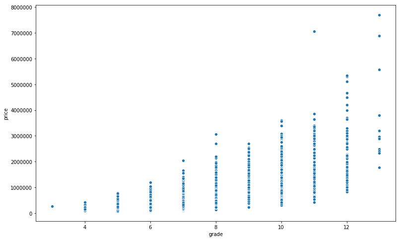


#### Analysis of Grade.
skewness increase as the grade increases
High Heteroscedasticity 


```python

```

#### Analysis seem to increase as the grade goes up.

#### sqft_above
Square footage of house apart from basement


```python

plt.figure(figsize= (13, 8))
sns.distplot(data.sqft_above, bins=10)
plt.title('Initial Sqft Except from Basement Data');
plt.xlabel('Sqft');
plt.ylabel('Count');
```


```python
scat_plot(data, 'sqft_above')
```


```python
data['binning_sqft_above'] = binning(data.sqft_above, 10)

bar_hist_plot(data.binning_sqft_above)
data = data.drop(columns= 'binning_sqft_above')
```


#### Analysis of sqft_above
-High Heteroscedasticity 

#### sqft_basement
Square footage of the basement.  ? is the place hold value and the feature is formated as a string. See Data Scrubbing 


```python
plt.figure(figsize= (13, 8))
sns.distplot(data.sqft_basement, bins=30)
plt.title('Initial Basement Sqft Data');
plt.xlabel('Sqft');
plt.ylabel('Count');
```


```python
scat_plot(data, 'sqft_basement')
```


#### Analysis of sqft basement
-High Heteroscedasticity


#### yr_built
Built Year
The range is 1900 to 2015


```python
plt.figure(figsize= (13, 8))
sns.distplot(data.yr_built, bins=50)
plt.title('Initial Built Year Data');
plt.xlabel('Year');

```


```python
data.yr_built.describe()
[1899, 1951, 1975, 1997, 2015]
pd.cut(data.yr_built, [1899, 1912, 1929, 1939, 1951, 1975, 1997, 2016])

bar_hist_plot(pd.cut(data.yr_built, [1899, 1912, 1929, 1939, 1951, 1975, 1997, 2016]))

```


```python
plt.figure(figsize=(13,8))
sns.violinplot(x= pd.cut(data.yr_built, [1899, 1912, 1929, 1939, 1951, 1975, 1997, 2016]), y= data.price);


```


```python

```

#### yr_renovated
Year when house was renovated. The 744 have renovations.


```python
plt.figure(figsize= (13, 8))
sns.distplot(data.yr_renovated, bins=50)
plt.title('Initial Renovated Year Data');
plt.xlabel('Year');
```


#### zipcode


```python
plt.figure(figsize= (13, 8))
sns.distplot(data.zipcode, bins=70)
plt.title('Initial Zipcode Data');
plt.xlabel('Year');
```


```python
a=data.groupby(['zipcode'])['price'].mean()
data['zip_mean'] = data.zipcode.apply(lambda x: a[x])
scat_plot(data, 'zip_mean')
data['zip_mean'].describe()
```


    count    2.159700e+04
    mean     5.402966e+05
    std      2.344425e+05
    min      2.342840e+05
    25%      3.594963e+05
    50%      4.936253e+05
    75%      6.452442e+05
    max      2.161300e+06
    Name: zip_mean, dtype: float64


```python
a=data.groupby(['zipcode'])['price'].median()
data['zip_median'] = data.zipcode.apply(lambda x: a[x])
scat_plot(data, 'zip_median')
data['zip_median'].describe()
```


    count    2.159700e+04
    mean     4.859554e+05
    std      1.966655e+05
    min      2.350000e+05
    25%      3.350000e+05
    50%      4.459500e+05
    75%      5.720000e+05
    max      1.895000e+06
    Name: zip_median, dtype: float64


```python
a= binning(data.zip_median, 6)
viol2(x=a, y=data.price)
```


```python
a=data.groupby(['zipcode'])['price'].quantile(.75)
data['zip_75q'] = data.zipcode.apply(lambda x: a[x])
scat_plot(data, 'zip_75q')
data['zip_75q'].describe()
```


    count    2.159700e+04
    mean     6.180254e+05
    std      2.811627e+05
    min      2.685000e+05
    25%      4.052125e+05
    50%      5.517500e+05
    75%      7.190000e+05
    max      2.560000e+06
    Name: zip_75q, dtype: float64


```python
a=data.groupby(['zipcode'])['price'].count()
data['zip_count'] = data.zipcode.apply(lambda x: a[x])
```

#### lat
Latitude coordinate. The range is 47.1559 to 47.7776


```python
print(max(data.lat), min(data.lat))
```

    47.7776 47.1559
    


```python
plt.figure(figsize= (13, 8))
sns.distplot(data.lat, bins=10)
plt.title('Initial Latitude Data');
plt.xlabel('Year');
```


```python
a= data.groupby(['zipcode'])['lat'].median()
data['zip_median_lat'] = data.zipcode.apply(lambda x: a[x])
data['zip_EW'] = (data['zip_median_lat'] >= data.lat)*1


a= data.groupby(['zipcode', 'zip_EW'])['price'].median()
b=[]
for index in range(0,len(data)):
    b.append(a[data.zipcode.iloc[index]][data.zip_EW.iloc[index]])
data['sub_zip_median'] = b    


a= data.groupby(['zipcode', 'zip_EW'])['price'].quantile(.75)
b=[]
for index in range(0,len(data)):
    b.append(a[data.zipcode.iloc[index]][data.zip_EW.iloc[index]])
data['sub_zip_75q'] = b 

```


```python
plt.figure(figsize= (13, 8))
sns.distplot(data['sub_zip_median'], bins=10);

```


#### long
Longitude coordinate


```python
plt.figure(figsize= (13, 8))
sns.distplot(data.long, bins=10)
plt.title('Initial Longitude Data');
plt.xlabel('Year');
```


```python
data['bin_lat'] = binning(data.lat, equal_bin10(data.lat, quantile_step=25))
data['bin_lat']  = data['bin_lat'].astype(str)
data['bin_long'] = binning(data.long, equal_bin10(data.long, quantile_step=25))
data['bin_long'] = data['bin_long'].astype(str)
column = 'bin_lat'
a = []
count = 1
for index, value in enumerate(data[column]):
    for i in data[column].unique():
        if i == value:
            a.append(count)
        count += 1
    count = 1
data[column] = a  
column = 'bin_long'
a = []
count = 1
for index, value in enumerate(data[column]):
    for i in data[column].unique():
        if i == value:
            a.append(count)
        count += 1
    count = 1
data[column] = a
data['zone'] = data['bin_lat']*10 + data['bin_long']
```


```python
data['bin_long'].nunique()
```


    25


```python

a= data.groupby(['zone'])['price'].mean()
data['zone_mean'] = data.zone.apply(lambda x: a[x])
scat_plot(data, 'zone_mean')
data['log_zone_mean'] = np.log(data['zone_mean'])
```


```python
a= data.groupby(['zone'])['price'].quantile(.95)
data['zone_95q'] = data.zone.apply(lambda x: a[x])
scat_plot(data, 'zone_95q')
```


```python
data['log_zone_95q'] = np.log(data['zone_95q'])
```


```python
a= data.groupby(['zone'])['price'].max()
data['zone_max'] = data.zone.apply(lambda x: a[x])
scat_plot(data, 'zone_max')


```


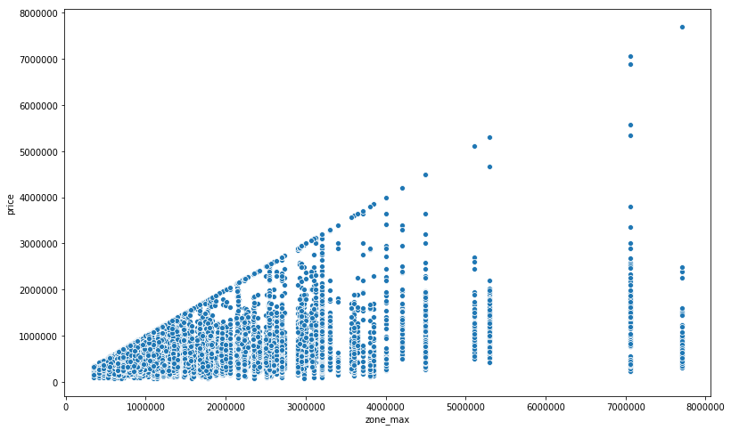


```python
a= data.groupby(['zone'])['price'].count()
data['zone_count'] = data.zone.apply(lambda x: a[x])
```


```python

```

#### sqft_living15
The square footage of interior housing living space for the nearest 15 neighbors. The range is 399 to 6210 sq ft


```python
plt.figure(figsize= (13, 8))
sns.distplot(data.sqft_living15, bins=100)
plt.title('Initial Living Space of Neighbors Data');
plt.xlabel('Year');
```


```python
scat_plot(data, 'sqft_living15')
```


```python
data.sqft_living15.describe()
sns.violinplot(x= binning(data.sqft_living15, [398, 1490, 1840, 2360, 6210]), y= data.price);
```


#### sqft_lot15
The square footage of the land lots of the nearest 15 neighbors. The range is 651 to 871,200 sq ft.


```python
plt.figure(figsize= (13, 8))
sns.distplot(data.sqft_lot15, bins=100)
plt.title('Initial Living Space of Neighbors Data');
plt.xlabel('Year');
```


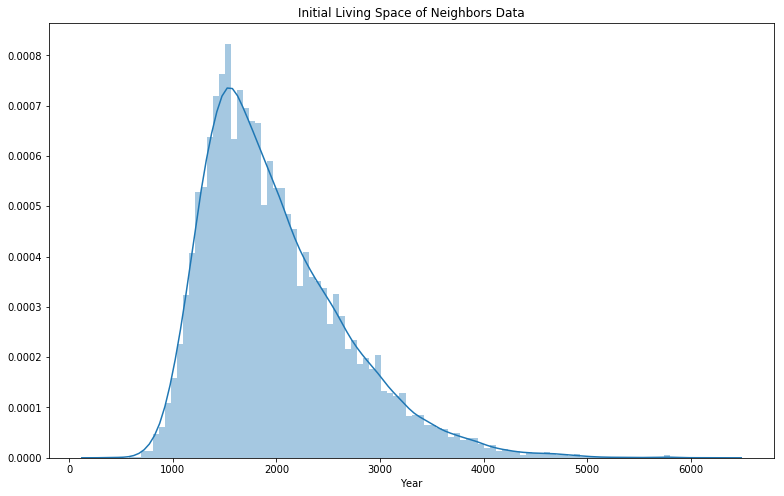


```python

viol2(binning(data.sqft_lot15, equal_bin(data.sqft_lot15)), data.price)


```


#### change_date  (flip)


```python
plt.figure(figsize= (13, 8))
sns.distplot(flip.change_date, bins=30);


```


```python
plt.figure(figsize= (13, 8))
sns.violinplot(x= data.month, y= data.price);
```


```python
plt.figure(figsize= (13, 8))
a = data.month.value_counts()
a.sort_index().plot(kind= 'barh');
plt.ylabel('Count');
```


```python
data['log_grade'] = np.log(data["grade"])

```

#### Creating a Possible Flipped Sale Database
We identified 177 resales of property that were sold in the period of study. We two meanful features:

change_date  The days between sales.

change_price The cost differential between the previous sale and current sale price.

Condition and grade were examined, but there was no change between any of the sales. 


```python
multiple = data.id.value_counts()
len(multiple.loc[multiple > 1])
resales = len(multiple.loc[multiple > 1])
# 176, The number of time a home has been resold in the time period.
resales/ len(data.id)
# Far less then 1% of homes have been sold in the time period.
multiple = multiple.loc[multiple > 1]
multiple = multiple.to_dict()
data['num_sales'] = data.id.map(multiple)
data['num_sales'] = data['num_sales'].fillna(1)
flip = data.loc[data.num_sales > 1]
data = data.drop(columns= 'num_sales')
flip = flip.sort_values('date')

# adding new column examine. 
flip['change_date'] = flip_diff(flip, 'date')

#flip = flip.change_date.apply(lambda x: x.days)      

flip['change_price'] = flip_diff(flip, 'price')

# Removing initial sales
flip = flip.dropna()

# converting timedelta to days
flip.change_date = flip.change_date.apply(lambda x: x.days)

# 
flip['percent_change'] = flip.change_price/(flip.price- flip.change_price)

```


```python
scat_plot(flip, 'percent_change')
```


```python
data['scaled_log_grade'] = (data['log_grade']-np.mean(data['log_grade']))/np.sqrt(np.var(data['log_grade']))

```


```python
scat_plot(data, 'scaled_log_grade')
```


```python
sns.violinplot(x = (1 *(data.price > data.zone_95q)), y = data.price)

a = 1 *(data.price > data.zone_95q)
a.sum()/len(data)

```


    0.054498309950456084


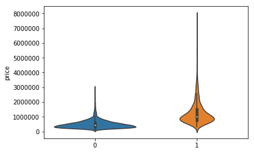


```python

```

### Exploration (Analysis)

#### Confusion Matrix


```python
make_heatmap(data=data, figsize=(20, 20))
```


```python
data.corr().price.abs().sort_values()

```


    bin_lat             0.001708
    zone                0.004323
    month               0.009928
    id                  0.016772
    zip_EW              0.017120
    long                0.022036
    bin_long            0.026289
    condition           0.036056
    zip_count           0.050969
    zipcode             0.053402
    yr_built            0.053953
    age                 0.053953
    since_ren           0.064950
    sqft_lot15          0.082845
    zone_count          0.087549
    sqft_lot            0.089876
    renovated           0.117543
    yr_renovated        0.117855
    bin_floors          0.237264
    floors              0.256804
    waterfront          0.264306
    lat                 0.306692
    bedrooms            0.308787
    zip_median_lat      0.310784
    sqft_basement       0.321108
    zone_max            0.390955
    view                0.393497
    log_zone_95q        0.481499
    zone_95q            0.485036
    bathrooms           0.525906
    log_zone_mean       0.532312
    zone_mean           0.547987
    sqft_living15       0.585241
    sqft_above          0.605368
    zip_median          0.632561
    zip_75q             0.634993
    log_grade           0.635153
    scaled_log_grade    0.635153
    zip_mean            0.638168
    sub_zip_median      0.647361
    sub_zip_75q         0.651066
    grade               0.667951
    sqft_living         0.701917
    price               1.000000
    ones                     NaN
    Name: price, dtype: float64


#### Scatter Matrix
Going to start OLS with sqft_living and add to the OLS going down the regression 


```python
columns= ['sqft_living ']
```


```python
make_heatmap(data=flip, figsize=(20, 20))
```


#### Modeling / Cross Validation


```python
test= []
```


```python
make_ols_model(df=data, target='price', columns_to_use='sqft_living' , add_constant=True)
```

                                OLS Regression Results                            
    ==============================================================================
    Dep. Variable:                  price   R-squared:                       0.493
    Model:                            OLS   Adj. R-squared:                  0.493
    Method:                 Least Squares   F-statistic:                 2.097e+04
    Date:                Fri, 27 Sep 2019   Prob (F-statistic):               0.00
    Time:                        10:54:04   Log-Likelihood:            -3.0006e+05
    No. Observations:               21597   AIC:                         6.001e+05
    Df Residuals:                   21595   BIC:                         6.001e+05
    Df Model:                           1                                         
    Covariance Type:            nonrobust                                         
    ===============================================================================
                      coef    std err          t      P>|t|      [0.025      0.975]
    -------------------------------------------------------------------------------
    const       -4.399e+04   4410.023     -9.975      0.000   -5.26e+04   -3.53e+04
    sqft_living   280.8630      1.939    144.819      0.000     277.062     284.664
    ==============================================================================
    Omnibus:                    14801.942   Durbin-Watson:                   1.982
    Prob(Omnibus):                  0.000   Jarque-Bera (JB):           542662.604
    Skew:                           2.820   Prob(JB):                         0.00
    Kurtosis:                      26.901   Cond. No.                     5.63e+03
    ==============================================================================
    
    Warnings:
    [1] Standard Errors assume that the covariance matrix of the errors is correctly specified.
    [2] The condition number is large, 5.63e+03. This might indicate that there are
    strong multicollinearity or other numerical problems.
    


    (<statsmodels.regression.linear_model.OLS at 0x2a5ebb6fba8>,
     <statsmodels.regression.linear_model.RegressionResultsWrapper at 0x2a5ededc5c0>)


#### Data OLS Test 1

R squared is low

cond no. is high. I will remove constant to see if the improves.


```python
make_ols_model(df=data, target='price', columns_to_use='sqft_living' , add_constant=False)
```

                                OLS Regression Results                            
    ==============================================================================
    Dep. Variable:                  price   R-squared:                       0.839
    Model:                            OLS   Adj. R-squared:                  0.839
    Method:                 Least Squares   F-statistic:                 1.124e+05
    Date:                Fri, 27 Sep 2019   Prob (F-statistic):               0.00
    Time:                        10:54:04   Log-Likelihood:            -3.0011e+05
    No. Observations:               21597   AIC:                         6.002e+05
    Df Residuals:                   21596   BIC:                         6.002e+05
    Df Model:                           1                                         
    Covariance Type:            nonrobust                                         
    ===============================================================================
                      coef    std err          t      P>|t|      [0.025      0.975]
    -------------------------------------------------------------------------------
    sqft_living   263.1647      0.785    335.319      0.000     261.626     264.703
    ==============================================================================
    Omnibus:                    16021.993   Durbin-Watson:                   1.980
    Prob(Omnibus):                  0.000   Jarque-Bera (JB):           689028.909
    Skew:                           3.128   Prob(JB):                         0.00
    Kurtosis:                      29.955   Cond. No.                         1.00
    ==============================================================================
    
    Warnings:
    [1] Standard Errors assume that the covariance matrix of the errors is correctly specified.
    


    (<statsmodels.regression.linear_model.OLS at 0x2a5ea512c88>,
     <statsmodels.regression.linear_model.RegressionResultsWrapper at 0x2a5ea512ba8>)


#### Data OLS Test 2
R squared improved

Linearity good (only variable).
F - statistic is high.
Skewing is a problem. -Will try log transform.


```python
data['log_sqft_living'] = np.log(data["sqft_living"])
```


```python
make_ols_model(df=data, target='price', columns_to_use='log_sqft_living' , add_constant=False)
```

                                OLS Regression Results                            
    ==============================================================================
    Dep. Variable:                  price   R-squared:                       0.714
    Model:                            OLS   Adj. R-squared:                  0.714
    Method:                 Least Squares   F-statistic:                 5.390e+04
    Date:                Fri, 27 Sep 2019   Prob (F-statistic):               0.00
    Time:                        10:54:04   Log-Likelihood:            -3.0631e+05
    No. Observations:               21597   AIC:                         6.126e+05
    Df Residuals:                   21596   BIC:                         6.126e+05
    Df Model:                           1                                         
    Covariance Type:            nonrobust                                         
    ===================================================================================
                          coef    std err          t      P>|t|      [0.025      0.975]
    -----------------------------------------------------------------------------------
    log_sqft_living    7.3e+04    314.426    232.161      0.000    7.24e+04    7.36e+04
    ==============================================================================
    Omnibus:                    19995.129   Durbin-Watson:                   1.967
    Prob(Omnibus):                  0.000   Jarque-Bera (JB):          1400805.293
    Skew:                           4.276   Prob(JB):                         0.00
    Kurtosis:                      41.517   Cond. No.                         1.00
    ==============================================================================
    
    Warnings:
    [1] Standard Errors assume that the covariance matrix of the errors is correctly specified.
    


    (<statsmodels.regression.linear_model.OLS at 0x2a5ea512e48>,
     <statsmodels.regression.linear_model.RegressionResultsWrapper at 0x2a5ededcd68>)


#### Data OLS Test 3
R squared worst

Linearity good (only variable).

F - statistic is high.

Skewing is less of a problem. -Will try log transform.


```python
columns= ['log_sqft_living', 'grade']
make_ols_model(df=data, target='price', columns_to_use=columns, add_constant=False)
```

                                OLS Regression Results                            
    ==============================================================================
    Dep. Variable:                  price   R-squared:                       0.805
    Model:                            OLS   Adj. R-squared:                  0.805
    Method:                 Least Squares   F-statistic:                 4.457e+04
    Date:                Fri, 27 Sep 2019   Prob (F-statistic):               0.00
    Time:                        10:54:04   Log-Likelihood:            -3.0217e+05
    No. Observations:               21597   AIC:                         6.044e+05
    Df Residuals:                   21595   BIC:                         6.044e+05
    Df Model:                           2                                         
    Covariance Type:            nonrobust                                         
    ===================================================================================
                          coef    std err          t      P>|t|      [0.025      0.975]
    -----------------------------------------------------------------------------------
    log_sqft_living -1.498e+05   2233.777    -67.044      0.000   -1.54e+05   -1.45e+05
    grade            2.189e+05   2180.541    100.404      0.000    2.15e+05    2.23e+05
    ==============================================================================
    Omnibus:                    19949.996   Durbin-Watson:                   1.973
    Prob(Omnibus):                  0.000   Jarque-Bera (JB):          1905587.098
    Skew:                           4.135   Prob(JB):                         0.00
    Kurtosis:                      48.268   Cond. No.                         17.2
    ==============================================================================
    
    Warnings:
    [1] Standard Errors assume that the covariance matrix of the errors is correctly specified.
    


    (<statsmodels.regression.linear_model.OLS at 0x2a5efc149b0>,
     <statsmodels.regression.linear_model.RegressionResultsWrapper at 0x2a5ea512978>)


#### Data OLS Test 4
R squared better

Linearity good.

Normality is better, but not good.

F - statistic is high but better

Skewing got worst but only by a little. -Will try log transform.


```python
data['log_grade'] = np.log(data["grade"])
columns= ['log_sqft_living', 'log_grade']
make_ols_model(df=data, target='price', columns_to_use=columns, add_constant=False)
```

                                OLS Regression Results                            
    ==============================================================================
    Dep. Variable:                  price   R-squared:                       0.735
    Model:                            OLS   Adj. R-squared:                  0.735
    Method:                 Least Squares   F-statistic:                 2.988e+04
    Date:                Fri, 27 Sep 2019   Prob (F-statistic):               0.00
    Time:                        10:54:04   Log-Likelihood:            -3.0550e+05
    No. Observations:               21597   AIC:                         6.110e+05
    Df Residuals:                   21595   BIC:                         6.110e+05
    Df Model:                           2                                         
    Covariance Type:            nonrobust                                         
    ===================================================================================
                          coef    std err          t      P>|t|      [0.025      0.975]
    -----------------------------------------------------------------------------------
    log_sqft_living -1.792e+05   6163.081    -29.080      0.000   -1.91e+05   -1.67e+05
    log_grade        9.408e+05    2.3e+04     40.974      0.000    8.96e+05    9.86e+05
    ==============================================================================
    Omnibus:                    20219.415   Durbin-Watson:                   1.977
    Prob(Omnibus):                  0.000   Jarque-Bera (JB):          1612143.698
    Skew:                           4.305   Prob(JB):                         0.00
    Kurtosis:                      44.441   Cond. No.                         81.3
    ==============================================================================
    
    Warnings:
    [1] Standard Errors assume that the covariance matrix of the errors is correctly specified.
    


    (<statsmodels.regression.linear_model.OLS at 0x2a5ea5006a0>,
     <statsmodels.regression.linear_model.RegressionResultsWrapper at 0x2a5ea5005f8>)


#### Data OLS Test 5
R squared worse

Linearity good.

Normality is better, but not good.

F - statistic is passing

Skewing got better. -Adding basementsqft


```python

columns= ['log_sqft_living', 'log_grade', 'sqft_basement']
make_ols_model(df=data, target='price', columns_to_use=columns, add_constant=False)
```

                                OLS Regression Results                            
    ==============================================================================
    Dep. Variable:                  price   R-squared:                       0.771
    Model:                            OLS   Adj. R-squared:                  0.771
    Method:                 Least Squares   F-statistic:                 2.420e+04
    Date:                Fri, 27 Sep 2019   Prob (F-statistic):               0.00
    Time:                        10:54:04   Log-Likelihood:            -3.0392e+05
    No. Observations:               21597   AIC:                         6.078e+05
    Df Residuals:                   21594   BIC:                         6.079e+05
    Df Model:                           3                                         
    Covariance Type:            nonrobust                                         
    ===================================================================================
                          coef    std err          t      P>|t|      [0.025      0.975]
    -----------------------------------------------------------------------------------
    log_sqft_living -2.695e+05   5932.474    -45.421      0.000   -2.81e+05   -2.58e+05
    log_grade        1.234e+06   2.19e+04     56.307      0.000    1.19e+06    1.28e+06
    sqft_basement     294.7408      5.048     58.389      0.000     284.846     304.635
    ==============================================================================
    Omnibus:                    18969.591   Durbin-Watson:                   1.973
    Prob(Omnibus):                  0.000   Jarque-Bera (JB):          1290940.634
    Skew:                           3.920   Prob(JB):                         0.00
    Kurtosis:                      40.055   Cond. No.                     5.60e+03
    ==============================================================================
    
    Warnings:
    [1] Standard Errors assume that the covariance matrix of the errors is correctly specified.
    [2] The condition number is large, 5.6e+03. This might indicate that there are
    strong multicollinearity or other numerical problems.
    


    (<statsmodels.regression.linear_model.OLS at 0x2a5ea5002b0>,
     <statsmodels.regression.linear_model.RegressionResultsWrapper at 0x2a5ea5004a8>)


#### Data OLS Test 8
R squared worse

Linearity got worse.

Normality is better, but not good.

F - statistic got worse. Not passing

Skewing got better. -Will make basement a categorical feature


```python
data['basement'] = data.sqft_basement.replace(to_replace= 0, value= np.nan)
data.basement = data.basement/data.basement
data.basement = data.basement.fillna(0)
columns= ['log_sqft_living', 'log_grade', 'basement']
make_ols_model(df=data, target='price', columns_to_use=columns, add_constant=False)
```

                                OLS Regression Results                            
    ==============================================================================
    Dep. Variable:                  price   R-squared:                       0.745
    Model:                            OLS   Adj. R-squared:                  0.745
    Method:                 Least Squares   F-statistic:                 2.106e+04
    Date:                Fri, 27 Sep 2019   Prob (F-statistic):               0.00
    Time:                        10:54:04   Log-Likelihood:            -3.0506e+05
    No. Observations:               21597   AIC:                         6.101e+05
    Df Residuals:                   21594   BIC:                         6.101e+05
    Df Model:                           3                                         
    Covariance Type:            nonrobust                                         
    ===================================================================================
                          coef    std err          t      P>|t|      [0.025      0.975]
    -----------------------------------------------------------------------------------
    log_sqft_living -2.191e+05   6180.225    -35.444      0.000   -2.31e+05   -2.07e+05
    log_grade        1.062e+06   2.28e+04     46.475      0.000    1.02e+06    1.11e+06
    basement         1.426e+05   4728.937     30.154      0.000    1.33e+05    1.52e+05
    ==============================================================================
    Omnibus:                    20182.453   Durbin-Watson:                   1.976
    Prob(Omnibus):                  0.000   Jarque-Bera (JB):          1661367.010
    Skew:                           4.278   Prob(JB):                         0.00
    Kurtosis:                      45.107   Cond. No.                         82.7
    ==============================================================================
    
    Warnings:
    [1] Standard Errors assume that the covariance matrix of the errors is correctly specified.
    


    (<statsmodels.regression.linear_model.OLS at 0x2a5ea4f3b38>,
     <statsmodels.regression.linear_model.RegressionResultsWrapper at 0x2a5ea4f3fd0>)


#### Data OLS Test 9
R squared better

Normality is worse. 


Skewing got worst but only by a little. -Taking out basement and add lat next


```python

columns= ['log_sqft_living', 'grade', 'lat']

ols, results = make_ols_model(df=data, target='price', columns_to_use=columns, add_constant=False)


```

                                OLS Regression Results                            
    ==============================================================================
    Dep. Variable:                  price   R-squared:                       0.832
    Model:                            OLS   Adj. R-squared:                  0.831
    Method:                 Least Squares   F-statistic:                 3.553e+04
    Date:                Fri, 27 Sep 2019   Prob (F-statistic):               0.00
    Time:                        10:54:04   Log-Likelihood:            -3.0059e+05
    No. Observations:               21597   AIC:                         6.012e+05
    Df Residuals:                   21594   BIC:                         6.012e+05
    Df Model:                           3                                         
    Covariance Type:            nonrobust                                         
    ===================================================================================
                          coef    std err          t      P>|t|      [0.025      0.975]
    -----------------------------------------------------------------------------------
    log_sqft_living   2.03e+05   6394.031     31.743      0.000     1.9e+05    2.15e+05
    grade            1.537e+05   2314.914     66.395      0.000    1.49e+05    1.58e+05
    lat             -4.561e+04    781.899    -58.326      0.000   -4.71e+04   -4.41e+04
    ==============================================================================
    Omnibus:                    19984.635   Durbin-Watson:                   1.971
    Prob(Omnibus):                  0.000   Jarque-Bera (JB):          2118529.368
    Skew:                           4.107   Prob(JB):                         0.00
    Kurtosis:                      50.820   Cond. No.                         178.
    ==============================================================================
    
    Warnings:
    [1] Standard Errors assume that the covariance matrix of the errors is correctly specified.
    


```python
current= [results.rsquared, results.condition_number]
current
```


    [0.831521778529237, 178.25252875884587]


#### Data OLS Test 10
R squared better

Normality same 

Skewing got worst but only by a little. -Try log transform


```python
data['log_lat'] = np.log(data.lat)
columns= ['log_sqft_living', 'log_grade', 'log_lat']
ols, results = make_ols_model(df=data, target='price', columns_to_use=columns, add_constant=False)
print('\nR2', current[0], results.rsquared, '\nCond. No.',current[1], results.condition_number) 
```

                                OLS Regression Results                            
    ==============================================================================
    Dep. Variable:                  price   R-squared:                       0.824
    Model:                            OLS   Adj. R-squared:                  0.824
    Method:                 Least Squares   F-statistic:                 3.369e+04
    Date:                Fri, 27 Sep 2019   Prob (F-statistic):               0.00
    Time:                        10:54:05   Log-Likelihood:            -3.0107e+05
    No. Observations:               21597   AIC:                         6.021e+05
    Df Residuals:                   21594   BIC:                         6.022e+05
    Df Model:                           3                                         
    Covariance Type:            nonrobust                                         
    ===================================================================================
                          coef    std err          t      P>|t|      [0.025      0.975]
    -----------------------------------------------------------------------------------
    log_sqft_living  2.665e+05   6581.381     40.496      0.000    2.54e+05    2.79e+05
    log_grade        9.945e+05   1.87e+04     53.164      0.000    9.58e+05    1.03e+06
    log_lat         -9.025e+05   8618.843   -104.711      0.000   -9.19e+05   -8.86e+05
    ==============================================================================
    Omnibus:                    20429.977   Durbin-Watson:                   1.972
    Prob(Omnibus):                  0.000   Jarque-Bera (JB):          2226615.964
    Skew:                           4.258   Prob(JB):                         0.00
    Kurtosis:                      52.009   Cond. No.                         90.6
    ==============================================================================
    
    Warnings:
    [1] Standard Errors assume that the covariance matrix of the errors is correctly specified.
    
    R2 0.831521778529237 0.8239606798202903 
    Cond. No. 178.25252875884587 90.64089969897728
    

#### Data OLS Test 11
R squared very bad

Normality same 


I going to see if we can create better location feature. Going to replace lat with zip_mean.


```python
columns= ['log_sqft_living', 'grade', 'zip_mean']
ols, results = make_ols_model(df=data, target='price', columns_to_use=columns, add_constant=False)
tests= [results.rsquared, results.condition_number]
print('\nR2', current[0], results.rsquared, '\nCond. No.',current[1], results.condition_number) 
plt.figure(figsize= (13,8))
sns.distplot(results.resid, bins=100)
plt.title('Model Residual Dis');
```

                                OLS Regression Results                            
    ==============================================================================
    Dep. Variable:                  price   R-squared:                       0.861
    Model:                            OLS   Adj. R-squared:                  0.861
    Method:                 Least Squares   F-statistic:                 4.457e+04
    Date:                Fri, 27 Sep 2019   Prob (F-statistic):               0.00
    Time:                        10:54:05   Log-Likelihood:            -2.9852e+05
    No. Observations:               21597   AIC:                         5.970e+05
    Df Residuals:                   21594   BIC:                         5.971e+05
    Df Model:                           3                                         
    Covariance Type:            nonrobust                                         
    ===================================================================================
                          coef    std err          t      P>|t|      [0.025      0.975]
    -----------------------------------------------------------------------------------
    log_sqft_living -1.459e+05   1886.642    -77.333      0.000    -1.5e+05   -1.42e+05
    grade             1.65e+05   1929.936     85.500      0.000    1.61e+05    1.69e+05
    zip_mean            0.7104      0.008     93.239      0.000       0.695       0.725
    ==============================================================================
    Omnibus:                    23252.829   Durbin-Watson:                   1.976
    Prob(Omnibus):                  0.000   Jarque-Bera (JB):          4402774.802
    Skew:                           5.133   Prob(JB):                         0.00
    Kurtosis:                      72.190   Cond. No.                     9.48e+05
    ==============================================================================
    
    Warnings:
    [1] Standard Errors assume that the covariance matrix of the errors is correctly specified.
    [2] The condition number is large, 9.48e+05. This might indicate that there are
    strong multicollinearity or other numerical problems.
    
    R2 0.831521778529237 0.8609567453531688 
    Cond. No. 178.25252875884587 947678.552096688
    


#### OLS Test 12
worst than test 9.

Cond. No. is out of control.


```python

columns= ['log_sqft_living', 'grade', 'zip_median']
ols, results = make_ols_model(df=data, target='price', columns_to_use=columns, add_constant=False)
tests= [results.rsquared, results.condition_number]
print('\nR2', current[0]-results.rsquared, '\nCond. No.',current[1]-results.condition_number) 
```

                                OLS Regression Results                            
    ==============================================================================
    Dep. Variable:                  price   R-squared:                       0.857
    Model:                            OLS   Adj. R-squared:                  0.857
    Method:                 Least Squares   F-statistic:                 4.326e+04
    Date:                Fri, 27 Sep 2019   Prob (F-statistic):               0.00
    Time:                        10:54:05   Log-Likelihood:            -2.9880e+05
    No. Observations:               21597   AIC:                         5.976e+05
    Df Residuals:                   21594   BIC:                         5.976e+05
    Df Model:                           3                                         
    Covariance Type:            nonrobust                                         
    ===================================================================================
                          coef    std err          t      P>|t|      [0.025      0.975]
    -----------------------------------------------------------------------------------
    log_sqft_living -1.484e+05   1910.590    -77.664      0.000   -1.52e+05   -1.45e+05
    grade            1.653e+05   1959.721     84.372      0.000    1.62e+05    1.69e+05
    zip_median          0.8232      0.009     89.032      0.000       0.805       0.841
    ==============================================================================
    Omnibus:                    23269.273   Durbin-Watson:                   1.973
    Prob(Omnibus):                  0.000   Jarque-Bera (JB):          4298977.267
    Skew:                           5.150   Prob(JB):                         0.00
    Kurtosis:                      71.346   Cond. No.                     8.43e+05
    ==============================================================================
    
    Warnings:
    [1] Standard Errors assume that the covariance matrix of the errors is correctly specified.
    [2] The condition number is large, 8.43e+05. This might indicate that there are
    strong multicollinearity or other numerical problems.
    
    R2 -0.025823245675149264 
    Cond. No. -842994.6984241798
    

#### Test 13
Not much better than test 14. - tray higher quantile


```python
columns= ['log_sqft_living', 'grade', 'zip_75q']
ols, results = make_ols_model(df=data, target='price', columns_to_use=columns, add_constant=False)
tests= [results.rsquared, results.condition_number]
print('\nR2', current[0]-results.rsquared, '\nCond. No.',current[1]-results.condition_number) 
```

                                OLS Regression Results                            
    ==============================================================================
    Dep. Variable:                  price   R-squared:                       0.861
    Model:                            OLS   Adj. R-squared:                  0.861
    Method:                 Least Squares   F-statistic:                 4.468e+04
    Date:                Fri, 27 Sep 2019   Prob (F-statistic):               0.00
    Time:                        10:54:05   Log-Likelihood:            -2.9850e+05
    No. Observations:               21597   AIC:                         5.970e+05
    Df Residuals:                   21594   BIC:                         5.970e+05
    Df Model:                           3                                         
    Covariance Type:            nonrobust                                         
    ===================================================================================
                          coef    std err          t      P>|t|      [0.025      0.975]
    -----------------------------------------------------------------------------------
    log_sqft_living -1.442e+05   1885.103    -76.487      0.000   -1.48e+05    -1.4e+05
    grade            1.656e+05   1925.442     86.020      0.000    1.62e+05    1.69e+05
    zip_75q             0.5924      0.006     93.588      0.000       0.580       0.605
    ==============================================================================
    Omnibus:                    23249.600   Durbin-Watson:                   1.975
    Prob(Omnibus):                  0.000   Jarque-Bera (JB):          4426611.769
    Skew:                           5.130   Prob(JB):                         0.00
    Kurtosis:                      72.382   Cond. No.                     1.09e+06
    ==============================================================================
    
    Warnings:
    [1] Standard Errors assume that the covariance matrix of the errors is correctly specified.
    [2] The condition number is large, 1.09e+06. This might indicate that there are
    strong multicollinearity or other numerical problems.
    
    R2 -0.029733522942698265 
    Cond. No. -1092799.5073060167
    

#### Test 14 
Better than 13. 

Linearity is still problem


```python
columns= ['log_sqft_living', 'grade', 'sub_zip_median' ]
ols, results = make_ols_model(df=data, target='price', columns_to_use=columns, add_constant=False)
tests= [results.rsquared, results.condition_number]
print('\nR2', current[0]-results.rsquared, '\nCond. No.',current[1]-results.condition_number) 
```

                                OLS Regression Results                            
    ==============================================================================
    Dep. Variable:                  price   R-squared:                       0.860
    Model:                            OLS   Adj. R-squared:                  0.860
    Method:                 Least Squares   F-statistic:                 4.411e+04
    Date:                Fri, 27 Sep 2019   Prob (F-statistic):               0.00
    Time:                        10:54:05   Log-Likelihood:            -2.9862e+05
    No. Observations:               21597   AIC:                         5.972e+05
    Df Residuals:                   21594   BIC:                         5.973e+05
    Df Model:                           3                                         
    Covariance Type:            nonrobust                                         
    ===================================================================================
                          coef    std err          t      P>|t|      [0.025      0.975]
    -----------------------------------------------------------------------------------
    log_sqft_living -1.427e+05   1896.087    -75.287      0.000   -1.46e+05   -1.39e+05
    grade            1.598e+05   1958.203     81.630      0.000    1.56e+05    1.64e+05
    sub_zip_median      0.8146      0.009     91.797      0.000       0.797       0.832
    ==============================================================================
    Omnibus:                    23596.770   Durbin-Watson:                   1.975
    Prob(Omnibus):                  0.000   Jarque-Bera (JB):          4618311.007
    Skew:                           5.262   Prob(JB):                         0.00
    Kurtosis:                      73.862   Cond. No.                     8.59e+05
    ==============================================================================
    
    Warnings:
    [1] Standard Errors assume that the covariance matrix of the errors is correctly specified.
    [2] The condition number is large, 8.59e+05. This might indicate that there are
    strong multicollinearity or other numerical problems.
    
    R2 -0.028199673126099167 
    Cond. No. -859051.7347879737
    

#### OLS Test 16
Not good. -Will go back to Test 10, and examine residuals


```python

columns= ['log_sqft_living', 'grade']

ols, results = make_ols_model(df=data, target='price', columns_to_use=columns, add_constant=False)
plt.figure(figsize= (13,8))
sns.distplot(results.resid, bins=100)
plt.title('Model Residual Dis');
```

                                OLS Regression Results                            
    ==============================================================================
    Dep. Variable:                  price   R-squared:                       0.805
    Model:                            OLS   Adj. R-squared:                  0.805
    Method:                 Least Squares   F-statistic:                 4.457e+04
    Date:                Fri, 27 Sep 2019   Prob (F-statistic):               0.00
    Time:                        10:54:05   Log-Likelihood:            -3.0217e+05
    No. Observations:               21597   AIC:                         6.044e+05
    Df Residuals:                   21595   BIC:                         6.044e+05
    Df Model:                           2                                         
    Covariance Type:            nonrobust                                         
    ===================================================================================
                          coef    std err          t      P>|t|      [0.025      0.975]
    -----------------------------------------------------------------------------------
    log_sqft_living -1.498e+05   2233.777    -67.044      0.000   -1.54e+05   -1.45e+05
    grade            2.189e+05   2180.541    100.404      0.000    2.15e+05    2.23e+05
    ==============================================================================
    Omnibus:                    19949.996   Durbin-Watson:                   1.973
    Prob(Omnibus):                  0.000   Jarque-Bera (JB):          1905587.098
    Skew:                           4.135   Prob(JB):                         0.00
    Kurtosis:                      48.268   Cond. No.                         17.2
    ==============================================================================
    
    Warnings:
    [1] Standard Errors assume that the covariance matrix of the errors is correctly specified.
    


Residual is very skewed to the lower end. 


```python
len(a.loc[a.abs() > 2])/len(a)
```


    0.0


#### OLS Test 17
-will add zone_mean- Binned values of lat and long (quantities in each bin) with the mean of the sales price in the area

##### Residual Check 1
Around 3% of the residuals are outside of 2 standard deviations . I will check the model to see if the regression improves.


```python
columns= ['log_sqft_living', 'grade', 'zone_mean']

ols, results = make_ols_model(df=data, target='price', columns_to_use=columns, add_constant=False)
plt.figure(figsize= (13,8))
sns.distplot(results.resid, bins=100)
plt.title('Model Residual Dis');
```

                                OLS Regression Results                            
    ==============================================================================
    Dep. Variable:                  price   R-squared:                       0.840
    Model:                            OLS   Adj. R-squared:                  0.840
    Method:                 Least Squares   F-statistic:                 3.773e+04
    Date:                Fri, 27 Sep 2019   Prob (F-statistic):               0.00
    Time:                        10:54:06   Log-Likelihood:            -3.0005e+05
    No. Observations:               21597   AIC:                         6.001e+05
    Df Residuals:                   21594   BIC:                         6.001e+05
    Df Model:                           3                                         
    Covariance Type:            nonrobust                                         
    ===================================================================================
                          coef    std err          t      P>|t|      [0.025      0.975]
    -----------------------------------------------------------------------------------
    log_sqft_living -1.592e+05   2029.334    -78.460      0.000   -1.63e+05   -1.55e+05
    grade            1.827e+05   2046.028     89.283      0.000    1.79e+05    1.87e+05
    zone_mean           0.6462      0.009     68.506      0.000       0.628       0.665
    ==============================================================================
    Omnibus:                    21318.100   Durbin-Watson:                   1.985
    Prob(Omnibus):                  0.000   Jarque-Bera (JB):          2913417.858
    Skew:                           4.500   Prob(JB):                         0.00
    Kurtosis:                      59.183   Cond. No.                     9.19e+05
    ==============================================================================
    
    Warnings:
    [1] Standard Errors assume that the covariance matrix of the errors is correctly specified.
    [2] The condition number is large, 9.19e+05. This might indicate that there are
    strong multicollinearity or other numerical problems.
    


```python
a=results.resid/results.resid.std()
a = a.loc[a.abs() > 2]
len(a)/len(results.resid)
```


    0.031208038153447238


```python
 
for col in ['price',
    'log_zone_mean',
    'zone_mean', 
    'log_sqft_living',
    'sqft_living',
    'grade',
    'log_grade',
    'bedrooms', 
    'bathrooms',
    'sqft_lot',
    'floors',
    'waterfront',
    'view',
    'condition',
    'sqft_above',
    'sqft_basement',
    'yr_built',
    'yr_renovated',
    'sqft_living15',
    'sqft_lot15',
    'age',
    'since_ren',
    'renovated',
    'month',
    'basement',
    'log_lat',
    'zip_mean',
    'zip_median',
    'zip_75q',
    'sub_zip_median',
    'sub_zip_75q']:
    resd_check(results, data, col)
```


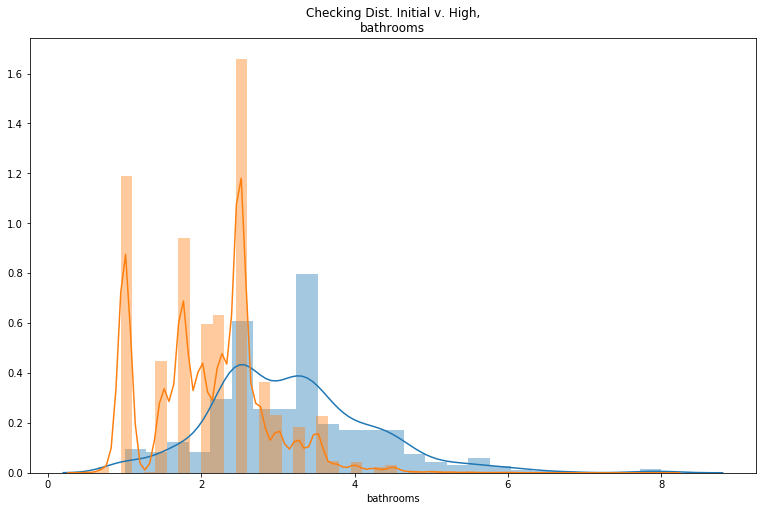


#### OLS Test 18
-will log transform  zone_mean

##### Residual Check 1
Around 3% of the residuals are outside of 2 standard deviations . I will check the model to see if the regression improves.


```python
columns= ['log_sqft_living', 'grade', 'log_zone_mean']

ols, results = make_ols_model(df=data, target='price', columns_to_use=columns, add_constant=False)
plt.figure(figsize= (13,8))
sns.distplot(results.resid, bins=100)
plt.title('Model Residual Dis');
```

                                OLS Regression Results                            
    ==============================================================================
    Dep. Variable:                  price   R-squared:                       0.810
    Model:                            OLS   Adj. R-squared:                  0.810
    Method:                 Least Squares   F-statistic:                 3.060e+04
    Date:                Fri, 27 Sep 2019   Prob (F-statistic):               0.00
    Time:                        10:54:18   Log-Likelihood:            -3.0192e+05
    No. Observations:               21597   AIC:                         6.038e+05
    Df Residuals:                   21594   BIC:                         6.039e+05
    Df Model:                           3                                         
    Covariance Type:            nonrobust                                         
    ===================================================================================
                          coef    std err          t      P>|t|      [0.025      0.975]
    -----------------------------------------------------------------------------------
    log_sqft_living -1.825e+04   6167.426     -2.959      0.003   -3.03e+04   -6161.448
    grade            2.007e+05   2298.065     87.330      0.000    1.96e+05    2.05e+05
    log_zone_mean   -6.508e+04   2849.994    -22.836      0.000   -7.07e+04   -5.95e+04
    ==============================================================================
    Omnibus:                    19715.870   Durbin-Watson:                   1.970
    Prob(Omnibus):                  0.000   Jarque-Bera (JB):          1843166.706
    Skew:                           4.059   Prob(JB):                         0.00
    Kurtosis:                      47.523   Cond. No.                         60.3
    ==============================================================================
    
    Warnings:
    [1] Standard Errors assume that the covariance matrix of the errors is correctly specified.
    


#### Test 19
Linearity good. R squared acceptable. Take out outilier (3%) shouold get better.

Going to min_max scale the log_zone_mean


```python
for col in ['price',
'zone_mean', 
'sqft_living',
'grade',
'bedrooms', 
'bathrooms',
'sqft_lot',
'floors',
'waterfront',
'view',
'condition',
'sqft_above',
'sqft_basement',
'yr_built',
'yr_renovated',
'sqft_living15',
'sqft_lot15',
'age',
'since_ren',
'renovated',
'month',
'basement',
'sub_zip_median',
'sub_zip_75q']:
    resd_check(results, data, col)
```


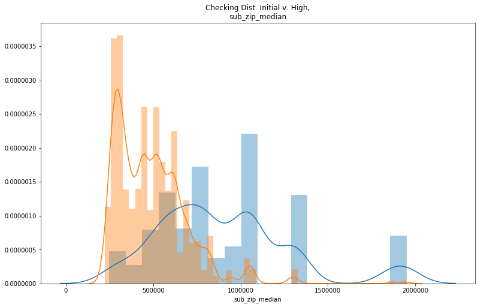


```python
sns.distplot(min_max(data.log_zone_mean))
data['min_max_log_zone_mean'] =min_max(data.log_zone_mean)
data.min_max_log_zone_mean.describe()
```


    count    21597.000000
    mean         0.434736
    std          0.189408
    min          0.000000
    25%          0.285129
    50%          0.428124
    75%          0.544492
    max          1.000000
    Name: min_max_log_zone_mean, dtype: float64


```python
sns.distplot((data.log_zone_mean))
```


    <matplotlib.axes._subplots.AxesSubplot at 0x2a5d6dc9240>


```python
columns= ['log_sqft_living', 'grade', 'min_max_log_zone_mean']

ols, results = make_ols_model(df=data, target='price', columns_to_use=columns, add_constant=False)
plt.figure(figsize= (13,8))
sns.distplot(results.resid, bins=100)
plt.title('Model Residual Dis');
```

                                OLS Regression Results                            
    ==============================================================================
    Dep. Variable:                  price   R-squared:                       0.838
    Model:                            OLS   Adj. R-squared:                  0.838
    Method:                 Least Squares   F-statistic:                 3.722e+04
    Date:                Fri, 27 Sep 2019   Prob (F-statistic):               0.00
    Time:                        10:54:28   Log-Likelihood:            -3.0017e+05
    No. Observations:               21597   AIC:                         6.004e+05
    Df Residuals:                   21594   BIC:                         6.004e+05
    Df Model:                           3                                         
    Covariance Type:            nonrobust                                         
    =========================================================================================
                                coef    std err          t      P>|t|      [0.025      0.975]
    -----------------------------------------------------------------------------------------
    log_sqft_living       -1.513e+05   2036.344    -74.318      0.000   -1.55e+05   -1.47e+05
    grade                  1.826e+05   2061.778     88.574      0.000    1.79e+05    1.87e+05
    min_max_log_zone_mean   6.67e+05   1.01e+04     66.295      0.000    6.47e+05    6.87e+05
    ==============================================================================
    Omnibus:                    21804.054   Durbin-Watson:                   1.979
    Prob(Omnibus):                  0.000   Jarque-Bera (JB):          3137357.661
    Skew:                           4.666   Prob(JB):                         0.00
    Kurtosis:                      61.304   Cond. No.                         60.9
    ==============================================================================
    
    Warnings:
    [1] Standard Errors assume that the covariance matrix of the errors is correctly specified.
    


#### Test 20
Going to min_max scale the grade


```python
data['min_max_grade'] = min_max(data.grade)
```


```python
sns.distplot(min_max(data.grade))

```


    <matplotlib.axes._subplots.AxesSubplot at 0x2a5eba08940>


```python
columns= ['log_sqft_living', 'min_max_grade', 'min_max_log_zone_mean']

ols, results = make_ols_model(df=data, target='price', columns_to_use=columns, add_constant=False)
plt.figure(figsize= (13,8))
sns.distplot(results.resid, bins=100)
plt.title('Model Residual Dis');
data['residual'] = results.resid
keep_data = data.loc[data.residual.abs() <= data.residual.std()*2] # removed anything above 3 std deviation in the residuals. 
removed_data = data.loc[data.residual.abs() > data.residual.std()*2]  
```

                                OLS Regression Results                            
    ==============================================================================
    Dep. Variable:                  price   R-squared:                       0.850
    Model:                            OLS   Adj. R-squared:                  0.850
    Method:                 Least Squares   F-statistic:                 4.071e+04
    Date:                Fri, 27 Sep 2019   Prob (F-statistic):               0.00
    Time:                        10:54:29   Log-Likelihood:            -2.9936e+05
    No. Observations:               21597   AIC:                         5.987e+05
    Df Residuals:                   21594   BIC:                         5.987e+05
    Df Model:                           3                                         
    Covariance Type:            nonrobust                                         
    =========================================================================================
                                coef    std err          t      P>|t|      [0.025      0.975]
    -----------------------------------------------------------------------------------------
    log_sqft_living       -7.693e+04   1132.921    -67.906      0.000   -7.92e+04   -7.47e+04
    min_max_grade          1.812e+06    1.8e+04    100.771      0.000    1.78e+06    1.85e+06
    min_max_log_zone_mean  6.464e+05   9682.277     66.764      0.000    6.27e+05    6.65e+05
    ==============================================================================
    Omnibus:                    22149.579   Durbin-Watson:                   1.977
    Prob(Omnibus):                  0.000   Jarque-Bera (JB):          3498439.884
    Skew:                           4.763   Prob(JB):                         0.00
    Kurtosis:                      64.619   Cond. No.                         80.4
    ==============================================================================
    
    Warnings:
    [1] Standard Errors assume that the covariance matrix of the errors is correctly specified.
    


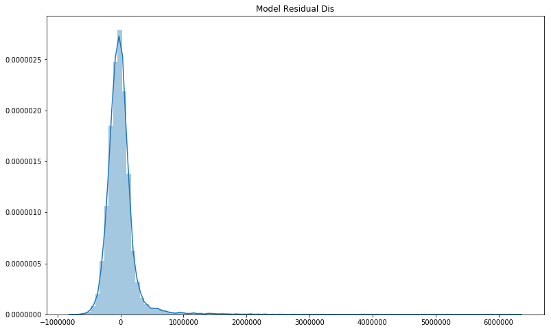


```python
for col in ['price',
'zone_mean', 
'sqft_living',
'grade',
'bedrooms', 
'bathrooms',
'sqft_lot',
'floors',
'waterfront',
'view',
'condition',
'sqft_above',
'sqft_basement',
'yr_built',
'yr_renovated',
'sqft_living15',
'sqft_lot15',
'age',
'since_ren',
'renovated',
'month',
'basement',
'sub_zip_median',
'sub_zip_75q']:
    resd_check(results, data, col)
```


#### Test 21
Adding waterfront


```python
columns= ['log_sqft_living', 'min_max_grade', 'min_max_log_zone_mean', 'waterfront']

ols, results = make_ols_model(df=data, target='price', columns_to_use=columns, add_constant=False)
plt.figure(figsize= (13,8))
sns.distplot(results.resid, bins=100)
plt.title('Model Residual Dis');
data['residual'] = results.resid
keep_data = data.loc[data.residual.abs() <= data.residual.std()*2] # removed anything above 3 std deviation in the residuals. 
removed_data = data.loc[data.residual.abs() > data.residual.std()*2]  
```

                                OLS Regression Results                            
    ==============================================================================
    Dep. Variable:                  price   R-squared:                       0.864
    Model:                            OLS   Adj. R-squared:                  0.864
    Method:                 Least Squares   F-statistic:                 3.434e+04
    Date:                Fri, 27 Sep 2019   Prob (F-statistic):               0.00
    Time:                        10:54:39   Log-Likelihood:            -2.9827e+05
    No. Observations:               21597   AIC:                         5.965e+05
    Df Residuals:                   21593   BIC:                         5.966e+05
    Df Model:                           4                                         
    Covariance Type:            nonrobust                                         
    =========================================================================================
                                coef    std err          t      P>|t|      [0.025      0.975]
    -----------------------------------------------------------------------------------------
    log_sqft_living        -7.42e+04   1078.796    -68.781      0.000   -7.63e+04   -7.21e+04
    min_max_grade          1.753e+06   1.71e+04    102.279      0.000    1.72e+06    1.79e+06
    min_max_log_zone_mean  6.467e+05   9206.794     70.238      0.000    6.29e+05    6.65e+05
    waterfront             9.598e+05   2.01e+04     47.844      0.000    9.21e+05    9.99e+05
    ==============================================================================
    Omnibus:                    20740.126   Durbin-Watson:                   1.970
    Prob(Omnibus):                  0.000   Jarque-Bera (JB):          3093809.677
    Skew:                           4.251   Prob(JB):                         0.00
    Kurtosis:                      61.015   Cond. No.                         93.6
    ==============================================================================
    
    Warnings:
    [1] Standard Errors assume that the covariance matrix of the errors is correctly specified.
    


```python
data.corr().loc[columns]
```


<div>
<style scoped>
    .dataframe tbody tr th:only-of-type {
        vertical-align: middle;
    }

    .dataframe tbody tr th {
        vertical-align: top;
    }

    .dataframe thead th {
        text-align: right;
    }
</style>
<table border="1" class="dataframe">
  <thead>
    <tr style="text-align: right;">
      <th></th>
      <th>id</th>
      <th>price</th>
      <th>bedrooms</th>
      <th>bathrooms</th>
      <th>sqft_living</th>
      <th>sqft_lot</th>
      <th>floors</th>
      <th>waterfront</th>
      <th>view</th>
      <th>condition</th>
      <th>...</th>
      <th>zone_max</th>
      <th>zone_count</th>
      <th>log_grade</th>
      <th>scaled_log_grade</th>
      <th>log_sqft_living</th>
      <th>basement</th>
      <th>log_lat</th>
      <th>min_max_log_zone_mean</th>
      <th>min_max_grade</th>
      <th>residual</th>
    </tr>
  </thead>
  <tbody>
    <tr>
      <th>log_sqft_living</th>
      <td>-0.001864</td>
      <td>0.611839</td>
      <td>0.621820</td>
      <td>0.762135</td>
      <td>0.954607</td>
      <td>0.150102</td>
      <td>0.367564</td>
      <td>0.078900</td>
      <td>0.244804</td>
      <td>-0.049620</td>
      <td>...</td>
      <td>0.128795</td>
      <td>-0.108029</td>
      <td>0.744356</td>
      <td>0.744356</td>
      <td>1.000000</td>
      <td>0.233548</td>
      <td>0.038881</td>
      <td>0.261217</td>
      <td>0.743038</td>
      <td>0.270836</td>
    </tr>
    <tr>
      <th>min_max_grade</th>
      <td>0.008188</td>
      <td>0.667951</td>
      <td>0.356563</td>
      <td>0.665838</td>
      <td>0.762779</td>
      <td>0.114731</td>
      <td>0.458794</td>
      <td>0.082818</td>
      <td>0.249082</td>
      <td>-0.146896</td>
      <td>...</td>
      <td>0.189847</td>
      <td>-0.105987</td>
      <td>0.992855</td>
      <td>0.992855</td>
      <td>0.743038</td>
      <td>0.050701</td>
      <td>0.113687</td>
      <td>0.343140</td>
      <td>1.000000</td>
      <td>0.060409</td>
    </tr>
    <tr>
      <th>min_max_log_zone_mean</th>
      <td>0.013413</td>
      <td>0.532312</td>
      <td>0.115965</td>
      <td>0.214993</td>
      <td>0.281800</td>
      <td>-0.014861</td>
      <td>0.131150</td>
      <td>0.029324</td>
      <td>0.131915</td>
      <td>0.038159</td>
      <td>...</td>
      <td>0.691135</td>
      <td>-0.134829</td>
      <td>0.335044</td>
      <td>0.335044</td>
      <td>0.261217</td>
      <td>0.121546</td>
      <td>0.410482</td>
      <td>1.000000</td>
      <td>0.343140</td>
      <td>0.034923</td>
    </tr>
    <tr>
      <th>waterfront</th>
      <td>-0.003599</td>
      <td>0.264306</td>
      <td>-0.002127</td>
      <td>0.063629</td>
      <td>0.104637</td>
      <td>0.021459</td>
      <td>0.020797</td>
      <td>1.000000</td>
      <td>0.380543</td>
      <td>0.016648</td>
      <td>...</td>
      <td>0.047573</td>
      <td>-0.025526</td>
      <td>0.073448</td>
      <td>0.073448</td>
      <td>0.078900</td>
      <td>0.039220</td>
      <td>-0.012111</td>
      <td>0.029324</td>
      <td>0.082818</td>
      <td>0.001255</td>
    </tr>
  </tbody>
</table>
<p>4 rows × 51 columns</p>
</div>


```python
for col in ['price',
'zone_mean', 
'sqft_living',
'grade',
'bedrooms', 
'bathrooms',
'sqft_lot',
'floors',
'waterfront',
'view',
'condition',
'sqft_above',
'sqft_basement',
'yr_built',
'yr_renovated',
'sqft_living15',
'sqft_lot15',
'age',
'since_ren',
'renovated',
'month',
'basement',
'sub_zip_median',
'sub_zip_75q']:
    resd_check(results, data, col)
```


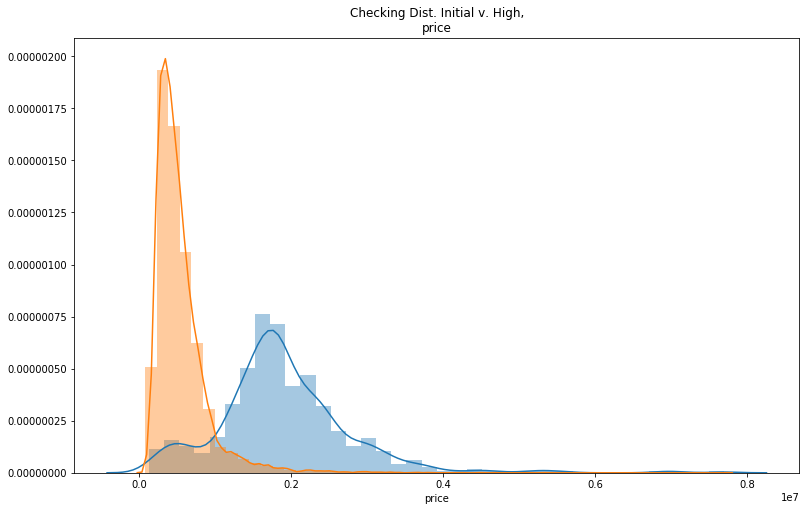


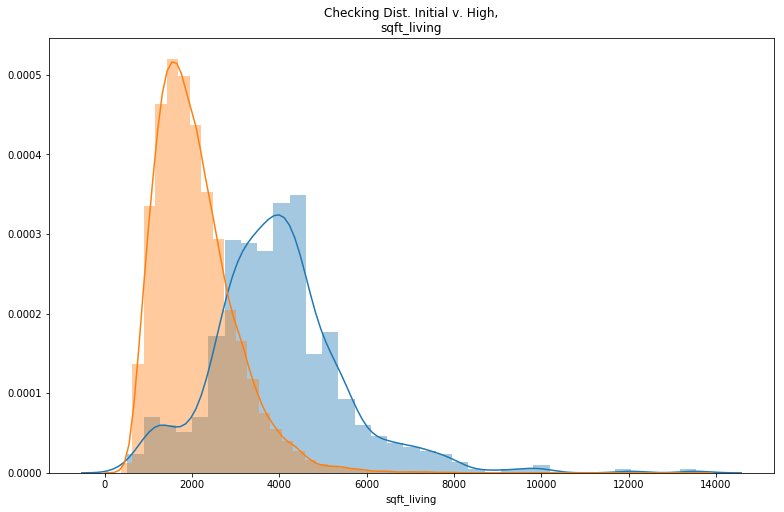


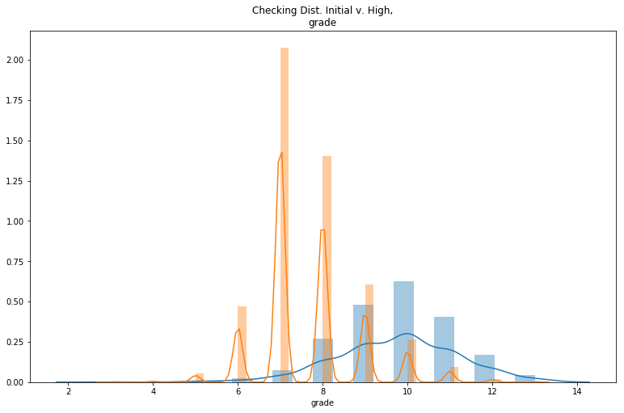


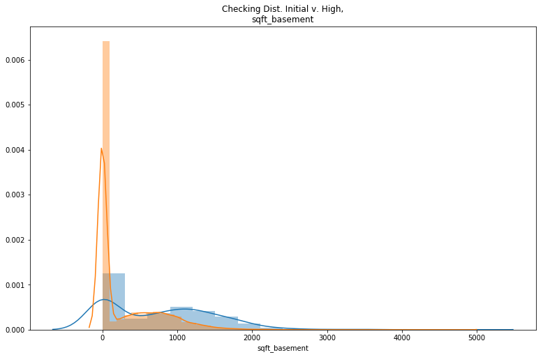


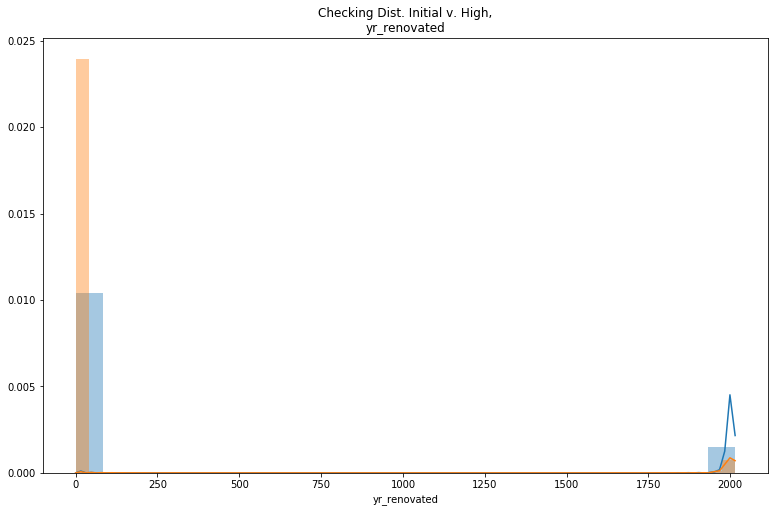


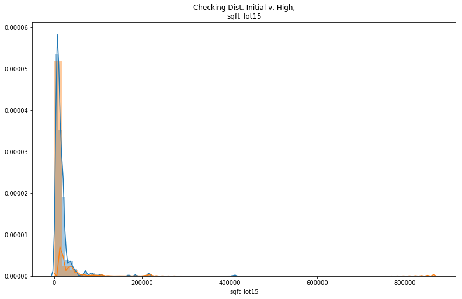


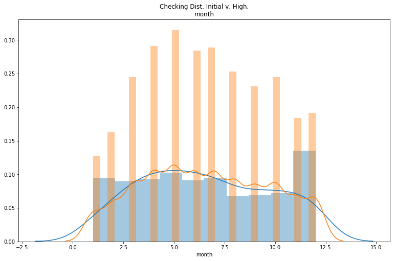


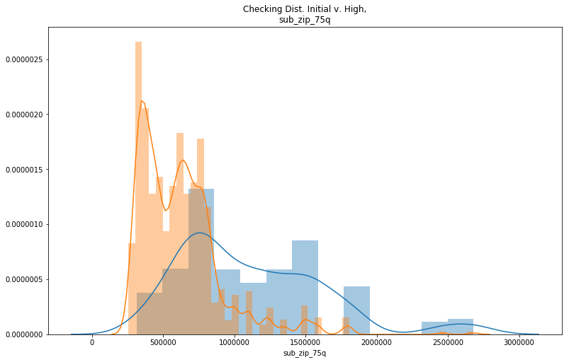


```python

```

#### Separating  residual


```python
data['residual'] = results.resid
keep_data = data.loc[data.residual.abs() <= data.residual.std()*2] # removed anything above 3 std deviation in the residuals. 
removed_data = data.loc[data.residual.abs() > data.residual.std()*2]  
```


```python
a= data.grade.sort_values()


for i in a.unique():
    print(i)
    print(len(keep_data.grade.loc[data.grade == i])/len(data.grade.loc[data.grade == i]))
```

    3
    0.0
    4
    1.0
    5
    0.9669421487603306
    6
    0.9916584887144259
    7
    0.9946512146200134
    8
    0.9798845836768343
    9
    0.9391969407265774
    10
    0.8597883597883598
    11
    0.7192982456140351
    12
    0.48314606741573035
    13
    0.07692307692307693
    

#### New Variable high_grade
Binary variable for grades with that have removed residual percentages in the last model (3 and grades over 9) other grades recieved a one.


```python
data['high_grade'] = data.grade
data.high_grade.loc[(data.high_grade <12) & (data.high_grade > 3)] = 1
data.high_grade.loc[(data.high_grade >= 12) | (data.high_grade == 3)] = 0
```


```python
columns= ['log_sqft_living', 'min_max_grade', 'min_max_log_zone_mean', 'waterfront', 'high_grade']

ols, results = make_ols_model(df=data, target='price', columns_to_use=columns, add_constant=False)
plt.figure(figsize= (13,8))
sns.distplot(results.resid, bins=100)
plt.title('Model Residual Dis');
data['residual'] = results.resid
keep_data = data.loc[data.residual.abs() <= data.residual.std()*2] # removed anything above 3 std deviation in the residuals. 
removed_data = data.loc[data.residual.abs() > data.residual.std()*2]  
```

                                OLS Regression Results                            
    ==============================================================================
    Dep. Variable:                  price   R-squared:                       0.887
    Model:                            OLS   Adj. R-squared:                  0.887
    Method:                 Least Squares   F-statistic:                 3.394e+04
    Date:                Fri, 27 Sep 2019   Prob (F-statistic):               0.00
    Time:                        10:54:49   Log-Likelihood:            -2.9627e+05
    No. Observations:               21597   AIC:                         5.925e+05
    Df Residuals:                   21592   BIC:                         5.926e+05
    Df Model:                           5                                         
    Covariance Type:            nonrobust                                         
    =========================================================================================
                                coef    std err          t      P>|t|      [0.025      0.975]
    -----------------------------------------------------------------------------------------
    log_sqft_living        1.279e+05   3202.965     39.935      0.000    1.22e+05    1.34e+05
    min_max_grade          1.105e+06   1.84e+04     59.916      0.000    1.07e+06    1.14e+06
    min_max_log_zone_mean  6.571e+05   8393.723     78.290      0.000    6.41e+05    6.74e+05
    waterfront             8.766e+05   1.83e+04     47.826      0.000    8.41e+05    9.13e+05
    high_grade            -1.236e+06   1.86e+04    -66.303      0.000   -1.27e+06    -1.2e+06
    ==============================================================================
    Omnibus:                    17069.397   Durbin-Watson:                   1.969
    Prob(Omnibus):                  0.000   Jarque-Bera (JB):          1610754.709
    Skew:                           3.174   Prob(JB):                         0.00
    Kurtosis:                      44.829   Cond. No.                         119.
    ==============================================================================
    
    Warnings:
    [1] Standard Errors assume that the covariance matrix of the errors is correctly specified.
    


```python
for col in ['price',
'zone_mean', 
'sqft_living',
'grade',
'bedrooms', 
'bathrooms',
'sqft_lot',
'floors',
'waterfront',
'view',
'condition',
'sqft_above',
'sqft_basement',
'yr_built',
'yr_renovated',
'sqft_living15',
'sqft_lot15',
'age',
'since_ren',
'renovated',
'month',
'basement',
'sub_zip_median',
'sub_zip_75q']:
    resd_check(results, data, col)
```


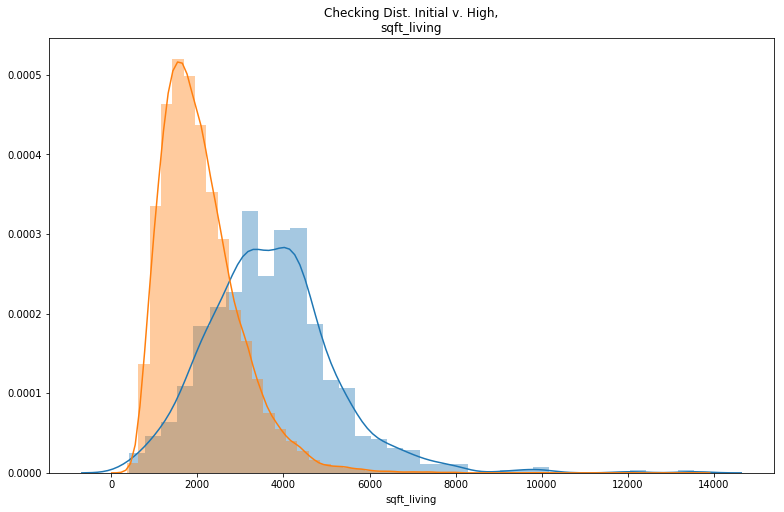


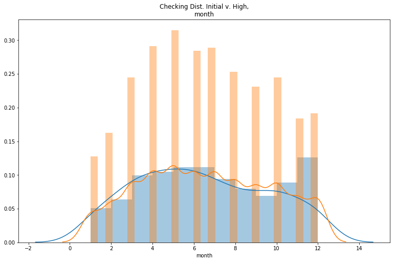


```python
a= data.bin_floors.sort_values()
for i in a.unique():
    print(i)
    print(len(keep_data.bin_floors.loc[data.bin_floors == i])/len(data.bin_floors.loc[data.bin_floors == i]))
```

    1
    0.9798140348088691
    2
    0.9436636493568366
    3
    0.9579288025889967
    


```python
a= data.grade.sort_values()
for i in a.unique():
    print(i)
    print(len(keep_data.grade.loc[data.grade == i])/len(data.grade.loc[data.grade == i]))
```

    3
    0.0
    4
    0.8888888888888888
    5
    0.9669421487603306
    6
    0.9906771344455348
    7
    0.9950969467350123
    8
    0.9782357790601813
    9
    0.9334608030592734
    10
    0.845679012345679
    11
    0.706766917293233
    12
    0.1797752808988764
    13
    0.46153846153846156
    


```python
columns= ['log_sqft_living', 'min_max_grade', 'min_max_log_zone_mean', 'waterfront', 'high_grade', 'bin_floors']

ols, results = make_ols_model(df=data, target='price', columns_to_use=columns, add_constant=False)
plt.figure(figsize= (13,8))
sns.distplot(results.resid, bins=100)
plt.title('Model Residual Dis');
data['residual'] = results.resid
keep_data = data.loc[data.residual.abs() <= data.residual.std()*2] # removed anything above 3 std deviation in the residuals. 
removed_data = data.loc[data.residual.abs() > data.residual.std()*2]  
```

                                OLS Regression Results                            
    ==============================================================================
    Dep. Variable:                  price   R-squared:                       0.888
    Model:                            OLS   Adj. R-squared:                  0.888
    Method:                 Least Squares   F-statistic:                 2.855e+04
    Date:                Fri, 27 Sep 2019   Prob (F-statistic):               0.00
    Time:                        10:54:59   Log-Likelihood:            -2.9618e+05
    No. Observations:               21597   AIC:                         5.924e+05
    Df Residuals:                   21591   BIC:                         5.924e+05
    Df Model:                           6                                         
    Covariance Type:            nonrobust                                         
    =========================================================================================
                                coef    std err          t      P>|t|      [0.025      0.975]
    -----------------------------------------------------------------------------------------
    log_sqft_living        1.278e+05   3189.532     40.074      0.000    1.22e+05    1.34e+05
    min_max_grade          1.203e+06   1.98e+04     60.910      0.000    1.16e+06    1.24e+06
    min_max_log_zone_mean  6.505e+05   8372.934     77.690      0.000    6.34e+05    6.67e+05
    waterfront             8.717e+05   1.83e+04     47.745      0.000    8.36e+05    9.07e+05
    high_grade            -1.218e+06   1.86e+04    -65.457      0.000   -1.25e+06   -1.18e+06
    bin_floors            -4.164e+04   3074.975    -13.541      0.000   -4.77e+04   -3.56e+04
    ==============================================================================
    Omnibus:                    17055.879   Durbin-Watson:                   1.971
    Prob(Omnibus):                  0.000   Jarque-Bera (JB):          1633007.792
    Skew:                           3.165   Prob(JB):                         0.00
    Kurtosis:                      45.127   Cond. No.                         125.
    ==============================================================================
    
    Warnings:
    [1] Standard Errors assume that the covariance matrix of the errors is correctly specified.
    


```python
for col in ['price',
'zone_mean', 
'sqft_living',
'grade',
'bedrooms', 
'bathrooms',
'sqft_lot',
'floors',
'waterfront',
'view',
'condition',
'sqft_above',
'sqft_basement',
'yr_built',
'yr_renovated',
'sqft_living15',
'sqft_lot15',
'age',
'since_ren',
'renovated',
'month',
'basement',
'sub_zip_median',
'sub_zip_75q']:
    resd_check(results, data, col)
```


```python
columns= ['log_sqft_living', 'min_max_grade', 'min_max_log_zone_mean', 'waterfront', 'high_grade', 'bin_floors', 'condition']

ols, results = make_ols_model(df=data, target='price', columns_to_use=columns, add_constant=False)
plt.figure(figsize= (13,8))
sns.distplot(results.resid, bins=100)
plt.title('Model Residual Dis');
data['residual'] = results.resid
keep_data = data.loc[data.residual.abs() <= data.residual.std()*2] # removed anything above 3 std deviation in the residuals. 
removed_data = data.loc[data.residual.abs() > data.residual.std()*2]  
```

                                OLS Regression Results                            
    ==============================================================================
    Dep. Variable:                  price   R-squared:                       0.889
    Model:                            OLS   Adj. R-squared:                  0.889
    Method:                 Least Squares   F-statistic:                 2.471e+04
    Date:                Fri, 27 Sep 2019   Prob (F-statistic):               0.00
    Time:                        10:55:08   Log-Likelihood:            -2.9609e+05
    No. Observations:               21597   AIC:                         5.922e+05
    Df Residuals:                   21590   BIC:                         5.922e+05
    Df Model:                           7                                         
    Covariance Type:            nonrobust                                         
    =========================================================================================
                                coef    std err          t      P>|t|      [0.025      0.975]
    -----------------------------------------------------------------------------------------
    log_sqft_living        1.125e+05   3370.985     33.372      0.000    1.06e+05    1.19e+05
    min_max_grade          1.245e+06   1.99e+04     62.520      0.000    1.21e+06    1.28e+06
    min_max_log_zone_mean  6.407e+05   8368.624     76.564      0.000    6.24e+05    6.57e+05
    waterfront             8.664e+05   1.82e+04     47.645      0.000    8.31e+05    9.02e+05
    high_grade            -1.243e+06   1.86e+04    -66.752      0.000   -1.28e+06   -1.21e+06
    bin_floors            -3.065e+04   3167.317     -9.678      0.000   -3.69e+04   -2.44e+04
    condition              3.222e+04   2375.123     13.565      0.000    2.76e+04    3.69e+04
    ==============================================================================
    Omnibus:                    17075.033   Durbin-Watson:                   1.971
    Prob(Omnibus):                  0.000   Jarque-Bera (JB):          1672176.357
    Skew:                           3.163   Prob(JB):                         0.00
    Kurtosis:                      45.641   Cond. No.                         137.
    ==============================================================================
    
    Warnings:
    [1] Standard Errors assume that the covariance matrix of the errors is correctly specified.
    


```python
data['lot_living'] = data.sqft_lot15- data.sqft_living15
data.lot_living.loc[data.lot_living <= 0] = 0

```


```python
columns= ['log_sqft_living', 'min_max_grade', 'min_max_log_zone_mean', 'waterfront', 'high_grade', 'bin_floors', 'condition']

ols, results = make_ols_model(df=data, target='price', columns_to_use=columns, add_constant=False)
plt.figure(figsize= (13,8))
sns.distplot(results.resid, bins=100)
plt.title('Model Residual Dis');
data['residual'] = results.resid
keep_data = data.loc[data.residual.abs() <= data.residual.std()*2] # removed anything above 3 std deviation in the residuals. 
removed_data = data.loc[data.residual.abs() > data.residual.std()*2]  
```

                                OLS Regression Results                            
    ==============================================================================
    Dep. Variable:                  price   R-squared:                       0.889
    Model:                            OLS   Adj. R-squared:                  0.889
    Method:                 Least Squares   F-statistic:                 2.471e+04
    Date:                Fri, 27 Sep 2019   Prob (F-statistic):               0.00
    Time:                        10:55:09   Log-Likelihood:            -2.9609e+05
    No. Observations:               21597   AIC:                         5.922e+05
    Df Residuals:                   21590   BIC:                         5.922e+05
    Df Model:                           7                                         
    Covariance Type:            nonrobust                                         
    =========================================================================================
                                coef    std err          t      P>|t|      [0.025      0.975]
    -----------------------------------------------------------------------------------------
    log_sqft_living        1.125e+05   3370.985     33.372      0.000    1.06e+05    1.19e+05
    min_max_grade          1.245e+06   1.99e+04     62.520      0.000    1.21e+06    1.28e+06
    min_max_log_zone_mean  6.407e+05   8368.624     76.564      0.000    6.24e+05    6.57e+05
    waterfront             8.664e+05   1.82e+04     47.645      0.000    8.31e+05    9.02e+05
    high_grade            -1.243e+06   1.86e+04    -66.752      0.000   -1.28e+06   -1.21e+06
    bin_floors            -3.065e+04   3167.317     -9.678      0.000   -3.69e+04   -2.44e+04
    condition              3.222e+04   2375.123     13.565      0.000    2.76e+04    3.69e+04
    ==============================================================================
    Omnibus:                    17075.033   Durbin-Watson:                   1.971
    Prob(Omnibus):                  0.000   Jarque-Bera (JB):          1672176.357
    Skew:                           3.163   Prob(JB):                         0.00
    Kurtosis:                      45.641   Cond. No.                         137.
    ==============================================================================
    
    Warnings:
    [1] Standard Errors assume that the covariance matrix of the errors is correctly specified.
    


```python
a= data.bin_bathrooms.sort_values()
for i in a.unique():
    print(i)
    print(len(keep_data.bin_bathrooms.loc[data.bin_bathrooms == i])/len(data.bin_bathrooms.loc[data.bin_bathrooms == i]))
```

    (0.0, 1.75]
    0.9901518747033697
    (1.75, 3.75]
    0.9592699929505757
    (3.75, 8.0]
    0.6169154228855721
    

#### Using the bin_bathrooms
us


```python
data.bin_bathrooms = data.bin_bathrooms.astype(str)

data.bin_bathrooms.loc[data.bin_bathrooms == '(3.75, 8.0]'] = '0'
data.bin_bathrooms.loc[data.bin_bathrooms == '(0.0, 1.75]'] = '1'
data.bin_bathrooms.loc[data.bin_bathrooms == '(1.75, 3.75]'] = '2'
data.bin_bathrooms = data.bin_bathrooms.astype(int)
```


```python
columns= ['log_sqft_living', 'min_max_grade', 'min_max_log_zone_mean', 'waterfront', 'high_grade', 'bin_floors', 'condition', 'bin_bathrooms']

ols, results = make_ols_model(df=data, target='price', columns_to_use=columns, add_constant=False)
plt.figure(figsize= (13,8))
sns.distplot(results.resid, bins=100)
plt.title('Model Residual Dis');
data['residual'] = results.resid
keep_data = data.loc[data.residual.abs() <= data.residual.std()*2] # removed anything above 3 std deviation in the residuals. 
removed_data = data.loc[data.residual.abs() > data.residual.std()*2]  
```

                                OLS Regression Results                            
    ==============================================================================
    Dep. Variable:                  price   R-squared:                       0.891
    Model:                            OLS   Adj. R-squared:                  0.891
    Method:                 Least Squares   F-statistic:                 2.213e+04
    Date:                Fri, 27 Sep 2019   Prob (F-statistic):               0.00
    Time:                        10:55:10   Log-Likelihood:            -2.9586e+05
    No. Observations:               21597   AIC:                         5.917e+05
    Df Residuals:                   21589   BIC:                         5.918e+05
    Df Model:                           8                                         
    Covariance Type:            nonrobust                                         
    =========================================================================================
                                coef    std err          t      P>|t|      [0.025      0.975]
    -----------------------------------------------------------------------------------------
    log_sqft_living        1.214e+05   3362.457     36.103      0.000    1.15e+05    1.28e+05
    min_max_grade          1.274e+06   1.98e+04     64.502      0.000    1.24e+06    1.31e+06
    min_max_log_zone_mean  6.328e+05   8290.969     76.322      0.000    6.17e+05    6.49e+05
    waterfront             8.494e+05    1.8e+04     47.150      0.000    8.14e+05    8.85e+05
    high_grade            -1.236e+06   1.84e+04    -67.055      0.000   -1.27e+06    -1.2e+06
    bin_floors            -1.193e+04   3256.084     -3.663      0.000   -1.83e+04   -5544.462
    condition              3.031e+04   2352.409     12.883      0.000    2.57e+04    3.49e+04
    bin_bathrooms         -6.649e+04   3126.821    -21.264      0.000   -7.26e+04   -6.04e+04
    ==============================================================================
    Omnibus:                    16189.264   Durbin-Watson:                   1.975
    Prob(Omnibus):                  0.000   Jarque-Bera (JB):          1460990.144
    Skew:                           2.920   Prob(JB):                         0.00
    Kurtosis:                      42.868   Cond. No.                         139.
    ==============================================================================
    
    Warnings:
    [1] Standard Errors assume that the covariance matrix of the errors is correctly specified.
    


```python


ols, results = make_ols_model(df=keep_data, target='price', columns_to_use=columns, add_constant=True)
plt.figure(figsize= (13,8))
sns.distplot(results.resid, bins=100)
plt.title('Model Residual Dis');
```

                                OLS Regression Results                            
    ==============================================================================
    Dep. Variable:                  price   R-squared:                       0.944
    Model:                            OLS   Adj. R-squared:                  0.944
    Method:                 Least Squares   F-statistic:                 4.352e+04
    Date:                Fri, 27 Sep 2019   Prob (F-statistic):               0.00
    Time:                        10:55:11   Log-Likelihood:            -2.7552e+05
    No. Observations:               20835   AIC:                         5.510e+05
    Df Residuals:                   20827   BIC:                         5.511e+05
    Df Model:                           8                                         
    Covariance Type:            nonrobust                                         
    =========================================================================================
                                coef    std err          t      P>|t|      [0.025      0.975]
    -----------------------------------------------------------------------------------------
    log_sqft_living         1.71e+05   2799.350     61.068      0.000    1.65e+05    1.76e+05
    min_max_grade          9.031e+05    1.3e+04     69.240      0.000    8.78e+05    9.29e+05
    min_max_log_zone_mean  5.525e+05   5356.026    103.164      0.000    5.42e+05    5.63e+05
    waterfront             7.999e+05   1.64e+04     48.663      0.000    7.68e+05    8.32e+05
    high_grade            -1.481e+06   1.71e+04    -86.503      0.000   -1.51e+06   -1.45e+06
    bin_floors            -5102.8392   2074.898     -2.459      0.014   -9169.800   -1035.878
    condition              3.239e+04   1505.598     21.513      0.000    2.94e+04    3.53e+04
    bin_bathrooms         -4.017e+04   2094.861    -19.174      0.000   -4.43e+04   -3.61e+04
    ==============================================================================
    Omnibus:                     1244.503   Durbin-Watson:                   1.992
    Prob(Omnibus):                  0.000   Jarque-Bera (JB):             1777.209
    Skew:                           0.529   Prob(JB):                         0.00
    Kurtosis:                       3.962   Cond. No.                         177.
    ==============================================================================
    
    Warnings:
    [1] Standard Errors assume that the covariance matrix of the errors is correctly specified.
    


```python

```


```python

```


```python
linreg = LinearRegression(fit_intercept= False)

X = keep_data[columns]
Y = keep_data.price


cv_5_results = cross_val_score(linreg, X, Y, cv=5, scoring="r2", )
```


```python
print(cv_5_results)
print(Y.std(), Y.mean())
l
```

    [0.72062535 0.73258769 0.734121   0.73924078 0.7308158 ]
    258796.8683912203 500636.1260859131
    


    ---------------------------------------------------------------------------

    NotFittedError                            Traceback (most recent call last)

    <ipython-input-450-b13ce6700eea> in <module>()
          1 print(cv_5_results)
          2 print(Y.std(), Y.mean())
    ----> 3 linreg.score(X,Y)
    

    ~\.conda\envs\learn-env\lib\site-packages\sklearn\base.py in score(self, X, y, sample_weight)
        406         from .metrics import r2_score
        407         from .metrics.regression import _check_reg_targets
    --> 408         y_pred = self.predict(X)
        409         # XXX: Remove the check in 0.23
        410         y_type, _, _, _ = _check_reg_targets(y, y_pred, None)
    

    ~\.conda\envs\learn-env\lib\site-packages\sklearn\linear_model\base.py in predict(self, X)
        219             Returns predicted values.
        220         """
    --> 221         return self._decision_function(X)
        222 
        223     _preprocess_data = staticmethod(_preprocess_data)
    

    ~\.conda\envs\learn-env\lib\site-packages\sklearn\linear_model\base.py in _decision_function(self, X)
        200 
        201     def _decision_function(self, X):
    --> 202         check_is_fitted(self, "coef_")
        203 
        204         X = check_array(X, accept_sparse=['csr', 'csc', 'coo'])
    

    ~\.conda\envs\learn-env\lib\site-packages\sklearn\utils\validation.py in check_is_fitted(estimator, attributes, msg, all_or_any)
        912 
        913     if not all_or_any([hasattr(estimator, attr) for attr in attributes]):
    --> 914         raise NotFittedError(msg % {'name': type(estimator).__name__})
        915 
        916 
    

    NotFittedError: This LinearRegression instance is not fitted yet. Call 'fit' with appropriate arguments before using this method.


```python
linreg.score(X, Y)
```


    ---------------------------------------------------------------------------

    NotFittedError                            Traceback (most recent call last)

    <ipython-input-431-a5431be71de5> in <module>()
    ----> 1 linreg.score(X, Y)
    

    ~\.conda\envs\learn-env\lib\site-packages\sklearn\base.py in score(self, X, y, sample_weight)
        406         from .metrics import r2_score
        407         from .metrics.regression import _check_reg_targets
    --> 408         y_pred = self.predict(X)
        409         # XXX: Remove the check in 0.23
        410         y_type, _, _, _ = _check_reg_targets(y, y_pred, None)
    

    ~\.conda\envs\learn-env\lib\site-packages\sklearn\linear_model\base.py in predict(self, X)
        219             Returns predicted values.
        220         """
    --> 221         return self._decision_function(X)
        222 
        223     _preprocess_data = staticmethod(_preprocess_data)
    

    ~\.conda\envs\learn-env\lib\site-packages\sklearn\linear_model\base.py in _decision_function(self, X)
        200 
        201     def _decision_function(self, X):
    --> 202         check_is_fitted(self, "coef_")
        203 
        204         X = check_array(X, accept_sparse=['csr', 'csc', 'coo'])
    

    ~\.conda\envs\learn-env\lib\site-packages\sklearn\utils\validation.py in check_is_fitted(estimator, attributes, msg, all_or_any)
        912 
        913     if not all_or_any([hasattr(estimator, attr) for attr in attributes]):
    --> 914         raise NotFittedError(msg % {'name': type(estimator).__name__})
        915 
        916 
    

    NotFittedError: This LinearRegression instance is not fitted yet. Call 'fit' with appropriate arguments before using this method.


```python
flip.plot.hexbin(figsize= (13,8), x= 'long', y= 'lat', C='change_price')
```


    <matplotlib.axes._subplots.AxesSubplot at 0x2a5ee4d2198>


```python
data.loc[data.zone_mean > data.zone_mean.quantile(.95)].plot.hexbin(figsize= (13,8), x= 'long', y= 'lat', C='zone_count', add)

```


    <matplotlib.axes._subplots.AxesSubplot at 0x2a5ebea37f0>


### Interpret


```python
def generateBaseMap(default_location=[40.693943, -73.985880], default_zoom_start=12):
    base_map = folium.Map(location=default_location, control_scale=True, zoom_start=default_zoom_start, zoom_control= True)
    return base_map 
def feature_heatmap(data, feature_column= 'price', radius= 8):
    base_map = generateBaseMap(default_location=[data.lat.mean()-data.lat.std(), data.long.median()], default_zoom_start=9.0)
    HeatMap(data=data[['lat', 'long', feature_column]].groupby(['lat', 'long']).sum().reset_index().values.tolist(), radius= radius, max_zoom=13).add_to(base_map)
    return base_map
```


```python
feature_heatmap(data, radius= 5)
```


<div style="width:100%;"><div style="position:relative;width:100%;height:0;padding-bottom:60%;"><iframe src="data:text/html;charset=utf-8;base64,PCFET0NUWVBFIGh0bWw+CjxoZWFkPiAgICAKICAgIDxtZXRhIGh0dHAtZXF1aXY9ImNvbnRlbnQtdHlwZSIgY29udGVudD0idGV4dC9odG1sOyBjaGFyc2V0PVVURi04IiAvPgogICAgCiAgICAgICAgPHNjcmlwdD4KICAgICAgICAgICAgTF9OT19UT1VDSCA9IGZhbHNlOwogICAgICAgICAgICBMX0RJU0FCTEVfM0QgPSBmYWxzZTsKICAgICAgICA8L3NjcmlwdD4KICAgIAogICAgPHNjcmlwdCBzcmM9Imh0dHBzOi8vY2RuLmpzZGVsaXZyLm5ldC9ucG0vbGVhZmxldEAxLjUuMS9kaXN0L2xlYWZsZXQuanMiPjwvc2NyaXB0PgogICAgPHNjcmlwdCBzcmM9Imh0dHBzOi8vY29kZS5qcXVlcnkuY29tL2pxdWVyeS0xLjEyLjQubWluLmpzIj48L3NjcmlwdD4KICAgIDxzY3JpcHQgc3JjPSJodHRwczovL21heGNkbi5ib290c3RyYXBjZG4uY29tL2Jvb3RzdHJhcC8zLjIuMC9qcy9ib290c3RyYXAubWluLmpzIj48L3NjcmlwdD4KICAgIDxzY3JpcHQgc3JjPSJodHRwczovL2NkbmpzLmNsb3VkZmxhcmUuY29tL2FqYXgvbGlicy9MZWFmbGV0LmF3ZXNvbWUtbWFya2Vycy8yLjAuMi9sZWFmbGV0LmF3ZXNvbWUtbWFya2Vycy5qcyI+PC9zY3JpcHQ+CiAgICA8bGluayByZWw9InN0eWxlc2hlZXQiIGhyZWY9Imh0dHBzOi8vY2RuLmpzZGVsaXZyLm5ldC9ucG0vbGVhZmxldEAxLjUuMS9kaXN0L2xlYWZsZXQuY3NzIi8+CiAgICA8bGluayByZWw9InN0eWxlc2hlZXQiIGhyZWY9Imh0dHBzOi8vbWF4Y2RuLmJvb3RzdHJhcGNkbi5jb20vYm9vdHN0cmFwLzMuMi4wL2Nzcy9ib290c3RyYXAubWluLmNzcyIvPgogICAgPGxpbmsgcmVsPSJzdHlsZXNoZWV0IiBocmVmPSJodHRwczovL21heGNkbi5ib290c3RyYXBjZG4uY29tL2Jvb3RzdHJhcC8zLjIuMC9jc3MvYm9vdHN0cmFwLXRoZW1lLm1pbi5jc3MiLz4KICAgIDxsaW5rIHJlbD0ic3R5bGVzaGVldCIgaHJlZj0iaHR0cHM6Ly9tYXhjZG4uYm9vdHN0cmFwY2RuLmNvbS9mb250LWF3ZXNvbWUvNC42LjMvY3NzL2ZvbnQtYXdlc29tZS5taW4uY3NzIi8+CiAgICA8bGluayByZWw9InN0eWxlc2hlZXQiIGhyZWY9Imh0dHBzOi8vY2RuanMuY2xvdWRmbGFyZS5jb20vYWpheC9saWJzL0xlYWZsZXQuYXdlc29tZS1tYXJrZXJzLzIuMC4yL2xlYWZsZXQuYXdlc29tZS1tYXJrZXJzLmNzcyIvPgogICAgPGxpbmsgcmVsPSJzdHlsZXNoZWV0IiBocmVmPSJodHRwczovL3Jhd2Nkbi5naXRoYWNrLmNvbS9weXRob24tdmlzdWFsaXphdGlvbi9mb2xpdW0vbWFzdGVyL2ZvbGl1bS90ZW1wbGF0ZXMvbGVhZmxldC5hd2Vzb21lLnJvdGF0ZS5jc3MiLz4KICAgIDxzdHlsZT5odG1sLCBib2R5IHt3aWR0aDogMTAwJTtoZWlnaHQ6IDEwMCU7bWFyZ2luOiAwO3BhZGRpbmc6IDA7fTwvc3R5bGU+CiAgICA8c3R5bGU+I21hcCB7cG9zaXRpb246YWJzb2x1dGU7dG9wOjA7Ym90dG9tOjA7cmlnaHQ6MDtsZWZ0OjA7fTwvc3R5bGU+CiAgICAKICAgICAgICAgICAgPG1ldGEgbmFtZT0idmlld3BvcnQiIGNvbnRlbnQ9IndpZHRoPWRldmljZS13aWR0aCwKICAgICAgICAgICAgICAgIGluaXRpYWwtc2NhbGU9MS4wLCBtYXhpbXVtLXNjYWxlPTEuMCwgdXNlci1zY2FsYWJsZT1ubyIgLz4KICAgICAgICAgICAgPHN0eWxlPgogICAgICAgICAgICAgICAgI21hcF9hNDBiNzY0OWQ2MzY0ZmM5YjIwYjZiNDU5YTJlN2ExMCB7CiAgICAgICAgICAgICAgICAgICAgcG9zaXRpb246IHJlbGF0aXZlOwogICAgICAgICAgICAgICAgICAgIHdpZHRoOiAxMDAuMCU7CiAgICAgICAgICAgICAgICAgICAgaGVpZ2h0OiAxMDAuMCU7CiAgICAgICAgICAgICAgICAgICAgbGVmdDogMC4wJTsKICAgICAgICAgICAgICAgICAgICB0b3A6IDAuMCU7CiAgICAgICAgICAgICAgICB9CiAgICAgICAgICAgIDwvc3R5bGU+CiAgICAgICAgCiAgICA8c2NyaXB0IHNyYz0iaHR0cHM6Ly9sZWFmbGV0LmdpdGh1Yi5pby9MZWFmbGV0LmhlYXQvZGlzdC9sZWFmbGV0LWhlYXQuanMiPjwvc2NyaXB0Pgo8L2hlYWQ+Cjxib2R5PiAgICAKICAgIAogICAgICAgICAgICA8ZGl2IGNsYXNzPSJmb2xpdW0tbWFwIiBpZD0ibWFwX2E0MGI3NjQ5ZDYzNjRmYzliMjBiNmI0NTlhMmU3YTEwIiA+PC9kaXY+CiAgICAgICAgCjwvYm9keT4KPHNjcmlwdD4gICAgCiAgICAKICAgICAgICAgICAgdmFyIG1hcF9hNDBiNzY0OWQ2MzY0ZmM5YjIwYjZiNDU5YTJlN2ExMCA9IEwubWFwKAogICAgICAgICAgICAgICAgIm1hcF9hNDBiNzY0OWQ2MzY0ZmM5YjIwYjZiNDU5YTJlN2ExMCIsCiAgICAgICAgICAgICAgICB7CiAgICAgICAgICAgICAgICAgICAgY2VudGVyOiBbNDcuNDIxNTQxMjI2MjI0MywgLTEyMi4yMzEwMDAwMDAwMDAwMV0sCiAgICAgICAgICAgICAgICAgICAgY3JzOiBMLkNSUy5FUFNHMzg1NywKICAgICAgICAgICAgICAgICAgICB6b29tOiA5LjAsCiAgICAgICAgICAgICAgICAgICAgem9vbUNvbnRyb2w6IHRydWUsCiAgICAgICAgICAgICAgICAgICAgcHJlZmVyQ2FudmFzOiBmYWxzZSwKICAgICAgICAgICAgICAgIH0KICAgICAgICAgICAgKTsKICAgICAgICAgICAgTC5jb250cm9sLnNjYWxlKCkuYWRkVG8obWFwX2E0MGI3NjQ5ZDYzNjRmYzliMjBiNmI0NTlhMmU3YTEwKTsKCiAgICAgICAgICAgIAoKICAgICAgICAKICAgIAogICAgICAgICAgICB2YXIgdGlsZV9sYXllcl9kOWE3NzQ0NDJkOTc0NDVjODdlMmE3Mzk1YmE2ZDc4OCA9IEwudGlsZUxheWVyKAogICAgICAgICAgICAgICAgImh0dHBzOi8ve3N9LnRpbGUub3BlbnN0cmVldG1hcC5vcmcve3p9L3t4fS97eX0ucG5nIiwKICAgICAgICAgICAgICAgIHsiYXR0cmlidXRpb24iOiAiRGF0YSBieSBcdTAwMjZjb3B5OyBcdTAwM2NhIGhyZWY9XCJodHRwOi8vb3BlbnN0cmVldG1hcC5vcmdcIlx1MDAzZU9wZW5TdHJlZXRNYXBcdTAwM2MvYVx1MDAzZSwgdW5kZXIgXHUwMDNjYSBocmVmPVwiaHR0cDovL3d3dy5vcGVuc3RyZWV0bWFwLm9yZy9jb3B5cmlnaHRcIlx1MDAzZU9EYkxcdTAwM2MvYVx1MDAzZS4iLCAiZGV0ZWN0UmV0aW5hIjogZmFsc2UsICJtYXhOYXRpdmVab29tIjogMTgsICJtYXhab29tIjogMTgsICJtaW5ab29tIjogMCwgIm5vV3JhcCI6IGZhbHNlLCAib3BhY2l0eSI6IDEsICJzdWJkb21haW5zIjogImFiYyIsICJ0bXMiOiBmYWxzZX0KICAgICAgICAgICAgKS5hZGRUbyhtYXBfYTQwYjc2NDlkNjM2NGZjOWIyMGI2YjQ1OWEyZTdhMTApOwogICAgICAgIAogICAgCiAgICAgICAgICAgIHZhciBoZWF0X21hcF82YzcyYWJmYmRjMGI0ZmM2ODA1YzAyNGJmNzVjMmQyYSA9IEwuaGVhdExheWVyKAogICAgICAgICAgICAgICAgW1s0Ny4xNTU5LCAtMTIxLjY0NiwgMzgwMDAwLjBdLCBbNDcuMTU5MywgLTEyMS45NTcwMDAwMDAwMDAwMSwgNjg3MDAwLjBdLCBbNDcuMTYyMiwgLTEyMS45NzEsIDc1MDAwMC4wXSwgWzQ3LjE2NDcsIC0xMjEuOTczLCAzMzUwMDAuMF0sIFs0Ny4xNzY0LCAtMTIyLjAyNjAwMDAwMDAwMDAxLCAyNDUwMDAuMF0sIFs0Ny4xNzc1LCAtMTIyLjAyMiwgMzYwMDAwLjBdLCBbNDcuMTc3NiwgLTEyMi4wMTEwMDAwMDAwMDAwMSwgMjMwMDAwLjBdLCBbNDcuMTc3NiwgLTEyMS45NDQsIDQzMjAwMC4wXSwgWzQ3LjE3OTUsIC0xMjIuMDM2LCA3OTAwMDAuMF0sIFs0Ny4xODAzLCAtMTIxLjk3Mzk5OTk5OTk5OTk5LCAyNjUwMDAuMF0sIFs0Ny4xODA4LCAtMTIyLjAyMywgMzUwMDAwLjBdLCBbNDcuMTg0LCAtMTIxLjk1OSwgMzMwMDAwLjBdLCBbNDcuMTg1MywgLTEyMi4wMTcwMDAwMDAwMDAwMSwgMzE2MDAwLjBdLCBbNDcuMTg3OSwgLTEyMS45NzMsIDQ4NzAwMC4wXSwgWzQ3LjE4OTUsIC0xMjIuMDE1LCAzNTAwMDAuMF0sIFs0Ny4xODk2LCAtMTIyLjAxNCwgMzQ2MjkwLjBdLCBbNDcuMTg5NiwgLTEyMi4wMTI5OTk5OTk5OTk5OSwgMzUzMDAwLjBdLCBbNDcuMTksIC0xMjIuMDE2LCAzMjMwMDAuMF0sIFs0Ny4xOSwgLTEyMi4wMTI5OTk5OTk5OTk5OSwgMzM5MDAwLjBdLCBbNDcuMTkwMywgLTEyMi4wMTI5OTk5OTk5OTk5OSwgMzE5OTUwLjBdLCBbNDcuMTkxMywgLTEyMi4wMTUsIDI0NTAwMC4wXSwgWzQ3LjE5MTMsIC0xMjIuMDEyLCAyOTUwMDAuMF0sIFs0Ny4xOTIzLCAtMTIyLjAxNCwgMzE0OTUwLjBdLCBbNDcuMTkyNCwgLTEyMS45ODgsIDI3NTAwMC4wXSwgWzQ3LjE5MjcsIC0xMjIuMDE1LCAyODUwMDAuMF0sIFs0Ny4xOTI3LCAtMTIyLjAxMTAwMDAwMDAwMDAxLCAyNzcwMDAuMF0sIFs0Ny4xOTI3LCAtMTIyLjAxLCAzMzAwMDAuMF0sIFs0Ny4xOTI4LCAtMTIyLjAxLCAzMDMwMDAuMF0sIFs0Ny4xOTMyLCAtMTIyLjAwOCwgMzA4OTUwLjBdLCBbNDcuMTkzNCwgLTEyMS45NzcsIDI3MjAwMC4wXSwgWzQ3LjE5MzYsIC0xMjEuOTgxMDAwMDAwMDAwMDEsIDIzMDAwMC4wXSwgWzQ3LjE5MzcsIC0xMjEuOTksIDI3Mjk1MC4wXSwgWzQ3LjE5MzcsIC0xMjEuOTgsIDI4NTAwMC4wXSwgWzQ3LjE5MzcsIC0xMjEuOTc3LCAzMjUwMDAuMF0sIFs0Ny4xOTM4LCAtMTIxLjk4MTAwMDAwMDAwMDAxLCAyNDAwMDAuMF0sIFs0Ny4xOTM5OTk5OTk5OTk5OTYsIC0xMjEuOTgxMDAwMDAwMDAwMDEsIDI4MDAwMC4wXSwgWzQ3LjE5NDEsIC0xMjIuMDM4LCA0NjgwMDAuMF0sIFs0Ny4xOTQxLCAtMTIxLjk3OSwgMjc1MDAwLjBdLCBbNDcuMTk0MiwgLTEyMS45OSwgMjUyMDAwLjBdLCBbNDcuMTk0MiwgLTEyMS45NzcsIDI4MDAwMC4wXSwgWzQ3LjE5NDMsIC0xMjEuOTkxLCAyNzAwMDAuMF0sIFs0Ny4xOTQ0LCAtMTIyLjAxMjk5OTk5OTk5OTk5LCAyOTcwMDAuMF0sIFs0Ny4xOTQ0LCAtMTIxLjk3Mzk5OTk5OTk5OTk5LCAyNzc1MDAuMF0sIFs0Ny4xOTQ2LCAtMTIyLjAwMjk5OTk5OTk5OTk5LCAyMTUwMDAuMF0sIFs0Ny4xOTQ2LCAtMTIyLjAsIDIwNzIwMC4wXSwgWzQ3LjE5NDcsIC0xMjIuMDA4LCAzMTUwMDAuMF0sIFs0Ny4xOTQ3LCAtMTIxLjk4ODk5OTk5OTk5OTk5LCAyNzE5MDAuMF0sIFs0Ny4xOTQ4LCAtMTIxLjk5OSwgMjAyMDAwLjBdLCBbNDcuMTk0OCwgLTEyMS45NzUsIDUwMzY1My4wXSwgWzQ3LjE5NDgsIC0xMjEuOTczOTk5OTk5OTk5OTksIDI0OTk1MC4wXSwgWzQ3LjE5NDksIC0xMjIuMDEsIDI4MzAwMC4wXSwgWzQ3LjE5NDksIC0xMjEuOTg4OTk5OTk5OTk5OTksIDIzMTIwMC4wXSwgWzQ3LjE5NDksIC0xMjEuOTgyMDAwMDAwMDAwMDEsIDIzNTAwMC4wXSwgWzQ3LjE5NTEsIC0xMjIuMDEsIDM0NDAwMC4wXSwgWzQ3LjE5NTEsIC0xMjIuMDAxLCAyMTgwMDAuMF0sIFs0Ny4xOTUyLCAtMTIxLjk4NiwgMjcyMDAwLjBdLCBbNDcuMTk1MiwgLTEyMS45NzYsIDM0MDAwMC4wXSwgWzQ3LjE5NTUsIC0xMjEuOTk5LCAxODAwMDAuMF0sIFs0Ny4xOTU1LCAtMTIxLjk5MSwgMjczMDAwLjBdLCBbNDcuMTk1NSwgLTEyMS45ODcwMDAwMDAwMDAwMSwgMjIyNTAwLjBdLCBbNDcuMTk1NiwgLTEyMS45ODYsIDIyMDAwMC4wXSwgWzQ3LjE5NTYsIC0xMjEuOTg1LCAyNzkwMDAuMF0sIFs0Ny4xOTU4LCAtMTIyLjAwOSwgMjI1MDAwLjBdLCBbNDcuMTk1OCwgLTEyMi4wMDI5OTk5OTk5OTk5OSwgMTk1MDAwLjBdLCBbNDcuMTk1OCwgLTEyMi4wMDIwMDAwMDAwMDAwMSwgMTg3MDAwLjBdLCBbNDcuMTk1OCwgLTEyMS45NzM5OTk5OTk5OTk5OSwgMjkzMDAwLjBdLCBbNDcuMTk1OSwgLTEyMi4wMSwgMzA1MDAwLjBdLCBbNDcuMTk2MDAwMDAwMDAwMDEsIC0xMjIuMDExMDAwMDAwMDAwMDEsIDMyMDAwMC4wXSwgWzQ3LjE5NjAwMDAwMDAwMDAxLCAtMTIyLjAwNiwgMzQwMDAwLjBdLCBbNDcuMTk2MywgLTEyMS45OTcwMDAwMDAwMDAwMSwgMjE1MDAwLjBdLCBbNDcuMTk2NCwgLTEyMi4wMDksIDMyNDM2MC4wXSwgWzQ3LjE5NjcsIC0xMjEuOTk3OTk5OTk5OTk5OTksIDIzNzUwMC4wXSwgWzQ3LjE5NjcsIC0xMjEuOTY2MDAwMDAwMDAwMDEsIDM2OTAwMC4wXSwgWzQ3LjE5NjksIC0xMjIuMDExMDAwMDAwMDAwMDEsIDI4OTAwMC4wXSwgWzQ3LjE5NzYsIC0xMjEuOTk5LCAyNjk5NTAuMF0sIFs0Ny4xOTgxLCAtMTIyLjAwMjk5OTk5OTk5OTk5LCAyMjUwMDAuMF0sIFs0Ny4xOTgzLCAtMTIyLjAsIDIyNDUwMC4wXSwgWzQ3LjE5ODUsIC0xMjIuMDAxLCAyNDUwMDAuMF0sIFs0Ny4xOTg2LCAtMTIxLjk2NzAwMDAwMDAwMDAxLCAzNDAwMDAuMF0sIFs0Ny4xOTkxLCAtMTIyLjAxMjk5OTk5OTk5OTk5LCAzODAwMDAuMF0sIFs0Ny4xOTk2LCAtMTIyLjAwMjk5OTk5OTk5OTk5LCA0MTUwMDAuMF0sIFs0Ny4yMDAzLCAtMTIxLjk5NjAwMDAwMDAwMDAxLCAxOTk5OTAuMF0sIFs0Ny4yMDA0LCAtMTIyLjAwMjk5OTk5OTk5OTk5LCAyOTUwMDAuMF0sIFs0Ny4yMDA1LCAtMTIxLjk5OSwgMjE5OTUwLjBdLCBbNDcuMjAwOCwgLTEyMS45OTUsIDIxMDAwMC4wXSwgWzQ3LjIwMSwgLTEyMS45OTksIDIyMDAwMC4wXSwgWzQ3LjIwMTIsIC0xMjIuMCwgMjQ1MDAwLjBdLCBbNDcuMjAxNSwgLTEyMi4wMDUsIDI3ODUwMC4wXSwgWzQ3LjIwMTUsIC0xMjIuMDAyOTk5OTk5OTk5OTksIDI2NTAwMC4wXSwgWzQ3LjIwMTYsIC0xMjIuMDA2LCAxOTUwMDAuMF0sIFs0Ny4yMDIsIC0xMjEuOTk0LCAyMDkwMDAuMF0sIFs0Ny4yMDIxLCAtMTIyLjAwMjAwMDAwMDAwMDAxLCAyMjQ5NTAuMF0sIFs0Ny4yMDIxLCAtMTIxLjk5OSwgMjE5OTUwLjBdLCBbNDcuMjAyMSwgLTEyMS45OTYwMDAwMDAwMDAwMSwgMTY5MDAwLjBdLCBbNDcuMjAyNSwgLTEyMS45OTksIDI2MjUwMC4wXSwgWzQ3LjIwMjYsIC0xMjIuMCwgMjM5MDAwLjBdLCBbNDcuMjAyNywgLTEyMi4wLCAyNjQ5NTAuMF0sIFs0Ny4yMDMyLCAtMTIxLjk2NCwgMzEyMDAwLjBdLCBbNDcuMjAzNCwgLTEyMi4wMDI5OTk5OTk5OTk5OSwgNDQ5OTk5LjBdLCBbNDcuMjAzOSwgLTEyMi4wMDI5OTk5OTk5OTk5OSwgMTg1MDAwLjBdLCBbNDcuMjA0MSwgLTEyMi4wMjEsIDM3OTUwMC4wXSwgWzQ3LjIwNDMsIC0xMjIuMDA4LCAxNjUwNTAuMF0sIFs0Ny4yMDQzLCAtMTIxLjk5NjAwMDAwMDAwMDAxLCAyNTcxMDAuMF0sIFs0Ny4yMDQ2LCAtMTIxLjk5NjAwMDAwMDAwMDAxLCA2OTUwMDAuMF0sIFs0Ny4yMDQ4LCAtMTIxLjk5OSwgMjY1MDAwLjBdLCBbNDcuMjA1LCAtMTIxLjk5NjAwMDAwMDAwMDAxLCAyMzEwMDAuMF0sIFs0Ny4yMDUsIC0xMjEuOTk1LCAxOTUwMDAuMF0sIFs0Ny4yMDUxLCAtMTIyLjAwNiwgMjI1MDAwLjBdLCBbNDcuMjA1MiwgLTEyMS45ODcwMDAwMDAwMDAwMSwgMTk1MDAwLjBdLCBbNDcuMjA1MywgLTEyMS45OTMsIDE5NzUwMC4wXSwgWzQ3LjIwNTYsIC0xMjEuOTk5LCAyNTk5NTAuMF0sIFs0Ny4yMDU2LCAtMTIxLjk5NCwgMjQwMDAwLjBdLCBbNDcuMjA1NywgLTEyMi4wMDI5OTk5OTk5OTk5OSwgMjEyMDAwLjBdLCBbNDcuMjA1OCwgLTEyMS45OTcwMDAwMDAwMDAwMSwgMjUwMDAwLjBdLCBbNDcuMjA2LCAtMTIxLjk5Nzk5OTk5OTk5OTk5LCAyNTEwMDAuMF0sIFs0Ny4yMDYyLCAtMTIxLjk5MywgMjk1MDAwLjBdLCBbNDcuMjA2MywgLTEyMi4wMjMsIDI1MzUwMC4wXSwgWzQ3LjIwNjQsIC0xMjEuOTg4LCAxODQ5MDAuMF0sIFs0Ny4yMDY4LCAtMTIxLjk5MiwgMTY5OTAwLjBdLCBbNDcuMjA2OSwgLTEyMi4wMjQsIDQyNTAwMC4wXSwgWzQ3LjIwNjksIC0xMjEuOTg4OTk5OTk5OTk5OTksIDMyNTAwMC4wXSwgWzQ3LjIwNzMsIC0xMjIuMDEyLCAyNDQwMDAuMF0sIFs0Ny4yMDc0LCAtMTIyLjAwMSwgMjM1MDAwLjBdLCBbNDcuMjA3NywgLTEyMi4wMTYsIDI5OTk5MC4wXSwgWzQ3LjIwNzcsIC0xMjIuMDExMDAwMDAwMDAwMDEsIDI0NTAwMC4wXSwgWzQ3LjIwNzcsIC0xMjEuOTkzLCAyMTUwMDAuMF0sIFs0Ny4yMDc4LCAtMTIyLjAwMjk5OTk5OTk5OTk5LCAyNzAwMDAuMF0sIFs0Ny4yMDc5LCAtMTIxLjk5MywgMjE1MDAwLjBdLCBbNDcuMjA3OSwgLTEyMS45NjcwMDAwMDAwMDAwMSwgMzkwNTAwLjBdLCBbNDcuMjA4LCAtMTIxLjk2MywgMzMyMDAwLjBdLCBbNDcuMjA4MiwgLTEyMi4wMDksIDMyNTAwMC4wXSwgWzQ3LjIwODIsIC0xMjEuOTk1LCAyNjIwMDAuMF0sIFs0Ny4yMDgzLCAtMTIyLjAwNSwgMjM1MDAwLjBdLCBbNDcuMjA4NiwgLTEyMS45OTYwMDAwMDAwMDAwMSwgMjQ3MDAwLjBdLCBbNDcuMjA4NywgLTEyMi4wMDksIDMzODE1MC4wXSwgWzQ3LjIwODgsIC0xMjEuOTkyLCAxNzUwMDAuMF0sIFs0Ny4yMDg5LCAtMTIyLjAxMTAwMDAwMDAwMDAxLCAzMjk5OTAuMF0sIFs0Ny4yMDg5LCAtMTIyLjAwMjk5OTk5OTk5OTk5LCAyNzAwMDAuMF0sIFs0Ny4yMDg5OTk5OTk5OTk5OTYsIC0xMjIuMDEyLCAyNTAwMDAuMF0sIFs0Ny4yMDg5OTk5OTk5OTk5OTYsIC0xMjIuMDA1LCAyNDkwMDAuMF0sIFs0Ny4yMDkxLCAtMTIyLjAwOSwgNTg4MDE2LjBdLCBbNDcuMjA5MiwgLTEyMS45OTcwMDAwMDAwMDAwMSwgMjE5MDAwLjBdLCBbNDcuMjA5MywgLTEyMi4wMDUsIDE4ODAwMC4wXSwgWzQ3LjIwOTMsIC0xMjIuMCwgMjI1MDAwLjBdLCBbNDcuMjA5MywgLTEyMS45NjIsIDI2OTUwMC4wXSwgWzQ3LjIwOTQsIC0xMjEuOTk2MDAwMDAwMDAwMDEsIDIyNzAwMC4wXSwgWzQ3LjIwOTgsIC0xMjIuMDE2LCA0OTUwMDAuMF0sIFs0Ny4yMDk4LCAtMTIyLjAwMzk5OTk5OTk5OTk5LCAyNTUwMDAuMF0sIFs0Ny4yMDk5LCAtMTIyLjA0Mjk5OTk5OTk5OTk5LCAyMjAwMDAuMF0sIFs0Ny4yMDk5LCAtMTIyLjAwMSwgMTk5OTUwLjBdLCBbNDcuMjEwMywgLTEyMS45OTksIDI4MzAwMC4wXSwgWzQ3LjIxMDUsIC0xMjEuOTg4OTk5OTk5OTk5OTksIDIxMDAwMC4wXSwgWzQ3LjIxMDcsIC0xMjEuOTksIDE1MjkwMC4wXSwgWzQ3LjIxMDksIC0xMjEuOTg3MDAwMDAwMDAwMDEsIDIxNjUwMC4wXSwgWzQ3LjIxMDksIC0xMjEuOTg1LCAxMjIwMDAuMF0sIFs0Ny4yMTEzLCAtMTIxLjk5MywgMjAwMDAwLjBdLCBbNDcuMjExMywgLTEyMS45OTIsIDIwNTUwMC4wXSwgWzQ3LjIxMTQsIC0xMjIuMDA5LCAyOTAwMDAuMF0sIFs0Ny4yMTE0LCAtMTIxLjk4NiwgMjAwMDAwLjBdLCBbNDcuMjExNywgLTEyMS45OSwgMjY3MDAwLjBdLCBbNDcuMjExOCwgLTEyMS45ODI5OTk5OTk5OTk5OSwgMjQ2NTAwLjBdLCBbNDcuMjExOSwgLTEyMi4wMDEsIDM3MDAwMC4wXSwgWzQ3LjIxMjMsIC0xMjIuMDA1LCA1MjUwMDAuMF0sIFs0Ny4yMTI0LCAtMTIyLjAwNSwgNTM1MDAwLjBdLCBbNDcuMjEyNiwgLTEyMS45ODQsIDI3MjAwMC4wXSwgWzQ3LjIxMzIsIC0xMjIuMDAxLCAyNjUwMDAuMF0sIFs0Ny4yMTMzLCAtMTIyLjAwNywgNDE1MDAwLjBdLCBbNDcuMjEzNywgLTEyMS45ODg5OTk5OTk5OTk5OSwgNTQyMDAwLjBdLCBbNDcuMjEzOCwgLTEyMS45ODIwMDAwMDAwMDAwMSwgMjk5MDAwLjBdLCBbNDcuMjE0LCAtMTIxLjk5MywgMzQyNTAwLjBdLCBbNDcuMjE0MiwgLTEyMS45ODcwMDAwMDAwMDAwMSwgMjQzMDAwLjBdLCBbNDcuMjE1MSwgLTEyMS45OTMsIDE5OTAwMC4wXSwgWzQ3LjIxNTYsIC0xMjIuMDI5LCAzMjcwMDAuMF0sIFs0Ny4yMTU5LCAtMTIxLjk2NjAwMDAwMDAwMDAxLCAyNTEwMDAuMF0sIFs0Ny4yMTU5LCAtMTIxLjk2NCwgMjIwMDAwLjBdLCBbNDcuMjE2MywgLTEyMS45ODQsIDE5MjUwMC4wXSwgWzQ3LjIxNzUsIC0xMjEuOTk1LCAzNTgwMDAuMF0sIFs0Ny4yMTk0LCAtMTIyLjA1OSwgMzMwMDAwLjBdLCBbNDcuMjIwMiwgLTEyMS45OTMsIDI3OTAwMC4wXSwgWzQ3LjIyMDcsIC0xMjEuOTg0LCAzOTcwMDAuMF0sIFs0Ny4yMjE1LCAtMTIyLjA2NzAwMDAwMDAwMDAxLCA1MzAwMDAuMF0sIFs0Ny4yMjE3LCAtMTIyLjA2Mjk5OTk5OTk5OTk5LCAzNDk5OTAuMF0sIFs0Ny4yMjIxLCAtMTIyLjA1OSwgNDc0MDAwLjBdLCBbNDcuMjI0MSwgLTEyMi4wNzIsIDM5OTk1MC4wXSwgWzQ3LjIyOCwgLTEyMi4wODgsIDMwMjAwMC4wXSwgWzQ3LjIzMDMsIC0xMjEuOTM2LCA0MjgwMDAuMF0sIFs0Ny4yMzA5LCAtMTIyLjAwOSwgNDc1MDAwLjBdLCBbNDcuMjMxMywgLTEyMi4wMjMsIDcwMDAwMC4wXSwgWzQ3LjIzMjgsIC0xMjEuOTQ1LCA1MjUwMDAuMF0sIFs0Ny4yMzMyLCAtMTIyLjAyOSwgODU4MDAwLjBdLCBbNDcuMjM3NywgLTEyMi4wMTYsIDMyNTAwMC4wXSwgWzQ3LjIzOCwgLTEyMi4wMzksIDIwMTAwMC4wXSwgWzQ3LjIzOTYsIC0xMjEuOTkzLCA0Mzg5NTAuMF0sIFs0Ny4yNDA3LCAtMTIxLjk1Mjk5OTk5OTk5OTk5LCA2NjcwMDAuMF0sIFs0Ny4yNDEwMDAwMDAwMDAwMSwgLTEyMS45NzksIDQ3MzAwMC4wXSwgWzQ3LjI0MTEsIC0xMjIuMDQyOTk5OTk5OTk5OTksIDI0Mzk1MC4wXSwgWzQ3LjI0MTEsIC0xMjEuOTMyLCA1NzAwMDAuMF0sIFs0Ny4yNDEzLCAtMTIxLjk3MjAwMDAwMDAwMDAxLCA1MzAwMDAuMF0sIFs0Ny4yNDE2LCAtMTIxLjk3OSwgNDcwMDAwLjBdLCBbNDcuMjQ1OCwgLTEyMi4wMDIwMDAwMDAwMDAwMSwgNzA1MDAwLjBdLCBbNDcuMjQ3NywgLTEyMS45MzcwMDAwMDAwMDAwMSwgMzMwMDAwLjBdLCBbNDcuMjQ4NSwgLTEyMi4xMDEsIDQ1MDAwMC4wXSwgWzQ3LjI0OTIsIC0xMjEuOTc1LCA1NTAwMDAuMF0sIFs0Ny4yNDk1LCAtMTIxLjk3LCAzNzAwMDAuMF0sIFs0Ny4yNDk4LCAtMTIyLjAwMjk5OTk5OTk5OTk5LCA1OTk5NTAuMF0sIFs0Ny4yNTA0LCAtMTIyLjAsIDQzMDAwMC4wXSwgWzQ3LjI1MDcsIC0xMjIuMDM5LCAyNDYwMDAuMF0sIFs0Ny4yNTI3LCAtMTIxLjk4LCA0OTUwMDAuMF0sIFs0Ny4yNTU4LCAtMTIyLjEyMjAwMDAwMDAwMDAxLCAyNTAwMDAuMF0sIFs0Ny4yNTU4LCAtMTIyLjAyNCwgMzA1MDAwLjBdLCBbNDcuMjU1OSwgLTEyMi4wMDcsIDMxNTAwMC4wXSwgWzQ3LjI1NjgsIC0xMjIuMDcsIDI2NzMwMC4wXSwgWzQ3LjI1NjgsIC0xMjEuOTUyMDAwMDAwMDAwMDEsIDQ3NTAwMC4wXSwgWzQ3LjI1NzQsIC0xMjIuMzEsIDI0NDAwMC4wXSwgWzQ3LjI1NzQsIC0xMjIuMDcyLCAyODAwMDAuMF0sIFs0Ny4yNTc1LCAtMTIyLjMxMjAwMDAwMDAwMDAxLCAzMjAwMDAuMF0sIFs0Ny4yNTc1LCAtMTIyLjMwNSwgMTkwNTAwLjBdLCBbNDcuMjU3NiwgLTEyMi4yNTUsIDIyNzAwMC4wXSwgWzQ3LjI1NzYsIC0xMjIuMjE0LCAyNjU1MDAuMF0sIFs0Ny4yNTc2LCAtMTIyLjA5ODk5OTk5OTk5OTk5LCAzMjMwMDAuMF0sIFs0Ny4yNTc3LCAtMTIyLjE5OCwgMzAzMjEwLjBdLCBbNDcuMjU3OCwgLTEyMi4yMTcwMDAwMDAwMDAwMSwgMjY1MDAwLjBdLCBbNDcuMjU3OSwgLTEyMi4zMTIwMDAwMDAwMDAwMSwgMjcyMDAwLjBdLCBbNDcuMjU4LCAtMTIyLjMwNSwgMzE1MDAwLjBdLCBbNDcuMjU4LCAtMTIyLjI1MjAwMDAwMDAwMDAxLCAxNjAwMDAuMF0sIFs0Ny4yNTgsIC0xMjIuMjA4LCAyNTQ1MDAuMF0sIFs0Ny4yNTgxLCAtMTIyLjIsIDMyODAwMC4wXSwgWzQ3LjI1ODIsIC0xMjIuMjIzLCA0Mjc1MDAuMF0sIFs0Ny4yNTgyLCAtMTIyLjE5OCwgMjc0OTUwLjBdLCBbNDcuMjU4MiwgLTEyMi4xOTYsIDMzOTk5MC4wXSwgWzQ3LjI1ODIsIC0xMjIuMTEzLCAyOTMwMDAuMF0sIFs0Ny4yNTgyLCAtMTIxLjkzNSwgMzY3MDAwLjBdLCBbNDcuMjU4MywgLTEyMi4zLCAyODAwMDAuMF0sIFs0Ny4yNTgzLCAtMTIyLjIwMjk5OTk5OTk5OTk5LCAyODAwMDAuMF0sIFs0Ny4yNTgzLCAtMTIyLjE5OCwgMzA5NzgwLjBdLCBbNDcuMjU4NCwgLTEyMi4xOTYsIDMzNTYwNi4wXSwgWzQ3LjI1ODQsIC0xMjIuMTI0LCAzNDUwMDAuMF0sIFs0Ny4yNTg0LCAtMTIyLjA5Mjk5OTk5OTk5OTk5LCAzNTUwMDAuMF0sIFs0Ny4yNTg1LCAtMTIyLjIwMTAwMDAwMDAwMDAxLCAyNzk5NTAuMF0sIFs0Ny4yNTg1LCAtMTIyLjA2MSwgNDAwMDAwLjBdLCBbNDcuMjU4NSwgLTEyMS45MjUsIDM3ODAwMC4wXSwgWzQ3LjI1ODYsIC0xMjIuMjIxLCAzNTk4MDAuMF0sIFs0Ny4yNTg2LCAtMTIyLjIsIDI3OTAwMC4wXSwgWzQ3LjI1ODYsIC0xMjIuMTk0LCAzOTk4OTUuMF0sIFs0Ny4yNTg3LCAtMTIyLjI1Mjk5OTk5OTk5OTk5LCAyMTIwMDAuMF0sIFs0Ny4yNTg4LCAtMTIyLjIxLCAzMTYwMDAuMF0sIFs0Ny4yNTg5LCAtMTIyLjI3OSwgMjIwMDAwLjBdLCBbNDcuMjU4OSwgLTEyMi4yNTYsIDI1MDAwMC4wXSwgWzQ3LjI1ODk5OTk5OTk5OTk5LCAtMTIyLjI1NiwgMjU1MDAwLjBdLCBbNDcuMjU4OTk5OTk5OTk5OTksIC0xMjIuMjE1LCAzMDA0OTkuMF0sIFs0Ny4yNTg5OTk5OTk5OTk5OSwgLTEyMi4yMDIwMDAwMDAwMDAwMSwgMzMzMDAwLjBdLCBbNDcuMjU5MiwgLTEyMi4zMDQsIDQxMDUwMC4wXSwgWzQ3LjI1OTIsIC0xMjIuMjkxLCAyODkwMDAuMF0sIFs0Ny4yNTkyLCAtMTIyLjIyOCwgNDAwMDAwLjBdLCBbNDcuMjU5MiwgLTEyMi4xOTQsIDM5MjQ0MC4wXSwgWzQ3LjI1OTMsIC0xMjIuMzEyMDAwMDAwMDAwMDEsIDIzMDAwMC4wXSwgWzQ3LjI1OTMsIC0xMjIuMjIyMDAwMDAwMDAwMDEsIDM2MDAwMC4wXSwgWzQ3LjI1OTUsIC0xMjIuMjE3OTk5OTk5OTk5OTksIDI2ODAwMC4wXSwgWzQ3LjI1OTUsIC0xMjIuMjAyMDAwMDAwMDAwMDEsIDMyOTkwMC4wXSwgWzQ3LjI1OTYsIC0xMjIuMzA0LCAzMTIyMDAuMF0sIFs0Ny4yNTk2LCAtMTIyLjE5NCwgNDI1OTk2LjBdLCBbNDcuMjU5NywgLTEyMi4zMSwgMzA5OTAwLjBdLCBbNDcuMjU5NywgLTEyMi4yMjgsIDMyNTAwMC4wXSwgWzQ3LjI1OTcsIC0xMjIuMTk5LCAzMTAwMDAuMF0sIFs0Ny4yNTk4LCAtMTIyLjMxMSwgMjUwMDAwLjBdLCBbNDcuMjU5OCwgLTEyMi4zMDQsIDQyNTAwMC4wXSwgWzQ3LjI1OTgsIC0xMjIuMjgxLCA0OTUwMDAuMF0sIFs0Ny4yNTk5LCAtMTIyLjI4Mjk5OTk5OTk5OTk5LCAzMjk5OTUuMF0sIFs0Ny4yNTk5LCAtMTIyLjI1NiwgMzE3NTAwLjBdLCBbNDcuMjU5OSwgLTEyMi4yMTUsIDMxMzAwMC4wXSwgWzQ3LjI1OTksIC0xMjIuMTkyMDAwMDAwMDAwMDEsIDQxODM5NS4wXSwgWzQ3LjI2MDEsIC0xMjIuMjg2LCAyNTAwMDAuMF0sIFs0Ny4yNjAyLCAtMTIyLjI4Mzk5OTk5OTk5OTk5LCAzMDkwMDAuMF0sIFs0Ny4yNjAyLCAtMTIyLjI1MjAwMDAwMDAwMDAxLCAyODAwMDAuMF0sIFs0Ny4yNjAyLCAtMTIyLjI0NjAwMDAwMDAwMDAxLCAyNzQ5MDAuMF0sIFs0Ny4yNjAyLCAtMTIyLjIxOSwgMjk3MzAwLjBdLCBbNDcuMjYwMywgLTEyMi4xOTUsIDQ3ODgzMC4wXSwgWzQ3LjI2MDMsIC0xMjIuMTk0LCA4MTI1NTUuMF0sIFs0Ny4yNjA0LCAtMTIyLjEzOSwgOTAwMDAwLjBdLCBbNDcuMjYwNCwgLTEyMi4wMjMsIDMyOTk5OS4wXSwgWzQ3LjI2MDYsIC0xMjIuMjg1LCAyOTkwMDAuMF0sIFs0Ny4yNjA2LCAtMTIyLjI1Mzk5OTk5OTk5OTk5LCAyNjk5NTAuMF0sIFs0Ny4yNjA2LCAtMTIyLjI1Mjk5OTk5OTk5OTk5LCAyMzUyNDUuMF0sIFs0Ny4yNjA3LCAtMTIyLjI1LCAyMDUwMDAuMF0sIFs0Ny4yNjA4LCAtMTIyLjIwOSwgMjcwMDAwLjBdLCBbNDcuMjYwOSwgLTEyMi4yODksIDM1NTAwMC4wXSwgWzQ3LjI2MDksIC0xMjIuMjcsIDUxNTAwMC4wXSwgWzQ3LjI2MSwgLTEyMi4yMTksIDMyNDkwMC4wXSwgWzQ3LjI2MTEsIC0xMjIuMTk4LCAyODcwMDAuMF0sIFs0Ny4yNjEyLCAtMTIyLjI5NCwgMzc1MDAwLjBdLCBbNDcuMjYxMywgLTEyMi4zMDIsIDIzNjAwMC4wXSwgWzQ3LjI2MTMsIC0xMjIuMjU1LCAyMjc5NTAuMF0sIFs0Ny4yNjEzLCAtMTIyLjI0Nzk5OTk5OTk5OTk5LCAyMTU1MDAuMF0sIFs0Ny4yNjE0LCAtMTIyLjI5LCAzNDAwMDAuMF0sIFs0Ny4yNjE1LCAtMTIyLjI1MjAwMDAwMDAwMDAxLCAyNzA1MDAuMF0sIFs0Ny4yNjE1LCAtMTIyLjIyMSwgMjUwMDAwLjBdLCBbNDcuMjYxNSwgLTEyMi4xOTgsIDI5OTAwMC4wXSwgWzQ3LjI2MTYsIC0xMjIuMjk2LCAzOTUwMDAuMF0sIFs0Ny4yNjE2LCAtMTIyLjI4MSwgMjU1MDAwLjBdLCBbNDcuMjYxNiwgLTEyMi4yNTEsIDE3NDAwMC4wXSwgWzQ3LjI2MTcsIC0xMjIuMjEsIDI2OTEwMC4wXSwgWzQ3LjI2MTcsIC0xMjIuMTksIDQwMDAwMC4wXSwgWzQ3LjI2MTgsIC0xMjIuMjA5LCAzMTk5MDAuMF0sIFs0Ny4yNjE4LCAtMTIyLjEyLCAzOTUwMDAuMF0sIFs0Ny4yNjE5LCAtMTIyLjMwNzk5OTk5OTk5OTk5LCAyOTcyNjIuMF0sIFs0Ny4yNjE5LCAtMTIyLjI5Nzk5OTk5OTk5OTk5LCAyMDU1MDAuMF0sIFs0Ny4yNjE5LCAtMTIyLjI3MSwgNDYwMDAwLjBdLCBbNDcuMjYyLCAtMTIyLjIyLCAzNTUwMDAuMF0sIFs0Ny4yNjIxLCAtMTIyLjMwNzk5OTk5OTk5OTk5LCAyNTgwMDAuMF0sIFs0Ny4yNjIxLCAtMTIyLjIyMSwgMjYyMDAwLjBdLCBbNDcuMjYyMSwgLTEyMi4yMTc5OTk5OTk5OTk5OSwgMzM2MDAwLjBdLCBbNDcuMjYyMiwgLTEyMi4zMDMsIDI5OTUwMC4wXSwgWzQ3LjI2MjIsIC0xMjIuMjgyMDAwMDAwMDAwMDEsIDIxMDUwMC4wXSwgWzQ3LjI2MjIsIC0xMjIuMjE5LCAyNjQ1MDAuMF0sIFs0Ny4yNjIyLCAtMTIyLjIxMiwgMzI5MDAwLjBdLCBbNDcuMjYyMywgLTEyMi4zMDUsIDMwMDAwMC4wXSwgWzQ3LjI2MjMsIC0xMjIuMjE3MDAwMDAwMDAwMDEsIDIwNTAwMC4wXSwgWzQ3LjI2MjQsIC0xMjIuMjk4OTk5OTk5OTk5OTksIDI3MzAwMC4wXSwgWzQ3LjI2MjQsIC0xMjIuMjIxLCAyNTUwMDAuMF0sIFs0Ny4yNjI0LCAtMTIyLjAxNSwgMzMwMDAwLjBdLCBbNDcuMjYyNSwgLTEyMi4zMDc5OTk5OTk5OTk5OSwgMzU5MDAwLjBdLCBbNDcuMjYyNSwgLTEyMi4zLCAyMjEwMDAuMF0sIFs0Ny4yNjI1LCAtMTIyLjIyMSwgMjYwMDAwLjBdLCBbNDcuMjYyNiwgLTEyMi4yMTc5OTk5OTk5OTk5OSwgMjg1MTY3LjBdLCBbNDcuMjYyNywgLTEyMi4yMTUsIDMyOTgwMC4wXSwgWzQ3LjI2MjgsIC0xMjIuMDMsIDMxNDAwMC4wXSwgWzQ3LjI2MjksIC0xMjIuMjc1LCAxNzI1MDAuMF0sIFs0Ny4yNjMwMDAwMDAwMDAwMSwgLTEyMi4yNDIsIDIzNDAwMC4wXSwgWzQ3LjI2MzAwMDAwMDAwMDAxLCAtMTIyLjIxNjAwMDAwMDAwMDAxLCA1MzcwMDAuMF0sIFs0Ny4yNjMxLCAtMTIyLjIxMiwgMzMyMTAwLjBdLCBbNDcuMjYzMSwgLTEyMi4wMTg5OTk5OTk5OTk5OSwgMjk3MDAwLjBdLCBbNDcuMjYzMiwgLTEyMi4yMDksIDMyMDAwMC4wXSwgWzQ3LjI2MzMsIC0xMjIuMjgxLCAyNDAwMDAuMF0sIFs0Ny4yNjMzLCAtMTIyLjI0NSwgMjAxMDAwLjBdLCBbNDcuMjYzMywgLTEyMi4yNDQsIDE5NDI1MC4wXSwgWzQ3LjI2MzQsIC0xMjIuMzEyMDAwMDAwMDAwMDEsIDMzNjAwMC4wXSwgWzQ3LjI2MzQsIC0xMjIuMjg5LCAyNTgwMDAuMF0sIFs0Ny4yNjM0LCAtMTIyLjIxMSwgMzQ2MzAwLjBdLCBbNDcuMjYzNSwgLTEyMi4zMTIwMDAwMDAwMDAwMSwgMzA0MDAwLjBdLCBbNDcuMjYzNSwgLTEyMi4yODM5OTk5OTk5OTk5OSwgMjc2MDAwLjBdLCBbNDcuMjYzNSwgLTEyMi4yMDksIDMyNzAwMC4wXSwgWzQ3LjI2MzYsIC0xMjIuMjEyLCAzMDg5MDAuMF0sIFs0Ny4yNjM4LCAtMTIyLjI0MywgMjYwMDAwLjBdLCBbNDcuMjYzOSwgLTEyMi4zMDMsIDI0MjAwMC4wXSwgWzQ3LjI2MzksIC0xMjIuMjg1LCAyNTAwMDAuMF0sIFs0Ny4yNjM5LCAtMTIyLjI1MjAwMDAwMDAwMDAxLCAyMzAwMDAuMF0sIFs0Ny4yNjM5OTk5OTk5OTk5OTYsIC0xMjIuMjU4LCAxMjQ1MDAuMF0sIFs0Ny4yNjQxLCAtMTIyLjMxMjAwMDAwMDAwMDAxLCAzMzQ5NTAuMF0sIFs0Ny4yNjQxLCAtMTIyLjIxNSwgNDgwMDAwLjBdLCBbNDcuMjY0MiwgLTEyMi4yNTgsIDE3MTUwMC4wXSwgWzQ3LjI2NDIsIC0xMjIuMjE5LCAyNzMwMDAuMF0sIFs0Ny4yNjQyLCAtMTIyLjIxMywgMjcyMDAwLjBdLCBbNDcuMjY0MiwgLTEyMi4xODcwMDAwMDAwMDAwMSwgNzk5OTUwLjBdLCBbNDcuMjY0MywgLTEyMi4yMiwgMzQwMDAwLjBdLCBbNDcuMjY0NSwgLTEyMi4xNjMsIDQ3NTAwMC4wXSwgWzQ3LjI2NDYsIC0xMjIuMjE5LCAyNDkwMDAuMF0sIFs0Ny4yNjQ3LCAtMTIyLjIyMSwgMjk0MDAwLjBdLCBbNDcuMjY0OSwgLTEyMi4yOTIsIDMzNTAwMC4wXSwgWzQ3LjI2NDksIC0xMjIuMjg1LCAxODUwMDAuMF0sIFs0Ny4yNjQ5LCAtMTIyLjI1MjAwMDAwMDAwMDAxLCAyMjI0MDAuMF0sIFs0Ny4yNjQ5LCAtMTIyLjI0MiwgMTkwMDAwLjBdLCBbNDcuMjY0OSwgLTEyMi4yMTc5OTk5OTk5OTk5OSwgMzIyNTAwLjBdLCBbNDcuMjY1LCAtMTIyLjMwMiwgMzgzMTUwLjBdLCBbNDcuMjY1LCAtMTIyLjIyLCAzMTk5NTAuMF0sIFs0Ny4yNjUzLCAtMTIyLjI4NSwgMjM5OTUwLjBdLCBbNDcuMjY1MywgLTEyMS45MSwgMjc1MDAwLjBdLCBbNDcuMjY1NCwgLTEyMi4yMTcwMDAwMDAwMDAwMSwgMzI5OTUwLjBdLCBbNDcuMjY1NCwgLTEyMi4yMTYwMDAwMDAwMDAwMSwgMzMxOTUwLjBdLCBbNDcuMjY1NSwgLTEyMi4zMSwgNDI5OTAwLjBdLCBbNDcuMjY1NSwgLTEyMi4yNDQsIDExMDAwMC4wXSwgWzQ3LjI2NTYsIC0xMjIuMjE3MDAwMDAwMDAwMDEsIDIyMDAwMC4wXSwgWzQ3LjI2NTgsIC0xMjIuMjE5LCAyODAwMDAuMF0sIFs0Ny4yNjU4LCAtMTIyLjIxNzk5OTk5OTk5OTk5LCAyOTk5OTUuMF0sIFs0Ny4yNjU5LCAtMTIyLjMxLCAyOTUwMDAuMF0sIFs0Ny4yNjU5LCAtMTIyLjIxNSwgMzQ3MDAwLjBdLCBbNDcuMjY2MDAwMDAwMDAwMDEsIC0xMjIuMzA3LCAzMjAwMDAuMF0sIFs0Ny4yNjYyLCAtMTIyLjA4OCwgNjE3MDAwLjBdLCBbNDcuMjY2NCwgLTEyMi4yNTYsIDE5OTkwMC4wXSwgWzQ3LjI2NjQsIC0xMjIuMDI3LCAzOTAwMDAuMF0sIFs0Ny4yNjY2LCAtMTIyLjI1Mzk5OTk5OTk5OTk5LCAyMTUwMDAuMF0sIFs0Ny4yNjY2LCAtMTIyLjAxNSwgNDg1MDAwLjBdLCBbNDcuMjY2NywgLTEyMi4yMTYwMDAwMDAwMDAwMSwgNDIwMDAwLjBdLCBbNDcuMjY2OCwgLTEyMi4yNTIwMDAwMDAwMDAwMSwgMjMwMDAwLjBdLCBbNDcuMjY2OCwgLTEyMi4yMzEwMDAwMDAwMDAwMSwgMjIwMDAwLjBdLCBbNDcuMjY2OSwgLTEyMi4yNTM5OTk5OTk5OTk5OSwgMjA0OTAwLjBdLCBbNDcuMjY2OTk5OTk5OTk5OTk2LCAtMTIyLjMxMjAwMDAwMDAwMDAxLCAyOTcwMDAuMF0sIFs0Ny4yNjY5OTk5OTk5OTk5OTYsIC0xMjIuMzEsIDMyNTAwMC4wXSwgWzQ3LjI2Njk5OTk5OTk5OTk5NiwgLTEyMi4yNSwgMjQ5OTAwLjBdLCBbNDcuMjY3MSwgLTEyMi4yNTYsIDI2MDAwMC4wXSwgWzQ3LjI2NzEsIC0xMjIuMjM2LCAyMjUwMDAuMF0sIFs0Ny4yNjcxLCAtMTIyLjIzMjk5OTk5OTk5OTk5LCAyMzQ5NTAuMF0sIFs0Ny4yNjcyLCAtMTIyLjMxMjk5OTk5OTk5OTk5LCAyODEwMDAuMF0sIFs0Ny4yNjczLCAtMTIyLjAyNywgNTY1MDAwLjBdLCBbNDcuMjY3NCwgLTEyMi4zMDYsIDI4MDAwMC4wXSwgWzQ3LjI2NzQsIC0xMjIuMDcyLCA1MDAwMDAuMF0sIFs0Ny4yNjc1LCAtMTIyLjMwNywgMzUwMDAwLjBdLCBbNDcuMjY3NiwgLTEyMi4yNTYsIDI3Nzk1MC4wXSwgWzQ3LjI2NzksIC0xMjIuMjU1LCAyNTUwMDAuMF0sIFs0Ny4yNjgsIC0xMjIuMjQ1LCAyMTkwMDAuMF0sIFs0Ny4yNjgxLCAtMTIyLjMxLCAzMTQ1MDAuMF0sIFs0Ny4yNjgxLCAtMTIyLjI2NzAwMDAwMDAwMDAxLCAzMDUwMDAuMF0sIFs0Ny4yNjgzLCAtMTIxLjk0NiwgNDY1MDAwLjBdLCBbNDcuMjY4NCwgLTEyMi4zMDc5OTk5OTk5OTk5OSwgMzQyMDAwLjBdLCBbNDcuMjY4NSwgLTEyMi4yMzEwMDAwMDAwMDAwMSwgMjM4MDAwLjBdLCBbNDcuMjY4NywgLTEyMi4wNTYsIDkwNTAwMC4wXSwgWzQ3LjI2ODgsIC0xMjIuMzA5LCAzNTAwMDAuMF0sIFs0Ny4yNjg4LCAtMTIyLjAyNCwgNjAwMDAwLjBdLCBbNDcuMjY4OSwgLTEyMi4yNCwgMjQ1MDAwLjBdLCBbNDcuMjY4OSwgLTEyMi4wMSwgNDMxMDAwLjBdLCBbNDcuMjY5NywgLTEyMi4zMTIwMDAwMDAwMDAwMSwgMzMzMDAwLjBdLCBbNDcuMjY5OSwgLTEyMi4yNTUsIDE4MzUwMC4wXSwgWzQ3LjI3MDEsIC0xMjIuMzEyOTk5OTk5OTk5OTksIDI4MDAwMC4wXSwgWzQ3LjI3MDIsIC0xMjIuMjksIDI4MDAwMC4wXSwgWzQ3LjI3MDMsIC0xMjIuMzEyMDAwMDAwMDAwMDEsIDMxMDAwMC4wXSwgWzQ3LjI3MDMsIC0xMjIuMDY5LCA0OTE1MDAuMF0sIFs0Ny4yNzA0LCAtMTIyLjMxMjk5OTk5OTk5OTk5LCAyMDAwMDAuMF0sIFs0Ny4yNzA0LCAtMTIyLjAxMjk5OTk5OTk5OTk5LCA0MTgyMDAuMF0sIFs0Ny4yNzA2LCAtMTIyLjI1Mzk5OTk5OTk5OTk5LCAyMTUwMDAuMF0sIFs0Ny4yNzA3LCAtMTIyLjM0LCAxOTYwMDAuMF0sIFs0Ny4yNzExLCAtMTIyLjA2NzAwMDAwMDAwMDAxLCA3NjAwMDAuMF0sIFs0Ny4yNzEyLCAtMTIyLjI2NSwgMjcwMDAwLjBdLCBbNDcuMjcxNSwgLTEyMi4zMzgsIDI0NTAwMC4wXSwgWzQ3LjI3MTYsIC0xMjIuMjk3MDAwMDAwMDAwMDEsIDM3OTkwMC4wXSwgWzQ3LjI3MTYsIC0xMjIuMTQzOTk5OTk5OTk5OTksIDI1NTUwMC4wXSwgWzQ3LjI3MTgsIC0xMjIuMjkxLCAyMjUwMDAuMF0sIFs0Ny4yNzE4LCAtMTIyLjI2NSwgMjYzNDAwLjBdLCBbNDcuMjcyMSwgLTEyMi4yOTI5OTk5OTk5OTk5OSwgMzYwMDAwLjBdLCBbNDcuMjcyNSwgLTEyMi4zLCAyMjAwMDAuMF0sIFs0Ny4yNzI1LCAtMTIxLjkyOSwgNTkwMDAwLjBdLCBbNDcuMjcyOSwgLTEyMi4yOTg5OTk5OTk5OTk5OSwgNDI5MDAwLjBdLCBbNDcuMjczNCwgLTEyMi4yNTEsIDI0ODAwMC4wXSwgWzQ3LjI3MzQsIC0xMjIuMjQ3OTk5OTk5OTk5OTksIDE4MjUwMC4wXSwgWzQ3LjI3MzUsIC0xMjIuMjk1LCAyOTk1MDAuMF0sIFs0Ny4yNzM2LCAtMTIyLjI1MSwgMjU1MDAwLjBdLCBbNDcuMjczNywgLTEyMi4xNTI5OTk5OTk5OTk5OSwgMjA0NTU1LjBdLCBbNDcuMjczNywgLTEyMi4wMTUsIDU4NTAwMC4wXSwgWzQ3LjI3MzgsIC0xMjIuMzAxLCAyNDE1MDAuMF0sIFs0Ny4yNzM4LCAtMTIyLjMsIDIyOTkwMC4wXSwgWzQ3LjI3MzgsIC0xMjIuMjcxLCAyMzk5NTAuMF0sIFs0Ny4yNzM5LCAtMTIyLjI5Mjk5OTk5OTk5OTk5LCAzNTAwMDAuMF0sIFs0Ny4yNzM5LCAtMTIyLjI0OSwgMjM3MDAwLjBdLCBbNDcuMjczOTk5OTk5OTk5OTk0LCAtMTIyLjI4NywgNjI1MDAwLjBdLCBbNDcuMjc0MSwgLTEyMi4zMzcsIDYxMDAwMC4wXSwgWzQ3LjI3NDEsIC0xMjIuMzAxLCAxOTAwMDAuMF0sIFs0Ny4yNzQxLCAtMTIyLjI2NiwgMjYyNTAwLjBdLCBbNDcuMjc0MiwgLTEyMi4yOTg5OTk5OTk5OTk5OSwgMjI5OTAwLjBdLCBbNDcuMjc0MywgLTEyMi4wMDksIDQyNTAwMC4wXSwgWzQ3LjI3NDksIC0xMjIuMjUyMDAwMDAwMDAwMDEsIDE2ODAwMC4wXSwgWzQ3LjI3NSwgLTEyMi4zMDIsIDIzMDAwMC4wXSwgWzQ3LjI3NSwgLTEyMi4yOTUsIDMwODAwMC4wXSwgWzQ3LjI3NSwgLTEyMi4yNzc5OTk5OTk5OTk5OSwgMTk5OTUwLjBdLCBbNDcuMjc1MSwgLTEyMi4yNTIwMDAwMDAwMDAwMSwgMjM1MDAwLjBdLCBbNDcuMjc1MiwgLTEyMi4zNDg5OTk5OTk5OTk5OSwgNDI5OTAwLjBdLCBbNDcuMjc1MiwgLTEyMi4zMTksIDMwNjUwMC4wXSwgWzQ3LjI3NTIsIC0xMjIuMjUxLCAxOTgwMDAuMF0sIFs0Ny4yNzU1LCAtMTIyLjMwNzk5OTk5OTk5OTk5LCAyMTA1MDAuMF0sIFs0Ny4yNzU1LCAtMTIyLjI3MSwgMzUwMDAwLjBdLCBbNDcuMjc1NiwgLTEyMi4yNywgMTY1MDAwLjBdLCBbNDcuMjc1NywgLTEyMi4xNDUsIDIwMDAwMC4wXSwgWzQ3LjI3NTgsIC0xMjIuMjY1LCAzMzUwMDAuMF0sIFs0Ny4yNzYxLCAtMTIyLjIwOCwgMjA1MDAwLjBdLCBbNDcuMjc2MSwgLTEyMi4xNTI5OTk5OTk5OTk5OSwgMjI5OTk5LjBdLCBbNDcuMjc2MSwgLTEyMi4xNTIsIDQ2MTAwMC4wXSwgWzQ3LjI3NjIsIC0xMjIuMTQ4LCAyNjAwMDAuMF0sIFs0Ny4yNzYzLCAtMTIyLjI1NywgMTg1OTAwLjBdLCBbNDcuMjc2NiwgLTEyMi4xNDYsIDIxODUwMC4wXSwgWzQ3LjI3NjksIC0xMjIuMzMzLCA0NjUwMDAuMF0sIFs0Ny4yNzY5LCAtMTIyLjI2NCwgMjA1MDAwLjBdLCBbNDcuMjc2OSwgLTEyMi4xNDUsIDIyOTk1MC4wXSwgWzQ3LjI3NywgLTEyMi4zNDcwMDAwMDAwMDAwMSwgMzMwMDAwLjBdLCBbNDcuMjc3LCAtMTIyLjIxMSwgMTU0OTUwLjBdLCBbNDcuMjc3MiwgLTEyMi4zNTQsIDI3NzUwMC4wXSwgWzQ3LjI3NzMsIC0xMjIuMjc2MDAwMDAwMDAwMDEsIDI3OTAwMC4wXSwgWzQ3LjI3NzMsIC0xMjIuMjE2MDAwMDAwMDAwMDEsIDMwMDAwMC4wXSwgWzQ3LjI3NzQsIC0xMjIuMjk4OTk5OTk5OTk5OTksIDI5OTAwMC4wXSwgWzQ3LjI3NzUsIC0xMjIuMjAyOTk5OTk5OTk5OTksIDIxOTIwMC4wXSwgWzQ3LjI3NzYsIC0xMjIuMjUxLCAyNzUwMDAuMF0sIFs0Ny4yNzc3LCAtMTIyLjI1MjAwMDAwMDAwMDAxLCAxMDAwMDAuMF0sIFs0Ny4yNzc4LCAtMTIyLjI5Nzk5OTk5OTk5OTk5LCAyNzUwMDAuMF0sIFs0Ny4yNzc5LCAtMTIyLjM0ODk5OTk5OTk5OTk5LCAzODAwMDAuMF0sIFs0Ny4yNzc5LCAtMTIyLjM0NzAwMDAwMDAwMDAxLCA1MzQzODMuMF0sIFs0Ny4yNzgsIC0xMjIuMjA1LCAyMDgwMDAuMF0sIFs0Ny4yNzgsIC0xMjIuMTQ1LCAyNDgwMDAuMF0sIFs0Ny4yNzgyLCAtMTIyLjIxMiwgMjQ3MjAwLjBdLCBbNDcuMjc4NSwgLTEyMi4yMTMsIDI1MDAwMC4wXSwgWzQ3LjI3ODYsIC0xMjIuMjUsIDE5OTk1MC4wXSwgWzQ3LjI3ODcsIC0xMjIuMjA1LCAyMDYwMDAuMF0sIFs0Ny4yNzg5LCAtMTIyLjMzMSwgNDUwMDAwLjBdLCBbNDcuMjc5MSwgLTEyMi4zLCAyMjUwMDAuMF0sIFs0Ny4yNzkzLCAtMTIyLjM1MiwgMzI5OTUwLjBdLCBbNDcuMjc5MywgLTEyMi4yOTUsIDM0NTAwMC4wXSwgWzQ3LjI3OTUsIC0xMjIuMzUzLCAyMjg5NTAuMF0sIFs0Ny4yNzk2LCAtMTIyLjI0NzAwMDAwMDAwMDAxLCAyNjIwMDAuMF0sIFs0Ny4yNzk4LCAtMTIyLjMwMywgMjc5OTAwLjBdLCBbNDcuMjgsIC0xMjIuMjU3LCAxODAwMDAuMF0sIFs0Ny4yODAyLCAtMTIyLjMxNiwgMjk5MDAwLjBdLCBbNDcuMjgwMiwgLTEyMi4zMDMsIDI3NjAwMC4wXSwgWzQ3LjI4MDIsIC0xMjIuMjExLCAyMzgwMDAuMF0sIFs0Ny4yODAzLCAtMTIyLjM1NjAwMDAwMDAwMDAxLCAyMjY3NTAuMF0sIFs0Ny4yODA0LCAtMTIyLjI1MSwgMTk2NDQwLjBdLCBbNDcuMjgwOCwgLTEyMi4zNTQsIDE4NTAwMC4wXSwgWzQ3LjI4MDgsIC0xMjIuMywgMjY1MDAwLjBdLCBbNDcuMjgwOCwgLTEyMi4yMjUsIDIwNjAwMC4wXSwgWzQ3LjI4MDksIC0xMjIuMjk2LCAzNTY1MDAuMF0sIFs0Ny4yODEwMDAwMDAwMDAwMSwgLTEyMS45MzI5OTk5OTk5OTk5OSwgNDAwMDAwLjBdLCBbNDcuMjgxMSwgLTEyMi4yOTg5OTk5OTk5OTk5OSwgMjY1MDAwLjBdLCBbNDcuMjgxMSwgLTEyMi4yMTQsIDE2MTUwMC4wXSwgWzQ3LjI4MTMsIC0xMjIuMzQ1LCAzODAwMDAuMF0sIFs0Ny4yODE1LCAtMTIyLjM1NjAwMDAwMDAwMDAxLCAzMzIwMDAuMF0sIFs0Ny4yODE2LCAtMTIyLjI2ODk5OTk5OTk5OTk5LCAyMTI1MDAuMF0sIFs0Ny4yODE5LCAtMTIyLjIyMzk5OTk5OTk5OTk5LCAxOTMwMDAuMF0sIFs0Ny4yODIsIC0xMjIuMzMxLCAyMTk5NTAuMF0sIFs0Ny4yODIsIC0xMjIuMzAzLCAzMDIwMDAuMF0sIFs0Ny4yODIyLCAtMTIyLjM1NzAwMDAwMDAwMDAxLCAzMTkwMDAuMF0sIFs0Ny4yODIyLCAtMTIyLjM0LCAzMDAwMDAuMF0sIFs0Ny4yODIzLCAtMTIyLjMzMywgMjE1MDAwLjBdLCBbNDcuMjgyNCwgLTEyMi4zMDEsIDI5NDcwMC4wXSwgWzQ3LjI4MjQsIC0xMjIuMjk1LCAzNDk5MDAuMF0sIFs0Ny4yODI3LCAtMTIyLjMwMiwgMjUwMDAwLjBdLCBbNDcuMjgzMSwgLTEyMi4zNDYsIDM1MDAwMC4wXSwgWzQ3LjI4MzEsIC0xMjIuMjc5LCA0MTEwMDAuMF0sIFs0Ny4yODMxLCAtMTIyLjE5OSwgMjg1MDAwLjBdLCBbNDcuMjgzNSwgLTEyMi4yLCAyNDc1MDAuMF0sIFs0Ny4yODM3LCAtMTIyLjM1Nzk5OTk5OTk5OTk5LCAyNTIwMDAuMF0sIFs0Ny4yODM3LCAtMTIyLjIwNzAwMDAwMDAwMDAxLCAyNzAwMDAuMF0sIFs0Ny4yODM4LCAtMTIyLjEyMTAwMDAwMDAwMDAxLCA0NTYwMDAuMF0sIFs0Ny4yODM4LCAtMTIyLjAwNiwgMzY5MDAwLjBdLCBbNDcuMjgzOSwgLTEyMi4yMDIwMDAwMDAwMDAwMSwgMjcwMDAwLjBdLCBbNDcuMjg0LCAtMTIyLjIwMjAwMDAwMDAwMDAxLCAyNjgwMDAuMF0sIFs0Ny4yODQxLCAtMTIyLjI1NSwgMTE1MDAwLjBdLCBbNDcuMjg0MiwgLTEyMi4xOTgsIDI5MjAwMC4wXSwgWzQ3LjI4NDMsIC0xMjIuMzU3MDAwMDAwMDAwMDEsIDU2MjAwMC4wXSwgWzQ3LjI4NDMsIC0xMjIuMzUyLCAyNTUwMDAuMF0sIFs0Ny4yODQzLCAtMTIyLjI5NCwgNTkwMDAwLjBdLCBbNDcuMjg0NCwgLTEyMi4yMTYwMDAwMDAwMDAwMSwgMjQ5OTUwLjBdLCBbNDcuMjg0NCwgLTEyMi4yMDUsIDI3NTAwMC4wXSwgWzQ3LjI4NDUsIC0xMjIuMjY3MDAwMDAwMDAwMDEsIDIwNTAwMC4wXSwgWzQ3LjI4NDUsIC0xMjIuMjUsIDIwNjAwMC4wXSwgWzQ3LjI4NDYsIC0xMjIuMzQxMDAwMDAwMDAwMDEsIDUxNTAwMC4wXSwgWzQ3LjI4NDYsIC0xMjIuMTkyMDAwMDAwMDAwMDEsIDI3MDAwMC4wXSwgWzQ3LjI4NDgsIC0xMjIuMzYxLCAyMzAwMDAuMF0sIFs0Ny4yODQ4LCAtMTIyLjM0NSwgMzY0OTg4LjBdLCBbNDcuMjg0OCwgLTEyMi4yMjMsIDE5MDAwMC4wXSwgWzQ3LjI4NDgsIC0xMjIuMTE4LCA0OTAwMDAuMF0sIFs0Ny4yODQ4LCAtMTIxLjkyNywgMTYwMDAwLjBdLCBbNDcuMjg0OSwgLTEyMi4yNTEsIDI4NjAwMC4wXSwgWzQ3LjI4NSwgLTEyMi4yMTEsIDEyNTAwMC4wXSwgWzQ3LjI4NSwgLTEyMi4yMDcwMDAwMDAwMDAwMSwgMjIyMDAwLjBdLCBbNDcuMjg1LCAtMTIyLjIwNiwgMjM1MDAwLjBdLCBbNDcuMjg1LCAtMTIyLjIwMTAwMDAwMDAwMDAxLCAyNzIwMDAuMF0sIFs0Ny4yODUxLCAtMTIyLjI3NywgNTUyOTAwLjBdLCBbNDcuMjg1MiwgLTEyMi4xOSwgMjAwMDAwLjBdLCBbNDcuMjg1MywgLTEyMi4yNjUsIDIxNTUwMC4wXSwgWzQ3LjI4NTMsIC0xMjIuMjIsIDE4MzAwMC4wXSwgWzQ3LjI4NTMsIC0xMjIuMDA4LCA0NDk5NTAuMF0sIFs0Ny4yODU1LCAtMTIyLjM2LCAyNjk5NTAuMF0sIFs0Ny4yODU3LCAtMTIyLjM1Nzk5OTk5OTk5OTk5LCAyOTk5NTAuMF0sIFs0Ny4yODU3LCAtMTIyLjMsIDI2MzAwMC4wXSwgWzQ3LjI4NTcsIC0xMjIuMjIsIDE4NTAwMC4wXSwgWzQ3LjI4NTcsIC0xMjIuMTk3LCAyMDk5NTAuMF0sIFs0Ny4yODU3LCAtMTIyLjE4OSwgMTUwMDAwLjBdLCBbNDcuMjg1OCwgLTEyMi4yMTIsIDIzNTAwMC4wXSwgWzQ3LjI4NiwgLTEyMi4yMTc5OTk5OTk5OTk5OSwgMjI0OTUwLjBdLCBbNDcuMjg2MSwgLTEyMi4yNTI5OTk5OTk5OTk5OSwgMTU5MDAwLjBdLCBbNDcuMjg2MSwgLTEyMi4yNTIwMDAwMDAwMDAwMSwgMTU0MDAwLjBdLCBbNDcuMjg2MiwgLTEyMi4zNTIsIDIxMzY3NS4wXSwgWzQ3LjI4NjMsIC0xMjIuMTk2LCAyNzAwMDAuMF0sIFs0Ny4yODY0LCAtMTIyLjM1NzAwMDAwMDAwMDAxLCAyMTUwMDAuMF0sIFs0Ny4yODY0LCAtMTIyLjI2NCwgMzgyNDUwLjBdLCBbNDcuMjg2NiwgLTEyMi4zNjgsIDE2MDAwMC4wXSwgWzQ3LjI4NjYsIC0xMjIuMjIxLCAxNzk1MDAuMF0sIFs0Ny4yODY2LCAtMTIyLjIxNzAwMDAwMDAwMDAxLCAyNzUwMDAuMF0sIFs0Ny4yODY3LCAtMTIyLjI3LCA1NTE4NzAuMF0sIFs0Ny4yODY3LCAtMTIyLjIwOSwgMjQ2MDAwLjBdLCBbNDcuMjg2OCwgLTEyMi4yMSwgMjY5OTUwLjBdLCBbNDcuMjg2OSwgLTEyMi4zNiwgMTY5NTAwLjBdLCBbNDcuMjg3MSwgLTEyMi4zNTQsIDI2MjAwMC4wXSwgWzQ3LjI4NzEsIC0xMjIuMjg3LCAzNjMwMDAuMF0sIFs0Ny4yODcyLCAtMTIyLjI4Mjk5OTk5OTk5OTk5LCAyNTkwMDAuMF0sIFs0Ny4yODcyLCAtMTIyLjI1NywgMjE1MDAwLjBdLCBbNDcuMjg3MiwgLTEyMi4yMTIsIDIyNDAwMC4wXSwgWzQ3LjI4NzMsIC0xMjIuMzY3LCAyMDUwMDAuMF0sIFs0Ny4yODczLCAtMTIyLjI4Mjk5OTk5OTk5OTk5LCAyNzUwMDAuMF0sIFs0Ny4yODczLCAtMTIyLjI1MSwgMjI1MDAwLjBdLCBbNDcuMjg3MywgLTEyMi4xNzcsIDI3MDAwMC4wXSwgWzQ3LjI4NzQsIC0xMjIuMzcsIDE3OTk1MC4wXSwgWzQ3LjI4NzQsIC0xMjIuMjgyOTk5OTk5OTk5OTksIDI4NTAwMC4wXSwgWzQ3LjI4NzQsIC0xMjIuMjU3LCAyMTYwMDAuMF0sIFs0Ny4yODc0LCAtMTIyLjE5MjAwMDAwMDAwMDAxLCAxODUwMDAuMF0sIFs0Ny4yODc0LCAtMTIyLjE4NzAwMDAwMDAwMDAxLCAyNjM5NTAuMF0sIFs0Ny4yODc1LCAtMTIyLjI4OSwgMzcwMDAwLjBdLCBbNDcuMjg3NSwgLTEyMi4yMTc5OTk5OTk5OTk5OSwgMjQ1MDAwLjBdLCBbNDcuMjg3NiwgLTEyMi4yMTIsIDIwMDAwMC4wXSwgWzQ3LjI4NzcsIC0xMjIuMzQ4OTk5OTk5OTk5OTksIDMwOTk1MC4wXSwgWzQ3LjI4NzcsIC0xMjIuMjkyOTk5OTk5OTk5OTksIDMxNDkwMC4wXSwgWzQ3LjI4NzcsIC0xMjIuMjgyOTk5OTk5OTk5OTksIDI3NjAwMC4wXSwgWzQ3LjI4NzgsIC0xMjIuMzU3OTk5OTk5OTk5OTksIDIwNjAwMC4wXSwgWzQ3LjI4NzgsIC0xMjIuMjk3MDAwMDAwMDAwMDEsIDIxMDAwMC4wXSwgWzQ3LjI4NzgsIC0xMjIuMjUxLCAxNzk5MDAuMF0sIFs0Ny4yODgwMDAwMDAwMDAwMDQsIC0xMjIuMjgyOTk5OTk5OTk5OTksIDI2NzAwMC4wXSwgWzQ3LjI4ODAwMDAwMDAwMDAwNCwgLTEyMi4xOTYsIDE5NzAwMC4wXSwgWzQ3LjI4ODEsIC0xMjIuMzYzLCAyMjAwMDAuMF0sIFs0Ny4yODgxLCAtMTIyLjI5NCwgMjEyMDAwLjBdLCBbNDcuMjg4MSwgLTEyMi4yMiwgMjAxMDAwLjBdLCBbNDcuMjg4MSwgLTEyMi4wODYsIDM5OTAwMC4wXSwgWzQ3LjI4ODMsIC0xMjIuMjcyLCAxNzg1MDAuMF0sIFs0Ny4yODgzLCAtMTIyLjIxNzk5OTk5OTk5OTk5LCAyOTQ0MDAuMF0sIFs0Ny4yODg0LCAtMTIyLjM2NSwgMjI1MDAwLjBdLCBbNDcuMjg4NSwgLTEyMi4yMTc5OTk5OTk5OTk5OSwgMjMwMDAwLjBdLCBbNDcuMjg4NiwgLTEyMi4yNzQsIDIyNTAwMC4wXSwgWzQ3LjI4ODYsIC0xMjIuMjE3OTk5OTk5OTk5OTksIDI2NTAwMC4wXSwgWzQ3LjI4ODcsIC0xMjIuMzUxLCAyNTIwMDAuMF0sIFs0Ny4yODg3LCAtMTIyLjI5ODk5OTk5OTk5OTk5LCAyMTkwMDAuMF0sIFs0Ny4yODg3LCAtMTIyLjI2ODk5OTk5OTk5OTk5LCAyMjk1MDAuMF0sIFs0Ny4yODg3LCAtMTIyLjEwOSwgNTc5OTUwLjBdLCBbNDcuMjg4OCwgLTEyMi4yMjEsIDIzNzk1MC4wXSwgWzQ3LjI4ODksIC0xMjIuMzYzLCAyMDUwMDAuMF0sIFs0Ny4yODg5OTk5OTk5OTk5OTQsIC0xMjIuMzQ0LCAzNDk5MDAuMF0sIFs0Ny4yODg5OTk5OTk5OTk5OTQsIC0xMjIuMjEyLCAyNjUwMDAuMF0sIFs0Ny4yODkxLCAtMTIyLjM1NzAwMDAwMDAwMDAxLCAxOTQwMDAuMF0sIFs0Ny4yODkxLCAtMTIyLjM1MSwgMjgwMDAwLjBdLCBbNDcuMjg5MSwgLTEyMi4yMjEsIDIwNTAwMC4wXSwgWzQ3LjI4OTIsIC0xMjIuMjIsIDMzMzAwMC4wXSwgWzQ3LjI4OTMsIC0xMjIuMDg0LCAyNTAwMDAuMF0sIFs0Ny4yODk0LCAtMTIyLjE4Nzk5OTk5OTk5OTk5LCAyNDcyMDAuMF0sIFs0Ny4yODk1LCAtMTIyLjM3LCAyNjAwMDAuMF0sIFs0Ny4yODk1LCAtMTIyLjM1MiwgMjc1MDAwLjBdLCBbNDcuMjg5NiwgLTEyMi4zNjksIDIwMzAwMC4wXSwgWzQ3LjI4OTcsIC0xMjIuMzcyMDAwMDAwMDAwMDEsIDI0MzUwMC4wXSwgWzQ3LjI4OTgsIC0xMjIuMjUxLCAyMzAwMDAuMF0sIFs0Ny4yODk4LCAtMTIyLjIyMjAwMDAwMDAwMDAxLCAyMTUwMDAuMF0sIFs0Ny4yODk4LCAtMTIyLjIyMSwgMjA4MDAwLjBdLCBbNDcuMjg5OSwgLTEyMi4zNzIwMDAwMDAwMDAwMSwgMjQ2MDAwLjBdLCBbNDcuMjg5OSwgLTEyMi4yODcsIDIzMDAwMC4wXSwgWzQ3LjI4OTksIC0xMjIuMjE5LCAyMDgwMDAuMF0sIFs0Ny4yODk5LCAtMTIyLjE5MjAwMDAwMDAwMDAxLCAxNjQwMDAuMF0sIFs0Ny4yOSwgLTEyMi4zNjgsIDIzMDAwMC4wXSwgWzQ3LjI5LCAtMTIyLjM1Nzk5OTk5OTk5OTk5LCAxNzYwMDAuMF0sIFs0Ny4yOTAxLCAtMTIyLjI3OSwgMzE0OTUwLjBdLCBbNDcuMjkwMiwgLTEyMi4zNDIwMDAwMDAwMDAwMSwgMzcwMDAwLjBdLCBbNDcuMjkwMywgLTEyMi4yMTQsIDIzMzUwMC4wXSwgWzQ3LjI5MDQsIC0xMjIuMzUzLCAyNDEwMDAuMF0sIFs0Ny4yOTA0LCAtMTIyLjI2NCwgNDk5MTYwLjBdLCBbNDcuMjkwNSwgLTEyMi4yNjQsIDUyNDIyNS4wXSwgWzQ3LjI5MDYsIC0xMjIuMzQ4OTk5OTk5OTk5OTksIDI2NTAwMC4wXSwgWzQ3LjI5MDYsIC0xMjIuMDU1LCAzMjUwMDAuMF0sIFs0Ny4yOTA3LCAtMTIyLjM2NywgMjY1MDAwLjBdLCBbNDcuMjkwOCwgLTEyMi4zNTEsIDI5MzAwMC4wXSwgWzQ3LjI5MDksIC0xMjIuMzUyLCAyNTI1MDAuMF0sIFs0Ny4yOTA5LCAtMTIyLjM0MjAwMDAwMDAwMDAxLCA2MTAwMDAuMF0sIFs0Ny4yOTA5LCAtMTIyLjIxOSwgMzMwMDAwLjBdLCBbNDcuMjkwOSwgLTEyMi4xODksIDMwNTAwMC4wXSwgWzQ3LjI5MTAwMDAwMDAwMDAwNCwgLTEyMi4zNjgsIDIyMjAwMC4wXSwgWzQ3LjI5MTAwMDAwMDAwMDAwNCwgLTEyMi4xMTgsIDQxMzAwMC4wXSwgWzQ3LjI5MTEsIC0xMjIuMzUzLCAyNzgwMDAuMF0sIFs0Ny4yOTExLCAtMTIyLjM0MjAwMDAwMDAwMDAxLCA1MTAwMDAuMF0sIFs0Ny4yOTExLCAtMTIyLjI2NiwgMzMxMjEwLjBdLCBbNDcuMjkxNCwgLTEyMi4zNjgsIDIxNTAwMC4wXSwgWzQ3LjI5MTUsIC0xMjIuMzY4LCAxOTAwMDAuMF0sIFs0Ny4yOTE2LCAtMTIyLjE4NSwgMTgzMDAwLjBdLCBbNDcuMjkxNywgLTEyMi4zNzUsIDI3Nzk1MC4wXSwgWzQ3LjI5MTcsIC0xMjIuMzcyOTk5OTk5OTk5OTksIDI1MDUwMC4wXSwgWzQ3LjI5MTcsIC0xMjIuMzY2LCAyMzYwMDAuMF0sIFs0Ny4yOTE3LCAtMTIyLjE4Nzk5OTk5OTk5OTk5LCAyMDAwMDAuMF0sIFs0Ny4yOTE3LCAtMTIyLjE4NCwgMjI1MDAwLjBdLCBbNDcuMjkxOCwgLTEyMi4zNDYsIDMyMDAwMC4wXSwgWzQ3LjI5MTgsIC0xMjIuMTk3LCAyMzkwMDAuMF0sIFs0Ny4yOTIsIC0xMjIuMTk1LCAyMzUwMDAuMF0sIFs0Ny4yOTIxLCAtMTIyLjIxNSwgMTM3MDAwLjBdLCBbNDcuMjkyMiwgLTEyMi4zNzEwMDAwMDAwMDAwMSwgMjY0OTUwLjBdLCBbNDcuMjkyMywgLTEyMi4zNiwgMzIzODAwLjBdLCBbNDcuMjkyMywgLTEyMi4zNTcwMDAwMDAwMDAwMSwgMzQ5MDAwLjBdLCBbNDcuMjkyMywgLTEyMi4xOSwgMTk2MDAwLjBdLCBbNDcuMjkyNCwgLTEyMi4zNTcwMDAwMDAwMDAwMSwgMzI1MDAwLjBdLCBbNDcuMjkyNCwgLTEyMi4yNzEsIDI5OTAwMC4wXSwgWzQ3LjI5MjQsIC0xMjIuMTk3LCAyNTc1MDAuMF0sIFs0Ny4yOTI1LCAtMTIyLjM0NiwgMjk5OTkwLjBdLCBbNDcuMjkyNSwgLTEyMi4yODM5OTk5OTk5OTk5OSwgMjIwMDAwLjBdLCBbNDcuMjkyNSwgLTEyMi4yMTksIDE5MzAwMC4wXSwgWzQ3LjI5MjUsIC0xMjIuMTk2LCAyNTUwMDAuMF0sIFs0Ny4yOTI1LCAtMTIyLjEwNzAwMDAwMDAwMDAxLCA1NDk5MDAuMF0sIFs0Ny4yOTI3LCAtMTIyLjM2OSwgMTk4MDAwLjBdLCBbNDcuMjkyNywgLTEyMi4xODI5OTk5OTk5OTk5OSwgMjI2NzQwLjBdLCBbNDcuMjkyOSwgLTEyMi4zNzEwMDAwMDAwMDAwMSwgMjQwMDAwLjBdLCBbNDcuMjkyOSwgLTEyMi4zNDIwMDAwMDAwMDAwMSwgNTc1MDAwLjBdLCBbNDcuMjkzLCAtMTIyLjIxNSwgMjA3MDAwLjBdLCBbNDcuMjkzMSwgLTEyMi4yNjQsIDEwOTE3NTAuMF0sIFs0Ny4yOTMxLCAtMTIyLjE4Nzk5OTk5OTk5OTk5LCAyMzUwMDAuMF0sIFs0Ny4yOTMxLCAtMTIxLjk5MiwgMzQwMDAwLjBdLCBbNDcuMjkzMiwgLTEyMi4yODI5OTk5OTk5OTk5OSwgMjk5OTk5LjBdLCBbNDcuMjkzMiwgLTEyMi4yNjcwMDAwMDAwMDAwMSwgMjY0NTAwLjBdLCBbNDcuMjkzMiwgLTEyMi4yMiwgMjU1MDAwLjBdLCBbNDcuMjkzMywgLTEyMi4zNzcwMDAwMDAwMDAwMSwgMTk1MDAwLjBdLCBbNDcuMjkzMywgLTEyMi4zNzIwMDAwMDAwMDAwMSwgMzE1NzUwLjBdLCBbNDcuMjkzMywgLTEyMi4xOTUsIDI0OTUwMC4wXSwgWzQ3LjI5MzQsIC0xMjIuMjE1LCAyNDUwMDAuMF0sIFs0Ny4yOTM1LCAtMTIyLjEwNzk5OTk5OTk5OTk5LCA0OTUwMDAuMF0sIFs0Ny4yOTM4LCAtMTIyLjM0OCwgMzE5MDAwLjBdLCBbNDcuMjkzOSwgLTEyMi4zNjgsIDMwNTAwMC4wXSwgWzQ3LjI5NCwgLTEyMi4yODEsIDI0OTkwMC4wXSwgWzQ3LjI5NCwgLTEyMi4yMTc5OTk5OTk5OTk5OSwgMjY5OTUwLjBdLCBbNDcuMjk0MiwgLTEyMi4yMjYsIDIxNzAwMC4wXSwgWzQ3LjI5NDIsIC0xMjIuMTksIDI2NzUwMC4wXSwgWzQ3LjI5NDMsIC0xMjIuMjI3LCAyMjQwMDAuMF0sIFs0Ny4yOTQ0LCAtMTIyLjM3MTAwMDAwMDAwMDAxLCAzMDAwMDAuMF0sIFs0Ny4yOTQ2LCAtMTIyLjM3LCAyNTcwMDAuMF0sIFs0Ny4yOTQ5LCAtMTIyLjI4NSwgMTk1MDAwLjBdLCBbNDcuMjk0OSwgLTEyMi4yNywgNTEwMDAwLjBdLCBbNDcuMjk0OSwgLTEyMi4yNjg5OTk5OTk5OTk5OSwgMjUwMDAwLjBdLCBbNDcuMjk1LCAtMTIyLjM3LCA2NDUwMDAuMF0sIFs0Ny4yOTUsIC0xMjIuMjc1LCAxOTkxMjkuMF0sIFs0Ny4yOTUsIC0xMjIuMDg2LCA1NjAwMDAuMF0sIFs0Ny4yOTUxLCAtMTIyLjI4Mzk5OTk5OTk5OTk5LCAzNDIwMDAuMF0sIFs0Ny4yOTUzLCAtMTIyLjI2NSwgNDUzMDAwLjBdLCBbNDcuMjk1MywgLTEyMi4xODUsIDI5NTQ1MC4wXSwgWzQ3LjI5NTMsIC0xMjIuMDk3MDAwMDAwMDAwMDEsIDQwMDAwMC4wXSwgWzQ3LjI5NTMsIC0xMjIuMDgzLCA0MDQ5NTAuMF0sIFs0Ny4yOTU1LCAtMTIyLjM2MjAwMDAwMDAwMDAxLCAyMTIwMDAuMF0sIFs0Ny4yOTU2LCAtMTIyLjM3NCwgMjQyNTUwLjBdLCBbNDcuMjk1NiwgLTEyMi4zNSwgNDI3MDAwLjBdLCBbNDcuMjk1NiwgLTEyMi4yODUsIDIwMDAwMC4wXSwgWzQ3LjI5NTYsIC0xMjIuMjcyLCAyMDE3MDAuMF0sIFs0Ny4yOTU3LCAtMTIyLjM3LCAyMjAwMDAuMF0sIFs0Ny4yOTU3LCAtMTIyLjM1NzAwMDAwMDAwMDAxLCAyOTUwMDAuMF0sIFs0Ny4yOTU3LCAtMTIyLjE4NzAwMDAwMDAwMDAxLCAyOTQwMDAuMF0sIFs0Ny4yOTU4LCAtMTIyLjM2OCwgMjcwMDAwLjBdLCBbNDcuMjk1OCwgLTEyMi4yODUsIDE1MDAwMC4wXSwgWzQ3LjI5NTgsIC0xMjIuMjgzOTk5OTk5OTk5OTksIDE5OTUwMC4wXSwgWzQ3LjI5NTgsIC0xMjIuMjY1LCA0NTcwMDAuMF0sIFs0Ny4yOTU5LCAtMTIyLjM3NzAwMDAwMDAwMDAxLCAxNTAwMDAuMF0sIFs0Ny4yOTU5LCAtMTIyLjM3Mjk5OTk5OTk5OTk5LCAxOTMwMDAuMF0sIFs0Ny4yOTU5LCAtMTIyLjIyNSwgMzE1MDAwLjBdLCBbNDcuMjk1OSwgLTEyMi4xOTEsIDIyNTAwMC4wXSwgWzQ3LjI5NTksIC0xMjIuMTY2LCAyNjAwMDAuMF0sIFs0Ny4yOTYwMDAwMDAwMDAwMSwgLTEyMi4zNSwgNDI5OTAwLjBdLCBbNDcuMjk2MDAwMDAwMDAwMDEsIC0xMjIuMjE5LCAzNDAwMDAuMF0sIFs0Ny4yOTYxLCAtMTIyLjM0OCwgNDMyNTAwLjBdLCBbNDcuMjk2MSwgLTEyMi4xODc5OTk5OTk5OTk5OSwgMjY1MDAwLjBdLCBbNDcuMjk2MiwgLTEyMi4zNSwgMzk1OTUwLjBdLCBbNDcuMjk2NCwgLTEyMi4zNzYsIDIzMDAwMC4wXSwgWzQ3LjI5NjQsIC0xMjIuMTE2LCA2NDAwMDAuMF0sIFs0Ny4yOTY2LCAtMTIyLjM3NCwgMTg3NTAwLjBdLCBbNDcuMjk2NiwgLTEyMi4zNTMsIDMzMDAwMC4wXSwgWzQ3LjI5NjYsIC0xMjIuMzQ4LCA0MzAyMzYuMF0sIFs0Ny4yOTY2LCAtMTIyLjE5LCAyMjAwMDAuMF0sIFs0Ny4yOTY4LCAtMTIyLjM3MjAwMDAwMDAwMDAxLCAyNTUwMDAuMF0sIFs0Ny4yOTY5LCAtMTIyLjE4OSwgMzM5OTAwLjBdLCBbNDcuMjk2OSwgLTEyMi4xNjMsIDIzNTAwMC4wXSwgWzQ3LjI5NywgLTEyMi4zNTEsIDMyOTk1MC4wXSwgWzQ3LjI5NywgLTEyMi4yMjcsIDE4OTkwMC4wXSwgWzQ3LjI5NywgLTEyMi4yMjUsIDE1OTk5NS4wXSwgWzQ3LjI5NzIsIC0xMjIuMzQ4LCA0MDk5NTAuMF0sIFs0Ny4yOTcyLCAtMTIyLjI2NzAwMDAwMDAwMDAxLCAxNjYwMDAuMF0sIFs0Ny4yOTczLCAtMTIyLjA4LCAyNTQ2MDAuMF0sIFs0Ny4yOTc0LCAtMTIyLjM3MjAwMDAwMDAwMDAxLCAyNDc1MDAuMF0sIFs0Ny4yOTc0LCAtMTIyLjM2NiwgMjE4MDAwLjBdLCBbNDcuMjk3NCwgLTEyMi4zNDg5OTk5OTk5OTk5OSwgMzk5OTUwLjBdLCBbNDcuMjk3NSwgLTEyMi4zOCwgMjM5OTUwLjBdLCBbNDcuMjk3NSwgLTEyMi4zNywgMjE4MDAwLjBdLCBbNDcuMjk3NSwgLTEyMi4zNSwgODQyOTUwLjBdLCBbNDcuMjk3NSwgLTEyMi4yMjMsIDE0MDAwMC4wXSwgWzQ3LjI5NzYsIC0xMjIuMzc3MDAwMDAwMDAwMDEsIDE2MjAwMC4wXSwgWzQ3LjI5NzYsIC0xMjIuMjcxLCAxOTYwMDAuMF0sIFs0Ny4yOTc3LCAtMTIyLjM3NCwgMjUwMDAwLjBdLCBbNDcuMjk3NywgLTEyMi4zNjcsIDQ5NTAwMC4wXSwgWzQ3LjI5NzcsIC0xMjIuMjI3LCAyNjAwMDAuMF0sIFs0Ny4yOTc4LCAtMTIyLjM3NiwgNDk5OTUwLjBdLCBbNDcuMjk3OCwgLTEyMi4zNjMsIDE0NzAwMC4wXSwgWzQ3LjI5NzksIC0xMjIuMzc4OTk5OTk5OTk5OTksIDQ4NzcwMC4wXSwgWzQ3LjI5NzksIC0xMjIuMzc3MDAwMDAwMDAwMDEsIDIxMDAwMC4wXSwgWzQ3LjI5NzksIC0xMjIuMzcxMDAwMDAwMDAwMDEsIDI5OTAwMC4wXSwgWzQ3LjI5NzksIC0xMjIuMjIzOTk5OTk5OTk5OTksIDE4ODIwMC4wXSwgWzQ3LjI5NzksIC0xMjIuMjIzLCAxNjM1MDAuMF0sIFs0Ny4yOTgxLCAtMTIyLjM4LCAyNDUwMDAuMF0sIFs0Ny4yOTgxLCAtMTIyLjM3NCwgMjA0MjUwLjBdLCBbNDcuMjk4MiwgLTEyMi4zNzc5OTk5OTk5OTk5OSwgMjM1MDAwLjBdLCBbNDcuMjk4MywgLTEyMi4zNzQsIDIyMzAwMC4wXSwgWzQ3LjI5ODMsIC0xMjIuMTY2LCA0MDAwMDAuMF0sIFs0Ny4yOTg0LCAtMTIyLjM4NSwgMjQ1MDAwLjBdLCBbNDcuMjk4NCwgLTEyMi4xNDM5OTk5OTk5OTk5OSwgNTA2MDAwLjBdLCBbNDcuMjk4NiwgLTEyMi4zNzcwMDAwMDAwMDAwMSwgMjEwMDAwLjBdLCBbNDcuMjk4NiwgLTEyMi4zNzIwMDAwMDAwMDAwMSwgMjg3NTAwLjBdLCBbNDcuMjk4NiwgLTEyMi4zNywgMjY2MDAwLjBdLCBbNDcuMjk4NywgLTEyMi4zODUsIDI3NDkwMC4wXSwgWzQ3LjI5ODcsIC0xMjIuMzY2LCAyMTAwMDAuMF0sIFs0Ny4yOTg4LCAtMTIyLjM3NCwgMjY3MDAwLjBdLCBbNDcuMjk4OCwgLTEyMi4zNzEwMDAwMDAwMDAwMSwgMjcyNTAwLjBdLCBbNDcuMjk4OSwgLTEyMi4zOCwgMjYzMDAwLjBdLCBbNDcuMjk5LCAtMTIyLjIyOCwgMTg2MDAwLjBdLCBbNDcuMjk5MywgLTEyMi4yOTI5OTk5OTk5OTk5OSwgNTcxNTAwLjBdLCBbNDcuMjk5NCwgLTEyMi4zNywgMjcwMDAwLjBdLCBbNDcuMjk5NSwgLTEyMi4zODcsIDIzNjAwMC4wXSwgWzQ3LjI5OTYsIC0xMjIuMzQyMDAwMDAwMDAwMDEsIDU1NjAwMC4wXSwgWzQ3LjI5OTcsIC0xMjIuMjY4OTk5OTk5OTk5OTksIDEwMDAwMC4wXSwgWzQ3LjI5OTgsIC0xMjIuMzg3LCAyODM3NDguMF0sIFs0Ny4zMDAxLCAtMTIyLjM2OCwgMjM4MDAwLjBdLCBbNDcuMzAwMiwgLTEyMi4yODIwMDAwMDAwMDAwMSwgMzMwMDAwLjBdLCBbNDcuMzAwMywgLTEyMi4zNzI5OTk5OTk5OTk5OSwgMjg2MDAwLjBdLCBbNDcuMzAwMywgLTEyMi4yNywgMTM5MDAwLjBdLCBbNDcuMzAwMywgLTEyMi4yNjI5OTk5OTk5OTk5OSwgNDQ3NTAwLjBdLCBbNDcuMzAwNCwgLTEyMi4zODMsIDI3MDAwMC4wXSwgWzQ3LjMwMDQsIC0xMjIuMzc3MDAwMDAwMDAwMDEsIDIwNTAwMC4wXSwgWzQ3LjMwMDYsIC0xMjIuMjIzLCAxODkwMDAuMF0sIFs0Ny4zMDA2LCAtMTIyLjA2NiwgMjQxMDAwLjBdLCBbNDcuMzAwNywgLTEyMi4yMjgsIDE5NTAwMC4wXSwgWzQ3LjMwMDgsIC0xMjIuMzg2MDAwMDAwMDAwMDEsIDQ1MDAwMC4wXSwgWzQ3LjMwMDksIC0xMjIuMzg1LCA0OTgwMDAuMF0sIFs0Ny4zMDA5LCAtMTIyLjM4NCwgMjMyNTAwLjBdLCBbNDcuMzAwOSwgLTEyMi4zNzUsIDI0NTAwMC4wXSwgWzQ3LjMwMDksIC0xMjIuMTI1LCAyNTAwMDAuMF0sIFs0Ny4zMDEsIC0xMjIuMjI2LCAxNzUwMDAuMF0sIFs0Ny4zMDExLCAtMTIyLjM4NSwgMzYzMDAwLjBdLCBbNDcuMzAxMSwgLTEyMi4zNjksIDIzNzUwMC4wXSwgWzQ3LjMwMTIsIC0xMjIuMjg1LCAzMzAwMDAuMF0sIFs0Ny4zMDEyLCAtMTIyLjIxNzk5OTk5OTk5OTk5LCAxNTYwMDAuMF0sIFs0Ny4zMDEzLCAtMTIyLjEwOSwgNDQ5MDAwLjBdLCBbNDcuMzAxNSwgLTEyMi4yMTYwMDAwMDAwMDAwMSwgMTkwMDAwLjBdLCBbNDcuMzAxNiwgLTEyMi4zNDIwMDAwMDAwMDAwMSwgNTEwMDAwLjBdLCBbNDcuMzAxNywgLTEyMi4zNDg5OTk5OTk5OTk5OSwgMzI1MDAwLjBdLCBbNDcuMzAxNywgLTEyMi4xMjcwMDAwMDAwMDAwMSwgNzM0OTUwLjBdLCBbNDcuMzAxOCwgLTEyMi4zNzc5OTk5OTk5OTk5OSwgMTYwMDAwLjBdLCBbNDcuMzAxOCwgLTEyMi4zNjksIDIxMzk1MC4wXSwgWzQ3LjMwMTgsIC0xMjIuMzQyMDAwMDAwMDAwMDEsIDQyMDAwMC4wXSwgWzQ3LjMwMTksIC0xMjIuMzQxMDAwMDAwMDAwMDEsIDQ4NjAwMC4wXSwgWzQ3LjMwMTksIC0xMjIuMjE2MDAwMDAwMDAwMDEsIDEyODc1MC4wXSwgWzQ3LjMwMiwgLTEyMi4zODIsIDIxMjAwMC4wXSwgWzQ3LjMwMiwgLTEyMi4zNzI5OTk5OTk5OTk5OSwgMjc4MTAwLjBdLCBbNDcuMzAyLCAtMTIyLjEyMjk5OTk5OTk5OTk5LCAzNDUwMDAuMF0sIFs0Ny4zMDIxLCAtMTIyLjM4Nzk5OTk5OTk5OTk5LCAyMTgwMDAuMF0sIFs0Ny4zMDIxLCAtMTIyLjM3NSwgMjE3MDAwLjBdLCBbNDcuMzAyMywgLTEyMi4wNjksIDI5OTkwMC4wXSwgWzQ3LjMwMjQsIC0xMjIuMTA2MDAwMDAwMDAwMDEsIDE3ODAwMC4wXSwgWzQ3LjMwMjUsIC0xMjIuMzksIDMwMDAwMC4wXSwgWzQ3LjMwMjUsIC0xMjIuMzgyLCAyNzkwMDAuMF0sIFs0Ny4zMDI1LCAtMTIyLjM3LCAyMjY1MDAuMF0sIFs0Ny4zMDI1LCAtMTIyLjIyMzk5OTk5OTk5OTk5LCAxODkwMDAuMF0sIFs0Ny4zMDI1LCAtMTIyLjA2NzAwMDAwMDAwMDAxLCAyODUwMDAuMF0sIFs0Ny4zMDI2LCAtMTIyLjM3NCwgMjcyMDAwLjBdLCBbNDcuMzAyNiwgLTEyMi4zNjMsIDg5MDAwLjBdLCBbNDcuMzAyNiwgLTEyMi4zNTEsIDM0MDAwMC4wXSwgWzQ3LjMwMjcsIC0xMjIuMzc2LCAxODUwMDAuMF0sIFs0Ny4zMDI4LCAtMTIyLjM1LCAzNjgwMDAuMF0sIFs0Ny4zMDI4LCAtMTIyLjEwMiwgNDAwMDAwLjBdLCBbNDcuMzAyOSwgLTEyMi4zODcsIDQ0MjAwMC4wXSwgWzQ3LjMwMjksIC0xMjIuMjIxLCAyMDYwMDAuMF0sIFs0Ny4zMDI5LCAtMTIyLjA2OSwgMzE1MDAwLjBdLCBbNDcuMzAzMDAwMDAwMDAwMDA0LCAtMTIyLjM4MywgMTk2NTAwLjBdLCBbNDcuMzAzMDAwMDAwMDAwMDA0LCAtMTIyLjIyMSwgMzAwMDAwLjBdLCBbNDcuMzAzMDAwMDAwMDAwMDA0LCAtMTIyLjIxNzAwMDAwMDAwMDAxLCAxNTAwMDAuMF0sIFs0Ny4zMDMxLCAtMTIyLjM4NSwgMjc0MDAwLjBdLCBbNDcuMzAzMiwgLTEyMi4zMDYsIDM3OTAwMC4wXSwgWzQ3LjMwMzIsIC0xMjIuMTIyOTk5OTk5OTk5OTksIDMyNTAwMC4wXSwgWzQ3LjMwMzMsIC0xMjIuMzgxLCAyMDkwMDAuMF0sIFs0Ny4zMDM0LCAtMTIyLjM4MywgMjE1MDAwLjBdLCBbNDcuMzAzNSwgLTEyMi4zODIsIDIzMzAwMC4wXSwgWzQ3LjMwMzUsIC0xMjIuMzA3LCAxNzUwMDAuMF0sIFs0Ny4zMDM1LCAtMTIyLjI4Mjk5OTk5OTk5OTk5LCAyODY2NTEuMF0sIFs0Ny4zMDM2LCAtMTIyLjM3Nzk5OTk5OTk5OTk5LCAxOTkwMDAuMF0sIFs0Ny4zMDM2LCAtMTIyLjM3NzAwMDAwMDAwMDAxLCAyNjAwMDAuMF0sIFs0Ny4zMDM2LCAtMTIyLjM2MywgMTMzNDAwLjBdLCBbNDcuMzAzNiwgLTEyMi4zNCwgNDkwNjAwLjBdLCBbNDcuMzAzNywgLTEyMi4zNzUsIDI5MTAwMC4wXSwgWzQ3LjMwMzcsIC0xMjIuMTA3MDAwMDAwMDAwMDEsIDE5NTAwMC4wXSwgWzQ3LjMwMzgsIC0xMjIuMzYyMDAwMDAwMDAwMDEsIDE0NjAwMC4wXSwgWzQ3LjMwNDEsIC0xMjIuMjgsIDIxNTAwMC4wXSwgWzQ3LjMwNDEsIC0xMjIuMDY2LCAzMzUwMDAuMF0sIFs0Ny4zMDQzLCAtMTIyLjM0ODk5OTk5OTk5OTk5LCAzMzkwMDAuMF0sIFs0Ny4zMDQzLCAtMTIyLjM0Mjk5OTk5OTk5OTk5LCA0NDUwMDAuMF0sIFs0Ny4zMDQzLCAtMTIyLjIxNjAwMDAwMDAwMDAxLCAxODAwMDAuMF0sIFs0Ny4zMDQzLCAtMTIyLjE1ODk5OTk5OTk5OTk5LCA3ODUwMDAuMF0sIFs0Ny4zMDQzLCAtMTIyLjA5NCwgMzM1MDAwLjBdLCBbNDcuMzA0NCwgLTEyMi4zNjYsIDIwOTk1MC4wXSwgWzQ3LjMwNDUsIC0xMjIuMzkxLCAzMDUwMDAuMF0sIFs0Ny4zMDQ1LCAtMTIyLjM3Nzk5OTk5OTk5OTk5LCAyODUwMDAuMF0sIFs0Ny4zMDQ1LCAtMTIyLjM1MSwgMzQ4MDAwLjBdLCBbNDcuMzA0NSwgLTEyMi4yMTEsIDM0MzAwMC4wXSwgWzQ3LjMwNDUsIC0xMjIuMTAzLCA3MjUwMDAuMF0sIFs0Ny4zMDQ2LCAtMTIyLjM5MjAwMDAwMDAwMDAxLCAzNDAwMDAuMF0sIFs0Ny4zMDQ2LCAtMTIyLjMwNSwgMjMwMDAwLjBdLCBbNDcuMzA0NiwgLTEyMi4yMjIwMDAwMDAwMDAwMSwgMjkyMDAwLjBdLCBbNDcuMzA0NiwgLTEyMi4yMiwgMjUwMDAwLjBdLCBbNDcuMzA0NiwgLTEyMi4yMTUsIDk1MDAwLjBdLCBbNDcuMzA0NywgLTEyMi4zNDcwMDAwMDAwMDAwMSwgNDEyMDAwLjBdLCBbNDcuMzA0OCwgLTEyMi4yMTc5OTk5OTk5OTk5OSwgMjMzMDAwLjBdLCBbNDcuMzA0OSwgLTEyMi4zODYwMDAwMDAwMDAwMSwgNDE5MDAwLjBdLCBbNDcuMzA1LCAtMTIyLjM3Mjk5OTk5OTk5OTk5LCAyMzUwMDAuMF0sIFs0Ny4zMDUsIC0xMjIuMzcxMDAwMDAwMDAwMDEsIDIxODI1MC4wXSwgWzQ3LjMwNSwgLTEyMi4yMTc5OTk5OTk5OTk5OSwgMTYwMDAwLjBdLCBbNDcuMzA1LCAtMTIyLjIxNSwgMTM1MDAwLjBdLCBbNDcuMzA1MiwgLTEyMi4zNjIwMDAwMDAwMDAwMSwgMjA5OTUwLjBdLCBbNDcuMzA1MiwgLTEyMi4zNCwgNTE1MDAwLjBdLCBbNDcuMzA1MiwgLTEyMi4yODI5OTk5OTk5OTk5OSwgMjU0OTUwLjBdLCBbNDcuMzA1MiwgLTEyMi4yNzYwMDAwMDAwMDAwMSwgMzEyODkxLjBdLCBbNDcuMzA1MywgLTEyMi4zNCwgNDAyNTAwLjBdLCBbNDcuMzA1MywgLTEyMi4wLCA1MjAwMDAuMF0sIFs0Ny4zMDU0LCAtMTIyLjM4LCAyODAwMDAuMF0sIFs0Ny4zMDU0LCAtMTIyLjM3MTAwMDAwMDAwMDAxLCAyMjUwMDAuMF0sIFs0Ny4zMDU0LCAtMTIyLjM2OSwgMjMwMDAwLjBdLCBbNDcuMzA1NCwgLTEyMi4zMDUsIDIzNTAwMC4wXSwgWzQ3LjMwNTQsIC0xMjIuMjc2MDAwMDAwMDAwMDEsIDM1MTAwMC4wXSwgWzQ3LjMwNTQsIC0xMjIuMjIxLCAzNzAwMDAuMF0sIFs0Ny4zMDU2LCAtMTIyLjM3LCAxOTYwMDAuMF0sIFs0Ny4zMDU2LCAtMTIyLjM2OCwgMTYwMDAwLjBdLCBbNDcuMzA1NiwgLTEyMi4yMTcwMDAwMDAwMDAwMSwgMTc2MjUwLjBdLCBbNDcuMzA1NiwgLTEyMi4yMDYsIDIzNTAwMC4wXSwgWzQ3LjMwNTcsIC0xMjIuMjE2MDAwMDAwMDAwMDEsIDE5NDkwMC4wXSwgWzQ3LjMwNTgsIC0xMjIuMzkzOTk5OTk5OTk5OTksIDMwMDAwMC4wXSwgWzQ3LjMwNTgsIC0xMjIuMzQ4LCAzMzUwMDAuMF0sIFs0Ny4zMDU4LCAtMTIyLjMwNiwgMjI5MDAwLjBdLCBbNDcuMzA1OCwgLTEyMi4yNzcsIDM1OTAwMC4wXSwgWzQ3LjMwNTksIC0xMjIuMzY4LCAyMDc1MDAuMF0sIFs0Ny4zMDU5LCAtMTIyLjM0ODk5OTk5OTk5OTk5LCAzNjkwMDAuMF0sIFs0Ny4zMDU5LCAtMTIyLjI4LCAyNzIwMDAuMF0sIFs0Ny4zMDU5LCAtMTIyLjEwNzk5OTk5OTk5OTk5LCA0MDQwMDAuMF0sIFs0Ny4zMDYwMDAwMDAwMDAwMDQsIC0xMjIuMzc4OTk5OTk5OTk5OTksIDIxMDAwMC4wXSwgWzQ3LjMwNjAwMDAwMDAwMDAwNCwgLTEyMi4zNzUsIDE2MTcwMC4wXSwgWzQ3LjMwNjAwMDAwMDAwMDAwNCwgLTEyMi4zNywgMjA1OTUwLjBdLCBbNDcuMzA2MSwgLTEyMi4zNjEsIDI0MTAwMC4wXSwgWzQ3LjMwNjEsIC0xMjIuMzYsIDI5OTAwMC4wXSwgWzQ3LjMwNjEsIC0xMjIuMzU5LCAyODIwMDAuMF0sIFs0Ny4zMDYxLCAtMTIyLjM0ODk5OTk5OTk5OTk5LCAzNDc1MDAuMF0sIFs0Ny4zMDYyLCAtMTIyLjM3MTAwMDAwMDAwMDAxLCAxODAwMDAuMF0sIFs0Ny4zMDYyLCAtMTIyLjE1LCA2NTc1MDAuMF0sIFs0Ny4zMDYzLCAtMTIyLjM4NCwgMjQ5MDAwLjBdLCBbNDcuMzA2MywgLTEyMi4zNTksIDI3ODUwMC4wXSwgWzQ3LjMwNjMsIC0xMjIuMjcsIDIwNjAwMC4wXSwgWzQ3LjMwNjMsIC0xMjIuMjIzLCAyNTUwMDAuMF0sIFs0Ny4zMDYzLCAtMTIyLjIxOSwgMTUwMDAwLjBdLCBbNDcuMzA2NCwgLTEyMi4xMDc5OTk5OTk5OTk5OSwgNDg1MDAwLjBdLCBbNDcuMzA2NCwgLTEyMi4xLCA0NjUwMDAuMF0sIFs0Ny4zMDY1LCAtMTIyLjM1Nzk5OTk5OTk5OTk5LCAyNzUwMDAuMF0sIFs0Ny4zMDY1LCAtMTIyLjIyMjAwMDAwMDAwMDAxLCAyMTAwMDAuMF0sIFs0Ny4zMDY1LCAtMTIyLjIxOSwgMzE5NDUwLjBdLCBbNDcuMzA2NSwgLTEyMi4xNTc5OTk5OTk5OTk5OSwgOTMwMDAwLjBdLCBbNDcuMzA2NSwgLTEyMi4xMTMsIDM3MDAwMC4wXSwgWzQ3LjMwNjYsIC0xMjIuMzkzOTk5OTk5OTk5OTksIDMwNTAwMC4wXSwgWzQ3LjMwNjYsIC0xMjIuMzc3OTk5OTk5OTk5OTksIDI4MDAwMC4wXSwgWzQ3LjMwNjYsIC0xMjIuMzcxMDAwMDAwMDAwMDEsIDIxMDQ5MC4wXSwgWzQ3LjMwNjYsIC0xMjIuMjIzLCAxMTEzMDAuMF0sIFs0Ny4zMDY2LCAtMTIyLjIxNzAwMDAwMDAwMDAxLCAyMTk1MDAuMF0sIFs0Ny4zMDY2LCAtMTIyLjIwOSwgMjU3MjAwLjBdLCBbNDcuMzA2NywgLTEyMi4zOTM5OTk5OTk5OTk5OSwgMzMwMDAwLjBdLCBbNDcuMzA2NywgLTEyMi4yODUsIDIyOTk1MC4wXSwgWzQ3LjMwNjcsIC0xMjIuMTE2LCA0NDMwMDAuMF0sIFs0Ny4zMDY4LCAtMTIyLjM3MjAwMDAwMDAwMDAxLCAyNjY1MDAuMF0sIFs0Ny4zMDY4LCAtMTIyLjI3LCAyNDY5MDAuMF0sIFs0Ny4zMDY4LCAtMTIyLjA4OCwgNTEwMDAwLjBdLCBbNDcuMzA2OSwgLTEyMi4yNzEsIDIzMzAwMC4wXSwgWzQ3LjMwNjksIC0xMjIuMTQ4LCA4MzUwMDAuMF0sIFs0Ny4zMDY5LCAtMTIyLjAxMjk5OTk5OTk5OTk5LCAxOTAwMDAuMF0sIFs0Ny4zMDY5OTk5OTk5OTk5OTUsIC0xMjIuMzcyMDAwMDAwMDAwMDEsIDE4NTAwMC4wXSwgWzQ3LjMwNjk5OTk5OTk5OTk5NSwgLTEyMi4yMTcwMDAwMDAwMDAwMSwgMjI5OTUwLjBdLCBbNDcuMzA3MSwgLTEyMi4zODEsIDIxMzAwMC4wXSwgWzQ3LjMwNzEsIC0xMjIuMzYsIDMxMDAwMC4wXSwgWzQ3LjMwNzIsIC0xMjIuMzkxLCAzMTcwMDAuMF0sIFs0Ny4zMDcyLCAtMTIyLjM2MywgMTg0MDAwLjBdLCBbNDcuMzA3MiwgLTEyMi4zMjc5OTk5OTk5OTk5OSwgMjUwMDAwLjBdLCBbNDcuMzA3MiwgLTEyMi4yMjEsIDI2NTAwMC4wXSwgWzQ3LjMwNzMsIC0xMjIuMzk1LCAyOTkyNTAuMF0sIFs0Ny4zMDczLCAtMTIyLjI3MiwgMjc4MDAwLjBdLCBbNDcuMzA3MywgLTEyMi4wMDYsIDMyMDkwMC4wXSwgWzQ3LjMwNzQsIC0xMjIuMzg1LCA0ODIwMDAuMF0sIFs0Ny4zMDc0LCAtMTIyLjM3MTAwMDAwMDAwMDAxLCAyMjIwMDAuMF0sIFs0Ny4zMDc0LCAtMTIyLjM0MTAwMDAwMDAwMDAxLCAzMTAwMDAuMF0sIFs0Ny4zMDc0LCAtMTIyLjMzNywgMzQ1MDAwLjBdLCBbNDcuMzA3NSwgLTEyMi4zNTksIDMwNDQwMC4wXSwgWzQ3LjMwNzUsIC0xMjIuMjgzOTk5OTk5OTk5OTksIDE4NDAwMC4wXSwgWzQ3LjMwNzUsIC0xMjIuMjE3MDAwMDAwMDAwMDEsIDExMjAwMC4wXSwgWzQ3LjMwNzYsIC0xMjIuMzk3LCA0NTAwMDAuMF0sIFs0Ny4zMDc2LCAtMTIyLjM5NiwgNDc1MDAwLjBdLCBbNDcuMzA3NiwgLTEyMi4zOTUsIDM2MzAwMC4wXSwgWzQ3LjMwNzYsIC0xMjIuMzc3MDAwMDAwMDAwMDEsIDIzMTUwMC4wXSwgWzQ3LjMwNzYsIC0xMjIuMzYyMDAwMDAwMDAwMDEsIDM2MDU5Ny4wXSwgWzQ3LjMwNzYsIC0xMjIuMTAxLCA0NTAwMDAuMF0sIFs0Ny4zMDc3LCAtMTIyLjM4MSwgMjU4MDAwLjBdLCBbNDcuMzA3NywgLTEyMi4wMTEwMDAwMDAwMDAwMSwgMzc5MDAwLjBdLCBbNDcuMzA3OCwgLTEyMi4zODYwMDAwMDAwMDAwMSwgMjQ1MDAwLjBdLCBbNDcuMzA3OCwgLTEyMi4zODMsIDMwNzQ1MC4wXSwgWzQ3LjMwNzgsIC0xMjIuMzc3OTk5OTk5OTk5OTksIDI5NTAwMC4wXSwgWzQ3LjMwNzgsIC0xMjIuMzc0LCAyODcwMDAuMF0sIFs0Ny4zMDc4LCAtMTIyLjM2NSwgMTcyMzgwLjBdLCBbNDcuMzA3OCwgLTEyMi4zNTc5OTk5OTk5OTk5OSwgMjYwMDAwLjBdLCBbNDcuMzA3OCwgLTEyMi4zMzgsIDMxMDAwMC4wXSwgWzQ3LjMwNzgsIC0xMjIuMzM3LCAyODA1MDAuMF0sIFs0Ny4zMDc5LCAtMTIyLjM5Mjk5OTk5OTk5OTk5LCAzMzAwMDAuMF0sIFs0Ny4zMDc5LCAtMTIyLjM0MTAwMDAwMDAwMDAxLCAzMjAwMDAuMF0sIFs0Ny4zMDgsIC0xMjIuMjA5LCAyNDc1MDAuMF0sIFs0Ny4zMDgsIC0xMjIuMDg3LCA1NTUwMDAuMF0sIFs0Ny4zMDgxLCAtMTIyLjM5MjAwMDAwMDAwMDAxLCAzNTUwMDAuMF0sIFs0Ny4zMDgxLCAtMTIyLjM5MSwgMzQ5MDAwLjBdLCBbNDcuMzA4MSwgLTEyMi4zODQsIDI2MTUwMC4wXSwgWzQ3LjMwODEsIC0xMjIuMzI5LCAxOTE5NTAuMF0sIFs0Ny4zMDgyLCAtMTIyLjM3MjAwMDAwMDAwMDAxLCAzMDUwMDAuMF0sIFs0Ny4zMDgyLCAtMTIyLjM1Nzk5OTk5OTk5OTk5LCAyNzAwMDAuMF0sIFs0Ny4zMDgzLCAtMTIyLjM2LCAyNzMwMDAuMF0sIFs0Ny4zMDg0LCAtMTIyLjM3MjAwMDAwMDAwMDAxLCAyOTQwMDAuMF0sIFs0Ny4zMDg0LCAtMTIyLjMzMSwgMjE1MDAwLjBdLCBbNDcuMzA4NCwgLTEyMi4yMzQsIDE4OTk1MC4wXSwgWzQ3LjMwODUsIC0xMjIuMzgxLCAyNTAyNTAuMF0sIFs0Ny4zMDg1LCAtMTIyLjM3NiwgMjU0MDAwLjBdLCBbNDcuMzA4NSwgLTEyMi4zNTc5OTk5OTk5OTk5OSwgMjU5OTUwLjBdLCBbNDcuMzA4NSwgLTEyMS44ODc5OTk5OTk5OTk5OSwgNDA4NTA2LjBdLCBbNDcuMzA4NiwgLTEyMi4zOTYsIDIyOTAwMC4wXSwgWzQ3LjMwODYsIC0xMjIuMzkyMDAwMDAwMDAwMDEsIDMzNTAwMC4wXSwgWzQ3LjMwODYsIC0xMjIuMzg0LCAzMDUwMDAuMF0sIFs0Ny4zMDg2LCAtMTIyLjM2NSwgMjIyMDAwLjBdLCBbNDcuMzA4NiwgLTEyMi4zMjc5OTk5OTk5OTk5OSwgMjM5MDAwLjBdLCBbNDcuMzA4NywgLTEyMi4zNTQsIDI0ODAwMC4wXSwgWzQ3LjMwODcsIC0xMjIuMjY0LCAyNjAwMDAuMF0sIFs0Ny4zMDg3LCAtMTIyLjIwNiwgMjIzMDAwLjBdLCBbNDcuMzA4NywgLTEyMi4wODgsIDY3NTAwMC4wXSwgWzQ3LjMwODgsIC0xMjIuMzQxMDAwMDAwMDAwMDEsIDU5NDIwMC4wXSwgWzQ3LjMwODgsIC0xMjIuMjczLCAyODAwMDAuMF0sIFs0Ny4zMDg5LCAtMTIyLjMzLCAxODY5NTAuMF0sIFs0Ny4zMDg5LCAtMTIyLjIxMywgMjM0MDAwLjBdLCBbNDcuMzA4OSwgLTEyMi4yMSwgMTg5MDAwLjBdLCBbNDcuMzA5LCAtMTIyLjM0ODk5OTk5OTk5OTk5LCAzMjU5MDAuMF0sIFs0Ny4zMDkxLCAtMTIyLjM0Mjk5OTk5OTk5OTk5LCAzODk5NTAuMF0sIFs0Ny4zMDkxLCAtMTIyLjAwNiwgMTk5OTk5LjBdLCBbNDcuMzA5MiwgLTEyMi4zNzYsIDMwNTAwMC4wXSwgWzQ3LjMwOTIsIC0xMjIuMzc1LCAyNjAwMDAuMF0sIFs0Ny4zMDkyLCAtMTIyLjM3MjAwMDAwMDAwMDAxLCAyNjczNDUuMF0sIFs0Ny4zMDkzLCAtMTIyLjM4NSwgMjMwMDAwLjBdLCBbNDcuMzA5MywgLTEyMi4zNDUsIDMwMDAwMC4wXSwgWzQ3LjMwOTQsIC0xMjIuMTkxLCAzMDk5MDAuMF0sIFs0Ny4zMDk1LCAtMTIyLjI4Mjk5OTk5OTk5OTk5LCA0NzQwMDAuMF0sIFs0Ny4zMDk1LCAtMTIyLjIxNzAwMDAwMDAwMDAxLCAyNDg1MDAuMF0sIFs0Ny4zMDk1LCAtMTIyLjAwMjAwMDAwMDAwMDAxLCAyMjQwMDAuMF0sIFs0Ny4zMDk2LCAtMTIyLjM3NzAwMDAwMDAwMDAxLCAyOTI1MDAuMF0sIFs0Ny4zMDk2LCAtMTIyLjM1NzAwMDAwMDAwMDAxLCAyMjUwMDAuMF0sIFs0Ny4zMDk2LCAtMTIyLjI0MSwgMTcwMDAwLjBdLCBbNDcuMzA5NiwgLTEyMi4xOTcsIDI2NTk1My4wXSwgWzQ3LjMwOTcsIC0xMjIuMzQsIDM0MTUwMC4wXSwgWzQ3LjMwOTcsIC0xMjIuMzI3MDAwMDAwMDAwMDEsIDI1NzUwMC4wXSwgWzQ3LjMwOTcsIC0xMjIuMDk4OTk5OTk5OTk5OTksIDM4MDAwMC4wXSwgWzQ3LjMwOTgsIC0xMjIuMzgxLCAzMTMwMDAuMF0sIFs0Ny4zMDk4LCAtMTIyLjIyMywgMjg4MDAwLjBdLCBbNDcuMzA5OCwgLTEyMi4yMTc5OTk5OTk5OTk5OSwgMTk5OTUwLjBdLCBbNDcuMzA5OCwgLTEyMi4yMSwgMjE4NTAwLjBdLCBbNDcuMzA5OCwgLTEyMi4yMDksIDI1MDAwMC4wXSwgWzQ3LjMwOTksIC0xMjIuMzg0LCAzMDIzMDAuMF0sIFs0Ny4zMDk5LCAtMTIyLjM3ODk5OTk5OTk5OTk5LCAyNjkwMDAuMF0sIFs0Ny4zMDk5LCAtMTIyLjM2MjAwMDAwMDAwMDAxLCAyNTUwMDAuMF0sIFs0Ny4zMDk5LCAtMTIyLjIwNiwgMjUwMDAwLjBdLCBbNDcuMzA5OSwgLTEyMi4xOTcsIDI3MTY3NS4wXSwgWzQ3LjMwOTksIC0xMjIuMTE2LCA0ODk5NTAuMF0sIFs0Ny4zMDk5LCAtMTIyLjA5LCAxNzAwMDAuMF0sIFs0Ny4zMTAxLCAtMTIyLjIxMiwgMjAwMDAwLjBdLCBbNDcuMzEwMiwgLTEyMi4zODEsIDI3MDAwMC4wXSwgWzQ3LjMxMDIsIC0xMjIuMzIyLCAyNzkwMDAuMF0sIFs0Ny4zMTAyLCAtMTIyLjA0MiwgNDYwMDAwLjBdLCBbNDcuMzEwMiwgLTEyMi4wMjMsIDI1NzAwMC4wXSwgWzQ3LjMxMDMsIC0xMjIuMzgyLCA0MjAwMDAuMF0sIFs0Ny4zMTAzLCAtMTIyLjM2NiwgMjE4MDAwLjBdLCBbNDcuMzEwMywgLTEyMi4zNiwgMjY4MDAwLjBdLCBbNDcuMzEwMywgLTEyMi4zMzksIDMxNTAwMC4wXSwgWzQ3LjMxMDMsIC0xMjIuMTk5LCAzNjg1MDAuMF0sIFs0Ny4zMTAzLCAtMTIyLjAwNiwgMzM1MDAwLjBdLCBbNDcuMzEwNCwgLTEyMi4zOTM5OTk5OTk5OTk5OSwgMjY4MDAwLjBdLCBbNDcuMzEwNSwgLTEyMi4wMjEsIDIwNDAwMC4wXSwgWzQ3LjMxMDYsIC0xMjIuMzY1LCAyMTcwMDAuMF0sIFs0Ny4zMTA2LCAtMTIyLjMyNSwgMjg2NTAwLjBdLCBbNDcuMzEwNiwgLTEyMi4xMTYsIDQ2MDAwMC4wXSwgWzQ3LjMxMDYsIC0xMjEuOTk5LCAyMDYwMDAuMF0sIFs0Ny4zMTA3LCAtMTIyLjM5NywgMjYwMDAwLjBdLCBbNDcuMzEwNywgLTEyMi4yMTIsIDIyNDAwMC4wXSwgWzQ3LjMxMDcsIC0xMjIuMTg5LCAzNTUwMDAuMF0sIFs0Ny4zMTA3LCAtMTIyLjAwMSwgMzY1MDAwLjBdLCBbNDcuMzEwNywgLTEyMS45OTksIDIwODUwMC4wXSwgWzQ3LjMxMDgsIC0xMjIuMzQ2LCAyNjAwMDAuMF0sIFs0Ny4zMTA4LCAtMTIyLjM0NSwgMzAwMDAwLjBdLCBbNDcuMzEwOSwgLTEyMi4zNzcwMDAwMDAwMDAwMSwgMjg1NTAwLjBdLCBbNDcuMzEwOSwgLTEyMi4zNzYsIDIxODAwMC4wXSwgWzQ3LjMxMDksIC0xMjIuMzYyMDAwMDAwMDAwMDEsIDI0NTAwMC4wXSwgWzQ3LjMxMDksIC0xMjIuMzM5LCAyNDAwMDAuMF0sIFs0Ny4zMTA5LCAtMTIyLjIyOSwgMjc5OTUwLjBdLCBbNDcuMzEwOSwgLTEyMi4yMjUsIDE0MjUwMC4wXSwgWzQ3LjMxMDksIC0xMjIuMDk3MDAwMDAwMDAwMDEsIDQ0OTUwMC4wXSwgWzQ3LjMxMDksIC0xMjIuMDQ1LCA2MDAwMDAuMF0sIFs0Ny4zMTEwMDAwMDAwMDAwMSwgLTEyMi4zNDUsIDMxNjAwMC4wXSwgWzQ3LjMxMTAwMDAwMDAwMDAxLCAtMTIyLjIyNywgMjQ1MDAwLjBdLCBbNDcuMzExMDAwMDAwMDAwMDEsIC0xMjIuMjEsIDI1MDAwMC4wXSwgWzQ3LjMxMTAwMDAwMDAwMDAxLCAtMTIyLjAwMjk5OTk5OTk5OTk5LCAyNjcwMDAuMF0sIFs0Ny4zMTExLCAtMTIyLjM5NiwgMjMxMDAwLjBdLCBbNDcuMzExMSwgLTEyMi4zNzg5OTk5OTk5OTk5OSwgMjYwMDAwLjBdLCBbNDcuMzExMSwgLTEyMi4zNSwgMzUwMDAwLjBdLCBbNDcuMzExMiwgLTEyMi4zNzc5OTk5OTk5OTk5OSwgMjI3MDAwLjBdLCBbNDcuMzExMiwgLTEyMi4zNzYsIDI4MjAwMC4wXSwgWzQ3LjMxMTIsIC0xMjIuMzM5LCAzMzUwMDAuMF0sIFs0Ny4zMTEyLCAtMTIyLjI2NSwgMjMwMDAwLjBdLCBbNDcuMzExMywgLTEyMi4zNTc5OTk5OTk5OTk5OSwgMjQwMDAwLjBdLCBbNDcuMzExMywgLTEyMi4yMDcwMDAwMDAwMDAwMSwgMjM0MDAwLjBdLCBbNDcuMzExNCwgLTEyMi4zOTUsIDI2NjAwMC4wXSwgWzQ3LjMxMTQsIC0xMjIuMjYyLCA2MzcwMDAuMF0sIFs0Ny4zMTE1LCAtMTIyLjQsIDI4MDAwMC4wXSwgWzQ3LjMxMTUsIC0xMjIuMzk2LCAyNzUwMDAuMF0sIFs0Ny4zMTE1LCAtMTIyLjIwOSwgMjE5OTUwLjBdLCBbNDcuMzExNiwgLTEyMi40LCAyMzY3NzUuMF0sIFs0Ny4zMTE2LCAtMTIyLjM1Nzk5OTk5OTk5OTk5LCAyMjEwMDAuMF0sIFs0Ny4zMTE3LCAtMTIyLjMyMSwgMjc1OTAwLjBdLCBbNDcuMzExNywgLTEyMi4yNywgMjUyMDAwLjBdLCBbNDcuMzExNywgLTEyMi4yNTM5OTk5OTk5OTk5OSwgNDMwMDAwLjBdLCBbNDcuMzExNywgLTEyMi4yMDgsIDIzNTAwMC4wXSwgWzQ3LjMxMTcsIC0xMjIuMDgzLCAzODAwMDAuMF0sIFs0Ny4zMTE4LCAtMTIyLjM0LCAyNjMwMDAuMF0sIFs0Ny4zMTE4LCAtMTIyLjMzNywgMTg4MDAwLjBdLCBbNDcuMzExOSwgLTEyMi4wMTUsIDI0MDAwMC4wXSwgWzQ3LjMxMiwgLTEyMi4xODI5OTk5OTk5OTk5OSwgMjA2MDAwLjBdLCBbNDcuMzEyLCAtMTIyLjEyODk5OTk5OTk5OTk5LCAyODQwMDAuMF0sIFs0Ny4zMTIsIC0xMjIuMTE1LCAzODE1MDAuMF0sIFs0Ny4zMTIxLCAtMTIyLjMyMywgMjM1MDAwLjBdLCBbNDcuMzEyMSwgLTEyMi4yNTI5OTk5OTk5OTk5OSwgNTQxNTAwLjBdLCBbNDcuMzEyMSwgLTEyMi4yMTUsIDIyNTAwMC4wXSwgWzQ3LjMxMjIsIC0xMjIuMzc2LCAzMDUwMDAuMF0sIFs0Ny4zMTIyLCAtMTIyLjM2OSwgMjY1MDAwLjBdLCBbNDcuMzEyMiwgLTEyMi4xOTEsIDI4OTk5OS4wXSwgWzQ3LjMxMjIsIC0xMjIuMDQsIDM1MDAwMC4wXSwgWzQ3LjMxMjIsIC0xMjIuMDM5LCAzNTMwMDAuMF0sIFs0Ny4zMTIyLCAtMTIxLjk5NjAwMDAwMDAwMDAxLCAxODUwMDAuMF0sIFs0Ny4zMTIzLCAtMTIyLjM4OSwgNDAwMDAwLjBdLCBbNDcuMzEyMywgLTEyMi4xODYsIDE0ODIyNi4wXSwgWzQ3LjMxMjMsIC0xMjIuMDIzLCAyNDEyNTAuMF0sIFs0Ny4zMTI0LCAtMTIyLjM1MiwgMjMwMDAwLjBdLCBbNDcuMzEyNCwgLTEyMi4zNTEsIDI3NjIwMC4wXSwgWzQ3LjMxMjQsIC0xMjIuMzQ1LCAyNzUwMDAuMF0sIFs0Ny4zMTI0LCAtMTIyLjE4Nzk5OTk5OTk5OTk5LCAzNTkwMDAuMF0sIFs0Ny4zMTI0LCAtMTIyLjE4Mjk5OTk5OTk5OTk5LCAyNDAwMDAuMF0sIFs0Ny4zMTI0LCAtMTIyLjAwMjk5OTk5OTk5OTk5LCAyMDAwMDAuMF0sIFs0Ny4zMTI1LCAtMTIyLjM4NywgMzE4OTg5LjBdLCBbNDcuMzEyNSwgLTEyMS45OTc5OTk5OTk5OTk5OSwgMjY0OTUwLjBdLCBbNDcuMzEyNiwgLTEyMi4zNjM5OTk5OTk5OTk5OSwgMjM1MDAwLjBdLCBbNDcuMzEyNiwgLTEyMi4zNjEsIDIzNDAwMC4wXSwgWzQ3LjMxMjYsIC0xMjIuMzQ2LCAzMzAwMDAuMF0sIFs0Ny4zMTI2LCAtMTIyLjEyODk5OTk5OTk5OTk5LCAyNTcwMDAuMF0sIFs0Ny4zMTI2LCAtMTIyLjA0Mjk5OTk5OTk5OTk5LCAzNDc1MDAuMF0sIFs0Ny4zMTI2LCAtMTIyLjAyMywgMjU2MDAwLjBdLCBbNDcuMzEyNywgLTEyMi4zNjIwMDAwMDAwMDAwMSwgMjY5MDAwLjBdLCBbNDcuMzEyNywgLTEyMi4zNTQsIDI0OTkwMC4wXSwgWzQ3LjMxMjcsIC0xMjIuMzM5LCAyMzk5MDAuMF0sIFs0Ny4zMTI3LCAtMTIyLjAwMjAwMDAwMDAwMDAxLCAyMTQwMDAuMF0sIFs0Ny4zMTI4LCAtMTIyLjM1MSwgMjUyMDAwLjBdLCBbNDcuMzEyOCwgLTEyMi4zNDUsIDMwMDAwMC4wXSwgWzQ3LjMxMjgsIC0xMjIuMTg0LCAyMTAwMDAuMF0sIFs0Ny4zMTI4LCAtMTIyLjEzLCAyNTk1MDAuMF0sIFs0Ny4zMTI5LCAtMTIyLjM5LCAyNjAwMDAuMF0sIFs0Ny4zMTI5LCAtMTIyLjM2OSwgMjY0MDAwLjBdLCBbNDcuMzEyOSwgLTEyMi4wMjMsIDIyNDQwMC4wXSwgWzQ3LjMxMywgLTEyMi4zODc5OTk5OTk5OTk5OSwgMjYzODUwLjBdLCBbNDcuMzEzLCAtMTIyLjM3NCwgMzU0OTUwLjBdLCBbNDcuMzEzMSwgLTEyMi4zOTIwMDAwMDAwMDAwMSwgMjk3NTAwLjBdLCBbNDcuMzEzMSwgLTEyMi4zODMsIDI3NTAwMC4wXSwgWzQ3LjMxMzEsIC0xMjIuMTkxLCAzMDAwMDAuMF0sIFs0Ny4zMTMxLCAtMTIyLjExNSwgMzk5OTUwLjBdLCBbNDcuMzEzMSwgLTEyMS45OTc5OTk5OTk5OTk5OSwgMjY3MDAwLjBdLCBbNDcuMzEzMiwgLTEyMi4xODIsIDI4NTAwMC4wXSwgWzQ3LjMxMzMsIC0xMjIuMzYzOTk5OTk5OTk5OTksIDI5OTAwMC4wXSwgWzQ3LjMxMzMsIC0xMjIuMDc3OTk5OTk5OTk5OTksIDQxMjAwMC4wXSwgWzQ3LjMxMzQsIC0xMjIuMzUsIDM4OTUwMC4wXSwgWzQ3LjMxMzQsIC0xMjIuMDIzLCAyMDgwMDAuMF0sIFs0Ny4zMTM1LCAtMTIyLjM2OSwgMzIwMDAwLjBdLCBbNDcuMzEzNiwgLTEyMi4zNDQsIDI5MDI1Ni4wXSwgWzQ3LjMxMzYsIC0xMjIuMjA4LCAyMzAwMDAuMF0sIFs0Ny4zMTM3LCAtMTIyLjM0Mjk5OTk5OTk5OTk5LCAyNDE1MDAuMF0sIFs0Ny4zMTM3LCAtMTIyLjIxMiwgMTk1MDAwLjBdLCBbNDcuMzEzOCwgLTEyMi4xOTIwMDAwMDAwMDAwMSwgMjEwMDAwLjBdLCBbNDcuMzEzOSwgLTEyMi4yMTIsIDE4MDAwMC4wXSwgWzQ3LjMxMzksIC0xMjIuMTE2LCA0MjQwMDAuMF0sIFs0Ny4zMTM5LCAtMTIyLjAyNCwgNDQwMDAwLjBdLCBbNDcuMzEzOTk5OTk5OTk5OTksIC0xMjIuMzY1LCAyODEwMDAuMF0sIFs0Ny4zMTM5OTk5OTk5OTk5OSwgLTEyMi4zNjM5OTk5OTk5OTk5OSwgMjIwMDAwLjBdLCBbNDcuMzEzOTk5OTk5OTk5OTksIC0xMjIuMzYzLCAyNjQ1MDAuMF0sIFs0Ny4zMTM5OTk5OTk5OTk5OSwgLTEyMi4zNDQsIDM1Mzk1MC4wXSwgWzQ3LjMxMzk5OTk5OTk5OTk5LCAtMTIyLjIwOCwgMjM1MDAwLjBdLCBbNDcuMzEzOTk5OTk5OTk5OTksIC0xMjIuMDIzLCAzOTAwMDAuMF0sIFs0Ny4zMTM5OTk5OTk5OTk5OSwgLTEyMi4wMDEsIDI2MjAwMC4wXSwgWzQ3LjMxMzk5OTk5OTk5OTk5LCAtMTIyLjAsIDI0MDAwMC4wXSwgWzQ3LjMxNDEsIC0xMjIuMzU1LCAxMTUwMDAuMF0sIFs0Ny4zMTQxLCAtMTIyLjE5MjAwMDAwMDAwMDAxLCAxODUwMDAuMF0sIFs0Ny4zMTQzLCAtMTIyLjM3LCAzMTUwMDAuMF0sIFs0Ny4zMTQzLCAtMTIyLjEzNCwgMjgwMDAwLjBdLCBbNDcuMzE0NCwgLTEyMi4zMzksIDI4NTAwMC4wXSwgWzQ3LjMxNDQsIC0xMjIuMjc3OTk5OTk5OTk5OTksIDI1NTAwMC4wXSwgWzQ3LjMxNDYsIC0xMjIuMzg0LCAyMTgwMDAuMF0sIFs0Ny4zMTQ2LCAtMTIyLjM3ODk5OTk5OTk5OTk5LCAyOTUwMDAuMF0sIFs0Ny4zMTQ2LCAtMTIyLjM1MSwgMjE5OTUwLjBdLCBbNDcuMzE0NiwgLTEyMi4zMjMsIDIwOTk1MC4wXSwgWzQ3LjMxNDYsIC0xMjIuMDQyOTk5OTk5OTk5OTksIDI1NzUwMC4wXSwgWzQ3LjMxNDgsIC0xMjIuMzUsIDM0NTAwMC4wXSwgWzQ3LjMxNDgsIC0xMjIuMzQ4OTk5OTk5OTk5OTksIDM0MDAwMC4wXSwgWzQ3LjMxNDgsIC0xMjIuMjcsIDMyMTUwMC4wXSwgWzQ3LjMxNDksIC0xMjIuMzg2MDAwMDAwMDAwMDEsIDI0MjAwMC4wXSwgWzQ3LjMxNDksIC0xMjIuMzc3OTk5OTk5OTk5OTksIDI5NTAwMC4wXSwgWzQ3LjMxNSwgLTEyMi4xOTMsIDM4MzAwMC4wXSwgWzQ3LjMxNTEsIC0xMjIuMTksIDIzNTAwMC4wXSwgWzQ3LjMxNTQsIC0xMjIuMjUzOTk5OTk5OTk5OTksIDM4NDAwMC4wXSwgWzQ3LjMxNTQsIC0xMjIuMDc5LCA2ODUwMDAuMF0sIFs0Ny4zMTU1LCAtMTIyLjQwMTAwMDAwMDAwMDAxLCAyMTgyNTAuMF0sIFs0Ny4zMTU1LCAtMTIyLjM2NSwgNTE5MDAwLjBdLCBbNDcuMzE1NSwgLTEyMi4zNjM5OTk5OTk5OTk5OSwgMjQ2MDAwLjBdLCBbNDcuMzE1NSwgLTEyMi4zNDcwMDAwMDAwMDAwMSwgMjI5OTUwLjBdLCBbNDcuMzE1NSwgLTEyMi4yNjYsIDMwMDAwMC4wXSwgWzQ3LjMxNTUsIC0xMjIuMTgyLCAzNDQ5NTAuMF0sIFs0Ny4zMTU2LCAtMTIyLjE4Nzk5OTk5OTk5OTk5LCAyNjUwMDAuMF0sIFs0Ny4zMTU2LCAtMTIyLjE4NiwgMjE2MDAwLjBdLCBbNDcuMzE1NiwgLTEyMi4xMjc5OTk5OTk5OTk5OSwgMTQ2MzAwLjBdLCBbNDcuMzE1NywgLTEyMi4yNTEsIDQwOTAwMC4wXSwgWzQ3LjMxNTksIC0xMjIuMTgyOTk5OTk5OTk5OTksIDE0MzAwMC4wXSwgWzQ3LjMxNjEsIC0xMjIuMzgyLCAyNTUwMDAuMF0sIFs0Ny4zMTYxLCAtMTIyLjI3LCAzNzIwMDAuMF0sIFs0Ny4zMTYxLCAtMTIyLjE4MiwgMTUyNTAwLjBdLCBbNDcuMzE2MiwgLTEyMi4yNzIsIDQ5NTAwMC4wXSwgWzQ3LjMxNjIsIC0xMjIuMTk0LCAyNDUxMDAuMF0sIFs0Ny4zMTYyLCAtMTIyLjE4Mjk5OTk5OTk5OTk5LCAxNDkwMDAuMF0sIFs0Ny4zMTYzLCAtMTIyLjE4Nzk5OTk5OTk5OTk5LCAyNzg1MDAuMF0sIFs0Ny4zMTYzLCAtMTIyLjE0MjAwMDAwMDAwMDAxLCAzNzg1MDAuMF0sIFs0Ny4zMTY0LCAtMTIyLjE5OSwgNjY3MDAwLjBdLCBbNDcuMzE2NCwgLTEyMi4xOTYsIDIyNTAwMC4wXSwgWzQ3LjMxNjUsIC0xMjIuMzg2MDAwMDAwMDAwMDEsIDI3NzUwMC4wXSwgWzQ3LjMxNjUsIC0xMjIuMzgyLCAzNTUwMDAuMF0sIFs0Ny4zMTY1LCAtMTIyLjMyNSwgMjE5MDAwLjBdLCBbNDcuMzE2NSwgLTEyMi4yNTIwMDAwMDAwMDAwMSwgMzI4MDAwLjBdLCBbNDcuMzE2NiwgLTEyMi4wNDYsIDc5MDAwMC4wXSwgWzQ3LjMxNjcsIC0xMjIuMjE0LCAyNTA3NTAuMF0sIFs0Ny4zMTY3LCAtMTIyLjE4NzAwMDAwMDAwMDAxLCAzMDgwMDAuMF0sIFs0Ny4zMTY3LCAtMTIyLjA4MSwgMjQ5MDAwLjBdLCBbNDcuMzE2OCwgLTEyMi40MDEwMDAwMDAwMDAwMSwgMjU3NTAwLjBdLCBbNDcuMzE2OCwgLTEyMi4yNjQsIDI2OTk1MC4wXSwgWzQ3LjMxNjgsIC0xMjIuMTczOTk5OTk5OTk5OTksIDIzNTAwMC4wXSwgWzQ3LjMxNjgsIC0xMjIuMDc5LCAzNTcwMDAuMF0sIFs0Ny4zMTY5LCAtMTIyLjM2NSwgMjcyMDAwLjBdLCBbNDcuMzE2OSwgLTEyMi4zNTIsIDI3MDAwMC4wXSwgWzQ3LjMxNywgLTEyMi4zODUsIDMxMTAwMC4wXSwgWzQ3LjMxNywgLTEyMi4zNzc5OTk5OTk5OTk5OSwgMzQwMDAwLjBdLCBbNDcuMzE3LCAtMTIyLjMyNSwgMjI1MDAwLjBdLCBbNDcuMzE3LCAtMTIyLjI4MSwgNDgyMDAwLjBdLCBbNDcuMzE3LCAtMTIyLjE5NiwgMjM0MDAwLjBdLCBbNDcuMzE3LCAtMTIyLjE4MiwgOTAwMDAuMF0sIFs0Ny4zMTcxLCAtMTIyLjMxNiwgMjEwMDAwLjBdLCBbNDcuMzE3MSwgLTEyMi4yNzksIDE3NTAwMC4wXSwgWzQ3LjMxNzEsIC0xMjIuMjE5LCAyMTkwMDAuMF0sIFs0Ny4zMTcyLCAtMTIyLjM3MjAwMDAwMDAwMDAxLCAyMDAwMDAuMF0sIFs0Ny4zMTcyLCAtMTIyLjMyMiwgMjI1MDAwLjBdLCBbNDcuMzE3MywgLTEyMi4zMjcwMDAwMDAwMDAwMSwgMjE5OTAwLjBdLCBbNDcuMzE3MywgLTEyMi4zMTksIDIyNTAwMC4wXSwgWzQ3LjMxNzMsIC0xMjIuMzE3MDAwMDAwMDAwMDEsIDE3MjAwMC4wXSwgWzQ3LjMxNzMsIC0xMjIuMjEsIDIzMjYwMy4wXSwgWzQ3LjMxNzMsIC0xMjIuMTgxLCAyMzAwMDAuMF0sIFs0Ny4zMTc0LCAtMTIyLjM2NiwgMjQ1MDAwLjBdLCBbNDcuMzE3NCwgLTEyMi4xOCwgMjI1MDAwLjBdLCBbNDcuMzE3NCwgLTEyMi4xMjcwMDAwMDAwMDAwMSwgMjA2OTkwLjBdLCBbNDcuMzE3NSwgLTEyMi4xODIsIDIyMDAwMC4wXSwgWzQ3LjMxNzUsIC0xMjIuMTcsIDIwMDAwMC4wXSwgWzQ3LjMxNzcsIC0xMjIuMjEsIDIyNTUwMC4wXSwgWzQ3LjMxNzcsIC0xMjIuMTgyLCAyNDUwMDAuMF0sIFs0Ny4zMTc4LCAtMTIyLjM4LCAyNzQwMDAuMF0sIFs0Ny4zMTc4LCAtMTIyLjE3Mzk5OTk5OTk5OTk5LCAyMjQ1MDAuMF0sIFs0Ny4zMTc5LCAtMTIyLjMzMSwgNDgwMDAwLjBdLCBbNDcuMzE3OSwgLTEyMi4zMywgMjUwMDAwLjBdLCBbNDcuMzE3OSwgLTEyMi4yNTcsIDQ1NTAwMC4wXSwgWzQ3LjMxODAwMDAwMDAwMDAxLCAtMTIyLjM5MSwgMjQ2MDAwLjBdLCBbNDcuMzE4MSwgLTEyMi4zNDQsIDU2OTk1MC4wXSwgWzQ3LjMxODIsIC0xMjIuMzE5LCAyNTM0MDAuMF0sIFs0Ny4zMTgyLCAtMTIyLjI3OSwgMzYwMDAwLjBdLCBbNDcuMzE4MiwgLTEyMi4yNzEsIDIzMjAwMC4wXSwgWzQ3LjMxODIsIC0xMjIuMjEyLCAyNzYwMDAuMF0sIFs0Ny4zMTgyLCAtMTIyLjE4OSwgMjY1MDAwLjBdLCBbNDcuMzE4MywgLTEyMi4zODIsIDM2Nzk5OS4wXSwgWzQ3LjMxODMsIC0xMjIuMjUyOTk5OTk5OTk5OTksIDQ4MDAwMC4wXSwgWzQ3LjMxODQsIC0xMjIuMjIsIDIwMDAwMC4wXSwgWzQ3LjMxODUsIC0xMjIuMzkxLCAyODc1MDAuMF0sIFs0Ny4zMTg1LCAtMTIyLjM3NzAwMDAwMDAwMDAxLCAzNTUwMDAuMF0sIFs0Ny4zMTg1LCAtMTIyLjI5LCAyMTUwMDAuMF0sIFs0Ny4zMTg1LCAtMTIyLjI3NSwgNDY1MDAwLjBdLCBbNDcuMzE4NSwgLTEyMi4yNjIsIDQyMDAwMC4wXSwgWzQ3LjMxODUsIC0xMjIuMjU5LCA0MjUwMDAuMF0sIFs0Ny4zMTg2LCAtMTIyLjM5MSwgMjc1MDAwLjBdLCBbNDcuMzE4NiwgLTEyMi4zNzI5OTk5OTk5OTk5OSwgMTk0MDAwLjBdLCBbNDcuMzE4NiwgLTEyMi4zNjM5OTk5OTk5OTk5OSwgMzIxMDI3LjBdLCBbNDcuMzE4NiwgLTEyMi4zMzEsIDI1ODUwMC4wXSwgWzQ3LjMxODYsIC0xMjIuMjg5LCAxOTQ4MjAuMF0sIFs0Ny4zMTg2LCAtMTIyLjE3MSwgMjQwMDAwLjBdLCBbNDcuMzE4NywgLTEyMi4zOSwgMjU4OTUwLjBdLCBbNDcuMzE4NywgLTEyMi4zNjcsIDI3NTAwMC4wXSwgWzQ3LjMxODcsIC0xMjIuMTgyLCA0NDQ5NzUuMF0sIFs0Ny4zMTg3LCAtMTIyLjE4LCAyMDMwMDAuMF0sIFs0Ny4zMTg3LCAtMTIyLjE3OSwgMjAzMDAwLjBdLCBbNDcuMzE4NywgLTEyMi4xNzEsIDIwMzcwMC4wXSwgWzQ3LjMxODcsIC0xMjIuMDgxLCAyNzMwMDAuMF0sIFs0Ny4zMTg4LCAtMTIyLjM4LCAzNTk5OTkuMF0sIFs0Ny4zMTg4LCAtMTIyLjIxMiwgMjUwMDAwLjBdLCBbNDcuMzE4OCwgLTEyMi4xNzM5OTk5OTk5OTk5OSwgMTkwMDAwLjBdLCBbNDcuMzE4OSwgLTEyMi4zNzI5OTk5OTk5OTk5OSwgMTk1MDAwLjBdLCBbNDcuMzE4OTk5OTk5OTk5OTk2LCAtMTIyLjM5Mzk5OTk5OTk5OTk5LCAyNjkwMDAuMF0sIFs0Ny4zMTg5OTk5OTk5OTk5OTYsIC0xMjIuMzcyOTk5OTk5OTk5OTksIDI4OTk1MC4wXSwgWzQ3LjMxODk5OTk5OTk5OTk5NiwgLTEyMi4zNjIwMDAwMDAwMDAwMSwgMzEwMDAwLjBdLCBbNDcuMzE4OTk5OTk5OTk5OTk2LCAtMTIyLjM0NCwgMjU1MDAwLjBdLCBbNDcuMzE4OTk5OTk5OTk5OTk2LCAtMTIyLjI2LCA1MzUwMDAuMF0sIFs0Ny4zMTkxLCAtMTIyLjM4NSwgMjQ1MDAwLjBdLCBbNDcuMzE5MSwgLTEyMi4zODMsIDI3NDUwMC4wXSwgWzQ3LjMxOTEsIC0xMjIuMzM5LCAyNzUwMDAuMF0sIFs0Ny4zMTkxLCAtMTIyLjIxMywgMjg4MDAwLjBdLCBbNDcuMzE5MSwgLTEyMi4xOTEsIDI4MzUwMC4wXSwgWzQ3LjMxOTEsIC0xMjIuMTgsIDIwMDAwMC4wXSwgWzQ3LjMxOTEsIC0xMjIuMTc3LCAyODAwMDAuMF0sIFs0Ny4zMTkyLCAtMTIyLjM4NSwgMjQwMDAwLjBdLCBbNDcuMzE5MiwgLTEyMi4yODcsIDI5OTAwMC4wXSwgWzQ3LjMxOTMsIC0xMjIuMzgzLCAyNjg1MDAuMF0sIFs0Ny4zMTkzLCAtMTIyLjIxMiwgMzE1MDAwLjBdLCBbNDcuMzE5NSwgLTEyMi4yNzMsIDMwMDAwMC4wXSwgWzQ3LjMxOTYsIC0xMjIuMzk5LCAyMDQ5NTAuMF0sIFs0Ny4zMTk2LCAtMTIyLjM5NSwgMjg2MDAwLjBdLCBbNDcuMzE5NiwgLTEyMi4zNTEsIDIzMDAwMC4wXSwgWzQ3LjMxOTYsIC0xMjIuMjcyLCAyODk5NTAuMF0sIFs0Ny4zMTk3LCAtMTIyLjM0Mjk5OTk5OTk5OTk5LCAzMDcwMDAuMF0sIFs0Ny4zMTk3LCAtMTIyLjExNywgMjUwMDAwLjBdLCBbNDcuMzE5OCwgLTEyMi4zODYwMDAwMDAwMDAwMSwgNDE0MDAwLjBdLCBbNDcuMzE5OCwgLTEyMi4xNzgsIDI4MjAwMC4wXSwgWzQ3LjMxOTksIC0xMjIuMzkyMDAwMDAwMDAwMDEsIDI4NTAwMC4wXSwgWzQ3LjMxOTksIC0xMjIuMzc0LCAxODYwMDAuMF0sIFs0Ny4zMTk5LCAtMTIyLjE4NiwgMzM5OTAwLjBdLCBbNDcuMzE5OSwgLTEyMi4xLCAyODgwMDAuMF0sIFs0Ny4zMiwgLTEyMi4zNjIwMDAwMDAwMDAwMSwgMzEwNTk3LjBdLCBbNDcuMzIsIC0xMjIuMjc3OTk5OTk5OTk5OTksIDEzMjUwMC4wXSwgWzQ3LjMyLCAtMTIyLjE3OCwgMjgxMDAwLjBdLCBbNDcuMzIwMSwgLTEyMi4zOTgsIDEyODAwMC4wXSwgWzQ3LjMyMDEsIC0xMjIuMTc3LCAyNDUwMDAuMF0sIFs0Ny4zMjAyLCAtMTIyLjM5NSwgMjg5OTUwLjBdLCBbNDcuMzIwMiwgLTEyMi4zODQsIDI0NTAwMC4wXSwgWzQ3LjMyMDIsIC0xMjIuMzgzLCA0MTUwMDAuMF0sIFs0Ny4zMjAzLCAtMTIyLjM4NSwgMjk5OTAwLjBdLCBbNDcuMzIwMywgLTEyMi4zMjEsIDMzNTAwMC4wXSwgWzQ3LjMyMDMsIC0xMjIuMTg1LCAzNTAwMDAuMF0sIFs0Ny4zMjAzLCAtMTIyLjE4NCwgMzM1MDAwLjBdLCBbNDcuMzIwNCwgLTEyMi4zODcsIDM3NDk1MC4wXSwgWzQ3LjMyMDQsIC0xMjIuMzYzOTk5OTk5OTk5OTksIDIxNTAwMC4wXSwgWzQ3LjMyMDQsIC0xMjIuMzIyLCAyODUwMDAuMF0sIFs0Ny4zMjA0LCAtMTIyLjE3OCwgMjQ1MDAwLjBdLCBbNDcuMzIwNSwgLTEyMi4zMywgMTgzMDAwLjBdLCBbNDcuMzIwNSwgLTEyMi4xNzgsIDI2NDAwMC4wXSwgWzQ3LjMyMDUsIC0xMjEuODY3LCA0MzUwMDAuMF0sIFs0Ny4zMjA2LCAtMTIyLjM5NywgMjIwMDAwLjBdLCBbNDcuMzIwNiwgLTEyMi4zOTM5OTk5OTk5OTk5OSwgMjE2MzAwLjBdLCBbNDcuMzIwNiwgLTEyMi4yNjg5OTk5OTk5OTk5OSwgNDE5MTAwLjBdLCBbNDcuMzIwNywgLTEyMi4zNjIwMDAwMDAwMDAwMSwgMjA5OTUwLjBdLCBbNDcuMzIwNywgLTEyMi4yOTI5OTk5OTk5OTk5OSwgNjQ1MDAwLjBdLCBbNDcuMzIwNywgLTEyMi4yNzUsIDI3NDk1MC4wXSwgWzQ3LjMyMDcsIC0xMjIuMjY2LCAzNTkwMDAuMF0sIFs0Ny4zMjA3LCAtMTIyLjIwOSwgMjg2Mjg1LjBdLCBbNDcuMzIwOCwgLTEyMi4zMzcsIDI2MTM1MC4wXSwgWzQ3LjMyMDgsIC0xMjIuMjczLCAzMTAwMDAuMF0sIFs0Ny4zMjA5LCAtMTIyLjMzOCwgMjYyMDAwLjBdLCBbNDcuMzIwOSwgLTEyMi4xODUsIDM1OTk1MC4wXSwgWzQ3LjMyMTAwMDAwMDAwMDAxLCAtMTIyLjE4NSwgMzIzNDAwLjBdLCBbNDcuMzIxMSwgLTEyMi4zMjUsIDI1MzAwMC4wXSwgWzQ3LjMyMTEsIC0xMjIuMjc3LCAzNzAwMDAuMF0sIFs0Ny4zMjExLCAtMTIyLjE4MiwgMzUzOTAwLjBdLCBbNDcuMzIxMiwgLTEyMi4zNTIsIDIwOTk1MC4wXSwgWzQ3LjMyMTIsIC0xMjIuMTE4LCAzMjQ4ODguMF0sIFs0Ny4zMjEzLCAtMTIyLjM4NSwgMjk5OTUwLjBdLCBbNDcuMzIxMywgLTEyMi4zNzc5OTk5OTk5OTk5OSwgMzI5MDAwLjBdLCBbNDcuMzIxMywgLTEyMi4xODcwMDAwMDAwMDAwMSwgMjk5NTAwLjBdLCBbNDcuMzIxNCwgLTEyMi4zNDcwMDAwMDAwMDAwMSwgMjcyMDAwLjBdLCBbNDcuMzIxNSwgLTEyMi4zOTksIDI3OTkwMC4wXSwgWzQ3LjMyMTUsIC0xMjIuMzY5LCAyNTIwMDAuMF0sIFs0Ny4zMjE1LCAtMTIyLjM1MSwgMjA3MDAwLjBdLCBbNDcuMzIxNSwgLTEyMi4yMDQsIDMwNTAwMC4wXSwgWzQ3LjMyMTYsIC0xMjIuMjkxLCAzNTIwMDAuMF0sIFs0Ny4zMjE2LCAtMTIxLjk0LCA3ODAwMDAuMF0sIFs0Ny4zMjE3LCAtMTIyLjMxOCwgMjEyMDAwLjBdLCBbNDcuMzIxNywgLTEyMi4zMTcwMDAwMDAwMDAwMSwgMTQwMDAwLjBdLCBbNDcuMzIxNywgLTEyMi4yMDUsIDI3OTk1MC4wXSwgWzQ3LjMyMTksIC0xMjIuMzQxMDAwMDAwMDAwMDEsIDI0ODUwMC4wXSwgWzQ3LjMyMTksIC0xMjIuMDg1LCA0MjUwMDAuMF0sIFs0Ny4zMjE5OTk5OTk5OTk5OTYsIC0xMjIuMzUxLCAxNTMwMDAuMF0sIFs0Ny4zMjIxLCAtMTIyLjM0NCwgMzA2NTAwLjBdLCBbNDcuMzIyMSwgLTEyMi4zMjIsIDM4OTAwMC4wXSwgWzQ3LjMyMjEsIC0xMjIuMjgyMDAwMDAwMDAwMDEsIDIwNzAwMC4wXSwgWzQ3LjMyMjEsIC0xMjIuMjE2MDAwMDAwMDAwMDEsIDIyNTAwMC4wXSwgWzQ3LjMyMjEsIC0xMjIuMjE1LCAyMTQwMDAuMF0sIFs0Ny4zMjIxLCAtMTIxLjkwMjk5OTk5OTk5OTk5LCAyMjUwMDAuMF0sIFs0Ny4zMjIyLCAtMTIyLjM2MjAwMDAwMDAwMDAxLCAzNzU5MDAuMF0sIFs0Ny4zMjI0LCAtMTIyLjM0Mjk5OTk5OTk5OTk5LCAyNzIwMDAuMF0sIFs0Ny4zMjI0LCAtMTIyLjE0Mjk5OTk5OTk5OTk5LCAxMjQ3NDAuMF0sIFs0Ny4zMjI0LCAtMTIyLjEyMjAwMDAwMDAwMDAxLCAzNTMwMDAuMF0sIFs0Ny4zMjI1LCAtMTIyLjI3MywgMjg5MDAwLjBdLCBbNDcuMzIyNiwgLTEyMi4yODcsIDQxNTAwMC4wXSwgWzQ3LjMyMjcsIC0xMjIuMzg0LCA1NjAwMDAuMF0sIFs0Ny4zMjI3LCAtMTIyLjM3LCAyOTAwMDAuMF0sIFs0Ny4zMjI4LCAtMTIyLjA4LCA3MjUwMDAuMF0sIFs0Ny4zMjI5LCAtMTIyLjM0OCwgMjE5MDAwLjBdLCBbNDcuMzIyOSwgLTEyMi4yODI5OTk5OTk5OTk5OSwgMTk5MDAwLjBdLCBbNDcuMzIyOSwgLTEyMi4xODIsIDI5OTgwMC4wXSwgWzQ3LjMyMjksIC0xMjIuMDQ1LCA3NzUwMDAuMF0sIFs0Ny4zMjMsIC0xMjIuMzQ4OTk5OTk5OTk5OTksIDIzMjAwMC4wXSwgWzQ3LjMyMywgLTEyMi4yMTYwMDAwMDAwMDAwMSwgMjAyNTAwLjBdLCBbNDcuMzIzLCAtMTIyLjA0NCwgOTM1MDAwLjBdLCBbNDcuMzIzMSwgLTEyMi4yMTksIDE5NTUwMC4wXSwgWzQ3LjMyMzEsIC0xMjIuMjE1LCAxOTAwMDAuMF0sIFs0Ny4zMjMxLCAtMTIyLjEwMywgMjc5MDAwLjBdLCBbNDcuMzIzMiwgLTEyMi4xMDMsIDIyNDAwMC4wXSwgWzQ3LjMyMzQsIC0xMjIuMTQyMDAwMDAwMDAwMDEsIDIwNzUwMC4wXSwgWzQ3LjMyMzYsIC0xMjIuMzM3LCAzNTAwMDAuMF0sIFs0Ny4zMjM2LCAtMTIyLjMyMywgMTc0NTAwLjBdLCBbNDcuMzIzNywgLTEyMi4zMzcsIDM0MDAwMC4wXSwgWzQ3LjMyMzgsIC0xMjIuMjkyLCA0MjAwMDAuMF0sIFs0Ny4zMjM4LCAtMTIyLjE0LCAxNzk5MDAuMF0sIFs0Ny4zMjM5LCAtMTIyLjM1LCAyMTAwMDAuMF0sIFs0Ny4zMjQsIC0xMjIuMzI3OTk5OTk5OTk5OTksIDI4NzAwMC4wXSwgWzQ3LjMyNDEsIC0xMjIuMzc3OTk5OTk5OTk5OTksIDYyNTAwMC4wXSwgWzQ3LjMyNDEsIC0xMjIuMzIyLCAxNTM1MDMuMF0sIFs0Ny4zMjQxLCAtMTIyLjI3NSwgMjQ1MDAwLjBdLCBbNDcuMzI0MiwgLTEyMi4xNDM5OTk5OTk5OTk5OSwgMjAxMDAwLjBdLCBbNDcuMzI0NCwgLTEyMi4zNzg5OTk5OTk5OTk5OSwgNjAwMDAwLjBdLCBbNDcuMzI0NCwgLTEyMi4yMTcwMDAwMDAwMDAwMSwgMzg5MDAwLjBdLCBbNDcuMzI0NCwgLTEyMi4xNDM5OTk5OTk5OTk5OSwgMjAyMDAwLjBdLCBbNDcuMzI0NSwgLTEyMi4zOCwgNTcwMDAwLjBdLCBbNDcuMzI0NSwgLTEyMi4yMDksIDIxMzUwMC4wXSwgWzQ3LjMyNDgsIC0xMjIuMzQ1LCAxOTI1MDAuMF0sIFs0Ny4zMjQ4LCAtMTIyLjE3OSwgMzUwMDAwLjBdLCBbNDcuMzI0OCwgLTEyMi4xNjksIDI4OTk5OS4wXSwgWzQ3LjMyNDgsIC0xMjIuMTQyMDAwMDAwMDAwMDEsIDIxNTAwMC4wXSwgWzQ3LjMyNDksIC0xMjIuMjA3MDAwMDAwMDAwMDEsIDE5NTAwMC4wXSwgWzQ3LjMyNDksIC0xMjIuMTg3MDAwMDAwMDAwMDEsIDM5NTAwMC4wXSwgWzQ3LjMyNSwgLTEyMi4yMDUsIDIyMjAwMC4wXSwgWzQ3LjMyNTEsIC0xMjIuMzU0LCAyMTIwMDAuMF0sIFs0Ny4zMjUxLCAtMTIyLjMyOSwgMjgwMDAwLjBdLCBbNDcuMzI1MSwgLTEyMi4yNjc5OTk5OTk5OTk5OSwgMTg0MDAwLjBdLCBbNDcuMzI1MSwgLTEyMi4xODYsIDM4NjAwMC4wXSwgWzQ3LjMyNTIsIC0xMjIuMjA4LCAxNDg5MDAuMF0sIFs0Ny4zMjUyLCAtMTIyLjE2NywgMjk5OTk5LjBdLCBbNDcuMzI1MywgLTEyMi4yOTc5OTk5OTk5OTk5OSwgMjA3MDAwLjBdLCBbNDcuMzI1NSwgLTEyMi4zMDUsIDI1MDAwMC4wXSwgWzQ3LjMyNTUsIC0xMjIuMzA0LCAyODI5NTAuMF0sIFs0Ny4zMjU1LCAtMTIyLjE5MjAwMDAwMDAwMDAxLCA0MDUwMDAuMF0sIFs0Ny4zMjU1LCAtMTIyLjE2NCwgMzg4NTAwLjBdLCBbNDcuMzI1NiwgLTEyMi4zNzc5OTk5OTk5OTk5OSwgNjA0MDAwLjBdLCBbNDcuMzI1NiwgLTEyMi4yOTc5OTk5OTk5OTk5OSwgMjUzNTAwLjBdLCBbNDcuMzI1NiwgLTEyMi4yMDksIDIyOTUwMC4wXSwgWzQ3LjMyNTYsIC0xMjIuMTQxLCAyMDc1MDAuMF0sIFs0Ny4zMjU3LCAtMTIyLjM2NSwgMzEwMDAwLjBdLCBbNDcuMzI1NywgLTEyMi4yOTYsIDE5OTAwMC4wXSwgWzQ3LjMyNTcsIC0xMjIuMjc2MDAwMDAwMDAwMDEsIDI2MDAwMC4wXSwgWzQ3LjMyNTcsIC0xMjIuMTcsIDMzOTk5OS4wXSwgWzQ3LjMyNTgsIC0xMjIuMzI3OTk5OTk5OTk5OTksIDI4MDAwMC4wXSwgWzQ3LjMyNTgsIC0xMjIuMzIzLCAyNDc1MDAuMF0sIFs0Ny4zMjU4LCAtMTIyLjE4NiwgNTI4OTUwLjBdLCBbNDcuMzI1OCwgLTEyMi4xNjUsIDMwMDAwMC4wXSwgWzQ3LjMyNTksIC0xMjIuMjg5LCA0MjkwMDAuMF0sIFs0Ny4zMjU5LCAtMTIyLjE2NywgMzU5OTUwLjBdLCBbNDcuMzI1OSwgLTEyMS44OTYsIDM0NTAwMC4wXSwgWzQ3LjMyNiwgLTEyMi4yNzMsIDI3MDAwMC4wXSwgWzQ3LjMyNiwgLTEyMi4wMzcsIDMzMDAwMC4wXSwgWzQ3LjMyNjEsIC0xMjIuMzU1LCAzMDQ5OTkuMF0sIFs0Ny4zMjYxLCAtMTIyLjM1MywgMjIzMDAwLjBdLCBbNDcuMzI2MSwgLTEyMi4yNiwgMjUwNjAwLjBdLCBbNDcuMzI2MSwgLTEyMi4xNjMsIDM1NjI1MC4wXSwgWzQ3LjMyNjEsIC0xMjIuMTM1LCAxODYwMDAuMF0sIFs0Ny4zMjYyLCAtMTIyLjM0MjAwMDAwMDAwMDAxLCAxOTAwMDAuMF0sIFs0Ny4zMjYyLCAtMTIyLjMzOCwgMjIzMDAwLjBdLCBbNDcuMzI2MiwgLTEyMi4zMzQsIDIxNTAwMC4wXSwgWzQ3LjMyNjIsIC0xMjIuMjE0LCA1ODAwMDAuMF0sIFs0Ny4zMjYyLCAtMTIyLjIxMSwgMjY5MDAwLjBdLCBbNDcuMzI2MiwgLTEyMi4xNzM5OTk5OTk5OTk5OSwgMjcyMDAwLjBdLCBbNDcuMzI2MiwgLTEyMi4xNjUsIDQwMjM5NS4wXSwgWzQ3LjMyNjMsIC0xMjIuMzY1LCAyNDAwMDAuMF0sIFs0Ny4zMjYzLCAtMTIyLjM2Mzk5OTk5OTk5OTk5LCAyNjg0NTAuMF0sIFs0Ny4zMjYzLCAtMTIyLjMwNSwgMzAyMDAwLjBdLCBbNDcuMzI2MywgLTEyMi4xODksIDI2MjAwMC4wXSwgWzQ3LjMyNjMsIC0xMjIuMTgsIDM3NDUwMC4wXSwgWzQ3LjMyNjQsIC0xMjIuMzA3OTk5OTk5OTk5OTksIDQ3NTAwMC4wXSwgWzQ3LjMyNjQsIC0xMjIuMjYyLCAzNzUwMDAuMF0sIFs0Ny4zMjY0LCAtMTIyLjAzOCwgNTEwMDAwLjBdLCBbNDcuMzI2NSwgLTEyMi4zMzUsIDIwMDAwMC4wXSwgWzQ3LjMyNjYsIC0xMjIuMzQ4LCAxOTEwMDAuMF0sIFs0Ny4zMjY2LCAtMTIyLjMzNCwgMjA1MDAwLjBdLCBbNDcuMzI2NiwgLTEyMi4yOTEsIDE5OTkwMC4wXSwgWzQ3LjMyNjYsIC0xMjIuMjcyLCAyNjMwMDAuMF0sIFs0Ny4zMjY2LCAtMTIyLjE3NSwgMjg5OTUwLjBdLCBbNDcuMzI2NiwgLTEyMi4xNjksIDI4NTAwMC4wXSwgWzQ3LjMyNjYsIC0xMjIuMTM3OTk5OTk5OTk5OTksIDIyMDAwMC4wXSwgWzQ3LjMyNjcsIC0xMjIuMTY2LCAzMjAwMDAuMF0sIFs0Ny4zMjY4LCAtMTIyLjM4Nzk5OTk5OTk5OTk5LCAzOTk5NTAuMF0sIFs0Ny4zMjY4LCAtMTIyLjMyNzk5OTk5OTk5OTk5LCAyNjM1MDAuMF0sIFs0Ny4zMjY5LCAtMTIyLjE2NSwgNDcxMjc1LjBdLCBbNDcuMzI3LCAtMTIyLjM2MSwgMjU4MDAwLjBdLCBbNDcuMzI3LCAtMTIyLjI2NzAwMDAwMDAwMDAxLCAxNzUwMDAuMF0sIFs0Ny4zMjcsIC0xMjIuMDk0LCA2NTEwMDAuMF0sIFs0Ny4zMjcsIC0xMjIuMDM5LCA0NDAwMDAuMF0sIFs0Ny4zMjcxLCAtMTIyLjMyMywgMjEwMDAwLjBdLCBbNDcuMzI3MiwgLTEyMi4zNjMsIDMxMDAwMC4wXSwgWzQ3LjMyNzIsIC0xMjIuMzYyMDAwMDAwMDAwMDEsIDMyNDUwMC4wXSwgWzQ3LjMyNzIsIC0xMjIuMzU1LCAzMTY1MDAuMF0sIFs0Ny4zMjczLCAtMTIyLjM3LCAzMzUwMDAuMF0sIFs0Ny4zMjczLCAtMTIyLjM0ODk5OTk5OTk5OTk5LCAxODM1MDAuMF0sIFs0Ny4zMjczLCAtMTIyLjE3Mjk5OTk5OTk5OTk5LCAzNDIwMDAuMF0sIFs0Ny4zMjczLCAtMTIyLjE2MywgNDcxODM1LjBdLCBbNDcuMzI3NCwgLTEyMi4zNDgsIDE5NTAwMC4wXSwgWzQ3LjMyNzQsIC0xMjIuMzQ2LCAzNzA1MDAuMF0sIFs0Ny4zMjc0LCAtMTIyLjE3OCwgMzUwMDAwLjBdLCBbNDcuMzI3NSwgLTEyMi4zNjEsIDI2MDAwMC4wXSwgWzQ3LjMyNzUsIC0xMjIuMzM4LCAxNjk5NTAuMF0sIFs0Ny4zMjc1LCAtMTIyLjMyOSwgMjkxMDAwLjBdLCBbNDcuMzI3NSwgLTEyMi4xNzEsIDI4NDAwMC4wXSwgWzQ3LjMyNzYsIC0xMjIuMzg5LCA1MDMwMDAuMF0sIFs0Ny4zMjc2LCAtMTIyLjE2MywgMzk5NDQwLjBdLCBbNDcuMzI3NywgLTEyMi4zNDg5OTk5OTk5OTk5OSwgMTc5OTUwLjBdLCBbNDcuMzI3NywgLTEyMi4zNDI5OTk5OTk5OTk5OSwgMTA1MDAwLjBdLCBbNDcuMzI3NywgLTEyMi4zNDEwMDAwMDAwMDAwMSwgMjg2NDUwLjBdLCBbNDcuMzI3NywgLTEyMi4wMDEsIDI1MzAwMC4wXSwgWzQ3LjMyNzgsIC0xMjIuMzM3LCAyMzI1MDAuMF0sIFs0Ny4zMjc4LCAtMTIyLjI2MiwgMTk1MDAwLjBdLCBbNDcuMzI3OSwgLTEyMi4xOTEsIDM2NzUwMC4wXSwgWzQ3LjMyNzksIC0xMjIuMTM2MDAwMDAwMDAwMDEsIDIyOTk1MC4wXSwgWzQ3LjMyNzksIC0xMjIuMDA2LCAzNTk5OTkuMF0sIFs0Ny4zMjgsIC0xMjIuMzQxMDAwMDAwMDAwMDEsIDE4NTAwMC4wXSwgWzQ3LjMyOCwgLTEyMi4zMzcsIDEzNTAwMC4wXSwgWzQ3LjMyOCwgLTEyMi4zMjEsIDIwODAwMC4wXSwgWzQ3LjMyODEsIC0xMjIuMzQ0LCAxODc1MDAuMF0sIFs0Ny4zMjgxLCAtMTIyLjM0Mjk5OTk5OTk5OTk5LCAyODE1MDAuMF0sIFs0Ny4zMjgxLCAtMTIyLjE2NCwgMzQ1MDAwLjBdLCBbNDcuMzI4MSwgLTEyMi4xMzUsIDIxNTAwMC4wXSwgWzQ3LjMyODEsIC0xMjIuMTI0LCA1NTkwMDAuMF0sIFs0Ny4zMjgyLCAtMTIyLjMzMjAwMDAwMDAwMDAxLCAyNTg3NTAuMF0sIFs0Ny4zMjgyLCAtMTIyLjI4NSwgMjY3NTAwLjBdLCBbNDcuMzI4MiwgLTEyMi4xOTgsIDM5MDAwMC4wXSwgWzQ3LjMyODMsIC0xMjIuMzM3LCAyMTAwMDAuMF0sIFs0Ny4zMjg0LCAtMTIyLjMzMSwgMTU1MDAwLjBdLCBbNDcuMzI4NCwgLTEyMi4xNzEsIDMzOTEwMC4wXSwgWzQ3LjMyODUsIC0xMjIuMzI3OTk5OTk5OTk5OTksIDIxOTk1MC4wXSwgWzQ3LjMyODUsIC0xMjIuMTY3OTk5OTk5OTk5OTksIDMxMjUwMC4wXSwgWzQ3LjMyODUsIC0xMjIuMTM0LCAyMTAwMDAuMF0sIFs0Ny4zMjg2LCAtMTIyLjM0NiwgMTcwMDAwLjBdLCBbNDcuMzI4NiwgLTEyMi4zMzYsIDE5OTk1MC4wXSwgWzQ3LjMyODYsIC0xMjIuMjA4LCAyOTU3MDAuMF0sIFs0Ny4zMjg3LCAtMTIyLjM1MywgMzExNzUwLjBdLCBbNDcuMzI4NywgLTEyMi4xNjksIDMwNTAwMC4wXSwgWzQ3LjMyODcsIC0xMjIuMTY3LCAzMzAwMDAuMF0sIFs0Ny4zMjg3LCAtMTIyLjAxMTAwMDAwMDAwMDAxLCAyNDE0MDAuMF0sIFs0Ny4zMjg5LCAtMTIyLjMyNzAwMDAwMDAwMDAxLCAyMzI1MDAuMF0sIFs0Ny4zMjg5LCAtMTIyLjIwNCwgMzAyMDAwLjBdLCBbNDcuMzI4OSwgLTEyMi4xNywgMjkyNTAwLjBdLCBbNDcuMzI4OSwgLTEyMi4wMDEsIDMxNDUwMC4wXSwgWzQ3LjMyODk5OTk5OTk5OTk5LCAtMTIyLjM0Mjk5OTk5OTk5OTk5LCAxODQ5MDAuMF0sIFs0Ny4zMjg5OTk5OTk5OTk5OSwgLTEyMi4zMzgsIDE5OTk5MC4wXSwgWzQ3LjMyODk5OTk5OTk5OTk5LCAtMTIyLjMzLCAyMjU5MDAuMF0sIFs0Ny4zMjg5OTk5OTk5OTk5OSwgLTEyMi4yMTksIDIyMDAwMC4wXSwgWzQ3LjMyOTEsIC0xMjIuMzA0LCAzNjAwMDAuMF0sIFs0Ny4zMjkxLCAtMTIyLjE3LCAyOTg5MDAuMF0sIFs0Ny4zMjkxLCAtMTIyLjE2Nzk5OTk5OTk5OTk5LCAyNzIwMDAuMF0sIFs0Ny4zMjkzLCAtMTIyLjM2Mzk5OTk5OTk5OTk5LCAxMjgwMDAwLjBdLCBbNDcuMzI5MywgLTEyMi4zMDYsIDQyMDAwMC4wXSwgWzQ3LjMyOTMsIC0xMjIuMjA1LCAyOTgwMDAuMF0sIFs0Ny4zMjkzLCAtMTIyLjE5NCwgMjk4NTAwLjBdLCBbNDcuMzI5MywgLTEyMi4xNywgMjI1MDAwLjBdLCBbNDcuMzI5MywgLTEyMi4wMDEsIDI2OTk1MC4wXSwgWzQ3LjMyOTQsIC0xMjIuMzMxLCAxNTgwMDAuMF0sIFs0Ny4zMjk1LCAtMTIyLjI1NywgMzQwMDAwLjBdLCBbNDcuMzI5NiwgLTEyMi4yNTYsIDUwMDAwMC4wXSwgWzQ3LjMyOTYsIC0xMjIuMTgsIDMxOTk1MC4wXSwgWzQ3LjMyOTgsIC0xMjIuMjk3MDAwMDAwMDAwMDEsIDIxNjAwMC4wXSwgWzQ3LjMyOTgsIC0xMjIuMjc3LCAyNTAwMDAuMF0sIFs0Ny4zMjk5LCAtMTIyLjMxOCwgMTk0MDAwLjBdLCBbNDcuMzI5OSwgLTEyMi4yNjg5OTk5OTk5OTk5OSwgMjgwMDAwLjBdLCBbNDcuMzI5OSwgLTEyMi4wNDYsIDcwNTUwMC4wXSwgWzQ3LjMzLCAtMTIyLjI3Nzk5OTk5OTk5OTk5LCAyODUwMDAuMF0sIFs0Ny4zMywgLTEyMi4yMiwgMzY3NTAwLjBdLCBbNDcuMzMwMSwgLTEyMi4zNjUsIDMyNTAwMC4wXSwgWzQ3LjMzMDEsIC0xMjIuMTkxLCAzMDU5NTAuMF0sIFs0Ny4zMzAyLCAtMTIyLjM2LCAxNjkwMDAuMF0sIFs0Ny4zMzAyLCAtMTIyLjMwNSwgMTc5MDAwLjBdLCBbNDcuMzMwMywgLTEyMi4zNTEsIDI4MDAwMC4wXSwgWzQ3LjMzMDMsIC0xMjIuMjcxLCAyOTAwMDAuMF0sIFs0Ny4zMzAzLCAtMTIyLjI2ODk5OTk5OTk5OTk5LCAyODAwMDAuMF0sIFs0Ny4zMzAzLCAtMTIyLjI2Nzk5OTk5OTk5OTk5LCAyNDUwMDAuMF0sIFs0Ny4zMzA0LCAtMTIyLjMwNCwgMjM5MDAwLjBdLCBbNDcuMzMwNCwgLTEyMi4zMDIsIDI0ODUwMC4wXSwgWzQ3LjMzMDQsIC0xMjIuMjc3LCAyNDgwMDAuMF0sIFs0Ny4zMzA0LCAtMTIyLjE3OSwgMzYwMDAwLjBdLCBbNDcuMzMwNCwgLTEyMi4xMywgMzg5OTAwLjBdLCBbNDcuMzMwNSwgLTEyMi4zNzEwMDAwMDAwMDAwMSwgMzU5NTAwLjBdLCBbNDcuMzMwNSwgLTEyMi4zNTEsIDI0MDAwMC4wXSwgWzQ3LjMzMDUsIC0xMjIuMjg1LCAyNjUwMDAuMF0sIFs0Ny4zMzA1LCAtMTIyLjE3MSwgMzkwMDAwLjBdLCBbNDcuMzMwNywgLTEyMi4zMjQsIDIzNTUwMC4wXSwgWzQ3LjMzMDcsIC0xMjIuMTg3OTk5OTk5OTk5OTksIDMzNDg4OC4wXSwgWzQ3LjMzMDgsIC0xMjIuMzY1LCAyMzAwMDAuMF0sIFs0Ny4zMzA4LCAtMTIyLjE4NzAwMDAwMDAwMDAxLCA0NDAwMDAuMF0sIFs0Ny4zMzA5LCAtMTIyLjI5ODk5OTk5OTk5OTk5LCAyMjAwMDAuMF0sIFs0Ny4zMzEsIC0xMjIuMjg2LCAyNzc1MDAuMF0sIFs0Ny4zMzExLCAtMTIyLjM3NSwgNjI5MDAwLjBdLCBbNDcuMzMxMSwgLTEyMi4zMjYwMDAwMDAwMDAwMSwgMjQ3NTAwLjBdLCBbNDcuMzMxMSwgLTEyMi4xNywgMzAzMDAwLjBdLCBbNDcuMzMxMiwgLTEyMi41MDI5OTk5OTk5OTk5OSwgNTQ5MDAwLjBdLCBbNDcuMzMxMywgLTEyMi4zNDI5OTk5OTk5OTk5OSwgMjQ2NjAwLjBdLCBbNDcuMzMxMywgLTEyMi4xOTgsIDE3OTUwMC4wXSwgWzQ3LjMzMTQsIC0xMjIuMjksIDIxNDAwMC4wXSwgWzQ3LjMzMTQsIC0xMjIuMjc1LCA0OTUwMDAuMF0sIFs0Ny4zMzE0LCAtMTIyLjIwMjAwMDAwMDAwMDAxLCAzNDAwMDAuMF0sIFs0Ny4zMzE0LCAtMTIyLjE4LCAzNjUwMDAuMF0sIFs0Ny4zMzE0LCAtMTIyLjE3MjAwMDAwMDAwMDAxLCAzNzAwMDAuMF0sIFs0Ny4zMzE0LCAtMTIyLjE3MSwgMzQwMDAwLjBdLCBbNDcuMzMxNSwgLTEyMi4yNjUsIDI3MTkyMC4wXSwgWzQ3LjMzMTUsIC0xMjIuMjYyOTk5OTk5OTk5OTksIDIwNTAwMC4wXSwgWzQ3LjMzMTUsIC0xMjIuMTY5LCA0MDg1MDAuMF0sIFs0Ny4zMzE2LCAtMTIyLjIwMjk5OTk5OTk5OTk5LCA0NjUwMDAuMF0sIFs0Ny4zMzE3LCAtMTIyLjM2NSwgMjk1MDAwLjBdLCBbNDcuMzMxNywgLTEyMi4yNzYwMDAwMDAwMDAwMSwgMjYwMDAwLjBdLCBbNDcuMzMxNywgLTEyMS45MjcsIDMyNTAwMC4wXSwgWzQ3LjMzMTgsIC0xMjIuMzcyOTk5OTk5OTk5OTksIDI1MjAwMC4wXSwgWzQ3LjMzMTgsIC0xMjIuMzQsIDE2MDAwMC4wXSwgWzQ3LjMzMTgsIC0xMjIuMjgxLCAyNzYwMDAuMF0sIFs0Ny4zMzE4LCAtMTIyLjI3NywgMjU0OTk5LjBdLCBbNDcuMzMxOSwgLTEyMi4yNjcwMDAwMDAwMDAwMSwgMjQ1MDAwLjBdLCBbNDcuMzMyLCAtMTIyLjMzNCwgNTgzMDAwLjBdLCBbNDcuMzMyMSwgLTEyMi4zNzI5OTk5OTk5OTk5OSwgMjk0MDAwLjBdLCBbNDcuMzMyMSwgLTEyMi4zNDYsIDIxNzAwMC4wXSwgWzQ3LjMzMjEsIC0xMjIuMzIzLCAyOTgwMDAuMF0sIFs0Ny4zMzIxLCAtMTIyLjI2MTAwMDAwMDAwMDAxLCAyNDEwMDAuMF0sIFs0Ny4zMzIxLCAtMTIyLjE3MjAwMDAwMDAwMDAxLCA2MzMwMDAuMF0sIFs0Ny4zMzIxLCAtMTIyLjEwNSwgNDI4MDAwLjBdLCBbNDcuMzMyMiwgLTEyMi4zMzcsIDE3NTAwMC4wXSwgWzQ3LjMzMjIsIC0xMjIuMTcyOTk5OTk5OTk5OTksIDI3NzAwMC4wXSwgWzQ3LjMzMjMsIC0xMjIuMjc2MDAwMDAwMDAwMDEsIDE2NTAwMC4wXSwgWzQ3LjMzMjMsIC0xMjIuMDc5LCAzOTAwMDAuMF0sIFs0Ny4zMzI0LCAtMTIyLjI4LCAxOTcwMDAuMF0sIFs0Ny4zMzI0LCAtMTIyLjE3LCAzNTUwMDAuMF0sIFs0Ny4zMzI0LCAtMTIyLjE2Nzk5OTk5OTk5OTk5LCA1MDcwMDAuMF0sIFs0Ny4zMzI1LCAtMTIyLjM1LCAxODUwMDAuMF0sIFs0Ny4zMzI1LCAtMTIyLjMyMSwgMjA1MDAwLjBdLCBbNDcuMzMyNSwgLTEyMi4xNzEsIDM1MjAwMC4wXSwgWzQ3LjMzMjUsIC0xMjIuMTY3OTk5OTk5OTk5OTksIDM5NTAwMC4wXSwgWzQ3LjMzMjYsIC0xMjIuMzIzLCAyNTUwMDAuMF0sIFs0Ny4zMzI2LCAtMTIyLjIwMTAwMDAwMDAwMDAxLCA4NzE5OTUuMF0sIFs0Ny4zMzI2LCAtMTIyLjA0NiwgMzM3MDAwLjBdLCBbNDcuMzMyNywgLTEyMi4zMDYsIDQxOTU3NS4wXSwgWzQ3LjMzMjcsIC0xMjIuMjksIDI1NjAwMC4wXSwgWzQ3LjMzMjgsIC0xMjIuMTg3MDAwMDAwMDAwMDEsIDI4MDUwMC4wXSwgWzQ3LjMzMjgsIC0xMjIuMTcyOTk5OTk5OTk5OTksIDMyODAwMC4wXSwgWzQ3LjMzMjksIC0xMjIuMiwgNTQ1MDAwLjBdLCBbNDcuMzMyOSwgLTEyMi4wOTEwMDAwMDAwMDAwMSwgMzExMDAwLjBdLCBbNDcuMzMzLCAtMTIyLjM0NSwgMzA1MDAwLjBdLCBbNDcuMzMzLCAtMTIyLjMsIDIyMjAwMC4wXSwgWzQ3LjMzMywgLTEyMi4xNzIwMDAwMDAwMDAwMSwgMzQwMDAwLjBdLCBbNDcuMzMzLCAtMTIyLjA5OCwgNTY5OTUwLjBdLCBbNDcuMzMzMSwgLTEyMi4zMTksIDE5OTAwMC4wXSwgWzQ3LjMzMzMsIC0xMjIuMjY2LCAyNTAwMDAuMF0sIFs0Ny4zMzMzLCAtMTIyLjA3NCwgNDc2MDAwLjBdLCBbNDcuMzMzMywgLTEyMi4wNTUsIDI4MDAwMC4wXSwgWzQ3LjMzMzQsIC0xMjIuMzIzLCAzMTAwMDAuMF0sIFs0Ny4zMzM0LCAtMTIyLjMyMiwgMjAwMTI2LjBdLCBbNDcuMzMzNCwgLTEyMi4yOTc5OTk5OTk5OTk5OSwgMjUxMDAwLjBdLCBbNDcuMzMzNCwgLTEyMi4yODksIDIxMzU1MC4wXSwgWzQ3LjMzMzUsIC0xMjIuMzI1LCAzMDUwMDAuMF0sIFs0Ny4zMzM1LCAtMTIyLjMwNSwgMTc5OTUwLjBdLCBbNDcuMzMzNiwgLTEyMi4yODEsIDI2NTAwMC4wXSwgWzQ3LjMzMzYsIC0xMjIuMjcyLCAyNzIwMDAuMF0sIFs0Ny4zMzM2LCAtMTIyLjI2ODk5OTk5OTk5OTk5LCAyOTk5MDAuMF0sIFs0Ny4zMzM2LCAtMTIyLjIxNSwgMTYwMDAwLjBdLCBbNDcuMzMzNywgLTEyMi4yNzUsIDE4MjUwMC4wXSwgWzQ3LjMzMzcsIC0xMjIuMjYsIDMxNzAwMC4wXSwgWzQ3LjMzMzcsIC0xMjIuMTkxLCAzMzIwMDAuMF0sIFs0Ny4zMzM3LCAtMTIyLjE4OSwgMzI1MDAwLjBdLCBbNDcuMzMzOCwgLTEyMi41MTEwMDAwMDAwMDAwMSwgNDAwMDAwLjBdLCBbNDcuMzMzOCwgLTEyMi4zNDEwMDAwMDAwMDAwMSwgMjY4MDAwLjBdLCBbNDcuMzMzOCwgLTEyMi4zMzcsIDM1MjUwMC4wXSwgWzQ3LjMzMzgsIC0xMjIuMzA2LCAxOTk5NTAuMF0sIFs0Ny4zMzM4LCAtMTIyLjI2Nzk5OTk5OTk5OTk5LCAyODY5NTAuMF0sIFs0Ny4zMzM4LCAtMTIyLjA1MywgMjEwMDAwLjBdLCBbNDcuMzMzOCwgLTEyMi4wNTIsIDI4MjAwMC4wXSwgWzQ3LjMzMzksIC0xMjIuMDU1LCAyNzAwMDAuMF0sIFs0Ny4zMzM5OTk5OTk5OTk5OTYsIC0xMjIuMzMyMDAwMDAwMDAwMDEsIDU2MDAwMC4wXSwgWzQ3LjMzMzk5OTk5OTk5OTk5NiwgLTEyMi4zLCAxOTc0MDAuMF0sIFs0Ny4zMzM5OTk5OTk5OTk5OTYsIC0xMjIuMjE0LCAxODQ1MDAuMF0sIFs0Ny4zMzM5OTk5OTk5OTk5OTYsIC0xMjIuMTA2MDAwMDAwMDAwMDEsIDM2NTAwMC4wXSwgWzQ3LjMzNDEsIC0xMjIuMzA0LCAyOTg0NTAuMF0sIFs0Ny4zMzQxLCAtMTIyLjI4MjAwMDAwMDAwMDAxLCAyNDAwMDAuMF0sIFs0Ny4zMzQxLCAtMTIyLjI3OSwgMTc1MDAwLjBdLCBbNDcuMzM0MSwgLTEyMi4yNTUsIDM2MDAwMC4wXSwgWzQ3LjMzNDEsIC0xMjIuMTg3OTk5OTk5OTk5OTksIDMzNTAwMC4wXSwgWzQ3LjMzNDEsIC0xMjIuMDUyLCAzMTAwMDAuMF0sIFs0Ny4zMzQyLCAtMTIyLjM0LCAzMjAwMDAuMF0sIFs0Ny4zMzQyLCAtMTIyLjIxNSwgMTg1MDAwLjBdLCBbNDcuMzM0MiwgLTEyMi4xNjksIDM1NzUwMC4wXSwgWzQ3LjMzNDIsIC0xMjIuMTA3OTk5OTk5OTk5OTksIDQ1NTAwMC4wXSwgWzQ3LjMzNDMsIC0xMjIuMzYyMDAwMDAwMDAwMDEsIDI0OTAwMC4wXSwgWzQ3LjMzNDMsIC0xMjIuMzA2LCAyMzAwMDAuMF0sIFs0Ny4zMzQzLCAtMTIyLjIxNzAwMDAwMDAwMDAxLCAyMTUwMDAuMF0sIFs0Ny4zMzQzLCAtMTIyLjE5NCwgMzIzMDAwLjBdLCBbNDcuMzM0MywgLTEyMi4xNiwgMzY1MDAwLjBdLCBbNDcuMzM0MywgLTEyMi4wNTc5OTk5OTk5OTk5OSwgMzExMDAwLjBdLCBbNDcuMzM0MywgLTEyMi4wNDQsIDUzMTUwMC4wXSwgWzQ3LjMzNDQsIC0xMjIuMzcsIDExNTAwMDAuMF0sIFs0Ny4zMzQ0LCAtMTIyLjMwMSwgMTgyMDAwLjBdLCBbNDcuMzM0NCwgLTEyMi4yOCwgMTkwODQ4LjBdLCBbNDcuMzM0NCwgLTEyMi4yMTYwMDAwMDAwMDAwMSwgMTg3MDAwLjBdLCBbNDcuMzM0NCwgLTEyMi4yMTUsIDE2NzAwMC4wXSwgWzQ3LjMzNDQsIC0xMjIuMTczOTk5OTk5OTk5OTksIDI5OTkwMC4wXSwgWzQ3LjMzNDYsIC0xMjIuMzU0LCAzNDUwMDAuMF0sIFs0Ny4zMzQ3LCAtMTIyLjMyNSwgMzQwNzY4LjBdLCBbNDcuMzM0NywgLTEyMi4zMDQsIDI3NTAwMC4wXSwgWzQ3LjMzNDcsIC0xMjIuMTcsIDMwNjAwMC4wXSwgWzQ3LjMzNDcsIC0xMjIuMDc3MDAwMDAwMDAwMDEsIDM0NTAwMC4wXSwgWzQ3LjMzNDgsIC0xMjIuMzI0LCAyODMyMDAuMF0sIFs0Ny4zMzQ4LCAtMTIyLjMwMywgMjI5MDAwLjBdLCBbNDcuMzM0OCwgLTEyMi4xOSwgMzA1MDAwLjBdLCBbNDcuMzM0OSwgLTEyMi4wNTksIDMwNTAwMC4wXSwgWzQ3LjMzNSwgLTEyMi4zMjEsIDI4NTAwMC4wXSwgWzQ3LjMzNSwgLTEyMi4yMTUsIDE4MzAwMC4wXSwgWzQ3LjMzNTEsIC0xMjIuMzYyMDAwMDAwMDAwMDEsIDQyNTAwMC4wXSwgWzQ3LjMzNTEsIC0xMjIuMjg5LCAyOTI1MDAuMF0sIFs0Ny4zMzUxLCAtMTIyLjI4MjAwMDAwMDAwMDAxLCAyNjAwMDAuMF0sIFs0Ny4zMzUxLCAtMTIyLjA0NCwgNTc1MDAwLjBdLCBbNDcuMzM1MiwgLTEyMi4zNDQsIDIzMDAwMC4wXSwgWzQ3LjMzNTIsIC0xMjIuMzA3LCAyMjc0OTAuMF0sIFs0Ny4zMzUyLCAtMTIyLjI5NzAwMDAwMDAwMDAxLCAyMDUwMDAuMF0sIFs0Ny4zMzUyLCAtMTIyLjI3Nzk5OTk5OTk5OTk5LCAzMDUwMDAuMF0sIFs0Ny4zMzUyLCAtMTIyLjE5LCAzMjEwMDAuMF0sIFs0Ny4zMzUyLCAtMTIyLjE4OSwgMzAwMDAwLjBdLCBbNDcuMzM1MiwgLTEyMi4wNTIsIDI3MDAwMC4wXSwgWzQ3LjMzNTMsIC0xMjIuMjcsIDIyMDAwMC4wXSwgWzQ3LjMzNTQsIC0xMjIuMDMxLCA0MDc0NTAuMF0sIFs0Ny4zMzU1LCAtMTIyLjMzMSwgMjc4MDAwLjBdLCBbNDcuMzM1NSwgLTEyMi4yODM5OTk5OTk5OTk5OSwgMjI2NTAwLjBdLCBbNDcuMzM1NSwgLTEyMi4xNjc5OTk5OTk5OTk5OSwgMzMwMDAwLjBdLCBbNDcuMzM1NiwgLTEyMi41MDIwMDAwMDAwMDAwMSwgMjU1MDAwLjBdLCBbNDcuMzM1NiwgLTEyMi4zMzMsIDUxNTAwMC4wXSwgWzQ3LjMzNTYsIC0xMjIuMTU3MDAwMDAwMDAwMDEsIDM1OTk1MC4wXSwgWzQ3LjMzNTcsIC0xMjIuMzUxLCA1NjUwMDAuMF0sIFs0Ny4zMzU3LCAtMTIyLjMzNiwgMzUwMDAwLjBdLCBbNDcuMzM1NywgLTEyMi4zMDUsIDIzNjAwMC4wXSwgWzQ3LjMzNTcsIC0xMjIuMjc1LCAyNjAwMDAuMF0sIFs0Ny4zMzU3LCAtMTIyLjE3NSwgMjc1MDAwLjBdLCBbNDcuMzM1NywgLTEyMi4xNzIwMDAwMDAwMDAwMSwgMjg5OTUwLjBdLCBbNDcuMzM1NywgLTEyMi4xNzEsIDI3NTAwMC4wXSwgWzQ3LjMzNTgsIC0xMjIuMzIsIDMxNDUwMC4wXSwgWzQ3LjMzNTgsIC0xMjIuMjY1LCAyODAwMDAuMF0sIFs0Ny4zMzU4LCAtMTIyLjA1NSwgMzAwMDAwLjBdLCBbNDcuMzM1OCwgLTEyMi4wNTEsIDI1NTUwMC4wXSwgWzQ3LjMzNTksIC0xMjIuMjU3LCA0MTUwMDAuMF0sIFs0Ny4zMzU5LCAtMTIyLjA1NSwgMzMzNzAwLjBdLCBbNDcuMzM1OSwgLTEyMi4wNTQsIDI2MTk1MC4wXSwgWzQ3LjMzNTksIC0xMjIuMDMyOTk5OTk5OTk5OTksIDYzMDAwMC4wXSwgWzQ3LjMzNjAwMDAwMDAwMDAxLCAtMTIyLjM1LCA2MzAwMDAuMF0sIFs0Ny4zMzYwMDAwMDAwMDAwMSwgLTEyMi4zMzQsIDM4MDAwMC4wXSwgWzQ3LjMzNjAwMDAwMDAwMDAxLCAtMTIyLjMxOSwgMjkwMDAwLjBdLCBbNDcuMzM2MDAwMDAwMDAwMDEsIC0xMjIuMzA0LCAyNTI1MDAuMF0sIFs0Ny4zMzYwMDAwMDAwMDAwMSwgLTEyMi4yNjg5OTk5OTk5OTk5OSwgMzA1MDAwLjBdLCBbNDcuMzM2MSwgLTEyMi4zNTMsIDUxNTAwMC4wXSwgWzQ3LjMzNjEsIC0xMjIuMTc1LCAyNzUwMDAuMF0sIFs0Ny4zMzYzLCAtMTIyLjMzMSwgMzM5OTAwLjBdLCBbNDcuMzM2MywgLTEyMi4zMTEsIDE1NjAwMC4wXSwgWzQ3LjMzNjMsIC0xMjIuMjE3MDAwMDAwMDAwMDEsIDI2MDAwMC4wXSwgWzQ3LjMzNjMsIC0xMjIuMjE2MDAwMDAwMDAwMDEsIDMxOTUwMC4wXSwgWzQ3LjMzNjMsIC0xMjIuMjE1LCAyNzUwMDAuMF0sIFs0Ny4zMzYzLCAtMTIyLjIxMywgMjU3MDAwLjBdLCBbNDcuMzM2MywgLTEyMi4yMTEsIDI5NzAwMC4wXSwgWzQ3LjMzNjQsIC0xMjIuMzIxLCAzOTAwMDAuMF0sIFs0Ny4zMzY0LCAtMTIyLjMxOCwgMjQ4MDAwLjBdLCBbNDcuMzM2NCwgLTEyMi4zMDcsIDE5MDAwMC4wXSwgWzQ3LjMzNjQsIC0xMjIuMjc2MDAwMDAwMDAwMDEsIDIwOTAwMC4wXSwgWzQ3LjMzNjQsIC0xMjIuMTcsIDI4OTUwMC4wXSwgWzQ3LjMzNjQsIC0xMjIuMTY5LCAzMDAwMDAuMF0sIFs0Ny4zMzY0LCAtMTIyLjEyNzk5OTk5OTk5OTk5LCAzMDk5MzMuMF0sIFs0Ny4zMzY0LCAtMTIyLjAzMjk5OTk5OTk5OTk5LCAzOTgwMDAuMF0sIFs0Ny4zMzY1LCAtMTIyLjMxOSwgMzE4MDAwLjBdLCBbNDcuMzM2NSwgLTEyMi4wNTEsIDI4NTAwMC4wXSwgWzQ3LjMzNjYsIC0xMjIuMzA2LCAyNjQwMDAuMF0sIFs0Ny4zMzY2LCAtMTIyLjA1MiwgMjg0MDAwLjBdLCBbNDcuMzM2NywgLTEyMi4zMzUsIDQ2NTAwMC4wXSwgWzQ3LjMzNjcsIC0xMjIuMzMyMDAwMDAwMDAwMDEsIDYyOTE2MC4wXSwgWzQ3LjMzNjksIC0xMjIuMzIsIDMwNTAwMC4wXSwgWzQ3LjMzNjksIC0xMjIuMjc1LCAxNjI1MDAuMF0sIFs0Ny4zMzY5OTk5OTk5OTk5OTYsIC0xMjIuMzIxLCA0NjAwMDAuMF0sIFs0Ny4zMzcxLCAtMTIyLjMyNSwgMzU3MDAwLjBdLCBbNDcuMzM3MSwgLTEyMi4yNTYsIDMyMTAwMC4wXSwgWzQ3LjMzNzMsIC0xMjIuMjY2LCAzMzg1MDAuMF0sIFs0Ny4zMzc1LCAtMTIyLjMzNywgNzM0MDAwLjBdLCBbNDcuMzM3NSwgLTEyMi4yOTEsIDI2NTAwMC4wXSwgWzQ3LjMzNzUsIC0xMjIuMjc2MDAwMDAwMDAwMDEsIDIzNDk1MC4wXSwgWzQ3LjMzNzUsIC0xMjIuMTIyOTk5OTk5OTk5OTksIDIxMDAwMC4wXSwgWzQ3LjMzNzUsIC0xMjIuMDQ3OTk5OTk5OTk5OTksIDI2MDAwMC4wXSwgWzQ3LjMzNzYsIC0xMjIuMzI0LCA0NzIwMDAuMF0sIFs0Ny4zMzc2LCAtMTIyLjMyMywgNTMwMDAwLjBdLCBbNDcuMzM3NywgLTEyMi4yOTEsIDE3NTAwMC4wXSwgWzQ3LjMzNzcsIC0xMjIuMTk0LCAyMjk1MDAuMF0sIFs0Ny4zMzc4LCAtMTIyLjM0OCwgNTQ1NDAwLjBdLCBbNDcuMzM3OCwgLTEyMi4yNjI5OTk5OTk5OTk5OSwgMjEwMDAwLjBdLCBbNDcuMzM3OCwgLTEyMi4yNjIsIDIxNTAwMC4wXSwgWzQ3LjMzNzgsIC0xMjIuMjU3LCAyODcwMDAuMF0sIFs0Ny4zMzc5LCAtMTIyLjMyMiwgODEwMDAwLjBdLCBbNDcuMzM4LCAtMTIyLjMzMywgNTYwMDAwLjBdLCBbNDcuMzM4LCAtMTIyLjI1OCwgMjg3NTAwLjBdLCBbNDcuMzM4LCAtMTIyLjE4MSwgMzAzMDAwLjBdLCBbNDcuMzM4MSwgLTEyMi4zMzIwMDAwMDAwMDAwMSwgMzUwMDAwLjBdLCBbNDcuMzM4MSwgLTEyMi4yODksIDI3NDAwMC4wXSwgWzQ3LjMzODIsIC0xMjIuMjU3LCAyNTk5MDAuMF0sIFs0Ny4zMzgyLCAtMTIyLjE5NiwgMzcwMDAwLjBdLCBbNDcuMzM4NCwgLTEyMi4zNCwgNDkwMDAwLjBdLCBbNDcuMzM4NCwgLTEyMi4zMzYsIDQwNTAwMC4wXSwgWzQ3LjMzODQsIC0xMjIuMTgsIDMwNjAwMC4wXSwgWzQ3LjMzODQsIC0xMjIuMTY0LCAyOTk5NTAuMF0sIFs0Ny4zMzg1LCAtMTIyLjI4MjAwMDAwMDAwMDAxLCAxOTgwMDAuMF0sIFs0Ny4zMzg1LCAtMTIyLjI2NCwgMzYwMDAwLjBdLCBbNDcuMzM4NSwgLTEyMi4yNjIsIDI2OTUwMC4wXSwgWzQ3LjMzODUsIC0xMjIuMjU2LCAyOTUwMDAuMF0sIFs0Ny4zMzg2LCAtMTIyLjMxOSwgMzE4NzAwLjBdLCBbNDcuMzM4NiwgLTEyMi4yODgsIDI1MDAwMC4wXSwgWzQ3LjMzODYsIC0xMjIuMjcyLCAyODQyMDAuMF0sIFs0Ny4zMzg4LCAtMTIyLjE2NiwgMjU3MDAwLjBdLCBbNDcuMzM4OCwgLTEyMi4wMzI5OTk5OTk5OTk5OSwgOTAyNTAwLjBdLCBbNDcuMzM4OSwgLTEyMi4zMzQsIDk1MDAwMC4wXSwgWzQ3LjMzODksIC0xMjIuMDY2LCA0NzkwMDAuMF0sIFs0Ny4zMzg5LCAtMTIyLjA0Nzk5OTk5OTk5OTk5LCA3OTAwMDAuMF0sIFs0Ny4zMzksIC0xMjIuMjY2LCAyOTk5NTAuMF0sIFs0Ny4zMzkxLCAtMTIyLjMyNSwgNDUyMDAwLjBdLCBbNDcuMzM5MSwgLTEyMi4zMDksIDMxNTAwMC4wXSwgWzQ3LjMzOTEsIC0xMjIuMDkyOTk5OTk5OTk5OTksIDM2NTAwMC4wXSwgWzQ3LjMzOTIsIC0xMjIuMTMxLCAzMjAwMDAuMF0sIFs0Ny4zMzkyLCAtMTIxLjg5NywgNDMwMDAwLjBdLCBbNDcuMzM5MywgLTEyMi4yNTksIDIzOTk1MC4wXSwgWzQ3LjMzOTMsIC0xMjIuMTgxLCA0NjA0NTguMF0sIFs0Ny4zMzk0LCAtMTIyLjI4MSwgMjI1MDAwLjBdLCBbNDcuMzM5NCwgLTEyMi4wOTEwMDAwMDAwMDAwMSwgMzI3MDAwLjBdLCBbNDcuMzM5NSwgLTEyMi4yOCwgMjY1MDAwLjBdLCBbNDcuMzM5NiwgLTEyMi4yNTYsIDM1NTAwMC4wXSwgWzQ3LjMzOTcsIC0xMjIuMzIyLCA0ODUwMDAuMF0sIFs0Ny4zMzk3LCAtMTIyLjI5MSwgMjI1MDAwLjBdLCBbNDcuMzM5NywgLTEyMi4yNjYsIDMxNTAwMC4wXSwgWzQ3LjMzOTcsIC0xMjIuMDQ3OTk5OTk5OTk5OTksIDYyNTAwMC4wXSwgWzQ3LjMzOTcsIC0xMjEuOTE3OTk5OTk5OTk5OTksIDQxNTAwMC4wXSwgWzQ3LjMzOTgsIC0xMjIuMjg2LCAyNDcwMDAuMF0sIFs0Ny4zMzk4LCAtMTIyLjEzMywgMjQ2NzAwLjBdLCBbNDcuMzM5OCwgLTEyMi4wNzEsIDI2MDAwMC4wXSwgWzQ3LjM0LCAtMTIyLjMyNzAwMDAwMDAwMDAxLCA0NjUwMDAuMF0sIFs0Ny4zNCwgLTEyMi4yNzEsIDMwMzAwMC4wXSwgWzQ3LjM0MDEsIC0xMjIuMjgyMDAwMDAwMDAwMDEsIDMwMjAwMC4wXSwgWzQ3LjM0MDEsIC0xMjIuMDY3MDAwMDAwMDAwMDEsIDUzMDAwMC4wXSwgWzQ3LjM0MDEsIC0xMjEuOTQ2LCA1NzkwMDAuMF0sIFs0Ny4zNDAyLCAtMTIyLjA0NiwgMTI3MDAwMC4wXSwgWzQ3LjM0MDQsIC0xMjIuMjgsIDIxMDAwMC4wXSwgWzQ3LjM0MDQsIC0xMjIuMTgxLCAzNzk1MDAuMF0sIFs0Ny4zNDA1LCAtMTIyLjI4OCwgMTY5MDAwLjBdLCBbNDcuMzQwNSwgLTEyMi4wNTc5OTk5OTk5OTk5OSwgMzA4MDAwLjBdLCBbNDcuMzQwNiwgLTEyMi4yODM5OTk5OTk5OTk5OSwgMjA0NzAwLjBdLCBbNDcuMzQwNiwgLTEyMi4yNjg5OTk5OTk5OTk5OSwgMjg1MDAwLjBdLCBbNDcuMzQwNiwgLTEyMi4wNTcsIDYyNDUwMC4wXSwgWzQ3LjM0MDgsIC0xMjIuMzM1LCAzODQ5MDAuMF0sIFs0Ny4zNDEsIC0xMjIuMzE4LCAzNDUwMDAuMF0sIFs0Ny4zNDEsIC0xMjIuMzA5LCAyNjA3NTAuMF0sIFs0Ny4zNDEsIC0xMjIuMjY1LCAzMjk1MDAuMF0sIFs0Ny4zNDEsIC0xMjIuMTgsIDM4NDQzNS4wXSwgWzQ3LjM0MSwgLTEyMi4xNzksIDQxNTAwMC4wXSwgWzQ3LjM0MTEsIC0xMjIuMjE5LCAyMzYwMDAuMF0sIFs0Ny4zNDExLCAtMTIyLjE5NywgNDI1MDAwLjBdLCBbNDcuMzQxMiwgLTEyMi4yNzMsIDIzNDk1MC4wXSwgWzQ3LjM0MTIsIC0xMjIuMTc5LCA0NjA5NDAuMF0sIFs0Ny4zNDEyLCAtMTIyLjE3OCwgNDI4OTAwLjBdLCBbNDcuMzQxMiwgLTEyMi4xMDc5OTk5OTk5OTk5OSwgMzkyMDAwLjBdLCBbNDcuMzQxMiwgLTEyMi4wNTEsIDQ3NTAwMC4wXSwgWzQ3LjM0MTMsIC0xMjIuMjksIDIxNTAwMC4wXSwgWzQ3LjM0MTMsIC0xMjIuMjgsIDE2MDAwMC4wXSwgWzQ3LjM0MTMsIC0xMjIuMjc3LCAyNzAwMDAuMF0sIFs0Ny4zNDEzLCAtMTIyLjE4LCAzMzM0OTAuMF0sIFs0Ny4zNDEzLCAtMTIyLjE3OCwgNDM2OTUyLjBdLCBbNDcuMzQxMywgLTEyMi4wNDc5OTk5OTk5OTk5OSwgNjQwMDAwLjBdLCBbNDcuMzQxNCwgLTEyMi4yODYsIDIyMTAwMC4wXSwgWzQ3LjM0MTQsIC0xMjIuMjE3OTk5OTk5OTk5OTksIDI1MDAwMC4wXSwgWzQ3LjM0MTQsIC0xMjIuMTE3LCAzOTc5MDAuMF0sIFs0Ny4zNDE0LCAtMTIyLjA1NSwgMjg3MDAwLjBdLCBbNDcuMzQxNCwgLTEyMi4wNDcwMDAwMDAwMDAwMSwgMjg4MzQ5LjBdLCBbNDcuMzQxNSwgLTEyMi4yNzIsIDIzMzAwMC4wXSwgWzQ3LjM0MTUsIC0xMjIuMDI5LCA1NDUwMDAuMF0sIFs0Ny4zNDE3LCAtMTIyLjI4Mjk5OTk5OTk5OTk5LCAyMzAwMDAuMF0sIFs0Ny4zNDE3LCAtMTIyLjI4MSwgMjM1MDAwLjBdLCBbNDcuMzQxNywgLTEyMi4yNzcsIDI4NTAwMC4wXSwgWzQ3LjM0MTcsIC0xMjIuMjcxLCAxOTYwMDAuMF0sIFs0Ny4zNDE3LCAtMTIyLjE4MiwgNjM1MDAwLjBdLCBbNDcuMzQyLCAtMTIyLjI3OSwgMjk5OTUwLjBdLCBbNDcuMzQyLCAtMTIyLjE5NSwgMjYwMDAwLjBdLCBbNDcuMzQyLCAtMTIyLjA1OSwgMjQ4MDAwLjBdLCBbNDcuMzQyLCAtMTIyLjAyNSwgNzIwMDAwLjBdLCBbNDcuMzQyMSwgLTEyMi4xNzksIDQ0MjUxNS4wXSwgWzQ3LjM0MjIsIC0xMjIuMDg5LCAyMjI1MDAuMF0sIFs0Ny4zNDIyLCAtMTIyLjA1MywgMjM0OTUwLjBdLCBbNDcuMzQyMywgLTEyMi4xODI5OTk5OTk5OTk5OSwgNTUwMDAwLjBdLCBbNDcuMzQyMywgLTEyMi4wODgsIDQ0MTAwMC4wXSwgWzQ3LjM0MjMsIC0xMjIuMDYyOTk5OTk5OTk5OTksIDI5OTAwMC4wXSwgWzQ3LjM0MjQsIC0xMjIuMzI5LCA1MTQ1MDAuMF0sIFs0Ny4zNDI0LCAtMTIyLjMyNjAwMDAwMDAwMDAxLCA2NDkwMDAuMF0sIFs0Ny4zNDI0LCAtMTIyLjMwNzk5OTk5OTk5OTk5LCAyMjEwMDAuMF0sIFs0Ny4zNDI0LCAtMTIyLjI4OSwgMjU0MDAwLjBdLCBbNDcuMzQyNCwgLTEyMi4yNzUsIDI3NTAwMC4wXSwgWzQ3LjM0MjQsIC0xMjIuMTc5LCA0OTEwMDAuMF0sIFs0Ny4zNDI0LCAtMTIyLjA3NzAwMDAwMDAwMDAxLCA0NDUwMDAuMF0sIFs0Ny4zNDI1LCAtMTIyLjE3OSwgNDk4NDQ1LjBdLCBbNDcuMzQyNSwgLTEyMi4wODIwMDAwMDAwMDAwMSwgMjAwMDAwLjBdLCBbNDcuMzQyNSwgLTEyMi4wMywgNjI1MDAwLjBdLCBbNDcuMzQyNiwgLTEyMi4zMjEsIDQ1MDAwMC4wXSwgWzQ3LjM0MjYsIC0xMjIuMjg1LCAyNTAwMDAuMF0sIFs0Ny4zNDI3LCAtMTIyLjMyNSwgNTQ5MDAwLjBdLCBbNDcuMzQyNywgLTEyMi4yODEsIDIyNDAwMC4wXSwgWzQ3LjM0MjcsIC0xMjIuMjc3OTk5OTk5OTk5OTksIDM0OTk1MC4wXSwgWzQ3LjM0MjcsIC0xMjIuMjc0LCAyMzQ1MDAuMF0sIFs0Ny4zNDI3LCAtMTIyLjE2OSwgNTExMDAwLjBdLCBbNDcuMzQyNywgLTEyMi4wODcsIDI2MDAwMC4wXSwgWzQ3LjM0MjgsIC0xMjIuMzAzLCAyNjcwMDAuMF0sIFs0Ny4zNDI4LCAtMTIyLjI3Nzk5OTk5OTk5OTk5LCAzNDk5NTAuMF0sIFs0Ny4zNDI4LCAtMTIyLjE3OSwgNDQ3MDU1LjBdLCBbNDcuMzQyOSwgLTEyMi4zMywgODE5MDAwLjBdLCBbNDcuMzQyOSwgLTEyMi4wOTcwMDAwMDAwMDAwMSwgNDEwMDAwLjBdLCBbNDcuMzQyOSwgLTEyMi4wMzYsIDI2MzUwMC4wXSwgWzQ3LjM0MywgLTEyMi4zMTYsIDMzNTAwMC4wXSwgWzQ3LjM0MywgLTEyMi4yOCwgMjg3NjAwLjBdLCBbNDcuMzQzLCAtMTIyLjA1NiwgMzExODUwLjBdLCBbNDcuMzQzMSwgLTEyMi4zMDUsIDI3OTAwMC4wXSwgWzQ3LjM0MzEsIC0xMjIuMzA0LCAyNTY0MDAuMF0sIFs0Ny4zNDMxLCAtMTIyLjA0Nzk5OTk5OTk5OTk5LCAxNjIwMDAuMF0sIFs0Ny4zNDMxLCAtMTIyLjAzLCA2MTUwMDAuMF0sIFs0Ny4zNDMyLCAtMTIyLjMxNiwgMzE2MDAwLjBdLCBbNDcuMzQzMiwgLTEyMi4zMDksIDEyODAwMC4wXSwgWzQ3LjM0MzIsIC0xMjIuMDI1LCA2NTAwMDAuMF0sIFs0Ny4zNDMzLCAtMTIyLjAzNywgMjU1MDAwLjBdLCBbNDcuMzQzNCwgLTEyMi4wODIwMDAwMDAwMDAwMSwgMjM0MDAwLjBdLCBbNDcuMzQzNCwgLTEyMi4wNDg5OTk5OTk5OTk5OSwgMjM1MDAwLjBdLCBbNDcuMzQzNiwgLTEyMi4zMjMsIDQ4MDAwMC4wXSwgWzQ3LjM0MzcsIC0xMjIuMzE2LCAyMTUwMDAuMF0sIFs0Ny4zNDM3LCAtMTIyLjA3Nzk5OTk5OTk5OTk5LCAyNzAwMDAuMF0sIFs0Ny4zNDM4LCAtMTIyLjMyMywgMzc1MDAwLjBdLCBbNDcuMzQzOCwgLTEyMi4zMjIsIDM3OTc1MC4wXSwgWzQ3LjM0MzgsIC0xMjIuMDczLCAyODY5MDAuMF0sIFs0Ny4zNDM4LCAtMTIyLjA0LCAzNzM1MDAuMF0sIFs0Ny4zNDM4LCAtMTIyLjAzOSwgMzM4MDAwLjBdLCBbNDcuMzQzOCwgLTEyMi4wMzcsIDE1NjYwMS4wXSwgWzQ3LjM0MzksIC0xMjIuMTk4LCAzMzQ5NTAuMF0sIFs0Ny4zNDM5OTk5OTk5OTk5OTQsIC0xMjIuMzMxLCAzNjEwMDAuMF0sIFs0Ny4zNDM5OTk5OTk5OTk5OTQsIC0xMjIuMjY4OTk5OTk5OTk5OTksIDQyNDAwMC4wXSwgWzQ3LjM0NDEsIC0xMjIuMDQsIDM1MDAwMC4wXSwgWzQ3LjM0NDIsIC0xMjIuMDYyMDAwMDAwMDAwMDEsIDM5OTk1MC4wXSwgWzQ3LjM0NDMsIC0xMjIuMzI3MDAwMDAwMDAwMDEsIDczNTAwMC4wXSwgWzQ3LjM0NDMsIC0xMjIuMDczLCAzMzg5NTAuMF0sIFs0Ny4zNDQ0LCAtMTIyLjMyNzAwMDAwMDAwMDAxLCAzMjUwMDAuMF0sIFs0Ny4zNDQ0LCAtMTIyLjMwNCwgMjE1MDAwLjBdLCBbNDcuMzQ0NCwgLTEyMi4yNzEsIDI5MDAwMC4wXSwgWzQ3LjM0NDQsIC0xMjIuMjY4OTk5OTk5OTk5OTksIDQ4MDAwMC4wXSwgWzQ3LjM0NDQsIC0xMjIuMDg0LCAzNjg1MDAuMF0sIFs0Ny4zNDQ2LCAtMTIyLjA0MiwgNDAwMDAwLjBdLCBbNDcuMzQ0NiwgLTEyMi4wNDEsIDM1NTUwMC4wXSwgWzQ3LjM0NDgsIC0xMjIuMzI3MDAwMDAwMDAwMDEsIDUyNTAwMC4wXSwgWzQ3LjM0NDgsIC0xMjIuMjk3OTk5OTk5OTk5OTksIDI0MjAwMC4wXSwgWzQ3LjM0NDgsIC0xMjIuMjE3MDAwMDAwMDAwMDEsIDI4MjkwMC4wXSwgWzQ3LjM0NDgsIC0xMjIuMDI0LCAzODMwMDAuMF0sIFs0Ny4zNDQ5LCAtMTIyLjMyOSwgNjI1MDAwLjBdLCBbNDcuMzQ0OSwgLTEyMi4xNTEwMDAwMDAwMDAwMSwgMzM1MDAwLjBdLCBbNDcuMzQ1LCAtMTIyLjI5NiwgMjc1MDAwLjBdLCBbNDcuMzQ1LCAtMTIyLjI4Mjk5OTk5OTk5OTk5LCAyMTAwMDAuMF0sIFs0Ny4zNDUsIC0xMjIuMjEsIDMxOTkwMC4wXSwgWzQ3LjM0NSwgLTEyMi4yMDksIDMzNTkwMC4wXSwgWzQ3LjM0NSwgLTEyMi4wNDIsIDMzNzAwMC4wXSwgWzQ3LjM0NTEsIC0xMjIuMjE1LCAyNjMwMDAuMF0sIFs0Ny4zNDUxLCAtMTIyLjIxNCwgMjYxMDAwLjBdLCBbNDcuMzQ1MSwgLTEyMi4yMDksIDI5ODkwMC4wXSwgWzQ3LjM0NTEsIC0xMjIuMDk0LCAzOTAwMDAuMF0sIFs0Ny4zNDUxLCAtMTIyLjA0LCAzNTk5MDAuMF0sIFs0Ny4zNDUyLCAtMTIyLjMwNzk5OTk5OTk5OTk5LCAyNDAwMDAuMF0sIFs0Ny4zNDUyLCAtMTIyLjIxNzAwMDAwMDAwMDAxLCAyNTU5MDAuMF0sIFs0Ny4zNDUyLCAtMTIyLjIxNSwgMjYwMDAwLjBdLCBbNDcuMzQ1MiwgLTEyMi4yMSwgMzE5OTAwLjBdLCBbNDcuMzQ1MiwgLTEyMi4yMDksIDMyOTkwMC4wXSwgWzQ3LjM0NTIsIC0xMjIuMDIyLCAzNDc1MDAuMF0sIFs0Ny4zNDUzLCAtMTIyLjI2NzAwMDAwMDAwMDAxLCA0MjcwMDAuMF0sIFs0Ny4zNDUzLCAtMTIyLjE1MTAwMDAwMDAwMDAxLCAzMDYwMDAuMF0sIFs0Ny4zNDU0LCAtMTIyLjMxNCwgMzI1MDAwLjBdLCBbNDcuMzQ1NCwgLTEyMi4yMTQsIDUzMjAwMC4wXSwgWzQ3LjM0NTQsIC0xMjIuMDM5LCAzNTAwMDAuMF0sIFs0Ny4zNDU1LCAtMTIyLjIxLCAyOTgwMDAuMF0sIFs0Ny4zNDU1LCAtMTIyLjAyMywgNDE5OTAwLjBdLCBbNDcuMzQ1NiwgLTEyMi4zMDUsIDIzOTk5OS4wXSwgWzQ3LjM0NTcsIC0xMjIuMzAyLCAyNjEwMDAuMF0sIFs0Ny4zNDU3LCAtMTIyLjI3LCAzNzU5MDAuMF0sIFs0Ny4zNDU3LCAtMTIyLjIxNzAwMDAwMDAwMDAxLCA0OTAwMDAuMF0sIFs0Ny4zNDU3LCAtMTIyLjA0MSwgNzA4MDAwLjBdLCBbNDcuMzQ1OCwgLTEyMS45NDgsIDMyNTAwMC4wXSwgWzQ3LjM0NTksIC0xMjIuMzI2MDAwMDAwMDAwMDEsIDk3MTAwMC4wXSwgWzQ3LjM0NTksIC0xMjIuMjk4OTk5OTk5OTk5OTksIDE3MDAwMC4wXSwgWzQ3LjM0NTksIC0xMjEuOTUsIDQxNjAwMC4wXSwgWzQ3LjM0NjAwMDAwMDAwMDAwNCwgLTEyMi4zMTUsIDI0NTAwMC4wXSwgWzQ3LjM0NjAwMDAwMDAwMDAwNCwgLTEyMi4yNjg5OTk5OTk5OTk5OSwgMzc1NTAwLjBdLCBbNDcuMzQ2MDAwMDAwMDAwMDA0LCAtMTIyLjIxNzk5OTk5OTk5OTk5LCAyMjM5OTAuMF0sIFs0Ny4zNDYwMDAwMDAwMDAwMDQsIC0xMjIuMTU3MDAwMDAwMDAwMDEsIDM5MDAwMC4wXSwgWzQ3LjM0NjEsIC0xMjIuMjcyLCAxOTY1MDAuMF0sIFs0Ny4zNDYxLCAtMTIyLjE1MiwgMzI2MDAwLjBdLCBbNDcuMzQ2MiwgLTEyMi4yODYsIDI4OTAwMC4wXSwgWzQ3LjM0NjMsIC0xMjIuMzA3OTk5OTk5OTk5OTksIDI0MDAwMC4wXSwgWzQ3LjM0NjMsIC0xMjIuMzA0LCAyNDAwMDAuMF0sIFs0Ny4zNDY2LCAtMTIyLjMyMywgNzQwMDAwLjBdLCBbNDcuMzQ2NywgLTEyMi4zMDcsIDQyMDQ1MC4wXSwgWzQ3LjM0NjcsIC0xMjIuMzA2LCAyMjUwMDAuMF0sIFs0Ny4zNDY3LCAtMTIyLjMwNCwgMjQ1MDAwLjBdLCBbNDcuMzQ2NywgLTEyMi4yOTYsIDI0MjAwMC4wXSwgWzQ3LjM0NjgsIC0xMjIuMTEsIDIwNTAwMC4wXSwgWzQ3LjM0NjgsIC0xMjIuMDkxMDAwMDAwMDAwMDEsIDI5MDAwMC4wXSwgWzQ3LjM0NjksIC0xMjIuMTk1LCAzNDYwMDAuMF0sIFs0Ny4zNDcsIC0xMjIuMDg3LCA0MzUwMDAuMF0sIFs0Ny4zNDcyLCAtMTIyLjExLCAyMzUwMDAuMF0sIFs0Ny4zNDczLCAtMTIyLjMxNCwgNTgzMDAwLjBdLCBbNDcuMzQ3MywgLTEyMi4zMDUsIDIzNzAwMC4wXSwgWzQ3LjM0NzMsIC0xMjIuMzAyLCAzMzgwMDAuMF0sIFs0Ny4zNDczLCAtMTIyLjA4NSwgNDQwMDAwLjBdLCBbNDcuMzQ3MywgLTEyMi4wMzcsIDI2MDI1MC4wXSwgWzQ3LjM0NzMsIC0xMjIuMDMxLCAzOTg1MDAuMF0sIFs0Ny4zNDczLCAtMTIyLjAzLCA4NTA5NTAuMF0sIFs0Ny4zNDc0LCAtMTIyLjMwMywgMzU1MDAwLjBdLCBbNDcuMzQ3NCwgLTEyMi4wMzcsIDI1OTUwMC4wXSwgWzQ3LjM0NzQsIC0xMjIuMDI1LCAzODgwMDAuMF0sIFs0Ny4zNDc2LCAtMTIyLjMsIDI1NzAwMC4wXSwgWzQ3LjM0NzcsIC0xMjIuNTE4OTk5OTk5OTk5OTksIDU3NTAwMC4wXSwgWzQ3LjM0NzcsIC0xMjIuMjcxLCA0MjkwMDAuMF0sIFs0Ny4zNDc3LCAtMTIyLjAyNCwgMzk4MDAwLjBdLCBbNDcuMzQ3OCwgLTEyMi4yOTc5OTk5OTk5OTk5OSwgMjUwMDAwLjBdLCBbNDcuMzQ3OSwgLTEyMi4wMjc5OTk5OTk5OTk5OSwgMzk1MDAwLjBdLCBbNDcuMzQ4LCAtMTIyLjAzNSwgMjY5NTAwLjBdLCBbNDcuMzQ4MiwgLTEyMi4zLCAyNDcwMDAuMF0sIFs0Ny4zNDgyLCAtMTIyLjE1Mjk5OTk5OTk5OTk5LCAyOTk5MDAuMF0sIFs0Ny4zNDgyLCAtMTIyLjA0MiwgMzgyNDk1LjBdLCBbNDcuMzQ4MiwgLTEyMi4wMzcsIDI2NTAwMC4wXSwgWzQ3LjM0ODMsIC0xMjIuMDUzLCAyNDgwMDAuMF0sIFs0Ny4zNDgzLCAtMTIyLjA1MiwgMjYwMDAwLjBdLCBbNDcuMzQ4MywgLTEyMi4wNDIsIDQwODAwMC4wXSwgWzQ3LjM0ODQsIC0xMjIuNTA1LCAzNjM3NTAuMF0sIFs0Ny4zNDg0LCAtMTIyLjI5Nzk5OTk5OTk5OTk5LCAyNzAwMDAuMF0sIFs0Ny4zNDg0LCAtMTIyLjAzNywgMzAwMDAwLjBdLCBbNDcuMzQ4NCwgLTEyMi4wMzYsIDI2OTk1MC4wXSwgWzQ3LjM0ODQsIC0xMjIuMDMyOTk5OTk5OTk5OTksIDI4NzAwMC4wXSwgWzQ3LjM0ODUsIC0xMjIuMzAxLCAzNDk5NTAuMF0sIFs0Ny4zNDg2LCAtMTIyLjMwMSwgMzQ1MDAwLjBdLCBbNDcuMzQ4NiwgLTEyMi4xNTI5OTk5OTk5OTk5OSwgMzM3MDAwLjBdLCBbNDcuMzQ4NywgLTEyMi4zMTUsIDI1NTAwMC4wXSwgWzQ3LjM0ODcsIC0xMjIuMzA0LCAzNzUwMDAuMF0sIFs0Ny4zNDg3LCAtMTIyLjA4OCwgNDUwMDAwLjBdLCBbNDcuMzQ4NywgLTEyMi4wMzYsIDI2NTAwMC4wXSwgWzQ3LjM0ODcsIC0xMjIuMDIxLCAyMTUwMDAuMF0sIFs0Ny4zNDg4LCAtMTIyLjMwNCwgMjg0ODUwLjBdLCBbNDcuMzQ4OCwgLTEyMi4xNTEwMDAwMDAwMDAwMSwgMzI1MDAwLjBdLCBbNDcuMzQ4OCwgLTEyMi4wOTUsIDU0OTkwMC4wXSwgWzQ3LjM0ODgsIC0xMjIuMDMyOTk5OTk5OTk5OTksIDI5MDcwMC4wXSwgWzQ3LjM0ODksIC0xMjIuMzA2LCAyMzU1MDAuMF0sIFs0Ny4zNDg5LCAtMTIyLjAyMiwgMjIyMDAwLjBdLCBbNDcuMzQ5LCAtMTIyLjE2NywgMzM0MDAwLjBdLCBbNDcuMzQ5LCAtMTIyLjE2NiwgMjIwMDAwLjBdLCBbNDcuMzQ5LCAtMTIyLjAzNiwgMjgyMDAwLjBdLCBbNDcuMzQ5LCAtMTIyLjAzMSwgMzYwMDAwLjBdLCBbNDcuMzQ5LCAtMTIyLjAyNSwgMjM0MDAwLjBdLCBbNDcuMzQ5LCAtMTIyLjAyNCwgMjUwMDAwLjBdLCBbNDcuMzQ5LCAtMTIyLjAyMSwgMjQxMDAwLjBdLCBbNDcuMzQ5MSwgLTEyMi4xNzcsIDI2NjAwMC4wXSwgWzQ3LjM0OTEsIC0xMjIuMTY3OTk5OTk5OTk5OTksIDI3NDkwMC4wXSwgWzQ3LjM0OTEsIC0xMjIuMTEzLCAzOTAwMDAuMF0sIFs0Ny4zNDkxLCAtMTIyLjAyOSwgMjc1MDAwLjBdLCBbNDcuMzQ5MSwgLTEyMi4wMiwgMjA5OTAwLjBdLCBbNDcuMzQ5MiwgLTEyMi4xNTIsIDM1OTk1MC4wXSwgWzQ3LjM0OTIsIC0xMjIuMDMzOTk5OTk5OTk5OTksIDI3NTI1MC4wXSwgWzQ3LjM0OTIsIC0xMjIuMDMsIDI5MTAwMC4wXSwgWzQ3LjM0OTIsIC0xMjIuMDI1LCAyMjUwMDAuMF0sIFs0Ny4zNDkyLCAtMTIxLjkzNSwgMjEzMDAwLjBdLCBbNDcuMzQ5MywgLTEyMi4zMDYsIDI1MzAwMC4wXSwgWzQ3LjM0OTMsIC0xMjIuMTc3LCAyMjUwMDAuMF0sIFs0Ny4zNDkzLCAtMTIyLjA2MjAwMDAwMDAwMDAxLCAzOTk5NTAuMF0sIFs0Ny4zNDkzLCAtMTIyLjAzMzk5OTk5OTk5OTk5LCAyODcyMDAuMF0sIFs0Ny4zNDkzLCAtMTIyLjAyNSwgMjAwMDAwLjBdLCBbNDcuMzQ5MywgLTEyMi4wMjMsIDI1MDAwMC4wXSwgWzQ3LjM0OTQsIC0xMjIuMzAxLCAzMzUwMDAuMF0sIFs0Ny4zNDk0LCAtMTIyLjE3MSwgMjg3MDAwLjBdLCBbNDcuMzQ5NCwgLTEyMi4xNTI5OTk5OTk5OTk5OSwgMjcwMDAwLjBdLCBbNDcuMzQ5NCwgLTEyMi4wNDQsIDQxNjAwMC4wXSwgWzQ3LjM0OTQsIC0xMjIuMDQyLCAzODMwMDAuMF0sIFs0Ny4zNDk0LCAtMTIyLjA0MSwgMzI4MDAwLjBdLCBbNDcuMzQ5NCwgLTEyMi4wMjIsIDE5MzAwMC4wXSwgWzQ3LjM0OTUsIC0xMjIuMDQsIDMzNTAwMC4wXSwgWzQ3LjM0OTUsIC0xMjIuMDM3LCAzMTYwMDAuMF0sIFs0Ny4zNDk2LCAtMTIyLjI4OSwgMTg1MDAwLjBdLCBbNDcuMzQ5NiwgLTEyMi4wOTQsIDQ4MDAwMC4wXSwgWzQ3LjM0OTYsIC0xMjIuMDg4LCAzODUwMDAuMF0sIFs0Ny4zNDk2LCAtMTIyLjA0MiwgMzc5MDAwLjBdLCBbNDcuMzQ5NiwgLTEyMi4wMjIsIDIxOTAwMC4wXSwgWzQ3LjM0OTcsIC0xMjIuMzE3MDAwMDAwMDAwMDEsIDQwMDAwMC4wXSwgWzQ3LjM0OTcsIC0xMjIuMDQ0LCAzODAwMDAuMF0sIFs0Ny4zNDk3LCAtMTIyLjAyNjAwMDAwMDAwMDAxLCAzNDMwMDAuMF0sIFs0Ny4zNDk3LCAtMTIyLjAyNSwgMzUwNTAwLjBdLCBbNDcuMzQ5NywgLTEyMS45NDQsIDQ5OTAwMC4wXSwgWzQ3LjM0OTgsIC0xMjIuMDU3OTk5OTk5OTk5OTksIDI3MDAwMC4wXSwgWzQ3LjM0OTgsIC0xMjIuMDUyLCAyNzIwMDAuMF0sIFs0Ny4zNDk4LCAtMTIyLjAzNywgMjYwMDAwLjBdLCBbNDcuMzQ5OSwgLTEyMi4zMDIsIDMyNTAwMC4wXSwgWzQ3LjM0OTksIC0xMjIuMjk2LCAyNDUwMDAuMF0sIFs0Ny4zNDk5LCAtMTIyLjE3NywgMjc1MDAwLjBdLCBbNDcuMzQ5OSwgLTEyMi4wMjcsIDQ0NTAwMC4wXSwgWzQ3LjM1LCAtMTIyLjMyMiwgMjE3MDAwLjBdLCBbNDcuMzUsIC0xMjIuMTY3OTk5OTk5OTk5OTksIDIyMDAwMC4wXSwgWzQ3LjM1LCAtMTIyLjE2MiwgMzkwMDAwLjBdLCBbNDcuMzUsIC0xMjIuMTM5LCAzMzAwMDAuMF0sIFs0Ny4zNSwgLTEyMi4wNDI5OTk5OTk5OTk5OSwgMzU5OTUwLjBdLCBbNDcuMzUsIC0xMjIuMDM3LCAyOTUwMDAuMF0sIFs0Ny4zNSwgLTEyMi4wMDUsIDM1NzUwMC4wXSwgWzQ3LjM1MDEsIC0xMjIuMTQsIDMyNTkwMC4wXSwgWzQ3LjM1MDEsIC0xMjIuMDIsIDE5NTAwMC4wXSwgWzQ3LjM1MDIsIC0xMjIuMDIyLCAyMTgwMDAuMF0sIFs0Ny4zNTAyLCAtMTIyLjAyLCAyNDk5MDAuMF0sIFs0Ny4zNTAzLCAtMTIyLjI5MSwgMzQwMDAwLjBdLCBbNDcuMzUwMywgLTEyMi4yNzksIDI0NjAwMC4wXSwgWzQ3LjM1MDMsIC0xMjIuMDQyLCAzMTUwMDAuMF0sIFs0Ny4zNTAzLCAtMTIyLjAzOSwgMzI5OTAwLjBdLCBbNDcuMzUwMywgLTEyMi4wMDUsIDI5MTUwMC4wXSwgWzQ3LjM1MDQsIC0xMjIuMjgzOTk5OTk5OTk5OTksIDMzOTAwMC4wXSwgWzQ3LjM1MDQsIC0xMjIuMTc3LCAyNjUwMDAuMF0sIFs0Ny4zNTA0LCAtMTIyLjE0MSwgMzAzMDAwLjBdLCBbNDcuMzUwNCwgLTEyMi4wMzUsIDU2OTUwMC4wXSwgWzQ3LjM1MDQsIC0xMjIuMDI2MDAwMDAwMDAwMDEsIDM5NDAwMC4wXSwgWzQ3LjM1MDQsIC0xMjIuMDA1LCAzMzUwMDAuMF0sIFs0Ny4zNTA1LCAtMTIyLjMwNSwgMjMwNTAwLjBdLCBbNDcuMzUwNSwgLTEyMi4xNzksIDI2MDAwMC4wXSwgWzQ3LjM1MDUsIC0xMjIuMDMyMDAwMDAwMDAwMDEsIDMxNTAwMC4wXSwgWzQ3LjM1MDUsIC0xMjIuMDI3LCA2MjUwMDAuMF0sIFs0Ny4zNTA2LCAtMTIyLjA0LCAzNzk5MDAuMF0sIFs0Ny4zNTA2LCAtMTIyLjAzOSwgMzY1MDAwLjBdLCBbNDcuMzUwNiwgLTEyMi4wMDYsIDMyNDk1MC4wXSwgWzQ3LjM1MDcsIC0xMjIuMjkxLCAzNDE3ODAuMF0sIFs0Ny4zNTA3LCAtMTIyLjE3OCwgMjQ1MDAwLjBdLCBbNDcuMzUwNywgLTEyMi4xNiwgMjg5MDAwLjBdLCBbNDcuMzUwNywgLTEyMi4xNDEsIDI4NTAwMC4wXSwgWzQ3LjM1MDcsIC0xMjIuMDg5LCA0MDgwMDAuMF0sIFs0Ny4zNTA3LCAtMTIyLjAwNywgMzk5OTUwLjBdLCBbNDcuMzUwOCwgLTEyMi4xNjMsIDQxMDAwMC4wXSwgWzQ3LjM1MDgsIC0xMjIuMDU3LCAyOTAwMDAuMF0sIFs0Ny4zNTA5LCAtMTIyLjMyMywgMTAxOTkwMC4wXSwgWzQ3LjM1MDksIC0xMjIuMTY1LCA2OTkwMDAuMF0sIFs0Ny4zNTA5LCAtMTIyLjA0MSwgMzUwMDAwLjBdLCBbNDcuMzUxMDAwMDAwMDAwMDA2LCAtMTIyLjE0NiwgMzUwMDAwLjBdLCBbNDcuMzUxMDAwMDAwMDAwMDA2LCAtMTIyLjA4NywgNjEwMDAwLjBdLCBbNDcuMzUxMSwgLTEyMi4yODcsIDM2Nzk1MC4wXSwgWzQ3LjM1MTEsIC0xMjIuMjc1LCAzNTMwMDAuMF0sIFs0Ny4zNTExLCAtMTIyLjI2NiwgNjM5OTAwLjBdLCBbNDcuMzUxMSwgLTEyMi4xNjksIDI3MDAwMC4wXSwgWzQ3LjM1MTEsIC0xMjIuMDczLCAzNDkwMDAuMF0sIFs0Ny4zNTExLCAtMTIyLjA1Nzk5OTk5OTk5OTk5LCAzMjMwMDAuMF0sIFs0Ny4zNTEyLCAtMTIyLjMwNSwgMzI5MDAwLjBdLCBbNDcuMzUxMiwgLTEyMi4xMzUsIDM5MTUwMC4wXSwgWzQ3LjM1MTIsIC0xMjIuMDA4LCAzOTAwMDAuMF0sIFs0Ny4zNTEyLCAtMTIyLjAwNiwgMzUzNTAwLjBdLCBbNDcuMzUxMywgLTEyMi4xNzM5OTk5OTk5OTk5OSwgMzM1MDAwLjBdLCBbNDcuMzUxMywgLTEyMi4xLCA0NTAwMDAuMF0sIFs0Ny4zNTE0LCAtMTIyLjMxNSwgMjM1MDAwLjBdLCBbNDcuMzUxNCwgLTEyMi4yNzksIDQ0OTg4OC4wXSwgWzQ3LjM1MTQsIC0xMjIuMjEzLCAzMDAwMDAuMF0sIFs0Ny4zNTE0LCAtMTIyLjE2NywgMjY3NTAwLjBdLCBbNDcuMzUxNSwgLTEyMi4yOTEsIDMxMDAwMC4wXSwgWzQ3LjM1MTUsIC0xMjIuMjc1LCAzNDk1MDAuMF0sIFs0Ny4zNTE1LCAtMTIyLjE2NCwgMzcwMDAwLjBdLCBbNDcuMzUxNSwgLTEyMi4xMzQsIDM3NTAwMC4wXSwgWzQ3LjM1MTUsIC0xMjIuMDA2LCAzNzgwMDAuMF0sIFs0Ny4zNTE1LCAtMTIxLjk5OSwgNDA0MDAwLjBdLCBbNDcuMzUxNiwgLTEyMi4yOTIsIDIxNDEwMC4wXSwgWzQ3LjM1MTYsIC0xMjIuMTY2LCAyNDAwMDAuMF0sIFs0Ny4zNTE2LCAtMTIyLjExOSwgMjcwMDAwLjBdLCBbNDcuMzUxNiwgLTEyMi4wNTcsIDIyNTAwMC4wXSwgWzQ3LjM1MTYsIC0xMjIuMCwgMzUzMDAwLjBdLCBbNDcuMzUxNywgLTEyMi4yMSwgMjg1MDAwLjBdLCBbNDcuMzUxNywgLTEyMS45OTksIDM0Njk1MC4wXSwgWzQ3LjM1MTgsIC0xMjIuMjc1LCAzNDU1MDAuMF0sIFs0Ny4zNTE4LCAtMTIyLjA1NywgMjk1MDAwLjBdLCBbNDcuMzUxOSwgLTEyMi4xOTcsIDQzNjQ3Mi4wXSwgWzQ3LjM1MTksIC0xMjIuMTcyOTk5OTk5OTk5OTksIDM3Njk1MC4wXSwgWzQ3LjM1MTksIC0xMjIuMTQsIDM1NTAwMC4wXSwgWzQ3LjM1MiwgLTEyMi4xOTcsIDQ1MjAwMC4wXSwgWzQ3LjM1MiwgLTEyMi4wNTc5OTk5OTk5OTk5OSwgMTk5MDAwLjBdLCBbNDcuMzUyLCAtMTIyLjAzOCwgMzY1MDAwLjBdLCBbNDcuMzUyMSwgLTEyMi4zMDIsIDI5MDAwMC4wXSwgWzQ3LjM1MjEsIC0xMjIuMjEyLCAyNjYwMDAuMF0sIFs0Ny4zNTIxLCAtMTIyLjIxMSwgMjg5OTUwLjBdLCBbNDcuMzUyMSwgLTEyMi4wMTIsIDU1NTAwMC4wXSwgWzQ3LjM1MjEsIC0xMjIuMDA5LCA0MjYwMDAuMF0sIFs0Ny4zNTIyLCAtMTIyLjI3NSwgMzU1MDAwLjBdLCBbNDcuMzUyMiwgLTEyMi4yMDEwMDAwMDAwMDAwMSwgNDg1MjMwLjBdLCBbNDcuMzUyMiwgLTEyMi4wNTksIDI1MDAwMC4wXSwgWzQ3LjM1MjIsIC0xMjIuMDQyLCAzNjQ5NTAuMF0sIFs0Ny4zNTIzLCAtMTIyLjI3NSwgMzUzNTAwLjBdLCBbNDcuMzUyMywgLTEyMi4yMTMsIDI5MjUwMC4wXSwgWzQ3LjM1MjMsIC0xMjIuMjEyLCAyNzM1MDAuMF0sIFs0Ny4zNTIzLCAtMTIyLjA1OSwgMjQ5OTAwLjBdLCBbNDcuMzUyNCwgLTEyMi4yODUsIDMzMjAwMC4wXSwgWzQ3LjM1MjQsIC0xMjIuMTk4LCA4NjU4OTAuMF0sIFs0Ny4zNTI0LCAtMTIyLjE3NSwgMzg2MDAwLjBdLCBbNDcuMzUyNSwgLTEyMi4zMDQsIDI2NjAwMC4wXSwgWzQ3LjM1MjUsIC0xMjIuMjc1LCAzNzAyMjguMF0sIFs0Ny4zNTI1LCAtMTIyLjAwMjAwMDAwMDAwMDAxLCA3NzUwMDAuMF0sIFs0Ny4zNTI2LCAtMTIyLjA1NSwgMzAzNTAwLjBdLCBbNDcuMzUyNiwgLTEyMi4wMTIsIDU0OTk1MC4wXSwgWzQ3LjM1MjYsIC0xMjIuMCwgMzcxMDAwLjBdLCBbNDcuMzUyNywgLTEyMi4zMTUsIDI1NjAwMC4wXSwgWzQ3LjM1MjcsIC0xMjIuMTc4LCAyMDYxMzUuMF0sIFs0Ny4zNTI3LCAtMTIxLjk5OSwgMjc4MjI2LjBdLCBbNDcuMzUyOCwgLTEyMi4yNjcwMDAwMDAwMDAwMSwgNDg1MDAwLjBdLCBbNDcuMzUyOCwgLTEyMi4yMTEsIDI1OTAwMC4wXSwgWzQ3LjM1MjgsIC0xMjIuMTQ2LCAyNjAwMDAuMF0sIFs0Ny4zNTI4LCAtMTIyLjA1NywgMzUwMDAwLjBdLCBbNDcuMzUyOCwgLTEyMi4wNDEsIDM2MTUwMC4wXSwgWzQ3LjM1MjksIC0xMjIuMjc0LCAzNTQ0NTAuMF0sIFs0Ny4zNTMsIC0xMjIuMjk0LCAyOTAwMDAuMF0sIFs0Ny4zNTMsIC0xMjIuMjcyLCAzMTMxMDAuMF0sIFs0Ny4zNTMsIC0xMjIuMTcyMDAwMDAwMDAwMDEsIDI0MTAwMC4wXSwgWzQ3LjM1MywgLTEyMi4wMDIwMDAwMDAwMDAwMSwgNTg5NDUwLjBdLCBbNDcuMzUzMSwgLTEyMi4xNDcsIDMzMDAwMC4wXSwgWzQ3LjM1MzEsIC0xMjIuMTQyOTk5OTk5OTk5OTksIDI3MDAwMC4wXSwgWzQ3LjM1MzEsIC0xMjIuMDQ3OTk5OTk5OTk5OTksIDI3NTAwMC4wXSwgWzQ3LjM1MzEsIC0xMjIuMDIxLCAzNDk5MDAuMF0sIFs0Ny4zNTMxLCAtMTIyLjAxNzAwMDAwMDAwMDAxLCAzMTgyMDAuMF0sIFs0Ny4zNTMxLCAtMTIxLjk4MjAwMDAwMDAwMDAxLCAyMTI2NDQuMF0sIFs0Ny4zNTMyLCAtMTIyLjMwNiwgMjYwMDAwLjBdLCBbNDcuMzUzMiwgLTEyMi4zMDQsIDIyNTAwMC4wXSwgWzQ3LjM1MzIsIC0xMjIuMjExLCAyOTIwMDAuMF0sIFs0Ny4zNTMzLCAtMTIyLjE2NiwgMjUyNzAwLjBdLCBbNDcuMzUzMywgLTEyMi4wODIwMDAwMDAwMDAwMSwgNDY0OTUwLjBdLCBbNDcuMzUzMywgLTEyMi4wMjcsIDQxMDAwMC4wXSwgWzQ3LjM1MzMsIC0xMjIuMDIzLCAzMzQ5NTAuMF0sIFs0Ny4zNTMzLCAtMTIyLjAxNiwgNDEwMDAwLjBdLCBbNDcuMzUzMywgLTEyMi4wMTUsIDQxMjAwMC4wXSwgWzQ3LjM1MzQsIC0xMjIuMDU3LCAyNzUwMDAuMF0sIFs0Ny4zNTM0LCAtMTIyLjAxMiwgNTQ5OTAwLjBdLCBbNDcuMzUzNCwgLTEyMS45OTIsIDY3OTAwMC4wXSwgWzQ3LjM1MzUsIC0xMjIuMzIzLCAxMjMwMDAwLjBdLCBbNDcuMzUzNSwgLTEyMi4yNzMsIDM2NzMwMC4wXSwgWzQ3LjM1MzUsIC0xMjIuMTksIDU2NTAwMC4wXSwgWzQ3LjM1MzUsIC0xMjIuMDI2MDAwMDAwMDAwMDEsIDQzODkwMC4wXSwgWzQ3LjM1MzUsIC0xMjIuMDE3MDAwMDAwMDAwMDEsIDM0NTAwMC4wXSwgWzQ3LjM1MzYsIC0xMjIuMzE3MDAwMDAwMDAwMDEsIDMwNDUwMC4wXSwgWzQ3LjM1MzYsIC0xMjIuMTQzOTk5OTk5OTk5OTksIDI2NTAwMC4wXSwgWzQ3LjM1MzYsIC0xMjIuMTQyMDAwMDAwMDAwMDEsIDI5MDAwMC4wXSwgWzQ3LjM1MzYsIC0xMjIuMDQ3MDAwMDAwMDAwMDEsIDI5MjUwMC4wXSwgWzQ3LjM1MzcsIC0xMjIuMzAzLCAyODUwMDAuMF0sIFs0Ny4zNTM3LCAtMTIyLjI3NCwgMzU5NTAwLjBdLCBbNDcuMzUzNywgLTEyMi4wMTc5OTk5OTk5OTk5OSwgMzU5OTUwLjBdLCBbNDcuMzUzNywgLTEyMi4wLCAyMDg2MzMuMF0sIFs0Ny4zNTM3LCAtMTIxLjkzOSwgMzMwMDAwLjBdLCBbNDcuMzUzOCwgLTEyMi4zMDEsIDI0MDAwMC4wXSwgWzQ3LjM1MzgsIC0xMjIuMDQ3MDAwMDAwMDAwMDEsIDI2MzAwMC4wXSwgWzQ3LjM1MzgsIC0xMjIuMDI1LCAzMTUwMDAuMF0sIFs0Ny4zNTM4LCAtMTIyLjAyMSwgMzQyMDAwLjBdLCBbNDcuMzUzOCwgLTEyMi4wMTI5OTk5OTk5OTk5OSwgNDQ0MDAwLjBdLCBbNDcuMzUzOCwgLTEyMi4wMDM5OTk5OTk5OTk5OSwgNjE2MDAwLjBdLCBbNDcuMzUzOCwgLTEyMS45ODYsIDc2MDAwMC4wXSwgWzQ3LjM1MzksIC0xMjIuMDU0LCAyNTQwMDAuMF0sIFs0Ny4zNTM5LCAtMTIyLjAyNSwgNTk3NTAwLjBdLCBbNDcuMzUzOSwgLTEyMi4wMjQsIDMzNzUwMC4wXSwgWzQ3LjM1MzksIC0xMjIuMDIxLCAzNDk5NTAuMF0sIFs0Ny4zNTQsIC0xMjIuMzE1LCAyODA0MDAuMF0sIFs0Ny4zNTQsIC0xMjIuMjkyOTk5OTk5OTk5OTksIDg1MDAwMC4wXSwgWzQ3LjM1NCwgLTEyMi4wNDcwMDAwMDAwMDAwMSwgMzIwMDAwLjBdLCBbNDcuMzU0LCAtMTIxLjk5OSwgMzY2MDAwLjBdLCBbNDcuMzU0MSwgLTEyMi40NTI5OTk5OTk5OTk5OSwgNDk2MDAwLjBdLCBbNDcuMzU0MSwgLTEyMi4zMDMsIDIwMDAwMC4wXSwgWzQ3LjM1NDEsIC0xMjIuMywgMjY1MDAwLjBdLCBbNDcuMzU0MSwgLTEyMi4wMjQsIDMzMjUwMC4wXSwgWzQ3LjM1NDEsIC0xMjIuMDE1LCAzMjEwMDAuMF0sIFs0Ny4zNTQyLCAtMTIyLjE4MSwgMjUzMDAwLjBdLCBbNDcuMzU0MiwgLTEyMi4xMzcsIDI5NTAwMC4wXSwgWzQ3LjM1NDIsIC0xMjIuMDk4LCA0MzIwMDAuMF0sIFs0Ny4zNTQyLCAtMTIyLjA1NSwgMjU0MDAwLjBdLCBbNDcuMzU0MiwgLTEyMi4wMjcsIDQxOTAwMC4wXSwgWzQ3LjM1NDIsIC0xMjIuMDE0LCA0NDk5NTAuMF0sIFs0Ny4zNTQzLCAtMTIyLjAyMiwgMzM1MDAwLjBdLCBbNDcuMzU0MywgLTEyMi4wMTIsIDM4MDAwMC4wXSwgWzQ3LjM1NDMsIC0xMjIuMDA1LCA2NzkwMDAuMF0sIFs0Ny4zNTQ0LCAtMTIyLjAxMjk5OTk5OTk5OTk5LCA0NTcwMDAuMF0sIFs0Ny4zNTQ1LCAtMTIyLjE1Nzk5OTk5OTk5OTk5LCAyNTMwMDAuMF0sIFs0Ny4zNTQ1LCAtMTIyLjA1NiwgMzU5NTAwLjBdLCBbNDcuMzU0NSwgLTEyMi4wMTEwMDAwMDAwMDAwMSwgNTQwMDAwLjBdLCBbNDcuMzU0NSwgLTEyMi4wMDEsIDQ5MDAwMC4wXSwgWzQ3LjM1NDYsIC0xMjIuMzE4LCAyODAwMDAuMF0sIFs0Ny4zNTQ2LCAtMTIyLjE3NiwgMTk5NTAwLjBdLCBbNDcuMzU0NiwgLTEyMi4wODEsIDMzOTk1MC4wXSwgWzQ3LjM1NDYsIC0xMjIuMDE1LCAzMTI5MDAuMF0sIFs0Ny4zNTQ3LCAtMTIyLjI4NSwgMzg5MDAwLjBdLCBbNDcuMzU0NywgLTEyMi4wNjIwMDAwMDAwMDAwMSwgNDE5MzU0LjBdLCBbNDcuMzU0NywgLTEyMi4wMDI5OTk5OTk5OTk5OSwgNDQ4MDAwLjBdLCBbNDcuMzU0OCwgLTEyMi4wNTUsIDI5OTAwMC4wXSwgWzQ3LjM1NDgsIC0xMjIuMDAyMDAwMDAwMDAwMDEsIDU4NTAwMC4wXSwgWzQ3LjM1NDksIC0xMjIuMTExLCA0NTAwMDAuMF0sIFs0Ny4zNTUsIC0xMjIuMzE5LCA3OTkwMDAuMF0sIFs0Ny4zNTUsIC0xMjIuMTc2LCAyNTUwMDAuMF0sIFs0Ny4zNTUsIC0xMjIuMDU5LCAzMTAwMDAuMF0sIFs0Ny4zNTUsIC0xMjIuMDU3LCA0MDUwMDAuMF0sIFs0Ny4zNTUxLCAtMTIyLjQ3NSwgNDI5NTkyLjBdLCBbNDcuMzU1MSwgLTEyMi4xNDgsIDMwMDAwMC4wXSwgWzQ3LjM1NTEsIC0xMjIuMDYxLCAzNjM5OTAuMF0sIFs0Ny4zNTUxLCAtMTIyLjA1NCwgMzg3OTkwLjBdLCBbNDcuMzU1MiwgLTEyMi4wNjI5OTk5OTk5OTk5OSwgNDQwMDAwLjBdLCBbNDcuMzU1MiwgLTEyMi4wMjYwMDAwMDAwMDAwMSwgNzU0MDAwLjBdLCBbNDcuMzU1MiwgLTEyMi4wMjMsIDUxODM4MC4wXSwgWzQ3LjM1NTIsIC0xMjIuMDE1LCAyOTUwMDAuMF0sIFs0Ny4zNTUyLCAtMTIyLjAxNCwgMzYwMDAwLjBdLCBbNDcuMzU1MiwgLTEyMi4wMDEsIDUyNTAwMC4wXSwgWzQ3LjM1NTIsIC0xMjEuOTksIDY2NTAwMC4wXSwgWzQ3LjM1NTMsIC0xMjIuMjgsIDE5MDAwMC4wXSwgWzQ3LjM1NTMsIC0xMjIuMTk2LCAyNjUwMDAuMF0sIFs0Ny4zNTUzLCAtMTIyLjE0OSwgMjY1MDAwLjBdLCBbNDcuMzU1NCwgLTEyMi4zMjQsIDY1MDAwMC4wXSwgWzQ3LjM1NTQsIC0xMjIuMjk3OTk5OTk5OTk5OTksIDMzNTAwMC4wXSwgWzQ3LjM1NTQsIC0xMjEuOTg2LCA2NTUwMDAuMF0sIFs0Ny4zNTU1LCAtMTIyLjE3NSwgMTkyNTAwLjBdLCBbNDcuMzU1NSwgLTEyMi4xNDksIDMxOTAwMC4wXSwgWzQ3LjM1NTUsIC0xMjIuMDYyOTk5OTk5OTk5OTksIDM2Mjg2NS4wXSwgWzQ3LjM1NTUsIC0xMjIuMDYyMDAwMDAwMDAwMDEsIDQzMDc2MC4wXSwgWzQ3LjM1NTUsIC0xMjIuMDYxLCA0NTAwMDAuMF0sIFs0Ny4zNTU1LCAtMTIyLjA1NCwgMzE3MDAwLjBdLCBbNDcuMzU1NSwgLTEyMi4wMDI5OTk5OTk5OTk5OSwgNTg5OTUwLjBdLCBbNDcuMzU1NSwgLTEyMi4wMDIwMDAwMDAwMDAwMSwgNDU5OTUwLjBdLCBbNDcuMzU1NiwgLTEyMi4yOTQsIDI0MDAwMC4wXSwgWzQ3LjM1NTYsIC0xMjIuMTc1LCAyNTk5MDAuMF0sIFs0Ny4zNTU2LCAtMTIyLjAyNjAwMDAwMDAwMDAxLCAzNzgwMDAuMF0sIFs0Ny4zNTU3LCAtMTIyLjI5LCA1NDUwMDAuMF0sIFs0Ny4zNTU3LCAtMTIyLjI3Nzk5OTk5OTk5OTk5LCAzMjAwMDAuMF0sIFs0Ny4zNTU3LCAtMTIyLjA2Mjk5OTk5OTk5OTk5LCAzODk5OTAuMF0sIFs0Ny4zNTU3LCAtMTIyLjA1OSwgMjk0OTAwLjBdLCBbNDcuMzU1NywgLTEyMi4wMjYwMDAwMDAwMDAwMSwgMzc0OTUwLjBdLCBbNDcuMzU1NywgLTEyMi4wMTYsIDM1MzAwMC4wXSwgWzQ3LjM1NTgsIC0xMjIuMjksIDQ2NTAwMC4wXSwgWzQ3LjM1NTgsIC0xMjIuMTcyOTk5OTk5OTk5OTksIDI4OTAwMC4wXSwgWzQ3LjM1NTgsIC0xMjIuMDEyOTk5OTk5OTk5OTksIDQwOTk1MC4wXSwgWzQ3LjM1NTgsIC0xMjIuMDAzOTk5OTk5OTk5OTksIDYwOTkwMC4wXSwgWzQ3LjM1NTksIC0xMjIuMDYyOTk5OTk5OTk5OTksIDQxNzgzOC4wXSwgWzQ3LjM1NTksIC0xMjIuMDIzLCA1NzIxMTUuMF0sIFs0Ny4zNTU5LCAtMTIyLjAyMiwgNTMxMTU1LjBdLCBbNDcuMzU1OSwgLTEyMi4wMTQsIDM4MDAwMC4wXSwgWzQ3LjM1NTksIC0xMjIuMCwgNTE1MDAwLjBdLCBbNDcuMzU2LCAtMTIyLjE4OSwgMzcwMDAwLjBdLCBbNDcuMzU2LCAtMTIyLjA1NywgNzU1MDAwLjBdLCBbNDcuMzU2LCAtMTIyLjAxNCwgNDI1MDAwLjBdLCBbNDcuMzU2MSwgLTEyMi4wNjI5OTk5OTk5OTk5OSwgMzQ5OTkwLjBdLCBbNDcuMzU2MSwgLTEyMi4wNTYsIDM3OTk1MC4wXSwgWzQ3LjM1NjEsIC0xMjIuMDE1LCAyOTcwMDAuMF0sIFs0Ny4zNTYyLCAtMTIyLjAyMiwgNTU5NjMwLjBdLCBbNDcuMzU2MywgLTEyMi4xNDksIDE0MDAwMC4wXSwgWzQ3LjM1NjMsIC0xMjIuMDM5LCAyNzk5NTAuMF0sIFs0Ny4zNTY0LCAtMTIyLjE5OCwgMzQ4MDAwLjBdLCBbNDcuMzU2NCwgLTEyMi4wNCwgMjg0MDAwLjBdLCBbNDcuMzU2NCwgLTEyMi4wMTYsIDMwNTAwMC4wXSwgWzQ3LjM1NjUsIC0xMjIuMTQ5LCAyMTkwMDAuMF0sIFs0Ny4zNTY1LCAtMTIyLjAxNiwgMzEyMDAwLjBdLCBbNDcuMzU2NSwgLTEyMi4wMTUsIDM1ODAwMC4wXSwgWzQ3LjM1NjUsIC0xMjEuOTQsIDMyMjAwMC4wXSwgWzQ3LjM1NjYsIC0xMjIuMzIsIDYwNDcwMC4wXSwgWzQ3LjM1NjYsIC0xMjIuMDM5LCAyODA1MDAuMF0sIFs0Ny4zNTY4LCAtMTIyLjE2MywgMjgwMDAwLjBdLCBbNDcuMzU2OCwgLTEyMi4wNTYsIDMxMjAwMC4wXSwgWzQ3LjM1NjgsIC0xMjIuMDU1LCAzNDIwMDAuMF0sIFs0Ny4zNTY4LCAtMTIyLjAzOCwgMjc0OTUwLjBdLCBbNDcuMzU2OSwgLTEyMi4yMDIwMDAwMDAwMDAwMSwgNDM1MDAwLjBdLCBbNDcuMzU2OSwgLTEyMi4xNzUsIDI5MDAwMC4wXSwgWzQ3LjM1NywgLTEyMi4wNCwgMjY5OTUwLjBdLCBbNDcuMzU3MSwgLTEyMi4zMjQsIDgzNTAwMC4wXSwgWzQ3LjM1NzIsIC0xMjIuMjAyMDAwMDAwMDAwMDEsIDM3MDAwMC4wXSwgWzQ3LjM1NzIsIC0xMjIuMTkyMDAwMDAwMDAwMDEsIDM0NTAwMC4wXSwgWzQ3LjM1NzIsIC0xMjIuMTkxLCAzMjE1MDAuMF0sIFs0Ny4zNTcyLCAtMTIyLjE2MSwgMjU0MDAwLjBdLCBbNDcuMzU3MiwgLTEyMi4wMTUsIDMzODkwMC4wXSwgWzQ3LjM1NzMsIC0xMjIuMzI0LCA4MjAwMDAuMF0sIFs0Ny4zNTczLCAtMTIyLjIwMjAwMDAwMDAwMDAxLCAzNzQwMDAuMF0sIFs0Ny4zNTczLCAtMTIyLjIsIDI5OTAwMC4wXSwgWzQ3LjM1NzMsIC0xMjIuMDE2LCAzNDkwMDAuMF0sIFs0Ny4zNTc0LCAtMTIyLjMxOCwgNzcwMDAwLjBdLCBbNDcuMzU3NCwgLTEyMi4xODYsIDE2MDAwMC4wXSwgWzQ3LjM1NzQsIC0xMjIuMTU3OTk5OTk5OTk5OTksIDQ3MTUwMC4wXSwgWzQ3LjM1NzUsIC0xMjIuMjgsIDI0MzAwMC4wXSwgWzQ3LjM1NzUsIC0xMjIuMDE2LCAzMTQ5NTAuMF0sIFs0Ny4zNTc2LCAtMTIyLjI3NywgMjQ3NTAwLjBdLCBbNDcuMzU3NiwgLTEyMi4xNTYsIDE1NzM0MC4wXSwgWzQ3LjM1NzYsIC0xMjIuMDU3OTk5OTk5OTk5OTksIDM0NzUwMC4wXSwgWzQ3LjM1NzYsIC0xMjIuMDM5LCA0NjUwMDAuMF0sIFs0Ny4zNTc2LCAtMTIyLjAxNiwgMzM5MDAwLjBdLCBbNDcuMzU3NywgLTEyMi4xOTUsIDQ2MDAwMC4wXSwgWzQ3LjM1NzcsIC0xMjIuMTYsIDI0OTAwMC4wXSwgWzQ3LjM1NzcsIC0xMjIuMDg1LCAxMjAwMDAuMF0sIFs0Ny4zNTc3LCAtMTIyLjAzOCwgMjc1MDAwLjBdLCBbNDcuMzU3OCwgLTEyMi4xNzgsIDIyMDAwMC4wXSwgWzQ3LjM1NzksIC0xMjIuNDQ2LCAzNjcwMDAuMF0sIFs0Ny4zNTgwMDAwMDAwMDAwMDQsIC0xMjIuNDQ2LCA2MDAwMDAuMF0sIFs0Ny4zNTgxLCAtMTIyLjMxNzAwMDAwMDAwMDAxLCAzMTAwMDAuMF0sIFs0Ny4zNTgxLCAtMTIyLjI4OCwgMjQwMDAwLjBdLCBbNDcuMzU4MSwgLTEyMi4yNjYsIDQwMDAwMC4wXSwgWzQ3LjM1ODEsIC0xMjIuMTcyOTk5OTk5OTk5OTksIDIwNjYwMC4wXSwgWzQ3LjM1ODIsIC0xMjIuMjgzOTk5OTk5OTk5OTksIDI5MDAwMC4wXSwgWzQ3LjM1ODIsIC0xMjIuMiwgMjgyMDAwLjBdLCBbNDcuMzU4MiwgLTEyMi4xOTEsIDIyNTAwMC4wXSwgWzQ3LjM1ODMsIC0xMjIuMTgyOTk5OTk5OTk5OTksIDIyOTkwMC4wXSwgWzQ3LjM1ODMsIC0xMjIuMDU2LCAzMTUwMDAuMF0sIFs0Ny4zNTgzLCAtMTIxLjkyNywgMzQwMDAwLjBdLCBbNDcuMzU4MywgLTEyMS45MjIwMDAwMDAwMDAwMSwgMzYwMDAwLjBdLCBbNDcuMzU4NCwgLTEyMi4xNjMsIDQ3OTM0OS4wXSwgWzQ3LjM1ODQsIC0xMjIuMDg5LCAzMDYwMDAuMF0sIFs0Ny4zNTg0LCAtMTIyLjA4NiwgMjc2NzUwLjBdLCBbNDcuMzU4NCwgLTEyMi4wODMsIDI1MDAwMC4wXSwgWzQ3LjM1ODUsIC0xMjIuMjg2LCAzMjQ5MDAuMF0sIFs0Ny4zNTg1LCAtMTIyLjE5NSwgMzEyNTAwLjBdLCBbNDcuMzU4NSwgLTEyMi4xOTEsIDMwMjUwMC4wXSwgWzQ3LjM1ODUsIC0xMjIuMDY3MDAwMDAwMDAwMDEsIDI2MTAwMC4wXSwgWzQ3LjM1ODUsIC0xMjEuOTg4LCA3OTI1MDAuMF0sIFs0Ny4zNTg1LCAtMTIxLjk3NSwgMTM1MDAwLjBdLCBbNDcuMzU4NiwgLTEyMi4zMTQsIDIyOTAwMC4wXSwgWzQ3LjM1ODYsIC0xMjIuMTU3MDAwMDAwMDAwMDEsIDMyMDAwMC4wXSwgWzQ3LjM1ODYsIC0xMjIuMDc0LCAyMjY1MDAuMF0sIFs0Ny4zNTg2LCAtMTIyLjA1NiwgMjQ1MDAwLjBdLCBbNDcuMzU4NiwgLTEyMi4wMzYsIDMwNTAwMC4wXSwgWzQ3LjM1ODcsIC0xMjIuMjg4LCAyNDEwMDAuMF0sIFs0Ny4zNTg3LCAtMTIyLjE2MywgNDU5OTUwLjBdLCBbNDcuMzU4OCwgLTEyMi4xNjMsIDQ2OTk1MC4wXSwgWzQ3LjM1ODgsIC0xMjIuMDg4LCAyNjkwMDAuMF0sIFs0Ny4zNTg4LCAtMTIyLjA4MjAwMDAwMDAwMDAxLCAzMDkwMDAuMF0sIFs0Ny4zNTg4LCAtMTIyLjA0NCwgMjk1MDAwLjBdLCBbNDcuMzU4OCwgLTEyMi4wMzgsIDMyMDAwMC4wXSwgWzQ3LjM1ODksIC0xMjIuMjgxLCAyODAwMDAuMF0sIFs0Ny4zNTg5LCAtMTIyLjA4MywgMjkwMDAwLjBdLCBbNDcuMzU4OTk5OTk5OTk5OTk1LCAtMTIyLjQ1MjAwMDAwMDAwMDAxLCA0ODUwMDAuMF0sIFs0Ny4zNTg5OTk5OTk5OTk5OTUsIC0xMjIuMTkxLCAyNzgwMDAuMF0sIFs0Ny4zNTg5OTk5OTk5OTk5OTUsIC0xMjIuMDgyMDAwMDAwMDAwMDEsIDMyNzAwMC4wXSwgWzQ3LjM1ODk5OTk5OTk5OTk5NSwgLTEyMi4wODEsIDMzNzUwMC4wXSwgWzQ3LjM1ODk5OTk5OTk5OTk5NSwgLTEyMi4wNSwgMjg2MDAwLjBdLCBbNDcuMzU4OTk5OTk5OTk5OTk1LCAtMTIyLjA0ODk5OTk5OTk5OTk5LCAyNTg1MDAuMF0sIFs0Ny4zNTkxLCAtMTIyLjIwMTAwMDAwMDAwMDAxLCAzNDc1MDAuMF0sIFs0Ny4zNTkxLCAtMTIyLjAzOCwgNDI4OTAwLjBdLCBbNDcuMzU5MSwgLTEyMi4wMzYsIDQxMDAwMC4wXSwgWzQ3LjM1OTIsIC0xMjIuMzE1LCAxNDk1MDAuMF0sIFs0Ny4zNTkyLCAtMTIyLjA3NjAwMDAwMDAwMDAxLCAyOTE1MDAuMF0sIFs0Ny4zNTkyLCAtMTIyLjA0NiwgMjQ1MDAwLjBdLCBbNDcuMzU5MywgLTEyMi4yODksIDI0NTAwMC4wXSwgWzQ3LjM1OTMsIC0xMjIuMDUxLCAyNzI0NTAuMF0sIFs0Ny4zNTkzLCAtMTIyLjAzNywgMzQ1MDAwLjBdLCBbNDcuMzU5NCwgLTEyMi4zMjIsIDQyMDAwMC4wXSwgWzQ3LjM1OTQsIC0xMjIuMjAxMDAwMDAwMDAwMDEsIDM0MjAwMC4wXSwgWzQ3LjM1OTQsIC0xMjIuMTc1LCAyNDUwMDAuMF0sIFs0Ny4zNTk0LCAtMTIyLjA4MjAwMDAwMDAwMDAxLCAzMjAwMDAuMF0sIFs0Ny4zNTk0LCAtMTIyLjA3NjAwMDAwMDAwMDAxLCAyODQwMDAuMF0sIFs0Ny4zNTk0LCAtMTIyLjA1NiwgMTE4MDAwLjBdLCBbNDcuMzU5NCwgLTEyMi4wNTQsIDI1MDAwMC4wXSwgWzQ3LjM1OTQsIC0xMjIuMDQsIDM5OTAwMC4wXSwgWzQ3LjM1OTQsIC0xMjIuMDM2LCA0MDUwMDAuMF0sIFs0Ny4zNTk1LCAtMTIyLjMyMywgMzQwMDAwLjBdLCBbNDcuMzU5NSwgLTEyMi4wODksIDMzOTk1MC4wXSwgWzQ3LjM1OTUsIC0xMjIuMDQ1LCAyODQwMDAuMF0sIFs0Ny4zNTk1LCAtMTIyLjA0MiwgMzc0OTUwLjBdLCBbNDcuMzU5NSwgLTEyMi4wMzgsIDQxOTkwMC4wXSwgWzQ3LjM1OTYsIC0xMjIuMTYsIDI3ODAwMC4wXSwgWzQ3LjM1OTYsIC0xMjIuMDg5LCAyNzk5MDAuMF0sIFs0Ny4zNTk2LCAtMTIyLjA4MjAwMDAwMDAwMDAxLCAyNzAwMDAuMF0sIFs0Ny4zNTk2LCAtMTIyLjA0LCA0NDkwMDAuMF0sIFs0Ny4zNTk2LCAtMTIyLjAzNiwgMzc1MDAwLjBdLCBbNDcuMzU5NiwgLTEyMS45MjIwMDAwMDAwMDAwMSwgNDI0OTAwLjBdLCBbNDcuMzU5NywgLTEyMi4wNTEsIDIzMDAwMC4wXSwgWzQ3LjM1OTcsIC0xMjIuMDQ1LCAzMTIwMDAuMF0sIFs0Ny4zNTk3LCAtMTIyLjA0LCA0MjY1MDAuMF0sIFs0Ny4zNTk4LCAtMTIyLjE1NzAwMDAwMDAwMDAxLCAyNzAwMDAuMF0sIFs0Ny4zNTk5LCAtMTIyLjE4Nzk5OTk5OTk5OTk5LCAyNjk5NTAuMF0sIFs0Ny4zNTk5LCAtMTIyLjE3NiwgMzE1MDAwLjBdLCBbNDcuMzU5OSwgLTEyMi4wODIwMDAwMDAwMDAwMSwgMzMyMDAwLjBdLCBbNDcuMzYsIC0xMjIuMzE4LCAzODAwMDAuMF0sIFs0Ny4zNiwgLTEyMi4xOTQsIDI4MDAwMC4wXSwgWzQ3LjM2LCAtMTIyLjE3OCwgMjUwMDAwLjBdLCBbNDcuMzYsIC0xMjIuMTY0LCAyMTg1MDAuMF0sIFs0Ny4zNiwgLTEyMi4wMzksIDMwOTAwMC4wXSwgWzQ3LjM2MDEsIC0xMjIuMDQ2LCAyNDUwMDAuMF0sIFs0Ny4zNjAxLCAtMTIyLjAzNSwgMzg1MDAwLjBdLCBbNDcuMzYwMSwgLTEyMi4wMzIwMDAwMDAwMDAwMSwgNDMwMDAwLjBdLCBbNDcuMzYwMiwgLTEyMi4wODIwMDAwMDAwMDAwMSwgMzI0NTAwLjBdLCBbNDcuMzYwMiwgLTEyMi4wNTIsIDI0MDAwMC4wXSwgWzQ3LjM2MDIsIC0xMjEuOTg4LCAxNDQwMDAwLjBdLCBbNDcuMzYwMiwgLTEyMS45ODYsIDc3NDk1MC4wXSwgWzQ3LjM2MDMsIC0xMjIuMTksIDI3MzAwMC4wXSwgWzQ3LjM2MDMsIC0xMjIuMDg4LCAyODI1MDAuMF0sIFs0Ny4zNjAzLCAtMTIyLjA4NSwgMTc5MDAwLjBdLCBbNDcuMzYwMywgLTEyMi4wODEsIDI4Njk1MC4wXSwgWzQ3LjM2MDMsIC0xMjIuMDM3LCAzNjcwMDAuMF0sIFs0Ny4zNjA0LCAtMTIyLjQ1NzAwMDAwMDAwMDAxLCA0MzAwMDAuMF0sIFs0Ny4zNjA0LCAtMTIyLjE3OSwgMjk1MDAwLjBdLCBbNDcuMzYwNCwgLTEyMi4xMTEsIDIzNTAwMC4wXSwgWzQ3LjM2MDQsIC0xMjIuMDkxMDAwMDAwMDAwMDEsIDMzOTk1MC4wXSwgWzQ3LjM2MDQsIC0xMjIuMDg5LCAyODkwMDAuMF0sIFs0Ny4zNjA1LCAtMTIyLjEyLCAyODAwMDAuMF0sIFs0Ny4zNjA1LCAtMTIyLjA0ODk5OTk5OTk5OTk5LCAyNzAwMDAuMF0sIFs0Ny4zNjA1LCAtMTIyLjA0LCAzMDAwMDAuMF0sIFs0Ny4zNjA2LCAtMTIyLjA4MywgMjI1MDAwLjBdLCBbNDcuMzYwNiwgLTEyMi4wMzksIDI2OTAwMC4wXSwgWzQ3LjM2MDcsIC0xMjIuMjkxLCAyMjMwMDAuMF0sIFs0Ny4zNjA3LCAtMTIyLjA4NSwgMTkxMDAwLjBdLCBbNDcuMzYwNywgLTEyMi4wMzgsIDc2NDkwMC4wXSwgWzQ3LjM2MDcsIC0xMjIuMDMzOTk5OTk5OTk5OTksIDMwMDAwMC4wXSwgWzQ3LjM2MDgsIC0xMjIuMjksIDIzNDAwMC4wXSwgWzQ3LjM2MDgsIC0xMjIuMTk0LCAzMTUwMDAuMF0sIFs0Ny4zNjA4LCAtMTIyLjA4MywgMTk1MDAwLjBdLCBbNDcuMzYwOCwgLTEyMi4wNTYsIDI3MDUwMC4wXSwgWzQ3LjM2MDgsIC0xMjIuMDQyOTk5OTk5OTk5OTksIDM3NDk1MC4wXSwgWzQ3LjM2MDgsIC0xMjIuMDM2LCA2NTc1MDAuMF0sIFs0Ny4zNjA4LCAtMTIxLjk3LCA2NTAwMDAuMF0sIFs0Ny4zNjA5LCAtMTIyLjI3NCwgMjYzMDAwLjBdLCBbNDcuMzYwOSwgLTEyMi4wNTMsIDIzMzAwMC4wXSwgWzQ3LjM2MDksIC0xMjIuMDUsIDI2OTAwMC4wXSwgWzQ3LjM2MDksIC0xMjIuMDQ3OTk5OTk5OTk5OTksIDI1MjAwMC4wXSwgWzQ3LjM2MDksIC0xMjIuMDI5LCAyMjUwMDAuMF0sIFs0Ny4zNjA5LCAtMTIyLjAyNzk5OTk5OTk5OTk5LCAxODUwMDAuMF0sIFs0Ny4zNjEwMDAwMDAwMDAwMDQsIC0xMjIuMjgxLCAzMjc1MDAuMF0sIFs0Ny4zNjEwMDAwMDAwMDAwMDQsIC0xMjIuMTE2LCAyMjUwMDAuMF0sIFs0Ny4zNjExLCAtMTIyLjI5Mjk5OTk5OTk5OTk5LCAxNjUwMDAuMF0sIFs0Ny4zNjExLCAtMTIyLjA0NzAwMDAwMDAwMDAxLCA1MDAwMDAuMF0sIFs0Ny4zNjEyLCAtMTIyLjMxNSwgMjI3NTAwLjBdLCBbNDcuMzYxMiwgLTEyMi4yODM5OTk5OTk5OTk5OSwgMjQ5MDAwLjBdLCBbNDcuMzYxMiwgLTEyMi4xODUsIDI3NTAwMC4wXSwgWzQ3LjM2MTIsIC0xMjIuMTAzLCAyNTkwMDAuMF0sIFs0Ny4zNjEyLCAtMTIyLjA4MSwgMzI0OTUwLjBdLCBbNDcuMzYxMywgLTEyMi4wODgsIDIwMjk1MC4wXSwgWzQ3LjM2MTMsIC0xMjIuMDg3LCAxNzU0MDkuMF0sIFs0Ny4zNjEzLCAtMTIyLjA4MSwgMzEzMjAwLjBdLCBbNDcuMzYxMywgLTEyMi4wNTMsIDI0NjUwMC4wXSwgWzQ3LjM2MTMsIC0xMjIuMDQxLCAyODUwMDAuMF0sIFs0Ny4zNjEzLCAtMTIyLjAzOCwgMzU1MDAwLjBdLCBbNDcuMzYxNCwgLTEyMi4xMTksIDI0ODUwMC4wXSwgWzQ3LjM2MTQsIC0xMjIuMDQ1LCAyMzc1MDAuMF0sIFs0Ny4zNjE0LCAtMTIyLjAzNSwgMzA5OTUwLjBdLCBbNDcuMzYxNSwgLTEyMi4yNzQsIDI4MDkyNy4wXSwgWzQ3LjM2MTUsIC0xMjIuMDg3LCAzNTI3NzUuMF0sIFs0Ny4zNjE1LCAtMTIyLjA1NywgMTkwMDAwLjBdLCBbNDcuMzYxNiwgLTEyMi4yODYsIDI0MDAwMC4wXSwgWzQ3LjM2MTYsIC0xMjIuMTQzOTk5OTk5OTk5OTksIDM5MjUwMC4wXSwgWzQ3LjM2MTYsIC0xMjIuMDg5LCAxNzk5NTAuMF0sIFs0Ny4zNjE3LCAtMTIyLjMwNzk5OTk5OTk5OTk5LCAyNzgwMDAuMF0sIFs0Ny4zNjE3LCAtMTIyLjE3MjAwMDAwMDAwMDAxLCAyNDQ5NTAuMF0sIFs0Ny4zNjE3LCAtMTIyLjA2MSwgMzAwMDAwLjBdLCBbNDcuMzYxNywgLTEyMi4wNTQsIDI3NjkwMC4wXSwgWzQ3LjM2MTcsIC0xMjIuMDUyLCAyNjEwMDAuMF0sIFs0Ny4zNjE3LCAtMTIyLjA1LCAyNTEwMDAuMF0sIFs0Ny4zNjE3LCAtMTIyLjA0NzAwMDAwMDAwMDAxLCAyOTUwMDAuMF0sIFs0Ny4zNjE3LCAtMTIyLjA0NiwgMjYzMDAwLjBdLCBbNDcuMzYxNywgLTEyMi4wMywgMjI0OTc1LjBdLCBbNDcuMzYxOCwgLTEyMi4yODksIDMxMDAwMC4wXSwgWzQ3LjM2MTgsIC0xMjIuMTk1LCAyOTUwMDAuMF0sIFs0Ny4zNjE4LCAtMTIyLjA3NCwgMjgwMDAwLjBdLCBbNDcuMzYxOCwgLTEyMi4wMzI5OTk5OTk5OTk5OSwgMzM2NjAwLjBdLCBbNDcuMzYxOSwgLTEyMi4yODcsIDMyMDAwMC4wXSwgWzQ3LjM2MTksIC0xMjIuMjg1LCAyNjgwMDAuMF0sIFs0Ny4zNjE5LCAtMTIyLjEyMjAwMDAwMDAwMDAxLCA0NjUwMDAuMF0sIFs0Ny4zNjE5LCAtMTIyLjA3NzAwMDAwMDAwMDAxLCAyNjUwMDAuMF0sIFs0Ny4zNjE5OTk5OTk5OTk5OTUsIC0xMjIuMzE2LCAzMjAwMDAuMF0sIFs0Ny4zNjE5OTk5OTk5OTk5OTUsIC0xMjIuMzA5LCAyNjkwMDAuMF0sIFs0Ny4zNjE5OTk5OTk5OTk5OTUsIC0xMjIuMjc3LCAyOTY1MDAuMF0sIFs0Ny4zNjE5OTk5OTk5OTk5OTUsIC0xMjIuMiwgMzI3NTU1LjBdLCBbNDcuMzYxOTk5OTk5OTk5OTk1LCAtMTIyLjAyOSwgMjMyMDAwLjBdLCBbNDcuMzYyMSwgLTEyMi4xMSwgMjA0MDAwLjBdLCBbNDcuMzYyMSwgLTEyMi4wOTQsIDIxNDk1MC4wXSwgWzQ3LjM2MjEsIC0xMjIuMDMxLCAyOTAwMDAuMF0sIFs0Ny4zNjIyLCAtMTIyLjE1NzAwMDAwMDAwMDAxLCA3MzQwMDAuMF0sIFs0Ny4zNjIyLCAtMTIyLjA3NCwgMjczMDAwLjBdLCBbNDcuMzYyMiwgLTEyMi4wNTksIDMyMzAwMC4wXSwgWzQ3LjM2MjIsIC0xMjIuMDQxLCAzMzcwMDAuMF0sIFs0Ny4zNjIzLCAtMTIyLjMwOSwgMjMwMDAwLjBdLCBbNDcuMzYyMywgLTEyMi4xOTksIDMzMTAwMC4wXSwgWzQ3LjM2MjMsIC0xMjIuMTI3MDAwMDAwMDAwMDEsIDQ5MDAwMC4wXSwgWzQ3LjM2MjMsIC0xMjIuMDksIDE1MjAwMC4wXSwgWzQ3LjM2MjMsIC0xMjEuOTcxLCA3MTIwMDAuMF0sIFs0Ny4zNjI0LCAtMTIyLjQ1NSwgNDEwMDAwLjBdLCBbNDcuMzYyNCwgLTEyMi4wNzksIDI4MDAwMC4wXSwgWzQ3LjM2MjQsIC0xMjIuMDQ1LCAyNzUwMDAuMF0sIFs0Ny4zNjI0LCAtMTIyLjAzMSwgMjcyNTAwLjBdLCBbNDcuMzYyNSwgLTEyMi4wODQsIDIwOTk1MC4wXSwgWzQ3LjM2MjUsIC0xMjIuMDI1LCAzMjAwMDAuMF0sIFs0Ny4zNjI2LCAtMTIyLjIwOSwgNDY1MDAwLjBdLCBbNDcuMzYyNiwgLTEyMi4xMTEsIDIyNzUwMC4wXSwgWzQ3LjM2MjYsIC0xMjIuMDQsIDM0NDAwMC4wXSwgWzQ3LjM2MjcsIC0xMjIuNDk2MDAwMDAwMDAwMDEsIDU1MDAwMC4wXSwgWzQ3LjM2MjcsIC0xMjIuMjg1LCAyNDgwMDAuMF0sIFs0Ny4zNjI3LCAtMTIyLjE5OSwgMzYwMDAwLjBdLCBbNDcuMzYyNywgLTEyMi4xMDc5OTk5OTk5OTk5OSwgMjM0MDAwLjBdLCBbNDcuMzYyNywgLTEyMi4wOTEwMDAwMDAwMDAwMSwgMjI4OTUwLjBdLCBbNDcuMzYyNywgLTEyMi4wODcsIDE3NjAwMC4wXSwgWzQ3LjM2MjcsIC0xMjIuMDczLCAzMDY1MDAuMF0sIFs0Ny4zNjI3LCAtMTIyLjA0LCAzMjAwMDAuMF0sIFs0Ny4zNjI3LCAtMTIyLjAzNywgMzE0OTUwLjBdLCBbNDcuMzYyOCwgLTEyMi4xNDcsIDUzMDAwMC4wXSwgWzQ3LjM2MjgsIC0xMjIuMDg5LCAyMDUwMDAuMF0sIFs0Ny4zNjI4LCAtMTIyLjA4NywgMjE5OTAwLjBdLCBbNDcuMzYyOCwgLTEyMi4wNzUsIDMzMTUwMC4wXSwgWzQ3LjM2MjgsIC0xMjIuMDUsIDI0MDAwMC4wXSwgWzQ3LjM2MjgsIC0xMjIuMDQ1LCAyNDAwMDAuMF0sIFs0Ny4zNjI5LCAtMTIyLjE4NCwgMjc1MDAwLjBdLCBbNDcuMzYyOSwgLTEyMi4wOTEwMDAwMDAwMDAwMSwgMjIwMDAwLjBdLCBbNDcuMzYyOSwgLTEyMi4wMjYwMDAwMDAwMDAwMSwgMjM2MDAwLjBdLCBbNDcuMzYzLCAtMTIyLjMwNzk5OTk5OTk5OTk5LCAxNTIwMDAuMF0sIFs0Ny4zNjMsIC0xMjIuMTI3MDAwMDAwMDAwMDEsIDQ5MDAwMC4wXSwgWzQ3LjM2MywgLTEyMi4wOTQsIDIyMDAwMC4wXSwgWzQ3LjM2MywgLTEyMi4wOCwgMjYwMDAwLjBdLCBbNDcuMzYzLCAtMTIyLjAzNSwgMzA1MDAwLjBdLCBbNDcuMzYzLCAtMTIyLjAzMzk5OTk5OTk5OTk5LCAzMTEwMDAuMF0sIFs0Ny4zNjMxLCAtMTIyLjI3NywgMjkwMDAwLjBdLCBbNDcuMzYzMSwgLTEyMi4yNzYwMDAwMDAwMDAwMSwgMjk5MDAwLjBdLCBbNDcuMzYzMSwgLTEyMi4yNzEsIDM3NDAwMC4wXSwgWzQ3LjM2MzEsIC0xMjIuMTkyMDAwMDAwMDAwMDEsIDI5MjAwMC4wXSwgWzQ3LjM2MzEsIC0xMjIuMTE2LCAxOTg0MDAuMF0sIFs0Ny4zNjMxLCAtMTIyLjA1LCAyMzkwMDAuMF0sIFs0Ny4zNjMxLCAtMTIyLjAyNzk5OTk5OTk5OTk5LCAyNjA2NTYuMF0sIFs0Ny4zNjMyLCAtMTIyLjMyNCwgNjAwMDAwLjBdLCBbNDcuMzYzMiwgLTEyMi4xODc5OTk5OTk5OTk5OSwgMjY0OTUwLjBdLCBbNDcuMzYzMiwgLTEyMi4xNzM5OTk5OTk5OTk5OSwgMTc4MDAwLjBdLCBbNDcuMzYzMiwgLTEyMi4xMSwgMjA1MDAwLjBdLCBbNDcuMzYzMiwgLTEyMi4wODcsIDIxNTAwMC4wXSwgWzQ3LjM2MzIsIC0xMjIuMDYxLCA2NDkwMDAuMF0sIFs0Ny4zNjM0LCAtMTIyLjI3OSwgMzA1MDAwLjBdLCBbNDcuMzYzNCwgLTEyMi4xMDEsIDEwNTAwMC4wXSwgWzQ3LjM2MzQsIC0xMjIuMDksIDI0NzUwMC4wXSwgWzQ3LjM2MzQsIC0xMjIuMDg2LCAxOTgwMDAuMF0sIFs0Ny4zNjM0LCAtMTIyLjA1MiwgMjY5OTUwLjBdLCBbNDcuMzYzNCwgLTEyMi4wNDYsIDI1MjAwMC4wXSwgWzQ3LjM2MzQsIC0xMjIuMDMxLCAyNDIwNTAuMF0sIFs0Ny4zNjM0LCAtMTIyLjAyNywgMjE1MDAwLjBdLCBbNDcuMzYzNSwgLTEyMi4xODc5OTk5OTk5OTk5OSwgMjk0OTk5LjBdLCBbNDcuMzYzNSwgLTEyMi4wNTQsIDI0MjAwMC4wXSwgWzQ3LjM2MzUsIC0xMjIuMDUyLCAyNTgwMDAuMF0sIFs0Ny4zNjM1LCAtMTIyLjA0NSwgMTkwMDAwLjBdLCBbNDcuMzYzNiwgLTEyMi4xOTIwMDAwMDAwMDAwMSwgMjgzMjAwLjBdLCBbNDcuMzYzNiwgLTEyMi4wOTI5OTk5OTk5OTk5OSwgMTc0OTUwLjBdLCBbNDcuMzYzNywgLTEyMi4yMSwgMzg1MDAwLjBdLCBbNDcuMzYzNywgLTEyMi4wODMsIDIwMzAwMC4wXSwgWzQ3LjM2MzcsIC0xMjIuMDc1LCAyNzYwMDAuMF0sIFs0Ny4zNjM3LCAtMTIyLjA1NywgMzE0NTAwLjBdLCBbNDcuMzYzNywgLTEyMS45NTUsIDY3NTAwMC4wXSwgWzQ3LjM2MzgsIC0xMjIuMDkxMDAwMDAwMDAwMDEsIDE2NDAwMC4wXSwgWzQ3LjM2MzgsIC0xMjIuMDg4LCAxOTU3MDAuMF0sIFs0Ny4zNjM4LCAtMTIyLjA1MywgNTMwMDAwLjBdLCBbNDcuMzYzOSwgLTEyMi4xODYsIDI0MTUwMC4wXSwgWzQ3LjM2MzksIC0xMjIuMTg1LCAyNzAwMDAuMF0sIFs0Ny4zNjM5LCAtMTIyLjEwOSwgMjAwMDAwLjBdLCBbNDcuMzYzOSwgLTEyMi4wOCwgMjQ0NTAwLjBdLCBbNDcuMzYzOSwgLTEyMi4wNTUsIDI2NTAwMC4wXSwgWzQ3LjM2MzksIC0xMjIuMDQ3OTk5OTk5OTk5OTksIDI1MjAwMC4wXSwgWzQ3LjM2NCwgLTEyMi4xNjIsIDIzOTAwMC4wXSwgWzQ3LjM2NCwgLTEyMi4wOTQsIDIxMDAwMC4wXSwgWzQ3LjM2NDEsIC0xMjIuMjc3OTk5OTk5OTk5OTksIDM3NDkwMC4wXSwgWzQ3LjM2NDEsIC0xMjIuMTkzLCAzMjAwMDAuMF0sIFs0Ny4zNjQyLCAtMTIyLjE4NzAwMDAwMDAwMDAxLCAyNjkwMDAuMF0sIFs0Ny4zNjQyLCAtMTIyLjE3Mzk5OTk5OTk5OTk5LCAzMzk5NTAuMF0sIFs0Ny4zNjQyLCAtMTIyLjEwOSwgMjM3MjAwLjBdLCBbNDcuMzY0MiwgLTEyMi4wNTIsIDMyNDkwMC4wXSwgWzQ3LjM2NDMsIC0xMjIuMTg1LCA1MDU1MDAuMF0sIFs0Ny4zNjQzLCAtMTIyLjExNSwgMjQ5NTAwLjBdLCBbNDcuMzY0MywgLTEyMi4xMTEsIDIwOTk1MC4wXSwgWzQ3LjM2NDMsIC0xMjIuMDksIDE5OTUwMC4wXSwgWzQ3LjM2NDMsIC0xMjIuMDgxLCAyMjU1MDAuMF0sIFs0Ny4zNjQzLCAtMTIyLjA0ODk5OTk5OTk5OTk5LCAyOTQwMDAuMF0sIFs0Ny4zNjQzLCAtMTIyLjA0MSwgMjg5MDAwLjBdLCBbNDcuMzY0NCwgLTEyMi4zMTIwMDAwMDAwMDAwMSwgMjE2MDAwLjBdLCBbNDcuMzY0NCwgLTEyMi4yOCwgMzE4ODg4LjBdLCBbNDcuMzY0NCwgLTEyMi4yLCAzMTAwMDAuMF0sIFs0Ny4zNjQ0LCAtMTIyLjEzMiwgMzM5MDAwLjBdLCBbNDcuMzY0NCwgLTEyMi4wOTQsIDE5NTAwMC4wXSwgWzQ3LjM2NDQsIC0xMjIuMDgyMDAwMDAwMDAwMDEsIDIwOTAwMC4wXSwgWzQ3LjM2NDQsIC0xMjIuMDQsIDMzOTUwMC4wXSwgWzQ3LjM2NDUsIC0xMjIuMTgyOTk5OTk5OTk5OTksIDIzOTAwMC4wXSwgWzQ3LjM2NDUsIC0xMjIuMTI2LCA0NDQ5MDAuMF0sIFs0Ny4zNjQ1LCAtMTIyLjAzOSwgMzI1MDAwLjBdLCBbNDcuMzY0NiwgLTEyMi4yMTEsIDQ3MjUwMC4wXSwgWzQ3LjM2NDYsIC0xMjIuMDc2MDAwMDAwMDAwMDEsIDI2NDk1MC4wXSwgWzQ3LjM2NDYsIC0xMjIuMDM3LCAzMDc1MDAuMF0sIFs0Ny4zNjQ2LCAtMTIyLjAzNiwgMzA1MDAwLjBdLCBbNDcuMzY0NywgLTEyMi4wODIwMDAwMDAwMDAwMSwgMjA5MDAwLjBdLCBbNDcuMzY0NywgLTEyMi4wNSwgMjQwMDAwLjBdLCBbNDcuMzY0OCwgLTEyMi4zMjUsIDUyMDAwMC4wXSwgWzQ3LjM2NDgsIC0xMjIuMjgzOTk5OTk5OTk5OTksIDMzNjAwMC4wXSwgWzQ3LjM2NDgsIC0xMjIuMTg1LCAyMzAwMDAuMF0sIFs0Ny4zNjQ4LCAtMTIyLjE0Mjk5OTk5OTk5OTk5LCA3Mzk1MDAuMF0sIFs0Ny4zNjQ4LCAtMTIyLjA4MSwgMTc5OTUwLjBdLCBbNDcuMzY0OCwgLTEyMi4wNDYsIDI2NjUwMC4wXSwgWzQ3LjM2NDksIC0xMjIuMTk0LCAzMjUwMDAuMF0sIFs0Ny4zNjQ5LCAtMTIyLjExNywgMjMwMDAwLjBdLCBbNDcuMzY1LCAtMTIyLjQ2MiwgMzkwMDAwLjBdLCBbNDcuMzY1LCAtMTIyLjQ1NiwgNjkyMDAwLjBdLCBbNDcuMzY1LCAtMTIyLjE4NCwgMjEwMDAwLjBdLCBbNDcuMzY1LCAtMTIyLjAyNzk5OTk5OTk5OTk5LCAyMDYwMDAuMF0sIFs0Ny4zNjUxLCAtMTIyLjE5NywgNDgwMDAwLjBdLCBbNDcuMzY1MSwgLTEyMi4xNjUsIDU1MDAwMC4wXSwgWzQ3LjM2NTEsIC0xMjIuMDk0LCAyMzAwMDAuMF0sIFs0Ny4zNjUxLCAtMTIyLjA1MSwgMzAyMDAwLjBdLCBbNDcuMzY1MSwgLTEyMi4wNDQsIDI2MDAwMC4wXSwgWzQ3LjM2NTIsIC0xMjIuNTAzOTk5OTk5OTk5OTksIDUyMDAwMC4wXSwgWzQ3LjM2NTIsIC0xMjIuMTgyOTk5OTk5OTk5OTksIDI0NTAwMC4wXSwgWzQ3LjM2NTIsIC0xMjIuMDksIDIyOTk5OS4wXSwgWzQ3LjM2NTMsIC0xMjIuMDksIDI1MDAwMC4wXSwgWzQ3LjM2NTQsIC0xMjIuMTY0LCAzMjQwMDAuMF0sIFs0Ny4zNjU0LCAtMTIyLjA4MjAwMDAwMDAwMDAxLCAyMTUxNTAuMF0sIFs0Ny4zNjU0LCAtMTIyLjA3NjAwMDAwMDAwMDAxLCAyNzQ5NTAuMF0sIFs0Ny4zNjU0LCAtMTIyLjAyMSwgMjc0MDAwLjBdLCBbNDcuMzY1NSwgLTEyMi4yOTEsIDI0NTAwMC4wXSwgWzQ3LjM2NTUsIC0xMjIuMTczOTk5OTk5OTk5OTksIDM0MDAwMC4wXSwgWzQ3LjM2NTUsIC0xMjIuMDgsIDIxNDk0Ni4wXSwgWzQ3LjM2NTUsIC0xMjIuMDQ3OTk5OTk5OTk5OTksIDI3NDAwMC4wXSwgWzQ3LjM2NTUsIC0xMjIuMDI3OTk5OTk5OTk5OTksIDM5NDAwMC4wXSwgWzQ3LjM2NTUsIC0xMjIuMDI3LCAzMjAwMDAuMF0sIFs0Ny4zNjU1LCAtMTIyLjAxODk5OTk5OTk5OTk5LCAyNzkwMDAuMF0sIFs0Ny4zNjU1LCAtMTIyLjAxNzk5OTk5OTk5OTk5LCAzMzk5NTAuMF0sIFs0Ny4zNjU1LCAtMTIyLjAxNzAwMDAwMDAwMDAxLCAzNTU5MDAuMF0sIFs0Ny4zNjU2LCAtMTIyLjI3Nzk5OTk5OTk5OTk5LCAyNjAwMDAuMF0sIFs0Ny4zNjU3LCAtMTIyLjI4LCAyNjgwMDAuMF0sIFs0Ny4zNjU3LCAtMTIyLjIxLCAzMjUwMDAuMF0sIFs0Ny4zNjU3LCAtMTIyLjE3Mjk5OTk5OTk5OTk5LCAyNTUwMDAuMF0sIFs0Ny4zNjU3LCAtMTIyLjE1MiwgNDc5OTAwLjBdLCBbNDcuMzY1NywgLTEyMi4xMTMsIDI4MDAwMC4wXSwgWzQ3LjM2NTcsIC0xMjIuMDk0LCAyMTkwMDAuMF0sIFs0Ny4zNjU3LCAtMTIyLjA0NzAwMDAwMDAwMDAxLCAyNjAwMDAuMF0sIFs0Ny4zNjU3LCAtMTIyLjAzMzk5OTk5OTk5OTk5LCA0MTkwMDAuMF0sIFs0Ny4zNjU3LCAtMTIyLjAyMSwgMzEzOTk5LjBdLCBbNDcuMzY1OCwgLTEyMi4zMTcwMDAwMDAwMDAwMSwgMjkwMDAwLjBdLCBbNDcuMzY1OCwgLTEyMi4xNzYsIDMyNTAwMC4wXSwgWzQ3LjM2NTgsIC0xMjIuMTcyMDAwMDAwMDAwMDEsIDIxMDAwMC4wXSwgWzQ3LjM2NTgsIC0xMjIuMTQ4LCAyNjQwMDAuMF0sIFs0Ny4zNjU4LCAtMTIyLjA4NSwgMjUzMDAwLjBdLCBbNDcuMzY1OCwgLTEyMi4wNCwgNDU2NTAwLjBdLCBbNDcuMzY1OCwgLTEyMi4wMzcsIDM1ODAwMC4wXSwgWzQ3LjM2NTgsIC0xMjIuMDIxLCAyOTgwMDAuMF0sIFs0Ny4zNjU4LCAtMTIyLjAxODk5OTk5OTk5OTk5LCAzNTUwMDAuMF0sIFs0Ny4zNjU4LCAtMTIyLjAxNzAwMDAwMDAwMDAxLCAzMjEwMDAuMF0sIFs0Ny4zNjU5LCAtMTIyLjE3LCAyODAwMDAuMF0sIFs0Ny4zNjU5LCAtMTIyLjExMywgMjQ5OTUwLjBdLCBbNDcuMzY1OSwgLTEyMi4wOTIwMDAwMDAwMDAwMSwgMjgyMDAwLjBdLCBbNDcuMzY1OSwgLTEyMi4wMjksIDM0OTk1MC4wXSwgWzQ3LjM2NTksIC0xMjIuMDE3MDAwMDAwMDAwMDEsIDM0MDAwMC4wXSwgWzQ3LjM2NjAwMDAwMDAwMDAxLCAtMTIyLjMwNzk5OTk5OTk5OTk5LCAyNjk4MDAuMF0sIFs0Ny4zNjYwMDAwMDAwMDAwMSwgLTEyMi4wOTI5OTk5OTk5OTk5OSwgMjgwMDAwLjBdLCBbNDcuMzY2MDAwMDAwMDAwMDEsIC0xMjIuMDE3MDAwMDAwMDAwMDEsIDMwMDAwMC4wXSwgWzQ3LjM2NjEsIC0xMjIuMjksIDI2MDAwMC4wXSwgWzQ3LjM2NjEsIC0xMjIuMjgsIDMyMTAwMC4wXSwgWzQ3LjM2NjEsIC0xMjIuMTcyOTk5OTk5OTk5OTksIDI0NTAwMC4wXSwgWzQ3LjM2NjEsIC0xMjIuMDk0LCAyMzEwMDAuMF0sIFs0Ny4zNjYxLCAtMTIyLjAyMSwgMjc1MDAwLjBdLCBbNDcuMzY2MSwgLTEyMi4wMiwgMzA1MDAwLjBdLCBbNDcuMzY2MiwgLTEyMi4zMTksIDMwODAwMC4wXSwgWzQ3LjM2NjIsIC0xMjIuMzE1LCAyNzUwMDAuMF0sIFs0Ny4zNjYyLCAtMTIyLjI4MjAwMDAwMDAwMDAxLCAyNzAwMDAuMF0sIFs0Ny4zNjYyLCAtMTIyLjE3NSwgMzUwMDAwLjBdLCBbNDcuMzY2MiwgLTEyMi4wMTg5OTk5OTk5OTk5OSwgMzQwMDAwLjBdLCBbNDcuMzY2MywgLTEyMi4yODUsIDI3MDAwMC4wXSwgWzQ3LjM2NjMsIC0xMjIuMTI4OTk5OTk5OTk5OTksIDM1NDAwMC4wXSwgWzQ3LjM2NjMsIC0xMjIuMTIyMDAwMDAwMDAwMDEsIDMwMTAwMC4wXSwgWzQ3LjM2NjMsIC0xMjIuMTE1LCAzMDAwMDAuMF0sIFs0Ny4zNjYzLCAtMTIyLjExMzk5OTk5OTk5OTk5LCA1OTUwMDAuMF0sIFs0Ny4zNjYzLCAtMTIyLjA4OSwgMjU1MDAwLjBdLCBbNDcuMzY2MywgLTEyMi4wODgsIDI2OTk1MC4wXSwgWzQ3LjM2NjQsIC0xMjIuMjc5LCAyMTUwMDAuMF0sIFs0Ny4zNjY0LCAtMTIyLjEsIDIyNTAwMC4wXSwgWzQ3LjM2NjQsIC0xMjIuMDg3LCAyNDcyMDAuMF0sIFs0Ny4zNjY1LCAtMTIyLjI3NjAwMDAwMDAwMDAxLCAyNjI1MDAuMF0sIFs0Ny4zNjY1LCAtMTIyLjE4Mjk5OTk5OTk5OTk5LCAyNTkwMDAuMF0sIFs0Ny4zNjY1LCAtMTIyLjEwNzAwMDAwMDAwMDAxLCAyMTk5NTAuMF0sIFs0Ny4zNjY1LCAtMTIyLjA5MjAwMDAwMDAwMDAxLCAyMzc5NTAuMF0sIFs0Ny4zNjY1LCAtMTIyLjA4MjAwMDAwMDAwMDAxLCAxODk5NTAuMF0sIFs0Ny4zNjY1LCAtMTIyLjAyMiwgMjc1MDAwLjBdLCBbNDcuMzY2NSwgLTEyMi4wMTcwMDAwMDAwMDAwMSwgMjk2MDAwLjBdLCBbNDcuMzY2NiwgLTEyMi4zMTgsIDIwNzAwMC4wXSwgWzQ3LjM2NjYsIC0xMjIuMjg4LCAzMDkwMDAuMF0sIFs0Ny4zNjY2LCAtMTIyLjI3NywgMjUwMDAwLjBdLCBbNDcuMzY2NiwgLTEyMi4xMjc5OTk5OTk5OTk5OSwgMzQxOTUwLjBdLCBbNDcuMzY2NiwgLTEyMi4xMjIwMDAwMDAwMDAwMSwgMzAwMDAwLjBdLCBbNDcuMzY2NiwgLTEyMi4xMTksIDMzMzAwMC4wXSwgWzQ3LjM2NjYsIC0xMjIuMDg5LCAyNTcwMDAuMF0sIFs0Ny4zNjY2LCAtMTIyLjA4NCwgMjIzMDAwLjBdLCBbNDcuMzY2NiwgLTEyMi4wMywgMzk5OTUwLjBdLCBbNDcuMzY2NiwgLTEyMi4wMTg5OTk5OTk5OTk5OSwgMzAwMDAwLjBdLCBbNDcuMzY2NiwgLTEyMS45NzgsIDU5MDAwMC4wXSwgWzQ3LjM2NjcsIC0xMjIuMzA3LCAyNjM5MDAuMF0sIFs0Ny4zNjY3LCAtMTIyLjE4MiwgMjY2MDAwLjBdLCBbNDcuMzY2NywgLTEyMi4wNDEsIDM5MDAwMC4wXSwgWzQ3LjM2NjgsIC0xMjIuNTA1LCA0Mzc1MDAuMF0sIFs0Ny4zNjY4LCAtMTIyLjMxMjAwMDAwMDAwMDAxLCAyODUwMDAuMF0sIFs0Ny4zNjY4LCAtMTIyLjMxLCAyMDgwMDAuMF0sIFs0Ny4zNjY4LCAtMTIyLjE3OCwgMzAzNzAwLjBdLCBbNDcuMzY2OCwgLTEyMi4wOSwgMjMwMDAwLjBdLCBbNDcuMzY2OCwgLTEyMi4wMzEsIDI4OTk1MC4wXSwgWzQ3LjM2NjksIC0xMjIuMjg4LCAyODcwMDAuMF0sIFs0Ny4zNjY5LCAtMTIyLjAyLCAyODgwMDAuMF0sIFs0Ny4zNjcsIC0xMjIuMTgxLCAyNDkwMDAuMF0sIFs0Ny4zNjcsIC0xMjIuMTUyLCAzMjUwMDAuMF0sIFs0Ny4zNjcsIC0xMjIuMTE1LCAzNjAwMDAuMF0sIFs0Ny4zNjcsIC0xMjIuMTA3MDAwMDAwMDAwMDEsIDE2ODUwMC4wXSwgWzQ3LjM2NywgLTEyMi4wMzEsIDQyMjAwMC4wXSwgWzQ3LjM2NywgLTEyMi4wMTg5OTk5OTk5OTk5OSwgMjc0NTAwLjBdLCBbNDcuMzY3MSwgLTEyMi4xMTMsIDMxNzk1MC4wXSwgWzQ3LjM2NzEsIC0xMjIuMDI5LCA0MTgwMDAuMF0sIFs0Ny4zNjcyLCAtMTIyLjMxMjAwMDAwMDAwMDAxLCAyNzk5MDAuMF0sIFs0Ny4zNjcyLCAtMTIyLjE1MTAwMDAwMDAwMDAxLCAzNDIwMDAuMF0sIFs0Ny4zNjcyLCAtMTIyLjEyNiwgMzUwMDAwLjBdLCBbNDcuMzY3MiwgLTEyMi4wOTg5OTk5OTk5OTk5OSwgMjc5OTAwLjBdLCBbNDcuMzY3MiwgLTEyMi4wMTg5OTk5OTk5OTk5OSwgMjk5OTAwLjBdLCBbNDcuMzY3MywgLTEyMi4wNzIsIDM2MzAwMC4wXSwgWzQ3LjM2NzMsIC0xMjIuMDMxLCAzMTAwMDAuMF0sIFs0Ny4zNjczLCAtMTIyLjAxNzAwMDAwMDAwMDAxLCA1NzUwMDAuMF0sIFs0Ny4zNjc0LCAtMTIyLjUwMjk5OTk5OTk5OTk5LCAzMTAwMDAuMF0sIFs0Ny4zNjc0LCAtMTIyLjE4MiwgMjM5OTAwLjBdLCBbNDcuMzY3NCwgLTEyMi4wODEsIDEyODAwMC4wXSwgWzQ3LjM2NzQsIC0xMjIuMDcsIDM2NTAwMC4wXSwgWzQ3LjM2NzUsIC0xMjIuMTQ3LCAyMTAwMDAuMF0sIFs0Ny4zNjc1LCAtMTIyLjExLCAyMzAwMDAuMF0sIFs0Ny4zNjc1LCAtMTIyLjA5NSwgMjM5OTUwLjBdLCBbNDcuMzY3NSwgLTEyMi4wNDIsIDQwODAwMC4wXSwgWzQ3LjM2NzUsIC0xMjIuMDIxLCAyNTk4NzUuMF0sIFs0Ny4zNjc1LCAtMTIyLjAyLCAzMDg5NTAuMF0sIFs0Ny4zNjc1LCAtMTIyLjAxODk5OTk5OTk5OTk5LCAzNTcwMDAuMF0sIFs0Ny4zNjc2LCAtMTIyLjMxMjAwMDAwMDAwMDAxLCAyNTUwMDAuMF0sIFs0Ny4zNjc2LCAtMTIyLjA0NiwgMjU0OTUwLjBdLCBbNDcuMzY3NywgLTEyMi4xNzI5OTk5OTk5OTk5OSwgMzM4NTAwLjBdLCBbNDcuMzY3NywgLTEyMi4wOTEwMDAwMDAwMDAwMSwgMjY1MDAwLjBdLCBbNDcuMzY3NywgLTEyMi4wNzc5OTk5OTk5OTk5OSwgMTg5MDAwLjBdLCBbNDcuMzY3OCwgLTEyMi4yODIwMDAwMDAwMDAwMSwgMTY1MDAwLjBdLCBbNDcuMzY3OCwgLTEyMi4xMjQsIDI3MDAwMC4wXSwgWzQ3LjM2NzgsIC0xMjIuMDE4OTk5OTk5OTk5OTksIDI0MDAwMC4wXSwgWzQ3LjM2NzksIC0xMjIuMTgyLCAxNTgwMDAuMF0sIFs0Ny4zNjc5LCAtMTIyLjE3OSwgMjg1MDAwLjBdLCBbNDcuMzY3OSwgLTEyMi4wODgsIDIwNTAwMC4wXSwgWzQ3LjM2NzksIC0xMjIuMDIsIDI4NTAwMC4wXSwgWzQ3LjM2OCwgLTEyMi4zMTUsIDI1MTAwMC4wXSwgWzQ3LjM2OCwgLTEyMi4zMTQsIDI1ODAwMC4wXSwgWzQ3LjM2ODEsIC0xMjIuMzEsIDM3NTAwMC4wXSwgWzQ3LjM2ODIsIC0xMjIuMTc5LCA0ODUwMDAuMF0sIFs0Ny4zNjgyLCAtMTIyLjE3OCwgNDIxNTAwLjBdLCBbNDcuMzY4MiwgLTEyMi4xNDgsIDIyNTAwMC4wXSwgWzQ3LjM2ODIsIC0xMjIuMTE3LCAzMTc3NTAuMF0sIFs0Ny4zNjgyLCAtMTIyLjA5NiwgMTk1MDAwLjBdLCBbNDcuMzY4MywgLTEyMi4yNzksIDI3NzAwMC4wXSwgWzQ3LjM2ODMsIC0xMjIuMTY0LCAyNDM1MDAuMF0sIFs0Ny4zNjgzLCAtMTIyLjE1Mjk5OTk5OTk5OTk5LCA0MjUwMDAuMF0sIFs0Ny4zNjgzLCAtMTIyLjE0NywgMjIyMDAwLjBdLCBbNDcuMzY4MywgLTEyMi4xMDksIDI3MzUwMC4wXSwgWzQ3LjM2ODMsIC0xMjIuMDg3LCAyMjUwMDAuMF0sIFs0Ny4zNjgzLCAtMTIyLjA3OSwgMjE0MDAwLjBdLCBbNDcuMzY4NCwgLTEyMi4zMTgsIDI1OTAwMC4wXSwgWzQ3LjM2ODQsIC0xMjIuMTIyOTk5OTk5OTk5OTksIDI4NjAwMC4wXSwgWzQ3LjM2ODQsIC0xMjIuMDkyMDAwMDAwMDAwMDEsIDIwODAwMC4wXSwgWzQ3LjM2ODQsIC0xMjIuMDgsIDIxODAwMC4wXSwgWzQ3LjM2ODQsIC0xMjIuMDczLCAzOTg5NTAuMF0sIFs0Ny4zNjg0LCAtMTIyLjAzMSwgMzIzMDAwLjBdLCBbNDcuMzY4NSwgLTEyMi4wNzcwMDAwMDAwMDAwMSwgMTk5OTkwLjBdLCBbNDcuMzY4NSwgLTEyMi4wNDc5OTk5OTk5OTk5OSwgMzkwMDAwLjBdLCBbNDcuMzY4NiwgLTEyMi4xMTcsIDMxNjQ3NS4wXSwgWzQ3LjM2ODYsIC0xMjIuMDksIDI1OTkwMC4wXSwgWzQ3LjM2ODYsIC0xMjIuMDgxLCAxODAwMDAuMF0sIFs0Ny4zNjg2LCAtMTIyLjA1OSwgNDMwMDAwLjBdLCBbNDcuMzY4NiwgLTEyMi4wNTc5OTk5OTk5OTk5OSwgNDU1MDAwLjBdLCBbNDcuMzY4NywgLTEyMi4xODIsIDI2MDAwMC4wXSwgWzQ3LjM2ODcsIC0xMjIuMTI2LCAyOTgwMDAuMF0sIFs0Ny4zNjg3LCAtMTIyLjA4OCwgMjU1MDAwLjBdLCBbNDcuMzY4NywgLTEyMi4wODUsIDIxOTAwMC4wXSwgWzQ3LjM2ODgsIC0xMjIuMDgsIDIxNjUwMC4wXSwgWzQ3LjM2ODksIC0xMjIuMTc1LCAyNTMxMDEuMF0sIFs0Ny4zNjg5LCAtMTIyLjE2MywgNDU1MDAwLjBdLCBbNDcuMzY4OSwgLTEyMi4wNTc5OTk5OTk5OTk5OSwgNDY1MDAwLjBdLCBbNDcuMzY4OSwgLTEyMi4wNTcsIDQ1NDQ1MC4wXSwgWzQ3LjM2ODksIC0xMjIuMDU1LCA0MzUwMDAuMF0sIFs0Ny4zNjksIC0xMjIuMzExLCAyMTcwMDAuMF0sIFs0Ny4zNjksIC0xMjIuMjg3LCAzNzUwMDAuMF0sIFs0Ny4zNjksIC0xMjIuMTc3LCAzMDAwMDAuMF0sIFs0Ny4zNjksIC0xMjIuMTcsIDI1MDAwMC4wXSwgWzQ3LjM2OSwgLTEyMi4xNTYsIDQ0NTAwMC4wXSwgWzQ3LjM2OSwgLTEyMi4xMjYsIDI2ODAwMC4wXSwgWzQ3LjM2OSwgLTEyMi4wOTI5OTk5OTk5OTk5OSwgMTk1MDAwLjBdLCBbNDcuMzY5LCAtMTIyLjA4NCwgMjcwMDAwLjBdLCBbNDcuMzY5LCAtMTIyLjA3NzAwMDAwMDAwMDAxLCAxODAwMDAuMF0sIFs0Ny4zNjksIC0xMjIuMDMyMDAwMDAwMDAwMDEsIDM5NzAwMC4wXSwgWzQ3LjM2OTEsIC0xMjIuMTYzLCA1MzYwMDAuMF0sIFs0Ny4zNjkxLCAtMTIyLjA3NCwgNTE5MDAwLjBdLCBbNDcuMzY5MSwgLTEyMi4wMzEsIDI5MzAwMC4wXSwgWzQ3LjM2OTIsIC0xMjIuMTI2LCAzMzgwMDAuMF0sIFs0Ny4zNjkyLCAtMTIyLjA0NzAwMDAwMDAwMDAxLCAzOTAwMDAuMF0sIFs0Ny4zNjkzLCAtMTIyLjI4NiwgMzI0OTUwLjBdLCBbNDcuMzY5MywgLTEyMi4xNjksIDIwMDAwMC4wXSwgWzQ3LjM2OTMsIC0xMjIuMTI4OTk5OTk5OTk5OTksIDM5NzQ1MC4wXSwgWzQ3LjM2OTMsIC0xMjIuMDQxLCAzNjMwMDAuMF0sIFs0Ny4zNjkzLCAtMTIyLjAxNzAwMDAwMDAwMDAxLCAzMDc2MzUuMF0sIFs0Ny4zNjk0LCAtMTIyLjMxMSwgMjQwNDE1LjBdLCBbNDcuMzY5NCwgLTEyMi4wODMsIDQ4OTkwMC4wXSwgWzQ3LjM2OTQsIC0xMjIuMDY1LCA1ODUwMDAuMF0sIFs0Ny4zNjk0LCAtMTIyLjA1NiwgNDk1MDAwLjBdLCBbNDcuMzY5NCwgLTEyMi4wMzIwMDAwMDAwMDAwMSwgNDcwMDAwLjBdLCBbNDcuMzY5NSwgLTEyMi4xMDc5OTk5OTk5OTk5OSwgMzY1MDAwLjBdLCBbNDcuMzY5NSwgLTEyMi4wODEsIDE3NzAwMC4wXSwgWzQ3LjM2OTYsIC0xMjIuMTcsIDE5MDAwMC4wXSwgWzQ3LjM2OTYsIC0xMjIuMDU3OTk5OTk5OTk5OTksIDQ5OTAwMC4wXSwgWzQ3LjM2OTYsIC0xMjIuMDE3OTk5OTk5OTk5OTksIDM4Nzg2NS4wXSwgWzQ3LjM2OTcsIC0xMjIuMzA5LCAxNTAwMDAuMF0sIFs0Ny4zNjk3LCAtMTIyLjExNywgMjk5OTUwLjBdLCBbNDcuMzY5NywgLTEyMi4xMDYwMDAwMDAwMDAwMSwgMzY3MDAwLjBdLCBbNDcuMzY5NywgLTEyMi4wNzUsIDI1NTAwMC4wXSwgWzQ3LjM2OTgsIC0xMjIuMjk3MDAwMDAwMDAwMDEsIDEzNTAwMC4wXSwgWzQ3LjM2OTksIC0xMjIuMzE5LCAyOTAwMDAuMF0sIFs0Ny4zNjk5LCAtMTIyLjMwOSwgMzc1MDAwLjBdLCBbNDcuMzY5OSwgLTEyMi4wMTg5OTk5OTk5OTk5OSwgMzg4NTk4LjBdLCBbNDcuMzcsIC0xMjIuMjk3MDAwMDAwMDAwMDEsIDE4NTAwMC4wXSwgWzQ3LjM3LCAtMTIyLjE3LCAyNzUwMDAuMF0sIFs0Ny4zNywgLTEyMi4xNTEwMDAwMDAwMDAwMSwgMTkyMDAwLjBdLCBbNDcuMzcsIC0xMjIuMDE4OTk5OTk5OTk5OTksIDM5ODA5Ni4wXSwgWzQ3LjM3MDEsIC0xMjIuMTA3MDAwMDAwMDAwMDEsIDMyNTAwMC4wXSwgWzQ3LjM3MDEsIC0xMjIuMDc5LCAxNTAwMDAuMF0sIFs0Ny4zNzAxLCAtMTIyLjA3Nzk5OTk5OTk5OTk5LCAyMTcwMDAuMF0sIFs0Ny4zNzAxLCAtMTIyLjA0MSwgMzkyMDAwLjBdLCBbNDcuMzcwMiwgLTEyMi4zMTgsIDI1MDAwMC4wXSwgWzQ3LjM3MDIsIC0xMjIuMzE3MDAwMDAwMDAwMDEsIDI1MDAwMC4wXSwgWzQ3LjM3MDIsIC0xMjIuMTg1LCAyNDUwMDAuMF0sIFs0Ny4zNzAyLCAtMTIyLjE4MiwgMjQ1MDAwLjBdLCBbNDcuMzcwMiwgLTEyMi4wNzc5OTk5OTk5OTk5OSwgMTgzMDAwLjBdLCBbNDcuMzcwMywgLTEyMi4zMTQsIDI1MDAwMC4wXSwgWzQ3LjM3MDMsIC0xMjIuMTcxLCAyNzIwMDAuMF0sIFs0Ny4zNzAzLCAtMTIyLjE1ODk5OTk5OTk5OTk5LCA1Njg0NTAuMF0sIFs0Ny4zNzAzLCAtMTIyLjEwNzAwMDAwMDAwMDAxLCAzMzMwMDAuMF0sIFs0Ny4zNzA0LCAtMTIyLjA4LCAxNzgwMDAuMF0sIFs0Ny4zNzA1LCAtMTIyLjE1LCAyNDAwMDAuMF0sIFs0Ny4zNzA1LCAtMTIyLjEzMSwgMzcwMDAwLjBdLCBbNDcuMzcwNiwgLTEyMi4zMSwgMTYwMDAwLjBdLCBbNDcuMzcwNiwgLTEyMi4wNTYsIDQxNTAwMC4wXSwgWzQ3LjM3MDYsIC0xMjIuMDE3OTk5OTk5OTk5OTksIDMzOTk4OS4wXSwgWzQ3LjM3MDYsIC0xMjIuMDE3MDAwMDAwMDAwMDEsIDEwMDM3MzUuMF0sIFs0Ny4zNzA3LCAtMTIyLjI3NSwgMjk5NTAwLjBdLCBbNDcuMzcwNywgLTEyMi4wOTQsIDI0NTAwMC4wXSwgWzQ3LjM3MDgsIC0xMjIuMzExLCAyODQ5NTAuMF0sIFs0Ny4zNzA4LCAtMTIyLjA0ODk5OTk5OTk5OTk5LCAzNjgwMDAuMF0sIFs0Ny4zNzA5LCAtMTIyLjI4NSwgMzIwMDAwLjBdLCBbNDcuMzcwOSwgLTEyMi4xMjUsIDMxNTAwMC4wXSwgWzQ3LjM3MSwgLTEyMi4xNzI5OTk5OTk5OTk5OSwgMzI1MDAwLjBdLCBbNDcuMzcxLCAtMTIyLjEyNzAwMDAwMDAwMDAxLCAzMzUwMDAuMF0sIFs0Ny4zNzEsIC0xMjIuMTA3OTk5OTk5OTk5OTksIDM2OTk1MC4wXSwgWzQ3LjM3MSwgLTEyMi4wNTUsIDQzNTAwMC4wXSwgWzQ3LjM3MSwgLTEyMi4wMTc5OTk5OTk5OTk5OSwgNzM3ODQ1LjBdLCBbNDcuMzcxLCAtMTIyLjAxNzAwMDAwMDAwMDAxLCAzODk1MTcuMF0sIFs0Ny4zNzExLCAtMTIyLjA2LCA0ODAwMDAuMF0sIFs0Ny4zNzEyLCAtMTIyLjI4OSwgMjc4MDAwLjBdLCBbNDcuMzcxMiwgLTEyMi4wOTIwMDAwMDAwMDAwMSwgMjYwMDAwLjBdLCBbNDcuMzcxMywgLTEyMi4xODYsIDIwMDUwMC4wXSwgWzQ3LjM3MTMsIC0xMjIuMDkxMDAwMDAwMDAwMDEsIDI2MDAwMC4wXSwgWzQ3LjM3MTQsIC0xMjIuNDMxLCA0NTMwMDAuMF0sIFs0Ny4zNzE0LCAtMTIyLjMwOSwgMjQ1MDAwLjBdLCBbNDcuMzcxNCwgLTEyMi4yMDcwMDAwMDAwMDAwMSwgMjI2ODAwLjBdLCBbNDcuMzcxNCwgLTEyMi4xOTcsIDMzODkwMC4wXSwgWzQ3LjM3MTQsIC0xMjIuMTc3LCAzMDYwMDAuMF0sIFs0Ny4zNzE0LCAtMTIyLjEwMywgMzU1MDAwLjBdLCBbNDcuMzcxNCwgLTEyMi4wNTksIDQ2NTAwMC4wXSwgWzQ3LjM3MTQsIC0xMjIuMDU0LCAzMTkwMDAuMF0sIFs0Ny4zNzE1LCAtMTIyLjI5LCAyNzA1MDAuMF0sIFs0Ny4zNzE1LCAtMTIyLjI4NSwgMzE5MDAwLjBdLCBbNDcuMzcxNSwgLTEyMi4yNzQsIDI4NzUwMC4wXSwgWzQ3LjM3MTUsIC0xMjIuMTYsIDI1MzUwMC4wXSwgWzQ3LjM3MTUsIC0xMjIuMTI3MDAwMDAwMDAwMDEsIDI5MDAwMC4wXSwgWzQ3LjM3MTUsIC0xMjIuMTI2LCAyNjY0OTAuMF0sIFs0Ny4zNzE1LCAtMTIyLjA3NCwgMjMyMDAwLjBdLCBbNDcuMzcxNiwgLTEyMi4zMjEsIDU1MDAwMC4wXSwgWzQ3LjM3MTYsIC0xMjIuMzEsIDI2NTAwMC4wXSwgWzQ3LjM3MTcsIC0xMjIuMjk3MDAwMDAwMDAwMDEsIDE4MDAwMC4wXSwgWzQ3LjM3MTcsIC0xMjIuMjc3LCAyMjk5MDAuMF0sIFs0Ny4zNzE3LCAtMTIyLjEwNCwgMzE1MDAwLjBdLCBbNDcuMzcxNywgLTEyMi4wNzMsIDI4ODAwMC4wXSwgWzQ3LjM3MTgsIC0xMjIuMTgyLCAyNDUwMDAuMF0sIFs0Ny4zNzE4LCAtMTIyLjE2Nzk5OTk5OTk5OTk5LCAzNDIwMDAuMF0sIFs0Ny4zNzE4LCAtMTIyLjEwOSwgMzM0OTUwLjBdLCBbNDcuMzcxOCwgLTEyMi4wNzMsIDI3ODAwMC4wXSwgWzQ3LjM3MTksIC0xMjIuNDYxLCAzMDAwMDAuMF0sIFs0Ny4zNzE5LCAtMTIyLjIxNSwgMjI1MDAwLjBdLCBbNDcuMzcxOSwgLTEyMi4wOTEwMDAwMDAwMDAwMSwgMjQwMDAwLjBdLCBbNDcuMzcxOSwgLTEyMi4wNTYsIDQyODAwMC4wXSwgWzQ3LjM3MiwgLTEyMi4xMywgMzY1MDAwLjBdLCBbNDcuMzcyLCAtMTIyLjEwMiwgMzA1MDAwLjBdLCBbNDcuMzcyLCAtMTIyLjAzNiwgNjUzMDAwLjBdLCBbNDcuMzcyMSwgLTEyMi4xNTg5OTk5OTk5OTk5OSwgMTI5MDAwLjBdLCBbNDcuMzcyMiwgLTEyMi4zMDc5OTk5OTk5OTk5OSwgMjUwMDAwLjBdLCBbNDcuMzcyMiwgLTEyMi4yMiwgMjc1MDAwLjBdLCBbNDcuMzcyMiwgLTEyMi4xODUsIDIxMzUwMC4wXSwgWzQ3LjM3MjIsIC0xMjIuMDQ0LCAzODAwMDAuMF0sIFs0Ny4zNzI0LCAtMTIyLjI3NywgMjE1MDAwLjBdLCBbNDcuMzcyNCwgLTEyMi4xMDc5OTk5OTk5OTk5OSwgMzM3MDAwLjBdLCBbNDcuMzcyNCwgLTEyMi4xMDcwMDAwMDAwMDAwMSwgMzU4NTAwLjBdLCBbNDcuMzcyNCwgLTEyMi4xMDUsIDM1OTUwMC4wXSwgWzQ3LjM3MjQsIC0xMjIuMTA0LCAyODkwMDAuMF0sIFs0Ny4zNzI0LCAtMTIyLjA0MiwgMzQyNTAwLjBdLCBbNDcuMzcyNSwgLTEyMi4wNzMsIDI1NTAwMC4wXSwgWzQ3LjM3MjUsIC0xMjIuMDYsIDM3MDAwMC4wXSwgWzQ3LjM3MjYsIC0xMjIuNDMyOTk5OTk5OTk5OTksIDM1NTAwMC4wXSwgWzQ3LjM3MjYsIC0xMjIuMTU4OTk5OTk5OTk5OTksIDM1OTk1MC4wXSwgWzQ3LjM3MjYsIC0xMjIuMDI1LCA1Njk5OTkuMF0sIFs0Ny4zNzI3LCAtMTIyLjE3NywgMzczMDAwLjBdLCBbNDcuMzcyNywgLTEyMi4xNjIsIDIxNTAwMC4wXSwgWzQ3LjM3MjcsIC0xMjIuMDU0LCA0OTk5NTAuMF0sIFs0Ny4zNzI3LCAtMTIyLjA1MSwgNDEwMDAwLjBdLCBbNDcuMzcyOCwgLTEyMi4xNTcwMDAwMDAwMDAwMSwgMjM0OTUwLjBdLCBbNDcuMzcyOSwgLTEyMi4yOTUsIDI0MDAwMC4wXSwgWzQ3LjM3MjksIC0xMjIuMTgyOTk5OTk5OTk5OTksIDE2ODAwMC4wXSwgWzQ3LjM3MjksIC0xMjIuMTE1LCAxNjY2MDAuMF0sIFs0Ny4zNzI5LCAtMTIyLjAzNywgNDg1MDAwLjBdLCBbNDcuMzczMDAwMDAwMDAwMDEsIC0xMjIuNDY0LCA4MDAwMDAuMF0sIFs0Ny4zNzMwMDAwMDAwMDAwMSwgLTEyMi4xODUsIDMzNTAwMC4wXSwgWzQ3LjM3MzAwMDAwMDAwMDAxLCAtMTIyLjE3OSwgNDkwMDAwLjBdLCBbNDcuMzczMSwgLTEyMi40MywgMzg1MDAwLjBdLCBbNDcuMzczMSwgLTEyMi4zMTIwMDAwMDAwMDAwMSwgMjM0MDAwLjBdLCBbNDcuMzczMSwgLTEyMi4yODYsIDQ0ODk1MC4wXSwgWzQ3LjM3MzEsIC0xMjIuMTcyMDAwMDAwMDAwMDEsIDI2NzAwMC4wXSwgWzQ3LjM3MzEsIC0xMjIuMTU4OTk5OTk5OTk5OTksIDQ1NDk1MC4wXSwgWzQ3LjM3MzIsIC0xMjIuMjk1LCAxODAwMDAuMF0sIFs0Ny4zNzMyLCAtMTIyLjIxNzAwMDAwMDAwMDAxLCAyMzk5MDAuMF0sIFs0Ny4zNzMyLCAtMTIyLjE3OSwgMzM1MDAwLjBdLCBbNDcuMzczMiwgLTEyMi4xMjg5OTk5OTk5OTk5OSwgMjg0MDAwLjBdLCBbNDcuMzczMiwgLTEyMi4xMTYsIDIwNTAwMC4wXSwgWzQ3LjM3MzIsIC0xMjIuMDIzLCAzNzUwMDAuMF0sIFs0Ny4zNzMzLCAtMTIyLjQzMiwgMzg5MDAwLjBdLCBbNDcuMzczMywgLTEyMi40MjIwMDAwMDAwMDAwMSwgNTQ1MDAwLjBdLCBbNDcuMzczMywgLTEyMi4yODksIDI0NTcwMC4wXSwgWzQ3LjM3MzMsIC0xMjIuMjc1LCAyMjcwMDAuMF0sIFs0Ny4zNzMzLCAtMTIyLjIxNCwgMzI5NTAwLjBdLCBbNDcuMzczMywgLTEyMi4xNjIsIDM1ODAwMC4wXSwgWzQ3LjM3MzMsIC0xMjIuMDU3LCAyMzAwMDAuMF0sIFs0Ny4zNzM0LCAtMTIyLjE5MywgMjUwMDAwLjBdLCBbNDcuMzczNCwgLTEyMi4xODIsIDM2NTA3MC4wXSwgWzQ3LjM3MzQsIC0xMjIuMTI0LCAzODIwMDAuMF0sIFs0Ny4zNzM0LCAtMTIyLjExOSwgMzIyMjAwLjBdLCBbNDcuMzczNSwgLTEyMi40MywgMjU2NTAwLjBdLCBbNDcuMzczNSwgLTEyMi4xNTYsIDQxNTAwMC4wXSwgWzQ3LjM3MzUsIC0xMjIuMDE3OTk5OTk5OTk5OTksIDY3NDk1MC4wXSwgWzQ3LjM3MzYsIC0xMjIuMjE1LCAyNzQwMDAuMF0sIFs0Ny4zNzM2LCAtMTIyLjE4Nzk5OTk5OTk5OTk5LCAxMzkwMDAuMF0sIFs0Ny4zNzM2LCAtMTIyLjEzLCAyNzkwMDAuMF0sIFs0Ny4zNzM2LCAtMTIyLjA0NSwgMzk3NTAwLjBdLCBbNDcuMzczNywgLTEyMi4zMTIwMDAwMDAwMDAwMSwgMTMzMDAwLjBdLCBbNDcuMzczNywgLTEyMi4yMjM5OTk5OTk5OTk5OSwgMjcwMDAwLjBdLCBbNDcuMzczNywgLTEyMi4yMTYwMDAwMDAwMDAwMSwgMjY3NTAwLjBdLCBbNDcuMzczNywgLTEyMi4xNjUsIDMxMDAwMC4wXSwgWzQ3LjM3MzcsIC0xMjIuMTY0LCAzNzUwMDAuMF0sIFs0Ny4zNzM3LCAtMTIyLjE2LCA0MDcwMDAuMF0sIFs0Ny4zNzM3LCAtMTIyLjEzMiwgMjkwMDAwLjBdLCBbNDcuMzczNywgLTEyMi4xMTUsIDI2NzUwMC4wXSwgWzQ3LjM3MzgsIC0xMjIuMjI2LCAzMjUwMDAuMF0sIFs0Ny4zNzM4LCAtMTIyLjIxNCwgMzU1MDAwLjBdLCBbNDcuMzczOCwgLTEyMi4xNjEsIDM3MDk1MC4wXSwgWzQ3LjM3MzgsIC0xMjIuMDU3LCAxODk5NTAuMF0sIFs0Ny4zNzM4LCAtMTIyLjA0MiwgMzc1MDAwLjBdLCBbNDcuMzczOSwgLTEyMi4yOSwgMjQ3MDAwLjBdLCBbNDcuMzczOSwgLTEyMi4xNzIwMDAwMDAwMDAwMSwgMzI5MDAwLjBdLCBbNDcuMzczOSwgLTEyMi4xNTYsIDMyODUwMC4wXSwgWzQ3LjM3MzksIC0xMjIuMTQ4LCAyNDAwMDAuMF0sIFs0Ny4zNzM5LCAtMTIyLjEyNiwgMzQ3MDAwLjBdLCBbNDcuMzczOSwgLTEyMi4wNTYsIDIwNTAwMC4wXSwgWzQ3LjM3Mzk5OTk5OTk5OTk5NSwgLTEyMi4yOTYsIDEyMzMwMC4wXSwgWzQ3LjM3Mzk5OTk5OTk5OTk5NSwgLTEyMi4xNDEsIDI3NTAwMC4wXSwgWzQ3LjM3Mzk5OTk5OTk5OTk5NSwgLTEyMi4xMzMsIDI2NTk1MC4wXSwgWzQ3LjM3Mzk5OTk5OTk5OTk5NSwgLTEyMi4xMjUsIDM2MDAwMC4wXSwgWzQ3LjM3NDEsIC0xMjIuMjE3OTk5OTk5OTk5OTksIDMzMDAwMC4wXSwgWzQ3LjM3NDEsIC0xMjIuMTg5LCAyNzU0MzYuMF0sIFs0Ny4zNzQxLCAtMTIyLjE1LCA0NDk5NTAuMF0sIFs0Ny4zNzQyLCAtMTIyLjI4OSwgMjE1MDAwLjBdLCBbNDcuMzc0MiwgLTEyMi4yODM5OTk5OTk5OTk5OSwgMzIwMDAwLjBdLCBbNDcuMzc0MiwgLTEyMi4xOCwgMjUwMDAwLjBdLCBbNDcuMzc0MiwgLTEyMi4xNDksIDI0MDAwMC4wXSwgWzQ3LjM3NDIsIC0xMjIuMTI1LCAzODAwMDAuMF0sIFs0Ny4zNzQzLCAtMTIyLjQyMSwgNjk1MDAwLjBdLCBbNDcuMzc0MywgLTEyMi4yOTUsIDI2ODUwMC4wXSwgWzQ3LjM3NDMsIC0xMjIuMjg1LCA2NjY5NTAuMF0sIFs0Ny4zNzQzLCAtMTIyLjExNiwgMjMyMDAwLjBdLCBbNDcuMzc0NCwgLTEyMi4xOSwgMzUzMDAwLjBdLCBbNDcuMzc0NCwgLTEyMi4wNDI5OTk5OTk5OTk5OSwgNDI5ODAwLjBdLCBbNDcuMzc0NSwgLTEyMi4yNzYwMDAwMDAwMDAwMSwgMjY1MDAwLjBdLCBbNDcuMzc0NSwgLTEyMi4yNzUsIDI1MDAwMC4wXSwgWzQ3LjM3NDUsIC0xMjIuMjMxMDAwMDAwMDAwMDEsIDE3NjUwMC4wXSwgWzQ3LjM3NDUsIC0xMjIuMjIzOTk5OTk5OTk5OTksIDMwNjAwMC4wXSwgWzQ3LjM3NDUsIC0xMjIuMTMxLCAzMzcwMDAuMF0sIFs0Ny4zNzQ1LCAtMTIyLjEyNzAwMDAwMDAwMDAxLCAyNjY5NTAuMF0sIFs0Ny4zNzQ2LCAtMTIyLjIxNzAwMDAwMDAwMDAxLCAyOTEwMDAuMF0sIFs0Ny4zNzQ2LCAtMTIyLjE4OSwgMzgwMDAwLjBdLCBbNDcuMzc0NiwgLTEyMi4xODI5OTk5OTk5OTk5OSwgNDM1MjA1LjBdLCBbNDcuMzc0NiwgLTEyMi4xODEsIDI0ODAwMC4wXSwgWzQ3LjM3NDYsIC0xMjIuMTQ5LCAyMjUwMDAuMF0sIFs0Ny4zNzQ2LCAtMTIyLjA1NiwgMTk5OTUwLjBdLCBbNDcuMzc0NiwgLTEyMi4wMjYwMDAwMDAwMDAwMSwgNDUwMDAwLjBdLCBbNDcuMzc0NywgLTEyMi4zMDYsIDI3NTAwMC4wXSwgWzQ3LjM3NDcsIC0xMjIuMTg1LCAzNjIwMDAuMF0sIFs0Ny4zNzQ3LCAtMTIyLjE2NCwgMjk5OTAwLjBdLCBbNDcuMzc0NywgLTEyMi4xNTYsIDQ3MjAwMC4wXSwgWzQ3LjM3NDcsIC0xMjIuMTI3OTk5OTk5OTk5OTksIDI5NTAwMC4wXSwgWzQ3LjM3NDcsIC0xMjIuMTI0LCAzNzIwMDAuMF0sIFs0Ny4zNzQ4LCAtMTIyLjI5NCwgMTQwMDAwLjBdLCBbNDcuMzc0OCwgLTEyMi4yNzYwMDAwMDAwMDAwMSwgMjg1MDAwLjBdLCBbNDcuMzc0OCwgLTEyMi4xODYsIDI3NzUwMC4wXSwgWzQ3LjM3NDgsIC0xMjIuMTgsIDI0MDAwMC4wXSwgWzQ3LjM3NDksIC0xMjIuMjkxLCAzMDAwMDAuMF0sIFs0Ny4zNzQ5LCAtMTIyLjIyNSwgMjgwMDAwLjBdLCBbNDcuMzc0OSwgLTEyMi4xMDcwMDAwMDAwMDAwMSwgMzUwMDAwLjBdLCBbNDcuMzc1LCAtMTIyLjMwNCwgMjcwMDAwLjBdLCBbNDcuMzc1LCAtMTIyLjIyNywgMzEyMDAwLjBdLCBbNDcuMzc1LCAtMTIyLjE2NiwgMjA5OTAwLjBdLCBbNDcuMzc1LCAtMTIyLjE2LCAzODUwMDAuMF0sIFs0Ny4zNzUsIC0xMjIuMTQsIDIzNDAwMC4wXSwgWzQ3LjM3NSwgLTEyMi4xMTcsIDE0NzUwMC4wXSwgWzQ3LjM3NSwgLTEyMi4wMjIsIDQ4MjAwMC4wXSwgWzQ3LjM3NTEsIC0xMjIuMTg5LCAzNzk5NTAuMF0sIFs0Ny4zNzUxLCAtMTIyLjE4Nzk5OTk5OTk5OTk5LCAzNTk5NTAuMF0sIFs0Ny4zNzUxLCAtMTIyLjA0NCwgMzkzMDAwLjBdLCBbNDcuMzc1MiwgLTEyMi4yMzYsIDIzNzAwMC4wXSwgWzQ3LjM3NTIsIC0xMjIuMTY2LCAxOTg5MDAuMF0sIFs0Ny4zNzUyLCAtMTIyLjExLCA1MzMwNTAuMF0sIFs0Ny4zNzUyLCAtMTIyLjAyOSwgNTM5NTAwLjBdLCBbNDcuMzc1MywgLTEyMi4xNTUsIDQ3MDAwMC4wXSwgWzQ3LjM3NTQsIC0xMjIuMjc3LCAyNjk5NTAuMF0sIFs0Ny4zNzU0LCAtMTIyLjE2MywgMzAwMDAwLjBdLCBbNDcuMzc1NSwgLTEyMi4yNzc5OTk5OTk5OTk5OSwgMjQ5MDAwLjBdLCBbNDcuMzc1NSwgLTEyMi4xMzYwMDAwMDAwMDAwMSwgMjU0MDAwLjBdLCBbNDcuMzc1NiwgLTEyMi4zMDYsIDE4MjUwMC4wXSwgWzQ3LjM3NTYsIC0xMjIuMjk3MDAwMDAwMDAwMDEsIDE4NTAwMC4wXSwgWzQ3LjM3NTYsIC0xMjIuMDQ0LCAzNzk5NTAuMF0sIFs0Ny4zNzU3LCAtMTIyLjMwNCwgMjA0NzUwLjBdLCBbNDcuMzc1NywgLTEyMi4zMDMsIDI3NTAwMC4wXSwgWzQ3LjM3NTgsIC0xMjIuNDI1LCA0NjI1MDAuMF0sIFs0Ny4zNzU4LCAtMTIyLjIxNzAwMDAwMDAwMDAxLCAzMjUwMDAuMF0sIFs0Ny4zNzU5LCAtMTIyLjIzOCwgMjI1MDAwLjBdLCBbNDcuMzc1OSwgLTEyMi4xMjUsIDM0ODAwMC4wXSwgWzQ3LjM3NjEsIC0xMjIuMzIsIDI3MDAwMC4wXSwgWzQ3LjM3NjIsIC0xMjIuMzE4LCAzNDk5MDAuMF0sIFs0Ny4zNzYyLCAtMTIyLjIxOSwgNTc1MDAwLjBdLCBbNDcuMzc2MiwgLTEyMi4xODI5OTk5OTk5OTk5OSwgMjMxNTAwLjBdLCBbNDcuMzc2MiwgLTEyMi4xNiwgNDM5OTUwLjBdLCBbNDcuMzc2MiwgLTEyMi4xNTc5OTk5OTk5OTk5OSwgNDg5OTkwLjBdLCBbNDcuMzc2MiwgLTEyMi4xMjYsIDM4MTUwMC4wXSwgWzQ3LjM3NjMsIC0xMjIuMTQ4LCAxNjUwMDAuMF0sIFs0Ny4zNzY0LCAtMTIyLjE4NCwgMjU4MDAwLjBdLCBbNDcuMzc2NCwgLTEyMi4xNzksIDIzNTAwMC4wXSwgWzQ3LjM3NjQsIC0xMjIuMTc2LCAyNDgwMDAuMF0sIFs0Ny4zNzY0LCAtMTIyLjExOSwgMjk2NTAwLjBdLCBbNDcuMzc2NCwgLTEyMi4xMTcsIDI2OTk1MC4wXSwgWzQ3LjM3NjYsIC0xMjIuMTg0LCAyNzAwMDAuMF0sIFs0Ny4zNzY2LCAtMTIyLjE4LCAxNzcwMDAuMF0sIFs0Ny4zNzY2LCAtMTIyLjExNSwgMjU0MDAwLjBdLCBbNDcuMzc2NiwgLTEyMi4wMjcsIDk1OTAwMC4wXSwgWzQ3LjM3NjcsIC0xMjIuMzAzLCAyMzEwMDAuMF0sIFs0Ny4zNzY3LCAtMTIyLjI4NywgMjI1MDAwLjBdLCBbNDcuMzc2NywgLTEyMi4xNjEsIDM1MDAwMC4wXSwgWzQ3LjM3NjcsIC0xMjIuMTI0LCAyOTk5NTAuMF0sIFs0Ny4zNzY4LCAtMTIyLjE3LCAyNzUwMDAuMF0sIFs0Ny4zNzY4LCAtMTIyLjE0OSwgMTM5NTAwLjBdLCBbNDcuMzc2OCwgLTEyMi4xMTgsIDI5MTAwMC4wXSwgWzQ3LjM3NjgsIC0xMjIuMTE3LCAyODUwMDAuMF0sIFs0Ny4zNzY4LCAtMTIyLjAyNzk5OTk5OTk5OTk5LCA0Mjg0MDAuMF0sIFs0Ny4zNzY5LCAtMTIyLjIzNzAwMDAwMDAwMDAxLCAyMDIwMDAuMF0sIFs0Ny4zNzY5LCAtMTIyLjIzNCwgMjQ5MDAwLjBdLCBbNDcuMzc2OSwgLTEyMi4wMjc5OTk5OTk5OTk5OSwgMzQwMDAwLjBdLCBbNDcuMzc2OTk5OTk5OTk5OTk1LCAtMTIyLjMxLCAzNzAwMDAuMF0sIFs0Ny4zNzcxLCAtMTIyLjMxNSwgMjY3MDAwLjBdLCBbNDcuMzc3MSwgLTEyMi4yODcsIDIwNjAwMC4wXSwgWzQ3LjM3NzEsIC0xMjIuMTg2LCAyNTk5NTAuMF0sIFs0Ny4zNzcxLCAtMTIyLjAyOSwgMzY5MDAwLjBdLCBbNDcuMzc3MiwgLTEyMi4xMjcwMDAwMDAwMDAwMSwgMzIwMDAwLjBdLCBbNDcuMzc3MiwgLTEyMi4wNDUsIDMwOTAwMC4wXSwgWzQ3LjM3NzIsIC0xMjIuMDI5LCAzNzYwMDAuMF0sIFs0Ny4zNzczLCAtMTIyLjAyOSwgMzU0MDAwLjBdLCBbNDcuMzc3NCwgLTEyMi4yMzYsIDIyNjQ1MC4wXSwgWzQ3LjM3NzQsIC0xMjIuMjI1LCAzMDIwMDAuMF0sIFs0Ny4zNzc0LCAtMTIyLjE4NiwgMjcyMDAwLjBdLCBbNDcuMzc3NCwgLTEyMi4xNiwgMzUwMDAwLjBdLCBbNDcuMzc3NCwgLTEyMi4wMjcsIDMxNTAwMC4wXSwgWzQ3LjM3NzUsIC0xMjIuMzE5LCAyMzAwMDAuMF0sIFs0Ny4zNzc1LCAtMTIyLjE2NSwgMjg1MDAwLjBdLCBbNDcuMzc3NSwgLTEyMi4wMjIsIDMzOTk5NS4wXSwgWzQ3LjM3NzYsIC0xMjIuMzE1LCAyMDU5NTAuMF0sIFs0Ny4zNzc2LCAtMTIyLjMxNCwgMjEyMDAwLjBdLCBbNDcuMzc3NiwgLTEyMi4yMjgsIDI5MDAwMC4wXSwgWzQ3LjM3NzYsIC0xMjIuMTE2LCAyNzQ5NTAuMF0sIFs0Ny4zNzc3LCAtMTIyLjE2NSwgMjk3MDAwLjBdLCBbNDcuMzc3NywgLTEyMi4wMjMsIDY2MDAwMC4wXSwgWzQ3LjM3NzgsIC0xMjIuMDMyOTk5OTk5OTk5OTksIDM5MDAwMC4wXSwgWzQ3LjM3NzgsIC0xMjIuMDAxLCAzMTk1MDIuMF0sIFs0Ny4zNzc5LCAtMTIyLjMyLCAxNzYwMDAuMF0sIFs0Ny4zNzc5LCAtMTIyLjEyNSwgMzEwMDAwLjBdLCBbNDcuMzc3OSwgLTEyMi4wNDUsIDUxMTAwMC4wXSwgWzQ3LjM3OCwgLTEyMi4wMywgMzgyNTAwLjBdLCBbNDcuMzc4MSwgLTEyMi4zMTQsIDIyNTAwMC4wXSwgWzQ3LjM3ODEsIC0xMjIuMjgzOTk5OTk5OTk5OTksIDI1MDAwMC4wXSwgWzQ3LjM3ODEsIC0xMjIuMTI2LCAzOTk5NTAuMF0sIFs0Ny4zNzgxLCAtMTIyLjA0NCwgMjkwMDAwLjBdLCBbNDcuMzc4MSwgLTEyMi4wMywgMzE0MDAwLjBdLCBbNDcuMzc4MiwgLTEyMi41MTQsIDk5OTAwMC4wXSwgWzQ3LjM3ODIsIC0xMjIuMzE5LCAxNDk5MDAuMF0sIFs0Ny4zNzgyLCAtMTIyLjMwNCwgMjQzNDAwLjBdLCBbNDcuMzc4MiwgLTEyMi4yMjgsIDM0NDk1MC4wXSwgWzQ3LjM3ODIsIC0xMjIuMTYxLCAzNzUwMDAuMF0sIFs0Ny4zNzgyLCAtMTIyLjEyNzAwMDAwMDAwMDAxLCAzOTUwMDAuMF0sIFs0Ny4zNzgyLCAtMTIyLjEyNSwgMzg2NTAwLjBdLCBbNDcuMzc4MywgLTEyMi4yMiwgMjk5MDAwLjBdLCBbNDcuMzc4MywgLTEyMi4xODIsIDI4MDAwMC4wXSwgWzQ3LjM3ODMsIC0xMjIuMDAyOTk5OTk5OTk5OTksIDYzMDAwMC4wXSwgWzQ3LjM3ODQsIC0xMjIuMzAzLCAyNDAwMDAuMF0sIFs0Ny4zNzg0LCAtMTIyLjI5LCAyNTAwMDAuMF0sIFs0Ny4zNzg0LCAtMTIyLjA0NiwgNTA3NzAwLjBdLCBbNDcuMzc4NSwgLTEyMi4zMjIsIDI0NTAwMC4wXSwgWzQ3LjM3ODUsIC0xMjIuMzIsIDIxNjUwMC4wXSwgWzQ3LjM3ODUsIC0xMjIuMTg1LCAzNDUwMDAuMF0sIFs0Ny4zNzg1LCAtMTIyLjAyMywgODE1MDAwLjBdLCBbNDcuMzc4NiwgLTEyMi4yMTksIDI1OTk1MC4wXSwgWzQ3LjM3ODYsIC0xMjIuMTc5LCAyNTkwMDAuMF0sIFs0Ny4zNzg2LCAtMTIyLjEyNzAwMDAwMDAwMDAxLCAzNzIwMDAuMF0sIFs0Ny4zNzg2LCAtMTIyLjEyNiwgMzk5MDAwLjBdLCBbNDcuMzc4NywgLTEyMi4zMjMsIDI4MzUwMC4wXSwgWzQ3LjM3ODcsIC0xMjIuMTY5LCAyNTUwMDAuMF0sIFs0Ny4zNzg3LCAtMTIyLjA5MTAwMDAwMDAwMDAxLCA0MTEwMDAuMF0sIFs0Ny4zNzg4LCAtMTIyLjMxNiwgMzI1MjUwLjBdLCBbNDcuMzc4OCwgLTEyMi4yMjM5OTk5OTk5OTk5OSwgMTc1MDAwLjBdLCBbNDcuMzc4OCwgLTEyMi4xNzksIDI2NzUwMC4wXSwgWzQ3LjM3ODgsIC0xMjIuMDMxLCAzNTUwMDAuMF0sIFs0Ny4zNzg5LCAtMTIyLjIyOSwgMzUwMDAwLjBdLCBbNDcuMzc4OSwgLTEyMi4yMTMsIDI1ODAwMC4wXSwgWzQ3LjM3OSwgLTEyMi4yOSwgMjQwMDAwLjBdLCBbNDcuMzc5LCAtMTIyLjE4NCwgMzAwMDAwLjBdLCBbNDcuMzc5LCAtMTIyLjAzMjAwMDAwMDAwMDAxLCAzOTk5MDAuMF0sIFs0Ny4zNzkxLCAtMTIyLjI4OSwgMjAzMDAwLjBdLCBbNDcuMzc5MiwgLTEyMi4zMjEsIDE5NTAwMC4wXSwgWzQ3LjM3OTIsIC0xMjIuMjgyMDAwMDAwMDAwMDEsIDI2NTAwMC4wXSwgWzQ3LjM3OTIsIC0xMjIuMjgsIDI3NTAwMC4wXSwgWzQ3LjM3OTIsIC0xMjIuMTk4LCAyMjgwMDAuMF0sIFs0Ny4zNzkyLCAtMTIyLjA0NzAwMDAwMDAwMDAxLCAzNTIwMDAuMF0sIFs0Ny4zNzkzLCAtMTIyLjMyMSwgMTYyOTUwLjBdLCBbNDcuMzc5MywgLTEyMi4zMDQsIDIwNTAwMC4wXSwgWzQ3LjM3OTMsIC0xMjIuMTQ2LCAxNjAwMDAuMF0sIFs0Ny4zNzk0LCAtMTIyLjMyLCAyNjUwMDAuMF0sIFs0Ny4zNzk0LCAtMTIyLjMxNzAwMDAwMDAwMDAxLCAyNzYyMDAuMF0sIFs0Ny4zNzk0LCAtMTIyLjExMywgMjg1MDAwLjBdLCBbNDcuMzc5NCwgLTEyMi4wMjIsIDM1MDAwMC4wXSwgWzQ3LjM3OTUsIC0xMjIuMDIzLCAzMjk5NTAuMF0sIFs0Ny4zNzk1LCAtMTIyLjAyMiwgMzI5OTUwLjBdLCBbNDcuMzc5NiwgLTEyMi40OSwgMzA5NjAwLjBdLCBbNDcuMzc5NiwgLTEyMi4xMDIsIDI5MTAwMC4wXSwgWzQ3LjM3OTcsIC0xMjIuMTUyLCA1NzUwMDAuMF0sIFs0Ny4zNzk4LCAtMTIyLjMwNiwgMjM3MDAwLjBdLCBbNDcuMzc5OCwgLTEyMi4wMjUsIDMxOTk1MC4wXSwgWzQ3LjM3OTksIC0xMjIuMzI1LCA1MDAwMDAuMF0sIFs0Ny4zNzk5LCAtMTIyLjIxMSwgMjQ0MDAwLjBdLCBbNDcuMzc5OSwgLTEyMi4xODQsIDM2ODAwMC4wXSwgWzQ3LjM4LCAtMTIyLjAxMTAwMDAwMDAwMDAxLCAxMTgwMDAwLjBdLCBbNDcuMzgwMSwgLTEyMi4yODksIDIxNTAwMC4wXSwgWzQ3LjM4MDEsIC0xMjIuMTg1LCAzOTgwMDAuMF0sIFs0Ny4zODAxLCAtMTIyLjE2NiwgMzA1MDAwLjBdLCBbNDcuMzgwMiwgLTEyMi4yMDcwMDAwMDAwMDAwMSwgMjg5OTUwLjBdLCBbNDcuMzgwMywgLTEyMi4yMDQsIDMzMzUwMC4wXSwgWzQ3LjM4MDMsIC0xMjIuMTg0LCA0MjUwMDAuMF0sIFs0Ny4zODAzLCAtMTIyLjE0NywgNDIwMDAwLjBdLCBbNDcuMzgwNCwgLTEyMi4zMiwgMjU1MDAwLjBdLCBbNDcuMzgwNCwgLTEyMi4zMTgsIDE2ODAwMC4wXSwgWzQ3LjM4MDQsIC0xMjIuMTYzLCA1OTk5NTAuMF0sIFs0Ny4zODA0LCAtMTIyLjAyNywgMzYxNTAwLjBdLCBbNDcuMzgwNSwgLTEyMi4yMDgsIDM2MjMwMC4wXSwgWzQ3LjM4MDcsIC0xMjIuMjIyMDAwMDAwMDAwMDEsIDM1MjAwMC4wXSwgWzQ3LjM4MDgsIC0xMjIuMjExLCAyNDk5NTAuMF0sIFs0Ny4zODA5LCAtMTIyLjI4NywgMTgyMDAwLjBdLCBbNDcuMzgwOSwgLTEyMi4xMywgODU5MDAwLjBdLCBbNDcuMzgwOSwgLTEyMi4wOTgsIDM4MTAwMC4wXSwgWzQ3LjM4MDksIC0xMjIuMDk3MDAwMDAwMDAwMDEsIDMzMjAwMC4wXSwgWzQ3LjM4MSwgLTEyMi4yOTg5OTk5OTk5OTk5OSwgMjUwMDAwLjBdLCBbNDcuMzgxLCAtMTIyLjA1NiwgNTU1MDAwLjBdLCBbNDcuMzgxLCAtMTIyLjAzNSwgMzY5OTUwLjBdLCBbNDcuMzgxLCAtMTIyLjAzMjk5OTk5OTk5OTk5LCA0MjQ5NTAuMF0sIFs0Ny4zODExLCAtMTIyLjMyNSwgMzU3MDAwLjBdLCBbNDcuMzgxMSwgLTEyMi4zMiwgMjEwMDAwLjBdLCBbNDcuMzgxMSwgLTEyMi4zMTcwMDAwMDAwMDAwMSwgMTg3MDAwLjBdLCBbNDcuMzgxMSwgLTEyMi4xNDM5OTk5OTk5OTk5OSwgMjM4MDAwLjBdLCBbNDcuMzgxMSwgLTEyMi4wODcsIDIzMjAwMC4wXSwgWzQ3LjM4MTIsIC0xMjIuMjIzLCAyOTg5NTAuMF0sIFs0Ny4zODEyLCAtMTIyLjE2Nzk5OTk5OTk5OTk5LCAyNjcwMDAuMF0sIFs0Ny4zODEyLCAtMTIyLjAyOSwgMzE1MDAwLjBdLCBbNDcuMzgxMiwgLTEyMi4wMjMsIDM1MzAwMC4wXSwgWzQ3LjM4MTMsIC0xMjIuMzIyLCAxODg1MDAuMF0sIFs0Ny4zODEzLCAtMTIyLjI0MywgMzIwMDAwLjBdLCBbNDcuMzgxMywgLTEyMi4yMDQsIDM0MjAwMC4wXSwgWzQ3LjM4MTMsIC0xMjIuMDQyOTk5OTk5OTk5OTksIDMzNTYyMC4wXSwgWzQ3LjM4MTQsIC0xMjIuMzIyLCAyNDI1MDAuMF0sIFs0Ny4zODE0LCAtMTIyLjE2NCwgNzg0NTAwLjBdLCBbNDcuMzgxNCwgLTEyMi4wMjQsIDM2NjAwMC4wXSwgWzQ3LjM4MTUsIC0xMjIuMzEyOTk5OTk5OTk5OTksIDI1Nzk1MC4wXSwgWzQ3LjM4MTUsIC0xMjIuMjI4LCAyNDUwMDAuMF0sIFs0Ny4zODE1LCAtMTIyLjE2OSwgMjIwMDAwLjBdLCBbNDcuMzgxNSwgLTEyMi4xNDYsIDQyNTAwMC4wXSwgWzQ3LjM4MTUsIC0xMjIuMDksIDI1NTAwMC4wXSwgWzQ3LjM4MTYsIC0xMjIuMzEyOTk5OTk5OTk5OTksIDI2NTAwMC4wXSwgWzQ3LjM4MTYsIC0xMjIuMTUyOTk5OTk5OTk5OTksIDQ5MDAwMC4wXSwgWzQ3LjM4MTYsIC0xMjIuMDg3LCAxOTkwMDAuMF0sIFs0Ny4zODE3LCAtMTIyLjMxNCwgMTgwNTAwLjBdLCBbNDcuMzgxNywgLTEyMi4yMDYsIDM0MDAwMC4wXSwgWzQ3LjM4MTcsIC0xMjIuMjA0LCAzMTAwMDAuMF0sIFs0Ny4zODE3LCAtMTIyLjE2NiwgMjc1MDAwLjBdLCBbNDcuMzgxNywgLTEyMi4wMzUsIDM0ODQ1MC4wXSwgWzQ3LjM4MTcsIC0xMjIuMDIzLCAzNDAwMDAuMF0sIFs0Ny4zODE4LCAtMTIyLjIyNSwgMzA4MDAwLjBdLCBbNDcuMzgxOCwgLTEyMi4yMSwgMjgyNTEwLjBdLCBbNDcuMzgxOCwgLTEyMi4yLCAzNjAwMDAuMF0sIFs0Ny4zODE4LCAtMTIyLjE2NSwgNDU5OTUwLjBdLCBbNDcuMzgxOSwgLTEyMi4zMTIwMDAwMDAwMDAwMSwgMjEwMDAwLjBdLCBbNDcuMzgxOSwgLTEyMi4wOSwgMjE2MDAwLjBdLCBbNDcuMzgyLCAtMTIyLjE5NywgMzY3MDAwLjBdLCBbNDcuMzgyMSwgLTEyMi4yMDcwMDAwMDAwMDAwMSwgMzAyNDk1LjBdLCBbNDcuMzgyMSwgLTEyMi4xNzEsIDMzOTAwMC4wXSwgWzQ3LjM4MjIsIC0xMjIuMzIsIDIwMjIwMC4wXSwgWzQ3LjM4MjIsIC0xMjIuMzE4LCAxNzg1MDAuMF0sIFs0Ny4zODIyLCAtMTIyLjMxNiwgNDg5OTUwLjBdLCBbNDcuMzgyMywgLTEyMi4zLCAzNDAwMDAuMF0sIFs0Ny4zODIzLCAtMTIyLjE2NiwgMjU3MDAwLjBdLCBbNDcuMzgyMywgLTEyMi4xNTg5OTk5OTk5OTk5OSwgNTgzNTAwLjBdLCBbNDcuMzgyNCwgLTEyMi4yMDcwMDAwMDAwMDAwMSwgMzMwMDAwLjBdLCBbNDcuMzgyNSwgLTEyMi4zMTksIDIxMDAwMC4wXSwgWzQ3LjM4MjUsIC0xMjIuMzEsIDMwMjUwMC4wXSwgWzQ3LjM4MjYsIC0xMjIuMTQ2LCA0NjQwMDAuMF0sIFs0Ny4zODI2LCAtMTIyLjAzNiwgMzk5MDAwLjBdLCBbNDcuMzgyNiwgLTEyMi4wMjc5OTk5OTk5OTk5OSwgMzM1MDAwLjBdLCBbNDcuMzgyNiwgLTEyMi4wMjcsIDMyMDAwMC4wXSwgWzQ3LjM4MjgsIC0xMjIuMzAyLCAxNzUwMDAuMF0sIFs0Ny4zODI4LCAtMTIyLjIxMSwgMzUzMDAwLjBdLCBbNDcuMzgyOCwgLTEyMi4xNDgsIDQ0MDAwMC4wXSwgWzQ3LjM4MjgsIC0xMjIuMDk4LCAzMjAwMDAuMF0sIFs0Ny4zODI4LCAtMTIyLjA5LCAyMzAwMDAuMF0sIFs0Ny4zODI4LCAtMTIyLjA3MSwgNDU1MDAwLjBdLCBbNDcuMzgyOCwgLTEyMi4wMjYwMDAwMDAwMDAwMSwgMzgwMDAwLjBdLCBbNDcuMzgyOCwgLTEyMi4wMjMsIDMyODAwMC4wXSwgWzQ3LjM4MjksIC0xMjIuMzIyLCAyMjAwMDAuMF0sIFs0Ny4zODI5LCAtMTIyLjIwNzAwMDAwMDAwMDAxLCAzMjIwMDAuMF0sIFs0Ny4zODMsIC0xMjIuMzA1LCAzMzAwMDAuMF0sIFs0Ny4zODMsIC0xMjIuMjg4LCAyNjAwMDAuMF0sIFs0Ny4zODMsIC0xMjIuMTY3OTk5OTk5OTk5OTksIDI4MzAwMC4wXSwgWzQ3LjM4MywgLTEyMi4wOTcwMDAwMDAwMDAwMSwgMjM5OTUwLjBdLCBbNDcuMzgzMSwgLTEyMi4yODgsIDIwMTUwMC4wXSwgWzQ3LjM4MzEsIC0xMjIuMTg1LCA2NjUwMDAuMF0sIFs0Ny4zODMxLCAtMTIyLjE0NywgMzY0OTAwLjBdLCBbNDcuMzgzMiwgLTEyMi4zLCAxNzQ5NTAuMF0sIFs0Ny4zODMyLCAtMTIyLjA1NywgNDQ4MDAwLjBdLCBbNDcuMzgzMywgLTEyMi4zMDYsIDI0MzUwMC4wXSwgWzQ3LjM4MzMsIC0xMjIuMSwgMjcwMDAwLjBdLCBbNDcuMzgzMywgLTEyMi4wOTI5OTk5OTk5OTk5OSwgMjYxMDAwLjBdLCBbNDcuMzgzMywgLTEyMi4wNDI5OTk5OTk5OTk5OSwgMjkzNTAwLjBdLCBbNDcuMzgzMywgLTEyMi4wMzcsIDM1OTk1MC4wXSwgWzQ3LjM4MzQsIC0xMjIuMjE1LCAyNzUwMDAuMF0sIFs0Ny4zODM0LCAtMTIyLjE2Nzk5OTk5OTk5OTk5LCAzMDAwMDAuMF0sIFs0Ny4zODM0LCAtMTIyLjAyNzk5OTk5OTk5OTk5LCAzMTAwMDAuMF0sIFs0Ny4zODM0LCAtMTIyLjAyNywgMjc1MDAwLjBdLCBbNDcuMzgzNSwgLTEyMi4xNDgsIDQwOTAwMC4wXSwgWzQ3LjM4MzUsIC0xMjIuMDk1LCAzNTAwMDAuMF0sIFs0Ny4zODM1LCAtMTIyLjAzNSwgNDE1MDAwLjBdLCBbNDcuMzgzNiwgLTEyMi4xODQsIDI5MDAwMC4wXSwgWzQ3LjM4MzYsIC0xMjIuMDgyMDAwMDAwMDAwMDEsIDMxMDAwMC4wXSwgWzQ3LjM4MzYsIC0xMjIuMDA2LCA0NTMwMDAuMF0sIFs0Ny4zODM3LCAtMTIyLjMxNzAwMDAwMDAwMDAxLCAyNDUwMDAuMF0sIFs0Ny4zODM3LCAtMTIyLjMwNywgMjMwMDAwLjBdLCBbNDcuMzgzNywgLTEyMi4zMDQsIDI0MDAwMC4wXSwgWzQ3LjM4MzcsIC0xMjIuMTU3OTk5OTk5OTk5OTksIDQ1NTUwMC4wXSwgWzQ3LjM4MzcsIC0xMjIuMDk4OTk5OTk5OTk5OTksIDMxNTAwMC4wXSwgWzQ3LjM4MzgsIC0xMjIuMjg5LCAyMDUwMDAuMF0sIFs0Ny4zODM4LCAtMTIyLjI4NywgMjUwMjAwLjBdLCBbNDcuMzgzOCwgLTEyMi4xOTUsIDQ1MDAwMC4wXSwgWzQ3LjM4MzgsIC0xMjIuMTg0LCAyOTUwMDAuMF0sIFs0Ny4zODM4LCAtMTIyLjAyNjAwMDAwMDAwMDAxLCA1NjQwMDAuMF0sIFs0Ny4zODM5LCAtMTIyLjMyMSwgMjIwMDAwLjBdLCBbNDcuMzgzOSwgLTEyMi4yODgsIDE1ODU1MC4wXSwgWzQ3LjM4MzksIC0xMjIuMjI1LCAyNTAwMDAuMF0sIFs0Ny4zODM5LCAtMTIyLjE1Mjk5OTk5OTk5OTk5LCAzOTY1MDAuMF0sIFs0Ny4zODM5LCAtMTIyLjAzOCwgNDA1MDAwLjBdLCBbNDcuMzgzOTk5OTk5OTk5OTksIC0xMjIuMzIyLCAzNDk5NTAuMF0sIFs0Ny4zODM5OTk5OTk5OTk5OSwgLTEyMi4xNDksIDMzMDAwMC4wXSwgWzQ3LjM4NDEsIC0xMjIuMjg4LCAyNjUwMDAuMF0sIFs0Ny4zODQxLCAtMTIyLjI4Mzk5OTk5OTk5OTk5LCAyOTkwMDAuMF0sIFs0Ny4zODQxLCAtMTIyLjA0MiwgMzE1MDAwLjBdLCBbNDcuMzg0MSwgLTEyMi4wNDEsIDMxMDAwMC4wXSwgWzQ3LjM4NDEsIC0xMjIuMDM2LCAzNTAwMDAuMF0sIFs0Ny4zODQxLCAtMTIyLjAwNiwgMjg3NjUzLjBdLCBbNDcuMzg0MiwgLTEyMi4xNywgMzc5MDAwLjBdLCBbNDcuMzg0MiwgLTEyMi4wNDIsIDI4ODAwMC4wXSwgWzQ3LjM4NDIsIC0xMjIuMDQsIDI5NjQ3NS4wXSwgWzQ3LjM4NDIsIC0xMjIuMDM2LCAyOTIwMDAuMF0sIFs0Ny4zODQzLCAtMTIyLjIxMywgMzc0OTUwLjBdLCBbNDcuMzg0MywgLTEyMi4wMzIwMDAwMDAwMDAwMSwgMzIyNTAwLjBdLCBbNDcuMzg0MywgLTEyMi4wMDYsIDUzMDAwMC4wXSwgWzQ3LjM4NDQsIC0xMjIuNDM3OTk5OTk5OTk5OTksIDcwNTAwMC4wXSwgWzQ3LjM4NDQsIC0xMjIuMDM2LCAyOTMwMDAuMF0sIFs0Ny4zODQ0LCAtMTIyLjAsIDU0NTAwMC4wXSwgWzQ3LjM4NDUsIC0xMjIuMTU0LCAzNDAwMDAuMF0sIFs0Ny4zODQ1LCAtMTIyLjE1MiwgNDAyMDAwLjBdLCBbNDcuMzg0NSwgLTEyMi4wODUsIDE2OTk1MC4wXSwgWzQ3LjM4NDUsIC0xMjIuMDM5LCAyMjAwMDAuMF0sIFs0Ny4zODQ1LCAtMTIyLjAzMjAwMDAwMDAwMDAxLCAzMjI1MDAuMF0sIFs0Ny4zODQ1LCAtMTIyLjAyOSwgMzI5NTAwLjBdLCBbNDcuMzg0NiwgLTEyMi4yMjcsIDI0NjAwMC4wXSwgWzQ3LjM4NDYsIC0xMjIuMjI2LCAyNTM3NTAuMF0sIFs0Ny4zODQ2LCAtMTIyLjIwNSwgMjgyMDAwLjBdLCBbNDcuMzg0NiwgLTEyMi4xODYsIDQyMjAwMC4wXSwgWzQ3LjM4NDYsIC0xMjIuMTY5LCAzNzAwMDAuMF0sIFs0Ny4zODQ3LCAtMTIyLjAyOSwgMzE0OTUwLjBdLCBbNDcuMzg0OCwgLTEyMi4xLCAyNTMwMDAuMF0sIFs0Ny4zODQ4LCAtMTIyLjAzOSwgMTYzNTAwLjBdLCBbNDcuMzg0OCwgLTEyMi4wMzI5OTk5OTk5OTk5OSwgNjgwNDk1LjBdLCBbNDcuMzg0OSwgLTEyMi4yMDQsIDI1MTEwMC4wXSwgWzQ3LjM4NDksIC0xMjIuMTYzLCAzNjY0MDAuMF0sIFs0Ny4zODUsIC0xMjIuMTg5LCAzNzAwMDAuMF0sIFs0Ny4zODUsIC0xMjIuMTY5LCAzODk5NTAuMF0sIFs0Ny4zODUsIC0xMjIuMDg1LCAxNjAxMzQuMF0sIFs0Ny4zODUsIC0xMjIuMDMxLCAyNDUwMDAuMF0sIFs0Ny4zODUxLCAtMTIyLjAyOSwgMjk2MDAwLjBdLCBbNDcuMzg1MywgLTEyMi40NzksIDQ4MDAwMC4wXSwgWzQ3LjM4NTMsIC0xMjIuMDI3OTk5OTk5OTk5OTksIDMzNjUwMC4wXSwgWzQ3LjM4NTUsIC0xMjIuMzIyLCAzNTI1MDAuMF0sIFs0Ny4zODU1LCAtMTIyLjMwMiwgMjc5OTUwLjBdLCBbNDcuMzg1NiwgLTEyMi4xNTc5OTk5OTk5OTk5OSwgNDMxMDAwLjBdLCBbNDcuMzg1NywgLTEyMi4yMTUsIDE0MDAwMC4wXSwgWzQ3LjM4NTcsIC0xMjIuMjEyLCAyNTMwMDAuMF0sIFs0Ny4zODU3LCAtMTIyLjE2MiwgMjYwMDAwLjBdLCBbNDcuMzg1NywgLTEyMi4wNzksIDIxMjAwMC4wXSwgWzQ3LjM4NTgsIC0xMjIuMjI3LCAyMjU4MDAuMF0sIFs0Ny4zODU5LCAtMTIyLjI4OCwgMjg1OTAwLjBdLCBbNDcuMzg1OSwgLTEyMi4yMjEsIDMwMDAwMC4wXSwgWzQ3LjM4NTksIC0xMjIuMTYyLCAyNzk1MDAuMF0sIFs0Ny4zODYsIC0xMjIuMTg0LCAyNTUwMDAuMF0sIFs0Ny4zODYsIC0xMjIuMTYyLCAyNTAwMDAuMF0sIFs0Ny4zODYsIC0xMjIuMDQ3MDAwMDAwMDAwMDEsIDI5OTk1MC4wXSwgWzQ3LjM4NiwgLTEyMi4wMzYsIDI0NTAwMC4wXSwgWzQ3LjM4NjEsIC0xMjIuMDk2LCAzMTIwMDAuMF0sIFs0Ny4zODYyLCAtMTIyLjMxNSwgMjY2NzUwLjBdLCBbNDcuMzg2MiwgLTEyMi4zMDQsIDI1MzAwMC4wXSwgWzQ3LjM4NjIsIC0xMjIuMjgsIDM4MDAwMC4wXSwgWzQ3LjM4NjIsIC0xMjIuMDQ3OTk5OTk5OTk5OTksIDQyOTkwMC4wXSwgWzQ3LjM4NjIsIC0xMjIuMDI5LCAzMTg0MDAuMF0sIFs0Ny4zODYzLCAtMTIyLjE1Nzk5OTk5OTk5OTk5LCA0Mzk5NTAuMF0sIFs0Ny4zODYzLCAtMTIyLjE1NiwgNDAwMDAwLjBdLCBbNDcuMzg2NCwgLTEyMi4zMTIwMDAwMDAwMDAwMSwgMjcwMDAwLjBdLCBbNDcuMzg2NCwgLTEyMi4zMDc5OTk5OTk5OTk5OSwgMjA1MDAwLjBdLCBbNDcuMzg2NCwgLTEyMi4zMDcsIDk1MDAwLjBdLCBbNDcuMzg2NCwgLTEyMi4yODcsIDE3ODUwMC4wXSwgWzQ3LjM4NjQsIC0xMjIuMjIzLCAzMzAwMDAuMF0sIFs0Ny4zODY0LCAtMTIyLjIyLCAzMzk5MDAuMF0sIFs0Ny4zODY0LCAtMTIyLjAzLCAyODAwMDAuMF0sIFs0Ny4zODY1LCAtMTIyLjMyMiwgMjM5MDAwLjBdLCBbNDcuMzg2NSwgLTEyMi4yMTcwMDAwMDAwMDAwMSwgMjk1MDAwLjBdLCBbNDcuMzg2NSwgLTEyMi4wMjcsIDI3OTAwMC4wXSwgWzQ3LjM4NjYsIC0xMjIuMTY5LCAzNTA5MDAuMF0sIFs0Ny4zODY3LCAtMTIyLjE5MSwgMjEzNDAwLjBdLCBbNDcuMzg2NywgLTEyMi4xOSwgMjM3MDAwLjBdLCBbNDcuMzg2NywgLTEyMi4wODEsIDM1NDgwMC4wXSwgWzQ3LjM4NjksIC0xMjIuMDMyOTk5OTk5OTk5OTksIDQyNTAwMC4wXSwgWzQ3LjM4NywgLTEyMi4yODEsIDI3MzUwMC4wXSwgWzQ3LjM4NzEsIC0xMjIuMjIzOTk5OTk5OTk5OTksIDIzNTAwMC4wXSwgWzQ3LjM4NzEsIC0xMjIuMTg5LCAyNjUwMDAuMF0sIFs0Ny4zODcyLCAtMTIyLjE1NCwgMzM0NTAwLjBdLCBbNDcuMzg3NSwgLTEyMi4xNjEsIDMyODUwMC4wXSwgWzQ3LjM4NzUsIC0xMjIuMTU1LCAzNDQyMDAuMF0sIFs0Ny4zODc1LCAtMTIyLjE1Mjk5OTk5OTk5OTk5LCAzNTUwMDAuMF0sIFs0Ny4zODc1LCAtMTIyLjAzMjAwMDAwMDAwMDAxLCAzNTAwMDAuMF0sIFs0Ny4zODc2LCAtMTIyLjIxNjAwMDAwMDAwMDAxLCAyNjMwMDAuMF0sIFs0Ny4zODc2LCAtMTIyLjIxMSwgMjQ5OTAwLjBdLCBbNDcuMzg3NywgLTEyMi4yMzYsIDIyOTk1MC4wXSwgWzQ3LjM4NzcsIC0xMjIuMjM0LCAxNjAwMDAuMF0sIFs0Ny4zODc3LCAtMTIyLjE3MSwgNjM2NTAwLjBdLCBbNDcuMzg3OCwgLTEyMi4zMjYwMDAwMDAwMDAwMSwgNDg1MDAwLjBdLCBbNDcuMzg3OCwgLTEyMi4zMTYsIDI4MDAwMC4wXSwgWzQ3LjM4NzgsIC0xMjIuMTUyOTk5OTk5OTk5OTksIDM0NTk1MC4wXSwgWzQ3LjM4NzgsIC0xMjIuMDUyLCAyNDAwMDAuMF0sIFs0Ny4zODc4LCAtMTIyLjAzMzk5OTk5OTk5OTk5LCA1MjIwMDAuMF0sIFs0Ny4zODc5LCAtMTIyLjAzMjAwMDAwMDAwMDAxLCAzMzI1MDAuMF0sIFs0Ny4zODc5LCAtMTIyLjAzMSwgMzMwMDAwLjBdLCBbNDcuMzg3OSwgLTEyMi4wMDIwMDAwMDAwMDAwMSwgNzAwMDAwLjBdLCBbNDcuMzg4MDAwMDAwMDAwMDEsIC0xMjIuMjM0LCAxMjkwMDAuMF0sIFs0Ny4zODgwMDAwMDAwMDAwMSwgLTEyMi4xNzYsIDMwNDUwMC4wXSwgWzQ3LjM4ODEsIC0xMjIuMzI2MDAwMDAwMDAwMDEsIDk1MDAwMC4wXSwgWzQ3LjM4ODEsIC0xMjIuMjM0LCAxMDAwMDAuMF0sIFs0Ny4zODgyLCAtMTIyLjIwOCwgMTUyMDAwLjBdLCBbNDcuMzg4MiwgLTEyMi4wNTMsIDI5MzAwMC4wXSwgWzQ3LjM4ODMsIC0xMjIuMDUsIDI4MDAwMC4wXSwgWzQ3LjM4ODMsIC0xMjIuMDM1LCA0NzkwMDAuMF0sIFs0Ny4zODg0LCAtMTIyLjQwNCwgNDgwMDAwLjBdLCBbNDcuMzg4NSwgLTEyMi4yODM5OTk5OTk5OTk5OSwgMjM0MDAwLjBdLCBbNDcuMzg4NSwgLTEyMi4xNTQsIDMzNjAwMC4wXSwgWzQ3LjM4ODYsIC0xMjIuMTg3OTk5OTk5OTk5OTksIDM3NzAwMC4wXSwgWzQ3LjM4ODcsIC0xMjIuMjg2LCAyNTgwMDAuMF0sIFs0Ny4zODg3LCAtMTIyLjIyLCAyNjAwMDAuMF0sIFs0Ny4zODg4LCAtMTIyLjAzMjAwMDAwMDAwMDAxLCA1MzMwMDAuMF0sIFs0Ny4zODg5LCAtMTIyLjQ4MjAwMDAwMDAwMDAxLCA1MTc1MzQuMF0sIFs0Ny4zODg5LCAtMTIyLjMxNiwgMjkyNTAwLjBdLCBbNDcuMzg4OSwgLTEyMi4wNDc5OTk5OTk5OTk5OSwgMjE1MDAwLjBdLCBbNDcuMzg4OTk5OTk5OTk5OTk2LCAtMTIyLjA4OCwgNDg1MDAwLjBdLCBbNDcuMzg5MSwgLTEyMi4yODIwMDAwMDAwMDAwMSwgMjIxNzAwLjBdLCBbNDcuMzg5MSwgLTEyMi4xNzIwMDAwMDAwMDAwMSwgMzAwMDAwLjBdLCBbNDcuMzg5MiwgLTEyMi4yMTUsIDUxMTAwMC4wXSwgWzQ3LjM4OTMsIC0xMjIuMjE2MDAwMDAwMDAwMDEsIDM3MjAwMC4wXSwgWzQ3LjM4OTMsIC0xMjIuMTU0LCAzMjUwMDAuMF0sIFs0Ny4zODkzLCAtMTIyLjA1MSwgMjkwMDAwLjBdLCBbNDcuMzg5NCwgLTEyMi4xNjYsIDI0MjE1MC4wXSwgWzQ3LjM4OTUsIC0xMjIuMjIyMDAwMDAwMDAwMDEsIDI3ODgwMC4wXSwgWzQ3LjM4OTUsIC0xMjIuMjIxLCAzNzUwMDAuMF0sIFs0Ny4zODk1LCAtMTIyLjE1NCwgMzYzMDAwLjBdLCBbNDcuMzg5NSwgLTEyMi4wMzM5OTk5OTk5OTk5OSwgMzU1MDAwLjBdLCBbNDcuMzg5NSwgLTEyMi4wMzI5OTk5OTk5OTk5OSwgNTc0MDAwLjBdLCBbNDcuMzg5NSwgLTEyMi4wMjMsIDI3OTAwMC4wXSwgWzQ3LjM4OTUsIC0xMjEuOTg2LCA1NjAwMDAuMF0sIFs0Ny4zODk2LCAtMTIyLjIxNzk5OTk5OTk5OTk5LCAyNzUwMDAuMF0sIFs0Ny4zODk2LCAtMTIyLjAzMzk5OTk5OTk5OTk5LCAyOTQwMDAuMF0sIFs0Ny4zODk3LCAtMTIyLjIzNiwgODUwMDAuMF0sIFs0Ny4zODk3LCAtMTIyLjA1MSwgMjExMDAwLjBdLCBbNDcuMzg5OCwgLTEyMi4xNTQsIDM1OTk1MC4wXSwgWzQ3LjM4OTgsIC0xMjIuMDQ4OTk5OTk5OTk5OTksIDI2NTAwMC4wXSwgWzQ3LjM5LCAtMTIyLjIzNiwgMjA5OTUwLjBdLCBbNDcuMzksIC0xMjIuMTY2LCAyMTUwMDAuMF0sIFs0Ny4zOSwgLTEyMi4xNTc5OTk5OTk5OTk5OSwgMjk0MDAwLjBdLCBbNDcuMzksIC0xMjIuMTUyOTk5OTk5OTk5OTksIDM2MTAwMC4wXSwgWzQ3LjM5MDEsIC0xMjIuMTczOTk5OTk5OTk5OTksIDI2ODUwMC4wXSwgWzQ3LjM5MDEsIC0xMjIuMDcxLCA3NjAwMDAuMF0sIFs0Ny4zOTAyLCAtMTIyLjI4Mjk5OTk5OTk5OTk5LCAyMzkwMDAuMF0sIFs0Ny4zOTAyLCAtMTIyLjIwOCwgMjQzMDAwLjBdLCBbNDcuMzkwMiwgLTEyMi4wNDg5OTk5OTk5OTk5OSwgMjk1MDAwLjBdLCBbNDcuMzkwNCwgLTEyMi4zLCAyNjU1MDAuMF0sIFs0Ny4zOTA0LCAtMTIyLjI5ODk5OTk5OTk5OTk5LCAxOTk5NTAuMF0sIFs0Ny4zOTA0LCAtMTIyLjE3OCwgNDQ5OTUwLjBdLCBbNDcuMzkwNCwgLTEyMi4xNzYsIDM5NTAwMC4wXSwgWzQ3LjM5MDQsIC0xMjIuMTY1LCAyMDUwMDAuMF0sIFs0Ny4zOTA0LCAtMTIyLjE2NCwgMjU2NTAwLjBdLCBbNDcuMzkwNCwgLTEyMi4xNTQsIDQwOTEyNC4wXSwgWzQ3LjM5MDUsIC0xMjIuNDYyLCA2MDAwMDAuMF0sIFs0Ny4zOTA2LCAtMTIyLjMwNCwgMzg4MDAwLjBdLCBbNDcuMzkwNywgLTEyMi40NDgsIDEzODAwMDAuMF0sIFs0Ny4zOTA4LCAtMTIyLjMyLCA1NzUwMDAuMF0sIFs0Ny4zOTA4LCAtMTIyLjMxNiwgMzQwMDAwLjBdLCBbNDcuMzkwOCwgLTEyMi4xNzI5OTk5OTk5OTk5OSwgNDY5NTAwLjBdLCBbNDcuMzkwOCwgLTEyMi4xNjcsIDIzMzcwMy4wXSwgWzQ3LjM5MDksIC0xMjIuMjM4LCAyNDQ2MTUuMF0sIFs0Ny4zOTEwMDAwMDAwMDAwMSwgLTEyMi4zMTYsIDI4OTk1MC4wXSwgWzQ3LjM5MTEsIC0xMjIuMTkxLCAxNzIwNDAuMF0sIFs0Ny4zOTEyLCAtMTIyLjMwMSwgMzM5MDAwLjBdLCBbNDcuMzkxMiwgLTEyMi4yMzQsIDE2MzAwMC4wXSwgWzQ3LjM5MTIsIC0xMjIuMTY3LCAyMzAwMDAuMF0sIFs0Ny4zOTEzLCAtMTIyLjE5MSwgMjgwMDAwLjBdLCBbNDcuMzkxMywgLTEyMi4xODUsIDMwNzU1MC4wXSwgWzQ3LjM5MTMsIC0xMjIuMTIxMDAwMDAwMDAwMDEsIDM3NTAwMC4wXSwgWzQ3LjM5MTQsIC0xMjIuMTY5LCAzNzUwMDAuMF0sIFs0Ny4zOTE1LCAtMTIyLjE4Nzk5OTk5OTk5OTk5LCAzMDAwMDAuMF0sIFs0Ny4zOTE2LCAtMTIyLjE2NywgMjMzNTAwLjBdLCBbNDcuMzkxNywgLTEyMi4wODQsIDU5MDAwMC4wXSwgWzQ3LjM5MTgsIC0xMjIuMTg1LCAzMTUwMDAuMF0sIFs0Ny4zOTE5LCAtMTIyLjE4NCwgMzA1MDAwLjBdLCBbNDcuMzkyMSwgLTEyMi4xODIsIDI5MjAwMC4wXSwgWzQ3LjM5MjEsIC0xMjIuMTYzLCAzMTAwMDAuMF0sIFs0Ny4zOTIyLCAtMTIyLjMyMSwgMzA5MDAwLjBdLCBbNDcuMzkyMiwgLTEyMi4xNjUsIDMyNTAwMC4wXSwgWzQ3LjM5MjMsIC0xMjIuMzExLCAyNjgwMDAuMF0sIFs0Ny4zOTI0LCAtMTIyLjMwNzk5OTk5OTk5OTk5LCAyNTgwMDAuMF0sIFs0Ny4zOTI0LCAtMTIyLjE5MjAwMDAwMDAwMDAxLCAzMzY1MDAuMF0sIFs0Ny4zOTI1LCAtMTIyLjE2NSwgMzA0MDAwLjBdLCBbNDcuMzkyNSwgLTEyMi4xNjEsIDI1NTAwMC4wXSwgWzQ3LjM5MjUsIC0xMjIuMTM3LCAzNzUwMDAuMF0sIFs0Ny4zOTI2LCAtMTIyLjIwOCwgMjE1MDAwLjBdLCBbNDcuMzkyNiwgLTEyMi4xNjc5OTk5OTk5OTk5OSwgMjY0NTAwLjBdLCBbNDcuMzkyNiwgLTEyMi4xNjcsIDI3NTAwMC4wXSwgWzQ3LjM5MjYsIC0xMjIuMTY2LCAyOTUwMDAuMF0sIFs0Ny4zOTI3LCAtMTIyLjE5NCwgMjcwMDAwLjBdLCBbNDcuMzkyOCwgLTEyMi4wNjYsIDU0MDAwMC4wXSwgWzQ3LjM5MywgLTEyMi4xODQsIDMxMDk1MC4wXSwgWzQ3LjM5MzEsIC0xMjIuMTgyOTk5OTk5OTk5OTksIDM4NTAwMC4wXSwgWzQ3LjM5MzIsIC0xMjIuMjAxMDAwMDAwMDAwMDEsIDI4NTAwMC4wXSwgWzQ3LjM5MzIsIC0xMjIuMTIsIDM5MDAwMC4wXSwgWzQ3LjM5MzIsIC0xMjEuOTg4LCA1NzAwMDAuMF0sIFs0Ny4zOTMzLCAtMTIyLjQ1NCwgMzU4MDAwLjBdLCBbNDcuMzkzMywgLTEyMi4xOTUsIDIwNTAwMC4wXSwgWzQ3LjM5MzMsIC0xMjIuMTg3OTk5OTk5OTk5OTksIDI2OTUwMC4wXSwgWzQ3LjM5MzQsIC0xMjIuMTg0LCAzMDgwMDAuMF0sIFs0Ny4zOTM1LCAtMTIyLjMsIDM4NTAwMC4wXSwgWzQ3LjM5MzUsIC0xMjIuMTY5LCAzMTkwMDAuMF0sIFs0Ny4zOTM3LCAtMTIyLjMyMywgMzgwMDAwLjBdLCBbNDcuMzkzNywgLTEyMi4xODI5OTk5OTk5OTk5OSwgMzAwMDAwLjBdLCBbNDcuMzkzOCwgLTEyMi4zMjEsIDUxMDAwMC4wXSwgWzQ3LjM5MzksIC0xMjIuMTc3LCAzNDAwMDAuMF0sIFs0Ny4zOTM5LCAtMTIyLjE2NCwgMjU2NzUwLjBdLCBbNDcuMzkzOSwgLTEyMi4wODksIDQ1MDAwMC4wXSwgWzQ3LjM5NCwgLTEyMi4yMDIwMDAwMDAwMDAwMSwgMzUwMDAwLjBdLCBbNDcuMzk0LCAtMTIyLjE4Mjk5OTk5OTk5OTk5LCAzMjEwMDAuMF0sIFs0Ny4zOTQxLCAtMTIyLjMwNywgMzY4MDAwLjBdLCBbNDcuMzk0MiwgLTEyMi41MTUsIDU2NTAwMC4wXSwgWzQ3LjM5NDIsIC0xMjIuMTg5LCA1NzQ4NTAuMF0sIFs0Ny4zOTQyLCAtMTIyLjE2LCAzMDUwMDAuMF0sIFs0Ny4zOTQzLCAtMTIyLjMxMSwgMjk5OTAwLjBdLCBbNDcuMzk0MywgLTEyMi4xOTgsIDI4MTcwMC4wXSwgWzQ3LjM5NDMsIC0xMjIuMTk2LCAyNjAwMDAuMF0sIFs0Ny4zOTQzLCAtMTIyLjE4OSwgMjE1MDAwLjBdLCBbNDcuMzk0NCwgLTEyMi41MDYsIDMxOTAwMC4wXSwgWzQ3LjM5NDQsIC0xMjIuMTg3MDAwMDAwMDAwMDEsIDI1NTAwMC4wXSwgWzQ3LjM5NDQsIC0xMjEuOTcyMDAwMDAwMDAwMDEsIDUwMDAwMC4wXSwgWzQ3LjM5NDUsIC0xMjIuMzEyOTk5OTk5OTk5OTksIDI0MzAwMC4wXSwgWzQ3LjM5NDYsIC0xMjIuMzEyMDAwMDAwMDAwMDEsIDIzNTAwMC4wXSwgWzQ3LjM5NDcsIC0xMjIuMzEyOTk5OTk5OTk5OTksIDE3MDUwMC4wXSwgWzQ3LjM5NDcsIC0xMjIuMTk3LCAyMjAwMDAuMF0sIFs0Ny4zOTQ3LCAtMTIyLjE3Mzk5OTk5OTk5OTk5LCA0NjI3NTAuMF0sIFs0Ny4zOTQ4LCAtMTIyLjQzNSwgNDQ1MDAwLjBdLCBbNDcuMzk0OCwgLTEyMi4zMjUsIDUzODI1MC4wXSwgWzQ3LjM5NDgsIC0xMjIuMjAxMDAwMDAwMDAwMDEsIDIxNTAwMC4wXSwgWzQ3LjM5NDgsIC0xMjIuMDI3OTk5OTk5OTk5OTksIDE4MDAwMC4wXSwgWzQ3LjM5NSwgLTEyMi4zMTEsIDQwNzAwMC4wXSwgWzQ3LjM5NSwgLTEyMi4xNzYsIDI2MDAwMC4wXSwgWzQ3LjM5NSwgLTEyMi4xNzM5OTk5OTk5OTk5OSwgMjk1MDAwLjBdLCBbNDcuMzk1MSwgLTEyMi4xNzIwMDAwMDAwMDAwMSwgMjg4MDAwLjBdLCBbNDcuMzk1MiwgLTEyMi4xNzYsIDI3OTk1MC4wXSwgWzQ3LjM5NTQsIC0xMjIuMjA2LCAzMDQ5MDAuMF0sIFs0Ny4zOTU0LCAtMTIyLjE5MSwgMjA0MDAwLjBdLCBbNDcuMzk1NCwgLTEyMi4xODQsIDM1MDAwMC4wXSwgWzQ3LjM5NTgsIC0xMjIuMTg5LCAyNTMwMDAuMF0sIFs0Ny4zOTU4LCAtMTIyLjE2Nzk5OTk5OTk5OTk5LCAzMTk5OTAuMF0sIFs0Ny4zOTU5LCAtMTIyLjMwOSwgMjM3MTAwLjBdLCBbNDcuMzk1OSwgLTEyMi4yMTEsIDQzMDAwMC4wXSwgWzQ3LjM5NiwgLTEyMi4xODQsIDM3MDAwMC4wXSwgWzQ3LjM5NjEsIC0xMjIuMzA3OTk5OTk5OTk5OTksIDIyNTAwMC4wXSwgWzQ3LjM5NjEsIC0xMjIuMTg3OTk5OTk5OTk5OTksIDI0MjAwMC4wXSwgWzQ3LjM5NjIsIC0xMjIuMzA5LCAzMTAwMDAuMF0sIFs0Ny4zOTYyLCAtMTIyLjE4OSwgMjU1MDAwLjBdLCBbNDcuMzk2NSwgLTEyMi4zMjEsIDI0MDAwMC4wXSwgWzQ3LjM5NjUsIC0xMjIuMzE0LCAzOTIwMDAuMF0sIFs0Ny4zOTY1LCAtMTIyLjE3Mjk5OTk5OTk5OTk5LCAyMzQwMDAuMF0sIFs0Ny4zOTY2LCAtMTIyLjMwNzk5OTk5OTk5OTk5LCAzNDMwMDAuMF0sIFs0Ny4zOTY3LCAtMTIyLjE4Mjk5OTk5OTk5OTk5LCAzNDc1MDAuMF0sIFs0Ny4zOTY3LCAtMTIyLjE3Mzk5OTk5OTk5OTk5LCAyNzEwMDAuMF0sIFs0Ny4zOTY4LCAtMTIyLjE3MSwgMzIwMDAwLjBdLCBbNDcuMzk2OSwgLTEyMi4yMDUsIDMxMDAwMC4wXSwgWzQ3LjM5NjksIC0xMjIuMTk4LCAyNTUwMDAuMF0sIFs0Ny4zOTcsIC0xMjIuMzIxLCA0MDIwMDAuMF0sIFs0Ny4zOTcsIC0xMjIuMzEyOTk5OTk5OTk5OTksIDI2MDAwMC4wXSwgWzQ3LjM5NywgLTEyMi4yOTg5OTk5OTk5OTk5OSwgMTQ3NTAwLjBdLCBbNDcuMzk3LCAtMTIyLjIwMjk5OTk5OTk5OTk5LCAyNzUwMDAuMF0sIFs0Ny4zOTcsIC0xMjIuMTg3MDAwMDAwMDAwMDEsIDI2ODAwMC4wXSwgWzQ3LjM5NzIsIC0xMjIuMTgyLCAzMjUwMDAuMF0sIFs0Ny4zOTcyLCAtMTIyLjAyOSwgNDIyNTAwLjBdLCBbNDcuMzk3MywgLTEyMi4zMTIwMDAwMDAwMDAwMSwgMzI0OTUwLjBdLCBbNDcuMzk3NCwgLTEyMi4zMTIwMDAwMDAwMDAwMSwgMzc1MDAwLjBdLCBbNDcuMzk3NCwgLTEyMi4wMDUsIDQ3MjAwMC4wXSwgWzQ3LjM5NzYsIC0xMjIuMTY2LCAyNTIwMDAuMF0sIFs0Ny4zOTc4LCAtMTIyLjMyMiwgNDAwMDAwLjBdLCBbNDcuMzk3OCwgLTEyMi4zMTI5OTk5OTk5OTk5OSwgMzg2MDAwLjBdLCBbNDcuMzk3OSwgLTEyMi40NjUsIDYxNTAwMC4wXSwgWzQ3LjM5NzksIC0xMjIuNDE2LCA3MjkwMDAuMF0sIFs0Ny4zOTc5LCAtMTIyLjMxNzAwMDAwMDAwMDAxLCAyMTA1MDAuMF0sIFs0Ny4zOTc5LCAtMTIyLjIxMiwgNDIyNTAwLjBdLCBbNDcuMzk3OSwgLTEyMi4xNzM5OTk5OTk5OTk5OSwgMjUwMDAwLjBdLCBbNDcuMzk4LCAtMTIyLjMxLCA0MDM5MDAuMF0sIFs0Ny4zOTgsIC0xMjIuMjk4OTk5OTk5OTk5OTksIDI3OTk1MC4wXSwgWzQ3LjM5OCwgLTEyMi4wODEsIDQwMDAwMC4wXSwgWzQ3LjM5OCwgLTEyMS45NjQsIDI5MDAwMC4wXSwgWzQ3LjM5ODIsIC0xMjIuMTcyMDAwMDAwMDAwMDEsIDM1NzAwMC4wXSwgWzQ3LjM5ODIsIC0xMjIuMTcxLCAzNTEwMDAuMF0sIFs0Ny4zOTgzLCAtMTIyLjMxLCAzMTgwMDAuMF0sIFs0Ny4zOTg0LCAtMTIyLjMwMSwgMzA3NzAwLjBdLCBbNDcuMzk4NCwgLTEyMi4xODYsIDIzMjAwMC4wXSwgWzQ3LjM5ODQsIC0xMjIuMDU1LCA1MjUwMDAuMF0sIFs0Ny4zOTg1LCAtMTIyLjMyMSwgMzA2NTAwLjBdLCBbNDcuMzk4NiwgLTEyMi4xNjksIDMyNTAwMC4wXSwgWzQ3LjM5ODYsIC0xMjIuMTY2LCAzMDAwMDAuMF0sIFs0Ny4zOTg2LCAtMTIyLjE2MywgMjg1MDAwLjBdLCBbNDcuMzk4NywgLTEyMi4zLCAyODk5MDAuMF0sIFs0Ny4zOTg4LCAtMTIyLjAyNzk5OTk5OTk5OTk5LCA1MjUwMDAuMF0sIFs0Ny4zOTg4LCAtMTIyLjAyMywgNTM5OTUwLjBdLCBbNDcuMzk4OSwgLTEyMi4xNjQsIDMyNTAwMC4wXSwgWzQ3LjM5ODk5OTk5OTk5OTk5NCwgLTEyMi4wMTEwMDAwMDAwMDAwMSwgNDI2NTAwLjBdLCBbNDcuMzk5MSwgLTEyMS45NjQsIDI2NzUwMC4wXSwgWzQ3LjM5OTIsIC0xMjIuMTY0LCAzMTUwMDAuMF0sIFs0Ny4zOTkyLCAtMTIyLjE2MywgOTA2MDAwLjBdLCBbNDcuMzk5MywgLTEyMi4xODI5OTk5OTk5OTk5OSwgMjUyMDAwLjBdLCBbNDcuMzk5MywgLTEyMi4xNjIsIDMzMDAwMC4wXSwgWzQ3LjM5OTQsIC0xMjIuMzExLCA1NTAwMDAuMF0sIFs0Ny4zOTk0LCAtMTIyLjIwNCwgMjYwMDAwLjBdLCBbNDcuMzk5NSwgLTEyMi4zMTgsIDQxODIwMC4wXSwgWzQ3LjM5OTYsIC0xMjIuMzIsIDQwNTAwMC4wXSwgWzQ3LjM5OTYsIC0xMjIuMjAyOTk5OTk5OTk5OTksIDI2OTAwMC4wXSwgWzQ3LjM5OTcsIC0xMjIuMzEyOTk5OTk5OTk5OTksIDI3OTAwMC4wXSwgWzQ3LjM5OTcsIC0xMjIuMjE1LCAzMDAwMDAuMF0sIFs0Ny4zOTk5LCAtMTIyLjQ3MjAwMDAwMDAwMDAxLCA2NjUwMDAuMF0sIFs0Ny4zOTk5LCAtMTIyLjMwMSwgMjM5OTAwLjBdLCBbNDcuMzk5OSwgLTEyMi4yMTEsIDUxNTAwMC4wXSwgWzQ3LjQsIC0xMjIuNDIsIDc1MDAwMC4wXSwgWzQ3LjQsIC0xMjIuMDI3LCA1NTAwMDAuMF0sIFs0Ny40MDAyLCAtMTIyLjMxNzAwMDAwMDAwMDAxLCAzOTcwMDAuMF0sIFs0Ny40MDAyLCAtMTIyLjIxNzAwMDAwMDAwMDAxLCA2ODAwMDAuMF0sIFs0Ny40MDAyLCAtMTIyLjE4OSwgMjc5MDAwLjBdLCBbNDcuNDAwMywgLTEyMi40MjIwMDAwMDAwMDAwMSwgNjYzMDAwLjBdLCBbNDcuNDAwNCwgLTEyMi4yMDI5OTk5OTk5OTk5OSwgMzUzNTAwLjBdLCBbNDcuNDAwNSwgLTEyMi4zMTIwMDAwMDAwMDAwMSwgNTEwMDAwLjBdLCBbNDcuNDAwNSwgLTEyMi4zMTEsIDM1NTQyNS4wXSwgWzQ3LjQwMDUsIC0xMjIuMjkyOTk5OTk5OTk5OTksIDI0MzUwMC4wXSwgWzQ3LjQwMDYsIC0xMjIuMzIyLCAzODUwMDAuMF0sIFs0Ny40MDA2LCAtMTIyLjE4Nzk5OTk5OTk5OTk5LCAyMTUwMDAuMF0sIFs0Ny40MDA2LCAtMTIyLjE2MiwgNjI2MDAwLjBdLCBbNDcuNDAwNywgLTEyMi4zMjMsIDIyOTUwMC4wXSwgWzQ3LjQwMDcsIC0xMjIuMjk0LCAxMzAwMDAuMF0sIFs0Ny40MDA3LCAtMTIyLjE5OCwgMjY5OTAwLjBdLCBbNDcuNDAwOSwgLTEyMi4wNTksIDU2NTAwMC4wXSwgWzQ3LjQwMSwgLTEyMi4zMTksIDQyNTAwMC4wXSwgWzQ3LjQwMSwgLTEyMi4xNzEsIDM2MDAwMC4wXSwgWzQ3LjQwMSwgLTEyMi4xMzUsIDQ1NTAwMC4wXSwgWzQ3LjQwMSwgLTEyMi4wOTUsIDU0MDAwMC4wXSwgWzQ3LjQwMSwgLTEyMi4wMjYwMDAwMDAwMDAwMSwgODQwMDAwLjBdLCBbNDcuNDAxMSwgLTEyMi4xNjQsIDQxMDAwMC4wXSwgWzQ3LjQwMTIsIC0xMjIuNDI1LCAzODUwMDAuMF0sIFs0Ny40MDEyLCAtMTIyLjExLCAzNTAwMDAuMF0sIFs0Ny40MDEyLCAtMTIyLjAyNSwgNTU3NTAwLjBdLCBbNDcuNDAxMywgLTEyMi4zMjEsIDMyNTAwMC4wXSwgWzQ3LjQwMTMsIC0xMjIuMzE5LCA0NDYwMDAuMF0sIFs0Ny40MDEzLCAtMTIyLjAzLCA0ODUwMDAuMF0sIFs0Ny40MDE0LCAtMTIyLjE4NiwgMjE3NTAwLjBdLCBbNDcuNDAxNCwgLTEyMi4wNjksIDM2NTAwMC4wXSwgWzQ3LjQwMTUsIC0xMjIuMTc2LCAyNDAwMDAuMF0sIFs0Ny40MDE2LCAtMTIyLjIwOSwgMzAwMDAwLjBdLCBbNDcuNDAxNiwgLTEyMi4xOCwgMjUwMDAwLjBdLCBbNDcuNDAxNiwgLTEyMi4xNjYsIDMxOTAwMC4wXSwgWzQ3LjQwMTYsIC0xMjIuMTMxLCAzODAwMDAuMF0sIFs0Ny40MDE3LCAtMTIyLjMyMSwgMTc1MDAwLjBdLCBbNDcuNDAxOCwgLTEyMi4wMzcsIDIwNzAwMC4wXSwgWzQ3LjQwMiwgLTEyMi4xODI5OTk5OTk5OTk5OSwgMzE0MDAwLjBdLCBbNDcuNDAyMiwgLTEyMi40NjQsIDY0NTAwMC4wXSwgWzQ3LjQwMjIsIC0xMjIuMTcxLCA1NTIwMDAuMF0sIFs0Ny40MDIyLCAtMTIyLjE2NiwgMzY0OTAwLjBdLCBbNDcuNDAyMywgLTEyMi4yNzMsIDI4MTAwMC4wXSwgWzQ3LjQwMjQsIC0xMjIuMjE2MDAwMDAwMDAwMDEsIDMwNTAwMC4wXSwgWzQ3LjQwMjQsIC0xMjIuMTcxLCAyNzkwMDAuMF0sIFs0Ny40MDI1LCAtMTIyLjQ2MywgNTQ1MDAwLjBdLCBbNDcuNDAyNSwgLTEyMi4yMDEwMDAwMDAwMDAwMSwgMjA0OTk1LjBdLCBbNDcuNDAyNSwgLTEyMi4xNzYsIDI2ODUwMC4wXSwgWzQ3LjQwMjYsIC0xMjIuMDMyOTk5OTk5OTk5OTksIDcyNTAwMC4wXSwgWzQ3LjQwMjgsIC0xMjIuMDAyMDAwMDAwMDAwMDEsIDcyODAwMC4wXSwgWzQ3LjQwMjksIC0xMjIuMzIxLCA0MDYwMDAuMF0sIFs0Ny40MDI5LCAtMTIyLjE5NiwgMjUwMDAwLjBdLCBbNDcuNDAzLCAtMTIyLjE3NSwgMzI5OTUwLjBdLCBbNDcuNDAzMSwgLTEyMi4yMDEwMDAwMDAwMDAwMSwgMjQ0MDAwLjBdLCBbNDcuNDAzMSwgLTEyMi4xNzIwMDAwMDAwMDAwMSwgMzA1NTAwLjBdLCBbNDcuNDAzMiwgLTEyMi4zMTQsIDM0NTAwMC4wXSwgWzQ3LjQwMzIsIC0xMjIuMDIzLCA1Njc1MDAuMF0sIFs0Ny40MDMyLCAtMTIxLjk4MjAwMDAwMDAwMDAxLCA1MDAwMDAuMF0sIFs0Ny40MDMyLCAtMTIxLjk2MywgNjEwMDAwLjBdLCBbNDcuNDAzMywgLTEyMi4xODcwMDAwMDAwMDAwMSwgMjU2OTAwLjBdLCBbNDcuNDAzNCwgLTEyMi4xODksIDI0NTAwMC4wXSwgWzQ3LjQwMzQsIC0xMjIuMTg3OTk5OTk5OTk5OTksIDI0NTAwMC4wXSwgWzQ3LjQwMzQsIC0xMjIuMTg3MDAwMDAwMDAwMDEsIDI0NTAwMC4wXSwgWzQ3LjQwMzQsIC0xMjIuMTc4LCAyNDkwMDAuMF0sIFs0Ny40MDM0LCAtMTIyLjE3NiwgMjkwMDAwLjBdLCBbNDcuNDAzNCwgLTEyMi4xNjcsIDM0MDAwMC4wXSwgWzQ3LjQwMzYsIC0xMjIuNDYyLCA3ODkwMDAuMF0sIFs0Ny40MDM2LCAtMTIyLjIwNSwgMzc4ODAwLjBdLCBbNDcuNDAzNiwgLTEyMi4xOTEsIDIyMzAwMC4wXSwgWzQ3LjQwMzgsIC0xMjIuMjEzLCAzMjQ5NTAuMF0sIFs0Ny40MDM4LCAtMTIyLjIwMjk5OTk5OTk5OTk5LCAyMDUwMDAuMF0sIFs0Ny40MDM4LCAtMTIyLjE3NSwgMzA3MDAwLjBdLCBbNDcuNDAzOCwgLTEyMi4xNjcsIDM3NDk1MC4wXSwgWzQ3LjQwMzgsIC0xMjIuMDM2LCAzOTAwMDAuMF0sIFs0Ny40MDM5LCAtMTIyLjMyMywgMjU1MDAwLjBdLCBbNDcuNDAzOSwgLTEyMi4xODc5OTk5OTk5OTk5OSwgMjU1OTUwLjBdLCBbNDcuNDAzOSwgLTEyMS45OCwgNDE1MDAwLjBdLCBbNDcuNDAzOTk5OTk5OTk5OTk2LCAtMTIyLjQ0NywgNTI4MDAwLjBdLCBbNDcuNDAzOTk5OTk5OTk5OTk2LCAtMTIyLjIwMjk5OTk5OTk5OTk5LCAxNDc1MDAuMF0sIFs0Ny40MDM5OTk5OTk5OTk5OTYsIC0xMjIuMTkxLCAyNjgwMDAuMF0sIFs0Ny40MDQxLCAtMTIyLjQ1MTAwMDAwMDAwMDAxLCAxMzUwMDAwLjBdLCBbNDcuNDA0MiwgLTEyMi4yMTMsIDMwMDAwMC4wXSwgWzQ3LjQwNDIsIC0xMjIuMjA1LCAzNTQwMDAuMF0sIFs0Ny40MDQyLCAtMTIyLjIwNCwgMzcwMDAwLjBdLCBbNDcuNDA0MiwgLTEyMi4xOTQsIDI2NTAwMC4wXSwgWzQ3LjQwNDMsIC0xMjIuMjEzLCAzOTMwMDAuMF0sIFs0Ny40MDQzLCAtMTIyLjIwMjAwMDAwMDAwMDAxLCAyNDkwMDAuMF0sIFs0Ny40MDQzLCAtMTIyLjE4NSwgMjg1MDAwLjBdLCBbNDcuNDA0NCwgLTEyMi4yMDgsIDQyMDAwMC4wXSwgWzQ3LjQwNDQsIC0xMjEuOTYzLCAzNTI1MDAuMF0sIFs0Ny40MDQ1LCAtMTIyLjIwOCwgMzAxMDAwLjBdLCBbNDcuNDA0NSwgLTEyMi4xOTcsIDI5MDAwMC4wXSwgWzQ3LjQwNDUsIC0xMjIuMTczOTk5OTk5OTk5OTksIDI3OTAwMC4wXSwgWzQ3LjQwNDUsIC0xMjIuMTcxLCAyOTAwMDAuMF0sIFs0Ny40MDQ2LCAtMTIyLjE5NCwgMjY5MDAwLjBdLCBbNDcuNDA0NiwgLTEyMi4xODYsIDI4ODQwMC4wXSwgWzQ3LjQwNDYsIC0xMjIuMTgxLCA0NTk5NTAuMF0sIFs0Ny40MDQ3LCAtMTIyLjMzMSwgMzI1MDAwLjBdLCBbNDcuNDA0OCwgLTEyMi4xNzgsIDI5OTk1MC4wXSwgWzQ3LjQwNSwgLTEyMi4zMzEsIDEzNTAwMDAuMF0sIFs0Ny40MDUsIC0xMjIuMjg4LCAyMTAwMDAuMF0sIFs0Ny40MDUxLCAtMTIyLjI5NiwgMTYzMDAwLjBdLCBbNDcuNDA1MSwgLTEyMi4yOSwgMjQyMDAwLjBdLCBbNDcuNDA1MSwgLTEyMi4xOTMsIDMyNzUwMC4wXSwgWzQ3LjQwNTEsIC0xMjIuMTg0LCAyNjgwMDAuMF0sIFs0Ny40MDUyLCAtMTIyLjE3LCAzNDAwMDAuMF0sIFs0Ny40MDUyLCAtMTIyLjAyNzk5OTk5OTk5OTk5LCA0ODUwMDAuMF0sIFs0Ny40MDUzLCAtMTIyLjE4OSwgMzE2NTAwLjBdLCBbNDcuNDA1MywgLTEyMi4xODEsIDI2NTkwMC4wXSwgWzQ3LjQwNTMsIC0xMjIuMDMsIDM3MDAwMC4wXSwgWzQ3LjQwNTQsIC0xMjIuMDMsIDU0NTAwMC4wXSwgWzQ3LjQwNTYsIC0xMjIuMTc2LCAyNjQ5MDAuMF0sIFs0Ny40MDU2LCAtMTIxLjk1NSwgMzUwMDAwLjBdLCBbNDcuNDA1NywgLTEyMi4xODUsIDI1NzUwMC4wXSwgWzQ3LjQwNTgsIC0xMjIuMTkyMDAwMDAwMDAwMDEsIDMyMDAwMC4wXSwgWzQ3LjQwNTgsIC0xMjIuMTc3LCAyNzUwMDAuMF0sIFs0Ny40MDU4LCAtMTIxLjk5NCwgMzg1MDAwLjBdLCBbNDcuNDA2MDAwMDAwMDAwMDEsIC0xMjIuMzE4LCAyNjIwMDAuMF0sIFs0Ny40MDYxLCAtMTIyLjMzLCAyNjUwMDAuMF0sIFs0Ny40MDYxLCAtMTIyLjE4Nzk5OTk5OTk5OTk5LCAzMTIwMDAuMF0sIFs0Ny40MDYyLCAtMTIyLjE3Mzk5OTk5OTk5OTk5LCAyMzAwMDAuMF0sIFs0Ny40MDY1LCAtMTIyLjIwNzAwMDAwMDAwMDAxLCA0NzMwMDAuMF0sIFs0Ny40MDY1LCAtMTIyLjE4LCAzMTUwMDAuMF0sIFs0Ny40MDY2LCAtMTIyLjE2OSwgMzY1MDAwLjBdLCBbNDcuNDA2NywgLTEyMi4wMywgNDQ2MDAwLjBdLCBbNDcuNDA2OCwgLTEyMi4xOCwgMzE1MDAwLjBdLCBbNDcuNDA2OCwgLTEyMi4xNzUsIDMyMDAwMC4wXSwgWzQ3LjQwNywgLTEyMi4yMTYwMDAwMDAwMDAwMSwgNTUwMDAwLjBdLCBbNDcuNDA3LCAtMTIyLjA0NSwgMjYwMDAwLjBdLCBbNDcuNDA3NSwgLTEyMi4yOTQsIDk1MDAwLjBdLCBbNDcuNDA3NSwgLTEyMi4yMTQsIDIzNTAwMC4wXSwgWzQ3LjQwNzUsIC0xMjIuMTk2LCAyNDY1MDAuMF0sIFs0Ny40MDc1LCAtMTIyLjE3MjAwMDAwMDAwMDAxLCAyNjUwMDAuMF0sIFs0Ny40MDc3LCAtMTIyLjMzMSwgNDU1MDAwLjBdLCBbNDcuNDA3OSwgLTEyMi4xODYsIDI5NTAwMC4wXSwgWzQ3LjQwOCwgLTEyMi4zMjcwMDAwMDAwMDAwMSwgMjY5OTUwLjBdLCBbNDcuNDA4MSwgLTEyMi4xNzgsIDI1MDAwMC4wXSwgWzQ3LjQwODQsIC0xMjIuMjEzLCAzMjc1MDAuMF0sIFs0Ny40MDg0LCAtMTIyLjE2OSwgMzY1MDAwLjBdLCBbNDcuNDA4NSwgLTEyMi4xOTUsIDI3MjAwMC4wXSwgWzQ3LjQwODcsIC0xMjIuMTcsIDMyMDkwMC4wXSwgWzQ3LjQwODcsIC0xMjIuMDYyMDAwMDAwMDAwMDEsIDkyMDAwMC4wXSwgWzQ3LjQwODgsIC0xMjIuMjEsIDI4NTAwMC4wXSwgWzQ3LjQwODgsIC0xMjIuMTkyMDAwMDAwMDAwMDEsIDI5NTAwMC4wXSwgWzQ3LjQwODgsIC0xMjIuMDg5LCA1ODk5NTAuMF0sIFs0Ny40MDg4LCAtMTIyLjA1NSwgNTAzMDAwLjBdLCBbNDcuNDA4OSwgLTEyMi40NTksIDY0NTAwMC4wXSwgWzQ3LjQwODksIC0xMjIuMTQ5LCA0NTQwMDAuMF0sIFs0Ny40MDksIC0xMjIuMzMzLCA3MDAwMDAuMF0sIFs0Ny40MDkxLCAtMTIyLjMzMSwgMzQ4MDAwLjBdLCBbNDcuNDA5MSwgLTEyMi4zMTI5OTk5OTk5OTk5OSwgMzAwMDAwLjBdLCBbNDcuNDA5MiwgLTEyMi4zMywgMzI4MDAwLjBdLCBbNDcuNDA5MiwgLTEyMi4yOTUsIDM0MDAwMC4wXSwgWzQ3LjQwOTMsIC0xMjIuMTcyOTk5OTk5OTk5OTksIDI1MjUwMC4wXSwgWzQ3LjQwOTQsIC0xMjIuMTc1LCAyNzMxNDguMF0sIFs0Ny40MDk0LCAtMTIyLjE3LCAzNjM1MDAuMF0sIFs0Ny40MDk1LCAtMTIyLjMxNSwgMjkxODUwLjBdLCBbNDcuNDA5NSwgLTEyMi4yOTYsIDI4NzAwMC4wXSwgWzQ3LjQwOTUsIC0xMjIuMjksIDE3NTAwMC4wXSwgWzQ3LjQwOTUsIC0xMjIuMTk1LCAzMjQwMDAuMF0sIFs0Ny40MDk2LCAtMTIyLjQ0OSwgNzc3NzAwLjBdLCBbNDcuNDA5NiwgLTEyMi4zMjksIDM5NDI1MC4wXSwgWzQ3LjQwOTYsIC0xMjIuMTcyMDAwMDAwMDAwMDEsIDIyMjAwMC4wXSwgWzQ3LjQwOTYsIC0xMjIuMTcsIDM2NTAwMC4wXSwgWzQ3LjQwOTcsIC0xMjIuMzE2LCAxNjAwMDAuMF0sIFs0Ny40MDk3LCAtMTIyLjE5MywgMjM3MDAwLjBdLCBbNDcuNDA5NywgLTEyMi4wNjI5OTk5OTk5OTk5OSwgMTM1MDAwMC4wXSwgWzQ3LjQwOTgsIC0xMjIuMTg5LCAzMTIwMDAuMF0sIFs0Ny40MDk5LCAtMTIyLjMyOSwgMzc5MjYwLjBdLCBbNDcuNDEsIC0xMjIuMjA4LCAyOTkwMDAuMF0sIFs0Ny40MTAyLCAtMTIyLjE5NSwgMjUwMDAwLjBdLCBbNDcuNDEwNCwgLTEyMi40ODYsIDQyMDAwMC4wXSwgWzQ3LjQxMDQsIC0xMjIuMTcyMDAwMDAwMDAwMDEsIDI2NDAwMC4wXSwgWzQ3LjQxMDUsIC0xMjIuMjk1LCA0MDUwMDAuMF0sIFs0Ny40MTA1LCAtMTIyLjE5NCwgMjI3OTUwLjBdLCBbNDcuNDEwNSwgLTEyMi4xOCwgMjUyMDAwLjBdLCBbNDcuNDEwNiwgLTEyMi4yMDQsIDM0NTUwMC4wXSwgWzQ3LjQxMDcsIC0xMjIuMTc5LCAyODk5NTAuMF0sIFs0Ny40MTA5LCAtMTIyLjMyOSwgMzY4MDAwLjBdLCBbNDcuNDEwOSwgLTEyMS45NTgsIDMxNDAwMC4wXSwgWzQ3LjQxMTEsIC0xMjIuMiwgMzI1MDAwLjBdLCBbNDcuNDExMywgLTEyMi4zMTUsIDM2MDUwMC4wXSwgWzQ3LjQxMTQsIC0xMjIuMzM0LCAyNzk5MDAuMF0sIFs0Ny40MTE1LCAtMTIyLjE5NywgMjkyNTAwLjBdLCBbNDcuNDExNiwgLTEyMi4yOTI5OTk5OTk5OTk5OSwgMjMwMDAwLjBdLCBbNDcuNDExNiwgLTEyMi4wMjksIDQ0OTUwMC4wXSwgWzQ3LjQxMTcsIC0xMjIuMzMzLCA0MjUwMDAuMF0sIFs0Ny40MTE3LCAtMTIyLjIwOSwgMjczNTAwLjBdLCBbNDcuNDExNywgLTEyMi4xNzM5OTk5OTk5OTk5OSwgMjUzMDAwLjBdLCBbNDcuNDExOCwgLTEyMi4zMTQsIDI4MDUwMC4wXSwgWzQ3LjQxMTgsIC0xMjIuMDg5LCAzMjAwMDAuMF0sIFs0Ny40MTE5LCAtMTIyLjIxMSwgMzA1MDAwLjBdLCBbNDcuNDExOSwgLTEyMi4xODEsIDIxNjYwMC4wXSwgWzQ3LjQxMiwgLTEyMi4xOTUsIDI2MDAwMC4wXSwgWzQ3LjQxMiwgLTEyMi4xNjc5OTk5OTk5OTk5OSwgODAwMDAwLjBdLCBbNDcuNDEyMSwgLTEyMi4xODI5OTk5OTk5OTk5OSwgMjg5NjU5LjBdLCBbNDcuNDEyMSwgLTEyMi4xNzIwMDAwMDAwMDAwMSwgMjU1MDAwLjBdLCBbNDcuNDEyMSwgLTEyMi4xNTQsIDM1MDAwMC4wXSwgWzQ3LjQxMjIsIC0xMjIuMjY3MDAwMDAwMDAwMDEsIDI0MjAwMC4wXSwgWzQ3LjQxMjQsIC0xMjIuMjA0LCAzNzIwMDAuMF0sIFs0Ny40MTI1LCAtMTIyLjQ1NSwgODQ5OTAwLjBdLCBbNDcuNDEyNSwgLTEyMi4zMywgMzA4MTMwLjBdLCBbNDcuNDEyNSwgLTEyMi4yMDcwMDAwMDAwMDAwMSwgMjc1MDAwLjBdLCBbNDcuNDEyNSwgLTEyMS45ODIwMDAwMDAwMDAwMSwgMTEzMDAwMC4wXSwgWzQ3LjQxMjYsIC0xMjIuMTY1LCAyNTAwMDAuMF0sIFs0Ny40MTI3LCAtMTIyLjA3MSwgNTc5MDAwLjBdLCBbNDcuNDEyOCwgLTEyMi4zMjMsIDI3MjAwMC4wXSwgWzQ3LjQxMjksIC0xMjIuMzIyLCAyNzE1MDAuMF0sIFs0Ny40MTI5LCAtMTIyLjIwOSwgMjAwNTAwLjBdLCBbNDcuNDEyOSwgLTEyMi4wOCwgNDA4MDAwLjBdLCBbNDcuNDEzMSwgLTEyMi4zMzEsIDM0MDAwMC4wXSwgWzQ3LjQxMzIsIC0xMjIuMzI3OTk5OTk5OTk5OTksIDQ3MDAwMC4wXSwgWzQ3LjQxMzMsIC0xMjIuMjA5LCAyNTAwMDAuMF0sIFs0Ny40MTMzLCAtMTIyLjAwNiwgNTQwNTAwLjBdLCBbNDcuNDEzNCwgLTEyMS45ODYsIDM3NTAwMC4wXSwgWzQ3LjQxMzUsIC0xMjIuMTk5LCAzMTkwMDAuMF0sIFs0Ny40MTM1LCAtMTIyLjE4LCAyNDMwMDAuMF0sIFs0Ny40MTM2LCAtMTIyLjMzMywgNjg1MDAwLjBdLCBbNDcuNDEzNiwgLTEyMi4zMTgsIDE4OTY1MC4wXSwgWzQ3LjQxMzYsIC0xMjIuMjA3MDAwMDAwMDAwMDEsIDIwMTAwMC4wXSwgWzQ3LjQxMzcsIC0xMjIuNDM5LCA0NDUwMDAuMF0sIFs0Ny40MTM3LCAtMTIyLjIxMiwgMzgwMDAwLjBdLCBbNDcuNDEzOCwgLTEyMi4zMTcwMDAwMDAwMDAwMSwgMjkzNTUwLjBdLCBbNDcuNDEzOSwgLTEyMi4yMDgsIDI2NTAwMC4wXSwgWzQ3LjQxMzk5OTk5OTk5OTk5NCwgLTEyMi4wODcsIDk5ODAwMC4wXSwgWzQ3LjQxNDEsIC0xMjIuNDcsIDk1MDAwMC4wXSwgWzQ3LjQxNDEsIC0xMjIuMjA0LCAzMzUwMDAuMF0sIFs0Ny40MTQyLCAtMTIyLjE3OSwgMjc0NzAwLjBdLCBbNDcuNDE0MywgLTEyMi4yMDYsIDI0NDkwMC4wXSwgWzQ3LjQxNDUsIC0xMjIuNDYzLCA1NDk1MDAuMF0sIFs0Ny40MTQ1LCAtMTIyLjQ0LCA2NDkwMDAuMF0sIFs0Ny40MTQ1LCAtMTIyLjE2NiwgMzY1MDAwLjBdLCBbNDcuNDE0NywgLTEyMi4zMzcsIDMxNTAwMC4wXSwgWzQ3LjQxNDksIC0xMjIuMTgxLCAyNjk5MDAuMF0sIFs0Ny40MTUsIC0xMjIuMzM3LCAzODEwMDAuMF0sIFs0Ny40MTUxLCAtMTIyLjMzNCwgMjUwMDAwLjBdLCBbNDcuNDE1MSwgLTEyMi4xODEsIDIzMDAwMC4wXSwgWzQ3LjQxNTIsIC0xMjIuMywgMTU3MDAwLjBdLCBbNDcuNDE1MywgLTEyMi4xODQsIDI0MjAyNS4wXSwgWzQ3LjQxNTQsIC0xMjIuNDU4LCA0ODUwMDAuMF0sIFs0Ny40MTU1LCAtMTIyLjMzOSwgNDUyNTAwLjBdLCBbNDcuNDE1NSwgLTEyMi4xNjMsIDQwMTUwMC4wXSwgWzQ3LjQxNTYsIC0xMjIuMTQ5LCAzMDcwMDAuMF0sIFs0Ny40MTU3LCAtMTIyLjE2MSwgMzE1MDAwLjBdLCBbNDcuNDE1OCwgLTEyMi4wMDIwMDAwMDAwMDAwMSwgNTM1MDAwLjBdLCBbNDcuNDE2MSwgLTEyMi40NDEsIDQ5NTAwMC4wXSwgWzQ3LjQxNjIsIC0xMjIuMzI5LCAyMDQwMDAuMF0sIFs0Ny40MTYzLCAtMTIyLjM0LCAyNzQwMDAuMF0sIFs0Ny40MTYzLCAtMTIyLjIyLCA3NTk2MDAuMF0sIFs0Ny40MTY0LCAtMTIyLjMzMjAwMDAwMDAwMDAxLCAzMTAwMDAuMF0sIFs0Ny40MTY0LCAtMTIyLjA5MjAwMDAwMDAwMDAxLCA0MjkwMDAuMF0sIFs0Ny40MTY0LCAtMTIxLjk1MTAwMDAwMDAwMDAxLCA0NzAwMDAuMF0sIFs0Ny40MTY2LCAtMTIyLjMyMywgMTc0NTAwLjBdLCBbNDcuNDE2NiwgLTEyMi4zMTksIDIwNDAwMC4wXSwgWzQ3LjQxNjYsIC0xMjIuMTgyOTk5OTk5OTk5OTksIDM1NDAwMC4wXSwgWzQ3LjQxNjYsIC0xMjEuOTQsIDYwODAwMC4wXSwgWzQ3LjQxNjcsIC0xMjIuMzIyLCAyMDMwMDAuMF0sIFs0Ny40MTY3LCAtMTIyLjMwMiwgMTcwMDAwLjBdLCBbNDcuNDE2NywgLTEyMS45MzYsIDY0OTk1MC4wXSwgWzQ3LjQxNjgsIC0xMjIuMDc0LCA1NTAwMDAuMF0sIFs0Ny40MTY5LCAtMTIyLjM0OCwgMjEzMDAwMC4wXSwgWzQ3LjQxNjksIC0xMjIuMzE2LCAyNjAwMDAuMF0sIFs0Ny40MTY5LCAtMTIyLjE2Nzk5OTk5OTk5OTk5LCAxNTAwMDAuMF0sIFs0Ny40MTcxLCAtMTIyLjIwMjAwMDAwMDAwMDAxLCAyOTkwMDAuMF0sIFs0Ny40MTc0LCAtMTIyLjMxNiwgNDUzMDAwLjBdLCBbNDcuNDE3NiwgLTEyMi4zNDI5OTk5OTk5OTk5OSwgODg3NTAwLjBdLCBbNDcuNDE3NiwgLTEyMi4zMjMsIDMyNTAwMC4wXSwgWzQ3LjQxNzcsIC0xMjIuMzE5LCAxNDQ5NzUuMF0sIFs0Ny40MTc4LCAtMTIxLjkzNzAwMDAwMDAwMDAxLCA1MTMwMDAuMF0sIFs0Ny40MTc5LCAtMTIyLjE4MSwgMjU5NTAwLjBdLCBbNDcuNDE4MSwgLTEyMi4zMzksIDQwNDAwMC4wXSwgWzQ3LjQxODEsIC0xMjIuMzM4LCA0MTkwMDAuMF0sIFs0Ny40MTgxLCAtMTIyLjIxMSwgMzk1MDAwLjBdLCBbNDcuNDE4MiwgLTEyMi4zMzIwMDAwMDAwMDAwMSwgMzM1MDAwLjBdLCBbNDcuNDE4MiwgLTEyMi4xNjcsIDI1NTAwMC4wXSwgWzQ3LjQxODMsIC0xMjIuMTgyLCAyNDYwMDAuMF0sIFs0Ny40MTg0LCAtMTIyLjE4LCAyODQwMDAuMF0sIFs0Ny40MTg1LCAtMTIyLjIxMiwgMzcyNDAwLjBdLCBbNDcuNDE4NSwgLTEyMi4yMDcwMDAwMDAwMDAwMSwgMjUwMDAwLjBdLCBbNDcuNDE4NiwgLTEyMi4wNzksIDU5OTAwMC4wXSwgWzQ3LjQxODcsIC0xMjIuMzI5LCAxOTYwMDAuMF0sIFs0Ny40MTg3LCAtMTIyLjMyMywgMjQ4MDAwLjBdLCBbNDcuNDE4OCwgLTEyMi4yMTMsIDM5OTk1MC4wXSwgWzQ3LjQxODgsIC0xMjEuOTQ5LCA3MDAwMDAuMF0sIFs0Ny40MTg5LCAtMTIyLjQ5OSwgNDkwMDAwLjBdLCBbNDcuNDE4OSwgLTEyMi4xNjc5OTk5OTk5OTk5OSwgMjU3MDAwLjBdLCBbNDcuNDE5LCAtMTIyLjMyMiwgMjc5MDAwLjBdLCBbNDcuNDE5LCAtMTIyLjIwNiwgMzU3MDAwLjBdLCBbNDcuNDE5MSwgLTEyMi4zMywgMTIwMDAwLjBdLCBbNDcuNDE5MiwgLTEyMi4zMywgMjA1MDAwLjBdLCBbNDcuNDE5MiwgLTEyMi4yMDIwMDAwMDAwMDAwMSwgMzI1MDAwLjBdLCBbNDcuNDE5MiwgLTEyMi4yMDEwMDAwMDAwMDAwMSwgNjEyNTAwLjBdLCBbNDcuNDE5MywgLTEyMi40NDQsIDQyODAwMC4wXSwgWzQ3LjQxOTMsIC0xMjIuNDM5LCA1MTAwMDAuMF0sIFs0Ny40MTkzLCAtMTIyLjE5NCwgMzcyMDAwLjBdLCBbNDcuNDE5MywgLTEyMi4xNDksIDI2OTkwMC4wXSwgWzQ3LjQxOTMsIC0xMjEuOTU4LCAzNzUwMDAuMF0sIFs0Ny40MTk0LCAtMTIyLjIxMSwgMzk3NTAwLjBdLCBbNDcuNDE5NSwgLTEyMi4zMywgMjgwMDAwLjBdLCBbNDcuNDE5NiwgLTEyMi4xOTMsIDI2MDAwMC4wXSwgWzQ3LjQxOTYsIC0xMjIuMTY1LCAyOTUwMDAuMF0sIFs0Ny40MTk3LCAtMTIyLjIwNSwgMzY1MDAwLjBdLCBbNDcuNDE5OCwgLTEyMi4xNTc5OTk5OTk5OTk5OSwgMjY3NTAwLjBdLCBbNDcuNDE5OSwgLTEyMi4xODI5OTk5OTk5OTk5OSwgMzg2MDAwLjBdLCBbNDcuNDE5OSwgLTEyMi4xNTcwMDAwMDAwMDAwMSwgMjg0MDAwLjBdLCBbNDcuNDE5OSwgLTEyMi4wMzM5OTk5OTk5OTk5OSwgNDM1MDAwLjBdLCBbNDcuNDE5OSwgLTEyMS45OSwgNDI3NTAwLjBdLCBbNDcuNDIsIC0xMjIuMzIzLCAyNzkwMDAuMF0sIFs0Ny40MiwgLTEyMi4zMTksIDI2MDAwMC4wXSwgWzQ3LjQyLCAtMTIyLjMxNzAwMDAwMDAwMDAxLCAyMDQwMDAuMF0sIFs0Ny40MiwgLTEyMi4yMDUsIDQyOTAwMC4wXSwgWzQ3LjQyMDIsIC0xMjIuMzMxLCAyNzAwMDAuMF0sIFs0Ny40MjAyLCAtMTIyLjIwNCwgMzE2MDAwLjBdLCBbNDcuNDIwMywgLTEyMi4xNTcwMDAwMDAwMDAwMSwgMjcwMDAwLjBdLCBbNDcuNDIwNCwgLTEyMi4zMjQsIDIzMjAwMC4wXSwgWzQ3LjQyMDQsIC0xMjIuMzE2LCAxNDAwMDAuMF0sIFs0Ny40MjA0LCAtMTIyLjIwMTAwMDAwMDAwMDAxLCAzNTg4MDAuMF0sIFs0Ny40MjA1LCAtMTIyLjMxNiwgMjQ5OTUwLjBdLCBbNDcuNDIwNSwgLTEyMi4yMTUsIDI5NTAwMC4wXSwgWzQ3LjQyMDYsIC0xMjIuMzI0LCAyMzQwMDAuMF0sIFs0Ny40MjA2LCAtMTIyLjMxNiwgMTcyNTAwLjBdLCBbNDcuNDIwNiwgLTEyMi4xODQsIDMxNTAwMC4wXSwgWzQ3LjQyMDYsIC0xMjIuMTgyOTk5OTk5OTk5OTksIDEwOTc1MDAuMF0sIFs0Ny40MjA2LCAtMTIyLjE1NSwgMjc5MDAwLjBdLCBbNDcuNDIwNiwgLTEyMi4wMjMsIDQxMTAwMC4wXSwgWzQ3LjQyMDcsIC0xMjIuMzM0LCAyOTU4MzIuMF0sIFs0Ny40MjA3LCAtMTIyLjI5LCAyMzcwMDAuMF0sIFs0Ny40MjA4LCAtMTIyLjQ0NSwgMTYwMDAwLjBdLCBbNDcuNDIwOCwgLTEyMi4yMTMsIDQzMDAwMC4wXSwgWzQ3LjQyMDgsIC0xMjIuMiwgMjE1MDAwLjBdLCBbNDcuNDIxMSwgLTEyMi4zMTQsIDIxOTk1MC4wXSwgWzQ3LjQyMTEsIC0xMjIuMjksIDQwMzUwMC4wXSwgWzQ3LjQyMTIsIC0xMjIuMTk5LCAzMDAwMDAuMF0sIFs0Ny40MjEyLCAtMTIyLjE0Mzk5OTk5OTk5OTk5LCA0MjUwMDAuMF0sIFs0Ny40MjEzLCAtMTIyLjMyMiwgNTA2MDAwLjBdLCBbNDcuNDIxMywgLTEyMi4xOTQsIDMwNTAwMC4wXSwgWzQ3LjQyMTMsIC0xMjIuMDMyOTk5OTk5OTk5OTksIDM2NDI1MC4wXSwgWzQ3LjQyMTQsIC0xMjIuMzE2LCAxOTY5MDAuMF0sIFs0Ny40MjE0LCAtMTIyLjE5MSwgMjk5MDAwLjBdLCBbNDcuNDIxNCwgLTEyMi4wMiwgNTIwMDAwLjBdLCBbNDcuNDIxNSwgLTEyMi4zMTgsIDIwMDAwMC4wXSwgWzQ3LjQyMTUsIC0xMjIuMjg5LCAxOTkwMDAuMF0sIFs0Ny40MjE1LCAtMTIyLjIwMjk5OTk5OTk5OTk5LCAyNDAwMDAuMF0sIFs0Ny40MjE2LCAtMTIyLjE3Mzk5OTk5OTk5OTk5LCAyNDkwMDAuMF0sIFs0Ny40MjE3LCAtMTIyLjMzMywgMTgxMTAwLjBdLCBbNDcuNDIxNywgLTEyMi4zMTcwMDAwMDAwMDAwMSwgMTg1MDAwLjBdLCBbNDcuNDIxNywgLTEyMi4yMDEwMDAwMDAwMDAwMSwgMzE5OTkwLjBdLCBbNDcuNDIxNywgLTEyMi4xOTcsIDE1NzUwMC4wXSwgWzQ3LjQyMTgsIC0xMjIuMjE3OTk5OTk5OTk5OTksIDIyMDAwMC4wXSwgWzQ3LjQyMTksIC0xMjIuMDA3LCAzMDAwMDAuMF0sIFs0Ny40MjIsIC0xMjIuMzIxLCAyMTI1MDAuMF0sIFs0Ny40MjIsIC0xMjIuMTUyOTk5OTk5OTk5OTksIDI1NTAwMC4wXSwgWzQ3LjQyMiwgLTEyMi4wNjYsIDE1MDAwMC4wXSwgWzQ3LjQyMjEsIC0xMjIuMTkyMDAwMDAwMDAwMDEsIDM4OTk1MC4wXSwgWzQ3LjQyMjIsIC0xMjIuNDQzLCAzMTAwMDAuMF0sIFs0Ny40MjIyLCAtMTIyLjMzMSwgMjQ1MDAwLjBdLCBbNDcuNDIyMiwgLTEyMi4zMTgsIDE3MDAwMC4wXSwgWzQ3LjQyMjIsIC0xMjIuMTkzLCAyODY4MDAuMF0sIFs0Ny40MjIzLCAtMTIyLjM0Mjk5OTk5OTk5OTk5LCA1NzAwMDAuMF0sIFs0Ny40MjI0LCAtMTIyLjI5Mjk5OTk5OTk5OTk5LCAyMzc2MDAuMF0sIFs0Ny40MjI0LCAtMTIyLjI4OSwgMjE5MDAwLjBdLCBbNDcuNDIyNCwgLTEyMi4xNTg5OTk5OTk5OTk5OSwgMjc5MDAwLjBdLCBbNDcuNDIyNSwgLTEyMi4zMjc5OTk5OTk5OTk5OSwgMzM3NTAwLjBdLCBbNDcuNDIyNSwgLTEyMi4xNTI5OTk5OTk5OTk5OSwgMjQyNTAwLjBdLCBbNDcuNDIyNSwgLTEyMi4xNSwgMTk5MDAwLjBdLCBbNDcuNDIyNiwgLTEyMi4zMjcwMDAwMDAwMDAwMSwgMjc1MDAwLjBdLCBbNDcuNDIyNywgLTEyMi4zMzIwMDAwMDAwMDAwMSwgMjY1MDAwLjBdLCBbNDcuNDIyOSwgLTEyMi4zMjQsIDIwMDAwMC4wXSwgWzQ3LjQyMjksIC0xMjIuMTUyOTk5OTk5OTk5OTksIDI2OTk1MC4wXSwgWzQ3LjQyMywgLTEyMi4xNzEsIDI4MjAwMC4wXSwgWzQ3LjQyMywgLTEyMi4xNTUsIDM2OTAwMC4wXSwgWzQ3LjQyMzEsIC0xMjIuMzI5LCAyMTAwMDAuMF0sIFs0Ny40MjMxLCAtMTIyLjE4NiwgMzk0NTAwLjBdLCBbNDcuNDIzMiwgLTEyMi4zMjQsIDIxMDAwMC4wXSwgWzQ3LjQyMzIsIC0xMjIuMjkyLCAxNDcyMDAuMF0sIFs0Ny40MjMzLCAtMTIyLjE5OCwgMjMwMDAwLjBdLCBbNDcuNDIzMywgLTEyMi4xNzcsIDI0ODAwMC4wXSwgWzQ3LjQyMzQsIC0xMjIuMzQyMDAwMDAwMDAwMDEsIDQxMDAwMC4wXSwgWzQ3LjQyMzQsIC0xMjIuMjEyLCAyODAwMDAuMF0sIFs0Ny40MjM1LCAtMTIyLjIxNzk5OTk5OTk5OTk5LCAzNjI5NTAuMF0sIFs0Ny40MjM1LCAtMTIyLjE1NSwgMjMwMDAwLjBdLCBbNDcuNDIzNSwgLTEyMi4wNTEsIDExMDAwMC4wXSwgWzQ3LjQyMzYsIC0xMjIuMTk1LCAyNTAwMDAuMF0sIFs0Ny40MjM3LCAtMTIyLjE2MiwgMzcwMDAwLjBdLCBbNDcuNDIzOCwgLTEyMi4zMzIwMDAwMDAwMDAwMSwgMTg1MDAwLjBdLCBbNDcuNDIzOCwgLTEyMi4zMjksIDMzMDAwMC4wXSwgWzQ3LjQyMzgsIC0xMjIuMzIyLCAyOTUwMDAuMF0sIFs0Ny40MjM4LCAtMTIyLjE5NywgMjIwMDAwLjBdLCBbNDcuNDIzOCwgLTEyMi4wOTgsIDY4MDAwMC4wXSwgWzQ3LjQyMzgsIC0xMjIuMDUyLCAyODAwMDAuMF0sIFs0Ny40MjM5LCAtMTIyLjI5MiwgMjM5MDAwLjBdLCBbNDcuNDIzOSwgLTEyMi4xNTI5OTk5OTk5OTk5OSwgMzU1MDAwLjBdLCBbNDcuNDIzOSwgLTEyMi4wNjgsIDY3ODUwMC4wXSwgWzQ3LjQyMzksIC0xMjIuMDE1LCA2NjUwMDAuMF0sIFs0Ny40MjQsIC0xMjIuMjAxMDAwMDAwMDAwMDEsIDIzNDMwMC4wXSwgWzQ3LjQyNDEsIC0xMjIuMjksIDUzMDAwMC4wXSwgWzQ3LjQyNDIsIC0xMjIuMTgxLCAzOTUwMDAuMF0sIFs0Ny40MjQzLCAtMTIyLjIwMjAwMDAwMDAwMDAxLCAyNzIwMDAuMF0sIFs0Ny40MjQzLCAtMTIyLjE5OCwgMjM1MDAwLjBdLCBbNDcuNDI0MywgLTEyMi4wOTcwMDAwMDAwMDAwMSwgNjMzMDAwLjBdLCBbNDcuNDI0NCwgLTEyMi4xNTEwMDAwMDAwMDAwMSwgMzc5MDAwLjBdLCBbNDcuNDI0NiwgLTEyMi4wMTQsIDcyOTAwMC4wXSwgWzQ3LjQyNDgsIC0xMjIuMTU3OTk5OTk5OTk5OTksIDM1MzUwMC4wXSwgWzQ3LjQyNDgsIC0xMjIuMTUyOTk5OTk5OTk5OTksIDQxOTAwMC4wXSwgWzQ3LjQyNDksIC0xMjIuMjExLCA1NjYwMDAuMF0sIFs0Ny40MjQ5LCAtMTIyLjE3OCwgMjQ5NTAwLjBdLCBbNDcuNDI1LCAtMTIyLjMzMjAwMDAwMDAwMDAxLCAyNTEyMDAuMF0sIFs0Ny40MjUsIC0xMjIuMzMxLCAxOTEwMDAuMF0sIFs0Ny40MjUsIC0xMjIuMjgyOTk5OTk5OTk5OTksIDQ2OTAwMC4wXSwgWzQ3LjQyNSwgLTEyMi4xODYsIDMxMDAwMC4wXSwgWzQ3LjQyNTIsIC0xMjIuMTYzLCAzMzAwMDAuMF0sIFs0Ny40MjUyLCAtMTIyLjE1ODk5OTk5OTk5OTk5LCAzNjI1MDAuMF0sIFs0Ny40MjUzLCAtMTIyLjI4Mjk5OTk5OTk5OTk5LCAzMjIwMDAuMF0sIFs0Ny40MjUzLCAtMTIyLjA0Mjk5OTk5OTk5OTk5LCAyNzY1MDAuMF0sIFs0Ny40MjU1LCAtMTIyLjMzOCwgNjg1MDAwLjBdLCBbNDcuNDI1NiwgLTEyMi4zMjIsIDI1NzUwMC4wXSwgWzQ3LjQyNTcsIC0xMjIuMTQ2LCAyNjUwMDAuMF0sIFs0Ny40MjU3LCAtMTIyLjAzLCA2NDk1MDAuMF0sIFs0Ny40MjU4LCAtMTIyLjMyNzAwMDAwMDAwMDAxLCAyNTUwMDAuMF0sIFs0Ny40MjU4LCAtMTIyLjMyMiwgMjI4MDAwLjBdLCBbNDcuNDI1OCwgLTEyMi4wMjEsIDQ2MjAwMC4wXSwgWzQ3LjQyNiwgLTEyMi4yODUsIDcwNjAwMC4wXSwgWzQ3LjQyNiwgLTEyMi4xNTQsIDI4NzAwMC4wXSwgWzQ3LjQyNjEsIC0xMjIuMTk5LCAxNzMwMDAuMF0sIFs0Ny40MjYxLCAtMTIyLjE0Mzk5OTk5OTk5OTk5LCAyNTg5MDAuMF0sIFs0Ny40MjYyLCAtMTIyLjE4NzAwMDAwMDAwMDAxLCA0NjUwMDAuMF0sIFs0Ny40MjYzLCAtMTIyLjMzMSwgMTk1MDAwLjBdLCBbNDcuNDI2NSwgLTEyMi4xNjMsIDM1MDAwMC4wXSwgWzQ3LjQyNjUsIC0xMjIuMTQ4LCAyNzUwMDAuMF0sIFs0Ny40MjY3LCAtMTIyLjMzMSwgMjYwMDAwLjBdLCBbNDcuNDI2NywgLTEyMi4xNTcwMDAwMDAwMDAwMSwgMjY5OTUwLjBdLCBbNDcuNDI2NywgLTEyMi4xNDgsIDMzNjUwMC4wXSwgWzQ3LjQyNjgsIC0xMjIuMzQyOTk5OTk5OTk5OTksIDUzMDAwMC4wXSwgWzQ3LjQyNjksIC0xMjIuMTk3LCAyMDAwMDAuMF0sIFs0Ny40MjY5LCAtMTIyLjE0OCwgMzY1MDAwLjBdLCBbNDcuNDI3LCAtMTIyLjMzMSwgMjg5MDAwLjBdLCBbNDcuNDI3LCAtMTIyLjE0NywgMjI5OTUwLjBdLCBbNDcuNDI3MywgLTEyMi4xNDcsIDI3MjUwMC4wXSwgWzQ3LjQyNzQsIC0xMjIuMjgsIDcwNzAwMC4wXSwgWzQ3LjQyNzUsIC0xMjIuMzMxLCAzMTAwMDAuMF0sIFs0Ny40Mjc1LCAtMTIyLjMyNCwgMTIyMDAwLjBdLCBbNDcuNDI3NiwgLTEyMi4xNTcwMDAwMDAwMDAwMSwgMzIyNTAwLjBdLCBbNDcuNDI3OCwgLTEyMi4zNDI5OTk5OTk5OTk5OSwgNTMwMDAwLjBdLCBbNDcuNDI3OCwgLTEyMi4xNTIsIDI3ODUwMC4wXSwgWzQ3LjQyNzksIC0xMjIuMTYxLCAzMzk5NTAuMF0sIFs0Ny40MjgwMDAwMDAwMDAwMDQsIC0xMjIuMzI2MDAwMDAwMDAwMDEsIDMxOTk5MC4wXSwgWzQ3LjQyODAwMDAwMDAwMDAwNCwgLTEyMi4xOTksIDI1MDAwMC4wXSwgWzQ3LjQyODEsIC0xMjIuMzQyOTk5OTk5OTk5OTksIDM4OTk5OS4wXSwgWzQ3LjQyODIsIC0xMjIuMzQ3MDAwMDAwMDAwMDEsIDU2OTAwMC4wXSwgWzQ3LjQyODIsIC0xMjIuMzMxLCAyNjcwMDAuMF0sIFs0Ny40MjgyLCAtMTIyLjI4LCA1MzUwMDAuMF0sIFs0Ny40MjgzLCAtMTIyLjMyMywgMjgwNTAwLjBdLCBbNDcuNDI4MywgLTEyMi4xMDIsIDYwMzAwMC4wXSwgWzQ3LjQyODUsIC0xMjIuNTExMDAwMDAwMDAwMDEsIDM0MDAwMC4wXSwgWzQ3LjQyODUsIC0xMjIuMzQ1LCA1MDAwMDAuMF0sIFs0Ny40Mjg2LCAtMTIyLjI5MiwgNTI1MDAwLjBdLCBbNDcuNDI4NiwgLTEyMi4yOTEsIDQ4OTAwMC4wXSwgWzQ3LjQyODYsIC0xMjIuMTg1LCA2OTUwMDAuMF0sIFs0Ny40Mjg2LCAtMTIyLjE3OSwgMzI4OTUwLjBdLCBbNDcuNDI4NywgLTEyMi4xNjMsIDM2MDAwMC4wXSwgWzQ3LjQyODgsIC0xMjIuMTk4LCA1NTAwMDAuMF0sIFs0Ny40Mjg4LCAtMTIyLjE5LCAzMDUwMDAuMF0sIFs0Ny40Mjg4LCAtMTIyLjE1Mjk5OTk5OTk5OTk5LCAyODAwMDAuMF0sIFs0Ny40Mjg5LCAtMTIyLjE2NCwgMzQ5OTUwLjBdLCBbNDcuNDI4OSwgLTEyMi4wOTQsIDcxNjUwMC4wXSwgWzQ3LjQyODk5OTk5OTk5OTk5NSwgLTEyMi4zNDEwMDAwMDAwMDAwMSwgNzYwMDAwLjBdLCBbNDcuNDI4OTk5OTk5OTk5OTk1LCAtMTIyLjE4OSwgMzA1MDAwLjBdLCBbNDcuNDI4OTk5OTk5OTk5OTk1LCAtMTIyLjE4Nzk5OTk5OTk5OTk5LCAzMDcwMDAuMF0sIFs0Ny40Mjg5OTk5OTk5OTk5OTUsIC0xMjIuMTYyLCAzNjUwMDAuMF0sIFs0Ny40Mjg5OTk5OTk5OTk5OTUsIC0xMjIuMTU0LCAzMTAwMDAuMF0sIFs0Ny40MjkxLCAtMTIyLjI5MiwgMzMwMDAwLjBdLCBbNDcuNDI5MSwgLTEyMi4xNzcsIDYwMjUwMC4wXSwgWzQ3LjQyOTEsIC0xMjIuMTYsIDI3ODAwMC4wXSwgWzQ3LjQyOTEsIC0xMjEuODQyMDAwMDAwMDAwMDEsIDQ3MjAwMC4wXSwgWzQ3LjQyOTIsIC0xMjIuMzI3OTk5OTk5OTk5OTksIDQxNTAwMC4wXSwgWzQ3LjQyOTIsIC0xMjIuMTUyLCAyMzE3NTAuMF0sIFs0Ny40MjkyLCAtMTIyLjE0OCwgMzEyNTAwLjBdLCBbNDcuNDI5MywgLTEyMi4xODc5OTk5OTk5OTk5OSwgMjkzMDAwLjBdLCBbNDcuNDI5MywgLTEyMi4xNTEwMDAwMDAwMDAwMSwgMjU1MDAwLjBdLCBbNDcuNDI5NCwgLTEyMi4zNDI5OTk5OTk5OTk5OSwgNzU1MDAwLjBdLCBbNDcuNDI5NCwgLTEyMi4zMzEsIDI2MDAwMC4wXSwgWzQ3LjQyOTQsIC0xMjIuMjkyLCAzNzUwMDAuMF0sIFs0Ny40Mjk1LCAtMTIyLjIwNSwgNDk5OTUwLjBdLCBbNDcuNDI5NiwgLTEyMi4xODUsIDM2MDAwMC4wXSwgWzQ3LjQyOTYsIC0xMjIuMTYxLCAzNTgwMDAuMF0sIFs0Ny40Mjk2LCAtMTIyLjExMSwgNTA3MDAwLjBdLCBbNDcuNDI5NywgLTEyMi4zMjUsIDE5NTAwMC4wXSwgWzQ3LjQyOTcsIC0xMjIuMTksIDM0MDAwMC4wXSwgWzQ3LjQyOTcsIC0xMjIuMTg5LCAzMDAwMDAuMF0sIFs0Ny40Mjk3LCAtMTIyLjE1MiwgMjI1MDAwLjBdLCBbNDcuNDI5OCwgLTEyMi4yOSwgMzQwMDAwLjBdLCBbNDcuNDI5OCwgLTEyMi4xMDIsIDQwMDAwMC4wXSwgWzQ3LjQyOTksIC0xMjIuMjA3MDAwMDAwMDAwMDEsIDQ3NzUwMC4wXSwgWzQ3LjQyOTksIC0xMjIuMTk5LCAyNTcwMDAuMF0sIFs0Ny40Mjk5LCAtMTIxLjk5Nzk5OTk5OTk5OTk5LCA4NDkwMDAuMF0sIFs0Ny40MywgLTEyMi4xODc5OTk5OTk5OTk5OSwgMzA1MDAwLjBdLCBbNDcuNDMwMiwgLTEyMi4wOTUsIDE1MDAwMDAuMF0sIFs0Ny40MzAzLCAtMTIyLjMzNCwgMjAyNTAwLjBdLCBbNDcuNDMwMywgLTEyMi4wNjcwMDAwMDAwMDAwMSwgMjk5OTUwLjBdLCBbNDcuNDMwMywgLTEyMi4wNDYsIDIzNDAwMC4wXSwgWzQ3LjQzMDQsIC0xMjEuODQxMDAwMDAwMDAwMDEsIDQ3MjAwMC4wXSwgWzQ3LjQzMDUsIC0xMjIuMTU3MDAwMDAwMDAwMDEsIDE1MTYwMC4wXSwgWzQ3LjQzMDYsIC0xMjIuMDQ4OTk5OTk5OTk5OTksIDYyMDAwMC4wXSwgWzQ3LjQzMDcsIC0xMjIuMzM0LCAyNDUwMDAuMF0sIFs0Ny40MzA3LCAtMTIyLjE3LCAzMDQwMDAuMF0sIFs0Ny40MzA5LCAtMTIyLjE5MSwgMzY0OTUwLjBdLCBbNDcuNDMxMDAwMDAwMDAwMDA0LCAtMTIyLjMzOCwgNTg3NTAwLjBdLCBbNDcuNDMxMDAwMDAwMDAwMDA0LCAtMTIyLjMzNSwgNDU5MDAwLjBdLCBbNDcuNDMxMDAwMDAwMDAwMDA0LCAtMTIyLjI4NSwgNDA4MDAwLjBdLCBbNDcuNDMxMiwgLTEyMi4xOTYsIDI3NTAwMC4wXSwgWzQ3LjQzMTIsIC0xMjIuMTk1LCAyMjUwMDAuMF0sIFs0Ny40MzEyLCAtMTIyLjE3MSwgMjcwMDAwLjBdLCBbNDcuNDMxNCwgLTEyMi4yMDQsIDM3NTAwMC4wXSwgWzQ3LjQzMTQsIC0xMjIuMTg5LCAzMDUwMDAuMF0sIFs0Ny40MzE0LCAtMTIyLjE2NCwgNDM2NTAwLjBdLCBbNDcuNDMxNSwgLTEyMi4xOTksIDIyMjAwMC4wXSwgWzQ3LjQzMTUsIC0xMjIuMTkyMDAwMDAwMDAwMDEsIDMyNDAwMC4wXSwgWzQ3LjQzMTUsIC0xMjIuMTY5LCAzMjUwMDAuMF0sIFs0Ny40MzE2LCAtMTIyLjA3NSwgNTU0MDAwLjBdLCBbNDcuNDMxNywgLTEyMi4zMjc5OTk5OTk5OTk5OSwgMzQ4MDAwLjBdLCBbNDcuNDMxOCwgLTEyMi4yOTIsIDIzOTk3NS4wXSwgWzQ3LjQzMTgsIC0xMjIuMjg2LCAzNjAwMDAuMF0sIFs0Ny40MzE4LCAtMTIyLjE5LCAzMDgwMDAuMF0sIFs0Ny40MzE4LCAtMTIyLjE4MSwgMzQ5OTUwLjBdLCBbNDcuNDMxOSwgLTEyMi4zMzksIDM3NTAwMC4wXSwgWzQ3LjQzMTksIC0xMjIuMzI3OTk5OTk5OTk5OTksIDM0MDAwMC4wXSwgWzQ3LjQzMTksIC0xMjIuMTQ4LCA3ODUwMDAuMF0sIFs0Ny40MzE5OTk5OTk5OTk5OTUsIC0xMjIuMzQ4LCAzODc1MDAuMF0sIFs0Ny40MzE5OTk5OTk5OTk5OTUsIC0xMjIuMzI5LCAzMzk5NTAuMF0sIFs0Ny40MzE5OTk5OTk5OTk5OTUsIC0xMjIuMzI3OTk5OTk5OTk5OTksIDM0NTAwMC4wXSwgWzQ3LjQzMTk5OTk5OTk5OTk5NSwgLTEyMi4yNzYwMDAwMDAwMDAwMSwgMjk0OTUwLjBdLCBbNDcuNDMxOTk5OTk5OTk5OTk1LCAtMTIyLjE4OSwgMzQ5OTUwLjBdLCBbNDcuNDMyMSwgLTEyMi4zNDcwMDAwMDAwMDAwMSwgNDQ1NTAwLjBdLCBbNDcuNDMyMiwgLTEyMi4yOTEsIDI5ODUwMC4wXSwgWzQ3LjQzMjMsIC0xMjIuMzI3OTk5OTk5OTk5OTksIDI5NTAwMC4wXSwgWzQ3LjQzMjMsIC0xMjIuMzI3MDAwMDAwMDAwMDEsIDM3NTAwMC4wXSwgWzQ3LjQzMjMsIC0xMjIuMjkyLCAyNzI0NTAuMF0sIFs0Ny40MzI0LCAtMTIyLjE5NywgMjM3MDAwLjBdLCBbNDcuNDMyNCwgLTEyMi4xOTEsIDM4MDUwMC4wXSwgWzQ3LjQzMjQsIC0xMjIuMTg1LCAzNDYwMDAuMF0sIFs0Ny40MzI0LCAtMTIyLjE4NCwgMzcwMDAwLjBdLCBbNDcuNDMyNCwgLTEyMi4xNzEsIDMwMDAwMC4wXSwgWzQ3LjQzMjQsIC0xMjIuMTQ1LCAzMzAwMDAuMF0sIFs0Ny40MzI1LCAtMTIyLjI5MSwgMjIwMDAwLjBdLCBbNDcuNDMyNSwgLTEyMi4xOTcsIDE4Mzc1MC4wXSwgWzQ3LjQzMjUsIC0xMjIuMTQ2LCAzMTYwMDAuMF0sIFs0Ny40MzI2LCAtMTIyLjM0MTAwMDAwMDAwMDAxLCA0NTIwMDAuMF0sIFs0Ny40MzI2LCAtMTIyLjI4NiwgNDIxMDAwLjBdLCBbNDcuNDMyNiwgLTEyMi4yMDgsIDU1NTAwMC4wXSwgWzQ3LjQzMjYsIC0xMjIuMTU1LCA0MjAwMDAuMF0sIFs0Ny40MzI3LCAtMTIyLjMyNzk5OTk5OTk5OTk5LCAxOTMwMDAuMF0sIFs0Ny40MzI3LCAtMTIyLjI4Mjk5OTk5OTk5OTk5LCA0NDAwMDAuMF0sIFs0Ny40MzI3LCAtMTIyLjA2LCA0MDAwMDAuMF0sIFs0Ny40MzI4LCAtMTIyLjE5NiwgNDg4MDAwLjBdLCBbNDcuNDMzLCAtMTIyLjI5MiwgMjU5MDAwLjBdLCBbNDcuNDMzMSwgLTEyMi4yOTEsIDIyMDAwMC4wXSwgWzQ3LjQzMzEsIC0xMjIuMTk1LCAyNDI1MDAuMF0sIFs0Ny40MzMyLCAtMTIyLjQ0NiwgMzMwMDAwLjBdLCBbNDcuNDMzMiwgLTEyMi4xNjcsIDI3OTAwMC4wXSwgWzQ3LjQzMzIsIC0xMjIuMTQzOTk5OTk5OTk5OTksIDM2MDAwMC4wXSwgWzQ3LjQzMzMsIC0xMjIuMzQ3MDAwMDAwMDAwMDEsIDQ0OTAwMC4wXSwgWzQ3LjQzMzMsIC0xMjIuMjEyLCAyMzUwMDAuMF0sIFs0Ny40MzMzLCAtMTIyLjE5NCwgMjc0MDAwLjBdLCBbNDcuNDMzMywgLTEyMi4xNjc5OTk5OTk5OTk5OSwgMzI1MDAwLjBdLCBbNDcuNDMzNCwgLTEyMi4xNjEsIDM4MDAwMC4wXSwgWzQ3LjQzMzQsIC0xMjIuMTQ4LCAyNzIwMDAuMF0sIFs0Ny40MzM1LCAtMTIyLjQ0OSwgNDc1MDAwLjBdLCBbNDcuNDMzNSwgLTEyMi4zMzgsIDU2NzUwMC4wXSwgWzQ3LjQzMzYsIC0xMjIuMzM5LCA2NTAwMDAuMF0sIFs0Ny40MzM2LCAtMTIyLjE5NywgMTgwMDAwLjBdLCBbNDcuNDMzNiwgLTEyMi4xOTUsIDIwNjAwMC4wXSwgWzQ3LjQzMzcsIC0xMjIuMzI5LCAyMzUwMDAuMF0sIFs0Ny40MzM4LCAtMTIyLjE4Mjk5OTk5OTk5OTk5LCA5NTAwMC4wXSwgWzQ3LjQzMzgsIC0xMjIuMTY3OTk5OTk5OTk5OTksIDM0NTAwMC4wXSwgWzQ3LjQzMzgsIC0xMjIuMTYsIDM2MzAwMC4wXSwgWzQ3LjQzMzgsIC0xMjIuMTQ2LCA1MjYwMDAuMF0sIFs0Ny40MzM5LCAtMTIyLjUxMiwgMjkwMDAwLjBdLCBbNDcuNDMzOSwgLTEyMi4yOTEsIDIzODAwMC4wXSwgWzQ3LjQzMzksIC0xMjIuMTk0LCAyNjAwMDAuMF0sIFs0Ny40MzM5LCAtMTIyLjE5MjAwMDAwMDAwMDAxLCAxNjUwMDAuMF0sIFs0Ny40MzM5LCAtMTIyLjE2NywgMjk5MDAwLjBdLCBbNDcuNDM0LCAtMTIyLjE3MSwgMjYwMDAwLjBdLCBbNDcuNDM0LCAtMTIyLjE1NCwgMjU4MDAwLjBdLCBbNDcuNDM0LCAtMTIyLjEwOSwgNDU1MDAwLjBdLCBbNDcuNDM0MSwgLTEyMi40NDYsIDI5NTAwMC4wXSwgWzQ3LjQzNDEsIC0xMjIuMTY5LCAyOTkwMDAuMF0sIFs0Ny40MzQxLCAtMTIyLjE2LCA0MzUwMDAuMF0sIFs0Ny40MzQxLCAtMTIyLjE0Mzk5OTk5OTk5OTk5LCAzNjAwMDAuMF0sIFs0Ny40MzQyLCAtMTIyLjE5NSwgMzYwMDAwLjBdLCBbNDcuNDM0MiwgLTEyMi4xNywgMjI1MDAwLjBdLCBbNDcuNDM0MywgLTEyMi4xOTIwMDAwMDAwMDAwMSwgMjk5MDAwLjBdLCBbNDcuNDM0MywgLTEyMi4xNTYsIDQzOTAwMC4wXSwgWzQ3LjQzNDMsIC0xMjIuMDgyMDAwMDAwMDAwMDEsIDM3OTkwMC4wXSwgWzQ3LjQzNDUsIC0xMjIuMzI2MDAwMDAwMDAwMDEsIDIyMTAwMC4wXSwgWzQ3LjQzNDUsIC0xMjIuMTk4LCA1NTAwMDAuMF0sIFs0Ny40MzQ2LCAtMTIyLjIwMTAwMDAwMDAwMDAxLCAzNDkwMDAuMF0sIFs0Ny40MzQ2LCAtMTIyLjE3MSwgMjk1MDAwLjBdLCBbNDcuNDM0NywgLTEyMS40MTcsIDUyNTAwMC4wXSwgWzQ3LjQzNDksIC0xMjIuMzI3OTk5OTk5OTk5OTksIDExNzA1NTAuMF0sIFs0Ny40MzQ5LCAtMTIyLjE3LCAzMDAwMDAuMF0sIFs0Ny40MzQ5LCAtMTIyLjE2Nzk5OTk5OTk5OTk5LCAzMTUwMDEuMF0sIFs0Ny40MzQ5LCAtMTIyLjEwNSwgNDQxMDAwLjBdLCBbNDcuNDM1LCAtMTIyLjM0NzAwMDAwMDAwMDAxLCA1OTAwMDAuMF0sIFs0Ny40MzUsIC0xMjIuMzI5LCA1NDA1MDAuMF0sIFs0Ny40MzUsIC0xMjIuMTkyMDAwMDAwMDAwMDEsIDMzNDAwMC4wXSwgWzQ3LjQzNSwgLTEyMi4xNiwgMzg2MDAwLjBdLCBbNDcuNDM1LCAtMTIyLjEwNzAwMDAwMDAwMDAxLCA0NDAwMDAuMF0sIFs0Ny40MzUxLCAtMTIyLjMzNSwgMjU1MDAwLjBdLCBbNDcuNDM1MSwgLTEyMi4xNzI5OTk5OTk5OTk5OSwgMjk2MDAwLjBdLCBbNDcuNDM1MywgLTEyMi4zMzUsIDIyNTAwMC4wXSwgWzQ3LjQzNTMsIC0xMjIuMTU4OTk5OTk5OTk5OTksIDQ2OTkwMC4wXSwgWzQ3LjQzNTMsIC0xMjIuMDg0LCA0MzUwMDAuMF0sIFs0Ny40MzU1LCAtMTIyLjMzOCwgNjM4NTAwLjBdLCBbNDcuNDM1NSwgLTEyMi4yNzIsIDMyNTAwMC4wXSwgWzQ3LjQzNTYsIC0xMjIuMjksIDIyMTAwMC4wXSwgWzQ3LjQzNTYsIC0xMjIuMjAxMDAwMDAwMDAwMDEsIDM0MDAwMC4wXSwgWzQ3LjQzNTYsIC0xMjIuMTEsIDQyNjUwMC4wXSwgWzQ3LjQzNTcsIC0xMjIuMzQyOTk5OTk5OTk5OTksIDY5OTk1MC4wXSwgWzQ3LjQzNTcsIC0xMjIuMTY3OTk5OTk5OTk5OTksIDI5MDAwMC4wXSwgWzQ3LjQzNTcsIC0xMjIuMTU4OTk5OTk5OTk5OTksIDQ2MDAwMC4wXSwgWzQ3LjQzNTgsIC0xMjIuMzQ0LCA2MDUwMDAuMF0sIFs0Ny40MzU4LCAtMTIyLjMzNiwgMjQ0MDAwLjBdLCBbNDcuNDM1OCwgLTEyMi4wODUsIDc4MjAwMC4wXSwgWzQ3LjQzNTksIC0xMjIuMTY1LCAyNzE1MDAuMF0sIFs0Ny40MzYwMDAwMDAwMDAwMSwgLTEyMi4xOTUsIDM3NTAwMC4wXSwgWzQ3LjQzNjAwMDAwMDAwMDAxLCAtMTIyLjE4NSwgMjM1MDAwLjBdLCBbNDcuNDM2MSwgLTEyMi40NjksIDQ2NzUwMC4wXSwgWzQ3LjQzNjEsIC0xMjIuMTkzLCAzNjg1MDAuMF0sIFs0Ny40MzYxLCAtMTIyLjE4OSwgMjg3MDAwLjBdLCBbNDcuNDM2MiwgLTEyMi4yODYsIDE3OTk1MC4wXSwgWzQ3LjQzNjIsIC0xMjIuMTg3MDAwMDAwMDAwMDEsIDI2ODY0My4wXSwgWzQ3LjQzNjIsIC0xMjIuMTc4LCAzNjUwMDAuMF0sIFs0Ny40MzYyLCAtMTIyLjE2NSwgMzE1MDAwLjBdLCBbNDcuNDM2MiwgLTEyMi4xMDksIDQ1OTAwMC4wXSwgWzQ3LjQzNjMsIC0xMjIuMzQyMDAwMDAwMDAwMDEsIDc2NTAwMC4wXSwgWzQ3LjQzNjMsIC0xMjIuMzMzLCAyOTAwMDAuMF0sIFs0Ny40MzYzLCAtMTIyLjI4NiwgMjM3MDAwLjBdLCBbNDcuNDM2NCwgLTEyMi4yODIwMDAwMDAwMDAwMSwgMjI1MDAwLjBdLCBbNDcuNDM2NCwgLTEyMi4yOCwgMjc1MDAwLjBdLCBbNDcuNDM2NSwgLTEyMi4xNDM5OTk5OTk5OTk5OSwgMzQzODg4LjBdLCBbNDcuNDM2NSwgLTEyMi4xMDYwMDAwMDAwMDAwMSwgMzA1MTAwLjBdLCBbNDcuNDM2NiwgLTEyMi4zMzUsIDI4OTAwMC4wXSwgWzQ3LjQzNjYsIC0xMjIuMTcxLCAyNzk5NTAuMF0sIFs0Ny40MzY3LCAtMTIyLjQ2MywgMjk1MDAwLjBdLCBbNDcuNDM2NywgLTEyMi4xOTksIDMzODAwMC4wXSwgWzQ3LjQzNjgsIC0xMjIuMTY1LCAyNTY1MDAuMF0sIFs0Ny40MzY4LCAtMTIyLjE2MiwgMzkwMDAwLjBdLCBbNDcuNDM2OSwgLTEyMi4zMzgsIDUzNTAwMC4wXSwgWzQ3LjQzNjksIC0xMjIuMjcyLCAyMDA0NTAuMF0sIFs0Ny40MzY5LCAtMTIyLjE0NywgNDg1MDAwLjBdLCBbNDcuNDM2OSwgLTEyMi4xMTEsIDQ1NTAwMC4wXSwgWzQ3LjQzNywgLTEyMi4yMDcwMDAwMDAwMDAwMSwgNDgwMDAwLjBdLCBbNDcuNDM3MSwgLTEyMi4xNjYsIDM2MDAwMC4wXSwgWzQ3LjQzNzIsIC0xMjIuMjA2LCA0ODkwMDAuMF0sIFs0Ny40MzczLCAtMTIyLjMzMywgMjk1MDAwLjBdLCBbNDcuNDM3NCwgLTEyMi4zMzUsIDI2NTAwMC4wXSwgWzQ3LjQzNzQsIC0xMjIuMjg1LCAyMzMwMDAuMF0sIFs0Ny40Mzc1LCAtMTIyLjQ0NiwgMzk1MDAwLjBdLCBbNDcuNDM3NSwgLTEyMi4xODQsIDI5MDAwMC4wXSwgWzQ3LjQzNzUsIC0xMjIuMTc2LCA2NjYwMDAuMF0sIFs0Ny40Mzc1LCAtMTIyLjE2NiwgMzU5OTAwLjBdLCBbNDcuNDM3NSwgLTEyMi4wMDgsIDg5MDAwMC4wXSwgWzQ3LjQzNzYsIC0xMjIuNDU2LCA4MTkwMDAuMF0sIFs0Ny40Mzc3LCAtMTIyLjQ2NCwgNDk1MDAwLjBdLCBbNDcuNDM3NywgLTEyMi4yNzksIDMxMjAwMC4wXSwgWzQ3LjQzNzcsIC0xMjIuMTMyLCA0MTIwMDAuMF0sIFs0Ny40Mzc4LCAtMTIyLjI3OSwgMjgxMDAwLjBdLCBbNDcuNDM3OCwgLTEyMi4xNiwgMzgwMDAwLjBdLCBbNDcuNDM3OSwgLTEyMi4zMzcsIDIzOTAwMC4wXSwgWzQ3LjQzNzksIC0xMjIuMTkyMDAwMDAwMDAwMDEsIDMyMDAwMC4wXSwgWzQ3LjQzNzksIC0xMjIuMTQ2LCA0MDAwMDAuMF0sIFs0Ny40Mzc5LCAtMTIyLjAyMiwgNzEzOTAwLjBdLCBbNDcuNDM3OSwgLTEyMi4wMTEwMDAwMDAwMDAwMSwgNzA1MDAwLjBdLCBbNDcuNDM4LCAtMTIyLjM0ODk5OTk5OTk5OTk5LCA0MjUwMDAuMF0sIFs0Ny40MzgsIC0xMjIuMzQ0LCA4NTczMjYuMF0sIFs0Ny40MzgsIC0xMjIuMzM2LCAxOTIwMDAuMF0sIFs0Ny40MzgsIC0xMjIuMTc5LCAyOTUwMDAuMF0sIFs0Ny40MzgsIC0xMjIuMTUyLCA0MDUwMDAuMF0sIFs0Ny40MzgxLCAtMTIyLjE4Nzk5OTk5OTk5OTk5LCAzOTc1MDAuMF0sIFs0Ny40MzgxLCAtMTIyLjE2LCA0MzUwMDAuMF0sIFs0Ny40MzgxLCAtMTIyLjEzNCwgNDE1MDAwLjBdLCBbNDcuNDM4MiwgLTEyMi4zNDgsIDQzMDAwMC4wXSwgWzQ3LjQzODMsIC0xMjIuMTkzLCAzMzUwMDAuMF0sIFs0Ny40MzgzLCAtMTIyLjEzNSwgMzg0MjAwLjBdLCBbNDcuNDM4NCwgLTEyMi4zNTIsIDkyNTAwMC4wXSwgWzQ3LjQzODQsIC0xMjIuMzQ3MDAwMDAwMDAwMDEsIDczODAwMC4wXSwgWzQ3LjQzODYsIC0xMjIuMjg1LCAyMzkwMDAuMF0sIFs0Ny40Mzg2LCAtMTIyLjEyNzAwMDAwMDAwMDAxLCA0MTQwMDAuMF0sIFs0Ny40Mzg2LCAtMTIyLjExNiwgMzg1MDAwLjBdLCBbNDcuNDM4NywgLTEyMi4xMTM5OTk5OTk5OTk5OSwgMzQwMDAwLjBdLCBbNDcuNDM4OCwgLTEyMi4zMzksIDU4MDAwMC4wXSwgWzQ3LjQzODgsIC0xMjIuMzI3OTk5OTk5OTk5OTksIDE1NDUwMC4wXSwgWzQ3LjQzODgsIC0xMjIuMTYyLCAzNjUwMDAuMF0sIFs0Ny40Mzg4LCAtMTIyLjE0MjAwMDAwMDAwMDAxLCA0NDAwMDAuMF0sIFs0Ny40Mzg4LCAtMTIyLjExNywgMzY4NzUwLjBdLCBbNDcuNDM4OSwgLTEyMi4zNTEsIDExMzAwMDAuMF0sIFs0Ny40Mzg5LCAtMTIyLjExNiwgMzc0OTAwLjBdLCBbNDcuNDM4OTk5OTk5OTk5OTksIC0xMjIuMzQyMDAwMDAwMDAwMDEsIDUxMzAwMC4wXSwgWzQ3LjQzODk5OTk5OTk5OTk5LCAtMTIyLjE1MiwgNDQwMDAwLjBdLCBbNDcuNDM4OTk5OTk5OTk5OTksIC0xMjIuMTQzOTk5OTk5OTk5OTksIDM2NTAwMC4wXSwgWzQ3LjQzODk5OTk5OTk5OTk5LCAtMTIyLjEzNSwgMzYyMDAwLjBdLCBbNDcuNDM5MSwgLTEyMi4xOTQsIDM2NTY1MC4wXSwgWzQ3LjQzOTEsIC0xMjIuMTkzLCAyODM1MDAuMF0sIFs0Ny40MzkxLCAtMTIyLjE4OSwgMjM1MDAwLjBdLCBbNDcuNDM5MSwgLTEyMi4xNjEsIDM0ODAwMC4wXSwgWzQ3LjQzOTEsIC0xMjIuMTE3LCAzNDM1MDAuMF0sIFs0Ny40MzkzLCAtMTIyLjM0NzAwMDAwMDAwMDAxLCA1MzAwMDAuMF0sIFs0Ny40Mzk0LCAtMTIyLjMzOCwgNDMxMDAwLjBdLCBbNDcuNDM5NCwgLTEyMi4xNCwgMzIwMDAwLjBdLCBbNDcuNDM5NCwgLTEyMi4xMTM5OTk5OTk5OTk5OSwgNDYwMDAwLjBdLCBbNDcuNDM5NSwgLTEyMi4xNjMsIDQxOTYyNS4wXSwgWzQ3LjQzOTUsIC0xMjIuMTYxLCAzNjUwMDAuMF0sIFs0Ny40Mzk1LCAtMTIyLjE1MTAwMDAwMDAwMDAxLCA0MDAwMDAuMF0sIFs0Ny40Mzk1LCAtMTIyLjExMSwgNjAwMDAwLjBdLCBbNDcuNDM5NiwgLTEyMi4zNTMsIDEzMTAwMDAuMF0sIFs0Ny40Mzk2LCAtMTIyLjI4NSwgMjQ1MDAwLjBdLCBbNDcuNDM5NiwgLTEyMi4xNjIsIDM5NzUwMC4wXSwgWzQ3LjQzOTYsIC0xMjIuMTA0LCAxOTAwMDAuMF0sIFs0Ny40Mzk3LCAtMTIyLjQ2LCAyNzUwMDAuMF0sIFs0Ny40Mzk3LCAtMTIyLjE1LCA0NDAwMDAuMF0sIFs0Ny40Mzk4LCAtMTIyLjE1MTAwMDAwMDAwMDAxLCAzOTUwMDAuMF0sIFs0Ny40Mzk4LCAtMTIyLjA4LCA0MDUwMDAuMF0sIFs0Ny40Mzk4LCAtMTIxLjczOCwgNDgwMDAwLjBdLCBbNDcuNDQsIC0xMjIuMTQ1LCA0MTAwMDAuMF0sIFs0Ny40NCwgLTEyMi4xMzYwMDAwMDAwMDAwMSwgMzQ4MDAwLjBdLCBbNDcuNDQwMSwgLTEyMi4yNzksIDIxNjAwMC4wXSwgWzQ3LjQ0MDEsIC0xMjIuMTI2LCAzNzUwMDAuMF0sIFs0Ny40NDAyLCAtMTIyLjMzMywgMjIyMjAwLjBdLCBbNDcuNDQwMiwgLTEyMi4xOTUsIDI2NTAwMC4wXSwgWzQ3LjQ0MDMsIC0xMjIuMzQyOTk5OTk5OTk5OTksIDUxOTAwMC4wXSwgWzQ3LjQ0MDMsIC0xMjIuMjcxLCAyNjUwMDAuMF0sIFs0Ny40NDAzLCAtMTIyLjEzNywgMzkyMDAwLjBdLCBbNDcuNDQwMywgLTEyMi4xMjYsIDMxOTAwMC4wXSwgWzQ3LjQ0MDQsIC0xMjIuMzQsIDM1MDAwMC4wXSwgWzQ3LjQ0MDQsIC0xMjIuMTkxLCAyODAwMDAuMF0sIFs0Ny40NDA1LCAtMTIyLjI4LCAyNTUwMDAuMF0sIFs0Ny40NDA1LCAtMTIyLjEzNCwgMzI5OTUwLjBdLCBbNDcuNDQwNiwgLTEyMi4xOTYsIDI3MDAwMC4wXSwgWzQ3LjQ0MDYsIC0xMjIuMTk0LCAyNjUwMDAuMF0sIFs0Ny40NDA2LCAtMTIyLjE0NiwgMzg1MDAwLjBdLCBbNDcuNDQwNiwgLTEyMi4xNDEsIDM1OTkwMC4wXSwgWzQ3LjQ0MDYsIC0xMjIuMTM5LCAzMzAwMDAuMF0sIFs0Ny40NDA3LCAtMTIyLjI3NSwgMzAwMDAwLjBdLCBbNDcuNDQwOCwgLTEyMi40NjEsIDI1MjAwMC4wXSwgWzQ3LjQ0MDgsIC0xMjIuMTYxLCA0MzI1MDAuMF0sIFs0Ny40NDA5LCAtMTIyLjM0OCwgMzU1MDAwLjBdLCBbNDcuNDQxLCAtMTIyLjM0MjAwMDAwMDAwMDAxLCA0OTUwMDAuMF0sIFs0Ny40NDEsIC0xMjIuMjgyMDAwMDAwMDAwMDEsIDI0NTUwMC4wXSwgWzQ3LjQ0MSwgLTEyMi4xMjUsIDM2NTAwMC4wXSwgWzQ3LjQ0MTEsIC0xMjIuMTg2LCAxNDQwMDAuMF0sIFs0Ny40NDEzLCAtMTIyLjM0ODk5OTk5OTk5OTk5LCA2ODUyNzUuMF0sIFs0Ny40NDEzLCAtMTIyLjM0NSwgNTE1MDAwLjBdLCBbNDcuNDQxMywgLTEyMi4yNzcsIDE3MzAwMC4wXSwgWzQ3LjQ0MTMsIC0xMjIuMTUxMDAwMDAwMDAwMDEsIDM5MDAwMC4wXSwgWzQ3LjQ0MTQsIC0xMjIuMzU0LCAxNTgwMDAwLjBdLCBbNDcuNDQxNCwgLTEyMi4yNzIsIDM0NTAwMC4wXSwgWzQ3LjQ0MTQsIC0xMjIuMTg5LCAzNTAwMDAuMF0sIFs0Ny40NDE0LCAtMTIyLjE1NCwgMjcyMDAwLjBdLCBbNDcuNDQxNCwgLTEyMi4xMjg5OTk5OTk5OTk5OSwgMzE3NTAwLjBdLCBbNDcuNDQxNiwgLTEyMi4zMzIwMDAwMDAwMDAwMSwgMjcwMDAwLjBdLCBbNDcuNDQxNiwgLTEyMi4xNDksIDMzNTUwMC4wXSwgWzQ3LjQ0MTcsIC0xMjIuMTk0LCAyMTM0MDAuMF0sIFs0Ny40NDE3LCAtMTIyLjEzNSwgMzI4MDAwLjBdLCBbNDcuNDQxNywgLTEyMi4xMzQsIDMyMDAwMC4wXSwgWzQ3LjQ0MTcsIC0xMjIuMDksIDM5MDAwMC4wXSwgWzQ3LjQ0MTgsIC0xMjIuMzU0LCAxNjQwMDAwLjBdLCBbNDcuNDQxOCwgLTEyMi4xMzYwMDAwMDAwMDAwMSwgMzE1MDAwLjBdLCBbNDcuNDQxOCwgLTEyMS43NzIsIDE3ODUwMC4wXSwgWzQ3LjQ0MTgsIC0xMjEuNzMxMDAwMDAwMDAwMDEsIDEwODAwMDAuMF0sIFs0Ny40NDE5LCAtMTIyLjM0LCA0MDMwMDAuMF0sIFs0Ny40NDE5LCAtMTIyLjI3LCAzMDk5NTAuMF0sIFs0Ny40NDE5LCAtMTIyLjEzMywgMzU2MDAwLjBdLCBbNDcuNDQxOSwgLTEyMS43MzYsIDgzMDAwMC4wXSwgWzQ3LjQ0MiwgLTEyMi4yODIwMDAwMDAwMDAwMSwgMjU5NTAwLjBdLCBbNDcuNDQyLCAtMTIyLjEwNSwgMjAwMDAwLjBdLCBbNDcuNDQyMSwgLTEyMi40NDQsIDU4NTAwMC4wXSwgWzQ3LjQ0MjIsIC0xMjIuNTA1LCA0OTI1MDAuMF0sIFs0Ny40NDIyLCAtMTIyLjE1MTAwMDAwMDAwMDAxLCAzOTAwMDAuMF0sIFs0Ny40NDIzLCAtMTIyLjE5MywgMjk2NTAwLjBdLCBbNDcuNDQyMywgLTEyMi4xNzgsIDM5MjAwMC4wXSwgWzQ3LjQ0MjQsIC0xMjIuMzQ0LCA1NDk5NTAuMF0sIFs0Ny40NDI0LCAtMTIyLjI3NjAwMDAwMDAwMDAxLCAyMzUwMDAuMF0sIFs0Ny40NDI0LCAtMTIyLjE4Nzk5OTk5OTk5OTk5LCAzMTAwMDAuMF0sIFs0Ny40NDI0LCAtMTIyLjEyNiwgMzIzMDAwLjBdLCBbNDcuNDQyNSwgLTEyMi4zMzMsIDI0MDAwMC4wXSwgWzQ3LjQ0MjUsIC0xMjIuMjcyLCAyNDAwMDAuMF0sIFs0Ny40NDI1LCAtMTIyLjEzMywgMzkwMDAwLjBdLCBbNDcuNDQyNiwgLTEyMi4zNDIwMDAwMDAwMDAwMSwgNTU0MDAwLjBdLCBbNDcuNDQyNywgLTEyMi4yNzQsIDI2NzUwMC4wXSwgWzQ3LjQ0MjcsIC0xMjIuMTI2LCAzNTUwMDAuMF0sIFs0Ny40NDI4LCAtMTIyLjM0NCwgNTA1MDAwLjBdLCBbNDcuNDQyOCwgLTEyMi4xMzQsIDM0NDk1MC4wXSwgWzQ3LjQ0MjksIC0xMjIuMjgyMDAwMDAwMDAwMDEsIDMyMDAwMC4wXSwgWzQ3LjQ0MjksIC0xMjIuMTk1LCAzMjUwMDAuMF0sIFs0Ny40NDI5LCAtMTIxLjc3MSwgMjkwMDAwLjBdLCBbNDcuNDQyOSwgLTEyMS43NTksIDMxNTAwMC4wXSwgWzQ3LjQ0MzEsIC0xMjIuMTksIDI4MDAwMC4wXSwgWzQ3LjQ0MzEsIC0xMjIuMTM3OTk5OTk5OTk5OTksIDMzMDQ5MC4wXSwgWzQ3LjQ0MzEsIC0xMjIuMTMzLCAzNzUwMDAuMF0sIFs0Ny40NDMxLCAtMTIxLjc3MiwgMzI5MDAwLjBdLCBbNDcuNDQzMSwgLTEyMS43NjUsIDI0MDAwMC4wXSwgWzQ3LjQ0MzIsIC0xMjIuMjgyMDAwMDAwMDAwMDEsIDIzMDAwMC4wXSwgWzQ3LjQ0MzIsIC0xMjIuMTM1LCAzNDY1MDAuMF0sIFs0Ny40NDMzLCAtMTIyLjQ0NCwgMjYwMDAwLjBdLCBbNDcuNDQzMywgLTEyMi4xOTQsIDI2NDk1MC4wXSwgWzQ3LjQ0MzMsIC0xMjIuMDE2LCA3MTAwMDAuMF0sIFs0Ny40NDM0LCAtMTIyLjM0NzAwMDAwMDAwMDAxLCA0MDAwMDAuMF0sIFs0Ny40NDM0LCAtMTIyLjM0Mjk5OTk5OTk5OTk5LCA1NzEwMDAuMF0sIFs0Ny40NDM0LCAtMTIyLjI4Mjk5OTk5OTk5OTk5LCAyMTk5NTAuMF0sIFs0Ny40NDM0LCAtMTIyLjEyNSwgMzI3MDAwLjBdLCBbNDcuNDQzNCwgLTEyMS43NzQsIDMwOTIxMi4wXSwgWzQ3LjQ0MzUsIC0xMjIuMjc5LCAzNjgwMDAuMF0sIFs0Ny40NDM1LCAtMTIyLjI3NCwgMzE0MDAwLjBdLCBbNDcuNDQzNSwgLTEyMi4xMjc5OTk5OTk5OTk5OSwgMzE3MDAwLjBdLCBbNDcuNDQzNiwgLTEyMi4zMzksIDQ0MDAwMC4wXSwgWzQ3LjQ0MzYsIC0xMjIuMjEsIDI4NTc1MC4wXSwgWzQ3LjQ0MzcsIC0xMjIuMTk0LCAyNTAwMDAuMF0sIFs0Ny40NDM3LCAtMTIyLjEzNywgMzE1MDAwLjBdLCBbNDcuNDQzNywgLTEyMi4xMjQsIDM4NjAwMC4wXSwgWzQ3LjQ0MzcsIC0xMjEuNzcyLCAyNTUwMDAuMF0sIFs0Ny40NDM4LCAtMTIyLjM0LCA0NzAwMDAuMF0sIFs0Ny40NDM4LCAtMTIyLjEzNCwgMjk5MDAwLjBdLCBbNDcuNDQzOSwgLTEyMi4xOSwgMzA5OTUwLjBdLCBbNDcuNDQzOTk5OTk5OTk5OTk2LCAtMTIyLjE5LCAzMDAwMDAuMF0sIFs0Ny40NDM5OTk5OTk5OTk5OTYsIC0xMjIuMTg3MDAwMDAwMDAwMDEsIDc5MDAwMC4wXSwgWzQ3LjQ0NDEsIC0xMjIuMTI1LCAzMDUwMDAuMF0sIFs0Ny40NDQyLCAtMTIyLjEyODk5OTk5OTk5OTk5LCA2NzY1MDAuMF0sIFs0Ny40NDQyLCAtMTIyLjA4MSwgMzIyMDAwLjBdLCBbNDcuNDQ0MiwgLTEyMS43NjIsIDMxMjYyMC4wXSwgWzQ3LjQ0NDMsIC0xMjIuNTA5LCAyOTcwMDAuMF0sIFs0Ny40NDQ0LCAtMTIyLjUwOSwgMTgxMDAwLjBdLCBbNDcuNDQ0NCwgLTEyMi4zNTEsIDY0NzUwMC4wXSwgWzQ3LjQ0NDQsIC0xMjIuMTgyLCAzNDUwMDAuMF0sIFs0Ny40NDQ0LCAtMTIxLjc2MiwgMzIwMDAwLjBdLCBbNDcuNDQ0NSwgLTEyMi4xNywgMzI4MDAwLjBdLCBbNDcuNDQ0NSwgLTEyMi4xMjYsIDM4NzUwMC4wXSwgWzQ3LjQ0NDUsIC0xMjIuMTIyOTk5OTk5OTk5OTksIDMyMzAwMC4wXSwgWzQ3LjQ0NDYsIC0xMjIuMTA0LCA0MjAwMDAuMF0sIFs0Ny40NDQ2LCAtMTIyLjA3NCwgMjEwMDAwLjBdLCBbNDcuNDQ0NywgLTEyMi4xODc5OTk5OTk5OTk5OSwgMjkwMDAwLjBdLCBbNDcuNDQ0NywgLTEyMi4xMzcsIDMzNTAwMC4wXSwgWzQ3LjQ0NDgsIC0xMjEuNzcsIDI4ODAwMC4wXSwgWzQ3LjQ0NDksIC0xMjIuMjc0LCAzNzAwMDAuMF0sIFs0Ny40NDQ5LCAtMTIyLjEyODk5OTk5OTk5OTk5LCAzNDUwMDAuMF0sIFs0Ny40NDQ5LCAtMTIxLjk3OSwgMTA1MDAwMC4wXSwgWzQ3LjQ0NSwgLTEyMi4zNDcwMDAwMDAwMDAwMSwgNzc1MDAwLjBdLCBbNDcuNDQ1LCAtMTIyLjI4NSwgMzU1MDAwLjBdLCBbNDcuNDQ1LCAtMTIyLjI3NjAwMDAwMDAwMDAxLCAyNDAwMDAuMF0sIFs0Ny40NDUxLCAtMTIyLjEzNjAwMDAwMDAwMDAxLCAzNDEwMDAuMF0sIFs0Ny40NDUxLCAtMTIyLjEyNiwgMzQ5MDAwLjBdLCBbNDcuNDQ1MSwgLTEyMS43Njc5OTk5OTk5OTk5OSwgMjQyMDAwLjBdLCBbNDcuNDQ1MSwgLTEyMS43NjI5OTk5OTk5OTk5OSwgMjczMDAwLjBdLCBbNDcuNDQ1MiwgLTEyMS43NywgMjM0MDAwLjBdLCBbNDcuNDQ1MywgLTEyMS45OCwgNjE2NTAwLjBdLCBbNDcuNDQ1NCwgLTEyMi4yODksIDI4MDAwMC4wXSwgWzQ3LjQ0NTQsIC0xMjIuMTg1LCAxOTkwMDAuMF0sIFs0Ny40NDU1LCAtMTIyLjI3Nzk5OTk5OTk5OTk5LCAxODU4NTAuMF0sIFs0Ny40NDU1LCAtMTIyLjE2OSwgMzExMDAwLjBdLCBbNDcuNDQ1NiwgLTEyMS43NzMsIDMyMDAwMC4wXSwgWzQ3LjQ0NTcsIC0xMjIuMTI3OTk5OTk5OTk5OTksIDMxNTAwMC4wXSwgWzQ3LjQ0NTcsIC0xMjIuMTI3MDAwMDAwMDAwMDEsIDI2MDAwMC4wXSwgWzQ3LjQ0NTcsIC0xMjIuMTIyOTk5OTk5OTk5OTksIDMyMDAwMC4wXSwgWzQ3LjQ0NTgsIC0xMjIuMzQyOTk5OTk5OTk5OTksIDY3NTAwMC4wXSwgWzQ3LjQ0NTgsIC0xMjIuMTM0LCA0MTk5NTAuMF0sIFs0Ny40NDU5LCAtMTIyLjM1OSwgMzc1MDAwLjBdLCBbNDcuNDQ1OSwgLTEyMi4yNzc5OTk5OTk5OTk5OSwgNTkyNTAwLjBdLCBbNDcuNDQ1OSwgLTEyMi4yNzIsIDI1Mzc3OS4wXSwgWzQ3LjQ0NTksIC0xMjIuMTI0LCAzNTAwMDAuMF0sIFs0Ny40NDU5LCAtMTIxLjc3MywgMzU1MDAwLjBdLCBbNDcuNDQ2MDAwMDAwMDAwMDEsIC0xMjIuMTc1LCAyOTE5NzAuMF0sIFs0Ny40NDYwMDAwMDAwMDAwMSwgLTEyMS43NzYwMDAwMDAwMDAwMSwgMzEwMDAwLjBdLCBbNDcuNDQ2MSwgLTEyMi4yMDksIDQ3OTk1MC4wXSwgWzQ3LjQ0NjEsIC0xMjIuMjA4LCA0ODUwMDAuMF0sIFs0Ny40NDYxLCAtMTIxLjc2ODk5OTk5OTk5OTk5LCAzMDMwMDAuMF0sIFs0Ny40NDYxLCAtMTIxLjc2Nzk5OTk5OTk5OTk5LCAyMjA2NTAuMF0sIFs0Ny40NDYyLCAtMTIyLjM1OSwgNDEwMDAwLjBdLCBbNDcuNDQ2MiwgLTEyMi4xMzcsIDQ2MDAwMC4wXSwgWzQ3LjQ0NjIsIC0xMjEuNzczLCAyOTUwMDAuMF0sIFs0Ny40NDYzLCAtMTIyLjEyNzAwMDAwMDAwMDAxLCAzNDcwMDAuMF0sIFs0Ny40NDYzLCAtMTIxLjc3MSwgMjM5OTAwLjBdLCBbNDcuNDQ2NCwgLTEyMi40OTcwMDAwMDAwMDAwMSwgNDgyMDAwLjBdLCBbNDcuNDQ2NCwgLTEyMi4xMjg5OTk5OTk5OTk5OSwgMzI0MDAwLjBdLCBbNDcuNDQ2NCwgLTEyMi4xMjI5OTk5OTk5OTk5OSwgMzI3NTAwLjBdLCBbNDcuNDQ2NSwgLTEyMi4zNTQsIDM5MDAwMC4wXSwgWzQ3LjQ0NjUsIC0xMjIuMTU2LCAzMzAwMDAuMF0sIFs0Ny40NDY1LCAtMTIxLjc3LCAyNDUwMDAuMF0sIFs0Ny40NDY2LCAtMTIyLjM2LCA1NTQ4MjAuMF0sIFs0Ny40NDY3LCAtMTIyLjI4NywgMzk5NTAwLjBdLCBbNDcuNDQ2NywgLTEyMi4yODEsIDI0MDAwMC4wXSwgWzQ3LjQ0NjgsIC0xMjIuMzQxMDAwMDAwMDAwMDEsIDQwMzUwMC4wXSwgWzQ3LjQ0NjgsIC0xMjIuMzM3LCA1NzUwMDAuMF0sIFs0Ny40NDY4LCAtMTIyLjI4MjAwMDAwMDAwMDAxLCAzMTQwMDAuMF0sIFs0Ny40NDY5LCAtMTIyLjQ1NSwgNTY3MDM1LjBdLCBbNDcuNDQ2OSwgLTEyMi4xNTUsIDI3NTAwMC4wXSwgWzQ3LjQ0NjksIC0xMjEuNzc1LCAyODAwMDAuMF0sIFs0Ny40NDY5LCAtMTIxLjc3MiwgMjcwMDAwLjBdLCBbNDcuNDQ2OTk5OTk5OTk5OTk2LCAtMTIyLjQ4MjAwMDAwMDAwMDAxLCAyMzAwMDAuMF0sIFs0Ny40NDY5OTk5OTk5OTk5OTYsIC0xMjIuMDg4LCA1NzAwMDAuMF0sIFs0Ny40NDcxLCAtMTIyLjQ3MywgMzAzMDAwLjBdLCBbNDcuNDQ3MSwgLTEyMi40NjQsIDM4MzAwMC4wXSwgWzQ3LjQ0NzEsIC0xMjIuMjA3MDAwMDAwMDAwMDEsIDQ4NTAwMC4wXSwgWzQ3LjQ0NzIsIC0xMjIuMjA3MDAwMDAwMDAwMDEsIDUwMDAwMC4wXSwgWzQ3LjQ0NzIsIC0xMjIuMTYsIDI1MjUwMC4wXSwgWzQ3LjQ0NzIsIC0xMjIuMDkyMDAwMDAwMDAwMDEsIDYwMDAwMC4wXSwgWzQ3LjQ0NzIsIC0xMjEuNzc0LCAyNzE5MDAuMF0sIFs0Ny40NDczLCAtMTIyLjI4Mzk5OTk5OTk5OTk5LCAyMzk5NTAuMF0sIFs0Ny40NDczLCAtMTIyLjIwNSwgNDkwMDAwLjBdLCBbNDcuNDQ3MywgLTEyMi4xNTg5OTk5OTk5OTk5OSwgMzE0OTUwLjBdLCBbNDcuNDQ3MywgLTEyMi4wODYsIDExNDAwMDAuMF0sIFs0Ny40NDczLCAtMTIxLjc3NCwgMzA1MDAwLjBdLCBbNDcuNDQ3NCwgLTEyMi4xNjcsIDI5OTk1MC4wXSwgWzQ3LjQ0NzQsIC0xMjIuMTQzOTk5OTk5OTk5OTksIDQ3NTAwMC4wXSwgWzQ3LjQ0NzQsIC0xMjEuNzcxLCAxNzUwMDAuMF0sIFs0Ny40NDc1LCAtMTIyLjIxMywgMjY5OTUwLjBdLCBbNDcuNDQ3NSwgLTEyMi4xNTg5OTk5OTk5OTk5OSwgMzU4MDAwLjBdLCBbNDcuNDQ3NSwgLTEyMi4wMzM5OTk5OTk5OTk5OSwgNjYwMDAwLjBdLCBbNDcuNDQ3NiwgLTEyMi4zMzIwMDAwMDAwMDAwMSwgMzYyMDAwLjBdLCBbNDcuNDQ3NiwgLTEyMi4xNjksIDMwMDAwMC4wXSwgWzQ3LjQ0NzYsIC0xMjIuMTI3OTk5OTk5OTk5OTksIDM0MTAwMC4wXSwgWzQ3LjQ0NzYsIC0xMjIuMTI0LCAzMDUwMDAuMF0sIFs0Ny40NDc2LCAtMTIxLjc3MSwgNTE3MDAwLjBdLCBbNDcuNDQ3NiwgLTEyMS43MjMsIDUyNDUwMC4wXSwgWzQ3LjQ0NzcsIC0xMjIuMjA0LCA0ODUwMDAuMF0sIFs0Ny40NDc3LCAtMTIxLjc3LCAyODAwMDAuMF0sIFs0Ny40NDc4LCAtMTIyLjE2MSwgMjYzNTAwLjBdLCBbNDcuNDQ3OCwgLTEyMi4xNTcwMDAwMDAwMDAwMSwgMjU1MDAwLjBdLCBbNDcuNDQ3OCwgLTEyMi4xMjc5OTk5OTk5OTk5OSwgMzMzMDAwLjBdLCBbNDcuNDQ3OSwgLTEyMi4yMTMsIDIwNTAwMC4wXSwgWzQ3LjQ0NzksIC0xMjIuMTc2LCAyMTUwMDAuMF0sIFs0Ny40NDc5LCAtMTIyLjEyLCAzMzUwMDAuMF0sIFs0Ny40NDgsIC0xMjIuNDcyMDAwMDAwMDAwMDEsIDY1MDAwMC4wXSwgWzQ3LjQ0OCwgLTEyMi4yOCwgMjQyMDAwLjBdLCBbNDcuNDQ4LCAtMTIyLjEyMTAwMDAwMDAwMDAxLCA0MjUwMDAuMF0sIFs0Ny40NDgsIC0xMjIuMDg4LCA0ODkwMDAuMF0sIFs0Ny40NDgxLCAtMTIyLjMzOCwgNjA4MjUwLjBdLCBbNDcuNDQ4MSwgLTEyMi4yNzc5OTk5OTk5OTk5OSwgMjEzMDAwLjBdLCBbNDcuNDQ4MiwgLTEyMi40NjIsIDMyOTUwMC4wXSwgWzQ3LjQ0ODIsIC0xMjIuMjY4OTk5OTk5OTk5OTksIDIxOTk1MC4wXSwgWzQ3LjQ0ODIsIC0xMjIuMjA5LCAzMTExMDAuMF0sIFs0Ny40NDgyLCAtMTIyLjIwNiwgNDQwMDAwLjBdLCBbNDcuNDQ4MiwgLTEyMi4xMjUsIDMwNjAwMC4wXSwgWzQ3LjQ0ODMsIC0xMjIuMjAyOTk5OTk5OTk5OTksIDQ1ODAwMC4wXSwgWzQ3LjQ0ODMsIC0xMjIuMTU3OTk5OTk5OTk5OTksIDI3OTk1MC4wXSwgWzQ3LjQ0ODMsIC0xMjIuMTMsIDMyOTk1MC4wXSwgWzQ3LjQ0ODMsIC0xMjIuMTI4OTk5OTk5OTk5OTksIDM3NDk1MC4wXSwgWzQ3LjQ0ODMsIC0xMjIuMTI0LCAzNjUwMDAuMF0sIFs0Ny40NDgzLCAtMTIxLjc3MywgMjkwMDAwLjBdLCBbNDcuNDQ4NCwgLTEyMi4zMzksIDQ4NDAwMC4wXSwgWzQ3LjQ0ODQsIC0xMjIuMTk0LCAzMjUwMDAuMF0sIFs0Ny40NDg0LCAtMTIyLjE1Nzk5OTk5OTk5OTk5LCAzMTUwMDAuMF0sIFs0Ny40NDg0LCAtMTIxLjc3MiwgMzM4MDAwLjBdLCBbNDcuNDQ4NSwgLTEyMi4zNjksIDE5MDAwMDAuMF0sIFs0Ny40NDg1LCAtMTIyLjM1NSwgNTI1MDAwLjBdLCBbNDcuNDQ4NSwgLTEyMi4yNzc5OTk5OTk5OTk5OSwgMzc3NTAwLjBdLCBbNDcuNDQ4NSwgLTEyMi4xNzUsIDMwOTAwMC4wXSwgWzQ3LjQ0ODUsIC0xMjIuMTM5LCA0OTUwMDAuMF0sIFs0Ny40NDg1LCAtMTIxLjc3NjAwMDAwMDAwMDAxLCAyODAwMDAuMF0sIFs0Ny40NDg1LCAtMTIxLjc3NCwgMjU1MDAwLjBdLCBbNDcuNDQ4NiwgLTEyMi4zNTMsIDM1MDAwMC4wXSwgWzQ3LjQ0ODYsIC0xMjIuMjg4LCAzMzAwMDAuMF0sIFs0Ny40NDg2LCAtMTIyLjE5NCwgMzQ5OTUwLjBdLCBbNDcuNDQ4NywgLTEyMi4zNTIsIDUxOTAwMC4wXSwgWzQ3LjQ0ODcsIC0xMjIuMjA1LCA0NjIwMDAuMF0sIFs0Ny40NDg3LCAtMTIyLjExNywgNDA1MDAwLjBdLCBbNDcuNDQ4NywgLTEyMi4wMzI5OTk5OTk5OTk5OSwgNjM1MDAwLjBdLCBbNDcuNDQ4NywgLTEyMS45ODEwMDAwMDAwMDAwMSwgNDI3MDAwLjBdLCBbNDcuNDQ4NywgLTEyMS43NzUsIDM0NTAwMC4wXSwgWzQ3LjQ0ODcsIC0xMjEuNzczLCAzMDQ5NTAuMF0sIFs0Ny40NDg3LCAtMTIxLjc3MiwgMzcyMDAwLjBdLCBbNDcuNDQ4OCwgLTEyMi4zNTYwMDAwMDAwMDAwMSwgNzk5OTUwLjBdLCBbNDcuNDQ4OCwgLTEyMi4yNzUsIDI0NTAwMC4wXSwgWzQ3LjQ0ODgsIC0xMjIuMjc0LCAxNzkwMDAuMF0sIFs0Ny40NDg5LCAtMTIyLjQ1NiwgMzM4NTAwLjBdLCBbNDcuNDQ4OSwgLTEyMi4xODc5OTk5OTk5OTk5OSwgMjkwMDAwLjBdLCBbNDcuNDQ5LCAtMTIyLjI5LCAxNjUwMDAuMF0sIFs0Ny40NDksIC0xMjIuMjA1LCAzNDY5MDAuMF0sIFs0Ny40NDksIC0xMjIuMTU1LCAyOTc5NTAuMF0sIFs0Ny40NDksIC0xMjIuMTI3OTk5OTk5OTk5OTksIDQzMDAwMC4wXSwgWzQ3LjQ0OSwgLTEyMS43NTYsIDQ3NjUwMC4wXSwgWzQ3LjQ0OTEsIC0xMjIuNDUyOTk5OTk5OTk5OTksIDM1MDAwMC4wXSwgWzQ3LjQ0OTEsIC0xMjIuMTg3OTk5OTk5OTk5OTksIDMwNTAwMC4wXSwgWzQ3LjQ0OTEsIC0xMjIuMTc2LCAxNzUwMDAuMF0sIFs0Ny40NDkxLCAtMTIyLjEyLCAzMzQ5NTAuMF0sIFs0Ny40NDkxLCAtMTIxLjc4LCAzNzgwMDAuMF0sIFs0Ny40NDkyLCAtMTIyLjIsIDEyOTAwMC4wXSwgWzQ3LjQ0OTIsIC0xMjIuMTk5LCAzNTk5NTAuMF0sIFs0Ny40NDkyLCAtMTIyLjE1NzAwMDAwMDAwMDAxLCAyODk5MDAuMF0sIFs0Ny40NDkyLCAtMTIyLjExNiwgNDQ1MDAwLjBdLCBbNDcuNDQ5MiwgLTEyMi4wODQsIDQ1NTAwMC4wXSwgWzQ3LjQ0OTIsIC0xMjEuNzgsIDM0NTAwMC4wXSwgWzQ3LjQ0OTMsIC0xMjIuMjgyMDAwMDAwMDAwMDEsIDI0MDAwMC4wXSwgWzQ3LjQ0OTMsIC0xMjIuMjgxLCA0MDAyMDAuMF0sIFs0Ny40NDkzLCAtMTIyLjI3NCwgMjM0OTk5LjBdLCBbNDcuNDQ5MywgLTEyMi4xNzI5OTk5OTk5OTk5OSwgMjYzMDAwLjBdLCBbNDcuNDQ5MywgLTEyMi4xNzEsIDI4MDAwMC4wXSwgWzQ3LjQ0OTMsIC0xMjEuNzc3LCAxODkwMDAuMF0sIFs0Ny40NDk0LCAtMTIyLjEzOSwgNDE1MDAwLjBdLCBbNDcuNDQ5NSwgLTEyMi4xNywgMzAwMDAwLjBdLCBbNDcuNDQ5NSwgLTEyMi4xNDgsIDM3NTAwMC4wXSwgWzQ3LjQ0OTYsIC0xMjIuMjA5LCA2MzEwMDAuMF0sIFs0Ny40NDk2LCAtMTIyLjE4OSwgNTIzOTAwLjBdLCBbNDcuNDQ5NiwgLTEyMi4xNTUsIDI3OTAwMC4wXSwgWzQ3LjQ0OTYsIC0xMjIuMTQ2LCA0NDI1MDAuMF0sIFs0Ny40NDk2LCAtMTIyLjEyLCAzNjQ5NTAuMF0sIFs0Ny40NDk2LCAtMTIyLjA4MywgNDAwMDAwLjBdLCBbNDcuNDQ5NiwgLTEyMS43NjYsIDk1MDAwMC4wXSwgWzQ3LjQ0OTcsIC0xMjIuMzc1LCA2NTUwMDAuMF0sIFs0Ny40NDk3LCAtMTIyLjI4OSwgNDE1NTAwLjBdLCBbNDcuNDQ5NywgLTEyMi4yMTIsIDM4OTkwMC4wXSwgWzQ3LjQ0OTcsIC0xMjIuMTg3OTk5OTk5OTk5OTksIDI5MjAwMC4wXSwgWzQ3LjQ0OTcsIC0xMjIuMTc2LCAxODkwMDAuMF0sIFs0Ny40NDk3LCAtMTIyLjE2Nzk5OTk5OTk5OTk5LCAzMDIyMDAuMF0sIFs0Ny40NDk3LCAtMTIyLjE0NywgNTAwMDAwLjBdLCBbNDcuNDQ5OCwgLTEyMi4yOCwgMzgwMDAwLjBdLCBbNDcuNDQ5OCwgLTEyMi4xOTQsIDI1MjAwMC4wXSwgWzQ3LjQ0OTgsIC0xMjIuMTIsIDM0ODAwMC4wXSwgWzQ3LjQ0OTksIC0xMjIuMzc2LCA5ODUwMDAuMF0sIFs0Ny40NDk5LCAtMTIyLjE4OSwgNTk2MDAwLjBdLCBbNDcuNDQ5OSwgLTEyMi4xNzYsIDIzMDAwMC4wXSwgWzQ3LjQ0OTksIC0xMjIuMTI3MDAwMDAwMDAwMDEsIDQxMjk1MC4wXSwgWzQ3LjQ1LCAtMTIyLjM3NzAwMDAwMDAwMDAxLCA5ODg1MDAuMF0sIFs0Ny40NSwgLTEyMi4zMzQsIDY0MDAwMC4wXSwgWzQ3LjQ1LCAtMTIyLjE3OSwgMjU0MDAwLjBdLCBbNDcuNDUsIC0xMjIuMTc1LCAyNDkwMDAuMF0sIFs0Ny40NSwgLTEyMi4xMjEwMDAwMDAwMDAwMSwgNDI3NTAwLjBdLCBbNDcuNDUwMSwgLTEyMi4yNzQsIDI3MDAwMC4wXSwgWzQ3LjQ1MDEsIC0xMjIuMjA4LCAzNjYwMDAuMF0sIFs0Ny40NTAxLCAtMTIyLjE3NiwgNDIwMDAwLjBdLCBbNDcuNDUwMSwgLTEyMi4xMzksIDM3MDAwMC4wXSwgWzQ3LjQ1MDEsIC0xMjIuMTI3OTk5OTk5OTk5OTksIDI4OTAwMC4wXSwgWzQ3LjQ1MDEsIC0xMjIuMTI2LCAzODgwMDAuMF0sIFs0Ny40NTAxLCAtMTIyLjEyMjAwMDAwMDAwMDAxLCA0NzUwMDAuMF0sIFs0Ny40NTAyLCAtMTIyLjM3Nzk5OTk5OTk5OTk5LCA2ODUwMDAuMF0sIFs0Ny40NTAyLCAtMTIyLjI3NywgMTcwMDAwLjBdLCBbNDcuNDUwMiwgLTEyMi4wODksIDI0OTAwMC4wXSwgWzQ3LjQ1MDMsIC0xMjIuMTU3MDAwMDAwMDAwMDEsIDI3MDAwMC4wXSwgWzQ3LjQ1MDMsIC0xMjIuMTMxLCAzMTM1MDAuMF0sIFs0Ny40NTA0LCAtMTIyLjM3NzAwMDAwMDAwMDAxLCA2NjkwMDAuMF0sIFs0Ny40NTA0LCAtMTIyLjIwNiwgMjk3OTUwLjBdLCBbNDcuNDUwNCwgLTEyMi4xNSwgMzM2MDAwLjBdLCBbNDcuNDUwNiwgLTEyMS43Njc5OTk5OTk5OTk5OSwgMzE2MDAwLjBdLCBbNDcuNDUwNywgLTEyMi4xNTIsIDQ3OTk1MC4wXSwgWzQ3LjQ1MDcsIC0xMjIuMTM5LCAzMjc1MDAuMF0sIFs0Ny40NTA3LCAtMTIyLjEyLCAzOTAwMDAuMF0sIFs0Ny40NTA4LCAtMTIyLjM2OCwgMzk1MDAwLjBdLCBbNDcuNDUwOCwgLTEyMi4zNTksIDY3MzAwMC4wXSwgWzQ3LjQ1MDgsIC0xMjIuMzUyLCA0MzkwMDAuMF0sIFs0Ny40NTA4LCAtMTIyLjEzMiwgNDMyMDAwLjBdLCBbNDcuNDUwOSwgLTEyMi4yNzUsIDE1NjAwMC4wXSwgWzQ3LjQ1MDksIC0xMjIuMDg4LCAyNTU5NTAuMF0sIFs0Ny40NTEsIC0xMjIuMzY1LCA0NDAwMDAuMF0sIFs0Ny40NTEsIC0xMjIuMjc3OTk5OTk5OTk5OTksIDMyNTAwMC4wXSwgWzQ3LjQ1MSwgLTEyMi4yNzMsIDI0OTAwMC4wXSwgWzQ3LjQ1MTEsIC0xMjIuMTcyOTk5OTk5OTk5OTksIDI1MDAwMC4wXSwgWzQ3LjQ1MTEsIC0xMjIuMTIxMDAwMDAwMDAwMDEsIDUyNTAwMC4wXSwgWzQ3LjQ1MTEsIC0xMjIuMTE5LCAzNjU1MDAuMF0sIFs0Ny40NTExLCAtMTIyLjA4OSwgMjg5MDAwLjBdLCBbNDcuNDUxMSwgLTEyMS45NzYsIDM0OTkwMC4wXSwgWzQ3LjQ1MTIsIC0xMjIuMjA4LCAzOTUwMDAuMF0sIFs0Ny40NTEyLCAtMTIyLjEzMSwgMzQ1MDAwLjBdLCBbNDcuNDUxMywgLTEyMi4yNjc5OTk5OTk5OTk5OSwgMjg4MzUwLjBdLCBbNDcuNDUxMywgLTEyMi4yNjcwMDAwMDAwMDAwMSwgNDIyMDAwLjBdLCBbNDcuNDUxMywgLTEyMi4yMDIwMDAwMDAwMDAwMSwgMzcwMDAwLjBdLCBbNDcuNDUxMywgLTEyMi4xNiwgMzIwMDAwLjBdLCBbNDcuNDUxMywgLTEyMi4xMjc5OTk5OTk5OTk5OSwgNDQ5OTUwLjBdLCBbNDcuNDUxMywgLTEyMi4xMTksIDMzMDAwMC4wXSwgWzQ3LjQ1MTQsIC0xMjIuMjg3LCAyNjMwMDAuMF0sIFs0Ny40NTE0LCAtMTIyLjI3MywgNTk4ODAwLjBdLCBbNDcuNDUxNCwgLTEyMi4xODcwMDAwMDAwMDAwMSwgMjE2MDAwLjBdLCBbNDcuNDUxNCwgLTEyMi4xNzgsIDE0NTYwMC4wXSwgWzQ3LjQ1MTQsIC0xMjIuMTU4OTk5OTk5OTk5OTksIDI5MTYwMC4wXSwgWzQ3LjQ1MTQsIC0xMjIuMTM0LCAzMTI1MDAuMF0sIFs0Ny40NTE0LCAtMTIyLjA4OSwgMzgwMDAwLjBdLCBbNDcuNDUxNSwgLTEyMi4zNjgsIDI5MTc1MC4wXSwgWzQ3LjQ1MTYsIC0xMjIuMjY3MDAwMDAwMDAwMDEsIDMxOTAwMC4wXSwgWzQ3LjQ1MTYsIC0xMjIuMTc1LCAyNDI1MDAuMF0sIFs0Ny40NTE3LCAtMTIyLjMzMSwgMjgwMDAwLjBdLCBbNDcuNDUxNywgLTEyMi4yMDQsIDQwMDAwMC4wXSwgWzQ3LjQ1MTcsIC0xMjIuMDg0LCA0NjAwMDAuMF0sIFs0Ny40NTE3LCAtMTIyLjA4MjAwMDAwMDAwMDAxLCAyMjU1MDAuMF0sIFs0Ny40NTE4LCAtMTIyLjI5MiwgMjI1MDAwLjBdLCBbNDcuNDUxOCwgLTEyMi4xOTksIDE3MDAwMC4wXSwgWzQ3LjQ1MTgsIC0xMjIuMTc5LCAxOTUwMDAuMF0sIFs0Ny40NTE4LCAtMTIyLjE2LCAzMTUwMDAuMF0sIFs0Ny40NTE4LCAtMTIyLjEyLCAzODEwMDAuMF0sIFs0Ny40NTE5LCAtMTIyLjM3NSwgNDgwMDAwLjBdLCBbNDcuNDUxOSwgLTEyMi4zNjMsIDQ1MDAwMC4wXSwgWzQ3LjQ1MTksIC0xMjIuMTMsIDM1OTk1MC4wXSwgWzQ3LjQ1MiwgLTEyMi4yMDQsIDQwMDAwMC4wXSwgWzQ3LjQ1MiwgLTEyMi4xOSwgMTk3NTAwLjBdLCBbNDcuNDUyLCAtMTIyLjE3NywgMjg4MDAwLjBdLCBbNDcuNDUyLCAtMTIyLjE1ODk5OTk5OTk5OTk5LCAyNzk5NTAuMF0sIFs0Ny40NTIxLCAtMTIyLjM2LCA0MzEwMDAuMF0sIFs0Ny40NTIxLCAtMTIyLjI4Mjk5OTk5OTk5OTk5LCAxODUwMDAuMF0sIFs0Ny40NTIxLCAtMTIyLjE5NiwgMTk5MDAwLjBdLCBbNDcuNDUyMSwgLTEyMi4xNjEsIDI4NTAwMC4wXSwgWzQ3LjQ1MjEsIC0xMjIuMTQsIDUxNTAwMC4wXSwgWzQ3LjQ1MjEsIC0xMjIuMTIxMDAwMDAwMDAwMDEsIDM0NTAwMC4wXSwgWzQ3LjQ1MjIsIC0xMjIuMzc3OTk5OTk5OTk5OTksIDk0NzUwMC4wXSwgWzQ3LjQ1MjIsIC0xMjIuMzU1LCA0MTkwMDAuMF0sIFs0Ny40NTIyLCAtMTIyLjIwOCwgMzYwMDAwLjBdLCBbNDcuNDUyMiwgLTEyMi4xNzgsIDE0NDAwMC4wXSwgWzQ3LjQ1MjIsIC0xMjIuMTIyOTk5OTk5OTk5OTksIDM5OTAwMC4wXSwgWzQ3LjQ1MjIsIC0xMjIuMTE4LCA1NTAwMDAuMF0sIFs0Ny40NTIzLCAtMTIyLjI4NiwgMTEwMDAwLjBdLCBbNDcuNDUyNCwgLTEyMi4yODM5OTk5OTk5OTk5OSwgMzQ5OTUwLjBdLCBbNDcuNDUyNCwgLTEyMi4xNSwgMzgwMDAwLjBdLCBbNDcuNDUyNCwgLTEyMi4xNDYsIDM2NDgwOC4wXSwgWzQ3LjQ1MjUsIC0xMjIuMTYyLCAzMjAwMDAuMF0sIFs0Ny40NTI1LCAtMTIyLjE0OSwgMzkwMDAwLjBdLCBbNDcuNDUyNSwgLTEyMS43NDc5OTk5OTk5OTk5OSwgNDQ2MjUwLjBdLCBbNDcuNDUyNiwgLTEyMi4zNTcwMDAwMDAwMDAwMSwgNDEwMDAwLjBdLCBbNDcuNDUyNiwgLTEyMi4yODM5OTk5OTk5OTk5OSwgMjA0OTUwLjBdLCBbNDcuNDUyNiwgLTEyMi4xNzYsIDI4MDAwMC4wXSwgWzQ3LjQ1MjcsIC0xMjIuMzcyMDAwMDAwMDAwMDEsIDU3MzUwMC4wXSwgWzQ3LjQ1MjcsIC0xMjIuMzUyLCAyMjYwMDAuMF0sIFs0Ny40NTI4LCAtMTIyLjE3MjAwMDAwMDAwMDAxLCAyMjAwMDAuMF0sIFs0Ny40NTI4LCAtMTIyLjE2MywgMzE3MDAwLjBdLCBbNDcuNDUyOSwgLTEyMi4yMDcwMDAwMDAwMDAwMSwgMjM1MDAwLjBdLCBbNDcuNDUzLCAtMTIyLjI4OSwgMjQ1OTkwLjBdLCBbNDcuNDUzLCAtMTIyLjExOCwgNTcwMDAwLjBdLCBbNDcuNDUzMSwgLTEyMi4zNTIsIDQzMzAwMC4wXSwgWzQ3LjQ1MzEsIC0xMjIuMzQ0LCAzMzAwMDAuMF0sIFs0Ny40NTMxLCAtMTIyLjI3MywgMjg5OTUwLjBdLCBbNDcuNDUzNCwgLTEyMi4zNzIwMDAwMDAwMDAwMSwgODA1MDAwLjBdLCBbNDcuNDUzNSwgLTEyMi4zNjEsIDM2ODAwMC4wXSwgWzQ3LjQ1MzUsIC0xMjIuMzU3OTk5OTk5OTk5OTksIDI2NTAwMC4wXSwgWzQ3LjQ1MzYsIC0xMjIuMzc2LCA3NzAwMDAuMF0sIFs0Ny40NTM2LCAtMTIyLjM1NSwgMzY1MDAwLjBdLCBbNDcuNDUzNiwgLTEyMi4zMywgMjg1MDAwLjBdLCBbNDcuNDUzNiwgLTEyMi4yNzQsIDQ5NTAwMC4wXSwgWzQ3LjQ1MzYsIC0xMjIuMDA5LCA3NDUwMDAuMF0sIFs0Ny40NTM3LCAtMTIyLjIxMSwgMzYwMDAwLjBdLCBbNDcuNDUzOCwgLTEyMi4yODgsIDI0OTAwMC4wXSwgWzQ3LjQ1MzgsIC0xMjIuMTI1LCAzODUwMDAuMF0sIFs0Ny40NTM5LCAtMTIyLjM0OCwgMzQ1MDAwLjBdLCBbNDcuNDUzOSwgLTEyMi4xNSwgMzAwMDAwLjBdLCBbNDcuNDUzOTk5OTk5OTk5OTksIC0xMjIuMzcyOTk5OTk5OTk5OTksIDk5NTAwMC4wXSwgWzQ3LjQ1Mzk5OTk5OTk5OTk5LCAtMTIyLjE5LCAyNjAwMDAuMF0sIFs0Ny40NTM5OTk5OTk5OTk5OSwgLTEyMi4xNjQsIDMxNTUwMC4wXSwgWzQ3LjQ1Mzk5OTk5OTk5OTk5LCAtMTIyLjE0Mzk5OTk5OTk5OTk5LCAzOTAwMDAuMF0sIFs0Ny40NTQxLCAtMTIyLjExNywgNDM4ODAwLjBdLCBbNDcuNDU0MywgLTEyMi4yMSwgMzI1MDAwLjBdLCBbNDcuNDU0MywgLTEyMi4xMjUsIDMyNTAwMC4wXSwgWzQ3LjQ1NDMsIC0xMjEuNzc3OTk5OTk5OTk5OTksIDEwNjAwMDAuMF0sIFs0Ny40NTQ0LCAtMTIyLjM2NiwgNTQwMDAwLjBdLCBbNDcuNDU0NCwgLTEyMi4zNiwgNDE5OTUwLjBdLCBbNDcuNDU0NCwgLTEyMi4zNTcwMDAwMDAwMDAwMSwgMzUzNzUwLjBdLCBbNDcuNDU0NCwgLTEyMi4zNTEsIDM4MDAwMC4wXSwgWzQ3LjQ1NDQsIC0xMjIuMjA0LCA0MDAwMDAuMF0sIFs0Ny40NTQ0LCAtMTIyLjE0Mjk5OTk5OTk5OTk5LCAzNzI1MDAuMF0sIFs0Ny40NTQ1LCAtMTIyLjMzNiwgNTE5NTAwLjBdLCBbNDcuNDU0NSwgLTEyMi4yMDgsIDI4MDAwMC4wXSwgWzQ3LjQ1NDUsIC0xMjIuMTg3MDAwMDAwMDAwMDEsIDIwMzAwMC4wXSwgWzQ3LjQ1NDUsIC0xMjIuMTQ2LCAzNzEwMDAuMF0sIFs0Ny40NTQ1LCAtMTIxLjk4OCwgNTIwMDAwLjBdLCBbNDcuNDU0NiwgLTEyMi4zMzcsIDMxMDAwMC4wXSwgWzQ3LjQ1NDYsIC0xMjIuMjExLCAzNTkwMDAuMF0sIFs0Ny40NTQ2LCAtMTIyLjE4MiwgMzA5OTUwLjBdLCBbNDcuNDU0NywgLTEyMi4yMDksIDMxMjAwMC4wXSwgWzQ3LjQ1NDgsIC0xMjIuMjksIDE3MDAwMC4wXSwgWzQ3LjQ1NDgsIC0xMjEuNzY0LCAxOTUwMDAwLjBdLCBbNDcuNDU0OSwgLTEyMi4zNjMsIDcxMDAwMC4wXSwgWzQ3LjQ1NDksIC0xMjIuMjg3LCAyNzMwMDAuMF0sIFs0Ny40NTQ5LCAtMTIyLjE1NSwgMzAyMDAwLjBdLCBbNDcuNDU1LCAtMTIyLjM1LCA1MjUwMDAuMF0sIFs0Ny40NTUsIC0xMjIuMTk4LCAzNDUwMDAuMF0sIFs0Ny40NTUsIC0xMjIuMTgyLCAyMzAwMDAuMF0sIFs0Ny40NTUxLCAtMTIyLjM3Mjk5OTk5OTk5OTk5LCAzODAwMDAuMF0sIFs0Ny40NTUxLCAtMTIyLjI3MiwgMTk3MDAwLjBdLCBbNDcuNDU1MSwgLTEyMi4xNzUsIDI2NzAwMC4wXSwgWzQ3LjQ1NTEsIC0xMjIuMTU0LCAyNTUwMDAuMF0sIFs0Ny40NTUxLCAtMTIyLjE1MTAwMDAwMDAwMDAxLCAzMzMwMDAuMF0sIFs0Ny40NTUyLCAtMTIyLjM1NCwgMzA1MDAwLjBdLCBbNDcuNDU1MiwgLTEyMi4yMDIwMDAwMDAwMDAwMSwgMjc1MDAwLjBdLCBbNDcuNDU1MywgLTEyMi4yNzQsIDIxNzUwMC4wXSwgWzQ3LjQ1NTMsIC0xMjIuMTczOTk5OTk5OTk5OTksIDI0OTk1MC4wXSwgWzQ3LjQ1NTMsIC0xMjEuOTg3MDAwMDAwMDAwMDEsIDY0NTAwMC4wXSwgWzQ3LjQ1NTMsIC0xMjEuNzUsIDQyNzAwMC4wXSwgWzQ3LjQ1NTUsIC0xMjIuMTc3LCAyNTIwMDAuMF0sIFs0Ny40NTU2LCAtMTIyLjM3MjAwMDAwMDAwMDAxLCAxMDQwMDAwLjBdLCBbNDcuNDU1NiwgLTEyMi4zNjksIDU2ODAwMC4wXSwgWzQ3LjQ1NTYsIC0xMjIuMzQ2LCA0NTAwMDAuMF0sIFs0Ny40NTU2LCAtMTIyLjIwOSwgMjYzMDAwLjBdLCBbNDcuNDU1NiwgLTEyMi4yMDI5OTk5OTk5OTk5OSwgMjkwMDAwLjBdLCBbNDcuNDU1NiwgLTEyMi4xNTcwMDAwMDAwMDAwMSwgMjY5OTAwLjBdLCBbNDcuNDU1NiwgLTEyMi4wODcsIDQyMDAwMC4wXSwgWzQ3LjQ1NTcsIC0xMjIuNDQzLCAzNDAwMDAuMF0sIFs0Ny40NTU3LCAtMTIyLjM0OCwgMzM4OTk1LjBdLCBbNDcuNDU1NywgLTEyMi4yNjg5OTk5OTk5OTk5OSwgMjYxMDAwLjBdLCBbNDcuNDU1NywgLTEyMi4xODEsIDIyNTAwMC4wXSwgWzQ3LjQ1NTcsIC0xMjIuMTMsIDM5MDAwMC4wXSwgWzQ3LjQ1NTgsIC0xMjIuNTA3LCA0MzcwMDAuMF0sIFs0Ny40NTU4LCAtMTIyLjM3MTAwMDAwMDAwMDAxLCAyNTEwMDAwLjBdLCBbNDcuNDU1OCwgLTEyMi4zNjIwMDAwMDAwMDAwMSwgNTcxMDAwLjBdLCBbNDcuNDU1OCwgLTEyMi4yMTIsIDMxMzEwMC4wXSwgWzQ3LjQ1NTgsIC0xMjIuMTc3LCAyNjAwMDAuMF0sIFs0Ny40NTU4LCAtMTIyLjE3MSwgMzA1MDAwLjBdLCBbNDcuNDU1OSwgLTEyMi4zNDQsIDQ1NTAwMC4wXSwgWzQ3LjQ1NTksIC0xMjIuMjg5LCAxOTMwMDAuMF0sIFs0Ny40NTU5LCAtMTIyLjE4Mjk5OTk5OTk5OTk5LCAxOTAwMDAuMF0sIFs0Ny40NTYsIC0xMjIuMjkyLCAyNjUwMDAuMF0sIFs0Ny40NTYsIC0xMjIuMjA5LCAzMDEwMDAuMF0sIFs0Ny40NTYxLCAtMTIyLjM2MSwgNDgxMDAwLjBdLCBbNDcuNDU2MSwgLTEyMi4zNTcwMDAwMDAwMDAwMSwgMzI0OTUwLjBdLCBbNDcuNDU2MSwgLTEyMi4xNDgsIDMzMDAwMC4wXSwgWzQ3LjQ1NjIsIC0xMjIuMzMsIDg0MzAwMC4wXSwgWzQ3LjQ1NjIsIC0xMjIuMTk2LCAyNTIwMDAuMF0sIFs0Ny40NTYyLCAtMTIyLjE5MywgMjEyMDAwLjBdLCBbNDcuNDU2MiwgLTEyMi4xNTc5OTk5OTk5OTk5OSwgMzE4NTAwLjBdLCBbNDcuNDU2MiwgLTEyMi4wMTYsIDY5NTAwMC4wXSwgWzQ3LjQ1NjMsIC0xMjIuMzQ4LCAzNTAwMDAuMF0sIFs0Ny40NTYzLCAtMTIyLjE4NCwgMTgwMDAwLjBdLCBbNDcuNDU2MywgLTEyMi4xNzEsIDIwNTAwMC4wXSwgWzQ3LjQ1NjQsIC0xMjIuMzUyLCAzMjA2MDAuMF0sIFs0Ny40NTY0LCAtMTIyLjM1MSwgMzYwMDAwLjBdLCBbNDcuNDU2NCwgLTEyMi4yMTEsIDMyNTUwMC4wXSwgWzQ3LjQ1NjQsIC0xMjIuMTYyLCAzNDAwMDAuMF0sIFs0Ny40NTY0LCAtMTIyLjAwMzk5OTk5OTk5OTk5LCA1NDI1MDAuMF0sIFs0Ny40NTY1LCAtMTIyLjM1LCAyMTEwMDAuMF0sIFs0Ny40NTY1LCAtMTIyLjI4NywgNTAwMDAwLjBdLCBbNDcuNDU2NSwgLTEyMi4yNzYwMDAwMDAwMDAwMSwgMjU1MDAwLjBdLCBbNDcuNDU2NSwgLTEyMi4xODEsIDIyNTAwMC4wXSwgWzQ3LjQ1NjUsIC0xMjIuMDY2LCA2OTkwMDAuMF0sIFs0Ny40NTY3LCAtMTIyLjM2OSwgMTEyMDAwMC4wXSwgWzQ3LjQ1NjcsIC0xMjIuMTcxLCAzMjAwMDAuMF0sIFs0Ny40NTY4LCAtMTIyLjIxLCAyODgwMDAuMF0sIFs0Ny40NTY4LCAtMTIyLjE2OSwgMjcwMDAwLjBdLCBbNDcuNDU2OCwgLTEyMi4xNDYsIDM5MDAwMC4wXSwgWzQ3LjQ1NjgsIC0xMjIuMTE3LCA0NzUwMDAuMF0sIFs0Ny40NTY5LCAtMTIyLjM1NCwgMzAwMDAwLjBdLCBbNDcuNDU2OSwgLTEyMi4xNjUsIDMxOTk1MC4wXSwgWzQ3LjQ1NjksIC0xMjIuMTE4LCA0Nzk5NTAuMF0sIFs0Ny40NTY5LCAtMTIyLjAyLCA3ODg1MDAuMF0sIFs0Ny40NTcsIC0xMjIuMzQ2LCAzOTc5NTAuMF0sIFs0Ny40NTcsIC0xMjIuMjcsIDMyNDk1MC4wXSwgWzQ3LjQ1NywgLTEyMi4yMDgsIDM0NTAwMC4wXSwgWzQ3LjQ1NywgLTEyMi4xODksIDMzMzAwMC4wXSwgWzQ3LjQ1NzEsIC0xMjIuMzQ1LCAyODUwMDAuMF0sIFs0Ny40NTcxLCAtMTIyLjI3MiwgMjcwMDAwLjBdLCBbNDcuNDU3MSwgLTEyMi4xNywgMjE1MDAwLjBdLCBbNDcuNDU3MiwgLTEyMi4zNTEsIDIwMDAwMC4wXSwgWzQ3LjQ1NzIsIC0xMjIuMTg0LCAyMjMwMDAuMF0sIFs0Ny40NTcyLCAtMTIyLjE4LCAyNzMwMDAuMF0sIFs0Ny40NTcyLCAtMTIyLjE2OSwgMzAwMDAwLjBdLCBbNDcuNDU3MiwgLTEyMi4xNjcsIDU0NTMyNS4wXSwgWzQ3LjQ1NzIsIC0xMjIuMDA3LCA2MDUwMDAuMF0sIFs0Ny40NTczLCAtMTIyLjE1Nzk5OTk5OTk5OTk5LCAzMjUwMDAuMF0sIFs0Ny40NTc0LCAtMTIyLjM2MSwgMzU5MDAwLjBdLCBbNDcuNDU3NCwgLTEyMi4zNTc5OTk5OTk5OTk5OSwgMjYwMDAwLjBdLCBbNDcuNDU3NCwgLTEyMi4xNjksIDMyNTAwMC4wXSwgWzQ3LjQ1NzQsIC0xMjIuMDI0LCA1MzIwMDAuMF0sIFs0Ny40NTc0LCAtMTIyLjAxLCA3NzUwMDAuMF0sIFs0Ny40NTc0LCAtMTIyLjAwMjk5OTk5OTk5OTk5LCA3MTAwMDAuMF0sIFs0Ny40NTc1LCAtMTIyLjIwNCwgMzI5OTUwLjBdLCBbNDcuNDU3NSwgLTEyMi4xMTksIDU0NDgwMC4wXSwgWzQ3LjQ1NzUsIC0xMjEuNzQ3OTk5OTk5OTk5OTksIDU0NTAwMC4wXSwgWzQ3LjQ1NzUsIC0xMjEuNzA3MDAwMDAwMDAwMDEsIDYyMDAwMC4wXSwgWzQ3LjQ1NzYsIC0xMjIuMzQ4LCAzNjE4MTAuMF0sIFs0Ny40NTc2LCAtMTIyLjE4MiwgMjQ5OTUwLjBdLCBbNDcuNDU3NiwgLTEyMi4xNiwgMjY1MDAwLjBdLCBbNDcuNDU3NiwgLTEyMS45ODQsIDUxMDAwMC4wXSwgWzQ3LjQ1NzcsIC0xMjIuMjg5LCAyNTUwMDAuMF0sIFs0Ny40NTc3LCAtMTIyLjE3MSwgMjI1MDAwLjBdLCBbNDcuNDU3OCwgLTEyMi4zNTEsIDMzNDAwMC4wXSwgWzQ3LjQ1NzgsIC0xMjIuMjc0LCAyODQwMDAuMF0sIFs0Ny40NTc5LCAtMTIyLjQ0MywgNzMwMDAwLjBdLCBbNDcuNDU3OSwgLTEyMi4xNywgMzIwMDAwLjBdLCBbNDcuNDU3OSwgLTEyMi4xNjQsIDI2NTAwMC4wXSwgWzQ3LjQ1NzksIC0xMjIuMDksIDI3MDAwMC4wXSwgWzQ3LjQ1NzksIC0xMjIuMDY4LCA3NjUwMDAuMF0sIFs0Ny40NTc5LCAtMTIxLjk4MTAwMDAwMDAwMDAxLCA0OTUwMDAuMF0sIFs0Ny40NTgsIC0xMjIuMzY4LCAxMDUwMDAwLjBdLCBbNDcuNDU4MSwgLTEyMi4xNjIsIDM0MDUwMC4wXSwgWzQ3LjQ1ODIsIC0xMjIuMzY1LCA0NTMwMDAuMF0sIFs0Ny40NTgyLCAtMTIyLjAyMywgNDIwMDAwLjBdLCBbNDcuNDU4MywgLTEyMi4zNTMsIDIxNTAwMC4wXSwgWzQ3LjQ1ODMsIC0xMjIuMTE4LCAzODAwMDAuMF0sIFs0Ny40NTgzLCAtMTIyLjAzNiwgNDI3MDAwLjBdLCBbNDcuNDU4NSwgLTEyMi4zNjEsIDcyMDAwMC4wXSwgWzQ3LjQ1ODUsIC0xMjIuMjgyOTk5OTk5OTk5OTksIDE3NTAwMC4wXSwgWzQ3LjQ1ODUsIC0xMjIuMjA1LCAyOTAwMDAuMF0sIFs0Ny40NTg1LCAtMTIyLjEzLCA1MzUwMDAuMF0sIFs0Ny40NTg2LCAtMTIyLjI4Mjk5OTk5OTk5OTk5LCAzNjAwMDAuMF0sIFs0Ny40NTg2LCAtMTIyLjE3NSwgMzEyMDAwLjBdLCBbNDcuNDU4NywgLTEyMi4xMTcsIDQ3NTAwMC4wXSwgWzQ3LjQ1ODcsIC0xMjEuOTk2MDAwMDAwMDAwMDEsIDU0MjUwMC4wXSwgWzQ3LjQ1ODksIC0xMjIuMzUzLCAzNTUwMDAuMF0sIFs0Ny40NTg5OTk5OTk5OTk5OTYsIC0xMjIuNTAzOTk5OTk5OTk5OTksIDYzNTAwMC4wXSwgWzQ3LjQ1ODk5OTk5OTk5OTk5NiwgLTEyMi4zNTUsIDI4NTAwMC4wXSwgWzQ3LjQ1ODk5OTk5OTk5OTk5NiwgLTEyMi4yODUsIDE5ODAwMC4wXSwgWzQ3LjQ1ODk5OTk5OTk5OTk5NiwgLTEyMi4yMDUsIDI5NTAwMC4wXSwgWzQ3LjQ1ODk5OTk5OTk5OTk5NiwgLTEyMi4xODEsIDIzMDAwMC4wXSwgWzQ3LjQ1ODk5OTk5OTk5OTk5NiwgLTEyMi4xMTgsIDU5MDAwMC4wXSwgWzQ3LjQ1ODk5OTk5OTk5OTk5NiwgLTEyMi4wMDI5OTk5OTk5OTk5OSwgNTg1MDAwLjBdLCBbNDcuNDU5MywgLTEyMi4zNDI5OTk5OTk5OTk5OSwgMzUwMDAwLjBdLCBbNDcuNDU5MywgLTEyMi4xMzYwMDAwMDAwMDAwMSwgNDc5OTUwLjBdLCBbNDcuNDU5MywgLTEyMi4xMzQsIDUyOTAwMC4wXSwgWzQ3LjQ1OTQsIC0xMjIuMzU5LCAyNTAwMDAuMF0sIFs0Ny40NTk0LCAtMTIyLjM0NiwgMjc1MDAwLjBdLCBbNDcuNDU5NCwgLTEyMi4zMjYwMDAwMDAwMDAwMSwgMzM4MDAwLjBdLCBbNDcuNDU5NCwgLTEyMi4yNzksIDI3NTAwMC4wXSwgWzQ3LjQ1OTQsIC0xMjIuMjczLCAyNDAwMDAuMF0sIFs0Ny40NTk0LCAtMTIyLjEzMywgNTUxMDAwLjBdLCBbNDcuNDU5NCwgLTEyMS45ODYsIDUyNTAwMC4wXSwgWzQ3LjQ1OTUsIC0xMjIuMjA4LCA1ODAwMDAuMF0sIFs0Ny40NTk2LCAtMTIyLjM0Mjk5OTk5OTk5OTk5LCAzMjk5NTAuMF0sIFs0Ny40NTk2LCAtMTIyLjA2NiwgMzM1MDAwLjBdLCBbNDcuNDU5NiwgLTEyMi4wNjUsIDMwMjAwMC4wXSwgWzQ3LjQ1OTcsIC0xMjIuMzU1LCAzNjAwMDAuMF0sIFs0Ny40NTk3LCAtMTIyLjE2MiwgMjcwMDAwLjBdLCBbNDcuNDU5NywgLTEyMi4xNTI5OTk5OTk5OTk5OSwgNTY4MDAwLjBdLCBbNDcuNDU5OCwgLTEyMi4zNTIsIDM4NTAwMC4wXSwgWzQ3LjQ1OTgsIC0xMjIuMTUsIDQyOTkwMC4wXSwgWzQ3LjQ1OTgsIC0xMjIuMDAzOTk5OTk5OTk5OTksIDQ2NTAwMC4wXSwgWzQ3LjQ1OTksIC0xMjIuNDUsIDUxMDAwMC4wXSwgWzQ3LjQ1OTksIC0xMjIuMjc2MDAwMDAwMDAwMDEsIDI1NDAwMC4wXSwgWzQ3LjQ1OTksIC0xMjIuMjA1LCAxNzA1MDAuMF0sIFs0Ny40NTk5LCAtMTIyLjE3MjAwMDAwMDAwMDAxLCAyOTAwMDAuMF0sIFs0Ny40NTk5LCAtMTIyLjAsIDYzMDAwMC4wXSwgWzQ3LjQ2LCAtMTIyLjE3Mzk5OTk5OTk5OTk5LCAzMzUwMDAuMF0sIFs0Ny40NiwgLTEyMS43MDgsIDQ1NDAwMC4wXSwgWzQ3LjQ2LCAtMTIxLjcwNzAwMDAwMDAwMDAxLCAzNzkwMDAuMF0sIFs0Ny40NjAxLCAtMTIyLjM2LCAzMzUwMDAuMF0sIFs0Ny40NjAxLCAtMTIyLjE2NSwgMzM1MDAwLjBdLCBbNDcuNDYwMiwgLTEyMi4xNzEsIDMxMDAwMC4wXSwgWzQ3LjQ2MDIsIC0xMjIuMTUyLCA2MTAwMDAuMF0sIFs0Ny40NjAzLCAtMTIyLjM2NSwgNDc0OTUwLjBdLCBbNDcuNDYwNCwgLTEyMi4zMzksIDE4MDI1MC4wXSwgWzQ3LjQ2MDQsIC0xMjIuMTgsIDIxNTAwMC4wXSwgWzQ3LjQ2MDQsIC0xMjIuMTcsIDM0NTAwMC4wXSwgWzQ3LjQ2MDUsIC0xMjIuMjc3LCAzMzUwMDAuMF0sIFs0Ny40NjA1LCAtMTIyLjIwNiwgMjk1NTAwLjBdLCBbNDcuNDYwNiwgLTEyMi4yODI5OTk5OTk5OTk5OSwgMTkwMDAwLjBdLCBbNDcuNDYwNywgLTEyMi4xNzEsIDMwNTAwMC4wXSwgWzQ3LjQ2MDgsIC0xMjIuMzU3OTk5OTk5OTk5OTksIDMxNTAwMC4wXSwgWzQ3LjQ2MDgsIC0xMjIuMzU0LCA0NjUwMDAuMF0sIFs0Ny40NjA4LCAtMTIyLjM0LCA1MzU5NTAuMF0sIFs0Ny40NjA4LCAtMTIyLjIxNSwgMzgwMDAwLjBdLCBbNDcuNDYwOCwgLTEyMi4xOTYsIDMwMDAwMC4wXSwgWzQ3LjQ2MDgsIC0xMjIuMDY1LCAyOTMwMDAuMF0sIFs0Ny40NjEwMDAwMDAwMDAwMSwgLTEyMi4xNDgsIDMyNTAwMC4wXSwgWzQ3LjQ2MTAwMDAwMDAwMDAxLCAtMTIyLjAwMjAwMDAwMDAwMDAxLCA1OTI1MDAuMF0sIFs0Ny40NjEwMDAwMDAwMDAwMSwgLTEyMi4wLCA2NjgwMDAuMF0sIFs0Ny40NjEwMDAwMDAwMDAwMSwgLTEyMS45OTIsIDQ5MDAwMC4wXSwgWzQ3LjQ2MTEsIC0xMjIuMzI0LCA1NTA1MDAuMF0sIFs0Ny40NjExLCAtMTIyLjA2NzAwMDAwMDAwMDAxLCAzNDc5NTAuMF0sIFs0Ny40NjEyLCAtMTIyLjM2NSwgNTY1MDAwLjBdLCBbNDcuNDYxMiwgLTEyMi4zNTIsIDM1OTAwMC4wXSwgWzQ3LjQ2MTIsIC0xMjIuMzI1LCAyODk5NTAuMF0sIFs0Ny40NjEyLCAtMTIyLjIxNSwgMzY1MDAwLjBdLCBbNDcuNDYxMiwgLTEyMi4xNjksIDI1MjM1MC4wXSwgWzQ3LjQ2MTIsIC0xMjIuMTQ3LCAzMjAwMDAuMF0sIFs0Ny40NjEyLCAtMTIyLjA2OSwgMzc0OTUwLjBdLCBbNDcuNDYxMiwgLTEyMS45OTIsIDQ3MDAwMC4wXSwgWzQ3LjQ2MTMsIC0xMjIuMTg0LCAyMTUwMDAuMF0sIFs0Ny40NjEzLCAtMTIxLjk5NzAwMDAwMDAwMDAxLCAzOTAwMDAuMF0sIFs0Ny40NjE0LCAtMTIyLjE2Nzk5OTk5OTk5OTk5LCAzMDAwMDAuMF0sIFs0Ny40NjE0LCAtMTIxLjcxMywgNzc1MDAwLjBdLCBbNDcuNDYxNCwgLTEyMS43MDksIDQzNTAwMC4wXSwgWzQ3LjQ2MTUsIC0xMjIuMjE0LCAzMzAwMDAuMF0sIFs0Ny40NjE1LCAtMTIyLjAsIDU5MzUwMC4wXSwgWzQ3LjQ2MTYsIC0xMjIuMTg0LCAxNjY5NTAuMF0sIFs0Ny40NjE2LCAtMTIxLjk4LCAzNzcwMDAuMF0sIFs0Ny40NjE2LCAtMTIxLjcxMSwgNDE1MDAwLjBdLCBbNDcuNDYxNywgLTEyMi4zNDYsIDQyMDAwMC4wXSwgWzQ3LjQ2MTcsIC0xMjIuMzI3MDAwMDAwMDAwMDEsIDI4MDAwMC4wXSwgWzQ3LjQ2MTcsIC0xMjIuMTU4OTk5OTk5OTk5OTksIDUyNTAwMC4wXSwgWzQ3LjQ2MTcsIC0xMjIuMDcsIDM3OTUwMC4wXSwgWzQ3LjQ2MTcsIC0xMjIuMDEyLCAzOTAwMDAuMF0sIFs0Ny40NjE5LCAtMTIyLjM0NCwgMzQwMDAwLjBdLCBbNDcuNDYxOSwgLTEyMi4xOTYsIDMyNTAwMC4wXSwgWzQ3LjQ2MTksIC0xMjIuMTg3MDAwMDAwMDAwMDEsIDI5MDAwMC4wXSwgWzQ3LjQ2MTksIC0xMjIuMTY3OTk5OTk5OTk5OTksIDI4MDAwMC4wXSwgWzQ3LjQ2MTksIC0xMjIuMTU0LCA0ODUwMDAuMF0sIFs0Ny40NjE5LCAtMTIyLjE1Mjk5OTk5OTk5OTk5LCAyNTI1MDAuMF0sIFs0Ny40NjE5LCAtMTIxLjk5MSwgNTI1MDAwLjBdLCBbNDcuNDYxOSwgLTEyMS43NDQsIDg1NTAwMC4wXSwgWzQ3LjQ2MTk5OTk5OTk5OTk5NiwgLTEyMi4xOTMsIDI2MDAwMC4wXSwgWzQ3LjQ2MTk5OTk5OTk5OTk5NiwgLTEyMi4xODc5OTk5OTk5OTk5OSwgMzM3NTAwLjBdLCBbNDcuNDYyMSwgLTEyMi40NjEsIDI4NTAwMC4wXSwgWzQ3LjQ2MjEsIC0xMjIuMTg3MDAwMDAwMDAwMDEsIDI5MDAwMC4wXSwgWzQ3LjQ2MjEsIC0xMjIuMTI4OTk5OTk5OTk5OTksIDM2MDAwMC4wXSwgWzQ3LjQ2MjIsIC0xMjIuMTI3MDAwMDAwMDAwMDEsIDM1MDAwMC4wXSwgWzQ3LjQ2MjMsIC0xMjIuMzQ1LCAyNzgwMDAuMF0sIFs0Ny40NjIzLCAtMTIyLjEzLCAzNzgwMDAuMF0sIFs0Ny40NjI0LCAtMTIyLjE4NSwgMjE4MDAwLjBdLCBbNDcuNDYyNCwgLTEyMi4xMzIsIDM0OTkwMC4wXSwgWzQ3LjQ2MjQsIC0xMjEuNzc5LCAxNDkwMDAwLjBdLCBbNDcuNDYyNSwgLTEyMi4zNDUsIDI0NjAwMC4wXSwgWzQ3LjQ2MjUsIC0xMjIuMDY5LCAzMjk5NTAuMF0sIFs0Ny40NjI2LCAtMTIyLjEzMiwgMzgwMDAwLjBdLCBbNDcuNDYyNiwgLTEyMS43Mzg5OTk5OTk5OTk5OSwgODAwMDAwLjBdLCBbNDcuNDYyNywgLTEyMi4yMTMsIDI5MDAwMC4wXSwgWzQ3LjQ2MjcsIC0xMjIuMTksIDI1NTAwMC4wXSwgWzQ3LjQ2MjcsIC0xMjIuMTY3OTk5OTk5OTk5OTksIDM0MjAwMC4wXSwgWzQ3LjQ2MjcsIC0xMjIuMTUyLCA0MzUwMDAuMF0sIFs0Ny40NjI3LCAtMTIyLjEyODk5OTk5OTk5OTk5LCAzNzEwMDAuMF0sIFs0Ny40NjI5LCAtMTIyLjM2MSwgMzI3MDAwLjBdLCBbNDcuNDYyOSwgLTEyMi4zNTYwMDAwMDAwMDAwMSwgMjkyMDAwLjBdLCBbNDcuNDYyOSwgLTEyMi4xODcwMDAwMDAwMDAwMSwgMzE1MDAwLjBdLCBbNDcuNDYyOSwgLTEyMS43NDQsIDI4NzAwMC4wXSwgWzQ3LjQ2MjksIC0xMjEuNzQzLCAyOTk1MDAuMF0sIFs0Ny40NjMsIC0xMjIuNDc1LCA3MDAwMDAuMF0sIFs0Ny40NjMsIC0xMjIuMTI1LCAzMDAwMDAuMF0sIFs0Ny40NjMsIC0xMjIuMDA4LCA0MjkwMDAuMF0sIFs0Ny40NjMxLCAtMTIyLjM2MjAwMDAwMDAwMDAxLCAzODc1MDAuMF0sIFs0Ny40NjMxLCAtMTIyLjM0MTAwMDAwMDAwMDAxLCAzMTUwMDAuMF0sIFs0Ny40NjMxLCAtMTIyLjMyOSwgMjQ2NTAwLjBdLCBbNDcuNDYzMSwgLTEyMi4xMjYsIDI2NTAwMC4wXSwgWzQ3LjQ2MzIsIC0xMjIuMjA5LCAzNDQ1MDAuMF0sIFs0Ny40NjMyLCAtMTIyLjE5LCAyOTQ5MDAuMF0sIFs0Ny40NjMzLCAtMTIyLjE5NiwgNDE3NDAwLjBdLCBbNDcuNDYzMywgLTEyMi4xODc5OTk5OTk5OTk5OSwgMzE1MDAwLjBdLCBbNDcuNDYzMywgLTEyMS45NzYsIDI5NTAwMC4wXSwgWzQ3LjQ2MzQsIC0xMjEuOTg3MDAwMDAwMDAwMDEsIDYzMDAwMC4wXSwgWzQ3LjQ2MzUsIC0xMjIuMzYyMDAwMDAwMDAwMDEsIDU0MzIwMC4wXSwgWzQ3LjQ2MzUsIC0xMjEuOTkxLCA0Mzc1MDAuMF0sIFs0Ny40NjM1LCAtMTIxLjc0NjAwMDAwMDAwMDAxLCAzMDgwMDAuMF0sIFs0Ny40NjM4LCAtMTIyLjQ4NCwgNTUwMDAwLjBdLCBbNDcuNDYzOSwgLTEyMi4xNywgMzU4MDAwLjBdLCBbNDcuNDYzOSwgLTEyMS43NDQsIDYwNTAwMC4wXSwgWzQ3LjQ2NCwgLTEyMi4xOTIwMDAwMDAwMDAwMSwgMzgzMDAwLjBdLCBbNDcuNDY0LCAtMTIyLjE4LCAyNzkwMDAuMF0sIFs0Ny40NjQzLCAtMTIyLjM2OCwgODAwMDAwLjBdLCBbNDcuNDY0MywgLTEyMi4zNDYsIDY0NzUwMC4wXSwgWzQ3LjQ2NDMsIC0xMjIuMTcxLCAzMDcwMDAuMF0sIFs0Ny40NjQ0LCAtMTIyLjE1MTAwMDAwMDAwMDAxLCA0MDAwMDAuMF0sIFs0Ny40NjQ0LCAtMTIyLjA2NiwgMzEwMDAwLjBdLCBbNDcuNDY0NCwgLTEyMS43NDUsIDI1NTAwMC4wXSwgWzQ3LjQ2NDUsIC0xMjIuMzM3LCAzMDUwMDAuMF0sIFs0Ny40NjQ1LCAtMTIyLjE5NiwgMzUwMDAwLjBdLCBbNDcuNDY0NiwgLTEyMi4zNjEsIDM2NTAwMC4wXSwgWzQ3LjQ2NDYsIC0xMjIuMTg0LCAyODcwMDAuMF0sIFs0Ny40NjQ2LCAtMTIyLjE1LCA0NDk1MDAuMF0sIFs0Ny40NjQ2LCAtMTIxLjc1OSwgMzU2MDAwLjBdLCBbNDcuNDY0OCwgLTEyMi4zNjMsIDQ1OTk1MC4wXSwgWzQ3LjQ2NDgsIC0xMjIuMzM1LCAxODcwMDAuMF0sIFs0Ny40NjQ4LCAtMTIyLjE1LCA0MDUwMDAuMF0sIFs0Ny40NjQ4LCAtMTIyLjE0Mzk5OTk5OTk5OTk5LCAzMTY1MDAuMF0sIFs0Ny40NjQ4LCAtMTIxLjc1NywgMjQwMDAwLjBdLCBbNDcuNDY0OCwgLTEyMS43NTYsIDI5MDAwMC4wXSwgWzQ3LjQ2NDksIC0xMjIuMDMzOTk5OTk5OTk5OTksIDQ0MDAwMC4wXSwgWzQ3LjQ2NSwgLTEyMi4xMjI5OTk5OTk5OTk5OSwgNTAwMDAwLjBdLCBbNDcuNDY1MSwgLTEyMi4xOTIwMDAwMDAwMDAwMSwgMzE4MDAwLjBdLCBbNDcuNDY1MSwgLTEyMi4xODQsIDI1NTAwMC4wXSwgWzQ3LjQ2NTEsIC0xMjEuOTkzLCA2MDUwMDAuMF0sIFs0Ny40NjUzLCAtMTIyLjMzOCwgMjUwMDAwLjBdLCBbNDcuNDY1MywgLTEyMi4xNzYsIDMzMjAwMC4wXSwgWzQ3LjQ2NTMsIC0xMjEuNzQ1LCAyOTk1MDAuMF0sIFs0Ny40NjU0LCAtMTIyLjE5NSwgMzAwMDAwLjBdLCBbNDcuNDY1NCwgLTEyMi4xOTQsIDMzMDAwMC4wXSwgWzQ3LjQ2NTQsIC0xMjIuMTczOTk5OTk5OTk5OTksIDMzOTAwMC4wXSwgWzQ3LjQ2NTQsIC0xMjIuMDAyOTk5OTk5OTk5OTksIDYwMDAwMC4wXSwgWzQ3LjQ2NTUsIC0xMjIuMzQ2LCAyMTUwMDAuMF0sIFs0Ny40NjU1LCAtMTIyLjIwOSwgMzAwMDAwLjBdLCBbNDcuNDY1NSwgLTEyMi4xNzM5OTk5OTk5OTk5OSwgNTIwMDAwLjBdLCBbNDcuNDY1NSwgLTEyMi4wNzIsIDM2MTU1MC4wXSwgWzQ3LjQ2NTUsIC0xMjIuMDMyOTk5OTk5OTk5OTksIDQ2NTAwMC4wXSwgWzQ3LjQ2NTYsIC0xMjEuNzU2LCAzMDg1NTAuMF0sIFs0Ny40NjU3LCAtMTIyLjE5OCwgNDUwMDAwLjBdLCBbNDcuNDY1NywgLTEyMS43NDcwMDAwMDAwMDAwMSwgMjc4MDAwLjBdLCBbNDcuNDY1OCwgLTEyMi4xOTEsIDE4NTAwMC4wXSwgWzQ3LjQ2NTgsIC0xMjIuMTg0LCAyNTk5NTAuMF0sIFs0Ny40NjU4LCAtMTIyLjE3MjAwMDAwMDAwMDAxLCAzMTcwMDAuMF0sIFs0Ny40NjU4LCAtMTIyLjExNSwgODM4MDAwLjBdLCBbNDcuNDY1OCwgLTEyMi4wMDcsIDYzMjAwMC4wXSwgWzQ3LjQ2NTgsIC0xMjEuNzU4LCAzOTIwMDAuMF0sIFs0Ny40NjU5LCAtMTIyLjE4OSwgMTQwMDAwLjBdLCBbNDcuNDY1OSwgLTEyMi4xNDM5OTk5OTk5OTk5OSwgMjkwMDAwLjBdLCBbNDcuNDY1OSwgLTEyMi4xMTYsIDc3MDAwMC4wXSwgWzQ3LjQ2NiwgLTEyMi40NTIwMDAwMDAwMDAwMSwgMjk1MDAwLjBdLCBbNDcuNDY2LCAtMTIyLjE0NywgMzQ5OTUwLjBdLCBbNDcuNDY2MSwgLTEyMi4xNDUsIDI5OTAwMC4wXSwgWzQ3LjQ2NjEsIC0xMjEuOTk3MDAwMDAwMDAwMDEsIDUyNTAwMC4wXSwgWzQ3LjQ2NjIsIC0xMjIuNDUyOTk5OTk5OTk5OTksIDUyNTAwMC4wXSwgWzQ3LjQ2NjIsIC0xMjIuMzU5LCAyMTAwMDAuMF0sIFs0Ny40NjYzLCAtMTIyLjM2OSwgNjQ5MDAwLjBdLCBbNDcuNDY2MywgLTEyMi4zNjMsIDI5NzAwMC4wXSwgWzQ3LjQ2NjMsIC0xMjIuMzU5LCA3NDkwMDAuMF0sIFs0Ny40NjYzLCAtMTIyLjAwNiwgNTAwMDAwLjBdLCBbNDcuNDY2NCwgLTEyMS45OTIsIDc3MDAwMC4wXSwgWzQ3LjQ2NjQsIC0xMjEuNzQ3MDAwMDAwMDAwMDEsIDI3MTAwMC4wXSwgWzQ3LjQ2NjUsIC0xMjIuMTIyMDAwMDAwMDAwMDEsIDQ4MDAwMC4wXSwgWzQ3LjQ2NjYsIC0xMjIuMzI2MDAwMDAwMDAwMDEsIDMzOTk1MC4wXSwgWzQ3LjQ2NjYsIC0xMjIuMDcyLCAyNzAwMDAuMF0sIFs0Ny40NjY3LCAtMTIyLjIxNSwgMjM1MDAwLjBdLCBbNDcuNDY2NywgLTEyMi4yMTQsIDMxMjUwMC4wXSwgWzQ3LjQ2NjksIC0xMjIuMzU1LCAyOTMwMDAuMF0sIFs0Ny40NjY5LCAtMTIyLjE4MiwgMjQ2MDAwLjBdLCBbNDcuNDY2OSwgLTEyMi4wMDI5OTk5OTk5OTk5OSwgNDkyMDAwLjBdLCBbNDcuNDY2OSwgLTEyMS43NjUsIDQ0MDAwMC4wXSwgWzQ3LjQ2NywgLTEyMi4zNDg5OTk5OTk5OTk5OSwgMTAwMDAwLjBdLCBbNDcuNDY3LCAtMTIyLjIxNSwgMTQwMDAwLjBdLCBbNDcuNDY3LCAtMTIyLjE4NSwgMjYwMDAwLjBdLCBbNDcuNDY3LCAtMTIyLjAxNCwgNDYwMDAwLjBdLCBbNDcuNDY3MSwgLTEyMi4yMTIsIDIyNTAwMC4wXSwgWzQ3LjQ2NzIsIC0xMjIuMjk2LCAyOTQ5NTAuMF0sIFs0Ny40NjcyLCAtMTIyLjI5MSwgMTMwMDAwLjBdLCBbNDcuNDY3MiwgLTEyMi4xODUsIDE5NzAwMC4wXSwgWzQ3LjQ2NzIsIC0xMjIuMTc1LCAzNTI3NTAuMF0sIFs0Ny40NjcyLCAtMTIyLjE2NSwgNDUwMDAwLjBdLCBbNDcuNDY3MiwgLTEyMi4wMDYsIDUzMjAwMC4wXSwgWzQ3LjQ2NzMsIC0xMjIuMzYzLCA0NTQwMDAuMF0sIFs0Ny40Njc0LCAtMTIyLjE3OCwgMzAwMDAwLjBdLCBbNDcuNDY3NCwgLTEyMi4xMDcwMDAwMDAwMDAwMSwgMzYwMDAwLjBdLCBbNDcuNDY3NiwgLTEyMi4yOTYsIDMzNTAwMC4wXSwgWzQ3LjQ2NzYsIC0xMjIuMTg0LCAxODA1MDAuMF0sIFs0Ny40Njc2LCAtMTIyLjEzNCwgMTM3MTI0LjBdLCBbNDcuNDY3NywgLTEyMi4wMSwgNTg5OTAwLjBdLCBbNDcuNDY3OCwgLTEyMi4zNjMsIDM5MDAwMC4wXSwgWzQ3LjQ2NzgsIC0xMjIuMjk0LCAyNzc1MDAuMF0sIFs0Ny40Njc4LCAtMTIxLjc0NSwgMjkwMDAwLjBdLCBbNDcuNDY4LCAtMTIyLjE2MywgMjg0MDAwLjBdLCBbNDcuNDY4MSwgLTEyMi4yODIwMDAwMDAwMDAwMSwgMjUzMDAwLjBdLCBbNDcuNDY4MiwgLTEyMi4yODI5OTk5OTk5OTk5OSwgMjY3MDAwLjBdLCBbNDcuNDY4MywgLTEyMi40Mzc5OTk5OTk5OTk5OSwgMzY5OTAwLjBdLCBbNDcuNDY4MywgLTEyMi4zNTksIDM2NTAwMC4wXSwgWzQ3LjQ2ODMsIC0xMjIuMzUxLCAyNTUwMDAuMF0sIFs0Ny40NjgzLCAtMTIyLjM0OCwgMzMyMDAwLjBdLCBbNDcuNDY4MywgLTEyMi4yODEsIDE3MTAwMC4wXSwgWzQ3LjQ2ODMsIC0xMjIuMjYyOTk5OTk5OTk5OTksIDY5MzUwMC4wXSwgWzQ3LjQ2ODMsIC0xMjIuMDcsIDM5MDAwMC4wXSwgWzQ3LjQ2ODMsIC0xMjIuMDA4LCA1MzAwMDAuMF0sIFs0Ny40Njg1LCAtMTIyLjI4MjAwMDAwMDAwMDAxLCAxODMwMDAuMF0sIFs0Ny40Njg1LCAtMTIyLjI2NSwgMzQ1MDAwLjBdLCBbNDcuNDY4NSwgLTEyMi4wMDM5OTk5OTk5OTk5OSwgNDUwMDAwLjBdLCBbNDcuNDY4NiwgLTEyMS45ODg5OTk5OTk5OTk5OSwgNTkwMDAwLjBdLCBbNDcuNDY4NywgLTEyMi4yNjI5OTk5OTk5OTk5OSwgMzU2MDAwLjBdLCBbNDcuNDY4NywgLTEyMS43NDksIDI4MDAwMC4wXSwgWzQ3LjQ2ODgsIC0xMjIuMTYzLCAxNjUwMDAuMF0sIFs0Ny40Njg4LCAtMTIyLjEyNCwgNTM1MDAwLjBdLCBbNDcuNDY4OCwgLTEyMi4wMTI5OTk5OTk5OTk5OSwgNDEwMDAwLjBdLCBbNDcuNDY4OCwgLTEyMi4wMDksIDUxODAwMC4wXSwgWzQ3LjQ2ODksIC0xMjIuMjc3LCAzNTUwMDAuMF0sIFs0Ny40Njg5OTk5OTk5OTk5OTQsIC0xMjIuMjk3OTk5OTk5OTk5OTksIDExMDcwMC4wXSwgWzQ3LjQ2ODk5OTk5OTk5OTk5NCwgLTEyMi4xMjEwMDAwMDAwMDAwMSwgNDEwMDAwLjBdLCBbNDcuNDY4OTk5OTk5OTk5OTk0LCAtMTIyLjA2Mjk5OTk5OTk5OTk5LCA3OTAwMDAuMF0sIFs0Ny40NjkxLCAtMTIxLjk5MywgNDYwMDAwLjBdLCBbNDcuNDY5MiwgLTEyMi4zNjUsIDU0MDAwMC4wXSwgWzQ3LjQ2OTIsIC0xMjIuMzU1LCAzMzI1MDAuMF0sIFs0Ny40NjkyLCAtMTIyLjM1MSwgNTUwMDAwLjBdLCBbNDcuNDY5MiwgLTEyMi4zNSwgMjY1MDAwLjBdLCBbNDcuNDY5MiwgLTEyMi4xNjIsIDIzMTAwMC4wXSwgWzQ3LjQ2OTMsIC0xMjIuMzYzOTk5OTk5OTk5OTksIDU5NTAwMC4wXSwgWzQ3LjQ2OTMsIC0xMjIuMzQ4OTk5OTk5OTk5OTksIDMxMzAwMC4wXSwgWzQ3LjQ2OTMsIC0xMjIuMjY2LCAzNzUwMDAuMF0sIFs0Ny40NjkzLCAtMTIyLjE2MSwgMjMwMDAwLjBdLCBbNDcuNDY5MywgLTEyMi4xMTcsIDM3NTAwMC4wXSwgWzQ3LjQ2OTQsIC0xMjIuMjYyOTk5OTk5OTk5OTksIDM4Mzk2Mi4wXSwgWzQ3LjQ2OTQsIC0xMjIuMDY5LCA0MTgwMDAuMF0sIFs0Ny40Njk0LCAtMTIyLjAwNiwgNTk5OTAwLjBdLCBbNDcuNDY5NCwgLTEyMS45ODg5OTk5OTk5OTk5OSwgNjUwMDAwLjBdLCBbNDcuNDY5NCwgLTEyMS43NDUsIDI1OTAwMC4wXSwgWzQ3LjQ2OTUsIC0xMjIuMzY2LCA1MzAwMDAuMF0sIFs0Ny40Njk1LCAtMTIyLjExNiwgMzUyNTAwLjBdLCBbNDcuNDY5NSwgLTEyMi4wNywgMzM3MDAwLjBdLCBbNDcuNDY5NSwgLTEyMS43NzUsIDEwNDAwMDAuMF0sIFs0Ny40Njk2LCAtMTIyLjM1OSwgMzIwMDAwLjBdLCBbNDcuNDY5NiwgLTEyMi4yOTc5OTk5OTk5OTk5OSwgMjM1MDAwLjBdLCBbNDcuNDY5NywgLTEyMi4zNTEsIDI2ODk1MC4wXSwgWzQ3LjQ2OTcsIC0xMjIuMzQ4OTk5OTk5OTk5OTksIDIxMjAwMC4wXSwgWzQ3LjQ2OTcsIC0xMjIuMjY3MDAwMDAwMDAwMDEsIDI2MjAwMC4wXSwgWzQ3LjQ2OTgsIC0xMjIuMzYsIDMwMDAwMC4wXSwgWzQ3LjQ2OTgsIC0xMjIuMjY0LCAyNzQ5NTAuMF0sIFs0Ny40Njk4LCAtMTIyLjE2NiwgOTkwMDAuMF0sIFs0Ny40Njk4LCAtMTIyLjEyMTAwMDAwMDAwMDAxLCA2MjcwMDAuMF0sIFs0Ny40Njk4LCAtMTIyLjExOCwgMzc1MDAwLjBdLCBbNDcuNDcsIC0xMjIuMCwgNDM5NTAwLjBdLCBbNDcuNDcwMSwgLTEyMi4zNjM5OTk5OTk5OTk5OSwgNDU1MDAwLjBdLCBbNDcuNDcwMSwgLTEyMS43NDQsIDM0OTkwMC4wXSwgWzQ3LjQ3MDIsIC0xMjIuMzY1LCA0OTUwMDAuMF0sIFs0Ny40NzAyLCAtMTIyLjI4MSwgMjM1MDAwLjBdLCBbNDcuNDcwMiwgLTEyMi4yNzUsIDYwMDAwMC4wXSwgWzQ3LjQ3MDIsIC0xMjIuMjYxMDAwMDAwMDAwMDEsIDMwNTAwMC4wXSwgWzQ3LjQ3MDIsIC0xMjIuMTIsIDM4NTAwMC4wXSwgWzQ3LjQ3MDMsIC0xMjIuMjc2MDAwMDAwMDAwMDEsIDQwNjUwMC4wXSwgWzQ3LjQ3MDMsIC0xMjIuMTEyMDAwMDAwMDAwMDEsIDMyMDAwMC4wXSwgWzQ3LjQ3MDMsIC0xMjIuMDc2MDAwMDAwMDAwMDEsIDM1MjAwMC4wXSwgWzQ3LjQ3MDMsIC0xMjIuMDE1LCA1OTUwMDAuMF0sIFs0Ny40NzA0LCAtMTIyLjA3NjAwMDAwMDAwMDAxLCA1NDUwMDAuMF0sIFs0Ny40NzA0LCAtMTIxLjc0NzAwMDAwMDAwMDAxLCAzNDUwMDAuMF0sIFs0Ny40NzA1LCAtMTIyLjM1MiwgMjc5MDAwLjBdLCBbNDcuNDcwNSwgLTEyMS43NTM5OTk5OTk5OTk5OSwgMzUzMDAwLjBdLCBbNDcuNDcwNiwgLTEyMi4xMTksIDMzMDAwMC4wXSwgWzQ3LjQ3MDYsIC0xMjIuMSwgMzIyNDAwLjBdLCBbNDcuNDcwNywgLTEyMi4yNiwgMjk0MDAwLjBdLCBbNDcuNDcwOCwgLTEyMi4wMTUsIDY3MDAwMC4wXSwgWzQ3LjQ3MDgsIC0xMjEuNzU2LCA0MTU5MDAuMF0sIFs0Ny40NzA5LCAtMTIyLjI2LCAyODUwMDAuMF0sIFs0Ny40NzEwMDAwMDAwMDAwMDQsIC0xMjIuMjYyLCAyNjAwMDAuMF0sIFs0Ny40NzExLCAtMTIyLjM1LCAyNTAwMDAuMF0sIFs0Ny40NzExLCAtMTIyLjI5MSwgMjUwMDAwLjBdLCBbNDcuNDcxMSwgLTEyMi4wODQsIDg5MDAwMC4wXSwgWzQ3LjQ3MTEsIC0xMjEuNzUyMDAwMDAwMDAwMDEsIDM3MjUwMC4wXSwgWzQ3LjQ3MTIsIC0xMjIuMTEyMDAwMDAwMDAwMDEsIDM3MDAwMC4wXSwgWzQ3LjQ3MTIsIC0xMjIuMSwgNjU1NTAwLjBdLCBbNDcuNDcxMywgLTEyMi4zNTUsIDM1NjAwMC4wXSwgWzQ3LjQ3MTMsIC0xMjIuMzQ0LCAyNTkwMDAuMF0sIFs0Ny40NzEzLCAtMTIyLjE5NywgMzg5MDAwLjBdLCBbNDcuNDcxMywgLTEyMi4xMTcsIDI2MDAwMC4wXSwgWzQ3LjQ3MTQsIC0xMjIuMjczLCA0OTk5NTAuMF0sIFs0Ny40NzE0LCAtMTIyLjA3MSwgNjMwMDAwLjBdLCBbNDcuNDcxNSwgLTEyMi4zMywgMzE4MDAwLjBdLCBbNDcuNDcxNSwgLTEyMi4xMTgsIDMyMDAwMC4wXSwgWzQ3LjQ3MTYsIC0xMjIuNDQ1LCAyODUwMDAuMF0sIFs0Ny40NzE2LCAtMTIyLjI2MiwgMTkyNTAwLjBdLCBbNDcuNDcxNiwgLTEyMi4wNzc5OTk5OTk5OTk5OSwgMzIwMDAwLjBdLCBbNDcuNDcxNiwgLTEyMS43NTYsIDcyMDAwMC4wXSwgWzQ3LjQ3MTcsIC0xMjIuMzIzLCAzMDUwMDAuMF0sIFs0Ny40NzE4LCAtMTIyLjM0MjAwMDAwMDAwMDAxLCAyNDkwMDAuMF0sIFs0Ny40NzE4LCAtMTIyLjMyMywgMjk2MDAwLjBdLCBbNDcuNDcxOCwgLTEyMi4wMDksIDU1MDAwMC4wXSwgWzQ3LjQ3MTksIC0xMjIuMTkxLCAyODkwMDAuMF0sIFs0Ny40NzE5LCAtMTIyLjA3NCwgMzYwMDAwLjBdLCBbNDcuNDcyLCAtMTIyLjM0NCwgMTg2Mzc1LjBdLCBbNDcuNDcyLCAtMTIyLjE5MjAwMDAwMDAwMDAxLCAyNDQwMDAuMF0sIFs0Ny40NzIsIC0xMjIuMTE5LCAzNjQwMDAuMF0sIFs0Ny40NzIxLCAtMTIyLjE0OCwgNjIwMDAwLjBdLCBbNDcuNDcyMSwgLTEyMi4xMjc5OTk5OTk5OTk5OSwgMzA1MDAwLjBdLCBbNDcuNDcyMSwgLTEyMi4xMjI5OTk5OTk5OTk5OSwgMzc1MDAwLjBdLCBbNDcuNDcyMiwgLTEyMi4xMzEsIDQyNTAwMC4wXSwgWzQ3LjQ3MjIsIC0xMjIuMDAxLCA0MjAwMDAuMF0sIFs0Ny40NzIzLCAtMTIyLjE5LCAyNTAwMDAuMF0sIFs0Ny40NzIzLCAtMTIyLjEyMTAwMDAwMDAwMDAxLCAzNTIwMDAuMF0sIFs0Ny40NzIzLCAtMTIxLjc0NjAwMDAwMDAwMDAxLCAyNzUwMDAuMF0sIFs0Ny40NzIzLCAtMTIxLjcwNzAwMDAwMDAwMDAxLCA0OTUwMDAuMF0sIFs0Ny40NzI0LCAtMTIyLjI3MSwgMjUwMDAwLjBdLCBbNDcuNDcyNCwgLTEyMi4xNDcsIDUyOTAwMC4wXSwgWzQ3LjQ3MjQsIC0xMjIuMDE0LCA1MDgwMDAuMF0sIFs0Ny40NzI1LCAtMTIyLjIwMjAwMDAwMDAwMDAxLCAyODA5NTAuMF0sIFs0Ny40NzI1LCAtMTIyLjE4NzAwMDAwMDAwMDAxLCAyNjgwMDAuMF0sIFs0Ny40NzI1LCAtMTIyLjEzNjAwMDAwMDAwMDAxLCA1NTUwMDAuMF0sIFs0Ny40NzI2LCAtMTIyLjI4MjAwMDAwMDAwMDAxLCAzODAwMDAuMF0sIFs0Ny40NzI2LCAtMTIxLjk5LCA1MDAwMDAuMF0sIFs0Ny40NzI3LCAtMTIyLjI5Nzk5OTk5OTk5OTk5LCAxNzAwMDAuMF0sIFs0Ny40NzI3LCAtMTIyLjI5NzAwMDAwMDAwMDAxLCAyMTUwMDAuMF0sIFs0Ny40NzI3LCAtMTIyLjI5MiwgMjEwMDAwLjBdLCBbNDcuNDcyNywgLTEyMi4yODEsIDE3MDAwMC4wXSwgWzQ3LjQ3MjcsIC0xMjIuMjcsIDgzMDAwLjBdLCBbNDcuNDcyNywgLTEyMi4yLCAyOTUwMDAuMF0sIFs0Ny40NzI3LCAtMTIyLjE5OCwgMjYxMDAwLjBdLCBbNDcuNDcyOCwgLTEyMi40OTcwMDAwMDAwMDAwMSwgNDY1MDAwLjBdLCBbNDcuNDcyOCwgLTEyMi4xOTEsIDI1OTAwMC4wXSwgWzQ3LjQ3MjksIC0xMjIuMzUyLCAyNDQwMDAuMF0sIFs0Ny40NzI5LCAtMTIyLjM1LCA0NDk5NTAuMF0sIFs0Ny40NzI5LCAtMTIyLjMwMSwgMjc4MDAwLjBdLCBbNDcuNDczLCAtMTIyLjM2MjAwMDAwMDAwMDAxLCA0MTAwMDAuMF0sIFs0Ny40NzMsIC0xMjIuMzI3OTk5OTk5OTk5OTksIDI5OTk1MC4wXSwgWzQ3LjQ3MywgLTEyMi4zMjQsIDIyOTAwMC4wXSwgWzQ3LjQ3MywgLTEyMi4zLCAyNTkwMDAuMF0sIFs0Ny40NzMsIC0xMjIuMjkyOTk5OTk5OTk5OTksIDI5NDAwMC4wXSwgWzQ3LjQ3MywgLTEyMi4xOTMsIDU1MDAwMC4wXSwgWzQ3LjQ3MywgLTEyMi4xNDksIDUwNDk1MC4wXSwgWzQ3LjQ3MywgLTEyMi4xMTgsIDQwNTAwMC4wXSwgWzQ3LjQ3MzEsIC0xMjIuMzI3MDAwMDAwMDAwMDEsIDMxNTAwMC4wXSwgWzQ3LjQ3MzEsIC0xMjIuMjk3OTk5OTk5OTk5OTksIDE5OTk1MC4wXSwgWzQ3LjQ3MzIsIC0xMjIuMTg3OTk5OTk5OTk5OTksIDMzMjU0NC4wXSwgWzQ3LjQ3MzIsIC0xMjIuMTQxLCA0NTAwMDAuMF0sIFs0Ny40NzMzLCAtMTIyLjI4MSwgMjIxOTAwLjBdLCBbNDcuNDczMywgLTEyMi4xODksIDMwMzAwMC4wXSwgWzQ3LjQ3MzMsIC0xMjEuOTk0LCA0MzAwMDAuMF0sIFs0Ny40NzM0LCAtMTIyLjM2NSwgOTk1MDAwLjBdLCBbNDcuNDczNCwgLTEyMi4zNSwgMjE1MDAwLjBdLCBbNDcuNDczNCwgLTEyMi4xOTgsIDMyNTAwMC4wXSwgWzQ3LjQ3MzQsIC0xMjIuMTkzLCA1NDk5MDAuMF0sIFs0Ny40NzM0LCAtMTIyLjE4NiwgMzcwMDAwLjBdLCBbNDcuNDczNCwgLTEyMi4wMDYsIDU0OTAwMC4wXSwgWzQ3LjQ3MzQsIC0xMjEuOTk5LCA0NzgwMDAuMF0sIFs0Ny40NzM1LCAtMTIyLjM0NCwgMzQwMDAwLjBdLCBbNDcuNDczNSwgLTEyMi4xODksIDM1MDAwMC4wXSwgWzQ3LjQ3MzUsIC0xMjEuNzg2LCAyNzUwMDAuMF0sIFs0Ny40NzM2LCAtMTIxLjczMTAwMDAwMDAwMDAxLCA1NDUwMDAuMF0sIFs0Ny40NzM3LCAtMTIyLjE1LCAyNjYyMDAuMF0sIFs0Ny40NzM4LCAtMTIyLjM1MywgNDY5MDAwLjBdLCBbNDcuNDczOCwgLTEyMi4zNSwgMzUwNTAwLjBdLCBbNDcuNDczOCwgLTEyMi4yNjYsIDMxOTAwMC4wXSwgWzQ3LjQ3MzgsIC0xMjIuMjY0LCAyNjUwMDAuMF0sIFs0Ny40NzM4LCAtMTIyLjI2Mjk5OTk5OTk5OTk5LCAxNzAwMDAuMF0sIFs0Ny40NzM4LCAtMTIyLjE5LCAzNTAwMDAuMF0sIFs0Ny40NzM5LCAtMTIyLjI4LCA3ODAwMC4wXSwgWzQ3LjQ3MzksIC0xMjIuMTEzOTk5OTk5OTk5OTksIDQ1MzUwMC4wXSwgWzQ3LjQ3MzksIC0xMjIuMTEsIDY1NzA0NC4wXSwgWzQ3LjQ3NCwgLTEyMi4xNDYsIDM4Mjg4MC4wXSwgWzQ3LjQ3NCwgLTEyMi4xNCwgMzY2MDAwLjBdLCBbNDcuNDc0LCAtMTIyLjEzOSwgMzk5MDAwLjBdLCBbNDcuNDc0LCAtMTIyLjEyNSwgMzQ1MDAwLjBdLCBbNDcuNDc0MSwgLTEyMi4yLCAyNjUwMDAuMF0sIFs0Ny40NzQxLCAtMTIyLjA5ODk5OTk5OTk5OTk5LCA0OTk1MDAuMF0sIFs0Ny40NzQxLCAtMTIyLjAxNSwgMjQwMDAwLjBdLCBbNDcuNDc0MiwgLTEyMi4yNjUsIDI1NTAwMC4wXSwgWzQ3LjQ3NDIsIC0xMjIuMTk4LCA0MDAwMDAuMF0sIFs0Ny40NzQyLCAtMTIxLjc2ODk5OTk5OTk5OTk5LCAzNjUwMDAuMF0sIFs0Ny40NzQzLCAtMTIyLjM0MTAwMDAwMDAwMDAxLCAyNzUwMDAuMF0sIFs0Ny40NzQzLCAtMTIyLjI3NCwgMjA1MDAwLjBdLCBbNDcuNDc0MywgLTEyMi4xNywgMTY5NTAwLjBdLCBbNDcuNDc0MywgLTEyMi4xNDI5OTk5OTk5OTk5OSwgMzIwMDAwLjBdLCBbNDcuNDc0MywgLTEyMi4wMjYwMDAwMDAwMDAwMSwgMzAwMDAwLjBdLCBbNDcuNDc0NCwgLTEyMi4zMjc5OTk5OTk5OTk5OSwgMzA2MDAwLjBdLCBbNDcuNDc0NCwgLTEyMi4yMTMsIDQzMDAwMC4wXSwgWzQ3LjQ3NDQsIC0xMjIuMTU0LCAzMDU0OTUuMF0sIFs0Ny40NzQ1LCAtMTIyLjM0Mjk5OTk5OTk5OTk5LCAxNjcwMDAuMF0sIFs0Ny40NzQ1LCAtMTIyLjI5NSwgMjA4MDAwLjBdLCBbNDcuNDc0NSwgLTEyMi4xNDEsIDM4NTAwMC4wXSwgWzQ3LjQ3NDUsIC0xMjIuMTIsIDM0NTAwMC4wXSwgWzQ3LjQ3NDUsIC0xMjEuNzIzOTk5OTk5OTk5OTksIDUzNTAwMC4wXSwgWzQ3LjQ3NDUsIC0xMjEuNzIzLCA1NTYwMDAuMF0sIFs0Ny40NzQ5LCAtMTIyLjMzOSwgMjE4NDUwLjBdLCBbNDcuNDc0OSwgLTEyMi4yMTMsIDIyNTAwMC4wXSwgWzQ3LjQ3NDksIC0xMjIuMTU1LCAzMTQwMDAuMF0sIFs0Ny40NzQ5LCAtMTIyLjA5MjAwMDAwMDAwMDAxLCA1MjQwMDAuMF0sIFs0Ny40NzUsIC0xMjIuMjU4LCAxNjUwMDAuMF0sIFs0Ny40NzUsIC0xMjIuMTk5LCAyMTMwMDAuMF0sIFs0Ny40NzUsIC0xMjIuMTExLCAyODk1NzEuMF0sIFs0Ny40NzUsIC0xMjIuMTEsIDMwNTAwMC4wXSwgWzQ3LjQ3NSwgLTEyMi4wOTI5OTk5OTk5OTk5OSwgNDk5OTUwLjBdLCBbNDcuNDc1LCAtMTIxLjczNzAwMDAwMDAwMDAxLCA1OTQ5NTAuMF0sIFs0Ny40NzUxLCAtMTIyLjE0NSwgMzYwMDAwLjBdLCBbNDcuNDc1MiwgLTEyMi4zNDUsIDI1MjAwMC4wXSwgWzQ3LjQ3NTIsIC0xMjIuMjcxLCA4NDAwMC4wXSwgWzQ3LjQ3NTIsIC0xMjIuMTcyMDAwMDAwMDAwMDEsIDE1MDAwMC4wXSwgWzQ3LjQ3NTIsIC0xMjIuMTMzLCAyMzAwMDAuMF0sIFs0Ny40NzUyLCAtMTIxLjc1NywgMzM1MDAwLjBdLCBbNDcuNDc1MiwgLTEyMS43NTUsIDMwOTk1MC4wXSwgWzQ3LjQ3NTMsIC0xMjIuMzQyMDAwMDAwMDAwMDEsIDMxNTAwMC4wXSwgWzQ3LjQ3NTMsIC0xMjIuMTcyMDAwMDAwMDAwMDEsIDI5NTAwMC4wXSwgWzQ3LjQ3NTQsIC0xMjIuMTE5LCA1MDUwMDAuMF0sIFs0Ny40NzU0LCAtMTIyLjA5LCAyNTAwMDAuMF0sIFs0Ny40NzU0LCAtMTIyLjAwNywgNDY0OTUwLjBdLCBbNDcuNDc1NSwgLTEyMi4xNTcwMDAwMDAwMDAwMSwgMzU3NTAwLjBdLCBbNDcuNDc1NSwgLTEyMi4xNDUsIDI5MDAwMC4wXSwgWzQ3LjQ3NTUsIC0xMjEuNzU4LCAzMTk5MDAuMF0sIFs0Ny40NzU2LCAtMTIyLjM1LCAyNTk5NTAuMF0sIFs0Ny40NzU2LCAtMTIyLjMwMSwgMzQ4MDAwLjBdLCBbNDcuNDc1NiwgLTEyMi4yOTQsIDIzMDAwMC4wXSwgWzQ3LjQ3NTYsIC0xMjIuMTczOTk5OTk5OTk5OTksIDE2MjI0OC4wXSwgWzQ3LjQ3NTYsIC0xMjIuMTU3MDAwMDAwMDAwMDEsIDMyMDAwMC4wXSwgWzQ3LjQ3NTYsIC0xMjIuMTQ3LCAzMTUwMDAuMF0sIFs0Ny40NzU2LCAtMTIyLjA5LCAzNTUwMDAuMF0sIFs0Ny40NzU3LCAtMTIyLjE0OCwgMzMxNTAwLjBdLCBbNDcuNDc1OCwgLTEyMi4yODgsIDM4MTAwMC4wXSwgWzQ3LjQ3NTgsIC0xMjIuMjY1LCA0MjQzMDUuMF0sIFs0Ny40NzU5LCAtMTIyLjM0ODk5OTk5OTk5OTk5LCAyNzAwMDAuMF0sIFs0Ny40NzU5LCAtMTIyLjI5ODk5OTk5OTk5OTk5LCAzMTEwMDAuMF0sIFs0Ny40NzU5LCAtMTIyLjIxMiwgMTk5OTUwLjBdLCBbNDcuNDc1OSwgLTEyMi4yMDgsIDIyMDAwMC4wXSwgWzQ3LjQ3NTksIC0xMjEuNzM1LCA1MzUwMDAuMF0sIFs0Ny40NzU5LCAtMTIxLjczNCwgOTUxOTkwLjBdLCBbNDcuNDc2MDAwMDAwMDAwMDA2LCAtMTIyLjM0Mjk5OTk5OTk5OTk5LCAyNjAwMDAuMF0sIFs0Ny40NzYwMDAwMDAwMDAwMDYsIC0xMjIuMzM3LCAzMTUwMDAuMF0sIFs0Ny40NzYwMDAwMDAwMDAwMDYsIC0xMjIuMjkyLCAyMTEwMDAuMF0sIFs0Ny40NzYwMDAwMDAwMDAwMDYsIC0xMjIuMTUxMDAwMDAwMDAwMDEsIDIzMDAwMC4wXSwgWzQ3LjQ3NjAwMDAwMDAwMDAwNiwgLTEyMS43NTUsIDMzMDAwMC4wXSwgWzQ3LjQ3NjEsIC0xMjIuMzM3LCAxNDI1MDAuMF0sIFs0Ny40NzYxLCAtMTIyLjI4NywgMTk2NzAwLjBdLCBbNDcuNDc2MSwgLTEyMS43NTgsIDI2OTkwMC4wXSwgWzQ3LjQ3NjEsIC0xMjEuNzM0LCA0NTk5OTAuMF0sIFs0Ny40NzYxLCAtMTIxLjcyMywgNTk4MDAwLjBdLCBbNDcuNDc2MiwgLTEyMi4yOTI5OTk5OTk5OTk5OSwgMTQ1MDAwLjBdLCBbNDcuNDc2MiwgLTEyMi4xNTYsIDI5MjAwMC4wXSwgWzQ3LjQ3NjMsIC0xMjIuMjA2LCAzMjcwMDAuMF0sIFs0Ny40NzYzLCAtMTIyLjE3NywgMTk5MDAwLjBdLCBbNDcuNDc2NCwgLTEyMi4yNjg5OTk5OTk5OTk5OSwgMjA2MDAwLjBdLCBbNDcuNDc2NCwgLTEyMi4xNTUsIDM4MDAwMC4wXSwgWzQ3LjQ3NjUsIC0xMjEuNzM0LCA1OTg5OTIuMF0sIFs0Ny40NzY2LCAtMTIyLjMyNjAwMDAwMDAwMDAxLCAyNzkwMDAuMF0sIFs0Ny40NzY2LCAtMTIyLjE1Mjk5OTk5OTk5OTk5LCAyNzAwMDAuMF0sIFs0Ny40NzY2LCAtMTIxLjczNSwgNTk0NDkxLjBdLCBbNDcuNDc2OCwgLTEyMi4yMDYsIDI3NzAwMC4wXSwgWzQ3LjQ3NjgsIC0xMjIuMTc3LCAyMzk5NTAuMF0sIFs0Ny40NzY4LCAtMTIyLjE1NSwgMzUwMDAwLjBdLCBbNDcuNDc2OSwgLTEyMi4xNDEsIDM4MDAwMC4wXSwgWzQ3LjQ3NywgLTEyMi4yOTIsIDMyMDAwMC4wXSwgWzQ3LjQ3NywgLTEyMi4yMDksIDIyNTAwMC4wXSwgWzQ3LjQ3NywgLTEyMi4xMTYsIDQzOTk1MC4wXSwgWzQ3LjQ3NzEsIC0xMjIuMzIyLCAxNTAwMDAuMF0sIFs0Ny40NzcxLCAtMTIyLjE3Mzk5OTk5OTk5OTk5LCAxNTAwMDAuMF0sIFs0Ny40NzcxLCAtMTIyLjAzLCAzODAwMDAuMF0sIFs0Ny40NzcyLCAtMTIyLjI2ODk5OTk5OTk5OTk5LCAxODIwMDAuMF0sIFs0Ny40NzcyLCAtMTIyLjE1Mjk5OTk5OTk5OTk5LCAzNTQ5MDAuMF0sIFs0Ny40NzcyLCAtMTIyLjE0Mzk5OTk5OTk5OTk5LCAyNjUwMDAuMF0sIFs0Ny40NzczLCAtMTIyLjI4LCAyMDAwMDAuMF0sIFs0Ny40Nzc0LCAtMTIyLjE0MjAwMDAwMDAwMDAxLCA0MzUwMDAuMF0sIFs0Ny40Nzc0LCAtMTIyLjA5OCwgMzAwMDAwLjBdLCBbNDcuNDc3NSwgLTEyMi4xMjIwMDAwMDAwMDAwMSwgNTQ5OTk1LjBdLCBbNDcuNDc3NSwgLTEyMS42OTEsIDcyNDk1MC4wXSwgWzQ3LjQ3NzYsIC0xMjIuMzM3LCAyODQwMDAuMF0sIFs0Ny40Nzc2LCAtMTIyLjI3OSwgMTczMjUwLjBdLCBbNDcuNDc3NiwgLTEyMi4xMjIwMDAwMDAwMDAwMSwgNTQ5OTk1LjBdLCBbNDcuNDc3NiwgLTEyMi4wMiwgNTc1MDAwLjBdLCBbNDcuNDc3NiwgLTEyMS43MywgNjk2MDAwLjBdLCBbNDcuNDc3NywgLTEyMi4yMTIsIDMyNDk1MC4wXSwgWzQ3LjQ3NzcsIC0xMjIuMTQyMDAwMDAwMDAwMDEsIDQxNTAwMC4wXSwgWzQ3LjQ3NzcsIC0xMjIuMSwgNDg1MDAwLjBdLCBbNDcuNDc3NywgLTEyMS43NjI5OTk5OTk5OTk5OSwgNDk2MDAwLjBdLCBbNDcuNDc3OCwgLTEyMi4yODgsIDIzNDU1MC4wXSwgWzQ3LjQ3NzgsIC0xMjIuMjg2LCAxNzUwMDAuMF0sIFs0Ny40Nzc4LCAtMTIyLjIxMSwgMjkwMDAwLjBdLCBbNDcuNDc3OCwgLTEyMi4xNDYsIDQzNjAwMC4wXSwgWzQ3LjQ3NzksIC0xMjIuMzQyMDAwMDAwMDAwMDEsIDI2MjUwMC4wXSwgWzQ3LjQ3NzksIC0xMjIuMTYxLCAzNjAwMDAuMF0sIFs0Ny40Nzc5LCAtMTIyLjE0NSwgMzIwMDAwLjBdLCBbNDcuNDc3OSwgLTEyMi4xMjIwMDAwMDAwMDAwMSwgNjEyOTk1LjBdLCBbNDcuNDc4LCAtMTIyLjM1Nzk5OTk5OTk5OTk5LCAzMjQ0NTAuMF0sIFs0Ny40NzgsIC0xMjIuMjc3OTk5OTk5OTk5OTksIDQ4MDAwMC4wXSwgWzQ3LjQ3OCwgLTEyMi4wMzgsIDE3MDAwMDAuMF0sIFs0Ny40NzgxLCAtMTIyLjQ5LCA1MzAwMDAuMF0sIFs0Ny40NzgxLCAtMTIyLjM1NzAwMDAwMDAwMDAxLCAzNTAwMDAuMF0sIFs0Ny40NzgxLCAtMTIyLjI5NCwgMjEwMDAwLjBdLCBbNDcuNDc4MiwgLTEyMi4wMzUsIDcyNTAwMC4wXSwgWzQ3LjQ3ODMsIC0xMjIuMzM4LCAyMjkwMDAuMF0sIFs0Ny40NzgzLCAtMTIyLjI4NSwgMjczNTAwLjBdLCBbNDcuNDc4MywgLTEyMi4yNjUsIDIzNTAwMC4wXSwgWzQ3LjQ3ODMsIC0xMjIuMTIyOTk5OTk5OTk5OTksIDk2NDk5MC4wXSwgWzQ3LjQ3ODQsIC0xMjIuMzM1LCAxMTAwMDAuMF0sIFs0Ny40Nzg0LCAtMTIyLjEyMjAwMDAwMDAwMDAxLCA1MTk5OTUuMF0sIFs0Ny40Nzg0LCAtMTIyLjA0Nzk5OTk5OTk5OTk5LCA4MjAwMDAuMF0sIFs0Ny40Nzg1LCAtMTIyLjIyOSwgMTkyMDAwLjBdLCBbNDcuNDc4NSwgLTEyMi4yMjgsIDI5MDUwMC4wXSwgWzQ3LjQ3ODUsIC0xMjIuMTYsIDMxNzUwMC4wXSwgWzQ3LjQ3ODUsIC0xMjIuMDk1LCA1NzUwMDAuMF0sIFs0Ny40Nzg2LCAtMTIyLjEzMSwgNDMwMDAwLjBdLCBbNDcuNDc4NiwgLTEyMi4xMjI5OTk5OTk5OTk5OSwgOTc1ODAwLjBdLCBbNDcuNDc4NiwgLTEyMi4xMjIwMDAwMDAwMDAwMSwgNTQyNTI1LjBdLCBbNDcuNDc4NiwgLTEyMi4xMTIwMDAwMDAwMDAwMSwgMzc5NTAwLjBdLCBbNDcuNDc4NiwgLTEyMi4wNjYsIDU0NTAwMC4wXSwgWzQ3LjQ3ODcsIC0xMjIuMzAyLCAxODAwMDAuMF0sIFs0Ny40Nzg3LCAtMTIyLjI3NSwgMjE1MDAwLjBdLCBbNDcuNDc4NywgLTEyMi4yMywgNTc3MDAwLjBdLCBbNDcuNDc4NywgLTEyMi4xNTc5OTk5OTk5OTk5OSwgMjc0MjUwLjBdLCBbNDcuNDc4NywgLTEyMi4xMjg5OTk5OTk5OTk5OSwgNzk1MDAwLjBdLCBbNDcuNDc4NywgLTEyMi4xMjc5OTk5OTk5OTk5OSwgNDAwMDAwLjBdLCBbNDcuNDc4NywgLTEyMi4xMjIwMDAwMDAwMDAwMSwgNTgwMTM1LjBdLCBbNDcuNDc4NywgLTEyMS43MjMsIDU4NTAwMC4wXSwgWzQ3LjQ3ODgsIC0xMjIuMjI3LCAzMTcwMDAuMF0sIFs0Ny40Nzg5LCAtMTIyLjM0NiwgMjM1MDAwLjBdLCBbNDcuNDc4OSwgLTEyMi4zMzUsIDIyODkwMC4wXSwgWzQ3LjQ3ODksIC0xMjIuMjk2LCAzMzUwMDAuMF0sIFs0Ny40Nzg5LCAtMTIyLjE1ODk5OTk5OTk5OTk5LCAyMTcwMDAuMF0sIFs0Ny40Nzg5LCAtMTIxLjc3OSwgMjg2MzAwLjBdLCBbNDcuNDc5LCAtMTIyLjM1NjAwMDAwMDAwMDAxLCA0MTAwMDAuMF0sIFs0Ny40NzksIC0xMjIuMzM5LCAxMjk4ODguMF0sIFs0Ny40NzksIC0xMjIuMTUyOTk5OTk5OTk5OTksIDUyOTAwMC4wXSwgWzQ3LjQ3OSwgLTEyMi4xMzIsIDMwNTAwMC4wXSwgWzQ3LjQ3OSwgLTEyMi4xMjg5OTk5OTk5OTk5OSwgNTMwMDAwLjBdLCBbNDcuNDc5LCAtMTIyLjEyNCwgNTY5OTk1LjBdLCBbNDcuNDc5MSwgLTEyMi4zNDcwMDAwMDAwMDAwMSwgNTM5OTk5LjBdLCBbNDcuNDc5MiwgLTEyMi4zNTcwMDAwMDAwMDAwMSwgMjkwMDAwLjBdLCBbNDcuNDc5MiwgLTEyMi4yNzcsIDI1ODAwMC4wXSwgWzQ3LjQ3OTIsIC0xMjIuMTgxLCA0Mzk5MDAuMF0sIFs0Ny40NzkzLCAtMTIyLjM0NiwgMjIwMDAwLjBdLCBbNDcuNDc5MywgLTEyMi4zMzYsIDIzMDUwMC4wXSwgWzQ3LjQ3OTMsIC0xMjIuMTgsIDQxOTUwMC4wXSwgWzQ3LjQ3OTMsIC0xMjIuMTIyMDAwMDAwMDAwMDEsIDQ3NTAwMC4wXSwgWzQ3LjQ3OTMsIC0xMjEuNzc2MDAwMDAwMDAwMDEsIDQ1MDAwMC4wXSwgWzQ3LjQ3OTQsIC0xMjIuMTgyLCAzMjAwMDAuMF0sIFs0Ny40Nzk0LCAtMTIyLjA3Nzk5OTk5OTk5OTk5LCAzMDUwMDAuMF0sIFs0Ny40Nzk1LCAtMTIyLjEyNiwgNTA1MDAwLjBdLCBbNDcuNDc5NywgLTEyMi4zNTc5OTk5OTk5OTk5OSwgNjIxNTAwLjBdLCBbNDcuNDc5NywgLTEyMi4yMywgMzg4MDAwLjBdLCBbNDcuNDc5NywgLTEyMi4xNzksIDQ0NTAwMC4wXSwgWzQ3LjQ3OTcsIC0xMjIuMTI2LCA1NDAwMDAuMF0sIFs0Ny40Nzk4LCAtMTIyLjM0NCwgMjUyNzUwLjBdLCBbNDcuNDc5OCwgLTEyMi4zNDI5OTk5OTk5OTk5OSwgMjQ2MDAwLjBdLCBbNDcuNDc5OCwgLTEyMi4yMjgsIDMwMDAwMC4wXSwgWzQ3LjQ3OTgsIC0xMjIuMTM2MDAwMDAwMDAwMDEsIDQyOTk1MC4wXSwgWzQ3LjQ3OTgsIC0xMjEuNzI3LCA1NjAwMDAuMF0sIFs0Ny40Nzk5LCAtMTIyLjI5NiwgODI1MDAuMF0sIFs0Ny40Nzk5LCAtMTIyLjIzMjAwMDAwMDAwMDAxLCAyODc1MDAuMF0sIFs0Ny40Nzk5LCAtMTIyLjE4Mjk5OTk5OTk5OTk5LCAzNDAwMDAuMF0sIFs0Ny40Nzk5LCAtMTIyLjE4LCAzNDgwMDAuMF0sIFs0Ny40Nzk5LCAtMTIyLjEyODk5OTk5OTk5OTk5LCA0NDgwMDAuMF0sIFs0Ny40Nzk5LCAtMTIyLjEyNzAwMDAwMDAwMDAxLCA1MDAwMTIuMF0sIFs0Ny40OCwgLTEyMi4zMzYsIDI2ODc1MC4wXSwgWzQ3LjQ4LCAtMTIyLjEzNywgNDIzMDAwLjBdLCBbNDcuNDgsIC0xMjIuMDMsIDYyNTAwMC4wXSwgWzQ3LjQ4MDEsIC0xMjIuMzE1LCAyMTYwMDAuMF0sIFs0Ny40ODAxLCAtMTIyLjE1Nzk5OTk5OTk5OTk5LCAzNDkwMDAuMF0sIFs0Ny40ODAxLCAtMTIyLjA5MjAwMDAwMDAwMDAxLCA0OTIwMDAuMF0sIFs0Ny40ODAxLCAtMTIyLjA2Mjk5OTk5OTk5OTk5LCA1MDAwMDAuMF0sIFs0Ny40ODAyLCAtMTIyLjMzNSwgMjAwMDAwLjBdLCBbNDcuNDgwMiwgLTEyMi4yNzksIDI2OTk1MC4wXSwgWzQ3LjQ4MDIsIC0xMjIuMTg5LCA0NDUwMDAuMF0sIFs0Ny40ODAyLCAtMTIyLjE4Nzk5OTk5OTk5OTk5LCA0NjcwMDAuMF0sIFs0Ny40ODAyLCAtMTIyLjE4LCAyODk5NTAuMF0sIFs0Ny40ODAyLCAtMTIyLjE3OSwgMzQ3MDAwLjBdLCBbNDcuNDgwMiwgLTEyMi4wNTIsIDQ3NTAwMC4wXSwgWzQ3LjQ4MDMsIC0xMjEuNzk1LCA3NjAwMDAuMF0sIFs0Ny40ODA0LCAtMTIyLjIyOSwgMjQwMDAwLjBdLCBbNDcuNDgwNCwgLTEyMi4xNTcwMDAwMDAwMDAwMSwgNDEwMDAwLjBdLCBbNDcuNDgwNCwgLTEyMi4xNTEwMDAwMDAwMDAwMSwgNzQ5NzAwLjBdLCBbNDcuNDgwNCwgLTEyMi4xMzMsIDMzNTAwMC4wXSwgWzQ3LjQ4MDQsIC0xMjIuMTI2LCA1NDkwMDAuMF0sIFs0Ny40ODA1LCAtMTIyLjMwMSwgMzMwMDAwLjBdLCBbNDcuNDgwNSwgLTEyMi4xNzgsIDMyMDAwMC4wXSwgWzQ3LjQ4MDUsIC0xMjIuMTU3OTk5OTk5OTk5OTksIDI3NTAwMC4wXSwgWzQ3LjQ4MDUsIC0xMjEuNzYyLCAyOTk1MDAuMF0sIFs0Ny40ODA2LCAtMTIyLjI4NywgMjc1MDAwLjBdLCBbNDcuNDgwNiwgLTEyMi4yMjMsIDE1OTAwMC4wXSwgWzQ3LjQ4MDYsIC0xMjIuMTc2LCA0MzAwMDAuMF0sIFs0Ny40ODA2LCAtMTIyLjE2MywgMzEwMDAwLjBdLCBbNDcuNDgwNiwgLTEyMi4xNTIsIDg5NTAwMC4wXSwgWzQ3LjQ4MDYsIC0xMjIuMTI1LCA1NzAwMDAuMF0sIFs0Ny40ODA3LCAtMTIyLjMzMjAwMDAwMDAwMDAxLCAyMDIwMDAuMF0sIFs0Ny40ODA3LCAtMTIyLjI5LCAyNDIwMDAuMF0sIFs0Ny40ODA3LCAtMTIyLjI4OSwgMjI1MDAwLjBdLCBbNDcuNDgwNywgLTEyMi4xODIsIDM0NTAwMC4wXSwgWzQ3LjQ4MDcsIC0xMjIuMTU3MDAwMDAwMDAwMDEsIDMxOTUwMC4wXSwgWzQ3LjQ4MDcsIC0xMjEuNzk1LCA5MjAwMDAuMF0sIFs0Ny40ODA3LCAtMTIxLjc3OSwgNDM3MDAwLjBdLCBbNDcuNDgwNywgLTEyMS43NzUsIDI4MDAwMC4wXSwgWzQ3LjQ4MDgsIC0xMjIuMzE1LCA4MTAwMC4wXSwgWzQ3LjQ4MDgsIC0xMjIuMjgsIDM5NDk1MC4wXSwgWzQ3LjQ4MDgsIC0xMjIuMDk4OTk5OTk5OTk5OTksIDMxMzAwMC4wXSwgWzQ3LjQ4MDgsIC0xMjEuNzgxLCA1MTUwNTUuMF0sIFs0Ny40ODA5LCAtMTIyLjMzNSwgMjU1MDAwLjBdLCBbNDcuNDgwOSwgLTEyMi4zLCAyODMwMDAuMF0sIFs0Ny40ODA5LCAtMTIyLjIyMzk5OTk5OTk5OTk5LCAzMTI1MDAuMF0sIFs0Ny40ODA5LCAtMTIyLjE1Mjk5OTk5OTk5OTk5LCAzMjAwMDAuMF0sIFs0Ny40ODEsIC0xMjIuMzIzLCAyNDUwMDAuMF0sIFs0Ny40ODEsIC0xMjIuMjkyLCAyMDUwMDAuMF0sIFs0Ny40ODEsIC0xMjIuMTYzLCAyNTUwMDAuMF0sIFs0Ny40ODEsIC0xMjIuMTE2LCAxNzI1MDAuMF0sIFs0Ny40ODEsIC0xMjIuMTE1LCAzNTAwMDAuMF0sIFs0Ny40ODEsIC0xMjEuNzg4LCAzMTM1MDAuMF0sIFs0Ny40ODExLCAtMTIyLjMzOSwgMTUzMDAwLjBdLCBbNDcuNDgxMSwgLTEyMi4zMjUsIDIxNTAwMC4wXSwgWzQ3LjQ4MTEsIC0xMjIuMTgyLCAzNTUwMDAuMF0sIFs0Ny40ODExLCAtMTIyLjE3OSwgNTA2MDAwLjBdLCBbNDcuNDgxMSwgLTEyMi4xNjIsIDI1NTAwMC4wXSwgWzQ3LjQ4MTEsIC0xMjIuMTQ5LCAzNTYwMDAuMF0sIFs0Ny40ODEyLCAtMTIyLjEyMjk5OTk5OTk5OTk5LCA1NjUwMDAuMF0sIFs0Ny40ODEyLCAtMTIyLjA5NzAwMDAwMDAwMDAxLCAzMTQ5NTAuMF0sIFs0Ny40ODEyLCAtMTIyLjAzMjk5OTk5OTk5OTk5LCA4NDAwMDAuMF0sIFs0Ny40ODEzLCAtMTIyLjE4Nzk5OTk5OTk5OTk5LCAzNjAwMDAuMF0sIFs0Ny40ODEzLCAtMTIyLjEyODk5OTk5OTk5OTk5LCA1ODQ5NTAuMF0sIFs0Ny40ODEzLCAtMTIxLjczNSwgNDQ1MDAwLjBdLCBbNDcuNDgxNCwgLTEyMi4zNDI5OTk5OTk5OTk5OSwgMjQ5OTUwLjBdLCBbNDcuNDgxNCwgLTEyMi4zNDEwMDAwMDAwMDAwMSwgMjUwMDAwLjBdLCBbNDcuNDgxNCwgLTEyMi4xODksIDQyNDk1MC4wXSwgWzQ3LjQ4MTUsIC0xMjIuNDcsIDU4NTAwMC4wXSwgWzQ3LjQ4MTUsIC0xMjIuMzM5LCAyMDAwMDAuMF0sIFs0Ny40ODE1LCAtMTIyLjMzMSwgMjAzMDAwLjBdLCBbNDcuNDgxNSwgLTEyMi4yMjYsIDIzNTAwMC4wXSwgWzQ3LjQ4MTUsIC0xMjIuMTYyLCAzNDc1MDAuMF0sIFs0Ny40ODE1LCAtMTIyLjE1Mjk5OTk5OTk5OTk5LCA1OTAwMDAuMF0sIFs0Ny40ODE1LCAtMTIyLjE1MiwgODc0MDAwLjBdLCBbNDcuNDgxNSwgLTEyMi4xMjcwMDAwMDAwMDAwMSwgNjI1MDAwLjBdLCBbNDcuNDgxNSwgLTEyMS43Njc5OTk5OTk5OTk5OSwgNTMzMzAwLjBdLCBbNDcuNDgxNSwgLTEyMS43MTQsIDYwMDAwMC4wXSwgWzQ3LjQ4MTYsIC0xMjIuMzIyLCAxNDYwMDAuMF0sIFs0Ny40ODE2LCAtMTIyLjIzMjk5OTk5OTk5OTk5LCAyNDQwMDAuMF0sIFs0Ny40ODE2LCAtMTIyLjAwNSwgNDQ5MDAwLjBdLCBbNDcuNDgxNiwgLTEyMS43MTQsIDU5MDAwMC4wXSwgWzQ3LjQ4MTYsIC0xMjEuNzAxMDAwMDAwMDAwMDEsIDc0NTAwMC4wXSwgWzQ3LjQ4MTcsIC0xMjIuMjgsIDI5NTUwMC4wXSwgWzQ3LjQ4MTcsIC0xMjIuMDk3MDAwMDAwMDAwMDEsIDM4MTAwMC4wXSwgWzQ3LjQ4MTcsIC0xMjEuODAyLCA0ODAwMDAuMF0sIFs0Ny40ODE3LCAtMTIxLjc0OSwgNTkwMDAwLjBdLCBbNDcuNDgxOCwgLTEyMi4yMzEwMDAwMDAwMDAwMSwgMjMwMDAwLjBdLCBbNDcuNDgxOCwgLTEyMi4xODc5OTk5OTk5OTk5OSwgNDEwMDAwLjBdLCBbNDcuNDgxOCwgLTEyMi4xNjEsIDMyODAwMC4wXSwgWzQ3LjQ4MTgsIC0xMjIuMDk0LCAyOTkwMDAuMF0sIFs0Ny40ODE4LCAtMTIxLjczMjk5OTk5OTk5OTk5LCA0NTUwMDAuMF0sIFs0Ny40ODE5LCAtMTIyLjI4OSwgMTUwNTUwLjBdLCBbNDcuNDgxOSwgLTEyMi4yMjMsIDIwMDAwMC4wXSwgWzQ3LjQ4MTksIC0xMjIuMTgyLCAzNTkwMDAuMF0sIFs0Ny40ODE5LCAtMTIyLjE0LCA0MTkwMDAuMF0sIFs0Ny40ODE5LCAtMTIxLjc0NCwgNDk0MDAwLjBdLCBbNDcuNDgyLCAtMTIyLjM0LCAxOTAwMDAuMF0sIFs0Ny40ODIsIC0xMjIuMzMyMDAwMDAwMDAwMDEsIDI2ODAwMC4wXSwgWzQ3LjQ4MjEsIC0xMjIuMzMxLCAxOTk5NTAuMF0sIFs0Ny40ODIxLCAtMTIyLjE5MjAwMDAwMDAwMDAxLCA4MTQ2MDAuMF0sIFs0Ny40ODIxLCAtMTIyLjE0MjAwMDAwMDAwMDAxLCA1MTUwMDAuMF0sIFs0Ny40ODIxLCAtMTIyLjEwNzk5OTk5OTk5OTk5LCA0MzAwMDAuMF0sIFs0Ny40ODIxLCAtMTIyLjAxNzAwMDAwMDAwMDAxLCAzNzk4ODAuMF0sIFs0Ny40ODIxLCAtMTIxLjcxOSwgNDM5MDAwLjBdLCBbNDcuNDgyMiwgLTEyMi4zMTgsIDIwMDAwMC4wXSwgWzQ3LjQ4MjIsIC0xMjIuMTMxLCA2Nzk5NTAuMF0sIFs0Ny40ODIzLCAtMTIyLjEyNCwgNjQ5MDAwLjBdLCBbNDcuNDgyMywgLTEyMi4wMzEsIDUyMDAwMC4wXSwgWzQ3LjQ4MjMsIC0xMjEuNzcyLCA0ODUwMDAuMF0sIFs0Ny40ODIzLCAtMTIxLjc3MSwgNDc1MDAwLjBdLCBbNDcuNDgyNCwgLTEyMi4zMzYsIDE5NzIwMC4wXSwgWzQ3LjQ4MjQsIC0xMjIuMjc0LCAxNzUwMDAuMF0sIFs0Ny40ODI0LCAtMTIyLjE1MiwgMzAxOTUwLjBdLCBbNDcuNDgyNCwgLTEyMi4wLCA2MDAwMDAuMF0sIFs0Ny40ODI1LCAtMTIyLjE2NCwgMjcwMDAwLjBdLCBbNDcuNDgyNSwgLTEyMi4xMDc5OTk5OTk5OTk5OSwgMjI4MDAwLjBdLCBbNDcuNDgyNiwgLTEyMi4xNDksIDU4NTAwMC4wXSwgWzQ3LjQ4MjYsIC0xMjIuMTI3OTk5OTk5OTk5OTksIDM4MzAwMC4wXSwgWzQ3LjQ4MjYsIC0xMjEuNzcxLCA0OTk5OTAuMF0sIFs0Ny40ODI2LCAtMTIxLjY5OCwgNDQwMDAwLjBdLCBbNDcuNDgyNywgLTEyMi4xMzUsIDYwMDAwMC4wXSwgWzQ3LjQ4MjcsIC0xMjIuMTMxLCAxMzE5OTAwLjBdLCBbNDcuNDgyNywgLTEyMS43NzMsIDQ4MzQ1My4wXSwgWzQ3LjQ4MjgsIC0xMjIuMzQ0LCAzNDYwMDAuMF0sIFs0Ny40ODI4LCAtMTIyLjMyNCwgMTIzMDAwLjBdLCBbNDcuNDgyOCwgLTEyMi4xOTEsIDM4MDAwMC4wXSwgWzQ3LjQ4MjgsIC0xMjIuMTM5LCA0ODIwMDAuMF0sIFs0Ny40ODI4LCAtMTIyLjEzNjAwMDAwMDAwMDAxLCA1ODgwMDAuMF0sIFs0Ny40ODI4LCAtMTIyLjEzMywgNTc5OTUwLjBdLCBbNDcuNDgyOCwgLTEyMS43MywgNjc2MDAwLjBdLCBbNDcuNDgyOCwgLTEyMS43MTc5OTk5OTk5OTk5OSwgNDUyNTAwLjBdLCBbNDcuNDgyOSwgLTEyMi4zNDEwMDAwMDAwMDAwMSwgMjcwMDAwLjBdLCBbNDcuNDgyOSwgLTEyMi4xNTYsIDU1MjUwMC4wXSwgWzQ3LjQ4MjksIC0xMjIuMTI3OTk5OTk5OTk5OTksIDc2NzUwMC4wXSwgWzQ3LjQ4MjksIC0xMjIuMTI0LCAyNjUwMDAuMF0sIFs0Ny40ODI5LCAtMTIxLjc2NiwgNDQ3NTAwLjBdLCBbNDcuNDgzMDAwMDAwMDAwMDA0LCAtMTIyLjMzLCAxMjIwMDAuMF0sIFs0Ny40ODMwMDAwMDAwMDAwMDQsIC0xMjIuMTY0LCA0MzUwMDAuMF0sIFs0Ny40ODMwMDAwMDAwMDAwMDQsIC0xMjIuMTYzLCAzNzAwMDAuMF0sIFs0Ny40ODMwMDAwMDAwMDAwMDQsIC0xMjIuMDI2MDAwMDAwMDAwMDEsIDQ5MDAwMC4wXSwgWzQ3LjQ4MzEsIC0xMjIuMjk2LCAzMjcyMDAuMF0sIFs0Ny40ODMxLCAtMTIyLjE5MSwgMzIwMDAwLjBdLCBbNDcuNDgzMSwgLTEyMi4xODI5OTk5OTk5OTk5OSwgMzI1MDAwLjBdLCBbNDcuNDgzMSwgLTEyMi4xMzUsIDU3MjAwMC4wXSwgWzQ3LjQ4MzEsIC0xMjEuNzgxLCA0NDcwMDAuMF0sIFs0Ny40ODMxLCAtMTIxLjc3MywgOTEyMTMzLjBdLCBbNDcuNDgzMSwgLTEyMS43NjcwMDAwMDAwMDAwMSwgNDg4MDAwLjBdLCBbNDcuNDgzMiwgLTEyMi4yOTg5OTk5OTk5OTk5OSwgMjMxNTAwLjBdLCBbNDcuNDgzMiwgLTEyMi4xODEsIDMyNDUwMC4wXSwgWzQ3LjQ4MzIsIC0xMjIuMTQ1LCA3NTAwMDAuMF0sIFs0Ny40ODMyLCAtMTIxLjc5ODk5OTk5OTk5OTk5LCA0ODUwMDAuMF0sIFs0Ny40ODMyLCAtMTIxLjc3NCwgNDU2MDAwLjBdLCBbNDcuNDgzMiwgLTEyMS43NzIsIDQzOTk5MC4wXSwgWzQ3LjQ4MzMsIC0xMjIuMjM3MDAwMDAwMDAwMDEsIDI4MTAwMC4wXSwgWzQ3LjQ4MzMsIC0xMjIuMTU3MDAwMDAwMDAwMDEsIDM5MDAwMC4wXSwgWzQ3LjQ4MzMsIC0xMjIuMTM5LCA0NDIyNTAuMF0sIFs0Ny40ODMzLCAtMTIxLjgsIDQ5MDAwMC4wXSwgWzQ3LjQ4MzQsIC0xMjIuMzMyMDAwMDAwMDAwMDEsIDI4MDAwMC4wXSwgWzQ3LjQ4MzQsIC0xMjIuMTgyLCAzNDkwMDAuMF0sIFs0Ny40ODM0LCAtMTIyLjE1ODk5OTk5OTk5OTk5LCAzMzEwMDAuMF0sIFs0Ny40ODM0LCAtMTIyLjAwMSwgNTYwMDAwLjBdLCBbNDcuNDgzNCwgLTEyMS43NzMsIDUwNTY1Ny4wXSwgWzQ3LjQ4MzUsIC0xMjIuMzMyMDAwMDAwMDAwMDEsIDE4NTAwMC4wXSwgWzQ3LjQ4MzUsIC0xMjIuMTkyMDAwMDAwMDAwMDEsIDQzNTAwMC4wXSwgWzQ3LjQ4MzUsIC0xMjIuMTM2MDAwMDAwMDAwMDEsIDQ2MDAwMC4wXSwgWzQ3LjQ4MzYsIC0xMjIuMzMyMDAwMDAwMDAwMDEsIDE2NTAwMC4wXSwgWzQ3LjQ4MzYsIC0xMjIuMjE0LCAzNDkwMDAuMF0sIFs0Ny40ODM2LCAtMTIyLjIwNCwgMjkwMzAwLjBdLCBbNDcuNDgzNiwgLTEyMi4xMzYwMDAwMDAwMDAwMSwgNTEyMDAwLjBdLCBbNDcuNDgzNiwgLTEyMS43ODI5OTk5OTk5OTk5OSwgNDcxMDAwLjBdLCBbNDcuNDgzNiwgLTEyMS43Njg5OTk5OTk5OTk5OSwgNTM1MzY1LjBdLCBbNDcuNDgzNywgLTEyMi4yMzYsIDE5MDAwMC4wXSwgWzQ3LjQ4MzcsIC0xMjIuMTQ4LCAzMzAwMDAuMF0sIFs0Ny40ODM3LCAtMTIyLjEzNzk5OTk5OTk5OTk5LCAzNDAwMDAuMF0sIFs0Ny40ODM3LCAtMTIyLjExLCAzOTAwMDAuMF0sIFs0Ny40ODM4LCAtMTIyLjMzNSwgMjI4NTAwLjBdLCBbNDcuNDgzOCwgLTEyMi4zMywgMjkyMDAwLjBdLCBbNDcuNDgzOCwgLTEyMi4yOTg5OTk5OTk5OTk5OSwgMzI1MDAwLjBdLCBbNDcuNDgzOCwgLTEyMS43NzMsIDUzMzM4MC4wXSwgWzQ3LjQ4MzgsIC0xMjEuNzY4OTk5OTk5OTk5OTksIDQ5OTk5MC4wXSwgWzQ3LjQ4MzgsIC0xMjEuNzE0LCA0Mzc1MDAuMF0sIFs0Ny40ODM5LCAtMTIyLjM0MTAwMDAwMDAwMDAxLCAyNTAwMDAuMF0sIFs0Ny40ODM5LCAtMTIyLjM0LCAxNTAwMDAuMF0sIFs0Ny40ODM5LCAtMTIyLjMwMiwgMjg3MDAwLjBdLCBbNDcuNDgzOTk5OTk5OTk5OTk1LCAtMTIyLjM0NiwgMjI1MDAwLjBdLCBbNDcuNDgzOTk5OTk5OTk5OTk1LCAtMTIyLjIxMSwgMzI1MDAwLjBdLCBbNDcuNDgzOTk5OTk5OTk5OTk1LCAtMTIyLjExMSwgMzUwMDAwLjBdLCBbNDcuNDgzOTk5OTk5OTk5OTk1LCAtMTIxLjc4LCAzOTcwMDAuMF0sIFs0Ny40ODM5OTk5OTk5OTk5OTUsIC0xMjEuNzcxLCA0OTk0MzEuMF0sIFs0Ny40ODQxLCAtMTIyLjE5LCA0MzUwMDAuMF0sIFs0Ny40ODQxLCAtMTIxLjc3MiwgNTA0MDU4LjBdLCBbNDcuNDg0MiwgLTEyMi4zNDcwMDAwMDAwMDAwMSwgMzg1MDAwLjBdLCBbNDcuNDg0MiwgLTEyMi4zNDYsIDE0NzQwMC4wXSwgWzQ3LjQ4NDIsIC0xMjIuMzMsIDIyNTAwMC4wXSwgWzQ3LjQ4NDIsIC0xMjIuMTE3LCAzMTUwMDAuMF0sIFs0Ny40ODQyLCAtMTIxLjc3MiwgNTMzMTEyLjBdLCBbNDcuNDg0MywgLTEyMS43NTIwMDAwMDAwMDAwMSwgODQ1MDAwLjBdLCBbNDcuNDg0MywgLTEyMS43MTksIDcxODAwMC4wXSwgWzQ3LjQ4NDUsIC0xMjIuMzM1LCAyNzUwMDAuMF0sIFs0Ny40ODQ1LCAtMTIyLjMzMSwgMjE0OTUwLjBdLCBbNDcuNDg0NSwgLTEyMi4zMywgMjQzMDAwLjBdLCBbNDcuNDg0NSwgLTEyMi4wOCwgNTI1ODg4LjBdLCBbNDcuNDg0NSwgLTEyMS43NzUsIDQ0NTAwMC4wXSwgWzQ3LjQ4NDYsIC0xMjIuMDY3MDAwMDAwMDAwMDEsIDc4MDAwMC4wXSwgWzQ3LjQ4NDYsIC0xMjIuMDM1LCA0NTk5MDAuMF0sIFs0Ny40ODQ3LCAtMTIyLjI5MSwgMjgzNDUwLjBdLCBbNDcuNDg0NywgLTEyMi4wLCA1NzAwMDAuMF0sIFs0Ny40ODQ4LCAtMTIyLjIyMSwgMTk0MDAwLjBdLCBbNDcuNDg0OCwgLTEyMS44MDEsIDQ3MDAwMC4wXSwgWzQ3LjQ4NDgsIC0xMjEuNjk4LCA0MzMyMDAuMF0sIFs0Ny40ODQ5LCAtMTIyLjMwMywgMTczMjUwLjBdLCBbNDcuNDg0OSwgLTEyMi4zMDEsIDE2NjAwMC4wXSwgWzQ3LjQ4NDksIC0xMjIuMTg0LCAzMjUwMDAuMF0sIFs0Ny40ODQ5LCAtMTIxLjc4MjAwMDAwMDAwMDAxLCA0MzI5MDAuMF0sIFs0Ny40ODUsIC0xMjEuNzk4OTk5OTk5OTk5OTksIDQ3MTAwMC4wXSwgWzQ3LjQ4NTEsIC0xMjIuMzM4LCAyMjUwMDAuMF0sIFs0Ny40ODUxLCAtMTIyLjIwNSwgMjA1MDAwLjBdLCBbNDcuNDg1MSwgLTEyMS43MTYwMDAwMDAwMDAwMSwgNDI1MDAwLjBdLCBbNDcuNDg1MiwgLTEyMi4zNTcwMDAwMDAwMDAwMSwgOTUwMDAwLjBdLCBbNDcuNDg1MiwgLTEyMi4zNDI5OTk5OTk5OTk5OSwgMjEwMDAwLjBdLCBbNDcuNDg1MiwgLTEyMi4zMDUsIDI0ODAwMC4wXSwgWzQ3LjQ4NTIsIC0xMjIuMjUxLCAzMTAwMDAuMF0sIFs0Ny40ODUyLCAtMTIyLjE2NCwgMzA1MDAwLjBdLCBbNDcuNDg1MiwgLTEyMi4xNjIsIDMzMjAwMC4wXSwgWzQ3LjQ4NTIsIC0xMjIuMTI1LCAyNzAwMDAuMF0sIFs0Ny40ODUzLCAtMTIyLjMxOCwgMjQwMDAwLjBdLCBbNDcuNDg1MywgLTEyMi4zMDQsIDE5NTAwMC4wXSwgWzQ3LjQ4NTMsIC0xMjIuMTU0LCA1NTk5NTAuMF0sIFs0Ny40ODUzLCAtMTIyLjEyNiwgMjUwMDAwLjBdLCBbNDcuNDg1MywgLTEyMi4wMzM5OTk5OTk5OTk5OSwgNDM1MDAwLjBdLCBbNDcuNDg1MywgLTEyMS43MDksIDQ2NTAwMC4wXSwgWzQ3LjQ4NTQsIC0xMjIuMzQyOTk5OTk5OTk5OTksIDMyNTAwMC4wXSwgWzQ3LjQ4NTQsIC0xMjIuMTYsIDM1MDAwMC4wXSwgWzQ3LjQ4NTUsIC0xMjIuMjY2LCAyOTA5MDAuMF0sIFs0Ny40ODU1LCAtMTIyLjE0OSwgNjc1OTAwLjBdLCBbNDcuNDg1NSwgLTEyMS42OTgsIDMyMDAwMC4wXSwgWzQ3LjQ4NTYsIC0xMjIuMjQ3MDAwMDAwMDAwMDEsIDM1NTAwMC4wXSwgWzQ3LjQ4NTYsIC0xMjIuMTU2LCA0NjAwMDAuMF0sIFs0Ny40ODU2LCAtMTIyLjE1NCwgNTY1OTk3LjBdLCBbNDcuNDg1NiwgLTEyMi4wNjksIDY5OTAwMC4wXSwgWzQ3LjQ4NTYsIC0xMjEuODAyLCA0NzAwMDAuMF0sIFs0Ny40ODU3LCAtMTIyLjM2MSwgMTM0MDAwMC4wXSwgWzQ3LjQ4NTcsIC0xMjIuMzE4LCAzNDA1MDAuMF0sIFs0Ny40ODU3LCAtMTIyLjI1Mjk5OTk5OTk5OTk5LCAyOTQwMDAuMF0sIFs0Ny40ODU3LCAtMTIyLjIyMSwgMjA1MDAwLjBdLCBbNDcuNDg1NywgLTEyMi4yLCAyNjIwMDAuMF0sIFs0Ny40ODU3LCAtMTIyLjE1Mjk5OTk5OTk5OTk5LCA1NjM5NTAuMF0sIFs0Ny40ODU4LCAtMTIyLjIzMTAwMDAwMDAwMDAxLCAzMTUwMDAuMF0sIFs0Ny40ODU4LCAtMTIyLjIwMjAwMDAwMDAwMDAxLCAyNTYwMDAuMF0sIFs0Ny40ODU4LCAtMTIyLjE4NSwgMzc0MDAwLjBdLCBbNDcuNDg1OCwgLTEyMi4xMTEsIDkxNTAwMC4wXSwgWzQ3LjQ4NTksIC0xMjIuMjA1LCAzNzMwMDAuMF0sIFs0Ny40ODYwMDAwMDAwMDAwMDQsIC0xMjIuMjY0LCAyNTQ1MDAuMF0sIFs0Ny40ODYwMDAwMDAwMDAwMDQsIC0xMjIuMTI4OTk5OTk5OTk5OTksIDM3ODAwMC4wXSwgWzQ3LjQ4NjAwMDAwMDAwMDAwNCwgLTEyMS43MjYsIDMyNTAwMC4wXSwgWzQ3LjQ4NjEsIC0xMjIuMjUxLCAyNjUwMDAuMF0sIFs0Ny40ODYxLCAtMTIyLjIyNiwgMjg4MjUwLjBdLCBbNDcuNDg2MSwgLTEyMi4xNjEsIDM5MTAwMC4wXSwgWzQ3LjQ4NjEsIC0xMjIuMDMsIDM5NTAwMC4wXSwgWzQ3LjQ4NjEsIC0xMjEuODA0LCA0OTIwMDAuMF0sIFs0Ny40ODYxLCAtMTIxLjc4NiwgNDUwMDAwLjBdLCBbNDcuNDg2MiwgLTEyMi4zMywgMTc1MDAwLjBdLCBbNDcuNDg2MiwgLTEyMi4zMjYwMDAwMDAwMDAwMSwgMTcwMDAwLjBdLCBbNDcuNDg2MiwgLTEyMi4yNjQsIDE5MDAwMC4wXSwgWzQ3LjQ4NjIsIC0xMjIuMjIzOTk5OTk5OTk5OTksIDM3MzAwMC4wXSwgWzQ3LjQ4NjIsIC0xMjIuMTYzLCA0NDk5NTAuMF0sIFs0Ny40ODYyLCAtMTIxLjc5NzAwMDAwMDAwMDAxLCA0MTcwMDAuMF0sIFs0Ny40ODYyLCAtMTIxLjcxNzk5OTk5OTk5OTk5LCA2NjUwMDAuMF0sIFs0Ny40ODYzLCAtMTIyLjE0Mjk5OTk5OTk5OTk5LCA1NzkwMDAuMF0sIFs0Ny40ODYzLCAtMTIyLjE0LCA1MTU1MDAuMF0sIFs0Ny40ODYzLCAtMTIxLjczLCAyODAwMDAuMF0sIFs0Ny40ODY0LCAtMTIyLjM0OCwgMjQwMDAwLjBdLCBbNDcuNDg2NCwgLTEyMi4zMzcsIDE5MDAwMC4wXSwgWzQ3LjQ4NjQsIC0xMjIuMzE3MDAwMDAwMDAwMDEsIDIwMzAwMC4wXSwgWzQ3LjQ4NjQsIC0xMjIuMzE2LCAyOTIwMDAuMF0sIFs0Ny40ODY1LCAtMTIyLjIzOCwgMjU3NTAwLjBdLCBbNDcuNDg2NSwgLTEyMi4xOTcsIDEyNjAwMC4wXSwgWzQ3LjQ4NjUsIC0xMjIuMTQyOTk5OTk5OTk5OTksIDYwMDAwMC4wXSwgWzQ3LjQ4NjUsIC0xMjIuMTQyMDAwMDAwMDAwMDEsIDU0MDAwMC4wXSwgWzQ3LjQ4NjUsIC0xMjEuODAyLCA0NDUwMDAuMF0sIFs0Ny40ODY2LCAtMTIyLjMxOSwgMzMwMDAwLjBdLCBbNDcuNDg2NiwgLTEyMi4zMDMsIDIzMDAwMC4wXSwgWzQ3LjQ4NjYsIC0xMjIuMjMyMDAwMDAwMDAwMDEsIDI4NTAwMC4wXSwgWzQ3LjQ4NjYsIC0xMjIuMjE5LCA0OTAwMDAuMF0sIFs0Ny40ODY2LCAtMTIyLjE2LCAzNTMwMDAuMF0sIFs0Ny40ODY2LCAtMTIyLjE1NSwgNDgwMDAwLjBdLCBbNDcuNDg2NiwgLTEyMi4xNDcsIDUyOTg4OC4wXSwgWzQ3LjQ4NjYsIC0xMjEuNzg2LCA0NTgwMDAuMF0sIFs0Ny40ODY3LCAtMTIyLjIyMywgNDE3MDAwLjBdLCBbNDcuNDg2NywgLTEyMi4xNTIsIDM1NTAwMC4wXSwgWzQ3LjQ4NjgsIC0xMjIuMzMsIDIyNjk1MC4wXSwgWzQ3LjQ4NjgsIC0xMjIuMzAzLCAyMzUwMDAuMF0sIFs0Ny40ODY4LCAtMTIyLjIwNCwgMzMwMDAwLjBdLCBbNDcuNDg2OCwgLTEyMi4xOTksIDI0NzAwMC4wXSwgWzQ3LjQ4NjgsIC0xMjIuMTU4OTk5OTk5OTk5OTksIDQxMDAwMC4wXSwgWzQ3LjQ4NjgsIC0xMjIuMTQxLCA1NDAwMDAuMF0sIFs0Ny40ODY5LCAtMTIyLjM0NCwgMjQ1MDAwLjBdLCBbNDcuNDg2OSwgLTEyMi4zNCwgNTAxMDAwLjBdLCBbNDcuNDg2OSwgLTEyMi4zMjQsIDMzMDEyNS4wXSwgWzQ3LjQ4NjksIC0xMjIuMjQzLCA0NTAwMDAuMF0sIFs0Ny40ODY5LCAtMTIyLjEyMjk5OTk5OTk5OTk5LCAzMDAwMDAuMF0sIFs0Ny40ODY5OTk5OTk5OTk5OTUsIC0xMjIuMzIsIDY4MjQ1MC4wXSwgWzQ3LjQ4Njk5OTk5OTk5OTk5NSwgLTEyMi4yODIwMDAwMDAwMDAwMSwgMjM5OTUwLjBdLCBbNDcuNDg3MSwgLTEyMi4zNiwgNzYwMDAwLjBdLCBbNDcuNDg3MSwgLTEyMi4yODEsIDE4NTAwMC4wXSwgWzQ3LjQ4NzEsIC0xMjIuMjIsIDIxNjE4MC4wXSwgWzQ3LjQ4NzEsIC0xMjIuMjE5LCA0OTUwMDAuMF0sIFs0Ny40ODcxLCAtMTIyLjIwMjk5OTk5OTk5OTk5LCAzNzAwMDAuMF0sIFs0Ny40ODcxLCAtMTIyLjE2NSwgMjc4MDAwLjBdLCBbNDcuNDg3MSwgLTEyMi4wNjUsIDY1ODU4OC4wXSwgWzQ3LjQ4NzIsIC0xMjIuMzQ1LCAxODAwMDAuMF0sIFs0Ny40ODcyLCAtMTIyLjIyMywgMzQ0NTAwLjBdLCBbNDcuNDg3MiwgLTEyMi4yMDQsIDI5MDAwMC4wXSwgWzQ3LjQ4NzIsIC0xMjIuMTQzOTk5OTk5OTk5OTksIDM0MzUwMC4wXSwgWzQ3LjQ4NzIsIC0xMjIuMDY2LCA3MjUwMDAuMF0sIFs0Ny40ODczLCAtMTIyLjM0NSwgMjA1MDAwLjBdLCBbNDcuNDg3MywgLTEyMi4zMjQsIDE4OTAwMC4wXSwgWzQ3LjQ4NzMsIC0xMjIuMTY2LCAzMDAwMDAuMF0sIFs0Ny40ODczLCAtMTIyLjE0Mzk5OTk5OTk5OTk5LCA0Mzk5NTAuMF0sIFs0Ny40ODczLCAtMTIyLjA5ODk5OTk5OTk5OTk5LCAyNDk5NTAuMF0sIFs0Ny40ODczLCAtMTIxLjc4Mjk5OTk5OTk5OTk5LCAzNzUwMDAuMF0sIFs0Ny40ODc0LCAtMTIyLjMwNiwgMTU4MDAwLjBdLCBbNDcuNDg3NCwgLTEyMi4yMjMsIDU5OTAwMC4wXSwgWzQ3LjQ4NzQsIC0xMjIuMjA3MDAwMDAwMDAwMDEsIDI5ODAwMC4wXSwgWzQ3LjQ4NzQsIC0xMjIuMjAyMDAwMDAwMDAwMDEsIDIzMDAwMC4wXSwgWzQ3LjQ4NzQsIC0xMjIuMTUyLCAzMzMwMDAuMF0sIFs0Ny40ODc1LCAtMTIyLjI1NSwgMzE3MDAwLjBdLCBbNDcuNDg3NiwgLTEyMi4yMjYsIDI5MTAwMC4wXSwgWzQ3LjQ4NzYsIC0xMjIuMTUyOTk5OTk5OTk5OTksIDMzMDAwMC4wXSwgWzQ3LjQ4NzYsIC0xMjIuMTQ2LCA1MTUwMDAuMF0sIFs0Ny40ODc2LCAtMTIxLjgsIDM5MTUwMC4wXSwgWzQ3LjQ4NzYsIC0xMjEuNzc5LCA0NDAwMDAuMF0sIFs0Ny40ODc3LCAtMTIyLjMzNSwgMjU1MDAwLjBdLCBbNDcuNDg3NywgLTEyMi4yNCwgMzE1MDAwLjBdLCBbNDcuNDg3NywgLTEyMi4xNDI5OTk5OTk5OTk5OSwgNTAwMDAwLjBdLCBbNDcuNDg3NywgLTEyMi4xMzksIDQ4MDAwMC4wXSwgWzQ3LjQ4NzgsIC0xMjIuMzQxMDAwMDAwMDAwMDEsIDI0NTAwMC4wXSwgWzQ3LjQ4NzgsIC0xMjIuMzI0LCAyMDAwMDAuMF0sIFs0Ny40ODc4LCAtMTIyLjMxNCwgMTUwMDAwLjBdLCBbNDcuNDg3OCwgLTEyMi4yMjEsIDI4MDAwMC4wXSwgWzQ3LjQ4NzgsIC0xMjIuMTkxLCA1MzAwMDAuMF0sIFs0Ny40ODc4LCAtMTIyLjEzLCAyMzAwMDAuMF0sIFs0Ny40ODc5LCAtMTIyLjMzOSwgMjQ1MDAwLjBdLCBbNDcuNDg3OSwgLTEyMi4zMzIwMDAwMDAwMDAwMSwgMjI4OTUwLjBdLCBbNDcuNDg3OSwgLTEyMi4yNDUsIDM5MDAwMC4wXSwgWzQ3LjQ4NzksIC0xMjIuMTUyLCA0NzUwMDAuMF0sIFs0Ny40ODgsIC0xMjIuMzYzOTk5OTk5OTk5OTksIDExNjAwMDAuMF0sIFs0Ny40ODgsIC0xMjIuMjI1LCA2MDkwMDAuMF0sIFs0Ny40ODgsIC0xMjIuMjIxLCAyODUwMDAuMF0sIFs0Ny40ODgsIC0xMjIuMiwgMjE5OTUwLjBdLCBbNDcuNDg4LCAtMTIxLjc4NywgMjc1MDAwLjBdLCBbNDcuNDg4MSwgLTEyMi4yODEsIDI4NTAwMC4wXSwgWzQ3LjQ4ODEsIC0xMjIuMjM3MDAwMDAwMDAwMDEsIDI3MDAwMC4wXSwgWzQ3LjQ4ODEsIC0xMjIuMjA0LCAyNDk1MDAuMF0sIFs0Ny40ODgxLCAtMTIyLjE5OSwgMjk0MDAwLjBdLCBbNDcuNDg4MSwgLTEyMi4xNDI5OTk5OTk5OTk5OSwgNDQwMDAwLjBdLCBbNDcuNDg4MSwgLTEyMi4xNDIwMDAwMDAwMDAwMSwgNDUwMDAwLjBdLCBbNDcuNDg4MSwgLTEyMS43NzcsIDQ1MjAwMC4wXSwgWzQ3LjQ4ODEsIC0xMjEuNzIxLCA3NTAwMDAuMF0sIFs0Ny40ODgyLCAtMTIyLjMzOSwgMjc1MDAwLjBdLCBbNDcuNDg4MiwgLTEyMi4zMjUsIDIwNjAwMC4wXSwgWzQ3LjQ4ODMsIC0xMjIuMjQ3OTk5OTk5OTk5OTksIDE4NTAwMC4wXSwgWzQ3LjQ4ODMsIC0xMjIuMjI1LCA0NjM4MjguMF0sIFs0Ny40ODgzLCAtMTIyLjIyMSwgMjg1MDAwLjBdLCBbNDcuNDg4MywgLTEyMi4xOTEsIDMwMDAwMC4wXSwgWzQ3LjQ4ODMsIC0xMjEuNzI1LCA2ODgwMDAuMF0sIFs0Ny40ODg0LCAtMTIyLjM2MywgOTQ1MDAwLjBdLCBbNDcuNDg4NCwgLTEyMi4zMTksIDI3MDAwMC4wXSwgWzQ3LjQ4ODUsIC0xMjIuMjk3OTk5OTk5OTk5OTksIDIxMDAwMC4wXSwgWzQ3LjQ4ODUsIC0xMjEuNzgyOTk5OTk5OTk5OTksIDM4MzAwMC4wXSwgWzQ3LjQ4ODUsIC0xMjEuNzc5LCA0NTAwMDAuMF0sIFs0Ny40ODg2LCAtMTIyLjI0NjAwMDAwMDAwMDAxLCAyMTY1MDAuMF0sIFs0Ny40ODg2LCAtMTIyLjI0NSwgMzIzNTAwLjBdLCBbNDcuNDg4NywgLTEyMi4zNDQsIDE4NTAwMC4wXSwgWzQ3LjQ4ODcsIC0xMjIuMzQyOTk5OTk5OTk5OTksIDE5NTAwMC4wXSwgWzQ3LjQ4ODcsIC0xMjIuMjIzLCA2MzUwMDAuMF0sIFs0Ny40ODg3LCAtMTIyLjE5MjAwMDAwMDAwMDAxLCA0MDAwMDAuMF0sIFs0Ny40ODg3LCAtMTIyLjE1LCA2NjEzNzUuMF0sIFs0Ny40ODg3LCAtMTIyLjE0NSwgMjU3MDAwLjBdLCBbNDcuNDg4NywgLTEyMi4xMzMsIDI4NDk1MC4wXSwgWzQ3LjQ4ODcsIC0xMjEuNzgzOTk5OTk5OTk5OTksIDI1MTAwMC4wXSwgWzQ3LjQ4ODgsIC0xMjIuMzMyMDAwMDAwMDAwMDEsIDI3NjUwMC4wXSwgWzQ3LjQ4ODgsIC0xMjIuMTg0LCAzNzUwMDAuMF0sIFs0Ny40ODg4LCAtMTIyLjE4MiwgMzM4MDAwLjBdLCBbNDcuNDg4OCwgLTEyMi4xNCwgNTU0OTUwLjBdLCBbNDcuNDg4OSwgLTEyMi4zMTcwMDAwMDAwMDAwMSwgMjgwMDAwLjBdLCBbNDcuNDg4OSwgLTEyMi4yOTg5OTk5OTk5OTk5OSwgMjgwMDAwLjBdLCBbNDcuNDg4OSwgLTEyMi4yODYsIDM2MDAwMC4wXSwgWzQ3LjQ4ODksIC0xMjIuMjU5LCAxNjAwMDAuMF0sIFs0Ny40ODksIC0xMjIuMzM3LCAyNTUwMDAuMF0sIFs0Ny40ODksIC0xMjIuMzE2LCAyNzUwMDAuMF0sIFs0Ny40ODksIC0xMjIuMjQ5LCAzMzUwMDAuMF0sIFs0Ny40ODksIC0xMjIuMTgxLCA0MzkwMDAuMF0sIFs0Ny40ODksIC0xMjIuMTgsIDMwNjAwMC4wXSwgWzQ3LjQ4OSwgLTEyMi4xNCwgNTUxNTAwLjBdLCBbNDcuNDg5MSwgLTEyMi4yNjI5OTk5OTk5OTk5OSwgMjg3NTAwLjBdLCBbNDcuNDg5MSwgLTEyMi4xOSwgNDcxNzUwLjBdLCBbNDcuNDg5MSwgLTEyMi4xNDksIDQzNTAwMC4wXSwgWzQ3LjQ4OTEsIC0xMjIuMTQxLCA1MTgwMDAuMF0sIFs0Ny40ODkyLCAtMTIyLjMwNiwgMjE4MDAwLjBdLCBbNDcuNDg5MiwgLTEyMi4xODIsIDMxMDAwMC4wXSwgWzQ3LjQ4OTIsIC0xMjIuMTgxLCA0MDYwMDAuMF0sIFs0Ny40ODkzLCAtMTIyLjIyOSwgMzI1MDAwLjBdLCBbNDcuNDg5MywgLTEyMi4xNDcsIDUyNTAwMC4wXSwgWzQ3LjQ4OTMsIC0xMjIuMTQ2LCA1NjEwMDAuMF0sIFs0Ny40ODkzLCAtMTIyLjEzNzk5OTk5OTk5OTk5LCA0MzgwMDAuMF0sIFs0Ny40ODk0LCAtMTIyLjE4Nzk5OTk5OTk5OTk5LCAyNjE0OTAuMF0sIFs0Ny40ODk0LCAtMTIyLjEzNSwgMzEwMDAwLjBdLCBbNDcuNDg5NSwgLTEyMi4xNjYsIDI4MDAwMC4wXSwgWzQ3LjQ4OTUsIC0xMjEuNzg3LCAzNjk5NTAuMF0sIFs0Ny40ODk2LCAtMTIyLjI0Nzk5OTk5OTk5OTk5LCAyMDI1MDAuMF0sIFs0Ny40ODk2LCAtMTIyLjIwNCwgNDUyMTAwLjBdLCBbNDcuNDg5NiwgLTEyMi4xNCwgNDY1OTUwLjBdLCBbNDcuNDg5NywgLTEyMi4yNCwgNDA0OTAwLjBdLCBbNDcuNDg5NywgLTEyMi4xNDcsIDUzNTAwMC4wXSwgWzQ3LjQ4OTcsIC0xMjEuNzg3LCAzMTUwMDAuMF0sIFs0Ny40ODk4LCAtMTIyLjEzMywgMzYwMDAwLjBdLCBbNDcuNDg5OCwgLTEyMi4xMjcwMDAwMDAwMDAwMSwgNjU1MDAwLjBdLCBbNDcuNDg5OSwgLTEyMi4zNTksIDY4OTAwMC4wXSwgWzQ3LjQ4OTksIC0xMjIuMzM5LCAzMzUwMDAuMF0sIFs0Ny40ODk5LCAtMTIyLjMzNywgNDMzNzAwLjBdLCBbNDcuNDg5OSwgLTEyMi4yNTUsIDM4NTAwMC4wXSwgWzQ3LjQ4OTksIC0xMjIuMTg1LCAyNjI1MDAuMF0sIFs0Ny40ODk5LCAtMTIyLjE2NiwgMjg5OTUwLjBdLCBbNDcuNDg5OSwgLTEyMi4xNjQsIDI2MDAwMC4wXSwgWzQ3LjQ4OTksIC0xMjIuMTM3OTk5OTk5OTk5OTksIDUyNTAwMC4wXSwgWzQ3LjQ4OTksIC0xMjIuMTMzLCAyODUwMDAuMF0sIFs0Ny40ODk5LCAtMTIyLjExNiwgMjg3MDAwLjBdLCBbNDcuNDksIC0xMjIuMjIsIDE3NTAwMC4wXSwgWzQ3LjQ5LCAtMTIyLjE5MSwgMjMxNTAwLjBdLCBbNDcuNDksIC0xMjIuMTUsIDQxOTk1MC4wXSwgWzQ3LjQ5MDEsIC0xMjIuMzQxMDAwMDAwMDAwMDEsIDI3OTUwMC4wXSwgWzQ3LjQ5MDEsIC0xMjIuMzAzLCAyMDcwMDAuMF0sIFs0Ny40OTAxLCAtMTIyLjE4NSwgMjMwMDAwLjBdLCBbNDcuNDkwMiwgLTEyMi4zMzEsIDMwOTAwMC4wXSwgWzQ3LjQ5MDIsIC0xMjIuMjU2LCAyMjUwMDAuMF0sIFs0Ny40OTAyLCAtMTIyLjE3OSwgMjU5MDAwLjBdLCBbNDcuNDkwMiwgLTEyMi4xNTQsIDQwNTAwMC4wXSwgWzQ3LjQ5MDMsIC0xMjIuMjQ1LCAyMTUwMDAuMF0sIFs0Ny40OTAzLCAtMTIyLjE5MSwgMTkwMDAwLjBdLCBbNDcuNDkwMywgLTEyMi4xNzgsIDMwNTAwMC4wXSwgWzQ3LjQ5MDMsIC0xMjIuMTY2LCAyOTQ1MDAuMF0sIFs0Ny40OTA0LCAtMTIyLjIyNiwgNTc4MDAwLjBdLCBbNDcuNDkwNCwgLTEyMi4yMjIwMDAwMDAwMDAwMSwgMTc3NTAwLjBdLCBbNDcuNDkwNCwgLTEyMi4yMDI5OTk5OTk5OTk5OSwgMTAwMDAwLjBdLCBbNDcuNDkwNCwgLTEyMi4xNTc5OTk5OTk5OTk5OSwgMzk1MDAwLjBdLCBbNDcuNDkwNSwgLTEyMi4zNDcwMDAwMDAwMDAwMSwgMjcwMDAwLjBdLCBbNDcuNDkwNSwgLTEyMi4zNDI5OTk5OTk5OTk5OSwgMjg3MDAwLjBdLCBbNDcuNDkwNSwgLTEyMi4zMzEsIDIxMjUwMC4wXSwgWzQ3LjQ5MDUsIC0xMjIuMjA2LCAzMDUwMDAuMF0sIFs0Ny40OTA1LCAtMTIyLjE5MSwgMjU0MDAwLjBdLCBbNDcuNDkwNSwgLTEyMi4xOCwgMjgwMDAwLjBdLCBbNDcuNDkwNSwgLTEyMi4xNzksIDI2NjAwMC4wXSwgWzQ3LjQ5MDUsIC0xMjIuMTQsIDUxMDAwMC4wXSwgWzQ3LjQ5MDYsIC0xMjIuMzA5LCAyOTEwMDAuMF0sIFs0Ny40OTA2LCAtMTIyLjMwNiwgMzk1MDAwLjBdLCBbNDcuNDkwNiwgLTEyMi4yNDQsIDIwNzAwMC4wXSwgWzQ3LjQ5MDYsIC0xMjIuMjA0LCAyNTMwMDAuMF0sIFs0Ny40OTA2LCAtMTIxLjc3NSwgMzkwMDAwLjBdLCBbNDcuNDkwNywgLTEyMi4zMzYsIDExNTAwMC4wXSwgWzQ3LjQ5MDcsIC0xMjIuMTY3LCAzNDAwMDAuMF0sIFs0Ny40OTA3LCAtMTIyLjE1MiwgNDE4NTAwLjBdLCBbNDcuNDkwOCwgLTEyMi4yMjUsIDUwMTAwMC4wXSwgWzQ3LjQ5MDgsIC0xMjIuMjIzLCA1MTAwMDAuMF0sIFs0Ny40OTA4LCAtMTIyLjE4MSwgMjc1MDAwLjBdLCBbNDcuNDkwOCwgLTEyMi4xNTQsIDMwMDAwMC4wXSwgWzQ3LjQ5MDgsIC0xMjIuMDU5LCA1NzUwMDAuMF0sIFs0Ny40OTA5LCAtMTIyLjM2MywgNDk5MDAwLjBdLCBbNDcuNDkwOSwgLTEyMi4yOTc5OTk5OTk5OTk5OSwgMTkyNTAwLjBdLCBbNDcuNDkwOSwgLTEyMi4yNTcsIDMyNDk1MC4wXSwgWzQ3LjQ5MDksIC0xMjIuMjAyOTk5OTk5OTk5OTksIDIzODk1MC4wXSwgWzQ3LjQ5MDksIC0xMjIuMTU3MDAwMDAwMDAwMDEsIDMwMDAwMC4wXSwgWzQ3LjQ5MDksIC0xMjIuMTU0LCAyOTIwMDAuMF0sIFs0Ny40OTA5LCAtMTIyLjE0Mzk5OTk5OTk5OTk5LCA2MjUwMDAuMF0sIFs0Ny40OTEwMDAwMDAwMDAwMSwgLTEyMi4xODc5OTk5OTk5OTk5OSwgMTkwMDAwLjBdLCBbNDcuNDkxMDAwMDAwMDAwMDEsIC0xMjIuMTUyOTk5OTk5OTk5OTksIDQ0MDAwMC4wXSwgWzQ3LjQ5MTAwMDAwMDAwMDAxLCAtMTIyLjE1LCAzODUwMDAuMF0sIFs0Ny40OTExLCAtMTIyLjMyMiwgMjU5MDAwLjBdLCBbNDcuNDkxMSwgLTEyMi4yMjM5OTk5OTk5OTk5OSwgNzY1MDAwLjBdLCBbNDcuNDkxMSwgLTEyMi4xNywgMzQ1MDAwLjBdLCBbNDcuNDkxMSwgLTEyMi4xNTQsIDc1OTAwMC4wXSwgWzQ3LjQ5MTEsIC0xMjIuMTM3OTk5OTk5OTk5OTksIDUwNTAwMC4wXSwgWzQ3LjQ5MTEsIC0xMjIuMTI1LCA2MjkwMDAuMF0sIFs0Ny40OTEyLCAtMTIyLjM2NSwgODAyMDAwLjBdLCBbNDcuNDkxMiwgLTEyMi4zMTIwMDAwMDAwMDAwMSwgMjQ2MDAwLjBdLCBbNDcuNDkxMiwgLTEyMi4xNDUsIDQ5NTAwMC4wXSwgWzQ3LjQ5MTMsIC0xMjIuMzM2LCAyNjgwMDAuMF0sIFs0Ny40OTEzLCAtMTIyLjMxOCwgMjQ4NTAwLjBdLCBbNDcuNDkxMywgLTEyMi4xNTQsIDM1MDAwMC4wXSwgWzQ3LjQ5MTMsIC0xMjIuMTUyLCAzOTIwMDAuMF0sIFs0Ny40OTEzLCAtMTIyLjE0Mjk5OTk5OTk5OTk5LCAzMTUwMDAuMF0sIFs0Ny40OTEzLCAtMTIyLjA4MSwgNTc1MDAwLjBdLCBbNDcuNDkxNCwgLTEyMi4zMzQsIDI2ODAwMC4wXSwgWzQ3LjQ5MTQsIC0xMjIuMjUyOTk5OTk5OTk5OTksIDI3OTAwMC4wXSwgWzQ3LjQ5MTQsIC0xMjIuMjA0LCA0MTQwMDAuMF0sIFs0Ny40OTE0LCAtMTIyLjE4NiwgMjUwMDAwLjBdLCBbNDcuNDkxNCwgLTEyMi4xNTUsIDMxNTAwMC4wXSwgWzQ3LjQ5MTQsIC0xMjEuNzYyOTk5OTk5OTk5OTksIDY2NTAwMC4wXSwgWzQ3LjQ5MTUsIC0xMjIuMzM4LCAyNDAwMDAuMF0sIFs0Ny40OTE1LCAtMTIyLjIyOCwgMzM0MDAwLjBdLCBbNDcuNDkxNSwgLTEyMi4xODc5OTk5OTk5OTk5OSwgMjQ1MDAwLjBdLCBbNDcuNDkxNSwgLTEyMi4xODQsIDIwODAwMC4wXSwgWzQ3LjQ5MTUsIC0xMjIuMTgyOTk5OTk5OTk5OTksIDQxMDAwMC4wXSwgWzQ3LjQ5MTUsIC0xMjIuMTY3LCAyODg0MDAuMF0sIFs0Ny40OTE1LCAtMTIyLjE1NSwgMzE2MDAwLjBdLCBbNDcuNDkxNSwgLTEyMi4xNTEwMDAwMDAwMDAwMSwgMjUyMDAwLjBdLCBbNDcuNDkxNSwgLTEyMi4xNDI5OTk5OTk5OTk5OSwgMzAyMDAwLjBdLCBbNDcuNDkxNSwgLTEyMi4xMDYwMDAwMDAwMDAwMSwgNDgwMDAwLjBdLCBbNDcuNDkxNiwgLTEyMi4zMDc5OTk5OTk5OTk5OSwgMjUwMDAwLjBdLCBbNDcuNDkxNiwgLTEyMi4yNTM5OTk5OTk5OTk5OSwgMjI3MDAwLjBdLCBbNDcuNDkxNiwgLTEyMi4yMjM5OTk5OTk5OTk5OSwgMzI5OTUwLjBdLCBbNDcuNDkxNiwgLTEyMi4xNjIsIDQzMDAwMC4wXSwgWzQ3LjQ5MTYsIC0xMjIuMTUyOTk5OTk5OTk5OTksIDQxNTAwMC4wXSwgWzQ3LjQ5MTYsIC0xMjIuMTQzOTk5OTk5OTk5OTksIDUzNTAwMC4wXSwgWzQ3LjQ5MTYsIC0xMjIuMDgyMDAwMDAwMDAwMDEsIDI1NTUwMC4wXSwgWzQ3LjQ5MTcsIC0xMjIuMjA2LCAyMjEwMDAuMF0sIFs0Ny40OTE3LCAtMTIyLjE4Nzk5OTk5OTk5OTk5LCAyMjYwMDAuMF0sIFs0Ny40OTE3LCAtMTIyLjE3LCA0NTU5NTAuMF0sIFs0Ny40OTE3LCAtMTIyLjE2NywgMzU5MDAwLjBdLCBbNDcuNDkxOCwgLTEyMi4yNTgsIDI0ODAwMC4wXSwgWzQ3LjQ5MTgsIC0xMjIuMTc4LCAyNzQwMDAuMF0sIFs0Ny40OTE4LCAtMTIyLjE0MSwgMzMzMDAwLjBdLCBbNDcuNDkxOCwgLTEyMi4wNjQsIDUzNTAwMC4wXSwgWzQ3LjQ5MTksIC0xMjIuMzY1LCA1ODUwMDAuMF0sIFs0Ny40OTE5LCAtMTIyLjMzNiwgMzgyMDAwLjBdLCBbNDcuNDkxOSwgLTEyMi4zMTEsIDEzNTAwMC4wXSwgWzQ3LjQ5MTksIC0xMjIuMTg3MDAwMDAwMDAwMDEsIDI3MDAwMC4wXSwgWzQ3LjQ5MTksIC0xMjIuMTgxLCAzMDAwMDAuMF0sIFs0Ny40OTE5LCAtMTIyLjE1Mjk5OTk5OTk5OTk5LCA0MzUwMDAuMF0sIFs0Ny40OTE5LCAtMTIyLjE1MTAwMDAwMDAwMDAxLCAyMTAwMDAuMF0sIFs0Ny40OTIsIC0xMjIuMzYzOTk5OTk5OTk5OTksIDQ5NzMwMC4wXSwgWzQ3LjQ5MiwgLTEyMi4zMzMsIDI0OTk1MC4wXSwgWzQ3LjQ5MiwgLTEyMi4zMTcwMDAwMDAwMDAwMSwgMjQwNTAwLjBdLCBbNDcuNDkyLCAtMTIyLjMwOSwgMjUwMDAwLjBdLCBbNDcuNDkyLCAtMTIyLjMwMiwgMTg3MDAwLjBdLCBbNDcuNDkyLCAtMTIyLjIyNSwgNzk1MDAwLjBdLCBbNDcuNDkyLCAtMTIyLjIyMzk5OTk5OTk5OTk5LCAyMTIwMDAuMF0sIFs0Ny40OTIsIC0xMjIuMTcyMDAwMDAwMDAwMDEsIDI5OTk1MC4wXSwgWzQ3LjQ5MiwgLTEyMi4xNzEsIDE4NzAwMC4wXSwgWzQ3LjQ5MiwgLTEyMi4xNjYsIDM3NDAwMC4wXSwgWzQ3LjQ5MjEsIC0xMjIuMzM5LCAyODE1MDAuMF0sIFs0Ny40OTIxLCAtMTIyLjI3NSwgMjEwMDAwLjBdLCBbNDcuNDkyMiwgLTEyMi4zNjUsIDU0NTAwMC4wXSwgWzQ3LjQ5MjIsIC0xMjIuMTc4LCAyNjUwMDAuMF0sIFs0Ny40OTIyLCAtMTIyLjE1Mjk5OTk5OTk5OTk5LCA1Nzk5NTAuMF0sIFs0Ny40OTIyLCAtMTIyLjE0MSwgNTYwMDAwLjBdLCBbNDcuNDkyMiwgLTEyMi4xMzQsIDM0MjUwMC4wXSwgWzQ3LjQ5MjIsIC0xMjEuNzgyOTk5OTk5OTk5OTksIDIzMDAwMC4wXSwgWzQ3LjQ5MjMsIC0xMjIuMjQ3MDAwMDAwMDAwMDEsIDIzMDAwMC4wXSwgWzQ3LjQ5MjMsIC0xMjIuMTc4LCAzNzAwMDAuMF0sIFs0Ny40OTIzLCAtMTIyLjE2NSwgMjAwMDAwLjBdLCBbNDcuNDkyNCwgLTEyMi4zNCwgMjI2MDAwLjBdLCBbNDcuNDkyNCwgLTEyMi4zMTIwMDAwMDAwMDAwMSwgMjE3MDAwLjBdLCBbNDcuNDkyNCwgLTEyMi4zMTEsIDE5ODUwMC4wXSwgWzQ3LjQ5MjQsIC0xMjIuMjM3MDAwMDAwMDAwMDEsIDQyNTAwMC4wXSwgWzQ3LjQ5MjQsIC0xMjIuMTc1LCAxNTUwMDAuMF0sIFs0Ny40OTI0LCAtMTIyLjE3Mzk5OTk5OTk5OTk5LCAxOTk5NTAuMF0sIFs0Ny40OTI1LCAtMTIyLjI3Nzk5OTk5OTk5OTk5LCAxOTQwMDAuMF0sIFs0Ny40OTI1LCAtMTIyLjI3MywgNDQ1MDAwLjBdLCBbNDcuNDkyNSwgLTEyMi4yMzg5OTk5OTk5OTk5OSwgMTcwMDAwLjBdLCBbNDcuNDkyNywgLTEyMi4zMTIwMDAwMDAwMDAwMSwgMjkwMDAwLjBdLCBbNDcuNDkyNywgLTEyMi4yOCwgMTc0MDAwLjBdLCBbNDcuNDkyNywgLTEyMi4yNDc5OTk5OTk5OTk5OSwgMjIxMzQ3LjBdLCBbNDcuNDkyNywgLTEyMi4yMjM5OTk5OTk5OTk5OSwgMjY1OTUwLjBdLCBbNDcuNDkyNywgLTEyMi4xNzIwMDAwMDAwMDAwMSwgMTkxMDAwLjBdLCBbNDcuNDkyNywgLTEyMi4xNjksIDIzODAwMC4wXSwgWzQ3LjQ5MjcsIC0xMjIuMTQ3LCA0OTAwMDAuMF0sIFs0Ny40OTI4LCAtMTIyLjI3NCwgMjMwMDAwLjBdLCBbNDcuNDkyOCwgLTEyMi4yMzg5OTk5OTk5OTk5OSwgMTU5MTAwLjBdLCBbNDcuNDkyOCwgLTEyMi4yMjksIDYyNTAwMC4wXSwgWzQ3LjQ5MjgsIC0xMjIuMTQ5LCA0NzUwMDAuMF0sIFs0Ny40OTI4LCAtMTIyLjE0MjAwMDAwMDAwMDAxLCA1MjUwMDAuMF0sIFs0Ny40OTI5LCAtMTIyLjE4Nzk5OTk5OTk5OTk5LCA1NDUwMDAuMF0sIFs0Ny40OTMsIC0xMjIuMTQ3LCA0OTgwMDAuMF0sIFs0Ny40OTMxLCAtMTIyLjM1NCwgNDY5OTUwLjBdLCBbNDcuNDkzMSwgLTEyMi4zMDUsIDIwMTAwMC4wXSwgWzQ3LjQ5MzEsIC0xMjIuMjk3OTk5OTk5OTk5OTksIDIxMzUwMC4wXSwgWzQ3LjQ5MzEsIC0xMjIuMjQ3MDAwMDAwMDAwMDEsIDIxOTkwMC4wXSwgWzQ3LjQ5MzIsIC0xMjIuMzE2LCAxMTAwMDAuMF0sIFs0Ny40OTMyLCAtMTIyLjI3Nzk5OTk5OTk5OTk5LCAyNTcwMDAuMF0sIFs0Ny40OTMyLCAtMTIyLjI2Mjk5OTk5OTk5OTk5LCAyNjEwMDAuMF0sIFs0Ny40OTMzLCAtMTIyLjM2NywgNjI1MDAwLjBdLCBbNDcuNDkzMywgLTEyMi4zMzgsIDIwODAwMC4wXSwgWzQ3LjQ5MzMsIC0xMjIuMjc1LCAyMjkwMDAuMF0sIFs0Ny40OTMzLCAtMTIyLjI0NSwgMTAwMDAwLjBdLCBbNDcuNDkzNCwgLTEyMi4zMzIwMDAwMDAwMDAwMSwgMzAwMDAwLjBdLCBbNDcuNDkzNCwgLTEyMi4yMzcwMDAwMDAwMDAwMSwgMTk5OTUwLjBdLCBbNDcuNDkzNCwgLTEyMi4xODksIDM0NTAwMC4wXSwgWzQ3LjQ5MzQsIC0xMjIuMTcyOTk5OTk5OTk5OTksIDIxMzgwMC4wXSwgWzQ3LjQ5MzQsIC0xMjIuMTY2LCAyMDk5OTUuMF0sIFs0Ny40OTM1LCAtMTIyLjMzMywgMjY0OTUwLjBdLCBbNDcuNDkzNSwgLTEyMi4zMzIwMDAwMDAwMDAwMSwgMzUyMDAwLjBdLCBbNDcuNDkzNSwgLTEyMi4zMjEsIDMxNTAwMC4wXSwgWzQ3LjQ5MzUsIC0xMjIuMzE2LCAyMjQwMDAuMF0sIFs0Ny40OTM1LCAtMTIyLjMwNiwgMjcyMDAwLjBdLCBbNDcuNDkzNSwgLTEyMi4xNDUsIDU2MjUwMC4wXSwgWzQ3LjQ5MzYsIC0xMjIuMzM3LCAyMjkwMDAuMF0sIFs0Ny40OTM2LCAtMTIyLjMzNSwgMjA1MDAwLjBdLCBbNDcuNDkzNiwgLTEyMi4xNjUsIDI3NTUwMC4wXSwgWzQ3LjQ5MzYsIC0xMjIuMTA1LCAyNzAwMDAuMF0sIFs0Ny40OTM2LCAtMTIyLjEwMiwgMjk5MDAwLjBdLCBbNDcuNDkzNiwgLTEyMi4wNjksIDU1MDM4OC4wXSwgWzQ3LjQ5MzcsIC0xMjIuMTg0LCAzNjgwMDAuMF0sIFs0Ny40OTM3LCAtMTIyLjE1LCA0MTUwMDAuMF0sIFs0Ny40OTM3LCAtMTIyLjE0OSwgNDE3MDAwLjBdLCBbNDcuNDkzOCwgLTEyMi4zNjM5OTk5OTk5OTk5OSwgNzI1MDAwLjBdLCBbNDcuNDkzOCwgLTEyMi4zMzcsIDMxNTAwMC4wXSwgWzQ3LjQ5MzgsIC0xMjIuMjk3OTk5OTk5OTk5OTksIDIwMDAwMC4wXSwgWzQ3LjQ5MzgsIC0xMjIuMjYyLCAxNzgwMDAuMF0sIFs0Ny40OTM4LCAtMTIyLjI1NSwgMzUwMDAwLjBdLCBbNDcuNDkzOCwgLTEyMi4xNzEsIDIyNzQ1MC4wXSwgWzQ3LjQ5MzgsIC0xMjIuMTYxLCA0MDc1MDAuMF0sIFs0Ny40OTM5LCAtMTIyLjMxOCwgMTg3MjUwLjBdLCBbNDcuNDkzOSwgLTEyMi4zLCAxODIyMDAuMF0sIFs0Ny40OTM5LCAtMTIyLjI5NzAwMDAwMDAwMDAxLCAyOTM1NTAuMF0sIFs0Ny40OTM5LCAtMTIyLjI2MTAwMDAwMDAwMDAxLCAyOTIwMDAuMF0sIFs0Ny40OTM5LCAtMTIyLjI1NiwgMjc3NTU0LjBdLCBbNDcuNDkzOSwgLTEyMi4xNjcsIDI2ODAwMC4wXSwgWzQ3LjQ5MzksIC0xMjIuMTM3LCA1NzUwMDAuMF0sIFs0Ny40OTQsIC0xMjIuMzA3LCAxODUwMDAuMF0sIFs0Ny40OTQsIC0xMjIuMzA0LCAyMzIwMDAuMF0sIFs0Ny40OTQsIC0xMjIuMjc5LCAyOTA1MDAuMF0sIFs0Ny40OTQsIC0xMjIuMjc1LCAxMzUwMDAuMF0sIFs0Ny40OTQsIC0xMjIuMTg0LCAyNjUwMDAuMF0sIFs0Ny40OTQsIC0xMjIuMTY1LCAyODkwMDAuMF0sIFs0Ny40OTQxLCAtMTIyLjM0LCAxNzUwMDAuMF0sIFs0Ny40OTQxLCAtMTIyLjMxMjAwMDAwMDAwMDAxLCAyMDk5NzcuMF0sIFs0Ny40OTQxLCAtMTIyLjI0LCAyMDAwMDAuMF0sIFs0Ny40OTQxLCAtMTIyLjE5LCAzNjk5OTAuMF0sIFs0Ny40OTQxLCAtMTIyLjE1MTAwMDAwMDAwMDAxLCAzMTEwMDAuMF0sIFs0Ny40OTQyLCAtMTIyLjMyMiwgMjM1MDAwLjBdLCBbNDcuNDk0MiwgLTEyMi4zMDQsIDE3MzAwMC4wXSwgWzQ3LjQ5NDIsIC0xMjIuMjM1LCAyMDAwMDAuMF0sIFs0Ny40OTQyLCAtMTIyLjE2NiwgMjY5NTAwLjBdLCBbNDcuNDk0MywgLTEyMi4zMzcsIDExNDAwMC4wXSwgWzQ3LjQ5NDMsIC0xMjIuMzMxLCAyMjAwMDAuMF0sIFs0Ny40OTQzLCAtMTIyLjE3OCwgMjEwMDAwLjBdLCBbNDcuNDk0MywgLTEyMi4xNTcwMDAwMDAwMDAwMSwgNDA1MDAwLjBdLCBbNDcuNDk0MywgLTEyMS43ODksIDM5OTUwMC4wXSwgWzQ3LjQ5NDQsIC0xMjIuMzA0LCAyOTc5NzUuMF0sIFs0Ny40OTQ0LCAtMTIyLjE2NSwgMjI1MDAwLjBdLCBbNDcuNDk0NCwgLTEyMi4xNjIsIDQ5ODUwMC4wXSwgWzQ3LjQ5NDQsIC0xMjIuMTUsIDEwNTUwMDAuMF0sIFs0Ny40OTQ0LCAtMTIyLjE0OSwgNTE5MDAwLjBdLCBbNDcuNDk0NCwgLTEyMS43ODksIDI4NjAwMC4wXSwgWzQ3LjQ5NDUsIC0xMjIuMzA0LCAyNDUwMDAuMF0sIFs0Ny40OTQ1LCAtMTIyLjMwMywgMzA1MDAwLjBdLCBbNDcuNDk0NSwgLTEyMi4yNTgsIDI2OTAwMC4wXSwgWzQ3LjQ5NDUsIC0xMjIuMjQ5LCAxOTQwMDAuMF0sIFs0Ny40OTQ1LCAtMTIyLjIyLCAyNDUwMDAuMF0sIFs0Ny40OTQ1LCAtMTIyLjE2NiwgMjUzMjAwLjBdLCBbNDcuNDk0NSwgLTEyMi4xNDksIDUwOTkwMC4wXSwgWzQ3LjQ5NDYsIC0xMjIuMTg3MDAwMDAwMDAwMDEsIDI0MDAwMC4wXSwgWzQ3LjQ5NDcsIC0xMjIuMzY5LCA2MDAwMDAuMF0sIFs0Ny40OTQ3LCAtMTIyLjM2LCAzNTcwMDAuMF0sIFs0Ny40OTQ3LCAtMTIyLjIzOCwgMjg5OTAwLjBdLCBbNDcuNDk0NywgLTEyMi4yMzcwMDAwMDAwMDAwMSwgMjA1MDAwLjBdLCBbNDcuNDk0NywgLTEyMi4yMzI5OTk5OTk5OTk5OSwgMjE4MDAwLjBdLCBbNDcuNDk0NywgLTEyMi4xODUsIDIzMDAwMC4wXSwgWzQ3LjQ5NDcsIC0xMjIuMTczOTk5OTk5OTk5OTksIDQxNTAwMC4wXSwgWzQ3LjQ5NDcsIC0xMjIuMTcxLCA1NDUwMDAuMF0sIFs0Ny40OTQ4LCAtMTIyLjM3LCA3NjUwMDAuMF0sIFs0Ny40OTQ4LCAtMTIyLjEzNCwgNzE4NTAwLjBdLCBbNDcuNDk0OCwgLTEyMS43NzYwMDAwMDAwMDAwMSwgMzQwMDAwLjBdLCBbNDcuNDk0OSwgLTEyMi4zMzgsIDIxMDAwMC4wXSwgWzQ3LjQ5NDksIC0xMjIuMzI3MDAwMDAwMDAwMDEsIDI5MDAwMC4wXSwgWzQ3LjQ5NDksIC0xMjIuMywgMjE1MDAwLjBdLCBbNDcuNDk0OSwgLTEyMi4yNTUsIDI0NTAwMC4wXSwgWzQ3LjQ5NDksIC0xMjIuMjM4OTk5OTk5OTk5OTksIDI2NDI1MC4wXSwgWzQ3LjQ5NDksIC0xMjIuMTQ5LCA1MzgwMDAuMF0sIFs0Ny40OTUsIC0xMjIuMzQyMDAwMDAwMDAwMDEsIDI0MjAwMC4wXSwgWzQ3LjQ5NSwgLTEyMi4zMTgsIDMwMDAwMC4wXSwgWzQ3LjQ5NSwgLTEyMi4yNjYsIDIxMjAwMC4wXSwgWzQ3LjQ5NSwgLTEyMi4yMjksIDQ2MzAwMC4wXSwgWzQ3LjQ5NSwgLTEyMi4yMjcsIDIyNTAwMC4wXSwgWzQ3LjQ5NSwgLTEyMi4xNTUsIDQ0MDAwMC4wXSwgWzQ3LjQ5NSwgLTEyMi4xNTQsIDI1NTAwMC4wXSwgWzQ3LjQ5NSwgLTEyMi4xNDksIDU3NjAwMC4wXSwgWzQ3LjQ5NSwgLTEyMi4xNDUsIDQ2NzAwMC4wXSwgWzQ3LjQ5NSwgLTEyMS43NzYwMDAwMDAwMDAwMSwgMzI0MDAwLjBdLCBbNDcuNDk1MSwgLTEyMi4zNTIsIDM5MDAwMC4wXSwgWzQ3LjQ5NTEsIC0xMjIuMzAyLCAyMDIwMDAuMF0sIFs0Ny40OTUxLCAtMTIyLjI0Nzk5OTk5OTk5OTk5LCAyMjcwMDAuMF0sIFs0Ny40OTUxLCAtMTIyLjIzNzAwMDAwMDAwMDAxLCAyODAwMDAuMF0sIFs0Ny40OTUyLCAtMTIyLjM0LCAxMjY1MDAuMF0sIFs0Ny40OTUyLCAtMTIyLjIyMzk5OTk5OTk5OTk5LCAyMzk5NTAuMF0sIFs0Ny40OTUyLCAtMTIyLjE3OCwgMzgwMDAwLjBdLCBbNDcuNDk1MiwgLTEyMi4xNzIwMDAwMDAwMDAwMSwgMzUwMDAwLjBdLCBbNDcuNDk1MiwgLTEyMi4wNjgsIDU5MDAwMC4wXSwgWzQ3LjQ5NTMsIC0xMjIuMjM4LCAyNDk5NTAuMF0sIFs0Ny40OTUzLCAtMTIyLjE4NzAwMDAwMDAwMDAxLCAxMzkwMDAuMF0sIFs0Ny40OTUzLCAtMTIyLjE2OSwgMjAwMDAwLjBdLCBbNDcuNDk1NCwgLTEyMi4zNjYsIDc1MDAwMC4wXSwgWzQ3LjQ5NTQsIC0xMjIuMTcyMDAwMDAwMDAwMDEsIDUzMDAwMC4wXSwgWzQ3LjQ5NTQsIC0xMjIuMTY0LCAyMzUwMDAuMF0sIFs0Ny40OTU0LCAtMTIyLjE2MywgNDIwMDAwLjBdLCBbNDcuNDk1NCwgLTEyMi4xNTIsIDUyNzAwMC4wXSwgWzQ3LjQ5NTUsIC0xMjIuMjM4OTk5OTk5OTk5OTksIDE2NjAwMC4wXSwgWzQ3LjQ5NTUsIC0xMjIuMTYsIDQ5MDAwMC4wXSwgWzQ3LjQ5NTYsIC0xMjIuMzIxLCAyNDUwMDAuMF0sIFs0Ny40OTU2LCAtMTIyLjE4MSwgMzU5MDAwLjBdLCBbNDcuNDk1NiwgLTEyMi4xNzM5OTk5OTk5OTk5OSwgMzk4NTAwLjBdLCBbNDcuNDk1NiwgLTEyMi4xNjMsIDM4MDAwMC4wXSwgWzQ3LjQ5NTYsIC0xMjIuMTYyLCAzOTAwMDAuMF0sIFs0Ny40OTU2LCAtMTIyLjE2MSwgNDM3NTAwLjBdLCBbNDcuNDk1NiwgLTEyMi4xNTEwMDAwMDAwMDAwMSwgNTM1MDAwLjBdLCBbNDcuNDk1NywgLTEyMi4zNTIsIDQ3MjUwMC4wXSwgWzQ3LjQ5NTcsIC0xMjIuMTY3OTk5OTk5OTk5OTksIDIwODAwMC4wXSwgWzQ3LjQ5NTgsIC0xMjIuMjY1LCAyMTAwMDAuMF0sIFs0Ny40OTU4LCAtMTIyLjI2MiwgMzM2MDAwLjBdLCBbNDcuNDk1OCwgLTEyMi4xOTEsIDI1OTk1MC4wXSwgWzQ3LjQ5NTksIC0xMjIuMzY3LCA0NjUwMDAuMF0sIFs0Ny40OTU5LCAtMTIyLjI0MSwgMTUzMDAwLjBdLCBbNDcuNDk1OSwgLTEyMi4xNzM5OTk5OTk5OTk5OSwgMjUwMDAwLjBdLCBbNDcuNDk1OSwgLTEyMi4xNzIwMDAwMDAwMDAwMSwgMTg5OTAwLjBdLCBbNDcuNDk1OSwgLTEyMi4xNSwgOTYxNTAwLjBdLCBbNDcuNDk2LCAtMTIyLjM0ODk5OTk5OTk5OTk5LCA0MDIxMDAuMF0sIFs0Ny40OTYsIC0xMjIuMzE3MDAwMDAwMDAwMDEsIDEwOTUwMC4wXSwgWzQ3LjQ5NiwgLTEyMi4yMzg5OTk5OTk5OTk5OSwgMjg5NTAwLjBdLCBbNDcuNDk2LCAtMTIyLjE5LCAyMzU4NjcuMF0sIFs0Ny40OTYsIC0xMjIuMTg5LCAyNTAwMDAuMF0sIFs0Ny40OTYsIC0xMjIuMTg2LCAyMTcwMDAuMF0sIFs0Ny40OTYsIC0xMjIuMTY5LCAzODk5NTAuMF0sIFs0Ny40OTYsIC0xMjIuMTUxMDAwMDAwMDAwMDEsIDQzNzAwMC4wXSwgWzQ3LjQ5NjEsIC0xMjIuMzY2LCA1NDUwMDAuMF0sIFs0Ny40OTYxLCAtMTIyLjMyMiwgMTM0MDAwLjBdLCBbNDcuNDk2MSwgLTEyMi4yMzUsIDU4NTAwMC4wXSwgWzQ3LjQ5NjEsIC0xMjIuMDYyOTk5OTk5OTk5OTksIDc4MDAwMC4wXSwgWzQ3LjQ5NjIsIC0xMjIuMzQ4OTk5OTk5OTk5OTksIDMyNTAwMC4wXSwgWzQ3LjQ5NjIsIC0xMjIuMzIsIDIyNTAwMC4wXSwgWzQ3LjQ5NjIsIC0xMjIuMjQyLCAyMjI5MDAuMF0sIFs0Ny40OTYzLCAtMTIyLjM1LCAyMTQwMDAuMF0sIFs0Ny40OTYzLCAtMTIyLjMxOCwgMTc5MDAwLjBdLCBbNDcuNDk2MywgLTEyMi4yNDksIDE1NzUwMC4wXSwgWzQ3LjQ5NjMsIC0xMjEuNzg3LCAzMDcwMDAuMF0sIFs0Ny40OTY0LCAtMTIyLjM1MywgMjg1MDAwLjBdLCBbNDcuNDk2NCwgLTEyMi4yNjI5OTk5OTk5OTk5OSwgMzcyNTAwLjBdLCBbNDcuNDk2NCwgLTEyMi4yNTEsIDM2MDAwMC4wXSwgWzQ3LjQ5NjQsIC0xMjIuMTY3OTk5OTk5OTk5OTksIDI5OTk1MC4wXSwgWzQ3LjQ5NjQsIC0xMjEuNzcxLCAzOTAwMDAuMF0sIFs0Ny40OTY1LCAtMTIyLjMwMywgMTcxODAwLjBdLCBbNDcuNDk2NSwgLTEyMi4xODYsIDE1MTAwMC4wXSwgWzQ3LjQ5NjUsIC0xMjIuMTc2LCAyMjAwMDAuMF0sIFs0Ny40OTY1LCAtMTIyLjE1NzAwMDAwMDAwMDAxLCA0MjUwMDAuMF0sIFs0Ny40OTY1LCAtMTIxLjc4NSwgMjgwMDAwLjBdLCBbNDcuNDk2NiwgLTEyMi4yNTUsIDIwMDAwMC4wXSwgWzQ3LjQ5NjYsIC0xMjIuMTg3MDAwMDAwMDAwMDEsIDE0MTgwMC4wXSwgWzQ3LjQ5NjcsIC0xMjEuNzc3OTk5OTk5OTk5OTksIDI3NjkwMC4wXSwgWzQ3LjQ5NjgsIC0xMjIuMzAyLCAyNzAwMDAuMF0sIFs0Ny40OTY4LCAtMTIyLjI3NywgMjIwMDAwLjBdLCBbNDcuNDk2OCwgLTEyMi4yMzcwMDAwMDAwMDAwMSwgMzQzMDAwLjBdLCBbNDcuNDk2OSwgLTEyMi4zNzYsIDk3NTAwMC4wXSwgWzQ3LjQ5NjksIC0xMjIuMzMsIDM0MDAwMC4wXSwgWzQ3LjQ5NjksIC0xMjIuMywgMTg1MDAwLjBdLCBbNDcuNDk2OSwgLTEyMi4xNzgsIDI2MTUwMC4wXSwgWzQ3LjQ5NjksIC0xMjIuMTQ1LCA2Mzk5ODMuMF0sIFs0Ny40OTY5LCAtMTIyLjA2LCA1MjMwMDAuMF0sIFs0Ny40OTcsIC0xMjIuMzY5LCAyOTAwMDAuMF0sIFs0Ny40OTcsIC0xMjIuMzU3MDAwMDAwMDAwMDEsIDIzMDAwMC4wXSwgWzQ3LjQ5NywgLTEyMi4zNDYsIDEwNDk1MC4wXSwgWzQ3LjQ5NywgLTEyMi4yMjcsIDI3NTAwMC4wXSwgWzQ3LjQ5NywgLTEyMi4xOCwgMjgwMDAwLjBdLCBbNDcuNDk3LCAtMTIyLjE3MSwgMjI1MDAwLjBdLCBbNDcuNDk3LCAtMTIyLjA4OCwgMzc5MDAwLjBdLCBbNDcuNDk3LCAtMTIxLjc4LCAyOTUwMDAuMF0sIFs0Ny40OTcxLCAtMTIyLjMzNCwgMTk1MDAwLjBdLCBbNDcuNDk3MSwgLTEyMi4yODIwMDAwMDAwMDAwMSwgMjE1MDAwLjBdLCBbNDcuNDk3MSwgLTEyMi4yNzksIDE0NzAwMC4wXSwgWzQ3LjQ5NzEsIC0xMjIuMjYxMDAwMDAwMDAwMDEsIDE2OTAwMC4wXSwgWzQ3LjQ5NzEsIC0xMjIuMjQsIDE1OTA3NS4wXSwgWzQ3LjQ5NzEsIC0xMjIuMTY3OTk5OTk5OTk5OTksIDE2NTAwMC4wXSwgWzQ3LjQ5NzIsIC0xMjIuMzQ4LCAyNDQwMDAuMF0sIFs0Ny40OTcyLCAtMTIyLjI2NCwgMzE4MDAwLjBdLCBbNDcuNDk3MiwgLTEyMi4yMzI5OTk5OTk5OTk5OSwgNDk5OTAwLjBdLCBbNDcuNDk3MiwgLTEyMi4yMjM5OTk5OTk5OTk5OSwgMjI5OTUwLjBdLCBbNDcuNDk3MiwgLTEyMi4xNzYsIDI5MDAwMC4wXSwgWzQ3LjQ5NzMsIC0xMjIuMzQ3MDAwMDAwMDAwMDEsIDI4NTAwMC4wXSwgWzQ3LjQ5NzMsIC0xMjIuMzQ2LCAzNjk5NTAuMF0sIFs0Ny40OTczLCAtMTIyLjM0MTAwMDAwMDAwMDAxLCAzNTUwMDAuMF0sIFs0Ny40OTczLCAtMTIyLjMyNzk5OTk5OTk5OTk5LCAyMjUwMDAuMF0sIFs0Ny40OTczLCAtMTIyLjI2Nzk5OTk5OTk5OTk5LCAzNjM1MDAuMF0sIFs0Ny40OTczLCAtMTIyLjI1NiwgMjY1MDAwLjBdLCBbNDcuNDk3MywgLTEyMi4yNTIwMDAwMDAwMDAwMSwgMjg0MjAwLjBdLCBbNDcuNDk3MywgLTEyMi4yMjEsIDE5MDAwMC4wXSwgWzQ3LjQ5NzMsIC0xMjIuMTc3LCAzMTUwMDAuMF0sIFs0Ny40OTc0LCAtMTIyLjIzMTAwMDAwMDAwMDAxLCAyNDMwMDAuMF0sIFs0Ny40OTc0LCAtMTIyLjE2OSwgMjY1MDAwLjBdLCBbNDcuNDk3NSwgLTEyMi4yNjEwMDAwMDAwMDAwMSwgMjMwMDAwLjBdLCBbNDcuNDk3NSwgLTEyMi4yMzEwMDAwMDAwMDAwMSwgMzUwMDAwLjBdLCBbNDcuNDk3NiwgLTEyMi4zNSwgMjIwMDAwLjBdLCBbNDcuNDk3NiwgLTEyMi4yNjIsIDExOTkwMC4wXSwgWzQ3LjQ5NzYsIC0xMjIuMjI1LCAxODAwMDAuMF0sIFs0Ny40OTc3LCAtMTIyLjM1OSwgNjA1MDAwLjBdLCBbNDcuNDk3NywgLTEyMi4zNTc5OTk5OTk5OTk5OSwgMzg4MDAwLjBdLCBbNDcuNDk3NywgLTEyMi4yNTksIDI2MTU5MC4wXSwgWzQ3LjQ5NzcsIC0xMjIuMjI2LCAyOTkwMDAuMF0sIFs0Ny40OTc3LCAtMTIyLjE3NSwgMjMwMDAwLjBdLCBbNDcuNDk3NywgLTEyMi4xNjMsIDQ1NDIwMC4wXSwgWzQ3LjQ5NzgsIC0xMjIuMTE1LCAyNzUwMDAuMF0sIFs0Ny40OTc5LCAtMTIyLjM3MTAwMDAwMDAwMDAxLCA1MzgwMDAuMF0sIFs0Ny40OTc5LCAtMTIyLjM2MywgNDUwMDAwLjBdLCBbNDcuNDk3OSwgLTEyMi4yNDEsIDI2MDAwMC4wXSwgWzQ3LjQ5NzksIC0xMjIuMjQsIDIzNTAwMC4wXSwgWzQ3LjQ5NzksIC0xMjIuMjMyMDAwMDAwMDAwMDEsIDI1NTAwMC4wXSwgWzQ3LjQ5NzksIC0xMjIuMTgyOTk5OTk5OTk5OTksIDIyMjkwMC4wXSwgWzQ3LjQ5NzksIC0xMjIuMTUyOTk5OTk5OTk5OTksIDQyMDAwMC4wXSwgWzQ3LjQ5ODAwMDAwMDAwMDAxLCAtMTIyLjM1LCAyODI1MDAuMF0sIFs0Ny40OTgwMDAwMDAwMDAwMSwgLTEyMi4zMjIsIDMwMDAwMC4wXSwgWzQ3LjQ5ODAwMDAwMDAwMDAxLCAtMTIyLjMyMSwgMzY1MDAwLjBdLCBbNDcuNDk4MDAwMDAwMDAwMDEsIC0xMjIuMjYyOTk5OTk5OTk5OTksIDI1MjUwMC4wXSwgWzQ3LjQ5ODAwMDAwMDAwMDAxLCAtMTIyLjIyNSwgMzU0MDAwLjBdLCBbNDcuNDk4MDAwMDAwMDAwMDEsIC0xMjIuMjIyMDAwMDAwMDAwMDEsIDU1NDAwMC4wXSwgWzQ3LjQ5ODAwMDAwMDAwMDAxLCAtMTIyLjE3LCAxNTAwMDAuMF0sIFs0Ny40OTgxLCAtMTIyLjE2MiwgNDIzMDAwLjBdLCBbNDcuNDk4MSwgLTEyMS43NzIsIDM1MDAwMC4wXSwgWzQ3LjQ5ODIsIC0xMjIuMzYyMDAwMDAwMDAwMDEsIDE0NTAwMC4wXSwgWzQ3LjQ5ODIsIC0xMjIuMzQ4LCAxODczMDAuMF0sIFs0Ny40OTgyLCAtMTIyLjM0NSwgMjcyNzUwLjBdLCBbNDcuNDk4MiwgLTEyMi4yMjEsIDI1ODAwMC4wXSwgWzQ3LjQ5ODMsIC0xMjIuMTcyMDAwMDAwMDAwMDEsIDIwODk1MC4wXSwgWzQ3LjQ5ODMsIC0xMjIuMTY3LCAzNTI1MDAuMF0sIFs0Ny40OTg0LCAtMTIyLjI0LCAxNzAwMDAuMF0sIFs0Ny40OTg0LCAtMTIyLjIzLCAzNDAwMDAuMF0sIFs0Ny40OTg0LCAtMTIyLjIyMzk5OTk5OTk5OTk5LCAyMzUwMDAuMF0sIFs0Ny40OTg0LCAtMTIyLjE3NiwgMjkyMDAwLjBdLCBbNDcuNDk4NSwgLTEyMi4wOTIwMDAwMDAwMDAwMSwgNDk5MDAwLjBdLCBbNDcuNDk4NywgLTEyMi4zNjUsIDQwMzk1MC4wXSwgWzQ3LjQ5ODcsIC0xMjIuMzQxMDAwMDAwMDAwMDEsIDMwMTkwMC4wXSwgWzQ3LjQ5ODcsIC0xMjIuMTY2LCA0MDUzMDAuMF0sIFs0Ny40OTg3LCAtMTIyLjE0NywgNTMwMDAwLjBdLCBbNDcuNDk4NywgLTEyMS43ODcsIDE5MzUwMC4wXSwgWzQ3LjQ5ODcsIC0xMjEuNzgxLCAyNTUwMDAuMF0sIFs0Ny40OTg4LCAtMTIyLjE2Nzk5OTk5OTk5OTk5LCAyNTMwMDAuMF0sIFs0Ny40OTg4LCAtMTIyLjE0OCwgNTgwMDAwLjBdLCBbNDcuNDk4OSwgLTEyMi4zMjksIDI0NDUwMC4wXSwgWzQ3LjQ5ODksIC0xMjIuMzIyLCAyNTAwMDAuMF0sIFs0Ny40OTg5LCAtMTIyLjMxNzAwMDAwMDAwMDAxLCAyMDkwMDAuMF0sIFs0Ny40OTg5LCAtMTIyLjMwMiwgMjM5MDAwLjBdLCBbNDcuNDk4OSwgLTEyMi4yNjUsIDI2NTAwMC4wXSwgWzQ3LjQ5ODksIC0xMjIuMTg3OTk5OTk5OTk5OTksIDM4MDAwMC4wXSwgWzQ3LjQ5ODksIC0xMjIuMTcxLCAxODAwMDAuMF0sIFs0Ny40OTg5LCAtMTIxLjksIDY1MjUwMC4wXSwgWzQ3LjQ5ODk5OTk5OTk5OTk5NSwgLTEyMi4zMDEsIDE2ODUwMC4wXSwgWzQ3LjQ5ODk5OTk5OTk5OTk5NSwgLTEyMi4xNTcwMDAwMDAwMDAwMSwgMzkwMDAwLjBdLCBbNDcuNDk5MSwgLTEyMi4zNDUsIDI3MTAwMC4wXSwgWzQ3LjQ5OTEsIC0xMjIuMjk4OTk5OTk5OTk5OTksIDM1MDAwMC4wXSwgWzQ3LjQ5OTEsIC0xMjIuMTc2LCAyOTI2MDAuMF0sIFs0Ny40OTkxLCAtMTIyLjE2NCwgMjgyNTAwLjBdLCBbNDcuNDk5MSwgLTEyMS43ODI5OTk5OTk5OTk5OSwgMzQwMDAwLjBdLCBbNDcuNDk5MSwgLTEyMS43NzksIDI5OTAwMC4wXSwgWzQ3LjQ5OTEsIC0xMjEuNzc0LCAzOTAwMDAuMF0sIFs0Ny40OTkyLCAtMTIyLjA2LCA4MzM0NTAuMF0sIFs0Ny40OTkzLCAtMTIyLjM2Mzk5OTk5OTk5OTk5LCAzNjAwMDAuMF0sIFs0Ny40OTkzLCAtMTIyLjE3NiwgMzA3MTUwLjBdLCBbNDcuNDk5NCwgLTEyMi4yNjEwMDAwMDAwMDAwMSwgMTk5MDAwLjBdLCBbNDcuNDk5NCwgLTEyMi4yMzQsIDQ0MDAwMC4wXSwgWzQ3LjQ5OTUsIC0xMjIuMjQ3OTk5OTk5OTk5OTksIDI0MTAwMC4wXSwgWzQ3LjQ5OTUsIC0xMjIuMTUsIDU3MDAwMC4wXSwgWzQ3LjQ5OTYsIC0xMjIuMzc3OTk5OTk5OTk5OTksIDc1MDAwMC4wXSwgWzQ3LjQ5OTYsIC0xMjIuMTYzLCAzMTc1MDAuMF0sIFs0Ny40OTk2LCAtMTIyLjE0NiwgNTIwMDAwLjBdLCBbNDcuNDk5NiwgLTEyMS43Nzc5OTk5OTk5OTk5OSwgMzgwMDAwLjBdLCBbNDcuNDk5NywgLTEyMi4zNzg5OTk5OTk5OTk5OSwgNTQwMDAwLjBdLCBbNDcuNDk5NywgLTEyMi4zNjM5OTk5OTk5OTk5OSwgMzk1MDAwLjBdLCBbNDcuNDk5NywgLTEyMi4zNTMsIDI0NzUwMC4wXSwgWzQ3LjQ5OTcsIC0xMjIuMzI2MDAwMDAwMDAwMDEsIDI4NjAwMC4wXSwgWzQ3LjQ5OTcsIC0xMjIuMzE3MDAwMDAwMDAwMDEsIDMxNzAwMC4wXSwgWzQ3LjQ5OTcsIC0xMjIuMjMxMDAwMDAwMDAwMDEsIDI1MTcwMC4wXSwgWzQ3LjQ5OTcsIC0xMjIuMTUxMDAwMDAwMDAwMDEsIDUyNTAwMC4wXSwgWzQ3LjQ5OTgsIC0xMjIuMTUsIDQyNTAwMC4wXSwgWzQ3LjQ5OTksIC0xMjIuMzY4LCAzMzUwMDAuMF0sIFs0Ny40OTk5LCAtMTIyLjMyNzAwMDAwMDAwMDAxLCAzMjUwMDAuMF0sIFs0Ny40OTk5LCAtMTIyLjI2Nzk5OTk5OTk5OTk5LCAyMTAwMDAuMF0sIFs0Ny40OTk5LCAtMTIyLjIzMjAwMDAwMDAwMDAxLCA0NTAwMDAuMF0sIFs0Ny40OTk5LCAtMTIyLjIyMywgMzA0MDAwLjBdLCBbNDcuNDk5OSwgLTEyMi4xNjUsIDM1OTkwMC4wXSwgWzQ3LjUsIC0xMjIuMzQ3MDAwMDAwMDAwMDEsIDIwMzAwMC4wXSwgWzQ3LjUsIC0xMjIuMzE3MDAwMDAwMDAwMDEsIDEzNTAwMC4wXSwgWzQ3LjUsIC0xMjIuMTY5LCAyODAwMDAuMF0sIFs0Ny41MDAxLCAtMTIyLjMzOCwgMzM4MDAwLjBdLCBbNDcuNTAwMSwgLTEyMi4yNDIsIDIyNTAwMC4wXSwgWzQ3LjUwMDEsIC0xMjIuMjMyMDAwMDAwMDAwMDEsIDU3MjAwMC4wXSwgWzQ3LjUwMDEsIC0xMjIuMjMxMDAwMDAwMDAwMDEsIDMzNTAwMC4wXSwgWzQ3LjUwMDIsIC0xMjIuMjQ3MDAwMDAwMDAwMDEsIDI1MzAwMC4wXSwgWzQ3LjUwMDIsIC0xMjIuMjQ2MDAwMDAwMDAwMDEsIDI5OTk4MC4wXSwgWzQ3LjUwMDIsIC0xMjIuMTUxMDAwMDAwMDAwMDEsIDQ1NTAwMC4wXSwgWzQ3LjUwMDIsIC0xMjIuMTUsIDM2OTk1MC4wXSwgWzQ3LjUwMDMsIC0xMjIuNDY1LCA0MTY1MDAuMF0sIFs0Ny41MDAzLCAtMTIyLjMyNzk5OTk5OTk5OTk5LCAzMDAwMDAuMF0sIFs0Ny41MDAzLCAtMTIyLjMwNiwgMzEyMDAwLjBdLCBbNDcuNTAwMywgLTEyMi4yNjg5OTk5OTk5OTk5OSwgMjIzMDAwLjBdLCBbNDcuNTAwMywgLTEyMi4yNiwgMjI0MDAwLjBdLCBbNDcuNTAwMywgLTEyMi4yNDc5OTk5OTk5OTk5OSwgMjU1MDAwLjBdLCBbNDcuNTAwMywgLTEyMi4yMywgMzUzMDAwLjBdLCBbNDcuNTAwMywgLTEyMi4xNTYsIDM1NTAwMC4wXSwgWzQ3LjUwMDQsIC0xMjIuMTYyLCA3NjY1MDAuMF0sIFs0Ny41MDA1LCAtMTIyLjI2NzAwMDAwMDAwMDAxLCAxOTk5ODguMF0sIFs0Ny41MDA2LCAtMTIyLjM1MSwgMTM1MDAwLjBdLCBbNDcuNTAwNiwgLTEyMi4zMzYsIDIzOTAwMC4wXSwgWzQ3LjUwMDYsIC0xMjIuMzM0LCAxNTg4MDAuMF0sIFs0Ny41MDA3LCAtMTIyLjM4MiwgNjQxNTAwLjBdLCBbNDcuNTAwNywgLTEyMi4zNTksIDQ3OTAwMC4wXSwgWzQ3LjUwMDcsIC0xMjIuMjIzLCAzNDA1MDAuMF0sIFs0Ny41MDA3LCAtMTIyLjA4OCwgNTQzMDAwLjBdLCBbNDcuNTAwOCwgLTEyMi4zNjYsIDc3MDAwMC4wXSwgWzQ3LjUwMDgsIC0xMjIuMzU3OTk5OTk5OTk5OTksIDMzMzUwMC4wXSwgWzQ3LjUwMDgsIC0xMjIuMzMzLCAxNzUwMDAuMF0sIFs0Ny41MDA4LCAtMTIyLjMzMjAwMDAwMDAwMDAxLCAyMzUwMDAuMF0sIFs0Ny41MDA4LCAtMTIyLjI1NywgMjUxMDAwLjBdLCBbNDcuNTAwOCwgLTEyMi4xNjIsIDU3MDAwMC4wXSwgWzQ3LjUwMDgsIC0xMjEuNzc2MDAwMDAwMDAwMDEsIDU5NTAwMC4wXSwgWzQ3LjUwMDksIC0xMjIuMjQ3OTk5OTk5OTk5OTksIDIwNTQyNS4wXSwgWzQ3LjUwMDksIC0xMjIuMjM1LCAzNjEwMDAuMF0sIFs0Ny41MDA5LCAtMTIyLjIyNSwgNDYwMDAwLjBdLCBbNDcuNTAwOSwgLTEyMi4xNjQsIDMyOTAwMC4wXSwgWzQ3LjUwMDksIC0xMjIuMTQyOTk5OTk5OTk5OTksIDMyNzAwMC4wXSwgWzQ3LjUwMTAwMDAwMDAwMDAxLCAtMTIyLjQ2MywgNDE3MDAwLjBdLCBbNDcuNTAxMDAwMDAwMDAwMDEsIC0xMjEuOTAyLCA3OTAwMDAuMF0sIFs0Ny41MDExLCAtMTIyLjM3NSwgNTM1MDAwLjBdLCBbNDcuNTAxMSwgLTEyMi4zMzYsIDI4NzUwMC4wXSwgWzQ3LjUwMTIsIC0xMjIuMjY1LCAyMzg5NTAuMF0sIFs0Ny41MDEyLCAtMTIyLjE1LCA1MTUwMDAuMF0sIFs0Ny41MDEzLCAtMTIyLjQ2MywgMjgwMDAwLjBdLCBbNDcuNTAxMywgLTEyMi4yNDQsIDIxODAwMC4wXSwgWzQ3LjUwMTMsIC0xMjIuMTQ3LCAzNjAwMDAuMF0sIFs0Ny41MDE0LCAtMTIyLjM0MTAwMDAwMDAwMDAxLCAzMzQ5OTAuMF0sIFs0Ny41MDE0LCAtMTIyLjM0LCAzMjk3ODAuMF0sIFs0Ny41MDE0LCAtMTIyLjIyNiwgMzE1MDAwLjBdLCBbNDcuNTAxNCwgLTEyMi4xNzIwMDAwMDAwMDAwMSwgNjQxMDAwLjBdLCBbNDcuNTAxNSwgLTEyMi4zOCwgMzE5OTUwLjBdLCBbNDcuNTAxNSwgLTEyMi4zNSwgMjg1MDAwLjBdLCBbNDcuNTAxNSwgLTEyMi4zNDg5OTk5OTk5OTk5OSwgMjEwMDAwLjBdLCBbNDcuNTAxNSwgLTEyMi4yNjIsIDI0NTAwMC4wXSwgWzQ3LjUwMTUsIC0xMjIuMTcyOTk5OTk5OTk5OTksIDIzNzAwMC4wXSwgWzQ3LjUwMTUsIC0xMjIuMTY2LCAyODcwMDAuMF0sIFs0Ny41MDE1LCAtMTIyLjEyNCwgMzEwMDAwLjBdLCBbNDcuNTAxNSwgLTEyMi4xMDc5OTk5OTk5OTk5OSwgNjAwMDAwLjBdLCBbNDcuNTAxNSwgLTEyMS43NzMsIDQyOTAwMC4wXSwgWzQ3LjUwMTUsIC0xMjEuNzcyLCA0MTAwMDAuMF0sIFs0Ny41MDE2LCAtMTIyLjM0OCwgMzMwMDAwLjBdLCBbNDcuNTAxNiwgLTEyMi4zNDEwMDAwMDAwMDAwMSwgMzUwMDAwLjBdLCBbNDcuNTAxNiwgLTEyMi4xNjc5OTk5OTk5OTk5OSwgMjQwMDAwLjBdLCBbNDcuNTAxNiwgLTEyMS45MDUsIDE4MDAwMDAuMF0sIFs0Ny41MDE3LCAtMTIyLjM3NzAwMDAwMDAwMDAxLCA1NDUwMDAuMF0sIFs0Ny41MDE3LCAtMTIyLjM0LCAzOTk5NjMuMF0sIFs0Ny41MDE3LCAtMTIyLjE3Mzk5OTk5OTk5OTk5LCAyMzgwMDAuMF0sIFs0Ny41MDE3LCAtMTIyLjE2NSwgMzUwMDAwLjBdLCBbNDcuNTAxOCwgLTEyMi4zOCwgODI1MDAwLjBdLCBbNDcuNTAxOCwgLTEyMi4yNDIsIDMzOTk1MC4wXSwgWzQ3LjUwMTgsIC0xMjIuMjMsIDM1OTk1MC4wXSwgWzQ3LjUwMTgsIC0xMjIuMTI2LCA0NDUwMDAuMF0sIFs0Ny41MDE5LCAtMTIyLjM0LCA3MjcwNzQuMF0sIFs0Ny41MDE5LCAtMTIyLjI2ODk5OTk5OTk5OTk5LCAxMzU5MDAuMF0sIFs0Ny41MDE5LCAtMTIyLjIzNSwgMzU1MDAwLjBdLCBbNDcuNTAxOSwgLTEyMi4xNTEwMDAwMDAwMDAwMSwgNDg3NTAwLjBdLCBbNDcuNTAxOTk5OTk5OTk5OTk1LCAtMTIyLjM4NSwgMTIwMDAwMC4wXSwgWzQ3LjUwMTk5OTk5OTk5OTk5NSwgLTEyMi4yMjgsIDM1MjAwMC4wXSwgWzQ3LjUwMTk5OTk5OTk5OTk5NSwgLTEyMi4yMjIwMDAwMDAwMDAwMSwgODI1MDAwLjBdLCBbNDcuNTAxOTk5OTk5OTk5OTk1LCAtMTIyLjE0NiwgMzc5MDAwLjBdLCBbNDcuNTAyMSwgLTEyMS43NywgMzMyMDAwLjBdLCBbNDcuNTAyMiwgLTEyMi4zNjMsIDQwOTAwMC4wXSwgWzQ3LjUwMjIsIC0xMjIuMzYsIDI0NjAwMC4wXSwgWzQ3LjUwMjIsIC0xMjIuMjIzLCA3NTAwMDAuMF0sIFs0Ny41MDIyLCAtMTIyLjE0NSwgMzIwMDAwLjBdLCBbNDcuNTAyMiwgLTEyMi4xNDM5OTk5OTk5OTk5OSwgMjk0NTcwLjBdLCBbNDcuNTAyMywgLTEyMi40NjcwMDAwMDAwMDAwMSwgNTE5MDAwLjBdLCBbNDcuNTAyNCwgLTEyMi4zMzMsIDIwOTk1MC4wXSwgWzQ3LjUwMjQsIC0xMjIuMzMyMDAwMDAwMDAwMDEsIDI5MjAwMC4wXSwgWzQ3LjUwMjQsIC0xMjIuMzIsIDE5MDAwMC4wXSwgWzQ3LjUwMjQsIC0xMjIuMjcxLCAxODgwMDAuMF0sIFs0Ny41MDI0LCAtMTIyLjE2OSwgMjQwMDAwLjBdLCBbNDcuNTAyNSwgLTEyMi4xODYsIDI4MDAwMC4wXSwgWzQ3LjUwMjUsIC0xMjIuMTQyMDAwMDAwMDAwMDEsIDIwMDAwMC4wXSwgWzQ3LjUwMjYsIC0xMjIuNDY1LCAzNTUwMDAuMF0sIFs0Ny41MDI2LCAtMTIyLjIzNiwgNTQyMDAwLjBdLCBbNDcuNTAyNiwgLTEyMi4yMzQsIDI3OTAwMC4wXSwgWzQ3LjUwMjYsIC0xMjIuMTcyMDAwMDAwMDAwMDEsIDI3NTAwMC4wXSwgWzQ3LjUwMjcsIC0xMjIuMzgxLCAxMDcwMDAwLjBdLCBbNDcuNTAyNywgLTEyMi4zNDgsIDIzNTAwMC4wXSwgWzQ3LjUwMjcsIC0xMjIuMzMsIDMwODAwMC4wXSwgWzQ3LjUwMjgsIC0xMjIuMjQzLCAyMjk5NTAuMF0sIFs0Ny41MDI4LCAtMTIyLjE3LCA0NTA4MDAuMF0sIFs0Ny41MDI4LCAtMTIxLjc3LCAzNTAwMDAuMF0sIFs0Ny41MDI4LCAtMTIxLjc2ODk5OTk5OTk5OTk5LCA1OTIwMDAuMF0sIFs0Ny41MDI5LCAtMTIyLjE4Nzk5OTk5OTk5OTk5LCA2NDcwMDAuMF0sIFs0Ny41MDMsIC0xMjIuMzYzOTk5OTk5OTk5OTksIDMzMzAwMC4wXSwgWzQ3LjUwMywgLTEyMi4zNTYwMDAwMDAwMDAwMSwgMTMyNTAwLjBdLCBbNDcuNTAzLCAtMTIyLjM1MSwgMjU3NTAwLjBdLCBbNDcuNTAzLCAtMTIyLjI2MiwgMTM3OTAwLjBdLCBbNDcuNTAzMSwgLTEyMi4zNzIwMDAwMDAwMDAwMSwgNTQwMDAwLjBdLCBbNDcuNTAzMSwgLTEyMi4zNDgsIDQyNTAwMC4wXSwgWzQ3LjUwMzEsIC0xMjIuMjQ1LCAyMTk5NTAuMF0sIFs0Ny41MDMxLCAtMTIyLjI0MiwgMjcyMDAwLjBdLCBbNDcuNTAzMSwgLTEyMi4xNTIsIDM0MzAwMC4wXSwgWzQ3LjUwMzMsIC0xMjIuMzcyMDAwMDAwMDAwMDEsIDQ4NTAwMC4wXSwgWzQ3LjUwMzMsIC0xMjIuMzU5LCAyNDUwMDAuMF0sIFs0Ny41MDMzLCAtMTIyLjM1Nzk5OTk5OTk5OTk5LCAxMjUwMDAuMF0sIFs0Ny41MDMzLCAtMTIyLjMzMSwgMjg1OTUwLjBdLCBbNDcuNTAzMywgLTEyMi4zMjksIDIyMDAwMC4wXSwgWzQ3LjUwMzMsIC0xMjIuMywgMjgyMDAwLjBdLCBbNDcuNTAzMywgLTEyMi4yMzIwMDAwMDAwMDAwMSwgMzUzMDAwLjBdLCBbNDcuNTAzMywgLTEyMi4yMjUsIDExMDAwMDAuMF0sIFs0Ny41MDMzLCAtMTIyLjE5MywgNzE5OTUwLjBdLCBbNDcuNTAzNCwgLTEyMi4yNDUsIDMyNjAwMC4wXSwgWzQ3LjUwMzUsIC0xMjIuMzg0LCA2ODAwMDAuMF0sIFs0Ny41MDM1LCAtMTIyLjM2LCAyMTAwMDAuMF0sIFs0Ny41MDM1LCAtMTIyLjMwMiwgMjM0NTAwLjBdLCBbNDcuNTAzNSwgLTEyMi4yNTksIDE5MDAwMC4wXSwgWzQ3LjUwMzUsIC0xMjIuMjU4LCAyMjgwMDAuMF0sIFs0Ny41MDM1LCAtMTIyLjI1NSwgMzAxMzUwLjBdLCBbNDcuNTAzNiwgLTEyMi4zODcsIDE0MTAwMDAuMF0sIFs0Ny41MDM2LCAtMTIyLjM2MjAwMDAwMDAwMDAxLCAyMzU3NTAuMF0sIFs0Ny41MDM3LCAtMTIyLjI0LCA0NTIxMDAuMF0sIFs0Ny41MDM4LCAtMTIyLjM3ODk5OTk5OTk5OTk5LCAzNTAwMDAuMF0sIFs0Ny41MDM4LCAtMTIyLjM2Mzk5OTk5OTk5OTk5LCAyMzQwMDAuMF0sIFs0Ny41MDM4LCAtMTIyLjMsIDI2MDAwMC4wXSwgWzQ3LjUwMzgsIC0xMjIuMjY2LCAyMjUwMDAuMF0sIFs0Ny41MDM4LCAtMTIyLjE4OSwgMjk3MDAwLjBdLCBbNDcuNTAzOSwgLTEyMi4zNjEsIDE4MDAwMC4wXSwgWzQ3LjUwMzksIC0xMjIuMjY2LCAyMTYwMDAuMF0sIFs0Ny41MDM5LCAtMTIyLjI0LCAzODUwMDAuMF0sIFs0Ny41MDQsIC0xMjIuNDY0LCA1NjIwMDAuMF0sIFs0Ny41MDQsIC0xMjIuMzgyLCA1NzgwMDAuMF0sIFs0Ny41MDQsIC0xMjIuMzYyMDAwMDAwMDAwMDEsIDM2MDAwMC4wXSwgWzQ3LjUwNCwgLTEyMi4yNiwgMjg1MDAwLjBdLCBbNDcuNTA0LCAtMTIyLjI0Nzk5OTk5OTk5OTk5LCAzNzUwMDAuMF0sIFs0Ny41MDQsIC0xMjIuMjI3LCAzMzkwMDAuMF0sIFs0Ny41MDQxLCAtMTIyLjI1Mjk5OTk5OTk5OTk5LCAyODAwMDUuMF0sIFs0Ny41MDQxLCAtMTIyLjE4NiwgNTUyNTAwLjBdLCBbNDcuNTA0MSwgLTEyMi4xMDIsIDUzMDAwMC4wXSwgWzQ3LjUwNDIsIC0xMjIuMzI5LCAyMzUwMDAuMF0sIFs0Ny41MDQyLCAtMTIyLjI2NSwgMzEwMDAwLjBdLCBbNDcuNTA0MiwgLTEyMi4xOTMsIDQ0OTk5OS4wXSwgWzQ3LjUwNDQsIC0xMjIuMzUsIDQyNTAwMC4wXSwgWzQ3LjUwNDQsIC0xMjIuMjQ1LCAzMDAwMDAuMF0sIFs0Ny41MDQ0LCAtMTIyLjIzNSwgNDcyMDAwLjBdLCBbNDcuNTA0NCwgLTEyMi4xOSwgNDA0MDAwLjBdLCBbNDcuNTA0NCwgLTEyMi4xNywgNDAwMDAwLjBdLCBbNDcuNTA0NCwgLTEyMi4xNDgsIDI1OTAwMC4wXSwgWzQ3LjUwNDUsIC0xMjIuMzY5LCAzNDMwMDAuMF0sIFs0Ny41MDQ1LCAtMTIyLjMzLCAzOTYwMDAuMF0sIFs0Ny41MDQ1LCAtMTIyLjMyOSwgOTIwMDAuMF0sIFs0Ny41MDQ1LCAtMTIyLjI3LCAyMDAwMDAuMF0sIFs0Ny41MDQ1LCAtMTIyLjI1MSwgMzM1NzUwLjBdLCBbNDcuNTA0NSwgLTEyMi4yNCwgMzQzNTAwLjBdLCBbNDcuNTA0NiwgLTEyMi4zLCAyMTkwMDAuMF0sIFs0Ny41MDQ3LCAtMTIyLjE3LCA0MjQ5NTAuMF0sIFs0Ny41MDQ3LCAtMTIyLjE0Mzk5OTk5OTk5OTk5LCA0OTU1MDAuMF0sIFs0Ny41MDQ4LCAtMTIyLjM2NSwgMTE1MDAwLjBdLCBbNDcuNTA0OCwgLTEyMi4zMDEsIDI2MDAwMC4wXSwgWzQ3LjUwNDgsIC0xMjIuMjcyLCAxNzAwMDAuMF0sIFs0Ny41MDQ4LCAtMTIyLjI1MSwgMjYwMDAwLjBdLCBbNDcuNTA0OCwgLTEyMi4yNDEsIDMzMDAwMC4wXSwgWzQ3LjUwNDgsIC0xMjIuMTksIDMwMDAwMC4wXSwgWzQ3LjUwNDgsIC0xMjIuMTU1LCA0Mjc1MDAuMF0sIFs0Ny41MDQ4LCAtMTIyLjE1NCwgNDM1MDAwLjBdLCBbNDcuNTA0OSwgLTEyMi4zMjksIDI4MzAwMC4wXSwgWzQ3LjUwNDksIC0xMjIuMjM4OTk5OTk5OTk5OTksIDQxOTAwMC4wXSwgWzQ3LjUwNDksIC0xMjIuMTg5LCAzNTUwMDAuMF0sIFs0Ny41MDQ5LCAtMTIyLjE4NiwgNDE3MDAwLjBdLCBbNDcuNTA0OSwgLTEyMi4xOCwgMjc1MDAwLjBdLCBbNDcuNTA0OSwgLTEyMi4xNywgNDI0OTUwLjBdLCBbNDcuNTA0OSwgLTEyMi4xNTUsIDQ5NTAwMC4wXSwgWzQ3LjUwNSwgLTEyMi4zNjYsIDI1MDAwMC4wXSwgWzQ3LjUwNSwgLTEyMi4zMTYsIDMwOTAwMC4wXSwgWzQ3LjUwNSwgLTEyMi4yNTksIDI2MDAwMC4wXSwgWzQ3LjUwNSwgLTEyMi4yNTgsIDM0NTEwMC4wXSwgWzQ3LjUwNSwgLTEyMi4xNzEsIDE4MDAwMC4wXSwgWzQ3LjUwNSwgLTEyMi4xMSwgNDcxMDAwLjBdLCBbNDcuNTA1MSwgLTEyMi40NjEsIDQwNzE4NS4wXSwgWzQ3LjUwNTEsIC0xMjIuMzgxLCA3MDAwMDAuMF0sIFs0Ny41MDUxLCAtMTIyLjM0NCwgMzMwMDAwLjBdLCBbNDcuNTA1MSwgLTEyMi4zMzgsIDE1MjI3NS4wXSwgWzQ3LjUwNTEsIC0xMjIuMjQyLCAyNTYwMDAuMF0sIFs0Ny41MDUxLCAtMTIyLjE5NCwgMjc5MDAwLjBdLCBbNDcuNTA1MSwgLTEyMi4xNywgMzQ1MDAwLjBdLCBbNDcuNTA1MSwgLTEyMi4xNTUsIDQxNDAwMC4wXSwgWzQ3LjUwNTIsIC0xMjIuMzcyMDAwMDAwMDAwMDEsIDU0OTkwMC4wXSwgWzQ3LjUwNTIsIC0xMjEuOTA2LCA4NTAwMDAuMF0sIFs0Ny41MDUzLCAtMTIyLjM3NzAwMDAwMDAwMDAxLCA0Nzc1OTAuMF0sIFs0Ny41MDUzLCAtMTIyLjI1NSwgMjM2MDAwLjBdLCBbNDcuNTA1MywgLTEyMi4yNDIsIDM1MDAwMC4wXSwgWzQ3LjUwNTMsIC0xMjIuMTg2LCAzMzk5NTAuMF0sIFs0Ny41MDU0LCAtMTIyLjMwMSwgMjM1MDAwLjBdLCBbNDcuNTA1NCwgLTEyMi4yNjEwMDAwMDAwMDAwMSwgMTk1MDAwLjBdLCBbNDcuNTA1NCwgLTEyMi4xOSwgMzQwMDAwLjBdLCBbNDcuNTA1NSwgLTEyMi4yNiwgMzc1MDAwLjBdLCBbNDcuNTA1NSwgLTEyMi4xOTQsIDUzMDAwMC4wXSwgWzQ3LjUwNTUsIC0xMjIuMTg5LCA0MDIwMDAuMF0sIFs0Ny41MDU2LCAtMTIyLjI3LCAxODQ1MDAuMF0sIFs0Ny41MDU2LCAtMTIyLjI1Mzk5OTk5OTk5OTk5LCAxNTAwMDAuMF0sIFs0Ny41MDU2LCAtMTIyLjI1MSwgMzQ5MTcwLjBdLCBbNDcuNTA1NiwgLTEyMi4yNDQsIDE1MDAwMC4wXSwgWzQ3LjUwNTYsIC0xMjEuNzcsIDg1MDAwMC4wXSwgWzQ3LjUwNTcsIC0xMjIuMzQ4LCAxMzUwMDAuMF0sIFs0Ny41MDU3LCAtMTIyLjIzMTAwMDAwMDAwMDAxLCAzNjEwMDAuMF0sIFs0Ny41MDU3LCAtMTIyLjE3MjAwMDAwMDAwMDAxLCAzMjI1MDAuMF0sIFs0Ny41MDU3LCAtMTIyLjE0OSwgNDYwNTAwLjBdLCBbNDcuNTA1OCwgLTEyMi4zODQsIDU1MDAwMC4wXSwgWzQ3LjUwNTgsIC0xMjIuMzU1LCAyMjAwMDAuMF0sIFs0Ny41MDU4LCAtMTIyLjIzNSwgMzI0OTUwLjBdLCBbNDcuNTA1OSwgLTEyMi4zMDMsIDI0MDAwMC4wXSwgWzQ3LjUwNTksIC0xMjIuMTkzLCAzMjAwMDAuMF0sIFs0Ny41MDU5LCAtMTIyLjE0OSwgNDMwMDAwLjBdLCBbNDcuNTA1OSwgLTEyMi4xNDYsIDk2MjAwMC4wXSwgWzQ3LjUwNiwgLTEyMi4zODQsIDcyMDAwMC4wXSwgWzQ3LjUwNiwgLTEyMi4zNjUsIDMxOTk1MC4wXSwgWzQ3LjUwNiwgLTEyMi4zMzUsIDExNDk3NS4wXSwgWzQ3LjUwNiwgLTEyMi4zMzEsIDM0MDAwMC4wXSwgWzQ3LjUwNiwgLTEyMi4yNDIsIDI4NzAwMC4wXSwgWzQ3LjUwNiwgLTEyMi4yNDEsIDYxMjAwMC4wXSwgWzQ3LjUwNiwgLTEyMi4xNDUsIDk3MTk3MS4wXSwgWzQ3LjUwNjEsIC0xMjIuMzI0LCAzNjk5MDAuMF0sIFs0Ny41MDYyLCAtMTIyLjM4NSwgNjc1MDAwLjBdLCBbNDcuNTA2MiwgLTEyMi4xNTEwMDAwMDAwMDAwMSwgNDI5MDAwLjBdLCBbNDcuNTA2MiwgLTEyMi4xNDksIDQwNjUwMC4wXSwgWzQ3LjUwNjMsIC0xMjIuMzY5LCAzMDkwMDAuMF0sIFs0Ny41MDYzLCAtMTIyLjM0NiwgMzEwMDAwLjBdLCBbNDcuNTA2NCwgLTEyMi4zNTYwMDAwMDAwMDAwMSwgMTkwMDAwLjBdLCBbNDcuNTA2NCwgLTEyMi4yNjUsIDE2NDgwOC4wXSwgWzQ3LjUwNjQsIC0xMjIuMTQxLCAzMTAwMDAuMF0sIFs0Ny41MDY1LCAtMTIyLjM2Mzk5OTk5OTk5OTk5LCAxMjE4MDAuMF0sIFs0Ny41MDY1LCAtMTIyLjMzOSwgMTU2MDAwLjBdLCBbNDcuNTA2NSwgLTEyMi4zMzgsIDIxOTkwMC4wXSwgWzQ3LjUwNjUsIC0xMjIuMzM3LCAyMzQ5MDAuMF0sIFs0Ny41MDY1LCAtMTIyLjI3NSwgMjkyMDUwLjBdLCBbNDcuNTA2NSwgLTEyMi4yNDksIDMyOTAwMC4wXSwgWzQ3LjUwNjUsIC0xMjIuMTkxLCAzNjUwMDAuMF0sIFs0Ny41MDY1LCAtMTIyLjE3MSwgNDIwMDAwLjBdLCBbNDcuNTA2NiwgLTEyMi4zNzcwMDAwMDAwMDAwMSwgMzgwMDAwLjBdLCBbNDcuNTA2NiwgLTEyMi4yNTksIDI4NjMwMC4wXSwgWzQ3LjUwNjYsIC0xMjIuMTk0LCAyOTAwMDAuMF0sIFs0Ny41MDY2LCAtMTIyLjE5MjAwMDAwMDAwMDAxLCA0NDUwMDAuMF0sIFs0Ny41MDY2LCAtMTIyLjE3NSwgMzIyMDAwLjBdLCBbNDcuNTA2NiwgLTEyMi4xNTg5OTk5OTk5OTk5OSwgMzIwMDAwLjBdLCBbNDcuNTA2NiwgLTEyMi4xNDgsIDEwMzAwMDAuMF0sIFs0Ny41MDY2LCAtMTIyLjE0NiwgNzQ1MDAwLjBdLCBbNDcuNTA2NywgLTEyMi4zNjEsIDQ0NTAwMC4wXSwgWzQ3LjUwNjcsIC0xMjIuMTk3LCAzODMwMDAuMF0sIFs0Ny41MDY3LCAtMTIyLjE2NCwgMzU5NTAwLjBdLCBbNDcuNTA2NywgLTEyMi4xNjMsIDQyMDAwMC4wXSwgWzQ3LjUwNjcsIC0xMjIuMTYsIDM2NTAwMC4wXSwgWzQ3LjUwNjgsIC0xMjIuMzg2MDAwMDAwMDAwMDEsIDcwMDAwMC4wXSwgWzQ3LjUwNjgsIC0xMjIuMjU5LCAyNTUwMDAuMF0sIFs0Ny41MDY4LCAtMTIyLjE5MSwgMzEzMTAwLjBdLCBbNDcuNTA2OSwgLTEyMi40NzIwMDAwMDAwMDAwMSwgMzUwMDAwLjBdLCBbNDcuNTA2OSwgLTEyMi4zNjcsIDMwMDAwMC4wXSwgWzQ3LjUwNjksIC0xMjIuMTg5LCAyNzUwMDAuMF0sIFs0Ny41MDY5LCAtMTIyLjE0MSwgMzEwNjUwLjBdLCBbNDcuNTA3LCAtMTIyLjMwMiwgMTYwMDAwLjBdLCBbNDcuNTA3LCAtMTIyLjI0MiwgMzE5OTUwLjBdLCBbNDcuNTA3LCAtMTIyLjE4MSwgMzA1NDUwLjBdLCBbNDcuNTA3MSwgLTEyMi4zODcsIDU1MDAwMC4wXSwgWzQ3LjUwNzEsIC0xMjIuMzY5LCAzMTIwMDAuMF0sIFs0Ny41MDcxLCAtMTIyLjI2NSwgMjM1MDAwLjBdLCBbNDcuNTA3MSwgLTEyMi4yNTUsIDIzOTMwMC4wXSwgWzQ3LjUwNzEsIC0xMjIuMjQ5LCAyMjk1MDAuMF0sIFs0Ny41MDcxLCAtMTIyLjE5NCwgMzg1MDAwLjBdLCBbNDcuNTA3MSwgLTEyMi4xNiwgMzYwMDAwLjBdLCBbNDcuNTA3MSwgLTEyMi4xNDgsIDU1MDAwMC4wXSwgWzQ3LjUwNzIsIC0xMjIuMzM2LCAyMzYwMDAuMF0sIFs0Ny41MDcyLCAtMTIyLjI3MiwgMjk1MDAwLjBdLCBbNDcuNTA3MiwgLTEyMi4yNTcsIDM3MjAwMC4wXSwgWzQ3LjUwNzIsIC0xMjIuMjUyMDAwMDAwMDAwMDEsIDM2MTAwMC4wXSwgWzQ3LjUwNzIsIC0xMjIuMTgxLCAyMzIwMDAuMF0sIFs0Ny41MDcyLCAtMTIyLjExMjAwMDAwMDAwMDAxLCA3MjUwMDAuMF0sIFs0Ny41MDczLCAtMTIyLjM3MjAwMDAwMDAwMDAxLCAzMDMwMDAuMF0sIFs0Ny41MDczLCAtMTIyLjM2LCAyNjUwMDAuMF0sIFs0Ny41MDczLCAtMTIyLjMzNywgMjMwMDAwLjBdLCBbNDcuNTA3MywgLTEyMi4yMzg5OTk5OTk5OTk5OSwgNDMwMDAwLjBdLCBbNDcuNTA3MywgLTEyMi4yMzQsIDQxNTAwMC4wXSwgWzQ3LjUwNzMsIC0xMjIuMTcyMDAwMDAwMDAwMDEsIDUwNTAwMC4wXSwgWzQ3LjUwNzMsIC0xMjIuMTY3OTk5OTk5OTk5OTksIDQ0MDAwMC4wXSwgWzQ3LjUwNzQsIC0xMjIuMzUzLCAzNDAwMDAuMF0sIFs0Ny41MDc0LCAtMTIyLjE3NSwgMjc2OTAwLjBdLCBbNDcuNTA3NCwgLTEyMi4xNzIwMDAwMDAwMDAwMSwgNDk1MDAwLjBdLCBbNDcuNTA3NCwgLTEyMi4xNjMsIDMwOTUwMC4wXSwgWzQ3LjUwNzUsIC0xMjIuMzg5LCAxMjUwMDAwLjBdLCBbNDcuNTA3NSwgLTEyMi4zNzg5OTk5OTk5OTk5OSwgMzQwMDAwLjBdLCBbNDcuNTA3NSwgLTEyMi4zNzc5OTk5OTk5OTk5OSwgNDc0OTAwLjBdLCBbNDcuNTA3NSwgLTEyMi4zNzcwMDAwMDAwMDAwMSwgMzMwMDAwLjBdLCBbNDcuNTA3NSwgLTEyMi4zNTc5OTk5OTk5OTk5OSwgMTk3MDAwLjBdLCBbNDcuNTA3NSwgLTEyMi4zNSwgMTg1MDAwLjBdLCBbNDcuNTA3NSwgLTEyMi4yNjIsIDI0MTAwMC4wXSwgWzQ3LjUwNzUsIC0xMjIuMTQ4LCA2NTAwMDAuMF0sIFs0Ny41MDc2LCAtMTIyLjM2NiwgMzUwMDAwLjBdLCBbNDcuNTA3NiwgLTEyMi4xNzgsIDMyNTAwMC4wXSwgWzQ3LjUwNzYsIC0xMjIuMTcyOTk5OTk5OTk5OTksIDMyMjAwMC4wXSwgWzQ3LjUwNzcsIC0xMjIuMzU3MDAwMDAwMDAwMDEsIDMyNTAwMC4wXSwgWzQ3LjUwNzcsIC0xMjIuMzQ0LCAxNzg1MDAuMF0sIFs0Ny41MDc3LCAtMTIyLjI2Nzk5OTk5OTk5OTk5LCAyMDAwMDAuMF0sIFs0Ny41MDc4LCAtMTIyLjMzNywgMjEwMDAwLjBdLCBbNDcuNTA3OCwgLTEyMi4yNTEsIDI3MjAwMC4wXSwgWzQ3LjUwNzgsIC0xMjIuMjM2LCA0MzkwMDAuMF0sIFs0Ny41MDc4LCAtMTIyLjE2OSwgNTQwMDAwLjBdLCBbNDcuNTA3OCwgLTEyMi4xNjEsIDM5OTAwMC4wXSwgWzQ3LjUwNzgsIC0xMjIuMDE3OTk5OTk5OTk5OTksIDc4MDAwMC4wXSwgWzQ3LjUwNzksIC0xMjIuMzQ0LCAxNTIwMDAuMF0sIFs0Ny41MDc5LCAtMTIyLjE1Nzk5OTk5OTk5OTk5LCA1MDc5NTAuMF0sIFs0Ny41MDgsIC0xMjIuMzc3OTk5OTk5OTk5OTksIDMxNTAwMC4wXSwgWzQ3LjUwOCwgLTEyMi4zNTc5OTk5OTk5OTk5OSwgMjI3MDAwLjBdLCBbNDcuNTA4LCAtMTIyLjMzNywgNTI3MTAwLjBdLCBbNDcuNTA4LCAtMTIyLjI0NCwgNDE1MDAwLjBdLCBbNDcuNTA4LCAtMTIyLjE4Mjk5OTk5OTk5OTk5LCAxNjIwMDAuMF0sIFs0Ny41MDgsIC0xMjIuMTEzLCA4NjAwMDAuMF0sIFs0Ny41MDgxLCAtMTIyLjM4NSwgMzg1MDAwLjBdLCBbNDcuNTA4MSwgLTEyMi4zNTYwMDAwMDAwMDAwMSwgMTcwMDAwLjBdLCBbNDcuNTA4MSwgLTEyMi4zMywgMzI0OTUwLjBdLCBbNDcuNTA4MSwgLTEyMi4yNjYsIDIyMDAwMC4wXSwgWzQ3LjUwODEsIC0xMjIuMDkyOTk5OTk5OTk5OTksIDQyNTAwMC4wXSwgWzQ3LjUwODIsIC0xMjIuMzYyMDAwMDAwMDAwMDEsIDQ0NTAwMC4wXSwgWzQ3LjUwODIsIC0xMjIuMTY2LCAzNjUwMDAuMF0sIFs0Ny41MDgzLCAtMTIyLjM4Nzk5OTk5OTk5OTk5LCA4Nzk5NTAuMF0sIFs0Ny41MDgzLCAtMTIyLjMzNiwgMjMwMDAwLjBdLCBbNDcuNTA4NCwgLTEyMi4yNDYwMDAwMDAwMDAwMSwgNDY1MDAwLjBdLCBbNDcuNTA4NCwgLTEyMi4xODUsIDM0NjE1MC4wXSwgWzQ3LjUwODQsIC0xMjIuMTU0LCA0NDY1MDAuMF0sIFs0Ny41MDg1LCAtMTIyLjM4NSwgNTk5OTUwLjBdLCBbNDcuNTA4NSwgLTEyMi4xNSwgNDcwMDAwLjBdLCBbNDcuNTA4NiwgLTEyMi4yNTgsIDQxNTAwMC4wXSwgWzQ3LjUwODYsIC0xMjIuMjUyMDAwMDAwMDAwMDEsIDM0NTAwMC4wXSwgWzQ3LjUwODcsIC0xMjIuMjUsIDMyMzAwMC4wXSwgWzQ3LjUwODcsIC0xMjIuMTkzLCAzNjUwMDAuMF0sIFs0Ny41MDg4LCAtMTIyLjM3MTAwMDAwMDAwMDAxLCAzNTAwMDAuMF0sIFs0Ny41MDg4LCAtMTIyLjMzOCwgMzAwMDAwLjBdLCBbNDcuNTA4OCwgLTEyMi4zMzMsIDIwNTAwMC4wXSwgWzQ3LjUwODksIC0xMjIuMzQ2LCAyNDIwMDAuMF0sIFs0Ny41MDg5LCAtMTIyLjE4OSwgMzQxNTAwLjBdLCBbNDcuNTA4OSwgLTEyMi4xNTUsIDMzNDk1MC4wXSwgWzQ3LjUwODk5OTk5OTk5OTk5LCAtMTIyLjMyNCwgMjcwMDAwLjBdLCBbNDcuNTA4OTk5OTk5OTk5OTksIC0xMjIuMzEyOTk5OTk5OTk5OTksIDI4NTAwMC4wXSwgWzQ3LjUwODk5OTk5OTk5OTk5LCAtMTIyLjI1MSwgMzAzMTAwLjBdLCBbNDcuNTA4OTk5OTk5OTk5OTksIC0xMjIuMjQsIDY2NDk1MC4wXSwgWzQ3LjUwODk5OTk5OTk5OTk5LCAtMTIyLjE2NiwgNDE5OTUwLjBdLCBbNDcuNTA4OTk5OTk5OTk5OTksIC0xMjIuMTU3MDAwMDAwMDAwMDEsIDQ3ODAwMC4wXSwgWzQ3LjUwOTEsIC0xMjIuMjYyLCAzOTkwMDAuMF0sIFs0Ny41MDkxLCAtMTIyLjI0NCwgNDQ1MDAwLjBdLCBbNDcuNTA5MSwgLTEyMi4yNDEsIDQxNjEwMC4wXSwgWzQ3LjUwOTEsIC0xMjIuMTksIDMzNTAwMC4wXSwgWzQ3LjUwOTEsIC0xMjIuMTQzOTk5OTk5OTk5OTksIDMyMDAwMC4wXSwgWzQ3LjUwOTIsIC0xMjIuMzg2MDAwMDAwMDAwMDEsIDU2NTAwMC4wXSwgWzQ3LjUwOTIsIC0xMjIuMzYyMDAwMDAwMDAwMDEsIDM0MDAwMC4wXSwgWzQ3LjUwOTIsIC0xMjIuMTk1LCA0NTIwMDAuMF0sIFs0Ny41MDkzLCAtMTIyLjM4NywgNTUyNTAwLjBdLCBbNDcuNTA5MywgLTEyMi4zNDUsIDIyNTAwMC4wXSwgWzQ3LjUwOTMsIC0xMjIuMTg0LCAyMTAwMDAuMF0sIFs0Ny41MDkzLCAtMTIyLjE4MiwgMTk5MDAwLjBdLCBbNDcuNTA5MywgLTEyMi4xNzIwMDAwMDAwMDAwMSwgMjM1MDAwLjBdLCBbNDcuNTA5MywgLTEyMi4xNTI5OTk5OTk5OTk5OSwgNDQxNTAwLjBdLCBbNDcuNTA5NCwgLTEyMi4zNzYsIDQ1NjcwMC4wXSwgWzQ3LjUwOTQsIC0xMjIuMzEsIDIyOTAwMC4wXSwgWzQ3LjUwOTQsIC0xMjIuMjYyOTk5OTk5OTk5OTksIDMxNTAwMC4wXSwgWzQ3LjUwOTQsIC0xMjIuMjQ0LCAzMDAwMDAuMF0sIFs0Ny41MDk0LCAtMTIyLjE4MiwgMTkwMDAwLjBdLCBbNDcuNTA5NCwgLTEyMi4xNjUsIDUxNTAwMC4wXSwgWzQ3LjUwOTUsIC0xMjIuMzMxLCAyODAwMDAuMF0sIFs0Ny41MDk1LCAtMTIyLjMxMjk5OTk5OTk5OTk5LCAyNTUwMDAuMF0sIFs0Ny41MDk1LCAtMTIyLjI0NzAwMDAwMDAwMDAxLCA4MDAwMDAuMF0sIFs0Ny41MDk1LCAtMTIyLjE5MywgMzExMDAwLjBdLCBbNDcuNTA5NiwgLTEyMi4zNjMsIDM3NTAwMC4wXSwgWzQ3LjUwOTYsIC0xMjIuMjUsIDQ2NjAwMC4wXSwgWzQ3LjUwOTYsIC0xMjIuMTc4LCAzMTUwMDAuMF0sIFs0Ny41MDk3LCAtMTIyLjM1NzAwMDAwMDAwMDAxLCAyNTUwMDAuMF0sIFs0Ny41MDk3LCAtMTIyLjE4MSwgNDQ2NTAwLjBdLCBbNDcuNTA5OCwgLTEyMi40NzM5OTk5OTk5OTk5OSwgNjQ1MDAwLjBdLCBbNDcuNTA5OCwgLTEyMi4zMzQsIDg5OTUwLjBdLCBbNDcuNTA5OCwgLTEyMi4xNTUsIDQyNjk1MC4wXSwgWzQ3LjUwOTksIC0xMjIuMzMsIDI3MDk1MC4wXSwgWzQ3LjUwOTksIC0xMjIuMjYyLCA0OTUwMDAuMF0sIFs0Ny41MDk5LCAtMTIyLjI2LCA0NzUwMDAuMF0sIFs0Ny41MSwgLTEyMi4zMjcwMDAwMDAwMDAwMSwgMjQ1MDAwLjBdLCBbNDcuNTEsIC0xMjIuMzIzLCAzMzUwMDAuMF0sIFs0Ny41MSwgLTEyMi4xODUsIDQ3ODAwMC4wXSwgWzQ3LjUxLCAtMTIyLjE4NCwgNDY1NzUwLjBdLCBbNDcuNTEwMSwgLTEyMi4zOTEsIDc4NzUwMC4wXSwgWzQ3LjUxMDEsIC0xMjIuMjU5LCAyODAwMDAuMF0sIFs0Ny41MTAxLCAtMTIyLjI0NjAwMDAwMDAwMDAxLCAzNjAwMDAuMF0sIFs0Ny41MTAxLCAtMTIyLjE1MTAwMDAwMDAwMDAxLCA0NzAwMDAuMF0sIFs0Ny41MTAyLCAtMTIyLjM3MjAwMDAwMDAwMDAxLCAzNDAwMDAuMF0sIFs0Ny41MTAyLCAtMTIyLjM2Mzk5OTk5OTk5OTk5LCAyOTUwMDAuMF0sIFs0Ny41MTAyLCAtMTIyLjMzLCAyNjEwMDAuMF0sIFs0Ny41MTAyLCAtMTIyLjMyNCwgNjg5OTUwLjBdLCBbNDcuNTEwMiwgLTEyMi4yNDEsIDM1NjIwMC4wXSwgWzQ3LjUxMDIsIC0xMjIuMTgyOTk5OTk5OTk5OTksIDM1MDAwMC4wXSwgWzQ3LjUxMDIsIC0xMjIuMTgsIDI1MDAwMC4wXSwgWzQ3LjUxMDMsIC0xMjIuMzg2MDAwMDAwMDAwMDEsIDM4NDUwMC4wXSwgWzQ3LjUxMDMsIC0xMjIuMzgyLCA5MDUyMDAuMF0sIFs0Ny41MTA0LCAtMTIyLjM0MjAwMDAwMDAwMDAxLCAxNTQyMDAuMF0sIFs0Ny41MTA0LCAtMTIyLjI1Mzk5OTk5OTk5OTk5LCA0MDYwMDAuMF0sIFs0Ny41MTA0LCAtMTIyLjE3MSwgMjY5OTUwLjBdLCBbNDcuNTEwNCwgLTEyMi4xNjYsIDI4NjAwMC4wXSwgWzQ3LjUxMDQsIC0xMjIuMTY1LCAyNjkwMDAuMF0sIFs0Ny41MTA0LCAtMTIyLjE1NCwgNTM1MDAwLjBdLCBbNDcuNTEwNCwgLTEyMS43ODcsIDMxNTAwMC4wXSwgWzQ3LjUxMDUsIC0xMjIuMzg3LCAzMjk5NTAuMF0sIFs0Ny41MTA1LCAtMTIyLjM2LCAyNDAwMDAuMF0sIFs0Ny41MTA1LCAtMTIyLjIzOCwgNzkwMDAwLjBdLCBbNDcuNTEwNSwgLTEyMS43NywgMjQwMDAwLjBdLCBbNDcuNTEwNiwgLTEyMi4zNjUsIDQ2NDk1MC4wXSwgWzQ3LjUxMDcsIC0xMjIuMzgxLCA0MTAwMDAuMF0sIFs0Ny41MTA3LCAtMTIyLjM2MjAwMDAwMDAwMDAxLCA0MDAwMDAuMF0sIFs0Ny41MTA3LCAtMTIyLjM0NSwgMjIzMDAwLjBdLCBbNDcuNTEwNywgLTEyMi4yNTcsIDMxNTAwMC4wXSwgWzQ3LjUxMDcsIC0xMjIuMTcyMDAwMDAwMDAwMDEsIDM1MDAwMC4wXSwgWzQ3LjUxMDcsIC0xMjIuMDI3LCA3NzQ4ODguMF0sIFs0Ny41MTA4LCAtMTIyLjM2NiwgMzk5ODg4LjBdLCBbNDcuNTEwOCwgLTEyMi4zNjMsIDc3MjAwMC4wXSwgWzQ3LjUxMDgsIC0xMjIuMzYyMDAwMDAwMDAwMDEsIDM5MjAwMC4wXSwgWzQ3LjUxMDgsIC0xMjIuMjU3LCAyOTUwMDAuMF0sIFs0Ny41MTA4LCAtMTIyLjE5MywgNDU1MDAwLjBdLCBbNDcuNTEwOCwgLTEyMi4xNjUsIDIyOTAwMC4wXSwgWzQ3LjUxMDksIC0xMjIuMzU3MDAwMDAwMDAwMDEsIDE2NTAwMC4wXSwgWzQ3LjUxMDksIC0xMjIuMTgyOTk5OTk5OTk5OTksIDM5MjUwMC4wXSwgWzQ3LjUxMSwgLTEyMi4zNTksIDM2NjAwMC4wXSwgWzQ3LjUxMSwgLTEyMi4zNDgsIDExNTAwMC4wXSwgWzQ3LjUxMSwgLTEyMi4yNTEsIDU1MjAwMC4wXSwgWzQ3LjUxMSwgLTEyMi4xOTcsIDM3NTAwMC4wXSwgWzQ3LjUxMSwgLTEyMi4xNzIwMDAwMDAwMDAwMSwgMjM3MDAwLjBdLCBbNDcuNTExLCAtMTIyLjE1Mjk5OTk5OTk5OTk5LCA0MTUwMDAuMF0sIFs0Ny41MTExLCAtMTIyLjI1NiwgMjU4MDAwLjBdLCBbNDcuNTExMiwgLTEyMi4zNTksIDIzMDAwMC4wXSwgWzQ3LjUxMTIsIC0xMjIuMzU3MDAwMDAwMDAwMDEsIDI4NTAwMC4wXSwgWzQ3LjUxMTIsIC0xMjIuMzI5LCAzNTAwMDAuMF0sIFs0Ny41MTEyLCAtMTIyLjMxNiwgMTUwMDAwLjBdLCBbNDcuNTExMiwgLTEyMi4yNTcsIDIyMTkwMC4wXSwgWzQ3LjUxMTIsIC0xMjIuMTksIDI4MDAwMC4wXSwgWzQ3LjUxMTIsIC0xMjIuMTg2LCAzOTAwMDAuMF0sIFs0Ny41MTEyLCAtMTIyLjE2NywgMjUzOTA1LjBdLCBbNDcuNTExMywgLTEyMi4zNDcwMDAwMDAwMDAwMSwgMjYwMDAwLjBdLCBbNDcuNTExMywgLTEyMi4zMzgsIDIxMDAwMC4wXSwgWzQ3LjUxMTQsIC0xMjIuMzYxLCAzMzUwMDAuMF0sIFs0Ny41MTE0LCAtMTIyLjMxOCwgMjUwMDAwLjBdLCBbNDcuNTExNCwgLTEyMi4yNDUsIDg0MDUwMC4wXSwgWzQ3LjUxMTQsIC0xMjIuMTk2LCA2MTUwMDAuMF0sIFs0Ny41MTE1LCAtMTIyLjI1NiwgNDAwMDAwLjBdLCBbNDcuNTExNSwgLTEyMi4yNDYwMDAwMDAwMDAwMSwgMTcwMDAwMC4wXSwgWzQ3LjUxMTUsIC0xMjIuMTk0LCA0MzMwMDAuMF0sIFs0Ny41MTE1LCAtMTIyLjAzMSwgODIwMDAwLjBdLCBbNDcuNTExNiwgLTEyMi4zNzg5OTk5OTk5OTk5OSwgMzQ1MDAwLjBdLCBbNDcuNTExNiwgLTEyMi4zNywgMzE1MDAwLjBdLCBbNDcuNTExNiwgLTEyMi4xOTEsIDI1NTAwMC4wXSwgWzQ3LjUxMTYsIC0xMjIuMTYzLCA0ODQwMDAuMF0sIFs0Ny41MTE2LCAtMTIyLjE2MSwgNDEwMDAwLjBdLCBbNDcuNTExNiwgLTEyMi4xNTcwMDAwMDAwMDAwMSwgMzM1MDAwLjBdLCBbNDcuNTExNiwgLTEyMi4xNDM5OTk5OTk5OTk5OSwgNTAwMDAwLjBdLCBbNDcuNTExNywgLTEyMi4zNzg5OTk5OTk5OTk5OSwgNTM1MDAwLjBdLCBbNDcuNTExNywgLTEyMi4zNzc5OTk5OTk5OTk5OSwgMjY3MDAwLjBdLCBbNDcuNTExNywgLTEyMi4zNjUsIDUzNTAwMC4wXSwgWzQ3LjUxMTcsIC0xMjIuMjQ3OTk5OTk5OTk5OTksIDcwMDAwMC4wXSwgWzQ3LjUxMTgsIC0xMjIuMzc3MDAwMDAwMDAwMDEsIDM2NTAwMC4wXSwgWzQ3LjUxMTgsIC0xMjIuMzQ4LCAxODAwMDAuMF0sIFs0Ny41MTE4LCAtMTIyLjI1OSwgMTU4MDAwLjBdLCBbNDcuNTExOCwgLTEyMi4xOTQsIDQ1MDAwMC4wXSwgWzQ3LjUxMTgsIC0xMjIuMTg5LCAzMTAwMDAuMF0sIFs0Ny41MTE4LCAtMTIyLjE4Nzk5OTk5OTk5OTk5LCAyNTAwMDAuMF0sIFs0Ny41MTE5LCAtMTIyLjM4NjAwMDAwMDAwMDAxLCA3MTA5NTAuMF0sIFs0Ny41MTE5LCAtMTIyLjMzOSwgMTk5OTAwLjBdLCBbNDcuNTExOSwgLTEyMi4zMzcsIDMzNjc1MC4wXSwgWzQ3LjUxMTksIC0xMjIuMzI5LCAxNTAwMDAuMF0sIFs0Ny41MTE5LCAtMTIyLjMyMSwgMjY1MDAwLjBdLCBbNDcuNTExOSwgLTEyMi4yNTUsIDQxNTAwMC4wXSwgWzQ3LjUxMTksIC0xMjIuMTUxMDAwMDAwMDAwMDEsIDQ2NDAwMC4wXSwgWzQ3LjUxMiwgLTEyMi4zNzYsIDM4NzUwMC4wXSwgWzQ3LjUxMiwgLTEyMi4yNDksIDQxODAwMC4wXSwgWzQ3LjUxMiwgLTEyMi4xNzUsIDUzNTAwMC4wXSwgWzQ3LjUxMiwgLTEyMi4xNzM5OTk5OTk5OTk5OSwgNTY0NDUwLjBdLCBbNDcuNTEyLCAtMTIyLjE2LCAzOTUwMDAuMF0sIFs0Ny41MTIxLCAtMTIyLjM3NSwgMjM5MDAwLjBdLCBbNDcuNTEyMSwgLTEyMi4yNDc5OTk5OTk5OTk5OSwgMTU2OTAwMC4wXSwgWzQ3LjUxMjEsIC0xMjIuMTcsIDMyMjUwMC4wXSwgWzQ3LjUxMjEsIC0xMjIuMTY3OTk5OTk5OTk5OTksIDQ5MTAwMC4wXSwgWzQ3LjUxMjIsIC0xMjIuMzg1LCA0ODAwMDAuMF0sIFs0Ny41MTIyLCAtMTIyLjM4MywgMzI5MDAwLjBdLCBbNDcuNTEyMiwgLTEyMi4zNzQsIDI4NTk1MC4wXSwgWzQ3LjUxMjIsIC0xMjIuMzU3OTk5OTk5OTk5OTksIDIxNzQ1MC4wXSwgWzQ3LjUxMjIsIC0xMjIuMzU3MDAwMDAwMDAwMDEsIDIyOTAwMC4wXSwgWzQ3LjUxMjIsIC0xMjIuMTg2LCAzODAwMDAuMF0sIFs0Ny41MTIyLCAtMTIyLjE4MSwgMzU1MDAwLjBdLCBbNDcuNTEyMywgLTEyMi4zOSwgMTA1MDAwMC4wXSwgWzQ3LjUxMjMsIC0xMjIuMzcyOTk5OTk5OTk5OTksIDM5MDAwMC4wXSwgWzQ3LjUxMjMsIC0xMjIuMzU3OTk5OTk5OTk5OTksIDI4NzQ1MC4wXSwgWzQ3LjUxMjMsIC0xMjIuMzM3LCAyMjk1MDAuMF0sIFs0Ny41MTIzLCAtMTIyLjMzMSwgMzA5OTUwLjBdLCBbNDcuNTEyMywgLTEyMi4zMiwgMjgwMDAwLjBdLCBbNDcuNTEyMywgLTEyMi4zMTYsIDM1NTAwMC4wXSwgWzQ3LjUxMjMsIC0xMjIuMTk3LCA0MjUwMDAuMF0sIFs0Ny41MTIzLCAtMTIyLjE5LCAzMTUwMDAuMF0sIFs0Ny41MTIzLCAtMTIyLjE1MTAwMDAwMDAwMDAxLCA5MTUwMDAuMF0sIFs0Ny41MTIzLCAtMTIyLjE1LCA0NDAwMDAuMF0sIFs0Ny41MTI0LCAtMTIyLjM3NCwgNDAwMDAwLjBdLCBbNDcuNTEyNCwgLTEyMi4zNzIwMDAwMDAwMDAwMSwgMjk1MDAwLjBdLCBbNDcuNTEyNCwgLTEyMi4xNjUsIDMxNzAwMC4wXSwgWzQ3LjUxMjQsIC0xMjIuMTYsIDQxNjAwMC4wXSwgWzQ3LjUxMjQsIC0xMjEuODY2LCAzODcwMDAuMF0sIFs0Ny41MTI1LCAtMTIyLjE5MjAwMDAwMDAwMDAxLCA0MzEwMDAuMF0sIFs0Ny41MTI2LCAtMTIyLjE0OSwgMzMwMDAwLjBdLCBbNDcuNTEyNywgLTEyMi4zMjEsIDI2MjAwMC4wXSwgWzQ3LjUxMjcsIC0xMjIuMTY5LCA2MjAwMDAuMF0sIFs0Ny41MTI4LCAtMTIyLjM4Nzk5OTk5OTk5OTk5LCAzMjUwMDAuMF0sIFs0Ny41MTI4LCAtMTIyLjM3NCwgMjIwMDAwLjBdLCBbNDcuNTEyOCwgLTEyMi4zNzIwMDAwMDAwMDAwMSwgMjQwMDAwLjBdLCBbNDcuNTEyOCwgLTEyMi4zNTc5OTk5OTk5OTk5OSwgMjc1NTAwLjBdLCBbNDcuNTEyOCwgLTEyMi4yNTEsIDMwODAwMC4wXSwgWzQ3LjUxMjgsIC0xMjIuMTg5LCAzMDY4ODguMF0sIFs0Ny41MTI5LCAtMTIyLjM4Nzk5OTk5OTk5OTk5LCA2NjU5MDAuMF0sIFs0Ny41MTMwMDAwMDAwMDAwMSwgLTEyMi4zNTc5OTk5OTk5OTk5OSwgMjQ5OTUwLjBdLCBbNDcuNTEzMDAwMDAwMDAwMDEsIC0xMjIuMzU0LCAxMzAwMDAuMF0sIFs0Ny41MTMwMDAwMDAwMDAwMSwgLTEyMi4zMzMsIDIwMDAwMC4wXSwgWzQ3LjUxMzAwMDAwMDAwMDAxLCAtMTIyLjI1MjAwMDAwMDAwMDAxLCA0NTAwMDAuMF0sIFs0Ny41MTMwMDAwMDAwMDAwMSwgLTEyMi4xODUsIDMyMDAwMC4wXSwgWzQ3LjUxMzAwMDAwMDAwMDAxLCAtMTIxLjg1NzAwMDAwMDAwMDAxLCAzNTYwMDAuMF0sIFs0Ny41MTMxLCAtMTIyLjM4MywgNDEwMDAwLjBdLCBbNDcuNTEzMSwgLTEyMi4zNTcwMDAwMDAwMDAwMSwgMjc3MDAwLjBdLCBbNDcuNTEzMSwgLTEyMi4zMzQsIDI0NTAwMC4wXSwgWzQ3LjUxMzEsIC0xMjIuMzEyOTk5OTk5OTk5OTksIDI5MDAwMC4wXSwgWzQ3LjUxMzEsIC0xMjIuMjU2LCA2NzUwMDAuMF0sIFs0Ny41MTMyLCAtMTIyLjM4OSwgNDUzNTAwLjBdLCBbNDcuNTEzMiwgLTEyMi4zODcsIDU0MDAwMC4wXSwgWzQ3LjUxMzIsIC0xMjIuMzg0LCAzODUwMDAuMF0sIFs0Ny41MTMyLCAtMTIyLjM1Nzk5OTk5OTk5OTk5LCAyNjUwMDAuMF0sIFs0Ny41MTMyLCAtMTIyLjI2MiwgNDA1NjAwLjBdLCBbNDcuNTEzMiwgLTEyMi4xNTcwMDAwMDAwMDAwMSwgNDI5OTUwLjBdLCBbNDcuNTEzMywgLTEyMi4zNzg5OTk5OTk5OTk5OSwgNDQ1ODM4LjBdLCBbNDcuNTEzMywgLTEyMi4zNzIwMDAwMDAwMDAwMSwgMzA3MDAwLjBdLCBbNDcuNTEzMywgLTEyMi4zNTYwMDAwMDAwMDAwMSwgMjU2MDAwLjBdLCBbNDcuNTEzMywgLTEyMi4xOTYsIDY4NTMwMC4wXSwgWzQ3LjUxMzMsIC0xMjIuMTEsIDYyNTAwMC4wXSwgWzQ3LjUxMzMsIC0xMjIuMDMxLCA4NTAwMDAuMF0sIFs0Ny41MTM0LCAtMTIyLjM4Nzk5OTk5OTk5OTk5LCAzNjgwMDAuMF0sIFs0Ny41MTM0LCAtMTIyLjM0MjAwMDAwMDAwMDAxLCAyNjUwMDAuMF0sIFs0Ny41MTM0LCAtMTIyLjMzNSwgMjEwMDAwLjBdLCBbNDcuNTEzNCwgLTEyMi4yLCA4Mzk5MDAuMF0sIFs0Ny41MTM1LCAtMTIyLjM4LCA0MjAwMDAuMF0sIFs0Ny41MTM1LCAtMTIyLjI2MiwgMTA5MDAwLjBdLCBbNDcuNTEzNSwgLTEyMi4yNTcsIDU5MDAwMC4wXSwgWzQ3LjUxMzUsIC0xMjIuMiwgNzM5MDAwLjBdLCBbNDcuNTEzNSwgLTEyMi4xOTMsIDMxMDAwMC4wXSwgWzQ3LjUxMzUsIC0xMjIuMTY5LCA2MzYyMzAuMF0sIFs0Ny41MTM2LCAtMTIyLjM0ODk5OTk5OTk5OTk5LCAxNzUwMDAuMF0sIFs0Ny41MTM2LCAtMTIyLjMxNiwgMTc5OTAwLjBdLCBbNDcuNTEzNiwgLTEyMi4zMTI5OTk5OTk5OTk5OSwgMjY1MDAwLjBdLCBbNDcuNTEzNywgLTEyMi4zNywgMzU5OTUwLjBdLCBbNDcuNTEzNywgLTEyMi4zMzMsIDI4NDAwMC4wXSwgWzQ3LjUxMzcsIC0xMjIuMjUyMDAwMDAwMDAwMDEsIDQ5NTAwMC4wXSwgWzQ3LjUxMzcsIC0xMjIuMTg5LCA0MTM5MDAuMF0sIFs0Ny41MTM3LCAtMTIyLjE2OSwgNjEwMzYwLjBdLCBbNDcuNTEzNywgLTEyMi4xNjcsIDYxMDY4NS4wXSwgWzQ3LjUxMzgsIC0xMjIuMzYzOTk5OTk5OTk5OTksIDM5MjkwMC4wXSwgWzQ3LjUxMzgsIC0xMjIuMTcyOTk5OTk5OTk5OTksIDQyNTAwMC4wXSwgWzQ3LjUxMzksIC0xMjIuMTg5LCA0NDk0MDAuMF0sIFs0Ny41MTM5LCAtMTIyLjE4NzAwMDAwMDAwMDAxLCAyOTUwMDAuMF0sIFs0Ny41MTM5OTk5OTk5OTk5OTYsIC0xMjIuMzU5LCAxMDI1MDAuMF0sIFs0Ny41MTM5OTk5OTk5OTk5OTYsIC0xMjIuMzE2LCAyNjIwMDAuMF0sIFs0Ny41MTM5OTk5OTk5OTk5OTYsIC0xMjIuMTg5LCA0NDUwMDAuMF0sIFs0Ny41MTM5OTk5OTk5OTk5OTYsIC0xMjIuMTc2LCA2NDEwMDAuMF0sIFs0Ny41MTQxLCAtMTIyLjM3NzAwMDAwMDAwMDAxLCAzMjUwMDAuMF0sIFs0Ny41MTQxLCAtMTIyLjMxNiwgMzIwMDAwLjBdLCBbNDcuNTE0MiwgLTEyMi4zODksIDQyNzUwMC4wXSwgWzQ3LjUxNDIsIC0xMjIuMTYzLCAzNzIwMDAuMF0sIFs0Ny41MTQyLCAtMTIyLjAyMSwgNjIwMDAwLjBdLCBbNDcuNTE0NCwgLTEyMi4zOTI5OTk5OTk5OTk5OSwgMTEyMDAwMC4wXSwgWzQ3LjUxNDQsIC0xMjIuMzc4OTk5OTk5OTk5OTksIDQ0NjQ1MC4wXSwgWzQ3LjUxNDQsIC0xMjIuMzY4LCAxMTAwMDAuMF0sIFs0Ny41MTQ1LCAtMTIyLjM5MSwgNjgwMDAwLjBdLCBbNDcuNTE0NSwgLTEyMi4zOSwgNDQ1MDAwLjBdLCBbNDcuNTE0NSwgLTEyMi4zNzQsIDI3MjAwMC4wXSwgWzQ3LjUxNDUsIC0xMjIuMzY1LCAyODMwMDAuMF0sIFs0Ny41MTQ1LCAtMTIyLjI3LCAyMTAwMDAuMF0sIFs0Ny41MTQ1LCAtMTIxLjg1MywgMzMwMDAwLjBdLCBbNDcuNTE0NiwgLTEyMi4zODYwMDAwMDAwMDAwMSwgMzY1MDAwLjBdLCBbNDcuNTE0NiwgLTEyMi4yNjUsIDI0ODAwMC4wXSwgWzQ3LjUxNDYsIC0xMjIuMTg3OTk5OTk5OTk5OTksIDUxMjAwMC4wXSwgWzQ3LjUxNDYsIC0xMjIuMTE3LCA3MjUwMDAuMF0sIFs0Ny41MTQ3LCAtMTIyLjE5MywgMzcyMDAwLjBdLCBbNDcuNTE0NywgLTEyMi4xOSwgNDA1MDAwLjBdLCBbNDcuNTE0NywgLTEyMi4xNzcsIDU1MzAwMC4wXSwgWzQ3LjUxNDgsIC0xMjIuMzg2MDAwMDAwMDAwMDEsIDMxNTAwMC4wXSwgWzQ3LjUxNDgsIC0xMjIuMTU4OTk5OTk5OTk5OTksIDQ0MjAwMC4wXSwgWzQ3LjUxNDksIC0xMjIuMjYyOTk5OTk5OTk5OTksIDMzMDAwMC4wXSwgWzQ3LjUxNDksIC0xMjIuMjU3LCAyOTAwMDAuMF0sIFs0Ny41MTUsIC0xMjIuMzYyMDAwMDAwMDAwMDEsIDY0ODE0MC4wXSwgWzQ3LjUxNSwgLTEyMi4zNTksIDE2NTAwMC4wXSwgWzQ3LjUxNSwgLTEyMi4xNjQsIDMxNTAwMC4wXSwgWzQ3LjUxNSwgLTEyMi4xNjIsIDQyNTAwMC4wXSwgWzQ3LjUxNSwgLTEyMi4xMTcsIDczNjUwMC4wXSwgWzQ3LjUxNSwgLTEyMS44NzQsIDQwMDAwMC4wXSwgWzQ3LjUxNSwgLTEyMS44NzI5OTk5OTk5OTk5OSwgNDgwMDAwLjBdLCBbNDcuNTE1LCAtMTIxLjg3MjAwMDAwMDAwMDAxLCA0MjUwMDAuMF0sIFs0Ny41MTUsIC0xMjEuODcsIDU1NTAwMC4wXSwgWzQ3LjUxNSwgLTEyMS44NjksIDExMTQ5NTAuMF0sIFs0Ny41MTUxLCAtMTIyLjM3MjAwMDAwMDAwMDAxLCA2MDM5NTAuMF0sIFs0Ny41MTUxLCAtMTIyLjM2NiwgMjQwMDAwLjBdLCBbNDcuNTE1MSwgLTEyMi4xMiwgNzg1MDAwLjBdLCBbNDcuNTE1MSwgLTEyMS44ODMsIDY1MDg4MC4wXSwgWzQ3LjUxNTIsIC0xMjIuMTk3LCA0NTAwMDAuMF0sIFs0Ny41MTUzLCAtMTIyLjM3LCA0MjUwMDAuMF0sIFs0Ny41MTUzLCAtMTIyLjI2NiwgMTUzNTAwLjBdLCBbNDcuNTE1MywgLTEyMi4yNTYsIDY5OTAwMC4wXSwgWzQ3LjUxNTMsIC0xMjIuMTc4LCA1NTgwMDAuMF0sIFs0Ny41MTUzLCAtMTIxLjg3MTAwMDAwMDAwMDAxLCA1NDQ5OTkuMF0sIFs0Ny41MTU1LCAtMTIyLjM3NCwgMjg5MDAwLjBdLCBbNDcuNTE1NSwgLTEyMi4yNTUsIDI0NTAwMC4wXSwgWzQ3LjUxNTUsIC0xMjIuMTg5LCAzMzAwMDAuMF0sIFs0Ny41MTU1LCAtMTIxLjg3LCA0MzAwMDAuMF0sIFs0Ny41MTU2LCAtMTIyLjI2MiwgMTk1MDAwLjBdLCBbNDcuNTE1NiwgLTEyMi4yMDQsIDg3NTAwMC4wXSwgWzQ3LjUxNTYsIC0xMjEuODg0LCA1NzUwMDAuMF0sIFs0Ny41MTU3LCAtMTIyLjI1NiwgMjkyMDAwLjBdLCBbNDcuNTE1NywgLTEyMi4xOTEsIDM3OTAwMC4wXSwgWzQ3LjUxNTcsIC0xMjIuMTE2LCA3MjUwMDAuMF0sIFs0Ny41MTU3LCAtMTIyLjEwNzAwMDAwMDAwMDAxLCA0NDAwMDAuMF0sIFs0Ny41MTU3LCAtMTIxLjkyMzk5OTk5OTk5OTk5LCAzNjEwMDAuMF0sIFs0Ny41MTU4LCAtMTIyLjM4NSwgNTY1MDAwLjBdLCBbNDcuNTE1OCwgLTEyMi4zNzc5OTk5OTk5OTk5OSwgMjAwMDAwLjBdLCBbNDcuNTE1OCwgLTEyMi4zNzYsIDI5OTUwMC4wXSwgWzQ3LjUxNTgsIC0xMjIuMjgxLCAzMjUwMDAuMF0sIFs0Ny41MTU4LCAtMTIyLjI2NzAwMDAwMDAwMDAxLCAyMzUwMDAuMF0sIFs0Ny41MTU4LCAtMTIyLjI2NCwgMjA3OTUwLjBdLCBbNDcuNTE1OCwgLTEyMS44NzQsIDUzMDAwMC4wXSwgWzQ3LjUxNTgsIC0xMjEuODcyOTk5OTk5OTk5OTksIDQyNTAwMC4wXSwgWzQ3LjUxNTgsIC0xMjEuODcxMDAwMDAwMDAwMDEsIDQ3MTUwMC4wXSwgWzQ3LjUxNTksIC0xMjIuMzk1LCA1NTUwMDAuMF0sIFs0Ny41MTU5LCAtMTIyLjI1OCwgMjYwMDAwLjBdLCBbNDcuNTE1OSwgLTEyMi4yMDIwMDAwMDAwMDAwMSwgNjgxNzE2LjBdLCBbNDcuNTE2MDAwMDAwMDAwMDEsIC0xMjIuMzc1LCA0MTI1MDAuMF0sIFs0Ny41MTYwMDAwMDAwMDAwMSwgLTEyMi4yMDI5OTk5OTk5OTk5OSwgNjQwMDAwLjBdLCBbNDcuNTE2MSwgLTEyMi4zOTUsIDYyMDAwMC4wXSwgWzQ3LjUxNjEsIC0xMjIuMzg3OTk5OTk5OTk5OTksIDU0ODUwMC4wXSwgWzQ3LjUxNjEsIC0xMjIuMzc0LCAyNzkwMDAuMF0sIFs0Ny41MTYxLCAtMTIyLjE5MSwgNDk0NTAwLjBdLCBbNDcuNTE2MiwgLTEyMi4yNzQsIDMxOTAwMC4wXSwgWzQ3LjUxNjIsIC0xMjIuMjYxMDAwMDAwMDAwMDEsIDI3NzAwMC4wXSwgWzQ3LjUxNjIsIC0xMjIuMjYsIDM0OTk1MC4wXSwgWzQ3LjUxNjIsIC0xMjIuMTc2LCA0MTUwMDAuMF0sIFs0Ny41MTYyLCAtMTIyLjA1NywgNTIwMDAwLjBdLCBbNDcuNTE2MiwgLTEyMS44NzQsIDY0MTAwMC4wXSwgWzQ3LjUxNjIsIC0xMjEuODcyMDAwMDAwMDAwMDEsIDQ4NTAwMC4wXSwgWzQ3LjUxNjMsIC0xMjIuMjY3OTk5OTk5OTk5OTksIDIzNTAwMC4wXSwgWzQ3LjUxNjMsIC0xMjEuODc3OTk5OTk5OTk5OTksIDM3ODAwMC4wXSwgWzQ3LjUxNjMsIC0xMjEuODI5LCAzMDAwMDAuMF0sIFs0Ny41MTY0LCAtMTIyLjI2Nzk5OTk5OTk5OTk5LCAyNjI1MDAuMF0sIFs0Ny41MTY0LCAtMTIyLjI2NzAwMDAwMDAwMDAxLCAyODAwMDAuMF0sIFs0Ny41MTY0LCAtMTIyLjE5LCAxMjA0ODg4LjBdLCBbNDcuNTE2NCwgLTEyMi4xODksIDI5OTAwMC4wXSwgWzQ3LjUxNjQsIC0xMjEuODc3OTk5OTk5OTk5OTksIDQxNTAwMC4wXSwgWzQ3LjUxNjQsIC0xMjEuODc3MDAwMDAwMDAwMDEsIDM4NDIwNS4wXSwgWzQ3LjUxNjQsIC0xMjEuODc1LCA1NDAwMDAuMF0sIFs0Ny41MTY1LCAtMTIyLjM3NiwgMjQ1MDAwLjBdLCBbNDcuNTE2NSwgLTEyMi4zNzIwMDAwMDAwMDAwMSwgMjAyMDAwLjBdLCBbNDcuNTE2NSwgLTEyMi4zNDYsIDY5ODYwMC4wXSwgWzQ3LjUxNjUsIC0xMjIuMjY3OTk5OTk5OTk5OTksIDIxMDAwMC4wXSwgWzQ3LjUxNjUsIC0xMjEuODgzLCA1ODk0MTAuMF0sIFs0Ny41MTY2LCAtMTIyLjM2MSwgMzI1MDAwLjBdLCBbNDcuNTE2NiwgLTEyMi4yNjg5OTk5OTk5OTk5OSwgMjEwMDAwLjBdLCBbNDcuNTE2NiwgLTEyMi4yNjYsIDM1MDAwMC4wXSwgWzQ3LjUxNjcsIC0xMjIuMzQ3MDAwMDAwMDAwMDEsIDM1OTgwMC4wXSwgWzQ3LjUxNjcsIC0xMjIuMzQ2LCAzNTI4MDAuMF0sIFs0Ny41MTY3LCAtMTIxLjg4NSwgNzAxMDAwLjBdLCBbNDcuNTE2NywgLTEyMS44Nzc5OTk5OTk5OTk5OSwgMzg2MDAwLjBdLCBbNDcuNTE2OCwgLTEyMi4zNzc5OTk5OTk5OTk5OSwgNTUwMDAwLjBdLCBbNDcuNTE2OCwgLTEyMi4zNzI5OTk5OTk5OTk5OSwgMTIyMDAwLjBdLCBbNDcuNTE2OCwgLTEyMi4zNTEsIDI2MDAwMC4wXSwgWzQ3LjUxNjgsIC0xMjIuMjg1LCAzMTAwMDAuMF0sIFs0Ny41MTY4LCAtMTIyLjI1NiwgNDIwMDAwLjBdLCBbNDcuNTE2OCwgLTEyMi4yMDQsIDI4MzAwMC4wXSwgWzQ3LjUxNjgsIC0xMjIuMTkzLCA0NDUwMDAuMF0sIFs0Ny41MTY4LCAtMTIyLjE4OSwgNzMwMDAwLjBdLCBbNDcuNTE2OCwgLTEyMS44ODMsIDEyNTUwMDAuMF0sIFs0Ny41MTY4LCAtMTIxLjg3MTAwMDAwMDAwMDAxLCA1OTIwMDAuMF0sIFs0Ny41MTY4LCAtMTIxLjg3LCA1NDAwMDAuMF0sIFs0Ny41MTY5LCAtMTIyLjM1Nzk5OTk5OTk5OTk5LCAxNjUwMDAuMF0sIFs0Ny41MTY5LCAtMTIyLjI1NSwgNDA4MDAwLjBdLCBbNDcuNTE2OSwgLTEyMi4yMDksIDE1NzAwMDAuMF0sIFs0Ny41MTY5LCAtMTIyLjIwMTAwMDAwMDAwMDAxLCA4MjUwMDAuMF0sIFs0Ny41MTY5LCAtMTIxLjg4NjAwMDAwMDAwMDAxLCA2NDAwMDAuMF0sIFs0Ny41MTY5LCAtMTIxLjg4NCwgNjYwMDAwLjBdLCBbNDcuNTE2OSwgLTEyMS44Nzc5OTk5OTk5OTk5OSwgMzk0MDAwLjBdLCBbNDcuNTE2OTk5OTk5OTk5OTk2LCAtMTIxLjg3NiwgNjM1MDAwLjBdLCBbNDcuNTE3MSwgLTEyMi4zNDcwMDAwMDAwMDAwMSwgMTA4MTIwMC4wXSwgWzQ3LjUxNzEsIC0xMjIuMzQ2LCAyMzk4MDAuMF0sIFs0Ny41MTcxLCAtMTIyLjAyOSwgODA1MDAwLjBdLCBbNDcuNTE3MSwgLTEyMS44NzYsIDYyNTAwMC4wXSwgWzQ3LjUxNzIsIC0xMjIuMzc1LCAyNTAwMDAuMF0sIFs0Ny41MTcyLCAtMTIyLjIwOCwgOTUwMDAwLjBdLCBbNDcuNTE3MiwgLTEyMi4xNywgMzkzMDAwLjBdLCBbNDcuNTE3MiwgLTEyMi4wNTMsIDc3NTAwMC4wXSwgWzQ3LjUxNzIsIC0xMjIuMDI3LCAzOTY0NTAuMF0sIFs0Ny41MTczLCAtMTIyLjM4NSwgNDczNjAwLjBdLCBbNDcuNTE3MywgLTEyMi4yODYsIDQ2MjUwMC4wXSwgWzQ3LjUxNzMsIC0xMjIuMjc1LCAzMzM4MDAuMF0sIFs0Ny41MTczLCAtMTIxLjg3Nzk5OTk5OTk5OTk5LCAzODIwMDAuMF0sIFs0Ny41MTc0LCAtMTIyLjE5NCwgNDgxMDAwLjBdLCBbNDcuNTE3NCwgLTEyMi4wNDYsIDYwNTAwMC4wXSwgWzQ3LjUxNzUsIC0xMjIuMzkyOTk5OTk5OTk5OTksIDU0MzAwMC4wXSwgWzQ3LjUxNzUsIC0xMjIuMzYsIDE3MDAwMC4wXSwgWzQ3LjUxNzUsIC0xMjIuMzQ2LCAyMTgwMDAuMF0sIFs0Ny41MTc1LCAtMTIyLjIwNSwgODE4MDAwLjBdLCBbNDcuNTE3NSwgLTEyMi4yMDEwMDAwMDAwMDAwMSwgNTAwMDAwLjBdLCBbNDcuNTE3NSwgLTEyMS44Nzc5OTk5OTk5OTk5OSwgNDIwMDAwLjBdLCBbNDcuNTE3NiwgLTEyMi4zNzYsIDIyNTAwMC4wXSwgWzQ3LjUxNzcsIC0xMjIuMzU0LCAyNDAwMDAuMF0sIFs0Ny41MTc3LCAtMTIyLjM1MywgMTgwMDAwLjBdLCBbNDcuNTE3NywgLTEyMi4yNjYsIDIwMDAwMC4wXSwgWzQ3LjUxNzcsIC0xMjIuMjU3LCAzMzI1MDAuMF0sIFs0Ny41MTc4LCAtMTIyLjM4OSwgNjcwMDAwLjBdLCBbNDcuNTE3OCwgLTEyMi4zNDYsIDEzNzAwMC4wXSwgWzQ3LjUxNzgsIC0xMjEuODg3LCA2OTkxODguMF0sIFs0Ny41MTc5LCAtMTIyLjM4NywgNjAwMDAwLjBdLCBbNDcuNTE3OSwgLTEyMi4yNjQsIDIzOTk1MC4wXSwgWzQ3LjUxNzksIC0xMjIuMTk1LCAzNTkwMDAuMF0sIFs0Ny41MTgsIC0xMjIuMTk0LCAyMTUwMDAuMF0sIFs0Ny41MTgxLCAtMTIyLjM2Mzk5OTk5OTk5OTk5LCAzMzUwMDAuMF0sIFs0Ny41MTgxLCAtMTIyLjMzOSwgMTg4MDAwLjBdLCBbNDcuNTE4MSwgLTEyMi4yNjcwMDAwMDAwMDAwMSwgMjAyMDAwLjBdLCBbNDcuNTE4MSwgLTEyMi4yNTcsIDMxMDAwMC4wXSwgWzQ3LjUxODEsIC0xMjEuODg1LCA1MzY3NTEuMF0sIFs0Ny41MTgyLCAtMTIyLjIwNzAwMDAwMDAwMDAxLCA0NDkwMDAuMF0sIFs0Ny41MTgyLCAtMTIyLjE0OSwgMTE1MDAwMC4wXSwgWzQ3LjUxODMsIC0xMjIuMzc2LCAyNzAwMDAuMF0sIFs0Ny41MTgzLCAtMTIyLjI2NiwgMzA1MDAwLjBdLCBbNDcuNTE4MywgLTEyMi4yNjUsIDI4NTAwMC4wXSwgWzQ3LjUxODMsIC0xMjEuODg2MDAwMDAwMDAwMDEsIDYzMzYzNC4wXSwgWzQ3LjUxODQsIC0xMjIuMzY2LCAyNTAwMDAuMF0sIFs0Ny41MTg0LCAtMTIyLjE5NiwgODc2MDAwLjBdLCBbNDcuNTE4NCwgLTEyMS44ODYwMDAwMDAwMDAwMSwgMTIxOTg2Ni4wXSwgWzQ3LjUxODUsIC0xMjIuMzkyMDAwMDAwMDAwMDEsIDQ0NzAwMC4wXSwgWzQ3LjUxODUsIC0xMjIuMzc2LCAyOTk4MDAuMF0sIFs0Ny41MTg1LCAtMTIyLjM2MywgMzY3MDAwLjBdLCBbNDcuNTE4NSwgLTEyMi4zNTIsIDM0MDAwMC4wXSwgWzQ3LjUxODUsIC0xMjIuMzQ1LCAyMTA3NTAuMF0sIFs0Ny41MTg1LCAtMTIxLjg4NSwgNTc1MDAwLjBdLCBbNDcuNTE4NSwgLTEyMS44ODQsIDU5NTUwMC4wXSwgWzQ3LjUxODUsIC0xMjEuODc3OTk5OTk5OTk5OTksIDQyNTU5MC4wXSwgWzQ3LjUxODYsIC0xMjIuMzc1LCAyMzUwMDAuMF0sIFs0Ny41MTg2LCAtMTIyLjM3NCwgMjc1MDAwLjBdLCBbNDcuNTE4NiwgLTEyMi4zNTc5OTk5OTk5OTk5OSwgMjU2MDAwLjBdLCBbNDcuNTE4NiwgLTEyMi4yNzYwMDAwMDAwMDAwMSwgMjc1MDAwLjBdLCBbNDcuNTE4NywgLTEyMi4zNzcwMDAwMDAwMDAwMSwgMjY1MDAwLjBdLCBbNDcuNTE4NywgLTEyMi4zNjMsIDI0OTkwMC4wXSwgWzQ3LjUxODcsIC0xMjIuMjA4LCA3NDUwMDAuMF0sIFs0Ny41MTg4LCAtMTIyLjM3NiwgNDQ1MDAwLjBdLCBbNDcuNTE4OCwgLTEyMi4zNzI5OTk5OTk5OTk5OSwgMjYwMDAwLjBdLCBbNDcuNTE4OCwgLTEyMi4zNzIwMDAwMDAwMDAwMSwgMjEyNjI1LjBdLCBbNDcuNTE4OCwgLTEyMi4zNTMsIDEzNTAwMC4wXSwgWzQ3LjUxODgsIC0xMjIuMzQ4LCA0MDIwMDAuMF0sIFs0Ny41MTg4LCAtMTIyLjI2NSwgMzMwMDAwLjBdLCBbNDcuNTE4OCwgLTEyMi4yNTYsIDczNTAwMC4wXSwgWzQ3LjUxODgsIC0xMjIuMTUxMDAwMDAwMDAwMDEsIDEwNTAwMDAuMF0sIFs0Ny41MTg5LCAtMTIyLjIwNiwgNjk4MDAwLjBdLCBbNDcuNTE4OSwgLTEyMi4xNDcsIDExMjAwMDAuMF0sIFs0Ny41MTg5LCAtMTIxLjg3NiwgNjA1MDAwLjBdLCBbNDcuNTE5LCAtMTIyLjM1MiwgMjYwMDAwLjBdLCBbNDcuNTE5LCAtMTIyLjI2LCAyNzAwMDAuMF0sIFs0Ny41MTksIC0xMjEuODc3OTk5OTk5OTk5OTksIDU5OTgzMi4wXSwgWzQ3LjUxOTEsIC0xMjIuMzM5LCAyMjIwMDAuMF0sIFs0Ny41MTkxLCAtMTIxLjg2OSwgOTE3MDAwLjBdLCBbNDcuNTE5MiwgLTEyMi4yNjYsIDU3MzAwMC4wXSwgWzQ3LjUxOTIsIC0xMjIuMDQ2LCA1MDI3NzUuMF0sIFs0Ny41MTkyLCAtMTIxLjc2NCwgNjU0MDAwLjBdLCBbNDcuNTE5MywgLTEyMi4yNzQsIDMyNTAwMC4wXSwgWzQ3LjUxOTMsIC0xMjIuMjU3LCA5NDk5NTAuMF0sIFs0Ny41MTkzLCAtMTIyLjE1LCA5MzUwMDAuMF0sIFs0Ny41MTkzLCAtMTIxLjg3NzAwMDAwMDAwMDAxLCA2Mzc4NTAuMF0sIFs0Ny41MTk0LCAtMTIyLjM3NiwgMzM5MDAwLjBdLCBbNDcuNTE5NCwgLTEyMi4zNzUsIDM0NTAwMC4wXSwgWzQ3LjUxOTQsIC0xMjIuMTUxMDAwMDAwMDAwMDEsIDEwNzAwMDAuMF0sIFs0Ny41MTk0LCAtMTIxLjg2OSwgNDA5MDAwLjBdLCBbNDcuNTE5NSwgLTEyMi4zOTEsIDYxMDAwMC4wXSwgWzQ3LjUxOTUsIC0xMjIuMzc0LCAyODAwMDAuMF0sIFs0Ny41MTk1LCAtMTIyLjM1LCAyMzgwMDAuMF0sIFs0Ny41MTk2LCAtMTIyLjM3NiwgMjgwMDAwLjBdLCBbNDcuNTE5NiwgLTEyMi4zNzEwMDAwMDAwMDAwMSwgMjc1MDAwLjBdLCBbNDcuNTE5NiwgLTEyMi4xNTEwMDAwMDAwMDAwMSwgOTk3MDAwLjBdLCBbNDcuNTE5NiwgLTEyMi4wNDg5OTk5OTk5OTk5OSwgNDk1MDAwLjBdLCBbNDcuNTE5NiwgLTEyMS44Nzc5OTk5OTk5OTk5OSwgNTkxOTc1LjBdLCBbNDcuNTE5NiwgLTEyMS44NjksIDQ1MDAwMC4wXSwgWzQ3LjUxOTcsIC0xMjIuMiwgNTI1MDAwLjBdLCBbNDcuNTE5NywgLTEyMi4xOTEsIDc1MDAwMC4wXSwgWzQ3LjUxOTcsIC0xMjIuMTgsIDQyNTAwMC4wXSwgWzQ3LjUxOTcsIC0xMjIuMDQxLCA2OTUwMDAuMF0sIFs0Ny41MTk4LCAtMTIyLjM4OSwgNTYwMDAwLjBdLCBbNDcuNTE5OCwgLTEyMi4zNzI5OTk5OTk5OTk5OSwgMjUwMDAwLjBdLCBbNDcuNTE5OCwgLTEyMi4zNTEsIDI2MzUwMC4wXSwgWzQ3LjUxOTgsIC0xMjIuMTU3MDAwMDAwMDAwMDEsIDk3MjgwMC4wXSwgWzQ3LjUxOTgsIC0xMjIuMTU2LCAxMDcwMDAwLjBdLCBbNDcuNTE5OSwgLTEyMi4zNTcwMDAwMDAwMDAwMSwgMjU1MDAwLjBdLCBbNDcuNTE5OSwgLTEyMi4xODQsIDM3NzAwMC4wXSwgWzQ3LjUyLCAtMTIyLjM3NCwgMzEwMDAwLjBdLCBbNDcuNTIsIC0xMjIuMzY1LCAzNzE1MDAuMF0sIFs0Ny41MiwgLTEyMi4zNTQsIDI2MDAwMC4wXSwgWzQ3LjUyLCAtMTIyLjMzOCwgNDE5MDAwLjBdLCBbNDcuNTIsIC0xMjIuMDQ3MDAwMDAwMDAwMDEsIDU3NDk1MC4wXSwgWzQ3LjUyLCAtMTIyLjAzLCAzOTY0ODAuMF0sIFs0Ny41MiwgLTEyMS44NDUsIDQ2MDAwMC4wXSwgWzQ3LjUyMDEsIC0xMjIuMzcyMDAwMDAwMDAwMDEsIDI2NzUwMC4wXSwgWzQ3LjUyMDEsIC0xMjIuMzY2LCAzMjUwMDAuMF0sIFs0Ny41MjAxLCAtMTIyLjM1LCAyNDAwMDAuMF0sIFs0Ny41MjAxLCAtMTIyLjIwNCwgOTgwMDAwLjBdLCBbNDcuNTIwMSwgLTEyMS44ODUsIDU3MjgwMC4wXSwgWzQ3LjUyMDIsIC0xMjIuMzkyOTk5OTk5OTk5OTksIDgxNTAwMC4wXSwgWzQ3LjUyMDIsIC0xMjIuMzc3OTk5OTk5OTk5OTksIDUxMzAwMC4wXSwgWzQ3LjUyMDIsIC0xMjIuMzcyOTk5OTk5OTk5OTksIDI4NTAwMC4wXSwgWzQ3LjUyMDIsIC0xMjIuMzU3MDAwMDAwMDAwMDEsIDI4NTAwMC4wXSwgWzQ3LjUyMDIsIC0xMjIuMzUxLCAxNjAwMDAuMF0sIFs0Ny41MjAyLCAtMTIyLjA0NzAwMDAwMDAwMDAxLCA0MzAwMDAuMF0sIFs0Ny41MjAyLCAtMTIxLjg4NSwgNjE2MjAwLjBdLCBbNDcuNTIwMiwgLTEyMS44NzI5OTk5OTk5OTk5OSwgNDI1MDAwLjBdLCBbNDcuNTIwMiwgLTEyMS44NywgNDkyMDAwLjBdLCBbNDcuNTIwMywgLTEyMi4zOTI5OTk5OTk5OTk5OSwgODg5MDAwLjBdLCBbNDcuNTIwMywgLTEyMS44NzQsIDQ4MDAwMC4wXSwgWzQ3LjUyMDQsIC0xMjIuMjA4LCA1MTAwMDAuMF0sIFs0Ny41MjA0LCAtMTIyLjIwNiwgNTUwMDAwLjBdLCBbNDcuNTIwNCwgLTEyMi4yMDUsIDQzMDAwMC4wXSwgWzQ3LjUyMDQsIC0xMjEuODI5LCA1MjkwMDAuMF0sIFs0Ny41MjA1LCAtMTIyLjI4OCwgMzAzNTAwLjBdLCBbNDcuNTIwNiwgLTEyMi4zNjMsIDI4MDAwMC4wXSwgWzQ3LjUyMDYsIC0xMjEuODY4LCA0MTI1MDAuMF0sIFs0Ny41MjA3LCAtMTIyLjM3Nzk5OTk5OTk5OTk5LCA1MzAwMDAuMF0sIFs0Ny41MjA4LCAtMTIyLjM5Mjk5OTk5OTk5OTk5LCA2MDQwMDAuMF0sIFs0Ny41MjA4LCAtMTIyLjM3MjAwMDAwMDAwMDAxLCAyNjQ5NTAuMF0sIFs0Ny41MjA4LCAtMTIyLjM2Mzk5OTk5OTk5OTk5LCA3MDMwMDAuMF0sIFs0Ny41MjA4LCAtMTIyLjM1LCAzNTQwMDAuMF0sIFs0Ny41MjA4LCAtMTIyLjE1LCAxMTQwMDAwLjBdLCBbNDcuNTIwOCwgLTEyMS44NjksIDQyNTAwMC4wXSwgWzQ3LjUyMDksIC0xMjIuMzc0LCAyNjUwMDAuMF0sIFs0Ny41MjA5LCAtMTIyLjI4NiwgMjgwMDAwLjBdLCBbNDcuNTIwOSwgLTEyMi4yOCwgMjAwMDAwLjBdLCBbNDcuNTIwOSwgLTEyMi4yMDUsIDMyNzAwMC4wXSwgWzQ3LjUyMDksIC0xMjIuMDUyLCA2MTEwMDAuMF0sIFs0Ny41MjA5LCAtMTIxLjg3NCwgNTE1MDAwLjBdLCBbNDcuNTIxLCAtMTIyLjE3OSwgNDI5OTAwLjBdLCBbNDcuNTIxLCAtMTIyLjE1LCAxMDMwMDAwLjBdLCBbNDcuNTIxLCAtMTIxLjg3NzAwMDAwMDAwMDAxLCA2NTgwMDAuMF0sIFs0Ny41MjExLCAtMTIyLjMzLCAyMDUwMDAuMF0sIFs0Ny41MjExLCAtMTIyLjE1NzAwMDAwMDAwMDAxLCA5MDAwMDAuMF0sIFs0Ny41MjExLCAtMTIyLjE1MTAwMDAwMDAwMDAxLCAxMTkwMDAwLjBdLCBbNDcuNTIxMiwgLTEyMi4zNzEwMDAwMDAwMDAwMSwgMzk0MDAwLjBdLCBbNDcuNTIxMiwgLTEyMi4zNTc5OTk5OTk5OTk5OSwgMzAwNTAwLjBdLCBbNDcuNTIxMiwgLTEyMi4zNTcwMDAwMDAwMDAwMSwgNTU2ODUwLjBdLCBbNDcuNTIxMiwgLTEyMi4zMzksIDMzMDAwMC4wXSwgWzQ3LjUyMTIsIC0xMjIuMTkyMDAwMDAwMDAwMDEsIDU2ODUwMC4wXSwgWzQ3LjUyMTMsIC0xMjIuMzU3MDAwMDAwMDAwMDEsIDUxOTkwMC4wXSwgWzQ3LjUyMTMsIC0xMjIuMTkzLCA2MTUwMDAuMF0sIFs0Ny41MjE0LCAtMTIyLjE5MSwgNTU1MDAwLjBdLCBbNDcuNTIxNSwgLTEyMi4zODMsIDY3ODUwMC4wXSwgWzQ3LjUyMTUsIC0xMjIuMzQ4LCAzOTc1MDAuMF0sIFs0Ny41MjE1LCAtMTIyLjMzLCAyOTUwMDAuMF0sIFs0Ny41MjE1LCAtMTIyLjI3NSwgMjM1MDAwLjBdLCBbNDcuNTIxNSwgLTEyMi4yMDIwMDAwMDAwMDAwMSwgMzc2MDAwLjBdLCBbNDcuNTIxNiwgLTEyMi4zNzQsIDM2NDAwMC4wXSwgWzQ3LjUyMTYsIC0xMjEuODc3OTk5OTk5OTk5OTksIDQ3OTUwMC4wXSwgWzQ3LjUyMTYsIC0xMjEuODY5LCA1MTYwMDAuMF0sIFs0Ny41MjE3LCAtMTIyLjE4MiwgNDQzOTUwLjBdLCBbNDcuNTIxNywgLTEyMi4xNTUsIDEwNTAwMDAuMF0sIFs0Ny41MjE3LCAtMTIyLjA1LCA0ODUwMDAuMF0sIFs0Ny41MjE3LCAtMTIxLjgxOSwgMzIzMDAwLjBdLCBbNDcuNTIxOCwgLTEyMi4zNTc5OTk5OTk5OTk5OSwgMjcwMDAwLjBdLCBbNDcuNTIxOCwgLTEyMi4zNTcwMDAwMDAwMDAwMSwgMTgxMDAwLjBdLCBbNDcuNTIxOCwgLTEyMi4yODYsIDMzNTAwMC4wXSwgWzQ3LjUyMTgsIC0xMjIuMTY0LCA1MDAwMDAuMF0sIFs0Ny41MjE5LCAtMTIyLjM4LCA3NTAwMDAuMF0sIFs0Ny41MjE5LCAtMTIyLjM2MSwgMTkzMDAwLjBdLCBbNDcuNTIxOSwgLTEyMi4wNTIsIDQ2MzAwMC4wXSwgWzQ3LjUyMiwgLTEyMi4zOSwgNDA1NTAwLjBdLCBbNDcuNTIyLCAtMTIyLjM3NSwgMzg0OTUwLjBdLCBbNDcuNTIyLCAtMTIyLjM1NCwgMjI2NTUwLjBdLCBbNDcuNTIyLCAtMTIyLjE5LCA2MDAwMDAuMF0sIFs0Ny41MjIsIC0xMjIuMTQ5LCA4NDAwMDAuMF0sIFs0Ny41MjIsIC0xMjIuMDUsIDUwMzAwMC4wXSwgWzQ3LjUyMiwgLTEyMi4wNDc5OTk5OTk5OTk5OSwgNDQwMDAwLjBdLCBbNDcuNTIyLCAtMTIyLjA0NzAwMDAwMDAwMDAxLCA0MTAwMDAuMF0sIFs0Ny41MjIxLCAtMTIyLjM5LCA0MDUwMDAuMF0sIFs0Ny41MjIxLCAtMTIyLjE3OCwgNTYwMDAwLjBdLCBbNDcuNTIyMSwgLTEyMi4wNDUsIDQ5NjUwMC4wXSwgWzQ3LjUyMjEsIC0xMjIuMDQ0LCA0NTAwMDAuMF0sIFs0Ny41MjIyLCAtMTIyLjM3ODk5OTk5OTk5OTk5LCA1MDAwMDAuMF0sIFs0Ny41MjIyLCAtMTIyLjM3NSwgMzg1MjAwLjBdLCBbNDcuNTIyMiwgLTEyMi4zNywgMzc1MDAwLjBdLCBbNDcuNTIyMiwgLTEyMi4zNTcwMDAwMDAwMDAwMSwgNDc1MDAwLjBdLCBbNDcuNTIyMiwgLTEyMi4yMDEwMDAwMDAwMDAwMSwgNTE4MDAwLjBdLCBbNDcuNTIyMiwgLTEyMi4xNTcwMDAwMDAwMDAwMSwgNjg0MDAwLjBdLCBbNDcuNTIyMiwgLTEyMS44NzQsIDU4OTUwMC4wXSwgWzQ3LjUyMjMsIC0xMjIuMjg2LCAyNjUwMDAuMF0sIFs0Ny41MjIzLCAtMTIyLjE1NiwgNzAxMDAwLjBdLCBbNDcuNTIyMywgLTEyMi4wNDI5OTk5OTk5OTk5OSwgNDI3NTAwLjBdLCBbNDcuNTIyMywgLTEyMS44MTgsIDMxOTk1MC4wXSwgWzQ3LjUyMjQsIC0xMjIuMzksIDQzNzAwMC4wXSwgWzQ3LjUyMjQsIC0xMjIuMzYsIDI3NTAwMC4wXSwgWzQ3LjUyMjQsIC0xMjIuMzU3MDAwMDAwMDAwMDEsIDIxNjAwMC4wXSwgWzQ3LjUyMjQsIC0xMjIuMzUsIDMyNTAwMC4wXSwgWzQ3LjUyMjQsIC0xMjIuMzE4LCAzNTAwMDAuMF0sIFs0Ny41MjI1LCAtMTIyLjM1NzAwMDAwMDAwMDAxLCAyMzAwMDAuMF0sIFs0Ny41MjI1LCAtMTIyLjM1MSwgMjg3MDAwLjBdLCBbNDcuNTIyNSwgLTEyMi4xNTYsIDY5MDAwMC4wXSwgWzQ3LjUyMjUsIC0xMjIuMDQsIDQ0MDAwMC4wXSwgWzQ3LjUyMjYsIC0xMjIuMzgyLCA2OTAwMDAuMF0sIFs0Ny41MjI2LCAtMTIyLjM1MSwgMjcxMDAwLjBdLCBbNDcuNTIyNiwgLTEyMi4yODM5OTk5OTk5OTk5OSwgMzM4OTAwLjBdLCBbNDcuNTIyNiwgLTEyMi4xODI5OTk5OTk5OTk5OSwgNTE5MDAwLjBdLCBbNDcuNTIyNiwgLTEyMi4wNDUsIDM5NTAwMC4wXSwgWzQ3LjUyMjcsIC0xMjIuMzcyMDAwMDAwMDAwMDEsIDQ1MDAwMC4wXSwgWzQ3LjUyMjcsIC0xMjIuMTksIDUyNzAwMC4wXSwgWzQ3LjUyMjgsIC0xMjIuMTk5LCA0NjEwMDAuMF0sIFs0Ny41MjI4LCAtMTIyLjE1MTAwMDAwMDAwMDAxLCAxMTAwMDAwLjBdLCBbNDcuNTIyOSwgLTEyMi4xOTIwMDAwMDAwMDAwMSwgNTg1MDAwLjBdLCBbNDcuNTIyOSwgLTEyMi4xNTIsIDk3MjAwMC4wXSwgWzQ3LjUyMjksIC0xMjEuODM4LCAzMzUwMDAuMF0sIFs0Ny41MjMsIC0xMjIuMzcxMDAwMDAwMDAwMDEsIDQ5MDAwMC4wXSwgWzQ3LjUyMywgLTEyMi4zMzIwMDAwMDAwMDAwMSwgMzE5NTAwLjBdLCBbNDcuNTIzLCAtMTIxLjg3NzAwMDAwMDAwMDAxLCA1ODcwMDAuMF0sIFs0Ny41MjMsIC0xMjEuODc1LCA2MjUwMDAuMF0sIFs0Ny41MjMxLCAtMTIyLjMzMjAwMDAwMDAwMDAxLCAxMzAwMDAuMF0sIFs0Ny41MjMxLCAtMTIyLjIwMjAwMDAwMDAwMDAxLCA0NjQwMDAuMF0sIFs0Ny41MjMxLCAtMTIxLjgyLCAzMDY1MDAuMF0sIFs0Ny41MjMyLCAtMTIyLjM4MywgMTE0MDAwMC4wXSwgWzQ3LjUyMzIsIC0xMjIuMzc1LCAyNTM1MDAuMF0sIFs0Ny41MjMyLCAtMTIyLjM3MTAwMDAwMDAwMDAxLCAzNTQwMDAuMF0sIFs0Ny41MjMyLCAtMTIyLjM1NCwgMjgwMDAwLjBdLCBbNDcuNTIzMiwgLTEyMi4yODM5OTk5OTk5OTk5OSwgMjU2MDAwLjBdLCBbNDcuNTIzMiwgLTEyMi4xOTEsIDYwMDAwMC4wXSwgWzQ3LjUyMzIsIC0xMjEuODIxLCAzMzUwMDAuMF0sIFs0Ny41MjMzLCAtMTIyLjM4NjAwMDAwMDAwMDAxLCAxMTM5MDAwLjBdLCBbNDcuNTIzMywgLTEyMi4zNzc5OTk5OTk5OTk5OSwgNDIzMDAwLjBdLCBbNDcuNTIzMywgLTEyMi4yODM5OTk5OTk5OTk5OSwgMjMwMDAwLjBdLCBbNDcuNTIzMywgLTEyMi4xODUsIDM1MDAwMC4wXSwgWzQ3LjUyMzQsIC0xMjIuMzgsIDQ2MDAwMC4wXSwgWzQ3LjUyMzQsIC0xMjIuMjg4LCAzOTAwMDAuMF0sIFs0Ny41MjM0LCAtMTIyLjE3NywgMzM5OTAwLjBdLCBbNDcuNTIzNCwgLTEyMi4wNTUsIDU0NTAwMC4wXSwgWzQ3LjUyMzQsIC0xMjIuMDQyOTk5OTk5OTk5OTksIDM2OTMwMC4wXSwgWzQ3LjUyMzQsIC0xMjEuODQxMDAwMDAwMDAwMDEsIDQ1NDAwMC4wXSwgWzQ3LjUyMzUsIC0xMjIuMzgzLCA1NTkwMDAuMF0sIFs0Ny41MjM1LCAtMTIyLjI3NywgMzQ1MDAwLjBdLCBbNDcuNTIzNSwgLTEyMi4xNjc5OTk5OTk5OTk5OSwgODg3MjUwLjBdLCBbNDcuNTIzNiwgLTEyMi4zNDgsIDMwMDAwMC4wXSwgWzQ3LjUyMzYsIC0xMjIuMTg0LCAzODcwMDAuMF0sIFs0Ny41MjM3LCAtMTIyLjM5MSwgNzEwMDAwLjBdLCBbNDcuNTIzNywgLTEyMi4zODMsIDcwNTAwMC4wXSwgWzQ3LjUyMzcsIC0xMjIuMzc2LCA0NTAwMDAuMF0sIFs0Ny41MjM3LCAtMTIyLjM1MywgNjgzMDAwLjBdLCBbNDcuNTIzNywgLTEyMi4xOTksIDg4MjUwMC4wXSwgWzQ3LjUyMzgsIC0xMjIuMzU2MDAwMDAwMDAwMDEsIDMzOTkwMC4wXSwgWzQ3LjUyMzgsIC0xMjIuMzU1LCAyOTQzNTAuMF0sIFs0Ny41MjM4LCAtMTIyLjM1LCA1OTAwMDAuMF0sIFs0Ny41MjM4LCAtMTIyLjI4NywgMjg3MDAwLjBdLCBbNDcuNTIzOSwgLTEyMi4zODc5OTk5OTk5OTk5OSwgNzI1MDAwLjBdLCBbNDcuNTIzOSwgLTEyMi4zODcsIDY4NTAwMC4wXSwgWzQ3LjUyMzksIC0xMjIuMjg4LCAyNTAwMDAuMF0sIFs0Ny41MjM5OTk5OTk5OTk5OTQsIC0xMjIuMzU5LCAzNzIwMDAuMF0sIFs0Ny41MjM5OTk5OTk5OTk5OTQsIC0xMjIuMiwgOTc5MDAwLjBdLCBbNDcuNTIzOTk5OTk5OTk5OTk0LCAtMTIyLjA0LCAxOTUwMDAuMF0sIFs0Ny41MjM5OTk5OTk5OTk5OTQsIC0xMjEuODIxLCAyODEwMDAuMF0sIFs0Ny41MjQxLCAtMTIyLjI4NSwgMzgwMDAwLjBdLCBbNDcuNTI0MSwgLTEyMi4xOTksIDM3MTAwMC4wXSwgWzQ3LjUyNDEsIC0xMjIuMTkzLCA1OTUwMDAuMF0sIFs0Ny41MjQxLCAtMTIyLjA1MywgNDM1MDAwLjBdLCBbNDcuNTI0MSwgLTEyMi4wMzksIDY0MDAwMC4wXSwgWzQ3LjUyNDIsIC0xMjIuMzcxMDAwMDAwMDAwMDEsIDQwMDAwMC4wXSwgWzQ3LjUyNDIsIC0xMjIuMzYyMDAwMDAwMDAwMDEsIDIxMDAwMC4wXSwgWzQ3LjUyNDIsIC0xMjEuOTI2LCA0Mzk5MDAuMF0sIFs0Ny41MjQyLCAtMTIxLjgzMSwgMjUwMDAwLjBdLCBbNDcuNTI0MywgLTEyMi4zOSwgMjUwMDAwLjBdLCBbNDcuNTI0MywgLTEyMi4zNiwgMjY3MTAwLjBdLCBbNDcuNTI0MywgLTEyMi4zNTc5OTk5OTk5OTk5OSwgMTA3MDAwLjBdLCBbNDcuNTI0MywgLTEyMi4yMDQsIDUzOTk1MC4wXSwgWzQ3LjUyNDMsIC0xMjIuMDQyLCA0NTUwMDAuMF0sIFs0Ny41MjQ0LCAtMTIyLjM4NjAwMDAwMDAwMDAxLCA3MjAwMDAuMF0sIFs0Ny41MjQ0LCAtMTIxLjg0MjAwMDAwMDAwMDAxLCA1MzI1MDAuMF0sIFs0Ny41MjQ1LCAtMTIyLjM4NCwgNzMxMTAwLjBdLCBbNDcuNTI0NSwgLTEyMi4zNzEwMDAwMDAwMDAwMSwgMzUwMDAwLjBdLCBbNDcuNTI0NSwgLTEyMi4zNTQsIDI5NTAwMC4wXSwgWzQ3LjUyNDUsIC0xMjIuMzMsIDIwNzAwMC4wXSwgWzQ3LjUyNDUsIC0xMjIuMTg0LCA3NDAwMDAuMF0sIFs0Ny41MjQ1LCAtMTIxLjkzMSwgMjU1MDAwLjBdLCBbNDcuNTI0NSwgLTEyMS45MjYsIDQ0NTAwMC4wXSwgWzQ3LjUyNDUsIC0xMjEuODIyLCAyMzUwMDAuMF0sIFs0Ny41MjQ2LCAtMTIyLjMyNSwgMjk5MDAwLjBdLCBbNDcuNTI0NiwgLTEyMi4wNDQsIDU1MDAwMC4wXSwgWzQ3LjUyNDcsIC0xMjIuMzkxLCA0MDAwMDAuMF0sIFs0Ny41MjQ3LCAtMTIyLjA1MiwgNTI1MDAwLjBdLCBbNDcuNTI0NywgLTEyMS45MjYsIDQ1NzAwMC4wXSwgWzQ3LjUyNDgsIC0xMjIuMzY1LCAzMzAwMDAuMF0sIFs0Ny41MjQ4LCAtMTIyLjI2NSwgMTYwMDAwLjBdLCBbNDcuNTI0OSwgLTEyMi4zNzI5OTk5OTk5OTk5OSwgMzE1MDAwLjBdLCBbNDcuNTI0OSwgLTEyMi4zNywgNjA2MDAwLjBdLCBbNDcuNTI0OSwgLTEyMi4zMTksIDQzOTAwMC4wXSwgWzQ3LjUyNDksIC0xMjIuMDQ0LCA0NjUwMDAuMF0sIFs0Ny41MjUsIC0xMjIuMzkyOTk5OTk5OTk5OTksIDE2NjAwMDAuMF0sIFs0Ny41MjUsIC0xMjIuMzg5LCAyODAwMDAuMF0sIFs0Ny41MjUsIC0xMjIuMzc3OTk5OTk5OTk5OTksIDM4MzAwMC4wXSwgWzQ3LjUyNSwgLTEyMi4zNzEwMDAwMDAwMDAwMSwgMzMzMDAwLjBdLCBbNDcuNTI1LCAtMTIyLjM2NiwgMzQyMDAwLjBdLCBbNDcuNTI1LCAtMTIyLjM1NjAwMDAwMDAwMDAxLCAyMTkwMDAuMF0sIFs0Ny41MjUsIC0xMjIuMTcyMDAwMDAwMDAwMDEsIDY1MDAwMC4wXSwgWzQ3LjUyNTEsIC0xMjIuMzcsIDQ4NTAwMC4wXSwgWzQ3LjUyNTIsIC0xMjIuMzgyLCA1NzUwMDAuMF0sIFs0Ny41MjUyLCAtMTIyLjM2MjAwMDAwMDAwMDAxLCAxMjUwMDAuMF0sIFs0Ny41MjUyLCAtMTIyLjM2MSwgMzc1MDAwLjBdLCBbNDcuNTI1MiwgLTEyMi4xOTIwMDAwMDAwMDAwMSwgNjA4NTAwLjBdLCBbNDcuNTI1MywgLTEyMi4yNjYsIDI1NDAwMC4wXSwgWzQ3LjUyNTMsIC0xMjIuMjAxMDAwMDAwMDAwMDEsIDY3OTAwMC4wXSwgWzQ3LjUyNTMsIC0xMjIuMDQyOTk5OTk5OTk5OTksIDM4MjUwMC4wXSwgWzQ3LjUyNTMsIC0xMjEuOTMsIDQzMDAwMC4wXSwgWzQ3LjUyNTMsIC0xMjEuODI2MDAwMDAwMDAwMDEsIDE3MDAwMC4wXSwgWzQ3LjUyNTQsIC0xMjIuMzkyMDAwMDAwMDAwMDEsIDcwMDAwMC4wXSwgWzQ3LjUyNTQsIC0xMjIuMzE4LCA2NTI5NTAuMF0sIFs0Ny41MjU0LCAtMTIyLjA0Mjk5OTk5OTk5OTk5LCAzOTk5NTAuMF0sIFs0Ny41MjU0LCAtMTIxLjg4NjAwMDAwMDAwMDAxLCA3NzEwMDUuMF0sIFs0Ny41MjU1LCAtMTIyLjM3NiwgMzM1MDAwLjBdLCBbNDcuNTI1NSwgLTEyMi4zNzQsIDMyNDk1MC4wXSwgWzQ3LjUyNTUsIC0xMjIuMzI3MDAwMDAwMDAwMDEsIDI0MDAwMC4wXSwgWzQ3LjUyNTUsIC0xMjIuMjY1LCAzMTEwMDAuMF0sIFs0Ny41MjU1LCAtMTIyLjE3Mjk5OTk5OTk5OTk5LCA1ODIwMDAuMF0sIFs0Ny41MjU2LCAtMTIyLjM5MjAwMDAwMDAwMDAxLCA1MDIwMDAuMF0sIFs0Ny41MjU2LCAtMTIyLjM4NSwgNzQwMDAwLjBdLCBbNDcuNTI1NiwgLTEyMi4zOCwgODM1MDAwLjBdLCBbNDcuNTI1NiwgLTEyMi4zNzg5OTk5OTk5OTk5OSwgMzk2NTAwLjBdLCBbNDcuNTI1NiwgLTEyMi4zNzUsIDIzNzUwMi4wXSwgWzQ3LjUyNTYsIC0xMjIuMzU3MDAwMDAwMDAwMDEsIDMwMDAwMC4wXSwgWzQ3LjUyNTYsIC0xMjIuMzQ3MDAwMDAwMDAwMDEsIDI0NTAwMC4wXSwgWzQ3LjUyNTcsIC0xMjIuMzkyMDAwMDAwMDAwMDEsIDU2NTAwMC4wXSwgWzQ3LjUyNTcsIC0xMjIuMzgyLCAxMDcwMDAwLjBdLCBbNDcuNTI1NywgLTEyMi4zNjEsIDMyMDAwMC4wXSwgWzQ3LjUyNTcsIC0xMjIuMzU3MDAwMDAwMDAwMDEsIDMzOTg4OC4wXSwgWzQ3LjUyNTcsIC0xMjIuMjYyOTk5OTk5OTk5OTksIDMxOTk1MC4wXSwgWzQ3LjUyNTgsIC0xMjIuMzc3OTk5OTk5OTk5OTksIDM1NjcwMC4wXSwgWzQ3LjUyNTgsIC0xMjIuMzc3MDAwMDAwMDAwMDEsIDM1MDAwMC4wXSwgWzQ3LjUyNTksIC0xMjIuMzgsIDI5NjUwMC4wXSwgWzQ3LjUyNTksIC0xMjIuMzc4OTk5OTk5OTk5OTksIDM1MDAwMC4wXSwgWzQ3LjUyNTksIC0xMjIuMjc5LCA0NTAwMDAuMF0sIFs0Ny41MjU5LCAtMTIyLjI2MTAwMDAwMDAwMDAxLCA1ODAwMDAuMF0sIFs0Ny41MjU5LCAtMTIyLjIwNCwgNzIwMDAwLjBdLCBbNDcuNTI1OSwgLTEyMS44MTUsIDI2NTAwMC4wXSwgWzQ3LjUyNiwgLTEyMi4zNjEsIDIwOTAwMC4wXSwgWzQ3LjUyNiwgLTEyMi4yMjUsIDEyNTAwMDAuMF0sIFs0Ny41MjYsIC0xMjEuODI5LCAyODIwMDAuMF0sIFs0Ny41MjYsIC0xMjEuODI3OTk5OTk5OTk5OTksIDM1MDAwMC4wXSwgWzQ3LjUyNiwgLTEyMS44MjYwMDAwMDAwMDAwMSwgMzM3MDAwLjBdLCBbNDcuNTI2LCAtMTIxLjgxLCA1NDU1MDAuMF0sIFs0Ny41MjYsIC0xMjEuODA5LCAzMzAwMDAuMF0sIFs0Ny41MjYxLCAtMTIyLjM3NiwgNDU5MDAwLjBdLCBbNDcuNTI2MSwgLTEyMi4zNzQsIDI4MDAwMC4wXSwgWzQ3LjUyNjEsIC0xMjIuMzYxLCAyNTUwMDAuMF0sIFs0Ny41MjYxLCAtMTIyLjI2NiwgNDI2MjUwLjBdLCBbNDcuNTI2MSwgLTEyMi4xNjIsIDYxOTQyMC4wXSwgWzQ3LjUyNjEsIC0xMjIuMTQzOTk5OTk5OTk5OTksIDk1MDAwMC4wXSwgWzQ3LjUyNjEsIC0xMjEuODI3MDAwMDAwMDAwMDEsIDMzOTkwMC4wXSwgWzQ3LjUyNjIsIC0xMjIuMzg2MDAwMDAwMDAwMDEsIDk4NjAwMC4wXSwgWzQ3LjUyNjIsIC0xMjIuMzYxLCAyNDkwMDAuMF0sIFs0Ny41MjYyLCAtMTIyLjE0Mjk5OTk5OTk5OTk5LCAxMjEwMDAwLjBdLCBbNDcuNTI2MiwgLTEyMi4wMjc5OTk5OTk5OTk5OSwgNTg5MDAwLjBdLCBbNDcuNTI2MiwgLTEyMS45NDMsIDQzMDAwMC4wXSwgWzQ3LjUyNjMsIC0xMjIuMzU2MDAwMDAwMDAwMDEsIDM3NTAwMC4wXSwgWzQ3LjUyNjMsIC0xMjIuMzI1LCAyNTAwMDAuMF0sIFs0Ny41MjYzLCAtMTIyLjI4NiwgMzMzMDAwLjBdLCBbNDcuNTI2MywgLTEyMi4yMjcsIDEyNTAwMDAuMF0sIFs0Ny41MjYzLCAtMTIyLjA1MSwgNDA1MDAwLjBdLCBbNDcuNTI2MywgLTEyMS44MDksIDI4NTAwMC4wXSwgWzQ3LjUyNjQsIC0xMjIuMzg0LCA3MDAwMDAuMF0sIFs0Ny41MjY0LCAtMTIyLjM2NiwgMTY4MDAwLjBdLCBbNDcuNTI2NSwgLTEyMi4zNzg5OTk5OTk5OTk5OSwgMzY5MDAwLjBdLCBbNDcuNTI2NSwgLTEyMi4yMDIwMDAwMDAwMDAwMSwgNTg1MDAwLjBdLCBbNDcuNTI2NSwgLTEyMi4xNDgsIDEzMDAwMDAuMF0sIFs0Ny41MjY1LCAtMTIyLjA1LCA1MzMyNTAuMF0sIFs0Ny41MjY1LCAtMTIxLjg4NywgODAyOTQ1LjBdLCBbNDcuNTI2NSwgLTEyMS44MzUsIDY3MDAwMC4wXSwgWzQ3LjUyNjUsIC0xMjEuODIzLCAyNzYwMDAuMF0sIFs0Ny41MjY2LCAtMTIyLjM5MjAwMDAwMDAwMDAxLCAzNzIyMjAuMF0sIFs0Ny41MjY2LCAtMTIyLjM4NywgMTA1MDAwMC4wXSwgWzQ3LjUyNjYsIC0xMjIuMzc4OTk5OTk5OTk5OTksIDQyMDAwMC4wXSwgWzQ3LjUyNjYsIC0xMjIuMzE2LCAxNTUwMDAuMF0sIFs0Ny41MjY2LCAtMTIyLjE4OSwgNTU1MDAwLjBdLCBbNDcuNTI2NywgLTEyMi4zNjEsIDMxMDAwMC4wXSwgWzQ3LjUyNjcsIC0xMjIuMzYsIDIwNTAwMC4wXSwgWzQ3LjUyNjcsIC0xMjIuMDMyMDAwMDAwMDAwMDEsIDc4MTAwMC4wXSwgWzQ3LjUyNjgsIC0xMjIuMzg3OTk5OTk5OTk5OTksIDc0NjMwMC4wXSwgWzQ3LjUyNjgsIC0xMjIuMzQyOTk5OTk5OTk5OTksIDMyMDAwMC4wXSwgWzQ3LjUyNjksIC0xMjIuMzgzLCA1ODk1MDAuMF0sIFs0Ny41MjY5LCAtMTIyLjMxNCwgMTkxMDAwLjBdLCBbNDcuNTI2OSwgLTEyMi4yNjQsIDMxOTAwMC4wXSwgWzQ3LjUyNjksIC0xMjIuMTcxLCA1MzUwMDAuMF0sIFs0Ny41MjY5LCAtMTIxLjkyMjAwMDAwMDAwMDAxLCAxMzQwMDAwLjBdLCBbNDcuNTI3LCAtMTIyLjM4MywgMjkwMDAwLjBdLCBbNDcuNTI3LCAtMTIyLjM2MjAwMDAwMDAwMDAxLCAzMzAwMDAuMF0sIFs0Ny41MjcsIC0xMjIuMzU2MDAwMDAwMDAwMDEsIDI3MDAwMC4wXSwgWzQ3LjUyNywgLTEyMi4yMjgsIDEwMzAwMDAuMF0sIFs0Ny41MjcsIC0xMjIuMTkzLCA0NTAwMDAuMF0sIFs0Ny41MjcsIC0xMjIuMTcyOTk5OTk5OTk5OTksIDUxNTcwMC4wXSwgWzQ3LjUyNzEsIC0xMjIuMzg2MDAwMDAwMDAwMDEsIDc5MDAwMC4wXSwgWzQ3LjUyNzEsIC0xMjIuMzg0LCA1ODIwMDAuMF0sIFs0Ny41MjcxLCAtMTIyLjM4MSwgNjkwMDAwLjBdLCBbNDcuNTI3MSwgLTEyMi4zNzUsIDI0OTkwMC4wXSwgWzQ3LjUyNzEsIC0xMjIuMzUxLCAyMjAwMDAuMF0sIFs0Ny41MjcxLCAtMTIyLjMyNjAwMDAwMDAwMDAxLCAxNTc1MDAuMF0sIFs0Ny41MjcxLCAtMTIyLjMxNiwgMjMwMDAwLjBdLCBbNDcuNTI3MSwgLTEyMi4yNzQsIDM1MzAwMC4wXSwgWzQ3LjUyNzEsIC0xMjIuMjI4LCAxMjMwMDAwLjBdLCBbNDcuNTI3MSwgLTEyMi4wMzYsIDM0MzAwMC4wXSwgWzQ3LjUyNzIsIC0xMjIuMzU5LCAzNTM5MDAuMF0sIFs0Ny41MjcyLCAtMTIyLjMyMiwgMjU1MDAwLjBdLCBbNDcuNTI3MiwgLTEyMi4yNzYwMDAwMDAwMDAwMSwgMzI1MDAwLjBdLCBbNDcuNTI3MiwgLTEyMi4xNjksIDUzODAwMC4wXSwgWzQ3LjUyNzIsIC0xMjIuMDQ0LCA0MjUwMDAuMF0sIFs0Ny41MjczLCAtMTIyLjM0NSwgMzc5OTAwLjBdLCBbNDcuNTI3MywgLTEyMi4yNjUsIDU4ODMwMC4wXSwgWzQ3LjUyNzMsIC0xMjIuMTQyOTk5OTk5OTk5OTksIDcyNTEyNi4wXSwgWzQ3LjUyNzQsIC0xMjIuMzg0LCAxMDMwMDAwLjBdLCBbNDcuNTI3NCwgLTEyMi4zNzg5OTk5OTk5OTk5OSwgMzU3MDAwLjBdLCBbNDcuNTI3NCwgLTEyMi4zNTcwMDAwMDAwMDAwMSwgMjQ4NTAwLjBdLCBbNDcuNTI3NCwgLTEyMi4zNDUsIDI5OTk1MC4wXSwgWzQ3LjUyNzQsIC0xMjIuMjgxLCAyMzAwMDAuMF0sIFs0Ny41Mjc1LCAtMTIyLjM5MSwgNTI1MDAwLjBdLCBbNDcuNTI3NSwgLTEyMi4zODMsIDM2MDAwMC4wXSwgWzQ3LjUyNzUsIC0xMjIuMzgxLCAzOTAwMDAuMF0sIFs0Ny41Mjc1LCAtMTIyLjM4LCA0NDUwMDAuMF0sIFs0Ny41Mjc1LCAtMTIyLjMyMywgMjEwMDAwLjBdLCBbNDcuNTI3NSwgLTEyMi4zMjEsIDMxNTAwMC4wXSwgWzQ3LjUyNzUsIC0xMjIuMjcxLCAyMjg4MDAuMF0sIFs0Ny41Mjc1LCAtMTIyLjE0OCwgNzUxMDAwLjBdLCBbNDcuNTI3NiwgLTEyMi4zNTksIDc5NDk0MC4wXSwgWzQ3LjUyNzYsIC0xMjIuMzQ2LCAyNDUwMDAuMF0sIFs0Ny41Mjc2LCAtMTIyLjI3NCwgMjQ1MDAwLjBdLCBbNDcuNTI3NiwgLTEyMi4yNzMsIDI2MDAwMC4wXSwgWzQ3LjUyNzYsIC0xMjIuMTYxLCA1NjUwMDAuMF0sIFs0Ny41Mjc3LCAtMTIyLjM1NSwgMzM1MDAwLjBdLCBbNDcuNTI3NywgLTEyMi4zNTEsIDM3OTkwMC4wXSwgWzQ3LjUyNzcsIC0xMjIuMTg0LCA1OTg1NTUuMF0sIFs0Ny41Mjc3LCAtMTIyLjE3Mzk5OTk5OTk5OTk5LCA2NTcwMDAuMF0sIFs0Ny41Mjc3LCAtMTIyLjAzMSwgNDgwMDAwLjBdLCBbNDcuNTI3OCwgLTEyMi4zNDUsIDM4NTAwMC4wXSwgWzQ3LjUyNzgsIC0xMjIuMzQyOTk5OTk5OTk5OTksIDI5MDAwMC4wXSwgWzQ3LjUyNzgsIC0xMjIuMDYyOTk5OTk5OTk5OTksIDMzMDAwMC4wXSwgWzQ3LjUyNzksIC0xMjIuMzg3LCA2MjAwMDAuMF0sIFs0Ny41Mjc5LCAtMTIyLjM0NSwgMzUwMDAwLjBdLCBbNDcuNTI3OSwgLTEyMi4zMTgsIDE3NDkwMC4wXSwgWzQ3LjUyNzksIC0xMjIuMTk5LCA2NDk1MDAuMF0sIFs0Ny41Mjc5LCAtMTIyLjE2MSwgNTg1MDAwLjBdLCBbNDcuNTI4LCAtMTIyLjM1OSwgMTUwMDAwLjBdLCBbNDcuNTI4LCAtMTIyLjM1MiwgMjg3MDAwLjBdLCBbNDcuNTI4LCAtMTIyLjMyLCA0MDAwMDAuMF0sIFs0Ny41MjgsIC0xMjIuMjY4OTk5OTk5OTk5OTksIDIyMTAwMC4wXSwgWzQ3LjUyOCwgLTEyMi4yMjM5OTk5OTk5OTk5OSwgODk2MDAwLjBdLCBbNDcuNTI4LCAtMTIyLjE3MSwgNjU1MDAwLjBdLCBbNDcuNTI4LCAtMTIyLjEzMiwgMTIwMDAwMC4wXSwgWzQ3LjUyODEsIC0xMjIuMzg3OTk5OTk5OTk5OTksIDcyMDAwMC4wXSwgWzQ3LjUyODEsIC0xMjIuMzc1LCAzMzAwMDAuMF0sIFs0Ny41MjgxLCAtMTIyLjM2MjAwMDAwMDAwMDAxLCAyNzUwMDAuMF0sIFs0Ny41MjgxLCAtMTIyLjM0OCwgMzEyMDAwLjBdLCBbNDcuNTI4MSwgLTEyMi4wMzEsIDIxMDAwMC4wXSwgWzQ3LjUyODIsIC0xMjIuMzkxLCA1MTAwMDAuMF0sIFs0Ny41MjgyLCAtMTIyLjM4NCwgMzcwMDAwLjBdLCBbNDcuNTI4MiwgLTEyMi4yNzksIDIyNjAwMC4wXSwgWzQ3LjUyODIsIC0xMjIuMjY4OTk5OTk5OTk5OTksIDQzNTAwMC4wXSwgWzQ3LjUyODIsIC0xMjIuMjY3MDAwMDAwMDAwMDEsIDMzNTAwMC4wXSwgWzQ3LjUyODIsIC0xMjIuMTMzLCAxMjgwMDAwLjBdLCBbNDcuNTI4MywgLTEyMi4zODUsIDk1MDAwMC4wXSwgWzQ3LjUyODMsIC0xMjIuMzIxLCAzMzcwMDAuMF0sIFs0Ny41MjgzLCAtMTIyLjMyLCAyMzUwMDAuMF0sIFs0Ny41MjgzLCAtMTIyLjI4NiwgMzY5MDAwLjBdLCBbNDcuNTI4MywgLTEyMi4yMDUsIDMwMDAwMDAuMF0sIFs0Ny41MjgzLCAtMTIyLjE0NiwgNjY1MDAwLjBdLCBbNDcuNTI4MywgLTEyMi4xNDI5OTk5OTk5OTk5OSwgMTI4MDAwMC4wXSwgWzQ3LjUyODQsIC0xMjIuMzkxLCA3NjUwMDAuMF0sIFs0Ny41Mjg0LCAtMTIyLjM4NywgMzgwMDAwLjBdLCBbNDcuNTI4NCwgLTEyMi4yNjUsIDQ5ODAwMC4wXSwgWzQ3LjUyODQsIC0xMjIuMTcyOTk5OTk5OTk5OTksIDYzNTAwMC4wXSwgWzQ3LjUyODUsIC0xMjIuMzc3OTk5OTk5OTk5OTksIDM4MDAwMC4wXSwgWzQ3LjUyODUsIC0xMjIuMzcyMDAwMDAwMDAwMDEsIDQwMDAwMC4wXSwgWzQ3LjUyODUsIC0xMjIuMzU0LCAxNzIwMDAuMF0sIFs0Ny41Mjg1LCAtMTIyLjM0NSwgMzI1MDAwLjBdLCBbNDcuNTI4NSwgLTEyMi4yMDUsIDIyMzAwMDAuMF0sIFs0Ny41Mjg1LCAtMTIyLjEzNSwgMTMyMDAwMC4wXSwgWzQ3LjUyODUsIC0xMjIuMDMxLCA1ODUwMDAuMF0sIFs0Ny41Mjg2LCAtMTIyLjM4MywgNDUzNTAwLjBdLCBbNDcuNTI4NiwgLTEyMi4zNzYsIDI2NTAwMC4wXSwgWzQ3LjUyODYsIC0xMjIuMzY4LCAyODUwMDAuMF0sIFs0Ny41Mjg2LCAtMTIyLjE4NzAwMDAwMDAwMDAxLCA2NDEwMDAuMF0sIFs0Ny41Mjg2LCAtMTIyLjE2LCA3MDYwMDAuMF0sIFs0Ny41Mjg2LCAtMTIyLjAzMjAwMDAwMDAwMDAxLCA1NTEwMDAuMF0sIFs0Ny41Mjg3LCAtMTIyLjM4NSwgNTUwMDAwLjBdLCBbNDcuNTI4NywgLTEyMi4zNjcsIDMzODAwMC4wXSwgWzQ3LjUyODcsIC0xMjIuMzUsIDM0NTAwMC4wXSwgWzQ3LjUyODcsIC0xMjIuMjgxLCAxNDAwMDAuMF0sIFs0Ny41Mjg3LCAtMTIyLjIyLCAxOTYwMDAwLjBdLCBbNDcuNTI4NywgLTEyMi4wNTMsIDUxMTEwMC4wXSwgWzQ3LjUyODgsIC0xMjIuMzQ1LCAzNjAwMDAuMF0sIFs0Ny41Mjg4LCAtMTIyLjMyNSwgMjc5MDAwLjBdLCBbNDcuNTI4OCwgLTEyMS44NDYsIDQzNTAwMC4wXSwgWzQ3LjUyODksIC0xMjIuMzkxLCA1OTAwMDAuMF0sIFs0Ny41Mjg5LCAtMTIyLjMyMSwgMzAwMDAwLjBdLCBbNDcuNTI4OSwgLTEyMi4yOCwgMjUwMDAwLjBdLCBbNDcuNTI4OSwgLTEyMi4yNzIsIDE4NTAwMC4wXSwgWzQ3LjUyODksIC0xMjIuMDMyOTk5OTk5OTk5OTksIDEzMDAwMC4wXSwgWzQ3LjUyODksIC0xMjIuMDMsIDM2MDAwMC4wXSwgWzQ3LjUyODksIC0xMjIuMDI3OTk5OTk5OTk5OTksIDM2MjUwMC4wXSwgWzQ3LjUyODk5OTk5OTk5OTk5NiwgLTEyMS44MzcsIDIwMTAwMC4wXSwgWzQ3LjUyOTEsIC0xMjIuMzU2MDAwMDAwMDAwMDEsIDM0MjAwMC4wXSwgWzQ3LjUyOTEsIC0xMjIuMzUxLCAyOTQwMTAuMF0sIFs0Ny41MjkxLCAtMTIyLjI2Nzk5OTk5OTk5OTk5LCAyMzAwMDUuMF0sIFs0Ny41MjkyLCAtMTIyLjM3NiwgMjU1MDAwLjBdLCBbNDcuNTI5MiwgLTEyMi4zNjIwMDAwMDAwMDAwMSwgMzI5MDAwLjBdLCBbNDcuNTI5MiwgLTEyMi4zNDgsIDQyNjAwMC4wXSwgWzQ3LjUyOTIsIC0xMjIuMzIzLCA0MjUwMDAuMF0sIFs0Ny41MjkyLCAtMTIyLjMxNiwgMjA4NDE3LjBdLCBbNDcuNTI5MiwgLTEyMi4yNjg5OTk5OTk5OTk5OSwgMjUwMDAwLjBdLCBbNDcuNTI5MywgLTEyMi4zNzEwMDAwMDAwMDAwMSwgNDI5MDAwLjBdLCBbNDcuNTI5MywgLTEyMi4zNjMsIDQwODIwMC4wXSwgWzQ3LjUyOTMsIC0xMjIuMzU0LCA0MzUwMTAuMF0sIFs0Ny41MjkzLCAtMTIyLjM1MSwgMTUwMDAwLjBdLCBbNDcuNTI5MywgLTEyMi4yODcsIDQxMTAwMC4wXSwgWzQ3LjUyOTMsIC0xMjIuMjg1LCAxODM3NTAuMF0sIFs0Ny41MjkzLCAtMTIyLjI3NCwgMjk5MDAwLjBdLCBbNDcuNTI5MywgLTEyMi4yNzIsIDM3MDAwMC4wXSwgWzQ3LjUyOTMsIC0xMjIuMjcxLCAzMDUwMDAuMF0sIFs0Ny41Mjk0LCAtMTIyLjM4NjAwMDAwMDAwMDAxLCAzODk5NTAuMF0sIFs0Ny41Mjk0LCAtMTIyLjM2MSwgMjI1MDAwLjBdLCBbNDcuNTI5NCwgLTEyMi4zNTcwMDAwMDAwMDAwMSwgNDI1MDAwLjBdLCBbNDcuNTI5NCwgLTEyMi4zNTQsIDMyMDAwMC4wXSwgWzQ3LjUyOTQsIC0xMjIuMjg1LCAyMjUwMDAuMF0sIFs0Ny41Mjk0LCAtMTIyLjI3OSwgMjI3MDAwLjBdLCBbNDcuNTI5NCwgLTEyMi4yNzYwMDAwMDAwMDAwMSwgMTkwMDAwLjBdLCBbNDcuNTI5NCwgLTEyMi4xNTQsIDEwMzAwMDAuMF0sIFs0Ny41Mjk0LCAtMTIyLjEzNywgMTA0MDAwMC4wXSwgWzQ3LjUyOTQsIC0xMjIuMDMyOTk5OTk5OTk5OTksIDQ2MDAwMC4wXSwgWzQ3LjUyOTUsIC0xMjIuMjI5LCA5ODc1MDAuMF0sIFs0Ny41Mjk1LCAtMTIyLjE4LCA1NjAwMDAuMF0sIFs0Ny41Mjk1LCAtMTIyLjE3OSwgNTY1MDAwLjBdLCBbNDcuNTI5NSwgLTEyMS44MjksIDE5MDAwMC4wXSwgWzQ3LjUyOTYsIC0xMjIuMzc4OTk5OTk5OTk5OTksIDMzOTAwMC4wXSwgWzQ3LjUyOTYsIC0xMjIuMzc1LCA0MDAzNzUuMF0sIFs0Ny41Mjk2LCAtMTIyLjM1MSwgMzAwMDAwLjBdLCBbNDcuNTI5NiwgLTEyMi4zNDIwMDAwMDAwMDAwMSwgNDY1MDAwLjBdLCBbNDcuNTI5NywgLTEyMi4zODEsIDM2NTAwMC4wXSwgWzQ3LjUyOTcsIC0xMjIuMzU0LCA0MTcwMDAuMF0sIFs0Ny41Mjk3LCAtMTIyLjM0ODk5OTk5OTk5OTk5LCA0MzMwMDAuMF0sIFs0Ny41Mjk3LCAtMTIyLjI3NywgMjE3MDAwLjBdLCBbNDcuNTI5NywgLTEyMi4yNjcwMDAwMDAwMDAwMSwgMzc1MDAwLjBdLCBbNDcuNTI5NywgLTEyMi4xNTUsIDExNzAwMDAuMF0sIFs0Ny41Mjk3LCAtMTIyLjE0LCAxMjEwMDAwLjBdLCBbNDcuNTI5NywgLTEyMi4wNzMsIDgzOTcwNC4wXSwgWzQ3LjUyOTcsIC0xMjEuOTAxMDAwMDAwMDAwMDEsIDYxMDAwMC4wXSwgWzQ3LjUyOTcsIC0xMjEuODQ2LCA0NzAwMDAuMF0sIFs0Ny41Mjk3LCAtMTIxLjgyNzAwMDAwMDAwMDAxLCAyODY3MDAuMF0sIFs0Ny41Mjk4LCAtMTIyLjM0NCwgNDk1MDAwLjBdLCBbNDcuNTI5OCwgLTEyMi4yOCwgMzQwMDAwLjBdLCBbNDcuNTI5OCwgLTEyMi4yNzQsIDM2NTAwMC4wXSwgWzQ3LjUyOTgsIC0xMjIuMjczLCAyNTUwMDAuMF0sIFs0Ny41Mjk4LCAtMTIyLjI3MSwgMjA3MDAwLjBdLCBbNDcuNTI5OCwgLTEyMi4yNjg5OTk5OTk5OTk5OSwgMjA4ODAwLjBdLCBbNDcuNTI5OCwgLTEyMi4yNjc5OTk5OTk5OTk5OSwgMzI0NTAwLjBdLCBbNDcuNTI5OCwgLTEyMS44ODcsIDc1MDAwMC4wXSwgWzQ3LjUyOTgsIC0xMjEuODgsIDQ5MDAwMC4wXSwgWzQ3LjUyOTgsIC0xMjEuODc4OTk5OTk5OTk5OTksIDQ1OTAwMC4wXSwgWzQ3LjUyOTksIC0xMjIuMzg3LCA0MDAwMDAuMF0sIFs0Ny41Mjk5LCAtMTIyLjM1NzAwMDAwMDAwMDAxLCAzMzUwMDAuMF0sIFs0Ny41Mjk5LCAtMTIyLjM0NCwgMzY5MDAwLjBdLCBbNDcuNTI5OSwgLTEyMi4yODgsIDI3NTAwMC4wXSwgWzQ3LjUyOTksIC0xMjIuMjY2LCA0NDUwMDAuMF0sIFs0Ny41Mjk5LCAtMTIyLjIwMjk5OTk5OTk5OTk5LCA3OTg4MDAuMF0sIFs0Ny41Mjk5LCAtMTIxLjg3Nzk5OTk5OTk5OTk5LCAzNDUwMDAuMF0sIFs0Ny41MywgLTEyMi4zODc5OTk5OTk5OTk5OSwgNjk5OTUwLjBdLCBbNDcuNTMsIC0xMjIuMzUxLCAyNTAwMDAuMF0sIFs0Ny41MywgLTEyMi4zNDcwMDAwMDAwMDAwMSwgMzU1MDAwLjBdLCBbNDcuNTMsIC0xMjIuMjY3OTk5OTk5OTk5OTksIDI1MjAwMC4wXSwgWzQ3LjUzLCAtMTIyLjE3MjAwMDAwMDAwMDAxLCA1NTUwMDAuMF0sIFs0Ny41MywgLTEyMi4wNzMsIDEzMTU1MDAuMF0sIFs0Ny41MywgLTEyMS44NDgsIDM2ODAwMC4wXSwgWzQ3LjUzMDEsIC0xMjIuMzgxLCA0MTU4ODUuMF0sIFs0Ny41MzAxLCAtMTIyLjI3MSwgMjc1MDAwLjBdLCBbNDcuNTMwMSwgLTEyMi4xOCwgNjA1MDAwLjBdLCBbNDcuNTMwMiwgLTEyMi4zNjIwMDAwMDAwMDAwMSwgMzE1MDAwLjBdLCBbNDcuNTMwMiwgLTEyMi4xNDcsIDY2OTg4OC4wXSwgWzQ3LjUzMDIsIC0xMjEuODQ4OTk5OTk5OTk5OTksIDU1NTAwMC4wXSwgWzQ3LjUzMDIsIC0xMjEuNzQ2MDAwMDAwMDAwMDEsIDM5MDAwMC4wXSwgWzQ3LjUzMDMsIC0xMjIuMzc3OTk5OTk5OTk5OTksIDM5OTAwMC4wXSwgWzQ3LjUzMDMsIC0xMjIuMzQ2LCAzMjgwMDAuMF0sIFs0Ny41MzAzLCAtMTIyLjI4OCwgMjk5ODAwLjBdLCBbNDcuNTMwMywgLTEyMi4yOCwgMzY1MDAwLjBdLCBbNDcuNTMwMywgLTEyMi4yNywgMTkwMDAwLjBdLCBbNDcuNTMwMywgLTEyMi4xNDI5OTk5OTk5OTk5OSwgNzQ3NTAwLjBdLCBbNDcuNTMwMywgLTEyMi4xMzEsIDE3ODAwMDAuMF0sIFs0Ny41MzAzLCAtMTIxLjg3Nzk5OTk5OTk5OTk5LCAzNTYwMDAuMF0sIFs0Ny41MzAzLCAtMTIxLjg1NSwgNDQwMDAwLjBdLCBbNDcuNTMwNCwgLTEyMi4zODcsIDQ3ODUwMC4wXSwgWzQ3LjUzMDQsIC0xMjIuMzgsIDQyNTAwMC4wXSwgWzQ3LjUzMDQsIC0xMjIuMzc0LCA1MzAwMDAuMF0sIFs0Ny41MzA0LCAtMTIyLjM1NjAwMDAwMDAwMDAxLCAyNjUwMDAuMF0sIFs0Ny41MzA0LCAtMTIyLjM1MywgMzYwMDAwLjBdLCBbNDcuNTMwNCwgLTEyMi4yMDIwMDAwMDAwMDAwMSwgNjMwMDAwLjBdLCBbNDcuNTMwNCwgLTEyMi4wNzMsIDcxMzAwMC4wXSwgWzQ3LjUzMDQsIC0xMjIuMDU1LCA0OTAwMDAuMF0sIFs0Ny41MzA1LCAtMTIyLjM5MSwgNDgwMDAwLjBdLCBbNDcuNTMwNSwgLTEyMi4zODQsIDY0MDUwMC4wXSwgWzQ3LjUzMDUsIC0xMjIuMzcxMDAwMDAwMDAwMDEsIDE5MDAwMC4wXSwgWzQ3LjUzMDUsIC0xMjIuMzUzLCAzMTUwMDAuMF0sIFs0Ny41MzA1LCAtMTIyLjM1MSwgNDAwMDAwLjBdLCBbNDcuNTMwNSwgLTEyMi4yNzcsIDI2MzUwMC4wXSwgWzQ3LjUzMDUsIC0xMjIuMTg0LCA4MTk5OTUuMF0sIFs0Ny41MzA1LCAtMTIyLjEzNSwgMTUwMDAwMC4wXSwgWzQ3LjUzMDUsIC0xMjIuMTMxLCAxMjAwMDAwLjBdLCBbNDcuNTMwNSwgLTEyMi4wNDcwMDAwMDAwMDAwMSwgNDcxMDAwLjBdLCBbNDcuNTMwNSwgLTEyMS44NTQsIDQwMzAwMC4wXSwgWzQ3LjUzMDUsIC0xMjEuODQ3MDAwMDAwMDAwMDEsIDQzNTAwMC4wXSwgWzQ3LjUzMDUsIC0xMjEuODQxMDAwMDAwMDAwMDEsIDI4MjUwMC4wXSwgWzQ3LjUzMDYsIC0xMjIuMzU0LCAzMTUwMDAuMF0sIFs0Ny41MzA2LCAtMTIyLjIyNywgMTI2MDAwMC4wXSwgWzQ3LjUzMDYsIC0xMjIuMTM0LCAxNTcwMDAwLjBdLCBbNDcuNTMwNywgLTEyMi4zNTIsIDIyMDAwMC4wXSwgWzQ3LjUzMDcsIC0xMjIuMjc3LCAxNzUwMDAuMF0sIFs0Ny41MzA3LCAtMTIyLjA3NCwgNTkzMDAwLjBdLCBbNDcuNTMwNywgLTEyMi4wNTQsIDU0NTAwMC4wXSwgWzQ3LjUzMDcsIC0xMjIuMDQ3MDAwMDAwMDAwMDEsIDQ4MzUwMC4wXSwgWzQ3LjUzMDcsIC0xMjEuODc1LCA0MDUwMDAuMF0sIFs0Ny41MzA4LCAtMTIyLjM3NiwgMjEwMDAwLjBdLCBbNDcuNTMwOCwgLTEyMi4zNjEsIDIxNTAwMC4wXSwgWzQ3LjUzMDgsIC0xMjIuMzUsIDM1MjAwMC4wXSwgWzQ3LjUzMDgsIC0xMjIuMzQ4LCAzMzkwMDAuMF0sIFs0Ny41MzA4LCAtMTIyLjE4NCwgNzE4MDAwLjBdLCBbNDcuNTMwOCwgLTEyMi4xNzEsIDUzNzEwMC4wXSwgWzQ3LjUzMDgsIC0xMjEuODUzLCA0MTkwMDAuMF0sIFs0Ny41MzA4LCAtMTIxLjg0NzAwMDAwMDAwMDAxLCA0NDAwMDAuMF0sIFs0Ny41MzA5LCAtMTIyLjM4MiwgNDE2NTAwLjBdLCBbNDcuNTMwOSwgLTEyMi4zNTQsIDI1MDgwMC4wXSwgWzQ3LjUzMDksIC0xMjIuMzQ3MDAwMDAwMDAwMDEsIDM1NTAwMC4wXSwgWzQ3LjUzMDksIC0xMjIuMjI4LCAxODcwMDAwLjBdLCBbNDcuNTMwOSwgLTEyMi4yMjM5OTk5OTk5OTk5OSwgMTI2MDAwMC4wXSwgWzQ3LjUzMDksIC0xMjIuMTg2LCA0MjEwMDAuMF0sIFs0Ny41MzA5LCAtMTIxLjg3NiwgMzU1MDAwLjBdLCBbNDcuNTMxMDAwMDAwMDAwMDEsIC0xMjIuMzksIDU3MzMwMC4wXSwgWzQ3LjUzMTAwMDAwMDAwMDAxLCAtMTIyLjM3Mjk5OTk5OTk5OTk5LCA0MzAwMDAuMF0sIFs0Ny41MzEwMDAwMDAwMDAwMSwgLTEyMi4zNTc5OTk5OTk5OTk5OSwgMjMwMDAwLjBdLCBbNDcuNTMxMDAwMDAwMDAwMDEsIC0xMjIuMzUxLCAzNjk5NTAuMF0sIFs0Ny41MzEwMDAwMDAwMDAwMSwgLTEyMi4yMDQsIDg2ODUwMC4wXSwgWzQ3LjUzMTAwMDAwMDAwMDAxLCAtMTIyLjEzNCwgMTI3MDAwMC4wXSwgWzQ3LjUzMTAwMDAwMDAwMDAxLCAtMTIyLjA0NzAwMDAwMDAwMDAxLCA1MDAwMDAuMF0sIFs0Ny41MzEwMDAwMDAwMDAwMSwgLTEyMS44NiwgNjEwMDAwLjBdLCBbNDcuNTMxMDAwMDAwMDAwMDEsIC0xMjEuODU0LCA0NTAwMDAuMF0sIFs0Ny41MzExLCAtMTIyLjM4NCwgNDEwMDAwLjBdLCBbNDcuNTMxMSwgLTEyMi4zODIsIDMzNzAwMC4wXSwgWzQ3LjUzMTEsIC0xMjIuMzgxLCA0Mjg5NTAuMF0sIFs0Ny41MzExLCAtMTIyLjM4LCAzNTQwMDAuMF0sIFs0Ny41MzExLCAtMTIyLjM3Mjk5OTk5OTk5OTk5LCAyOTk5NTAuMF0sIFs0Ny41MzExLCAtMTIyLjM1MywgMzE2NTAwLjBdLCBbNDcuNTMxMSwgLTEyMi4xMzQsIDEwODAwMDAuMF0sIFs0Ny41MzExLCAtMTIyLjA3NCwgNjU0MDAwLjBdLCBbNDcuNTMxMSwgLTEyMi4wNzMsIDc4MjkwMC4wXSwgWzQ3LjUzMTIsIC0xMjIuMzkyMDAwMDAwMDAwMDEsIDM0MzU2Ni4wXSwgWzQ3LjUzMTIsIC0xMjIuMzc1LCAzMDAwMDAuMF0sIFs0Ny41MzEyLCAtMTIyLjM1NCwgMzk5OTkwLjBdLCBbNDcuNTMxMiwgLTEyMi4zNDgsIDM0OTAwMC4wXSwgWzQ3LjUzMTIsIC0xMjIuMDQsIDM4NTAwMC4wXSwgWzQ3LjUzMTIsIC0xMjEuODYxLCA1NjM1MDAuMF0sIFs0Ny41MzEzLCAtMTIyLjM2LCAyNzcwMDAuMF0sIFs0Ny41MzEzLCAtMTIyLjM1MSwgMzMwMDAwLjBdLCBbNDcuNTMxMywgLTEyMi4yOCwgMTU1MDAwLjBdLCBbNDcuNTMxMywgLTEyMi4wNzYwMDAwMDAwMDAwMSwgODMwMDAwLjBdLCBbNDcuNTMxMywgLTEyMi4wNzQsIDgyNTc1MC4wXSwgWzQ3LjUzMTQsIC0xMjIuMzkyMDAwMDAwMDAwMDEsIDM5NDAwMC4wXSwgWzQ3LjUzMTQsIC0xMjIuMzc3OTk5OTk5OTk5OTksIDc5NTUwMC4wXSwgWzQ3LjUzMTQsIC0xMjIuMzcyOTk5OTk5OTk5OTksIDQ1MDAwMC4wXSwgWzQ3LjUzMTQsIC0xMjIuMjIyMDAwMDAwMDAwMDEsIDk5MDAwMC4wXSwgWzQ3LjUzMTQsIC0xMjIuMDU0LCA2ODg4ODguMF0sIFs0Ny41MzE0LCAtMTIyLjA0NzAwMDAwMDAwMDAxLCA0NTAwMDAuMF0sIFs0Ny41MzE0LCAtMTIxLjg1NCwgNDEwMDAwLjBdLCBbNDcuNTMxNSwgLTEyMi4zOCwgMzQ1MDAwLjBdLCBbNDcuNTMxNSwgLTEyMi4yMzEwMDAwMDAwMDAwMSwgMTcwMDAwMC4wXSwgWzQ3LjUzMTUsIC0xMjIuMTcyMDAwMDAwMDAwMDEsIDU2MDAwMC4wXSwgWzQ3LjUzMTYsIC0xMjIuMjYyOTk5OTk5OTk5OTksIDE2MTAwMDAuMF0sIFs0Ny41MzE2LCAtMTIyLjIzMjk5OTk5OTk5OTk5LCAyMDAwMDAwLjBdLCBbNDcuNTMxNiwgLTEyMi4wNzYwMDAwMDAwMDAwMSwgNzg1MDAwLjBdLCBbNDcuNTMxNiwgLTEyMi4wNTYsIDU3NTAwMC4wXSwgWzQ3LjUzMTYsIC0xMjEuOTU5LCA0MTAwMDAuMF0sIFs0Ny41MzE2LCAtMTIxLjc2NCwgNTI3NTUwLjBdLCBbNDcuNTMxNywgLTEyMi4zOTEsIDg3MDAwMC4wXSwgWzQ3LjUzMTcsIC0xMjIuMzg3LCA1MzUwMDAuMF0sIFs0Ny41MzE3LCAtMTIyLjM3LCAyNDkwMDAuMF0sIFs0Ny41MzE3LCAtMTIyLjM1MSwgMjgzMDAwLjBdLCBbNDcuNTMxNywgLTEyMi4yNzYwMDAwMDAwMDAwMSwgMjc2MDAwLjBdLCBbNDcuNTMxNywgLTEyMi4yMzI5OTk5OTk5OTk5OSwgMjk1MDAwMC4wXSwgWzQ3LjUzMTcsIC0xMjIuMDQ3MDAwMDAwMDAwMDEsIDQ3NTIwMC4wXSwgWzQ3LjUzMTcsIC0xMjEuODY2LCA3MjU5OTUuMF0sIFs0Ny41MzE3LCAtMTIxLjg1MywgNDMwMDAwLjBdLCBbNDcuNTMxNywgLTEyMS44MzQsIDM1ODAwMC4wXSwgWzQ3LjUzMTgsIC0xMjIuMzc4OTk5OTk5OTk5OTksIDM1NTAwMC4wXSwgWzQ3LjUzMTgsIC0xMjIuMzc0LCAzMzUwMDAuMF0sIFs0Ny41MzE4LCAtMTIyLjI4NiwgNDcwMDAwLjBdLCBbNDcuNTMxOCwgLTEyMi4yMjM5OTk5OTk5OTk5OSwgOTU3NTAwLjBdLCBbNDcuNTMxOCwgLTEyMi4xNzYsIDU0ODAwMC4wXSwgWzQ3LjUzMTgsIC0xMjIuMTcsIDY3MDAwMC4wXSwgWzQ3LjUzMTgsIC0xMjIuMDU1LCA3MzAxMDAuMF0sIFs0Ny41MzE4LCAtMTIxLjg1LCAzNTkwMDAuMF0sIFs0Ny41MzE4LCAtMTIxLjgzMywgMjk5MDAwLjBdLCBbNDcuNTMxOSwgLTEyMi4zOTEsIDM5MzAwMC4wXSwgWzQ3LjUzMTksIC0xMjIuMzg2MDAwMDAwMDAwMDEsIDQwNTAwMC4wXSwgWzQ3LjUzMTksIC0xMjIuMzgyLCAzMjUwMDAuMF0sIFs0Ny41MzE5LCAtMTIyLjIzOCwgMTA1MDAwMC4wXSwgWzQ3LjUzMTksIC0xMjIuMDc2MDAwMDAwMDAwMDEsIDc2MDAwMC4wXSwgWzQ3LjUzMTksIC0xMjEuODY3LCA1MjUwMDAuMF0sIFs0Ny41MzE5LCAtMTIxLjg1LCA0MzAwMDAuMF0sIFs0Ny41MzE5LCAtMTIxLjg0LCAyODAwMDAuMF0sIFs0Ny41MzIsIC0xMjIuMzg1LCA3NDQwMDAuMF0sIFs0Ny41MzIsIC0xMjIuMzg0LCA3NjAwMDAuMF0sIFs0Ny41MzIsIC0xMjIuMjg1LCAzNTIwMDAuMF0sIFs0Ny41MzIsIC0xMjIuMDUsIDU3NTAwMC4wXSwgWzQ3LjUzMiwgLTEyMS44OCwgNDg1NTAwLjBdLCBbNDcuNTMyLCAtMTIxLjg1LCAzMzkwMDAuMF0sIFs0Ny41MzIsIC0xMjEuNzYxMDAwMDAwMDAwMDEsIDMyNTAwMC4wXSwgWzQ3LjUzMjEsIC0xMjIuMzU0LCAzMDkwMDAuMF0sIFs0Ny41MzIxLCAtMTIyLjMyMywgMjY5NTAwLjBdLCBbNDcuNTMyMSwgLTEyMi4wNzMsIDEwMDQyNDkuMF0sIFs0Ny41MzIxLCAtMTIyLjAzMzk5OTk5OTk5OTk5LCA4MTgxNjcuMF0sIFs0Ny41MzIxLCAtMTIyLjAyOSwgNTUzMDAwLjBdLCBbNDcuNTMyMSwgLTEyMS44NTEsIDQyMDAwMC4wXSwgWzQ3LjUzMjIsIC0xMjIuMzkyMDAwMDAwMDAwMDEsIDQwMjAwMC4wXSwgWzQ3LjUzMjIsIC0xMjIuMzkxLCA3NTY0NTAuMF0sIFs0Ny41MzIyLCAtMTIyLjM3ODk5OTk5OTk5OTk5LCAzNzAwMDAuMF0sIFs0Ny41MzIyLCAtMTIyLjI5LCA0MjAwMDAuMF0sIFs0Ny41MzIyLCAtMTIyLjE4NSwgNjA1MDAwLjBdLCBbNDcuNTMyMiwgLTEyMi4wNzYwMDAwMDAwMDAwMSwgNzI1MDAwLjBdLCBbNDcuNTMyMiwgLTEyMi4wNzUsIDc0OTk1MC4wXSwgWzQ3LjUzMjIsIC0xMjIuMDczLCAzMzQ5NTAuMF0sIFs0Ny41MzIyLCAtMTIyLjA3MiwgMzMxMDAwLjBdLCBbNDcuNTMyMiwgLTEyMi4wNTYsIDc2NTAwMC4wXSwgWzQ3LjUzMjIsIC0xMjIuMDQ4OTk5OTk5OTk5OTksIDUxNzUwMC4wXSwgWzQ3LjUzMjIsIC0xMjIuMDMyOTk5OTk5OTk5OTksIDMwNTAwMC4wXSwgWzQ3LjUzMjIsIC0xMjEuODgsIDQzNzUwMC4wXSwgWzQ3LjUzMjIsIC0xMjEuODcxMDAwMDAwMDAwMDEsIDQyNTAwMC4wXSwgWzQ3LjUzMjIsIC0xMjEuODY4LCA0OTcwMDAuMF0sIFs0Ny41MzIyLCAtMTIxLjg1MSwgNDI4MDAwLjBdLCBbNDcuNTMyMiwgLTEyMS44MjksIDIwODAwMC4wXSwgWzQ3LjUzMjMsIC0xMjIuMzgzLCA5MzUwMDAuMF0sIFs0Ny41MzIzLCAtMTIyLjM1NSwgMjg5MDAwLjBdLCBbNDcuNTMyMywgLTEyMi4zNTEsIDQxNTAwMC4wXSwgWzQ3LjUzMjMsIC0xMjIuMzQ3MDAwMDAwMDAwMDEsIDE1MTAwMC4wXSwgWzQ3LjUzMjMsIC0xMjIuMjgxLCAyNzUwMDAuMF0sIFs0Ny41MzIzLCAtMTIyLjIzOCwgMTU1MDAwMC4wXSwgWzQ3LjUzMjMsIC0xMjIuMjM3MDAwMDAwMDAwMDEsIDEzODAwMDAuMF0sIFs0Ny41MzIzLCAtMTIyLjA3MiwgMzI5OTUwLjBdLCBbNDcuNTMyMywgLTEyMi4wNzEsIDEwMTk2MDAuMF0sIFs0Ny41MzIzLCAtMTIyLjA3LCAzMjUwMDAuMF0sIFs0Ny41MzIzLCAtMTIxLjg1NjAwMDAwMDAwMDAxLCA0NjcwMDAuMF0sIFs0Ny41MzI0LCAtMTIyLjM4NywgMjg5MDAwLjBdLCBbNDcuNTMyNCwgLTEyMi4zOCwgNTU2MDAwLjBdLCBbNDcuNTMyNCwgLTEyMi4yNzUsIDE2MzI1MC4wXSwgWzQ3LjUzMjQsIC0xMjIuMjcyLCAzMTAwMDAuMF0sIFs0Ny41MzI0LCAtMTIyLjA3MywgMzI1MDAwLjBdLCBbNDcuNTMyNCwgLTEyMS43NjI5OTk5OTk5OTk5OSwgMzEwMDAwLjBdLCBbNDcuNTMyNSwgLTEyMi4zNzc5OTk5OTk5OTk5OSwgNDQyMDAwLjBdLCBbNDcuNTMyNSwgLTEyMi4yODIwMDAwMDAwMDAwMSwgMjgwMDAwLjBdLCBbNDcuNTMyNSwgLTEyMi4wNzMsIDMyNTAwMC4wXSwgWzQ3LjUzMjUsIC0xMjIuMDcyLCAzMDUwMDAuMF0sIFs0Ny41MzI1LCAtMTIyLjAzMSwgMjQ4MDAwLjBdLCBbNDcuNTMyNSwgLTEyMS44NTYwMDAwMDAwMDAwMSwgNTE1MDAwLjBdLCBbNDcuNTMyNiwgLTEyMi4zNzYsIDI0NTAwMC4wXSwgWzQ3LjUzMjYsIC0xMjIuMTgxLCA3MTAwMDAuMF0sIFs0Ny41MzI2LCAtMTIyLjA0ODk5OTk5OTk5OTk5LCA0NTQ5MDAuMF0sIFs0Ny41MzI2LCAtMTIyLjAzMjAwMDAwMDAwMDAxLCA1MTk1MDAuMF0sIFs0Ny41MzI2LCAtMTIxLjg3ODk5OTk5OTk5OTk5LCA0NDAwMDAuMF0sIFs0Ny41MzI2LCAtMTIxLjg1NSwgNDg1MDAwLjBdLCBbNDcuNTMyNywgLTEyMi4zOTIwMDAwMDAwMDAwMSwgNDYwMDAwLjBdLCBbNDcuNTMyNywgLTEyMi4zNDcwMDAwMDAwMDAwMSwgMzY2MDAwLjBdLCBbNDcuNTMyNywgLTEyMi4zNDYsIDI2MDAwMC4wXSwgWzQ3LjUzMjcsIC0xMjIuMjc2MDAwMDAwMDAwMDEsIDMzNTAwMC4wXSwgWzQ3LjUzMjcsIC0xMjIuMjMyMDAwMDAwMDAwMDEsIDEyOTAwMDAuMF0sIFs0Ny41MzI3LCAtMTIyLjE4NiwgNDE1MDAwLjBdLCBbNDcuNTMyNywgLTEyMi4wNTQsIDUzMDAwMC4wXSwgWzQ3LjUzMjcsIC0xMjIuMDMyMDAwMDAwMDAwMDEsIDM4OTAwMC4wXSwgWzQ3LjUzMjcsIC0xMjEuODcxMDAwMDAwMDAwMDEsIDM4NDAwMC4wXSwgWzQ3LjUzMjcsIC0xMjEuODYsIDczMDAwMC4wXSwgWzQ3LjUzMjgsIC0xMjIuMzc4OTk5OTk5OTk5OTksIDI1MDAwMC4wXSwgWzQ3LjUzMjgsIC0xMjIuMzQ2LCAyOTE3MDAuMF0sIFs0Ny41MzI4LCAtMTIyLjI4MjAwMDAwMDAwMDAxLCA2MDk5NTAuMF0sIFs0Ny41MzI4LCAtMTIyLjI3NSwgMjE5OTUwLjBdLCBbNDcuNTMyOCwgLTEyMi4yNzQsIDQ1NTAwMC4wXSwgWzQ3LjUzMjgsIC0xMjIuMjcyLCAxNTUwMDAuMF0sIFs0Ny41MzI4LCAtMTIyLjIyNiwgOTYwMDAwLjBdLCBbNDcuNTMyOCwgLTEyMi4wNTEsIDUwMDAwMC4wXSwgWzQ3LjUzMjgsIC0xMjEuODgxLCA1MDAwMDAuMF0sIFs0Ny41MzI4LCAtMTIxLjg3ODk5OTk5OTk5OTk5LCA0NzAwMDAuMF0sIFs0Ny41MzI4LCAtMTIxLjg3MTAwMDAwMDAwMDAxLCAzODEwMDAuMF0sIFs0Ny41MzI5LCAtMTIyLjM1NCwgMjk1MDAwLjBdLCBbNDcuNTMyOSwgLTEyMi4zNDgsIDE0ODAwMC4wXSwgWzQ3LjUzMjksIC0xMjIuMjk0LCAzMzUwMDAuMF0sIFs0Ny41MzI5LCAtMTIyLjI5MiwgMzQ5OTUwLjBdLCBbNDcuNTMyOSwgLTEyMi4yNzEsIDM2MDAwMC4wXSwgWzQ3LjUzMjksIC0xMjIuMTcyOTk5OTk5OTk5OTksIDUwNjQwMC4wXSwgWzQ3LjUzMjksIC0xMjEuODksIDM0MDAwMC4wXSwgWzQ3LjUzMjksIC0xMjEuODc4OTk5OTk5OTk5OTksIDQ4MDAwMC4wXSwgWzQ3LjUzMywgLTEyMi4zNTQsIDM1NzAwMC4wXSwgWzQ3LjUzMywgLTEyMi4zNDcwMDAwMDAwMDAwMSwgMzYwMDAwLjBdLCBbNDcuNTMzMSwgLTEyMi4zODQsIDU1MDAwMC4wXSwgWzQ3LjUzMzEsIC0xMjIuMzY1LCA0NTAwMDAuMF0sIFs0Ny41MzMxLCAtMTIyLjM1MywgNDM1MDAwLjBdLCBbNDcuNTMzMSwgLTEyMi4zNTIsIDE5OTQwMC4wXSwgWzQ3LjUzMzEsIC0xMjIuMjc3OTk5OTk5OTk5OTksIDI3MDAwMC4wXSwgWzQ3LjUzMzEsIC0xMjIuMjE3MDAwMDAwMDAwMDEsIDE0NjAwMDAuMF0sIFs0Ny41MzMxLCAtMTIxLjg1NSwgNDU3MDAwLjBdLCBbNDcuNTMzMiwgLTEyMi4yOSwgMjg1MDAwLjBdLCBbNDcuNTMzMiwgLTEyMi4yNjUsIDEzMTAwMDAuMF0sIFs0Ny41MzMzLCAtMTIyLjM5MjAwMDAwMDAwMDAxLCA2MDcwMDAuMF0sIFs0Ny41MzMzLCAtMTIyLjM4Nzk5OTk5OTk5OTk5LCA3MDAwMDAuMF0sIFs0Ny41MzMzLCAtMTIyLjM4MSwgNDk1MDAwLjBdLCBbNDcuNTMzMywgLTEyMi4yOTQsIDI1MDAwMC4wXSwgWzQ3LjUzMzMsIC0xMjIuMjIsIDEzODAwMDAuMF0sIFs0Ny41MzMzLCAtMTIyLjIxNzAwMDAwMDAwMDAxLCAxMjAwMDAwLjBdLCBbNDcuNTMzMywgLTEyMi4xNTEwMDAwMDAwMDAwMSwgNzUyMDAwLjBdLCBbNDcuNTMzMywgLTEyMS45MzI5OTk5OTk5OTk5OSwgMzMyMjIwLjBdLCBbNDcuNTMzMywgLTEyMS44NywgMzg5OTUwLjBdLCBbNDcuNTMzMywgLTEyMS44NTksIDY3NTAwMC4wXSwgWzQ3LjUzMzQsIC0xMjIuMzg3OTk5OTk5OTk5OTksIDY4ODAwMC4wXSwgWzQ3LjUzMzQsIC0xMjIuMzY1LCAzNjUwMDAuMF0sIFs0Ny41MzM0LCAtMTIyLjE2Nzk5OTk5OTk5OTk5LCA1MjI1MDAuMF0sIFs0Ny41MzM0LCAtMTIxLjg2NywgNTA1MDAwLjBdLCBbNDcuNTMzNSwgLTEyMi4zNDg5OTk5OTk5OTk5OSwgMjQ5MDAwLjBdLCBbNDcuNTMzNSwgLTEyMi4zNDgsIDkwMDAwLjBdLCBbNDcuNTMzNSwgLTEyMi4yNzIsIDE5NDk5MC4wXSwgWzQ3LjUzMzUsIC0xMjEuODY5LCA0MzIwMDAuMF0sIFs0Ny41MzM1LCAtMTIxLjg1NCwgNDcwMDAwLjBdLCBbNDcuNTMzNiwgLTEyMi4yNzc5OTk5OTk5OTk5OSwgNDkwMDAwLjBdLCBbNDcuNTMzNiwgLTEyMi4yMjUsIDk5ODAwMC4wXSwgWzQ3LjUzMzYsIC0xMjIuMjIzLCA5ODAwMDAuMF0sIFs0Ny41MzM2LCAtMTIyLjE4OSwgNDUwMDAwLjBdLCBbNDcuNTMzNiwgLTEyMi4wNTIsIDUwMDAwMC4wXSwgWzQ3LjUzMzYsIC0xMjEuODY3LCA0NzUwMDAuMF0sIFs0Ny41MzM2LCAtMTIxLjg1NSwgNTQwMDAwLjBdLCBbNDcuNTMzNiwgLTEyMS44NDEwMDAwMDAwMDAwMSwgNDI0OTUwLjBdLCBbNDcuNTMzNiwgLTEyMS44MzgsIDQzMzE5MC4wXSwgWzQ3LjUzMzYsIC0xMjEuNzYsIDM1MjUwMC4wXSwgWzQ3LjUzMzcsIC0xMjIuMzc4OTk5OTk5OTk5OTksIDMyNTAwMC4wXSwgWzQ3LjUzMzcsIC0xMjIuMTg3MDAwMDAwMDAwMDEsIDQ2OTAwMC4wXSwgWzQ3LjUzMzcsIC0xMjEuODY3LCAzNzUwMDAuMF0sIFs0Ny41MzM3LCAtMTIxLjg2LCA3ODUwMDAuMF0sIFs0Ny41MzM3LCAtMTIxLjg0MTAwMDAwMDAwMDAxLCA0NTAwMDAuMF0sIFs0Ny41MzM4LCAtMTIyLjM4NCwgNTQ1MDAwLjBdLCBbNDcuNTMzOCwgLTEyMi4zODEsIDM2MDAwMC4wXSwgWzQ3LjUzMzgsIC0xMjIuMzYsIDM0NjUwMC4wXSwgWzQ3LjUzMzgsIC0xMjIuMDY3MDAwMDAwMDAwMDEsIDU1MDAwMC4wXSwgWzQ3LjUzMzgsIC0xMjIuMDMyOTk5OTk5OTk5OTksIDQ5OTkwMC4wXSwgWzQ3LjUzMzgsIC0xMjEuODY3LCA0OTk5MDAuMF0sIFs0Ny41MzM4LCAtMTIxLjg0MTAwMDAwMDAwMDAxLCA0Mzc3MTguMF0sIFs0Ny41MzM5LCAtMTIyLjM3MjAwMDAwMDAwMDAxLCA0MjkwMDAuMF0sIFs0Ny41MzM5LCAtMTIyLjM1NjAwMDAwMDAwMDAxLCAyMTUwMDAuMF0sIFs0Ny41MzM5LCAtMTIyLjI5Mjk5OTk5OTk5OTk5LCAyNjgwMDAuMF0sIFs0Ny41MzM5LCAtMTIyLjI4Mzk5OTk5OTk5OTk5LCA0NjE1MDAuMF0sIFs0Ny41MzM5LCAtMTIyLjIyMywgOTU1MDAwLjBdLCBbNDcuNTMzOSwgLTEyMi4xNzM5OTk5OTk5OTk5OSwgNDUwMDAwLjBdLCBbNDcuNTMzOSwgLTEyMi4wNjcwMDAwMDAwMDAwMSwgNzIxMDAwLjBdLCBbNDcuNTMzOSwgLTEyMS44NTc5OTk5OTk5OTk5OSwgNjE1MDAwLjBdLCBbNDcuNTMzOSwgLTEyMS44NTQsIDU3NTAwMC4wXSwgWzQ3LjUzNCwgLTEyMi4zNzYsIDM5MDAwMC4wXSwgWzQ3LjUzNCwgLTEyMi4zNzI5OTk5OTk5OTk5OSwgNDMyMDAwLjBdLCBbNDcuNTM0LCAtMTIyLjM2NSwgMjA4NDAwLjBdLCBbNDcuNTM0LCAtMTIyLjM2Mzk5OTk5OTk5OTk5LCAyMTUwMDAuMF0sIFs0Ny41MzQsIC0xMjIuMzQ2LCAzODUwMDAuMF0sIFs0Ny41MzQsIC0xMjIuMTgsIDYwMDAwMC4wXSwgWzQ3LjUzNCwgLTEyMi4xNzksIDU3MDAwMC4wXSwgWzQ3LjUzNCwgLTEyMi4xNzI5OTk5OTk5OTk5OSwgMzAxNTAwLjBdLCBbNDcuNTM0LCAtMTIyLjE3MjAwMDAwMDAwMDAxLCA0MjI1MDAuMF0sIFs0Ny41MzQsIC0xMjIuMTYxLCA1NzI1MDAuMF0sIFs0Ny41MzQsIC0xMjEuODQxMDAwMDAwMDAwMDEsIDQxNDAwMC4wXSwgWzQ3LjUzNDEsIC0xMjIuMzU3OTk5OTk5OTk5OTksIDMxMjUwMC4wXSwgWzQ3LjUzNDEsIC0xMjIuMjc5LCAzNDAwMDAuMF0sIFs0Ny41MzQxLCAtMTIyLjA2OSwgNDE1MDAwLjBdLCBbNDcuNTM0MSwgLTEyMi4wNjcwMDAwMDAwMDAwMSwgOTA4NTAwLjBdLCBbNDcuNTM0MSwgLTEyMS44NjcsIDQ3MDAwMC4wXSwgWzQ3LjUzNDEsIC0xMjEuODY2LCA1NjM1MDAuMF0sIFs0Ny41MzQyLCAtMTIyLjM3Mjk5OTk5OTk5OTk5LCAzMTAwMDAuMF0sIFs0Ny41MzQyLCAtMTIyLjM2LCAyMzUwMDAuMF0sIFs0Ny41MzQyLCAtMTIyLjM0ODk5OTk5OTk5OTk5LCAyOTkwMDAuMF0sIFs0Ny41MzQyLCAtMTIyLjIyNiwgMTE3MDAwMC4wXSwgWzQ3LjUzNDIsIC0xMjIuMDcyLCAzODk5OTkuMF0sIFs0Ny41MzQyLCAtMTIyLjA2NzAwMDAwMDAwMDAxLCAzNzc1MDAuMF0sIFs0Ny41MzQyLCAtMTIyLjAzNiwgMzgwMDAwLjBdLCBbNDcuNTM0MiwgLTEyMS44ODMsIDUzMDAwMC4wXSwgWzQ3LjUzNDIsIC0xMjEuODc2LCA1NjAwMDAuMF0sIFs0Ny41MzQyLCAtMTIxLjg2OCwgNTA2OTUwLjBdLCBbNDcuNTM0MiwgLTEyMS44NjYsIDUzNTAwMC4wXSwgWzQ3LjUzNDIsIC0xMjEuODQyMDAwMDAwMDAwMDEsIDQxNzAwMC4wXSwgWzQ3LjUzNDIsIC0xMjEuODQxMDAwMDAwMDAwMDEsIDgxNzc5MC4wXSwgWzQ3LjUzNDMsIC0xMjIuMzcsIDM5MjAwMC4wXSwgWzQ3LjUzNDMsIC0xMjIuMzU1LCAyODUwMDAuMF0sIFs0Ny41MzQzLCAtMTIyLjM0OCwgMjgwMDAwLjBdLCBbNDcuNTM0MywgLTEyMi4xODUsIDQ4MTAwMC4wXSwgWzQ3LjUzNDMsIC0xMjIuMDU0LCA2NjA1MDAuMF0sIFs0Ny41MzQ0LCAtMTIyLjM4MSwgMzg5MjUwLjBdLCBbNDcuNTM0NCwgLTEyMi4zNDgsIDM1NzUwMC4wXSwgWzQ3LjUzNDQsIC0xMjIuMzQ1LCA1NjAwMDAuMF0sIFs0Ny41MzQ0LCAtMTIyLjIyMzk5OTk5OTk5OTk5LCAxMTcwMDAwLjBdLCBbNDcuNTM0NCwgLTEyMi4xODksIDU2MDAwMC4wXSwgWzQ3LjUzNDQsIC0xMjIuMDY4LCA3NjQwMDAuMF0sIFs0Ny41MzQ0LCAtMTIxLjg3NzAwMDAwMDAwMDAxLCA0ODcyNzUuMF0sIFs0Ny41MzQ0LCAtMTIxLjg3NCwgNzE1MDAwLjBdLCBbNDcuNTM0NSwgLTEyMi4zODMsIDUxNTAwMC4wXSwgWzQ3LjUzNDUsIC0xMjIuMzYzOTk5OTk5OTk5OTksIDI3NTAwMC4wXSwgWzQ3LjUzNDUsIC0xMjIuMjc0LCAyODAwMDAuMF0sIFs0Ny41MzQ1LCAtMTIyLjIxNjAwMDAwMDAwMDAxLCA5NTAwMDAuMF0sIFs0Ny41MzQ1LCAtMTIyLjE3OSwgNjQwMDAwLjBdLCBbNDcuNTM0NSwgLTEyMi4wNjksIDExNDYwMDAuMF0sIFs0Ny41MzQ1LCAtMTIxLjg2NywgMzk5MDAwLjBdLCBbNDcuNTM0NiwgLTEyMi4zOTEsIDY3MDAwMC4wXSwgWzQ3LjUzNDYsIC0xMjIuMzg1LCA0NDIwMDAuMF0sIFs0Ny41MzQ2LCAtMTIyLjM1MywgMjc2MDAwLjBdLCBbNDcuNTM0NiwgLTEyMi4zNDQsIDM3NTAwMC4wXSwgWzQ3LjUzNDYsIC0xMjIuMjkxLCAyNzUwMDAuMF0sIFs0Ny41MzQ2LCAtMTIyLjI4NiwgMzUwMDAwLjBdLCBbNDcuNTM0NiwgLTEyMi4xODUsIDYwMjUwMC4wXSwgWzQ3LjUzNDYsIC0xMjIuMDY2LCA2ODk5MDAuMF0sIFs0Ny41MzQ2LCAtMTIxLjg4MSwgNTMwMDAwLjBdLCBbNDcuNTM0NiwgLTEyMS44NzUsIDEwNTQ5MDAuMF0sIFs0Ny41MzQ3LCAtMTIyLjM4LCA5MDEwMDAuMF0sIFs0Ny41MzQ3LCAtMTIyLjM3NiwgNDE1MDAwLjBdLCBbNDcuNTM0NywgLTEyMi4yMjcsIDEwODAwMDAuMF0sIFs0Ny41MzQ3LCAtMTIyLjE1NSwgNzgxNTAwLjBdLCBbNDcuNTM0NywgLTEyMi4wNzEsIDMxMDAwMC4wXSwgWzQ3LjUzNDcsIC0xMjEuODY2LCA0OTAwMDAuMF0sIFs0Ny41MzQ4LCAtMTIyLjI5NSwgMzk1MDAwLjBdLCBbNDcuNTM0OCwgLTEyMi4yNjg5OTk5OTk5OTk5OSwgMzM4MDAwLjBdLCBbNDcuNTM0OCwgLTEyMi4yNjc5OTk5OTk5OTk5OSwgMzc5MDAwLjBdLCBbNDcuNTM0OCwgLTEyMi4yNDMsIDM0MDAwMDAuMF0sIFs0Ny41MzQ4LCAtMTIyLjI0MSwgMTYwMDAwMC4wXSwgWzQ3LjUzNDgsIC0xMjIuMDcyLCAzODcwMDAuMF0sIFs0Ny41MzQ4LCAtMTIyLjA1MywgNTc1MDAwLjBdLCBbNDcuNTM0OCwgLTEyMS44NzcwMDAwMDAwMDAwMSwgNDIzNzAwLjBdLCBbNDcuNTM0OCwgLTEyMS44NjYsIDQ2NTAwMC4wXSwgWzQ3LjUzNDgsIC0xMjEuODU2MDAwMDAwMDAwMDEsIDEyMTAwMDAuMF0sIFs0Ny41MzQ5LCAtMTIyLjM4NCwgNTAwMDAwLjBdLCBbNDcuNTM0OSwgLTEyMi4xNzM5OTk5OTk5OTk5OSwgMzkwMDAwLjBdLCBbNDcuNTM0OSwgLTEyMi4wNjYsIDc1MTAwMC4wXSwgWzQ3LjUzNSwgLTEyMi4zNTksIDI1MDAwMC4wXSwgWzQ3LjUzNSwgLTEyMi4zNDgsIDQ0NTAwMC4wXSwgWzQ3LjUzNSwgLTEyMi4yODksIDM4NzAwMC4wXSwgWzQ3LjUzNSwgLTEyMi4yODM5OTk5OTk5OTk5OSwgNDQwMDAwLjBdLCBbNDcuNTM1LCAtMTIyLjIzNCwgODAwMDAwLjBdLCBbNDcuNTM1LCAtMTIyLjA1NiwgNTc1MDAwLjBdLCBbNDcuNTM1LCAtMTIyLjA0ODk5OTk5OTk5OTk5LCA3NDAwMDAuMF0sIFs0Ny41MzUsIC0xMjEuODY3LCA3MjAwMDAuMF0sIFs0Ny41MzUxLCAtMTIyLjM4MSwgMzU3NTAwLjBdLCBbNDcuNTM1MSwgLTEyMi4zNTMsIDI4NTAwMC4wXSwgWzQ3LjUzNTEsIC0xMjIuMjc5LCA1MjU3NTAuMF0sIFs0Ny41MzUxLCAtMTIyLjIyMywgOTM4MDAwLjBdLCBbNDcuNTM1MSwgLTEyMi4xNzM5OTk5OTk5OTk5OSwgMzY3NTAwLjBdLCBbNDcuNTM1MiwgLTEyMi4zOTIwMDAwMDAwMDAwMSwgNTcyNTAwLjBdLCBbNDcuNTM1MiwgLTEyMi4zOCwgNTI4MDAwLjBdLCBbNDcuNTM1MiwgLTEyMi4zNzEwMDAwMDAwMDAwMSwgMzE0MDAwLjBdLCBbNDcuNTM1MiwgLTEyMi4zNywgMzk5OTUwLjBdLCBbNDcuNTM1MiwgLTEyMi4zNjEsIDIwMDAwMC4wXSwgWzQ3LjUzNTIsIC0xMjIuMTU2LCA3NjAwMDAuMF0sIFs0Ny41MzUyLCAtMTIxLjg4MywgOTk3OTUwLjBdLCBbNDcuNTM1MiwgLTEyMS44OCwgNTAwMDAwLjBdLCBbNDcuNTM1MiwgLTEyMS44NjgsIDY5MjUwMC4wXSwgWzQ3LjUzNTMsIC0xMjIuMzUyLCAyNzAwMDAuMF0sIFs0Ny41MzUzLCAtMTIyLjM0ODk5OTk5OTk5OTk5LCAzODQwMDAuMF0sIFs0Ny41MzUzLCAtMTIyLjA2NiwgNzYwMDAwLjBdLCBbNDcuNTM1MywgLTEyMS44OTcsIDcyMTUwMC4wXSwgWzQ3LjUzNTMsIC0xMjEuODc4OTk5OTk5OTk5OTksIDQyNTAwMC4wXSwgWzQ3LjUzNTQsIC0xMjIuMzc3OTk5OTk5OTk5OTksIDQxMjAwMC4wXSwgWzQ3LjUzNTQsIC0xMjIuMjgsIDM1MDAwMC4wXSwgWzQ3LjUzNTQsIC0xMjIuMjc3OTk5OTk5OTk5OTksIDIzNTAwMC4wXSwgWzQ3LjUzNTQsIC0xMjIuMjczLCAzNjYzNTAuMF0sIFs0Ny41MzU0LCAtMTIyLjE4MSwgMTA5MDAwMC4wXSwgWzQ3LjUzNTQsIC0xMjEuODY5LCA1OTUwMDAuMF0sIFs0Ny41MzU1LCAtMTIyLjM5MjAwMDAwMDAwMDAxLCA1MjkwMDAuMF0sIFs0Ny41MzU1LCAtMTIyLjM5LCA2ODAwMDAuMF0sIFs0Ny41MzU1LCAtMTIyLjI4Mjk5OTk5OTk5OTk5LCAzMDAwMDAuMF0sIFs0Ny41MzU1LCAtMTIyLjI0MiwgMTU2MDAwMC4wXSwgWzQ3LjUzNTUsIC0xMjIuMjQsIDIwMDAwMDAuMF0sIFs0Ny41MzU1LCAtMTIyLjE3OSwgNTcyNTAwLjBdLCBbNDcuNTM1NSwgLTEyMS44OCwgNDUwMDAwLjBdLCBbNDcuNTM1NSwgLTEyMS44NzQsIDU2MTAwMC4wXSwgWzQ3LjUzNTYsIC0xMjIuMzg0LCA1NjAwMDAuMF0sIFs0Ny41MzU2LCAtMTIyLjA0NiwgNTEwMDAwLjBdLCBbNDcuNTM1NiwgLTEyMS44ODEsIDQzMjUwMC4wXSwgWzQ3LjUzNTYsIC0xMjEuODc1LCA1NzYwMDAuMF0sIFs0Ny41MzU3LCAtMTIyLjM2OCwgMzk2Njc1LjBdLCBbNDcuNTM1NywgLTEyMi4zNjUsIDcxMjAwMC4wXSwgWzQ3LjUzNTcsIC0xMjIuMjgsIDM5NTAwMC4wXSwgWzQ3LjUzNTcsIC0xMjIuMjczLCA0MDgwMDAuMF0sIFs0Ny41MzU3LCAtMTIyLjE3OSwgNTYyNTAwLjBdLCBbNDcuNTM1NywgLTEyMi4wNzMsIDU3MTAwMC4wXSwgWzQ3LjUzNTgsIC0xMjIuMjg5LCA0MTUwMDAuMF0sIFs0Ny41MzU4LCAtMTIyLjIzNSwgOTEwMDAwLjBdLCBbNDcuNTM1OCwgLTEyMi4yMjUsIDg1MDAwMC4wXSwgWzQ3LjUzNTgsIC0xMjIuMjEzLCAyMzcwMDAwLjBdLCBbNDcuNTM1OSwgLTEyMi4zNzIwMDAwMDAwMDAwMSwgMzk1MDAwLjBdLCBbNDcuNTM1OSwgLTEyMi4zNjcsIDMyNTAwMC4wXSwgWzQ3LjUzNTksIC0xMjIuMjgsIDQxMDAwMC4wXSwgWzQ3LjUzNTksIC0xMjIuMjc2MDAwMDAwMDAwMDEsIDI4NTAwMC4wXSwgWzQ3LjUzNTksIC0xMjIuMjMyOTk5OTk5OTk5OTksIDg3NTAwMC4wXSwgWzQ3LjUzNTksIC0xMjIuMjEzLCAxMzkwMDAwLjBdLCBbNDcuNTM1OSwgLTEyMi4wNzIsIDYyNzAwMC4wXSwgWzQ3LjUzNTksIC0xMjIuMDY5LCA5ODAwMDAuMF0sIFs0Ny41MzU5LCAtMTIxLjg3Nzk5OTk5OTk5OTk5LCA0NDQ1MDAuMF0sIFs0Ny41MzYsIC0xMjIuMzU3OTk5OTk5OTk5OTksIDQxMTUwMC4wXSwgWzQ3LjUzNiwgLTEyMi4yODM5OTk5OTk5OTk5OSwgMzA1MDAwLjBdLCBbNDcuNTM2LCAtMTIyLjIyNSwgODI1MDAwLjBdLCBbNDcuNTM2LCAtMTIyLjA2NiwgODQwMDAwLjBdLCBbNDcuNTM2LCAtMTIxLjg3NzAwMDAwMDAwMDAxLCA1Mzg1MDAuMF0sIFs0Ny41MzYsIC0xMjEuODU3OTk5OTk5OTk5OTksIDc2MDAwMC4wXSwgWzQ3LjUzNiwgLTEyMS44NTcwMDAwMDAwMDAwMSwgOTQyNTAwLjBdLCBbNDcuNTM2MSwgLTEyMi4zNTEsIDI4NDAwMC4wXSwgWzQ3LjUzNjEsIC0xMjIuMjE3MDAwMDAwMDAwMDEsIDg0MDAwMC4wXSwgWzQ3LjUzNjEsIC0xMjIuMDUxLCA3NTAwMDAuMF0sIFs0Ny41MzYxLCAtMTIxLjg4LCA0NTI1MDAuMF0sIFs0Ny41MzYxLCAtMTIxLjg3MTAwMDAwMDAwMDAxLCA0ODIwMDAuMF0sIFs0Ny41MzYyLCAtMTIyLjM3ODk5OTk5OTk5OTk5LCAzMzMwMDAuMF0sIFs0Ny41MzYyLCAtMTIyLjM3NiwgNDE1MDAwLjBdLCBbNDcuNTM2MiwgLTEyMi4yOSwgMjYyNTAwLjBdLCBbNDcuNTM2MiwgLTEyMi4yNzEsIDMyOTkwMC4wXSwgWzQ3LjUzNjIsIC0xMjIuMjY3OTk5OTk5OTk5OTksIDQwNTAwMC4wXSwgWzQ3LjUzNjIsIC0xMjIuMjY3MDAwMDAwMDAwMDEsIDQ2MTU1MC4wXSwgWzQ3LjUzNjIsIC0xMjIuMDcyLCA2MTMwMDAuMF0sIFs0Ny41MzYyLCAtMTIyLjA2NzAwMDAwMDAwMDAxLCA2ODUwMDAuMF0sIFs0Ny41MzYyLCAtMTIxLjg3Nzk5OTk5OTk5OTk5LCA0NTk5NTAuMF0sIFs0Ny41MzYyLCAtMTIxLjg3NzAwMDAwMDAwMDAxLCA0NDk5NTAuMF0sIFs0Ny41MzYyLCAtMTIxLjg3NCwgNzcwMDAwLjBdLCBbNDcuNTM2MywgLTEyMi4zODUsIDg1MDAwMC4wXSwgWzQ3LjUzNjMsIC0xMjIuMzc3MDAwMDAwMDAwMDEsIDc2MDAwMC4wXSwgWzQ3LjUzNjMsIC0xMjEuODcsIDUyMzAwMC4wXSwgWzQ3LjUzNjQsIC0xMjIuMzY1LCAzNTIwMDAuMF0sIFs0Ny41MzY0LCAtMTIyLjIzODk5OTk5OTk5OTk5LCAxNDEwMDAwLjBdLCBbNDcuNTM2NCwgLTEyMi4xNzI5OTk5OTk5OTk5OSwgNDI3MjAwLjBdLCBbNDcuNTM2NCwgLTEyMi4wNzMsIDU2NzUwMC4wXSwgWzQ3LjUzNjQsIC0xMjEuODU3OTk5OTk5OTk5OTksIDkzNzUwMC4wXSwgWzQ3LjUzNjQsIC0xMjEuODU2MDAwMDAwMDAwMDEsIDEwMTAwMDAuMF0sIFs0Ny41MzY1LCAtMTIyLjM3Nzk5OTk5OTk5OTk5LCAyMzUwMDAuMF0sIFs0Ny41MzY1LCAtMTIyLjM3LCA0MzUwMDAuMF0sIFs0Ny41MzY1LCAtMTIyLjM2OCwgMjczMDAwLjBdLCBbNDcuNTM2NiwgLTEyMi4zNTksIDIwOTUwMC4wXSwgWzQ3LjUzNjYsIC0xMjIuMjg5LCAzNTAwMDAuMF0sIFs0Ny41MzY2LCAtMTIyLjI2Nzk5OTk5OTk5OTk5LCA0NjIwMDAuMF0sIFs0Ny41MzY2LCAtMTIyLjA2NzAwMDAwMDAwMDAxLCA4NTUwMDAuMF0sIFs0Ny41MzY3LCAtMTIyLjA3MiwgNjAwMDAwLjBdLCBbNDcuNTM2NywgLTEyMi4wNjcwMDAwMDAwMDAwMSwgNzg4MDAwLjBdLCBbNDcuNTM2NywgLTEyMS44OCwgNDM1MDAwLjBdLCBbNDcuNTM2OCwgLTEyMi4zNzQsIDI5MjUwMC4wXSwgWzQ3LjUzNjgsIC0xMjIuMjY3MDAwMDAwMDAwMDEsIDQwNTAwMC4wXSwgWzQ3LjUzNjgsIC0xMjIuMjY1LCA1NzUwMDAuMF0sIFs0Ny41MzY4LCAtMTIyLjIxNjAwMDAwMDAwMDAxLCA5ODAwMDAuMF0sIFs0Ny41MzY4LCAtMTIyLjE3Mjk5OTk5OTk5OTk5LCA0MjEwMDAuMF0sIFs0Ny41MzY4LCAtMTIyLjA3MywgNTU0MDAwLjBdLCBbNDcuNTM2OSwgLTEyMi4zNzc5OTk5OTk5OTk5OSwgNDc1MDAwLjBdLCBbNDcuNTM2OSwgLTEyMi4yOTEsIDI1MDAwMC4wXSwgWzQ3LjUzNjksIC0xMjIuMDcsIDEwNTAwMDAuMF0sIFs0Ny41MzY5LCAtMTIxLjg4Nzk5OTk5OTk5OTk5LCA1Mzk5NTAuMF0sIFs0Ny41MzY5LCAtMTIxLjg4NywgNDc1MDAwLjBdLCBbNDcuNTM2OSwgLTEyMS44NzYsIDU2NzUwMC4wXSwgWzQ3LjUzNywgLTEyMi4zODUsIDI4NjAwMC4wXSwgWzQ3LjUzNywgLTEyMi4zNzUsIDU1MDAwMC4wXSwgWzQ3LjUzNywgLTEyMi4xODUsIDc1MDAwMC4wXSwgWzQ3LjUzNywgLTEyMi4xNzgsIDQ3MDAwMC4wXSwgWzQ3LjUzNywgLTEyMi4wNzQsIDU4OTk5OS4wXSwgWzQ3LjUzNywgLTEyMS44NzEwMDAwMDAwMDAwMSwgNDQxNTAwLjBdLCBbNDcuNTM3MSwgLTEyMi4zOTI5OTk5OTk5OTk5OSwgMzQwMDAwLjBdLCBbNDcuNTM3MSwgLTEyMi4zODc5OTk5OTk5OTk5OSwgNzkwMDAwLjBdLCBbNDcuNTM3MSwgLTEyMi4zNjgsIDQ1MjAwMC4wXSwgWzQ3LjUzNzEsIC0xMjIuMjE3OTk5OTk5OTk5OTksIDgwMDAwMC4wXSwgWzQ3LjUzNzEsIC0xMjIuMDczLCA2MTUwMDAuMF0sIFs0Ny41MzcxLCAtMTIxLjk4MjAwMDAwMDAwMDAxLCAyMjQwMDAwLjBdLCBbNDcuNTM3MSwgLTEyMS44NywgNTQwMDAwLjBdLCBbNDcuNTM3MSwgLTEyMS43NTYsIDIwMDAwMDAuMF0sIFs0Ny41MzcyLCAtMTIyLjM4MiwgNDM2MDAwLjBdLCBbNDcuNTM3MiwgLTEyMi4yODksIDI1NTAwMC4wXSwgWzQ3LjUzNzIsIC0xMjIuMjY4OTk5OTk5OTk5OTksIDM3MDAwMC4wXSwgWzQ3LjUzNzIsIC0xMjIuMjMyMDAwMDAwMDAwMDEsIDEyMzAwMDAuMF0sIFs0Ny41MzcyLCAtMTIxLjk3MjAwMDAwMDAwMDAxLCAyNDM4MDAuMF0sIFs0Ny41MzcyLCAtMTIxLjg3NiwgNTc0MDAwLjBdLCBbNDcuNTM3MiwgLTEyMS43NDQsIDI3NTAwMC4wXSwgWzQ3LjUzNzMsIC0xMjIuMzk1LCA1ODUwMDAuMF0sIFs0Ny41MzczLCAtMTIyLjM5LCA2NzUwMDAuMF0sIFs0Ny41MzczLCAtMTIyLjIyMzk5OTk5OTk5OTk5LCAxMjUwMDAwLjBdLCBbNDcuNTM3MywgLTEyMi4yMiwgMTA3MDAwMC4wXSwgWzQ3LjUzNzMsIC0xMjIuMDcsIDEyMDAwMDAuMF0sIFs0Ny41MzczLCAtMTIyLjA1MSwgNzg1MDAwLjBdLCBbNDcuNTM3MywgLTEyMS44NzQsIDYwNTAwMC4wXSwgWzQ3LjUzNzMsIC0xMjEuODcsIDU0MzUwMC4wXSwgWzQ3LjUzNzMsIC0xMjEuODY1LCAxMTEwMDAwLjBdLCBbNDcuNTM3NCwgLTEyMi4zOSwgNzE1MDAwLjBdLCBbNDcuNTM3NCwgLTEyMi4zODc5OTk5OTk5OTk5OSwgOTI1NTAwLjBdLCBbNDcuNTM3NCwgLTEyMi4zNTcwMDAwMDAwMDAwMSwgMzk1MDAwLjBdLCBbNDcuNTM3NCwgLTEyMi4yNywgMzE1MDAwLjBdLCBbNDcuNTM3NCwgLTEyMi4yMTYwMDAwMDAwMDAwMSwgMTMzMDAwMC4wXSwgWzQ3LjUzNzQsIC0xMjIuMjEzLCA4ODUwMDAuMF0sIFs0Ny41Mzc0LCAtMTIyLjE5MjAwMDAwMDAwMDAxLCA3MjUwMDAuMF0sIFs0Ny41Mzc0LCAtMTIyLjE3Mjk5OTk5OTk5OTk5LCA0MjMwMDAuMF0sIFs0Ny41Mzc0LCAtMTIyLjA1MywgNTcyMDAwLjBdLCBbNDcuNTM3NCwgLTEyMS44NzUsIDU1MjI1MC4wXSwgWzQ3LjUzNzUsIC0xMjIuMzkxLCAyMjkwNTAuMF0sIFs0Ny41Mzc1LCAtMTIyLjM3NCwgNjA0NzAwLjBdLCBbNDcuNTM3NSwgLTEyMi4xNzgsIDQyNjcwMC4wXSwgWzQ3LjUzNzUsIC0xMjIuMTc2LCAzOTk1MDAuMF0sIFs0Ny41Mzc1LCAtMTIyLjE3NSwgNDMxMDAwLjBdLCBbNDcuNTM3NSwgLTEyMi4wNzMsIDUzNTAwMC4wXSwgWzQ3LjUzNzUsIC0xMjIuMDcsIDEzNTAwMDAuMF0sIFs0Ny41Mzc1LCAtMTIxLjc0MiwgMjc5NDc1LjBdLCBbNDcuNTM3NiwgLTEyMi4zNzEwMDAwMDAwMDAwMSwgMzIwMDAwLjBdLCBbNDcuNTM3NiwgLTEyMi4yOTIsIDQ2MDAwMC4wXSwgWzQ3LjUzNzYsIC0xMjIuMTgsIDY2NTAwMC4wXSwgWzQ3LjUzNzYsIC0xMjEuODc4OTk5OTk5OTk5OTksIDU2NTAwMC4wXSwgWzQ3LjUzNzcsIC0xMjIuMzc2LCAzODUwMDAuMF0sIFs0Ny41Mzc3LCAtMTIyLjI2NiwgNDU3NTAwLjBdLCBbNDcuNTM3NywgLTEyMi4yMjEsIDk5NTAwMC4wXSwgWzQ3LjUzNzcsIC0xMjIuMDQ2LCA2NjUwMDAuMF0sIFs0Ny41Mzc4LCAtMTIyLjM3NSwgNDM1MDAwLjBdLCBbNDcuNTM3OCwgLTEyMi4zNjksIDM1OTAwMC4wXSwgWzQ3LjUzNzgsIC0xMjIuMjE5LCA4NDAwMDAuMF0sIFs0Ny41Mzc4LCAtMTIyLjE3LCA0MTEwMDAuMF0sIFs0Ny41Mzc4LCAtMTIyLjA0Mjk5OTk5OTk5OTk5LCA0NTUwMDAuMF0sIFs0Ny41Mzc4LCAtMTIxLjc0MiwgMzk5OTUwLjBdLCBbNDcuNTM3OSwgLTEyMi4zODYwMDAwMDAwMDAwMSwgMzc1MDAwLjBdLCBbNDcuNTM3OSwgLTEyMi4zNzc5OTk5OTk5OTk5OSwgNTYwMDAwLjBdLCBbNDcuNTM3OSwgLTEyMi4yNjQsIDI5MDAwMDAuMF0sIFs0Ny41Mzc5LCAtMTIyLjE2LCA2NjUwMDAuMF0sIFs0Ny41MzgwMDAwMDAwMDAwMDQsIC0xMjIuMzgsIDg0MDAwMC4wXSwgWzQ3LjUzODAwMDAwMDAwMDAwNCwgLTEyMi4zNTYwMDAwMDAwMDAwMSwgNDIwMDAwLjBdLCBbNDcuNTM4MDAwMDAwMDAwMDA0LCAtMTIyLjM1MywgMjMzMDAwLjBdLCBbNDcuNTM4MDAwMDAwMDAwMDA0LCAtMTIyLjIyMywgODg0OTAwLjBdLCBbNDcuNTM4MDAwMDAwMDAwMDA0LCAtMTIyLjExMzk5OTk5OTk5OTk5LCAxNzUwMDAwLjBdLCBbNDcuNTM4MDAwMDAwMDAwMDA0LCAtMTIxLjg3LCA1ODUwMDAuMF0sIFs0Ny41MzgwMDAwMDAwMDAwMDQsIC0xMjEuODU3OTk5OTk5OTk5OTksIDgyMDg3NS4wXSwgWzQ3LjUzODEsIC0xMjIuMzc0LCA0NjQwMDAuMF0sIFs0Ny41MzgxLCAtMTIyLjI2NzAwMDAwMDAwMDAxLCAzNjAwMDAuMF0sIFs0Ny41MzgxLCAtMTIyLjE3NywgNDE1MDAwLjBdLCBbNDcuNTM4MSwgLTEyMi4wNjksIDgyNTAwMC4wXSwgWzQ3LjUzODEsIC0xMjIuMDQ2LCA2NzQ5NTAuMF0sIFs0Ny41MzgxLCAtMTIxLjg5LCA0NTI1MDAuMF0sIFs0Ny41MzgxLCAtMTIxLjg4Nzk5OTk5OTk5OTk5LCA0MjUwMDAuMF0sIFs0Ny41MzgxLCAtMTIxLjg3MjAwMDAwMDAwMDAxLCA0ODAwMDAuMF0sIFs0Ny41MzgxLCAtMTIxLjg2LCA4MDUwMDAuMF0sIFs0Ny41MzgyLCAtMTIyLjM5MSwgNTkwMDAwLjBdLCBbNDcuNTM4MiwgLTEyMi4yMywgMTIwMDAwMC4wXSwgWzQ3LjUzODIsIC0xMjIuMTcyOTk5OTk5OTk5OTksIDQyMDAwMC4wXSwgWzQ3LjUzODIsIC0xMjIuMTEzOTk5OTk5OTk5OTksIDE3NTAwMDAuMF0sIFs0Ny41MzgyLCAtMTIyLjExMSwgMTg4MDAwMC4wXSwgWzQ3LjUzODIsIC0xMjEuODc3MDAwMDAwMDAwMDEsIDYwMDAwMC4wXSwgWzQ3LjUzODIsIC0xMjEuODcxMDAwMDAwMDAwMDEsIDQ1NTYwMC4wXSwgWzQ3LjUzODIsIC0xMjEuODYsIDgwOTAwMC4wXSwgWzQ3LjUzODMsIC0xMjIuMjY3OTk5OTk5OTk5OTksIDQyMDAwMC4wXSwgWzQ3LjUzODMsIC0xMjIuMjM4LCA3NDAwMDAuMF0sIFs0Ny41MzgzLCAtMTIyLjE3OCwgNDEwMDAwLjBdLCBbNDcuNTM4MywgLTEyMS44Nzg5OTk5OTk5OTk5OSwgNTIwMDAwLjBdLCBbNDcuNTM4MywgLTEyMS44Nzc5OTk5OTk5OTk5OSwgNjAwMDAwLjBdLCBbNDcuNTM4NCwgLTEyMi4zNzYsIDQ3MDAwMC4wXSwgWzQ3LjUzODQsIC0xMjIuMzcsIDIwMDAwMC4wXSwgWzQ3LjUzODQsIC0xMjIuMjc2MDAwMDAwMDAwMDEsIDUzNzUwMC4wXSwgWzQ3LjUzODQsIC0xMjEuODg5LCA0MTAwMDAuMF0sIFs0Ny41Mzg0LCAtMTIxLjg4LCA2Nzk5NzUuMF0sIFs0Ny41Mzg1LCAtMTIyLjM1NSwgMjY5MDAwLjBdLCBbNDcuNTM4NSwgLTEyMS45MTEsIDQ0MDAwMC4wXSwgWzQ3LjUzODUsIC0xMjEuODk2LCAxNjUwMDAwLjBdLCBbNDcuNTM4NSwgLTEyMS44OCwgNTEwMDAwLjBdLCBbNDcuNTM4NSwgLTEyMS44NywgNTI3OTAwLjBdLCBbNDcuNTM4NiwgLTEyMi4zNzI5OTk5OTk5OTk5OSwgNDQ5MDAwLjBdLCBbNDcuNTM4NiwgLTEyMi4yMjYsIDc4MDAwMC4wXSwgWzQ3LjUzODYsIC0xMjIuMDUzLCA1OTc3NTAuMF0sIFs0Ny41Mzg3LCAtMTIyLjM3NCwgMzE2MDAwLjBdLCBbNDcuNTM4NywgLTEyMi4zNzEwMDAwMDAwMDAwMSwgMTgzMDAwLjBdLCBbNDcuNTM4NywgLTEyMi4zNjcsIDMzODAwMC4wXSwgWzQ3LjUzODcsIC0xMjIuMjk0LCAyODA1MDAuMF0sIFs0Ny41Mzg3LCAtMTIyLjI3NywgMjk5MDAwLjBdLCBbNDcuNTM4NywgLTEyMi4yNjYsIDQ0OTAwMC4wXSwgWzQ3LjUzODcsIC0xMjIuMjY1LCA0MjUwMDAuMF0sIFs0Ny41Mzg3LCAtMTIyLjIxNSwgMTA4MDAwMC4wXSwgWzQ3LjUzODcsIC0xMjIuMTc5LCAzNzk2MDAuMF0sIFs0Ny41Mzg3LCAtMTIxLjg3ODk5OTk5OTk5OTk5LCA2ODEwMDAuMF0sIFs0Ny41Mzg4LCAtMTIyLjM4NywgNDMyMDAwLjBdLCBbNDcuNTM4OCwgLTEyMi4zNjcsIDMzNjkwMC4wXSwgWzQ3LjUzODgsIC0xMjIuMjc1LCAxNzUwMDAuMF0sIFs0Ny41Mzg4LCAtMTIyLjE3MSwgNDgwMDAwLjBdLCBbNDcuNTM4OCwgLTEyMi4xMTM5OTk5OTk5OTk5OSwgMTI0MDAwMC4wXSwgWzQ3LjUzODgsIC0xMjEuODksIDUzNjAwMC4wXSwgWzQ3LjUzODgsIC0xMjEuODcsIDU4OTAwMC4wXSwgWzQ3LjUzODksIC0xMjIuMzY3LCA0MDk5MDAuMF0sIFs0Ny41Mzg5LCAtMTIyLjM1MywgMzE1MDAwLjBdLCBbNDcuNTM4OSwgLTEyMi4yNDIsIDE1ODAwMDAuMF0sIFs0Ny41Mzg5LCAtMTIyLjE3Mjk5OTk5OTk5OTk5LCAzODMwMDAuMF0sIFs0Ny41Mzg5LCAtMTIxLjg5LCA0OTAwMDAuMF0sIFs0Ny41Mzg5LCAtMTIxLjg4MSwgNTA3MjUwLjBdLCBbNDcuNTM4OSwgLTEyMS44NzYsIDYyMjUwMC4wXSwgWzQ3LjUzODksIC0xMjEuODYsIDEzOTg5NTAuMF0sIFs0Ny41Mzg5OTk5OTk5OTk5OTQsIC0xMjIuMzU2MDAwMDAwMDAwMDEsIDI1MDAwMC4wXSwgWzQ3LjUzODk5OTk5OTk5OTk5NCwgLTEyMi4xODc5OTk5OTk5OTk5OSwgNjgyMDAwLjBdLCBbNDcuNTM4OTk5OTk5OTk5OTk0LCAtMTIyLjE4LCA0NjgwMDAuMF0sIFs0Ny41Mzg5OTk5OTk5OTk5OTQsIC0xMjIuMTc5LCAzODcwMDAuMF0sIFs0Ny41Mzg5OTk5OTk5OTk5OTQsIC0xMjIuMDcsIDU4OTAwMC4wXSwgWzQ3LjUzODk5OTk5OTk5OTk5NCwgLTEyMi4wMjYwMDAwMDAwMDAwMSwgMzA4MDAwLjBdLCBbNDcuNTM4OTk5OTk5OTk5OTk0LCAtMTIxLjg3Nzk5OTk5OTk5OTk5LCA1NTUwMDAuMF0sIFs0Ny41MzkxLCAtMTIyLjM4NSwgNTM1MDAwLjBdLCBbNDcuNTM5MSwgLTEyMi4yNzQsIDQyNTAwMC4wXSwgWzQ3LjUzOTEsIC0xMjIuMDcsIDU4MDUwMC4wXSwgWzQ3LjUzOTEsIC0xMjIuMDY5LCA2MDAwMDAuMF0sIFs0Ny41MzkyLCAtMTIyLjM5LCAzOTkwMDAuMF0sIFs0Ny41MzkyLCAtMTIyLjI3Nzk5OTk5OTk5OTk5LCAzNTI4MDAuMF0sIFs0Ny41MzkyLCAtMTIyLjIyOCwgODUwMDAwLjBdLCBbNDcuNTM5MiwgLTEyMi4xODYsIDUxNTAwMC4wXSwgWzQ3LjUzOTIsIC0xMjEuODYyMDAwMDAwMDAwMDEsIDYzMzAwMC4wXSwgWzQ3LjUzOTIsIC0xMjEuODYxLCA3NjUwMDAuMF0sIFs0Ny41MzkzLCAtMTIyLjM2MSwgMjkyNTAwLjBdLCBbNDcuNTM5MywgLTEyMi4zNTEsIDI3NTAwMC4wXSwgWzQ3LjUzOTMsIC0xMjIuMjE2MDAwMDAwMDAwMDEsIDY5MDAwMC4wXSwgWzQ3LjUzOTMsIC0xMjIuMDI2MDAwMDAwMDAwMDEsIDMwMjA1OS4wXSwgWzQ3LjUzOTMsIC0xMjEuOTk3OTk5OTk5OTk5OTksIDgyNjAwMC4wXSwgWzQ3LjUzOTQsIC0xMjIuMzg3LCAzMzUwMDAuMF0sIFs0Ny41Mzk0LCAtMTIyLjM3ODk5OTk5OTk5OTk5LCA3NTYxMDAuMF0sIFs0Ny41Mzk0LCAtMTIyLjM2OCwgNjU1MDAwLjBdLCBbNDcuNTM5NCwgLTEyMi4wMjc5OTk5OTk5OTk5OSwgNzE1MDAwLjBdLCBbNDcuNTM5NCwgLTEyMi4wMjcsIDkxMTAwMC4wXSwgWzQ3LjUzOTQsIC0xMjIuMDI2MDAwMDAwMDAwMDEsIDMwNDUwMC4wXSwgWzQ3LjUzOTQsIC0xMjEuODc3OTk5OTk5OTk5OTksIDU2NDAwMC4wXSwgWzQ3LjUzOTQsIC0xMjEuODc1LCA2NDU1MDAuMF0sIFs0Ny41Mzk0LCAtMTIxLjg2MSwgNzAwMDAwLjBdLCBbNDcuNTM5NSwgLTEyMi4zOSwgMzc4MDAwLjBdLCBbNDcuNTM5NSwgLTEyMi4zNjksIDMwOTk1MC4wXSwgWzQ3LjUzOTUsIC0xMjIuMjQyLCA5NTAwMDAuMF0sIFs0Ny41Mzk1LCAtMTIyLjIxLCAxOTAwMDAwLjBdLCBbNDcuNTM5NSwgLTEyMi4xODc5OTk5OTk5OTk5OSwgNzEwMDAwLjBdLCBbNDcuNTM5NSwgLTEyMS45OTcwMDAwMDAwMDAwMSwgODAwMDAwLjBdLCBbNDcuNTM5NiwgLTEyMi4zODcsIDMwNjUwMC4wXSwgWzQ3LjUzOTYsIC0xMjIuMzY4LCAzNDg1MDAuMF0sIFs0Ny41Mzk2LCAtMTIyLjI3NjAwMDAwMDAwMDAxLCAzOTk5NTAuMF0sIFs0Ny41Mzk2LCAtMTIyLjI3NCwgMjQwMDAwLjBdLCBbNDcuNTM5NiwgLTEyMi4yNjg5OTk5OTk5OTk5OSwgNDAwMDAwLjBdLCBbNDcuNTM5NiwgLTEyMi4yMTQsIDExMzAwMDAuMF0sIFs0Ny41Mzk2LCAtMTIyLjE4LCA1MTcxMDAuMF0sIFs0Ny41Mzk2LCAtMTIyLjA3MywgODkwMDAwLjBdLCBbNDcuNTM5NiwgLTEyMi4wMjYwMDAwMDAwMDAwMSwgNDUwMDAwLjBdLCBbNDcuNTM5NiwgLTEyMS45OTc5OTk5OTk5OTk5OSwgODA4OTAwLjBdLCBbNDcuNTM5NiwgLTEyMS45OTcwMDAwMDAwMDAwMSwgMTE1MDAwMC4wXSwgWzQ3LjUzOTYsIC0xMjEuOTk1LCAxMDUwMDAwLjBdLCBbNDcuNTM5NiwgLTEyMS44ODksIDQ4OTAwMC4wXSwgWzQ3LjUzOTYsIC0xMjEuODgyLCA1NjkwMDAuMF0sIFs0Ny41Mzk3LCAtMTIyLjM4NywgMzQ1MDAwLjBdLCBbNDcuNTM5NywgLTEyMi4zODUsIDM2MDAwMC4wXSwgWzQ3LjUzOTcsIC0xMjIuMDcyLCA5MDk1MDAuMF0sIFs0Ny41Mzk3LCAtMTIyLjA1NCwgNTYwMDAwLjBdLCBbNDcuNTM5NywgLTEyMi4wMjcsIDUyMDAwMC4wXSwgWzQ3LjUzOTgsIC0xMjIuMzY5LCAzMjUwMDAuMF0sIFs0Ny41Mzk4LCAtMTIyLjE3OCwgMzU4MDAwLjBdLCBbNDcuNTM5OCwgLTEyMi4xNzI5OTk5OTk5OTk5OSwgNTI5OTUwLjBdLCBbNDcuNTM5OCwgLTEyMS45OTcwMDAwMDAwMDAwMSwgODAwMDAwLjBdLCBbNDcuNTM5OCwgLTEyMS44NjksIDExNDAwMDAuMF0sIFs0Ny41Mzk4LCAtMTIxLjg1OSwgNzAwMDAwLjBdLCBbNDcuNTM5OSwgLTEyMi4zODUsIDUxNDAwMC4wXSwgWzQ3LjUzOTksIC0xMjIuMzUyLCA0NDMwMDAuMF0sIFs0Ny41Mzk5LCAtMTIyLjE4Nzk5OTk5OTk5OTk5LCA2NzUwMDAuMF0sIFs0Ny41Mzk5LCAtMTIyLjE4MSwgNTgwMDAwLjBdLCBbNDcuNTM5OSwgLTEyMi4xNiwgODA0MTAwLjBdLCBbNDcuNTM5OSwgLTEyMi4xMTgsIDEyNDAwMDAuMF0sIFs0Ny41Mzk5LCAtMTIyLjA3LCA2MDUwMDAuMF0sIFs0Ny41NCwgLTEyMi4zODIsIDc2NzUwMC4wXSwgWzQ3LjU0LCAtMTIyLjM2OCwgMzI4MDAwLjBdLCBbNDcuNTQsIC0xMjIuMzIsIDQyNTAwMC4wXSwgWzQ3LjU0LCAtMTIyLjI3NjAwMDAwMDAwMDAxLCAzNDAwMDAuMF0sIFs0Ny41NCwgLTEyMi4yNzUsIDIyNzA2NC4wXSwgWzQ3LjU0LCAtMTIyLjI3LCA3NDAwMDAuMF0sIFs0Ny41NCwgLTEyMi4yNjg5OTk5OTk5OTk5OSwgNDYzNTAwLjBdLCBbNDcuNTQsIC0xMjIuMjY3MDAwMDAwMDAwMDEsIDU2MDAwMC4wXSwgWzQ3LjU0LCAtMTIyLjAyNjAwMDAwMDAwMDAxLCAxMDA3MjU3LjBdLCBbNDcuNTQsIC0xMjEuOTcsIDUxMDAwMC4wXSwgWzQ3LjU0LCAtMTIxLjg3NiwgNjk1MDAwLjBdLCBbNDcuNTQsIC0xMjEuODYzLCA1MzU5NTAuMF0sIFs0Ny41NDAxLCAtMTIyLjMsIDM1NTAwMC4wXSwgWzQ3LjU0MDEsIC0xMjIuMjkyOTk5OTk5OTk5OTksIDI4NTAwMC4wXSwgWzQ3LjU0MDEsIC0xMjIuMjkyLCAzMDAwMDAuMF0sIFs0Ny41NDAxLCAtMTIyLjA3MywgOTUwMDAwLjBdLCBbNDcuNTQwMSwgLTEyMi4wNywgNTk4NTAwLjBdLCBbNDcuNTQwMSwgLTEyMi4wMjcsIDEwNjAwMDAuMF0sIFs0Ny41NDAxLCAtMTIyLjAyNjAwMDAwMDAwMDAxLCA1Nzc1ODAuMF0sIFs0Ny41NDAxLCAtMTIxLjk5MywgOTUwMDAwLjBdLCBbNDcuNTQwMSwgLTEyMS44Nzg5OTk5OTk5OTk5OSwgNjIwMDAwLjBdLCBbNDcuNTQwMSwgLTEyMS44NjEsIDY1MDAwMC4wXSwgWzQ3LjU0MDIsIC0xMjIuMzg3LCAxNTE0ODUwLjBdLCBbNDcuNTQwMiwgLTEyMi4zOCwgNDM1MDAwLjBdLCBbNDcuNTQwMiwgLTEyMi4zNjUsIDYxNjc1MC4wXSwgWzQ3LjU0MDIsIC0xMjIuMjk3OTk5OTk5OTk5OTksIDMyNTA4OC4wXSwgWzQ3LjU0MDIsIC0xMjIuMjMxMDAwMDAwMDAwMDEsIDg4NTAwMC4wXSwgWzQ3LjU0MDIsIC0xMjIuMjE2MDAwMDAwMDAwMDEsIDc0MzAwMC4wXSwgWzQ3LjU0MDIsIC0xMjIuMjE1LCA4MjEwMDAuMF0sIFs0Ny41NDAyLCAtMTIyLjA2OSwgODExNTAwLjBdLCBbNDcuNTQwMiwgLTEyMi4wMjc5OTk5OTk5OTk5OSwgNjYxMDAwLjBdLCBbNDcuNTQwMiwgLTEyMi4wMjcsIDYxMTAwMC4wXSwgWzQ3LjU0MDIsIC0xMjEuODg3LCA0OTkwMDAuMF0sIFs0Ny41NDAyLCAtMTIxLjg3NiwgNzI1MDAwLjBdLCBbNDcuNTQwMiwgLTEyMS44NzUsIDY5NTAwMC4wXSwgWzQ3LjU0MDMsIC0xMjIuMzkxLCA0NDAwMDAuMF0sIFs0Ny41NDAzLCAtMTIyLjI4NiwgNDU1MDAwLjBdLCBbNDcuNTQwMywgLTEyMi4xNzUsIDM3NTAwMC4wXSwgWzQ3LjU0MDMsIC0xMjIuMTY3OTk5OTk5OTk5OTksIDU5MDAwMC4wXSwgWzQ3LjU0MDMsIC0xMjIuMDI3OTk5OTk5OTk5OTksIDczNTAwMC4wXSwgWzQ3LjU0MDMsIC0xMjEuODg5LCA0NDM1MDAuMF0sIFs0Ny41NDA0LCAtMTIyLjM4NywgNDMwMDAwLjBdLCBbNDcuNTQwNCwgLTEyMi4zNTIsIDIzMDAwMC4wXSwgWzQ3LjU0MDQsIC0xMjIuMjY3OTk5OTk5OTk5OTksIDExMzUwMDAuMF0sIFs0Ny41NDA0LCAtMTIyLjA3MywgODkwMDAwLjBdLCBbNDcuNTQwNSwgLTEyMi4zOTI5OTk5OTk5OTk5OSwgNTM1MDAwLjBdLCBbNDcuNTQwNSwgLTEyMi4yOTI5OTk5OTk5OTk5OSwgMjY4MDAwLjBdLCBbNDcuNTQwNSwgLTEyMi4yNywgMzQ5NTAwLjBdLCBbNDcuNTQwNSwgLTEyMi4yNjI5OTk5OTk5OTk5OSwgNzU1MDAwLjBdLCBbNDcuNTQwNSwgLTEyMi4xODcwMDAwMDAwMDAwMSwgNjkwNzAwLjBdLCBbNDcuNTQwNSwgLTEyMi4wMjcsIDYyOTgwMC4wXSwgWzQ3LjU0MDUsIC0xMjIuMDI2MDAwMDAwMDAwMDEsIDkwNDAwMC4wXSwgWzQ3LjU0MDUsIC0xMjEuOTkzLCA3NTk5OTAuMF0sIFs0Ny41NDA1LCAtMTIxLjg4MiwgNjk1MDAwLjBdLCBbNDcuNTQwNSwgLTEyMS44NjgsIDEwODAwMDAuMF0sIFs0Ny41NDA2LCAtMTIyLjA2NiwgNTI3NTAwLjBdLCBbNDcuNTQwNiwgLTEyMS45OTUsIDc3NTAwMC4wXSwgWzQ3LjU0MDYsIC0xMjEuOTk0LCA3NzMwMDAuMF0sIFs0Ny41NDA2LCAtMTIxLjk4MjAwMDAwMDAwMDAxLCAyNzAwMDAwLjBdLCBbNDcuNTQwNiwgLTEyMS44ODksIDQyNTAwMC4wXSwgWzQ3LjU0MDYsIC0xMjEuODg3LCA0NzUwMDAuMF0sIFs0Ny41NDA3LCAtMTIyLjM3ODk5OTk5OTk5OTk5LCA1MjgwMDAuMF0sIFs0Ny41NDA3LCAtMTIyLjE3NywgMzQ1MDAwLjBdLCBbNDcuNTQwNywgLTEyMS45OTMsIDgwNTAwMC4wXSwgWzQ3LjU0MDcsIC0xMjEuODksIDQ5OTAwMC4wXSwgWzQ3LjU0MDcsIC0xMjEuODYsIDc3MjUwMC4wXSwgWzQ3LjU0MDgsIC0xMjEuOTk0LCAxMjYwMDAwLjBdLCBbNDcuNTQwOCwgLTEyMS45OTIsIDEwNjAwMDAuMF0sIFs0Ny41NDA4LCAtMTIxLjg2MSwgNTg1MDAwLjBdLCBbNDcuNTQwOSwgLTEyMi4zOSwgNzc1MDAwLjBdLCBbNDcuNTQwOSwgLTEyMi4yNjc5OTk5OTk5OTk5OSwgNTI1MDAwLjBdLCBbNDcuNTQwOSwgLTEyMi4yNjcwMDAwMDAwMDAwMSwgNjUzMDAwLjBdLCBbNDcuNTQwOSwgLTEyMi4xOCwgNDA2MDAwLjBdLCBbNDcuNTQwOSwgLTEyMS45OTQsIDc5MDAwMC4wXSwgWzQ3LjU0MTAwMDAwMDAwMDAwNCwgLTEyMS45OTc5OTk5OTk5OTk5OSwgODI1MDAwLjBdLCBbNDcuNTQxMSwgLTEyMi4zOTIwMDAwMDAwMDAwMSwgNDEwMDAwLjBdLCBbNDcuNTQxMSwgLTEyMi4zOTEsIDQxODAwMC4wXSwgWzQ3LjU0MTEsIC0xMjIuMTMzLCA5MjU4NTAuMF0sIFs0Ny41NDEyLCAtMTIyLjM3NzAwMDAwMDAwMDAxLCA0ODUwMDAuMF0sIFs0Ny41NDEyLCAtMTIyLjI4OCwgMzE1MDAwLjBdLCBbNDcuNTQxMiwgLTEyMi4yODYsIDQ0ODUwMC4wXSwgWzQ3LjU0MTIsIC0xMjIuMjcsIDQzMzAwMC4wXSwgWzQ3LjU0MTIsIC0xMjEuOTk0LCA2ODAwMDAuMF0sIFs0Ny41NDEyLCAtMTIxLjg3NiwgNzI5OTUwLjBdLCBbNDcuNTQxMywgLTEyMi4yOTg5OTk5OTk5OTk5OSwgMzYwMDAwLjBdLCBbNDcuNTQxMywgLTEyMi4yODgsIDMzMDk1MC4wXSwgWzQ3LjU0MTMsIC0xMjIuMjgxLCAyOTkwMDAuMF0sIFs0Ny41NDEzLCAtMTIyLjIxNjAwMDAwMDAwMDAxLCAxMzUwMDAwLjBdLCBbNDcuNTQxMywgLTEyMi4xNzM5OTk5OTk5OTk5OSwgNDkxNTAwLjBdLCBbNDcuNTQxMywgLTEyMS44NzcwMDAwMDAwMDAwMSwgNzIzMDAwLjBdLCBbNDcuNTQxNCwgLTEyMi4yODgsIDMwMDAwMC4wXSwgWzQ3LjU0MTQsIC0xMjIuMjgxLCAxNjAwMDAuMF0sIFs0Ny41NDE0LCAtMTIyLjEzMywgNzU2MDAwLjBdLCBbNDcuNTQxNCwgLTEyMS45OTQsIDEyNDAwMDAuMF0sIFs0Ny41NDE0LCAtMTIxLjg2OSwgNzcxMTUwLjBdLCBbNDcuNTQxNCwgLTEyMS44NjM5OTk5OTk5OTk5OSwgNjUwMDAwLjBdLCBbNDcuNTQxNSwgLTEyMi4xOCwgNDcwNTAwLjBdLCBbNDcuNTQxNSwgLTEyMi4xMzMsIDkwNTAwMC4wXSwgWzQ3LjU0MTUsIC0xMjEuODg3LCA0MDUwMDAuMF0sIFs0Ny41NDE1LCAtMTIxLjg4NCwgMTMyODkwMC4wXSwgWzQ3LjU0MTUsIC0xMjEuODgzLCA4Mzk1MDAuMF0sIFs0Ny41NDE2LCAtMTIyLjM4LCAxMDkwMDAwLjBdLCBbNDcuNTQxNiwgLTEyMi4yMzIwMDAwMDAwMDAwMSwgNzgwMDAwLjBdLCBbNDcuNTQxNiwgLTEyMi4yMzEwMDAwMDAwMDAwMSwgODk5MTAwLjBdLCBbNDcuNTQxNiwgLTEyMS45OTc5OTk5OTk5OTk5OSwgODkwOTAwLjBdLCBbNDcuNTQxNiwgLTEyMS45OTQsIDc3NTAwMC4wXSwgWzQ3LjU0MTYsIC0xMjEuODY5LCA4MjUwMDAuMF0sIFs0Ny41NDE2LCAtMTIxLjg2Mzk5OTk5OTk5OTk5LCA2NTAwMDAuMF0sIFs0Ny41NDE3LCAtMTIyLjM1NzAwMDAwMDAwMDAxLCAxOTQwMDAuMF0sIFs0Ny41NDE3LCAtMTIyLjM1NSwgMzIzMDAwLjBdLCBbNDcuNTQxNywgLTEyMi4yODksIDMzMDAwMC4wXSwgWzQ3LjU0MTcsIC0xMjIuMTExLCAxNDAwMDAwLjBdLCBbNDcuNTQxOCwgLTEyMi4yOTUsIDMwMDAwMC4wXSwgWzQ3LjU0MTgsIC0xMjIuMjg5LCAyNDc4MDAuMF0sIFs0Ny41NDE4LCAtMTIyLjI4NywgNDMzNTAwLjBdLCBbNDcuNTQxOCwgLTEyMi4yNzUsIDIyNDAwMC4wXSwgWzQ3LjU0MTgsIC0xMjIuMTM2MDAwMDAwMDAwMDEsIDg1MDAwMC4wXSwgWzQ3LjU0MTgsIC0xMjIuMDEsIDcwMDAwMC4wXSwgWzQ3LjU0MTgsIC0xMjEuOTYyLCAzNzEwMDAuMF0sIFs0Ny41NDE5LCAtMTIyLjM4Nzk5OTk5OTk5OTk5LCA0MTk5NTAuMF0sIFs0Ny41NDE5LCAtMTIyLjM4MywgODIwMDAwLjBdLCBbNDcuNTQxOSwgLTEyMi4yODksIDM2NTAwMC4wXSwgWzQ3LjU0MTksIC0xMjIuMjg4LCAzMTAwMDAuMF0sIFs0Ny41NDE5LCAtMTIyLjI3MSwgMzgzODAwLjBdLCBbNDcuNTQxOSwgLTEyMi4yMTQsIDc2MDAwMC4wXSwgWzQ3LjU0MiwgLTEyMi4zNjM5OTk5OTk5OTk5OSwgNDQ1MDAwLjBdLCBbNDcuNTQyLCAtMTIyLjMyMiwgMjE2NjUwLjBdLCBbNDcuNTQyLCAtMTIyLjMyMSwgMjQ2OTUwLjBdLCBbNDcuNTQyLCAtMTIyLjI4MjAwMDAwMDAwMDAxLCAyNDM1MDAuMF0sIFs0Ny41NDIsIC0xMjIuMjY1LCAzODkwMDAuMF0sIFs0Ny41NDIsIC0xMjIuMTg0LCA0MjUwMDAuMF0sIFs0Ny41NDIsIC0xMjIuMTc2LCA0MjM4MDAuMF0sIFs0Ny41NDIsIC0xMjEuNzkyLCA0NzQ5NTAuMF0sIFs0Ny41NDIxLCAtMTIyLjM4Nzk5OTk5OTk5OTk5LCA4ODAwMDAuMF0sIFs0Ny41NDIxLCAtMTIyLjM4MywgODUwMDAwLjBdLCBbNDcuNTQyMSwgLTEyMi4zNzc5OTk5OTk5OTk5OSwgMzIwMDAwLjBdLCBbNDcuNTQyMSwgLTEyMi4zMjIsIDIxNjY1MC4wXSwgWzQ3LjU0MjEsIC0xMjIuMzIxLCAyNDk5NTAuMF0sIFs0Ny41NDIxLCAtMTIyLjIyOSwgMTMzMDAwMC4wXSwgWzQ3LjU0MjEsIC0xMjIuMTcyMDAwMDAwMDAwMDEsIDUxMDAwMC4wXSwgWzQ3LjU0MjEsIC0xMjIuMDExMDAwMDAwMDAwMDEsIDYzOTg4OC4wXSwgWzQ3LjU0MjEsIC0xMjEuODg3OTk5OTk5OTk5OTksIDY4ODAwMC4wXSwgWzQ3LjU0MjIsIC0xMjIuMzU5LCA0MDAwMDAuMF0sIFs0Ny41NDIyLCAtMTIyLjEzMiwgODIwMDAwLjBdLCBbNDcuNTQyMiwgLTEyMi4xMTIwMDAwMDAwMDAwMSwgMTI4MDAwMC4wXSwgWzQ3LjU0MjIsIC0xMjEuODg3OTk5OTk5OTk5OTksIDYyNTAwMC4wXSwgWzQ3LjU0MjIsIC0xMjEuODYsIDYxOTAwMC4wXSwgWzQ3LjU0MjMsIC0xMjIuMzg1LCA2NjAwMDAuMF0sIFs0Ny41NDIzLCAtMTIyLjM1MSwgMTY1MDAwLjBdLCBbNDcuNTQyMywgLTEyMi4zMDIsIDQ4NzAwMC4wXSwgWzQ3LjU0MjMsIC0xMjIuMjE1LCA3ODAwMDAuMF0sIFs0Ny41NDIzLCAtMTIyLjE4OSwgNDI4MDAwLjBdLCBbNDcuNTQyMywgLTEyMi4xMTEsIDE5MDAwMDAuMF0sIFs0Ny41NDIzLCAtMTIxLjg3NzAwMDAwMDAwMDAxLCA3MzAwMDAuMF0sIFs0Ny41NDI0LCAtMTIyLjM5MSwgNjE2MDAwLjBdLCBbNDcuNTQyNCwgLTEyMi4zODEsIDc1MDAwMC4wXSwgWzQ3LjU0MjQsIC0xMjIuMzIxLCA5MDAwMC4wXSwgWzQ3LjU0MjQsIC0xMjIuMTY3OTk5OTk5OTk5OTksIDUzMDAwMC4wXSwgWzQ3LjU0MjQsIC0xMjIuMTQxLCA4MTAwMDAuMF0sIFs0Ny41NDI0LCAtMTIyLjEyLCA4MDAwMDAuMF0sIFs0Ny41NDI0LCAtMTIxLjg3MjAwMDAwMDAwMDAxLCA5MjUwMDAuMF0sIFs0Ny41NDI1LCAtMTIyLjM5LCA1MjAwMDAuMF0sIFs0Ny41NDI1LCAtMTIyLjM3NiwgMjYwNjAwLjBdLCBbNDcuNTQyNiwgLTEyMi4zODc5OTk5OTk5OTk5OSwgMzM1MDAwLjBdLCBbNDcuNTQyNiwgLTEyMi4zODcsIDM0MDAwMC4wXSwgWzQ3LjU0MjYsIC0xMjIuMjYyLCA4MDI1MDAuMF0sIFs0Ny41NDI2LCAtMTIyLjEzNSwgODEyNTAwLjBdLCBbNDcuNTQyNiwgLTEyMS45OTUsIDk3MDAwMC4wXSwgWzQ3LjU0MjYsIC0xMjEuODc4OTk5OTk5OTk5OTksIDEwNjE1MDAuMF0sIFs0Ny41NDI3LCAtMTIyLjM4Nzk5OTk5OTk5OTk5LCA0MDAwMDAuMF0sIFs0Ny41NDI3LCAtMTIyLjM4NjAwMDAwMDAwMDAxLCA0OTk5NTAuMF0sIFs0Ny41NDI3LCAtMTIyLjM1NjAwMDAwMDAwMDAxLCAzODUwMDAuMF0sIFs0Ny41NDI3LCAtMTIyLjMwMiwgMzkwMDAwLjBdLCBbNDcuNTQyNywgLTEyMi4yODgsIDk4MjUwMC4wXSwgWzQ3LjU0MjcsIC0xMjIuMjc1LCA0MjAwMDAuMF0sIFs0Ny41NDI3LCAtMTIyLjI3MiwgMjUyNTAwLjBdLCBbNDcuNTQyNywgLTEyMi4yNjUsIDE0NDAwMDAuMF0sIFs0Ny41NDI3LCAtMTIyLjE4MSwgNjY0MDAwLjBdLCBbNDcuNTQyNywgLTEyMS45OTUsIDk1MDAwMC4wXSwgWzQ3LjU0MjcsIC0xMjEuODg3LCA3MTAwMDAuMF0sIFs0Ny41NDI3LCAtMTIxLjg2MywgNTIyNTAwLjBdLCBbNDcuNTQyOCwgLTEyMi4yNywgNjMwMDAwLjBdLCBbNDcuNTQyOCwgLTEyMi4yMzYsIDExODAwMDAuMF0sIFs0Ny41NDI4LCAtMTIxLjg2MSwgNjU1MDAwLjBdLCBbNDcuNTQyOSwgLTEyMi4zODcsIDQ1MTMwMC4wXSwgWzQ3LjU0MjksIC0xMjIuMTg3OTk5OTk5OTk5OTksIDQ2MDAwMC4wXSwgWzQ3LjU0MjksIC0xMjIuMTc3LCA1NTUwMDAuMF0sIFs0Ny41NDI5LCAtMTIyLjAxMiwgODI1MDAwLjBdLCBbNDcuNTQyOSwgLTEyMS45OTUsIDkwNTAwMC4wXSwgWzQ3LjU0MywgLTEyMi4zNzUsIDM4MDAwMC4wXSwgWzQ3LjU0MywgLTEyMi4zNzIwMDAwMDAwMDAwMSwgNDk2ODAwLjBdLCBbNDcuNTQzLCAtMTIyLjM2OCwgNDI1MDAwLjBdLCBbNDcuNTQzLCAtMTIyLjI5ODk5OTk5OTk5OTk5LCAzNTUwMDAuMF0sIFs0Ny41NDMsIC0xMjIuMjksIDM3MDAwMC4wXSwgWzQ3LjU0MywgLTEyMi4yOCwgMzc1MDAwLjBdLCBbNDcuNTQzLCAtMTIyLjI2NiwgOTcwMDAwLjBdLCBbNDcuNTQzLCAtMTIyLjIzMTAwMDAwMDAwMDAxLCA4OTAwMDAuMF0sIFs0Ny41NDMsIC0xMjIuMDEsIDc0MDAwMC4wXSwgWzQ3LjU0MywgLTEyMS44ODc5OTk5OTk5OTk5OSwgNjM1MDAwLjBdLCBbNDcuNTQzMSwgLTEyMi4xMTIwMDAwMDAwMDAwMSwgMjk4MDAwMC4wXSwgWzQ3LjU0MzEsIC0xMjIuMDExMDAwMDAwMDAwMDEsIDY4OTUwMC4wXSwgWzQ3LjU0MzEsIC0xMjEuOTk3MDAwMDAwMDAwMDEsIDc2NTAwMC4wXSwgWzQ3LjU0MzEsIC0xMjEuODg2MDAwMDAwMDAwMDEsIDY4NTAwMC4wXSwgWzQ3LjU0MzIsIC0xMjIuMzc2LCA0Njk5NTAuMF0sIFs0Ny41NDMyLCAtMTIyLjI5Mjk5OTk5OTk5OTk5LCAzMTAwMDAuMF0sIFs0Ny41NDMyLCAtMTIyLjI3NywgMjkxMDAwLjBdLCBbNDcuNTQzMiwgLTEyMi4yNzIsIDMyMDAwMC4wXSwgWzQ3LjU0MzIsIC0xMjIuMTc3LCA1NjAwMDAuMF0sIFs0Ny41NDMyLCAtMTIxLjk1MjAwMDAwMDAwMDAxLCA4NjUwMDAuMF0sIFs0Ny41NDMzLCAtMTIyLjM4NCwgNjkwMDAwLjBdLCBbNDcuNTQzMywgLTEyMi4zNzYsIDQ3OTk1MC4wXSwgWzQ3LjU0MzMsIC0xMjIuMzc1LCAzOTAwMDAuMF0sIFs0Ny41NDMzLCAtMTIyLjI4Mjk5OTk5OTk5OTk5LCAyNDk5MDAuMF0sIFs0Ny41NDMzLCAtMTIyLjI2NCwgNTE4MDAwLjBdLCBbNDcuNTQzMywgLTEyMi4xODUsIDU2NTAwMC4wXSwgWzQ3LjU0MzMsIC0xMjEuODg3LCA3NjIwMDAuMF0sIFs0Ny41NDM0LCAtMTIyLjM5NSwgNjg5MDAwLjBdLCBbNDcuNTQzNCwgLTEyMi4zODc5OTk5OTk5OTk5OSwgNTAwMDAwLjBdLCBbNDcuNTQzNCwgLTEyMi4zNzUsIDI4MDAwMC4wXSwgWzQ3LjU0MzQsIC0xMjIuMzY4LCAzNTg5OTAuMF0sIFs0Ny41NDM0LCAtMTIyLjI5Nzk5OTk5OTk5OTk5LCAyMTIwMDAuMF0sIFs0Ny41NDM0LCAtMTIyLjI5Mjk5OTk5OTk5OTk5LCA5MDAwMDAuMF0sIFs0Ny41NDM0LCAtMTIyLjI3LCA1NTgwMDAuMF0sIFs0Ny41NDM0LCAtMTIyLjIyOSwgODE1MDAwLjBdLCBbNDcuNTQzNCwgLTEyMi4xNzUsIDY0ODAwMC4wXSwgWzQ3LjU0MzQsIC0xMjIuMTY2LCA1MjQ0MDAuMF0sIFs0Ny41NDM1LCAtMTIyLjM1OSwgMzAwMDAwLjBdLCBbNDcuNTQzNSwgLTEyMi4zNTcwMDAwMDAwMDAwMSwgMzMwMDAwLjBdLCBbNDcuNTQzNSwgLTEyMi4yNiwgOTUxMDAwLjBdLCBbNDcuNTQzNSwgLTEyMS45NjYwMDAwMDAwMDAwMSwgODUwMDAwLjBdLCBbNDcuNTQzNSwgLTEyMS44ODc5OTk5OTk5OTk5OSwgNjk1MDAwLjBdLCBbNDcuNTQzNiwgLTEyMi4zOSwgNDI1MDAwLjBdLCBbNDcuNTQzNiwgLTEyMi4zNzc5OTk5OTk5OTk5OSwgNDMwMDAwLjBdLCBbNDcuNTQzNiwgLTEyMi4zNjksIDM5MTAwMC4wXSwgWzQ3LjU0MzYsIC0xMjIuMzU3MDAwMDAwMDAwMDEsIDM4NTAwMC4wXSwgWzQ3LjU0MzYsIC0xMjIuMjMyOTk5OTk5OTk5OTksIDg2NTAwMC4wXSwgWzQ3LjU0MzYsIC0xMjIuMTg3MDAwMDAwMDAwMDEsIDQ2MjM3MC4wXSwgWzQ3LjU0MzcsIC0xMjIuMzk1LCA4NzAwMDAuMF0sIFs0Ny41NDM3LCAtMTIyLjM4Nzk5OTk5OTk5OTk5LCA4NTAwMDAuMF0sIFs0Ny41NDM3LCAtMTIyLjI5MSwgNDI4MDAwLjBdLCBbNDcuNTQzNywgLTEyMi4yODI5OTk5OTk5OTk5OSwgMzUwMDAwLjBdLCBbNDcuNTQzNywgLTEyMi4yODEsIDMzNDAwMC4wXSwgWzQ3LjU0MzcsIC0xMjIuMjgsIDI4NjAwMC4wXSwgWzQ3LjU0MzgsIC0xMjIuMzg1LCA0NTg1MDAuMF0sIFs0Ny41NDM4LCAtMTIyLjEzOSwgNzY1MDAwLjBdLCBbNDcuNTQzOSwgLTEyMi4zODYwMDAwMDAwMDAwMSwgNDE4MDAwLjBdLCBbNDcuNTQzOSwgLTEyMi4zNzg5OTk5OTk5OTk5OSwgNDcxMDAwLjBdLCBbNDcuNTQzOSwgLTEyMi4zNzUsIDI2ODUwMC4wXSwgWzQ3LjU0MzksIC0xMjIuMDExMDAwMDAwMDAwMDEsIDgxNTAwMC4wXSwgWzQ3LjU0MzksIC0xMjEuOTk2MDAwMDAwMDAwMDEsIDc1Mzg4OC4wXSwgWzQ3LjU0MzksIC0xMjEuODgsIDQ0NTAwMC4wXSwgWzQ3LjU0MzksIC0xMjEuODYyMDAwMDAwMDAwMDEsIDYwNTAwMC4wXSwgWzQ3LjU0NCwgLTEyMi4zODUsIDQzMTUwMC4wXSwgWzQ3LjU0NCwgLTEyMi4yOTYsIDI5OTg4MC4wXSwgWzQ3LjU0NCwgLTEyMi4xNzYsIDUzOTk1MC4wXSwgWzQ3LjU0NCwgLTEyMi4xMjYsIDE2MDAwMDAuMF0sIFs0Ny41NDQsIC0xMjEuODcyMDAwMDAwMDAwMDEsIDExNTAwMDAuMF0sIFs0Ny41NDQxLCAtMTIyLjM5LCAzNzc1MDAuMF0sIFs0Ny41NDQxLCAtMTIyLjM2OSwgMjk0MDAwLjBdLCBbNDcuNTQ0MSwgLTEyMi4zMDQsIDI4NTAwMC4wXSwgWzQ3LjU0NDEsIC0xMjIuMjczLCAyMjYwMDAuMF0sIFs0Ny41NDQxLCAtMTIyLjE3MjAwMDAwMDAwMDAxLCA1OTAwMDAuMF0sIFs0Ny41NDQxLCAtMTIyLjEzMSwgOTI1MDAwLjBdLCBbNDcuNTQ0MSwgLTEyMi4xMTcsIDkxNTAwMC4wXSwgWzQ3LjU0NDEsIC0xMjIuMDEyOTk5OTk5OTk5OTksIDQxOTE5MC4wXSwgWzQ3LjU0NDEsIC0xMjEuODgyLCA1MDcwMDAuMF0sIFs0Ny41NDQxLCAtMTIxLjg2LCA2NDgwMDAuMF0sIFs0Ny41NDQyLCAtMTIyLjM5NiwgNjY1MDAwLjBdLCBbNDcuNTQ0MiwgLTEyMi4zOCwgODMwMDAwLjBdLCBbNDcuNTQ0MiwgLTEyMi4zNzEwMDAwMDAwMDAwMSwgNzU5ODAwLjBdLCBbNDcuNTQ0MiwgLTEyMi4yOTcwMDAwMDAwMDAwMSwgMzkzMDAwLjBdLCBbNDcuNTQ0MiwgLTEyMi4xNDEsIDc2ODAwMC4wXSwgWzQ3LjU0NDIsIC0xMjIuMTM3OTk5OTk5OTk5OTksIDcyMDAwMC4wXSwgWzQ3LjU0NDIsIC0xMjIuMTE2LCA3OTk5MDAuMF0sIFs0Ny41NDQyLCAtMTIxLjk5NjAwMDAwMDAwMDAxLCA4NTYwMDAuMF0sIFs0Ny41NDQzLCAtMTIyLjM4NSwgMzQ2MDAwLjBdLCBbNDcuNTQ0MywgLTEyMi4zODIsIDQ0NzAwMC4wXSwgWzQ3LjU0NDMsIC0xMjIuMzc1LCAzNDEwMDAuMF0sIFs0Ny41NDQzLCAtMTIyLjE4LCA1MjYwMDAuMF0sIFs0Ny41NDQzLCAtMTIyLjE3NywgNDQwMDAwLjBdLCBbNDcuNTQ0MywgLTEyMi4xNzIwMDAwMDAwMDAwMSwgMTE3MDAwMC4wXSwgWzQ3LjU0NDMsIC0xMjEuOTk0LCAxMzAwMDAwLjBdLCBbNDcuNTQ0MywgLTEyMS44NywgMTE1MDAwMC4wXSwgWzQ3LjU0NDQsIC0xMjIuMzc1LCAzNTAwMDAuMF0sIFs0Ny41NDQ0LCAtMTIyLjM2OSwgMzQ5OTAwLjBdLCBbNDcuNTQ0NCwgLTEyMi4xNjUsIDQ4ODgwMC4wXSwgWzQ3LjU0NDQsIC0xMjIuMTMxLCA5MzUwMDAuMF0sIFs0Ny41NDQ0LCAtMTIyLjAxNCwgNTg1MDAwLjBdLCBbNDcuNTQ0NCwgLTEyMS44ODEsIDYzMjUwMC4wXSwgWzQ3LjU0NDUsIC0xMjIuMzkxLCA0NjQ2MDAuMF0sIFs0Ny41NDQ1LCAtMTIyLjM4MywgNTIwMDAwLjBdLCBbNDcuNTQ0NSwgLTEyMi4zNzYsIDIzODAwMC4wXSwgWzQ3LjU0NDUsIC0xMjIuMzc1LCA0NDAwMDAuMF0sIFs0Ny41NDQ1LCAtMTIyLjMyMSwgNDQ1MDAwLjBdLCBbNDcuNTQ0NSwgLTEyMi4yNzMsIDI1NTAwMC4wXSwgWzQ3LjU0NDUsIC0xMjIuMjY2LCAxMDgwMDAwLjBdLCBbNDcuNTQ0NSwgLTEyMi4yNjI5OTk5OTk5OTk5OSwgNjU3MDAwLjBdLCBbNDcuNTQ0NSwgLTEyMi4xMzcsIDExNTAwMDAuMF0sIFs0Ny41NDQ1LCAtMTIyLjEyLCA3NTAwMDAuMF0sIFs0Ny41NDQ1LCAtMTIyLjAxNCwgNTU2MDAwLjBdLCBbNDcuNTQ0NSwgLTEyMi4wMTI5OTk5OTk5OTk5OSwgNDk0ODE1LjBdLCBbNDcuNTQ0NSwgLTEyMS45OTYwMDAwMDAwMDAwMSwgNzY1MDAwLjBdLCBbNDcuNTQ0NSwgLTEyMS44NzEwMDAwMDAwMDAwMSwgNzAwMDAwLjBdLCBbNDcuNTQ0NiwgLTEyMi4zODUsIDQzODAwMC4wXSwgWzQ3LjU0NDYsIC0xMjIuMzgyLCA1NzAwMDAuMF0sIFs0Ny41NDQ2LCAtMTIyLjI5NiwgMzMwMDAwLjBdLCBbNDcuNTQ0NiwgLTEyMi4wMTc5OTk5OTk5OTk5OSwgMzk5OTAwLjBdLCBbNDcuNTQ0NiwgLTEyMi4wMTcwMDAwMDAwMDAwMSwgMjU1MTgwMC4wXSwgWzQ3LjU0NDYsIC0xMjIuMDE2LCA2Njk5NTAuMF0sIFs0Ny41NDQ2LCAtMTIxLjg4LCA2OTAwMDAuMF0sIFs0Ny41NDQ2LCAtMTIxLjg2MjAwMDAwMDAwMDAxLCA2NzUwMDAuMF0sIFs0Ny41NDQ3LCAtMTIyLjM5Mzk5OTk5OTk5OTk5LCAzNDUwMDAuMF0sIFs0Ny41NDQ3LCAtMTIyLjM4OSwgNTc1MDAwLjBdLCBbNDcuNTQ0NywgLTEyMi4yNywgMjMwMDAwLjBdLCBbNDcuNTQ0NywgLTEyMi4xMjQsIDE4NDAwMDAuMF0sIFs0Ny41NDQ3LCAtMTIxLjg4MywgNTE1MDAwLjBdLCBbNDcuNTQ0OCwgLTEyMi4zNzUsIDM3MDAwMC4wXSwgWzQ3LjU0NDgsIC0xMjIuMzIsIDQyNTAwMC4wXSwgWzQ3LjU0NDgsIC0xMjIuMjg4LCA0NDUwMDAuMF0sIFs0Ny41NDQ4LCAtMTIyLjE3Mzk5OTk5OTk5OTk5LCA1Mjc1MDAuMF0sIFs0Ny41NDQ4LCAtMTIxLjkzLCA4MzUwMDAuMF0sIFs0Ny41NDQ5LCAtMTIyLjM4Nzk5OTk5OTk5OTk5LCA0MjUwMDAuMF0sIFs0Ny41NDQ5LCAtMTIyLjI3MiwgMjg1MDAwLjBdLCBbNDcuNTQ0OSwgLTEyMi4yNjIsIDU5NDk1MC4wXSwgWzQ3LjU0NDksIC0xMjIuMjE1LCA2MTAwMDAuMF0sIFs0Ny41NDQ5LCAtMTIyLjAxMTAwMDAwMDAwMDAxLCAzOTU4MjUuMF0sIFs0Ny41NDQ5LCAtMTIxLjk5NSwgNzI5MDAwLjBdLCBbNDcuNTQ1LCAtMTIyLjM2OCwgMzc5MDAwLjBdLCBbNDcuNTQ1LCAtMTIyLjM2LCA0NTIwMDAuMF0sIFs0Ny41NDUsIC0xMjIuMjc3OTk5OTk5OTk5OTksIDE1NjAwMC4wXSwgWzQ3LjU0NSwgLTEyMi4yMjksIDE1MDAwMDAuMF0sIFs0Ny41NDUsIC0xMjIuMTcxLCA1MDAwMDAuMF0sIFs0Ny41NDUsIC0xMjIuMDE1LCA2MDUwMDAuMF0sIFs0Ny41NDUxLCAtMTIyLjI4Mzk5OTk5OTk5OTk5LCA1MDkwMDAuMF0sIFs0Ny41NDUxLCAtMTIyLjE0MjAwMDAwMDAwMDAxLCA4MDUwMDAuMF0sIFs0Ny41NDUxLCAtMTIyLjExMzk5OTk5OTk5OTk5LCA5MDAwMDAuMF0sIFs0Ny41NDUxLCAtMTIyLjAxNCwgNjM0MDAwLjBdLCBbNDcuNTQ1MSwgLTEyMS44ODIsIDU0NDAwMC4wXSwgWzQ3LjU0NTIsIC0xMjIuMzkyOTk5OTk5OTk5OTksIDU2MTAwMC4wXSwgWzQ3LjU0NTIsIC0xMjIuMzc4OTk5OTk5OTk5OTksIDQ2NDAwMC4wXSwgWzQ3LjU0NTIsIC0xMjIuMjcsIDQxNzAwMC4wXSwgWzQ3LjU0NTMsIC0xMjIuMzYzLCAzMTAwMDAuMF0sIFs0Ny41NDUzLCAtMTIyLjI3OSwgMzc4NTAwLjBdLCBbNDcuNTQ1MywgLTEyMi4yNzc5OTk5OTk5OTk5OSwgNDM1MDAwLjBdLCBbNDcuNTQ1MywgLTEyMi4yMzQsIDE1MzAwMDAuMF0sIFs0Ny41NDUzLCAtMTIxLjk5NjAwMDAwMDAwMDAxLCA2MzgwMDAuMF0sIFs0Ny41NDUzLCAtMTIxLjk5NSwgMTYzNTAwMC4wXSwgWzQ3LjU0NTMsIC0xMjEuOTU3MDAwMDAwMDAwMDEsIDUzMDAwMC4wXSwgWzQ3LjU0NTQsIC0xMjIuMzgzLCA1NTc1MTAuMF0sIFs0Ny41NDU0LCAtMTIyLjE5MjAwMDAwMDAwMDAxLCAzNDMwMDAuMF0sIFs0Ny41NDU0LCAtMTIxLjk5NzAwMDAwMDAwMDAxLCA0MjUwMDAuMF0sIFs0Ny41NDU1LCAtMTIyLjM3NSwgMzI3MDAwLjBdLCBbNDcuNTQ1NSwgLTEyMi4zNzEwMDAwMDAwMDAwMSwgMzY0MDAwLjBdLCBbNDcuNTQ1NSwgLTEyMi4zNjgsIDM3NTAwMC4wXSwgWzQ3LjU0NTUsIC0xMjIuMjE0LCAxNjUwMDAwLjBdLCBbNDcuNTQ1NSwgLTEyMi4yMTEsIDIzNTAwMDAuMF0sIFs0Ny41NDU1LCAtMTIyLjE4NCwgMzkxMDAwLjBdLCBbNDcuNTQ1NSwgLTEyMi4xMjYsIDEzMDAwMDAuMF0sIFs0Ny41NDU2LCAtMTIyLjM1OSwgMjcwMDAwLjBdLCBbNDcuNTQ1NiwgLTEyMi4zNTYwMDAwMDAwMDAwMSwgMzMwMDAwLjBdLCBbNDcuNTQ1NiwgLTEyMi4xNzksIDU2MDAwMC4wXSwgWzQ3LjU0NTYsIC0xMjIuMTI4OTk5OTk5OTk5OTksIDc5NTAwMC4wXSwgWzQ3LjU0NTYsIC0xMjIuMTI2LCAxNDIwMDAwLjBdLCBbNDcuNTQ1NiwgLTEyMi4wMTYsIDYxNTAwMC4wXSwgWzQ3LjU0NTcsIC0xMjIuMzgzLCA0NDg1MDAuMF0sIFs0Ny41NDU3LCAtMTIyLjM2MywgMjI5MDAwLjBdLCBbNDcuNTQ1NywgLTEyMi4xNTI5OTk5OTk5OTk5OSwgMTAxMDAwMC4wXSwgWzQ3LjU0NTcsIC0xMjEuOTkxLCAyMjAwMDAwLjBdLCBbNDcuNTQ1NywgLTEyMS44ODEsIDYyMjk1MC4wXSwgWzQ3LjU0NTgsIC0xMjIuMzY5LCAxMTAyNTAwLjBdLCBbNDcuNTQ1OCwgLTEyMi4yNjc5OTk5OTk5OTk5OSwgNDc3MDAwLjBdLCBbNDcuNTQ1OCwgLTEyMi4yMzEwMDAwMDAwMDAwMSwgMTA5MDAwMC4wXSwgWzQ3LjU0NTgsIC0xMjIuMjI3LCAxMDgwMDAwLjBdLCBbNDcuNTQ1OCwgLTEyMi4xNDEsIDk3NDM1MC4wXSwgWzQ3LjU0NTgsIC0xMjEuOTk2MDAwMDAwMDAwMDEsIDYxOTUwMC4wXSwgWzQ3LjU0NTksIC0xMjIuMzc4OTk5OTk5OTk5OTksIDM3ODUxMC4wXSwgWzQ3LjU0NTksIC0xMjIuMzc3MDAwMDAwMDAwMDEsIDcxNTAwMC4wXSwgWzQ3LjU0NTksIC0xMjIuMzc2LCAyNzUwMDAuMF0sIFs0Ny41NDU5LCAtMTIyLjM2OCwgMzYyNTAwLjBdLCBbNDcuNTQ1OSwgLTEyMi4yNywgMzY3Nzc3LjBdLCBbNDcuNTQ1OSwgLTEyMi4yNjUsIDcxMjUwMC4wXSwgWzQ3LjU0NTksIC0xMjIuMjI4LCA5NjgwMDAuMF0sIFs0Ny41NDU5LCAtMTIyLjE4NCwgODAwMDAwLjBdLCBbNDcuNTQ1OSwgLTEyMi4xNzYsIDYyMDAwMC4wXSwgWzQ3LjU0NTksIC0xMjEuOTk3MDAwMDAwMDAwMDEsIDQ3NzAwMC4wXSwgWzQ3LjU0NjAwMDAwMDAwMDAxLCAtMTIyLjI5Mjk5OTk5OTk5OTk5LCAyNTQwMDAuMF0sIFs0Ny41NDYwMDAwMDAwMDAwMSwgLTEyMi4xNzUsIDgxNTAwMC4wXSwgWzQ3LjU0NjAwMDAwMDAwMDAxLCAtMTIyLjAxMTAwMDAwMDAwMDAxLCA1MjQyNTAuMF0sIFs0Ny41NDYwMDAwMDAwMDAwMSwgLTEyMi4wMDksIDYzNzUwMC4wXSwgWzQ3LjU0NjEsIC0xMjIuMzc3MDAwMDAwMDAwMDEsIDQ0ODAwMC4wXSwgWzQ3LjU0NjEsIC0xMjIuMjk4OTk5OTk5OTk5OTksIDQyMDAwMC4wXSwgWzQ3LjU0NjEsIC0xMjIuMTUxMDAwMDAwMDAwMDEsIDY3NTAwMC4wXSwgWzQ3LjU0NjEsIC0xMjIuMTIyMDAwMDAwMDAwMDEsIDE2MDAwMDAuMF0sIFs0Ny41NDYxLCAtMTIxLjk5Nzk5OTk5OTk5OTk5LCA1MjAwMDAuMF0sIFs0Ny41NDYyLCAtMTIyLjM2OSwgMjg1MDAwLjBdLCBbNDcuNTQ2MiwgLTEyMi4zMiwgMzgwMDAwLjBdLCBbNDcuNTQ2MiwgLTEyMi4yNzcsIDQwMjUwMC4wXSwgWzQ3LjU0NjIsIC0xMjIuMjY1LCAxNDkwMDAwLjBdLCBbNDcuNTQ2MiwgLTEyMi4xODIsIDgwMjU0MS4wXSwgWzQ3LjU0NjIsIC0xMjIuMTU0LCA5NDYwMDAuMF0sIFs0Ny41NDYyLCAtMTIyLjExMjAwMDAwMDAwMDAxLCA5NTIwMDAuMF0sIFs0Ny41NDYyLCAtMTIyLjA4NSwgNzEwMDAwLjBdLCBbNDcuNTQ2MywgLTEyMi4zOTcsIDIyMDAwMDAuMF0sIFs0Ny41NDYzLCAtMTIyLjM4MSwgNTI1MDAwLjBdLCBbNDcuNTQ2MywgLTEyMi4yNzIsIDUxNTAwMC4wXSwgWzQ3LjU0NjMsIC0xMjIuMTkyMDAwMDAwMDAwMDEsIDc4OTg4OC4wXSwgWzQ3LjU0NjMsIC0xMjIuMTgyLCA3NjAzNjkuMF0sIFs0Ny41NDYzLCAtMTIyLjAxNSwgNjI1MDAwLjBdLCBbNDcuNTQ2MywgLTEyMS45OTUsIDY5MDAwMC4wXSwgWzQ3LjU0NjQsIC0xMjIuMTkxLCA2ODUwMDAuMF0sIFs0Ny41NDY0LCAtMTIyLjExNiwgMTMzMDAwMC4wXSwgWzQ3LjU0NjQsIC0xMjIuMDg4LCA3NzcwMDAuMF0sIFs0Ny41NDY0LCAtMTIxLjk5OSwgNDU0MjgwLjBdLCBbNDcuNTQ2NSwgLTEyMi4zOTgsIDk3NTAwMC4wXSwgWzQ3LjU0NjUsIC0xMjIuMzg0LCAzNzk5NTAuMF0sIFs0Ny41NDY1LCAtMTIyLjE1NSwgOTk4MDAwLjBdLCBbNDcuNTQ2NSwgLTEyMi4xMjIwMDAwMDAwMDAwMSwgMTAxMDAwMC4wXSwgWzQ3LjU0NjUsIC0xMjIuMDEyOTk5OTk5OTk5OTksIDY4NTAwMC4wXSwgWzQ3LjU0NjYsIC0xMjIuMzA0LCAyNjUwMDAuMF0sIFs0Ny41NDY2LCAtMTIyLjE5NywgMTgwMDAwMC4wXSwgWzQ3LjU0NjcsIC0xMjIuMzc3MDAwMDAwMDAwMDEsIDM1NTAwMC4wXSwgWzQ3LjU0NjcsIC0xMjIuMzY1LCAzODIwMDAuMF0sIFs0Ny41NDY3LCAtMTIyLjM1OSwgNDAwMDAwLjBdLCBbNDcuNTQ2NywgLTEyMi4yMzQsIDE4MjAwMDAuMF0sIFs0Ny41NDY3LCAtMTIyLjE4MSwgNzEwMDAwLjBdLCBbNDcuNTQ2NywgLTEyMi4xNzI5OTk5OTk5OTk5OSwgMjcxOTUwLjBdLCBbNDcuNTQ2OCwgLTEyMi4zODYwMDAwMDAwMDAwMSwgNDAwOTUwLjBdLCBbNDcuNTQ2OCwgLTEyMi4yOTI5OTk5OTk5OTk5OSwgMjg1MDAwLjBdLCBbNDcuNTQ2OCwgLTEyMi4yNzQsIDMyMDAwMC4wXSwgWzQ3LjU0NjgsIC0xMjIuMjY3MDAwMDAwMDAwMDEsIDg1MDAwMC4wXSwgWzQ3LjU0NjgsIC0xMjIuMjMxMDAwMDAwMDAwMDEsIDg5NTAwMC4wXSwgWzQ3LjU0NjgsIC0xMjIuMTIyOTk5OTk5OTk5OTksIDE0ODAwMDAuMF0sIFs0Ny41NDY4LCAtMTIyLjEwOSwgNzY4MDAwLjBdLCBbNDcuNTQ2OCwgLTEyMS45OTc5OTk5OTk5OTk5OSwgODQ1MDAwLjBdLCBbNDcuNTQ2OCwgLTEyMS45OTQsIDY5MDAwMC4wXSwgWzQ3LjU0NjksIC0xMjIuMzkxLCAyODYwMDAuMF0sIFs0Ny41NDY5LCAtMTIyLjM4MywgMzAyODYwLjBdLCBbNDcuNTQ2OSwgLTEyMi4zNjUsIDMyOTAwMC4wXSwgWzQ3LjU0NjksIC0xMjIuMjc3LCAxNjI1MDAuMF0sIFs0Ny41NDY5LCAtMTIyLjE5NCwgODE4NTAwLjBdLCBbNDcuNTQ2OSwgLTEyMi4xMjcwMDAwMDAwMDAwMSwgMTQ3MDAwMC4wXSwgWzQ3LjU0NjksIC0xMjEuOTk3MDAwMDAwMDAwMDEsIDU1MDAwMC4wXSwgWzQ3LjU0NywgLTEyMi4zMDIsIDQ0NTAwMC4wXSwgWzQ3LjU0NywgLTEyMi4yMTksIDk5NDAwMC4wXSwgWzQ3LjU0NywgLTEyMi4xOTIwMDAwMDAwMDAwMSwgNzE5MDAwLjBdLCBbNDcuNTQ3LCAtMTIyLjExMSwgNzQwMDAwLjBdLCBbNDcuNTQ3LCAtMTIyLjAxLCA2MjAwMDAuMF0sIFs0Ny41NDcsIC0xMjEuOTk3MDAwMDAwMDAwMDEsIDQ3MjUwMC4wXSwgWzQ3LjU0NzEsIC0xMjIuMjk3OTk5OTk5OTk5OTksIDQ0MDAwMC4wXSwgWzQ3LjU0NzEsIC0xMjIuMTU1LCAxMDMwMDAwLjBdLCBbNDcuNTQ3MSwgLTEyMi4xNDksIDc1MDAwMC4wXSwgWzQ3LjU0NzEsIC0xMjIuMTMzLCAxMjkwMDAwLjBdLCBbNDcuNTQ3MSwgLTEyMi4wMTYsIDczNTAwMC4wXSwgWzQ3LjU0NzEsIC0xMjEuOTk2MDAwMDAwMDAwMDEsIDU5NTAwMC4wXSwgWzQ3LjU0NzIsIC0xMjIuMzg0LCAyNzExMTUuMF0sIFs0Ny41NDcyLCAtMTIyLjM3MjAwMDAwMDAwMDAxLCAxOTQwMDAuMF0sIFs0Ny41NDcyLCAtMTIyLjM3MTAwMDAwMDAwMDAxLCAzNjk5MDAuMF0sIFs0Ny41NDcyLCAtMTIyLjMwMywgMjg0MDAwLjBdLCBbNDcuNTQ3MiwgLTEyMi4zLCAzODAwMDAuMF0sIFs0Ny41NDcyLCAtMTIyLjIzNSwgMTczMDAwMC4wXSwgWzQ3LjU0NzIsIC0xMjIuMjMyOTk5OTk5OTk5OTksIDExOTAwMDAuMF0sIFs0Ny41NDcyLCAtMTIyLjE3NiwgNTA1MDAwLjBdLCBbNDcuNTQ3MiwgLTEyMS45OTc5OTk5OTk5OTk5OSwgMzc5NzcwLjBdLCBbNDcuNTQ3MiwgLTEyMS45OTQsIDQxODAwMC4wXSwgWzQ3LjU0NzMsIC0xMjIuMzk2LCA0NDAwMDAuMF0sIFs0Ny41NDczLCAtMTIyLjM3MTAwMDAwMDAwMDAxLCAyMTk1MDAuMF0sIFs0Ny41NDczLCAtMTIyLjIxMSwgMTcxMDAwMC4wXSwgWzQ3LjU0NzMsIC0xMjIuMTg3MDAwMDAwMDAwMDEsIDU5MjEwMC4wXSwgWzQ3LjU0NzMsIC0xMjIuMTcyMDAwMDAwMDAwMDEsIDUwMDAwMC4wXSwgWzQ3LjU0NzMsIC0xMjIuMDkyMDAwMDAwMDAwMDEsIDg3MzAwMC4wXSwgWzQ3LjU0NzMsIC0xMjIuMDE2LCA2OTUwMDAuMF0sIFs0Ny41NDc0LCAtMTIyLjM4Nzk5OTk5OTk5OTk5LCA0MzEwMDAuMF0sIFs0Ny41NDc0LCAtMTIyLjI5NSwgMzI5OTUwLjBdLCBbNDcuNTQ3NCwgLTEyMi4yOTEsIDM1NTAwMC4wXSwgWzQ3LjU0NzUsIC0xMjEuOTk5LCAzNjAwMDAuMF0sIFs0Ny41NDc2LCAtMTIyLjM5OSwgNjU4MDAwLjBdLCBbNDcuNTQ3NiwgLTEyMi4zOTcsIDkzOTAwMC4wXSwgWzQ3LjU0NzYsIC0xMjIuMzcsIDQ1OTAwMC4wXSwgWzQ3LjU0NzYsIC0xMjIuMzYsIDMxNTAwMC4wXSwgWzQ3LjU0NzYsIC0xMjIuMjE5LCAxMTAwMDAwLjBdLCBbNDcuNTQ3NiwgLTEyMi4xNCwgODIyMDAwLjBdLCBbNDcuNTQ3NiwgLTEyMi4xMTYsIDEyNDAwMDAuMF0sIFs0Ny41NDc2LCAtMTIyLjA3NSwgNTgwMDAwLjBdLCBbNDcuNTQ3NiwgLTEyMi4wMTIsIDUyMDAwMC4wXSwgWzQ3LjU0NzYsIC0xMjIuMDA1LCA3MjYwMDAuMF0sIFs0Ny41NDc3LCAtMTIyLjM5NSwgMzkwMDAwLjBdLCBbNDcuNTQ3NywgLTEyMi4zODc5OTk5OTk5OTk5OSwgNzc4OTUwLjBdLCBbNDcuNTQ3NywgLTEyMi4yMTUsIDk1MDAwMC4wXSwgWzQ3LjU0NzcsIC0xMjIuMTQxLCA3MTkwMDAuMF0sIFs0Ny41NDc3LCAtMTIyLjEyNiwgMjM0MDAwMC4wXSwgWzQ3LjU0NzcsIC0xMjIuMDAzOTk5OTk5OTk5OTksIDQ3MDAwMC4wXSwgWzQ3LjU0NzcsIC0xMjIuMDAyOTk5OTk5OTk5OTksIDM2MjAwMC4wXSwgWzQ3LjU0NzcsIC0xMjEuOTMsIDc2NTAwMC4wXSwgWzQ3LjU0NzgsIC0xMjIuMzgxLCAzNzAwMDAuMF0sIFs0Ny41NDc4LCAtMTIyLjM3NzAwMDAwMDAwMDAxLCAzMDYwMDAuMF0sIFs0Ny41NDc4LCAtMTIyLjE3Mzk5OTk5OTk5OTk5LCA1NTgwMDAuMF0sIFs0Ny41NDc4LCAtMTIyLjE1Mjk5OTk5OTk5OTk5LCA3NzAwMDAuMF0sIFs0Ny41NDc4LCAtMTIyLjAwNSwgNDUwMDAwLjBdLCBbNDcuNTQ3OCwgLTEyMi4wLCA0NTAwMDAuMF0sIFs0Ny41NDc4LCAtMTIxLjk5OSwgNzg4NTAwLjBdLCBbNDcuNTQ3OSwgLTEyMi4zODQsIDM3NTAwMC4wXSwgWzQ3LjU0NzksIC0xMjIuMjMyOTk5OTk5OTk5OTksIDk5MDAwMC4wXSwgWzQ3LjU0NzksIC0xMjIuMjEyLCAxMzAwMDAwLjBdLCBbNDcuNTQ3OSwgLTEyMi4xNzksIDQ4MDAwMC4wXSwgWzQ3LjU0NzksIC0xMjIuMDAyOTk5OTk5OTk5OTksIDQ0NTAwMC4wXSwgWzQ3LjU0NzksIC0xMjEuOTk5LCAzNzYwMDAuMF0sIFs0Ny41NDc5LCAtMTIxLjk5Nzk5OTk5OTk5OTk5LCA0MDIwMDAuMF0sIFs0Ny41NDgsIC0xMjIuMzc1LCA2OTY0NTAuMF0sIFs0Ny41NDgsIC0xMjIuMzcyOTk5OTk5OTk5OTksIDM2NTAwMC4wXSwgWzQ3LjU0OCwgLTEyMi4zNTYwMDAwMDAwMDAwMSwgNTM4OTAwLjBdLCBbNDcuNTQ4LCAtMTIyLjI4Mzk5OTk5OTk5OTk5LCAyMTAwMDAuMF0sIFs0Ny41NDgsIC0xMjIuMTU0LCA4MTgwMDAuMF0sIFs0Ny41NDgsIC0xMjIuMTIxMDAwMDAwMDAwMDEsIDEwNzAwMDAuMF0sIFs0Ny41NDgxLCAtMTIyLjM4NCwgMzk4MDAwLjBdLCBbNDcuNTQ4MSwgLTEyMi4zNzQsIDM1MDAwMC4wXSwgWzQ3LjU0ODEsIC0xMjIuMTU2LCA3NzgwMDAuMF0sIFs0Ny41NDgxLCAtMTIyLjEwMywgOTk4MDAwLjBdLCBbNDcuNTQ4MSwgLTEyMS45OTUsIDY2MzAwMC4wXSwgWzQ3LjU0ODEsIC0xMjEuODg2MDAwMDAwMDAwMDEsIDcxMDAwMC4wXSwgWzQ3LjU0ODIsIC0xMjIuMzkyMDAwMDAwMDAwMDEsIDU2MDAwMC4wXSwgWzQ3LjU0ODIsIC0xMjIuMzg3OTk5OTk5OTk5OTksIDg4NTAwMC4wXSwgWzQ3LjU0ODIsIC0xMjIuMzc0LCAzNDcwMDAuMF0sIFs0Ny41NDgyLCAtMTIyLjI5NCwgMzExMDAwLjBdLCBbNDcuNTQ4MiwgLTEyMS45OTc5OTk5OTk5OTk5OSwgNDQ5NTAwLjBdLCBbNDcuNTQ4MiwgLTEyMS45OTYwMDAwMDAwMDAwMSwgNjUwMDAwLjBdLCBbNDcuNTQ4MywgLTEyMi4zOTM5OTk5OTk5OTk5OSwgMzYzMDAwLjBdLCBbNDcuNTQ4MywgLTEyMi4zNiwgMzAwMDAwLjBdLCBbNDcuNTQ4MywgLTEyMi4yNzc5OTk5OTk5OTk5OSwgMzA4MDAwLjBdLCBbNDcuNTQ4MywgLTEyMi4yNzcsIDM2NzUwMC4wXSwgWzQ3LjU0ODMsIC0xMjIuMjYxMDAwMDAwMDAwMDEsIDc1MjAwMC4wXSwgWzQ3LjU0ODMsIC0xMjIuMjI2LCA3OTkwMDAuMF0sIFs0Ny41NDgzLCAtMTIyLjE1Nzk5OTk5OTk5OTk5LCA5ODIwMDAuMF0sIFs0Ny41NDgzLCAtMTIyLjAwMzk5OTk5OTk5OTk5LCAzOTUwMDAuMF0sIFs0Ny41NDg0LCAtMTIyLjI4NywgMjM2NTAwLjBdLCBbNDcuNTQ4NCwgLTEyMi4yNzc5OTk5OTk5OTk5OSwgMzU2MDAwLjBdLCBbNDcuNTQ4NCwgLTEyMi4yNjg5OTk5OTk5OTk5OSwgODEwMDAwLjBdLCBbNDcuNTQ4NCwgLTEyMi4xNzIwMDAwMDAwMDAwMSwgNTE1MDAwLjBdLCBbNDcuNTQ4NCwgLTEyMi4xMTksIDEwMzAwMDAuMF0sIFs0Ny41NDg0LCAtMTIyLjA0NSwgNTI1MDAwLjBdLCBbNDcuNTQ4NSwgLTEyMi4zMDIsIDQ5NTAwMC4wXSwgWzQ3LjU0ODUsIC0xMjIuMjE0LCAxMTkwMDAwLjBdLCBbNDcuNTQ4NSwgLTEyMi4xMjQsIDE1MzAwMDAuMF0sIFs0Ny41NDg1LCAtMTIxLjk5OSwgNDk3MDAwLjBdLCBbNDcuNTQ4NiwgLTEyMi4zOCwgMzE1MDAwLjBdLCBbNDcuNTQ4NiwgLTEyMi4yNzc5OTk5OTk5OTk5OSwgMzM2MDAwLjBdLCBbNDcuNTQ4NiwgLTEyMi4xODksIDYzNzAwMC4wXSwgWzQ3LjU0ODcsIC0xMjIuMzkxLCAzMzAwMDAuMF0sIFs0Ny41NDg3LCAtMTIyLjM3NiwgMzgyMDAwLjBdLCBbNDcuNTQ4NywgLTEyMi4zNzIwMDAwMDAwMDAwMSwgNDQzMDAwLjBdLCBbNDcuNTQ4NywgLTEyMi4zNTcwMDAwMDAwMDAwMSwgMjgwMDAwLjBdLCBbNDcuNTQ4NywgLTEyMi4yNzcsIDMzNDkwMC4wXSwgWzQ3LjU0ODcsIC0xMjIuMjcyLCA1OTk5NTAuMF0sIFs0Ny41NDg3LCAtMTIyLjE5NywgMTY1MDAwMC4wXSwgWzQ3LjU0ODcsIC0xMjIuMTI2LCAxMzIwMDAwLjBdLCBbNDcuNTQ4OCwgLTEyMi4zNzIwMDAwMDAwMDAwMSwgNDY1MDAwLjBdLCBbNDcuNTQ4OCwgLTEyMi4zNjM5OTk5OTk5OTk5OSwgMzUyNTAwLjBdLCBbNDcuNTQ4OCwgLTEyMi4yOTc5OTk5OTk5OTk5OSwgNDM3MDAwLjBdLCBbNDcuNTQ4OCwgLTEyMi4yODcsIDM1MDAwMC4wXSwgWzQ3LjU0ODgsIC0xMjIuMTk3LCAxMDAwMDAwLjBdLCBbNDcuNTQ4OCwgLTEyMi4xNzEsIDQ5NjYwMC4wXSwgWzQ3LjU0ODgsIC0xMjIuMDk0LCA4NjkwMDAuMF0sIFs0Ny41NDg5LCAtMTIyLjM5OCwgMTM0MDAwMC4wXSwgWzQ3LjU0ODksIC0xMjIuMzYzOTk5OTk5OTk5OTksIDMwNTAwMC4wXSwgWzQ3LjU0ODksIC0xMjIuMzYzLCAyOTUwMDAuMF0sIFs0Ny41NDg5LCAtMTIyLjI3MSwgMzg5MTAwLjBdLCBbNDcuNTQ4OSwgLTEyMi4yMjUsIDkzOTAwMC4wXSwgWzQ3LjU0ODksIC0xMjIuMjE5LCAxMDUwMDAwLjBdLCBbNDcuNTQ4OSwgLTEyMi4yMTYwMDAwMDAwMDAwMSwgMTI4MDAwMC4wXSwgWzQ3LjU0ODksIC0xMjIuMTg1LCA3MjkwMDAuMF0sIFs0Ny41NDg5LCAtMTIyLjExOCwgMTE2MDAwMC4wXSwgWzQ3LjU0ODksIC0xMjIuMDkyMDAwMDAwMDAwMDEsIDk2NTAwMC4wXSwgWzQ3LjU0ODksIC0xMjIuMDA3LCA4MjUwMDAuMF0sIFs0Ny41NDg5LCAtMTIyLjAwNiwgNTUwMDAwLjBdLCBbNDcuNTQ5LCAtMTIyLjM4NywgMzg5NTAwLjBdLCBbNDcuNTQ5LCAtMTIyLjM3NCwgNjQ5MDAwLjBdLCBbNDcuNTQ5LCAtMTIyLjM3MjAwMDAwMDAwMDAxLCA1OTUwMDAuMF0sIFs0Ny41NDksIC0xMjIuMzA1LCAzMzc1MDAuMF0sIFs0Ny41NDksIC0xMjIuMTcyOTk5OTk5OTk5OTksIDYwMzUwMC4wXSwgWzQ3LjU0OSwgLTEyMi4xNywgNTUwMDAwLjBdLCBbNDcuNTQ5LCAtMTIyLjE0MSwgOTAzMDAwLjBdLCBbNDcuNTQ5LCAtMTIyLjA5NiwgODA4MDAwLjBdLCBbNDcuNTQ5MSwgLTEyMi4zODcsIDExNjE0NTAuMF0sIFs0Ny41NDkxLCAtMTIyLjM4NjAwMDAwMDAwMDAxLCAzNTUwMDAuMF0sIFs0Ny41NDkxLCAtMTIyLjM3NSwgNDUwMDAwLjBdLCBbNDcuNTQ5MSwgLTEyMi4yNzYwMDAwMDAwMDAwMSwgODc0MDAwLjBdLCBbNDcuNTQ5MSwgLTEyMi4yNzIsIDM3ODAwMC4wXSwgWzQ3LjU0OTEsIC0xMjIuMjY3OTk5OTk5OTk5OTksIDM3NTAwMC4wXSwgWzQ3LjU0OTEsIC0xMjIuMTksIDg4MDAwMC4wXSwgWzQ3LjU0OTEsIC0xMjIuMTcsIDQ5NTAwMC4wXSwgWzQ3LjU0OTEsIC0xMjIuMTUxMDAwMDAwMDAwMDEsIDY1MDAwMC4wXSwgWzQ3LjU0OTEsIC0xMjIuMTM3LCAxMzYwMDAwLjBdLCBbNDcuNTQ5MSwgLTEyMi4xMDQsIDIwMDAwMDAuMF0sIFs0Ny41NDkxLCAtMTIyLjA0NiwgMzc0MDAwLjBdLCBbNDcuNTQ5MSwgLTEyMi4wMDYsIDk3MDAwMC4wXSwgWzQ3LjU0OTEsIC0xMjIuMDA1LCA1OTUwMDAuMF0sIFs0Ny41NDkyLCAtMTIyLjM4OSwgNTYxMDAwLjBdLCBbNDcuNTQ5MiwgLTEyMi4zODcsIDQ1OTAwMC4wXSwgWzQ3LjU0OTIsIC0xMjIuMzcyMDAwMDAwMDAwMDEsIDIwMDAwMC4wXSwgWzQ3LjU0OTIsIC0xMjIuMzAyLCAzMjQ4MDAuMF0sIFs0Ny41NDkyLCAtMTIyLjMsIDM0NTAwMC4wXSwgWzQ3LjU0OTIsIC0xMjIuMjc2MDAwMDAwMDAwMDEsIDQ4OTk1MC4wXSwgWzQ3LjU0OTIsIC0xMjIuMjc0LCAzNDMwMDAuMF0sIFs0Ny41NDkyLCAtMTIyLjExOSwgOTM4MDAwLjBdLCBbNDcuNTQ5MiwgLTEyMi4wMDgsIDgyNzUwMC4wXSwgWzQ3LjU0OTMsIC0xMjIuMzg3LCA0NjkwMDAuMF0sIFs0Ny41NDkzLCAtMTIyLjM3NzAwMDAwMDAwMDAxLCA1NTkwMDAuMF0sIFs0Ny41NDkzLCAtMTIyLjM3MjAwMDAwMDAwMDAxLCAyMzUwMDAuMF0sIFs0Ny41NDkzLCAtMTIyLjExNywgOTM1MDAwLjBdLCBbNDcuNTQ5MywgLTEyMi4wMDM5OTk5OTk5OTk5OSwgNTc1MDAwLjBdLCBbNDcuNTQ5MywgLTEyMS45OTksIDUzNTAwMC4wXSwgWzQ3LjU0OTMsIC0xMjEuOTk3OTk5OTk5OTk5OTksIDQ3NTAwMC4wXSwgWzQ3LjU0OTMsIC0xMjEuOTkzLCA3MDUzODAuMF0sIFs0Ny41NDk0LCAtMTIyLjM4Nzk5OTk5OTk5OTk5LCA0MDYwMDAuMF0sIFs0Ny41NDk0LCAtMTIyLjM3MjAwMDAwMDAwMDAxLCAyMzUwMDAuMF0sIFs0Ny41NDk0LCAtMTIyLjI3NCwgMzMwMDAwLjBdLCBbNDcuNTQ5NCwgLTEyMi4yMTYwMDAwMDAwMDAwMSwgMTIyMDAwMC4wXSwgWzQ3LjU0OTQsIC0xMjEuOTk0LCA2OTk5NTAuMF0sIFs0Ny41NDk1LCAtMTIyLjM5OCwgMTE4MDAwMC4wXSwgWzQ3LjU0OTUsIC0xMjIuMzc3MDAwMDAwMDAwMDEsIDQ2MzAwMC4wXSwgWzQ3LjU0OTUsIC0xMjIuMzU3MDAwMDAwMDAwMDEsIDMyNTAwMC4wXSwgWzQ3LjU0OTUsIC0xMjIuMzEsIDI1OTAwMC4wXSwgWzQ3LjU0OTUsIC0xMjIuMjMyMDAwMDAwMDAwMDEsIDUyNTAwMC4wXSwgWzQ3LjU0OTUsIC0xMjIuMTczOTk5OTk5OTk5OTksIDUwMDAwMC4wXSwgWzQ3LjU0OTUsIC0xMjEuOTk3MDAwMDAwMDAwMDEsIDQ5OTAwMC4wXSwgWzQ3LjU0OTYsIC0xMjIuMzkxLCA0Njc1MDAuMF0sIFs0Ny41NDk2LCAtMTIyLjM4Nzk5OTk5OTk5OTk5LCA4MDEwMDAuMF0sIFs0Ny41NDk2LCAtMTIyLjM4NSwgNjA1MDAwLjBdLCBbNDcuNTQ5NiwgLTEyMi4zNzI5OTk5OTk5OTk5OSwgMzcyNTAwLjBdLCBbNDcuNTQ5NiwgLTEyMi4zMTEsIDMxNzAwMC4wXSwgWzQ3LjU0OTYsIC0xMjIuMjc5LCAzMTEwMDAuMF0sIFs0Ny41NDk2LCAtMTIyLjE0LCA4NzAwMDAuMF0sIFs0Ny41NDk2LCAtMTIyLjEyLCAxNDQwMDAwLjBdLCBbNDcuNTQ5NywgLTEyMi4zOTYsIDEwNTAwMDAuMF0sIFs0Ny41NDk3LCAtMTIyLjM1NSwgMzEwMDAwLjBdLCBbNDcuNTQ5NywgLTEyMi4yOTUsIDMyMDAwMC4wXSwgWzQ3LjU0OTcsIC0xMjIuMjI4LCAxMjAwMDAwLjBdLCBbNDcuNTQ5NywgLTEyMi4xNzIwMDAwMDAwMDAwMSwgNDcyODAwLjBdLCBbNDcuNTQ5NywgLTEyMi4xNDUsIDgyMzAwMC4wXSwgWzQ3LjU0OTcsIC0xMjIuMDc3MDAwMDAwMDAwMDEsIDYwNjAwMC4wXSwgWzQ3LjU0OTgsIC0xMjIuMzgzLCA0MDAwMDAuMF0sIFs0Ny41NDk4LCAtMTIyLjM4MSwgMzk4MDAwLjBdLCBbNDcuNTQ5OCwgLTEyMi4zNTUsIDI3NTAwMC4wXSwgWzQ3LjU0OTgsIC0xMjIuMzA0LCAyMzUwMDAuMF0sIFs0Ny41NDk4LCAtMTIyLjI5Nzk5OTk5OTk5OTk5LCAzMjAwMDAuMF0sIFs0Ny41NDk4LCAtMTIyLjIxNCwgOTgwMDAwLjBdLCBbNDcuNTQ5OCwgLTEyMi4xODc5OTk5OTk5OTk5OSwgNTE1MDAwLjBdLCBbNDcuNTQ5OCwgLTEyMS45OTcwMDAwMDAwMDAwMSwgNTYxMDAwLjBdLCBbNDcuNTQ5OCwgLTEyMS45OTYwMDAwMDAwMDAwMSwgNjAwMDAwLjBdLCBbNDcuNTQ5OSwgLTEyMi4zOTM5OTk5OTk5OTk5OSwgNDg1MDAwLjBdLCBbNDcuNTQ5OSwgLTEyMi4zOTI5OTk5OTk5OTk5OSwgODk5MDAwLjBdLCBbNDcuNTQ5OSwgLTEyMi4zOTEsIDQzNTAwMC4wXSwgWzQ3LjU0OTksIC0xMjIuMzg0LCAyMTkwMDAuMF0sIFs0Ny41NDk5LCAtMTIyLjM2LCAzMDg1MDAuMF0sIFs0Ny41NDk5LCAtMTIyLjI3NCwgNDMzMDAwLjBdLCBbNDcuNTQ5OSwgLTEyMi4yNjg5OTk5OTk5OTk5OSwgNDc1MDAwLjBdLCBbNDcuNTQ5OSwgLTEyMi4yNjQsIDE0NDAwMDAuMF0sIFs0Ny41NDk5LCAtMTIyLjEsIDkyMDAwMC4wXSwgWzQ3LjU0OTksIC0xMjEuOTk3OTk5OTk5OTk5OTksIDU0MTAwMC4wXSwgWzQ3LjU1LCAtMTIyLjM4Nzk5OTk5OTk5OTk5LCA1MTUwMDAuMF0sIFs0Ny41NSwgLTEyMi4zNzg5OTk5OTk5OTk5OSwgMzYxMjgwLjBdLCBbNDcuNTUsIC0xMjIuMzU2MDAwMDAwMDAwMDEsIDM2ODAwMC4wXSwgWzQ3LjU1LCAtMTIyLjMxMjAwMDAwMDAwMDAxLCAzMzUwMDAuMF0sIFs0Ny41NSwgLTEyMi4yNzIsIDUwMDAwMC4wXSwgWzQ3LjU1LCAtMTIyLjEwMywgMTY5MDAwMC4wXSwgWzQ3LjU1MDEsIC0xMjIuMzkyOTk5OTk5OTk5OTksIDQyNTAwMC4wXSwgWzQ3LjU1MDEsIC0xMjIuMjk2LCAzNTMwMDAuMF0sIFs0Ny41NTAxLCAtMTIyLjI2MTAwMDAwMDAwMDAxLCAzNTAwMDAuMF0sIFs0Ny41NTAxLCAtMTIyLjEyNzk5OTk5OTk5OTk5LCA3NjAwMDAuMF0sIFs0Ny41NTAyLCAtMTIyLjMxMSwgNDQyMDAwLjBdLCBbNDcuNTUwMiwgLTEyMi4yODYsIDE4MDAwMC4wXSwgWzQ3LjU1MDIsIC0xMjIuMjc0LCA2OTkwMDAuMF0sIFs0Ny41NTAyLCAtMTIyLjI2Nzk5OTk5OTk5OTk5LCA1MjQwMDAuMF0sIFs0Ny41NTAyLCAtMTIyLjEzLCAxMjAwMDAwLjBdLCBbNDcuNTUwMywgLTEyMi4zNTYwMDAwMDAwMDAwMSwgMzE4NTAwLjBdLCBbNDcuNTUwMywgLTEyMi4zMDEsIDM1MDAwMC4wXSwgWzQ3LjU1MDMsIC0xMjIuMjg1LCA1MDk5OTAuMF0sIFs0Ny41NTAzLCAtMTIyLjI4Mjk5OTk5OTk5OTk5LCAzMTIwMDAuMF0sIFs0Ny41NTAzLCAtMTIyLjI4LCA0NzUwMDAuMF0sIFs0Ny41NTAzLCAtMTIyLjE1NSwgNjAyMDAwLjBdLCBbNDcuNTUwMywgLTEyMi4xMzcsIDExMzAwMDAuMF0sIFs0Ny41NTAzLCAtMTIyLjExOCwgOTEyMDAwLjBdLCBbNDcuNTUwMywgLTEyMi4xMDIsIDI3ODAwMDAuMF0sIFs0Ny41NTAzLCAtMTIyLjA4MSwgMTY4NjcwMC4wXSwgWzQ3LjU1MDMsIC0xMjEuOTk3MDAwMDAwMDAwMDEsIDU4NTAwMC4wXSwgWzQ3LjU1MDQsIC0xMjIuMTQ2LCA5NjUwMDAuMF0sIFs0Ny41NTA0LCAtMTIyLjA5NzAwMDAwMDAwMDAxLCA4NzgwMDAuMF0sIFs0Ny41NTA0LCAtMTIyLjA3NzAwMDAwMDAwMDAxLCA2ODMwMDAuMF0sIFs0Ny41NTA1LCAtMTIyLjIyMSwgMTUyNDQwMC4wXSwgWzQ3LjU1MDUsIC0xMjIuMjE5LCA3OTkwMDAuMF0sIFs0Ny41NTA1LCAtMTIyLjE1MiwgODQwMDAwLjBdLCBbNDcuNTUwNSwgLTEyMS45OTc5OTk5OTk5OTk5OSwgNTM0NTAwLjBdLCBbNDcuNTUwNiwgLTEyMi4zOTUsIDY5NTAwMC4wXSwgWzQ3LjU1MDYsIC0xMjIuMzg1LCA1NjAwMDAuMF0sIFs0Ny41NTA2LCAtMTIyLjM4MSwgMzAxNTAwLjBdLCBbNDcuNTUwNiwgLTEyMi4yOSwgMjY3NTAwLjBdLCBbNDcuNTUwNiwgLTEyMi4yODEsIDMzNTAwMC4wXSwgWzQ3LjU1MDYsIC0xMjIuMjc2MDAwMDAwMDAwMDEsIDI2MDAwMC4wXSwgWzQ3LjU1MDYsIC0xMjIuMjY4OTk5OTk5OTk5OTksIDYxNDAwMC4wXSwgWzQ3LjU1MDYsIC0xMjIuMTg3MDAwMDAwMDAwMDEsIDkyNTAwMC4wXSwgWzQ3LjU1MDYsIC0xMjIuMTM0LCAxMzYwMDAwLjBdLCBbNDcuNTUwNiwgLTEyMi4xMDEsIDExNTAwMDAuMF0sIFs0Ny41NTA2LCAtMTIxLjk5MywgNjUwMDAwLjBdLCBbNDcuNTUwNywgLTEyMi4zODMsIDUwMDAwMC4wXSwgWzQ3LjU1MDcsIC0xMjIuMzgxLCAyMDAwMDAuMF0sIFs0Ny41NTA3LCAtMTIyLjI5Nzk5OTk5OTk5OTk5LCAzMjUwMDAuMF0sIFs0Ny41NTA3LCAtMTIyLjI2MTAwMDAwMDAwMDAxLCA0NzUwMDAuMF0sIFs0Ny41NTA3LCAtMTIyLjE0MSwgODUwMDAwLjBdLCBbNDcuNTUwNywgLTEyMi4xMzMsIDEyMDAwMDAuMF0sIFs0Ny41NTA3LCAtMTIyLjExMywgMTYyMDAwMC4wXSwgWzQ3LjU1MDgsIC0xMjIuMzkyMDAwMDAwMDAwMDEsIDUyMTAwMC4wXSwgWzQ3LjU1MDgsIC0xMjIuMzU1LCAzMzAwMDAuMF0sIFs0Ny41NTA4LCAtMTIyLjMsIDMzNDk5OC4wXSwgWzQ3LjU1MDgsIC0xMjIuMjY3OTk5OTk5OTk5OTksIDU5ODIwMC4wXSwgWzQ3LjU1MDgsIC0xMjIuMTkyMDAwMDAwMDAwMDEsIDExODAwMDAuMF0sIFs0Ny41NTA4LCAtMTIyLjE4OSwgOTc1MDAwLjBdLCBbNDcuNTUwOSwgLTEyMi4zNzcwMDAwMDAwMDAwMSwgNDY1MDAwLjBdLCBbNDcuNTUwOSwgLTEyMi4zNjYsIDMxMjAwMC4wXSwgWzQ3LjU1MDksIC0xMjIuMjYxMDAwMDAwMDAwMDEsIDU3OTAwMC4wXSwgWzQ3LjU1MDksIC0xMjIuMTYsIDcyMzAwMC4wXSwgWzQ3LjU1MSwgLTEyMi4zOTUsIDQ2MjUwMC4wXSwgWzQ3LjU1MSwgLTEyMi4zNzYsIDI3NTAwMC4wXSwgWzQ3LjU1MSwgLTEyMi4zNjksIDQzMDAwMC4wXSwgWzQ3LjU1MSwgLTEyMi4zNTYwMDAwMDAwMDAwMSwgMzI1MDAwLjBdLCBbNDcuNTUxLCAtMTIyLjI4OSwgMjM1MDAwLjBdLCBbNDcuNTUxLCAtMTIyLjI3NjAwMDAwMDAwMDAxLCAzMzAwMDAuMF0sIFs0Ny41NTEsIC0xMjIuMjcyLCA1OTkwMDAuMF0sIFs0Ny41NTEsIC0xMjIuMjIsIDg2ODUwMC4wXSwgWzQ3LjU1MTEsIC0xMjIuMzkxLCA4ODUwMDAuMF0sIFs0Ny41NTExLCAtMTIyLjM4NjAwMDAwMDAwMDAxLCA0MzgwMDAuMF0sIFs0Ny41NTExLCAtMTIyLjM3Mjk5OTk5OTk5OTk5LCAzOTk5NTAuMF0sIFs0Ny41NTExLCAtMTIyLjMxMjAwMDAwMDAwMDAxLCA0MjMwMDAuMF0sIFs0Ny41NTExLCAtMTIyLjIzLCA1NTAwMDAuMF0sIFs0Ny41NTExLCAtMTIyLjE1NzAwMDAwMDAwMDAxLCA5NDI1MDAuMF0sIFs0Ny41NTExLCAtMTIyLjExMzk5OTk5OTk5OTk5LCAxNzkwMDAwLjBdLCBbNDcuNTUxMiwgLTEyMi4zNzEwMDAwMDAwMDAwMSwgMzU0MDAwLjBdLCBbNDcuNTUxMiwgLTEyMi4zMjMsIDI1MjUwMC4wXSwgWzQ3LjU1MTIsIC0xMjIuMTkxLCA4NTgwMDAuMF0sIFs0Ny41NTEyLCAtMTIyLjE3LCA1MDAwMDAuMF0sIFs0Ny41NTEyLCAtMTIyLjExLCAxNjgwMDAwLjBdLCBbNDcuNTUxMywgLTEyMi4zOTM5OTk5OTk5OTk5OSwgNDUwNjAwLjBdLCBbNDcuNTUxMywgLTEyMi4yNzUsIDE2NzUwMC4wXSwgWzQ3LjU1MTMsIC0xMjIuMjczLCAzMTUwMDAuMF0sIFs0Ny41NTEzLCAtMTIyLjI3MiwgMzIwMDAwLjBdLCBbNDcuNTUxMywgLTEyMi4yNjQsIDQyNTAwMC4wXSwgWzQ3LjU1MTMsIC0xMjIuMTYyLCA2MjMwMDAuMF0sIFs0Ny41NTEzLCAtMTIyLjEzNSwgMTMyMDAwMC4wXSwgWzQ3LjU1MTMsIC0xMjIuMTA5LCAxNDkwMDAwLjBdLCBbNDcuNTUxMywgLTEyMS45OTc5OTk5OTk5OTk5OSwgMzk1MDAwLjBdLCBbNDcuNTUxMywgLTEyMS45OTQsIDU5MDAwMC4wXSwgWzQ3LjU1MTMsIC0xMjEuODAxLCAyNzkwMDAuMF0sIFs0Ny41NTE0LCAtMTIyLjM4NSwgNTUzMDAwLjBdLCBbNDcuNTUxNCwgLTEyMi4zNTcwMDAwMDAwMDAwMSwgMzI5OTAwLjBdLCBbNDcuNTUxNCwgLTEyMi4yODM5OTk5OTk5OTk5OSwgMzA1MDAwLjBdLCBbNDcuNTUxNCwgLTEyMi4yNzEsIDU1MjUwMC4wXSwgWzQ3LjU1MTQsIC0xMjIuMjY3OTk5OTk5OTk5OTksIDYyNTAwMC4wXSwgWzQ3LjU1MTQsIC0xMjIuMjY2LCA0NzAwMDAuMF0sIFs0Ny41NTE0LCAtMTIyLjI2Mjk5OTk5OTk5OTk5LCA4NTIwMDAuMF0sIFs0Ny41NTE0LCAtMTIyLjAyMywgMTA1MDAwMC4wXSwgWzQ3LjU1MTQsIC0xMjEuOTk3OTk5OTk5OTk5OTksIDU1MDAwMC4wXSwgWzQ3LjU1MTUsIC0xMjIuMzU3MDAwMDAwMDAwMDEsIDIxMDAwMC4wXSwgWzQ3LjU1MTUsIC0xMjIuMzI0LCA0MDAwMDAuMF0sIFs0Ny41NTE1LCAtMTIyLjI5Nzk5OTk5OTk5OTk5LCAzNTAwMDAuMF0sIFs0Ny41NTE1LCAtMTIyLjI4Mzk5OTk5OTk5OTk5LCAyOTkwMDAuMF0sIFs0Ny41NTE1LCAtMTIyLjI2MiwgNDYyNjAwLjBdLCBbNDcuNTUxNSwgLTEyMi4xODksIDYyNTAwMC4wXSwgWzQ3LjU1MTUsIC0xMjIuMTUyOTk5OTk5OTk5OTksIDc1MDAwMC4wXSwgWzQ3LjU1MTUsIC0xMjIuMTIsIDcyODkzNS4wXSwgWzQ3LjU1MTUsIC0xMjIuMTEzLCAyNDgwMDAwLjBdLCBbNDcuNTUxNSwgLTEyMi4wODMsIDY2NTAwMC4wXSwgWzQ3LjU1MTUsIC0xMjIuMDgsIDc2NTAwMC4wXSwgWzQ3LjU1MTUsIC0xMjIuMCwgNzk1MDAwLjBdLCBbNDcuNTUxNiwgLTEyMi4zOTgsIDIyMzAwMDAuMF0sIFs0Ny41NTE2LCAtMTIyLjM4MiwgMzQ2MTAwLjBdLCBbNDcuNTUxNiwgLTEyMi4yNjI5OTk5OTk5OTk5OSwgNTY4MDAwLjBdLCBbNDcuNTUxNiwgLTEyMi4yMTcwMDAwMDAwMDAwMSwgOTc1MDAwLjBdLCBbNDcuNTUxNiwgLTEyMi4xNjEsIDc4ODAwMC4wXSwgWzQ3LjU1MTYsIC0xMjIuMDg1LCA0ODUwMDAuMF0sIFs0Ny41NTE2LCAtMTIyLjAzLCA2NjAwMDAuMF0sIFs0Ny41NTE3LCAtMTIyLjM4NSwgMzEwMDAwLjBdLCBbNDcuNTUxNywgLTEyMi4zODEsIDM0MDAwMC4wXSwgWzQ3LjU1MTcsIC0xMjIuMzYsIDI3MDAwMC4wXSwgWzQ3LjU1MTcsIC0xMjIuMjc2MDAwMDAwMDAwMDEsIDM4MTE1Ni4wXSwgWzQ3LjU1MTcsIC0xMjIuMjcyLCAzNDIwMDAuMF0sIFs0Ny41NTE3LCAtMTIyLjI2Nzk5OTk5OTk5OTk5LCA0MTUwMDAuMF0sIFs0Ny41NTE3LCAtMTIyLjE0NywgMTE2MDAwMC4wXSwgWzQ3LjU1MTcsIC0xMjEuOTk3OTk5OTk5OTk5OTksIDQ1MzI0Ni4wXSwgWzQ3LjU1MTgsIC0xMjIuMzg1LCA1NzAwMDAuMF0sIFs0Ny41NTE4LCAtMTIyLjM4MywgMzUwMDAwLjBdLCBbNDcuNTUxOCwgLTEyMi4zNywgMzQ1MDAwLjBdLCBbNDcuNTUxOCwgLTEyMi4zNTcwMDAwMDAwMDAwMSwgNDUwMDAwLjBdLCBbNDcuNTUxOCwgLTEyMi4zMTEsIDM0OTk1MC4wXSwgWzQ3LjU1MTgsIC0xMjIuMjc5LCAzMjAwMDAuMF0sIFs0Ny41NTE4LCAtMTIyLjI3NywgNTk4MjU1LjBdLCBbNDcuNTUxOCwgLTEyMi4yNjYsIDY2NTAwMC4wXSwgWzQ3LjU1MTgsIC0xMjIuMTg0LCA2MjEwMDAuMF0sIFs0Ny41NTE4LCAtMTIyLjEwNzAwMDAwMDAwMDAxLCAxNTAwMDAwLjBdLCBbNDcuNTUxOCwgLTEyMi4wOTYsIDExNjAwMDAuMF0sIFs0Ny41NTE4LCAtMTIxLjk5Nzk5OTk5OTk5OTk5LCA3NTk1NjguMF0sIFs0Ny41NTE5LCAtMTIyLjI5MiwgMjk5MDAwLjBdLCBbNDcuNTUxOSwgLTEyMi4xNTYsIDgyMjYwMC4wXSwgWzQ3LjU1MTksIC0xMjIuMTA2MDAwMDAwMDAwMDEsIDEyOTAwMDAuMF0sIFs0Ny41NTE5LCAtMTIyLjAwMSwgODEyMDAwLjBdLCBbNDcuNTUxOSwgLTEyMS45OTksIDM1NzE4Ni4wXSwgWzQ3LjU1MTksIC0xMjEuODAzLCA1NTAwMDAuMF0sIFs0Ny41NTIsIC0xMjIuMzExLCAyODAwMDAuMF0sIFs0Ny41NTIsIC0xMjIuMzEsIDI2MDAwMC4wXSwgWzQ3LjU1MiwgLTEyMi4yOSwgMjU3MDAwLjBdLCBbNDcuNTUyLCAtMTIyLjIxOSwgNzA1MDAwLjBdLCBbNDcuNTUyLCAtMTIxLjg5LCA1MzUwMDAuMF0sIFs0Ny41NTIxLCAtMTIyLjM3Mjk5OTk5OTk5OTk5LCA0NzEwMDAuMF0sIFs0Ny41NTIxLCAtMTIyLjI3MSwgNTE2MjAwLjBdLCBbNDcuNTUyMSwgLTEyMi4xMzcsIDEwNzAwMDAuMF0sIFs0Ny41NTIxLCAtMTIyLjExNSwgMjQxMDAwMC4wXSwgWzQ3LjU1MjEsIC0xMjIuMDMsIDU0MDAwMC4wXSwgWzQ3LjU1MjEsIC0xMjEuOTk5LCA0OTEyMzQuMF0sIFs0Ny41NTIxLCAtMTIxLjk5Nzk5OTk5OTk5OTk5LCA0MDQ3NjMuMF0sIFs0Ny41NTIxLCAtMTIxLjk5NjAwMDAwMDAwMDAxLCA1OTkwMDAuMF0sIFs0Ny41NTIxLCAtMTIxLjk5NSwgNzIzMDAwLjBdLCBbNDcuNTUyMSwgLTEyMS45ODg5OTk5OTk5OTk5OSwgNzUzMDAwLjBdLCBbNDcuNTUyMiwgLTEyMi4zODIsIDM3MjAwMC4wXSwgWzQ3LjU1MjIsIC0xMjIuMTQzOTk5OTk5OTk5OTksIDEyMDAwMDAuMF0sIFs0Ny41NTIyLCAtMTIyLjEwMywgOTk1MDAwLjBdLCBbNDcuNTUyMiwgLTEyMi4wMDEsIDc3NTAwMC4wXSwgWzQ3LjU1MjIsIC0xMjEuOTk5LCAzNTc1NjIuMF0sIFs0Ny41NTIzLCAtMTIyLjM3ODk5OTk5OTk5OTk5LCA2MjQwMDAuMF0sIFs0Ny41NTIzLCAtMTIyLjM3MjAwMDAwMDAwMDAxLCAzMTUwMDAuMF0sIFs0Ny41NTIzLCAtMTIyLjI4NiwgMjMwMDAwLjBdLCBbNDcuNTUyMywgLTEyMi4xNjIsIDU1NTAwMC4wXSwgWzQ3LjU1MjMsIC0xMjIuMTE5LCA3NDYwMDAuMF0sIFs0Ny41NTIzLCAtMTIxLjk5Nzk5OTk5OTk5OTk5LCA0NzIyMTcuMF0sIFs0Ny41NTI0LCAtMTIyLjM4MiwgNDM1MDAwLjBdLCBbNDcuNTUyNCwgLTEyMi4zNTYwMDAwMDAwMDAwMSwgMzA1MDAwLjBdLCBbNDcuNTUyNCwgLTEyMi4yNywgMzU2MDAwLjBdLCBbNDcuNTUyNCwgLTEyMi4yNjcwMDAwMDAwMDAwMSwgNDc2NTAwLjBdLCBbNDcuNTUyNCwgLTEyMi4xMzksIDMzMzAwMC4wXSwgWzQ3LjU1MjQsIC0xMjIuMTEyMDAwMDAwMDAwMDEsIDE3NjAwMDAuMF0sIFs0Ny41NTI0LCAtMTIyLjA3Nzk5OTk5OTk5OTk5LCAxMzUwMDAwLjBdLCBbNDcuNTUyNCwgLTEyMS45OTksIDQ4NDk5OC4wXSwgWzQ3LjU1MjQsIC0xMjEuOTk3OTk5OTk5OTk5OTksIDQxMzU2NS4wXSwgWzQ3LjU1MjQsIC0xMjEuOTk2MDAwMDAwMDAwMDEsIDUyNDk1MC4wXSwgWzQ3LjU1MjQsIC0xMjEuOTkyLCA2ODAwMDAuMF0sIFs0Ny41NTI0LCAtMTIxLjk5MSwgNzQyNTAwLjBdLCBbNDcuNTUyNSwgLTEyMi4zNjYsIDQyNjAwMC4wXSwgWzQ3LjU1MjUsIC0xMjIuMzEyOTk5OTk5OTk5OTksIDQwMDAwMC4wXSwgWzQ3LjU1MjUsIC0xMjIuMywgMzg1MDAwLjBdLCBbNDcuNTUyNSwgLTEyMi4yNzcsIDE5NzUwMC4wXSwgWzQ3LjU1MjUsIC0xMjIuMjc0LCAzNTAwMDAuMF0sIFs0Ny41NTI1LCAtMTIyLjI3MywgNDc0OTUwLjBdLCBbNDcuNTUyNSwgLTEyMi4yNjg5OTk5OTk5OTk5OSwgNDc1MDAwLjBdLCBbNDcuNTUyNSwgLTEyMi4xODIsIDQ2NjAwMC4wXSwgWzQ3LjU1MjUsIC0xMjIuMDk4LCA5Mjk5NTAuMF0sIFs0Ny41NTI1LCAtMTIxLjk5Nzk5OTk5OTk5OTk5LCA0Nzk5OTAuMF0sIFs0Ny41NTI1LCAtMTIxLjk5LCA2ODAwMDAuMF0sIFs0Ny41NTI2LCAtMTIyLjM4NSwgNDAwMDAwLjBdLCBbNDcuNTUyNiwgLTEyMi4yODcsIDMwMjAwMC4wXSwgWzQ3LjU1MjYsIC0xMjIuMTAyLCA5MDUwMDAuMF0sIFs0Ny41NTI2LCAtMTIxLjk5OSwgNDM5OTkwLjBdLCBbNDcuNTUyNiwgLTEyMS45OTc5OTk5OTk5OTk5OSwgMzUxMzU4LjBdLCBbNDcuNTUyNiwgLTEyMS45OTQsIDYxNTAwMC4wXSwgWzQ3LjU1MjcsIC0xMjIuMzc4OTk5OTk5OTk5OTksIDk3MDAwMC4wXSwgWzQ3LjU1MjcsIC0xMjIuMTYsIDY4MTAwMC4wXSwgWzQ3LjU1MjcsIC0xMjIuMTIsIDE0OTE1MDAuMF0sIFs0Ny41NTI3LCAtMTIyLjA5NSwgOTY1MDAwLjBdLCBbNDcuNTUyNywgLTEyMS45OTIsIDczNTAwMC4wXSwgWzQ3LjU1MjcsIC0xMjEuOTksIDY0NTAwMC4wXSwgWzQ3LjU1MjgsIC0xMjIuMzU2MDAwMDAwMDAwMDEsIDM3NTAwMC4wXSwgWzQ3LjU1MjgsIC0xMjIuMjcyLCAzNDI4ODguMF0sIFs0Ny41NTI4LCAtMTIyLjIyOSwgODk1MDAwLjBdLCBbNDcuNTUyOCwgLTEyMi4yMjEsIDk4NDAwMC4wXSwgWzQ3LjU1MjgsIC0xMjIuMDkyOTk5OTk5OTk5OTksIDEzOTAwMDAuMF0sIFs0Ny41NTI4LCAtMTIyLjA3NjAwMDAwMDAwMDAxLCA4Mjg5NTAuMF0sIFs0Ny41NTI4LCAtMTIyLjAzMzk5OTk5OTk5OTk5LCA2NzkwMDAuMF0sIFs0Ny41NTI4LCAtMTIxLjk5OSwgODgyNTk4LjBdLCBbNDcuNTUyOSwgLTEyMi4zNTYwMDAwMDAwMDAwMSwgMzk5MDAwLjBdLCBbNDcuNTUyOSwgLTEyMi4zMDUsIDM4NTAwMC4wXSwgWzQ3LjU1MjksIC0xMjIuMjkyOTk5OTk5OTk5OTksIDUzNTAwMC4wXSwgWzQ3LjU1MjksIC0xMjIuMjgxLCA3MzUwMDAuMF0sIFs0Ny41NTI5LCAtMTIyLjI2Nzk5OTk5OTk5OTk5LCA0NTAwMDAuMF0sIFs0Ny41NTI5LCAtMTIyLjEyLCA3NTEzMDUuMF0sIFs0Ny41NTI5LCAtMTIyLjAyNywgNjA1MDAwLjBdLCBbNDcuNTUyOSwgLTEyMi4wMjYwMDAwMDAwMDAwMSwgNzM1MDAwLjBdLCBbNDcuNTUyOSwgLTEyMS45OTYwMDAwMDAwMDAwMSwgNDc2MTAwLjBdLCBbNDcuNTUyOSwgLTEyMS45OSwgNzEwMDAwLjBdLCBbNDcuNTUzMDAwMDAwMDAwMDA0LCAtMTIyLjM3LCAzMTAwMDAuMF0sIFs0Ny41NTMwMDAwMDAwMDAwMDQsIC0xMjIuMzY1LCAzOTk5NTAuMF0sIFs0Ny41NTMwMDAwMDAwMDAwMDQsIC0xMjIuMzU0LCA1ODAwMDAuMF0sIFs0Ny41NTMwMDAwMDAwMDAwMDQsIC0xMjIuMTgyLCA1MTAwMDAuMF0sIFs0Ny41NTMwMDAwMDAwMDAwMDQsIC0xMjIuMTczOTk5OTk5OTk5OTksIDY0ODAwMC4wXSwgWzQ3LjU1MzAwMDAwMDAwMDAwNCwgLTEyMi4xMTM5OTk5OTk5OTk5OSwgMTM3MDAwMC4wXSwgWzQ3LjU1MzAwMDAwMDAwMDAwNCwgLTEyMS45NDYsIDY4NTAwMC4wXSwgWzQ3LjU1MzAwMDAwMDAwMDAwNCwgLTEyMS44ODcsIDY1MDAwMC4wXSwgWzQ3LjU1MzEsIC0xMjIuMzc4OTk5OTk5OTk5OTksIDQ0MjAwMC4wXSwgWzQ3LjU1MzEsIC0xMjIuMzEyMDAwMDAwMDAwMDEsIDMxMTAwMC4wXSwgWzQ3LjU1MzEsIC0xMjIuMzA3LCAyNzUwMDAuMF0sIFs0Ny41NTMxLCAtMTIyLjE4MSwgNTUwMDAwLjBdLCBbNDcuNTUzMSwgLTEyMi4xNzcsIDQ2NDUwMC4wXSwgWzQ3LjU1MzEsIC0xMjIuMTMxLCAxMTUwMDAwLjBdLCBbNDcuNTUzMSwgLTEyMi4xMTksIDk2MDAwMC4wXSwgWzQ3LjU1MzEsIC0xMjEuOTk2MDAwMDAwMDAwMDEsIDQzNTAwMC4wXSwgWzQ3LjU1MzEsIC0xMjEuODkyMDAwMDAwMDAwMDEsIDQ4NjAwMC4wXSwgWzQ3LjU1MzIsIC0xMjIuMzg5LCA0NjUwMDAuMF0sIFs0Ny41NTMyLCAtMTIyLjM4MSwgMzU4MDAwLjBdLCBbNDcuNTUzMiwgLTEyMi4zNzIwMDAwMDAwMDAwMSwgMzE3MDAwLjBdLCBbNDcuNTUzMiwgLTEyMi4zNjUsIDM5OTk1MC4wXSwgWzQ3LjU1MzIsIC0xMjIuMjgyMDAwMDAwMDAwMDEsIDQ5NTAwMC4wXSwgWzQ3LjU1MzIsIC0xMjIuMjgsIDU1NTAwMC4wXSwgWzQ3LjU1MzIsIC0xMjIuMjc3LCA4MzEwMDAuMF0sIFs0Ny41NTMyLCAtMTIxLjk5Nzk5OTk5OTk5OTk5LCA0NTEwMDAuMF0sIFs0Ny41NTMzLCAtMTIyLjM5MSwgODc1MDAwLjBdLCBbNDcuNTUzMywgLTEyMi4zODEsIDM2MDAwMC4wXSwgWzQ3LjU1MzMsIC0xMjIuMzYzLCAyNzUwMDAuMF0sIFs0Ny41NTMzLCAtMTIyLjMwNywgMzc1MDAwLjBdLCBbNDcuNTUzMywgLTEyMi4zMDQsIDQ0MDAwMC4wXSwgWzQ3LjU1MzMsIC0xMjIuMjg1LCAyODAwMDAuMF0sIFs0Ny41NTMzLCAtMTIyLjE1NiwgODE3MDAwLjBdLCBbNDcuNTUzMywgLTEyMi4xMSwgMTM4MDAwMC4wXSwgWzQ3LjU1MzMsIC0xMjIuMDk4LCAxNTIwMDAwLjBdLCBbNDcuNTUzMywgLTEyMi4wOTcwMDAwMDAwMDAwMSwgMTA0MDAwMC4wXSwgWzQ3LjU1MzMsIC0xMjIuMDkyOTk5OTk5OTk5OTksIDkxNzAwMC4wXSwgWzQ3LjU1MzMsIC0xMjEuOTk1LCA2NzAwMDAuMF0sIFs0Ny41NTMzLCAtMTIxLjk5MywgNzY5MDAwLjBdLCBbNDcuNTUzMywgLTEyMS45OTIsIDY5MDAwMC4wXSwgWzQ3LjU1MzQsIC0xMjIuMzgyLCAzNjgwMDAuMF0sIFs0Ny41NTM0LCAtMTIyLjM3NSwgMjM1MDAwLjBdLCBbNDcuNTUzNCwgLTEyMi4zNjUsIDM5OTcwMC4wXSwgWzQ3LjU1MzQsIC0xMjIuMTYsIDY5MDAwMC4wXSwgWzQ3LjU1MzQsIC0xMjIuMDc3OTk5OTk5OTk5OTksIDEwMzAwMDAuMF0sIFs0Ny41NTM0LCAtMTIyLjAwMjAwMDAwMDAwMDAxLCAxNTIyMDAwLjBdLCBbNDcuNTUzNSwgLTEyMi4zOTUsIDgzODAwMC4wXSwgWzQ3LjU1MzUsIC0xMjIuMzkyOTk5OTk5OTk5OTksIDMxMDAwMC4wXSwgWzQ3LjU1MzUsIC0xMjIuMzksIDM2MDAwMC4wXSwgWzQ3LjU1MzUsIC0xMjIuMzc3MDAwMDAwMDAwMDEsIDU1MDAwMC4wXSwgWzQ3LjU1MzUsIC0xMjIuMzYyMDAwMDAwMDAwMDEsIDI3NjAwMC4wXSwgWzQ3LjU1MzUsIC0xMjIuMjY4OTk5OTk5OTk5OTksIDM2MjM2Mi4wXSwgWzQ3LjU1MzUsIC0xMjIuMTkxLCA4MjAwMDAuMF0sIFs0Ny41NTM1LCAtMTIyLjExNSwgODEwMDAwLjBdLCBbNDcuNTUzNSwgLTEyMi4wOTUsIDkwNTAwMC4wXSwgWzQ3LjU1MzUsIC0xMjIuMDI3OTk5OTk5OTk5OTksIDcxNTAwMC4wXSwgWzQ3LjU1MzUsIC0xMjEuOTk3MDAwMDAwMDAwMDEsIDM1ODAwMC4wXSwgWzQ3LjU1MzYsIC0xMjIuMzk5LCA1NjgwMDAuMF0sIFs0Ny41NTM2LCAtMTIyLjM4MywgNjg1MDAwLjBdLCBbNDcuNTUzNiwgLTEyMi4zNzcwMDAwMDAwMDAwMSwgNDIyNTAwLjBdLCBbNDcuNTUzNiwgLTEyMi4zNTksIDQxMzAwMC4wXSwgWzQ3LjU1MzYsIC0xMjIuMjg2LCA4MzYwMDAuMF0sIFs0Ny41NTM2LCAtMTIyLjI4Mjk5OTk5OTk5OTk5LCAzNDk5NTAuMF0sIFs0Ny41NTM2LCAtMTIyLjI2NzAwMDAwMDAwMDAxLCAzODUwMDAuMF0sIFs0Ny41NTM2LCAtMTIyLjIyOCwgMTgwMDAwMC4wXSwgWzQ3LjU1MzYsIC0xMjIuMTIxMDAwMDAwMDAwMDEsIDg1MDAwMC4wXSwgWzQ3LjU1MzcsIC0xMjIuMzk4LCAxMDEwMDAwLjBdLCBbNDcuNTUzNywgLTEyMi4zODc5OTk5OTk5OTk5OSwgNDMwMDAwLjBdLCBbNDcuNTUzNywgLTEyMi4zMTI5OTk5OTk5OTk5OSwgMzAwMDAwLjBdLCBbNDcuNTUzNywgLTEyMi4yODIwMDAwMDAwMDAwMSwgMzcwMDAwLjBdLCBbNDcuNTUzNywgLTEyMi4wMjYwMDAwMDAwMDAwMSwgNTYzNzUwLjBdLCBbNDcuNTUzNywgLTEyMS45OTc5OTk5OTk5OTk5OSwgNDA1MDAwLjBdLCBbNDcuNTUzNywgLTEyMS45OTYwMDAwMDAwMDAwMSwgNzUwMDAwLjBdLCBbNDcuNTUzOCwgLTEyMi4yODIwMDAwMDAwMDAwMSwgMzQzMDAwLjBdLCBbNDcuNTUzOCwgLTEyMi4xOTEsIDY5MzAwMC4wXSwgWzQ3LjU1MzgsIC0xMjIuMTg5LCA5MDg5NTAuMF0sIFs0Ny41NTM4LCAtMTIyLjE3NiwgNDAwMDAwLjBdLCBbNDcuNTUzOCwgLTEyMS45OTcwMDAwMDAwMDAwMSwgMzQ4MDAwLjBdLCBbNDcuNTUzOCwgLTEyMS45OTQsIDU3MTAwMC4wXSwgWzQ3LjU1MzgsIC0xMjEuOTU4LCA0NjAwMDAuMF0sIFs0Ny41NTM5LCAtMTIyLjM2NSwgMjkwMDAwLjBdLCBbNDcuNTUzOSwgLTEyMi4zLCAzMTAwMDAuMF0sIFs0Ny41NTM5LCAtMTIyLjI2Nzk5OTk5OTk5OTk5LCA4MjAwMDAuMF0sIFs0Ny41NTM5LCAtMTIyLjI2NzAwMDAwMDAwMDAxLCA1NzIwMDAuMF0sIFs0Ny41NTM5LCAtMTIyLjEwNzk5OTk5OTk5OTk5LCA5MzI4MDguMF0sIFs0Ny41NTM5LCAtMTIyLjEwMywgODk4MDAwLjBdLCBbNDcuNTUzOSwgLTEyMi4wMDEsIDU2NTAwMC4wXSwgWzQ3LjU1MzksIC0xMjEuOTk2MDAwMDAwMDAwMDEsIDcyODcyNS4wXSwgWzQ3LjU1Mzk5OTk5OTk5OTk5NSwgLTEyMi4zODUsIDU2NDAwMC4wXSwgWzQ3LjU1Mzk5OTk5OTk5OTk5NSwgLTEyMi4zNjIwMDAwMDAwMDAwMSwgMjY1MDUwLjBdLCBbNDcuNTUzOTk5OTk5OTk5OTk1LCAtMTIyLjMwNzk5OTk5OTk5OTk5LCA0OTAwMDAuMF0sIFs0Ny41NTM5OTk5OTk5OTk5OTUsIC0xMjIuMzA2LCAzNjAwMDAuMF0sIFs0Ny41NTM5OTk5OTk5OTk5OTUsIC0xMjIuMzA0LCAzNDY1MDAuMF0sIFs0Ny41NTM5OTk5OTk5OTk5OTUsIC0xMjIuMTksIDkyODk1MC4wXSwgWzQ3LjU1Mzk5OTk5OTk5OTk5NSwgLTEyMi4xODksIDk3ODAwMC4wXSwgWzQ3LjU1Mzk5OTk5OTk5OTk5NSwgLTEyMi4xNiwgODUyNjAwLjBdLCBbNDcuNTUzOTk5OTk5OTk5OTk1LCAtMTIyLjE1MTAwMDAwMDAwMDAxLCAxNTEwMDAwLjBdLCBbNDcuNTUzOTk5OTk5OTk5OTk1LCAtMTIyLjA5NSwgOTIwMDAwLjBdLCBbNDcuNTUzOTk5OTk5OTk5OTk1LCAtMTIyLjAzNiwgMTQ1MDAwMC4wXSwgWzQ3LjU1Mzk5OTk5OTk5OTk5NSwgLTEyMS45OTc5OTk5OTk5OTk5OSwgNDA1MDAwLjBdLCBbNDcuNTU0MSwgLTEyMi4zMTcwMDAwMDAwMDAwMSwgNDE1MDAwLjBdLCBbNDcuNTU0MSwgLTEyMi4yOSwgMzE1MDAwLjBdLCBbNDcuNTU0MSwgLTEyMi4xNjIsIDU3ODAwMC4wXSwgWzQ3LjU1NDEsIC0xMjIuMTA2MDAwMDAwMDAwMDEsIDk1MDAwMC4wXSwgWzQ3LjU1NDEsIC0xMjEuOTk1LCA0MjAwMDAuMF0sIFs0Ny41NTQyLCAtMTIyLjM1OSwgNjE2OTUwLjBdLCBbNDcuNTU0MiwgLTEyMi4yNjUsIDgxNDAwMC4wXSwgWzQ3LjU1NDIsIC0xMjIuMDk3MDAwMDAwMDAwMDEsIDE1MjAwMDAuMF0sIFs0Ny41NTQyLCAtMTIyLjAwMSwgNjYwMDAwLjBdLCBbNDcuNTU0MywgLTEyMi4zOTgsIDY3NTAwMC4wXSwgWzQ3LjU1NDMsIC0xMjIuMzU5LCA1MTUwMDAuMF0sIFs0Ny41NTQzLCAtMTIyLjI5LCA0MDAwMDAuMF0sIFs0Ny41NTQzLCAtMTIyLjI3NSwgMzAyMDAwLjBdLCBbNDcuNTU0MywgLTEyMi4yNzMsIDMyNTAwMC4wXSwgWzQ3LjU1NDMsIC0xMjIuMjY3OTk5OTk5OTk5OTksIDk4NjAwMC4wXSwgWzQ3LjU1NDMsIC0xMjIuMTQ4LCAxMzUwMDAwLjBdLCBbNDcuNTU0NCwgLTEyMi4zNTc5OTk5OTk5OTk5OSwgMjg1MDAwLjBdLCBbNDcuNTU0NCwgLTEyMi4xNDcsIDEzOTAwMDAuMF0sIFs0Ny41NTQ0LCAtMTIyLjAzNSwgNDkwMDAwLjBdLCBbNDcuNTU0NCwgLTEyMS45OTMsIDc4NTAwMC4wXSwgWzQ3LjU1NDQsIC0xMjEuOTksIDcyNTAwMC4wXSwgWzQ3LjU1NDUsIC0xMjIuMzY1LCAzMDcwMDAuMF0sIFs0Ny41NTQ1LCAtMTIyLjM1NjAwMDAwMDAwMDAxLCAzNzcwMDAuMF0sIFs0Ny41NTQ1LCAtMTIyLjM1NCwgNjQ1MDAwLjBdLCBbNDcuNTU0NSwgLTEyMi4yODgsIDU1NTc1MC4wXSwgWzQ3LjU1NDUsIC0xMjIuMTYzLCA3NTMwMDAuMF0sIFs0Ny41NTQ1LCAtMTIyLjAwMjk5OTk5OTk5OTk5LCA1Mzk5NTAuMF0sIFs0Ny41NTQ1LCAtMTIyLjAwMjAwMDAwMDAwMDAxLCA2MzAwMDAuMF0sIFs0Ny41NTQ2LCAtMTIyLjM3NzAwMDAwMDAwMDAxLCAzNzMwMDAuMF0sIFs0Ny41NTQ2LCAtMTIyLjI3NCwgMTkwMDAwLjBdLCBbNDcuNTU0NywgLTEyMi4zNzg5OTk5OTk5OTk5OSwgNTI1MDAwLjBdLCBbNDcuNTU0NywgLTEyMi4zMDc5OTk5OTk5OTk5OSwgNDUzMDAwLjBdLCBbNDcuNTU0NywgLTEyMi4yOTg5OTk5OTk5OTk5OSwgMzkzMDAwLjBdLCBbNDcuNTU0NywgLTEyMi4yNzc5OTk5OTk5OTk5OSwgNjA4MDAwLjBdLCBbNDcuNTU0NywgLTEyMi4yNzIsIDQyMjAwMC4wXSwgWzQ3LjU1NDcsIC0xMjIuMTc4LCA1ODUwMDAuMF0sIFs0Ny41NTQ3LCAtMTIyLjE1NCwgNzEwMDAwLjBdLCBbNDcuNTU0NywgLTEyMi4xNDM5OTk5OTk5OTk5OSwgMjUzMDAwMC4wXSwgWzQ3LjU1NDcsIC0xMjEuODkyMDAwMDAwMDAwMDEsIDYyNTcwMC4wXSwgWzQ3LjU1NDksIC0xMjIuMzYzLCAyNTAwMDAuMF0sIFs0Ny41NTQ5LCAtMTIyLjM1NjAwMDAwMDAwMDAxLCAzMjUwMDAuMF0sIFs0Ny41NTQ5LCAtMTIyLjMxMSwgNDU3NTAwLjBdLCBbNDcuNTU0OSwgLTEyMi4yOTIsIDM4NTAwMC4wXSwgWzQ3LjU1NDksIC0xMjIuMjg3LCAzMjYwMDAuMF0sIFs0Ny41NTQ5LCAtMTIyLjIxMSwgMTMyMDAwMC4wXSwgWzQ3LjU1NDksIC0xMjIuMTc2LCA1NTAwMDAuMF0sIFs0Ny41NTUsIC0xMjIuMzc4OTk5OTk5OTk5OTksIDU5NzUwMC4wXSwgWzQ3LjU1NSwgLTEyMi4zNjMsIDI4MjAwMC4wXSwgWzQ3LjU1NSwgLTEyMi4zNjIwMDAwMDAwMDAwMSwgMzI1MDAwLjBdLCBbNDcuNTU1LCAtMTIyLjMwOSwgNDc1MDAwLjBdLCBbNDcuNTU1LCAtMTIyLjExMzk5OTk5OTk5OTk5LCAxMjAwMDAwLjBdLCBbNDcuNTU1LCAtMTIyLjAsIDc0MDAwMC4wXSwgWzQ3LjU1NTEsIC0xMjIuMzk2LCA0MDAwMDAuMF0sIFs0Ny41NTUxLCAtMTIyLjM4MiwgMzQwMDAwLjBdLCBbNDcuNTU1MSwgLTEyMi4yOTIsIDI2MDAwMC4wXSwgWzQ3LjU1NTEsIC0xMjIuMjczLCA0NjUwMDAuMF0sIFs0Ny41NTUxLCAtMTIyLjE3MjAwMDAwMDAwMDAxLCA1NTAwMDAuMF0sIFs0Ny41NTUxLCAtMTIyLjAwMSwgNjUzMDAwLjBdLCBbNDcuNTU1MiwgLTEyMi4zODEsIDcxMDAwMC4wXSwgWzQ3LjU1NTIsIC0xMjIuMzExLCA0MjUwMDAuMF0sIFs0Ny41NTUyLCAtMTIyLjMsIDM4NDAwMC4wXSwgWzQ3LjU1NTIsIC0xMjIuMjk2LCA0OTEwMDAuMF0sIFs0Ny41NTUyLCAtMTIyLjIzMTAwMDAwMDAwMDAxLCAzMTAwMDAwLjBdLCBbNDcuNTU1MiwgLTEyMi4xNzgsIDUyNTAwMC4wXSwgWzQ3LjU1NTMsIC0xMjIuMzE2LCA0MzAwMDAuMF0sIFs0Ny41NTUzLCAtMTIyLjI4OCwgMzkyMDAwLjBdLCBbNDcuNTU1MywgLTEyMi4yODYsIDQ1NzUwMC4wXSwgWzQ3LjU1NTMsIC0xMjIuMjY4OTk5OTk5OTk5OTksIDYwNzAxMC4wXSwgWzQ3LjU1NTMsIC0xMjIuMjIsIDE0ODAwMDAuMF0sIFs0Ny41NTUzLCAtMTIyLjAwMjk5OTk5OTk5OTk5LCA3ODAwMDAuMF0sIFs0Ny41NTU0LCAtMTIyLjM4MiwgMzcwMDAwLjBdLCBbNDcuNTU1NCwgLTEyMi4yNzksIDQzMDAwMC4wXSwgWzQ3LjU1NTQsIC0xMjIuMjc0LCA2NjQwMDAuMF0sIFs0Ny41NTU0LCAtMTIyLjI3LCA3NzMwMDAuMF0sIFs0Ny41NTU0LCAtMTIyLjI2NzAwMDAwMDAwMDAxLCAxMTM2MDAwLjBdLCBbNDcuNTU1NCwgLTEyMi4yNjYsIDUyNTAwMC4wXSwgWzQ3LjU1NTQsIC0xMjIuMDc3MDAwMDAwMDAwMDEsIDIyMDAwMDAuMF0sIFs0Ny41NTU1LCAtMTIyLjM5NywgNDk0MDAwLjBdLCBbNDcuNTU1NSwgLTEyMi4zNjMsIDYyNzUwMC4wXSwgWzQ3LjU1NTUsIC0xMjIuMzYyMDAwMDAwMDAwMDEsIDMyMDAwMC4wXSwgWzQ3LjU1NTUsIC0xMjIuMTUsIDkxMzg4OC4wXSwgWzQ3LjU1NTYsIC0xMjIuMzYzLCAzMjAwMDAuMF0sIFs0Ny41NTU2LCAtMTIyLjM2MjAwMDAwMDAwMDAxLCAzMjAwMDAuMF0sIFs0Ny41NTU2LCAtMTIyLjI5NCwgNDQ5NTAwLjBdLCBbNDcuNTU1NiwgLTEyMi4wMywgOTk4MDAwLjBdLCBbNDcuNTU1NywgLTEyMi4yOCwgNDY1NTAwLjBdLCBbNDcuNTU1NywgLTEyMi4yNzc5OTk5OTk5OTk5OSwgMzE1MDAwLjBdLCBbNDcuNTU1NywgLTEyMi4wMjcsIDk3NTAwMC4wXSwgWzQ3LjU1NTgsIC0xMjIuMzYzLCAyMjkwMDAuMF0sIFs0Ny41NTU4LCAtMTIyLjMxLCAyMzUwMDAuMF0sIFs0Ny41NTU4LCAtMTIyLjI3LCAyNzUwMDAuMF0sIFs0Ny41NTU4LCAtMTIyLjI2ODk5OTk5OTk5OTk5LCA2NjY1NzAuMF0sIFs0Ny41NTU4LCAtMTIyLjAwMjAwMDAwMDAwMDAxLCA3MTUwMDAuMF0sIFs0Ny41NTU4LCAtMTIyLjAwMSwgNzcwMDAwLjBdLCBbNDcuNTU1OSwgLTEyMi4zOTYsIDM4ODAwMC4wXSwgWzQ3LjU1NTksIC0xMjIuMzc4OTk5OTk5OTk5OTksIDY0NTAwMC4wXSwgWzQ3LjU1NTksIC0xMjIuMTQ5LCA4NzAwMDAuMF0sIFs0Ny41NTYwMDAwMDAwMDAwMDQsIC0xMjIuMzk1LCAzNDAwMDAuMF0sIFs0Ny41NTYwMDAwMDAwMDAwMDQsIC0xMjIuMzc2LCAzOTk1MDAuMF0sIFs0Ny41NTYwMDAwMDAwMDAwMDQsIC0xMjIuMzYzLCA1MjAwMDAuMF0sIFs0Ny41NTYwMDAwMDAwMDAwMDQsIC0xMjIuMjkxLCAyMTAwMDAuMF0sIFs0Ny41NTYwMDAwMDAwMDAwMDQsIC0xMjIuMTU2LCA4MjgwMDAuMF0sIFs0Ny41NTYxLCAtMTIyLjM3ODk5OTk5OTk5OTk5LCA2MDAwMDAuMF0sIFs0Ny41NTYxLCAtMTIyLjM3NzAwMDAwMDAwMDAxLCA1ODAwMDAuMF0sIFs0Ny41NTYxLCAtMTIyLjI2NiwgNzEzMDAwLjBdLCBbNDcuNTU2MSwgLTEyMi4xNTQsIDcyMDAwMC4wXSwgWzQ3LjU1NjIsIC0xMjIuMjIsIDgzMDAwMC4wXSwgWzQ3LjU1NjMsIC0xMjIuMzkyOTk5OTk5OTk5OTksIDQ1MDAwMC4wXSwgWzQ3LjU1NjMsIC0xMjIuMzkyMDAwMDAwMDAwMDEsIDQ4MDAwMC4wXSwgWzQ3LjU1NjMsIC0xMjIuMjgxLCA0NDc1MDAuMF0sIFs0Ny41NTYzLCAtMTIyLjI4LCA1MTkwMDAuMF0sIFs0Ny41NTYzLCAtMTIyLjIxOSwgOTkzNTAwLjBdLCBbNDcuNTU2MywgLTEyMi4xODQsIDU0MTEyNS4wXSwgWzQ3LjU1NjMsIC0xMjIuMTYzLCA4MjUwMDAuMF0sIFs0Ny41NTY0LCAtMTIyLjI3Nzk5OTk5OTk5OTk5LCAzNTAwMDAuMF0sIFs0Ny41NTY0LCAtMTIyLjE3NywgNjAwMDAwLjBdLCBbNDcuNTU2NCwgLTEyMi4xNTc5OTk5OTk5OTk5OSwgOTc1MDAwLjBdLCBbNDcuNTU2NCwgLTEyMi4xMywgNzYwMDAwLjBdLCBbNDcuNTU2NSwgLTEyMi4zNzcwMDAwMDAwMDAwMSwgMzE1MDAwLjBdLCBbNDcuNTU2NSwgLTEyMi4zNjMsIDI5OTk5OS4wXSwgWzQ3LjU1NjUsIC0xMjIuMjc1LCA4NjUwMDAuMF0sIFs0Ny41NTY2LCAtMTIyLjM3Nzk5OTk5OTk5OTk5LCA1MjYwMDAuMF0sIFs0Ny41NTY2LCAtMTIyLjI3Nzk5OTk5OTk5OTk5LCA2MDAwMDAuMF0sIFs0Ny41NTY2LCAtMTIyLjIxOSwgNzg3ODg4LjBdLCBbNDcuNTU2NiwgLTEyMi4xNjIsIDc2MDAwMC4wXSwgWzQ3LjU1NjYsIC0xMjIuMTUyOTk5OTk5OTk5OTksIDk2MjAwMC4wXSwgWzQ3LjU1NjYsIC0xMjIuMDI2MDAwMDAwMDAwMDEsIDEwNTAwMDAuMF0sIFs0Ny41NTY3LCAtMTIyLjM2MywgMzEyMDAwLjBdLCBbNDcuNTU2NywgLTEyMi4yNzksIDUzNTAwMC4wXSwgWzQ3LjU1NjcsIC0xMjIuMjczLCA0MjUwMDAuMF0sIFs0Ny41NTY3LCAtMTIyLjE1ODk5OTk5OTk5OTk5LCA2ODYwMDAuMF0sIFs0Ny41NTY3LCAtMTIyLjEyNCwgNzk1MDAwLjBdLCBbNDcuNTU2OCwgLTEyMi4zODIsIDM4MDAwMC4wXSwgWzQ3LjU1NjgsIC0xMjIuMjcxLCA2NjI3MDAuMF0sIFs0Ny41NTY4LCAtMTIyLjAyOSwgMTA0MDAwMC4wXSwgWzQ3LjU1NjksIC0xMjIuMzkzOTk5OTk5OTk5OTksIDQwMDAwMC4wXSwgWzQ3LjU1NjksIC0xMjIuMzYzLCAzMDkwMDAuMF0sIFs0Ny41NTY5LCAtMTIyLjMxLCAzMDAwMDAuMF0sIFs0Ny41NTY5LCAtMTIyLjI5Nzk5OTk5OTk5OTk5LCA0MDIwMDAuMF0sIFs0Ny41NTY5LCAtMTIyLjI4OCwgNzE1MDAwLjBdLCBbNDcuNTU2OSwgLTEyMi4yNzcsIDQ2NzUwMC4wXSwgWzQ3LjU1NjksIC0xMjIuMjczLCA1ODUwMDAuMF0sIFs0Ny41NTY5LCAtMTIyLjIyNSwgMTQwMDAwMC4wXSwgWzQ3LjU1NjksIC0xMjIuMTc2LCA1MjUwMDAuMF0sIFs0Ny41NTY5LCAtMTIyLjE3MjAwMDAwMDAwMDAxLCA1OTUwMDAuMF0sIFs0Ny41NTY5LCAtMTIyLjE1MTAwMDAwMDAwMDAxLCA3NjAwMDAuMF0sIFs0Ny41NTY5OTk5OTk5OTk5OTUsIC0xMjIuMzk1LCAzNzUwMDAuMF0sIFs0Ny41NTY5OTk5OTk5OTk5OTUsIC0xMjIuMzY1LCAzNTAwMDAuMF0sIFs0Ny41NTY5OTk5OTk5OTk5OTUsIC0xMjIuMzA3OTk5OTk5OTk5OTksIDQyOTAwMC4wXSwgWzQ3LjU1Njk5OTk5OTk5OTk5NSwgLTEyMi4zMDYsIDMzOTAwMC4wXSwgWzQ3LjU1Njk5OTk5OTk5OTk5NSwgLTEyMi4yOTUsIDU1MDAwMC4wXSwgWzQ3LjU1Njk5OTk5OTk5OTk5NSwgLTEyMi4yMSwgNDY3MDAwMC4wXSwgWzQ3LjU1Njk5OTk5OTk5OTk5NSwgLTEyMi4xNjMsIDQ0MDAwMC4wXSwgWzQ3LjU1NzEsIC0xMjIuMzg1LCA1NjUwMDAuMF0sIFs0Ny41NTcxLCAtMTIyLjM1NzAwMDAwMDAwMDAxLCA1NDUwMDAuMF0sIFs0Ny41NTcxLCAtMTIyLjM1NjAwMDAwMDAwMDAxLCA1NDUwMDAuMF0sIFs0Ny41NTcxLCAtMTIyLjI5ODk5OTk5OTk5OTk5LCA1MDAwMDAuMF0sIFs0Ny41NTcxLCAtMTIyLjIxNjAwMDAwMDAwMDAxLCA5OTIwMDAuMF0sIFs0Ny41NTcxLCAtMTIyLjE5MywgMTg1MDAwMC4wXSwgWzQ3LjU1NzEsIC0xMjIuMTQsIDE2ODAwMDAuMF0sIFs0Ny41NTcxLCAtMTIyLjA4LCA0NTAwMDAuMF0sIFs0Ny41NTcyLCAtMTIyLjI4MjAwMDAwMDAwMDAxLCAzNjUwMDAuMF0sIFs0Ny41NTcyLCAtMTIyLjI4MSwgNDQ1MDAwLjBdLCBbNDcuNTU3MiwgLTEyMi4xNDcsIDExMTAwMDAuMF0sIFs0Ny41NTczLCAtMTIyLjM5MjAwMDAwMDAwMDAxLCA1MTAwMDAuMF0sIFs0Ny41NTczLCAtMTIyLjI4OSwgMjkyMDAwLjBdLCBbNDcuNTU3MywgLTEyMi4yODcsIDYzOTAwMC4wXSwgWzQ3LjU1NzMsIC0xMjIuMjgyMDAwMDAwMDAwMDEsIDQ0MDAwMC4wXSwgWzQ3LjU1NzMsIC0xMjIuMTYsIDk5ODAwMC4wXSwgWzQ3LjU1NzMsIC0xMjIuMTM2MDAwMDAwMDAwMDEsIDY0OTk1MC4wXSwgWzQ3LjU1NzMsIC0xMjIuMDIsIDgwMTAwMC4wXSwgWzQ3LjU1NzQsIC0xMjIuMzE1LCAzOTIwMDAuMF0sIFs0Ny41NTc0LCAtMTIyLjMwNzk5OTk5OTk5OTk5LCA0NjkwMDAuMF0sIFs0Ny41NTc0LCAtMTIyLjI4Mzk5OTk5OTk5OTk5LCA0MjAwMDAuMF0sIFs0Ny41NTc0LCAtMTIyLjIxNCwgNjkzMDAwLjBdLCBbNDcuNTU3NCwgLTEyMi4xNDksIDYzNTAwMC4wXSwgWzQ3LjU1NzQsIC0xMjEuODksIDgxMDAwMC4wXSwgWzQ3LjU1NzUsIC0xMjIuMzAzLCA0NzUwMDAuMF0sIFs0Ny41NTc1LCAtMTIyLjMsIDQ2NzAwMC4wXSwgWzQ3LjU1NzUsIC0xMjIuMjc5LCA3MDEwMDAuMF0sIFs0Ny41NTc1LCAtMTIyLjIxMSwgMTE2MDAwMC4wXSwgWzQ3LjU1NzUsIC0xMjIuMTE5LCA4MjAwMDAuMF0sIFs0Ny41NTc2LCAtMTIyLjM4Nzk5OTk5OTk5OTk5LCA1MTUwMDAuMF0sIFs0Ny41NTc2LCAtMTIyLjM3NiwgNDMwMDAwLjBdLCBbNDcuNTU3NiwgLTEyMi4zMTcwMDAwMDAwMDAwMSwgNDE1MDAwLjBdLCBbNDcuNTU3NiwgLTEyMi4yODEsIDcxODUwMC4wXSwgWzQ3LjU1NzYsIC0xMjIuMjc3LCA4MjAwMDAuMF0sIFs0Ny41NTc2LCAtMTIyLjI3MywgNDAyMDAwLjBdLCBbNDcuNTU3NiwgLTEyMi4xODYsIDYxMDAwMC4wXSwgWzQ3LjU1NzcsIC0xMjIuMzk5LCA1MjEwMDAuMF0sIFs0Ny41NTc3LCAtMTIyLjM5NiwgNjQwMDAwLjBdLCBbNDcuNTU3NywgLTEyMi4zOTEsIDMyODAwMC4wXSwgWzQ3LjU1NzcsIC0xMjIuMzg5LCA4NTAwMDAuMF0sIFs0Ny41NTc3LCAtMTIyLjM3ODk5OTk5OTk5OTk5LCA0OTAwMDAuMF0sIFs0Ny41NTc3LCAtMTIyLjI5NzAwMDAwMDAwMDAxLCA0ODAwMDAuMF0sIFs0Ny41NTc3LCAtMTIyLjAyNjAwMDAwMDAwMDAxLCA3MzkwMDAuMF0sIFs0Ny41NTc3LCAtMTIxLjg5MSwgNTIwMDAwLjBdLCBbNDcuNTU3OCwgLTEyMi4zNjMsIDM4OTk1MC4wXSwgWzQ3LjU1NzgsIC0xMjIuMjEyLCAxMzQwMDAwLjBdLCBbNDcuNTU3OCwgLTEyMi4xMzIsIDYyNTAwMC4wXSwgWzQ3LjU1NzksIC0xMjIuMzk1LCAyOTUwMDAuMF0sIFs0Ny41NTc5LCAtMTIyLjM4NCwgNTc1MDAwLjBdLCBbNDcuNTU3OSwgLTEyMi4yNzEsIDUyNTAwMC4wXSwgWzQ3LjU1NzksIC0xMjIuMTczOTk5OTk5OTk5OTksIDYxNTAwMC4wXSwgWzQ3LjU1NzksIC0xMjIuMTI4OTk5OTk5OTk5OTksIDU1NTAwMC4wXSwgWzQ3LjU1OCwgLTEyMi4zOTIwMDAwMDAwMDAwMSwgNDgzOTQ1LjBdLCBbNDcuNTU4LCAtMTIyLjM4MiwgNDcwMDAwLjBdLCBbNDcuNTU4LCAtMTIyLjI3NywgNzI1MDAwLjBdLCBbNDcuNTU4LCAtMTIyLjI2NiwgODA1MDAwLjBdLCBbNDcuNTU4LCAtMTIyLjI2NSwgODM2NTAwLjBdLCBbNDcuNTU4MSwgLTEyMi4zODUsIDkyMDAwMC4wXSwgWzQ3LjU1ODEsIC0xMjIuMzYzLCAzMTM1MDAuMF0sIFs0Ny41NTgxLCAtMTIyLjMxNiwgMjY3MDAwLjBdLCBbNDcuNTU4MSwgLTEyMi4yMTMsIDg3MDAwMC4wXSwgWzQ3LjU1ODEsIC0xMjIuMTU2LCAxMjIwMDAwLjBdLCBbNDcuNTU4MiwgLTEyMi4zODc5OTk5OTk5OTk5OSwgNDkwMDAwLjBdLCBbNDcuNTU4MiwgLTEyMi4zNjMsIDYyMzAwMC4wXSwgWzQ3LjU1ODIsIC0xMjIuMTM5LCA1NTAwMDAuMF0sIFs0Ny41NTgyLCAtMTIyLjEzNjAwMDAwMDAwMDAxLCA3NzkwMDAuMF0sIFs0Ny41NTgyLCAtMTIyLjAyNSwgNzA1MDAwLjBdLCBbNDcuNTU4MywgLTEyMi4zOCwgNDkwMDAwLjBdLCBbNDcuNTU4MywgLTEyMS44NTIsIDM1MDAwMC4wXSwgWzQ3LjU1ODQsIC0xMjIuMjgyOTk5OTk5OTk5OTksIDY2NTAwMC4wXSwgWzQ3LjU1ODQsIC0xMjIuMTM3LCA3MTAwMDAuMF0sIFs0Ny41NTg0LCAtMTIyLjA4OSwgNjAwMDAwLjBdLCBbNDcuNTU4NCwgLTEyMi4wODEsIDQyNTAwMC4wXSwgWzQ3LjU1ODUsIC0xMjIuMzE3MDAwMDAwMDAwMDEsIDQxMTcxNS4wXSwgWzQ3LjU1ODUsIC0xMjIuMjksIDMyNTAwMC4wXSwgWzQ3LjU1ODUsIC0xMjIuMjE1LCA2OTkwMDAuMF0sIFs0Ny41NTg1LCAtMTIyLjE1Mjk5OTk5OTk5OTk5LCA4NjAwMDAuMF0sIFs0Ny41NTg1LCAtMTIyLjEzNCwgNzA3MDAwLjBdLCBbNDcuNTU4NSwgLTEyMi4xMTcsIDc0OTk5OS4wXSwgWzQ3LjU1ODYsIC0xMjIuMzgzLCA0MDAwMDAuMF0sIFs0Ny41NTg2LCAtMTIyLjMxMSwgNDA0MDAwLjBdLCBbNDcuNTU4NiwgLTEyMi4xNzI5OTk5OTk5OTk5OSwgNTUwMDAwLjBdLCBbNDcuNTU4NiwgLTEyMi4xMzQsIDk3NTAwMC4wXSwgWzQ3LjU1ODYsIC0xMjIuMTIxMDAwMDAwMDAwMDEsIDcxNTAwMC4wXSwgWzQ3LjU1ODcsIC0xMjIuMzkyOTk5OTk5OTk5OTksIDQzMDAwMC4wXSwgWzQ3LjU1ODcsIC0xMjEuOTA0LCA2NDQ1MDAuMF0sIFs0Ny41NTg4LCAtMTIyLjM5MjAwMDAwMDAwMDAxLCA0MjAwMDAuMF0sIFs0Ny41NTg4LCAtMTIyLjM2Mzk5OTk5OTk5OTk5LCAzOTYwMDAuMF0sIFs0Ny41NTg4LCAtMTIyLjMwMSwgMzYwMDAwLjBdLCBbNDcuNTU4OCwgLTEyMi4yMTEsIDc2MjQwMC4wXSwgWzQ3LjU1ODgsIC0xMjIuMTI0LCAxMjAwMDAwLjBdLCBbNDcuNTU4OCwgLTEyMi4wMzYsIDc4MjAwMC4wXSwgWzQ3LjU1ODksIC0xMjIuMzkzOTk5OTk5OTk5OTksIDUxNTAwMC4wXSwgWzQ3LjU1ODksIC0xMjIuMzkyMDAwMDAwMDAwMDEsIDU2NTUwMC4wXSwgWzQ3LjU1ODksIC0xMjIuMzY1LCA0NDUwMDAuMF0sIFs0Ny41NTg5LCAtMTIyLjI5NSwgNjQwMDAwLjBdLCBbNDcuNTU4OSwgLTEyMi4yOSwgMzc1MDAwLjBdLCBbNDcuNTU4OSwgLTEyMi4yNjQsIDcwNTAwMC4wXSwgWzQ3LjU1ODksIC0xMjIuMTI3OTk5OTk5OTk5OTksIDY3MTUwMC4wXSwgWzQ3LjU1ODksIC0xMjIuMTE3LCA5MDAwMDAuMF0sIFs0Ny41NTg5LCAtMTIyLjExNiwgMTEwMDAwMC4wXSwgWzQ3LjU1ODksIC0xMjIuMDgyMDAwMDAwMDAwMDEsIDYyMDAwMC4wXSwgWzQ3LjU1OSwgLTEyMi4zOTcsIDU1NTAwMC4wXSwgWzQ3LjU1OSwgLTEyMi4zNjUsIDQ2NDk1MC4wXSwgWzQ3LjU1OSwgLTEyMi4yOTc5OTk5OTk5OTk5OSwgNTAwMDAwLjBdLCBbNDcuNTU5LCAtMTIyLjI3NywgMzE1MDAwLjBdLCBbNDcuNTU5LCAtMTIyLjE2NCwgNzQ5MDAwLjBdLCBbNDcuNTU5LCAtMTIyLjE2MiwgMTI1MDAwMC4wXSwgWzQ3LjU1OSwgLTEyMi4xNDYsIDc3NTAwMC4wXSwgWzQ3LjU1OSwgLTEyMi4xMzYwMDAwMDAwMDAwMSwgNjg5MDAwLjBdLCBbNDcuNTU5LCAtMTIyLjEyNzAwMDAwMDAwMDAxLCA5NzUwMDAuMF0sIFs0Ny41NTksIC0xMjIuMTE4LCA5NjI4MDAuMF0sIFs0Ny41NTksIC0xMjIuMDQ1LCAxODMwMDAwLjBdLCBbNDcuNTU5MSwgLTEyMi4zODUsIDQzOTAwMC4wXSwgWzQ3LjU1OTEsIC0xMjIuMzAyLCA1Mzk1MDAuMF0sIFs0Ny41NTkxLCAtMTIyLjI5NSwgNTQ1NTAwLjBdLCBbNDcuNTU5MSwgLTEyMi4yNjc5OTk5OTk5OTk5OSwgNTEwMDAwLjBdLCBbNDcuNTU5MSwgLTEyMi4yNjcwMDAwMDAwMDAwMSwgODAwMDAwLjBdLCBbNDcuNTU5MSwgLTEyMi4yMjksIDE1NTAwMDAuMF0sIFs0Ny41NTkyLCAtMTIyLjM4NSwgNDM1MDAwLjBdLCBbNDcuNTU5MiwgLTEyMi4zNjIwMDAwMDAwMDAwMSwgMzQ2MDAwLjBdLCBbNDcuNTU5MiwgLTEyMi4yODM5OTk5OTk5OTk5OSwgMzcwMDAwLjBdLCBbNDcuNTU5MiwgLTEyMi4yNzMsIDU4NTAwMC4wXSwgWzQ3LjU1OTIsIC0xMjIuMjY4OTk5OTk5OTk5OTksIDY5MDAwMC4wXSwgWzQ3LjU1OTIsIC0xMjIuMTc4LCA1MTgwMDAuMF0sIFs0Ny41NTkyLCAtMTIyLjAxNSwgMTgyMDAwMC4wXSwgWzQ3LjU1OTMsIC0xMjIuMywgNTMxMDAwLjBdLCBbNDcuNTU5MywgLTEyMi4wODIwMDAwMDAwMDAwMSwgODAwMDAwLjBdLCBbNDcuNTU5MywgLTEyMi4wMTYsIDc3MDAwMC4wXSwgWzQ3LjU1OTQsIC0xMjIuMjg1LCA0NzkwMDAuMF0sIFs0Ny41NTk1LCAtMTIyLjM2NSwgNjI1MDAwLjBdLCBbNDcuNTU5NSwgLTEyMi4zMTcwMDAwMDAwMDAwMSwgMzE1MDAwLjBdLCBbNDcuNTU5NSwgLTEyMi4xMjg5OTk5OTk5OTk5OSwgNjI1MDAwLjBdLCBbNDcuNTU5NSwgLTEyMi4xMTM5OTk5OTk5OTk5OSwgNzQwMDAwLjBdLCBbNDcuNTU5NSwgLTEyMi4wNCwgODEwMDAwLjBdLCBbNDcuNTU5NSwgLTEyMi4wMTg5OTk5OTk5OTk5OSwgNjQwMDAwLjBdLCBbNDcuNTU5NSwgLTEyMS45MDEwMDAwMDAwMDAwMSwgNzAwMDAwLjBdLCBbNDcuNTU5NSwgLTEyMS44NjcsIDU4OTAwMC4wXSwgWzQ3LjU1OTYsIC0xMjIuNDAyOTk5OTk5OTk5OTksIDE3MTAwMDAuMF0sIFs0Ny41NTk2LCAtMTIyLjMxNSwgNDAwMDAwLjBdLCBbNDcuNTU5NiwgLTEyMi4yNywgNDMwMDAwLjBdLCBbNDcuNTU5NiwgLTEyMi4xNDIwMDAwMDAwMDAwMSwgNzA3MDAwLjBdLCBbNDcuNTU5NiwgLTEyMi4wMjIsIDYyNTAwMC4wXSwgWzQ3LjU1OTYsIC0xMjIuMDE2LCA4NDY0NTAuMF0sIFs0Ny41NTk3LCAtMTIyLjI2NzAwMDAwMDAwMDAxLCA2NTUwMDAuMF0sIFs0Ny41NTk3LCAtMTIyLjExMywgNzY1MDAwLjBdLCBbNDcuNTU5NywgLTEyMS44NSwgMjk1MDAwLjBdLCBbNDcuNTU5OCwgLTEyMi4yNywgNTMwMDAwLjBdLCBbNDcuNTU5OCwgLTEyMi4yNjYsIDQ3OTUwMC4wXSwgWzQ3LjU1OTgsIC0xMjIuMDE3OTk5OTk5OTk5OTksIDY0NTUwMC4wXSwgWzQ3LjU1OTksIC0xMjIuMzc3OTk5OTk5OTk5OTksIDU5NzAwMC4wXSwgWzQ3LjU1OTksIC0xMjIuMTQyMDAwMDAwMDAwMDEsIDU5NjAwMC4wXSwgWzQ3LjU1OTksIC0xMjIuMTIxMDAwMDAwMDAwMDEsIDg1MDAwMC4wXSwgWzQ3LjU1OTksIC0xMjIuMTE4LCA5MjAwMDAuMF0sIFs0Ny41NTk5LCAtMTIyLjEwNzk5OTk5OTk5OTk5LCA5MTU1NTcuMF0sIFs0Ny41NTk5LCAtMTIyLjEwNSwgNzM2MDAwLjBdLCBbNDcuNTU5OSwgLTEyMS45MTEsIDU0MDAwMC4wXSwgWzQ3LjU2LCAtMTIyLjMxNiwgMzIwMDAwLjBdLCBbNDcuNTYsIC0xMjIuMjI1LCAxMjkwMDAwLjBdLCBbNDcuNTYsIC0xMjIuMTgxLCA2MjIwMDAuMF0sIFs0Ny41NiwgLTEyMi4xNjEsIDE3MDAwMDAuMF0sIFs0Ny41NiwgLTEyMi4xNDM5OTk5OTk5OTk5OSwgMTMxMDAwMC4wXSwgWzQ3LjU2LCAtMTIyLjEzMiwgODA1MDAwLjBdLCBbNDcuNTYsIC0xMjIuMDQsIDc0NTAwMC4wXSwgWzQ3LjU2MDEsIC0xMjIuMzc3OTk5OTk5OTk5OTksIDY3NTAwMC4wXSwgWzQ3LjU2MDEsIC0xMjIuMzYzLCA1NzEwMDAuMF0sIFs0Ny41NjAxLCAtMTIyLjI2NSwgNTQ1MDAwLjBdLCBbNDcuNTYwMSwgLTEyMi4xNiwgMTM5MDAwMC4wXSwgWzQ3LjU2MDEsIC0xMjIuMDM3LCA3NjAwMDAuMF0sIFs0Ny41NjAyLCAtMTIyLjM5LCA4NDQwMDAuMF0sIFs0Ny41NjAyLCAtMTIyLjM3Nzk5OTk5OTk5OTk5LCA0Mzc1MDAuMF0sIFs0Ny41NjAyLCAtMTIyLjI5MiwgMjk5OTUwLjBdLCBbNDcuNTYwMiwgLTEyMi4yOCwgNTkwMzAwLjBdLCBbNDcuNTYwMiwgLTEyMi4yMjcsIDI0MDAwMDAuMF0sIFs0Ny41NjAyLCAtMTIyLjE4NCwgNTUwMDAwLjBdLCBbNDcuNTYwMiwgLTEyMi4xNzYsIDYxOTg1MC4wXSwgWzQ3LjU2MDIsIC0xMjIuMDMsIDg5MTUwMC4wXSwgWzQ3LjU2MDIsIC0xMjEuODYsIDM3ODAwMC4wXSwgWzQ3LjU2MDMsIC0xMjIuMjIyMDAwMDAwMDAwMDEsIDg1NTAwMC4wXSwgWzQ3LjU2MDMsIC0xMjIuMTU3OTk5OTk5OTk5OTksIDExMDAwMDAuMF0sIFs0Ny41NjAzLCAtMTIyLjA4MSwgNjIwMDAwLjBdLCBbNDcuNTYwMywgLTEyMi4wMTI5OTk5OTk5OTk5OSwgNjc1MDAwLjBdLCBbNDcuNTYwMywgLTEyMS44OTM5OTk5OTk5OTk5OSwgMjc1MDAwLjBdLCBbNDcuNTYwNCwgLTEyMi4zNjMsIDIwNTAwMC4wXSwgWzQ3LjU2MDQsIC0xMjIuMjc1LCAyMDAwMDAuMF0sIFs0Ny41NjA0LCAtMTIyLjI3NCwgNTUwMDAwLjBdLCBbNDcuNTYwNCwgLTEyMi4xMzMsIDkyMDAwMC4wXSwgWzQ3LjU2MDQsIC0xMjIuMTA3MDAwMDAwMDAwMDEsIDkwOTAwMC4wXSwgWzQ3LjU2MDQsIC0xMjIuMDI3LCA5MTkwMDAuMF0sIFs0Ny41NjA1LCAtMTIyLjQwMiwgNjg1MDAwLjBdLCBbNDcuNTYwNSwgLTEyMi4zOTYsIDc5MDAwMC4wXSwgWzQ3LjU2MDUsIC0xMjIuMjI1LCA5OTgwMDAuMF0sIFs0Ny41NjA1LCAtMTIyLjE1Nzk5OTk5OTk5OTk5LCAzMjcwMDAwLjBdLCBbNDcuNTYwNSwgLTEyMi4xMjQsIDY1NTAwMC4wXSwgWzQ3LjU2MDUsIC0xMjIuMTE3LCAyOTUwMDAuMF0sIFs0Ny41NjA1LCAtMTIyLjExNSwgODYwMDAwLjBdLCBbNDcuNTYwNSwgLTEyMi4wMTYsIDY5NTAwMC4wXSwgWzQ3LjU2MDUsIC0xMjEuOTA1LCAxODYwMDAwLjBdLCBbNDcuNTYwNiwgLTEyMi4yMjUsIDExNDAwMDAuMF0sIFs0Ny41NjA2LCAtMTIyLjIyMjAwMDAwMDAwMDAxLCA3OTUwMDAuMF0sIFs0Ny41NjA2LCAtMTIyLjE4NCwgNjg5MDAwLjBdLCBbNDcuNTYwNiwgLTEyMi4xMzMsIDkyNTAwMC4wXSwgWzQ3LjU2MDYsIC0xMjIuMDExMDAwMDAwMDAwMDEsIDY3MzAwMC4wXSwgWzQ3LjU2MDYsIC0xMjEuODUzLCA0MDAwMDAuMF0sIFs0Ny41NjA3LCAtMTIyLjM5MSwgNzI1MDAwLjBdLCBbNDcuNTYwNywgLTEyMi4zNzc5OTk5OTk5OTk5OSwgODc3MDAwLjBdLCBbNDcuNTYwNywgLTEyMi4yMTcwMDAwMDAwMDAwMSwgODMwMDAwLjBdLCBbNDcuNTYwNywgLTEyMi4wMzEsIDg1MDAwMC4wXSwgWzQ3LjU2MDcsIC0xMjEuOTYxLCAxNjUwMDAwLjBdLCBbNDcuNTYwOCwgLTEyMi4wODIwMDAwMDAwMDAwMSwgNTg1MDAwLjBdLCBbNDcuNTYwOCwgLTEyMi4wMTYsIDcxNzAwMC4wXSwgWzQ3LjU2MDksIC0xMjIuMjc5LCAzMTUwMDAuMF0sIFs0Ny41NjA5LCAtMTIyLjE1LCA2Mjc1MDAuMF0sIFs0Ny41NjA5LCAtMTIyLjEwNjAwMDAwMDAwMDAxLCA4NjQwMDAuMF0sIFs0Ny41NjA5LCAtMTIyLjA4MSwgNjUzNjc1LjBdLCBbNDcuNTYxMDAwMDAwMDAwMDEsIC0xMjIuMzk4LCA3MjEwMDAuMF0sIFs0Ny41NjEwMDAwMDAwMDAwMSwgLTEyMi4yNzUsIDQxNTAwMC4wXSwgWzQ3LjU2MTAwMDAwMDAwMDAxLCAtMTIyLjI3MiwgNDM5MDAwLjBdLCBbNDcuNTYxMDAwMDAwMDAwMDEsIC0xMjIuMjI2LCAxMDkwMDAwLjBdLCBbNDcuNTYxMDAwMDAwMDAwMDEsIC0xMjIuMTUyOTk5OTk5OTk5OTksIDkyNTAwMC4wXSwgWzQ3LjU2MTAwMDAwMDAwMDAxLCAtMTIyLjEyNiwgNjI5MDAwLjBdLCBbNDcuNTYxMDAwMDAwMDAwMDEsIC0xMjIuMDE4OTk5OTk5OTk5OTksIDcwMDAwMC4wXSwgWzQ3LjU2MTAwMDAwMDAwMDAxLCAtMTIyLjAxNzk5OTk5OTk5OTk5LCA2MzkwMDAuMF0sIFs0Ny41NjExLCAtMTIyLjI4LCA3ODAwMDAuMF0sIFs0Ny41NjExLCAtMTIyLjI3NjAwMDAwMDAwMDAxLCA0MTUwMDAuMF0sIFs0Ny41NjExLCAtMTIyLjEwNjAwMDAwMDAwMDAxLCA4NjAwMDAuMF0sIFs0Ny41NjExLCAtMTIyLjAzMjAwMDAwMDAwMDAxLCA4MTUwMDAuMF0sIFs0Ny41NjEyLCAtMTIyLjIyOSwgMjIwMDAwMC4wXSwgWzQ3LjU2MTIsIC0xMjIuMTUyLCA5MDIwMDAuMF0sIFs0Ny41NjEyLCAtMTIyLjE1LCA4NTUwMDAuMF0sIFs0Ny41NjEyLCAtMTIyLjE0NiwgOTI1MDAwLjBdLCBbNDcuNTYxMywgLTEyMi4xMjc5OTk5OTk5OTk5OSwgNjYwMDAwLjBdLCBbNDcuNTYxMywgLTEyMi4xMjYsIDc5OTAwMC4wXSwgWzQ3LjU2MTMsIC0xMjIuMTEsIDYxNTAwMC4wXSwgWzQ3LjU2MTMsIC0xMjIuMDgzLCA2MjAwMDAuMF0sIFs0Ny41NjE0LCAtMTIyLjI3LCAzNjc1MDAuMF0sIFs0Ny41NjE0LCAtMTIyLjIxNSwgMTM5MDAwMC4wXSwgWzQ3LjU2MTQsIC0xMjIuMTMsIDYxMDAwMC4wXSwgWzQ3LjU2MTQsIC0xMjIuMDgyMDAwMDAwMDAwMDEsIDU2NTAwMC4wXSwgWzQ3LjU2MTQsIC0xMjEuODk5LCA0NjAwMDAuMF0sIFs0Ny41NjE1LCAtMTIyLjI4LCAyNDUwMDAuMF0sIFs0Ny41NjE1LCAtMTIyLjI3OSwgNzE5MDAwLjBdLCBbNDcuNTYxNSwgLTEyMi4yNzIsIDM4MDAwMC4wXSwgWzQ3LjU2MTUsIC0xMjIuMTY1LCA2MTAwMDAuMF0sIFs0Ny41NjE1LCAtMTIyLjEzMSwgNjQ2MDAwLjBdLCBbNDcuNTYxNiwgLTEyMi4zOTIwMDAwMDAwMDAwMSwgNTIyMDAwLjBdLCBbNDcuNTYxNiwgLTEyMi4yNzUsIDUwMDAwMC4wXSwgWzQ3LjU2MTYsIC0xMjIuMTUyOTk5OTk5OTk5OTksIDg0MDAwMC4wXSwgWzQ3LjU2MTYsIC0xMjIuMDg4LCA2MjUwMDAuMF0sIFs0Ny41NjE3LCAtMTIyLjM4NSwgMzMwMDAwLjBdLCBbNDcuNTYxNywgLTEyMi4xNTc5OTk5OTk5OTk5OSwgMjkyMDAwMC4wXSwgWzQ3LjU2MTcsIC0xMjIuMTM0LCA5NTAwMDAuMF0sIFs0Ny41NjE3LCAtMTIyLjEzLCA2Njg1MDAuMF0sIFs0Ny41NjE3LCAtMTIyLjAzLCA5NjUwMDAuMF0sIFs0Ny41NjE3LCAtMTIxLjg1OSwgMjc1MDAwLjBdLCBbNDcuNTYxOCwgLTEyMi4zODQsIDM3MDAwMC4wXSwgWzQ3LjU2MTgsIC0xMjIuMzYyMDAwMDAwMDAwMDEsIDcwNTAwMC4wXSwgWzQ3LjU2MTgsIC0xMjIuMTc2LCA1NDc1MDAuMF0sIFs0Ny41NjE4LCAtMTIyLjAzNywgMTAyMDAwMC4wXSwgWzQ3LjU2MTgsIC0xMjIuMDI3LCA3NzU5MDAuMF0sIFs0Ny41NjE5LCAtMTIyLjQwNSwgOTY5MDAwLjBdLCBbNDcuNTYxOSwgLTEyMi40LCA3MTAwMDAuMF0sIFs0Ny41NjE5LCAtMTIyLjM4MiwgNDAxNzUwLjBdLCBbNDcuNTYxOSwgLTEyMi4zMTUsIDMzMjAwMC4wXSwgWzQ3LjU2MTksIC0xMjIuMTgyOTk5OTk5OTk5OTksIDQ1MzAwMC4wXSwgWzQ3LjU2MTksIC0xMjIuMTYyLCAxMjIwMDAwLjBdLCBbNDcuNTYxOSwgLTEyMi4xMjUsIDY3MzAwMC4wXSwgWzQ3LjU2MTksIC0xMjIuMDI3LCA4OTU5MDAuMF0sIFs0Ny41NjIsIC0xMjIuNDA0LCAxMjYwMDAwLjBdLCBbNDcuNTYyLCAtMTIyLjM5Mjk5OTk5OTk5OTk5LCA1MTI1MDAuMF0sIFs0Ny41NjIsIC0xMjIuMjkyLCA1NTUwMDAuMF0sIFs0Ny41NjIsIC0xMjIuMjg5LCA0NTAwMDAuMF0sIFs0Ny41NjIsIC0xMjIuMjgyOTk5OTk5OTk5OTksIDIyNTAwMC4wXSwgWzQ3LjU2MiwgLTEyMi4yNzksIDY4MDAwMC4wXSwgWzQ3LjU2MiwgLTEyMi4xNjIsIDIyNTAwMDAuMF0sIFs0Ny41NjIsIC0xMjIuMTQ2LCA4MjcwMDAuMF0sIFs0Ny41NjIsIC0xMjIuMTM5LCA2MTUwMDAuMF0sIFs0Ny41NjIsIC0xMjIuMTEzOTk5OTk5OTk5OTksIDg0NTAwMC4wXSwgWzQ3LjU2MiwgLTEyMi4wODEsIDkxMDAwMC4wXSwgWzQ3LjU2MjEsIC0xMjIuMzkzOTk5OTk5OTk5OTksIDQ0MDAwMC4wXSwgWzQ3LjU2MjEsIC0xMjIuMzg0LCAzODAwMDAuMF0sIFs0Ny41NjIxLCAtMTIyLjI5MSwgNDAwMDAwLjBdLCBbNDcuNTYyMSwgLTEyMi4yODI5OTk5OTk5OTk5OSwgNTE3NTAwLjBdLCBbNDcuNTYyMSwgLTEyMi4xNjc5OTk5OTk5OTk5OSwgNTcwMDAwLjBdLCBbNDcuNTYyMSwgLTEyMi4xMzUsIDYyNTAwMC4wXSwgWzQ3LjU2MjEsIC0xMjEuOTIzOTk5OTk5OTk5OTksIDQxNTAwMC4wXSwgWzQ3LjU2MjEsIC0xMjEuODYyMDAwMDAwMDAwMDEsIDIwMDAwMC4wXSwgWzQ3LjU2MjIsIC0xMjIuMzkyMDAwMDAwMDAwMDEsIDYyNTAwMC4wXSwgWzQ3LjU2MjIsIC0xMjIuMzg0LCAzOTAwMDAuMF0sIFs0Ny41NjIyLCAtMTIyLjMxOSwgMzU1MDAwLjBdLCBbNDcuNTYyMiwgLTEyMi4yOTIsIDUwMDAwMC4wXSwgWzQ3LjU2MjIsIC0xMjIuMjkxLCAzNjIwMDAuMF0sIFs0Ny41NjIyLCAtMTIyLjE1Mjk5OTk5OTk5OTk5LCA4NzUwMDAuMF0sIFs0Ny41NjIyLCAtMTIyLjAyMiwgNzE2MDAwLjBdLCBbNDcuNTYyMiwgLTEyMi4wMDI5OTk5OTk5OTk5OSwgMTE1MDAwMC4wXSwgWzQ3LjU2MjMsIC0xMjIuMzg0LCA1NTAwMDAuMF0sIFs0Ny41NjIzLCAtMTIyLjIyMSwgMTM4MDAwMC4wXSwgWzQ3LjU2MjMsIC0xMjIuMTc1LCA0Mzc4NTAuMF0sIFs0Ny41NjIzLCAtMTIyLjExNiwgNzgyMDAwLjBdLCBbNDcuNTYyMywgLTEyMi4xMDksIDcwMzc3MC4wXSwgWzQ3LjU2MjMsIC0xMjIuMTA2MDAwMDAwMDAwMDEsIDk2MDAwMC4wXSwgWzQ3LjU2MjMsIC0xMjIuMDMyMDAwMDAwMDAwMDEsIDY5ODAwMC4wXSwgWzQ3LjU2MjQsIC0xMjIuMzk5LCA4NDAwMDAuMF0sIFs0Ny41NjI0LCAtMTIyLjM5Mzk5OTk5OTk5OTk5LCAzMzQwMDAuMF0sIFs0Ny41NjI0LCAtMTIyLjM2MSwgMzQ2NTAwLjBdLCBbNDcuNTYyNCwgLTEyMi4yOTEsIDQ0MTAwMC4wXSwgWzQ3LjU2MjQsIC0xMjIuMTc2LCA2NjUwMDAuMF0sIFs0Ny41NjI0LCAtMTIyLjEzNSwgNTgzMDAwLjBdLCBbNDcuNTYyNSwgLTEyMi4zMTYsIDM4MDAwMC4wXSwgWzQ3LjU2MjUsIC0xMjIuMjgyOTk5OTk5OTk5OTksIDMyMDAwMC4wXSwgWzQ3LjU2MjYsIC0xMjIuMzg0LCAzOTk1MDAuMF0sIFs0Ny41NjI2LCAtMTIyLjM4MiwgMzkzNTAwLjBdLCBbNDcuNTYyNiwgLTEyMi4xNDksIDgxMjUwMC4wXSwgWzQ3LjU2MjYsIC0xMjIuMDA1LCAxMzUwMDAwLjBdLCBbNDcuNTYyNywgLTEyMi4zODMsIDUwMDAwMC4wXSwgWzQ3LjU2MjcsIC0xMjIuMjIxLCA2MzAwMDAuMF0sIFs0Ny41NjI3LCAtMTIyLjIxNjAwMDAwMDAwMDAxLCA3NTQwMDAuMF0sIFs0Ny41NjI3LCAtMTIyLjIxNSwgOTA1MDAwLjBdLCBbNDcuNTYyNywgLTEyMi4xNTYsIDEzNzAwMDAuMF0sIFs0Ny41NjI3LCAtMTIyLjEzNywgNzAwMDAwLjBdLCBbNDcuNTYyNywgLTEyMi4wMTc5OTk5OTk5OTk5OSwgMTM2NTAwMC4wXSwgWzQ3LjU2MjgsIC0xMjIuMzkxLCAzOTUwMDAuMF0sIFs0Ny41NjI4LCAtMTIyLjExNSwgNzgwMDAwLjBdLCBbNDcuNTYyOCwgLTEyMi4xMTM5OTk5OTk5OTk5OSwgODA0MDAwLjBdLCBbNDcuNTYyOCwgLTEyMi4wODEsIDgyNTAwMC4wXSwgWzQ3LjU2MjksIC0xMjIuMzIsIDM5NTAwMC4wXSwgWzQ3LjU2MjksIC0xMjIuMjk3MDAwMDAwMDAwMDEsIDM5NTAwMC4wXSwgWzQ3LjU2MjksIC0xMjEuOTE3OTk5OTk5OTk5OTksIDYwMDAwMC4wXSwgWzQ3LjU2MywgLTEyMi4yOTc5OTk5OTk5OTk5OSwgNDc3MDAwLjBdLCBbNDcuNTYzLCAtMTIyLjI5NzAwMDAwMDAwMDAxLCAzODAwMDAuMF0sIFs0Ny41NjMsIC0xMjIuMTc4LCA2NTI0NTAuMF0sIFs0Ny41NjMxLCAtMTIyLjM5NywgNDM5OTUwLjBdLCBbNDcuNTYzMSwgLTEyMi4zODEsIDQwOTAwMC4wXSwgWzQ3LjU2MzEsIC0xMjIuMzY2LCA1NjIwMDAuMF0sIFs0Ny41NjMxLCAtMTIyLjMxNzAwMDAwMDAwMDAxLCA1MjUwMDAuMF0sIFs0Ny41NjMxLCAtMTIyLjI5NzAwMDAwMDAwMDAxLCA0MTUwMDAuMF0sIFs0Ny41NjMxLCAtMTIyLjI4NSwgNDAwMDAwLjBdLCBbNDcuNTYzMSwgLTEyMi4yNzEsIDQzNTAwMC4wXSwgWzQ3LjU2MzEsIC0xMjIuMjE5LCA4Mzg0MDAuMF0sIFs0Ny41NjMxLCAtMTIyLjIxMywgMTI1MDAwMC4wXSwgWzQ3LjU2MzEsIC0xMjIuMjEsIDUzMDAwMDAuMF0sIFs0Ny41NjMxLCAtMTIyLjA5MTAwMDAwMDAwMDAxLCA0MDEwMDAuMF0sIFs0Ny41NjMxLCAtMTIyLjA4NSwgNjc1MDAwLjBdLCBbNDcuNTYzMiwgLTEyMi4zOTksIDEwNTAwMDAuMF0sIFs0Ny41NjMyLCAtMTIyLjI4MjAwMDAwMDAwMDAxLCA1ODUwMDAuMF0sIFs0Ny41NjMyLCAtMTIyLjI3LCA3MDkwMDAuMF0sIFs0Ny41NjMyLCAtMTIyLjIxNSwgMTk2MDAwMC4wXSwgWzQ3LjU2MzIsIC0xMjIuMTgyLCA1MTUwMDAuMF0sIFs0Ny41NjMyLCAtMTIyLjE0OCwgODIyMDAwLjBdLCBbNDcuNTYzMiwgLTEyMi4wMTcwMDAwMDAwMDAwMSwgNzIwMDAwLjBdLCBbNDcuNTYzMiwgLTEyMi4wMTUsIDY5MDAwMC4wXSwgWzQ3LjU2MzMsIC0xMjIuMzg1LCA2NDM5NTAuMF0sIFs0Ny41NjMzLCAtMTIyLjI5NzAwMDAwMDAwMDAxLCA0MzAwMDAuMF0sIFs0Ny41NjMzLCAtMTIyLjI4OSwgMzUwMDAwLjBdLCBbNDcuNTYzMywgLTEyMi4yODgsIDMxNjAwMC4wXSwgWzQ3LjU2MzMsIC0xMjIuMjE3OTk5OTk5OTk5OTksIDg3MDAwMC4wXSwgWzQ3LjU2MzMsIC0xMjIuMTMxLCA2MDUwMDAuMF0sIFs0Ny41NjMzLCAtMTIyLjExMSwgODg1MDAwLjBdLCBbNDcuNTYzMywgLTEyMS45MDEwMDAwMDAwMDAwMSwgNDk1MDAwLjBdLCBbNDcuNTYzNCwgLTEyMi4zOTM5OTk5OTk5OTk5OSwgODA0MDAwLjBdLCBbNDcuNTYzNCwgLTEyMi4zOTEsIDM3NDAwMC4wXSwgWzQ3LjU2MzQsIC0xMjIuMjk3OTk5OTk5OTk5OTksIDc3MDAwMC4wXSwgWzQ3LjU2MzQsIC0xMjIuMjEzLCAxMTIwMDAwLjBdLCBbNDcuNTYzNCwgLTEyMi4xNTYsIDEyNDAwMDAuMF0sIFs0Ny41NjM0LCAtMTIyLjEyNzk5OTk5OTk5OTk5LCA2NDgwMDAuMF0sIFs0Ny41NjM0LCAtMTIyLjA4NywgNzI1MDAwLjBdLCBbNDcuNTYzNCwgLTEyMi4wMTYsIDYyMDAwMC4wXSwgWzQ3LjU2MzUsIC0xMjIuMzkzOTk5OTk5OTk5OTksIDUwNTAwMC4wXSwgWzQ3LjU2MzUsIC0xMjIuMjk4OTk5OTk5OTk5OTksIDU2OTkwMC4wXSwgWzQ3LjU2MzUsIC0xMjIuMjgyMDAwMDAwMDAwMDEsIDQ5OTk1MC4wXSwgWzQ3LjU2MzUsIC0xMjIuMDMyMDAwMDAwMDAwMDEsIDk0ODAwMC4wXSwgWzQ3LjU2MzYsIC0xMjIuMzkzOTk5OTk5OTk5OTksIDQ4MDAwMC4wXSwgWzQ3LjU2MzYsIC0xMjIuMzg3OTk5OTk5OTk5OTksIDM5MDAwMC4wXSwgWzQ3LjU2MzYsIC0xMjIuMzE2LCA1NjAwMDAuMF0sIFs0Ny41NjM2LCAtMTIyLjI3NSwgNDk3MDAwLjBdLCBbNDcuNTYzNiwgLTEyMi4yMzEwMDAwMDAwMDAwMSwgMjQ5MDAwMC4wXSwgWzQ3LjU2MzYsIC0xMjIuMDk0LCA1MzAyMDAuMF0sIFs0Ny41NjM2LCAtMTIxLjkzMiwgNTI5MDAwLjBdLCBbNDcuNTYzNywgLTEyMi4zOTUsIDQwNjUwMC4wXSwgWzQ3LjU2MzcsIC0xMjIuMzc1LCA0NDgwMDAuMF0sIFs0Ny41NjM3LCAtMTIyLjI5NSwgMjMwMDAwLjBdLCBbNDcuNTYzNywgLTEyMi4xMzksIDQ1MzAwMC4wXSwgWzQ3LjU2MzcsIC0xMjIuMTIyOTk5OTk5OTk5OTksIDEwNTAwMDAuMF0sIFs0Ny41NjM3LCAtMTIyLjExMjAwMDAwMDAwMDAxLCA3ODAwMDAuMF0sIFs0Ny41NjM3LCAtMTIyLjA4NSwgNTI1MDAwLjBdLCBbNDcuNTYzOCwgLTEyMi4zODc5OTk5OTk5OTk5OSwgNzYwMDAwLjBdLCBbNDcuNTYzOCwgLTEyMi4zOCwgNjYxMDAwLjBdLCBbNDcuNTYzOCwgLTEyMi4yOTUsIDIzMDAwMC4wXSwgWzQ3LjU2MzgsIC0xMjIuMTUyOTk5OTk5OTk5OTksIDg1MjUwMC4wXSwgWzQ3LjU2MzgsIC0xMjIuMTA1LCAxMjAwMDAwLjBdLCBbNDcuNTYzOCwgLTEyMi4wOTQsIDUzMDAwMC4wXSwgWzQ3LjU2MzksIC0xMjIuNDAxMDAwMDAwMDAwMDEsIDYyNTAwMC4wXSwgWzQ3LjU2MzksIC0xMjIuNCwgMzkwMDAwLjBdLCBbNDcuNTYzOSwgLTEyMi4zODc5OTk5OTk5OTk5OSwgMzg4MDAwLjBdLCBbNDcuNTYzOSwgLTEyMi4yOTIsIDY2OTAwMC4wXSwgWzQ3LjU2MzksIC0xMjIuMjIzLCAxNjAwMDAwLjBdLCBbNDcuNTYzOSwgLTEyMi4yMTcwMDAwMDAwMDAwMSwgOTQwMDAwLjBdLCBbNDcuNTYzOSwgLTEyMi4yMTYwMDAwMDAwMDAwMSwgOTQ3NTAwLjBdLCBbNDcuNTYzOSwgLTEyMi4xNDksIDc0NTAwMC4wXSwgWzQ3LjU2Mzk5OTk5OTk5OTk5LCAtMTIyLjM5OCwgNDI1MDAwLjBdLCBbNDcuNTYzOTk5OTk5OTk5OTksIC0xMjIuMzc4OTk5OTk5OTk5OTksIDQwMDgwMC4wXSwgWzQ3LjU2Mzk5OTk5OTk5OTk5LCAtMTIyLjA5Mjk5OTk5OTk5OTk5LCA1MDk5MDAuMF0sIFs0Ny41NjM5OTk5OTk5OTk5OSwgLTEyMi4wOTEwMDAwMDAwMDAwMSwgNjIyMDAwLjBdLCBbNDcuNTY0MSwgLTEyMi4zOTI5OTk5OTk5OTk5OSwgNDc1MDAwLjBdLCBbNDcuNTY0MSwgLTEyMi4zOTEsIDQzNTAwMC4wXSwgWzQ3LjU2NDEsIC0xMjIuMjIxLCAxMzUwMDAwLjBdLCBbNDcuNTY0MSwgLTEyMi4xNiwgMTAzMDAwMC4wXSwgWzQ3LjU2NDEsIC0xMjIuMTQ5LCA5NDU4MDAuMF0sIFs0Ny41NjQxLCAtMTIyLjEyNCwgMTA4MDAwMC4wXSwgWzQ3LjU2NDEsIC0xMjIuMDMyMDAwMDAwMDAwMDEsIDg3MDAwMC4wXSwgWzQ3LjU2NDEsIC0xMjIuMDEyLCA2MTAwMDAuMF0sIFs0Ny41NjQxLCAtMTIyLjAxMTAwMDAwMDAwMDAxLCA1MzAwMDAuMF0sIFs0Ny41NjQyLCAtMTIyLjM3ODk5OTk5OTk5OTk5LCAyODAwMDAuMF0sIFs0Ny41NjQyLCAtMTIyLjM3Nzk5OTk5OTk5OTk5LCAzMjAwMDAuMF0sIFs0Ny41NjQyLCAtMTIyLjI5MiwgNjI5MDAwLjBdLCBbNDcuNTY0MiwgLTEyMi4xMjcwMDAwMDAwMDAwMSwgMTE1MDAwMC4wXSwgWzQ3LjU2NDIsIC0xMjIuMTI2LCA5NjMwMDAuMF0sIFs0Ny41NjQzLCAtMTIyLjM4LCA1NDUwMDAuMF0sIFs0Ny41NjQzLCAtMTIyLjI4Mzk5OTk5OTk5OTk5LCA0MDQ1MDAuMF0sIFs0Ny41NjQzLCAtMTIyLjI3NSwgMzc2MDAwLjBdLCBbNDcuNTY0MywgLTEyMi4xNiwgOTk4MTYwLjBdLCBbNDcuNTY0MywgLTEyMi4xMzc5OTk5OTk5OTk5OSwgMzkwMDAwLjBdLCBbNDcuNTY0MywgLTEyMS44OTcsIDMzNTAwMC4wXSwgWzQ3LjU2NDQsIC0xMjIuMzg3OTk5OTk5OTk5OTksIDI5MDAwMC4wXSwgWzQ3LjU2NDQsIC0xMjIuMzgzLCA1ODk1MDAuMF0sIFs0Ny41NjQ0LCAtMTIyLjI5LCA0MjM1MDAuMF0sIFs0Ny41NjQ0LCAtMTIyLjI4OSwgMzc4NzUwLjBdLCBbNDcuNTY0NCwgLTEyMi4xNTI5OTk5OTk5OTk5OSwgODk1MDAwLjBdLCBbNDcuNTY0NCwgLTEyMi4wOTI5OTk5OTk5OTk5OSwgMTExMDAwMC4wXSwgWzQ3LjU2NDQsIC0xMjIuMDkyMDAwMDAwMDAwMDEsIDYyMDAwMC4wXSwgWzQ3LjU2NDQsIC0xMjIuMDEyLCA1NzQwMDAuMF0sIFs0Ny41NjQ0LCAtMTIxLjg5OCwgMzI0OTUwLjBdLCBbNDcuNTY0NSwgLTEyMi4zOTcsIDU1MDAwMC4wXSwgWzQ3LjU2NDUsIC0xMjIuMjE5LCAxMDYwMDAwLjBdLCBbNDcuNTY0NSwgLTEyMi4wODIwMDAwMDAwMDAwMSwgMTI4MDAwMC4wXSwgWzQ3LjU2NDYsIC0xMjIuMzE3MDAwMDAwMDAwMDEsIDQ0NzAwMC4wXSwgWzQ3LjU2NDYsIC0xMjIuMjk1LCAzMzUwMDAuMF0sIFs0Ny41NjQ2LCAtMTIyLjE4NCwgNjU5NTAwLjBdLCBbNDcuNTY0NiwgLTEyMi4xODEsIDQ1OTkwMC4wXSwgWzQ3LjU2NDYsIC0xMjIuMTI4OTk5OTk5OTk5OTksIDEwNDAwMDAuMF0sIFs0Ny41NjQ2LCAtMTIyLjEyNzAwMDAwMDAwMDAxLCAxMTYwMDAwLjBdLCBbNDcuNTY0NiwgLTEyMi4xMjQsIDczMDAwMC4wXSwgWzQ3LjU2NDYsIC0xMjEuOTM1LCA0NzUwMDAuMF0sIFs0Ny41NjQ3LCAtMTIyLjI5Mjk5OTk5OTk5OTk5LCAyMjk4MDAuMF0sIFs0Ny41NjQ3LCAtMTIyLjI3LCA0NTIwMDAuMF0sIFs0Ny41NjQ3LCAtMTIyLjE2NSwgODUwMDAwLjBdLCBbNDcuNTY0NywgLTEyMi4xNTUsIDEwMzAwMDAuMF0sIFs0Ny41NjQ3LCAtMTIyLjEyNzk5OTk5OTk5OTk5LCAxMjMwMDAwLjBdLCBbNDcuNTY0NywgLTEyMi4xMDc5OTk5OTk5OTk5OSwgODU1MDAwLjBdLCBbNDcuNTY0NywgLTEyMi4wOTIwMDAwMDAwMDAwMSwgNTM1MDAwLjBdLCBbNDcuNTY0NywgLTEyMi4wOSwgNTg4MDAwLjBdLCBbNDcuNTY0NywgLTEyMS45MDI5OTk5OTk5OTk5OSwgNDAwMDAwLjBdLCBbNDcuNTY0OCwgLTEyMi4zMTYsIDYwNTAwMC4wXSwgWzQ3LjU2NDgsIC0xMjIuMjk0LCA3NzkwMDAuMF0sIFs0Ny41NjQ4LCAtMTIyLjIxLCAyMDMwMDAwLjBdLCBbNDcuNTY0OCwgLTEyMi4xNTYsIDEwMDAwMDAuMF0sIFs0Ny41NjQ4LCAtMTIyLjAxLCA2MjAwMDAuMF0sIFs0Ny41NjQ5LCAtMTIyLjM4LCA0MjAwMDAuMF0sIFs0Ny41NjQ5LCAtMTIyLjM1Nzk5OTk5OTk5OTk5LCAzMjY1MDAuMF0sIFs0Ny41NjUsIC0xMjIuMzk4LCA1NTAwMDAuMF0sIFs0Ny41NjUsIC0xMjIuMzgxLCA2Nzk5MDAuMF0sIFs0Ny41NjUsIC0xMjIuMzcsIDQyMDAwMC4wXSwgWzQ3LjU2NSwgLTEyMi4yOTEsIDE4MDAwMC4wXSwgWzQ3LjU2NSwgLTEyMi4yODM5OTk5OTk5OTk5OSwgMzU4MDAwLjBdLCBbNDcuNTY1LCAtMTIyLjI4MSwgNDk3OTUwLjBdLCBbNDcuNTY1LCAtMTIyLjI3NCwgNjUwMDAwLjBdLCBbNDcuNTY1LCAtMTIyLjE0Mzk5OTk5OTk5OTk5LCA4OTM4ODAuMF0sIFs0Ny41NjUsIC0xMjIuMTI1LCA4MDcxMDAuMF0sIFs0Ny41NjUsIC0xMjIuMTE2LCA1MzgwMDAuMF0sIFs0Ny41NjUxLCAtMTIyLjM5MSwgNzQ1MDAwLjBdLCBbNDcuNTY1MSwgLTEyMi4zNTksIDMxNTAwMC4wXSwgWzQ3LjU2NTEsIC0xMjIuMjIzLCA5NzA1MDAuMF0sIFs0Ny41NjUxLCAtMTIyLjIyMSwgNzUwMDAwLjBdLCBbNDcuNTY1MSwgLTEyMi4yMiwgMTMwMDAwMC4wXSwgWzQ3LjU2NTEsIC0xMjIuMTY0LCA3OTUwMDAuMF0sIFs0Ny41NjUxLCAtMTIyLjExMzk5OTk5OTk5OTk5LCA3MjUwMDAuMF0sIFs0Ny41NjUxLCAtMTIyLjAzMzk5OTk5OTk5OTk5LCA5MTIwMDAuMF0sIFs0Ny41NjUxLCAtMTIxLjkwMiwgNDcwMDAwLjBdLCBbNDcuNTY1MSwgLTEyMS44OSwgMzQwMDAwLjBdLCBbNDcuNTY1MiwgLTEyMi4zNTksIDM5MDAwMC4wXSwgWzQ3LjU2NTIsIC0xMjIuMjgxLCA0NTUwMDAuMF0sIFs0Ny41NjUyLCAtMTIyLjA4OSwgNjg1MDAwLjBdLCBbNDcuNTY1MiwgLTEyMi4wMTI5OTk5OTk5OTk5OSwgNjg5MDAwLjBdLCBbNDcuNTY1MywgLTEyMi4zNywgNDMwMDAwLjBdLCBbNDcuNTY1MywgLTEyMi4zNjksIDM4MDAwMC4wXSwgWzQ3LjU2NTMsIC0xMjIuMjIzLCAxNTgwMDAwLjBdLCBbNDcuNTY1MywgLTEyMi4xNDYsIDY1NTAwMC4wXSwgWzQ3LjU2NTQsIC0xMjIuMzg0LCA0NjAwMDAuMF0sIFs0Ny41NjU0LCAtMTIyLjM3MjAwMDAwMDAwMDAxLCAzNTUwMDAuMF0sIFs0Ny41NjU0LCAtMTIyLjE2MywgOTQwMDAwLjBdLCBbNDcuNTY1NCwgLTEyMi4xNTc5OTk5OTk5OTk5OSwgMTQ1MDAwMC4wXSwgWzQ3LjU2NTQsIC0xMjIuMTE1LCA4NTEwMDAuMF0sIFs0Ny41NjU0LCAtMTIyLjA5MjAwMDAwMDAwMDAxLCA2MTgwODAuMF0sIFs0Ny41NjU0LCAtMTIyLjAxLCA2OTAwMDAuMF0sIFs0Ny41NjU0LCAtMTIxLjkyOSwgNDMwMDAwLjBdLCBbNDcuNTY1NCwgLTEyMS44OTM5OTk5OTk5OTk5OSwgMzkzMDAwLjBdLCBbNDcuNTY1NCwgLTEyMS44OSwgMjEyMDAwLjBdLCBbNDcuNTY1NSwgLTEyMi4zOTUsIDUyNTAwMC4wXSwgWzQ3LjU2NTUsIC0xMjIuMzkzOTk5OTk5OTk5OTksIDQ1MTU1NS4wXSwgWzQ3LjU2NTUsIC0xMjIuMzg2MDAwMDAwMDAwMDEsIDQwNzAwMC4wXSwgWzQ3LjU2NTUsIC0xMjIuMzYzLCAyOTQwMDAuMF0sIFs0Ny41NjU1LCAtMTIyLjM2LCAzODAwMDAuMF0sIFs0Ny41NjU1LCAtMTIyLjMxNSwgNTg5NTAwLjBdLCBbNDcuNTY1NSwgLTEyMi4yNywgNjM1MDAwLjBdLCBbNDcuNTY1NSwgLTEyMi4xMjg5OTk5OTk5OTk5OSwgMTI3MDAwMC4wXSwgWzQ3LjU2NTUsIC0xMjIuMTEzOTk5OTk5OTk5OTksIDExMTAwMDAuMF0sIFs0Ny41NjU1LCAtMTIxLjk5Nzk5OTk5OTk5OTk5LCA0NTAwMDAuMF0sIFs0Ny41NjU1LCAtMTIxLjg5LCAyNTgwMDAuMF0sIFs0Ny41NjU2LCAtMTIyLjQwMjk5OTk5OTk5OTk5LCAxMDEwMDAwLjBdLCBbNDcuNTY1NiwgLTEyMi40LCA3NDk5NTAuMF0sIFs0Ny41NjU2LCAtMTIyLjM3MjAwMDAwMDAwMDAxLCA2NDM1MDAuMF0sIFs0Ny41NjU2LCAtMTIyLjEyMjAwMDAwMDAwMDAxLCA3MzkwMDAuMF0sIFs0Ny41NjU2LCAtMTIyLjA5Mjk5OTk5OTk5OTk5LCA4MzUwMDAuMF0sIFs0Ny41NjU3LCAtMTIyLjM5NSwgNzI1MDAwLjBdLCBbNDcuNTY1NywgLTEyMi4zNzYsIDQxMDAwMC4wXSwgWzQ3LjU2NTcsIC0xMjIuMjg1LCAzNDUwMDAuMF0sIFs0Ny41NjU3LCAtMTIyLjIzLCAxMjgwMDAwLjBdLCBbNDcuNTY1NywgLTEyMi4xNDksIDgyNTAwMC4wXSwgWzQ3LjU2NTgsIC0xMjIuNCwgNjI1MDAwLjBdLCBbNDcuNTY1OCwgLTEyMi4zODksIDQ1NTAwMC4wXSwgWzQ3LjU2NTgsIC0xMjIuMzE4LCA0NDAwMDAuMF0sIFs0Ny41NjU4LCAtMTIyLjI5MiwgMjUwMDAwLjBdLCBbNDcuNTY1OCwgLTEyMi4yOTEsIDM2MDUwMC4wXSwgWzQ3LjU2NTgsIC0xMjIuMjc2MDAwMDAwMDAwMDEsIDU3OTAwMC4wXSwgWzQ3LjU2NTgsIC0xMjIuMDMyMDAwMDAwMDAwMDEsIDc3MDAwMC4wXSwgWzQ3LjU2NTgsIC0xMjIuMDE3OTk5OTk5OTk5OTksIDQzMjI1MC4wXSwgWzQ3LjU2NTksIC0xMjIuMzg5LCA1MDUwMDAuMF0sIFs0Ny41NjU5LCAtMTIyLjM4LCA1MDcyNTAuMF0sIFs0Ny41NjU5LCAtMTIyLjM3NiwgNTQwMDAwLjBdLCBbNDcuNTY1OSwgLTEyMi4zNzUsIDUzNjUwMC4wXSwgWzQ3LjU2NTksIC0xMjIuMzcsIDQwMDAwMC4wXSwgWzQ3LjU2NTksIC0xMjIuMzYsIDMzNjAwMC4wXSwgWzQ3LjU2NTksIC0xMjIuMjg2LCAyODkwMDAuMF0sIFs0Ny41NjU5LCAtMTIyLjI4Mzk5OTk5OTk5OTk5LCAzODUwMDAuMF0sIFs0Ny41NjU5LCAtMTIyLjE0MSwgNDUwMDAwLjBdLCBbNDcuNTY1OSwgLTEyMi4xMTcsIDQ1MDAwMC4wXSwgWzQ3LjU2NTksIC0xMjIuMDg5LCA1ODAwMDAuMF0sIFs0Ny41NjU5LCAtMTIyLjAxMjk5OTk5OTk5OTk5LCA2NTMwMDAuMF0sIFs0Ny41NjU5LCAtMTIxLjg2MywgNDI1MDAwLjBdLCBbNDcuNTY2LCAtMTIyLjM4LCA4MjUwMDAuMF0sIFs0Ny41NjYsIC0xMjIuMzcyOTk5OTk5OTk5OTksIDY5MDI4NC4wXSwgWzQ3LjU2NiwgLTEyMi4zNywgMzQwMDAwLjBdLCBbNDcuNTY2LCAtMTIyLjM2NiwgNDAwMDAwLjBdLCBbNDcuNTY2LCAtMTIyLjI5LCA1MzIwMDAuMF0sIFs0Ny41NjYsIC0xMjIuMjI1LCA3NjkwMDAuMF0sIFs0Ny41NjYsIC0xMjIuMTQsIDkyNTAwMC4wXSwgWzQ3LjU2NiwgLTEyMS44OTM5OTk5OTk5OTk5OSwgMjkxMDAwLjBdLCBbNDcuNTY2MSwgLTEyMi4zNzUsIDQ0MDAwMC4wXSwgWzQ3LjU2NjEsIC0xMjIuMjksIDEwNjQwMDAuMF0sIFs0Ny41NjYxLCAtMTIyLjEyMjk5OTk5OTk5OTk5LCA4MjgyMDAuMF0sIFs0Ny41NjYxLCAtMTIxLjg4NywgMjA1MDAwLjBdLCBbNDcuNTY2MiwgLTEyMi40MDQsIDg0OTAwMC4wXSwgWzQ3LjU2NjIsIC0xMjIuMzc4OTk5OTk5OTk5OTksIDg2NjUwMC4wXSwgWzQ3LjU2NjIsIC0xMjIuMzYzOTk5OTk5OTk5OTksIDcyNTAwMC4wXSwgWzQ3LjU2NjIsIC0xMjIuMTA3OTk5OTk5OTk5OTksIDEyNTAwMDAuMF0sIFs0Ny41NjYyLCAtMTIyLjAxNzAwMDAwMDAwMDAxLCA0NDcwMDAuMF0sIFs0Ny41NjYyLCAtMTIyLjAsIDU3NTAwMC4wXSwgWzQ3LjU2NjIsIC0xMjEuODg2MDAwMDAwMDAwMDEsIDIzNTAwMC4wXSwgWzQ3LjU2NjMsIC0xMjIuNDA3OTk5OTk5OTk5OTksIDQ0NTAwMC4wXSwgWzQ3LjU2NjMsIC0xMjIuMzc4OTk5OTk5OTk5OTksIDQ4MDAwMC4wXSwgWzQ3LjU2NjMsIC0xMjIuMjksIDM0NTAwMC4wXSwgWzQ3LjU2NjMsIC0xMjIuMjg5LCAzNzQwMDAuMF0sIFs0Ny41NjYzLCAtMTIyLjI4NSwgNDUwMDAwLjBdLCBbNDcuNTY2MywgLTEyMi4yNzQsIDQyNTAwMC4wXSwgWzQ3LjU2NjMsIC0xMjIuMTYzLCA4NzEwMDAuMF0sIFs0Ny41NjYzLCAtMTIyLjEyNSwgMTE1MDAwMC4wXSwgWzQ3LjU2NjQsIC0xMjIuMzg5LCA2NTEwMDAuMF0sIFs0Ny41NjY0LCAtMTIyLjM3LCAzODAwMDAuMF0sIFs0Ny41NjY0LCAtMTIyLjM2OSwgMzM1MDAwLjBdLCBbNDcuNTY2NCwgLTEyMi4zNjM5OTk5OTk5OTk5OSwgMTc1MDAwLjBdLCBbNDcuNTY2NCwgLTEyMi4zNTksIDU0MDAwMC4wXSwgWzQ3LjU2NjQsIC0xMjIuMTI4OTk5OTk5OTk5OTksIDg2NjA1OS4wXSwgWzQ3LjU2NjQsIC0xMjIuMTI0LCA3NDQwMDAuMF0sIFs0Ny41NjY0LCAtMTIxLjk5OSwgNTI5MDAwLjBdLCBbNDcuNTY2NSwgLTEyMi4zMTYsIDU2OTAwMC4wXSwgWzQ3LjU2NjUsIC0xMjIuMjI5LCA4NzY2NTAuMF0sIFs0Ny41NjY1LCAtMTIyLjIxLCAxNzMwMDAwLjBdLCBbNDcuNTY2NSwgLTEyMi4wMjMsIDEwOTcwMDAuMF0sIFs0Ny41NjY1LCAtMTIyLjAxNzk5OTk5OTk5OTk5LCA0MzU1MDAuMF0sIFs0Ny41NjY2LCAtMTIyLjQwMjk5OTk5OTk5OTk5LCA0OTAwMDAuMF0sIFs0Ny41NjY2LCAtMTIyLjM3NSwgNDUxMDAwLjBdLCBbNDcuNTY2NiwgLTEyMi4yOTI5OTk5OTk5OTk5OSwgNTAwMDAwLjBdLCBbNDcuNTY2NiwgLTEyMi4yMzEwMDAwMDAwMDAwMSwgMTk1MDAwMC4wXSwgWzQ3LjU2NjYsIC0xMjIuMTMyLCA1OTAwMDAuMF0sIFs0Ny41NjY2LCAtMTIxLjk5OSwgNTA5OTUwLjBdLCBbNDcuNTY2NiwgLTEyMS45MDcwMDAwMDAwMDAwMSwgNTE1MDAwLjBdLCBbNDcuNTY2NiwgLTEyMS45MDIsIDMxNTAwMC4wXSwgWzQ3LjU2NjcsIC0xMjIuMzcyMDAwMDAwMDAwMDEsIDQ2NTAwMC4wXSwgWzQ3LjU2NjcsIC0xMjIuMjk3MDAwMDAwMDAwMDEsIDE3NTAwMy4wXSwgWzQ3LjU2NjcsIC0xMjIuMTU1LCAxMTAwMDAwLjBdLCBbNDcuNTY2NywgLTEyMi4wMTc5OTk5OTk5OTk5OSwgNDU1MDAwLjBdLCBbNDcuNTY2NywgLTEyMS45MDUsIDQwNTAwMC4wXSwgWzQ3LjU2NjgsIC0xMjIuMzg0LCA1NTgwMDAuMF0sIFs0Ny41NjY4LCAtMTIyLjM4MywgNTg4MDAwLjBdLCBbNDcuNTY2OCwgLTEyMi4xNjksIDcxMzUwMC4wXSwgWzQ3LjU2NjgsIC0xMjIuMTQ3LCA2OTk5MDAuMF0sIFs0Ny41NjY4LCAtMTIyLjAwNSwgNDM1MDAwLjBdLCBbNDcuNTY2OSwgLTEyMi4zNzIwMDAwMDAwMDAwMSwgMzYzMDAwLjBdLCBbNDcuNTY2OSwgLTEyMi4yOTcwMDAwMDAwMDAwMSwgMTgyNTY4LjBdLCBbNDcuNTY2OSwgLTEyMi4yODI5OTk5OTk5OTk5OSwgMzA1MDAwLjBdLCBbNDcuNTY2OSwgLTEyMi4wMTcwMDAwMDAwMDAwMSwgNDQ1MDAwLjBdLCBbNDcuNTY2OSwgLTEyMi4wMTIsIDU3ODU1MC4wXSwgWzQ3LjU2NjksIC0xMjEuOTU2LCA5ODUwMDAuMF0sIFs0Ny41NjY5LCAtMTIxLjkwNSwgNDM1MDAwLjBdLCBbNDcuNTY3LCAtMTIyLjM4NSwgNzUwMDAwLjBdLCBbNDcuNTY3LCAtMTIyLjM4LCA0MzAwMDAuMF0sIFs0Ny41NjcsIC0xMjIuMzE4LCA0NDUwMDAuMF0sIFs0Ny41NjcsIC0xMjIuMjczLCA5MDIwMDAuMF0sIFs0Ny41NjcsIC0xMjIuMjEyLCA4NTAwMDAuMF0sIFs0Ny41NjcsIC0xMjIuMTUxMDAwMDAwMDAwMDEsIDk4MTAwMC4wXSwgWzQ3LjU2NywgLTEyMi4xMzksIDQzNTAwMC4wXSwgWzQ3LjU2NywgLTEyMi4xMjQsIDI0NzUwMC4wXSwgWzQ3LjU2NywgLTEyMi4wMzI5OTk5OTk5OTk5OSwgOTExMDAwLjBdLCBbNDcuNTY3LCAtMTIyLjAxNiwgNzAwMDAwLjBdLCBbNDcuNTY3LCAtMTIyLjAxMiwgNTQ1MDAwLjBdLCBbNDcuNTY3LCAtMTIxLjg5Mjk5OTk5OTk5OTk5LCAzOTI1MDAuMF0sIFs0Ny41NjcxLCAtMTIyLjQwNSwgOTUwMDAwLjBdLCBbNDcuNTY3MSwgLTEyMi40MDQsIDg3NTAwMC4wXSwgWzQ3LjU2NzEsIC0xMjIuMzkzOTk5OTk5OTk5OTksIDUyNTAwMC4wXSwgWzQ3LjU2NzEsIC0xMjIuMzkxLCA1NzcwMDAuMF0sIFs0Ny41NjcxLCAtMTIyLjM3ODk5OTk5OTk5OTk5LCA3MTUwMDAuMF0sIFs0Ny41NjcxLCAtMTIyLjM3Nzk5OTk5OTk5OTk5LCA1OTgwMDAuMF0sIFs0Ny41NjcxLCAtMTIyLjM3LCAzOTk5NTAuMF0sIFs0Ny41NjcxLCAtMTIyLjI5Nzk5OTk5OTk5OTk5LCAxNjA3OTcuMF0sIFs0Ny41NjcxLCAtMTIyLjE1ODk5OTk5OTk5OTk5LCAxMDUwMDAwLjBdLCBbNDcuNTY3MSwgLTEyMi4xNTcwMDAwMDAwMDAwMSwgMTEwMDAwMC4wXSwgWzQ3LjU2NzEsIC0xMjEuODksIDMwMzAwMC4wXSwgWzQ3LjU2NzIsIC0xMjIuMzksIDM4MzAwMC4wXSwgWzQ3LjU2NzIsIC0xMjIuMzcyMDAwMDAwMDAwMDEsIDYyNTAwMC4wXSwgWzQ3LjU2NzIsIC0xMjIuMTYxLCA4MDIwMDAuMF0sIFs0Ny41NjcyLCAtMTIyLjExMSwgODA1MDAwLjBdLCBbNDcuNTY3MiwgLTEyMi4wOSwgNjM4MTUwLjBdLCBbNDcuNTY3MiwgLTEyMi4wMTc5OTk5OTk5OTk5OSwgNDkxNTAwLjBdLCBbNDcuNTY3MiwgLTEyMi4wMTEwMDAwMDAwMDAwMSwgNjQ4MDAwLjBdLCBbNDcuNTY3MiwgLTEyMi4wMDUsIDQ4MDY4MC4wXSwgWzQ3LjU2NzIsIC0xMjIuMDAzOTk5OTk5OTk5OTksIDQ1MDAwMC4wXSwgWzQ3LjU2NzMsIC0xMjIuNDAxMDAwMDAwMDAwMDEsIDUzMDAwMC4wXSwgWzQ3LjU2NzMsIC0xMjIuMjEsIDE1MTAwMDAuMF0sIFs0Ny41NjczLCAtMTIxLjk5OSwgNTYwMDAwLjBdLCBbNDcuNTY3NCwgLTEyMi4zOTIwMDAwMDAwMDAwMSwgNjczMDAwLjBdLCBbNDcuNTY3NCwgLTEyMi4zODQsIDU3NTAwMC4wXSwgWzQ3LjU2NzQsIC0xMjIuMzY5LCAzOTkwMDAuMF0sIFs0Ny41Njc0LCAtMTIyLjM2NywgMjc1MDAwLjBdLCBbNDcuNTY3NCwgLTEyMi4yOSwgNDYwMDAwLjBdLCBbNDcuNTY3NCwgLTEyMi4xNDIwMDAwMDAwMDAwMSwgNDM3MDAwLjBdLCBbNDcuNTY3NCwgLTEyMi4wMTg5OTk5OTk5OTk5OSwgNDY4MDAwLjBdLCBbNDcuNTY3NCwgLTEyMi4wMTcwMDAwMDAwMDAwMSwgNTA1MDAwLjBdLCBbNDcuNTY3NSwgLTEyMi4zOTYsIDQ3NjkwMC4wXSwgWzQ3LjU2NzUsIC0xMjIuMzY5LCA0MjAwMDAuMF0sIFs0Ny41Njc1LCAtMTIyLjE4OSwgMzMwMDAwMC4wXSwgWzQ3LjU2NzUsIC0xMjIuMTYsIDkyMDAwMC4wXSwgWzQ3LjU2NzUsIC0xMjIuMDE4OTk5OTk5OTk5OTksIDQ0OTk1MC4wXSwgWzQ3LjU2NzUsIC0xMjIuMDE2LCA1ODUwMDAuMF0sIFs0Ny41Njc2LCAtMTIyLjM5OCwgMzM0ODUwLjBdLCBbNDcuNTY3NiwgLTEyMi4xNzcsIDYxMDAwMC4wXSwgWzQ3LjU2NzcsIC0xMjIuMzgsIDQ0MjAwMC4wXSwgWzQ3LjU2NzcsIC0xMjIuMzc2LCA1MzAwMDAuMF0sIFs0Ny41Njc3LCAtMTIyLjM2MywgNTE1MDAwLjBdLCBbNDcuNTY3NywgLTEyMi4zNiwgMjk1MDAwLjBdLCBbNDcuNTY3NywgLTEyMi4zMTcwMDAwMDAwMDAwMSwgMzMwMDAwLjBdLCBbNDcuNTY3NywgLTEyMi4zMTQsIDMzMDAwMC4wXSwgWzQ3LjU2NzcsIC0xMjIuMjksIDI2NTAwMC4wXSwgWzQ3LjU2NzcsIC0xMjIuMjg1LCAzNTAwMDAuMF0sIFs0Ny41Njc3LCAtMTIyLjI4MSwgNjgxMDAwLjBdLCBbNDcuNTY3NywgLTEyMi4wODYsIDY4MDAwMC4wXSwgWzQ3LjU2NzcsIC0xMjIuMDEyOTk5OTk5OTk5OTksIDY5NTAwMC4wXSwgWzQ3LjU2NzcsIC0xMjIuMDAyOTk5OTk5OTk5OTksIDQ1OTAwMC4wXSwgWzQ3LjU2NzgsIC0xMjIuMzc3OTk5OTk5OTk5OTksIDUyNTAwMC4wXSwgWzQ3LjU2NzgsIC0xMjIuMjI4LCAxMjYwMDAwLjBdLCBbNDcuNTY3OCwgLTEyMi4xMjc5OTk5OTk5OTk5OSwgNzEwMDAwLjBdLCBbNDcuNTY3OCwgLTEyMi4wODksIDc1NzUwMC4wXSwgWzQ3LjU2NzgsIC0xMjIuMDMyMDAwMDAwMDAwMDEsIDg1MDAwMC4wXSwgWzQ3LjU2NzgsIC0xMjIuMDAzOTk5OTk5OTk5OTksIDUwNTAwMC4wXSwgWzQ3LjU2NzksIC0xMjIuNDA4OTk5OTk5OTk5OTksIDY5MDAwMC4wXSwgWzQ3LjU2NzksIC0xMjIuMTc4LCA2NjUwMDAuMF0sIFs0Ny41Njc5LCAtMTIyLjAxMTAwMDAwMDAwMDAxLCA1OTAwMDAuMF0sIFs0Ny41NjgwMDAwMDAwMDAwMSwgLTEyMi4xNTI5OTk5OTk5OTk5OSwgMTA5MDAwMC4wXSwgWzQ3LjU2ODAwMDAwMDAwMDAxLCAtMTIyLjAxNzk5OTk5OTk5OTk5LCA0OTAwMDAuMF0sIFs0Ny41NjgxLCAtMTIyLjM4NCwgNTAwMDAwLjBdLCBbNDcuNTY4MSwgLTEyMi4yODUsIDEwNzAwMDAuMF0sIFs0Ny41NjgxLCAtMTIyLjEyNzk5OTk5OTk5OTk5LCA1ODIwMDAuMF0sIFs0Ny41NjgxLCAtMTIyLjEyNzAwMDAwMDAwMDAxLCA4NTkwMDAuMF0sIFs0Ny41NjgyLCAtMTIyLjM3NCwgNDM1MDAwLjBdLCBbNDcuNTY4MiwgLTEyMi4zNTksIDMyNTAwMC4wXSwgWzQ3LjU2ODIsIC0xMjIuMjgzOTk5OTk5OTk5OTksIDUyNTAwMC4wXSwgWzQ3LjU2ODIsIC0xMjIuMjc1LCA4NTUwMDAuMF0sIFs0Ny41NjgyLCAtMTIyLjI3NCwgOTEwMDAwLjBdLCBbNDcuNTY4MiwgLTEyMi4wNTksIDIwMDAwMDAuMF0sIFs0Ny41NjgyLCAtMTIyLjAwNSwgNDU3NTAwLjBdLCBbNDcuNTY4MywgLTEyMi4zOTYsIDYyMDAwMC4wXSwgWzQ3LjU2ODMsIC0xMjIuMzE0LCAyOTU1MDAuMF0sIFs0Ny41NjgzLCAtMTIyLjI4NSwgNTUwMDAwLjBdLCBbNDcuNTY4MywgLTEyMi4yODI5OTk5OTk5OTk5OSwgNzM1MDAwLjBdLCBbNDcuNTY4MywgLTEyMi4xODc5OTk5OTk5OTk5OSwgMjExMDAwMC4wXSwgWzQ3LjU2ODMsIC0xMjIuMTc4LCAzNjUwMDAuMF0sIFs0Ny41NjgzLCAtMTIyLjE3NywgMTIwMDUyMS4wXSwgWzQ3LjU2ODMsIC0xMjIuMDkxMDAwMDAwMDAwMDEsIDU5OTk5MC4wXSwgWzQ3LjU2ODMsIC0xMjIuMDA1LCA0NDUwMDAuMF0sIFs0Ny41Njg0LCAtMTIyLjMxNCwgMjk0MDAwLjBdLCBbNDcuNTY4NCwgLTEyMi4zLCA0NTU4NTAuMF0sIFs0Ny41Njg0LCAtMTIyLjE5LCAyNDAwMDAwLjBdLCBbNDcuNTY4NCwgLTEyMi4wNiwgMjQ1MDAwMC4wXSwgWzQ3LjU2ODQsIC0xMjIuMDE3OTk5OTk5OTk5OTksIDQ4MDAwMC4wXSwgWzQ3LjU2ODUsIC0xMjIuMjg2LCA4MTAwMDAuMF0sIFs0Ny41Njg1LCAtMTIyLjIxNzAwMDAwMDAwMDAxLCA4NDIwMDAuMF0sIFs0Ny41Njg1LCAtMTIyLjAxMiwgNjc0NzI1LjBdLCBbNDcuNTY4NiwgLTEyMi4zOTIwMDAwMDAwMDAwMSwgNjMwMDAwLjBdLCBbNDcuNTY4NiwgLTEyMi4zODksIDM0NTAwMC4wXSwgWzQ3LjU2ODYsIC0xMjIuMzg1LCA0NTAwMDAuMF0sIFs0Ny41Njg2LCAtMTIyLjM3Nzk5OTk5OTk5OTk5LCA5NTQ1MDAuMF0sIFs0Ny41Njg2LCAtMTIyLjMxNSwgMzg1MDAwLjBdLCBbNDcuNTY4NiwgLTEyMi4yODYsIDM5MDAwMC4wXSwgWzQ3LjU2ODYsIC0xMjIuMTU0LCAxMjUwMDAwLjBdLCBbNDcuNTY4NiwgLTEyMi4wNiwgMTQ1MDAwMC4wXSwgWzQ3LjU2ODcsIC0xMjIuMzk3LCA1MjYwMDAuMF0sIFs0Ny41Njg3LCAtMTIyLjM3NCwgNzY1MDAwLjBdLCBbNDcuNTY4NywgLTEyMi4yOTEsIDcyOTk5OS4wXSwgWzQ3LjU2ODcsIC0xMjEuODk5LCAyMTMwMDAuMF0sIFs0Ny41Njg3LCAtMTIxLjg5OCwgMjYwMDAwLjBdLCBbNDcuNTY4OCwgLTEyMi4zOTcsIDU1NTAwMC4wXSwgWzQ3LjU2ODgsIC0xMjIuMzYzLCA0MTIwMDAuMF0sIFs0Ny41Njg4LCAtMTIyLjMxNzAwMDAwMDAwMDAxLCA1NzcyODguMF0sIFs0Ny41Njg4LCAtMTIyLjA4NywgMTE4NjUwMC4wXSwgWzQ3LjU2ODgsIC0xMjIuMDE4OTk5OTk5OTk5OTksIDUxNTAwMC4wXSwgWzQ3LjU2ODgsIC0xMjIuMDE3MDAwMDAwMDAwMDEsIDQ4NDk1MC4wXSwgWzQ3LjU2ODgsIC0xMjIuMDE0LCA1NjAwMDAuMF0sIFs0Ny41Njg4LCAtMTIyLjAxMiwgNzExMDAwLjBdLCBbNDcuNTY4OSwgLTEyMi40MDc5OTk5OTk5OTk5OSwgNjI5MDAwLjBdLCBbNDcuNTY4OSwgLTEyMi4zOTI5OTk5OTk5OTk5OSwgNDkwMDAwLjBdLCBbNDcuNTY4OSwgLTEyMi4zODYwMDAwMDAwMDAwMSwgNTM5MDAwLjBdLCBbNDcuNTY4OSwgLTEyMi4yODM5OTk5OTk5OTk5OSwgNDQwMDAwLjBdLCBbNDcuNTY4OSwgLTEyMi4xNTYsIDk1MDAwMC4wXSwgWzQ3LjU2ODksIC0xMjIuMTI2LCA1OTkwMDAuMF0sIFs0Ny41Njg5LCAtMTIyLjAyMywgNDc1MDAwLjBdLCBbNDcuNTY4OSwgLTEyMi4wMDYsIDQ3ODAwMC4wXSwgWzQ3LjU2ODksIC0xMjEuOTk1LCA1MzU1MDAuMF0sIFs0Ny41Njg5OTk5OTk5OTk5OTYsIC0xMjIuMTc1LCA1MTUwMDAuMF0sIFs0Ny41Njg5OTk5OTk5OTk5OTYsIC0xMjIuMTI3MDAwMDAwMDAwMDEsIDY3NTAwMC4wXSwgWzQ3LjU2ODk5OTk5OTk5OTk5NiwgLTEyMi4wODYsIDUyNTAwMC4wXSwgWzQ3LjU2ODk5OTk5OTk5OTk5NiwgLTEyMi4wNTc5OTk5OTk5OTk5OSwgNzM5ODg4LjBdLCBbNDcuNTY4OTk5OTk5OTk5OTk2LCAtMTIyLjAwNywgMTAwMjAwMC4wXSwgWzQ3LjU2ODk5OTk5OTk5OTk5NiwgLTEyMS45NjIsIDc0MDAwMC4wXSwgWzQ3LjU2OTEsIC0xMjIuNDA3OTk5OTk5OTk5OTksIDU1MDUwMC4wXSwgWzQ3LjU2OTEsIC0xMjIuMzkzOTk5OTk5OTk5OTksIDUyMzUwMC4wXSwgWzQ3LjU2OTEsIC0xMjIuMzkxLCA3MTE3NzcuMF0sIFs0Ny41NjkxLCAtMTIyLjI5MiwgNDAwMDAwLjBdLCBbNDcuNTY5MSwgLTEyMi4yODM5OTk5OTk5OTk5OSwgNjM1MDAwLjBdLCBbNDcuNTY5MSwgLTEyMi4wMDcsIDQ0OTk1MC4wXSwgWzQ3LjU2OTEsIC0xMjIuMDAzOTk5OTk5OTk5OTksIDUwMDAwMC4wXSwgWzQ3LjU2OTEsIC0xMjEuOTk2MDAwMDAwMDAwMDEsIDUzNTgwMC4wXSwgWzQ3LjU2OTIsIC0xMjIuMjk1LCAzMjUwMDAuMF0sIFs0Ny41NjkyLCAtMTIyLjE5MjAwMDAwMDAwMDAxLCAyMzgwMDAwLjBdLCBbNDcuNTY5MiwgLTEyMi4xODksIDQyMTAwMDAuMF0sIFs0Ny41NjkyLCAtMTIyLjEsIDU2NTAwMC4wXSwgWzQ3LjU2OTIsIC0xMjIuMDIxLCA0ODUwMDAuMF0sIFs0Ny41NjkyLCAtMTIyLjAwNiwgNTQ0MDAwLjBdLCBbNDcuNTY5MywgLTEyMi4zOTEsIDU0NTAwMC4wXSwgWzQ3LjU2OTMsIC0xMjIuMzAxLCA2MzUwMDAuMF0sIFs0Ny41NjkzLCAtMTIyLjI5NiwgMjU1MDAwLjBdLCBbNDcuNTY5MywgLTEyMi4yODUsIDU3NTAwMC4wXSwgWzQ3LjU2OTMsIC0xMjIuMDAyMDAwMDAwMDAwMDEsIDUyMDAwMC4wXSwgWzQ3LjU2OTQsIC0xMjIuMzk3LCA0OTkwMDAuMF0sIFs0Ny41Njk0LCAtMTIyLjM5NSwgNDU0MDAwLjBdLCBbNDcuNTY5NCwgLTEyMi4zODcsIDQxOTcwMC4wXSwgWzQ3LjU2OTQsIC0xMjIuMzg1LCA1NTAwMDAuMF0sIFs0Ny41Njk0LCAtMTIyLjI4Mjk5OTk5OTk5OTk5LCAxMDkwMDAwLjBdLCBbNDcuNTY5NCwgLTEyMi4xMzIsIDYxMDAwMC4wXSwgWzQ3LjU2OTQsIC0xMjIuMTIsIDUwMDAwMC4wXSwgWzQ3LjU2OTQsIC0xMjIuMDA1LCA1MDAwMDAuMF0sIFs0Ny41Njk0LCAtMTIyLjAwMSwgNTMzNjAwLjBdLCBbNDcuNTY5NSwgLTEyMi4zNzYsIDQzNTAwMC4wXSwgWzQ3LjU2OTUsIC0xMjIuMDg3LCA1MDEwMDAuMF0sIFs0Ny41Njk1LCAtMTIyLjAwNiwgNTQwMDAwLjBdLCBbNDcuNTY5NSwgLTEyMS45OTIsIDYxMjUwMC4wXSwgWzQ3LjU2OTUsIC0xMjEuOTAyLCAzMzAwMDAuMF0sIFs0Ny41Njk2LCAtMTIyLjM4NjAwMDAwMDAwMDAxLCA2MTUwMDAuMF0sIFs0Ny41Njk2LCAtMTIyLjM3Nzk5OTk5OTk5OTk5LCA1MTUwMDAuMF0sIFs0Ny41Njk2LCAtMTIyLjM3NSwgNTY1MDAwLjBdLCBbNDcuNTY5NiwgLTEyMi4zNiwgMjU1MDAwLjBdLCBbNDcuNTY5NiwgLTEyMi4yMTMsIDEwNTAwMDAuMF0sIFs0Ny41Njk2LCAtMTIyLjE4Mjk5OTk5OTk5OTk5LCAxMTcwMDAwLjBdLCBbNDcuNTY5NiwgLTEyMi4xNTYsIDExMzAwMDAuMF0sIFs0Ny41Njk2LCAtMTIyLjEyNzAwMDAwMDAwMDAxLCA3MzAwMDAuMF0sIFs0Ny41Njk2LCAtMTIyLjA5LCAyNjAwMDAwLjBdLCBbNDcuNTY5NiwgLTEyMi4wMiwgNTIwMDAwLjBdLCBbNDcuNTY5NiwgLTEyMi4wMDM5OTk5OTk5OTk5OSwgNTE3NTAwLjBdLCBbNDcuNTY5NywgLTEyMi40LCAzNzAwMDAuMF0sIFs0Ny41Njk3LCAtMTIyLjM5NSwgMzM3NTAwLjBdLCBbNDcuNTY5NywgLTEyMi4yMTksIDc0MTAwMC4wXSwgWzQ3LjU2OTcsIC0xMjIuMTgyLCAxMjUwMDAwLjBdLCBbNDcuNTY5NywgLTEyMi4xNzcsIDQ5OTk1MC4wXSwgWzQ3LjU2OTcsIC0xMjIuMTYzLCA1NzUwMDAuMF0sIFs0Ny41Njk3LCAtMTIxLjk5NCwgNTEwMDAwLjBdLCBbNDcuNTY5NywgLTEyMS44OTgsIDQ2NTAwMC4wXSwgWzQ3LjU2OTgsIC0xMjIuMzc3MDAwMDAwMDAwMDEsIDQwNjY1MC4wXSwgWzQ3LjU2OTgsIC0xMjIuMzc1LCA0MzUwMDAuMF0sIFs0Ny41Njk4LCAtMTIyLjEzMiwgNTkwMDAwLjBdLCBbNDcuNTY5OCwgLTEyMi4xMjEwMDAwMDAwMDAwMSwgNjkxMTAwLjBdLCBbNDcuNTY5OCwgLTEyMS45OTksIDU2MDAwMC4wXSwgWzQ3LjU2OTksIC0xMjIuMzg5LCA1NDYwMDAuMF0sIFs0Ny41Njk5LCAtMTIyLjI5NiwgNTU3NTAwLjBdLCBbNDcuNTY5OSwgLTEyMi4yODgsIDQyOTAwMC4wXSwgWzQ3LjU2OTksIC0xMjIuMjg3LCAzODUwMDAuMF0sIFs0Ny41Njk5LCAtMTIyLjIyNiwgMTUyMDAwMC4wXSwgWzQ3LjU2OTksIC0xMjIuMTc3LCA0OTAwMDAuMF0sIFs0Ny41Njk5LCAtMTIyLjE2NCwgNjc1MDAwLjBdLCBbNDcuNTY5OSwgLTEyMi4wOTIwMDAwMDAwMDAwMSwgOTAwMDAwLjBdLCBbNDcuNTY5OSwgLTEyMi4wMDYsIDUzNTAwMC4wXSwgWzQ3LjU2OTksIC0xMjEuOTkzLCA3NjAwMDAuMF0sIFs0Ny41NywgLTEyMi4zOCwgMzIwMDAwLjBdLCBbNDcuNTcsIC0xMjIuMjg4LCA0Mjk5MDAuMF0sIFs0Ny41NywgLTEyMi4yODUsIDQ3NTAwMC4wXSwgWzQ3LjU3LCAtMTIyLjAyLCA1OTk5NTAuMF0sIFs0Ny41NzAxLCAtMTIyLjQwNzk5OTk5OTk5OTk5LCA5MTUwMDAuMF0sIFs0Ny41NzAxLCAtMTIyLjI5NiwgMzkwMDAwLjBdLCBbNDcuNTcwMSwgLTEyMi4yODgsIDQzMDEwMC4wXSwgWzQ3LjU3MDEsIC0xMjIuMTg3OTk5OTk5OTk5OTksIDI4NTAwMDAuMF0sIFs0Ny41NzAxLCAtMTIyLjEyNCwgNjEwMDAwLjBdLCBbNDcuNTcwMSwgLTEyMi4wMTcwMDAwMDAwMDAwMSwgMzEwMDAwLjBdLCBbNDcuNTcwMiwgLTEyMi4zOCwgNzMyMDAwLjBdLCBbNDcuNTcwMiwgLTEyMi4yODcsIDI3NjAwMC4wXSwgWzQ3LjU3MDIsIC0xMjIuMTI3OTk5OTk5OTk5OTksIDcxODAwMC4wXSwgWzQ3LjU3MDIsIC0xMjEuOTk1LCA1NzE1MDAuMF0sIFs0Ny41NzAzLCAtMTIyLjM4NSwgNTc3MDAwLjBdLCBbNDcuNTcwMywgLTEyMi4yODgsIDQyNTAwMC4wXSwgWzQ3LjU3MDMsIC0xMjIuMjgsIDI3MzAwMDAuMF0sIFs0Ny41NzAzLCAtMTIyLjE2NSwgMTE2MDAwMC4wXSwgWzQ3LjU3MDMsIC0xMjIuMDAzOTk5OTk5OTk5OTksIDUxMDAwMC4wXSwgWzQ3LjU3MDMsIC0xMjEuOTk3OTk5OTk5OTk5OTksIDU0NTAwMC4wXSwgWzQ3LjU3MDMsIC0xMjEuOTk2MDAwMDAwMDAwMDEsIDExNTcwMDAuMF0sIFs0Ny41NzA0LCAtMTIyLjQwODk5OTk5OTk5OTk5LCAyOTUwMDAuMF0sIFs0Ny41NzA0LCAtMTIyLjM3NiwgNTY1MDAwLjBdLCBbNDcuNTcwNCwgLTEyMi4yOTQsIDMyNzAwMC4wXSwgWzQ3LjU3MDQsIC0xMjIuMTQxLCAzMjAwMDAuMF0sIFs0Ny41NzA0LCAtMTIxLjk5OSwgNDY0MDAwLjBdLCBbNDcuNTcwNSwgLTEyMi40MDYsIDc5NTAwMC4wXSwgWzQ3LjU3MDUsIC0xMjIuMzk4LCA0MjAwMDAuMF0sIFs0Ny41NzA1LCAtMTIyLjM5MjAwMDAwMDAwMDAxLCA0ODMwMDAuMF0sIFs0Ny41NzA1LCAtMTIyLjM4NCwgNTMyMDAwLjBdLCBbNDcuNTcwNSwgLTEyMi4zODEsIDgzNTAwMC4wXSwgWzQ3LjU3MDUsIC0xMjIuMzc2LCA0NjAwMDAuMF0sIFs0Ny41NzA1LCAtMTIyLjIyNSwgODgwMDAwLjBdLCBbNDcuNTcwNSwgLTEyMi4xNzUsIDY1MDAwMC4wXSwgWzQ3LjU3MDYsIC0xMjIuNDAyOTk5OTk5OTk5OTksIDk2MDAwMC4wXSwgWzQ3LjU3MDYsIC0xMjIuMjA5LCAxMDYwMDAwLjBdLCBbNDcuNTcwNiwgLTEyMi4xNjMsIDcxMTgwMC4wXSwgWzQ3LjU3MDYsIC0xMjIuMTYsIDc1MDAwMC4wXSwgWzQ3LjU3MDYsIC0xMjIuMTUyLCA3ODk5MDAuMF0sIFs0Ny41NzA2LCAtMTIyLjAwNiwgNTc4MDAwLjBdLCBbNDcuNTcwNiwgLTEyMS45OTksIDQ3NzUwMC4wXSwgWzQ3LjU3MDcsIC0xMjIuMzk2LCAzNTUwMDAuMF0sIFs0Ny41NzA3LCAtMTIyLjM5Mzk5OTk5OTk5OTk5LCAzNDUwMDAuMF0sIFs0Ny41NzA3LCAtMTIyLjM1OSwgMzU1MDAwLjBdLCBbNDcuNTcwNywgLTEyMi4yMTcwMDAwMDAwMDAwMSwgMTg0MDAwMC4wXSwgWzQ3LjU3MDcsIC0xMjIuMTI4OTk5OTk5OTk5OTksIDY4MDAwMC4wXSwgWzQ3LjU3MDcsIC0xMjIuMTI3OTk5OTk5OTk5OTksIDUyNzcwMC4wXSwgWzQ3LjU3MDcsIC0xMjIuMDIyLCA2NTAwMDAuMF0sIFs0Ny41NzA3LCAtMTIyLjAxNzk5OTk5OTk5OTk5LCA2MTUwMDAuMF0sIFs0Ny41NzA3LCAtMTIyLjAxNzAwMDAwMDAwMDAxLCAzMTAwMDAuMF0sIFs0Ny41NzA3LCAtMTIxLjk5OSwgNTQwMDAwLjBdLCBbNDcuNTcwNywgLTEyMS45OTYwMDAwMDAwMDAwMSwgNTY0ODAwLjBdLCBbNDcuNTcwOCwgLTEyMi40MDUsIDY3MDAwMC4wXSwgWzQ3LjU3MDgsIC0xMjIuMzU5LCA3OTUwMDAuMF0sIFs0Ny41NzA4LCAtMTIyLjI4OCwgMzAzMDAwLjBdLCBbNDcuNTcwOCwgLTEyMi4yMTIsIDEzMDAwMDAuMF0sIFs0Ny41NzA4LCAtMTIyLjE5MjAwMDAwMDAwMDAxLCAyNTAwMDAwLjBdLCBbNDcuNTcwOCwgLTEyMi4xNTI5OTk5OTk5OTk5OSwgNzcwMDAwLjBdLCBbNDcuNTcwOSwgLTEyMi40MDc5OTk5OTk5OTk5OSwgOTAwMDAwLjBdLCBbNDcuNTcwOSwgLTEyMi40MDYsIDY1NTAwMC4wXSwgWzQ3LjU3MDksIC0xMjIuNDAxMDAwMDAwMDAwMDEsIDQwMDAwMC4wXSwgWzQ3LjU3MDksIC0xMjIuMzg3OTk5OTk5OTk5OTksIDUxNTAwMC4wXSwgWzQ3LjU3MDksIC0xMjIuMjE0LCAxMDQwMDAwLjBdLCBbNDcuNTcwOSwgLTEyMi4wMTc5OTk5OTk5OTk5OSwgNjI2MDAwLjBdLCBbNDcuNTcxMDAwMDAwMDAwMDEsIC0xMjIuMzkyMDAwMDAwMDAwMDEsIDg1MDAwMC4wXSwgWzQ3LjU3MTAwMDAwMDAwMDAxLCAtMTIyLjM5MSwgMzMwMDAwLjBdLCBbNDcuNTcxMDAwMDAwMDAwMDEsIC0xMjIuMzc0LCA3NTAwMDAuMF0sIFs0Ny41NzEwMDAwMDAwMDAwMSwgLTEyMi4yMjcsIDc2MDAwMC4wXSwgWzQ3LjU3MTEsIC0xMjIuMzkxLCA1NTAwMDAuMF0sIFs0Ny41NzExLCAtMTIyLjM4NjAwMDAwMDAwMDAxLCA2NjA1MDAuMF0sIFs0Ny41NzExLCAtMTIyLjM4MywgNjUwMDAwLjBdLCBbNDcuNTcxMSwgLTEyMi4yODYsIDYzNTAwMC4wXSwgWzQ3LjU3MTEsIC0xMjIuMjgzOTk5OTk5OTk5OTksIDEwODAwMDAuMF0sIFs0Ny41NzEyLCAtMTIyLjMxNiwgMzg1MDAwLjBdLCBbNDcuNTcxMiwgLTEyMi4xNDI5OTk5OTk5OTk5OSwgNTAwMDAwLjBdLCBbNDcuNTcxMiwgLTEyMS45OTUsIDUzNjAwMC4wXSwgWzQ3LjU3MTMsIC0xMjIuMzk3LCA1MjE0NTAuMF0sIFs0Ny41NzEzLCAtMTIyLjM5Mzk5OTk5OTk5OTk5LCA1OTAwMDAuMF0sIFs0Ny41NzEzLCAtMTIyLjAyLCA2MTM1MDAuMF0sIFs0Ny41NzEzLCAtMTIxLjk5NzAwMDAwMDAwMDAxLCA1NDUwMDAuMF0sIFs0Ny41NzE0LCAtMTIyLjQwNzk5OTk5OTk5OTk5LCA3NTAwMDAuMF0sIFs0Ny41NzE0LCAtMTIyLjM4NSwgNjc1MDAwLjBdLCBbNDcuNTcxNCwgLTEyMi4zOCwgOTAwMDAwLjBdLCBbNDcuNTcxNCwgLTEyMi4zNzYsIDYyMjUwMC4wXSwgWzQ3LjU3MTQsIC0xMjIuMzc1LCA2NTAwMDAuMF0sIFs0Ny41NzE0LCAtMTIyLjM3Mjk5OTk5OTk5OTk5LCA3NzUwMDAuMF0sIFs0Ny41NzE0LCAtMTIyLjIxMSwgNjgwMDAwLjBdLCBbNDcuNTcxNCwgLTEyMi4wMDUsIDU3MDAwMC4wXSwgWzQ3LjU3MTQsIC0xMjIuMDAyMDAwMDAwMDAwMDEsIDU2MDAwMC4wXSwgWzQ3LjU3MTQsIC0xMjEuOTkxLCA2NTgxMDAuMF0sIFs0Ny41NzE1LCAtMTIyLjM5Mzk5OTk5OTk5OTk5LCA0MDAwMDAuMF0sIFs0Ny41NzE1LCAtMTIyLjIyNSwgODgwMDAwLjBdLCBbNDcuNTcxNSwgLTEyMi4xMjc5OTk5OTk5OTk5OSwgNjQ1MDAwLjBdLCBbNDcuNTcxNSwgLTEyMi4xMjQsIDQzODAwMC4wXSwgWzQ3LjU3MTUsIC0xMjIuMDIsIDU5MDAwMC4wXSwgWzQ3LjU3MTYsIC0xMjIuMjI3LCA1NzIwMDAuMF0sIFs0Ny41NzE2LCAtMTIyLjIwNCwgMzEwMDAwMC4wXSwgWzQ3LjU3MTYsIC0xMjIuMTU4OTk5OTk5OTk5OTksIDU4NjAwMC4wXSwgWzQ3LjU3MTYsIC0xMjIuMTM5LCA0NzMwMDAuMF0sIFs0Ny41NzE2LCAtMTIyLjEzNzk5OTk5OTk5OTk5LCAzNDUwMDAuMF0sIFs0Ny41NzE2LCAtMTIyLjEyNzk5OTk5OTk5OTk5LCA2NTMwMDAuMF0sIFs0Ny41NzE2LCAtMTIyLjAyMiwgNTgwMDAwLjBdLCBbNDcuNTcxNywgLTEyMi40MDg5OTk5OTk5OTk5OSwgMTQwMDAwMC4wXSwgWzQ3LjU3MTcsIC0xMjIuMzgyLCA0ODc1MDAuMF0sIFs0Ny41NzE3LCAtMTIyLjM3NSwgNTUwMDAwLjBdLCBbNDcuNTcxNywgLTEyMi4yODcsIDMzMjUwMC4wXSwgWzQ3LjU3MTcsIC0xMjIuMTIsIDU4MDAwMC4wXSwgWzQ3LjU3MTcsIC0xMjEuOTkxLCA2NDIwMDAuMF0sIFs0Ny41NzE4LCAtMTIyLjQwNiwgMTEwMDAwMC4wXSwgWzQ3LjU3MTgsIC0xMjIuMzk1LCA0MzAwMDAuMF0sIFs0Ny41NzE4LCAtMTIyLjM4NSwgNjY3NTAwLjBdLCBbNDcuNTcxOCwgLTEyMi4xMzYwMDAwMDAwMDAwMSwgNTAxMDAwLjBdLCBbNDcuNTcxOCwgLTEyMi4xMjcwMDAwMDAwMDAwMSwgNTEwMDAwLjBdLCBbNDcuNTcxOCwgLTEyMi4wMjEsIDYxOTAwMC4wXSwgWzQ3LjU3MTgsIC0xMjEuOTk5LCA1MjUwMDAuMF0sIFs0Ny41NzE4LCAtMTIxLjk5NjAwMDAwMDAwMDAxLCA2MDEwMDAuMF0sIFs0Ny41NzE5LCAtMTIyLjM5LCA0MTAwMDAuMF0sIFs0Ny41NzE5LCAtMTIyLjM4NSwgNTAyMDAwLjBdLCBbNDcuNTcxOSwgLTEyMi4zNzcwMDAwMDAwMDAwMSwgNjE5NTAwLjBdLCBbNDcuNTcxOSwgLTEyMi4yODM5OTk5OTk5OTk5OSwgODk1MDAwLjBdLCBbNDcuNTcxOSwgLTEyMi4xMTksIDQyODc1MC4wXSwgWzQ3LjU3MTksIC0xMjIuMDIxLCA2MjYxMDAuMF0sIFs0Ny41NzE5LCAtMTIyLjAwNywgNTc1MDAwLjBdLCBbNDcuNTcxOSwgLTEyMS45OTksIDYwMjAwMC4wXSwgWzQ3LjU3MTksIC0xMjEuOTE0LCAzNTUwMDAuMF0sIFs0Ny41NzE5OTk5OTk5OTk5OTYsIC0xMjIuMjksIDE0MDUwMDAuMF0sIFs0Ny41NzE5OTk5OTk5OTk5OTYsIC0xMjIuMjg5LCAzODUwMDAuMF0sIFs0Ny41NzE5OTk5OTk5OTk5OTYsIC0xMjIuMTQ3LCA1NTExMDAuMF0sIFs0Ny41NzE5OTk5OTk5OTk5OTYsIC0xMjIuMTM5LCA0MzUwMDAuMF0sIFs0Ny41NzE5OTk5OTk5OTk5OTYsIC0xMjIuMTAyLCAyNzAwMDAwLjBdLCBbNDcuNTcxOTk5OTk5OTk5OTk2LCAtMTIxLjkyNiwgNzIwMDAwLjBdLCBbNDcuNTcyMSwgLTEyMi4zODEsIDY3NTAwMC4wXSwgWzQ3LjU3MjEsIC0xMjIuMzA5LCA0MTAwMDAuMF0sIFs0Ny41NzIxLCAtMTIyLjIzODk5OTk5OTk5OTk5LCAyNjAwMDAwLjBdLCBbNDcuNTcyMiwgLTEyMi4zODcsIDQyMDAwMC4wXSwgWzQ3LjU3MjIsIC0xMjIuMjkxLCAzMzAwMDAuMF0sIFs0Ny41NzIyLCAtMTIyLjIzNiwgMjQ1MDAwMC4wXSwgWzQ3LjU3MjIsIC0xMjIuMjI2LCA5MDAwMDAuMF0sIFs0Ny41NzIyLCAtMTIyLjEyODk5OTk5OTk5OTk5LCAzNjUwMDAuMF0sIFs0Ny41NzIyLCAtMTIyLjEyNzk5OTk5OTk5OTk5LCA1Nzc1MDAuMF0sIFs0Ny41NzIzLCAtMTIyLjM4MiwgNjEwMDAwLjBdLCBbNDcuNTcyMywgLTEyMi4zNzYsIDU3NTAwMC4wXSwgWzQ3LjU3MjMsIC0xMjIuMzA5LCAzNDgwMDAuMF0sIFs0Ny41NzIzLCAtMTIyLjMwNCwgMjUwMDAwLjBdLCBbNDcuNTcyMywgLTEyMi4wMjEsIDU1MDAwMC4wXSwgWzQ3LjU3MjMsIC0xMjIuMDA3LCA2MTIwMDAuMF0sIFs0Ny41NzI0LCAtMTIyLjM4NCwgNTMyNTAwLjBdLCBbNDcuNTcyNCwgLTEyMi4zMDEsIDI5OTUwMC4wXSwgWzQ3LjU3MjQsIC0xMjIuMTc5LCA2MjUwMDAuMF0sIFs0Ny41NzI0LCAtMTIyLjEwNCwgMjMwMDAwMC4wXSwgWzQ3LjU3MjUsIC0xMjIuMzgzLCA0MTAwMDAuMF0sIFs0Ny41NzI1LCAtMTIyLjEzMywgNDMwMDAwLjBdLCBbNDcuNTcyNiwgLTEyMi4zODIsIDQyNTAwMC4wXSwgWzQ3LjU3MjYsIC0xMjIuMzcyOTk5OTk5OTk5OTksIDc0NTAwMC4wXSwgWzQ3LjU3MjYsIC0xMjIuMzA3OTk5OTk5OTk5OTksIDM0NjAwMC4wXSwgWzQ3LjU3MjYsIC0xMjIuMzA1LCA0NjUwMDAuMF0sIFs0Ny41NzI2LCAtMTIyLjIxMywgMTAwMDAwMC4wXSwgWzQ3LjU3MjcsIC0xMjIuNDA4OTk5OTk5OTk5OTksIDEzNTAwMDAuMF0sIFs0Ny41NzI3LCAtMTIyLjM3NiwgNTEwMDAwLjBdLCBbNDcuNTcyNywgLTEyMi4zNzIwMDAwMDAwMDAwMSwgMjU1MDAwLjBdLCBbNDcuNTcyNywgLTEyMi4xMzc5OTk5OTk5OTk5OSwgNDc1MDAwLjBdLCBbNDcuNTcyOCwgLTEyMi4zODc5OTk5OTk5OTk5OSwgNDE1MDAwLjBdLCBbNDcuNTcyOCwgLTEyMi4zMTIwMDAwMDAwMDAwMSwgMzIwMDAwLjBdLCBbNDcuNTcyOCwgLTEyMi4zMDYsIDQwMDAwMC4wXSwgWzQ3LjU3MjgsIC0xMjIuMzA0LCA1NTAwMDAuMF0sIFs0Ny41NzI4LCAtMTIyLjIwNSwgMjAwMDAwMC4wXSwgWzQ3LjU3MjgsIC0xMjIuMTc5LCAxMTQ1MDAwLjBdLCBbNDcuNTcyOCwgLTEyMi4xNjMsIDczMjAwMC4wXSwgWzQ3LjU3MjgsIC0xMjIuMTI1LCA0MzMwMDAuMF0sIFs0Ny41NzI5LCAtMTIyLjMxNSwgMzg1MDAwLjBdLCBbNDcuNTcyOSwgLTEyMi4zMSwgMjcwMDAwLjBdLCBbNDcuNTcyOSwgLTEyMi4zMDIsIDQ0NjgwMC4wXSwgWzQ3LjU3MjksIC0xMjIuMTQ3LCA0MjUwMDAuMF0sIFs0Ny41NzI5LCAtMTIxLjY3NiwgMjk1MDAwLjBdLCBbNDcuNTczLCAtMTIyLjQwODk5OTk5OTk5OTk5LCA3MzAwMDAuMF0sIFs0Ny41NzMsIC0xMjIuMzk1LCA0MjUwMDAuMF0sIFs0Ny41NzMsIC0xMjIuMzgzLCA1NTQwMDAuMF0sIFs0Ny41NzMsIC0xMjIuMzgsIDU1NTAwMC4wXSwgWzQ3LjU3MywgLTEyMi4zNzQsIDYzMzAwMC4wXSwgWzQ3LjU3MywgLTEyMi4zNzIwMDAwMDAwMDAwMSwgNDk0OTAwLjBdLCBbNDcuNTczLCAtMTIyLjMxMjAwMDAwMDAwMDAxLCA0MDAwMDAuMF0sIFs0Ny41NzMsIC0xMjIuMjI1LCA4MzAwMDAuMF0sIFs0Ny41NzMxLCAtMTIyLjQwNzk5OTk5OTk5OTk5LCA3MjUwMDAuMF0sIFs0Ny41NzMxLCAtMTIyLjI4Mzk5OTk5OTk5OTk5LCAxNDgwMDAwLjBdLCBbNDcuNTczMSwgLTEyMi4yMTIsIDcxNTAwMC4wXSwgWzQ3LjU3MzEsIC0xMjIuMTM1LCAzMzUwMDAuMF0sIFs0Ny41NzMyLCAtMTIyLjQxMywgNDc3NTAwLjBdLCBbNDcuNTczMiwgLTEyMi40MTEsIDkwMDAwMC4wXSwgWzQ3LjU3MzIsIC0xMjIuMzg3LCA0NTAwMDAuMF0sIFs0Ny41NzMyLCAtMTIyLjM3MjAwMDAwMDAwMDAxLCAyNTUwMDAuMF0sIFs0Ny41NzMyLCAtMTIyLjMwNSwgMzUwMDAwLjBdLCBbNDcuNTczMiwgLTEyMi4xMzYwMDAwMDAwMDAwMSwgNDMwMDAwLjBdLCBbNDcuNTczMywgLTEyMi4zODEsIDQyNTAwMC4wXSwgWzQ3LjU3MzMsIC0xMjIuMzEyMDAwMDAwMDAwMDEsIDUwMDAwMC4wXSwgWzQ3LjU3MzMsIC0xMjIuMjg3LCA3NjAwMDAuMF0sIFs0Ny41NzM0LCAtMTIyLjQxMiwgNTMwMDAwLjBdLCBbNDcuNTczNCwgLTEyMi4zOTUsIDUzNzAwMC4wXSwgWzQ3LjU3MzQsIC0xMjIuMzc1LCA1NDk5NTAuMF0sIFs0Ny41NzM0LCAtMTIyLjIxMywgOTc1MDAwLjBdLCBbNDcuNTczNCwgLTEyMi4xNTI5OTk5OTk5OTk5OSwgMzgwMDAwLjBdLCBbNDcuNTczNSwgLTEyMi4yMDgsIDgyMDAwMC4wXSwgWzQ3LjU3MzUsIC0xMjIuMTYyLCA2NTUyNzUuMF0sIFs0Ny41NzM2LCAtMTIyLjM5Mjk5OTk5OTk5OTk5LCA0MjUwMDAuMF0sIFs0Ny41NzM2LCAtMTIyLjMwNywgMzkyNTAwLjBdLCBbNDcuNTczNiwgLTEyMi4yMTIsIDE0NDAwMDAuMF0sIFs0Ny41NzM2LCAtMTIyLjE1MiwgNTAyMDAwLjBdLCBbNDcuNTczNiwgLTEyMi4xMDksIDYxMzAwMC4wXSwgWzQ3LjU3MzcsIC0xMjIuNDA4OTk5OTk5OTk5OTksIDU4OTAwMC4wXSwgWzQ3LjU3MzcsIC0xMjIuMzgzLCA0NzkyMDAuMF0sIFs0Ny41NzM3LCAtMTIyLjAxNzk5OTk5OTk5OTk5LCA0ODUwMDAuMF0sIFs0Ny41NzM4LCAtMTIyLjMxNSwgNDcwMDAwLjBdLCBbNDcuNTczOCwgLTEyMi4zMTI5OTk5OTk5OTk5OSwgNDAzMDAwLjBdLCBbNDcuNTczOCwgLTEyMi4yOTI5OTk5OTk5OTk5OSwgMzY1MDAwLjBdLCBbNDcuNTczOCwgLTEyMi4yMTUsIDE0OTAwMDAuMF0sIFs0Ny41NzM4LCAtMTIyLjEzNjAwMDAwMDAwMDAxLCAzMzMwMDAuMF0sIFs0Ny41NzM4LCAtMTIyLjAxNzAwMDAwMDAwMDAxLCA0OTY2MDAuMF0sIFs0Ny41NzM4LCAtMTIxLjk5MiwgNjIwMDAwLjBdLCBbNDcuNTczOSwgLTEyMi40MDYsIDkzNjAwMC4wXSwgWzQ3LjU3MzksIC0xMjIuMjM0LCAxNTgwMDAwLjBdLCBbNDcuNTczOSwgLTEyMi4wNjksIDk2ODAwMC4wXSwgWzQ3LjU3MzksIC0xMjIuMDMyMDAwMDAwMDAwMDEsIDYxMDAwMC4wXSwgWzQ3LjU3NCwgLTEyMi40MTUsIDk5MTcwMC4wXSwgWzQ3LjU3NCwgLTEyMi4zODUsIDU3MDAwMC4wXSwgWzQ3LjU3NCwgLTEyMi4zNzIwMDAwMDAwMDAwMSwgNDIwMDAwLjBdLCBbNDcuNTc0LCAtMTIyLjI4OSwgNjA3MDAwLjBdLCBbNDcuNTc0LCAtMTIyLjIxLCA2Nzc1MDAuMF0sIFs0Ny41NzQsIC0xMjIuMTgsIDE0ODAwMDAuMF0sIFs0Ny41NzQsIC0xMjIuMTM3OTk5OTk5OTk5OTksIDM4NTAwMC4wXSwgWzQ3LjU3NCwgLTEyMi4wMTI5OTk5OTk5OTk5OSwgNjQzMDAwLjBdLCBbNDcuNTc0MSwgLTEyMi40MTQsIDYzODAwMC4wXSwgWzQ3LjU3NDEsIC0xMjIuMTMzLCA0NTAwMDAuMF0sIFs0Ny41NzQxLCAtMTIyLjA1LCA2NTAwMDAuMF0sIFs0Ny41NzQyLCAtMTIyLjM3ODk5OTk5OTk5OTk5LCA3MDAwMDAuMF0sIFs0Ny41NzQyLCAtMTIyLjMxNSwgNjE1MDAwLjBdLCBbNDcuNTc0MiwgLTEyMi4xMzksIDM5NzUwMC4wXSwgWzQ3LjU3NDIsIC0xMjIuMTE4LCA1NjAwMDAuMF0sIFs0Ny41NzQyLCAtMTIyLjExLCA4MzAwMDAuMF0sIFs0Ny41NzQzLCAtMTIyLjM3Nzk5OTk5OTk5OTk5LCA2MDUwMDAuMF0sIFs0Ny41NzQzLCAtMTIyLjIzOCwgODAwMDAwLjBdLCBbNDcuNTc0MywgLTEyMi4yMTIsIDYyMzAwMC4wXSwgWzQ3LjU3NDMsIC0xMjIuMjA5LCA4NjUwMDAuMF0sIFs0Ny41NzQ0LCAtMTIyLjQwNiwgMTQwMDAwMC4wXSwgWzQ3LjU3NDQsIC0xMjIuMzA3LCA2ODgwMDAuMF0sIFs0Ny41NzQ0LCAtMTIyLjMwNSwgNTgzMDAwLjBdLCBbNDcuNTc0NCwgLTEyMi4yODI5OTk5OTk5OTk5OSwgMzc1MDAwMC4wXSwgWzQ3LjU3NDQsIC0xMjIuMTM3LCA1NTAwMDAuMF0sIFs0Ny41NzQ0LCAtMTIxLjk5MywgNjcyMDAwLjBdLCBbNDcuNTc0NSwgLTEyMi4zOTYsIDU3NTAwMC4wXSwgWzQ3LjU3NDUsIC0xMjIuMzExLCA1NDAwMDAuMF0sIFs0Ny41NzQ1LCAtMTIyLjI5MSwgNTMwMDAwLjBdLCBbNDcuNTc0NSwgLTEyMi4xOCwgMTA4MDAwMC4wXSwgWzQ3LjU3NDUsIC0xMjIuMTM2MDAwMDAwMDAwMDEsIDM3NTAwMC4wXSwgWzQ3LjU3NDUsIC0xMjIuMTEzLCA3NTUwMDAuMF0sIFs0Ny41NzQ1LCAtMTIyLjAxNzAwMDAwMDAwMDAxLCA0MjQwMDAuMF0sIFs0Ny41NzQ2LCAtMTIyLjMxMSwgNTEyNTAwLjBdLCBbNDcuNTc0NiwgLTEyMi4yOTI5OTk5OTk5OTk5OSwgMzE3MDAwLjBdLCBbNDcuNTc0NiwgLTEyMi4yODksIDY3MDAwMC4wXSwgWzQ3LjU3NDYsIC0xMjIuMTM2MDAwMDAwMDAwMDEsIDI0ODAwMC4wXSwgWzQ3LjU3NDYsIC0xMjIuMTM1LCA0MzUwMDAuMF0sIFs0Ny41NzQ2LCAtMTIyLjAwOSwgNTE3NTAwLjBdLCBbNDcuNTc0NywgLTEyMi40MTQsIDk0NTAwMC4wXSwgWzQ3LjU3NDcsIC0xMjIuNDA3OTk5OTk5OTk5OTksIDg1NzUwMC4wXSwgWzQ3LjU3NDcsIC0xMjIuMzg0LCA1ODkwMDAuMF0sIFs0Ny41NzQ3LCAtMTIyLjMwNCwgMzE3NjI1LjBdLCBbNDcuNTc0NywgLTEyMi4yODcsIDYxNTAwMC4wXSwgWzQ3LjU3NDcsIC0xMjIuMjgyOTk5OTk5OTk5OTksIDI0NTAwMDAuMF0sIFs0Ny41NzQ3LCAtMTIyLjIzNzAwMDAwMDAwMDAxLCA3OTUwMDAuMF0sIFs0Ny41NzQ3LCAtMTIyLjE0NSwgNDgzMzAwLjBdLCBbNDcuNTc0NywgLTEyMi4wMzUsIDU1MDAwMC4wXSwgWzQ3LjU3NDcsIC0xMjIuMDE0LCA2NjAwMDAuMF0sIFs0Ny41NzQ3LCAtMTIyLjAwOCwgNDk1MDAwLjBdLCBbNDcuNTc0OCwgLTEyMi4yMzcwMDAwMDAwMDAwMSwgNjE2MDAwLjBdLCBbNDcuNTc0OCwgLTEyMi4wMzEsIDU4MDAwMC4wXSwgWzQ3LjU3NDgsIC0xMjIuMDE3OTk5OTk5OTk5OTksIDY3NTc1MC4wXSwgWzQ3LjU3NDgsIC0xMjIuMDEyOTk5OTk5OTk5OTksIDU1MDAwMC4wXSwgWzQ3LjU3NDksIC0xMjIuNDEyLCA1ODUwMDAuMF0sIFs0Ny41NzQ5LCAtMTIyLjI5MSwgNzA0MzAwLjBdLCBbNDcuNTc0OSwgLTEyMi4yMTQsIDE3MDAwMDAuMF0sIFs0Ny41NzQ5LCAtMTIyLjIxMywgOTg5OTAwLjBdLCBbNDcuNTc1LCAtMTIyLjM4Nzk5OTk5OTk5OTk5LCA2MTUwMDAuMF0sIFs0Ny41NzUsIC0xMjIuMjg5LCAzOTAwMDAuMF0sIFs0Ny41NzUsIC0xMjIuMjg4LCA5NjUwMDAuMF0sIFs0Ny41NzUsIC0xMjIuMDMyOTk5OTk5OTk5OTksIDYyNDUwMC4wXSwgWzQ3LjU3NTEsIC0xMjIuNDA3MDAwMDAwMDAwMDEsIDY3MjUwMC4wXSwgWzQ3LjU3NTEsIC0xMjIuMzkyOTk5OTk5OTk5OTksIDQ2NTAwMC4wXSwgWzQ3LjU3NTEsIC0xMjIuMzc3OTk5OTk5OTk5OTksIDcxMzQxNC4wXSwgWzQ3LjU3NTEsIC0xMjIuMDQ4OTk5OTk5OTk5OTksIDY4MjAwMC4wXSwgWzQ3LjU3NTEsIC0xMjIuMDE0LCA1NTUwMDAuMF0sIFs0Ny41NzUyLCAtMTIyLjQxMSwgMzI1MDAwLjBdLCBbNDcuNTc1MiwgLTEyMi4zODc5OTk5OTk5OTk5OSwgNDEyMDAwLjBdLCBbNDcuNTc1MiwgLTEyMi4zODEsIDUxODAwMC4wXSwgWzQ3LjU3NTIsIC0xMjIuMzA0LCA0MTAwMDAuMF0sIFs0Ny41NzUyLCAtMTIyLjE1NzAwMDAwMDAwMDAxLCA0MTcwMDAuMF0sIFs0Ny41NzUyLCAtMTIyLjAwOSwgNDk4Njg4LjBdLCBbNDcuNTc1MiwgLTEyMS45OTUsIDYwNDAwMC4wXSwgWzQ3LjU3NTMsIC0xMjIuMzAzLCAzNDEwMDAuMF0sIFs0Ny41NzUzLCAtMTIyLjI5NCwgNDY1MDAwLjBdLCBbNDcuNTc1MywgLTEyMi4yMjM5OTk5OTk5OTk5OSwgNzg1MDAwLjBdLCBbNDcuNTc1MywgLTEyMi4yMjIwMDAwMDAwMDAwMSwgODUwMDAwLjBdLCBbNDcuNTc1MywgLTEyMi4wMTcwMDAwMDAwMDAwMSwgMzUwMDAwLjBdLCBbNDcuNTc1MywgLTEyMS45NSwgNTYzNTAwLjBdLCBbNDcuNTc1NCwgLTEyMi40MTQsIDMxMzMwMC4wXSwgWzQ3LjU3NTQsIC0xMjIuMzA1LCA0MjcwMDAuMF0sIFs0Ny41NzU0LCAtMTIyLjI4OCwgNDk1MDAwLjBdLCBbNDcuNTc1NCwgLTEyMi4yMzI5OTk5OTk5OTk5OSwgNzg1MDAwLjBdLCBbNDcuNTc1NCwgLTEyMi4xNSwgNTQ1MDAwLjBdLCBbNDcuNTc1NCwgLTEyMi4xMiwgNzQ5OTUwLjBdLCBbNDcuNTc1NCwgLTEyMi4wNzEsIDg1NTAwMC4wXSwgWzQ3LjU3NTQsIC0xMjIuMDEyOTk5OTk5OTk5OTksIDUwMDAwMC4wXSwgWzQ3LjU3NTUsIC0xMjIuMzk2LCA0NDIwMDAuMF0sIFs0Ny41NzU1LCAtMTIyLjM4Nzk5OTk5OTk5OTk5LCA1MjMwMDAuMF0sIFs0Ny41NzU1LCAtMTIyLjI4OSwgNDgwMDAwLjBdLCBbNDcuNTc1NSwgLTEyMi4yMTc5OTk5OTk5OTk5OSwgOTI2MjUwLjBdLCBbNDcuNTc1NSwgLTEyMi4yMTYwMDAwMDAwMDAwMSwgNzI1MDAwLjBdLCBbNDcuNTc1NSwgLTEyMi4wNzEsIDg3MDUxNS4wXSwgWzQ3LjU3NTUsIC0xMjIuMDcsIDc5NTAwMC4wXSwgWzQ3LjU3NTUsIC0xMjIuMDMyOTk5OTk5OTk5OTksIDYwMjUwMC4wXSwgWzQ3LjU3NTYsIC0xMjIuNDE0LCAzOTkwMDAuMF0sIFs0Ny41NzU2LCAtMTIyLjMxNiwgMzg1MTk1LjBdLCBbNDcuNTc1NiwgLTEyMi4xNTc5OTk5OTk5OTk5OSwgNTI1MDAwLjBdLCBbNDcuNTc1NiwgLTEyMi4wNzEsIDkwNzY4Ny4wXSwgWzQ3LjU3NTYsIC0xMjIuMDEsIDUwMDAwMC4wXSwgWzQ3LjU3NTcsIC0xMjIuMjE2MDAwMDAwMDAwMDEsIDk3MDAwMC4wXSwgWzQ3LjU3NTgsIC0xMjIuMzgyLCA1NTQ5NTAuMF0sIFs0Ny41NzU4LCAtMTIyLjMwOSwgNDAzMDAwLjBdLCBbNDcuNTc1OCwgLTEyMi4yODcsIDY3NTAwMC4wXSwgWzQ3LjU3NTgsIC0xMjIuMjQyLCAxOTAwMDAwLjBdLCBbNDcuNTc1OSwgLTEyMi4yODgsIDY0MDAwMC4wXSwgWzQ3LjU3NTksIC0xMjIuMjIzLCA2NTkwMDAuMF0sIFs0Ny41NzU5LCAtMTIyLjEzNywgNDIwMDAwLjBdLCBbNDcuNTc1OSwgLTEyMi4wMTIsIDUzNTAwMC4wXSwgWzQ3LjU3NTksIC0xMjEuOTk1LCA2OTAwMDAuMF0sIFs0Ny41NzU5LCAtMTIxLjk5NCwgNjM5MDAwLjBdLCBbNDcuNTc2LCAtMTIyLjIxNCwgMTYxMDAwMC4wXSwgWzQ3LjU3NiwgLTEyMS45NzYsIDkyNTAwMC4wXSwgWzQ3LjU3NjEsIC0xMjIuNDEsIDQzOTEwOC4wXSwgWzQ3LjU3NjEsIC0xMjIuMjA1LCAxNjEwMDAwLjBdLCBbNDcuNTc2MSwgLTEyMS45ODg5OTk5OTk5OTk5OSwgNzQ1MDAwLjBdLCBbNDcuNTc2MiwgLTEyMi40MTUsIDg1NjAwMC4wXSwgWzQ3LjU3NjIsIC0xMjIuNDEyLCA1NTUwMDAuMF0sIFs0Ny41NzYyLCAtMTIyLjM3NzAwMDAwMDAwMDAxLCA1MzAwMDAuMF0sIFs0Ny41NzYyLCAtMTIyLjIzODk5OTk5OTk5OTk5LCAxMjAwMDAwLjBdLCBbNDcuNTc2MiwgLTEyMi4yMTcwMDAwMDAwMDAwMSwgNjI0ODAwLjBdLCBbNDcuNTc2MiwgLTEyMi4xNDI5OTk5OTk5OTk5OSwgMzMxNTAwLjBdLCBbNDcuNTc2MywgLTEyMi40MDc5OTk5OTk5OTk5OSwgNTg5OTUwLjBdLCBbNDcuNTc2MywgLTEyMi4zMDksIDMzNTAwMC4wXSwgWzQ3LjU3NjMsIC0xMjIuMjIyMDAwMDAwMDAwMDEsIDUwMDAwMC4wXSwgWzQ3LjU3NjMsIC0xMjIuMjE5LCA3NTAwMDAuMF0sIFs0Ny41NzYzLCAtMTIyLjE1NCwgNTA4NDUwLjBdLCBbNDcuNTc2MywgLTEyMi4wLCA1NjEwMDAuMF0sIFs0Ny41NzY0LCAtMTIyLjQwNzk5OTk5OTk5OTk5LCA2NDk5NTAuMF0sIFs0Ny41NzY0LCAtMTIyLjI4OSwgNTEzMDAwLjBdLCBbNDcuNTc2NCwgLTEyMi4yODcsIDEwOTAwMDAuMF0sIFs0Ny41NzY0LCAtMTIxLjk5NjAwMDAwMDAwMDAxLCA5OTgwMDAuMF0sIFs0Ny41NzY1LCAtMTIyLjM3Nzk5OTk5OTk5OTk5LCA2MDUwMDAuMF0sIFs0Ny41NzY1LCAtMTIyLjE1ODk5OTk5OTk5OTk5LCA1MDAwMDAuMF0sIFs0Ny41NzY1LCAtMTIyLjE1NSwgMzc1MDAwLjBdLCBbNDcuNTc2NSwgLTEyMi4xNTQsIDI5MDAwMC4wXSwgWzQ3LjU3NjUsIC0xMjIuMTQ3LCA1NDIwMDAuMF0sIFs0Ny41NzY1LCAtMTIyLjA3MiwgMTA1MDAwMC4wXSwgWzQ3LjU3NjYsIC0xMjIuMzc3OTk5OTk5OTk5OTksIDQ1MDAwMC4wXSwgWzQ3LjU3NjYsIC0xMjIuMzA5LCAzNTAwMDAuMF0sIFs0Ny41NzY2LCAtMTIyLjIzNiwgNjg1MDAwLjBdLCBbNDcuNTc2NiwgLTEyMi4xNTEwMDAwMDAwMDAwMSwgNjUwNTAwLjBdLCBbNDcuNTc2NiwgLTEyMi4xNDcsIDQ1NTAwMC4wXSwgWzQ3LjU3NjcsIC0xMjIuNDEsIDU4NTAwMC4wXSwgWzQ3LjU3NjcsIC0xMjIuNDA3OTk5OTk5OTk5OTksIDU3NTAwMC4wXSwgWzQ3LjU3NjcsIC0xMjIuMzgzLCA2NTAwMDAuMF0sIFs0Ny41NzY3LCAtMTIyLjM3Nzk5OTk5OTk5OTk5LCA4MTAwMDAuMF0sIFs0Ny41NzY3LCAtMTIyLjIzMjk5OTk5OTk5OTk5LCA2NDg3NTIuMF0sIFs0Ny41NzY3LCAtMTIyLjIyNSwgMTU4MDAwMC4wXSwgWzQ3LjU3NjcsIC0xMjIuMjE1LCAxNjgwMDAwLjBdLCBbNDcuNTc2NywgLTEyMi4xNDM5OTk5OTk5OTk5OSwgMzY1MDAwLjBdLCBbNDcuNTc2OCwgLTEyMi40MDI5OTk5OTk5OTk5OSwgNTQ0MDAwLjBdLCBbNDcuNTc2OCwgLTEyMi4zMDcsIDUyNzIwMC4wXSwgWzQ3LjU3NjgsIC0xMjIuMjIyMDAwMDAwMDAwMDEsIDcxMTAwMC4wXSwgWzQ3LjU3NjksIC0xMjIuMzk3LCA0MTAwMDAuMF0sIFs0Ny41NzY5LCAtMTIyLjM3MjAwMDAwMDAwMDAxLCAxNzUwMDAuMF0sIFs0Ny41NzY5LCAtMTIyLjIxNSwgMTIwMDAwMC4wXSwgWzQ3LjU3NywgLTEyMi40MSwgNDc5MDAwLjBdLCBbNDcuNTc3LCAtMTIyLjM5NSwgNTc3MDAwLjBdLCBbNDcuNTc3LCAtMTIyLjM4LCA4NTAwMDAuMF0sIFs0Ny41NzcsIC0xMjIuMzAyLCAzOTcwMDAuMF0sIFs0Ny41NzcsIC0xMjIuMDU1LCA2NjUwMDAuMF0sIFs0Ny41NzcxLCAtMTIyLjM5MSwgNDk5OTUwLjBdLCBbNDcuNTc3MSwgLTEyMi4zOCwgODgwMDAwLjBdLCBbNDcuNTc3MSwgLTEyMi4xNTEwMDAwMDAwMDAwMSwgNDc5MDAwLjBdLCBbNDcuNTc3MSwgLTEyMi4xNDM5OTk5OTk5OTk5OSwgMzkwMDAwLjBdLCBbNDcuNTc3MSwgLTEyMi4wNSwgNjU5MDAwLjBdLCBbNDcuNTc3MSwgLTEyMS45OTQsIDY1MjUwMC4wXSwgWzQ3LjU3NzIsIC0xMjIuNDA4OTk5OTk5OTk5OTksIDQ1MDAwMC4wXSwgWzQ3LjU3NzIsIC0xMjIuMzgxLCA1MDI1MDEuMF0sIFs0Ny41NzcyLCAtMTIyLjMwNywgNDM4NTAwLjBdLCBbNDcuNTc3MiwgLTEyMi4yOTIsIDY5MDAwMC4wXSwgWzQ3LjU3NzIsIC0xMjIuMTU4OTk5OTk5OTk5OTksIDU2NTAwMC4wXSwgWzQ3LjU3NzIsIC0xMjIuMTUyOTk5OTk5OTk5OTksIDM3ODUwMC4wXSwgWzQ3LjU3NzIsIC0xMjIuMDEyOTk5OTk5OTk5OTksIDYzNTAwMC4wXSwgWzQ3LjU3NzIsIC0xMjIuMDAxLCA0OTUwMDAuMF0sIFs0Ny41NzcyLCAtMTIxLjk5Nzk5OTk5OTk5OTk5LCA0NzcwMDAuMF0sIFs0Ny41NzczLCAtMTIyLjQwODk5OTk5OTk5OTk5LCA5NzUwMDAuMF0sIFs0Ny41NzczLCAtMTIyLjQwNiwgODA1MDAwLjBdLCBbNDcuNTc3MywgLTEyMi4zOTI5OTk5OTk5OTk5OSwgNjAwMDAwLjBdLCBbNDcuNTc3MywgLTEyMi4zODMsIDUzMjAwMC4wXSwgWzQ3LjU3NzMsIC0xMjIuMzAzLCA0MTAwMDAuMF0sIFs0Ny41NzczLCAtMTIyLjIyNiwgMTEwMDAwMC4wXSwgWzQ3LjU3NzMsIC0xMjIuMDU2LCA3Mzk5MDAuMF0sIFs0Ny41NzczLCAtMTIyLjA1NSwgNjAwMDAwLjBdLCBbNDcuNTc3NCwgLTEyMi40MTIsIDQ5NzAwMC4wXSwgWzQ3LjU3NzQsIC0xMjIuMjg1LCA5MzAwMDAuMF0sIFs0Ny41Nzc0LCAtMTIyLjIyMjAwMDAwMDAwMDAxLCAxNjgwMDAwLjBdLCBbNDcuNTc3NCwgLTEyMi4xNTI5OTk5OTk5OTk5OSwgNTAwMDAwLjBdLCBbNDcuNTc3NCwgLTEyMi4xNDcsIDQyMDAwMC4wXSwgWzQ3LjU3NzQsIC0xMjIuMDU0LCA3NTAwMDAuMF0sIFs0Ny41Nzc1LCAtMTIyLjQxLCA1NzUwMDAuMF0sIFs0Ny41Nzc1LCAtMTIyLjAxODk5OTk5OTk5OTk5LCA2OTAwMDAuMF0sIFs0Ny41Nzc2LCAtMTIyLjI4OSwgNjk1MDAwLjBdLCBbNDcuNTc3NiwgLTEyMi4yMTQsIDk5NjAwMC4wXSwgWzQ3LjU3NzYsIC0xMjEuOTk2MDAwMDAwMDAwMDEsIDUxNzUwMC4wXSwgWzQ3LjU3NzcsIC0xMjIuMjIzOTk5OTk5OTk5OTksIDgzMjUwMC4wXSwgWzQ3LjU3NzgsIC0xMjIuMzg5LCA1ODAwMDAuMF0sIFs0Ny41Nzc4LCAtMTIyLjM4MiwgNjMxNTAwLjBdLCBbNDcuNTc3OCwgLTEyMi4yODksIDY2NTAwMC4wXSwgWzQ3LjU3NzksIC0xMjIuNDA4OTk5OTk5OTk5OTksIDYwMDAwMC4wXSwgWzQ3LjU3NzksIC0xMjIuMjk0LCA3MDAwMDAuMF0sIFs0Ny41Nzc5LCAtMTIyLjI0NjAwMDAwMDAwMDAxLCAxMjAwMDAwLjBdLCBbNDcuNTc3OSwgLTEyMi4wNDQsIDQ3NjAwMC4wXSwgWzQ3LjU3OCwgLTEyMi4wNTYsIDc0MDAwMC4wXSwgWzQ3LjU3OCwgLTEyMi4wNTMsIDc1NDk5OS4wXSwgWzQ3LjU3ODEsIC0xMjIuMjkyOTk5OTk5OTk5OTksIDY2NjAwMC4wXSwgWzQ3LjU3ODEsIC0xMjIuMDE3OTk5OTk5OTk5OTksIDYxMjAwMC4wXSwgWzQ3LjU3ODIsIC0xMjIuNCwgNjExMjA2LjBdLCBbNDcuNTc4MiwgLTEyMi4yOTIsIDU4MDAwMC4wXSwgWzQ3LjU3ODIsIC0xMjIuMDE3OTk5OTk5OTk5OTksIDU5MDAwMC4wXSwgWzQ3LjU3ODMsIC0xMjIuMDAxLCA0OTY3MDAuMF0sIFs0Ny41NzgzLCAtMTIxLjk5NCwgNzkyMDAwLjBdLCBbNDcuNTc4NCwgLTEyMi4zOTI5OTk5OTk5OTk5OSwgNDUwMDAwLjBdLCBbNDcuNTc4NCwgLTEyMi4zNzcwMDAwMDAwMDAwMSwgNTUwMDAwLjBdLCBbNDcuNTc4NCwgLTEyMi4yMjYsIDU5NzMyNi4wXSwgWzQ3LjU3ODQsIC0xMjIuMTc5LCA1NTAwMDAuMF0sIFs0Ny41Nzg0LCAtMTIyLjA3NjAwMDAwMDAwMDAxLCAxODUwMDAwLjBdLCBbNDcuNTc4NSwgLTEyMi40MDIsIDU5MDAwMC4wXSwgWzQ3LjU3ODUsIC0xMjIuMjkyOTk5OTk5OTk5OTksIDEyOTU1MDAuMF0sIFs0Ny41Nzg1LCAtMTIyLjI5MiwgNzY1MDAwLjBdLCBbNDcuNTc4NSwgLTEyMi4yMjUsIDE1MTAwMDAuMF0sIFs0Ny41Nzg1LCAtMTIyLjA1NCwgNzc1MDAwLjBdLCBbNDcuNTc4NiwgLTEyMi4yODcsIDI1MDAwMDAuMF0sIFs0Ny41Nzg2LCAtMTIyLjIzNiwgOTI1MDAwLjBdLCBbNDcuNTc4NiwgLTEyMi4yMjksIDkyNTAwMC4wXSwgWzQ3LjU3ODYsIC0xMjEuOTk1LCA2ODkwMDAuMF0sIFs0Ny41Nzg3LCAtMTIyLjQwMiwgNzIwMDAwLjBdLCBbNDcuNTc4NywgLTEyMi4zOTIwMDAwMDAwMDAwMSwgNTkwMDAwLjBdLCBbNDcuNTc4NywgLTEyMi4zODc5OTk5OTk5OTk5OSwgNjcyNjAwLjBdLCBbNDcuNTc4NywgLTEyMi4yOTI5OTk5OTk5OTk5OSwgNjMwMDAwLjBdLCBbNDcuNTc4NywgLTEyMi4yNDUsIDg5MDAwMC4wXSwgWzQ3LjU3ODcsIC0xMjIuMCwgNTk5MDAwLjBdLCBbNDcuNTc4OCwgLTEyMi40MSwgNzQ3NTAwLjBdLCBbNDcuNTc4OCwgLTEyMi4zOTYsIDU5MzAwMC4wXSwgWzQ3LjU3ODgsIC0xMjIuMzE1LCAxMTg4NjczLjBdLCBbNDcuNTc4OCwgLTEyMi4yOTIsIDgwMjAwMC4wXSwgWzQ3LjU3ODgsIC0xMjIuMDU5LCA2NTAwMDAuMF0sIFs0Ny41Nzg5LCAtMTIyLjM5NiwgNjE2MDAwLjBdLCBbNDcuNTc4OSwgLTEyMi4zOTI5OTk5OTk5OTk5OSwgNjE1MDAwLjBdLCBbNDcuNTc4OSwgLTEyMi4yODYsIDE5MzAwMDAuMF0sIFs0Ny41Nzg5LCAtMTIyLjExOCwgNTU3NTAwLjBdLCBbNDcuNTc4OSwgLTEyMi4wNzYwMDAwMDAwMDAwMSwgMTUyMDAwMC4wXSwgWzQ3LjU3ODk5OTk5OTk5OTk5LCAtMTIyLjM5LCA1NDUwMDAuMF0sIFs0Ny41Nzg5OTk5OTk5OTk5OSwgLTEyMi4zODksIDk5OTk1MC4wXSwgWzQ3LjU3ODk5OTk5OTk5OTk5LCAtMTIyLjI5NCwgNTQwMDAwLjBdLCBbNDcuNTc4OTk5OTk5OTk5OTksIC0xMjIuMjgzOTk5OTk5OTk5OTksIDk3MDAwMC4wXSwgWzQ3LjU3ODk5OTk5OTk5OTk5LCAtMTIyLjA1MSwgNDMwMDAwLjBdLCBbNDcuNTc4OTk5OTk5OTk5OTksIC0xMjIuMDAxLCA1NDU4MDAuMF0sIFs0Ny41NzkxLCAtMTIyLjM5MjAwMDAwMDAwMDAxLCA2NjAwMDAuMF0sIFs0Ny41NzkxLCAtMTIyLjM3Nzk5OTk5OTk5OTk5LCA3NzUwMDAuMF0sIFs0Ny41NzkxLCAtMTIyLjI0MSwgMTIyMDAwMC4wXSwgWzQ3LjU3OTEsIC0xMjIuMjMsIDk1OTAwMC4wXSwgWzQ3LjU3OTEsIC0xMjIuMDQ3OTk5OTk5OTk5OTksIDU1MDAwMC4wXSwgWzQ3LjU3OTEsIC0xMjIuMDAxLCA0MjUwMDAuMF0sIFs0Ny41NzkzLCAtMTIyLjQwMiwgNjUwMDAwLjBdLCBbNDcuNTc5MywgLTEyMi4yOTQsIDU2MjAwMC4wXSwgWzQ3LjU3OTMsIC0xMjIuMDAyMDAwMDAwMDAwMDEsIDUzMzAwMC4wXSwgWzQ3LjU3OTQsIC0xMjIuMTE4LCA1OTIwMDAuMF0sIFs0Ny41Nzk0LCAtMTIyLjAzLCA3MjQ1MDAuMF0sIFs0Ny41Nzk0LCAtMTIyLjAyNSwgNjc1MDAwLjBdLCBbNDcuNTc5NSwgLTEyMi4yOSwgODc3NTAwLjBdLCBbNDcuNTc5NSwgLTEyMi4yODUsIDIxMDAwMDAuMF0sIFs0Ny41Nzk1LCAtMTIyLjIzNSwgNjQ1MDAwLjBdLCBbNDcuNTc5NiwgLTEyMi4yMjksIDcxMDAwMC4wXSwgWzQ3LjU3OTYsIC0xMjEuOTk3OTk5OTk5OTk5OTksIDg0NTAwMC4wXSwgWzQ3LjU3OTcsIC0xMjIuNDA1LCA2NjI5OTAuMF0sIFs0Ny41Nzk3LCAtMTIyLjM5MSwgNzY5OTAwLjBdLCBbNDcuNTc5NywgLTEyMi4zMDUsIDMzMDAwMC4wXSwgWzQ3LjU3OTgsIC0xMjIuNDA0LCA2Mzk5NTAuMF0sIFs0Ny41Nzk4LCAtMTIyLjM5Mjk5OTk5OTk5OTk5LCA0NjAwMDAuMF0sIFs0Ny41Nzk4LCAtMTIyLjM4MywgNDk1MDAwLjBdLCBbNDcuNTc5OCwgLTEyMi4zMDYsIDE4MTAwMC4wXSwgWzQ3LjU3OTgsIC0xMjIuMjk0LCA3NjAwMDAuMF0sIFs0Ny41Nzk4LCAtMTIyLjI5MiwgODYwMDAwLjBdLCBbNDcuNTc5OSwgLTEyMi40LCAxMDIwMDAwLjBdLCBbNDcuNTc5OSwgLTEyMi4zMDYsIDQ5NTAwMC4wXSwgWzQ3LjU3OTksIC0xMjIuMzA1LCAzODUwMDAuMF0sIFs0Ny41OCwgLTEyMi40MDUsIDc0NTAwMC4wXSwgWzQ3LjU4LCAtMTIyLjM5MjAwMDAwMDAwMDAxLCA2NDUwMDAuMF0sIFs0Ny41OCwgLTEyMi4yOSwgODk1MDAwLjBdLCBbNDcuNTgsIC0xMjIuMjg1LCA5NzgwMDAuMF0sIFs0Ny41OCwgLTEyMi4yMzEwMDAwMDAwMDAwMSwgODc1MDAwLjBdLCBbNDcuNTgsIC0xMjIuMDU3LCA3NzAwMDAuMF0sIFs0Ny41ODAxLCAtMTIyLjMwNiwgMzk4NzUwLjBdLCBbNDcuNTgwMSwgLTEyMi4yOTQsIDY4MDAwMC4wXSwgWzQ3LjU4MDEsIC0xMjIuMjI5LCA4MDAwMDAuMF0sIFs0Ny41ODAyLCAtMTIyLjIxMiwgMjMyMDAwMC4wXSwgWzQ3LjU4MDIsIC0xMjIuMDM5LCA5Njk5OTAuMF0sIFs0Ny41ODAzLCAtMTIyLjQwMjk5OTk5OTk5OTk5LCAxMDAwMDAwLjBdLCBbNDcuNTgwMywgLTEyMi4zOTgsIDUwNTAwMC4wXSwgWzQ3LjU4MDMsIC0xMjIuMzkyOTk5OTk5OTk5OTksIDQ1MDAwMC4wXSwgWzQ3LjU4MDMsIC0xMjIuMjk0LCA0MDI1MDAuMF0sIFs0Ny41ODAzLCAtMTIyLjIyNywgNzE1MDAwLjBdLCBbNDcuNTgwMywgLTEyMi4xMTksIDUzMDAwMC4wXSwgWzQ3LjU4MDMsIC0xMjIuMDUsIDQzMjAwMC4wXSwgWzQ3LjU4MDUsIC0xMjEuOTcsIDg4OTAwMC4wXSwgWzQ3LjU4MDYsIC0xMjIuMzc4OTk5OTk5OTk5OTksIDY2NTAwMC4wXSwgWzQ3LjU4MDYsIC0xMjIuMjQ0LCAxNDAwMDAwLjBdLCBbNDcuNTgwNiwgLTEyMi4xOTMsIDEwNTAwMDAuMF0sIFs0Ny41ODA2LCAtMTIyLjA1NSwgOTE5OTkwLjBdLCBbNDcuNTgwNywgLTEyMi4zOTcsIDUwMDAwMC4wXSwgWzQ3LjU4MDcsIC0xMjIuMzkzOTk5OTk5OTk5OTksIDU3Njc1MC4wXSwgWzQ3LjU4MDcsIC0xMjIuMzg5LCA1Njk5NTAuMF0sIFs0Ny41ODA3LCAtMTIyLjI5MSwgMTA0MDAwMC4wXSwgWzQ3LjU4MDcsIC0xMjIuMTk2LCA1OTUwMDAuMF0sIFs0Ny41ODA3LCAtMTIxLjk3MjAwMDAwMDAwMDAxLCA3OTcwMDAuMF0sIFs0Ny41ODA4LCAtMTIyLjM5Mzk5OTk5OTk5OTk5LCA0ODAwMDAuMF0sIFs0Ny41ODA4LCAtMTIyLjE4OSwgNTY5MDAwLjBdLCBbNDcuNTgwOSwgLTEyMi40MDI5OTk5OTk5OTk5OSwgNjA4MDAwLjBdLCBbNDcuNTgwOSwgLTEyMi4zOSwgNzI0OTUwLjBdLCBbNDcuNTgwOSwgLTEyMi4xOTEsIDExMDAwMDAuMF0sIFs0Ny41ODEsIC0xMjIuMjQ2MDAwMDAwMDAwMDEsIDE4MDAwMDAuMF0sIFs0Ny41ODEsIC0xMjIuMDIyLCAxMTQwMDAwLjBdLCBbNDcuNTgxLCAtMTIxLjk3MSwgODg1MDAwLjBdLCBbNDcuNTgxMSwgLTEyMi40MDQsIDQ4MzUwMC4wXSwgWzQ3LjU4MTEsIC0xMjIuNCwgMjA1MDAwMC4wXSwgWzQ3LjU4MTEsIC0xMjIuMzg5LCAzNzUwMDAuMF0sIFs0Ny41ODExLCAtMTIyLjAyNzk5OTk5OTk5OTk5LCA3MjUwMDAuMF0sIFs0Ny41ODEyLCAtMTIyLjQwMjk5OTk5OTk5OTk5LCA1NjAwMDAuMF0sIFs0Ny41ODEyLCAtMTIyLjE5NiwgMTI1MDAwMC4wXSwgWzQ3LjU4MTIsIC0xMjIuMDAyMDAwMDAwMDAwMDEsIDQyMDAwMC4wXSwgWzQ3LjU4MTIsIC0xMjEuOTk1LCA5ODkwMDAuMF0sIFs0Ny41ODEyLCAtMTIxLjk5MywgODcwMDAwLjBdLCBbNDcuNTgxNCwgLTEyMi4zMTIwMDAwMDAwMDAwMSwgNDE1MDAwLjBdLCBbNDcuNTgxNCwgLTEyMi4xOTYsIDEwOTAwMDAuMF0sIFs0Ny41ODE0LCAtMTIyLjEyMjAwMDAwMDAwMDAxLCA4MjUwMDAuMF0sIFs0Ny41ODE0LCAtMTIyLjA4MSwgMTI1MDAwMC4wXSwgWzQ3LjU4MTQsIC0xMjIuMDUsIDY3NTAwMC4wXSwgWzQ3LjU4MTQsIC0xMjIuMDI5LCA2ODAwMDAuMF0sIFs0Ny41ODE0LCAtMTIyLjAwMjk5OTk5OTk5OTk5LCA1MTk5NTAuMF0sIFs0Ny41ODE1LCAtMTIyLjQwMiwgNjUwMDAwLjBdLCBbNDcuNTgxNSwgLTEyMi4zOTgsIDEyNTAwMDAuMF0sIFs0Ny41ODE1LCAtMTIyLjE5MjAwMDAwMDAwMDAxLCA5NzUwMDAuMF0sIFs0Ny41ODE1LCAtMTIyLjEyMTAwMDAwMDAwMDAxLCA0OTM1MDAuMF0sIFs0Ny41ODE2LCAtMTIyLjI5NiwgMTE3NTQ0NC4wXSwgWzQ3LjU4MTYsIC0xMjIuMTk3LCAxMTAwMDAwLjBdLCBbNDcuNTgxNiwgLTEyMi4wMjEsIDEyMTAwMDAuMF0sIFs0Ny41ODE2LCAtMTIyLjAsIDU0NDUwMC4wXSwgWzQ3LjU4MTYsIC0xMjEuOTcsIDcyMDAwMC4wXSwgWzQ3LjU4MTcsIC0xMjIuMjkxLCA3MzkwMDAuMF0sIFs0Ny41ODE3LCAtMTIyLjI0NjAwMDAwMDAwMDAxLCAxMzcwMDAwLjBdLCBbNDcuNTgxNywgLTEyMi4yNDEsIDY5ODAwMC4wXSwgWzQ3LjU4MTcsIC0xMjIuMTkyMDAwMDAwMDAwMDEsIDk5MDAwMC4wXSwgWzQ3LjU4MTcsIC0xMjIuMDQ3MDAwMDAwMDAwMDEsIDEwNjAwMDAuMF0sIFs0Ny41ODE3LCAtMTIyLjAwNywgNDgwMDAwLjBdLCBbNDcuNTgxOCwgLTEyMi40MDIsIDE3ODg1MDAuMF0sIFs0Ny41ODE4LCAtMTIyLjM4NywgNDAwMDAwLjBdLCBbNDcuNTgxOCwgLTEyMi4yOTYsIDYxMDAwMC4wXSwgWzQ3LjU4MTgsIC0xMjIuMTk4LCAxMDMwMDAwLjBdLCBbNDcuNTgxOCwgLTEyMi4wNDcwMDAwMDAwMDAwMSwgOTE0MTU0LjBdLCBbNDcuNTgxOCwgLTEyMS45OTYwMDAwMDAwMDAwMSwgOTE0NTAwLjBdLCBbNDcuNTgxOCwgLTEyMS45NzMsIDc4NTUwMC4wXSwgWzQ3LjU4MTgsIC0xMjEuOTcyMDAwMDAwMDAwMDEsIDgwMjUwMC4wXSwgWzQ3LjU4MTksIC0xMjIuMTI2LCA2NjcwMDAuMF0sIFs0Ny41ODE5LCAtMTIyLjEyNSwgNjUwMDAwLjBdLCBbNDcuNTgxOSwgLTEyMi4wNDcwMDAwMDAwMDAwMSwgODQ3MDkzLjBdLCBbNDcuNTgyLCAtMTIyLjE5OSwgMTUwMDAwMC4wXSwgWzQ3LjU4MiwgLTEyMi4xOTQsIDk4NTAwMC4wXSwgWzQ3LjU4MiwgLTEyMS45NzEsIDc1MDAwMC4wXSwgWzQ3LjU4MjEsIC0xMjIuNDAxMDAwMDAwMDAwMDEsIDUwMDAwMC4wXSwgWzQ3LjU4MjEsIC0xMjIuMzksIDExMjAwMDAuMF0sIFs0Ny41ODIxLCAtMTIyLjI0NzAwMDAwMDAwMDAxLCAxMzAwMDAwLjBdLCBbNDcuNTgyMSwgLTEyMi4wNDcwMDAwMDAwMDAwMSwgODM0NTM4LjBdLCBbNDcuNTgyMSwgLTEyMi4wMTYsIDUyNTAwMC4wXSwgWzQ3LjU4MjIsIC0xMjIuMjk1LCA4ODUwMDAuMF0sIFs0Ny41ODIyLCAtMTIyLjE5NiwgNjA3MDAwLjBdLCBbNDcuNTgyMiwgLTEyMi4wNzcwMDAwMDAwMDAwMSwgNjUwMDAwLjBdLCBbNDcuNTgyMiwgLTEyMi4wNTEsIDYwMDAwMC4wXSwgWzQ3LjU4MjIsIC0xMjEuOTg3MDAwMDAwMDAwMDEsIDgzMjUwMC4wXSwgWzQ3LjU4MjMsIC0xMjEuOTcsIDczMDAwMC4wXSwgWzQ3LjU4MjQsIC0xMjIuMzg0LCA2NjEyNTQuMF0sIFs0Ny41ODI0LCAtMTIyLjI5Mjk5OTk5OTk5OTk5LCA3ODAwMDAuMF0sIFs0Ny41ODI0LCAtMTIyLjA3Nzk5OTk5OTk5OTk5LCA5NDAwMDAuMF0sIFs0Ny41ODI1LCAtMTIyLjQsIDExMDAwMDAuMF0sIFs0Ny41ODI1LCAtMTIyLjMxMjk5OTk5OTk5OTk5LCA0MzAwMDAuMF0sIFs0Ny41ODI1LCAtMTIyLjI0MiwgMTIwMDAwMC4wXSwgWzQ3LjU4MjUsIC0xMjIuMTg5LCA2MjUwMDAuMF0sIFs0Ny41ODI1LCAtMTIyLjA3NjAwMDAwMDAwMDAxLCA3NjUwMDAuMF0sIFs0Ny41ODI1LCAtMTIxLjk3LCA3NTkwMDAuMF0sIFs0Ny41ODI2LCAtMTIyLjM4NywgNDUwMDAwLjBdLCBbNDcuNTgyNiwgLTEyMi4zNzc5OTk5OTk5OTk5OSwgNzkwMDAwLjBdLCBbNDcuNTgyNiwgLTEyMi4yNDYwMDAwMDAwMDAwMSwgMTAzMDAwMC4wXSwgWzQ3LjU4MjYsIC0xMjIuMDI3OTk5OTk5OTk5OTksIDY5MjUwMC4wXSwgWzQ3LjU4MjcsIC0xMjIuMzg3LCA1NzkwMDAuMF0sIFs0Ny41ODI3LCAtMTIyLjE5NywgOTQzNTAwLjBdLCBbNDcuNTgyNywgLTEyMi4xOTUsIDY1MDAwMC4wXSwgWzQ3LjU4MjgsIC0xMjIuMzk2LCA2MjUwMDAuMF0sIFs0Ny41ODI4LCAtMTIyLjM5NSwgNDYwMDAwLjBdLCBbNDcuNTgyOCwgLTEyMi4zODIsIDIxMDAwMC4wXSwgWzQ3LjU4MjgsIC0xMjIuMzE0LCA2NjM5NDUuMF0sIFs0Ny41ODI4LCAtMTIyLjI5MSwgMTYyOTAwMC4wXSwgWzQ3LjU4MjgsIC0xMjIuMTk3LCA4MDAwMDAuMF0sIFs0Ny41ODI4LCAtMTIyLjE5LCA2MDAwMDAuMF0sIFs0Ny41ODI4LCAtMTIyLjExOCwgNjI4MDAwLjBdLCBbNDcuNTgyOCwgLTEyMi4wNDQsIDY2MzAwMC4wXSwgWzQ3LjU4MjgsIC0xMjEuOTcyMDAwMDAwMDAwMDEsIDc5MDAwMC4wXSwgWzQ3LjU4MjksIC0xMjIuMzgyLCA3Mjc1MDAuMF0sIFs0Ny41ODI5LCAtMTIyLjI0NzAwMDAwMDAwMDAxLCAxNzAwMDAwLjBdLCBbNDcuNTgyOSwgLTEyMi4wMDUsIDQ1NjAwMC4wXSwgWzQ3LjU4MywgLTEyMi4zNzg5OTk5OTk5OTk5OSwgMTAyMDAwMC4wXSwgWzQ3LjU4MywgLTEyMi4xNywgNjU5MDAwLjBdLCBbNDcuNTgzMSwgLTEyMi4zOTIwMDAwMDAwMDAwMSwgNDkwMDAwLjBdLCBbNDcuNTgzMSwgLTEyMi4xOTMsIDE0MDAwMDAuMF0sIFs0Ny41ODMxLCAtMTIyLjE5MSwgNzMwMDAwLjBdLCBbNDcuNTgzMiwgLTEyMi4zOTksIDI1MjAwMC4wXSwgWzQ3LjU4MzIsIC0xMjIuMjksIDE3NDAwMDAuMF0sIFs0Ny41ODMyLCAtMTIyLjAyNjAwMDAwMDAwMDAxLCA2NTUwMDAuMF0sIFs0Ny41ODMyLCAtMTIyLjAyLCA2MjAwMDAuMF0sIFs0Ny41ODMzLCAtMTIyLjI0MiwgMTg0MDAwMC4wXSwgWzQ3LjU4MzMsIC0xMjIuMjQxLCA2NTAwMDAuMF0sIFs0Ny41ODMzLCAtMTIyLjIxOSwgNjg1MDAwLjBdLCBbNDcuNTgzMywgLTEyMi4wNzMsIDU4NTAwMC4wXSwgWzQ3LjU4MzMsIC0xMjIuMDI3OTk5OTk5OTk5OTksIDY0ODAwMC4wXSwgWzQ3LjU4MzMsIC0xMjEuOTcsIDc2NTAwMC4wXSwgWzQ3LjU4MzQsIC0xMjIuMzA3LCA0NDUwMDAuMF0sIFs0Ny41ODM0LCAtMTIyLjI5Mjk5OTk5OTk5OTk5LCA2NTAwMDAuMF0sIFs0Ny41ODM0LCAtMTIyLjI5LCA2NjUwMDAuMF0sIFs0Ny41ODM0LCAtMTIyLjAwMjk5OTk5OTk5OTk5LCA2MzAwMDAuMF0sIFs0Ny41ODM0LCAtMTIyLjAwMSwgNTk0OTUwLjBdLCBbNDcuNTgzNCwgLTEyMS45NzIwMDAwMDAwMDAwMSwgNzQ1MDAwLjBdLCBbNDcuNTgzNSwgLTEyMi4zMTI5OTk5OTk5OTk5OSwgODUzODAwLjBdLCBbNDcuNTgzNSwgLTEyMi4yMjcsIDEwOTAwMDAuMF0sIFs0Ny41ODM1LCAtMTIyLjIwMjAwMDAwMDAwMDAxLCAyMjAwMDAwLjBdLCBbNDcuNTgzNSwgLTEyMS45OTYwMDAwMDAwMDAwMSwgNjc5OTUwLjBdLCBbNDcuNTgzNiwgLTEyMi4zODcsIDcyNTAwMC4wXSwgWzQ3LjU4MzYsIC0xMjIuMiwgOTAwMDAwLjBdLCBbNDcuNTgzNiwgLTEyMi4wNzQsIDg3NTAwMC4wXSwgWzQ3LjU4MzYsIC0xMjIuMDQ2LCA3MTAwMDAuMF0sIFs0Ny41ODM2LCAtMTIyLjA0MiwgMTE1MDAwMC4wXSwgWzQ3LjU4MzYsIC0xMjIuMDI2MDAwMDAwMDAwMDEsIDY4NjAwMC4wXSwgWzQ3LjU4MzYsIC0xMjEuOTk0LCA3ODUwMDAuMF0sIFs0Ny41ODM3LCAtMTIyLjM5OSwgMTMwMDAwMC4wXSwgWzQ3LjU4MzcsIC0xMjIuMzgyLCA3NzUwMDAuMF0sIFs0Ny41ODM3LCAtMTIyLjE5NCwgMTYyMDAwMC4wXSwgWzQ3LjU4MzcsIC0xMjEuOTcxLCA4NTI1MDAuMF0sIFs0Ny41ODM4LCAtMTIyLjM5LCA3MTEwMDAuMF0sIFs0Ny41ODM4LCAtMTIyLjM4MiwgMzc1MDAwLjBdLCBbNDcuNTgzOCwgLTEyMi4yNDYwMDAwMDAwMDAwMSwgMTU4MDAwMC4wXSwgWzQ3LjU4MzgsIC0xMjIuMTIyOTk5OTk5OTk5OTksIDUzODAwMC4wXSwgWzQ3LjU4MzgsIC0xMjIuMDI3LCA3Mzk5OTkuMF0sIFs0Ny41ODM5LCAtMTIyLjM4MywgNzM4MDAwLjBdLCBbNDcuNTgzOSwgLTEyMi4wNTIsIDY5NTAwMC4wXSwgWzQ3LjU4MzksIC0xMjEuOTkxLCA2MjUwMDAuMF0sIFs0Ny41ODM5OTk5OTk5OTk5OTYsIC0xMjIuMzc1LCAyOTUwMDAuMF0sIFs0Ny41ODM5OTk5OTk5OTk5OTYsIC0xMjIuMjk0LCA2MTUwMDAuMF0sIFs0Ny41ODM5OTk5OTk5OTk5OTYsIC0xMjIuMTk4LCA3NDUwMDAuMF0sIFs0Ny41ODM5OTk5OTk5OTk5OTYsIC0xMjIuMTk1LCA3ODAwMDAuMF0sIFs0Ny41ODM5OTk5OTk5OTk5OTYsIC0xMjIuMDc3MDAwMDAwMDAwMDEsIDc2NTAwMC4wXSwgWzQ3LjU4NDEsIC0xMjIuMzgzLCA3MTkwMDAuMF0sIFs0Ny41ODQxLCAtMTIyLjI5NSwgNzE4MDAwLjBdLCBbNDcuNTg0MSwgLTEyMi4yOTQsIDYzMDAwMC4wXSwgWzQ3LjU4NDEsIC0xMjIuMTcyMDAwMDAwMDAwMDEsIDkzNTEwMC4wXSwgWzQ3LjU4NDEsIC0xMjEuOTcxLCA4MTUwMDAuMF0sIFs0Ny41ODQyLCAtMTIyLjM4Nzk5OTk5OTk5OTk5LCA0NjQwNTAuMF0sIFs0Ny41ODQyLCAtMTIyLjMxNCwgMzIxOTUwLjBdLCBbNDcuNTg0MiwgLTEyMi4yOTIsIDExMjAwMDAuMF0sIFs0Ny41ODQyLCAtMTIyLjExMSwgMTYwMDAwMC4wXSwgWzQ3LjU4NDIsIC0xMjIuMDQ1LCA1OTUwMDAuMF0sIFs0Ny41ODQyLCAtMTIxLjk5MiwgNTg1MDAwLjBdLCBbNDcuNTg0MywgLTEyMi4zOTI5OTk5OTk5OTk5OSwgNzcwMDAwLjBdLCBbNDcuNTg0MywgLTEyMi4zODUsIDY4MDAwMC4wXSwgWzQ3LjU4NDMsIC0xMjIuMjkyOTk5OTk5OTk5OTksIDc1NTAwMC4wXSwgWzQ3LjU4NDMsIC0xMjIuMDYsIDc2Mzc3Ni4wXSwgWzQ3LjU4NDQsIC0xMjIuMzE2LCAzNTUwMDAuMF0sIFs0Ny41ODQ0LCAtMTIyLjA4MSwgMTE0MDAwMC4wXSwgWzQ3LjU4NDUsIC0xMjIuMzk1LCA3NTAwMDAuMF0sIFs0Ny41ODQ1LCAtMTIyLjI5MSwgMTAzMDAwMC4wXSwgWzQ3LjU4NDUsIC0xMjIuMTk5LCAxNDAwMDAwLjBdLCBbNDcuNTg0NSwgLTEyMi4xMTUsIDg1MDAwMC4wXSwgWzQ3LjU4NDUsIC0xMjIuMDYsIDc0NTAwMC4wXSwgWzQ3LjU4NDYsIC0xMjIuMzg3LCA1Njc1MDAuMF0sIFs0Ny41ODQ2LCAtMTIyLjM4MywgNjI1MDAwLjBdLCBbNDcuNTg0NiwgLTEyMi4yOTEsIDg3MDAwMC4wXSwgWzQ3LjU4NDYsIC0xMjIuMjksIDEyNTAwMDAuMF0sIFs0Ny41ODQ2LCAtMTIyLjIyMywgMTcwMDAwMC4wXSwgWzQ3LjU4NDYsIC0xMjIuMTY3OTk5OTk5OTk5OTksIDYzODcwMC4wXSwgWzQ3LjU4NDYsIC0xMjIuMTIsIDY3NDAwMC4wXSwgWzQ3LjU4NDcsIC0xMjIuMDgxLCA5NTAwMDAuMF0sIFs0Ny41ODQ3LCAtMTIyLjA4LCA3MjU3ODYuMF0sIFs0Ny41ODQ3LCAtMTIyLjA3NSwgMTI1NTAwMC4wXSwgWzQ3LjU4NDcsIC0xMjIuMDMyMDAwMDAwMDAwMDEsIDY2NTAwMC4wXSwgWzQ3LjU4NDgsIC0xMjIuMzkxLCA2NjAwMDAuMF0sIFs0Ny41ODQ4LCAtMTIyLjM4NCwgNTk1MDAwLjBdLCBbNDcuNTg0OCwgLTEyMi4zMDIsIDMzMzAwMC4wXSwgWzQ3LjU4NDgsIC0xMjIuMDI3LCA2NzQ3NTAuMF0sIFs0Ny41ODQ4LCAtMTIxLjk2OSwgOTQ1MDAwLjBdLCBbNDcuNTg0OSwgLTEyMi4zODQsIDU0MDAwMC4wXSwgWzQ3LjU4NDksIC0xMjIuMzAyLCAyNzEzMTAuMF0sIFs0Ny41ODQ5LCAtMTIyLjI5LCAxNzAwMDAwLjBdLCBbNDcuNTg0OSwgLTEyMi4xOTgsIDEwMDAwMDAuMF0sIFs0Ny41ODQ5LCAtMTIyLjE3LCA0NzUwMDAuMF0sIFs0Ny41ODQ5LCAtMTIyLjE2OSwgNjgwMDAwLjBdLCBbNDcuNTg0OSwgLTEyMi4xMTMsIDg4NzAwMC4wXSwgWzQ3LjU4NDksIC0xMjIuMDUxLCA4OTAwMDAuMF0sIFs0Ny41ODQ5LCAtMTIyLjAzLCA3NjMwMDAuMF0sIFs0Ny41ODQ5LCAtMTIyLjAxNiwgNTYyMDAwLjBdLCBbNDcuNTg1LCAtMTIyLjI5NCwgMzk1MDAwLjBdLCBbNDcuNTg1LCAtMTIyLjIyMjAwMDAwMDAwMDAxLCAzODUwMDAwLjBdLCBbNDcuNTg1LCAtMTIyLjA1MSwgNzc1MDAwLjBdLCBbNDcuNTg1MSwgLTEyMi4yNDIsIDU3MTUwMC4wXSwgWzQ3LjU4NTEsIC0xMjIuMTcyMDAwMDAwMDAwMDEsIDU1MDAwMC4wXSwgWzQ3LjU4NTEsIC0xMjIuMDczLCA2NDUwMDAuMF0sIFs0Ny41ODUxLCAtMTIyLjA3MiwgNTcwMDAwLjBdLCBbNDcuNTg1MSwgLTEyMi4wMzM5OTk5OTk5OTk5OSwgNjgwMDAwLjBdLCBbNDcuNTg1MSwgLTEyMi4wMjc5OTk5OTk5OTk5OSwgNjI5NTAwLjBdLCBbNDcuNTg1MSwgLTEyMS45OTIsIDY3NTAwMC4wXSwgWzQ3LjU4NTIsIC0xMjIuMzkxLCA5MzAwMDAuMF0sIFs0Ny41ODUyLCAtMTIyLjM4Nzk5OTk5OTk5OTk5LCA3MDMwMDAuMF0sIFs0Ny41ODUyLCAtMTIyLjE3Mzk5OTk5OTk5OTk5LCA1Mjk5NDEuMF0sIFs0Ny41ODUyLCAtMTIxLjk5MiwgNjQ1MDAwLjBdLCBbNDcuNTg1MiwgLTEyMS45NjYwMDAwMDAwMDAwMSwgMTA2MDAwMC4wXSwgWzQ3LjU4NTMsIC0xMjIuMzksIDY3ODEwMC4wXSwgWzQ3LjU4NTQsIC0xMjIuMzEyOTk5OTk5OTk5OTksIDMyNTAwMC4wXSwgWzQ3LjU4NTQsIC0xMjIuMjkyLCAxMjUwMDAwLjBdLCBbNDcuNTg1NCwgLTEyMi4xMTM5OTk5OTk5OTk5OSwgOTMwMDAwLjBdLCBbNDcuNTg1NCwgLTEyMi4wOCwgMTY4MDAwMC4wXSwgWzQ3LjU4NTUsIC0xMjIuMzgzLCA3NTAwMDAuMF0sIFs0Ny41ODU1LCAtMTIyLjI5MiwgMTE3MDAwMC4wXSwgWzQ3LjU4NTUsIC0xMjIuMTk0LCA3NTAwMDAuMF0sIFs0Ny41ODU1LCAtMTIyLjAzMSwgNjMwMDAwLjBdLCBbNDcuNTg1NSwgLTEyMS45ODcwMDAwMDAwMDAwMSwgNjk5OTUwLjBdLCBbNDcuNTg1NywgLTEyMi4zMTQsIDQ0NTAwMC4wXSwgWzQ3LjU4NTcsIC0xMjIuMTcyMDAwMDAwMDAwMDEsIDUzMDAwMC4wXSwgWzQ3LjU4NTcsIC0xMjIuMDM4LCA4MDAwMDAuMF0sIFs0Ny41ODU3LCAtMTIyLjAyNywgNjQ5MDAwLjBdLCBbNDcuNTg1OCwgLTEyMi4zOTI5OTk5OTk5OTk5OSwgMTI1MDAwMC4wXSwgWzQ3LjU4NTgsIC0xMjIuMzc4OTk5OTk5OTk5OTksIDg3MDAwMC4wXSwgWzQ3LjU4NTgsIC0xMjIuMzA3OTk5OTk5OTk5OTksIDQ2NzAwMC4wXSwgWzQ3LjU4NTgsIC0xMjIuMjQ3MDAwMDAwMDAwMDEsIDE2ODAwMDAuMF0sIFs0Ny41ODU4LCAtMTIyLjE3LCA3NTUwMDAuMF0sIFs0Ny41ODU4LCAtMTIyLjExMjAwMDAwMDAwMDAxLCA3NTAwMDAuMF0sIFs0Ny41ODU4LCAtMTIyLjAxNSwgNTI2MDAwLjBdLCBbNDcuNTg1OSwgLTEyMi4zODUsIDQxMDAwMC4wXSwgWzQ3LjU4NTksIC0xMjIuMjkxLCAxNTEwMDAwLjBdLCBbNDcuNTg1OSwgLTEyMi4xMjIwMDAwMDAwMDAwMSwgNTM3MDAwLjBdLCBbNDcuNTg1OSwgLTEyMS45OTEsIDgxNzUwMC4wXSwgWzQ3LjU4NTksIC0xMjEuOTY3OTk5OTk5OTk5OTksIDExMDAwMDAuMF0sIFs0Ny41ODYwMDAwMDAwMDAwMSwgLTEyMi4zODMsIDc0OTAwMC4wXSwgWzQ3LjU4NjAwMDAwMDAwMDAxLCAtMTIyLjMxMjk5OTk5OTk5OTk5LCAzODQwMDAuMF0sIFs0Ny41ODYwMDAwMDAwMDAwMSwgLTEyMi4yOTUsIDQ5Njc1Mi4wXSwgWzQ3LjU4NjAwMDAwMDAwMDAxLCAtMTIyLjI5MiwgNzAwMDAwLjBdLCBbNDcuNTg2MDAwMDAwMDAwMDEsIC0xMjIuMTIsIDUxMTU1NS4wXSwgWzQ3LjU4NjAwMDAwMDAwMDAxLCAtMTIyLjExNywgNjYwMDAwLjBdLCBbNDcuNTg2MSwgLTEyMi4zOTEsIDY1MDAwMC4wXSwgWzQ3LjU4NjEsIC0xMjIuMjk1LCA3ODAwMDAuMF0sIFs0Ny41ODYxLCAtMTIyLjExMywgMTE1MDAwMC4wXSwgWzQ3LjU4NjEsIC0xMjIuMTEyMDAwMDAwMDAwMDEsIDgzOTAwMC4wXSwgWzQ3LjU4NjIsIC0xMjIuMzg3LCA0OTAwMDAuMF0sIFs0Ny41ODYyLCAtMTIyLjI0NjAwMDAwMDAwMDAxLCAxNjEwMDAwLjBdLCBbNDcuNTg2MiwgLTEyMi4yMDIwMDAwMDAwMDAwMSwgOTE1MDAwLjBdLCBbNDcuNTg2MiwgLTEyMi4xOTgsIDE1MDAwMDAuMF0sIFs0Ny41ODYyLCAtMTIyLjExOCwgNTM4MDAwLjBdLCBbNDcuNTg2MiwgLTEyMi4wNTQsIDgwNTAwMC4wXSwgWzQ3LjU4NjIsIC0xMjIuMDM3LCA3OTE1MDAuMF0sIFs0Ny41ODYyLCAtMTIyLjAyOSwgNjg3NTAwLjBdLCBbNDcuNTg2MiwgLTEyMS45NywgMTA2MDAwMC4wXSwgWzQ3LjU4NjMsIC0xMjEuOTY3MDAwMDAwMDAwMDEsIDEwMzAwMDAuMF0sIFs0Ny41ODY0LCAtMTIyLjMwMSwgNDQ1MDAwLjBdLCBbNDcuNTg2NSwgLTEyMi4zOTcsIDgwMDAwMC4wXSwgWzQ3LjU4NjUsIC0xMjIuMTM1LCA0NzAwMDAuMF0sIFs0Ny41ODY1LCAtMTIyLjA1NiwgODAwMDAwLjBdLCBbNDcuNTg2NiwgLTEyMi4zODksIDcwNTAwMC4wXSwgWzQ3LjU4NjYsIC0xMjIuMjUsIDEyMDAwMDAuMF0sIFs0Ny41ODY2LCAtMTIyLjIwMTAwMDAwMDAwMDAxLCAxMTkwMDAwLjBdLCBbNDcuNTg2NiwgLTEyMi4xNzUsIDU3NjAwMC4wXSwgWzQ3LjU4NjYsIC0xMjIuMTcxLCA1NTAwMDAuMF0sIFs0Ny41ODY2LCAtMTIyLjExOCwgNTA3NTAwLjBdLCBbNDcuNTg2NiwgLTEyMi4xMTYsIDEwODAwMDAuMF0sIFs0Ny41ODY3LCAtMTIyLjMxMSwgMzM5OTUwLjBdLCBbNDcuNTg2NywgLTEyMi4xNzM5OTk5OTk5OTk5OSwgNjQwMDAwLjBdLCBbNDcuNTg2NywgLTEyMi4xMTEsIDgxMDAwMC4wXSwgWzQ3LjU4NjgsIC0xMjIuMzA3OTk5OTk5OTk5OTksIDM5OTk1MC4wXSwgWzQ3LjU4NjgsIC0xMjIuMTE2LCA4NTEwMDAuMF0sIFs0Ny41ODY4LCAtMTIyLjAzMjk5OTk5OTk5OTk5LCA2NTkwMDAuMF0sIFs0Ny41ODY4LCAtMTIxLjk3Mzk5OTk5OTk5OTk5LCA4NzU5MDkuMF0sIFs0Ny41ODY4LCAtMTIxLjk2Nzk5OTk5OTk5OTk5LCAxMDUwMDAwLjBdLCBbNDcuNTg2OSwgLTEyMi4zMTEsIDU3OTAwMC4wXSwgWzQ3LjU4NjksIC0xMjIuMDU0LCAxMDYwMDAwLjBdLCBbNDcuNTg2OSwgLTEyMS45NjcwMDAwMDAwMDAwMSwgMTE3MDAwMC4wXSwgWzQ3LjU4Njk5OTk5OTk5OTk5NiwgLTEyMi4zODQsIDQ2MjUwMC4wXSwgWzQ3LjU4Njk5OTk5OTk5OTk5NiwgLTEyMi4zMDEsIDQ2MDAwMC4wXSwgWzQ3LjU4Njk5OTk5OTk5OTk5NiwgLTEyMi4yOTQsIDUzNTAwMC4wXSwgWzQ3LjU4Njk5OTk5OTk5OTk5NiwgLTEyMi4xMzQsIDkzNzUwMC4wXSwgWzQ3LjU4Njk5OTk5OTk5OTk5NiwgLTEyMi4wNjgsIDYwMDAwMC4wXSwgWzQ3LjU4Njk5OTk5OTk5OTk5NiwgLTEyMS45NzYsIDg0MDAwMC4wXSwgWzQ3LjU4Njk5OTk5OTk5OTk5NiwgLTEyMS45NjYwMDAwMDAwMDAwMSwgMTQzMDAwMC4wXSwgWzQ3LjU4NzEsIC0xMjIuMzE3MDAwMDAwMDAwMDEsIDMwMDAwMC4wXSwgWzQ3LjU4NzEsIC0xMjIuMTkyMDAwMDAwMDAwMDEsIDEwMDAwMDAuMF0sIFs0Ny41ODcxLCAtMTIyLjE3Mjk5OTk5OTk5OTk5LCA3ODgwMDAuMF0sIFs0Ny41ODcxLCAtMTIxLjk2OSwgMTA2MDAwMC4wXSwgWzQ3LjU4NzIsIC0xMjIuMzksIDYyNTAwMC4wXSwgWzQ3LjU4NzIsIC0xMjIuMzE2LCAzNTM1MDAuMF0sIFs0Ny41ODcyLCAtMTIyLjMwNzk5OTk5OTk5OTk5LCAzNzAwMDAuMF0sIFs0Ny41ODcyLCAtMTIyLjI0MSwgMTI3NDAwMC4wXSwgWzQ3LjU4NzIsIC0xMjIuMTk2LCA2NTAwMDAuMF0sIFs0Ny41ODcyLCAtMTIyLjE3Mjk5OTk5OTk5OTk5LCA4MTMwMDAuMF0sIFs0Ny41ODcyLCAtMTIyLjE3LCA1NDk4MDAuMF0sIFs0Ny41ODcyLCAtMTIyLjA1NSwgOTQ5OTUwLjBdLCBbNDcuNTg3MiwgLTEyMS45NzIwMDAwMDAwMDAwMSwgNzgwMDAwLjBdLCBbNDcuNTg3MywgLTEyMi4yOTg5OTk5OTk5OTk5OSwgMTA3NjAwMC4wXSwgWzQ3LjU4NzMsIC0xMjIuMjk0LCA0NTAwMDAuMF0sIFs0Ny41ODczLCAtMTIyLjI5LCAxNTU2MzAwLjBdLCBbNDcuNTg3MywgLTEyMi4yNDksIDkwNTAwMC4wXSwgWzQ3LjU4NzMsIC0xMjIuMjA1LCAxMTYwMDAwLjBdLCBbNDcuNTg3MywgLTEyMi4yMDIwMDAwMDAwMDAwMSwgMTg5MDAwMC4wXSwgWzQ3LjU4NzMsIC0xMjIuMTk2LCAxNzcwMDAwLjBdLCBbNDcuNTg3MywgLTEyMi4xOTMsIDkyMTAwMC4wXSwgWzQ3LjU4NzQsIC0xMjIuMzg3LCA5MjAwMDAuMF0sIFs0Ny41ODc0LCAtMTIyLjM4NjAwMDAwMDAwMDAxLCAzNjkwMDAuMF0sIFs0Ny41ODc0LCAtMTIyLjMxMSwgMzAwMDAwLjBdLCBbNDcuNTg3NCwgLTEyMi4xMzYwMDAwMDAwMDAwMSwgMTAyODUwMC4wXSwgWzQ3LjU4NzQsIC0xMjIuMDc0LCA1NDUwMDAuMF0sIFs0Ny41ODc0LCAtMTIxLjk4MjAwMDAwMDAwMDAxLCAxMDAwMDAwLjBdLCBbNDcuNTg3NCwgLTEyMS45NjUsIDE0NzAwMDAuMF0sIFs0Ny41ODc1LCAtMTIyLjM4MiwgMTI4MDAwMC4wXSwgWzQ3LjU4NzUsIC0xMjIuMzE1LCA1NTAwMDAuMF0sIFs0Ny41ODc1LCAtMTIyLjI0LCA3NjAyNTAuMF0sIFs0Ny41ODc1LCAtMTIyLjIyOSwgNzYyNTAwLjBdLCBbNDcuNTg3NSwgLTEyMi4xNzcsIDUzMDAwMC4wXSwgWzQ3LjU4NzUsIC0xMjIuMTM0LCA1NzUwMDAuMF0sIFs0Ny41ODc2LCAtMTIyLjM5MSwgNTcwMDAwLjBdLCBbNDcuNTg3NiwgLTEyMi4zMDksIDU1OTk1MC4wXSwgWzQ3LjU4NzYsIC0xMjIuMjkyLCA2NTAwMDAuMF0sIFs0Ny41ODc2LCAtMTIyLjIwNCwgMTk3MDAwMC4wXSwgWzQ3LjU4NzYsIC0xMjIuMTkzLCAxMDMwMDAwLjBdLCBbNDcuNTg3NiwgLTEyMi4xNzIwMDAwMDAwMDAwMSwgODEwMDAwLjBdLCBbNDcuNTg3NywgLTEyMi4zMTYsIDM3NDk1MC4wXSwgWzQ3LjU4NzcsIC0xMjIuMjk3OTk5OTk5OTk5OTksIDI5MDAwMC4wXSwgWzQ3LjU4NzcsIC0xMjIuMTk2LCAxNzgwMDAwLjBdLCBbNDcuNTg3NywgLTEyMi4xNTcwMDAwMDAwMDAwMSwgNTUwMDAwLjBdLCBbNDcuNTg3OCwgLTEyMi4zODEsIDEwNTAwMDAuMF0sIFs0Ny41ODc4LCAtMTIyLjMxMjAwMDAwMDAwMDAxLCAyOTAwMDAuMF0sIFs0Ny41ODc4LCAtMTIyLjIwMjAwMDAwMDAwMDAxLCA5NDk4ODAuMF0sIFs0Ny41ODc4LCAtMTIyLjE2NSwgNTk2MDAwLjBdLCBbNDcuNTg3OCwgLTEyMi4xMywgNzk1MDAwLjBdLCBbNDcuNTg3OCwgLTEyMi4wMjIsIDExODAwMDAuMF0sIFs0Ny41ODc4LCAtMTIxLjk3NiwgODUxMDAwLjBdLCBbNDcuNTg3OCwgLTEyMS45NjksIDExNzAwMDAuMF0sIFs0Ny41ODc5LCAtMTIyLjMwNCwgMzQyNTAwLjBdLCBbNDcuNTg3OSwgLTEyMi4yOTg5OTk5OTk5OTk5OSwgMzk4MDAwLjBdLCBbNDcuNTg3OSwgLTEyMS45OTMsIDc1MDAwMC4wXSwgWzQ3LjU4NzksIC0xMjEuOTczLCAxNTA1MDAwLjBdLCBbNDcuNTg4LCAtMTIyLjMwNSwgMzQ1MDAwLjBdLCBbNDcuNTg4LCAtMTIyLjMwNCwgODEwMDAwLjBdLCBbNDcuNTg4LCAtMTIyLjI1MSwgNTU0MDAwLjBdLCBbNDcuNTg4LCAtMTIyLjE2Nzk5OTk5OTk5OTk5LCA5NTcwMDAuMF0sIFs0Ny41ODgsIC0xMjIuMTE4LCA1NjE3NTAuMF0sIFs0Ny41ODgsIC0xMjIuMTE2LCA5NTEwMDAuMF0sIFs0Ny41ODgsIC0xMjIuMDc5LCA3NTEwMDAuMF0sIFs0Ny41ODgxLCAtMTIyLjMwNCwgMzQ1MDAwLjBdLCBbNDcuNTg4MSwgLTEyMi4yOTg5OTk5OTk5OTk5OSwgNDM4MDAwLjBdLCBbNDcuNTg4MSwgLTEyMi4xNjUsIDY4MDAwMC4wXSwgWzQ3LjU4ODEsIC0xMjIuMTEzLCA3NTAwMDAuMF0sIFs0Ny41ODgyLCAtMTIyLjI5NSwgODI2MDAwLjBdLCBbNDcuNTg4MiwgLTEyMi4yOSwgNjEwMDAwLjBdLCBbNDcuNTg4MiwgLTEyMi4xOTIwMDAwMDAwMDAwMSwgNzgwMDAwLjBdLCBbNDcuNTg4MiwgLTEyMi4xNTUsIDQxMTEwMC4wXSwgWzQ3LjU4ODIsIC0xMjIuMTE3LCA2MjAwMDAuMF0sIFs0Ny41ODgyLCAtMTIyLjA3LCA1NTUwMDAuMF0sIFs0Ny41ODgyLCAtMTIyLjA1MiwgNDQwMDAwLjBdLCBbNDcuNTg4MiwgLTEyMi4wMTEwMDAwMDAwMDAwMSwgNzU5OTUwLjBdLCBbNDcuNTg4MiwgLTEyMi4wMSwgODAwMDAwLjBdLCBbNDcuNTg4MywgLTEyMi4zODQsIDEzMDAwMC4wXSwgWzQ3LjU4ODMsIC0xMjIuMzExLCAzMzYwMDAuMF0sIFs0Ny41ODgzLCAtMTIyLjExMjAwMDAwMDAwMDAxLCA1ODAwMDAuMF0sIFs0Ny41ODgzLCAtMTIyLjExMSwgMTcwMDAwMC4wXSwgWzQ3LjU4ODMsIC0xMjEuOTkxLCA2OTcwMDAuMF0sIFs0Ny41ODg0LCAtMTIyLjI5MSwgMTA3MDAwMC4wXSwgWzQ3LjU4ODQsIC0xMjIuMDg2LCAyNDAwMDAwLjBdLCBbNDcuNTg4NCwgLTEyMS45OTEsIDcxMjAwMC4wXSwgWzQ3LjU4ODUsIC0xMjIuMjQ3OTk5OTk5OTk5OTksIDcwNTAwMC4wXSwgWzQ3LjU4ODUsIC0xMjIuMjQ1LCA3MTMyNTAuMF0sIFs0Ny41ODg1LCAtMTIyLjE5OSwgMTQ1MDAwMC4wXSwgWzQ3LjU4ODUsIC0xMjEuOTM5LCAxNDYwMDAwLjBdLCBbNDcuNTg4NiwgLTEyMi4yOTIsIDQyNTAwMC4wXSwgWzQ3LjU4ODYsIC0xMjIuMjg4LCA3NTkwMDAuMF0sIFs0Ny41ODg2LCAtMTIyLjI4NywgMTI0MDAwMC4wXSwgWzQ3LjU4ODYsIC0xMjIuMTk1LCA4NzUwMDAuMF0sIFs0Ny41ODg2LCAtMTIyLjExMywgNTAyMDAwLjBdLCBbNDcuNTg4NiwgLTEyMi4wNzQsIDYyMjUwMC4wXSwgWzQ3LjU4ODYsIC0xMjEuOTg4OTk5OTk5OTk5OTksIDcwNzAwMC4wXSwgWzQ3LjU4ODcsIC0xMjIuMjkxLCA4MTMwMDAuMF0sIFs0Ny41ODg3LCAtMTIyLjIwMTAwMDAwMDAwMDAxLCAxMDYwMDAwLjBdLCBbNDcuNTg4NywgLTEyMi4wNjUsIDQ3MjUwMC4wXSwgWzQ3LjU4ODcsIC0xMjIuMDY0LCA0NTAwMDAuMF0sIFs0Ny41ODg3LCAtMTIxLjk3Mzk5OTk5OTk5OTk5LCA4MTUwMDAuMF0sIFs0Ny41ODg4LCAtMTIyLjM5MjAwMDAwMDAwMDAxLCAxNjMwMDAwLjBdLCBbNDcuNTg4OCwgLTEyMi4yOTQsIDM1MzI1MC4wXSwgWzQ3LjU4ODgsIC0xMjIuMTI3MDAwMDAwMDAwMDEsIDU1NTcwMC4wXSwgWzQ3LjU4ODgsIC0xMjIuMDQsIDk5ODAwMC4wXSwgWzQ3LjU4ODgsIC0xMjIuMDExMDAwMDAwMDAwMDEsIDYzNTAwMC4wXSwgWzQ3LjU4ODgsIC0xMjEuOTcxLCA5NTk5MDAuMF0sIFs0Ny41ODg5LCAtMTIyLjM4OSwgNTYwMDAwLjBdLCBbNDcuNTg4OSwgLTEyMi4yNDksIDg0MDAwMC4wXSwgWzQ3LjU4OSwgLTEyMi4zODcsIDExMjUwMDAuMF0sIFs0Ny41ODksIC0xMjIuMzEyOTk5OTk5OTk5OTksIDYwMDAwMC4wXSwgWzQ3LjU4OSwgLTEyMi4xNzcsIDQ4MDAwMC4wXSwgWzQ3LjU4OSwgLTEyMi4xNjUsIDE0NDAwMDAuMF0sIFs0Ny41ODksIC0xMjIuMTU2LCA1NTYwMDAuMF0sIFs0Ny41ODksIC0xMjEuOTgyOTk5OTk5OTk5OTksIDgzMzAwMC4wXSwgWzQ3LjU4OTEsIC0xMjIuMzg3LCAxNzA2MDAwLjBdLCBbNDcuNTg5MSwgLTEyMi4yOTI5OTk5OTk5OTk5OSwgNjE5MDAwLjBdLCBbNDcuNTg5MSwgLTEyMi4yLCAxNzQwMDAwLjBdLCBbNDcuNTg5MiwgLTEyMi4zODcsIDU2ODAwMC4wXSwgWzQ3LjU4OTIsIC0xMjIuMzgzLCAxMjYwMDAwLjBdLCBbNDcuNTg5MiwgLTEyMi4zMTIwMDAwMDAwMDAwMSwgMjk1MDAwLjBdLCBbNDcuNTg5MiwgLTEyMi4zMDksIDUyNTAwMC4wXSwgWzQ3LjU4OTIsIC0xMjIuMjksIDc5OTAwMC4wXSwgWzQ3LjU4OTIsIC0xMjIuMjAyOTk5OTk5OTk5OTksIDk5MzAwMC4wXSwgWzQ3LjU4OTIsIC0xMjIuMjAyMDAwMDAwMDAwMDEsIDcxMjUwMC4wXSwgWzQ3LjU4OTMsIC0xMjIuMzE3MDAwMDAwMDAwMDEsIDcwNDk1MC4wXSwgWzQ3LjU4OTMsIC0xMjIuMzA5LCA0ODAwMDAuMF0sIFs0Ny41ODkzLCAtMTIyLjI5ODk5OTk5OTk5OTk5LCA0MTcwMDAuMF0sIFs0Ny41ODkzLCAtMTIyLjIzMjAwMDAwMDAwMDAxLCA3NzAwMDAuMF0sIFs0Ny41ODkzLCAtMTIyLjE3NywgOTQwMDAwLjBdLCBbNDcuNTg5MywgLTEyMi4xNjUsIDYxNjk1MC4wXSwgWzQ3LjU4OTMsIC0xMjIuMTUsIDYxNTAwMC4wXSwgWzQ3LjU4OTMsIC0xMjIuMTM1LCA0NTAwMDAuMF0sIFs0Ny41ODkzLCAtMTIyLjAxODk5OTk5OTk5OTk5LCA1ODAwMDAuMF0sIFs0Ny41ODk0LCAtMTIyLjMxNSwgNDEyMDAwLjBdLCBbNDcuNTg5NCwgLTEyMi4yNDMsIDE0MDAwMDAuMF0sIFs0Ny41ODk0LCAtMTIyLjE5NywgMTEzMDAwMC4wXSwgWzQ3LjU4OTQsIC0xMjIuMTk1LCA5ODAwMDAuMF0sIFs0Ny41ODk0LCAtMTIyLjE3MjAwMDAwMDAwMDAxLCA3NzI2NTAuMF0sIFs0Ny41ODk0LCAtMTIyLjExMSwgMTYwMDAwMC4wXSwgWzQ3LjU4OTQsIC0xMjIuMDE3MDAwMDAwMDAwMDEsIDY0MzAwMC4wXSwgWzQ3LjU4OTQsIC0xMjEuOTgsIDczMDAwMC4wXSwgWzQ3LjU4OTUsIC0xMjIuMzg1LCA2Nzc1MDAuMF0sIFs0Ny41ODk1LCAtMTIyLjMxMSwgMzUwMDAwLjBdLCBbNDcuNTg5NSwgLTEyMi4yMzIwMDAwMDAwMDAwMSwgNjg1MDAwLjBdLCBbNDcuNTg5NSwgLTEyMi4yMjksIDE1ODAwMDAuMF0sIFs0Ny41ODk1LCAtMTIyLjExMSwgMTQwMDAwMC4wXSwgWzQ3LjU4OTUsIC0xMjIuMDE4OTk5OTk5OTk5OTksIDExMTAwMDAuMF0sIFs0Ny41ODk1LCAtMTIxLjk5NCwgNzc1MDAwLjBdLCBbNDcuNTg5NiwgLTEyMi4zODksIDgyNTAwMC4wXSwgWzQ3LjU4OTYsIC0xMjIuMjQzLCA1ODcxMDAuMF0sIFs0Ny41ODk2LCAtMTIyLjEyLCA0OTAwMDAuMF0sIFs0Ny41ODk2LCAtMTIyLjA4MywgNzAwMDAwLjBdLCBbNDcuNTg5NiwgLTEyMi4wMDksIDUzMDAwMC4wXSwgWzQ3LjU4OTYsIC0xMjEuOTc4LCA4MDYwMDAuMF0sIFs0Ny41ODk3LCAtMTIyLjMxNCwgNDUwMDAwLjBdLCBbNDcuNTg5NywgLTEyMi4yOTIsIDY4NTAwMC4wXSwgWzQ3LjU4OTcsIC0xMjIuMjMyOTk5OTk5OTk5OTksIDc4MDAwMC4wXSwgWzQ3LjU4OTcsIC0xMjIuMjI5LCAxMjUwMDAwLjBdLCBbNDcuNTg5NywgLTEyMi4xNzksIDQ0OTIyOC4wXSwgWzQ3LjU4OTcsIC0xMjIuMTU2LCA2MzUwMDAuMF0sIFs0Ny41ODk3LCAtMTIyLjEzNjAwMDAwMDAwMDAxLCA0NzIwMDAuMF0sIFs0Ny41ODk4LCAtMTIyLjI5MSwgNjE1MDAwLjBdLCBbNDcuNTg5OCwgLTEyMi4wNTIsIDk5NTAwMC4wXSwgWzQ3LjU4OTgsIC0xMjIuMDAzOTk5OTk5OTk5OTksIDYxNTAwMC4wXSwgWzQ3LjU4OTgsIC0xMjEuOTg4OTk5OTk5OTk5OTksIDc1MDAwMC4wXSwgWzQ3LjU4OTksIC0xMjIuMTcyOTk5OTk5OTk5OTksIDcwMDAwMC4wXSwgWzQ3LjU4OTksIC0xMjEuOTc5LCA5MTMwMDAuMF0sIFs0Ny41OSwgLTEyMi4yMjksIDIzMDAwMDAuMF0sIFs0Ny41OSwgLTEyMi4wODEsIDU5MzcwMC4wXSwgWzQ3LjU5LCAtMTIyLjA1Nzk5OTk5OTk5OTk5LCA3MDAwMDAuMF0sIFs0Ny41OTAxLCAtMTIyLjM4Nzk5OTk5OTk5OTk5LCA1NDI1MDAuMF0sIFs0Ny41OTAxLCAtMTIyLjE5OCwgOTUwMDAwLjBdLCBbNDcuNTkwMSwgLTEyMi4xNjcsIDU2NTAwMC4wXSwgWzQ3LjU5MDEsIC0xMjIuMDE3OTk5OTk5OTk5OTksIDYyNTAwMC4wXSwgWzQ3LjU5MDIsIC0xMjIuMzg3LCAzODY5NTAuMF0sIFs0Ny41OTAyLCAtMTIyLjMxMSwgNjM1MDAwLjBdLCBbNDcuNTkwMiwgLTEyMi4xNDcsIDM3NTAwMC4wXSwgWzQ3LjU5MDIsIC0xMjIuMTMsIDc5ODAwMC4wXSwgWzQ3LjU5MDIsIC0xMjIuMDE3OTk5OTk5OTk5OTksIDU3MDAwMC4wXSwgWzQ3LjU5MDIsIC0xMjEuOTg4LCA3MzEwMDAuMF0sIFs0Ny41OTAzLCAtMTIyLjM4Nzk5OTk5OTk5OTk5LCA1ODAwMDAuMF0sIFs0Ny41OTAzLCAtMTIyLjM4NjAwMDAwMDAwMDAxLCA1NDAwMDAuMF0sIFs0Ny41OTAzLCAtMTIyLjE1NzAwMDAwMDAwMDAxLCA1NDkwMDAuMF0sIFs0Ny41OTAzLCAtMTIxLjk4OCwgNzIyMDAwLjBdLCBbNDcuNTkwMywgLTEyMS45ODYsIDc3NDAwMC4wXSwgWzQ3LjU5MDQsIC0xMjIuMzg5LCA3MjMwMDAuMF0sIFs0Ny41OTA0LCAtMTIyLjMxNSwgMzk3MDAwLjBdLCBbNDcuNTkwNCwgLTEyMi4xOTQsIDYzNTI1MC4wXSwgWzQ3LjU5MDQsIC0xMjIuMTc3LCA2MjAwMDAuMF0sIFs0Ny41OTA1LCAtMTIyLjI5MiwgODMwMDAwLjBdLCBbNDcuNTkwNSwgLTEyMi4yNDUsIDk1MDAwMC4wXSwgWzQ3LjU5MDUsIC0xMjIuMTE3LCAxMTUwMDAwLjBdLCBbNDcuNTkwNSwgLTEyMi4wMjIsIDU2ODAwMC4wXSwgWzQ3LjU5MDYsIC0xMjIuMzE2LCA3NTAwMDAuMF0sIFs0Ny41OTA2LCAtMTIyLjE2NywgNTc3MDAwLjBdLCBbNDcuNTkwNiwgLTEyMi4wNjIwMDAwMDAwMDAwMSwgODU5OTAwLjBdLCBbNDcuNTkwNiwgLTEyMi4wNTcsIDgzNTAwMC4wXSwgWzQ3LjU5MDcsIC0xMjIuMTk2LCA5NzUwMDAuMF0sIFs0Ny41OTA3LCAtMTIyLjA4NiwgODE1MDAwLjBdLCBbNDcuNTkwOCwgLTEyMi4yOTIsIDQ1NzUwMC4wXSwgWzQ3LjU5MDgsIC0xMjIuMTcyOTk5OTk5OTk5OTksIDU1MDAwMC4wXSwgWzQ3LjU5MDgsIC0xMjIuMDYyMDAwMDAwMDAwMDEsIDg1ODQ1MC4wXSwgWzQ3LjU5MDgsIC0xMjIuMDE3MDAwMDAwMDAwMDEsIDU4OTAwMC4wXSwgWzQ3LjU5MDksIC0xMjIuMzg0LCAxMjYwMDAwLjBdLCBbNDcuNTkwOSwgLTEyMi4yOTcwMDAwMDAwMDAwMSwgNDAyMDAwLjBdLCBbNDcuNTkwOSwgLTEyMi4xNTc5OTk5OTk5OTk5OSwgNTQyNTAwLjBdLCBbNDcuNTkxLCAtMTIyLjI5Mjk5OTk5OTk5OTk5LCA1MzY1MDAuMF0sIFs0Ny41OTEsIC0xMjIuMDE3MDAwMDAwMDAwMDEsIDEzMDUwMDAuMF0sIFs0Ny41OTEsIC0xMjIuMDEsIDUwMDAwMC4wXSwgWzQ3LjU5MSwgLTEyMi4wMDgsIDcyMDAwMC4wXSwgWzQ3LjU5MTEsIC0xMjIuMTc3LCA4NzUwMDAuMF0sIFs0Ny41OTExLCAtMTIyLjEzMywgNTk4NzgwLjBdLCBbNDcuNTkxMSwgLTEyMi4xMzEsIDEwODAwMDAuMF0sIFs0Ny41OTExLCAtMTIyLjExOSwgNTQ1MDAwLjBdLCBbNDcuNTkxMSwgLTEyMi4wMzcsIDk5OTAwMC4wXSwgWzQ3LjU5MTEsIC0xMjIuMDE3OTk5OTk5OTk5OTksIDU0NDkwMC4wXSwgWzQ3LjU5MTIsIC0xMjIuMzg0LCAxMzEwMDAwLjBdLCBbNDcuNTkxMiwgLTEyMS45ODYsIDYzNTAwMC4wXSwgWzQ3LjU5MTMsIC0xMjIuMTQ5LCA3MzIwMDAuMF0sIFs0Ny41OTEzLCAtMTIyLjAxMiwgNTAwMDAwLjBdLCBbNDcuNTkxMywgLTEyMi4wMSwgNzM1MDAwLjBdLCBbNDcuNTkxNCwgLTEyMi4zODUsIDEyNTAwMDAuMF0sIFs0Ny41OTE0LCAtMTIyLjI5NSwgMzc0MDAwLjBdLCBbNDcuNTkxNCwgLTEyMi4xMzYwMDAwMDAwMDAwMSwgNDc1MDAwLjBdLCBbNDcuNTkxNCwgLTEyMi4xMzQsIDczMDAwMC4wXSwgWzQ3LjU5MTQsIC0xMjIuMDI3LCAxMzMwMDAwLjBdLCBbNDcuNTkxNCwgLTEyMi4wMTcwMDAwMDAwMDAwMSwgNTYwMjAwLjBdLCBbNDcuNTkxNSwgLTEyMi4yOTUsIDM1MjkwMC4wXSwgWzQ3LjU5MTUsIC0xMjIuMjAyMDAwMDAwMDAwMDEsIDY0MTAwMC4wXSwgWzQ3LjU5MTUsIC0xMjIuMTMyLCA1ODAwMDAuMF0sIFs0Ny41OTE1LCAtMTIyLjA1Nzk5OTk5OTk5OTk5LCA5NjYwMDAuMF0sIFs0Ny41OTE2LCAtMTIyLjI5Mjk5OTk5OTk5OTk5LCAzNzUwMDAuMF0sIFs0Ny41OTE2LCAtMTIyLjE2NiwgNzEwMDAwLjBdLCBbNDcuNTkxNiwgLTEyMi4xNDgsIDU0MjUwMC4wXSwgWzQ3LjU5MTYsIC0xMjIuMTQ2LCA2MjAwMDAuMF0sIFs0Ny41OTE2LCAtMTIyLjExMjAwMDAwMDAwMDAxLCA1ODAwMDAuMF0sIFs0Ny41OTE2LCAtMTIyLjA3NjAwMDAwMDAwMDAxLCA1ODUwODMuMF0sIFs0Ny41OTE2LCAtMTIyLjA1NSwgNjYwMDAwLjBdLCBbNDcuNTkxNywgLTEyMi4zODYwMDAwMDAwMDAwMSwgMTIyMDAwMC4wXSwgWzQ3LjU5MTcsIC0xMjIuMjk3MDAwMDAwMDAwMDEsIDMwNTAwMC4wXSwgWzQ3LjU5MTcsIC0xMjIuMjk2LCA0MzI1MDAuMF0sIFs0Ny41OTE3LCAtMTIyLjI5NSwgMzQwMDAwLjBdLCBbNDcuNTkxNywgLTEyMi4yOSwgODI1MDAwLjBdLCBbNDcuNTkxNywgLTEyMi4wNjgsIDc1OTAwMC4wXSwgWzQ3LjU5MTgsIC0xMjIuMjk1LCA0OTAwMDAuMF0sIFs0Ny41OTE4LCAtMTIyLjE5NiwgMTQ1MDAwMC4wXSwgWzQ3LjU5MTksIC0xMjIuMjk3MDAwMDAwMDAwMDEsIDI4NTAwMC4wXSwgWzQ3LjU5MTksIC0xMjIuMjUxLCAyNzAwMDAwLjBdLCBbNDcuNTkxOSwgLTEyMi4xNzYsIDExMzAwMDAuMF0sIFs0Ny41OTE5LCAtMTIyLjE3NSwgNjg1NjUwLjBdLCBbNDcuNTkxOSwgLTEyMi4xNTQsIDQ5MDAwMC4wXSwgWzQ3LjU5MTksIC0xMjEuOTc1LCA4OTUwMDAuMF0sIFs0Ny41OTIsIC0xMjIuMzA3LCA0MzUwMDAuMF0sIFs0Ny41OTIsIC0xMjIuMjk1LCAyNTcwMDAuMF0sIFs0Ny41OTIsIC0xMjIuMjkyOTk5OTk5OTk5OTksIDYyMDAwMC4wXSwgWzQ3LjU5MiwgLTEyMi4xNjYsIDc5MDAwMC4wXSwgWzQ3LjU5MiwgLTEyMi4wODUsIDE0ODAwMDAuMF0sIFs0Ny41OTIsIC0xMjIuMDgyMDAwMDAwMDAwMDEsIDU0NTAwMC4wXSwgWzQ3LjU5MiwgLTEyMi4wMTc5OTk5OTk5OTk5OSwgODc1MDAwLjBdLCBbNDcuNTkyLCAtMTIxLjk4ODk5OTk5OTk5OTk5LCA3ODYwMDAuMF0sIFs0Ny41OTIxLCAtMTIyLjE1NSwgNjUwMDAwLjBdLCBbNDcuNTkyMSwgLTEyMi4wMTI5OTk5OTk5OTk5OSwgNTM1MDAwLjBdLCBbNDcuNTkyMiwgLTEyMi4zODc5OTk5OTk5OTk5OSwgMTYwMDAwMC4wXSwgWzQ3LjU5MjIsIC0xMjIuMjk3MDAwMDAwMDAwMDEsIDQ3NTAwMC4wXSwgWzQ3LjU5MjIsIC0xMjIuMjA3MDAwMDAwMDAwMDEsIDI3NTAwMDAuMF0sIFs0Ny41OTIyLCAtMTIyLjE0NiwgNDMxNjUwLjBdLCBbNDcuNTkyMiwgLTEyMi4xMTgsIDYwNTAwMC4wXSwgWzQ3LjU5MjIsIC0xMjIuMDA4LCA1NTAwMDAuMF0sIFs0Ny41OTIzLCAtMTIyLjMwMSwgNDUwMDAwLjBdLCBbNDcuNTkyMywgLTEyMi4yOTc5OTk5OTk5OTk5OSwgNjE5MDAwLjBdLCBbNDcuNTkyMywgLTEyMi4yOTYsIDQ0OTAwMC4wXSwgWzQ3LjU5MjMsIC0xMjIuMTk3LCA3MzAwMDAuMF0sIFs0Ny41OTIzLCAtMTIyLjE2OSwgNzYwMDAwLjBdLCBbNDcuNTkyMywgLTEyMi4wNTc5OTk5OTk5OTk5OSwgODY5OTUwLjBdLCBbNDcuNTkyMywgLTEyMS45NzMsIDEyOTAwMDAuMF0sIFs0Ny41OTI0LCAtMTIyLjMwMiwgNzAwMDAwLjBdLCBbNDcuNTkyNCwgLTEyMi4yOTg5OTk5OTk5OTk5OSwgMzEwMDAwLjBdLCBbNDcuNTkyNCwgLTEyMi4yOTUsIDM3MDAwMC4wXSwgWzQ3LjU5MjQsIC0xMjIuMjk0LCA0NTAwMDAuMF0sIFs0Ny41OTI0LCAtMTIyLjI4NywgMTkwMDAwMC4wXSwgWzQ3LjU5MjQsIC0xMjIuMTc1LCA2MjUwMDAuMF0sIFs0Ny41OTI0LCAtMTIyLjA0Nzk5OTk5OTk5OTk5LCA2MjUwMDAuMF0sIFs0Ny41OTI1LCAtMTIyLjM5MSwgODEwMDAwLjBdLCBbNDcuNTkyNSwgLTEyMi4zMDIsIDExMjAwMDAuMF0sIFs0Ny41OTI1LCAtMTIyLjI5NSwgMTEwNTUwMC4wXSwgWzQ3LjU5MjUsIC0xMjIuMjg3LCAzNjAwMDAwLjBdLCBbNDcuNTkyNSwgLTEyMi4wNTc5OTk5OTk5OTk5OSwgODc4MDAwLjBdLCBbNDcuNTkyNiwgLTEyMi4zLCAzNDUwMDAuMF0sIFs0Ny41OTI2LCAtMTIyLjI5ODk5OTk5OTk5OTk5LCAzNzMwMDAuMF0sIFs0Ny41OTI2LCAtMTIyLjI5NiwgNDUwMDAwLjBdLCBbNDcuNTkyNiwgLTEyMi4yOTUsIDM2MzAwMC4wXSwgWzQ3LjU5MjYsIC0xMjIuMjkyOTk5OTk5OTk5OTksIDU3MDAwMC4wXSwgWzQ3LjU5MjYsIC0xMjIuMDQ3MDAwMDAwMDAwMDEsIDQ2MDAwMC4wXSwgWzQ3LjU5MjcsIC0xMjIuMzA2LCAzNzUwMDAuMF0sIFs0Ny41OTI3LCAtMTIyLjIwMjk5OTk5OTk5OTk5LCA5NTAwMDAuMF0sIFs0Ny41OTI3LCAtMTIyLjA2NCwgMTE1MDAwMC4wXSwgWzQ3LjU5MjcsIC0xMjIuMDA2LCA2NjMwMDAuMF0sIFs0Ny41OTI4LCAtMTIyLjI5NSwgNTQ2MDAwLjBdLCBbNDcuNTkyOCwgLTEyMi4yOSwgMTM0MDAwMC4wXSwgWzQ3LjU5MjgsIC0xMjIuMTk5LCAxMjcwMDAwLjBdLCBbNDcuNTkyOCwgLTEyMi4wODYsIDMyMDAwMDAuMF0sIFs0Ny41OTI4LCAtMTIyLjAwMzk5OTk5OTk5OTk5LCA1Mzc1MDAuMF0sIFs0Ny41OTI5LCAtMTIyLjMwNzk5OTk5OTk5OTk5LCA1MDAwMDAuMF0sIFs0Ny41OTI5LCAtMTIyLjMwNiwgMTkwNTAwLjBdLCBbNDcuNTkyOSwgLTEyMi4zMDMsIDQzNTAwMC4wXSwgWzQ3LjU5MjksIC0xMjIuMjksIDE0NjAwMDAuMF0sIFs0Ny41OTI5LCAtMTIyLjEzMywgNjU1NTAwLjBdLCBbNDcuNTkyOSwgLTEyMi4wNTcsIDg4OTk1MC4wXSwgWzQ3LjU5MjksIC0xMjEuOTg4OTk5OTk5OTk5OTksIDYwMDAwMC4wXSwgWzQ3LjU5MjksIC0xMjEuOTczOTk5OTk5OTk5OTksIDg4Mjk5MC4wXSwgWzQ3LjU5MywgLTEyMi4yOTUsIDQwMDAwMC4wXSwgWzQ3LjU5MywgLTEyMi4yOTI5OTk5OTk5OTk5OSwgNTAwMDAwLjBdLCBbNDcuNTkzLCAtMTIyLjI5MSwgMTkwMDAwMC4wXSwgWzQ3LjU5MywgLTEyMi4yODksIDEwMDAwMDAuMF0sIFs0Ny41OTMsIC0xMjIuMTk3LCAxMTcwMDAwLjBdLCBbNDcuNTkzLCAtMTIyLjE2NSwgNDAwMDAwLjBdLCBbNDcuNTkzLCAtMTIyLjA1NywgODM3MjE5LjBdLCBbNDcuNTkzLCAtMTIyLjA1NCwgNjEwMDAwLjBdLCBbNDcuNTkzMSwgLTEyMi4xNzgsIDgwMDUwMC4wXSwgWzQ3LjU5MzEsIC0xMjIuMTU3OTk5OTk5OTk5OTksIDQ5MDAwMC4wXSwgWzQ3LjU5MzEsIC0xMjIuMTE2LCA1MzI1MDAuMF0sIFs0Ny41OTMxLCAtMTIyLjA3MSwgOTcwMDAwLjBdLCBbNDcuNTkzMiwgLTEyMi4xNzIwMDAwMDAwMDAwMSwgMTExMDAwMC4wXSwgWzQ3LjU5MzIsIC0xMjIuMTU4OTk5OTk5OTk5OTksIDk3NTAwMC4wXSwgWzQ3LjU5MzIsIC0xMjIuMDU3OTk5OTk5OTk5OTksIDgyMDAwMC4wXSwgWzQ3LjU5MzIsIC0xMjEuOTgyOTk5OTk5OTk5OTksIDc4MDAwMC4wXSwgWzQ3LjU5MzMsIC0xMjIuMzA3OTk5OTk5OTk5OTksIDQ1MDAwMC4wXSwgWzQ3LjU5MzMsIC0xMjIuMjkyLCAxNDAwMDAwLjBdLCBbNDcuNTkzMywgLTEyMi4xOTksIDE5NDAwMDAuMF0sIFs0Ny41OTMzLCAtMTIyLjE5NSwgNjUwMDAwLjBdLCBbNDcuNTkzMywgLTEyMi4xMzUsIDY1MDAwMC4wXSwgWzQ3LjU5MzMsIC0xMjIuMDc1LCA4MzIwMDAuMF0sIFs0Ny41OTMzLCAtMTIyLjA2MSwgODEwMDAwLjBdLCBbNDcuNTkzMywgLTEyMi4wNiwgODkwNzc2LjBdLCBbNDcuNTkzMywgLTEyMi4wMDcsIDYyNzAwMC4wXSwgWzQ3LjU5MzMsIC0xMjEuOTgyMDAwMDAwMDAwMDEsIDg5OTAwMC4wXSwgWzQ3LjU5MzQsIC0xMjIuMzksIDg1MDAwMC4wXSwgWzQ3LjU5MzQsIC0xMjIuMzA3OTk5OTk5OTk5OTksIDQ1MDAwMC4wXSwgWzQ3LjU5MzQsIC0xMjIuMjk3OTk5OTk5OTk5OTksIDUwMjAwMC4wXSwgWzQ3LjU5MzQsIC0xMjIuMjQ0LCAxMjMwMDAwLjBdLCBbNDcuNTkzNCwgLTEyMi4xNTQsIDY3NTUwMC4wXSwgWzQ3LjU5MzQsIC0xMjEuOTczOTk5OTk5OTk5OTksIDkwMDAwMC4wXSwgWzQ3LjU5MzUsIC0xMjIuMzksIDcxNTAwMC4wXSwgWzQ3LjU5MzUsIC0xMjIuMTcyMDAwMDAwMDAwMDEsIDg4MDAwMC4wXSwgWzQ3LjU5MzUsIC0xMjIuMDYxLCA5MjQwMDAuMF0sIFs0Ny41OTM2LCAtMTIyLjMwMSwgNTk1MDAwLjBdLCBbNDcuNTkzNiwgLTEyMi4wNzcwMDAwMDAwMDAwMSwgODUwMDAwLjBdLCBbNDcuNTkzNiwgLTEyMi4wNTQsIDU4MDM3OS4wXSwgWzQ3LjU5MzYsIC0xMjIuMDEyOTk5OTk5OTk5OTksIDY1MzQ1MC4wXSwgWzQ3LjU5MzYsIC0xMjIuMDEyLCA2NTAwMDAuMF0sIFs0Ny41OTM3LCAtMTIyLjMwMSwgNDMxMDAwLjBdLCBbNDcuNTkzNywgLTEyMi4xNzIwMDAwMDAwMDAwMSwgODMxMDAwLjBdLCBbNDcuNTkzNywgLTEyMi4xMTYsIDUzNTkwMC4wXSwgWzQ3LjU5MzcsIC0xMjIuMDYxLCA5MTk5NTAuMF0sIFs0Ny41OTM3LCAtMTIyLjA0NzAwMDAwMDAwMDAxLCA3NDkwMDAuMF0sIFs0Ny41OTM3LCAtMTIxLjk4MjAwMDAwMDAwMDAxLCA4NjUwMDAuMF0sIFs0Ny41OTM4LCAtMTIyLjMxNSwgNDEwMDAwLjBdLCBbNDcuNTkzOCwgLTEyMi4xNzM5OTk5OTk5OTk5OSwgNzk5MDAwLjBdLCBbNDcuNTkzOCwgLTEyMi4xNTQsIDEyMTQwMDAuMF0sIFs0Ny41OTM4LCAtMTIyLjA0Nzk5OTk5OTk5OTk5LCA4MzUwMDAuMF0sIFs0Ny41OTM5LCAtMTIyLjMwMiwgMzY0MDAwLjBdLCBbNDcuNTkzOSwgLTEyMi4yOTg5OTk5OTk5OTk5OSwgMzIxNTAwLjBdLCBbNDcuNTkzOSwgLTEyMi4xNSwgODE1MDAwLjBdLCBbNDcuNTkzOTk5OTk5OTk5OTk0LCAtMTIyLjA2MjAwMDAwMDAwMDAxLCA4MDAwMDAuMF0sIFs0Ny41OTQxLCAtMTIyLjI5ODk5OTk5OTk5OTk5LCAzMjUwMDAuMF0sIFs0Ny41OTQxLCAtMTIyLjE0Mzk5OTk5OTk5OTk5LCA1MjAwMDAuMF0sIFs0Ny41OTQxLCAtMTIyLjE0MjAwMDAwMDAwMDAxLCA0MjAwMDAuMF0sIFs0Ny41OTQxLCAtMTIyLjAyOSwgODU1MDAwLjBdLCBbNDcuNTk0MSwgLTEyMi4wMDM5OTk5OTk5OTk5OSwgNTM2MDAwLjBdLCBbNDcuNTk0MSwgLTEyMS45NzMsIDExNDAwMDAuMF0sIFs0Ny41OTQyLCAtMTIyLjI5Nzk5OTk5OTk5OTk5LCAzODcwMDAuMF0sIFs0Ny41OTQyLCAtMTIyLjI5NiwgMzU5MDAwLjBdLCBbNDcuNTk0MiwgLTEyMi4xMzYwMDAwMDAwMDAwMSwgNDc5MDAwLjBdLCBbNDcuNTk0MiwgLTEyMi4xMzUsIDQ5NTAwMC4wXSwgWzQ3LjU5NDIsIC0xMjEuOTc3LCA4NTUwMDAuMF0sIFs0Ny41OTQzLCAtMTIyLjMwMiwgMzkwMDAwLjBdLCBbNDcuNTk0MywgLTEyMi4yOTg5OTk5OTk5OTk5OSwgMzI1MDAwLjBdLCBbNDcuNTk0MywgLTEyMi4yOTYsIDM0MjAwMC4wXSwgWzQ3LjU5NDMsIC0xMjIuMTUsIDg0ODAwMC4wXSwgWzQ3LjU5NDMsIC0xMjIuMTMzLCA3MTMwMDAuMF0sIFs0Ny41OTQzLCAtMTIyLjExLCAzNTcwMDAwLjBdLCBbNDcuNTk0MywgLTEyMi4wMTc5OTk5OTk5OTk5OSwgNzgwMDAwLjBdLCBbNDcuNTk0MywgLTEyMS45ODEwMDAwMDAwMDAwMSwgNzQyMDAwLjBdLCBbNDcuNTk0NCwgLTEyMi4yOTg5OTk5OTk5OTk5OSwgNDAyMTAxLjBdLCBbNDcuNTk0NCwgLTEyMi4xNTUsIDU2NjAwMC4wXSwgWzQ3LjU5NDQsIC0xMjIuMDQyLCA3ODUwMDAuMF0sIFs0Ny41OTQ1LCAtMTIyLjI5MSwgNTcwMDAwLjBdLCBbNDcuNTk0NSwgLTEyMi4yMDEwMDAwMDAwMDAwMSwgNjk1MDAwLjBdLCBbNDcuNTk0NSwgLTEyMi4wNTYsIDU4NDk5OS4wXSwgWzQ3LjU5NDUsIC0xMjEuOTgyMDAwMDAwMDAwMDEsIDgyMDAwMC4wXSwgWzQ3LjU5NDUsIC0xMjEuOTgxMDAwMDAwMDAwMDEsIDg2MDAwMC4wXSwgWzQ3LjU5NDYsIC0xMjIuMDA2LCA2NTAxMDAuMF0sIFs0Ny41OTQ3LCAtMTIyLjI4OCwgMTA1MDAwMC4wXSwgWzQ3LjU5NDcsIC0xMjIuMTM1LCA1NzE5MDAuMF0sIFs0Ny41OTQ3LCAtMTIyLjEzNCwgNDg1MDAwLjBdLCBbNDcuNTk0NywgLTEyMi4wMzksIDExODAwMDAuMF0sIFs0Ny41OTQ3LCAtMTIyLjAxNiwgNzgwMDAwLjBdLCBbNDcuNTk0OCwgLTEyMi4xNTI5OTk5OTk5OTk5OSwgOTExMDAwLjBdLCBbNDcuNTk0OCwgLTEyMS45ODI5OTk5OTk5OTk5OSwgNzE1MDAwLjBdLCBbNDcuNTk0OSwgLTEyMi4zMDc5OTk5OTk5OTk5OSwgNDk5MDAwLjBdLCBbNDcuNTk0OSwgLTEyMi4zMDcsIDQwNDUwMC4wXSwgWzQ3LjU5NDksIC0xMjIuMjk2LCA0MjUwMDAuMF0sIFs0Ny41OTQ5LCAtMTIyLjI5MSwgOTIwMDAwLjBdLCBbNDcuNTk1LCAtMTIyLjMwNzk5OTk5OTk5OTk5LCA0MzUwMDAuMF0sIFs0Ny41OTUsIC0xMjIuMzA2LCA0OTUwMDAuMF0sIFs0Ny41OTUsIC0xMjIuMjAyOTk5OTk5OTk5OTksIDg3MDAwMC4wXSwgWzQ3LjU5NSwgLTEyMi4xNzI5OTk5OTk5OTk5OSwgMTMzMDAwMC4wXSwgWzQ3LjU5NSwgLTEyMi4xNzIwMDAwMDAwMDAwMSwgNjIwMDAwLjBdLCBbNDcuNTk1LCAtMTIyLjEzMywgNzExNjAwLjBdLCBbNDcuNTk1LCAtMTIyLjA0LCA5MzYwMDAuMF0sIFs0Ny41OTUsIC0xMjIuMDE2LCA3MjUwMDAuMF0sIFs0Ny41OTUsIC0xMjEuOTg2LCA3NDQwMDAuMF0sIFs0Ny41OTUxLCAtMTIyLjMwNywgOTEwMDAwLjBdLCBbNDcuNTk1MSwgLTEyMi4zMDEsIDIzMDAwMC4wXSwgWzQ3LjU5NTEsIC0xMjIuMjA2LCAxNjEwMDAwLjBdLCBbNDcuNTk1MSwgLTEyMi4yLCAxNTYwMDAwLjBdLCBbNDcuNTk1MSwgLTEyMi4xNDM5OTk5OTk5OTk5OSwgNDUwMDAwLjBdLCBbNDcuNTk1MSwgLTEyMi4wMzcsIDU5OTAwMC4wXSwgWzQ3LjU5NTEsIC0xMjIuMDM2LCA0MDY0MzAuMF0sIFs0Ny41OTUxLCAtMTIyLjAxNzAwMDAwMDAwMDAxLCA4NzkwMDAuMF0sIFs0Ny41OTUyLCAtMTIyLjA1NiwgNjA3NTAwLjBdLCBbNDcuNTk1MiwgLTEyMi4wNTMsIDUxODAwMC4wXSwgWzQ3LjU5NTIsIC0xMjIuMDUxLCA1NjMwMDAuMF0sIFs0Ny41OTUzLCAtMTIyLjI5NCwgNTc3NTAwLjBdLCBbNDcuNTk1MywgLTEyMi4xNCwgNTUwMDAwLjBdLCBbNDcuNTk1MywgLTEyMi4wOCwgODI5MDAwLjBdLCBbNDcuNTk1MywgLTEyMi4wMzksIDg2MDAwMC4wXSwgWzQ3LjU5NTMsIC0xMjEuOTg2LCA4ODQyNTAuMF0sIFs0Ny41OTU0LCAtMTIyLjIwNiwgMjA4MDAwMC4wXSwgWzQ3LjU5NTQsIC0xMjEuOTUsIDE1NTAwMDAuMF0sIFs0Ny41OTU1LCAtMTIyLjMwNiwgNDQzMDAwLjBdLCBbNDcuNTk1NSwgLTEyMi4yOTQsIDgwMDAwMC4wXSwgWzQ3LjU5NTUsIC0xMjIuMTc2LCA5MTUwMDAuMF0sIFs0Ny41OTU1LCAtMTIxLjk3Mzk5OTk5OTk5OTk5LCA4OTAwMDAuMF0sIFs0Ny41OTU2LCAtMTIyLjE3OCwgODEwMDAwLjBdLCBbNDcuNTk1NiwgLTEyMi4xNzM5OTk5OTk5OTk5OSwgNjYwMDAwLjBdLCBbNDcuNTk1NiwgLTEyMi4xNzIwMDAwMDAwMDAwMSwgNzYyNDUwLjBdLCBbNDcuNTk1NiwgLTEyMi4wMjYwMDAwMDAwMDAwMSwgOTYwMDAwLjBdLCBbNDcuNTk1NiwgLTEyMi4wMDksIDQ3NTAwMC4wXSwgWzQ3LjU5NTcsIC0xMjIuMDMyMDAwMDAwMDAwMDEsIDY0MDAwMC4wXSwgWzQ3LjU5NTgsIC0xMjIuMzA2LCA2NzcwMDAuMF0sIFs0Ny41OTU4LCAtMTIyLjI5ODk5OTk5OTk5OTk5LCA0NTAwMDAuMF0sIFs0Ny41OTU4LCAtMTIyLjE3NSwgODMwMDAwLjBdLCBbNDcuNTk1OCwgLTEyMi4wMzgsIDY1MDAwMC4wXSwgWzQ3LjU5NTksIC0xMjIuMywgNTI1MDAwLjBdLCBbNDcuNTk1OSwgLTEyMi4yOTc5OTk5OTk5OTk5OSwgMzc5OTAwLjBdLCBbNDcuNTk1OSwgLTEyMi4yOTI5OTk5OTk5OTk5OSwgNTM1MDAwLjBdLCBbNDcuNTk1OSwgLTEyMi4yOTEsIDk1MDAwMC4wXSwgWzQ3LjU5NTksIC0xMjIuMTk4LCA1MzAwMDAuMF0sIFs0Ny41OTU5LCAtMTIyLjExNiwgNjA1MDAwLjBdLCBbNDcuNTk1OSwgLTEyMi4wMTc5OTk5OTk5OTk5OSwgNzA1MDAwLjBdLCBbNDcuNTk1OSwgLTEyMi4wMTQsIDEyNjAwMDAuMF0sIFs0Ny41OTYwMDAwMDAwMDAwMDQsIC0xMjIuMzExLCAyNDczMDAuMF0sIFs0Ny41OTYwMDAwMDAwMDAwMDQsIC0xMjIuMjk3OTk5OTk5OTk5OTksIDk5OTkwMC4wXSwgWzQ3LjU5NjAwMDAwMDAwMDAwNCwgLTEyMi4wOCwgNjIxNTAwLjBdLCBbNDcuNTk2MSwgLTEyMi4zMDUsIDMxMzAwMC4wXSwgWzQ3LjU5NjEsIC0xMjEuOTgsIDY4MDAwMC4wXSwgWzQ3LjU5NjIsIC0xMjIuMzAxLCAzOTUwMDAuMF0sIFs0Ny41OTYyLCAtMTIyLjI4OCwgNjQyNDUwLjBdLCBbNDcuNTk2MiwgLTEyMi4wMzksIDY2MDAwMC4wXSwgWzQ3LjU5NjIsIC0xMjIuMDE3OTk5OTk5OTk5OTksIDcyNzAwMC4wXSwgWzQ3LjU5NjIsIC0xMjIuMDE1LCA1MTUwMDAuMF0sIFs0Ny41OTYzLCAtMTIyLjI5MiwgMTE0MDAwMC4wXSwgWzQ3LjU5NjMsIC0xMjIuMiwgMTcwMDAwMC4wXSwgWzQ3LjU5NjMsIC0xMjIuMTcxLCA5MzEwODguMF0sIFs0Ny41OTY0LCAtMTIyLjI5ODk5OTk5OTk5OTk5LCA0MjUwMDAuMF0sIFs0Ny41OTY0LCAtMTIyLjIwMTAwMDAwMDAwMDAxLCAxOTkwMDAwLjBdLCBbNDcuNTk2NCwgLTEyMi4wNzcwMDAwMDAwMDAwMSwgMTA1MDAwMC4wXSwgWzQ3LjU5NjUsIC0xMjIuMzExLCAzODAwMDAuMF0sIFs0Ny41OTY1LCAtMTIyLjEzOSwgNTEwMDAwLjBdLCBbNDcuNTk2NSwgLTEyMi4wMzgsIDEzMTk1MDAuMF0sIFs0Ny41OTY1LCAtMTIyLjAxMjk5OTk5OTk5OTk5LCAxMDcwMDAwLjBdLCBbNDcuNTk2NiwgLTEyMi4xNzUsIDUwMDAwMC4wXSwgWzQ3LjU5NjYsIC0xMjIuMTQzOTk5OTk5OTk5OTksIDUxMjUwMC4wXSwgWzQ3LjU5NjYsIC0xMjIuMTEyMDAwMDAwMDAwMDEsIDEyODAwMDAuMF0sIFs0Ny41OTY2LCAtMTIyLjAxNzAwMDAwMDAwMDAxLCA3MDAwMDAuMF0sIFs0Ny41OTY3LCAtMTIyLjE0LCA0NTAwMDAuMF0sIFs0Ny41OTY4LCAtMTIyLjI5LCA4ODEwMDAuMF0sIFs0Ny41OTY4LCAtMTIyLjE3Mzk5OTk5OTk5OTk5LCA3NDUwMDAuMF0sIFs0Ny41OTY4LCAtMTIyLjEyNzAwMDAwMDAwMDAxLCA1NTUwMDAuMF0sIFs0Ny41OTY4LCAtMTIyLjA4MywgMjc1MDAwMC4wXSwgWzQ3LjU5NjgsIC0xMjIuMDE3MDAwMDAwMDAwMDEsIDY4MDAwMC4wXSwgWzQ3LjU5NjgsIC0xMjIuMDE1LCA1MDAwMDAuMF0sIFs0Ny41OTY4LCAtMTIxLjk3OCwgNzM1MDAwLjBdLCBbNDcuNTk2OSwgLTEyMi4yOTI5OTk5OTk5OTk5OSwgNzM1MDAwLjBdLCBbNDcuNTk2OSwgLTEyMi4yMDYsIDEzOTAwMDAuMF0sIFs0Ny41OTY5LCAtMTIyLjE0LCA0OTAwMDAuMF0sIFs0Ny41OTcsIC0xMjIuMjkyLCA5MzQ1NTAuMF0sIFs0Ny41OTcsIC0xMjIuMDU5LCA1MDUwMDAuMF0sIFs0Ny41OTcsIC0xMjEuOTc5LCA3MDgwMDAuMF0sIFs0Ny41OTcxLCAtMTIyLjI5NSwgOTE1NTAwLjBdLCBbNDcuNTk3MSwgLTEyMi4wMzEsIDY0MTAwMC4wXSwgWzQ3LjU5NzIsIC0xMjIuMjk2LCA0MTAwMDAuMF0sIFs0Ny41OTcyLCAtMTIyLjI5NSwgMzg2NTAwLjBdLCBbNDcuNTk3MiwgLTEyMi4yOTIsIDc3NTAwMC4wXSwgWzQ3LjU5NzIsIC0xMjIuMDE3OTk5OTk5OTk5OTksIDcwMDAwMC4wXSwgWzQ3LjU5NzMsIC0xMjIuMjk3OTk5OTk5OTk5OTksIDUxNTAwMC4wXSwgWzQ3LjU5NzMsIC0xMjIuMTc3LCA4MDAwMDAuMF0sIFs0Ny41OTczLCAtMTIyLjAzMzk5OTk5OTk5OTk5LCA1ODUwMDAuMF0sIFs0Ny41OTczLCAtMTIyLjAxNzk5OTk5OTk5OTk5LCA2ODAwMDAuMF0sIFs0Ny41OTc0LCAtMTIyLjIwMjAwMDAwMDAwMDAxLCAxODAwMDAwLjBdLCBbNDcuNTk3NCwgLTEyMi4yLCA3MjUwMDAuMF0sIFs0Ny41OTc0LCAtMTIyLjE5NSwgNzYwMDAwLjBdLCBbNDcuNTk3NCwgLTEyMi4xNDksIDQ2MzAwMC4wXSwgWzQ3LjU5NzQsIC0xMjIuMTI4OTk5OTk5OTk5OTksIDQ1MDAwMC4wXSwgWzQ3LjU5NzQsIC0xMjIuMDE3MDAwMDAwMDAwMDEsIDY5NTAwMC4wXSwgWzQ3LjU5NzQsIC0xMjIuMDEyOTk5OTk5OTk5OTksIDExNTAwMDAuMF0sIFs0Ny41OTc1LCAtMTIyLjE5NiwgNzc1MDAwLjBdLCBbNDcuNTk3NSwgLTEyMi4xNzM5OTk5OTk5OTk5OSwgNzIwMDAwLjBdLCBbNDcuNTk3NSwgLTEyMi4wMzgsIDcxMjAwMC4wXSwgWzQ3LjU5NzUsIC0xMjIuMDE3OTk5OTk5OTk5OTksIDYwNjUwMC4wXSwgWzQ3LjU5NzUsIC0xMjEuOTg1LCA5MDg5OTAuMF0sIFs0Ny41OTc2LCAtMTIyLjI5Nzk5OTk5OTk5OTk5LCAzNTAwMDAuMF0sIFs0Ny41OTc2LCAtMTIyLjI5NSwgNDQ5MDAwLjBdLCBbNDcuNTk3NiwgLTEyMi4xNzgsIDgzMzAwMC4wXSwgWzQ3LjU5NzYsIC0xMjIuMTE4LCA1MzAwMDAuMF0sIFs0Ny41OTc2LCAtMTIyLjAzOSwgNjkwMDAwLjBdLCBbNDcuNTk3NiwgLTEyMS45ODI5OTk5OTk5OTk5OSwgODc1MDAwLjBdLCBbNDcuNTk3NywgLTEyMi4wMDgsIDY3MDAwMC4wXSwgWzQ3LjU5NzcsIC0xMjEuOTgxMDAwMDAwMDAwMDEsIDczNTAwMC4wXSwgWzQ3LjU5NzcsIC0xMjEuOTc2LCA4MzAwMDAuMF0sIFs0Ny41OTc4LCAtMTIyLjI5ODk5OTk5OTk5OTk5LCAyNjE1MDAuMF0sIFs0Ny41OTc4LCAtMTIyLjI5MiwgMTIyMDAwMC4wXSwgWzQ3LjU5NzgsIC0xMjIuMTE2LCA0MDAwMDAuMF0sIFs0Ny41OTc4LCAtMTIyLjAzOCwgNjY4MDAwLjBdLCBbNDcuNTk3OCwgLTEyMi4wMTcwMDAwMDAwMDAwMSwgNjAxMDAwLjBdLCBbNDcuNTk3OSwgLTEyMi4yOTcwMDAwMDAwMDAwMSwgMzYwMDAwLjBdLCBbNDcuNTk3OSwgLTEyMi4xOTcsIDE2MDAwMDAuMF0sIFs0Ny41OTc5LCAtMTIyLjE5NCwgNDI1MDAwLjBdLCBbNDcuNTk3OSwgLTEyMi4xNzI5OTk5OTk5OTk5OSwgODA5OTUwLjBdLCBbNDcuNTk3OSwgLTEyMi4xMzUsIDM2MDAwMC4wXSwgWzQ3LjU5NzksIC0xMjEuOTczOTk5OTk5OTk5OTksIDgwMDAwMC4wXSwgWzQ3LjU5OCwgLTEyMi4wMTg5OTk5OTk5OTk5OSwgNzI2MDAwLjBdLCBbNDcuNTk4LCAtMTIxLjk3MjAwMDAwMDAwMDAxLCA3NTAwMDAuMF0sIFs0Ny41OTgxLCAtMTIyLjI4OCwgNzI1MDAwLjBdLCBbNDcuNTk4MSwgLTEyMi4wMywgODAwMDAwLjBdLCBbNDcuNTk4MSwgLTEyMS45NzYsIDcxNjUwMC4wXSwgWzQ3LjU5ODIsIC0xMjIuMjk4OTk5OTk5OTk5OTksIDIzMDAwMC4wXSwgWzQ3LjU5ODIsIC0xMjIuMTcyMDAwMDAwMDAwMDEsIDUxNjAwMC4wXSwgWzQ3LjU5ODIsIC0xMjIuMTI3OTk5OTk5OTk5OTksIDEzNDYwMDAuMF0sIFs0Ny41OTgyLCAtMTIxLjk4LCA3NTAwMDAuMF0sIFs0Ny41OTgzLCAtMTIyLjIwMjAwMDAwMDAwMDAxLCA4MTUwMDAuMF0sIFs0Ny41OTgzLCAtMTIyLjIsIDE5OTAzOTkuMF0sIFs0Ny41OTgzLCAtMTIyLjE1LCA0MTk5MDAuMF0sIFs0Ny41OTgzLCAtMTIyLjE0OSwgNDk5OTkwLjBdLCBbNDcuNTk4NCwgLTEyMi4xNzYsIDgzNTEwMC4wXSwgWzQ3LjU5ODQsIC0xMjIuMTQ3LCA0NzUwMDAuMF0sIFs0Ny41OTg1LCAtMTIyLjI5Nzk5OTk5OTk5OTk5LCA3ODEwMDAuMF0sIFs0Ny41OTg1LCAtMTIyLjAyNjAwMDAwMDAwMDAxLCAxMzAwMDAwLjBdLCBbNDcuNTk4NSwgLTEyMi4wMTYsIDU2NjAwMC4wXSwgWzQ3LjU5ODUsIC0xMjEuOTc3LCA2OTk5MDAuMF0sIFs0Ny41OTg2LCAtMTIyLjI5Nzk5OTk5OTk5OTk5LCAzOTAwMDAuMF0sIFs0Ny41OTg2LCAtMTIxLjk0OSwgMTU4MDAwMC4wXSwgWzQ3LjU5ODcsIC0xMjIuMTc4LCA4NTY2MDAuMF0sIFs0Ny41OTg3LCAtMTIyLjE0NiwgMzk1MzAwLjBdLCBbNDcuNTk4NywgLTEyMi4wMjksIDc3NTAwMC4wXSwgWzQ3LjU5ODgsIC0xMjIuMjA3MDAwMDAwMDAwMDEsIDE4NzAwMDAuMF0sIFs0Ny41OTg5LCAtMTIyLjAzOSwgNjQ1MDAwLjBdLCBbNDcuNTk4OSwgLTEyMi4wMTYsIDU3MDAwMC4wXSwgWzQ3LjU5OSwgLTEyMi4xOTcsIDE3MDAwMDAuMF0sIFs0Ny41OTksIC0xMjEuOTczLCA2OTk4NTAuMF0sIFs0Ny41OTkxLCAtMTIyLjIsIDEyNjAwMDAuMF0sIFs0Ny41OTkyLCAtMTIyLjAxODk5OTk5OTk5OTk5LCA2NDAwMDAuMF0sIFs0Ny41OTkyLCAtMTIxLjk3MjAwMDAwMDAwMDAxLCA3NzUwMDAuMF0sIFs0Ny41OTkzLCAtMTIxLjk3NywgNjk1MDAwLjBdLCBbNDcuNTk5NCwgLTEyMi4yODcsIDU2NTAwMC4wXSwgWzQ3LjU5OTQsIC0xMjIuMDE4OTk5OTk5OTk5OTksIDcyNjg4OC4wXSwgWzQ3LjU5OTQsIC0xMjIuMDE3MDAwMDAwMDAwMDEsIDU4NzAwMC4wXSwgWzQ3LjU5OTQsIC0xMjEuOTc1LCA3MTUwMDAuMF0sIFs0Ny41OTk1LCAtMTIyLjE5OCwgNzQ2MDAwLjBdLCBbNDcuNTk5NSwgLTEyMi4xNDM5OTk5OTk5OTk5OSwgNDIzMDAwLjBdLCBbNDcuNTk5NiwgLTEyMi4yODgsIDE0MDAwMDAuMF0sIFs0Ny41OTk2LCAtMTIyLjEyLCA0OTEwMDAuMF0sIFs0Ny41OTk2LCAtMTIyLjAyMSwgNjkzMDAwLjBdLCBbNDcuNTk5NywgLTEyMi4zMTIwMDAwMDAwMDAwMSwgMzg4NTAwLjBdLCBbNDcuNTk5NywgLTEyMi4wMTYsIDQ2NTAwMC4wXSwgWzQ3LjU5OTcsIC0xMjEuOTczLCA3MDAwMDAuMF0sIFs0Ny41OTk4LCAtMTIyLjMxMjAwMDAwMDAwMDAxLCAzOTc1MDAuMF0sIFs0Ny41OTk4LCAtMTIyLjMxMSwgMzU2OTk5LjBdLCBbNDcuNTk5OCwgLTEyMi4zMDYsIDM0NTAwMC4wXSwgWzQ3LjU5OTgsIC0xMjIuMywgMzQ1MDAwLjBdLCBbNDcuNTk5OCwgLTEyMi4wMTYsIDQ4NTAwMC4wXSwgWzQ3LjU5OTgsIC0xMjIuMDE0LCA0ODU1MDAuMF0sIFs0Ny41OTk5LCAtMTIyLjMsIDcxNzc1MC4wXSwgWzQ3LjU5OTksIC0xMjIuMjg2LCAxMDUwMDAwLjBdLCBbNDcuNTk5OSwgLTEyMi4xNzYsIDYxNTAwMC4wXSwgWzQ3LjU5OTksIC0xMjEuOTc2LCA3MjgwMDAuMF0sIFs0Ny42LCAtMTIyLjI5Nzk5OTk5OTk5OTk5LCAzOTk5NTAuMF0sIFs0Ny42LCAtMTIxLjk3NywgNjgyMDAwLjBdLCBbNDcuNjAwMSwgLTEyMi4yOTc5OTk5OTk5OTk5OSwgNDU1MDAwLjBdLCBbNDcuNjAwMSwgLTEyMi4xNzgsIDcwMDAwMC4wXSwgWzQ3LjYwMDEsIC0xMjIuMTc2LCA2NzUwMDAuMF0sIFs0Ny42MDAyLCAtMTIxLjk4LCA4NjUwMDAuMF0sIFs0Ny42MDAzLCAtMTIyLjMwNiwgNDAwMDAwLjBdLCBbNDcuNjAwMywgLTEyMi4yMDYsIDE2NDAwMDAuMF0sIFs0Ny42MDAzLCAtMTIyLjE0Mzk5OTk5OTk5OTk5LCA1MjUwMDAuMF0sIFs0Ny42MDAzLCAtMTIyLjEzMiwgNTg1MDAwLjBdLCBbNDcuNjAwMywgLTEyMi4wNzYwMDAwMDAwMDAwMSwgMTU3MDAwMC4wXSwgWzQ3LjYwMDQsIC0xMjIuMjk4OTk5OTk5OTk5OTksIDM0OTAwMC4wXSwgWzQ3LjYwMDQsIC0xMjIuMjkyLCA2NzUwMDAuMF0sIFs0Ny42MDA0LCAtMTIyLjE5NSwgNjM1MDAwLjBdLCBbNDcuNjAwNSwgLTEyMi4zMDYsIDMwNDAwMC4wXSwgWzQ3LjYwMDUsIC0xMjIuMjk2LCA1Njk1MDAuMF0sIFs0Ny42MDA1LCAtMTIyLjIwNCwgODk1MDAwLjBdLCBbNDcuNjAwNSwgLTEyMi4xOTksIDEyNDAwMDAuMF0sIFs0Ny42MDA1LCAtMTIyLjEyODk5OTk5OTk5OTk5LCA0MTgwMDAuMF0sIFs0Ny42MDA2LCAtMTIyLjMwNSwgNDQxMDAwLjBdLCBbNDcuNjAwNiwgLTEyMi4xOTQsIDY0MDAwMC4wXSwgWzQ3LjYwMDYsIC0xMjIuMTUyOTk5OTk5OTk5OTksIDkyMDAwMC4wXSwgWzQ3LjYwMDYsIC0xMjEuOTc4LCA3NTEwMDAuMF0sIFs0Ny42MDA3LCAtMTIyLjMwNSwgMzgwMDAwLjBdLCBbNDcuNjAwNywgLTEyMi4xNDUsIDY2MjUwMC4wXSwgWzQ3LjYwMDcsIC0xMjIuMTI3MDAwMDAwMDAwMDEsIDQ1NTAwMC4wXSwgWzQ3LjYwMDcsIC0xMjIuMTE3LCA2NTAwMDAuMF0sIFs0Ny42MDA3LCAtMTIxLjk3Mzk5OTk5OTk5OTk5LCA3MzMwMDAuMF0sIFs0Ny42MDA4LCAtMTIyLjExOCwgNTUwMDAwLjBdLCBbNDcuNjAwOCwgLTEyMi4wNDQsIDExNjAwMDAuMF0sIFs0Ny42MDA4LCAtMTIyLjAxLCAxNTAwMDAwLjBdLCBbNDcuNjAwOSwgLTEyMi4xNTc5OTk5OTk5OTk5OSwgNTMwMDAwLjBdLCBbNDcuNjAwOSwgLTEyMi4wMTEwMDAwMDAwMDAwMSwgMTIxMDAwMC4wXSwgWzQ3LjYwMTAwMDAwMDAwMDAwNiwgLTEyMi4yOTQsIDgzNDAwMC4wXSwgWzQ3LjYwMTAwMDAwMDAwMDAwNiwgLTEyMi4xMzQsIDg3MzEwNy4wXSwgWzQ3LjYwMTAwMDAwMDAwMDAwNiwgLTEyMi4xMjIwMDAwMDAwMDAwMSwgNTIzMDAwLjBdLCBbNDcuNjAxMSwgLTEyMi4xOTIwMDAwMDAwMDAwMSwgNjUwMDAwLjBdLCBbNDcuNjAxMSwgLTEyMi4xMjQsIDM3NTAwMC4wXSwgWzQ3LjYwMTEsIC0xMjEuOTgyOTk5OTk5OTk5OTksIDk2MDAwMC4wXSwgWzQ3LjYwMTIsIC0xMjIuMjk2LCAzNDUwMDAuMF0sIFs0Ny42MDEyLCAtMTIyLjI5MSwgNTQ1MDAwLjBdLCBbNDcuNjAxMiwgLTEyMi4xNTIsIDQzMDAwMC4wXSwgWzQ3LjYwMTIsIC0xMjIuMTQxLCA0NTAwMDAuMF0sIFs0Ny42MDEyLCAtMTIyLjAyMywgOTAwMDAwLjBdLCBbNDcuNjAxMiwgLTEyMi4wMjIsIDEyNTAwMDAuMF0sIFs0Ny42MDEzLCAtMTIyLjI5ODk5OTk5OTk5OTk5LCAzNDUwMDAuMF0sIFs0Ny42MDE2LCAtMTIyLjEyMjk5OTk5OTk5OTk5LCA0MDUwMDAuMF0sIFs0Ny42MDE2LCAtMTIyLjA3NCwgOTAwMDAwLjBdLCBbNDcuNjAxNywgLTEyMi4xMjIwMDAwMDAwMDAwMSwgNTYyMDAwLjBdLCBbNDcuNjAxOCwgLTEyMi4yOTg5OTk5OTk5OTk5OSwgMzMyODg4LjBdLCBbNDcuNjAxOCwgLTEyMi4yOTcwMDAwMDAwMDAwMSwgNDY1MDAwLjBdLCBbNDcuNjAxOCwgLTEyMi4yOTEsIDY4NTAwMC4wXSwgWzQ3LjYwMTgsIC0xMjIuMDczLCA3OTc1MDAuMF0sIFs0Ny42MDE4LCAtMTIyLjA2LCAxMzgwMDAwLjBdLCBbNDcuNjAxOCwgLTEyMi4wMjEsIDQ1NjAwMC4wXSwgWzQ3LjYwMTksIC0xMjIuMjksIDEzOTAwMDAuMF0sIFs0Ny42MDE5LCAtMTIyLjEzLCA0NTMwMDAuMF0sIFs0Ny42MDE5LCAtMTIyLjEyMjk5OTk5OTk5OTk5LCA0NDcwMDAuMF0sIFs0Ny42MDE5LCAtMTIyLjExNiwgNDg1MDAwLjBdLCBbNDcuNjAyLCAtMTIyLjMxMSwgNTQ5OTAwLjBdLCBbNDcuNjAyLCAtMTIyLjMwNzk5OTk5OTk5OTk5LCA0NTkwMDAuMF0sIFs0Ny42MDIsIC0xMjIuMzA2LCA0NTAwMDAuMF0sIFs0Ny42MDIxLCAtMTIyLjI5NSwgNDQ4MTc1LjBdLCBbNDcuNjAyMSwgLTEyMi4yOTQsIDU4NTAwMC4wXSwgWzQ3LjYwMjEsIC0xMjIuMjAyMDAwMDAwMDAwMDEsIDYwNTAwMC4wXSwgWzQ3LjYwMjIsIC0xMjIuMzExLCA0OTIwMDAuMF0sIFs0Ny42MDIyLCAtMTIyLjEzNCwgNDE5MDAwLjBdLCBbNDcuNjAyMiwgLTEyMi4wNiwgOTk1MDAwLjBdLCBbNDcuNjAyMiwgLTEyMi4wMjEsIDg4Mzk3NS4wXSwgWzQ3LjYwMjMsIC0xMjIuMzE0LCA0MTEwMDAuMF0sIFs0Ny42MDIzLCAtMTIyLjIwNSwgNzI1MDAwLjBdLCBbNDcuNjAyMywgLTEyMi4xMzIsIDQzOTgwMC4wXSwgWzQ3LjYwMjMsIC0xMjIuMTIyOTk5OTk5OTk5OTksIDM2NzQwMC4wXSwgWzQ3LjYwMjQsIC0xMjIuMjk2LCA2MjUwMDAuMF0sIFs0Ny42MDI0LCAtMTIyLjI5NSwgODIzMDAwLjBdLCBbNDcuNjAyNCwgLTEyMi4xNDI5OTk5OTk5OTk5OSwgNDc1MDAwLjBdLCBbNDcuNjAyNSwgLTEyMi4zMTI5OTk5OTk5OTk5OSwgNjMwMDAwLjBdLCBbNDcuNjAyNSwgLTEyMi4zMSwgNTA1MDAwLjBdLCBbNDcuNjAyNSwgLTEyMi4zMDMsIDU0OTAwMC4wXSwgWzQ3LjYwMjUsIC0xMjIuMjk0LCA1OTkwMDAuMF0sIFs0Ny42MDI1LCAtMTIyLjI4NiwgNzcxMDAwLjBdLCBbNDcuNjAyNSwgLTEyMi4xNTI5OTk5OTk5OTk5OSwgNjMwMDAwLjBdLCBbNDcuNjAyNSwgLTEyMi4xNTIsIDYwOTAwMC4wXSwgWzQ3LjYwMjYsIC0xMjIuMDYsIDkyOTAwMC4wXSwgWzQ3LjYwMjcsIC0xMjIuMjk1LCA5MDUwMDAuMF0sIFs0Ny42MDI3LCAtMTIyLjEyMjAwMDAwMDAwMDAxLCA0MTIwMDAuMF0sIFs0Ny42MDI3LCAtMTIyLjA0Mjk5OTk5OTk5OTk5LCA3NjA3NTAuMF0sIFs0Ny42MDI3LCAtMTIyLjAyNCwgNjY0MDAwLjBdLCBbNDcuNjAyNywgLTEyMi4wMjMsIDY2ODUwMC4wXSwgWzQ3LjYwMjcsIC0xMjIuMDIsIDQyMDAwMC4wXSwgWzQ3LjYwMjgsIC0xMjIuMzEyMDAwMDAwMDAwMDEsIDMwMjAwMC4wXSwgWzQ3LjYwMjgsIC0xMjIuMzA5LCAzNzUwMDAuMF0sIFs0Ny42MDI4LCAtMTIyLjI5Nzk5OTk5OTk5OTk5LCA0NjQwMDAuMF0sIFs0Ny42MDI4LCAtMTIyLjE3MjAwMDAwMDAwMDAxLCA1ODAwMDAuMF0sIFs0Ny42MDI4LCAtMTIyLjE2NywgNTMwMDAwLjBdLCBbNDcuNjAyOCwgLTEyMi4xMiwgMzk1MDAwLjBdLCBbNDcuNjAyOSwgLTEyMi4zMDksIDM5MDAwMC4wXSwgWzQ3LjYwMjksIC0xMjIuMzA3LCA0MjUwMDAuMF0sIFs0Ny42MDI5LCAtMTIyLjMwNCwgNDU1MDAwLjBdLCBbNDcuNjAyOSwgLTEyMi4zMDIsIDUyMDAwMC4wXSwgWzQ3LjYwMjksIC0xMjIuMTQ3LCA5OTkwMDAuMF0sIFs0Ny42MDMsIC0xMjIuMjg5LCA3ODM1MDAuMF0sIFs0Ny42MDMsIC0xMjIuMTMyLCA0MjUwMDAuMF0sIFs0Ny42MDMsIC0xMjIuMTIsIDUwNjAwMC4wXSwgWzQ3LjYwMywgLTEyMi4wMTIsIDE2ODAwMDAuMF0sIFs0Ny42MDMxLCAtMTIyLjMwOSwgNTI2MDAwLjBdLCBbNDcuNjAzMSwgLTEyMi4zMDMsIDQ0OTk1MC4wXSwgWzQ3LjYwMzEsIC0xMjIuMjk2LCA0MzI1MDAuMF0sIFs0Ny42MDMxLCAtMTIyLjEzLCA0NjUwMDAuMF0sIFs0Ny42MDMxLCAtMTIyLjAyMSwgNjExMDAwLjBdLCBbNDcuNjAzMiwgLTEyMi4zMTEsIDU0NjAwMC4wXSwgWzQ3LjYwMzIsIC0xMjIuMzEsIDQ0NzUwMC4wXSwgWzQ3LjYwMzIsIC0xMjIuMzA3OTk5OTk5OTk5OTksIDM4NjE4MC4wXSwgWzQ3LjYwMzIsIC0xMjIuMjg1LCA3NTkwMDAuMF0sIFs0Ny42MDMyLCAtMTIyLjEyNSwgMzg1MDAwLjBdLCBbNDcuNjAzMywgLTEyMi4zMDksIDM5NzUwMC4wXSwgWzQ3LjYwMzMsIC0xMjIuMzAzLCA1NTAwMDAuMF0sIFs0Ny42MDMzLCAtMTIyLjMsIDUyMDAwMC4wXSwgWzQ3LjYwMzMsIC0xMjIuMjk1LCA0NDEwMDAuMF0sIFs0Ny42MDMzLCAtMTIyLjI4NywgNzY1MDAwLjBdLCBbNDcuNjAzMywgLTEyMi4xNTc5OTk5OTk5OTk5OSwgNzQwMDAwLjBdLCBbNDcuNjAzMywgLTEyMi4xNTUsIDg2NTAwMC4wXSwgWzQ3LjYwMzMsIC0xMjEuOTQzLCAxNjAwMDAwLjBdLCBbNDcuNjAzNCwgLTEyMi4zMDksIDUzMDAwMC4wXSwgWzQ3LjYwMzQsIC0xMjIuMjg5LCA2MjgwMDAuMF0sIFs0Ny42MDM0LCAtMTIyLjE3MjAwMDAwMDAwMDAxLCA4NTE1MDAuMF0sIFs0Ny42MDM0LCAtMTIyLjEyNSwgMzgwMDAwLjBdLCBbNDcuNjAzNCwgLTEyMi4xMjIwMDAwMDAwMDAwMSwgNDE2MDAwLjBdLCBbNDcuNjAzNSwgLTEyMi4yODUsIDIxNjAwMDAuMF0sIFs0Ny42MDM1LCAtMTIyLjIwNiwgNzcwMTI2LjBdLCBbNDcuNjAzNSwgLTEyMi4wMDUsIDE0NTAwMDAuMF0sIFs0Ny42MDM2LCAtMTIyLjMwNSwgNDk4MDAwLjBdLCBbNDcuNjAzNiwgLTEyMi4wNTksIDkyNTAwMC4wXSwgWzQ3LjYwMzYsIC0xMjIuMDE1LCA1MzUwMDAuMF0sIFs0Ny42MDM2LCAtMTIyLjAxNCwgNTY3NTAwLjBdLCBbNDcuNjAzNywgLTEyMi4zMTEsIDQ5OTAwMC4wXSwgWzQ3LjYwMzcsIC0xMjIuMzA3LCA0MzAwMDAuMF0sIFs0Ny42MDM3LCAtMTIyLjExOSwgNTU0MDAwLjBdLCBbNDcuNjAzNywgLTEyMi4wNDI5OTk5OTk5OTk5OSwgNTEwMDAwLjBdLCBbNDcuNjAzOCwgLTEyMi4zMTQsIDU2MDAwMC4wXSwgWzQ3LjYwMzgsIC0xMjIuMzAzLCA3MTUwMDAuMF0sIFs0Ny42MDM4LCAtMTIyLjI5NCwgODkwMDAwLjBdLCBbNDcuNjAzOCwgLTEyMi4xMjIwMDAwMDAwMDAwMSwgNDU4NDUwLjBdLCBbNDcuNjAzOCwgLTEyMi4wMiwgNTcwMDAwLjBdLCBbNDcuNjAzOSwgLTEyMi4zMDcsIDQ0NjAwMC4wXSwgWzQ3LjYwMzksIC0xMjIuMjk3OTk5OTk5OTk5OTksIDQ5MTAwMC4wXSwgWzQ3LjYwMzksIC0xMjIuMTk0LCAxNzAwMDAwLjBdLCBbNDcuNjAzOSwgLTEyMi4wNiwgOTEwMDAwLjBdLCBbNDcuNjAzOSwgLTEyMi4wNTksIDg3NTAwMC4wXSwgWzQ3LjYwNCwgLTEyMi4zMTEsIDYwMDAwMC4wXSwgWzQ3LjYwNCwgLTEyMi4zMDcsIDQzNTAwMC4wXSwgWzQ3LjYwNCwgLTEyMi4zMDYsIDQ4NTAwMC4wXSwgWzQ3LjYwNCwgLTEyMi4yODgsIDg2NTAwMC4wXSwgWzQ3LjYwNDEsIC0xMjIuMzEsIDY2MDAwMC4wXSwgWzQ3LjYwNDEsIC0xMjIuMTI2LCA0MjUwMDAuMF0sIFs0Ny42MDQxLCAtMTIyLjAyLCA1Njg1MDAuMF0sIFs0Ny42MDQyLCAtMTIyLjMwMywgMzkwMDAwLjBdLCBbNDcuNjA0MiwgLTEyMi4yMSwgMTk1MDAwMC4wXSwgWzQ3LjYwNDIsIC0xMjIuMTkzLCA4MzAwMDAuMF0sIFs0Ny42MDQyLCAtMTIyLjE0NywgOTAwMDAwLjBdLCBbNDcuNjA0MiwgLTEyMi4xMTIwMDAwMDAwMDAwMSwgMzI4MDAwMC4wXSwgWzQ3LjYwNDIsIC0xMjEuOTU2LCA1ODkwMDAuMF0sIFs0Ny42MDQ0LCAtMTIyLjI5ODk5OTk5OTk5OTk5LCA2ODAwMDAuMF0sIFs0Ny42MDQ0LCAtMTIyLjI4Mzk5OTk5OTk5OTk5LCA5MjEwMDAuMF0sIFs0Ny42MDQ0LCAtMTIyLjE2Nzk5OTk5OTk5OTk5LCA4NTAwMDAuMF0sIFs0Ny42MDQ1LCAtMTIyLjMwNywgNjQwMDAwLjBdLCBbNDcuNjA0NSwgLTEyMi4xNjksIDczNTAwMC4wXSwgWzQ3LjYwNDUsIC0xMjIuMTIyOTk5OTk5OTk5OTksIDQzMDAwMC4wXSwgWzQ3LjYwNDYsIC0xMjIuMywgNTQwMDAwLjBdLCBbNDcuNjA0NiwgLTEyMi4xNjc5OTk5OTk5OTk5OSwgNTk5MzgwLjBdLCBbNDcuNjA0NywgLTEyMi4zMDUsIDQ1NTAwMC4wXSwgWzQ3LjYwNDgsIC0xMjIuMzEyMDAwMDAwMDAwMDEsIDQxMjAwMC4wXSwgWzQ3LjYwNDgsIC0xMjIuMjk3OTk5OTk5OTk5OTksIDUxODAwMC4wXSwgWzQ3LjYwNDgsIC0xMjIuMTIxMDAwMDAwMDAwMDEsIDQxNTk1MC4wXSwgWzQ3LjYwNDksIC0xMjIuMjg4LCA0NjQwMDAuMF0sIFs0Ny42MDQ5LCAtMTIyLjEyNiwgNjE4MDAwLjBdLCBbNDcuNjA1LCAtMTIyLjMwNCwgMTAxNTAwMC4wXSwgWzQ3LjYwNSwgLTEyMi4zLCA1OTMwMDAuMF0sIFs0Ny42MDUsIC0xMjIuMTY3LCA3MzI2MDAuMF0sIFs0Ny42MDUsIC0xMjIuMTEyMDAwMDAwMDAwMDEsIDMzMDAwMDAuMF0sIFs0Ny42MDUxLCAtMTIyLjMxOSwgNjMxMDAwLjBdLCBbNDcuNjA1MSwgLTEyMi4zMTEsIDY4MjAwMC4wXSwgWzQ3LjYwNTEsIC0xMjIuMzA0LCA0OTAwMDAuMF0sIFs0Ny42MDUxLCAtMTIyLjI5Nzk5OTk5OTk5OTk5LCA0MjE1MDAuMF0sIFs0Ny42MDUxLCAtMTIyLjI4OSwgOTY5NTAwLjBdLCBbNDcuNjA1MSwgLTEyMi4xOTUsIDgyNDAwMC4wXSwgWzQ3LjYwNTEsIC0xMjIuMDUzLCAxMDIwMDAwLjBdLCBbNDcuNjA1MiwgLTEyMi4zLCA2MzgwMDAuMF0sIFs0Ny42MDUyLCAtMTIyLjEyNiwgNDc4MDAwLjBdLCBbNDcuNjA1MiwgLTEyMi4wNjQsIDEyMzAwMDAuMF0sIFs0Ny42MDUyLCAtMTIyLjA0NCwgNTEwMDAwLjBdLCBbNDcuNjA1MywgLTEyMi4zMDYsIDU0NTAwMC4wXSwgWzQ3LjYwNTMsIC0xMjIuMjkxLCA1OTkwMDAuMF0sIFs0Ny42MDUzLCAtMTIyLjA3NzAwMDAwMDAwMDAxLCAzMDgwMDAwLjBdLCBbNDcuNjA1NCwgLTEyMi4zMTQsIDUwNTAwMC4wXSwgWzQ3LjYwNTQsIC0xMjIuMjk1LCA3NDAwMDAuMF0sIFs0Ny42MDU0LCAtMTIyLjExOCwgNTI1MDAwLjBdLCBbNDcuNjA1NSwgLTEyMi4zMDUsIDU1NzAwMC4wXSwgWzQ3LjYwNTUsIC0xMjIuMjg1LCAxNzAwMDAwLjBdLCBbNDcuNjA1NSwgLTEyMi4yMSwgMTgzMDAwMC4wXSwgWzQ3LjYwNTUsIC0xMjIuMDEyOTk5OTk5OTk5OTksIDgxNTAwMC4wXSwgWzQ3LjYwNTYsIC0xMjIuMzExLCA4MzUwMDAuMF0sIFs0Ny42MDU2LCAtMTIyLjMwNSwgNTM0MDAwLjBdLCBbNDcuNjA1NiwgLTEyMi4xNzI5OTk5OTk5OTk5OSwgNjAwMDAwLjBdLCBbNDcuNjA1NywgLTEyMi4xMzUsIDMzMDAwMC4wXSwgWzQ3LjYwNTcsIC0xMjIuMDQ3MDAwMDAwMDAwMDEsIDc2MDAwNS4wXSwgWzQ3LjYwNTcsIC0xMjIuMDM4LCAxMDUwMDAwLjBdLCBbNDcuNjA1OCwgLTEyMi4zMTksIDM1MDAwMC4wXSwgWzQ3LjYwNTgsIC0xMjIuMzEyOTk5OTk5OTk5OTksIDMwMjI4Mi4wXSwgWzQ3LjYwNTgsIC0xMjIuMywgMzgyMDAwLjBdLCBbNDcuNjA1OSwgLTEyMi4zMTI5OTk5OTk5OTk5OSwgNTc1MDAwLjBdLCBbNDcuNjA1OSwgLTEyMi4zMSwgMzQ1NjAwLjBdLCBbNDcuNjA1OSwgLTEyMi4zMDcsIDYxODAwMC4wXSwgWzQ3LjYwNTksIC0xMjIuMzAzLCA0MTUwMDAuMF0sIFs0Ny42MDU5LCAtMTIyLjMsIDU0ODUwMC4wXSwgWzQ3LjYwNTksIC0xMjIuMjk1LCA1MTAwMDAuMF0sIFs0Ny42MDU5LCAtMTIyLjE1NCwgNjE4MDAwLjBdLCBbNDcuNjA1OSwgLTEyMi4xMjEwMDAwMDAwMDAwMSwgNTQ0OTUwLjBdLCBbNDcuNjA2LCAtMTIyLjMwNywgNzMzNTAwLjBdLCBbNDcuNjA2LCAtMTIyLjI5ODk5OTk5OTk5OTk5LCA1OTI1MDAuMF0sIFs0Ny42MDYsIC0xMjIuMjExLCAxNzAwMDAwLjBdLCBbNDcuNjA2LCAtMTIyLjEzNSwgNTI1MDAwLjBdLCBbNDcuNjA2LCAtMTIyLjEyNSwgNTAyNTUwLjBdLCBbNDcuNjA2LCAtMTIyLjA1NiwgNTM3MDAwLjBdLCBbNDcuNjA2LCAtMTIyLjA1MiwgODYxMTExLjBdLCBbNDcuNjA2MSwgLTEyMi4yODYsIDc2NTAwMC4wXSwgWzQ3LjYwNjEsIC0xMjIuMTE3LCA2NjI1MDAuMF0sIFs0Ny42MDYyLCAtMTIyLjA1NywgNTUwMDAwLjBdLCBbNDcuNjA2MywgLTEyMi4zMDUsIDQwODAwMC4wXSwgWzQ3LjYwNjMsIC0xMjIuMjkyLCA3ODUyMDAuMF0sIFs0Ny42MDYzLCAtMTIyLjAyLCA2NzUwMDAuMF0sIFs0Ny42MDY0LCAtMTIyLjAzOSwgNTAwMDAwLjBdLCBbNDcuNjA2NSwgLTEyMi4yOTEsIDczMDAwMC4wXSwgWzQ3LjYwNjUsIC0xMjIuMTEzLCA1NTMwMDAuMF0sIFs0Ny42MDY2LCAtMTIyLjMwNCwgNDUwMDAwLjBdLCBbNDcuNjA2NiwgLTEyMi4xOTIwMDAwMDAwMDAwMSwgODYwMDAwLjBdLCBbNDcuNjA2NiwgLTEyMi4wMTYsIDYwMzAwMC4wXSwgWzQ3LjYwNjcsIC0xMjIuMjk3OTk5OTk5OTk5OTksIDQxNTAwMC4wXSwgWzQ3LjYwNjcsIC0xMjIuMDUzLCAxNTc0OTkwLjBdLCBbNDcuNjA2NywgLTEyMi4wNTIsIDgzMTU0OC4wXSwgWzQ3LjYwNjcsIC0xMjIuMDIyLCA4ODQ3NDQuMF0sIFs0Ny42MDY3LCAtMTIyLjAxNzAwMDAwMDAwMDAxLCA2NjY1MDAuMF0sIFs0Ny42MDY3LCAtMTIxLjk1MjAwMDAwMDAwMDAxLCAxMDcwMDAwLjBdLCBbNDcuNjA2OCwgLTEyMi4xMywgNDgwMDAwLjBdLCBbNDcuNjA2OCwgLTEyMi4xMTIwMDAwMDAwMDAwMSwgNjAwMDAwLjBdLCBbNDcuNjA2OSwgLTEyMi4xNjcsIDc2ODUwMC4wXSwgWzQ3LjYwNjksIC0xMjIuMTEyMDAwMDAwMDAwMDEsIDUxNTAwMC4wXSwgWzQ3LjYwNywgLTEyMi4zMDUsIDYyNTAwMC4wXSwgWzQ3LjYwNywgLTEyMi4yOTcwMDAwMDAwMDAwMSwgMjk1MDAwLjBdLCBbNDcuNjA3LCAtMTIyLjEzMiwgNDE1NTAwLjBdLCBbNDcuNjA3LCAtMTIyLjEyLCAzOTQ5NTAuMF0sIFs0Ny42MDcsIC0xMjIuMDUzLCAxNjk0MzIyLjBdLCBbNDcuNjA3MSwgLTEyMi4yODUsIDY3NjUwMC4wXSwgWzQ3LjYwNzEsIC0xMjIuMjEyLCAyNTgwMDAwLjBdLCBbNDcuNjA3MSwgLTEyMi4xOTcsIDc0NTAwMC4wXSwgWzQ3LjYwNzEsIC0xMjIuMTM3LCA5OTk5NTAuMF0sIFs0Ny42MDcxLCAtMTIyLjEyMjk5OTk5OTk5OTk5LCA0NTAwMDAuMF0sIFs0Ny42MDcyLCAtMTIyLjA1NCwgODUyODgwLjBdLCBbNDcuNjA3MiwgLTEyMi4wNTMsIDgzNDk5NS4wXSwgWzQ3LjYwNzMsIC0xMjIuMzA3OTk5OTk5OTk5OTksIDM3NTAwMC4wXSwgWzQ3LjYwNzMsIC0xMjIuMzA0LCA2MTUwMDAuMF0sIFs0Ny42MDczLCAtMTIyLjE5MjAwMDAwMDAwMDAxLCA3NzIwMDAuMF0sIFs0Ny42MDczLCAtMTIyLjEyNzAwMDAwMDAwMDAxLCA0NDAwMDAuMF0sIFs0Ny42MDczLCAtMTIyLjA2MjAwMDAwMDAwMDAxLCA3NzAwMDAuMF0sIFs0Ny42MDczLCAtMTIyLjAxNSwgNjQ3MDAwLjBdLCBbNDcuNjA3NCwgLTEyMi4zMDUsIDM1MDAwMC4wXSwgWzQ3LjYwNzQsIC0xMjIuMjk4OTk5OTk5OTk5OTksIDU3NTAwMC4wXSwgWzQ3LjYwNzQsIC0xMjIuMjk0LCA1NTI1MDAuMF0sIFs0Ny42MDc0LCAtMTIyLjIxMywgMTIzMDAwMC4wXSwgWzQ3LjYwNzQsIC0xMjIuMTk1LCA3ODcwMDAuMF0sIFs0Ny42MDc0LCAtMTIyLjEyNSwgNDA0MDAwLjBdLCBbNDcuNjA3NSwgLTEyMi4yOTUsIDc3NDkwMC4wXSwgWzQ3LjYwNzUsIC0xMjIuMiwgNjEwMDAwLjBdLCBbNDcuNjA3NSwgLTEyMi4xNTQsIDcyNTAwMC4wXSwgWzQ3LjYwNzUsIC0xMjIuMTQ3LCA1NTAwMDAuMF0sIFs0Ny42MDc1LCAtMTIyLjEzNCwgNDI3MDAwLjBdLCBbNDcuNjA3NSwgLTEyMi4wMTcwMDAwMDAwMDAwMSwgNjg1MDAwLjBdLCBbNDcuNjA3NiwgLTEyMi4zMDQsIDUyMTUwMC4wXSwgWzQ3LjYwNzYsIC0xMjIuMjk3OTk5OTk5OTk5OTksIDM3NTAwMC4wXSwgWzQ3LjYwNzYsIC0xMjIuMTkyMDAwMDAwMDAwMDEsIDcyMzAwMC4wXSwgWzQ3LjYwNzYsIC0xMjIuMDUzLCA2NzYwMDAuMF0sIFs0Ny42MDc3LCAtMTIyLjE5NCwgNzYwMDAwLjBdLCBbNDcuNjA3NywgLTEyMi4xNTc5OTk5OTk5OTk5OSwgMTE1MDAwMC4wXSwgWzQ3LjYwNzcsIC0xMjIuMDIsIDcyNTAwMC4wXSwgWzQ3LjYwNzgsIC0xMjIuMzA3LCAzNDUwMDAuMF0sIFs0Ny42MDc4LCAtMTIyLjI5MiwgNjE5NTAwLjBdLCBbNDcuNjA3OCwgLTEyMi4yOTEsIDQyOTAwMC4wXSwgWzQ3LjYwNzgsIC0xMjIuMjAyMDAwMDAwMDAwMDEsIDE1ODM1MDAuMF0sIFs0Ny42MDc4LCAtMTIyLjE5MjAwMDAwMDAwMDAxLCA2ODUwMDAuMF0sIFs0Ny42MDc4LCAtMTIyLjE2OSwgNTQwMDAwLjBdLCBbNDcuNjA3OCwgLTEyMi4xNTcwMDAwMDAwMDAwMSwgMTMwMDAwMC4wXSwgWzQ3LjYwNzgsIC0xMjIuMTU0LCA2MjUwMDAuMF0sIFs0Ny42MDc4LCAtMTIyLjEyNzk5OTk5OTk5OTk5LCA0NjUwMDAuMF0sIFs0Ny42MDc4LCAtMTIyLjAxLCA5MDAwMDAuMF0sIFs0Ny42MDc5LCAtMTIyLjE5NSwgNzM1MDAwLjBdLCBbNDcuNjA3OSwgLTEyMi4xOTIwMDAwMDAwMDAwMSwgNzI1MDAwLjBdLCBbNDcuNjA3OSwgLTEyMi4xMzIsIDQ2NTAwMC4wXSwgWzQ3LjYwNzksIC0xMjIuMTIyOTk5OTk5OTk5OTksIDQ1NTAwMC4wXSwgWzQ3LjYwODEsIC0xMjIuMjg5LCA1NDAwMDAuMF0sIFs0Ny42MDgxLCAtMTIyLjE5OCwgMTQxMDAwMC4wXSwgWzQ3LjYwODIsIC0xMjIuMjk4OTk5OTk5OTk5OTksIDIwMjAwMC4wXSwgWzQ3LjYwODIsIC0xMjIuMDU3LCA1MDUwMDAuMF0sIFs0Ny42MDgzLCAtMTIyLjEzMiwgNDEyMDAwLjBdLCBbNDcuNjA4MywgLTEyMi4xMSwgMzMwMDAwMC4wXSwgWzQ3LjYwODMsIC0xMjIuMDYsIDY0MDAwMC4wXSwgWzQ3LjYwODQsIC0xMjIuMzA0LCAzNjUwMDAuMF0sIFs0Ny42MDg0LCAtMTIyLjEzNjAwMDAwMDAwMDAxLCA0MDAwMDAuMF0sIFs0Ny42MDg0LCAtMTIyLjAxMTAwMDAwMDAwMDAxLCA4MjgwMDAuMF0sIFs0Ny42MDg1LCAtMTIyLjMxMSwgNjQwMDAwLjBdLCBbNDcuNjA4NSwgLTEyMi4wMTcwMDAwMDAwMDAwMSwgNjg1MTAwLjBdLCBbNDcuNjA4NSwgLTEyMi4wMTI5OTk5OTk5OTk5OSwgODIwMDAwLjBdLCBbNDcuNjA4NSwgLTEyMS45NTIwMDAwMDAwMDAwMSwgMTYxMDAwMC4wXSwgWzQ3LjYwODYsIC0xMjIuMzAzLCA0OTAwMDAuMF0sIFs0Ny42MDg2LCAtMTIyLjI5NCwgNTY1MDAwLjBdLCBbNDcuNjA4NiwgLTEyMi4wNTksIDUxNjAwMC4wXSwgWzQ3LjYwODcsIC0xMjIuMDE2LCA2OTUwMDAuMF0sIFs0Ny42MDg3LCAtMTIxLjg5NSwgNTA5OTUwLjBdLCBbNDcuNjA4OCwgLTEyMi4zMTEsIDE0OTc0MDAuMF0sIFs0Ny42MDg4LCAtMTIyLjMwNywgMzE3NTAwLjBdLCBbNDcuNjA4OCwgLTEyMi4yOTQsIDY3NTAwMC4wXSwgWzQ3LjYwODgsIC0xMjIuMjkyOTk5OTk5OTk5OTksIDQ3MDAwMC4wXSwgWzQ3LjYwODgsIC0xMjIuMTkzLCA2NzIwMDAuMF0sIFs0Ny42MDg5LCAtMTIyLjMwMywgNTU4MDAwLjBdLCBbNDcuNjA4OTk5OTk5OTk5OTk1LCAtMTIyLjMxNCwgNTAwMDAwLjBdLCBbNDcuNjA4OTk5OTk5OTk5OTk1LCAtMTIyLjMwNywgNDY5MDAwLjBdLCBbNDcuNjA5MSwgLTEyMi4xNDcsIDU0MTkwMC4wXSwgWzQ3LjYwOTIsIC0xMjIuMjk0LCA4NDcwMDAuMF0sIFs0Ny42MDkyLCAtMTIyLjE0NiwgNTA5MDAwLjBdLCBbNDcuNjA5MiwgLTEyMi4wNzMsIDIwMDAwMDAuMF0sIFs0Ny42MDkzLCAtMTIyLjMxLCAzNzUwMDAuMF0sIFs0Ny42MDkzLCAtMTIyLjI5NzAwMDAwMDAwMDAxLCA3MTAwMDAuMF0sIFs0Ny42MDkzLCAtMTIyLjA3LCA4NzAwMDAuMF0sIFs0Ny42MDk0LCAtMTIyLjMxLCA1MTI1MDAuMF0sIFs0Ny42MDk0LCAtMTIyLjI5MSwgNzAwMDAwLjBdLCBbNDcuNjA5NCwgLTEyMi4xOTQsIDc2NTAwMC4wXSwgWzQ3LjYwOTQsIC0xMjIuMTI2LCA0NjYyMDAuMF0sIFs0Ny42MDk0LCAtMTIyLjAyMywgMTI4MDAwMC4wXSwgWzQ3LjYwOTUsIC0xMjIuMjk2LCA2MDAwMDAuMF0sIFs0Ny42MDk1LCAtMTIyLjE5NSwgODM5MDAwLjBdLCBbNDcuNjA5NSwgLTEyMi4xMjIwMDAwMDAwMDAwMSwgNDAwMDAwLjBdLCBbNDcuNjA5NSwgLTEyMi4wNTksIDYxNTAwMC4wXSwgWzQ3LjYwOTUsIC0xMjIuMDA2LCA2NzI4MDAuMF0sIFs0Ny42MDk2LCAtMTIyLjEzMiwgNTIwMDAwLjBdLCBbNDcuNjA5NywgLTEyMi4yODcsIDEwODAwMDAuMF0sIFs0Ny42MDk3LCAtMTIyLjAxNzAwMDAwMDAwMDAxLCA5NTAwMDAuMF0sIFs0Ny42MDk4LCAtMTIyLjI5MiwgNTM1MDAwLjBdLCBbNDcuNjA5OCwgLTEyMi4xNjksIDY3NTAwMC4wXSwgWzQ3LjYwOTksIC0xMjIuMjk3MDAwMDAwMDAwMDEsIDM0OTUwMC4wXSwgWzQ3LjYwOTksIC0xMjIuMjkyOTk5OTk5OTk5OTksIDYxMzAwMC4wXSwgWzQ3LjYwOTksIC0xMjIuMDU3OTk5OTk5OTk5OTksIDQ5MTMwMC4wXSwgWzQ3LjYwOTksIC0xMjIuMDU0LCA3MDAwMDAuMF0sIFs0Ny42MSwgLTEyMi4yOTI5OTk5OTk5OTk5OSwgNDU0MDAwLjBdLCBbNDcuNjEwMSwgLTEyMi4zMDcsIDM4NTAwMC4wXSwgWzQ3LjYxMDEsIC0xMjIuMjk1LCA0OTMwMDAuMF0sIFs0Ny42MTAxLCAtMTIyLjI4NiwgMTIxMDAwMC4wXSwgWzQ3LjYxMDEsIC0xMjIuMTM3OTk5OTk5OTk5OTksIDQ2MjAwMC4wXSwgWzQ3LjYxMDEsIC0xMjIuMDQ3MDAwMDAwMDAwMDEsIDYzNTAwMC4wXSwgWzQ3LjYxMDEsIC0xMjEuOTU1LCA3NDk5NTAuMF0sIFs0Ny42MTAyLCAtMTIyLjMxNCwgMTM1MDAwMC4wXSwgWzQ3LjYxMDIsIC0xMjIuMzA5LCA2MTIwMDAuMF0sIFs0Ny42MTAyLCAtMTIyLjI5ODk5OTk5OTk5OTk5LCA0OTcwMDAuMF0sIFs0Ny42MTAyLCAtMTIyLjI5NiwgNTkwMDAwLjBdLCBbNDcuNjEwMiwgLTEyMi4yMjUsIDI5MDAwMDAuMF0sIFs0Ny42MTAyLCAtMTIyLjExMzk5OTk5OTk5OTk5LCA0NjIwMDAuMF0sIFs0Ny42MTAyLCAtMTIxLjk5MywgMTA2MDAwMC4wXSwgWzQ3LjYxMDMsIC0xMjIuMywgNjAyMDAwLjBdLCBbNDcuNjEwMywgLTEyMi4yOTcwMDAwMDAwMDAwMSwgNjAxMDAwLjBdLCBbNDcuNjEwMywgLTEyMi4yOTYsIDUwMDAwMC4wXSwgWzQ3LjYxMDQsIC0xMjIuMzAzLCA4NjM1MDAuMF0sIFs0Ny42MTA0LCAtMTIyLjExMywgMTAxNDAwMC4wXSwgWzQ3LjYxMDQsIC0xMjIuMTEyMDAwMDAwMDAwMDEsIDI3NzcwMC4wXSwgWzQ3LjYxMDQsIC0xMjIuMDYsIDQ4MzAwMC4wXSwgWzQ3LjYxMDUsIC0xMjIuMzA5LCAxMjg5MDAwLjBdLCBbNDcuNjEwNiwgLTEyMi4zMSwgMTc2MjUwMC4wXSwgWzQ3LjYxMDYsIC0xMjIuMDU1LCA4NzAwMDAuMF0sIFs0Ny42MTA4LCAtMTIyLjMwNzk5OTk5OTk5OTk5LCA2NjAwMDAuMF0sIFs0Ny42MTA4LCAtMTIyLjMwMywgNTkwMDAwLjBdLCBbNDcuNjEwOCwgLTEyMi4xMTMsIDM1MDAwMC4wXSwgWzQ3LjYxMDgsIC0xMjIuMDYsIDY0MDAwMC4wXSwgWzQ3LjYxMDgsIC0xMjIuMDQ0LCAzNDcwMDAuMF0sIFs0Ny42MTA5LCAtMTIyLjMwMywgNDgwMDAwLjBdLCBbNDcuNjEwOSwgLTEyMi4zMDIsIDU1MDAwMC4wXSwgWzQ3LjYxMDksIC0xMjIuMjg1LCAxMTkwMDAwLjBdLCBbNDcuNjEwOSwgLTEyMi4yMjYsIDExNjAwMDAuMF0sIFs0Ny42MTA5LCAtMTIyLjExMzk5OTk5OTk5OTk5LCA0OTAwMDAuMF0sIFs0Ny42MTEwMDAwMDAwMDAwMDQsIC0xMjIuMTU3MDAwMDAwMDAwMDEsIDc4MDAwMC4wXSwgWzQ3LjYxMTAwMDAwMDAwMDAwNCwgLTEyMi4xMjIwMDAwMDAwMDAwMSwgNDE1MDAwLjBdLCBbNDcuNjExMDAwMDAwMDAwMDA0LCAtMTIxLjk5MiwgOTk0MDAwLjBdLCBbNDcuNjExMSwgLTEyMi4zMDc5OTk5OTk5OTk5OSwgNjUxMDAwLjBdLCBbNDcuNjExMSwgLTEyMi4xMjYsIDQ5NzUwMC4wXSwgWzQ3LjYxMTEsIC0xMjIuMDA5LCA3MTUwMDAuMF0sIFs0Ny42MTEyLCAtMTIyLjMwOSwgNTAwMDAwLjBdLCBbNDcuNjExMiwgLTEyMi4zMDMsIDQzMDAwMC4wXSwgWzQ3LjYxMTIsIC0xMjIuMjkyOTk5OTk5OTk5OTksIDk5ODUwMC4wXSwgWzQ3LjYxMTIsIC0xMjIuMjI2LCAxMjYwMDAwLjBdLCBbNDcuNjExMiwgLTEyMi4xMzMsIDQ2MDAwMC4wXSwgWzQ3LjYxMTIsIC0xMjIuMTI3OTk5OTk5OTk5OTksIDQ4MDAwMC4wXSwgWzQ3LjYxMTIsIC0xMjIuMTI2LCA0ODAwMDAuMF0sIFs0Ny42MTEyLCAtMTIyLjExNSwgNTE1MDAwLjBdLCBbNDcuNjExMywgLTEyMi4zMTQsIDcyOTk5OS4wXSwgWzQ3LjYxMTMsIC0xMjIuMjk3MDAwMDAwMDAwMDEsIDQyNTAwMC4wXSwgWzQ3LjYxMTMsIC0xMjIuMjkyLCA2NzAwMDAuMF0sIFs0Ny42MTEzLCAtMTIyLjE2NCwgODk4MDAwLjBdLCBbNDcuNjExMywgLTEyMi4wNTc5OTk5OTk5OTk5OSwgMTAyMDAwMC4wXSwgWzQ3LjYxMTMsIC0xMjEuOTUyMDAwMDAwMDAwMDEsIDE2ODAwMDAuMF0sIFs0Ny42MTE0LCAtMTIyLjMxLCA1NTI1MDAuMF0sIFs0Ny42MTE1LCAtMTIyLjI5MiwgNjUwNTAwLjBdLCBbNDcuNjExNSwgLTEyMi4yODcsIDEwMzAwMDAuMF0sIFs0Ny42MTE1LCAtMTIyLjEyNCwgNTQ4MDAwLjBdLCBbNDcuNjExNiwgLTEyMi4xNjksIDc0MDAwMC4wXSwgWzQ3LjYxMTcsIC0xMjIuMzEyOTk5OTk5OTk5OTksIDU0NjAwMC4wXSwgWzQ3LjYxMTcsIC0xMjIuMzAxLCA0NTg1MDAuMF0sIFs0Ny42MTE3LCAtMTIyLjI5NzAwMDAwMDAwMDAxLCA2NTAwMDAuMF0sIFs0Ny42MTE3LCAtMTIyLjE2NCwgOTUwMDAwLjBdLCBbNDcuNjExNywgLTEyMi4xMzQsIDUyNzUwMC4wXSwgWzQ3LjYxMTgsIC0xMjIuMzA2LCA0MTUwMDAuMF0sIFs0Ny42MTE4LCAtMTIyLjI5ODk5OTk5OTk5OTk5LCA1MTcwMDAuMF0sIFs0Ny42MTE4LCAtMTIyLjI4Mzk5OTk5OTk5OTk5LCA3NjUwMDAuMF0sIFs0Ny42MTE4LCAtMTIyLjE2OSwgNzEwMDAwLjBdLCBbNDcuNjExOCwgLTEyMi4xMzEsIDUzNDAwMC4wXSwgWzQ3LjYxMTgsIC0xMjIuMTE2LCAyNjg1MDAuMF0sIFs0Ny42MTE4LCAtMTIyLjAyNCwgMTAxMDAwMC4wXSwgWzQ3LjYxMTksIC0xMjIuMTMzLCA0MDAwMDAuMF0sIFs0Ny42MTE5LCAtMTIyLjAxMTAwMDAwMDAwMDAxLCA2NTUwMDAuMF0sIFs0Ny42MTE5OTk5OTk5OTk5OTUsIC0xMjIuMjk1LCA0MDUwMDAuMF0sIFs0Ny42MTE5OTk5OTk5OTk5OTUsIC0xMjIuMjkyLCA4MDAwMDAuMF0sIFs0Ny42MTE5OTk5OTk5OTk5OTUsIC0xMjIuMTE5LCA2NTAwMDAuMF0sIFs0Ny42MTE5OTk5OTk5OTk5OTUsIC0xMjIuMDY0LCA3MDAwMDAuMF0sIFs0Ny42MTIxLCAtMTIyLjI5NCwgNjA1MDAwLjBdLCBbNDcuNjEyMiwgLTEyMi4yOTc5OTk5OTk5OTk5OSwgNTgwMDAwLjBdLCBbNDcuNjEyMiwgLTEyMi4yOTcwMDAwMDAwMDAwMSwgNjI1MDAwLjBdLCBbNDcuNjEyMiwgLTEyMi4yODgsIDg1MDAwMC4wXSwgWzQ3LjYxMjIsIC0xMjIuMTM3LCA1MDk1MDAuMF0sIFs0Ny42MTIyLCAtMTIyLjExMSwgMTE2MDAwMC4wXSwgWzQ3LjYxMjIsIC0xMjIuMDU5LCA4MDAwMDAuMF0sIFs0Ny42MTIyLCAtMTIyLjAwOSwgNjc1MDAwLjBdLCBbNDcuNjEyMywgLTEyMi4zMTQsIDU5MTAwMC4wXSwgWzQ3LjYxMjMsIC0xMjIuMTM0LCA1MzkwMDAuMF0sIFs0Ny42MTIzLCAtMTIyLjAwNywgNzcwMDAwLjBdLCBbNDcuNjEyMywgLTEyMi4wMDYsIDY5MDAwMC4wXSwgWzQ3LjYxMjQsIC0xMjIuMzE0LCA1MTgwMDAuMF0sIFs0Ny42MTI0LCAtMTIyLjMwOSwgNDE5MDAwLjBdLCBbNDcuNjEyNCwgLTEyMi4yOTI5OTk5OTk5OTk5OSwgNjU1MDAwLjBdLCBbNDcuNjEyNCwgLTEyMi4xNTI5OTk5OTk5OTk5OSwgNjg1MDAwLjBdLCBbNDcuNjEyNCwgLTEyMi4wNiwgODY1MDAwLjBdLCBbNDcuNjEyNCwgLTEyMi4wMDksIDY0NDUwMC4wXSwgWzQ3LjYxMjUsIC0xMjIuMTUyLCA3MjI1MDAuMF0sIFs0Ny42MTI1LCAtMTIyLjAxLCA2OTcwMDAuMF0sIFs0Ny42MTI2LCAtMTIyLjMxMjk5OTk5OTk5OTk5LCA1NTIxMDAuMF0sIFs0Ny42MTI2LCAtMTIyLjEyLCA2OTk5MDAuMF0sIFs0Ny42MTI3LCAtMTIyLjI5ODk5OTk5OTk5OTk5LCA1NDc1MDAuMF0sIFs0Ny42MTI3LCAtMTIyLjI4NiwgMTIzMDAwMC4wXSwgWzQ3LjYxMjcsIC0xMjIuMTQ1LCA2NjUwMDAuMF0sIFs0Ny42MTI3LCAtMTIyLjA0NSwgNDAwMDAwLjBdLCBbNDcuNjEzLCAtMTIyLjE2NywgODEzNTAwLjBdLCBbNDcuNjEzMSwgLTEyMi4yOTcwMDAwMDAwMDAwMSwgMzg3MDAwLjBdLCBbNDcuNjEzMSwgLTEyMi4xNTEwMDAwMDAwMDAwMSwgNTUyMDAwLjBdLCBbNDcuNjEzMSwgLTEyMi4xNDUsIDcyNTAwMC4wXSwgWzQ3LjYxMzEsIC0xMjIuMTIyOTk5OTk5OTk5OTksIDY3NTAwMC4wXSwgWzQ3LjYxMzIsIC0xMjIuMjk3MDAwMDAwMDAwMDEsIDgyMDAwMC4wXSwgWzQ3LjYxMzIsIC0xMjIuMjkyLCA1NzUwMDAuMF0sIFs0Ny42MTMyLCAtMTIyLjIxLCA5MzUwMDAuMF0sIFs0Ny42MTMzLCAtMTIyLjMwNzk5OTk5OTk5OTk5LCA2ODUwMDAuMF0sIFs0Ny42MTMzLCAtMTIyLjMwNiwgOTM1MDAwLjBdLCBbNDcuNjEzMywgLTEyMi4yODcsIDEzODAwMDAuMF0sIFs0Ny42MTMzLCAtMTIyLjE1MiwgODU4MDAwLjBdLCBbNDcuNjEzMywgLTEyMi4xMzMsIDM5MDAwMC4wXSwgWzQ3LjYxMzMsIC0xMjIuMTA2MDAwMDAwMDAwMDEsIDc5MDAwMC4wXSwgWzQ3LjYxMzQsIC0xMjIuMzA3OTk5OTk5OTk5OTksIDc1MDAwMC4wXSwgWzQ3LjYxMzQsIC0xMjIuMjgyMDAwMDAwMDAwMDEsIDE2NzAwMDAuMF0sIFs0Ny42MTM0LCAtMTIyLjE1MiwgODMwMDAwLjBdLCBbNDcuNjEzNCwgLTEyMi4xMTIwMDAwMDAwMDAwMSwgOTA1MDAwLjBdLCBbNDcuNjEzNCwgLTEyMi4wNDIsIDcxNTAwMC4wXSwgWzQ3LjYxMzUsIC0xMjIuMzA3LCA0MDI1MDAuMF0sIFs0Ny42MTM1LCAtMTIyLjI5NzAwMDAwMDAwMDAxLCA1MjUwMDAuMF0sIFs0Ny42MTM1LCAtMTIyLjIxMywgMTU3MDAwMC4wXSwgWzQ3LjYxMzYsIC0xMjIuMzAzLCA0MTAwMDAuMF0sIFs0Ny42MTM2LCAtMTIyLjI5ODk5OTk5OTk5OTk5LCA2NTAwMDAuMF0sIFs0Ny42MTM2LCAtMTIyLjI5NzAwMDAwMDAwMDAxLCA2NzAwMDAuMF0sIFs0Ny42MTM2LCAtMTIyLjEyMTAwMDAwMDAwMDAxLCA0MzIwMDAuMF0sIFs0Ny42MTM2LCAtMTIyLjA0MSwgODEwMDAwLjBdLCBbNDcuNjEzNywgLTEyMi4wNiwgNDU0ODAwLjBdLCBbNDcuNjEzOCwgLTEyMi4yOTg5OTk5OTk5OTk5OSwgNjU5MDAwLjBdLCBbNDcuNjEzOCwgLTEyMi4yOTc5OTk5OTk5OTk5OSwgNDkzMDAwLjBdLCBbNDcuNjEzOSwgLTEyMi4wNjEsIDgxNTAwMC4wXSwgWzQ3LjYxNCwgLTEyMi4yOTQsIDcyMDAwMC4wXSwgWzQ3LjYxNCwgLTEyMi4wNDEsIDcwMjAwMC4wXSwgWzQ3LjYxNDEsIC0xMjIuMjEyLCAxNDUwMDAwLjBdLCBbNDcuNjE0MSwgLTEyMi4xMzYwMDAwMDAwMDAwMSwgOTUwMDAwLjBdLCBbNDcuNjE0MSwgLTEyMi4xMTYsIDU2NTAwMC4wXSwgWzQ3LjYxNDEsIC0xMjIuMTExLCA5NTQ1MDAuMF0sIFs0Ny42MTQyLCAtMTIyLjI4Mzk5OTk5OTk5OTk5LCA5MjUwMDAuMF0sIFs0Ny42MTQyLCAtMTIyLjIwOSwgOTAzMDAwLjBdLCBbNDcuNjE0MiwgLTEyMi4xMDcwMDAwMDAwMDAwMSwgNjI1MDAwLjBdLCBbNDcuNjE0MiwgLTEyMi4wNjUsIDc1MDAwMC4wXSwgWzQ3LjYxNDMsIC0xMjIuMzA1LCA3NTAwMDAuMF0sIFs0Ny42MTQzLCAtMTIyLjAxNzAwMDAwMDAwMDAxLCA1OTI1MDAuMF0sIFs0Ny42MTQ0LCAtMTIyLjI5NSwgNjE1MDAwLjBdLCBbNDcuNjE0NCwgLTEyMi4yODI5OTk5OTk5OTk5OSwgODQ1MDAwLjBdLCBbNDcuNjE0NCwgLTEyMi4yMjgsIDE4ODAwMDAuMF0sIFs0Ny42MTQ0LCAtMTIyLjIxMSwgMTA3MDAwMC4wXSwgWzQ3LjYxNDQsIC0xMjIuMTY3LCA3NDQ1MDAuMF0sIFs0Ny42MTQ0LCAtMTIyLjA2NzAwMDAwMDAwMDAxLCA1NzIwMDAuMF0sIFs0Ny42MTQ1LCAtMTIyLjI5NSwgMzg3NTAwLjBdLCBbNDcuNjE0NSwgLTEyMi4yODM5OTk5OTk5OTk5OSwgMTI3MDAwMC4wXSwgWzQ3LjYxNDUsIC0xMjIuMDI3LCA2MjUwMDAuMF0sIFs0Ny42MTQ1LCAtMTIyLjAyNjAwMDAwMDAwMDAxLCA2NzI1MDAuMF0sIFs0Ny42MTQ1LCAtMTIyLjAwMSwgOTIwMDAwLjBdLCBbNDcuNjE0NiwgLTEyMi4zMDYsIDczOTAwMC4wXSwgWzQ3LjYxNDYsIC0xMjIuMjk4OTk5OTk5OTk5OTksIDMzMDAwMC4wXSwgWzQ3LjYxNDYsIC0xMjIuMjEzLCAzNjUwMDAwLjBdLCBbNDcuNjE0NiwgLTEyMi4xMTM5OTk5OTk5OTk5OSwgNjMwMDAwLjBdLCBbNDcuNjE0NywgLTEyMi4zMDIsIDI3ODAwMC4wXSwgWzQ3LjYxNDcsIC0xMjIuMywgNjkwMDAwLjBdLCBbNDcuNjE0NywgLTEyMi4yOTc5OTk5OTk5OTk5OSwgNDI3NTAwLjBdLCBbNDcuNjE0NywgLTEyMi4yODUsIDE1NDAwMDAuMF0sIFs0Ny42MTQ3LCAtMTIyLjE2NiwgNjUwMDAwLjBdLCBbNDcuNjE0NywgLTEyMi4wNDUsIDUxMDAwMC4wXSwgWzQ3LjYxNDgsIC0xMjIuMzA5LCA1NDAwMDAuMF0sIFs0Ny42MTQ4LCAtMTIyLjExMywgNTc1MDAwLjBdLCBbNDcuNjE0OCwgLTEyMi4wNTcsIDg2MDAwMC4wXSwgWzQ3LjYxNDksIC0xMjIuMjkyOTk5OTk5OTk5OTksIDQzNjAwMC4wXSwgWzQ3LjYxNDksIC0xMjIuMjg3LCAxNzMwMDAwLjBdLCBbNDcuNjE0OSwgLTEyMi4xMjQsIDYxMjUwMC4wXSwgWzQ3LjYxNSwgLTEyMi4yODgsIDkyMDAwMC4wXSwgWzQ3LjYxNSwgLTEyMi4xMTcsIDY5NjAwMC4wXSwgWzQ3LjYxNSwgLTEyMS45NTQsIDg0MDAwMC4wXSwgWzQ3LjYxNTEsIC0xMjIuMjIzOTk5OTk5OTk5OTksIDQwMDAwMDAuMF0sIFs0Ny42MTUxLCAtMTIyLjIxNjAwMDAwMDAwMDAxLCAxNjAwMDAwLjBdLCBbNDcuNjE1MSwgLTEyMi4xNDUsIDQ2MTAwMC4wXSwgWzQ3LjYxNTEsIC0xMjIuMTA3MDAwMDAwMDAwMDEsIDEzNjAwMDAuMF0sIFs0Ny42MTUzLCAtMTIyLjA1NCwgNjA1MDAwLjBdLCBbNDcuNjE1NCwgLTEyMi4yOTEsIDg5MDAwMC4wXSwgWzQ3LjYxNTQsIC0xMjIuMjgyOTk5OTk5OTk5OTksIDE2MDAwMDAuMF0sIFs0Ny42MTU0LCAtMTIyLjIxNCwgMTkwMDAwMC4wXSwgWzQ3LjYxNTQsIC0xMjIuMjEsIDIzMDAwMDAuMF0sIFs0Ny42MTU0LCAtMTIyLjE2Nzk5OTk5OTk5OTk5LCA3OTAwMDAuMF0sIFs0Ny42MTU0LCAtMTIyLjExNSwgNzUwMDAwLjBdLCBbNDcuNjE1NCwgLTEyMi4wNDcwMDAwMDAwMDAwMSwgNTI1MDAwLjBdLCBbNDcuNjE1NSwgLTEyMi4zMDYsIDI1MDAwMC4wXSwgWzQ3LjYxNTUsIC0xMjIuMywgNTkxMDAwLjBdLCBbNDcuNjE1NSwgLTEyMi4yOSwgMTAwMDAwMC4wXSwgWzQ3LjYxNTUsIC0xMjIuMjM4LCAyMjcwMDAwLjBdLCBbNDcuNjE1NSwgLTEyMi4yMSwgMTEwMDAwMC4wXSwgWzQ3LjYxNTUsIC0xMjIuMTIxMDAwMDAwMDAwMDEsIDc5NzAwMC4wXSwgWzQ3LjYxNTYsIC0xMjIuMjk4OTk5OTk5OTk5OTksIDYzMTAwMC4wXSwgWzQ3LjYxNTYsIC0xMjIuMjk3MDAwMDAwMDAwMDEsIDYyMjAwMC4wXSwgWzQ3LjYxNTYsIC0xMjIuMjk1LCA4MTIwMDAuMF0sIFs0Ny42MTU2LCAtMTIyLjEwNzk5OTk5OTk5OTk5LCA2NDM0MDMuMF0sIFs0Ny42MTU3LCAtMTIyLjI5MSwgNTYzMjUwLjBdLCBbNDcuNjE1NywgLTEyMi4yOSwgNzcwMDAwLjBdLCBbNDcuNjE1NywgLTEyMi4yODcsIDE1MDAwMDAuMF0sIFs0Ny42MTU3LCAtMTIyLjE3Mzk5OTk5OTk5OTk5LCA2NTc1MDAuMF0sIFs0Ny42MTU3LCAtMTIyLjA1LCA0MTUwMDAuMF0sIFs0Ny42MTU4LCAtMTIyLjI5Mjk5OTk5OTk5OTk5LCA4OTAwMDAuMF0sIFs0Ny42MTU4LCAtMTIyLjI5MSwgNzQyNTAwLjBdLCBbNDcuNjE1OCwgLTEyMi4yMTMsIDgxMDAwMC4wXSwgWzQ3LjYxNTgsIC0xMjIuMTA3OTk5OTk5OTk5OTksIDY3MDAwMC4wXSwgWzQ3LjYxNTksIC0xMjIuMzA2LCA1MDcyMDAuMF0sIFs0Ny42MTU5LCAtMTIyLjIxMSwgMTU3MDAwMC4wXSwgWzQ3LjYxNTksIC0xMjIuMTEzOTk5OTk5OTk5OTksIDUyNTEyNi4wXSwgWzQ3LjYxNTksIC0xMjIuMDUsIDM2NjAwMC4wXSwgWzQ3LjYxNjAwMDAwMDAwMDAxLCAtMTIyLjMxNCwgMzUzMDAwLjBdLCBbNDcuNjE2MDAwMDAwMDAwMDEsIC0xMjIuMjgyMDAwMDAwMDAwMDEsIDE4NTAwMDAuMF0sIFs0Ny42MTYwMDAwMDAwMDAwMSwgLTEyMi4yMzg5OTk5OTk5OTk5OSwgMTM1MDAwMC4wXSwgWzQ3LjYxNjAwMDAwMDAwMDAxLCAtMTIyLjIxNzk5OTk5OTk5OTk5LCAxNDQwMDAwLjBdLCBbNDcuNjE2MDAwMDAwMDAwMDEsIC0xMjIuMTE1LCAxMjY3MDAwLjBdLCBbNDcuNjE2MDAwMDAwMDAwMDEsIC0xMjIuMTEzLCA2MjEwMDAuMF0sIFs0Ny42MTYwMDAwMDAwMDAwMSwgLTEyMi4xMDMsIDg5OTAwMC4wXSwgWzQ3LjYxNjEsIC0xMjIuMzAyLCA1NTUwMDAuMF0sIFs0Ny42MTYxLCAtMTIyLjAyMSwgNjE2MDAwLjBdLCBbNDcuNjE2MiwgLTEyMi4yODgsIDExOTAwMDAuMF0sIFs0Ny42MTYyLCAtMTIyLjE3Mzk5OTk5OTk5OTk5LCA4MDAwMDAuMF0sIFs0Ny42MTYzLCAtMTIyLjI5NCwgMzYwMDAwLjBdLCBbNDcuNjE2MywgLTEyMi4yOTI5OTk5OTk5OTk5OSwgNjY1MDAwLjBdLCBbNDcuNjE2MywgLTEyMi4yOTIsIDQ5MDAwMC4wXSwgWzQ3LjYxNjMsIC0xMjIuMjE5LCAxMjEwMDAwLjBdLCBbNDcuNjE2MywgLTEyMi4xMzc5OTk5OTk5OTk5OSwgNTgwMDAwLjBdLCBbNDcuNjE2MywgLTEyMi4wNjgsIDE2NTAwMDAuMF0sIFs0Ny42MTYzLCAtMTIyLjA1NiwgNTY4MDAwLjBdLCBbNDcuNjE2NCwgLTEyMi4xMTUsIDUyNzAwMC4wXSwgWzQ3LjYxNjQsIC0xMjIuMTA0LCAxMDUwMDAwLjBdLCBbNDcuNjE2NCwgLTEyMS45NTI5OTk5OTk5OTk5OSwgNDkwMDAwLjBdLCBbNDcuNjE2NSwgLTEyMi4yMzYsIDM2NDAwMDAuMF0sIFs0Ny42MTY1LCAtMTIyLjIxNjAwMDAwMDAwMDAxLCAxOTUwMDAwLjBdLCBbNDcuNjE2NiwgLTEyMi4yOTEsIDEyNjAwMDAuMF0sIFs0Ny42MTY2LCAtMTIyLjI4NywgMjA1MDAwMC4wXSwgWzQ3LjYxNjYsIC0xMjIuMjIsIDk3OTAwMC4wXSwgWzQ3LjYxNjYsIC0xMjIuMTcyMDAwMDAwMDAwMDEsIDg1MDAwMC4wXSwgWzQ3LjYxNjcsIC0xMjIuMjksIDY4OTg4OC4wXSwgWzQ3LjYxNjcsIC0xMjIuMTM3LCA0NTAwMDAuMF0sIFs0Ny42MTY4LCAtMTIyLjMxNCwgNjI1MDAwLjBdLCBbNDcuNjE2OCwgLTEyMi4zMDMsIDUxMDAwMC4wXSwgWzQ3LjYxNjgsIC0xMjIuMzAxLCA0MjUwMDAuMF0sIFs0Ny42MTY4LCAtMTIyLjI5Nzk5OTk5OTk5OTk5LCA4MTUwMDAuMF0sIFs0Ny42MTY4LCAtMTIyLjIxNjAwMDAwMDAwMDAxLCAyNDUwMDAwLjBdLCBbNDcuNjE2OCwgLTEyMi4wNDUsIDUxMDAwMC4wXSwgWzQ3LjYxNjksIC0xMjIuMzA5LCA1NzAwMDAuMF0sIFs0Ny42MTY5LCAtMTIyLjI5NCwgNDI4MDAwLjBdLCBbNDcuNjE2OSwgLTEyMi4yMTIsIDEwMTAwMDAuMF0sIFs0Ny42MTY5LCAtMTIyLjEwNCwgNjgxNTAwLjBdLCBbNDcuNjE2OSwgLTEyMi4wNjIwMDAwMDAwMDAwMSwgMzQwMDAwLjBdLCBbNDcuNjE2OSwgLTEyMi4wNDUsIDU4MzAwMC4wXSwgWzQ3LjYxNywgLTEyMi4zMDksIDQ4NTUwMC4wXSwgWzQ3LjYxNywgLTEyMi4yOTEsIDgwMDAwMC4wXSwgWzQ3LjYxNywgLTEyMi4yODgsIDEzMzAwMDAuMF0sIFs0Ny42MTcsIC0xMjIuMjg2LCA4NTAwMDAuMF0sIFs0Ny42MTcsIC0xMjIuMjgyMDAwMDAwMDAwMDEsIDE4ODAwMDAuMF0sIFs0Ny42MTcsIC0xMjIuMDU3OTk5OTk5OTk5OTksIDUxNzAwMC4wXSwgWzQ3LjYxNywgLTEyMi4wNTEsIDgyNTAwMC4wXSwgWzQ3LjYxNzEsIC0xMjIuMDQ0LCA0NzkwMDAuMF0sIFs0Ny42MTcxLCAtMTIyLjAyNzk5OTk5OTk5OTk5LCA1NzIwMDAuMF0sIFs0Ny42MTcyLCAtMTIyLjMxLCA2NjUwMDAuMF0sIFs0Ny42MTcyLCAtMTIyLjI5Nzk5OTk5OTk5OTk5LCA2NTAwMDAuMF0sIFs0Ny42MTcyLCAtMTIyLjIzLCAyOTUwMDAwLjBdLCBbNDcuNjE3MiwgLTEyMi4wNjEsIDMxNTAwMC4wXSwgWzQ3LjYxNzMsIC0xMjIuMzEsIDY4NTAwMC4wXSwgWzQ3LjYxNzMsIC0xMjIuMDU2LCA5NDk5OTAuMF0sIFs0Ny42MTc0LCAtMTIyLjMwNzk5OTk5OTk5OTk5LCA2ODc1MDAuMF0sIFs0Ny42MTc1LCAtMTIyLjMwMSwgMzcwMDAwLjBdLCBbNDcuNjE3NSwgLTEyMi4yOTc5OTk5OTk5OTk5OSwgNDQwMDAwLjBdLCBbNDcuNjE3NSwgLTEyMi4yOTcwMDAwMDAwMDAwMSwgMjk5MDAwLjBdLCBbNDcuNjE3NSwgLTEyMi4xMTgsIDQ3NTAwMC4wXSwgWzQ3LjYxNzUsIC0xMjIuMDY1LCA1NjAwMDAuMF0sIFs0Ny42MTc1LCAtMTIyLjA1NiwgODQ5OTkwLjBdLCBbNDcuNjE3NiwgLTEyMi4yMjMsIDE3MTAwMDAuMF0sIFs0Ny42MTc2LCAtMTIyLjE0LCA2MTcwMDAuMF0sIFs0Ny42MTc2LCAtMTIyLjA0NSwgNTE1MDAwLjBdLCBbNDcuNjE3NiwgLTEyMi4wNDQsIDQ4NTAwMC4wXSwgWzQ3LjYxNzcsIC0xMjIuMzA3OTk5OTk5OTk5OTksIDc0MjAwMC4wXSwgWzQ3LjYxNzcsIC0xMjIuMjI5LCAyNzIwMDAwLjBdLCBbNDcuNjE3NywgLTEyMi4yMTcwMDAwMDAwMDAwMSwgMTM1MDAwMC4wXSwgWzQ3LjYxNzgsIC0xMjIuMjk4OTk5OTk5OTk5OTksIDQzOTAwMC4wXSwgWzQ3LjYxNzgsIC0xMjIuMjkyLCA0NDAwMDAuMF0sIFs0Ny42MTc4LCAtMTIyLjI5LCA5MjAwMDAuMF0sIFs0Ny42MTc4LCAtMTIyLjI4Mzk5OTk5OTk5OTk5LCA4NjAwMDAuMF0sIFs0Ny42MTc4LCAtMTIyLjIxNCwgMTY1MDAwMC4wXSwgWzQ3LjYxNzgsIC0xMjIuMjA5LCAyMjYwMDAwLjBdLCBbNDcuNjE3OCwgLTEyMi4wNTUsIDkyMjc1NS4wXSwgWzQ3LjYxNzksIC0xMjIuMzE4LCA2NDAwMDAuMF0sIFs0Ny42MTc5LCAtMTIyLjMxMjAwMDAwMDAwMDAxLCA2NTQwMDAuMF0sIFs0Ny42MTc5LCAtMTIyLjMwMSwgNzMwMDAwLjBdLCBbNDcuNjE3OSwgLTEyMi4xNDEsIDU0NjAwMC4wXSwgWzQ3LjYxNzksIC0xMjIuMDA1LCAxMzkwMDAwLjBdLCBbNDcuNjE4LCAtMTIyLjMxMSwgNTIwMDAwLjBdLCBbNDcuNjE4MSwgLTEyMi4zMTgsIDY0MDAwMC4wXSwgWzQ3LjYxODEsIC0xMjIuMzAyLCA0MDAwMDAuMF0sIFs0Ny42MTgxLCAtMTIyLjMwMSwgNTE1MDAwLjBdLCBbNDcuNjE4MSwgLTEyMi4yODM5OTk5OTk5OTk5OSwgMjU1MDAwMC4wXSwgWzQ3LjYxODEsIC0xMjIuMTQ3LCA3NzcwMDAuMF0sIFs0Ny42MTgxLCAtMTIyLjEzNzk5OTk5OTk5OTk5LCA1NzAwMDAuMF0sIFs0Ny42MTgxLCAtMTIyLjExNywgMzcwMDAwLjBdLCBbNDcuNjE4MSwgLTEyMi4wNTYsIDE3NDg5ODAuMF0sIFs0Ny42MTgyLCAtMTIyLjMxMjAwMDAwMDAwMDAxLCAxMjMwMDAwLjBdLCBbNDcuNjE4MiwgLTEyMi4zMDIsIDU4MjAwMC4wXSwgWzQ3LjYxODIsIC0xMjIuMjE1LCAxNTkwMDAwLjBdLCBbNDcuNjE4MywgLTEyMi4zLCA1ODEwMDAuMF0sIFs0Ny42MTgzLCAtMTIyLjI5Nzk5OTk5OTk5OTk5LCAzNTgwMDAuMF0sIFs0Ny42MTgzLCAtMTIyLjIyNywgMjQ1MDAwMC4wXSwgWzQ3LjYxODMsIC0xMjIuMTEzLCA1MTYxMzAuMF0sIFs0Ny42MTg0LCAtMTIyLjMwMSwgOTg5NTAwLjBdLCBbNDcuNjE4NSwgLTEyMi4yOTUsIDI5NTAwMC4wXSwgWzQ3LjYxODUsIC0xMjIuMjE5LCAxOTAwMDAwLjBdLCBbNDcuNjE4NiwgLTEyMi4yODgsIDE3NDAwMDAuMF0sIFs0Ny42MTg2LCAtMTIyLjE0NiwgNzY4MDAwLjBdLCBbNDcuNjE4NiwgLTEyMi4wNjI5OTk5OTk5OTk5OSwgMzY1MDAwLjBdLCBbNDcuNjE4NywgLTEyMi4zMDEsIDM1OTk1MC4wXSwgWzQ3LjYxODcsIC0xMjIuMjk4OTk5OTk5OTk5OTksIDYzODAwMC4wXSwgWzQ3LjYxODcsIC0xMjIuMjk1LCA5MDAwMDAuMF0sIFs0Ny42MTg3LCAtMTIyLjI4Mzk5OTk5OTk5OTk5LCAyMTkwMDAwLjBdLCBbNDcuNjE4NywgLTEyMi4yMjYsIDkzNzUwMC4wXSwgWzQ3LjYxODcsIC0xMjIuMDQ0LCA1NjI1MDAuMF0sIFs0Ny42MTg3LCAtMTIyLjA0LCA1NzUwMDAuMF0sIFs0Ny42MTg4LCAtMTIyLjMwNzk5OTk5OTk5OTk5LCA3MzkzNzUuMF0sIFs0Ny42MTg4LCAtMTIyLjMwNiwgNjAwMDAwLjBdLCBbNDcuNjE4OCwgLTEyMi4yODUsIDgyNTAwMC4wXSwgWzQ3LjYxODgsIC0xMjIuMTEzOTk5OTk5OTk5OTksIDQyMDAwMC4wXSwgWzQ3LjYxODgsIC0xMjIuMDY0LCA1MzI1MDAuMF0sIFs0Ny42MTg4LCAtMTIyLjAyOSwgNDczMDAwLjBdLCBbNDcuNjE4OSwgLTEyMi4yODgsIDEyMzAwMDAuMF0sIFs0Ny42MTg5LCAtMTIyLjI4NiwgMTM1MDAwMC4wXSwgWzQ3LjYxODksIC0xMjIuMjMsIDE3NjAwMDAuMF0sIFs0Ny42MTksIC0xMjIuMzExLCA2MDAwMDAuMF0sIFs0Ny42MTksIC0xMjIuMDk2LCA1NDAwMDAuMF0sIFs0Ny42MTksIC0xMjIuMDY0LCAzNTYwMDAuMF0sIFs0Ny42MTksIC0xMjIuMDU0LCA1NzcwMDAuMF0sIFs0Ny42MTkxLCAtMTIyLjMwMSwgNDYwMDAwLjBdLCBbNDcuNjE5MSwgLTEyMi4yOTYsIDM3NTAwMC4wXSwgWzQ3LjYxOTEsIC0xMjIuMjM0LCAxNDAwMDAwLjBdLCBbNDcuNjE5MSwgLTEyMi4xNDUsIDU0OTk1MC4wXSwgWzQ3LjYxOTEsIC0xMjIuMTEyMDAwMDAwMDAwMDEsIDUxNTAwMC4wXSwgWzQ3LjYxOTEsIC0xMjIuMDk4OTk5OTk5OTk5OTksIDEzNjAwMDAuMF0sIFs0Ny42MTkxLCAtMTIyLjA0Mjk5OTk5OTk5OTk5LCA5NDgyNTAuMF0sIFs0Ny42MTkyLCAtMTIyLjMxOSwgNzI5MDAwLjBdLCBbNDcuNjE5MiwgLTEyMi4zMTYsIDUzMDAwMC4wXSwgWzQ3LjYxOTIsIC0xMjIuMzA3LCA3NzAwMDAuMF0sIFs0Ny42MTkyLCAtMTIyLjMwMSwgOTY5MDAwLjBdLCBbNDcuNjE5MiwgLTEyMi4yOTg5OTk5OTk5OTk5OSwgNDg3MDI4LjBdLCBbNDcuNjE5MiwgLTEyMi4yOTcwMDAwMDAwMDAwMSwgMzYwMDAwLjBdLCBbNDcuNjE5MiwgLTEyMi4wNTUsIDM5MDAwMC4wXSwgWzQ3LjYxOTMsIC0xMjIuMzA0LCA1NDAwMDAuMF0sIFs0Ny42MTkzLCAtMTIyLjIyOSwgMjE5MDAwMC4wXSwgWzQ3LjYxOTMsIC0xMjIuMDE0LCA2NzUwMDAuMF0sIFs0Ny42MTk0LCAtMTIyLjIwOCwgMTM4MDAwMC4wXSwgWzQ3LjYxOTQsIC0xMjIuMTUxMDAwMDAwMDAwMDEsIDc4NTAwMC4wXSwgWzQ3LjYxOTQsIC0xMjIuMDQyLCA1MjgwMDAuMF0sIFs0Ny42MTk0LCAtMTIyLjA0MSwgNDg1MDAwLjBdLCBbNDcuNjE5NCwgLTEyMi4wMjYwMDAwMDAwMDAwMSwgNjc1MDAwLjBdLCBbNDcuNjE5NSwgLTEyMi4zMTI5OTk5OTk5OTk5OSwgNjc1MDAwLjBdLCBbNDcuNjE5NSwgLTEyMi4yOTg5OTk5OTk5OTk5OSwgNjQwMDAwLjBdLCBbNDcuNjE5NSwgLTEyMi4xMiwgMzU4MDAwLjBdLCBbNDcuNjE5NSwgLTEyMi4xMTgsIDM1MDAwMC4wXSwgWzQ3LjYxOTYsIC0xMjIuMjk3OTk5OTk5OTk5OTksIDU3MDAwMC4wXSwgWzQ3LjYxOTYsIC0xMjIuMjk3MDAwMDAwMDAwMDEsIDE1MzEwMDAuMF0sIFs0Ny42MTk2LCAtMTIyLjI5MiwgODMxMDAwLjBdLCBbNDcuNjE5NiwgLTEyMi4yODYsIDIyNTAwMDAuMF0sIFs0Ny42MTk2LCAtMTIyLjE1LCA3OTUwMDAuMF0sIFs0Ny42MTk2LCAtMTIyLjEzOSwgNjM1MDAwLjBdLCBbNDcuNjE5NywgLTEyMi4zLCA1NzkwMDAuMF0sIFs0Ny42MTk3LCAtMTIyLjI4NywgNjgzMDAwLjBdLCBbNDcuNjE5NywgLTEyMi4xNSwgODM2MDAwLjBdLCBbNDcuNjE5NywgLTEyMi4xNDksIDg0MTAwMC4wXSwgWzQ3LjYxOTgsIC0xMjIuMjk4OTk5OTk5OTk5OTksIDUwMDAwMC4wXSwgWzQ3LjYxOTgsIC0xMjIuMjg5LCAxMzAwMDAwLjBdLCBbNDcuNjE5OCwgLTEyMi4xMDUsIDYwMDAwMC4wXSwgWzQ3LjYxOTgsIC0xMjIuMDUzLCA0ODIwMDAuMF0sIFs0Ny42MTk4LCAtMTIyLjA0NCwgNTMyMDAwLjBdLCBbNDcuNjE5OCwgLTEyMi4wMzgsIDY1NzAwMC4wXSwgWzQ3LjYxOTksIC0xMjIuMzA0LCA1NzQwMDAuMF0sIFs0Ny42MTk5LCAtMTIyLjMsIDE0MjYwMDAuMF0sIFs0Ny42MTk5LCAtMTIyLjIxMiwgMTc3MDAwMC4wXSwgWzQ3LjYxOTksIC0xMjIuMTQxLCA1NTUwMDAuMF0sIFs0Ny42MTk5LCAtMTIyLjExNiwgNTAyMDAwLjBdLCBbNDcuNjE5OSwgLTEyMi4wNjIwMDAwMDAwMDAwMSwgMzI0OTUwLjBdLCBbNDcuNjE5OSwgLTEyMi4wMjUsIDY5NTAwMC4wXSwgWzQ3LjYyLCAtMTIyLjMwOSwgNjc1MDAwLjBdLCBbNDcuNjIsIC0xMjIuMywgNTAwMDAwLjBdLCBbNDcuNjIsIC0xMjIuMjA3MDAwMDAwMDAwMDEsIDMwMDAwMDAuMF0sIFs0Ny42MiwgLTEyMi4xMiwgNDQ1MDAwLjBdLCBbNDcuNjIsIC0xMjIuMDUyLCA0MTAwMDAuMF0sIFs0Ny42MiwgLTEyMi4wNDI5OTk5OTk5OTk5OSwgMTExMDAwMC4wXSwgWzQ3LjYyMDEsIC0xMjIuMzA5LCA2NDkwMDAuMF0sIFs0Ny42MjAxLCAtMTIyLjIyMjAwMDAwMDAwMDAxLCAxMTUwMDAwLjBdLCBbNDcuNjIwMSwgLTEyMi4yMDksIDE1MDAwMDAuMF0sIFs0Ny42MjAxLCAtMTIyLjAyNSwgNjk4MDAwLjBdLCBbNDcuNjIwMiwgLTEyMi4xMzc5OTk5OTk5OTk5OSwgNjQ1MDAwLjBdLCBbNDcuNjIwMiwgLTEyMi4xMTIwMDAwMDAwMDAwMSwgNjY1MDAwLjBdLCBbNDcuNjIwMywgLTEyMi4yMTIsIDE5NzAwMDAuMF0sIFs0Ny42MjAzLCAtMTIyLjIxLCAxNDMwMDAwLjBdLCBbNDcuNjIwMywgLTEyMi4xNDksIDk1MDAwMC4wXSwgWzQ3LjYyMDMsIC0xMjIuMDM3LCAzOTMwMDAuMF0sIFs0Ny42MjAzLCAtMTIyLjAzNiwgNDAwMDAwLjBdLCBbNDcuNjIwNCwgLTEyMi4yOTYsIDUyOTAwMC4wXSwgWzQ3LjYyMDQsIC0xMjIuMjkyLCA2NjkwMDAuMF0sIFs0Ny42MjA0LCAtMTIyLjIxNzAwMDAwMDAwMDAxLCAxNDUwMDAwLjBdLCBbNDcuNjIwNCwgLTEyMi4wNDQsIDU1NzAwMC4wXSwgWzQ3LjYyMDUsIC0xMjIuMywgNTcwMDAwLjBdLCBbNDcuNjIwNSwgLTEyMi4yOTg5OTk5OTk5OTk5OSwgNjk5OTk5LjBdLCBbNDcuNjIwNSwgLTEyMi4yOTQsIDU0OTAwMC4wXSwgWzQ3LjYyMDUsIC0xMjIuMjkxLCA3MjgwMDAuMF0sIFs0Ny42MjA1LCAtMTIyLjIxNCwgMzIwMDAwMC4wXSwgWzQ3LjYyMDUsIC0xMjIuMTQ4LCA3MjUwMDAuMF0sIFs0Ny42MjA1LCAtMTIyLjE0MSwgNTQyMDAwLjBdLCBbNDcuNjIwNSwgLTEyMi4xMTYsIDQxODAwMC4wXSwgWzQ3LjYyMDUsIC0xMjIuMTAyLCA0MjcwMDAuMF0sIFs0Ny42MjA1LCAtMTIyLjA5NiwgOTU5NzUwLjBdLCBbNDcuNjIwNSwgLTEyMi4wNjI5OTk5OTk5OTk5OSwgMzM5MzAwLjBdLCBbNDcuNjIwNiwgLTEyMi4zLCA2MTAwMDAuMF0sIFs0Ny42MjA2LCAtMTIyLjI5ODk5OTk5OTk5OTk5LCA1MjUwMDAuMF0sIFs0Ny42MjA2LCAtMTIyLjI5NzAwMDAwMDAwMDAxLCA1MjUwMDAuMF0sIFs0Ny42MjA2LCAtMTIyLjIyNSwgMTkxMDAwMC4wXSwgWzQ3LjYyMDYsIC0xMjIuMDU2LCA1NDkwMDAuMF0sIFs0Ny42MjA3LCAtMTIyLjMwMSwgNDk1MDAwLjBdLCBbNDcuNjIwNywgLTEyMi4yOTcwMDAwMDAwMDAwMSwgNTg1MDAwLjBdLCBbNDcuNjIwNywgLTEyMi4yOTUsIDc0NzAwMC4wXSwgWzQ3LjYyMDcsIC0xMjIuMDQyLCA0NTAwMDAuMF0sIFs0Ny42MjA4LCAtMTIyLjMxOSwgNTI1MDAwLjBdLCBbNDcuNjIwOCwgLTEyMi4yMTksIDQ0OTAwMDAuMF0sIFs0Ny42MjA4LCAtMTIyLjE0MSwgNjYwMDAwLjBdLCBbNDcuNjIwOCwgLTEyMi4xMzksIDY1MDAwMC4wXSwgWzQ3LjYyMDgsIC0xMjIuMTA2MDAwMDAwMDAwMDEsIDQ0NTAwMC4wXSwgWzQ3LjYyMDgsIC0xMjIuMDk4OTk5OTk5OTk5OTksIDYwNjE1MC4wXSwgWzQ3LjYyMDgsIC0xMjIuMDkyOTk5OTk5OTk5OTksIDcwMDAwMC4wXSwgWzQ3LjYyMDksIC0xMjIuMzE3MDAwMDAwMDAwMDEsIDU1MDAwMC4wXSwgWzQ3LjYyMDksIC0xMjIuMzAyLCA3MDAwMDAuMF0sIFs0Ny42MjA5LCAtMTIyLjIzNzAwMDAwMDAwMDAxLCA1MzcwMDAwLjBdLCBbNDcuNjIwOSwgLTEyMi4yMzYsIDE1NTAwMDAuMF0sIFs0Ny42MjA5LCAtMTIyLjIyMjAwMDAwMDAwMDAxLCAxMjcwMDAwLjBdLCBbNDcuNjIwOSwgLTEyMi4yMTksIDExMDAwMDAuMF0sIFs0Ny42MjA5LCAtMTIyLjIxNjAwMDAwMDAwMDAxLCAxNjUwMDAwLjBdLCBbNDcuNjIwOSwgLTEyMi4wNTIsIDgwNzUwMC4wXSwgWzQ3LjYyMSwgLTEyMi4zMDMsIDQ2MjUwMC4wXSwgWzQ3LjYyMSwgLTEyMi4zMDIsIDc2MDAwMC4wXSwgWzQ3LjYyMSwgLTEyMi4yOTc5OTk5OTk5OTk5OSwgOTU0MDAwLjBdLCBbNDcuNjIxLCAtMTIyLjE1MTAwMDAwMDAwMDAxLCA4MDE1MDEuMF0sIFs0Ny42MjEsIC0xMjIuMTEzOTk5OTk5OTk5OTksIDQyMDAwMC4wXSwgWzQ3LjYyMSwgLTEyMi4wMywgNjk1MDAwLjBdLCBbNDcuNjIxMSwgLTEyMi4xNTI5OTk5OTk5OTk5OSwgNDQ1MDAwLjBdLCBbNDcuNjIxMSwgLTEyMi4wMzcsIDQ2NTAwMC4wXSwgWzQ3LjYyMTEsIC0xMjIuMDE2LCA4ODMwMDAuMF0sIFs0Ny42MjEyLCAtMTIyLjI5Nzk5OTk5OTk5OTk5LCAxMDgwMDAwLjBdLCBbNDcuNjIxMiwgLTEyMi4yOTYsIDM5OTAwMC4wXSwgWzQ3LjYyMTIsIC0xMjIuMjIzOTk5OTk5OTk5OTksIDE3MzAwMDAuMF0sIFs0Ny42MjEyLCAtMTIyLjA1Nzk5OTk5OTk5OTk5LCA2MzUwMDAuMF0sIFs0Ny42MjEyLCAtMTIyLjA0Mjk5OTk5OTk5OTk5LCA1NTgwMDAuMF0sIFs0Ny42MjEyLCAtMTIyLjAzOCwgNTQwMDAwLjBdLCBbNDcuNjIxMywgLTEyMi4yLCAxODYwMDAwLjBdLCBbNDcuNjIxMywgLTEyMi4xNTI5OTk5OTk5OTk5OSwgNDE5MDAwLjBdLCBbNDcuNjIxMywgLTEyMi4wNjUsIDUwMDAwMC4wXSwgWzQ3LjYyMTMsIC0xMjIuMDY0LCA1ODAwMDAuMF0sIFs0Ny42MjE0LCAtMTIyLjIyNywgMjg4MDAwMC4wXSwgWzQ3LjYyMTQsIC0xMjIuMTUyOTk5OTk5OTk5OTksIDQ1MTEwMS4wXSwgWzQ3LjYyMTQsIC0xMjIuMTQsIDI5NTAwMC4wXSwgWzQ3LjYyMTQsIC0xMjIuMTIsIDM1NTAwMC4wXSwgWzQ3LjYyMTQsIC0xMjIuMTE5LCA0NzQ5MDUuMF0sIFs0Ny42MjE0LCAtMTIyLjA2Mjk5OTk5OTk5OTk5LCA0MDUwMDAuMF0sIFs0Ny42MjE0LCAtMTIyLjA2MjAwMDAwMDAwMDAxLCA3ODAwMDAuMF0sIFs0Ny42MjE0LCAtMTIyLjAyNCwgNjk1MDAwLjBdLCBbNDcuNjIxNCwgLTEyMS45NDYsIDUwMzAwMC4wXSwgWzQ3LjYyMTUsIC0xMjIuMjksIDg4MzAwMC4wXSwgWzQ3LjYyMTUsIC0xMjIuMjIzOTk5OTk5OTk5OTksIDE1ODAwMDAuMF0sIFs0Ny42MjE1LCAtMTIyLjIwMTAwMDAwMDAwMDAxLCA2OTUwMDAuMF0sIFs0Ny42MjE1LCAtMTIyLjIsIDcyMDAwMC4wXSwgWzQ3LjYyMTUsIC0xMjIuMDMxLCA1NzAwMDAuMF0sIFs0Ny42MjE2LCAtMTIyLjE2MSwgMTAwMDAwMC4wXSwgWzQ3LjYyMTYsIC0xMjIuMDU2LCA1NjAwMDAuMF0sIFs0Ny42MjE2LCAtMTIyLjAzMjAwMDAwMDAwMDAxLCA2MDAwMDAuMF0sIFs0Ny42MjE2LCAtMTIyLjAxNSwgODY0MDAwLjBdLCBbNDcuNjIxNywgLTEyMi4zMDksIDExMTAwMDAuMF0sIFs0Ny42MjE3LCAtMTIyLjIzODk5OTk5OTk5OTk5LCAyNjgwMDAwLjBdLCBbNDcuNjIxNywgLTEyMi4xOTgsIDgxNTAwMC4wXSwgWzQ3LjYyMTcsIC0xMjIuMTkyMDAwMDAwMDAwMDEsIDg2MDAwMC4wXSwgWzQ3LjYyMTcsIC0xMjIuMDMzOTk5OTk5OTk5OTksIDU3NzUwMC4wXSwgWzQ3LjYyMTcsIC0xMjIuMDIxLCA3NTAwMDAuMF0sIFs0Ny42MjE4LCAtMTIyLjIzNzAwMDAwMDAwMDAxLCAyNTAwMDAwLjBdLCBbNDcuNjIxOCwgLTEyMi4yMDksIDExNTAwMDAuMF0sIFs0Ny42MjE4LCAtMTIyLjE5MywgNjQxMjAwLjBdLCBbNDcuNjIxOCwgLTEyMi4xNiwgMTAxMDAwMC4wXSwgWzQ3LjYyMTgsIC0xMjIuMTUyLCA3MjUwMDAuMF0sIFs0Ny42MjE4LCAtMTIyLjExNiwgNDQ3MDAwLjBdLCBbNDcuNjIxOCwgLTEyMi4wOTQsIDc0MDAwMC4wXSwgWzQ3LjYyMTgsIC0xMjIuMDMyMDAwMDAwMDAwMDEsIDYyMzAwMC4wXSwgWzQ3LjYyMTgsIC0xMjIuMDMsIDY2NTAwMC4wXSwgWzQ3LjYyMTksIC0xMjIuMTM3OTk5OTk5OTk5OTksIDUxNTAwMC4wXSwgWzQ3LjYyMTksIC0xMjIuMTE1LCA0MTUwMDAuMF0sIFs0Ny42MjE5LCAtMTIyLjEwOSwgNTQ2ODAwLjBdLCBbNDcuNjIxOSwgLTEyMi4wMjQsIDc4MjUwMC4wXSwgWzQ3LjYyMTksIC0xMjIuMDE1LCA4ODUyNTAuMF0sIFs0Ny42MjIsIC0xMjIuMywgNjUwMDAwLjBdLCBbNDcuNjIyLCAtMTIyLjE5NSwgMTQ1MDAwMC4wXSwgWzQ3LjYyMiwgLTEyMi4xNCwgNjA1MDAwLjBdLCBbNDcuNjIyLCAtMTIyLjEzOSwgNTk0MDAwLjBdLCBbNDcuNjIyLCAtMTIyLjA1OSwgNDA2NTUwLjBdLCBbNDcuNjIyMSwgLTEyMi4zMjUsIDkzMzAwMC4wXSwgWzQ3LjYyMjEsIC0xMjIuMzE0LCA2NjcwMDAuMF0sIFs0Ny42MjIxLCAtMTIyLjI5LCAxNzAwMDAwLjBdLCBbNDcuNjIyMSwgLTEyMi4yMDgsIDIzMDAwMDAuMF0sIFs0Ny42MjIxLCAtMTIyLjE5MywgNzI3NTAwLjBdLCBbNDcuNjIyMiwgLTEyMi4yODcsIDcxODUwMC4wXSwgWzQ3LjYyMjIsIC0xMjIuMDMzOTk5OTk5OTk5OTksIDY1NTAwMC4wXSwgWzQ3LjYyMjMsIC0xMjIuMjk0LCAzMzIwMDAuMF0sIFs0Ny42MjIzLCAtMTIyLjIwOCwgMTA1MDAwMC4wXSwgWzQ3LjYyMjMsIC0xMjIuMDQyOTk5OTk5OTk5OTksIDM1NDAwMC4wXSwgWzQ3LjYyMjMsIC0xMjIuMDMyMDAwMDAwMDAwMDEsIDYyNTAwMC4wXSwgWzQ3LjYyMjMsIC0xMjIuMDI2MDAwMDAwMDAwMDEsIDc2NDAwMC4wXSwgWzQ3LjYyMjMsIC0xMjEuODY5LCA1NDUwMDAuMF0sIFs0Ny42MjI0LCAtMTIyLjMyNjAwMDAwMDAwMDAxLCA2MzUwMDAuMF0sIFs0Ny42MjI0LCAtMTIyLjMwNCwgNTAwMDAwLjBdLCBbNDcuNjIyNCwgLTEyMi4yMTUsIDIxNDAwMDAuMF0sIFs0Ny42MjI0LCAtMTIyLjE5NSwgMTIyMDAwMC4wXSwgWzQ3LjYyMjQsIC0xMjIuMTE2LCAzOTAwMDAuMF0sIFs0Ny42MjI0LCAtMTIyLjEwOSwgNTU1MDAwLjBdLCBbNDcuNjIyNCwgLTEyMi4wNDUsIDQwMDAwMC4wXSwgWzQ3LjYyMjUsIC0xMjIuMzE4LCAxMjAwMDAwLjBdLCBbNDcuNjIyNSwgLTEyMi4xMDc5OTk5OTk5OTk5OSwgNTMwMDAwLjBdLCBbNDcuNjIyNSwgLTEyMi4xMDcwMDAwMDAwMDAwMSwgNzU0MDAwLjBdLCBbNDcuNjIyNSwgLTEyMi4wNjQsIDUwODUwMC4wXSwgWzQ3LjYyMjUsIC0xMjIuMDU3OTk5OTk5OTk5OTksIDQwOTAwMC4wXSwgWzQ3LjYyMjUsIC0xMjIuMDM4LCA1MDAwMDAuMF0sIFs0Ny42MjI2LCAtMTIyLjMxOSwgNDc1MDAwLjBdLCBbNDcuNjIyNiwgLTEyMi4zMTI5OTk5OTk5OTk5OSwgNzM1MDAwLjBdLCBbNDcuNjIyNiwgLTEyMi4yOTIsIDQ2MzAwMC4wXSwgWzQ3LjYyMjYsIC0xMjIuMjA1LCAxNzkwMDAwLjBdLCBbNDcuNjIyNiwgLTEyMi4xMTUsIDQxNjAwMC4wXSwgWzQ3LjYyMjYsIC0xMjIuMTAzLCA0OTAwMDAuMF0sIFs0Ny42MjI3LCAtMTIyLjMyMywgNzk5MjAwLjBdLCBbNDcuNjIyNywgLTEyMi4zMSwgMTIwMDAwMC4wXSwgWzQ3LjYyMjcsIC0xMjIuMjE2MDAwMDAwMDAwMDEsIDI1MDAwMDAuMF0sIFs0Ny42MjI3LCAtMTIyLjIwNzAwMDAwMDAwMDAxLCAyMTc3MDAwLjBdLCBbNDcuNjIyNywgLTEyMi4wMjksIDc4MDAwMC4wXSwgWzQ3LjYyMjgsIC0xMjIuMzE5LCA2MzUwMDAuMF0sIFs0Ny42MjI4LCAtMTIyLjMwNywgNTE2NTAwLjBdLCBbNDcuNjIyOCwgLTEyMi4xMjEwMDAwMDAwMDAwMSwgMzU0MDAwLjBdLCBbNDcuNjIyOCwgLTEyMi4xMDQsIDU4NTAwMC4wXSwgWzQ3LjYyMjksIC0xMjIuMjk3OTk5OTk5OTk5OTksIDYwNTAwMC4wXSwgWzQ3LjYyMjksIC0xMjIuMjIsIDM4MDAwMDAuMF0sIFs0Ny42MjI5LCAtMTIyLjEyMTAwMDAwMDAwMDAxLCAzNTEwMDAuMF0sIFs0Ny42MjMwMDAwMDAwMDAwMSwgLTEyMi4zMDQsIDg1NjAwMC4wXSwgWzQ3LjYyMzAwMDAwMDAwMDAxLCAtMTIyLjIxNzk5OTk5OTk5OTk5LCAyNDEwMDAwLjBdLCBbNDcuNjIzMDAwMDAwMDAwMDEsIC0xMjIuMjA1LCA5MTUwMDAuMF0sIFs0Ny42MjMwMDAwMDAwMDAwMSwgLTEyMi4xMDUsIDUyMjUwMC4wXSwgWzQ3LjYyMzEsIC0xMjIuMjkyOTk5OTk5OTk5OTksIDUxNTAwMC4wXSwgWzQ3LjYyMzEsIC0xMjIuMjkyLCAzNTAwMDAuMF0sIFs0Ny42MjMxLCAtMTIyLjEyLCA0MzUwMDAuMF0sIFs0Ny42MjMxLCAtMTIyLjEwMiwgNTUwMDAwLjBdLCBbNDcuNjIzMSwgLTEyMi4wNDQsIDQ5MjQ1MC4wXSwgWzQ3LjYyMzEsIC0xMjIuMDQyOTk5OTk5OTk5OTksIDUwODgwMC4wXSwgWzQ3LjYyMzIsIC0xMjIuMjk4OTk5OTk5OTk5OTksIDEwMTAwMDAuMF0sIFs0Ny42MjMyLCAtMTIyLjIzNiwgMTYyMDAwMC4wXSwgWzQ3LjYyMzIsIC0xMjIuMjM1LCAxNDUwMDAwLjBdLCBbNDcuNjIzMiwgLTEyMi4yMiwgNTM1MDAwMC4wXSwgWzQ3LjYyMzIsIC0xMjIuMjEsIDExMTAwMDAuMF0sIFs0Ny42MjMyLCAtMTIyLjIwNzAwMDAwMDAwMDAxLCAxODAwMDAwLjBdLCBbNDcuNjIzMiwgLTEyMi4yMDUsIDE3MDAwMDAuMF0sIFs0Ny42MjMyLCAtMTIyLjE0MjAwMDAwMDAwMDAxLCA1NjAwMDAuMF0sIFs0Ny42MjMyLCAtMTIyLjEzNzk5OTk5OTk5OTk5LCA1NTAwMDAuMF0sIFs0Ny42MjMyLCAtMTIyLjA0NzAwMDAwMDAwMDAxLCA0NzMwMDAuMF0sIFs0Ny42MjMyLCAtMTIyLjA0Mjk5OTk5OTk5OTk5LCAzOTAwMDAuMF0sIFs0Ny42MjMyLCAtMTIyLjAyMywgODk1OTUwLjBdLCBbNDcuNjIzMywgLTEyMi4zMTksIDE3MjcwMDAuMF0sIFs0Ny42MjMzLCAtMTIyLjMsIDc4MDAwMC4wXSwgWzQ3LjYyMzMsIC0xMjIuMjA2LCA5MjEwMDAuMF0sIFs0Ny42MjMzLCAtMTIyLjEwNzk5OTk5OTk5OTk5LCA0ODAwMDAuMF0sIFs0Ny42MjMzLCAtMTIyLjEwMiwgNjU0MDAwLjBdLCBbNDcuNjIzMywgLTEyMi4wNDYsIDk3MDAwMC4wXSwgWzQ3LjYyMzQsIC0xMjIuMTkxLCA2NTAwMDAuMF0sIFs0Ny42MjM0LCAtMTIyLjExMywgNDcwMDAwLjBdLCBbNDcuNjIzNCwgLTEyMi4wNTksIDY2MDAwMC4wXSwgWzQ3LjYyMzUsIC0xMjIuMzA5LCAxMjYwMDAwLjBdLCBbNDcuNjIzNSwgLTEyMi4zMDYsIDc2MTAwMC4wXSwgWzQ3LjYyMzUsIC0xMjIuMjk3OTk5OTk5OTk5OTksIDc1MDAwMC4wXSwgWzQ3LjYyMzUsIC0xMjIuMTkyMDAwMDAwMDAwMDEsIDE4NTAwMDAuMF0sIFs0Ny42MjM1LCAtMTIyLjE0Mjk5OTk5OTk5OTk5LCA2MzUwMDAuMF0sIFs0Ny42MjM2LCAtMTIyLjMxOCwgNjMwMDAwLjBdLCBbNDcuNjIzNiwgLTEyMi4zMDYsIDExNDAwMDAuMF0sIFs0Ny42MjM2LCAtMTIyLjI5ODk5OTk5OTk5OTk5LCA2MTAwMDAuMF0sIFs0Ny42MjM2LCAtMTIyLjIzNSwgMjEwMDAwMC4wXSwgWzQ3LjYyMzYsIC0xMjIuMTE3LCA0NDMwMDAuMF0sIFs0Ny42MjM2LCAtMTIyLjEwMywgNTI5MjE5LjBdLCBbNDcuNjIzNiwgLTEyMi4wNCwgNDMwMDAwLjBdLCBbNDcuNjIzNiwgLTEyMi4wMjMsIDg1OTk1MC4wXSwgWzQ3LjYyMzcsIC0xMjIuMjI4LCAxNjUwMDAwLjBdLCBbNDcuNjIzNywgLTEyMi4yMSwgOTQ1MDAwLjBdLCBbNDcuNjIzNywgLTEyMi4xMDYwMDAwMDAwMDAwMSwgNjc1MDAwLjBdLCBbNDcuNjIzNywgLTEyMi4wMjMsIDgzNDk1MC4wXSwgWzQ3LjYyMzgsIC0xMjIuMzExLCA3NTE3NTAuMF0sIFs0Ny42MjM4LCAtMTIyLjE5MSwgNzIwMDAwLjBdLCBbNDcuNjIzOSwgLTEyMi4yOTc5OTk5OTk5OTk5OSwgNzI1MDAwLjBdLCBbNDcuNjIzOSwgLTEyMi4yOTcwMDAwMDAwMDAwMSwgNjk5OTk5LjBdLCBbNDcuNjIzOSwgLTEyMi4yOSwgMTMzMDAwMC4wXSwgWzQ3LjYyMzksIC0xMjIuMTQzOTk5OTk5OTk5OTksIDczNTAwMC4wXSwgWzQ3LjYyMzksIC0xMjIuMDY1LCAxMjAwMDAwLjBdLCBbNDcuNjIzOSwgLTEyMi4wMjMsIDg2MzAwMC4wXSwgWzQ3LjYyMzk5OTk5OTk5OTk5NSwgLTEyMi4yMjEsIDI1NDAwMDAuMF0sIFs0Ny42MjM5OTk5OTk5OTk5OTUsIC0xMjIuMiwgODE2MDAwLjBdLCBbNDcuNjIzOTk5OTk5OTk5OTk1LCAtMTIyLjE0MjAwMDAwMDAwMDAxLCA2MDAwMDAuMF0sIFs0Ny42MjM5OTk5OTk5OTk5OTUsIC0xMjIuMDUsIDUwMDAwMC4wXSwgWzQ3LjYyMzk5OTk5OTk5OTk5NSwgLTEyMi4wNDc5OTk5OTk5OTk5OSwgNTk5MDAwLjBdLCBbNDcuNjI0MSwgLTEyMi4zMDUsIDY4MDAwMC4wXSwgWzQ3LjYyNDIsIC0xMjIuMzA2LCAxMDEwMDAwLjBdLCBbNDcuNjI0MiwgLTEyMi4yMzg5OTk5OTk5OTk5OSwgMjU4MDAwMC4wXSwgWzQ3LjYyNDIsIC0xMjIuMDQsIDYxMDAwMC4wXSwgWzQ3LjYyNDMsIC0xMjIuMSwgNDUwMDAwLjBdLCBbNDcuNjI0MywgLTEyMi4wOTQsIDUzOTk1MC4wXSwgWzQ3LjYyNDQsIC0xMjIuMzI2MDAwMDAwMDAwMDEsIDYyNTAwMC4wXSwgWzQ3LjYyNDQsIC0xMjIuMTA5LCA1NTYzMDAuMF0sIFs0Ny42MjQ1LCAtMTIyLjMyNzAwMDAwMDAwMDAxLCA4NDAwMDAuMF0sIFs0Ny42MjQ1LCAtMTIyLjMxNiwgOTM1MDAwLjBdLCBbNDcuNjI0NSwgLTEyMi4yMzYsIDE4ODAwMDAuMF0sIFs0Ny42MjQ1LCAtMTIyLjIyNywgMTMwMDAwMC4wXSwgWzQ3LjYyNDUsIC0xMjIuMjEsIDIxNTAwMDAuMF0sIFs0Ny42MjQ1LCAtMTIyLjE5OCwgODg4MDAwLjBdLCBbNDcuNjI0NSwgLTEyMi4xOTMsIDgwNTUwMC4wXSwgWzQ3LjYyNDYsIC0xMjIuMzEyMDAwMDAwMDAwMDEsIDc4MDUwMC4wXSwgWzQ3LjYyNDYsIC0xMjIuMTk5LCA4OTgwMDAuMF0sIFs0Ny42MjQ2LCAtMTIyLjExMywgMzAwMDAwLjBdLCBbNDcuNjI0NiwgLTEyMi4wNjcwMDAwMDAwMDAwMSwgMTA2MDAwMC4wXSwgWzQ3LjYyNDcsIC0xMjIuMDQyOTk5OTk5OTk5OTksIDYzMzAwMC4wXSwgWzQ3LjYyNDcsIC0xMjIuMDE2LCA4MTMwMDAuMF0sIFs0Ny42MjQ4LCAtMTIyLjMxOSwgNjI1MDAwLjBdLCBbNDcuNjI0OCwgLTEyMi4zMDEsIDE2OTMxNy4wXSwgWzQ3LjYyNDgsIC0xMjIuMjksIDE2MDAwMDAuMF0sIFs0Ny42MjQ5LCAtMTIyLjMxMSwgMTEzMDAwMC4wXSwgWzQ3LjYyNDksIC0xMjIuMjk3OTk5OTk5OTk5OTksIDQ4MDAwMC4wXSwgWzQ3LjYyNDksIC0xMjIuMjA2LCA4MDAwMDAuMF0sIFs0Ny42MjQ5LCAtMTIyLjA5LCAxMzgwMDAwLjBdLCBbNDcuNjI0OSwgLTEyMi4wMjQsIDcxMDAwMC4wXSwgWzQ3LjYyNSwgLTEyMi4zLCA5NTgwMDAuMF0sIFs0Ny42MjUsIC0xMjIuMTQzOTk5OTk5OTk5OTksIDkxNTAwMC4wXSwgWzQ3LjYyNSwgLTEyMi4xMTcsIDMxMjUwMC4wXSwgWzQ3LjYyNSwgLTEyMi4wNDIsIDY1NDMwMC4wXSwgWzQ3LjYyNTEsIC0xMjIuMywgNDI3MDAwLjBdLCBbNDcuNjI1MSwgLTEyMi4yMTc5OTk5OTk5OTk5OSwgMzE3MDAwMC4wXSwgWzQ3LjYyNTEsIC0xMjIuMDMsIDYzNTAwMC4wXSwgWzQ3LjYyNTEsIC0xMjIuMDI2MDAwMDAwMDAwMDEsIDY0MDAwMC4wXSwgWzQ3LjYyNTIsIC0xMjIuMTA0LCA1NzU5NTAuMF0sIFs0Ny42MjUyLCAtMTIyLjAyOSwgNzM1MDAwLjBdLCBbNDcuNjI1MywgLTEyMi4yODM5OTk5OTk5OTk5OSwgMTQ4MDAwMC4wXSwgWzQ3LjYyNTMsIC0xMjIuMTE5LCA0Mzc0MDAuMF0sIFs0Ny42MjUzLCAtMTIyLjAyNywgNjkwMDAwLjBdLCBbNDcuNjI1NCwgLTEyMi4yOTIsIDU1MzY1MC4wXSwgWzQ3LjYyNTQsIC0xMjIuMDUsIDQxODUwMC4wXSwgWzQ3LjYyNTQsIC0xMjIuMDQ1LCA0NzUwMDAuMF0sIFs0Ny42MjU1LCAtMTIyLjMxNCwgMTMyMDAwMC4wXSwgWzQ3LjYyNTUsIC0xMjIuMjA5LCA4MDAwMDAuMF0sIFs0Ny42MjU1LCAtMTIyLjIwOCwgOTY4MDAwLjBdLCBbNDcuNjI1NSwgLTEyMi4xOTksIDc2MDAwMC4wXSwgWzQ3LjYyNTUsIC0xMjIuMDU5LCA1MTAwMDAuMF0sIFs0Ny42MjU2LCAtMTIyLjM2MjAwMDAwMDAwMDAxLCA2ODcwMTUuMF0sIFs0Ny42MjU2LCAtMTIyLjI5ODk5OTk5OTk5OTk5LCA5NTAwMDAuMF0sIFs0Ny42MjU2LCAtMTIyLjI4Mzk5OTk5OTk5OTk5LCAxMjUwMDAwLjBdLCBbNDcuNjI1NiwgLTEyMi4wNTksIDQ2NTAwMC4wXSwgWzQ3LjYyNTYsIC0xMjIuMDQyLCA2NTAwMDAuMF0sIFs0Ny42MjU2LCAtMTIyLjAzNywgNDAwMDAwLjBdLCBbNDcuNjI1NiwgLTEyMi4wMzYsIDM4MjUwMC4wXSwgWzQ3LjYyNTcsIC0xMjIuMjA4LCAxNzAwMDAwLjBdLCBbNDcuNjI1OCwgLTEyMi4zMTIwMDAwMDAwMDAwMSwgMTE5MDAwMC4wXSwgWzQ3LjYyNTgsIC0xMjIuMzA1LCAxMjMwMDAwLjBdLCBbNDcuNjI1OCwgLTEyMi4zMDIsIDEyMDAwMDAuMF0sIFs0Ny42MjU4LCAtMTIyLjA1Nzk5OTk5OTk5OTk5LCA0MjkwMDAuMF0sIFs0Ny42MjU4LCAtMTIyLjAzOCwgNTA3MDAwLjBdLCBbNDcuNjI1OCwgLTEyMi4wMDUsIDE0NTAwMDAuMF0sIFs0Ny42MjU5LCAtMTIyLjMyMSwgODI1MDAwLjBdLCBbNDcuNjI1OSwgLTEyMi4yOTEsIDE5ODAwMDAuMF0sIFs0Ny42MjU5LCAtMTIyLjE5NCwgMTg4MDAwMC4wXSwgWzQ3LjYyNTksIC0xMjIuMTQyMDAwMDAwMDAwMDEsIDc2MDAwMC4wXSwgWzQ3LjYyNTksIC0xMjIuMTExLCA2MDAwMDAuMF0sIFs0Ny42MjU5LCAtMTIyLjA1MSwgNDQyMDAwLjBdLCBbNDcuNjI2MDAwMDAwMDAwMDEsIC0xMjIuMzIzLCAyMjUwMDAwLjBdLCBbNDcuNjI2MDAwMDAwMDAwMDEsIC0xMjIuMjEzLCAxMzkwMDAwLjBdLCBbNDcuNjI2MDAwMDAwMDAwMDEsIC0xMjIuMTIsIDU5MDAwMC4wXSwgWzQ3LjYyNjAwMDAwMDAwMDAxLCAtMTIyLjExOSwgNzIwMDAwLjBdLCBbNDcuNjI2MDAwMDAwMDAwMDEsIC0xMjIuMTEyMDAwMDAwMDAwMDEsIDEyMTMwMDAuMF0sIFs0Ny42MjYwMDAwMDAwMDAwMSwgLTEyMi4xMDQsIDYxMzAwMC4wXSwgWzQ3LjYyNjAwMDAwMDAwMDAxLCAtMTIyLjA0Nzk5OTk5OTk5OTk5LCA0OTUwMDAuMF0sIFs0Ny42MjYxLCAtMTIyLjM1NSwgNDUzNTAwLjBdLCBbNDcuNjI2MSwgLTEyMi4zMjQsIDM1MDAwMC4wXSwgWzQ3LjYyNjEsIC0xMjIuMjk2LCA1MDUwMDAuMF0sIFs0Ny42MjYxLCAtMTIyLjEyNSwgNjUwMDAwLjBdLCBbNDcuNjI2MSwgLTEyMi4wNDcwMDAwMDAwMDAwMSwgNjMwMDAwLjBdLCBbNDcuNjI2MiwgLTEyMi4zMjMsIDE0NTAwMDAuMF0sIFs0Ny42MjYyLCAtMTIyLjA0ODk5OTk5OTk5OTk5LCA0MjAwMDAuMF0sIFs0Ny42MjYyLCAtMTIyLjA0NSwgNTYxNjAwLjBdLCBbNDcuNjI2MiwgLTEyMi4wMywgNjM4MjUwLjBdLCBbNDcuNjI2MiwgLTEyMS45NiwgNDk1NTAwLjBdLCBbNDcuNjI2MywgLTEyMi4zMTQsIDUxMDAwMDAuMF0sIFs0Ny42MjYzLCAtMTIyLjMxMjAwMDAwMDAwMDAxLCAxNzUwMDAwLjBdLCBbNDcuNjI2MywgLTEyMi4yODM5OTk5OTk5OTk5OSwgMjkyMDAwMC4wXSwgWzQ3LjYyNjMsIC0xMjIuMTI0LCA2MTAwMDAuMF0sIFs0Ny42MjYzLCAtMTIyLjA5ODk5OTk5OTk5OTk5LCAxMzAwMDAwLjBdLCBbNDcuNjI2NCwgLTEyMi4zNjM5OTk5OTk5OTk5OSwgMTI0MDAwMC4wXSwgWzQ3LjYyNjQsIC0xMjIuMzYzLCAxMjMwMDAwLjBdLCBbNDcuNjI2NCwgLTEyMi4zMjMsIDY5MDAwMC4wXSwgWzQ3LjYyNjQsIC0xMjIuMzAyLCA1NjAwMDAuMF0sIFs0Ny42MjY0LCAtMTIyLjI4OSwgMjIwMDAwMC4wXSwgWzQ3LjYyNjQsIC0xMjIuMjgyOTk5OTk5OTk5OTksIDEzMDAwMDAuMF0sIFs0Ny42MjY0LCAtMTIyLjIyNiwgMTUwMDAwMC4wXSwgWzQ3LjYyNjQsIC0xMjIuMTEzLCA1MDAwMDAuMF0sIFs0Ny42MjY0LCAtMTIyLjA5MjAwMDAwMDAwMDAxLCA2NDUwMDAuMF0sIFs0Ny42MjY0LCAtMTIyLjA2MjAwMDAwMDAwMDAxLCA0NzAwMDAuMF0sIFs0Ny42MjY0LCAtMTIyLjA1Nzk5OTk5OTk5OTk5LCA0NDI1MDAuMF0sIFs0Ny42MjY1LCAtMTIyLjM2Mzk5OTk5OTk5OTk5LCA4NzQwMDAuMF0sIFs0Ny42MjY1LCAtMTIyLjMyMywgNjcwMDAwLjBdLCBbNDcuNjI2NSwgLTEyMi4zMTIwMDAwMDAwMDAwMSwgODc1MDAwLjBdLCBbNDcuNjI2NSwgLTEyMi4zLCAxMDUwMDAwLjBdLCBbNDcuNjI2NSwgLTEyMi4yOTc5OTk5OTk5OTk5OSwgMTEzMDAwMC4wXSwgWzQ3LjYyNjUsIC0xMjIuMjk2LCAxOTMwMDAwLjBdLCBbNDcuNjI2NSwgLTEyMi4yOTUsIDEwNTAwMDAuMF0sIFs0Ny42MjY2LCAtMTIyLjEwMywgNTcwMDAwLjBdLCBbNDcuNjI2NywgLTEyMi4yMjIwMDAwMDAwMDAwMSwgMTgwMDAwMC4wXSwgWzQ3LjYyNjcsIC0xMjIuMDQ2LCA1ODg1MDAuMF0sIFs0Ny42MjY4LCAtMTIyLjM1MywgNzAwMDAwLjBdLCBbNDcuNjI2OCwgLTEyMi4yOTcwMDAwMDAwMDAwMSwgNTYzMjI1LjBdLCBbNDcuNjI2OCwgLTEyMi4wNSwgNjUyNDI3LjBdLCBbNDcuNjI2OCwgLTEyMi4wMzgsIDU0MDAwMC4wXSwgWzQ3LjYyNjksIC0xMjIuMSwgNzQ2MDAwLjBdLCBbNDcuNjI2OSwgLTEyMi4wOSwgODI0MDAwLjBdLCBbNDcuNjI2OSwgLTEyMi4wNiwgNTAyMDAwLjBdLCBbNDcuNjI2OSwgLTEyMi4wMywgNTY1MDAwLjBdLCBbNDcuNjI2OTk5OTk5OTk5OTk1LCAtMTIyLjM2MSwgMTE1NTAwMC4wXSwgWzQ3LjYyNjk5OTk5OTk5OTk5NSwgLTEyMi4zNTMsIDcwNzUwMC4wXSwgWzQ3LjYyNjk5OTk5OTk5OTk5NSwgLTEyMi4zNDUsIDQ3ODAwMC4wXSwgWzQ3LjYyNjk5OTk5OTk5OTk5NSwgLTEyMi4zMDQsIDE1MDAwMDAuMF0sIFs0Ny42MjY5OTk5OTk5OTk5OTUsIC0xMjIuMzAzLCA3OTk1MDAuMF0sIFs0Ny42MjY5OTk5OTk5OTk5OTUsIC0xMjIuMTEzOTk5OTk5OTk5OTksIDUzODIwMC4wXSwgWzQ3LjYyNzEsIC0xMjIuMzI0LCAxMDgwMDAwLjBdLCBbNDcuNjI3MSwgLTEyMi4xOTcsIDEzMjAwMDAuMF0sIFs0Ny42MjcxLCAtMTIyLjExMjAwMDAwMDAwMDAxLCA1OTM0NTAuMF0sIFs0Ny42MjcxLCAtMTIyLjAyNzk5OTk5OTk5OTk5LCA2NDAwMDAuMF0sIFs0Ny42MjcyLCAtMTIyLjMxOCwgMTIwMDAwMC4wXSwgWzQ3LjYyNzIsIC0xMjIuMzE2LCAxMjcwMDAwLjBdLCBbNDcuNjI3MiwgLTEyMi4zMTIwMDAwMDAwMDAwMSwgMTMzMDAwMC4wXSwgWzQ3LjYyNzIsIC0xMjIuMjk3MDAwMDAwMDAwMDEsIDgzNDAwMC4wXSwgWzQ3LjYyNzIsIC0xMjIuMjksIDU2OTAwMC4wXSwgWzQ3LjYyNzIsIC0xMjIuMjA5LCA4NTAwMDAuMF0sIFs0Ny42MjcyLCAtMTIyLjIwOCwgOTI1MDAwLjBdLCBbNDcuNjI3MiwgLTEyMi4wOTUsIDcwMDAwMC4wXSwgWzQ3LjYyNzIsIC0xMjIuMDMyOTk5OTk5OTk5OTksIDE0NzIwMzAuMF0sIFs0Ny42MjcyLCAtMTIyLjAyNjAwMDAwMDAwMDAxLCA2NTc1MDAuMF0sIFs0Ny42MjczLCAtMTIyLjM1OSwgNTc5MDAwLjBdLCBbNDcuNjI3MywgLTEyMi4zNDUsIDU1MDAwMC4wXSwgWzQ3LjYyNzMsIC0xMjIuMTk0LCAxMDAwMDAwLjBdLCBbNDcuNjI3MywgLTEyMi4xMjI5OTk5OTk5OTk5OSwgNjg1MDAwLjBdLCBbNDcuNjI3MywgLTEyMi4wNjIwMDAwMDAwMDAwMSwgMzg1MDAwLjBdLCBbNDcuNjI3MywgLTEyMi4wNTksIDQ0NzAwMC4wXSwgWzQ3LjYyNzMsIC0xMjIuMDMzOTk5OTk5OTk5OTksIDU2MDAwMC4wXSwgWzQ3LjYyNzQsIC0xMjIuMDk0LCA1NjUwMDAuMF0sIFs0Ny42Mjc0LCAtMTIyLjA0LCA2NTAwMDAuMF0sIFs0Ny42Mjc1LCAtMTIyLjMyMSwgNTI1MDAwLjBdLCBbNDcuNjI3NSwgLTEyMi4zMTUsIDE5OTAwMDAuMF0sIFs0Ny42Mjc1LCAtMTIyLjMwNzk5OTk5OTk5OTk5LCAxNDAwMDAwLjBdLCBbNDcuNjI3NSwgLTEyMi4zMDUsIDE0NjAwMDAuMF0sIFs0Ny42Mjc1LCAtMTIyLjIyNywgMTU1MDAwMC4wXSwgWzQ3LjYyNzUsIC0xMjIuMTIsIDY3MDAwMC4wXSwgWzQ3LjYyNzYsIC0xMjIuMzU5LCAxNTA2MDAwLjBdLCBbNDcuNjI3NiwgLTEyMi4yMDUsIDk4NTAwMC4wXSwgWzQ3LjYyNzYsIC0xMjIuMTIyMDAwMDAwMDAwMDEsIDc0OTAwMC4wXSwgWzQ3LjYyNzYsIC0xMjIuMDUzLCA5NzQwMDAuMF0sIFs0Ny42Mjc2LCAtMTIyLjAzNywgNTAwMDAwLjBdLCBbNDcuNjI3NiwgLTEyMi4wMzI5OTk5OTk5OTk5OSwgNDk1MDAwLjBdLCBbNDcuNjI3NywgLTEyMi4zNDUsIDQ3OTAwMC4wXSwgWzQ3LjYyNzcsIC0xMjIuMjg2LCAyNTQwMDAwLjBdLCBbNDcuNjI3NywgLTEyMS45NzIwMDAwMDAwMDAwMSwgNTA1MDAwLjBdLCBbNDcuNjI3OCwgLTEyMi4yOTIsIDkwMDAwMC4wXSwgWzQ3LjYyNzgsIC0xMjIuMTEsIDcwNDAwMC4wXSwgWzQ3LjYyNzgsIC0xMjIuMTA3OTk5OTk5OTk5OTksIDcyODAwMC4wXSwgWzQ3LjYyNzksIC0xMjIuMzE1LCAxMjcwMDAwLjBdLCBbNDcuNjI3OSwgLTEyMi4yODcsIDExODAwMDAuMF0sIFs0Ny42Mjc5LCAtMTIyLjAzNywgNTUwMDAwLjBdLCBbNDcuNjI4LCAtMTIyLjI5ODk5OTk5OTk5OTk5LCAxMDUwMDAwLjBdLCBbNDcuNjI4MSwgLTEyMi4yMTYwMDAwMDAwMDAwMSwgMTk5MDAwMC4wXSwgWzQ3LjYyODEsIC0xMjIuMTk0LCA2ODAwMDAuMF0sIFs0Ny42MjgyLCAtMTIyLjMyMiwgMTQ0MDAwMC4wXSwgWzQ3LjYyODIsIC0xMjIuMjkyOTk5OTk5OTk5OTksIDk2NTAwMC4wXSwgWzQ3LjYyODMsIC0xMjIuMzEyMDAwMDAwMDAwMDEsIDE1MTAwMDAuMF0sIFs0Ny42MjgzLCAtMTIyLjMwMSwgNjkwNTAwLjBdLCBbNDcuNjI4MywgLTEyMi4wOTUsIDU2MDAwMC4wXSwgWzQ3LjYyODMsIC0xMjIuMDMyMDAwMDAwMDAwMDEsIDU1MDAwMC4wXSwgWzQ3LjYyODMsIC0xMjIuMDMsIDU5MDAwMC4wXSwgWzQ3LjYyODMsIC0xMjIuMDI2MDAwMDAwMDAwMDEsIDY0NTAwMC4wXSwgWzQ3LjYyODQsIC0xMjIuMzEyMDAwMDAwMDAwMDEsIDEzNDAwMDAuMF0sIFs0Ny42Mjg0LCAtMTIyLjI5MSwgNjc1MDAwLjBdLCBbNDcuNjI4NSwgLTEyMi4zNjIwMDAwMDAwMDAwMSwgMjMwMDAwMC4wXSwgWzQ3LjYyODUsIC0xMjIuMzYxLCAyNDAwMDAwLjBdLCBbNDcuNjI4NSwgLTEyMi4zMjIsIDI0ODAwMDAuMF0sIFs0Ny42Mjg1LCAtMTIyLjMwOSwgMTQzMDAwMC4wXSwgWzQ3LjYyODUsIC0xMjIuMzA0LCAyMTQwMDAwLjBdLCBbNDcuNjI4NSwgLTEyMi4zMDMsIDk1MDAwMC4wXSwgWzQ3LjYyODUsIC0xMjIuMzAxLCA3MTM1MDAuMF0sIFs0Ny42Mjg1LCAtMTIyLjExOCwgNDM5MDAwLjBdLCBbNDcuNjI4NSwgLTEyMi4xMTcsIDQ1NTAwMC4wXSwgWzQ3LjYyODUsIC0xMjIuMDU3OTk5OTk5OTk5OTksIDY3NTAwMC4wXSwgWzQ3LjYyODUsIC0xMjIuMDU0LCA1NzAwMDAuMF0sIFs0Ny42Mjg1LCAtMTIyLjAyNSwgNjM5MDAwLjBdLCBbNDcuNjI4NSwgLTEyMS44OTksIDgwMDAwMC4wXSwgWzQ3LjYyODYsIC0xMjIuMjA2LCAxMzIwMDAwLjBdLCBbNDcuNjI4NiwgLTEyMi4xMTgsIDQ1MTAwMC4wXSwgWzQ3LjYyODYsIC0xMjIuMDY0LCA5NzAwMDAuMF0sIFs0Ny42Mjg2LCAtMTIyLjA1MywgNTY1MDAwLjBdLCBbNDcuNjI4NiwgLTEyMi4wNTEsIDcwNTAwMC4wXSwgWzQ3LjYyODcsIC0xMjIuMzUxLCAxMDAwMDAwLjBdLCBbNDcuNjI4NywgLTEyMi4zLCA3ODU5NTAuMF0sIFs0Ny42Mjg3LCAtMTIyLjI4NywgMjQwMDAwMC4wXSwgWzQ3LjYyODcsIC0xMjIuMjA3MDAwMDAwMDAwMDEsIDg3NTAwMC4wXSwgWzQ3LjYyODcsIC0xMjIuMDkyOTk5OTk5OTk5OTksIDY1NTAwMC4wXSwgWzQ3LjYyODcsIC0xMjIuMDg5LCA3NTAwMDAuMF0sIFs0Ny42Mjg3LCAtMTIyLjAyNCwgNzg1MDAwLjBdLCBbNDcuNjI4OCwgLTEyMi4zMjEsIDg1MjAwMC4wXSwgWzQ3LjYyODgsIC0xMjIuMywgNDUwMDAwLjBdLCBbNDcuNjI4OCwgLTEyMi4yODM5OTk5OTk5OTk5OSwgMjI1MDAwMC4wXSwgWzQ3LjYyODgsIC0xMjIuMjgyMDAwMDAwMDAwMDEsIDIyNTAwMDAuMF0sIFs0Ny42Mjg4LCAtMTIyLjEwOSwgNTAwMDAwLjBdLCBbNDcuNjI4OCwgLTEyMi4wOTgsIDUxOTkwMC4wXSwgWzQ3LjYyODgsIC0xMjIuMDQyOTk5OTk5OTk5OTksIDY4NTAwMC4wXSwgWzQ3LjYyODgsIC0xMjIuMDMxLCA1Mzg4ODguMF0sIFs0Ny42Mjg5LCAtMTIyLjMwOSwgOTUwMDAwLjBdLCBbNDcuNjI4OSwgLTEyMi4yMzI5OTk5OTk5OTk5OSwgNTU3MDAwMC4wXSwgWzQ3LjYyODksIC0xMjIuMjA1LCAyMDcwMDAwLjBdLCBbNDcuNjI4OSwgLTEyMi4xMTksIDQ0NTAwMC4wXSwgWzQ3LjYyODksIC0xMjIuMTA3OTk5OTk5OTk5OTksIDQ0NTAwMC4wXSwgWzQ3LjYyODksIC0xMjIuMDQyLCA2NzgwMDAuMF0sIFs0Ny42MjksIC0xMjIuMTE3LCA1MzQwMDAuMF0sIFs0Ny42MjkxLCAtMTIyLjM2MywgMjAwMDAwMC4wXSwgWzQ3LjYyOTEsIC0xMjIuMzUxLCAxNzAwMDAwLjBdLCBbNDcuNjI5MSwgLTEyMi4zNDcwMDAwMDAwMDAwMSwgODUwMDAwLjBdLCBbNDcuNjI5MSwgLTEyMi4yMjYsIDE2ODAwMDAuMF0sIFs0Ny42MjkxLCAtMTIyLjA5Mjk5OTk5OTk5OTk5LCA1OTI1MDAuMF0sIFs0Ny42MjkyLCAtMTIyLjM1NSwgMTc4MDAwMC4wXSwgWzQ3LjYyOTIsIC0xMjIuMzEyMDAwMDAwMDAwMDEsIDEzMzAwMDAuMF0sIFs0Ny42MjkyLCAtMTIyLjIyNSwgMTQzMDAwMC4wXSwgWzQ3LjYyOTIsIC0xMjIuMDI0LCA3NzIwMDAuMF0sIFs0Ny42MjkzLCAtMTIyLjIzOCwgMTY1MDAwMC4wXSwgWzQ3LjYyOTMsIC0xMjIuMTIxMDAwMDAwMDAwMDEsIDQ1MzAwMC4wXSwgWzQ3LjYyOTMsIC0xMjIuMDUxLCA2NjUwMDAuMF0sIFs0Ny42Mjk0LCAtMTIyLjM0NCwgNzM2MDAwLjBdLCBbNDcuNjI5NCwgLTEyMi4yMTc5OTk5OTk5OTk5OSwgOTI3MDAwLjBdLCBbNDcuNjI5NCwgLTEyMi4yMTUsIDgwMDAwMC4wXSwgWzQ3LjYyOTQsIC0xMjIuMjA1LCA3NTAwMDAuMF0sIFs0Ny42Mjk0LCAtMTIyLjExNiwgNTAwMDAwLjBdLCBbNDcuNjI5NCwgLTEyMi4wNjIwMDAwMDAwMDAwMSwgNTkwMDAwLjBdLCBbNDcuNjI5NCwgLTEyMS45MTEsIDgwMDAwMC4wXSwgWzQ3LjYyOTUsIC0xMjIuMzQ2LCA4ODUwMDAuMF0sIFs0Ny42Mjk1LCAtMTIyLjMyLCAyMDU1MDAwLjBdLCBbNDcuNjI5NSwgLTEyMi4zMDYsIDEyMzAwMDAuMF0sIFs0Ny42Mjk1LCAtMTIyLjI4NSwgMjg5MDAwMC4wXSwgWzQ3LjYyOTUsIC0xMjIuMjM2LCAyMjUwMDAwLjBdLCBbNDcuNjI5NSwgLTEyMi4yMTcwMDAwMDAwMDAwMSwgMTc1MDAwMC4wXSwgWzQ3LjYyOTUsIC0xMjIuMDg5LCA1ODUwMDAuMF0sIFs0Ny42Mjk1LCAtMTIyLjA1MiwgNTk4MDAwLjBdLCBbNDcuNjI5NSwgLTEyMi4wNTEsIDcyMDAwMC4wXSwgWzQ3LjYyOTUsIC0xMjIuMDQyLCA1OTQ5NTAuMF0sIFs0Ny42Mjk2LCAtMTIyLjMwNzk5OTk5OTk5OTk5LCA2MjUwMDAuMF0sIFs0Ny42Mjk2LCAtMTIyLjMsIDU3NTAwMC4wXSwgWzQ3LjYyOTYsIC0xMjIuMjA1LCA3ODEwMDAuMF0sIFs0Ny42Mjk2LCAtMTIyLjAyOSwgNTU3ODY1LjBdLCBbNDcuNjI5NywgLTEyMi4yMTYwMDAwMDAwMDAwMSwgMzEwMDAwMC4wXSwgWzQ3LjYyOTcsIC0xMjIuMTE3LCA1NzUwMDAuMF0sIFs0Ny42Mjk3LCAtMTIyLjExMzk5OTk5OTk5OTk5LCA0NzIwMDAuMF0sIFs0Ny42Mjk3LCAtMTIyLjA5ODk5OTk5OTk5OTk5LCA0OTMwMDAuMF0sIFs0Ny42Mjk3LCAtMTIyLjAzMjk5OTk5OTk5OTk5LCA2MDAwMDAuMF0sIFs0Ny42Mjk3LCAtMTIyLjAyMSwgNjUyMTAwLjBdLCBbNDcuNjI5OCwgLTEyMi4zNjIwMDAwMDAwMDAwMSwgMTMzMDAwMC4wXSwgWzQ3LjYyOTgsIC0xMjIuMzIzLCA3NzAwMDAwLjBdLCBbNDcuNjI5OCwgLTEyMi4zMjEsIDY1MDAwMC4wXSwgWzQ3LjYyOTgsIC0xMjIuMjksIDE2MDAwMDAuMF0sIFs0Ny42Mjk4LCAtMTIyLjA1NywgNjM1NzAwLjBdLCBbNDcuNjI5OCwgLTEyMi4wMjIsIDY0NTAwMC4wXSwgWzQ3LjYyOTksIC0xMjIuMzU0LCAxNzEwMDAwLjBdLCBbNDcuNjI5OSwgLTEyMi4yOCwgMjU4MDAwMC4wXSwgWzQ3LjYyOTksIC0xMjIuMDk4OTk5OTk5OTk5OTksIDY3MDAwMC4wXSwgWzQ3LjYyOTksIC0xMjIuMDM5LCA1MjQwMDAuMF0sIFs0Ny42Mjk5LCAtMTIyLjAyLCA2NTExMDAuMF0sIFs0Ny42MywgLTEyMi4zNjMsIDEzMDAwMDAuMF0sIFs0Ny42MywgLTEyMi4zNDg5OTk5OTk5OTk5OSwgODIyNTAwLjBdLCBbNDcuNjMsIC0xMjIuMDExMDAwMDAwMDAwMDEsIDEwMDAwMDAuMF0sIFs0Ny42MywgLTEyMS45LCAxODAwMDAuMF0sIFs0Ny42MzAxLCAtMTIyLjM2OSwgMTQ3MDAwMC4wXSwgWzQ3LjYzMDEsIC0xMjIuMzAxLCAxMzkwMDAwLjBdLCBbNDcuNjMwMSwgLTEyMi4xMTgsIDUyNjAwMC4wXSwgWzQ3LjYzMDEsIC0xMjIuMTA3MDAwMDAwMDAwMDEsIDUxMDAwMC4wXSwgWzQ3LjYzMDEsIC0xMjIuMTAzLCA1ODAwMDAuMF0sIFs0Ny42MzAxLCAtMTIyLjAzNywgNTI1MDAwLjBdLCBbNDcuNjMwMSwgLTEyMi4wMTg5OTk5OTk5OTk5OSwgNjQ4MDAwLjBdLCBbNDcuNjMwMSwgLTEyMS45MTEsIDUyMjUwMC4wXSwgWzQ3LjYzMDIsIC0xMjIuMzQ0LCA0OTUwMDAuMF0sIFs0Ny42MzAyLCAtMTIyLjA2OSwgNzgwMDAwLjBdLCBbNDcuNjMwMywgLTEyMi4zNjIwMDAwMDAwMDAwMSwgMzA3MDAwMC4wXSwgWzQ3LjYzMDMsIC0xMjIuMjE1LCAxMzMwMDAwLjBdLCBbNDcuNjMwMywgLTEyMi4wNjUsIDkyNTkwMC4wXSwgWzQ3LjYzMDMsIC0xMjEuOTksIDYzMzEwMC4wXSwgWzQ3LjYzMDMsIC0xMjEuOTg0LCA3MzUwMDAuMF0sIFs0Ny42MzA0LCAtMTIyLjMwOSwgMTAwMDAwMC4wXSwgWzQ3LjYzMDQsIC0xMjIuMzAxLCA1MDgwMDAuMF0sIFs0Ny42MzA0LCAtMTIyLjIzNiwgMjQ2MDAwMC4wXSwgWzQ3LjYzMDQsIC0xMjIuMjM0LCAxMzIwMDAwLjBdLCBbNDcuNjMwNCwgLTEyMi4yMTc5OTk5OTk5OTk5OSwgOTUwMDAwLjBdLCBbNDcuNjMwNCwgLTEyMi4yMDUsIDk2NTgwMC4wXSwgWzQ3LjYzMDQsIC0xMjIuMDk3MDAwMDAwMDAwMDEsIDQ0MjAwMC4wXSwgWzQ3LjYzMDQsIC0xMjIuMDUxLCAxMzA1MDAwLjBdLCBbNDcuNjMwNCwgLTEyMi4wMzUsIDM5NTAwMC4wXSwgWzQ3LjYzMDQsIC0xMjEuOTk0LCA3Mzc1MDAuMF0sIFs0Ny42MzA0LCAtMTIxLjk4OCwgNjMwMDAwLjBdLCBbNDcuNjMwNSwgLTEyMi4zNTQsIDI5MDAwMDAuMF0sIFs0Ny42MzA1LCAtMTIyLjM0NzAwMDAwMDAwMDAxLCA5MzAwMDAuMF0sIFs0Ny42MzA1LCAtMTIyLjMsIDgyMDAwMC4wXSwgWzQ3LjYzMDUsIC0xMjIuMjQsIDY4OTAwMDAuMF0sIFs0Ny42MzA1LCAtMTIyLjAzMzk5OTk5OTk5OTk5LCA1NDk5NTAuMF0sIFs0Ny42MzA2LCAtMTIyLjI4OCwgMjU0MDAwMC4wXSwgWzQ3LjYzMDYsIC0xMjIuMDM1LCA0NzUwMDAuMF0sIFs0Ny42MzA2LCAtMTIxLjk2Nzk5OTk5OTk5OTk5LCA2MzUwMDAuMF0sIFs0Ny42MzA3LCAtMTIyLjM2NywgMjQwMDAwMC4wXSwgWzQ3LjYzMDcsIC0xMjIuMzU0LCAzMjAwMDAwLjBdLCBbNDcuNjMwNywgLTEyMi4wODgsIDExNTAwMDAuMF0sIFs0Ny42MzA3LCAtMTIyLjA1MSwgNjE1MDAwLjBdLCBbNDcuNjMwOCwgLTEyMi4zNjksIDEzMzAwMDAuMF0sIFs0Ny42MzA4LCAtMTIyLjMxMjAwMDAwMDAwMDAxLCA4ODUwMDAuMF0sIFs0Ny42MzA4LCAtMTIyLjMwMiwgMzcwMDAwLjBdLCBbNDcuNjMwOCwgLTEyMi4yODcsIDE5MzAwMDAuMF0sIFs0Ny42MzA4LCAtMTIyLjI3OSwgMTIwMDAwMC4wXSwgWzQ3LjYzMDgsIC0xMjIuMjM4LCAxNTYwMDAwLjBdLCBbNDcuNjMwOSwgLTEyMi4xMDMsIDY2NDAwMC4wXSwgWzQ3LjYzMDksIC0xMjIuMDkyOTk5OTk5OTk5OTksIDU4MzAwMC4wXSwgWzQ3LjYzMSwgLTEyMi4zMDMsIDE5NzAwMDAuMF0sIFs0Ny42MzEsIC0xMjIuMTE3LCA0NDUwMDAuMF0sIFs0Ny42MzEsIC0xMjIuMTA3OTk5OTk5OTk5OTksIDc2NTAwMC4wXSwgWzQ3LjYzMSwgLTEyMi4wOTgsIDQ4NTAwMC4wXSwgWzQ3LjYzMSwgLTEyMi4wNjEsIDQ5MDAwMC4wXSwgWzQ3LjYzMSwgLTEyMi4wNTIsIDYxNTAwMC4wXSwgWzQ3LjYzMSwgLTEyMi4wNDIsIDU5MDAwMC4wXSwgWzQ3LjYzMTEsIC0xMjIuMzEyMDAwMDAwMDAwMDEsIDk5ODUwMC4wXSwgWzQ3LjYzMTIsIC0xMjIuMzY2LCAyMzAwMDAwLjBdLCBbNDcuNjMxMiwgLTEyMi4zNTMsIDgyNjAwMC4wXSwgWzQ3LjYzMTIsIC0xMjIuMzA3LCA4MDkwMDAuMF0sIFs0Ny42MzEyLCAtMTIyLjI5MSwgMjQ3MDAwMC4wXSwgWzQ3LjYzMTIsIC0xMjIuMjIzOTk5OTk5OTk5OTksIDE4MDAwMDAuMF0sIFs0Ny42MzEyLCAtMTIyLjIyMywgMjkwMDAwMC4wXSwgWzQ3LjYzMTIsIC0xMjIuMDYxLCA0MzAwMDAuMF0sIFs0Ny42MzEzLCAtMTIyLjM3LCA0OTAwMDAuMF0sIFs0Ny42MzEzLCAtMTIyLjM2OSwgMTM5MDAwMC4wXSwgWzQ3LjYzMTMsIC0xMjIuMzY4LCA2MDAwMDAuMF0sIFs0Ny42MzEzLCAtMTIyLjM0NCwgMTU1MDAwMC4wXSwgWzQ3LjYzMTMsIC0xMjIuMzAzLCAxMTYwMDAwLjBdLCBbNDcuNjMxMywgLTEyMi4yMDQsIDgyNTAwMC4wXSwgWzQ3LjYzMTMsIC0xMjIuMTcyMDAwMDAwMDAwMDEsIDY4MDAwMC4wXSwgWzQ3LjYzMTMsIC0xMjIuMDQ1LCA3MjUwMDAuMF0sIFs0Ny42MzEzLCAtMTIyLjAwOCwgNTgzODAwLjBdLCBbNDcuNjMxNCwgLTEyMi4zNTMsIDEyODAwMDAuMF0sIFs0Ny42MzE0LCAtMTIyLjAzLCA1Njk1MDAuMF0sIFs0Ny42MzE0LCAtMTIyLjAyNywgNjQwMDAwLjBdLCBbNDcuNjMxNCwgLTEyMS45Njc5OTk5OTk5OTk5OSwgNjUwMDAwLjBdLCBbNDcuNjMxNSwgLTEyMi4zNjIwMDAwMDAwMDAwMSwgODUwMDAwLjBdLCBbNDcuNjMxNSwgLTEyMi4zMTEsIDEwMzAwMDAuMF0sIFs0Ny42MzE1LCAtMTIyLjI5LCAxNzIwMDAwLjBdLCBbNDcuNjMxNSwgLTEyMi4yODIwMDAwMDAwMDAwMSwgMTI1MDAwMC4wXSwgWzQ3LjYzMTUsIC0xMjIuMTAzLCA2MDAwMDAuMF0sIFs0Ny42MzE1LCAtMTIyLjEwMiwgNjA1MDAwLjBdLCBbNDcuNjMxNSwgLTEyMi4xMDEsIDEzNTgwMDAuMF0sIFs0Ny42MzE1LCAtMTIyLjAyNzk5OTk5OTk5OTk5LCA3MzAwMDAuMF0sIFs0Ny42MzE2LCAtMTIyLjMwMywgOTQwMDAwLjBdLCBbNDcuNjMxNiwgLTEyMi4yODIwMDAwMDAwMDAwMSwgMTA1MDAwMC4wXSwgWzQ3LjYzMTYsIC0xMjIuMjAyMDAwMDAwMDAwMDEsIDIxNTAwMDAuMF0sIFs0Ny42MzE2LCAtMTIyLjEyMTAwMDAwMDAwMDAxLCA0NjUwMDAuMF0sIFs0Ny42MzE2LCAtMTIyLjExOSwgNTA1MDAwLjBdLCBbNDcuNjMxNiwgLTEyMi4wNSwgNjYwMDAwLjBdLCBbNDcuNjMxNiwgLTEyMS45ODgsIDg1MDAwMC4wXSwgWzQ3LjYzMTcsIC0xMjIuMzEyMDAwMDAwMDAwMDEsIDE3NjAwMDAuMF0sIFs0Ny42MzE3LCAtMTIyLjMwNCwgMTQwMDAwMC4wXSwgWzQ3LjYzMTcsIC0xMjIuMzAxLCA2NDAwMDAuMF0sIFs0Ny42MzE3LCAtMTIyLjIwNSwgNzcwMDAwLjBdLCBbNDcuNjMxNywgLTEyMi4xMjQsIDYzMDAwMC4wXSwgWzQ3LjYzMTcsIC0xMjIuMTEzOTk5OTk5OTk5OTksIDU4OTAwMC4wXSwgWzQ3LjYzMTcsIC0xMjIuMDQxLCA1MzUwMDAuMF0sIFs0Ny42MzE4LCAtMTIyLjM2OSwgOTAwMDAwLjBdLCBbNDcuNjMxOCwgLTEyMi4zNjUsIDEyNTAwMDAuMF0sIFs0Ny42MzE4LCAtMTIyLjA3MSwgMTkwMDAwMC4wXSwgWzQ3LjYzMTgsIC0xMjIuMDU3OTk5OTk5OTk5OTksIDc1MDAwMC4wXSwgWzQ3LjYzMTgsIC0xMjIuMDM5LCA2NDUwMDAuMF0sIFs0Ny42MzE4LCAtMTIyLjAyMywgNTk4ODUwLjBdLCBbNDcuNjMxOCwgLTEyMi4wMSwgNzg1MDAwLjBdLCBbNDcuNjMxOSwgLTEyMi4zNjIwMDAwMDAwMDAwMSwgNDk5MDAwLjBdLCBbNDcuNjMxOSwgLTEyMi4yODgsIDI0NTAwMDAuMF0sIFs0Ny42MzE5LCAtMTIyLjEyNCwgNDUwMDAwLjBdLCBbNDcuNjMxOSwgLTEyMi4wNSwgODc5OTAwLjBdLCBbNDcuNjMxOSwgLTEyMi4wNDEsIDY4ODAwMC4wXSwgWzQ3LjYzMTksIC0xMjIuMDM3LCA3MjAwMDAuMF0sIFs0Ny42MzE5LCAtMTIyLjAzNSwgNTI1MDAwLjBdLCBbNDcuNjMxOSwgLTEyMi4wMjIsIDYyMDAwMC4wXSwgWzQ3LjYzMTksIC0xMjIuMDA3LCA1NjAwMDAuMF0sIFs0Ny42MzIsIC0xMjIuMzY5LCAxNDUwMDAwLjBdLCBbNDcuNjMyLCAtMTIyLjM2MSwgOTM1MDAwLjBdLCBbNDcuNjMyLCAtMTIyLjI5LCAxMTQwMDAwLjBdLCBbNDcuNjMyLCAtMTIyLjI4OSwgMTU3MDAwMC4wXSwgWzQ3LjYzMiwgLTEyMi4yNzksIDE0MDAwMDAuMF0sIFs0Ny42MzIsIC0xMjIuMTE5LCA1MDEwMDAuMF0sIFs0Ny42MzIsIC0xMjIuMDkyMDAwMDAwMDAwMDEsIDU2MDAwMC4wXSwgWzQ3LjYzMiwgLTEyMi4wMywgNDA1MDAwLjBdLCBbNDcuNjMyMSwgLTEyMi4zOTI5OTk5OTk5OTk5OSwgMjE2MDAwMC4wXSwgWzQ3LjYzMjEsIC0xMjIuMzcxMDAwMDAwMDAwMDEsIDkwMDAwMC4wXSwgWzQ3LjYzMjEsIC0xMjIuMzYxLCA4NDAwMDAuMF0sIFs0Ny42MzIxLCAtMTIyLjMwNiwgODQyNTAwLjBdLCBbNDcuNjMyMSwgLTEyMi4zMDQsIDIwNTAwMDAuMF0sIFs0Ny42MzIxLCAtMTIyLjIsIDE1NDAwMDAuMF0sIFs0Ny42MzIxLCAtMTIyLjA2NCwgODEyMDAwLjBdLCBbNDcuNjMyMSwgLTEyMi4wMzM5OTk5OTk5OTk5OSwgNDAwMDAwLjBdLCBbNDcuNjMyMiwgLTEyMi4yMzIwMDAwMDAwMDAwMSwgMTAwMDAwMC4wXSwgWzQ3LjYzMjIsIC0xMjIuMjE2MDAwMDAwMDAwMDEsIDE2NTAwMDAuMF0sIFs0Ny42MzIyLCAtMTIyLjIxMiwgNjUwMDAwLjBdLCBbNDcuNjMyMiwgLTEyMi4yMDksIDE3NTAwMDAuMF0sIFs0Ny42MzIyLCAtMTIyLjIwMjk5OTk5OTk5OTk5LCA5ODAwMDAuMF0sIFs0Ny42MzIyLCAtMTIyLjA1MywgNjEwMDAwLjBdLCBbNDcuNjMyMywgLTEyMi4xOTIwMDAwMDAwMDAwMSwgMTk4MDAwMC4wXSwgWzQ3LjYzMjMsIC0xMjIuMDM5LCA3NTAwMDAuMF0sIFs0Ny42MzIzLCAtMTIyLjAzNiwgNzg1MDAwLjBdLCBbNDcuNjMyMywgLTEyMi4wMjksIDUzMDAwMC4wXSwgWzQ3LjYzMjMsIC0xMjEuOTg1LCA2MjAwMDAuMF0sIFs0Ny42MzI0LCAtMTIyLjI4OSwgMTQ4MDAwMC4wXSwgWzQ3LjYzMjQsIC0xMjIuMTEsIDYxNTAwMC4wXSwgWzQ3LjYzMjQsIC0xMjIuMTA2MDAwMDAwMDAwMDEsIDQ5NzAwMC4wXSwgWzQ3LjYzMjQsIC0xMjIuMSwgNTI1MDAwLjBdLCBbNDcuNjMyNCwgLTEyMi4wMjc5OTk5OTk5OTk5OSwgNDg1MDAwLjBdLCBbNDcuNjMyNCwgLTEyMS45ODgsIDYyODk5MC4wXSwgWzQ3LjYzMjUsIC0xMjIuMzkzOTk5OTk5OTk5OTksIDg2MjUwMC4wXSwgWzQ3LjYzMjUsIC0xMjIuMzcxMDAwMDAwMDAwMDEsIDYwNTAwMC4wXSwgWzQ3LjYzMjUsIC0xMjIuMzAzLCA4ODAwMDAuMF0sIFs0Ny42MzI1LCAtMTIyLjI5LCAxNzIwMDAwLjBdLCBbNDcuNjMyNSwgLTEyMi4xMjEwMDAwMDAwMDAwMSwgODU4NTAwLjBdLCBbNDcuNjMyNSwgLTEyMi4wNjQsIDc4MjUwMC4wXSwgWzQ3LjYzMjUsIC0xMjEuOTcsIDYzNTAwMC4wXSwgWzQ3LjYzMjYsIC0xMjIuMjE3MDAwMDAwMDAwMDEsIDE1NjAwMDAuMF0sIFs0Ny42MzI2LCAtMTIyLjIxNjAwMDAwMDAwMDAxLCAyNjQwMDAwLjBdLCBbNDcuNjMyNiwgLTEyMi4xMTksIDQwNTAwMC4wXSwgWzQ3LjYzMjYsIC0xMjIuMDcsIDEwNTAwMDAuMF0sIFs0Ny42MzI2LCAtMTIyLjAzMjk5OTk5OTk5OTk5LCA0MzQ5MDAuMF0sIFs0Ny42MzI2LCAtMTIyLjAxNSwgNTUyNzc1LjBdLCBbNDcuNjMyNywgLTEyMi4zOTUsIDk4MDAwMC4wXSwgWzQ3LjYzMjcsIC0xMjIuMzQ2LCA2MDUwMDAuMF0sIFs0Ny42MzI3LCAtMTIyLjEwOSwgNzQ4MDAwLjBdLCBbNDcuNjMyNywgLTEyMi4wOTcwMDAwMDAwMDAwMSwgNjM5NTAwLjBdLCBbNDcuNjMyNywgLTEyMi4wMzYsIDY2OTk1MC4wXSwgWzQ3LjYzMjgsIC0xMjIuMjM2LCAxODE1MDAwLjBdLCBbNDcuNjMyOCwgLTEyMi4xNzM5OTk5OTk5OTk5OSwgNjE3NDUwLjBdLCBbNDcuNjMyOCwgLTEyMi4xMTcsIDUyNTAwMC4wXSwgWzQ3LjYzMjgsIC0xMjIuMDY0LCA4NDAwMDAuMF0sIFs0Ny42MzI4LCAtMTIyLjAxNiwgOTI1MDAwLjBdLCBbNDcuNjMyOCwgLTEyMS45NjQsIDc0MDAwMC4wXSwgWzQ3LjYzMjksIC0xMjIuMzEsIDEzMzAwMDAuMF0sIFs0Ny42MzI5LCAtMTIyLjEyMTAwMDAwMDAwMDAxLCAzNDUwMDAuMF0sIFs0Ny42MzI5LCAtMTIyLjAyMSwgNjA4MDAwLjBdLCBbNDcuNjMyOSwgLTEyMS45NjksIDU3NDAwMC4wXSwgWzQ3LjYzMywgLTEyMi4zNywgOTI1MDAwLjBdLCBbNDcuNjMzLCAtMTIyLjI4Mjk5OTk5OTk5OTk5LCAxNTcwMDAwLjBdLCBbNDcuNjMzLCAtMTIyLjI4MjAwMDAwMDAwMDAxLCA1MjQwMDAuMF0sIFs0Ny42MzMsIC0xMjIuMDQxLCA3MjI1MDAuMF0sIFs0Ny42MzMsIC0xMjEuOTcyMDAwMDAwMDAwMDEsIDk3NTAwMC4wXSwgWzQ3LjYzMzEsIC0xMjIuMzEsIDEzMzAwMDAuMF0sIFs0Ny42MzMxLCAtMTIyLjE2NiwgODkwMDAwLjBdLCBbNDcuNjMzMSwgLTEyMi4wOTQsIDYxNTAwMC4wXSwgWzQ3LjYzMzEsIC0xMjIuMDI3LCA1NDY1MDAuMF0sIFs0Ny42MzMxLCAtMTIxLjk0NSwgNDE1MDAwLjBdLCBbNDcuNjMzMiwgLTEyMi4zNjIwMDAwMDAwMDAwMSwgOTQwMDAwLjBdLCBbNDcuNjMzMiwgLTEyMi4yOSwgMTQwMDAwMC4wXSwgWzQ3LjYzMzIsIC0xMjIuMjgxLCAxMTAwMDAwLjBdLCBbNDcuNjMzMiwgLTEyMi4xOTksIDE4OTAwMDAuMF0sIFs0Ny42MzMyLCAtMTIyLjExOCwgNTY1MDAwLjBdLCBbNDcuNjMzMiwgLTEyMi4xMDc5OTk5OTk5OTk5OSwgNDMxMDAwLjBdLCBbNDcuNjMzMiwgLTEyMi4wNjYsIDExNTAwMDAuMF0sIFs0Ny42MzMzLCAtMTIyLjM2MjAwMDAwMDAwMDAxLCA2MTQ5NTAuMF0sIFs0Ny42MzMzLCAtMTIyLjM0NzAwMDAwMDAwMDAxLCAxMzYwMDAwLjBdLCBbNDcuNjMzMywgLTEyMi4wMzM5OTk5OTk5OTk5OSwgNTU1MDAwLjBdLCBbNDcuNjMzMywgLTEyMS45NywgNTY1MDAwLjBdLCBbNDcuNjMzNCwgLTEyMi4zNzEwMDAwMDAwMDAwMSwgMzkwMDAwLjBdLCBbNDcuNjMzNCwgLTEyMi4zNTYwMDAwMDAwMDAwMSwgNzcwMDAwLjBdLCBbNDcuNjMzNCwgLTEyMi4zNSwgODcyNTAwLjBdLCBbNDcuNjMzNCwgLTEyMi4yMjksIDE0MTAwMDAuMF0sIFs0Ny42MzM0LCAtMTIyLjEyLCA1MDAwMDAuMF0sIFs0Ny42MzM0LCAtMTIyLjAyMSwgNjUxMDAwLjBdLCBbNDcuNjMzNSwgLTEyMi4yMzYsIDEyMDAwMDAuMF0sIFs0Ny42MzM1LCAtMTIyLjE5NiwgNjI2MDAwLjBdLCBbNDcuNjMzNSwgLTEyMi4xNTEwMDAwMDAwMDAwMSwgOTA1MDAwLjBdLCBbNDcuNjMzNiwgLTEyMi4zOTcsIDg5NTAwMC4wXSwgWzQ3LjYzMzYsIC0xMjIuMjksIDEyMzAwMDAuMF0sIFs0Ny42MzM2LCAtMTIyLjE5MjAwMDAwMDAwMDAxLCAxOTI1MDAwLjBdLCBbNDcuNjMzNiwgLTEyMi4xMTUsIDc3MDAwMC4wXSwgWzQ3LjYzMzYsIC0xMjIuMDY0LCA4Njg3MDAuMF0sIFs0Ny42MzM2LCAtMTIyLjA2Mjk5OTk5OTk5OTk5LCA3OTgwMDAuMF0sIFs0Ny42MzM2LCAtMTIyLjAyNSwgNTgzMDAwLjBdLCBbNDcuNjMzNywgLTEyMi4zNzEwMDAwMDAwMDAwMSwgNzQwMDAwLjBdLCBbNDcuNjMzNywgLTEyMi4zNjUsIDk0MDAwMC4wXSwgWzQ3LjYzMzcsIC0xMjIuMjgsIDYzMDUwMC4wXSwgWzQ3LjYzMzcsIC0xMjIuMTk5LCA2NTAwMDAuMF0sIFs0Ny42MzM3LCAtMTIyLjE1NCwgOTc1MDAwLjBdLCBbNDcuNjMzNywgLTEyMi4wNDQsIDY3NTAwMC4wXSwgWzQ3LjYzMzcsIC0xMjIuMDMyMDAwMDAwMDAwMDEsIDM3MjUwMC4wXSwgWzQ3LjYzMzcsIC0xMjEuOTYxLCAxNzAwMDAuMF0sIFs0Ny42MzM4LCAtMTIyLjM1Nzk5OTk5OTk5OTk5LCA2NjUwMDAuMF0sIFs0Ny42MzM4LCAtMTIyLjMxOSwgMjQwMDAwMC4wXSwgWzQ3LjYzMzgsIC0xMjIuMjMyMDAwMDAwMDAwMDEsIDE4MDAwMDAuMF0sIFs0Ny42MzM4LCAtMTIyLjExNywgNTIxMDAwLjBdLCBbNDcuNjMzOCwgLTEyMi4xMDYwMDAwMDAwMDAwMSwgMzgyMDAwLjBdLCBbNDcuNjMzOCwgLTEyMi4wNzIsIDI0MDAwMDAuMF0sIFs0Ny42MzM4LCAtMTIyLjA2Mjk5OTk5OTk5OTk5LCA4MTc1MDAuMF0sIFs0Ny42MzM5LCAtMTIyLjM5NiwgMTExMDAwMC4wXSwgWzQ3LjYzMzksIC0xMjIuMzkyMDAwMDAwMDAwMDEsIDY3MjUwMC4wXSwgWzQ3LjYzMzksIC0xMjIuMzU0LCA5MTUwMDAuMF0sIFs0Ny42MzM5LCAtMTIyLjI4MjAwMDAwMDAwMDAxLCA2NTAwMDAuMF0sIFs0Ny42MzM5LCAtMTIyLjE5MjAwMDAwMDAwMDAxLCA2Njc1MDAuMF0sIFs0Ny42MzM5LCAtMTIyLjE4LCA3NzIwMDAuMF0sIFs0Ny42MzM5LCAtMTIyLjEyNCwgNjM1MDAwLjBdLCBbNDcuNjMzOSwgLTEyMi4wOTYsIDY3NTAwMC4wXSwgWzQ3LjYzMzksIC0xMjIuMDksIDk4MTAwMC4wXSwgWzQ3LjYzMzksIC0xMjIuMDMyOTk5OTk5OTk5OTksIDI4MDAwMC4wXSwgWzQ3LjYzMzksIC0xMjIuMDI2MDAwMDAwMDAwMDEsIDU2MDAwMC4wXSwgWzQ3LjYzMzksIC0xMjIuMDIyLCA1NTAwMDAuMF0sIFs0Ny42MzM5OTk5OTk5OTk5OSwgLTEyMi4yODgsIDIyMDAwMDAuMF0sIFs0Ny42MzM5OTk5OTk5OTk5OSwgLTEyMi4yMjEsIDE2NTAwMDAuMF0sIFs0Ny42MzM5OTk5OTk5OTk5OSwgLTEyMi4yMDQsIDE3NjUwMDAuMF0sIFs0Ny42MzM5OTk5OTk5OTk5OSwgLTEyMi4xMjUsIDQyNTAwMC4wXSwgWzQ3LjYzMzk5OTk5OTk5OTk5LCAtMTIyLjExOSwgNTgwMDAwLjBdLCBbNDcuNjMzOTk5OTk5OTk5OTksIC0xMjIuMTAxLCA2MjAwMDAuMF0sIFs0Ny42MzM5OTk5OTk5OTk5OSwgLTEyMi4wMzI5OTk5OTk5OTk5OSwgOTE1MDAwLjBdLCBbNDcuNjMzOTk5OTk5OTk5OTksIC0xMjEuOTk3MDAwMDAwMDAwMDEsIDExNTAwMDAuMF0sIFs0Ny42MzQxLCAtMTIyLjM2MSwgNjA1MDAwLjBdLCBbNDcuNjM0MSwgLTEyMi4zNDIwMDAwMDAwMDAwMSwgNDI3NTAwLjBdLCBbNDcuNjM0MSwgLTEyMi4zMDQsIDE4NTAwMDAuMF0sIFs0Ny42MzQxLCAtMTIyLjI4Mzk5OTk5OTk5OTk5LCAxMjgwMDAwLjBdLCBbNDcuNjM0MSwgLTEyMi4yMDgsIDEzMTAwMDAuMF0sIFs0Ny42MzQxLCAtMTIyLjEwMywgNjUyMDAwLjBdLCBbNDcuNjM0MSwgLTEyMi4wNDQsIDcyMjgwMC4wXSwgWzQ3LjYzNDIsIC0xMjIuMzUzLCA1NjMwMDAuMF0sIFs0Ny42MzQyLCAtMTIyLjM0MjAwMDAwMDAwMDAxLCA0MzAwMDAuMF0sIFs0Ny42MzQyLCAtMTIyLjI4OSwgMTkxMDAwMC4wXSwgWzQ3LjYzNDIsIC0xMjIuMjgyMDAwMDAwMDAwMDEsIDE2MDAwMDAuMF0sIFs0Ny42MzQyLCAtMTIyLjE3MSwgNzM4OTUwLjBdLCBbNDcuNjM0MiwgLTEyMi4xMiwgNDg1MDAwLjBdLCBbNDcuNjM0MiwgLTEyMi4xMTcsIDU0NTAwMC4wXSwgWzQ3LjYzNDMsIC0xMjIuMzUyLCAxMTEwMDAwLjBdLCBbNDcuNjM0MywgLTEyMi4yODI5OTk5OTk5OTk5OSwgODUwMDAwLjBdLCBbNDcuNjM0MywgLTEyMi4yODIwMDAwMDAwMDAwMSwgOTYwMDAwLjBdLCBbNDcuNjM0MywgLTEyMi4xMDYwMDAwMDAwMDAwMSwgNDMyMTAwLjBdLCBbNDcuNjM0MywgLTEyMS45NjksIDYzNTAwMC4wXSwgWzQ3LjYzNDQsIC0xMjIuMzY5LCAxMzIwMDAwLjBdLCBbNDcuNjM0NCwgLTEyMi4zMDUsIDg4MDAwMC4wXSwgWzQ3LjYzNDQsIC0xMjIuMjE1LCAyNDAwMDAwLjBdLCBbNDcuNjM0NCwgLTEyMi4yMTQsIDIyOTAwMDAuMF0sIFs0Ny42MzQ0LCAtMTIyLjIwNSwgMTAxMDAwMC4wXSwgWzQ3LjYzNDQsIC0xMjIuMTczOTk5OTk5OTk5OTksIDg0OTk1MC4wXSwgWzQ3LjYzNDQsIC0xMjIuMTI2LCA1ODMwMDAuMF0sIFs0Ny42MzQ0LCAtMTIyLjExOCwgNDgwMDAwLjBdLCBbNDcuNjM0NCwgLTEyMi4xMTYsIDY3ODAwMC4wXSwgWzQ3LjYzNDQsIC0xMjIuMTA3MDAwMDAwMDAwMDEsIDMzNTAwMC4wXSwgWzQ3LjYzNDUsIC0xMjIuMzY3LCAyMzgwMDAwLjBdLCBbNDcuNjM0NSwgLTEyMi4zNjYsIDgxOTAwMC4wXSwgWzQ3LjYzNDUsIC0xMjIuMzAyLCAxMjEwMDAwLjBdLCBbNDcuNjM0NSwgLTEyMi4xMjI5OTk5OTk5OTk5OSwgNTM3MDAwLjBdLCBbNDcuNjM0NSwgLTEyMi4xMDc5OTk5OTk5OTk5OSwgNDI1NTAwLjBdLCBbNDcuNjM0NiwgLTEyMi4zNjM5OTk5OTk5OTk5OSwgMTIwMDAwMC4wXSwgWzQ3LjYzNDYsIC0xMjIuMTI3MDAwMDAwMDAwMDEsIDQ2NTAwMC4wXSwgWzQ3LjYzNDYsIC0xMjIuMDYyOTk5OTk5OTk5OTksIDgzNTAwMC4wXSwgWzQ3LjYzNDYsIC0xMjIuMDQ1LCA1NjUwMDAuMF0sIFs0Ny42MzQ2LCAtMTIyLjAxMTAwMDAwMDAwMDAxLCA5NjAwMDAuMF0sIFs0Ny42MzQ3LCAtMTIyLjM5NiwgMTEwMDAwMC4wXSwgWzQ3LjYzNDcsIC0xMjIuMzU1LCA0OTQ0MDAuMF0sIFs0Ny42MzQ3LCAtMTIyLjM1MiwgNTUwMDAwLjBdLCBbNDcuNjM0NywgLTEyMi4xNzI5OTk5OTk5OTk5OSwgNTc1MDAwLjBdLCBbNDcuNjM0NywgLTEyMi4wNjQsIDg1ODQ1MC4wXSwgWzQ3LjYzNDcsIC0xMjIuMDI2MDAwMDAwMDAwMDEsIDU0NTAwMC4wXSwgWzQ3LjYzNDcsIC0xMjIuMDEyOTk5OTk5OTk5OTksIDg3NTAwMC4wXSwgWzQ3LjYzNDcsIC0xMjEuOTU4LCA0ODUwMDAuMF0sIFs0Ny42MzQ4LCAtMTIyLjQwMjk5OTk5OTk5OTk5LCAxNzgwMDAwLjBdLCBbNDcuNjM0OCwgLTEyMi4zMDEsIDExMDAwMDAuMF0sIFs0Ny42MzQ4LCAtMTIyLjI4MSwgNjkwMDAwLjBdLCBbNDcuNjM0OCwgLTEyMi4xOTYsIDg5ODAwMC4wXSwgWzQ3LjYzNDgsIC0xMjIuMTE4LCA0ODUwMDAuMF0sIFs0Ny42MzQ4LCAtMTIyLjA2NCwgNzgwMDAwLjBdLCBbNDcuNjM0OCwgLTEyMi4wNiwgNjYwMDAwLjBdLCBbNDcuNjM0OCwgLTEyMi4wMzgsIDY5MTAwMC4wXSwgWzQ3LjYzNDgsIC0xMjIuMDMyMDAwMDAwMDAwMDEsIDM4NTAwMC4wXSwgWzQ3LjYzNDksIC0xMjIuMzE4LCAxNjAwMDAwLjBdLCBbNDcuNjM0OSwgLTEyMi4yOSwgMjMwMDAwMC4wXSwgWzQ3LjYzNDksIC0xMjIuMjA0LCAxNDIwMDAwLjBdLCBbNDcuNjM0OSwgLTEyMi4xOTgsIDE3NTAwMDAuMF0sIFs0Ny42MzQ5LCAtMTIyLjA5NiwgNjEwMDAwLjBdLCBbNDcuNjM1LCAtMTIyLjM1MywgODg1MDAwLjBdLCBbNDcuNjM1LCAtMTIyLjI4Mzk5OTk5OTk5OTk5LCA5ODUwMDAuMF0sIFs0Ny42MzUsIC0xMjIuMTY0LCAxNTgwMDAwLjBdLCBbNDcuNjM1LCAtMTIxLjk2NCwgMzQwMDAwLjBdLCBbNDcuNjM1MSwgLTEyMi4zNjM5OTk5OTk5OTk5OSwgMTQzMDAwMC4wXSwgWzQ3LjYzNTEsIC0xMjIuMzUyLCA5MjUwMDAuMF0sIFs0Ny42MzUxLCAtMTIyLjI4NSwgOTQwMDAwLjBdLCBbNDcuNjM1MSwgLTEyMi4yMzYsIDE4NzAwMDAuMF0sIFs0Ny42MzUxLCAtMTIyLjE2Nzk5OTk5OTk5OTk5LCA3NDUwMDAuMF0sIFs0Ny42MzUxLCAtMTIyLjE2NSwgOTI1MDAwLjBdLCBbNDcuNjM1MSwgLTEyMi4wNiwgNzEyMDAwLjBdLCBbNDcuNjM1MSwgLTEyMi4wMzI5OTk5OTk5OTk5OSwgMzg2NTAwLjBdLCBbNDcuNjM1MiwgLTEyMi4zNTc5OTk5OTk5OTk5OSwgOTI2MzAwLjBdLCBbNDcuNjM1MiwgLTEyMi4zNTIsIDYyNTAwMC4wXSwgWzQ3LjYzNTIsIC0xMjIuMjksIDIyNTAwMDAuMF0sIFs0Ny42MzUyLCAtMTIyLjI4Mzk5OTk5OTk5OTk5LCAxNjMwMDAwLjBdLCBbNDcuNjM1MywgLTEyMi40MDIsIDExNDAwMDAuMF0sIFs0Ny42MzUzLCAtMTIyLjM3MTAwMDAwMDAwMDAxLCA1ODAwMDAuMF0sIFs0Ny42MzUzLCAtMTIyLjM1MywgMTg1MDAwMC4wXSwgWzQ3LjYzNTMsIC0xMjIuMjMyMDAwMDAwMDAwMDEsIDc4NzUwMC4wXSwgWzQ3LjYzNTMsIC0xMjIuMjI5LCAxMjMwMDAwLjBdLCBbNDcuNjM1MywgLTEyMi4xOCwgMTA0MDAwMC4wXSwgWzQ3LjYzNTMsIC0xMjIuMTI0LCA2NTAwMDAuMF0sIFs0Ny42MzUzLCAtMTIyLjEyMjk5OTk5OTk5OTk5LCA1MzAwMDAuMF0sIFs0Ny42MzU0LCAtMTIyLjM1MywgODkwMDAwLjBdLCBbNDcuNjM1NCwgLTEyMi4zNDYsIDY4MDAwMC4wXSwgWzQ3LjYzNTQsIC0xMjIuMjM0LCA4NjUwMDAuMF0sIFs0Ny42MzU0LCAtMTIyLjIyMSwgMjMzMDAwMC4wXSwgWzQ3LjYzNTQsIC0xMjIuMjE0LCAxNTgwMDAwLjBdLCBbNDcuNjM1NCwgLTEyMi4yMDgsIDkyMDAwMC4wXSwgWzQ3LjYzNTQsIC0xMjIuMTk4LCAxNzUwMDAwLjBdLCBbNDcuNjM1NCwgLTEyMi4xOTYsIDk5OTk1MC4wXSwgWzQ3LjYzNTQsIC0xMjIuMTAzLCA3MDgwMDAuMF0sIFs0Ny42MzU1LCAtMTIyLjMyNCwgNTUwMDAwLjBdLCBbNDcuNjM1NSwgLTEyMi4wMzcsIDQwNTAwMC4wXSwgWzQ3LjYzNTYsIC0xMjIuNDAyLCAxMzQwMDAwLjBdLCBbNDcuNjM1NiwgLTEyMi4zNzI5OTk5OTk5OTk5OSwgMTUwMDAwMC4wXSwgWzQ3LjYzNTYsIC0xMjIuMzY3LCAxMDIwMDAwLjBdLCBbNDcuNjM1NiwgLTEyMi4zNDYsIDcwMDAwMC4wXSwgWzQ3LjYzNTYsIC0xMjIuMjgxLCAxODAwMDAwLjBdLCBbNDcuNjM1NiwgLTEyMi4xNSwgMTEwMDAwMC4wXSwgWzQ3LjYzNTcsIC0xMjIuMzk3LCA3ODUwMDAuMF0sIFs0Ny42MzU3LCAtMTIyLjM3Mjk5OTk5OTk5OTk5LCA2MTUwMDAuMF0sIFs0Ny42MzU3LCAtMTIyLjMyNCwgMTA4MDAwMC4wXSwgWzQ3LjYzNTcsIC0xMjIuMzIyLCAzOTAwMDAuMF0sIFs0Ny42MzU3LCAtMTIyLjEyMjk5OTk5OTk5OTk5LCA0NjU3NTAuMF0sIFs0Ny42MzU3LCAtMTIyLjExOSwgNjY1MDAwLjBdLCBbNDcuNjM1OCwgLTEyMi4zNjM5OTk5OTk5OTk5OSwgNTI1MDAwLjBdLCBbNDcuNjM1OCwgLTEyMi4zNTYwMDAwMDAwMDAwMSwgNzkyMDAwLjBdLCBbNDcuNjM1OCwgLTEyMi4zMjIsIDQwNzUwMC4wXSwgWzQ3LjYzNTgsIC0xMjIuMjA3MDAwMDAwMDAwMDEsIDE5MDAwMDAuMF0sIFs0Ny42MzU4LCAtMTIyLjEwMywgNjc1MDAwLjBdLCBbNDcuNjM1OCwgLTEyMi4wMjYwMDAwMDAwMDAwMSwgNTA1MDAwLjBdLCBbNDcuNjM1OSwgLTEyMi4zNTEsIDgyNTAwMC4wXSwgWzQ3LjYzNTksIC0xMjIuMywgODQwMDAwLjBdLCBbNDcuNjM1OSwgLTEyMi4xNTg5OTk5OTk5OTk5OSwgODU1MDAwLjBdLCBbNDcuNjM1OSwgLTEyMi4wNTIsIDEyNzAwMDAuMF0sIFs0Ny42MzU5LCAtMTIyLjA0NSwgNjQyMDAwLjBdLCBbNDcuNjM1OSwgLTEyMi4wMzUsIDQ1OTgwMC4wXSwgWzQ3LjYzNTksIC0xMjIuMDMyOTk5OTk5OTk5OTksIDQ0MDAwMC4wXSwgWzQ3LjYzNTksIC0xMjEuOTczOTk5OTk5OTk5OTksIDQ2MzAwMC4wXSwgWzQ3LjYzNTksIC0xMjEuOTQsIDY0OTAwMC4wXSwgWzQ3LjYzNiwgLTEyMi4zOTEsIDY4MDAwMC4wXSwgWzQ3LjYzNiwgLTEyMi4zMDIsIDYyNTAwMC4wXSwgWzQ3LjYzNiwgLTEyMi4zMDEsIDk1MjUwMC4wXSwgWzQ3LjYzNiwgLTEyMi4xNzEsIDcwNTAwMC4wXSwgWzQ3LjYzNiwgLTEyMi4wOTcwMDAwMDAwMDAwMSwgNjc1MDAwLjBdLCBbNDcuNjM2LCAtMTIyLjA0ODk5OTk5OTk5OTk5LCAxMDgwMDAwLjBdLCBbNDcuNjM2MSwgLTEyMi4zOTksIDQ1MDAwMC4wXSwgWzQ3LjYzNjEsIC0xMjIuMzcxMDAwMDAwMDAwMDEsIDU1MjcwMC4wXSwgWzQ3LjYzNjEsIC0xMjIuMzY4LCAzODUwMDAuMF0sIFs0Ny42MzYxLCAtMTIyLjM2NiwgMjYzMDAwMC4wXSwgWzQ3LjYzNjEsIC0xMjIuMzQyOTk5OTk5OTk5OTksIDQ2NTAwMC4wXSwgWzQ3LjYzNjEsIC0xMjIuMDkyOTk5OTk5OTk5OTksIDE3MDAwMDAuMF0sIFs0Ny42MzYxLCAtMTIyLjA0NzAwMDAwMDAwMDAxLCA3NTAwMDAuMF0sIFs0Ny42MzYyLCAtMTIyLjM2OSwgMTEyMDAwMC4wXSwgWzQ3LjYzNjIsIC0xMjIuMzYzLCAxMDUwMDAwLjBdLCBbNDcuNjM2MiwgLTEyMi4zMjQsIDY3MDAwMC4wXSwgWzQ3LjYzNjIsIC0xMjIuMzAyLCA3ODAwMDAuMF0sIFs0Ny42MzYyLCAtMTIyLjI4MjAwMDAwMDAwMDAxLCAxMjcwMDAwLjBdLCBbNDcuNjM2MiwgLTEyMi4xNzUsIDc2MDAwMC4wXSwgWzQ3LjYzNjMsIC0xMjIuMzcxMDAwMDAwMDAwMDEsIDEyMzkwMDAuMF0sIFs0Ny42MzYzLCAtMTIyLjM2OCwgNDI1MDAwLjBdLCBbNDcuNjM2MywgLTEyMi4zMiwgNjkwMDAwLjBdLCBbNDcuNjM2MywgLTEyMi4yMDcwMDAwMDAwMDAwMSwgMTI3MDAwMC4wXSwgWzQ3LjYzNjMsIC0xMjIuMjAyMDAwMDAwMDAwMDEsIDgxMDAwMC4wXSwgWzQ3LjYzNjMsIC0xMjIuMTE3LCA3NTAwMDAuMF0sIFs0Ny42MzYzLCAtMTIyLjAyNSwgNTMwMDAwLjBdLCBbNDcuNjM2NCwgLTEyMi4zNzEwMDAwMDAwMDAwMSwgNjI1MDAwLjBdLCBbNDcuNjM2NCwgLTEyMi4zNjMsIDE1MDAwMDAuMF0sIFs0Ny42MzY0LCAtMTIyLjM1MSwgMTYzODAwMC4wXSwgWzQ3LjYzNjQsIC0xMjIuMywgOTE1MDAwLjBdLCBbNDcuNjM2NCwgLTEyMi4yOCwgMTQzMDAwMC4wXSwgWzQ3LjYzNjQsIC0xMjIuMjE0LCAzMjAwMDAwLjBdLCBbNDcuNjM2NCwgLTEyMi4yMDksIDIzMjAwMDAuMF0sIFs0Ny42MzY0LCAtMTIyLjAzNywgNDAxMDAwLjBdLCBbNDcuNjM2NCwgLTEyMi4wMywgNTQ2MjAwLjBdLCBbNDcuNjM2NCwgLTEyMS45ODQsIDU4NzAwMC4wXSwgWzQ3LjYzNjUsIC0xMjIuMzkxLCA3MDAwMDAuMF0sIFs0Ny42MzY1LCAtMTIyLjM2MSwgODQwNTAwLjBdLCBbNDcuNjM2NSwgLTEyMi4xMDc5OTk5OTk5OTk5OSwgNTgwMDAwLjBdLCBbNDcuNjM2NSwgLTEyMi4wNCwgNzk1MDAwLjBdLCBbNDcuNjM2NSwgLTEyMS45NzIwMDAwMDAwMDAwMSwgNDI1MDAwLjBdLCBbNDcuNjM2NiwgLTEyMi40MDEwMDAwMDAwMDAwMSwgNzkwMDAwLjBdLCBbNDcuNjM2NiwgLTEyMi4zNjksIDEwMTAwMDAuMF0sIFs0Ny42MzY2LCAtMTIyLjM2NSwgNTk1MDAwLjBdLCBbNDcuNjM2NiwgLTEyMi4zNjMsIDc4MjAwMC4wXSwgWzQ3LjYzNjYsIC0xMjIuMzYyMDAwMDAwMDAwMDEsIDEzMTAwMDAuMF0sIFs0Ny42MzY2LCAtMTIyLjIyOSwgNzAwMDAwLjBdLCBbNDcuNjM2NiwgLTEyMi4xMTgsIDUxNzAwMC4wXSwgWzQ3LjYzNjYsIC0xMjIuMDk4OTk5OTk5OTk5OTksIDc0NjAwMC4wXSwgWzQ3LjYzNjYsIC0xMjIuMDk0LCA0MjUwMDAuMF0sIFs0Ny42MzY2LCAtMTIyLjA1Nzk5OTk5OTk5OTk5LCA5MDAwMDAuMF0sIFs0Ny42MzY2LCAtMTIyLjAyOSwgNTUwMDAwLjBdLCBbNDcuNjM2NywgLTEyMi4zNywgNTkwMDAwLjBdLCBbNDcuNjM2NywgLTEyMi4zNjM5OTk5OTk5OTk5OSwgNzE2MDAwLjBdLCBbNDcuNjM2NywgLTEyMi4zNSwgMTE3MDAwMC4wXSwgWzQ3LjYzNjcsIC0xMjIuMzE4LCAxMDIwMDAwLjBdLCBbNDcuNjM2NywgLTEyMi4zMDEsIDcyMTAwMC4wXSwgWzQ3LjYzNjcsIC0xMjIuMjA2LCAxNDcwMDAwLjBdLCBbNDcuNjM2NywgLTEyMi4xMDksIDYzOTkwMC4wXSwgWzQ3LjYzNjcsIC0xMjIuMDU5LCA5MjAwMDAuMF0sIFs0Ny42MzY3LCAtMTIxLjk1OCwgMTA4MDAwMC4wXSwgWzQ3LjYzNjcsIC0xMjEuOTQ4LCA1MTAwMDAuMF0sIFs0Ny42MzY4LCAtMTIyLjM4Nzk5OTk5OTk5OTk5LCA0NjAwMDAuMF0sIFs0Ny42MzY4LCAtMTIyLjM3MTAwMDAwMDAwMDAxLCA1MjUwMDAuMF0sIFs0Ny42MzY4LCAtMTIyLjM3LCA2NTUwMDAuMF0sIFs0Ny42MzY4LCAtMTIyLjM1NSwgNDg1MDAwLjBdLCBbNDcuNjM2OCwgLTEyMi4zNTQsIDcxNjAwMC4wXSwgWzQ3LjYzNjgsIC0xMjIuMzUxLCA2NTgwMDAuMF0sIFs0Ny42MzY4LCAtMTIyLjMwNiwgNjA1MDAwLjBdLCBbNDcuNjM2OCwgLTEyMi4yNzksIDc5OTk1MC4wXSwgWzQ3LjYzNjgsIC0xMjIuMjE3OTk5OTk5OTk5OTksIDg0NTAwMC4wXSwgWzQ3LjYzNjgsIC0xMjIuMjE2MDAwMDAwMDAwMDEsIDE3ODAwMDAuMF0sIFs0Ny42MzY4LCAtMTIyLjE1ODk5OTk5OTk5OTk5LCA5NzUwMDAuMF0sIFs0Ny42MzY4LCAtMTIyLjE1NzAwMDAwMDAwMDAxLCA5MzUwMDAuMF0sIFs0Ny42MzY4LCAtMTIyLjA5NzAwMDAwMDAwMDAxLCA3NTAwMDAuMF0sIFs0Ny42MzY5LCAtMTIyLjM2NSwgODg1MDAwLjBdLCBbNDcuNjM2OSwgLTEyMi4zNTUsIDE0NDAwMDAuMF0sIFs0Ny42MzY5LCAtMTIyLjM1LCAxMTkwMDAwLjBdLCBbNDcuNjM2OSwgLTEyMi4zMjcwMDAwMDAwMDAwMSwgNTA1MDAwLjBdLCBbNDcuNjM2OSwgLTEyMi4wOTgsIDU3MjAwMC4wXSwgWzQ3LjYzNywgLTEyMi40LCA4NjAwMDAuMF0sIFs0Ny42MzcsIC0xMjIuMzcxMDAwMDAwMDAwMDEsIDc4MDAwMC4wXSwgWzQ3LjYzNywgLTEyMi4zNjcsIDc4MzIwMC4wXSwgWzQ3LjYzNywgLTEyMi4zNjMsIDg1MDAwMC4wXSwgWzQ3LjYzNywgLTEyMi4zNjEsIDExOTAwMDAuMF0sIFs0Ny42MzcsIC0xMjIuMzU1LCA2NjAwMDAuMF0sIFs0Ny42MzcsIC0xMjIuMzQxMDAwMDAwMDAwMDEsIDEwMTAwMDAuMF0sIFs0Ny42MzcsIC0xMjIuMzI3MDAwMDAwMDAwMDEsIDUyNTAwMC4wXSwgWzQ3LjYzNywgLTEyMi4zMjQsIDgwMDAwMC4wXSwgWzQ3LjYzNywgLTEyMi4wNCwgNzQ2NTAwLjBdLCBbNDcuNjM3LCAtMTIyLjAyOSwgNTY2MDAwLjBdLCBbNDcuNjM3LCAtMTIxLjk2OSwgNTUwMDAwLjBdLCBbNDcuNjM3MSwgLTEyMi4zOTI5OTk5OTk5OTk5OSwgNTc1MDAwLjBdLCBbNDcuNjM3MSwgLTEyMi4zMjcwMDAwMDAwMDAwMSwgMTA2MjQ1MC4wXSwgWzQ3LjYzNzEsIC0xMjIuMjc5LCA3OTAwMDAuMF0sIFs0Ny42MzcxLCAtMTIyLjEyMjk5OTk5OTk5OTk5LCA0ODcwMDAuMF0sIFs0Ny42MzcxLCAtMTIyLjExOSwgNTU1MDAwLjBdLCBbNDcuNjM3MSwgLTEyMi4wOTQsIDgzNTAwMC4wXSwgWzQ3LjYzNzEsIC0xMjIuMDU3OTk5OTk5OTk5OTksIDc5MDAwMC4wXSwgWzQ3LjYzNzIsIC0xMjIuMzk1LCA2NTAwMDAuMF0sIFs0Ny42MzcyLCAtMTIyLjM5MjAwMDAwMDAwMDAxLCA2NDAwMDAuMF0sIFs0Ny42MzcyLCAtMTIyLjM1MiwgNzI1MDAwLjBdLCBbNDcuNjM3MiwgLTEyMi4zMjQsIDY1MzUwMC4wXSwgWzQ3LjYzNzMsIC0xMjIuMzY5LCA1ODUwMDAuMF0sIFs0Ny42MzczLCAtMTIyLjM1Nzk5OTk5OTk5OTk5LCA3MTAwMDAuMF0sIFs0Ny42MzczLCAtMTIyLjM1LCA3NjIwMDAuMF0sIFs0Ny42MzczLCAtMTIyLjMsIDg5NTAwMC4wXSwgWzQ3LjYzNzMsIC0xMjIuMTA1LCA2MDAwMDAuMF0sIFs0Ny42MzczLCAtMTIyLjEwNCwgNTU1MDAwLjBdLCBbNDcuNjM3MywgLTEyMi4wNjQsIDY3MDAwMC4wXSwgWzQ3LjYzNzMsIC0xMjIuMDQyLCA3NjUwMDAuMF0sIFs0Ny42Mzc0LCAtMTIyLjM4Nzk5OTk5OTk5OTk5LCA0NjUwMDAuMF0sIFs0Ny42Mzc0LCAtMTIyLjM3NSwgMzcwMDAwLjBdLCBbNDcuNjM3NCwgLTEyMi4zNjksIDY0NTAwMC4wXSwgWzQ3LjYzNzQsIC0xMjIuMzI0LCA3MDAwMDAuMF0sIFs0Ny42Mzc0LCAtMTIyLjMwNywgNjk1MDAwLjBdLCBbNDcuNjM3NCwgLTEyMi4zMDQsIDczOTAwMC4wXSwgWzQ3LjYzNzQsIC0xMjIuMjk4OTk5OTk5OTk5OTksIDEyMDAwMDAuMF0sIFs0Ny42Mzc0LCAtMTIyLjI4OCwgMjg5MDAwMC4wXSwgWzQ3LjYzNzQsIC0xMjIuMjc5LCA4NTAwMDAuMF0sIFs0Ny42Mzc0LCAtMTIyLjEyLCA5NjE1MDAuMF0sIFs0Ny42Mzc0LCAtMTIyLjExMSwgNjg5MDAwLjBdLCBbNDcuNjM3NCwgLTEyMi4wNjQsIDc2OTAwMC4wXSwgWzQ3LjYzNzQsIC0xMjIuMDQyLCA3MTUwMDAuMF0sIFs0Ny42Mzc0LCAtMTIyLjAwNywgMjI1MDAwLjBdLCBbNDcuNjM3NSwgLTEyMi4zOTEsIDYyNTAwMC4wXSwgWzQ3LjYzNzUsIC0xMjIuMzg5LCA5NzAwMDAuMF0sIFs0Ny42Mzc1LCAtMTIyLjM4Nzk5OTk5OTk5OTk5LCA4MjQwMDAuMF0sIFs0Ny42Mzc1LCAtMTIyLjM4NywgNTA5NTAwLjBdLCBbNDcuNjM3NSwgLTEyMi4zNTQsIDc5NzAwMC4wXSwgWzQ3LjYzNzUsIC0xMjIuMTcyOTk5OTk5OTk5OTksIDcyNjAwMC4wXSwgWzQ3LjYzNzUsIC0xMjIuMDE2LCA4MTAwMDAuMF0sIFs0Ny42Mzc1LCAtMTIyLjAxNSwgODc1MDAwLjBdLCBbNDcuNjM3NiwgLTEyMi4zOTM5OTk5OTk5OTk5OSwgODEwMDAwLjBdLCBbNDcuNjM3NiwgLTEyMi4zNTMsIDYxMDAwMC4wXSwgWzQ3LjYzNzYsIC0xMjIuMzI2MDAwMDAwMDAwMDEsIDU4NDAwMC4wXSwgWzQ3LjYzNzYsIC0xMjIuMzA3LCA5MjAwMDAuMF0sIFs0Ny42Mzc3LCAtMTIyLjM0MjAwMDAwMDAwMDAxLCAxMzMwMDAwLjBdLCBbNDcuNjM3NywgLTEyMi4yMTksIDE5ODAwMDAuMF0sIFs0Ny42Mzc3LCAtMTIyLjIxMiwgMTkzMDAwMC4wXSwgWzQ3LjYzNzcsIC0xMjIuMjExLCAxODEwMDAwLjBdLCBbNDcuNjM3NywgLTEyMi4wNDg5OTk5OTk5OTk5OSwgNjU3NTAwLjBdLCBbNDcuNjM3NywgLTEyMS45OTUsIDc2MDAwMC4wXSwgWzQ3LjYzNzcsIC0xMjEuOTg1LCA4ODUwMDAuMF0sIFs0Ny42Mzc4LCAtMTIyLjM3MjAwMDAwMDAwMDAxLCA4NTAwMDAuMF0sIFs0Ny42Mzc4LCAtMTIyLjMwMSwgNzg1MDAwLjBdLCBbNDcuNjM3OCwgLTEyMi4xODUsIDc1MzAwMC4wXSwgWzQ3LjYzNzgsIC0xMjIuMTE3LCA1NzUwMDAuMF0sIFs0Ny42Mzc4LCAtMTIyLjA2NiwgOTYyODAwLjBdLCBbNDcuNjM3OCwgLTEyMi4wNjUsIDcxNTAwMC4wXSwgWzQ3LjYzNzgsIC0xMjIuMDQsIDc2MjMwMC4wXSwgWzQ3LjYzNzksIC0xMjIuNCwgNTY1MDAwLjBdLCBbNDcuNjM3OSwgLTEyMi4zODcsIDU0NTAwMC4wXSwgWzQ3LjYzNzksIC0xMjIuMzExLCAyMjMwMDAwLjBdLCBbNDcuNjM3OSwgLTEyMi4xMTIwMDAwMDAwMDAwMSwgNjA1MDAwLjBdLCBbNDcuNjM3OSwgLTEyMi4xMTEsIDkyNTAwMC4wXSwgWzQ3LjYzNzksIC0xMjEuOTY2MDAwMDAwMDAwMDEsIDM4MTAwMC4wXSwgWzQ3LjYzODAwMDAwMDAwMDAxLCAtMTIyLjM3NSwgOTAyMDAwLjBdLCBbNDcuNjM4MDAwMDAwMDAwMDEsIC0xMjIuMzYyMDAwMDAwMDAwMDEsIDE1MjAwMDAuMF0sIFs0Ny42MzgwMDAwMDAwMDAwMSwgLTEyMi4zMTcwMDAwMDAwMDAwMSwgOTk1MDAwLjBdLCBbNDcuNjM4MDAwMDAwMDAwMDEsIC0xMjIuMzA2LCAxMDUwMDAwLjBdLCBbNDcuNjM4MDAwMDAwMDAwMDEsIC0xMjIuMjksIDE3NDAwMDAuMF0sIFs0Ny42MzgwMDAwMDAwMDAwMSwgLTEyMi4yODgsIDM0MDAwMDAuMF0sIFs0Ny42MzgwMDAwMDAwMDAwMSwgLTEyMi4yMjUsIDE2MDAwMDAuMF0sIFs0Ny42MzgwMDAwMDAwMDAwMSwgLTEyMi4yMTMsIDEzMDAwMDAuMF0sIFs0Ny42MzgwMDAwMDAwMDAwMSwgLTEyMi4yMDYsIDg2NTAwMC4wXSwgWzQ3LjYzODAwMDAwMDAwMDAxLCAtMTIxLjk2Nzk5OTk5OTk5OTk5LCAzOTUwMDAuMF0sIFs0Ny42MzgwMDAwMDAwMDAwMSwgLTEyMS45NTI5OTk5OTk5OTk5OSwgNDc1MDAwLjBdLCBbNDcuNjM4MSwgLTEyMi40MDEwMDAwMDAwMDAwMSwgODQ5MDAwLjBdLCBbNDcuNjM4MSwgLTEyMi4zNzUsIDkxMDAwMC4wXSwgWzQ3LjYzODEsIC0xMjIuMzE0LCAxMTMwMDAwLjBdLCBbNDcuNjM4MSwgLTEyMi4zMDQsIDE2MDAwMDAuMF0sIFs0Ny42MzgxLCAtMTIyLjIyMzk5OTk5OTk5OTk5LCAxMzYwMDAwLjBdLCBbNDcuNjM4MSwgLTEyMi4yMDUsIDgyNTAwMC4wXSwgWzQ3LjYzODEsIC0xMjIuMTY2LCA5NzAwMDAuMF0sIFs0Ny42MzgxLCAtMTIyLjExNiwgODAwMDAwLjBdLCBbNDcuNjM4MSwgLTEyMi4wNjIwMDAwMDAwMDAwMSwgNTk4NTAwLjBdLCBbNDcuNjM4MiwgLTEyMi4zOTksIDU0MzExNS4wXSwgWzQ3LjYzODIsIC0xMjIuMzk3LCA4NTUwMDAuMF0sIFs0Ny42MzgyLCAtMTIyLjM2OCwgODcwMDAwLjBdLCBbNDcuNjM4MiwgLTEyMi4zNTksIDc1MDAwMC4wXSwgWzQ3LjYzODIsIC0xMjIuMzA3LCAxMDUwMDAwLjBdLCBbNDcuNjM4MiwgLTEyMi4xMSwgNTU3NTAwLjBdLCBbNDcuNjM4MywgLTEyMi4wOTg5OTk5OTk5OTk5OSwgNzE1MDAwLjBdLCBbNDcuNjM4MywgLTEyMi4wOTgsIDczOTAwMC4wXSwgWzQ3LjYzODMsIC0xMjIuMDk3MDAwMDAwMDAwMDEsIDkxNTAwMC4wXSwgWzQ3LjYzODQsIC0xMjIuNDA0LCA4NzUwMDAuMF0sIFs0Ny42Mzg0LCAtMTIyLjQwMjk5OTk5OTk5OTk5LCA1OTI1MDAuMF0sIFs0Ny42Mzg0LCAtMTIyLjQsIDU2MDAwMC4wXSwgWzQ3LjYzODQsIC0xMjIuMzcyOTk5OTk5OTk5OTksIDUyNTAwMC4wXSwgWzQ3LjYzODQsIC0xMjIuMzUsIDkzNTAwMC4wXSwgWzQ3LjYzODQsIC0xMjIuMzQyOTk5OTk5OTk5OTksIDY3NTAwMC4wXSwgWzQ3LjYzODQsIC0xMjIuMzQyMDAwMDAwMDAwMDEsIDQ2NDk1MC4wXSwgWzQ3LjYzODQsIC0xMjIuMjc5LCAxMDkwMDAwLjBdLCBbNDcuNjM4NCwgLTEyMi4xNzM5OTk5OTk5OTk5OSwgNjQwMDAwLjBdLCBbNDcuNjM4NCwgLTEyMi4xMTYsIDU1MDAwMC4wXSwgWzQ3LjYzODQsIC0xMjEuOTY5LCAzMzkwMDAuMF0sIFs0Ny42Mzg0LCAtMTIxLjk1OSwgNjcyMDAwLjBdLCBbNDcuNjM4NSwgLTEyMi40MDEwMDAwMDAwMDAwMSwgNjE5NzkwLjBdLCBbNDcuNjM4NSwgLTEyMi4zNywgNDg1MDAwLjBdLCBbNDcuNjM4NSwgLTEyMi4zNDgsIDE0NTAwMDAuMF0sIFs0Ny42Mzg1LCAtMTIyLjM0NCwgMTA5OTAwMC4wXSwgWzQ3LjYzODUsIC0xMjIuMjgxLCAxNjIwMDAwLjBdLCBbNDcuNjM4NSwgLTEyMi4xNjcsIDY3NTAwMC4wXSwgWzQ3LjYzODUsIC0xMjIuMTEzOTk5OTk5OTk5OTksIDY3MDAwMC4wXSwgWzQ3LjYzODUsIC0xMjEuOTY2MDAwMDAwMDAwMDEsIDQwMzAwMC4wXSwgWzQ3LjYzODYsIC0xMjIuMzg3OTk5OTk5OTk5OTksIDQ3NTAwMC4wXSwgWzQ3LjYzODYsIC0xMjIuMzY1LCA1ODkwMDAuMF0sIFs0Ny42Mzg2LCAtMTIyLjM2LCA5MzcwMDAuMF0sIFs0Ny42Mzg2LCAtMTIyLjE4Mjk5OTk5OTk5OTk5LCA3NzgwMDAuMF0sIFs0Ny42Mzg2LCAtMTIyLjExLCA3MDAwMDAuMF0sIFs0Ny42Mzg2LCAtMTIyLjA1Nzk5OTk5OTk5OTk5LCA2MDMwMDAuMF0sIFs0Ny42Mzg3LCAtMTIyLjQwNSwgMjk1MDAwMC4wXSwgWzQ3LjYzODcsIC0xMjIuMzk2LCAxMDMwMDAwLjBdLCBbNDcuNjM4NywgLTEyMi4zNjMsIDgwMDAwMC4wXSwgWzQ3LjYzODcsIC0xMjIuMjgzOTk5OTk5OTk5OTksIDE5MDAwMDAuMF0sIFs0Ny42Mzg3LCAtMTIyLjIwNzAwMDAwMDAwMDAxLCA4NjUwMDAuMF0sIFs0Ny42Mzg3LCAtMTIyLjE3NywgMTAwMDAwMC4wXSwgWzQ3LjYzODcsIC0xMjIuMTczOTk5OTk5OTk5OTksIDgzMDAwMC4wXSwgWzQ3LjYzODgsIC0xMjIuNDA4OTk5OTk5OTk5OTksIDE0MDAwMDAuMF0sIFs0Ny42Mzg4LCAtMTIyLjQwNiwgMjE1MDAwMC4wXSwgWzQ3LjYzODgsIC0xMjIuMzk5LCA2MDQwMDAuMF0sIFs0Ny42Mzg4LCAtMTIyLjM5NywgNjkwMDAwLjBdLCBbNDcuNjM4OCwgLTEyMi4zNSwgNTcwMDAwLjBdLCBbNDcuNjM4OCwgLTEyMi4zMDIsIDYzMjc1MC4wXSwgWzQ3LjYzODgsIC0xMjIuMywgNTg1MDAwLjBdLCBbNDcuNjM4OCwgLTEyMi4yMTc5OTk5OTk5OTk5OSwgNzc1MDAwLjBdLCBbNDcuNjM4OCwgLTEyMi4xNjcsIDcyOTAzMi4wXSwgWzQ3LjYzODgsIC0xMjIuMTQ5LCAxMTIwMDAwLjBdLCBbNDcuNjM4OCwgLTEyMi4xMDMsIDQ1NTAwMC4wXSwgWzQ3LjYzODgsIC0xMjIuMDk4OTk5OTk5OTk5OTksIDcxNjAwMC4wXSwgWzQ3LjYzODgsIC0xMjIuMDY0LCA4Mzk5MDAuMF0sIFs0Ny42Mzg5LCAtMTIyLjQwODk5OTk5OTk5OTk5LCAxMzUwMDAwLjBdLCBbNDcuNjM4OSwgLTEyMi40MDcwMDAwMDAwMDAwMSwgMTMwMDAwMC4wXSwgWzQ3LjYzODksIC0xMjIuMzcxMDAwMDAwMDAwMDEsIDU5NTAwMC4wXSwgWzQ3LjYzODksIC0xMjIuMzQ4OTk5OTk5OTk5OTksIDE5MTgwMDAuMF0sIFs0Ny42Mzg5LCAtMTIyLjI4OCwgMzAwMDAwMC4wXSwgWzQ3LjYzODksIC0xMjIuMTEsIDUwMDAwMC4wXSwgWzQ3LjYzODksIC0xMjIuMTAyLCA1MTUwMDAuMF0sIFs0Ny42Mzg5LCAtMTIyLjA5OCwgNjk1NTAwLjBdLCBbNDcuNjM4OTk5OTk5OTk5OTk2LCAtMTIyLjM0NzAwMDAwMDAwMDAxLCA4OTUwMDAuMF0sIFs0Ny42Mzg5OTk5OTk5OTk5OTYsIC0xMjIuMzEsIDc3MDAwMC4wXSwgWzQ3LjYzODk5OTk5OTk5OTk5NiwgLTEyMi4yMzYsIDE5NTAwMDAuMF0sIFs0Ny42Mzg5OTk5OTk5OTk5OTYsIC0xMjIuMjE5LCAyMDUzNTAwLjBdLCBbNDcuNjM4OTk5OTk5OTk5OTk2LCAtMTIyLjIxNjAwMDAwMDAwMDAxLCAxMTUwMDAwLjBdLCBbNDcuNjM4OTk5OTk5OTk5OTk2LCAtMTIyLjIxLCAxNTgwMDAwLjBdLCBbNDcuNjM4OTk5OTk5OTk5OTk2LCAtMTIyLjEsIDYxNTAwMC4wXSwgWzQ3LjYzOTEsIC0xMjIuNDAyOTk5OTk5OTk5OTksIDYwNTAwMC4wXSwgWzQ3LjYzOTEsIC0xMjIuMzYsIDg2NTAwMC4wXSwgWzQ3LjYzOTEsIC0xMjIuMjA1LCA4NzUwMDAuMF0sIFs0Ny42MzkyLCAtMTIyLjQwNiwgOTc5NzAwLjBdLCBbNDcuNjM5MiwgLTEyMi4zMTgsIDYxNTAwMC4wXSwgWzQ3LjYzOTIsIC0xMjIuMTY1LCAxOTAwMDAwLjBdLCBbNDcuNjM5MiwgLTEyMi4xNjMsIDk0OTAwMC4wXSwgWzQ3LjYzOTIsIC0xMjIuMTA3OTk5OTk5OTk5OTksIDc0NTAwMC4wXSwgWzQ3LjYzOTIsIC0xMjEuOTg4LCA5NzAwMDAuMF0sIFs0Ny42MzkzLCAtMTIyLjQwNzk5OTk5OTk5OTk5LCAxNzAwMDAwLjBdLCBbNDcuNjM5MywgLTEyMi40MDI5OTk5OTk5OTk5OSwgMTAyMDAwMC4wXSwgWzQ3LjYzOTMsIC0xMjIuMzkyMDAwMDAwMDAwMDEsIDcxNzUwMC4wXSwgWzQ3LjYzOTMsIC0xMjIuMzE3MDAwMDAwMDAwMDEsIDEwNTAwMDAuMF0sIFs0Ny42MzkzLCAtMTIyLjMxMSwgODk1MDAwLjBdLCBbNDcuNjM5MywgLTEyMi4zMDc5OTk5OTk5OTk5OSwgNjgwMDAwLjBdLCBbNDcuNjM5MywgLTEyMi4zMDEsIDYwMDAwMC4wXSwgWzQ3LjYzOTMsIC0xMjIuMDk3MDAwMDAwMDAwMDEsIDIyMDAwMDAuMF0sIFs0Ny42MzkzLCAtMTIxLjk2NzAwMDAwMDAwMDAxLCA0MDc0NTAuMF0sIFs0Ny42Mzk0LCAtMTIyLjMyMSwgMTA1MDAwMC4wXSwgWzQ3LjYzOTQsIC0xMjIuMzA3OTk5OTk5OTk5OTksIDcxNTAwMC4wXSwgWzQ3LjYzOTQsIC0xMjIuMjk4OTk5OTk5OTk5OTksIDEzNTAwMDAuMF0sIFs0Ny42Mzk0LCAtMTIyLjI5LCAxODEwMDAwLjBdLCBbNDcuNjM5NCwgLTEyMi4yOCwgNzY1MDAwLjBdLCBbNDcuNjM5NCwgLTEyMi4xMTMsIDQ0MDAwMC4wXSwgWzQ3LjYzOTQsIC0xMjIuMDc3MDAwMDAwMDAwMDEsIDg5NTAwMC4wXSwgWzQ3LjYzOTUsIC0xMjIuNDA4OTk5OTk5OTk5OTksIDEzMDAwMDAuMF0sIFs0Ny42Mzk1LCAtMTIyLjMyOSwgNjY0OTUwLjBdLCBbNDcuNjM5NSwgLTEyMi4yNzksIDEyNzAwMDAuMF0sIFs0Ny42Mzk1LCAtMTIyLjIzNCwgMzcxMDAwMC4wXSwgWzQ3LjYzOTUsIC0xMjIuMjE0LCAxODIwMDAwLjBdLCBbNDcuNjM5NSwgLTEyMi4yMTEsIDEzNTAwMDAuMF0sIFs0Ny42Mzk1LCAtMTIyLjIwMjk5OTk5OTk5OTk5LCA4NTAwMDAuMF0sIFs0Ny42Mzk1LCAtMTIyLjA1LCA4MjUwMDAuMF0sIFs0Ny42Mzk2LCAtMTIyLjQwODk5OTk5OTk5OTk5LCAxMjIwMDAwLjBdLCBbNDcuNjM5NiwgLTEyMi4zMjksIDY1OTAwMC4wXSwgWzQ3LjYzOTYsIC0xMjIuMTEzLCA1NTQ1MDAuMF0sIFs0Ny42Mzk2LCAtMTIyLjExMjAwMDAwMDAwMDAxLCA1ODgwMDAuMF0sIFs0Ny42Mzk2LCAtMTIyLjA1NCwgNzIwMDAwLjBdLCBbNDcuNjM5NywgLTEyMi4zOTUsIDkwNTAwMC4wXSwgWzQ3LjYzOTcsIC0xMjIuMzg3OTk5OTk5OTk5OTksIDc3NTAwMC4wXSwgWzQ3LjYzOTcsIC0xMjIuMzQ1LCAxMzEwMjAwLjBdLCBbNDcuNjM5NywgLTEyMS45NTI5OTk5OTk5OTk5OSwgMzc5NTAwLjBdLCBbNDcuNjM5OCwgLTEyMi40MDI5OTk5OTk5OTk5OSwgNzA1MDAwLjBdLCBbNDcuNjM5OCwgLTEyMi4zOTI5OTk5OTk5OTk5OSwgNjQwMDAwLjBdLCBbNDcuNjM5OCwgLTEyMi4zOSwgMTMxMDAwMC4wXSwgWzQ3LjYzOTgsIC0xMjIuMzU2MDAwMDAwMDAwMDEsIDUzOTk1MC4wXSwgWzQ3LjYzOTgsIC0xMjIuMzQ1LCA2NzUwMDAuMF0sIFs0Ny42Mzk4LCAtMTIyLjMwNiwgODg2MDAwLjBdLCBbNDcuNjM5OCwgLTEyMi4yMzcwMDAwMDAwMDAwMSwgMjc1MDAwMC4wXSwgWzQ3LjYzOTgsIC0xMjIuMTEzLCA1MzAwMDAuMF0sIFs0Ny42Mzk4LCAtMTIyLjExMSwgNTM5MDAwLjBdLCBbNDcuNjM5OCwgLTEyMi4wNSwgODEwMDAwLjBdLCBbNDcuNjM5OCwgLTEyMS45ODUsIDc5NTEyNy4wXSwgWzQ3LjYzOTksIC0xMjIuMzIsIDEwMzcwMDAuMF0sIFs0Ny42Mzk5LCAtMTIyLjMxMSwgNjkwMDAwLjBdLCBbNDcuNjM5OSwgLTEyMi4xNTc5OTk5OTk5OTk5OSwgMTgwMDAwMC4wXSwgWzQ3LjYzOTksIC0xMjIuMDUyLCA3ODUwMDAuMF0sIFs0Ny42NCwgLTEyMi4zOTM5OTk5OTk5OTk5OSwgMzc1MDAwLjBdLCBbNDcuNjQsIC0xMjIuMjg1LCAxNTcwMDAwLjBdLCBbNDcuNjQsIC0xMjIuMjQsIDE5MjAwMDAuMF0sIFs0Ny42NCwgLTEyMi4yMDQsIDg2MDAwMC4wXSwgWzQ3LjY0LCAtMTIxLjk2NjAwMDAwMDAwMDAxLCAzMjYxODguMF0sIFs0Ny42NDAxLCAtMTIyLjMyLCA2OTAwMDAuMF0sIFs0Ny42NDAxLCAtMTIyLjMwMywgODU1MDAwLjBdLCBbNDcuNjQwMSwgLTEyMi4yOTg5OTk5OTk5OTk5OSwgMTA2MDAwMC4wXSwgWzQ3LjY0MDEsIC0xMjIuMTY3OTk5OTk5OTk5OTksIDY5OTAwMC4wXSwgWzQ3LjY0MDEsIC0xMjIuMTA3OTk5OTk5OTk5OTksIDcwMDAwMC4wXSwgWzQ3LjY0MDIsIC0xMjIuNDA1LCAxMDUwMDAwLjBdLCBbNDcuNjQwMiwgLTEyMi4zOTUsIDExMDAwMDAuMF0sIFs0Ny42NDAyLCAtMTIyLjM3MTAwMDAwMDAwMDAxLCA2MTMwMDAuMF0sIFs0Ny42NDAyLCAtMTIyLjM3LCA5MzAwMDAuMF0sIFs0Ny42NDAyLCAtMTIyLjM1NzAwMDAwMDAwMDAxLCA2MjY3MDAuMF0sIFs0Ny42NDAyLCAtMTIyLjMxNCwgOTYwMDAwLjBdLCBbNDcuNjQwMiwgLTEyMi4xNzEsIDEyNzAwMDAuMF0sIFs0Ny42NDAzLCAtMTIyLjM3MjAwMDAwMDAwMDAxLCA1MzAwMDAuMF0sIFs0Ny42NDAzLCAtMTIyLjM1LCAxMTUwMDAwLjBdLCBbNDcuNjQwMywgLTEyMi4xMDUsIDYyNTAwMC4wXSwgWzQ3LjY0MDMsIC0xMjEuOTkyLCA4NTAwMDAuMF0sIFs0Ny42NDAzLCAtMTIxLjk2NCwgNDc1MDAwLjBdLCBbNDcuNjQwNCwgLTEyMi40MDc5OTk5OTk5OTk5OSwgOTI0MDAwLjBdLCBbNDcuNjQwNCwgLTEyMi4zNjEsIDk4OTAwMC4wXSwgWzQ3LjY0MDQsIC0xMjIuMzI1LCA5MjAwMDAuMF0sIFs0Ny42NDA0LCAtMTIyLjE3MSwgMTE5MDAwMC4wXSwgWzQ3LjY0MDUsIC0xMjIuMzY3LCA3NzUwMDAuMF0sIFs0Ny42NDA1LCAtMTIyLjM1NjAwMDAwMDAwMDAxLCAxMjIwMDAwLjBdLCBbNDcuNjQwNSwgLTEyMi4zMjQsIDQ0MDAwMC4wXSwgWzQ3LjY0MDUsIC0xMjIuMzAxLCA3MTAwMDAuMF0sIFs0Ny42NDA2LCAtMTIyLjQxMiwgMTI1MDAwMC4wXSwgWzQ3LjY0MDYsIC0xMjIuMzQ3MDAwMDAwMDAwMDEsIDE2NDAwMDAuMF0sIFs0Ny42NDA2LCAtMTIyLjM0NCwgNjQ4NDc1LjBdLCBbNDcuNjQwNiwgLTEyMi4zMTcwMDAwMDAwMDAwMSwgNjcwNTAwLjBdLCBbNDcuNjQwNiwgLTEyMi4zMDQsIDExOTAwMDAuMF0sIFs0Ny42NDA2LCAtMTIyLjE1NiwgMTY4MDAwMC4wXSwgWzQ3LjY0MDYsIC0xMjIuMTAxLCAxMjUwMDAwLjBdLCBbNDcuNjQwOCwgLTEyMi40MSwgMTQwMDAwMC4wXSwgWzQ3LjY0MDgsIC0xMjIuNDAyOTk5OTk5OTk5OTksIDYyOTAwMC4wXSwgWzQ3LjY0MDgsIC0xMjIuMzI3MDAwMDAwMDAwMDEsIDYxNTAwMC4wXSwgWzQ3LjY0MDgsIC0xMjIuMzA3LCAxODY1MDAwLjBdLCBbNDcuNjQwOCwgLTEyMi4zLCA2OTAwMDAuMF0sIFs0Ny42NDA4LCAtMTIyLjIxOSwgMTMwMDAwMC4wXSwgWzQ3LjY0MDgsIC0xMjIuMjEyLCAxMzkwMDAwLjBdLCBbNDcuNjQwOCwgLTEyMi4xNTI5OTk5OTk5OTk5OSwgMTE1MDAwMC4wXSwgWzQ3LjY0MDgsIC0xMjIuMDU3OTk5OTk5OTk5OTksIDY0OTk5MC4wXSwgWzQ3LjY0MDksIC0xMjIuNDAxMDAwMDAwMDAwMDEsIDU3ODAwMC4wXSwgWzQ3LjY0MDksIC0xMjIuMzUzLCA3MzYwMDAuMF0sIFs0Ny42NDA5LCAtMTIyLjI0MSwgMzY0MDAwMC4wXSwgWzQ3LjY0MDksIC0xMjIuMjIxLCAzMDAwMDAwLjBdLCBbNDcuNjQwOSwgLTEyMi4yMDcwMDAwMDAwMDAwMSwgMTA1MDAwMC4wXSwgWzQ3LjY0MDksIC0xMjIuMTExLCA1NjUwMDAuMF0sIFs0Ny42NDEwMDAwMDAwMDAwMSwgLTEyMi4zNTcwMDAwMDAwMDAwMSwgMTU1MDAwMC4wXSwgWzQ3LjY0MTAwMDAwMDAwMDAxLCAtMTIyLjM0ODk5OTk5OTk5OTk5LCAxNDUwMDAwLjBdLCBbNDcuNjQxMDAwMDAwMDAwMDEsIC0xMjIuMzE1LCA2NjAwMDAuMF0sIFs0Ny42NDEwMDAwMDAwMDAwMSwgLTEyMi4xMTMsIDU0MDQwMC4wXSwgWzQ3LjY0MTAwMDAwMDAwMDAxLCAtMTIyLjA2OCwgNjAwMDAwLjBdLCBbNDcuNjQxMDAwMDAwMDAwMDEsIC0xMjIuMDU3LCA2NjAwMDAuMF0sIFs0Ny42NDExLCAtMTIyLjM3MTAwMDAwMDAwMDAxLCAxMjQwMDAwLjBdLCBbNDcuNjQxMSwgLTEyMi4yMDcwMDAwMDAwMDAwMSwgMTE5MDAwMC4wXSwgWzQ3LjY0MTEsIC0xMjIuMDY1LCA2OTIwMDAuMF0sIFs0Ny42NDEyLCAtMTIyLjMyOSwgNDAyMDAwLjBdLCBbNDcuNjQxMiwgLTEyMi4zMDIsIDcyNzAwMC4wXSwgWzQ3LjY0MTIsIC0xMjIuMDc5LCAzNTUwMDAuMF0sIFs0Ny42NDEzLCAtMTIyLjQwNSwgMTkzMDAwMC4wXSwgWzQ3LjY0MTMsIC0xMjIuNDAxMDAwMDAwMDAwMDEsIDQ4NTAwMC4wXSwgWzQ3LjY0MTMsIC0xMjIuMzYzOTk5OTk5OTk5OTksIDY4NTAwMC4wXSwgWzQ3LjY0MTMsIC0xMjIuMzU3MDAwMDAwMDAwMDEsIDg0MDAwMC4wXSwgWzQ3LjY0MTMsIC0xMjIuMzU0LCA5OTAwMDAuMF0sIFs0Ny42NDEzLCAtMTIyLjM0NiwgNjIwMDAwLjBdLCBbNDcuNjQxMywgLTEyMi4zMjksIDc5OTkwMC4wXSwgWzQ3LjY0MTMsIC0xMjIuMjQsIDIyMDAwMDAuMF0sIFs0Ny42NDEzLCAtMTIyLjExMywgNTQ1MDAwLjBdLCBbNDcuNjQxNCwgLTEyMi4zMjksIDQwMzk1MC4wXSwgWzQ3LjY0MTQsIC0xMjIuMzI3MDAwMDAwMDAwMDEsIDgwMDAwMC4wXSwgWzQ3LjY0MTUsIC0xMjIuNDAxMDAwMDAwMDAwMDEsIDUzNTAwMC4wXSwgWzQ3LjY0MTUsIC0xMjIuMzkyMDAwMDAwMDAwMDEsIDk5MDAwMC4wXSwgWzQ3LjY0MTUsIC0xMjIuMzcyOTk5OTk5OTk5OTksIDgyNTAwMC4wXSwgWzQ3LjY0MTUsIC0xMjIuMzE1LCA4NTA4MzAuMF0sIFs0Ny42NDE1LCAtMTIyLjMwMywgNjIwMDAwLjBdLCBbNDcuNjQxNSwgLTEyMi4yODUsIDIyNTAwMDAuMF0sIFs0Ny42NDE1LCAtMTIyLjA1NywgNjA1MDAwLjBdLCBbNDcuNjQxNiwgLTEyMi4zOTcsIDY5OTAwMC4wXSwgWzQ3LjY0MTYsIC0xMjIuMzg2MDAwMDAwMDAwMDEsIDk1MDAwMC4wXSwgWzQ3LjY0MTYsIC0xMjIuMzYxLCA1NzA1MDAuMF0sIFs0Ny42NDE2LCAtMTIyLjM1NSwgMTE4MDAwMC4wXSwgWzQ3LjY0MTcsIC0xMjIuNDExLCAxNjYwMDAwLjBdLCBbNDcuNjQxNywgLTEyMi4zOTcsIDY1NDAwMC4wXSwgWzQ3LjY0MTcsIC0xMjIuMzI1LCA2NzUwMDAuMF0sIFs0Ny42NDE3LCAtMTIyLjEwOSwgNDcwMDAwLjBdLCBbNDcuNjQxNywgLTEyMS45OTIsIDgwMDAwMC4wXSwgWzQ3LjY0MTgsIC0xMjIuMzkzOTk5OTk5OTk5OTksIDg2MjAwMC4wXSwgWzQ3LjY0MTgsIC0xMjIuMzkyMDAwMDAwMDAwMDEsIDEzMDAwMDAuMF0sIFs0Ny42NDE4LCAtMTIyLjM3MjAwMDAwMDAwMDAxLCA4MDAwMDAuMF0sIFs0Ny42NDE4LCAtMTIyLjM1MSwgNzEwMDAwLjBdLCBbNDcuNjQxOCwgLTEyMi4xNTcwMDAwMDAwMDAwMSwgOTQwMDAwLjBdLCBbNDcuNjQxOSwgLTEyMi4zOTM5OTk5OTk5OTk5OSwgNjAwMDAwLjBdLCBbNDcuNjQxOSwgLTEyMi4zNzQsIDQ5OTk1MC4wXSwgWzQ3LjY0MTksIC0xMjIuMzY4LCA4MDgyNTAuMF0sIFs0Ny42NDE5LCAtMTIyLjM1MSwgNzQwMDAwLjBdLCBbNDcuNjQxOSwgLTEyMi4zMDYsIDgwODAwMC4wXSwgWzQ3LjY0MTk5OTk5OTk5OTk5NiwgLTEyMi40MDUsIDEwMjAwMDAuMF0sIFs0Ny42NDE5OTk5OTk5OTk5OTYsIC0xMjIuMzc0LCA0NTAwMDAuMF0sIFs0Ny42NDE5OTk5OTk5OTk5OTYsIC0xMjIuMzYsIDU3NTAwMC4wXSwgWzQ3LjY0MTk5OTk5OTk5OTk5NiwgLTEyMi4zNTc5OTk5OTk5OTk5OSwgOTgwMDAwLjBdLCBbNDcuNjQyMSwgLTEyMi4zNSwgMTMxMDAwMC4wXSwgWzQ3LjY0MjEsIC0xMjIuMzQ4LCA2NTUwMDAuMF0sIFs0Ny42NDIyLCAtMTIyLjQwMjk5OTk5OTk5OTk5LCA3ODMwMDAuMF0sIFs0Ny42NDIyLCAtMTIyLjM2MSwgNzk1MDAwLjBdLCBbNDcuNjQyMiwgLTEyMi4zNiwgNjA4MDAwLjBdLCBbNDcuNjQyMiwgLTEyMi4xNTcwMDAwMDAwMDAwMSwgMTk2MDAwMC4wXSwgWzQ3LjY0MjIsIC0xMjEuOTU0LCA0MDAwMDAuMF0sIFs0Ny42NDIzLCAtMTIyLjM5Mzk5OTk5OTk5OTk5LCAxMjQwMDAwLjBdLCBbNDcuNjQyMywgLTEyMi4zNzUsIDY1OTk1MC4wXSwgWzQ3LjY0MjMsIC0xMjIuMzcsIDc5MjUwMC4wXSwgWzQ3LjY0MjMsIC0xMjIuMzYxLCA2MzYwMDAuMF0sIFs0Ny42NDIzLCAtMTIyLjMyOSwgNzU1MDAwLjBdLCBbNDcuNjQyNCwgLTEyMi40MTEsIDE5NTAwMDAuMF0sIFs0Ny42NDI0LCAtMTIyLjQwNzAwMDAwMDAwMDAxLCAxMjMwMDAwLjBdLCBbNDcuNjQyNCwgLTEyMi4zODYwMDAwMDAwMDAwMSwgNTc1MDAwLjBdLCBbNDcuNjQyNCwgLTEyMi4zNzQsIDYyOTk1MC4wXSwgWzQ3LjY0MjQsIC0xMjIuMzQ4LCAxMjIwMDAwLjBdLCBbNDcuNjQyNSwgLTEyMi40MDYsIDEyODAwMDAuMF0sIFs0Ny42NDI1LCAtMTIyLjM3NCwgMTI1OTkwMC4wXSwgWzQ3LjY0MjUsIC0xMjIuMzU3OTk5OTk5OTk5OTksIDg1NTAwMC4wXSwgWzQ3LjY0MjUsIC0xMjIuMjE3OTk5OTk5OTk5OTksIDE0MDAwMDAuMF0sIFs0Ny42NDI2LCAtMTIyLjQwODk5OTk5OTk5OTk5LCAxMTYwMDAwLjBdLCBbNDcuNjQyNiwgLTEyMi40MDI5OTk5OTk5OTk5OSwgNTE1MDAwLjBdLCBbNDcuNjQyNiwgLTEyMi4zODc5OTk5OTk5OTk5OSwgODc1MDAwLjBdLCBbNDcuNjQyNiwgLTEyMi4zMjcwMDAwMDAwMDAwMSwgMTA1MDAwMC4wXSwgWzQ3LjY0MjYsIC0xMjIuMTgsIDk2MDAwMC4wXSwgWzQ3LjY0MjYsIC0xMjIuMTU3OTk5OTk5OTk5OTksIDk3NTAwMC4wXSwgWzQ3LjY0MjYsIC0xMjEuOTU1LCAxMjEwMDAwLjBdLCBbNDcuNjQyNywgLTEyMi40MDc5OTk5OTk5OTk5OSwgMzIwMDAwMC4wXSwgWzQ3LjY0MjcsIC0xMjIuMzk3LCAxMjgwMDAwLjBdLCBbNDcuNjQyNywgLTEyMi4zNjMsIDk1NTUwMC4wXSwgWzQ3LjY0MjcsIC0xMjIuMzI3MDAwMDAwMDAwMDEsIDUyNzUwMC4wXSwgWzQ3LjY0MjcsIC0xMjIuMzA0LCAxMTUwMDAwLjBdLCBbNDcuNjQyOCwgLTEyMi40MTEsIDk3NTAwMC4wXSwgWzQ3LjY0MjgsIC0xMjIuMzQ4LCA3MTAwMDAuMF0sIFs0Ny42NDI4LCAtMTIyLjMwMiwgNzUwMDAwLjBdLCBbNDcuNjQyOSwgLTEyMi40MTIsIDE0MDAwMDAuMF0sIFs0Ny42NDI5LCAtMTIyLjM3MTAwMDAwMDAwMDAxLCA3NTAwMDAuMF0sIFs0Ny42NDI5LCAtMTIyLjM2LCA4MTUwMDAuMF0sIFs0Ny42NDI5LCAtMTIyLjMyNzAwMDAwMDAwMDAxLCA3OTYwMDAuMF0sIFs0Ny42NDMsIC0xMjIuNDEyLCAxMDcwMDAwLjBdLCBbNDcuNjQzLCAtMTIyLjM5NywgNTExMjAwLjBdLCBbNDcuNjQzLCAtMTIyLjM3LCA5NzUwMDAuMF0sIFs0Ny42NDMsIC0xMjIuMzYxLCA4MDAwMDAuMF0sIFs0Ny42NDMsIC0xMjIuMzU5LCAxMTAwMDAwLjBdLCBbNDcuNjQzLCAtMTIyLjM1NSwgOTg4MDAwLjBdLCBbNDcuNjQzLCAtMTIyLjI5ODk5OTk5OTk5OTk5LCAxMzUwMDAwLjBdLCBbNDcuNjQzLCAtMTIyLjA2NiwgNjA4NzAwLjBdLCBbNDcuNjQzMSwgLTEyMi4zNTksIDgxNzAwMC4wXSwgWzQ3LjY0MzEsIC0xMjIuMzU2MDAwMDAwMDAwMDEsIDg2MDAwMC4wXSwgWzQ3LjY0MzEsIC0xMjIuMTEzLCA2MDc1MDAuMF0sIFs0Ny42NDMxLCAtMTIyLjEwNzk5OTk5OTk5OTk5LCA3ODUwMDAuMF0sIFs0Ny42NDMyLCAtMTIyLjA1NywgNTQ5MDAwLjBdLCBbNDcuNjQzMywgLTEyMi40MDQsIDQyNTAwMC4wXSwgWzQ3LjY0MzMsIC0xMjIuNDAyOTk5OTk5OTk5OTksIDE0NTAwMDAuMF0sIFs0Ny42NDMzLCAtMTIyLjMsIDEwNTAwMDAuMF0sIFs0Ny42NDM0LCAtMTIyLjQxMiwgMTEyMDAwMC4wXSwgWzQ3LjY0MzQsIC0xMjIuNDA4OTk5OTk5OTk5OTksIDE2NTAwMDAuMF0sIFs0Ny42NDM0LCAtMTIyLjM1Nzk5OTk5OTk5OTk5LCAxMTMwMDAwLjBdLCBbNDcuNjQzNCwgLTEyMi4zMjQsIDcyMDAwMC4wXSwgWzQ3LjY0MzQsIC0xMjIuMywgOTUwMDAwLjBdLCBbNDcuNjQzNCwgLTEyMi4xMTUsIDc0MDAwMC4wXSwgWzQ3LjY0MzUsIC0xMjIuMzk5LCA3MDAwMDAuMF0sIFs0Ny42NDM1LCAtMTIyLjM3Mjk5OTk5OTk5OTk5LCA2MjAwMDAuMF0sIFs0Ny42NDM1LCAtMTIyLjM1NCwgMTExMDAwMC4wXSwgWzQ3LjY0MzUsIC0xMjIuMzUzLCA3MDUwMDAuMF0sIFs0Ny42NDM1LCAtMTIyLjE1NCwgOTAwMDAwLjBdLCBbNDcuNjQzNiwgLTEyMi40MDUsIDU4NTAwMC4wXSwgWzQ3LjY0MzYsIC0xMjIuMzUyLCA0MTA1MDAuMF0sIFs0Ny42NDM2LCAtMTIyLjMwMywgNzI0ODAwLjBdLCBbNDcuNjQzNiwgLTEyMS45OTcwMDAwMDAwMDAwMSwgNzE1MDAwLjBdLCBbNDcuNjQzNywgLTEyMi4zOTYsIDczMDAwMC4wXSwgWzQ3LjY0MzcsIC0xMjIuMzU2MDAwMDAwMDAwMDEsIDE0MzAwMDAuMF0sIFs0Ny42NDM3LCAtMTIyLjMyMSwgMTMwMDAwMC4wXSwgWzQ3LjY0MzgsIC0xMjIuNDAyOTk5OTk5OTk5OTksIDY1MDAwMC4wXSwgWzQ3LjY0MzgsIC0xMjIuMzcyOTk5OTk5OTk5OTksIDcwNTAwMC4wXSwgWzQ3LjY0MzgsIC0xMjIuMzU3MDAwMDAwMDAwMDEsIDEyNjc2MDAuMF0sIFs0Ny42NDM5LCAtMTIyLjMxOSwgOTUyMDAwLjBdLCBbNDcuNjQzOSwgLTEyMi4zMDIsIDExNjAwMDAuMF0sIFs0Ny42NDQsIC0xMjIuMzg1LCA2MDEwMDAuMF0sIFs0Ny42NDQsIC0xMjIuMzY5LCA0ODUwMDAuMF0sIFs0Ny42NDQsIC0xMjIuMzUzLCA2ODIwMDAuMF0sIFs0Ny42NDQsIC0xMjIuMzI3MDAwMDAwMDAwMDEsIDk3NTAwMC4wXSwgWzQ3LjY0NCwgLTEyMi4zMTksIDc0MDAwMC4wXSwgWzQ3LjY0NCwgLTEyMi4xODUsIDE2NzAwMDAuMF0sIFs0Ny42NDQxLCAtMTIyLjM4NSwgNTg1MDAwLjBdLCBbNDcuNjQ0MSwgLTEyMi4xNTQsIDg1NTAwMC4wXSwgWzQ3LjY0NDEsIC0xMjIuMTEzLCA2OTkwMDAuMF0sIFs0Ny42NDQxLCAtMTIxLjk2LCA0MjAwMDAuMF0sIFs0Ny42NDQyLCAtMTIyLjQwNiwgODM0NTAwLjBdLCBbNDcuNjQ0MiwgLTEyMi4zNzIwMDAwMDAwMDAwMSwgNzU2MDAwLjBdLCBbNDcuNjQ0MiwgLTEyMi4zNjksIDcxMDAwMC4wXSwgWzQ3LjY0NDIsIC0xMjEuOTk5LCA3NzUwMDAuMF0sIFs0Ny42NDQyLCAtMTIxLjg5OCwgNTA0NzUwLjBdLCBbNDcuNjQ0MywgLTEyMi4zODUsIDY0MDAwMC4wXSwgWzQ3LjY0NDMsIC0xMjIuMTk0LCA2NDAwMDAuMF0sIFs0Ny42NDQ0LCAtMTIyLjM1NzAwMDAwMDAwMDAxLCA1NDYwMDAuMF0sIFs0Ny42NDQ0LCAtMTIyLjIyLCAxNTQwMDAwLjBdLCBbNDcuNjQ0NCwgLTEyMi4xOTEsIDEwMDAwMDAuMF0sIFs0Ny42NDQ1LCAtMTIyLjM3NCwgNjUwMDAwLjBdLCBbNDcuNjQ0NSwgLTEyMi4xNjcsIDkwMDAwMC4wXSwgWzQ3LjY0NDYsIC0xMjIuNDAyOTk5OTk5OTk5OTksIDU3MDAwMC4wXSwgWzQ3LjY0NDYsIC0xMjIuMDY4LCA2Mjc4MDAuMF0sIFs0Ny42NDQ3LCAtMTIyLjMyNzAwMDAwMDAwMDAxLCA4NDUwMDAuMF0sIFs0Ny42NDQ4LCAtMTIyLjQwODk5OTk5OTk5OTk5LCAyMDAwMDAwLjBdLCBbNDcuNjQ0OCwgLTEyMi4zNTc5OTk5OTk5OTk5OSwgNjc3OTE1LjBdLCBbNDcuNjQ0OCwgLTEyMi4zMTcwMDAwMDAwMDAwMSwgMTEwMDAwMC4wXSwgWzQ3LjY0NDksIC0xMjIuMzg5LCA3NzkwMDAuMF0sIFs0Ny42NDQ5LCAtMTIyLjA1OSwgNjQ1MDAwLjBdLCBbNDcuNjQ1LCAtMTIyLjM4NjAwMDAwMDAwMDAxLCA3MzY1MDAuMF0sIFs0Ny42NDUsIC0xMjIuMDg0LCA5NjAwMDAuMF0sIFs0Ny42NDUxLCAtMTIyLjM4NywgOTkwMDAwLjBdLCBbNDcuNjQ1MSwgLTEyMi4zNzUsIDY0OTk1MC4wXSwgWzQ3LjY0NTEsIC0xMjIuMzUsIDc0MDAwMC4wXSwgWzQ3LjY0NTEsIC0xMjIuMzE5LCA5ODIyMTguMF0sIFs0Ny42NDUxLCAtMTIyLjE4OSwgMTIwMDAwMC4wXSwgWzQ3LjY0NTEsIC0xMjIuMTcyOTk5OTk5OTk5OTksIDEyNTAwMDAuMF0sIFs0Ny42NDUyLCAtMTIyLjQxMSwgMTQ1MDAwMC4wXSwgWzQ3LjY0NTIsIC0xMjIuMzcyOTk5OTk5OTk5OTksIDc1MDAwMC4wXSwgWzQ3LjY0NTIsIC0xMjIuMzcxMDAwMDAwMDAwMDEsIDgwMDAwMC4wXSwgWzQ3LjY0NTIsIC0xMjIuMzY5LCA2NTAwMDAuMF0sIFs0Ny42NDUyLCAtMTIyLjM1MiwgNzgwMDAwLjBdLCBbNDcuNjQ1MiwgLTEyMi4zMTcwMDAwMDAwMDAwMSwgMTQ0MDAwMC4wXSwgWzQ3LjY0NTMsIC0xMjIuNDEsIDI4MDAwMDAuMF0sIFs0Ny42NDUzLCAtMTIyLjQwMjk5OTk5OTk5OTk5LCA1MTc1MDAuMF0sIFs0Ny42NDUzLCAtMTIyLjM3MTAwMDAwMDAwMDAxLCA3NDAwMDAuMF0sIFs0Ny42NDUzLCAtMTIyLjM1Nzk5OTk5OTk5OTk5LCA5NTAwMDAuMF0sIFs0Ny42NDUzLCAtMTIyLjMyNzAwMDAwMDAwMDAxLCA2MDAwMDAuMF0sIFs0Ny42NDUzLCAtMTIyLjMwMywgMTE2MDAwMC4wXSwgWzQ3LjY0NTMsIC0xMjIuMzAyLCAxMDAwMDAwLjBdLCBbNDcuNjQ1MywgLTEyMi4yMTQsIDE1MDAwMDAuMF0sIFs0Ny42NDUzLCAtMTIxLjkxMiwgMzAwMDAwLjBdLCBbNDcuNjQ1NCwgLTEyMi4zNzI5OTk5OTk5OTk5OSwgNjE1MDAwLjBdLCBbNDcuNjQ1NCwgLTEyMi4zNTQsIDUyNDAwMC4wXSwgWzQ3LjY0NTQsIC0xMjIuMzE2LCA3NTAwMDAuMF0sIFs0Ny42NDU0LCAtMTIyLjIxNzk5OTk5OTk5OTk5LCAyMTgwMDAwLjBdLCBbNDcuNjQ1NCwgLTEyMS45NzgsIDU1MDAwMC4wXSwgWzQ3LjY0NTQsIC0xMjEuOTAyLCA0OTgwMDAuMF0sIFs0Ny42NDU1LCAtMTIyLjQwODk5OTk5OTk5OTk5LCA5Nzg1MDAuMF0sIFs0Ny42NDU1LCAtMTIyLjM1MiwgNTk1MDAwLjBdLCBbNDcuNjQ1NSwgLTEyMi4wNCwgNzk5OTkwLjBdLCBbNDcuNjQ1NSwgLTEyMS45MDEwMDAwMDAwMDAwMSwgODgwMDAwLjBdLCBbNDcuNjQ1NiwgLTEyMi4zODksIDEwNTAwMDAuMF0sIFs0Ny42NDU2LCAtMTIyLjM4NywgNjU4NTAwLjBdLCBbNDcuNjQ1NiwgLTEyMi4zODMsIDUyOTk5OS4wXSwgWzQ3LjY0NTYsIC0xMjIuMTksIDg2MDAwMC4wXSwgWzQ3LjY0NTYsIC0xMjIuMTcyOTk5OTk5OTk5OTksIDk1NTAwMC4wXSwgWzQ3LjY0NTcsIC0xMjIuNDEyLCA5NzIwMDAuMF0sIFs0Ny42NDU3LCAtMTIyLjM3NCwgNDk5MDAwLjBdLCBbNDcuNjQ1NywgLTEyMi4wNTc5OTk5OTk5OTk5OSwgNTM5MDAwLjBdLCBbNDcuNjQ1OCwgLTEyMi4zMiwgMTY4MDAwMC4wXSwgWzQ3LjY0NTgsIC0xMjIuMzA2LCA3MDAwMDAuMF0sIFs0Ny42NDU4LCAtMTIyLjIxOSwgMzg0MDAwMC4wXSwgWzQ3LjY0NTgsIC0xMjIuMjE3OTk5OTk5OTk5OTksIDE2MzAwMDAuMF0sIFs0Ny42NDU4LCAtMTIxLjk1NSwgMzQwMDAwLjBdLCBbNDcuNjQ1OCwgLTEyMS45MDQsIDkxNDUwMC4wXSwgWzQ3LjY0NTksIC0xMjIuMDU3OTk5OTk5OTk5OTksIDYxMDc1MC4wXSwgWzQ3LjY0NiwgLTEyMi4zOSwgOTc2MDAwLjBdLCBbNDcuNjQ2LCAtMTIyLjM4NCwgMzc1MDAwLjBdLCBbNDcuNjQ2LCAtMTIyLjM2MywgNzAwMDAwLjBdLCBbNDcuNjQ2LCAtMTIyLjM2MjAwMDAwMDAwMDAxLCA2NzAwMDAuMF0sIFs0Ny42NDYsIC0xMjIuMDY4LCA0NzU1ODAuMF0sIFs0Ny42NDYxLCAtMTIyLjM5NywgNTUwMDAwLjBdLCBbNDcuNjQ2MSwgLTEyMi4zOTIwMDAwMDAwMDAwMSwgODI1MDAwLjBdLCBbNDcuNjQ2MSwgLTEyMi4zODksIDEyMDAwMDAuMF0sIFs0Ny42NDYxLCAtMTIyLjM2MjAwMDAwMDAwMDAxLCA2NTUwMDAuMF0sIFs0Ny42NDYxLCAtMTIyLjM1NzAwMDAwMDAwMDAxLCA1NTAwMDAuMF0sIFs0Ny42NDYxLCAtMTIyLjM1NjAwMDAwMDAwMDAxLCA2NDIwMDAuMF0sIFs0Ny42NDYxLCAtMTIyLjMxNzAwMDAwMDAwMDAxLCA5MDAwMDAuMF0sIFs0Ny42NDYyLCAtMTIyLjQwMjk5OTk5OTk5OTk5LCA2NzYwMDAuMF0sIFs0Ny42NDYyLCAtMTIyLjM4NCwgMzQ1MDAwLjBdLCBbNDcuNjQ2MiwgLTEyMi4zNTEsIDY1MDAwMC4wXSwgWzQ3LjY0NjIsIC0xMjIuMzE4LCA4NjUwMDAuMF0sIFs0Ny42NDYyLCAtMTIyLjIxMiwgMTY5MDAwMC4wXSwgWzQ3LjY0NjIsIC0xMjIuMTkxLCA3ODIwMDAuMF0sIFs0Ny42NDYyLCAtMTIxLjkwODk5OTk5OTk5OTk5LCAzMTAwMDAuMF0sIFs0Ny42NDYyLCAtMTIxLjkwNCwgNDQ1MDAwLjBdLCBbNDcuNjQ2MywgLTEyMi4zNzEwMDAwMDAwMDAwMSwgMTIzMDAwMC4wXSwgWzQ3LjY0NjMsIC0xMjIuMjE5LCAxNTYwMDAwLjBdLCBbNDcuNjQ2MywgLTEyMi4xNTEwMDAwMDAwMDAwMSwgMTIzMDAwMC4wXSwgWzQ3LjY0NjMsIC0xMjIuMTIxMDAwMDAwMDAwMDEsIDEyNDAwMDAuMF0sIFs0Ny42NDY0LCAtMTIyLjQwNSwgOTU3MDAwLjBdLCBbNDcuNjQ2NCwgLTEyMi40MDEwMDAwMDAwMDAwMSwgNjk2MDAwLjBdLCBbNDcuNjQ2NCwgLTEyMi4zOTEsIDc0MDAwMC4wXSwgWzQ3LjY0NjUsIC0xMjIuNDA0LCA0MDUwMDAuMF0sIFs0Ny42NDY1LCAtMTIyLjM5NSwgNDY5Nzc1LjBdLCBbNDcuNjQ2NSwgLTEyMi4zNTc5OTk5OTk5OTk5OSwgNjQ1MDAwLjBdLCBbNDcuNjQ2NSwgLTEyMi4zNTcwMDAwMDAwMDAwMSwgNzAwMDAwLjBdLCBbNDcuNjQ2NSwgLTEyMi4zMTksIDIxNTAwMDAuMF0sIFs0Ny42NDY1LCAtMTIyLjAyNCwgNDAwMDAwLjBdLCBbNDcuNjQ2NiwgLTEyMi40MDQsIDEzOTAwMDAuMF0sIFs0Ny42NDY2LCAtMTIyLjM5MSwgMTMwMDAwMC4wXSwgWzQ3LjY0NjYsIC0xMjIuMzg5LCA2MDgwMDAuMF0sIFs0Ny42NDY2LCAtMTIyLjMyMSwgOTUwMDAwLjBdLCBbNDcuNjQ2NiwgLTEyMi4zMDQsIDY4NTAwMC4wXSwgWzQ3LjY0NjYsIC0xMjIuMTE5LCA3NDAwMDAuMF0sIFs0Ny42NDY3LCAtMTIyLjM5Mzk5OTk5OTk5OTk5LCA3ODQwMDAuMF0sIFs0Ny42NDY3LCAtMTIyLjMwNCwgOTc1MDAwLjBdLCBbNDcuNjQ2NywgLTEyMi4xMTgsIDIxOTAwMDAuMF0sIFs0Ny42NDY4LCAtMTIyLjE1MTAwMDAwMDAwMDAxLCAxMzIwMDAwLjBdLCBbNDcuNjQ2OCwgLTEyMi4xMTYsIDkzMzM5OS4wXSwgWzQ3LjY0NjksIC0xMjIuMzg5LCA5NTAwMDAuMF0sIFs0Ny42NDY5LCAtMTIyLjA4MSwgODIwMDAwLjBdLCBbNDcuNjQ2OSwgLTEyMS44OTcsIDY1MDAwMC4wXSwgWzQ3LjY0NywgLTEyMi40MSwgMTE4MDAwMC4wXSwgWzQ3LjY0NywgLTEyMi4zNjksIDg3OTAwMC4wXSwgWzQ3LjY0NywgLTEyMi4wNjQsIDUzMDAwMC4wXSwgWzQ3LjY0NywgLTEyMi4wNjEsIDQ5MjAwMC4wXSwgWzQ3LjY0NzEsIC0xMjIuNDEyLCAxMjMwMDAwLjBdLCBbNDcuNjQ3MSwgLTEyMi4zOTcsIDQxNTAwMC4wXSwgWzQ3LjY0NzEsIC0xMjIuMTEzOTk5OTk5OTk5OTksIDUzNDk1MC4wXSwgWzQ3LjY0NzEsIC0xMjIuMDYsIDU4MjgwMC4wXSwgWzQ3LjY0NzEsIC0xMjIuMDU3LCA1NDAwMDAuMF0sIFs0Ny42NDcxLCAtMTIyLjAzLCA2MzAwMDAuMF0sIFs0Ny42NDcxLCAtMTIyLjAxMjk5OTk5OTk5OTk5LCAxMTkwMDAwLjBdLCBbNDcuNjQ3MSwgLTEyMS45NjQsIDcwMDAwMC4wXSwgWzQ3LjY0NzIsIC0xMjIuMzkyOTk5OTk5OTk5OTksIDg4NjAwMC4wXSwgWzQ3LjY0NzIsIC0xMjIuMzgzLCA2NzEwMDAuMF0sIFs0Ny42NDcyLCAtMTIyLjM3Mjk5OTk5OTk5OTk5LCAxMDEwMDAwLjBdLCBbNDcuNjQ3MiwgLTEyMi4zNjcsIDgyMDAwMC4wXSwgWzQ3LjY0NzIsIC0xMjIuMzYyMDAwMDAwMDAwMDEsIDUwOTAwMC4wXSwgWzQ3LjY0NzIsIC0xMjIuMzU3MDAwMDAwMDAwMDEsIDU1MDAwMC4wXSwgWzQ3LjY0NzIsIC0xMjIuMTU3MDAwMDAwMDAwMDEsIDkxMDAwMC4wXSwgWzQ3LjY0NzIsIC0xMjIuMDE3MDAwMDAwMDAwMDEsIDQ0MjUwMC4wXSwgWzQ3LjY0NzMsIC0xMjIuNDA3MDAwMDAwMDAwMDEsIDc1NjAwMC4wXSwgWzQ3LjY0NzMsIC0xMjIuNDA2LCA3MDMwMTEuMF0sIFs0Ny42NDczLCAtMTIyLjM3NCwgNjA4MDAwLjBdLCBbNDcuNjQ3NCwgLTEyMi40MTIsIDc2NTAwMC4wXSwgWzQ3LjY0NzQsIC0xMjIuNDExLCAxMzYwMDAwLjBdLCBbNDcuNjQ3NCwgLTEyMi40MDIsIDcwMDAwMC4wXSwgWzQ3LjY0NzQsIC0xMjIuMzk2LCA1MDUwMDAuMF0sIFs0Ny42NDc0LCAtMTIyLjM4OSwgMTEwMDAwMC4wXSwgWzQ3LjY0NzQsIC0xMjIuMzYyMDAwMDAwMDAwMDEsIDY5MTAwMC4wXSwgWzQ3LjY0NzQsIC0xMjIuMTEsIDYwNTAwMC4wXSwgWzQ3LjY0NzUsIC0xMjIuNDA4OTk5OTk5OTk5OTksIDgyNzIzNS4wXSwgWzQ3LjY0NzUsIC0xMjIuMzk3LCA2NTMwMDAuMF0sIFs0Ny42NDc1LCAtMTIyLjM5NiwgNTM1MDAwLjBdLCBbNDcuNjQ3NSwgLTEyMi4zNzEwMDAwMDAwMDAwMSwgNjA2NDAwLjBdLCBbNDcuNjQ3NSwgLTEyMi4zNTksIDU1MDAwMC4wXSwgWzQ3LjY0NzUsIC0xMjIuMDcsIDYyMDAwMC4wXSwgWzQ3LjY0NzUsIC0xMjIuMDY0LCA1MjUwMDAuMF0sIFs0Ny42NDc2LCAtMTIyLjM1NjAwMDAwMDAwMDAxLCA3NTUwMDAuMF0sIFs0Ny42NDc2LCAtMTIyLjMyLCA4NzUwMDAuMF0sIFs0Ny42NDc2LCAtMTIyLjMxOCwgMTAxMDAwMC4wXSwgWzQ3LjY0NzYsIC0xMjIuMTg0LCAxMDUwMDAwLjBdLCBbNDcuNjQ3NiwgLTEyMi4wNzksIDExMDAwMDAuMF0sIFs0Ny42NDc3LCAtMTIyLjIxNjAwMDAwMDAwMDAxLCAxMjEwMDAwLjBdLCBbNDcuNjQ3NywgLTEyMi4xOTcsIDY5MTAwMC4wXSwgWzQ3LjY0NzcsIC0xMjIuMTgyOTk5OTk5OTk5OTksIDEyMDAwMDAuMF0sIFs0Ny42NDc3LCAtMTIyLjE4MiwgOTE3NTAwLjBdLCBbNDcuNjQ3OCwgLTEyMi4zOTYsIDU0MDAwMC4wXSwgWzQ3LjY0NzgsIC0xMjIuMzgzLCA2MTUwMDAuMF0sIFs0Ny42NDc4LCAtMTIyLjExNywgNjg1MDAwLjBdLCBbNDcuNjQ3OCwgLTEyMi4xMTMsIDQ5OTk5MC4wXSwgWzQ3LjY0NzgsIC0xMjIuMDYxLCA0OTAwMDAuMF0sIFs0Ny42NDc4LCAtMTIyLjAyOSwgNTUwMDAwLjBdLCBbNDcuNjQ3OSwgLTEyMi40MDc5OTk5OTk5OTk5OSwgMTA0MDAwMC4wXSwgWzQ3LjY0NzksIC0xMjIuMzY3LCAxNDMzNTAwLjBdLCBbNDcuNjQ3OSwgLTEyMi4xMiwgMTMyMDAwMC4wXSwgWzQ3LjY0OCwgLTEyMi40MSwgODgwMDAwLjBdLCBbNDcuNjQ4LCAtMTIyLjM5NywgMTIzMDAwMC4wXSwgWzQ3LjY0OCwgLTEyMi4zOTYsIDU0NzAwMC4wXSwgWzQ3LjY0OCwgLTEyMi4zOTUsIDgxNTAwMC4wXSwgWzQ3LjY0OCwgLTEyMi4zODYwMDAwMDAwMDAwMSwgNTg1MDAwLjBdLCBbNDcuNjQ4LCAtMTIyLjM4NCwgNjA3NTAwLjBdLCBbNDcuNjQ4LCAtMTIyLjM1Nzk5OTk5OTk5OTk5LCA1ODkwMDAuMF0sIFs0Ny42NDgsIC0xMjIuMjE3OTk5OTk5OTk5OTksIDMzNTAwMDAuMF0sIFs0Ny42NDgsIC0xMjIuMTE4LCA1OTkwMDAuMF0sIFs0Ny42NDgxLCAtMTIyLjQwNiwgNjc1MDAwLjBdLCBbNDcuNjQ4MSwgLTEyMi40MDUsIDk2NzUwMC4wXSwgWzQ3LjY0ODEsIC0xMjIuMTI1LCA3OTAwMDAuMF0sIFs0Ny42NDgxLCAtMTIyLjA4MSwgNzk1MDAwLjBdLCBbNDcuNjQ4MSwgLTEyMi4wNjEsIDYwNTAwMC4wXSwgWzQ3LjY0ODEsIC0xMjEuOTE2LCAyNTI1MDAuMF0sIFs0Ny42NDgyLCAtMTIyLjQxMiwgMTU3MDAwMC4wXSwgWzQ3LjY0ODIsIC0xMjIuNDA4OTk5OTk5OTk5OTksIDExMTAwMDAuMF0sIFs0Ny42NDgyLCAtMTIyLjQwNzk5OTk5OTk5OTk5LCAxMDUwMDAwLjBdLCBbNDcuNjQ4MiwgLTEyMi40MDIsIDcxMDAwMC4wXSwgWzQ3LjY0ODIsIC0xMjIuMzkyOTk5OTk5OTk5OTksIDQyNTAwMC4wXSwgWzQ3LjY0ODIsIC0xMjIuMzU3OTk5OTk5OTk5OTksIDYyNTAwMC4wXSwgWzQ3LjY0ODIsIC0xMjIuMTU4OTk5OTk5OTk5OTksIDgzNTAwMC4wXSwgWzQ3LjY0ODIsIC0xMjIuMDcyLCA2MjExMzguMF0sIFs0Ny42NDgzLCAtMTIyLjQwNCwgNjM5MDAwLjBdLCBbNDcuNjQ4MywgLTEyMi4xNjMsIDEwMTAwMDAuMF0sIFs0Ny42NDg0LCAtMTIyLjE4MiwgMTIxMDAwMC4wXSwgWzQ3LjY0ODQsIC0xMjIuMDgxLCA4MDk5NTAuMF0sIFs0Ny42NDg0LCAtMTIyLjA4LCA5MzYwMDAuMF0sIFs0Ny42NDg1LCAtMTIyLjM5NywgMzM0MDAwLjBdLCBbNDcuNjQ4NSwgLTEyMi4zMzQsIDExNjIwMDAuMF0sIFs0Ny42NDg1LCAtMTIyLjEyMTAwMDAwMDAwMDAxLCAxNDQwMDAwLjBdLCBbNDcuNjQ4NiwgLTEyMi4wMzUsIDU1MDAwMC4wXSwgWzQ3LjY0ODcsIC0xMjIuMzg3OTk5OTk5OTk5OTksIDk3MDAwMC4wXSwgWzQ3LjY0ODcsIC0xMjIuMTIyMDAwMDAwMDAwMDEsIDQ1NTAwMC4wXSwgWzQ3LjY0ODcsIC0xMjIuMDc5LCA3OTgwMDAuMF0sIFs0Ny42NDg4LCAtMTIyLjM4NSwgNDczMDAwLjBdLCBbNDcuNjQ4OCwgLTEyMi4zMzQsIDU0MzAwMC4wXSwgWzQ3LjY0ODgsIC0xMjIuMjAxMDAwMDAwMDAwMDEsIDIzOTAwMDAuMF0sIFs0Ny42NDg4LCAtMTIyLjE1Mjk5OTk5OTk5OTk5LCA4NTAwMDAuMF0sIFs0Ny42NDg5LCAtMTIyLjM3MjAwMDAwMDAwMDAxLCA1NTAwMDAuMF0sIFs0Ny42NDg5LCAtMTIyLjMzNywgNTYwMDAwLjBdLCBbNDcuNjQ4OSwgLTEyMi4zMzUsIDQ1MDAwMC4wXSwgWzQ3LjY0ODksIC0xMjIuMTgyOTk5OTk5OTk5OTksIDEwMzAwMDAuMF0sIFs0Ny42NDg5LCAtMTIxLjkxMSwgMzEwMDAwLjBdLCBbNDcuNjQ4OTk5OTk5OTk5OTk0LCAtMTIyLjQwMjk5OTk5OTk5OTk5LCA1MjUwMDAuMF0sIFs0Ny42NDg5OTk5OTk5OTk5OTQsIC0xMjIuMzgzLCA0NTUwMDAuMF0sIFs0Ny42NDg5OTk5OTk5OTk5OTQsIC0xMjIuMzM2LCA3MjUwMDAuMF0sIFs0Ny42NDg5OTk5OTk5OTk5OTQsIC0xMjIuMzM1LCA1NjUwMDAuMF0sIFs0Ny42NDkxLCAtMTIyLjQwNSwgODE5MDAwLjBdLCBbNDcuNjQ5MSwgLTEyMi4zNjcsIDc0OTk1MC4wXSwgWzQ3LjY0OTEsIC0xMjIuMzM0LCA1MDQyMDAuMF0sIFs0Ny42NDkxLCAtMTIyLjIwMTAwMDAwMDAwMDAxLCAxODIwMDAwLjBdLCBbNDcuNjQ5MSwgLTEyMi4xMiwgNjk4MDAwLjBdLCBbNDcuNjQ5MSwgLTEyMi4wNjEsIDg0OTAwMC4wXSwgWzQ3LjY0OTIsIC0xMjIuMzkxLCA2ODk4MDAuMF0sIFs0Ny42NDkyLCAtMTIyLjA2MjAwMDAwMDAwMDAxLCA0OTAwMDAuMF0sIFs0Ny42NDkyLCAtMTIxLjkxNSwgMzAwMDAwLjBdLCBbNDcuNjQ5MiwgLTEyMS45MDc5OTk5OTk5OTk5OSwgNzEwMzAwLjBdLCBbNDcuNjQ5MywgLTEyMi40MTMsIDEwMzAwMDAuMF0sIFs0Ny42NDkzLCAtMTIyLjQwMTAwMDAwMDAwMDAxLCAxMDk1MDAwLjBdLCBbNDcuNjQ5MywgLTEyMi4zOTgsIDUxMDAwMC4wXSwgWzQ3LjY0OTMsIC0xMjIuMzg0LCA1NzAwMDAuMF0sIFs0Ny42NDkzLCAtMTIxLjk1NiwgNTkwMDAwLjBdLCBbNDcuNjQ5NCwgLTEyMi4zOTUsIDQ3ODAwMC4wXSwgWzQ3LjY0OTUsIC0xMjIuNDAxMDAwMDAwMDAwMDEsIDY4NTAwMC4wXSwgWzQ3LjY0OTUsIC0xMjIuMTk4LCA3NTI1MDAuMF0sIFs0Ny42NDk1LCAtMTIyLjE5NCwgNjc1MDAwLjBdLCBbNDcuNjQ5NSwgLTEyMi4xODUsIDEwNDAwMDAuMF0sIFs0Ny42NDk1LCAtMTIyLjE2NCwgOTI1MDAwLjBdLCBbNDcuNjQ5NSwgLTEyMi4wNDIsIDcxNTAwMC4wXSwgWzQ3LjY0OTYsIC0xMjIuNDEzLCAxMDgwMDAwLjBdLCBbNDcuNjQ5NiwgLTEyMi40MDcwMDAwMDAwMDAwMSwgNzE1MDAwLjBdLCBbNDcuNjQ5NiwgLTEyMi40MDI5OTk5OTk5OTk5OSwgNTg5MDAwLjBdLCBbNDcuNjQ5NiwgLTEyMi4zOTIwMDAwMDAwMDAwMSwgNzA4MDAwLjBdLCBbNDcuNjQ5NiwgLTEyMi4zOTEsIDk5NDAwMC4wXSwgWzQ3LjY0OTYsIC0xMjIuMTEzOTk5OTk5OTk5OTksIDc5MDEwMC4wXSwgWzQ3LjY0OTYsIC0xMjIuMDgzLCA2NzcxMDAuMF0sIFs0Ny42NDk2LCAtMTIyLjA0MSwgNzc1MDAwLjBdLCBbNDcuNjQ5NiwgLTEyMS45MDc5OTk5OTk5OTk5OSwgMjI1MDAwLjBdLCBbNDcuNjQ5NywgLTEyMi4zOTI5OTk5OTk5OTk5OSwgNDk1MDAwLjBdLCBbNDcuNjQ5NywgLTEyMi4zMzksIDEzODAwMDAuMF0sIFs0Ny42NDk3LCAtMTIyLjMzNiwgMTAwMDAwMC4wXSwgWzQ3LjY0OTcsIC0xMjIuMjE3MDAwMDAwMDAwMDEsIDg5OTAwMC4wXSwgWzQ3LjY0OTcsIC0xMjIuMTk0LCA2NzAwMDAuMF0sIFs0Ny42NDk4LCAtMTIyLjM5NiwgNzk0MTU0LjBdLCBbNDcuNjQ5OCwgLTEyMi4zODc5OTk5OTk5OTk5OSwgNTA4MDAwLjBdLCBbNDcuNjQ5OCwgLTEyMi4zNDYsIDU0MzAwMC4wXSwgWzQ3LjY0OTgsIC0xMjIuMzIxLCAxMjI2MDAwLjBdLCBbNDcuNjQ5OCwgLTEyMi4zMiwgODEwMDAwLjBdLCBbNDcuNjQ5OCwgLTEyMS45NjQsIDY5NTAwMC4wXSwgWzQ3LjY0OTksIC0xMjIuNDEzLCA3NTkwMDAuMF0sIFs0Ny42NDk5LCAtMTIyLjM5MSwgNzUwMDAwLjBdLCBbNDcuNjQ5OSwgLTEyMi4zNywgMTUzMDAwMC4wXSwgWzQ3LjY0OTksIC0xMjIuMjE2MDAwMDAwMDAwMDEsIDMwMDAwMDAuMF0sIFs0Ny42NDk5LCAtMTIyLjE5OSwgODgwMDAwLjBdLCBbNDcuNjQ5OSwgLTEyMi4wODgsIDExMDAwMDAuMF0sIFs0Ny42NDk5LCAtMTIxLjkxNiwgMzEyMDAwLjBdLCBbNDcuNjQ5OSwgLTEyMS45MTUsIDMwNzAwMC4wXSwgWzQ3LjY0OTksIC0xMjEuOTA4OTk5OTk5OTk5OTksIDgwMDAwLjBdLCBbNDcuNjQ5OSwgLTEyMS45MDc5OTk5OTk5OTk5OSwgNDI1MDAwLjBdLCBbNDcuNjUsIC0xMjIuNDE1LCA3NzkwMDAuMF0sIFs0Ny42NSwgLTEyMi4zNCwgMTI1NTAwMC4wXSwgWzQ3LjY1LCAtMTIyLjIxNCwgNzA2MDAwMC4wXSwgWzQ3LjY1LCAtMTIyLjE1NSwgODE1MDAwLjBdLCBbNDcuNjUsIC0xMjIuMDY1LCAxNTgwMDAwLjBdLCBbNDcuNjUwMSwgLTEyMi40MDg5OTk5OTk5OTk5OSwgNjYxMDAwLjBdLCBbNDcuNjUwMSwgLTEyMi40MDUsIDU5MDAwMC4wXSwgWzQ3LjY1MDEsIC0xMjIuMzk1LCA3MTAwMDAuMF0sIFs0Ny42NTAxLCAtMTIyLjM4NCwgNTI1MDAwLjBdLCBbNDcuNjUwMSwgLTEyMi4zNywgMTAwMDAwMC4wXSwgWzQ3LjY1MDEsIC0xMjIuMjE3MDAwMDAwMDAwMDEsIDE5MDAwMDAuMF0sIFs0Ny42NTAxLCAtMTIyLjE2NCwgMTE5MDAwMC4wXSwgWzQ3LjY1MDIsIC0xMjIuMDY2LCAxMjIwMDAwLjBdLCBbNDcuNjUwMywgLTEyMi40MSwgMTQyMjcyOS4wXSwgWzQ3LjY1MDMsIC0xMjIuMzkyOTk5OTk5OTk5OTksIDgyNDAwMC4wXSwgWzQ3LjY1MDMsIC0xMjIuMzY4LCA4MjAwMDAuMF0sIFs0Ny42NTAzLCAtMTIyLjM2NiwgMzAwNTIzLjBdLCBbNDcuNjUwMywgLTEyMi4zMzgsIDgwNTAwMC4wXSwgWzQ3LjY1MDMsIC0xMjIuMTk4LCA2NzUwMDAuMF0sIFs0Ny42NTAzLCAtMTIyLjE5NywgNzU4MDAwLjBdLCBbNDcuNjUwMywgLTEyMS45Njc5OTk5OTk5OTk5OSwgMzE2MDAwLjBdLCBbNDcuNjUwMywgLTEyMS45MTEsIDI0MDAwMC4wXSwgWzQ3LjY1MDMsIC0xMjEuOTA3OTk5OTk5OTk5OTksIDM2MTAwMC4wXSwgWzQ3LjY1MDQsIC0xMjIuMDAzOTk5OTk5OTk5OTksIDY4NTAwMC4wXSwgWzQ3LjY1MDUsIC0xMjIuMzksIDk1MTI1MC4wXSwgWzQ3LjY1MDUsIC0xMjIuMzg0LCA1MzUwMDAuMF0sIFs0Ny42NTA1LCAtMTIyLjM3NSwgNzM1MDAwLjBdLCBbNDcuNjUwNSwgLTEyMi4yMDI5OTk5OTk5OTk5OSwgMTE3MDAwMC4wXSwgWzQ3LjY1MDYsIC0xMjIuNDA1LCA4MTIwMDAuMF0sIFs0Ny42NTA2LCAtMTIyLjM5MSwgMTEwMDAwMC4wXSwgWzQ3LjY1MDYsIC0xMjIuMzg0LCAzOTAwMDAuMF0sIFs0Ny42NTA2LCAtMTIyLjM4MywgMzg1MDAwLjBdLCBbNDcuNjUwNiwgLTEyMi4zNDYsIDM4MDAwMC4wXSwgWzQ3LjY1MDYsIC0xMjIuMzMyMDAwMDAwMDAwMDEsIDExMzAwMDAuMF0sIFs0Ny42NTA2LCAtMTIyLjIwMjAwMDAwMDAwMDAxLCA4MTUwMDAuMF0sIFs0Ny42NTA2LCAtMTIyLjE5NSwgMTI3MDAwMC4wXSwgWzQ3LjY1MDYsIC0xMjIuMTIxMDAwMDAwMDAwMDEsIDU4MDAwMC4wXSwgWzQ3LjY1MDYsIC0xMjIuMDM2LCA3MjA1MDAuMF0sIFs0Ny42NTA3LCAtMTIyLjMyLCA5Nzk3MDAuMF0sIFs0Ny42NTA3LCAtMTIyLjAwMzk5OTk5OTk5OTk5LCA2MzUwMDAuMF0sIFs0Ny42NTA4LCAtMTIyLjM4MywgMzk1MDAwLjBdLCBbNDcuNjUwOCwgLTEyMi4zNzI5OTk5OTk5OTk5OSwgNjIwMDQ3LjBdLCBbNDcuNjUwOCwgLTEyMi4zNjgsIDQ2MDAwMC4wXSwgWzQ3LjY1MDgsIC0xMjIuMjAyOTk5OTk5OTk5OTksIDE2NTAwMDAuMF0sIFs0Ny42NTA5LCAtMTIyLjM3LCA1OTUwMDAuMF0sIFs0Ny42NTEsIC0xMjIuNDA4OTk5OTk5OTk5OTksIDkxMDAwMC4wXSwgWzQ3LjY1MSwgLTEyMi4zOTksIDY4MDAwMC4wXSwgWzQ3LjY1MSwgLTEyMi4zODQsIDQ1MDAwMC4wXSwgWzQ3LjY1MSwgLTEyMi4zNjksIDY0MDAwMC4wXSwgWzQ3LjY1MSwgLTEyMi4zNjgsIDM2NTAwMC4wXSwgWzQ3LjY1MSwgLTEyMi4zNDEwMDAwMDAwMDAwMSwgNzEyMDAwLjBdLCBbNDcuNjUxLCAtMTIyLjExOSwgNjAwMDAwLjBdLCBbNDcuNjUxMSwgLTEyMi40MDUsIDU2NzUwMC4wXSwgWzQ3LjY1MTEsIC0xMjIuNCwgNDQyOTAwLjBdLCBbNDcuNjUxMSwgLTEyMi4zNjgsIDUyNTAwMC4wXSwgWzQ3LjY1MTIsIC0xMjIuMzQ1LCA1NjUwMDAuMF0sIFs0Ny42NTEyLCAtMTIyLjMzOCwgNzA1MDAwLjBdLCBbNDcuNjUxMiwgLTEyMi4yMDI5OTk5OTk5OTk5OSwgODUwMDAwLjBdLCBbNDcuNjUxMiwgLTEyMi4yMDIwMDAwMDAwMDAwMSwgMTI5MDAwMC4wXSwgWzQ3LjY1MTMsIC0xMjIuNDA2LCA4NDUwMDAuMF0sIFs0Ny42NTEzLCAtMTIyLjQsIDQ5OTAwMC4wXSwgWzQ3LjY1MTMsIC0xMjIuMzg2MDAwMDAwMDAwMDEsIDUwMzUwMC4wXSwgWzQ3LjY1MTMsIC0xMjIuMzg1LCA0ODc1MDAuMF0sIFs0Ny42NTEzLCAtMTIyLjM4NCwgNDM5OTkwLjBdLCBbNDcuNjUxMywgLTEyMi4zNjgsIDg2NTAwMC4wXSwgWzQ3LjY1MTMsIC0xMjIuMzQ2LCA3MjUwMDAuMF0sIFs0Ny42NTE0LCAtMTIyLjQxMywgMTEwMDAwMC4wXSwgWzQ3LjY1MTQsIC0xMjIuNDA3MDAwMDAwMDAwMDEsIDY1NTAwMC4wXSwgWzQ3LjY1MTQsIC0xMjIuMzg2MDAwMDAwMDAwMDEsIDU0MjMwMC4wXSwgWzQ3LjY1MTQsIC0xMjIuMzg1LCA1MDAwMDAuMF0sIFs0Ny42NTE0LCAtMTIyLjM2OSwgNzU1MDAwLjBdLCBbNDcuNjUxNSwgLTEyMi40LCAzNDAwMDAuMF0sIFs0Ny42NTE1LCAtMTIyLjM5OSwgNTI0MDAwLjBdLCBbNDcuNjUxNSwgLTEyMi4zOTcsIDg3MjUwMC4wXSwgWzQ3LjY1MTUsIC0xMjIuMzg0LCA0NTMwMDAuMF0sIFs0Ny42NTE1LCAtMTIyLjM3NSwgMTExNTAwMC4wXSwgWzQ3LjY1MTUsIC0xMjIuMzQ2LCA2MTAwMDAuMF0sIFs0Ny42NTE1LCAtMTIyLjI3Nzk5OTk5OTk5OTk5LCAxMTkwMDAwLjBdLCBbNDcuNjUxNSwgLTEyMi4yNzcsIDM2NTAwMDAuMF0sIFs0Ny42NTE1LCAtMTIyLjE5NywgMTE1MDAwMC4wXSwgWzQ3LjY1MTYsIC0xMjIuNDA4OTk5OTk5OTk5OTksIDcwNDAwMC4wXSwgWzQ3LjY1MTYsIC0xMjIuMzc1LCA1NjAwMDAuMF0sIFs0Ny42NTE2LCAtMTIyLjMzNywgNjE1MDAwLjBdLCBbNDcuNjUxNywgLTEyMi40MDYsIDY1MjAwMC4wXSwgWzQ3LjY1MTcsIC0xMjIuMzc0LCA2MTIxMjUuMF0sIFs0Ny42NTE3LCAtMTIyLjEyNCwgNTcyNTAwLjBdLCBbNDcuNjUxNywgLTEyMS45MDYsIDI4NDAwMC4wXSwgWzQ3LjY1MTgsIC0xMjIuNCwgMzY4MDAwLjBdLCBbNDcuNjUxOCwgLTEyMi4zODQsIDM5OTk1MC4wXSwgWzQ3LjY1MTgsIC0xMjIuMzM1LCA2NTAwMDAuMF0sIFs0Ny42NTE4LCAtMTIyLjE2LCA5MDAwMDAuMF0sIFs0Ny42NTE4LCAtMTIyLjEyMjk5OTk5OTk5OTk5LCA2ODQ2ODAuMF0sIFs0Ny42NTE5LCAtMTIyLjM4NCwgNDM1MDAwLjBdLCBbNDcuNjUyLCAtMTIyLjQwNCwgNTM1MDAwLjBdLCBbNDcuNjUyLCAtMTIyLjM4NCwgNDk0MDAwLjBdLCBbNDcuNjUyLCAtMTIyLjIsIDk3NTAwMC4wXSwgWzQ3LjY1MiwgLTEyMi4xODIsIDgwMDg2Ni4wXSwgWzQ3LjY1MiwgLTEyMi4wMzEsIDU3NTAwMC4wXSwgWzQ3LjY1MjEsIC0xMjIuNDEzLCA2NTAwMDAuMF0sIFs0Ny42NTIxLCAtMTIyLjQsIDEwOTkwMDAuMF0sIFs0Ny42NTIxLCAtMTIyLjM5OCwgNTgwMDAwLjBdLCBbNDcuNjUyMSwgLTEyMS45MDUsIDMzMDAwMC4wXSwgWzQ3LjY1MjIsIC0xMjIuMzY2LCA0NzUwMDAuMF0sIFs0Ny42NTIyLCAtMTIyLjM0OCwgNTY1MDAwLjBdLCBbNDcuNjUyMiwgLTEyMi4zNDYsIDY3MDAwMC4wXSwgWzQ3LjY1MjIsIC0xMjEuOTcsIDM0NTAwMC4wXSwgWzQ3LjY1MjIsIC0xMjEuOTY2MDAwMDAwMDAwMDEsIDQ0MjUwMC4wXSwgWzQ3LjY1MjIsIC0xMjEuOTQxLCA0MTAwMDAuMF0sIFs0Ny42NTIzLCAtMTIyLjQxMiwgNzc5MDAwLjBdLCBbNDcuNjUyMywgLTEyMi4zNDYsIDExNTQ1MDAuMF0sIFs0Ny42NTI0LCAtMTIyLjQwNCwgNjY1MDAwLjBdLCBbNDcuNjUyNCwgLTEyMi4zNTMsIDQ2NTAwMC4wXSwgWzQ3LjY1MjQsIC0xMjIuMTg0LCA4NDU4MDAuMF0sIFs0Ny42NTI1LCAtMTIyLjM0NSwgNDM1MDAwLjBdLCBbNDcuNjUyNSwgLTEyMi4zMzMsIDEwNTAwMDAuMF0sIFs0Ny42NTI1LCAtMTIyLjE2LCAxMDQwMDAwLjBdLCBbNDcuNjUyNSwgLTEyMi4wODcsIDUwMDAwMC4wXSwgWzQ3LjY1MjUsIC0xMjEuOTg1LCA0MTkwMDAuMF0sIFs0Ny42NTI2LCAtMTIyLjM4NCwgNzgyNTAwLjBdLCBbNDcuNjUyNiwgLTEyMi4zNzIwMDAwMDAwMDAwMSwgMTE0MDAwMC4wXSwgWzQ3LjY1MjYsIC0xMjIuMzQ4OTk5OTk5OTk5OTksIDUwMDAwMC4wXSwgWzQ3LjY1MjYsIC0xMjIuMzQ1LCA0NzUwMDAuMF0sIFs0Ny42NTI2LCAtMTIyLjM0MjAwMDAwMDAwMDAxLCA0MjAwMDAuMF0sIFs0Ny42NTI2LCAtMTIyLjE5MSwgMTY2MDAwMC4wXSwgWzQ3LjY1MjcsIC0xMjIuMzg2MDAwMDAwMDAwMDEsIDQxNTAwMC4wXSwgWzQ3LjY1MjcsIC0xMjIuMTk4LCAxNjUwMDAwLjBdLCBbNDcuNjUyNywgLTEyMi4xOTUsIDcyNTAwMC4wXSwgWzQ3LjY1MjcsIC0xMjEuOTQ5LCA1MzkwMDAuMF0sIFs0Ny42NTI4LCAtMTIyLjQwNzk5OTk5OTk5OTk5LCA3MzUwMDAuMF0sIFs0Ny42NTI4LCAtMTIyLjQwMTAwMDAwMDAwMDAxLCA4MTkwMDAuMF0sIFs0Ny42NTI4LCAtMTIyLjMzMSwgNjIwMDAwLjBdLCBbNDcuNjUyOCwgLTEyMi4yMDI5OTk5OTk5OTk5OSwgNzcwMDAwLjBdLCBbNDcuNjUyOSwgLTEyMi40MTEsIDQ1MDAwMC4wXSwgWzQ3LjY1MjksIC0xMjIuNDA3MDAwMDAwMDAwMDEsIDcxOTAwMC4wXSwgWzQ3LjY1MjksIC0xMjIuMzg0LCAzNzcwMDAuMF0sIFs0Ny42NTI5LCAtMTIyLjM3MjAwMDAwMDAwMDAxLCA5NTIwMDAuMF0sIFs0Ny42NTI5LCAtMTIyLjM1NSwgMzg3MDAwLjBdLCBbNDcuNjUyOSwgLTEyMi4zMzksIDY4MDAwMC4wXSwgWzQ3LjY1MjksIC0xMjIuMzM0LCA2NzUwMDAuMF0sIFs0Ny42NTI5LCAtMTIyLjIwMjAwMDAwMDAwMDAxLCAxMDIwMDAwLjBdLCBbNDcuNjUyOSwgLTEyMS45NzksIDU0MDAwMC4wXSwgWzQ3LjY1MywgLTEyMi40MTYsIDg5ODAwMC4wXSwgWzQ3LjY1MywgLTEyMi40MTUsIDEzOTAwMDAuMF0sIFs0Ny42NTMsIC0xMjIuMzUyLCA2MjUwMDAuMF0sIFs0Ny42NTMsIC0xMjIuMzMxLCA0ODgwMDAuMF0sIFs0Ny42NTMxLCAtMTIyLjQwNSwgMTExMDAwMC4wXSwgWzQ3LjY1MzEsIC0xMjIuNDAxMDAwMDAwMDAwMDEsIDQ3ODAwMC4wXSwgWzQ3LjY1MzEsIC0xMjIuMzcyOTk5OTk5OTk5OTksIDQ1MDAwMC4wXSwgWzQ3LjY1MzEsIC0xMjIuMzUyLCA0ODUwMDAuMF0sIFs0Ny42NTMxLCAtMTIyLjE5NiwgNzI1MDAwLjBdLCBbNDcuNjUzMiwgLTEyMi4zNDgsIDY3MTUwMC4wXSwgWzQ3LjY1MzIsIC0xMjIuMzQsIDY2NTAwMC4wXSwgWzQ3LjY1MzMsIC0xMjIuMzQ2LCAxNTQzOTUwLjBdLCBbNDcuNjUzMywgLTEyMi4zNDEwMDAwMDAwMDAwMSwgNjUwMDAwLjBdLCBbNDcuNjUzMywgLTEyMi4xOTIwMDAwMDAwMDAwMSwgNzA1NjQwLjBdLCBbNDcuNjUzMywgLTEyMi4xODI5OTk5OTk5OTk5OSwgOTgwMDAwLjBdLCBbNDcuNjUzNCwgLTEyMi40MTUsIDc1MDAwMC4wXSwgWzQ3LjY1MzQsIC0xMjIuNDEyLCAxODEwMDAwLjBdLCBbNDcuNjUzNCwgLTEyMi40MSwgNzMwMDAwLjBdLCBbNDcuNjUzNCwgLTEyMi40MDg5OTk5OTk5OTk5OSwgNjUwMDAwLjBdLCBbNDcuNjUzNCwgLTEyMi40MDQsIDQxOTAwMC4wXSwgWzQ3LjY1MzQsIC0xMjIuMzU2MDAwMDAwMDAwMDEsIDQyNTAwMC4wXSwgWzQ3LjY1MzQsIC0xMjIuMzU1LCAxMDg4NTAwLjBdLCBbNDcuNjUzNCwgLTEyMi4zNTMsIDQ3NDgwMC4wXSwgWzQ3LjY1MzQsIC0xMjIuMzQ2LCAxMDIzMDAwLjBdLCBbNDcuNjUzNCwgLTEyMi4xOTUsIDg5MDAwMC4wXSwgWzQ3LjY1MzQsIC0xMjIuMTgyLCA5NTAwMDAuMF0sIFs0Ny42NTM0LCAtMTIyLjEyNzk5OTk5OTk5OTk5LCA0NjAwMDAuMF0sIFs0Ny42NTM1LCAtMTIyLjM5NywgNjU1MDAwLjBdLCBbNDcuNjUzNSwgLTEyMi4zNTMsIDUyMTAwMC4wXSwgWzQ3LjY1MzUsIC0xMjIuMTE5LCA4MzAwMDAuMF0sIFs0Ny42NTM2LCAtMTIyLjQxNCwgODUwMDAwLjBdLCBbNDcuNjUzNiwgLTEyMi40MSwgNjM5MDAwLjBdLCBbNDcuNjUzNiwgLTEyMi4zNTc5OTk5OTk5OTk5OSwgNjIyNTAwLjBdLCBbNDcuNjUzNiwgLTEyMi4zNTYwMDAwMDAwMDAwMSwgNTYyMDAwLjBdLCBbNDcuNjUzNiwgLTEyMi4zNTQsIDI0MTgwMDAuMF0sIFs0Ny42NTM2LCAtMTIyLjM0MTAwMDAwMDAwMDAxLCA1ODAwMDAuMF0sIFs0Ny42NTM2LCAtMTIyLjM0LCA2MjIwMDAuMF0sIFs0Ny42NTM2LCAtMTIyLjIwMjk5OTk5OTk5OTk5LCA3ODk4MDAuMF0sIFs0Ny42NTM2LCAtMTIyLjA0NSwgNTgwMDAwLjBdLCBbNDcuNjUzNywgLTEyMi4zNCwgNzcwMDAwLjBdLCBbNDcuNjUzNywgLTEyMi4zMzUsIDc5MTAwMC4wXSwgWzQ3LjY1MzcsIC0xMjIuMTk1LCA5MDcwMDAuMF0sIFs0Ny42NTM4LCAtMTIyLjM5Mjk5OTk5OTk5OTk5LCA4MzAyMDAuMF0sIFs0Ny42NTM4LCAtMTIyLjM1NzAwMDAwMDAwMDAxLCA0NTkwMDAuMF0sIFs0Ny42NTM4LCAtMTIyLjM1NjAwMDAwMDAwMDAxLCA1MzAwMDAuMF0sIFs0Ny42NTM4LCAtMTIyLjM1MiwgNjMwNTAwLjBdLCBbNDcuNjUzOSwgLTEyMi40MDc5OTk5OTk5OTk5OSwgNjE2MDAwLjBdLCBbNDcuNjUzOSwgLTEyMi4zOTYsIDU2NTAwMC4wXSwgWzQ3LjY1MzksIC0xMjIuMzk1LCA3MjUwMDAuMF0sIFs0Ny42NTM5LCAtMTIyLjM1MiwgNjIwMDAwLjBdLCBbNDcuNjUzOSwgLTEyMi4zNTEsIDU4NjUwMC4wXSwgWzQ3LjY1MzksIC0xMjIuMzI5LCA1OTk5NTAuMF0sIFs0Ny42NTM5LCAtMTIyLjEyMTAwMDAwMDAwMDAxLCA5NDAwMDAuMF0sIFs0Ny42NTM5LCAtMTIxLjk1OSwgNTgwMDAwLjBdLCBbNDcuNjUzOTk5OTk5OTk5OTk2LCAtMTIyLjM1LCA0MzUwMDAuMF0sIFs0Ny42NTM5OTk5OTk5OTk5OTYsIC0xMjIuMzQ2LCA1MjYwMDAuMF0sIFs0Ny42NTM5OTk5OTk5OTk5OTYsIC0xMjIuMzQyMDAwMDAwMDAwMDEsIDgzMDAwMC4wXSwgWzQ3LjY1Mzk5OTk5OTk5OTk5NiwgLTEyMi4zMzcsIDY5NTAwMC4wXSwgWzQ3LjY1Mzk5OTk5OTk5OTk5NiwgLTEyMi4xMjcwMDAwMDAwMDAwMSwgMzkwMDAwLjBdLCBbNDcuNjUzOTk5OTk5OTk5OTk2LCAtMTIyLjA4OCwgODA1MDAwLjBdLCBbNDcuNjUzOTk5OTk5OTk5OTk2LCAtMTIxLjk0LCA1MDAwMDAuMF0sIFs0Ny42NTQxLCAtMTIyLjMyOSwgNzIwMDAwLjBdLCBbNDcuNjU0MiwgLTEyMi4zODUsIDQxMDAwMC4wXSwgWzQ3LjY1NDIsIC0xMjIuMzcyOTk5OTk5OTk5OTksIDEzMDAwMDAuMF0sIFs0Ny42NTQyLCAtMTIyLjM0NiwgNDc1MDAwLjBdLCBbNDcuNjU0MiwgLTEyMi4zMzEsIDE3MDAwMDAuMF0sIFs0Ny42NTQzLCAtMTIyLjM3Mjk5OTk5OTk5OTk5LCA0OTcwMDAuMF0sIFs0Ny42NTQzLCAtMTIyLjM1Nzk5OTk5OTk5OTk5LCA0MTUwMDAuMF0sIFs0Ny42NTQzLCAtMTIyLjM1NjAwMDAwMDAwMDAxLCA0NzYwMDAuMF0sIFs0Ny42NTQzLCAtMTIyLjM1NCwgNTc1MDAwLjBdLCBbNDcuNjU0MywgLTEyMi4zNDcwMDAwMDAwMDAwMSwgNTM5MDAwLjBdLCBbNDcuNjU0MywgLTEyMi4zNDUsIDUwMDAwMC4wXSwgWzQ3LjY1NDQsIC0xMjIuMzg2MDAwMDAwMDAwMDEsIDM5NTAwMC4wXSwgWzQ3LjY1NDQsIC0xMjIuMzcyOTk5OTk5OTk5OTksIDYwOTg1MC4wXSwgWzQ3LjY1NDQsIC0xMjIuMTM0LCA0ODAwMDAuMF0sIFs0Ny42NTQ0LCAtMTIyLjA4NSwgOTY0MDAwLjBdLCBbNDcuNjU0NCwgLTEyMS45OTc5OTk5OTk5OTk5OSwgODc1MDAwLjBdLCBbNDcuNjU0NSwgLTEyMi4zNDgsIDQ0MDAwMC4wXSwgWzQ3LjY1NDUsIC0xMjIuMzQ0LCA1MDkwMDAuMF0sIFs0Ny42NTQ1LCAtMTIyLjMzNiwgNzM4MDAwLjBdLCBbNDcuNjU0NSwgLTEyMi4zMzMsIDgwMDAwMC4wXSwgWzQ3LjY1NDYsIC0xMjIuMzU2MDAwMDAwMDAwMDEsIDM3MDAwMC4wXSwgWzQ3LjY1NDYsIC0xMjIuMzQ0LCA2NDUwMDAuMF0sIFs0Ny42NTQ2LCAtMTIyLjMzNywgOTEzMDAwLjBdLCBbNDcuNjU0NiwgLTEyMi4wNDg5OTk5OTk5OTk5OSwgNTA5OTAwLjBdLCBbNDcuNjU0NywgLTEyMi4zNCwgODMxMDAwLjBdLCBbNDcuNjU0NywgLTEyMi4yMDIwMDAwMDAwMDAwMSwgMjM1MDAwMC4wXSwgWzQ3LjY1NDcsIC0xMjIuMTU3OTk5OTk5OTk5OTksIDEyMzAwMDAuMF0sIFs0Ny42NTQ4LCAtMTIyLjI4LCAxNDgwMDAwLjBdLCBbNDcuNjU0OCwgLTEyMi4xOSwgMTEwMDAwMC4wXSwgWzQ3LjY1NDksIC0xMjIuMzkzOTk5OTk5OTk5OTksIDU4MDAwMC4wXSwgWzQ3LjY1NDksIC0xMjIuMzUyLCA1NzUwMDAuMF0sIFs0Ny42NTQ5LCAtMTIyLjMzMSwgNTc4NTAwLjBdLCBbNDcuNjU0OSwgLTEyMi4wODksIDg2NTAwMC4wXSwgWzQ3LjY1NSwgLTEyMi4zNTksIDU2MDAwMC4wXSwgWzQ3LjY1NSwgLTEyMi4zNTc5OTk5OTk5OTk5OSwgNTUwMDAwLjBdLCBbNDcuNjU1LCAtMTIyLjEyNCwgMTAwMDAwMC4wXSwgWzQ3LjY1NSwgLTEyMi4wODcsIDY2NTAwMC4wXSwgWzQ3LjY1NSwgLTEyMi4wMjksIDg2NDAwMC4wXSwgWzQ3LjY1NSwgLTEyMi4wMDksIDc1MDAwMC4wXSwgWzQ3LjY1NTEsIC0xMjIuMzkzOTk5OTk5OTk5OTksIDU3NzAwMC4wXSwgWzQ3LjY1NTEsIC0xMjIuMzYsIDQ4NTAwMC4wXSwgWzQ3LjY1NTEsIC0xMjIuMzUzLCA4MTgwMDAuMF0sIFs0Ny42NTUxLCAtMTIyLjM0NCwgNzQ5NTAwLjBdLCBbNDcuNjU1MiwgLTEyMi4yNzc5OTk5OTk5OTk5OSwgMTIwMDAwMC4wXSwgWzQ3LjY1NTMsIC0xMjIuMTksIDEyOTMwMDAuMF0sIFs0Ny42NTUzLCAtMTIyLjAyMywgOTI1MDAwLjBdLCBbNDcuNjU1MywgLTEyMS45MTMsIDMzNDk5OS4wXSwgWzQ3LjY1NTMsIC0xMjEuOTEyLCAyNzIwMDAuMF0sIFs0Ny42NTU0LCAtMTIyLjMzMywgNjk1MDAwLjBdLCBbNDcuNjU1NCwgLTEyMi4xMzQsIDYwMjAwMC4wXSwgWzQ3LjY1NTQsIC0xMjIuMTI4OTk5OTk5OTk5OTksIDUyOTk1MC4wXSwgWzQ3LjY1NTQsIC0xMjIuMDE3OTk5OTk5OTk5OTksIDExMDAwMDAuMF0sIFs0Ny42NTU0LCAtMTIxLjkwNzk5OTk5OTk5OTk5LCAxNTYwMDAuMF0sIFs0Ny42NTU1LCAtMTIyLjA4NiwgNTQwMDAwLjBdLCBbNDcuNjU1NSwgLTEyMi4wNDIsIDU4MDAwMC4wXSwgWzQ3LjY1NTYsIC0xMjIuMzQ1LCA1NzUwMDAuMF0sIFs0Ny42NTU2LCAtMTIyLjE5MywgNjM3NTAwLjBdLCBbNDcuNjU1NywgLTEyMi4zODc5OTk5OTk5OTk5OSwgNzc3MDAwLjBdLCBbNDcuNjU1NywgLTEyMi4zNDgsIDUyNTAwMC4wXSwgWzQ3LjY1NTcsIC0xMjIuMzQ0LCA5MjAwMDAuMF0sIFs0Ny42NTU3LCAtMTIyLjMyNzAwMDAwMDAwMDAxLCA1NTAwMDAuMF0sIFs0Ny42NTU3LCAtMTIyLjI3Nzk5OTk5OTk5OTk5LCA5NTAwMDAuMF0sIFs0Ny42NTU3LCAtMTIyLjE5NywgNTI1MDAwLjBdLCBbNDcuNjU1NywgLTEyMi4xMjcwMDAwMDAwMDAwMSwgNjI1MDAwLjBdLCBbNDcuNjU1OCwgLTEyMi4zNDgsIDUwMDAwMC4wXSwgWzQ3LjY1NTgsIC0xMjIuMzM0LCA1ODAwMDAuMF0sIFs0Ny42NTU4LCAtMTIyLjMzMSwgNzE1MDAwLjBdLCBbNDcuNjU1OCwgLTEyMi4xMzUsIDU2NTAwMC4wXSwgWzQ3LjY1NTksIC0xMjIuMzQ0LCA4NTAwMDAuMF0sIFs0Ny42NTU5LCAtMTIyLjMzOSwgNzc1MDAwLjBdLCBbNDcuNjU1OSwgLTEyMi4zMzgsIDg1MDAwMC4wXSwgWzQ3LjY1NjAwMDAwMDAwMDAxLCAtMTIyLjM1OSwgNDYwMDAwLjBdLCBbNDcuNjU2MDAwMDAwMDAwMDEsIC0xMjIuMTM0LCAzODUwMDAuMF0sIFs0Ny42NTYwMDAwMDAwMDAwMSwgLTEyMS45MTMsIDMwNTAwMC4wXSwgWzQ3LjY1NjEsIC0xMjIuMzQxMDAwMDAwMDAwMDEsIDY3NzAwMC4wXSwgWzQ3LjY1NjEsIC0xMjIuMzMyMDAwMDAwMDAwMDEsIDY5MDAwMC4wXSwgWzQ3LjY1NjEsIC0xMjIuMzI1LCA1NzUwMDAuMF0sIFs0Ny42NTYxLCAtMTIyLjI3NCwgMTc0MDAwMC4wXSwgWzQ3LjY1NjEsIC0xMjIuMTMsIDU0NTAwMC4wXSwgWzQ3LjY1NjEsIC0xMjIuMDA1LCAxMjMwMDAwLjBdLCBbNDcuNjU2MiwgLTEyMi4zODksIDQwMzUwNC4wXSwgWzQ3LjY1NjIsIC0xMjIuMzU0LCA4OTAwMDAuMF0sIFs0Ny42NTYzLCAtMTIyLjQwMTAwMDAwMDAwMDAxLCA4MzAwMDAuMF0sIFs0Ny42NTYzLCAtMTIyLjM1MywgNTI1MDAwLjBdLCBbNDcuNjU2MywgLTEyMi4zNTEsIDcxNjEwMC4wXSwgWzQ3LjY1NjMsIC0xMjIuMTMxLCA0NTIwMDAuMF0sIFs0Ny42NTY0LCAtMTIyLjMyNSwgNzg1MDAwLjBdLCBbNDcuNjU2NSwgLTEyMi4zNTUsIDEwMzAwMDAuMF0sIFs0Ny42NTY1LCAtMTIyLjM0OCwgMzU1MDAwLjBdLCBbNDcuNjU2NSwgLTEyMi4yNzc5OTk5OTk5OTk5OSwgMTc0MDAwMC4wXSwgWzQ3LjY1NjUsIC0xMjEuOTEyLCAyNjUwMDAuMF0sIFs0Ny42NTY2LCAtMTIyLjM2LCA0NjAwMDAuMF0sIFs0Ny42NTY2LCAtMTIyLjM1Nzk5OTk5OTk5OTk5LCAzNzM1MDAuMF0sIFs0Ny42NTY3LCAtMTIyLjM5OSwgNTU3ODAwLjBdLCBbNDcuNjU2NywgLTEyMi4zOTcsIDU4NTAwMC4wXSwgWzQ3LjY1NjcsIC0xMjIuMzkyMDAwMDAwMDAwMDEsIDUxMDAwMC4wXSwgWzQ3LjY1NjcsIC0xMjIuMzU3OTk5OTk5OTk5OTksIDcyNTAwMC4wXSwgWzQ3LjY1NjcsIC0xMjIuMzI3MDAwMDAwMDAwMDEsIDQ2NTAwMC4wXSwgWzQ3LjY1NjcsIC0xMjIuMzI1LCA5MjAwMDAuMF0sIFs0Ny42NTY3LCAtMTIyLjI4MSwgMTM3MDAwMC4wXSwgWzQ3LjY1NjcsIC0xMjIuMTMsIDU1MDAwMC4wXSwgWzQ3LjY1NjcsIC0xMjIuMDAzOTk5OTk5OTk5OTksIDExMDAwMDAuMF0sIFs0Ny42NTY3LCAtMTIxLjkwODk5OTk5OTk5OTk5LCAyMzA5NTAuMF0sIFs0Ny42NTY4LCAtMTIyLjMyMSwgNDMzMDAwLjBdLCBbNDcuNjU2OCwgLTEyMi4xNTQsIDE5MDAwMDAuMF0sIFs0Ny42NTY5LCAtMTIyLjM0OCwgNTUwMDAwLjBdLCBbNDcuNjU2OSwgLTEyMi4zNDYsIDUzMzAwMC4wXSwgWzQ3LjY1NjksIC0xMjIuMjg2LCAxMjUwMDAwLjBdLCBbNDcuNjU2OSwgLTEyMi4yNzMsIDE2OTAwMDAuMF0sIFs0Ny42NTY5LCAtMTIyLjEyMjk5OTk5OTk5OTk5LCA3MzYwMDAuMF0sIFs0Ny42NTY5LCAtMTIyLjA4OCwgNzkyMDAwLjBdLCBbNDcuNjU2OSwgLTEyMi4wMiwgODM1MDAwLjBdLCBbNDcuNjU3LCAtMTIyLjM5Mzk5OTk5OTk5OTk5LCA4NjUwMDAuMF0sIFs0Ny42NTcsIC0xMjIuMzkyOTk5OTk5OTk5OTksIDYxNzAwMC4wXSwgWzQ3LjY1NywgLTEyMi4zNDUsIDc4NTAwMC4wXSwgWzQ3LjY1NywgLTEyMi4wMjYwMDAwMDAwMDAwMSwgNTY4MDAwLjBdLCBbNDcuNjU3MSwgLTEyMi4zOTYsIDUyOTAwMC4wXSwgWzQ3LjY1NzEsIC0xMjIuMzI2MDAwMDAwMDAwMDEsIDY1MDAwMC4wXSwgWzQ3LjY1NzEsIC0xMjIuMjgxLCA5MjAwMDAuMF0sIFs0Ny42NTcxLCAtMTIyLjI3NywgMTY5MDAwMC4wXSwgWzQ3LjY1NzEsIC0xMjIuMTMzLCA0MTI1MDAuMF0sIFs0Ny42NTcyLCAtMTIyLjM0NiwgMTQ2MDk1MC4wXSwgWzQ3LjY1NzIsIC0xMjIuMzM1LCA1MjUwMDAuMF0sIFs0Ny42NTcyLCAtMTIyLjMzMywgNzYwNTAwLjBdLCBbNDcuNjU3MywgLTEyMi4zOTksIDcwNzAwMC4wXSwgWzQ3LjY1NzMsIC0xMjIuMTcyOTk5OTk5OTk5OTksIDE1NTAwMDAuMF0sIFs0Ny42NTczLCAtMTIyLjAzMzk5OTk5OTk5OTk5LCA4OTc1MDAuMF0sIFs0Ny42NTc0LCAtMTIyLjM0NSwgNTYyNTAwLjBdLCBbNDcuNjU3NCwgLTEyMi4yNzc5OTk5OTk5OTk5OSwgMTMzMDAwMC4wXSwgWzQ3LjY1NzQsIC0xMjIuMTI3OTk5OTk5OTk5OTksIDQ5ODAwMC4wXSwgWzQ3LjY1NzUsIC0xMjIuNDAyLCA0MTUwMDAuMF0sIFs0Ny42NTc1LCAtMTIyLjQsIDUyOTUwMC4wXSwgWzQ3LjY1NzUsIC0xMjIuMzk1LCA0MDUxMDAuMF0sIFs0Ny42NTc1LCAtMTIyLjM5Mzk5OTk5OTk5OTk5LCAzNzYwMDAuMF0sIFs0Ny42NTc1LCAtMTIyLjM0NiwgNzAwMDAwLjBdLCBbNDcuNjU3NSwgLTEyMi4xOTcsIDEzODAwMDAuMF0sIFs0Ny42NTc1LCAtMTIyLjAwNiwgMTQxMDAwMC4wXSwgWzQ3LjY1NzYsIC0xMjIuMzQ4LCA0MjcwMDAuMF0sIFs0Ny42NTc2LCAtMTIyLjE4NiwgNDM3NTAwLjBdLCBbNDcuNjU3OCwgLTEyMi4zOSwgNDIwMDAwLjBdLCBbNDcuNjU3OCwgLTEyMi4zMjQsIDQzNTAwMC4wXSwgWzQ3LjY1NzgsIC0xMjIuMjg2LCAxNDAwMDAwLjBdLCBbNDcuNjU3OCwgLTEyMi4yODUsIDEwMTAwMDAuMF0sIFs0Ny42NTc4LCAtMTIyLjI4LCAxNDAwMDAwLjBdLCBbNDcuNjU3OSwgLTEyMi4zOTM5OTk5OTk5OTk5OSwgNDQwMDAwLjBdLCBbNDcuNjU3OSwgLTEyMi4yNzcsIDEyNDAwMDAuMF0sIFs0Ny42NTc5LCAtMTIyLjE5NywgNjc1MDAwLjBdLCBbNDcuNjU3OSwgLTEyMi4xMjUsIDUzODAwMC4wXSwgWzQ3LjY1OCwgLTEyMi4zOTYsIDEwMTAwMDAuMF0sIFs0Ny42NTgsIC0xMjIuMDA2LCAxMTgwMDAwLjBdLCBbNDcuNjU4MSwgLTEyMi4zOTYsIDU0MzUwMC4wXSwgWzQ3LjY1ODEsIC0xMjIuMzksIDQ1MDAwMC4wXSwgWzQ3LjY1ODEsIC0xMjIuMzU0LCA3MDAwMDAuMF0sIFs0Ny42NTgxLCAtMTIyLjEyNiwgNTUwMDAwLjBdLCBbNDcuNjU4MiwgLTEyMi4zNDUsIDU5NTAwMC4wXSwgWzQ3LjY1ODIsIC0xMjIuMzM2LCA3MDUwMDAuMF0sIFs0Ny42NTgyLCAtMTIyLjI4LCAyNDcwMDAwLjBdLCBbNDcuNjU4MiwgLTEyMi4yNzc5OTk5OTk5OTk5OSwgNzE2NTAwLjBdLCBbNDcuNjU4MiwgLTEyMi4xMjIwMDAwMDAwMDAwMSwgODE3NTAwLjBdLCBbNDcuNjU4MiwgLTEyMi4wMzgsIDEzNjAwMDAuMF0sIFs0Ny42NTgzLCAtMTIyLjM2MjAwMDAwMDAwMDAxLCA2MjM1MDAuMF0sIFs0Ny42NTgzLCAtMTIyLjM1MSwgNzE1MDAwLjBdLCBbNDcuNjU4MywgLTEyMi4zNDQsIDU2MDAwMC4wXSwgWzQ3LjY1ODMsIC0xMjIuMjczLCAxMTMwMDAwLjBdLCBbNDcuNjU4MywgLTEyMi4yNywgMTQyMDAwMC4wXSwgWzQ3LjY1ODQsIC0xMjIuMzkxLCA0NzAwMDAuMF0sIFs0Ny42NTg0LCAtMTIyLjM1LCA0MjAwMDAuMF0sIFs0Ny42NTg0LCAtMTIyLjM0NiwgNTM5OTAwLjBdLCBbNDcuNjU4NSwgLTEyMi4zNjMsIDQ1NTAwMC4wXSwgWzQ3LjY1ODUsIC0xMjIuMzQ4LCA2NjAwMDAuMF0sIFs0Ny42NTg1LCAtMTIyLjI3MywgMTMwMDAwMC4wXSwgWzQ3LjY1ODUsIC0xMjIuMTg2LCA1NTAwMDAuMF0sIFs0Ny42NTg2LCAtMTIyLjM5NSwgNTY1MDAwLjBdLCBbNDcuNjU4NiwgLTEyMi4zNTc5OTk5OTk5OTk5OSwgMTIxMDAwMC4wXSwgWzQ3LjY1ODYsIC0xMjEuOTYyLCA3MzkwMDAuMF0sIFs0Ny42NTg3LCAtMTIyLjM0NCwgNjA0MDAwLjBdLCBbNDcuNjU4NywgLTEyMi4xNjMsIDg0NTAwMC4wXSwgWzQ3LjY1ODcsIC0xMjIuMTI0LCA0OTk5NTAuMF0sIFs0Ny42NTg3LCAtMTIyLjAyMiwgMTMwMDAwMC4wXSwgWzQ3LjY1ODcsIC0xMjIuMDA5LCAxMzAwMDAwLjBdLCBbNDcuNjU4OCwgLTEyMi40MDI5OTk5OTk5OTk5OSwgNTIwMDAwLjBdLCBbNDcuNjU4OCwgLTEyMi4zNjIwMDAwMDAwMDAwMSwgNDAyNTAwLjBdLCBbNDcuNjU4OCwgLTEyMi4zNDQsIDUwMDAwMC4wXSwgWzQ3LjY1ODksIC0xMjIuMzk3LCA1ODUwMDAuMF0sIFs0Ny42NTg5LCAtMTIyLjM0MTAwMDAwMDAwMDAxLCA3NDcwMDAuMF0sIFs0Ny42NTg5LCAtMTIyLjI3NjAwMDAwMDAwMDAxLCA3NTg4MDAuMF0sIFs0Ny42NTksIC0xMjIuMzk4LCA4MDcwMDAuMF0sIFs0Ny42NTksIC0xMjIuMzQ2LCAzOTk5NTAuMF0sIFs0Ny42NTksIC0xMjIuMzM5LCA4NDIwMDAuMF0sIFs0Ny42NTksIC0xMjIuMjgxLCAxMzAwMDAwLjBdLCBbNDcuNjU5LCAtMTIyLjE3Mzk5OTk5OTk5OTk5LCAxNDgwMDAwLjBdLCBbNDcuNjU5LCAtMTIyLjE0NiwgODA5MDAwLjBdLCBbNDcuNjU5MSwgLTEyMi4zOTIwMDAwMDAwMDAwMSwgNDE3MDAwLjBdLCBbNDcuNjU5MSwgLTEyMi4yNywgMTM0MDAwMC4wXSwgWzQ3LjY1OTEsIC0xMjIuMTQ3LCAxMTQwMDAwLjBdLCBbNDcuNjU5MSwgLTEyMi4xMzQsIDM2NzAwMC4wXSwgWzQ3LjY1OTIsIC0xMjIuMzk5LCA1ODI1MDAuMF0sIFs0Ny42NTkyLCAtMTIyLjM5Mjk5OTk5OTk5OTk5LCA1NTI1MDAuMF0sIFs0Ny42NTkyLCAtMTIyLjM0ODk5OTk5OTk5OTk5LCA1ODcyMDYuMF0sIFs0Ny42NTkzLCAtMTIyLjM5Mzk5OTk5OTk5OTk5LCA2MDUwMDQuMF0sIFs0Ny42NTkzLCAtMTIyLjMzNywgOTMwMDAwLjBdLCBbNDcuNjU5MywgLTEyMi4zMjcwMDAwMDAwMDAwMSwgNzAwMDAwLjBdLCBbNDcuNjU5NCwgLTEyMi4zOTcsIDU5NTAwMC4wXSwgWzQ3LjY1OTQsIC0xMjIuMzU1LCA2NjAwMDAuMF0sIFs0Ny42NTk0LCAtMTIyLjM0NSwgODI5MDAwLjBdLCBbNDcuNjU5NCwgLTEyMi4xNDM5OTk5OTk5OTk5OSwgNjAwMDAwLjBdLCBbNDcuNjU5NSwgLTEyMi4zNTQsIDYwMTQ1MC4wXSwgWzQ3LjY1OTUsIC0xMjIuMzUxLCA2NjcwMDAuMF0sIFs0Ny42NTk1LCAtMTIyLjMzNywgNjUwMDAwLjBdLCBbNDcuNjU5NSwgLTEyMi4yODI5OTk5OTk5OTk5OSwgMTAyMDAwMC4wXSwgWzQ3LjY1OTUsIC0xMjIuMTg2LCA0NjY4MDAuMF0sIFs0Ny42NTk1LCAtMTIyLjE0NywgMTA1MDAwMC4wXSwgWzQ3LjY1OTYsIC0xMjIuMzM4LCA2NTcxMDAuMF0sIFs0Ny42NTk2LCAtMTIyLjI4LCA4MzUwMDAuMF0sIFs0Ny42NTk2LCAtMTIyLjE0Mzk5OTk5OTk5OTk5LCA3OTAwMDAuMF0sIFs0Ny42NTk2LCAtMTIxLjk2LCA1OTUwMDAuMF0sIFs0Ny42NTk3LCAtMTIyLjM1NSwgNjcyMDAwLjBdLCBbNDcuNjU5NywgLTEyMi4zNTIsIDU3MDAwMC4wXSwgWzQ3LjY1OTcsIC0xMjIuMzQ1LCA0Mzg2MDAuMF0sIFs0Ny42NTk3LCAtMTIyLjMzMSwgNjYwMDAwLjBdLCBbNDcuNjU5NywgLTEyMi4yOSwgMTU0MjUwMC4wXSwgWzQ3LjY1OTcsIC0xMjIuMjc0LCAxMjUwMDAwLjBdLCBbNDcuNjU5NywgLTEyMi4yMDQsIDk5MDAwMC4wXSwgWzQ3LjY1OTgsIC0xMjIuMzU1LCAxNDk1MDAwLjBdLCBbNDcuNjU5OCwgLTEyMi4zNDg5OTk5OTk5OTk5OSwgNTUwMDAwLjBdLCBbNDcuNjU5OCwgLTEyMi4zNDgsIDg4Nzk1MC4wXSwgWzQ3LjY1OTgsIC0xMjIuMjczLCAxNTUwMDAwLjBdLCBbNDcuNjU5OSwgLTEyMi4zOTYsIDY4MDAwMC4wXSwgWzQ3LjY1OTksIC0xMjIuMzYzLCA1NDUwMDAuMF0sIFs0Ny42NTk5LCAtMTIyLjI2ODk5OTk5OTk5OTk5LCAxNjAwMDAwLjBdLCBbNDcuNjU5OSwgLTEyMi4xNDYsIDMzMDczODguMF0sIFs0Ny42NTk5LCAtMTIyLjEzNSwgNDc1MDAwLjBdLCBbNDcuNjYsIC0xMjIuMjgyMDAwMDAwMDAwMDEsIDE3MjIyNDEuMF0sIFs0Ny42NjAxLCAtMTIyLjQsIDc3NDc1MC4wXSwgWzQ3LjY2MDEsIC0xMjIuMzMyMDAwMDAwMDAwMDEsIDgzMjYwMC4wXSwgWzQ3LjY2MDEsIC0xMjIuMzMxLCA3MjAwMDEuMF0sIFs0Ny42NjAxLCAtMTIyLjI3NSwgOTgwMDAwLjBdLCBbNDcuNjYwMSwgLTEyMi4xMzUsIDQ5MDAwMC4wXSwgWzQ3LjY2MDEsIC0xMjEuOTQ2LCA1OTAwMDAuMF0sIFs0Ny42NjAyLCAtMTIyLjE4Nzk5OTk5OTk5OTk5LCA1NTU1NjUuMF0sIFs0Ny42NjAyLCAtMTIyLjEzLCA0NDUwMDAuMF0sIFs0Ny42NjAzLCAtMTIyLjM5Mzk5OTk5OTk5OTk5LCA0MTEwMDAuMF0sIFs0Ny42NjAzLCAtMTIyLjA4NywgNjcwMDAwLjBdLCBbNDcuNjYwNCwgLTEyMi40MDEwMDAwMDAwMDAwMSwgNDA1MDAwLjBdLCBbNDcuNjYwNCwgLTEyMi4zOTYsIDUwNTAwMC4wXSwgWzQ3LjY2MDQsIC0xMjIuMzUyLCAxMjM4NTAwLjBdLCBbNDcuNjYwNCwgLTEyMi4zMjQsIDExOTEwMDAuMF0sIFs0Ny42NjA0LCAtMTIyLjI5LCA2NzAwMDAuMF0sIFs0Ny42NjA0LCAtMTIyLjI4OSwgMTI4MDAwMC4wXSwgWzQ3LjY2MDQsIC0xMjIuMjgsIDk3ODAwMC4wXSwgWzQ3LjY2MDQsIC0xMjIuMTQ2LCA4MDgwMDAuMF0sIFs0Ny42NjA1LCAtMTIyLjM1NSwgNTk3MDAwLjBdLCBbNDcuNjYwNSwgLTEyMi4zMzUsIDg3MDMwMC4wXSwgWzQ3LjY2MDUsIC0xMjIuMzMxLCA4NzUwMDAuMF0sIFs0Ny42NjA1LCAtMTIyLjMyNjAwMDAwMDAwMDAxLCA1ODAwMDAuMF0sIFs0Ny42NjA1LCAtMTIyLjMyNCwgNTI1MDAwLjBdLCBbNDcuNjYwNSwgLTEyMi4zMTksIDM4NDAwMC4wXSwgWzQ3LjY2MDUsIC0xMjIuMjcsIDE2MjAwMDAuMF0sIFs0Ny42NjA1LCAtMTIyLjE4OSwgODA5MDAwLjBdLCBbNDcuNjYwNSwgLTEyMi4xODc5OTk5OTk5OTk5OSwgNjA5OTUwLjBdLCBbNDcuNjYwNSwgLTEyMi4wNjksIDE3NzAwMDAuMF0sIFs0Ny42NjA2LCAtMTIyLjM5NywgNTc1MDAwLjBdLCBbNDcuNjYwNiwgLTEyMi4zOTUsIDQ3NjAwMC4wXSwgWzQ3LjY2MDYsIC0xMjIuMzY1LCA1NjMwMDAuMF0sIFs0Ny42NjA2LCAtMTIyLjMzMSwgNzAwMDAwLjBdLCBbNDcuNjYwNiwgLTEyMi4xMjc5OTk5OTk5OTk5OSwgNDA1MDAwLjBdLCBbNDcuNjYwNiwgLTEyMi4wNiwgMzM1MDAwLjBdLCBbNDcuNjYwNiwgLTEyMi4wNTksIDQzMjAwMC4wXSwgWzQ3LjY2MDcsIC0xMjIuMzk2LCA3NzQwMDAuMF0sIFs0Ny42NjA3LCAtMTIyLjM2MjAwMDAwMDAwMDAxLCAxMjAwMDAwLjBdLCBbNDcuNjYwNywgLTEyMi4zNTQsIDc5ODc1MC4wXSwgWzQ3LjY2MDcsIC0xMjIuMzUyLCA2MTAwMDAuMF0sIFs0Ny42NjA3LCAtMTIyLjMzMywgNDU5NTAwLjBdLCBbNDcuNjYwOCwgLTEyMi4zNTksIDcxMDUwMC4wXSwgWzQ3LjY2MDgsIC0xMjIuMzM1LCA0NTMwMDAuMF0sIFs0Ny42NjA4LCAtMTIyLjMzMywgNDY2MDAwLjBdLCBbNDcuNjYwOCwgLTEyMi4yNjg5OTk5OTk5OTk5OSwgMjk1MDAwMC4wXSwgWzQ3LjY2MDgsIC0xMjIuMTksIDc3NTAwMC4wXSwgWzQ3LjY2MDgsIC0xMjIuMTQ1LCA3NTYwMDAuMF0sIFs0Ny42NjA4LCAtMTIyLjEzMywgMzU0MDAwLjBdLCBbNDcuNjYwOCwgLTEyMi4wMzUsIDUyMTAwMC4wXSwgWzQ3LjY2MDksIC0xMjIuMzQ0LCA0NTAwMDAuMF0sIFs0Ny42NjA5LCAtMTIyLjM0Mjk5OTk5OTk5OTk5LCA1MTUwMDAuMF0sIFs0Ny42NjA5LCAtMTIyLjMyNCwgOTAwMDAwLjBdLCBbNDcuNjYwOSwgLTEyMS44OTIwMDAwMDAwMDAwMSwgNTEwMDAwLjBdLCBbNDcuNjYxLCAtMTIyLjM5NiwgNzk5MDAwLjBdLCBbNDcuNjYxLCAtMTIyLjM0NCwgNDMyMDAwLjBdLCBbNDcuNjYxLCAtMTIyLjMzOCwgNDgwMDAwLjBdLCBbNDcuNjYxLCAtMTIyLjI2ODk5OTk5OTk5OTk5LCAyNTYwMDAwLjBdLCBbNDcuNjYxMSwgLTEyMi4zNDYsIDU1OTAwMC4wXSwgWzQ3LjY2MTEsIC0xMjIuMjgyMDAwMDAwMDAwMDEsIDU4OTAwMC4wXSwgWzQ3LjY2MTEsIC0xMjIuMTY5LCAxMDkwMDAwLjBdLCBbNDcuNjYxMiwgLTEyMi4zNjMsIDc1MjUwMC4wXSwgWzQ3LjY2MTIsIC0xMjIuMTQ4LCA3MzIzNTAuMF0sIFs0Ny42NjEyLCAtMTIyLjEzNywgNjUwMDAwLjBdLCBbNDcuNjYxMiwgLTEyMS45NTUsIDYyMDAwMC4wXSwgWzQ3LjY2MTMsIC0xMjIuMTMyLCA3NDk1MDAuMF0sIFs0Ny42NjE0LCAtMTIyLjEzNzk5OTk5OTk5OTk5LCA2MDEwMDIuMF0sIFs0Ny42NjE0LCAtMTIyLjA2LCA0MDUwMDAuMF0sIFs0Ny42NjE0LCAtMTIyLjA1NiwgMzUwMDAwLjBdLCBbNDcuNjYxNSwgLTEyMi4yNzYwMDAwMDAwMDAwMSwgOTgwMDAwLjBdLCBbNDcuNjYxNSwgLTEyMi4xNzksIDQ3NjUwMC4wXSwgWzQ3LjY2MTYsIC0xMjIuMzU2MDAwMDAwMDAwMDEsIDc4MTAwMC4wXSwgWzQ3LjY2MTYsIC0xMjIuMTc1LCA1NjAwMDAuMF0sIFs0Ny42NjE2LCAtMTIyLjE0Mzk5OTk5OTk5OTk5LCA4MDIwMDAuMF0sIFs0Ny42NjE2LCAtMTIxLjk5OSwgMTI1MDAwMC4wXSwgWzQ3LjY2MTcsIC0xMjIuMzU2MDAwMDAwMDAwMDEsIDcyMDAwMC4wXSwgWzQ3LjY2MTcsIC0xMjIuMzQ4OTk5OTk5OTk5OTksIDEzOTcwMDAuMF0sIFs0Ny42NjE3LCAtMTIyLjI4OSwgODA4MDAwLjBdLCBbNDcuNjYxNywgLTEyMi4xNSwgNzM1MDAwLjBdLCBbNDcuNjYxNywgLTEyMi4xMzcsIDUwNzUwMC4wXSwgWzQ3LjY2MTcsIC0xMjIuMDI2MDAwMDAwMDAwMDEsIDkyOTAwMC4wXSwgWzQ3LjY2MTgsIC0xMjIuMzU1LCA1ODUwMDAuMF0sIFs0Ny42NjE4LCAtMTIyLjMyNSwgODE1MDAwLjBdLCBbNDcuNjYxOCwgLTEyMi4yNzMsIDE2NjAwMDAuMF0sIFs0Ny42NjE4LCAtMTIyLjEzNjAwMDAwMDAwMDAxLCA1MTIwMDAuMF0sIFs0Ny42NjE4LCAtMTIxLjk2MiwgNjg1NTMwLjBdLCBbNDcuNjYxOSwgLTEyMi4zNTIsIDgxOTk1MC4wXSwgWzQ3LjY2MTksIC0xMjIuMzUxLCA5Nzg5NTAuMF0sIFs0Ny42NjE5LCAtMTIyLjM0Mjk5OTk5OTk5OTk5LCA1MTcwMDAuMF0sIFs0Ny42NjE5LCAtMTIyLjMyNCwgNTQwMDAwLjBdLCBbNDcuNjYxOSwgLTEyMi4yNzUsIDEwODAwMDAuMF0sIFs0Ny42NjIsIC0xMjIuMzYzLCA1NTAwMDAuMF0sIFs0Ny42NjIsIC0xMjIuMzQ4OTk5OTk5OTk5OTksIDU4ODAwMC4wXSwgWzQ3LjY2MiwgLTEyMi4zMjksIDk4MDAwMC4wXSwgWzQ3LjY2MiwgLTEyMi4zMjYwMDAwMDAwMDAwMSwgNjMwMDAwLjBdLCBbNDcuNjYyLCAtMTIyLjMyNCwgNTQ1MDAwLjBdLCBbNDcuNjYyLCAtMTIxLjk0NCwgNzg1MDAwLjBdLCBbNDcuNjYyMSwgLTEyMi4zMywgNzY1MDAwLjBdLCBbNDcuNjYyMSwgLTEyMi4zMjQsIDU1MjAwMC4wXSwgWzQ3LjY2MjEsIC0xMjIuMjg4LCA2MzUwMDAuMF0sIFs0Ny42NjIxLCAtMTIyLjI3LCAxMjcwMDAwLjBdLCBbNDcuNjYyMSwgLTEyMi4xODksIDE0NzUwMDAuMF0sIFs0Ny42NjIxLCAtMTIyLjEzMiwgNTUwMDAwLjBdLCBbNDcuNjYyMiwgLTEyMi4yNzIsIDIxODAwMDAuMF0sIFs0Ny42NjIyLCAtMTIyLjE3MSwgOTI1MDAwLjBdLCBbNDcuNjYyMiwgLTEyMi4xNDUsIDQ1OTAwMC4wXSwgWzQ3LjY2MjIsIC0xMjEuOTYxLCA2NDEwMDAuMF0sIFs0Ny42NjIzLCAtMTIyLjMzOSwgNDc1MDAwLjBdLCBbNDcuNjYyMywgLTEyMi4xOTYsIDk2ODA2MC4wXSwgWzQ3LjY2MjMsIC0xMjIuMTUyLCA1NjUwMDAuMF0sIFs0Ny42NjIzLCAtMTIyLjE0MSwgNTA4MDAwLjBdLCBbNDcuNjYyNCwgLTEyMi4zNjEsIDg2MDAwMC4wXSwgWzQ3LjY2MjQsIC0xMjIuMzU0LCA0NDAwMDAuMF0sIFs0Ny42NjI0LCAtMTIyLjM0ODk5OTk5OTk5OTk5LCA1NjkwMDAuMF0sIFs0Ny42NjI0LCAtMTIyLjM0OCwgMTMwMDAwMC4wXSwgWzQ3LjY2MjQsIC0xMjIuMzQ3MDAwMDAwMDAwMDEsIDYwMDAwMC4wXSwgWzQ3LjY2MjQsIC0xMjIuMzM2LCA2MDgwMDAuMF0sIFs0Ny42NjI0LCAtMTIyLjMzMywgNjYyNTAwLjBdLCBbNDcuNjYyNCwgLTEyMi4zMjUsIDcxMDAwMC4wXSwgWzQ3LjY2MjQsIC0xMjIuMjkxLCA0ODQwMDAuMF0sIFs0Ny42NjI0LCAtMTIyLjIwMjAwMDAwMDAwMDAxLCAxNTAwMDAwLjBdLCBbNDcuNjYyNCwgLTEyMi4xOTcsIDExNDAwMDAuMF0sIFs0Ny42NjI0LCAtMTIyLjA3MSwgMTE1MDAwMC4wXSwgWzQ3LjY2MjQsIC0xMjIuMDYyMDAwMDAwMDAwMDEsIDg1MDAwMC4wXSwgWzQ3LjY2MjQsIC0xMjIuMDEsIDcwMDAwMC4wXSwgWzQ3LjY2MjQsIC0xMjEuOTUxMDAwMDAwMDAwMDEsIDU4NTAwMC4wXSwgWzQ3LjY2MjQsIC0xMjEuODY4LCA0NTUwMDAuMF0sIFs0Ny42NjI1LCAtMTIyLjM1MiwgNDU1MDAwLjBdLCBbNDcuNjYyNSwgLTEyMi4xNzgsIDUyODAwMC4wXSwgWzQ3LjY2MjUsIC0xMjIuMDU5LCA2NDQ4NzUuMF0sIFs0Ny42NjI2LCAtMTIyLjM2MSwgNzc1MDAwLjBdLCBbNDcuNjYyNiwgLTEyMi4zMzcsIDU3ODg4OC4wXSwgWzQ3LjY2MjYsIC0xMjIuMjcxLCAxMTYwMDAwLjBdLCBbNDcuNjYyNiwgLTEyMi4yNjg5OTk5OTk5OTk5OSwgMTg3MDAwMC4wXSwgWzQ3LjY2MjYsIC0xMjIuMTQxLCA2MDIwMDAuMF0sIFs0Ny42NjI3LCAtMTIyLjM1NSwgNzc1MDAwLjBdLCBbNDcuNjYyNywgLTEyMi4yNzYwMDAwMDAwMDAwMSwgNjAzMDAwLjBdLCBbNDcuNjYyNywgLTEyMi4xOTIwMDAwMDAwMDAwMSwgNjYwMDAwLjBdLCBbNDcuNjYyNywgLTEyMi4xODksIDgzMzAwMC4wXSwgWzQ3LjY2MjcsIC0xMjIuMTg3OTk5OTk5OTk5OTksIDExMDAwMDAuMF0sIFs0Ny42NjI3LCAtMTIyLjA4NiwgNzEyMDAwLjBdLCBbNDcuNjYyNywgLTEyMi4wMzIwMDAwMDAwMDAwMSwgNzE1MDAwLjBdLCBbNDcuNjYyNywgLTEyMi4wMDI5OTk5OTk5OTk5OSwgODI1MDAwLjBdLCBbNDcuNjYyOCwgLTEyMi4zMjYwMDAwMDAwMDAwMSwgMTA4MDAwMC4wXSwgWzQ3LjY2MjgsIC0xMjIuMTQyOTk5OTk5OTk5OTksIDEwODAwMDAuMF0sIFs0Ny42NjI4LCAtMTIyLjA1NiwgNzI1NTAwLjBdLCBbNDcuNjYyOSwgLTEyMi4zMjksIDc2MjAwMC4wXSwgWzQ3LjY2MjksIC0xMjIuMzI1LCA3MjUwMDAuMF0sIFs0Ny42NjI5LCAtMTIyLjI3NywgNjEwMDAwLjBdLCBbNDcuNjYyOSwgLTEyMi4yNjg5OTk5OTk5OTk5OSwgMTI5MDAwMC4wXSwgWzQ3LjY2MzAwMDAwMDAwMDAwNCwgLTEyMi40MDIsIDU0MDAwMC4wXSwgWzQ3LjY2MzAwMDAwMDAwMDAwNCwgLTEyMi4zMzUsIDc4MDAwMC4wXSwgWzQ3LjY2MzAwMDAwMDAwMDAwNCwgLTEyMi4xNzgsIDQ2MDUwMC4wXSwgWzQ3LjY2MzEsIC0xMjIuMzY1LCAzNTc5NTAuMF0sIFs0Ny42NjMxLCAtMTIyLjM2MSwgNzI0OTUwLjBdLCBbNDcuNjYzMSwgLTEyMi4zNTcwMDAwMDAwMDAwMSwgNzEyNTAwLjBdLCBbNDcuNjYzMSwgLTEyMi4zNDgsIDcyNTAwMC4wXSwgWzQ3LjY2MzEsIC0xMjIuMzQ1LCA1NDMwMDAuMF0sIFs0Ny42NjMxLCAtMTIyLjMzNywgNjYwMDAwLjBdLCBbNDcuNjYzMSwgLTEyMi4xMjg5OTk5OTk5OTk5OSwgNDk5MDAwLjBdLCBbNDcuNjYzMiwgLTEyMi4yMDEwMDAwMDAwMDAwMSwgNzU3MDAwLjBdLCBbNDcuNjYzMiwgLTEyMi4xNTI5OTk5OTk5OTk5OSwgNjMwMDAwLjBdLCBbNDcuNjYzMywgLTEyMi4zNTcwMDAwMDAwMDAwMSwgNTMwMDAwLjBdLCBbNDcuNjYzMywgLTEyMi4zMjQsIDUzMDAwMC4wXSwgWzQ3LjY2MzMsIC0xMjIuMjg3LCA2NzUwMDAuMF0sIFs0Ny42NjM0LCAtMTIyLjM1OSwgNzY3NTAwLjBdLCBbNDcuNjYzNCwgLTEyMi4zNTc5OTk5OTk5OTk5OSwgNTk1MDAwLjBdLCBbNDcuNjYzNCwgLTEyMi4zNTEsIDY0NTAwMC4wXSwgWzQ3LjY2MzQsIC0xMjIuMzQsIDUzMTAwMC4wXSwgWzQ3LjY2MzQsIC0xMjIuMiwgMTYwMDAwMC4wXSwgWzQ3LjY2MzQsIC0xMjIuMTcyMDAwMDAwMDAwMDEsIDEwMjAwMDAuMF0sIFs0Ny42NjM0LCAtMTIyLjE0Mzk5OTk5OTk5OTk5LCA0NTAwMDAuMF0sIFs0Ny42NjM1LCAtMTIyLjM2MjAwMDAwMDAwMDAxLCA1NjAwMDAuMF0sIFs0Ny42NjM1LCAtMTIyLjMyLCA2NjAwMDAuMF0sIFs0Ny42NjM1LCAtMTIyLjE0OSwgNTcwMDAwLjBdLCBbNDcuNjYzNSwgLTEyMi4wODMsIDgwMzEwMC4wXSwgWzQ3LjY2MzUsIC0xMjIuMDE3MDAwMDAwMDAwMDEsIDExMTAwMDAuMF0sIFs0Ny42NjM2LCAtMTIyLjMzLCAxMDAwMDAwLjBdLCBbNDcuNjYzNiwgLTEyMi4zMjYwMDAwMDAwMDAwMSwgOTMwMDAwLjBdLCBbNDcuNjYzNiwgLTEyMi4zMTksIDEyNDQwMDAuMF0sIFs0Ny42NjM2LCAtMTIyLjIwMjk5OTk5OTk5OTk5LCA3NTAwMDAuMF0sIFs0Ny42NjM3LCAtMTIyLjQwMTAwMDAwMDAwMDAxLCA3MzMwMDAuMF0sIFs0Ny42NjM3LCAtMTIyLjM0NiwgNDg3MjUwLjBdLCBbNDcuNjYzNywgLTEyMi4zMTYsIDY4MDAwMC4wXSwgWzQ3LjY2MzgsIC0xMjIuMzYyMDAwMDAwMDAwMDEsIDY2NTAwMC4wXSwgWzQ3LjY2MzgsIC0xMjIuMzQ4LCA2MzUwMDAuMF0sIFs0Ny42NjM4LCAtMTIyLjM0NSwgNTQ4MDAwLjBdLCBbNDcuNjYzOCwgLTEyMi4zMjksIDg3NTAwMC4wXSwgWzQ3LjY2MzgsIC0xMjIuMzE5LCA1OTkwMDAuMF0sIFs0Ny42NjM4LCAtMTIyLjI5MiwgNTc3MDAwLjBdLCBbNDcuNjYzOCwgLTEyMi4xNzEsIDgzMDAwMC4wXSwgWzQ3LjY2MzgsIC0xMjIuMTI4OTk5OTk5OTk5OTksIDQ1MzAwMC4wXSwgWzQ3LjY2MzgsIC0xMjIuMTI3OTk5OTk5OTk5OTksIDQ0MDAwMC4wXSwgWzQ3LjY2MzgsIC0xMjIuMDg0LCA5MTgwMDAuMF0sIFs0Ny42NjM5LCAtMTIyLjM5OSwgNDc1MDAwLjBdLCBbNDcuNjYzOSwgLTEyMi4zNjM5OTk5OTk5OTk5OSwgNDQwMDAwLjBdLCBbNDcuNjYzOTk5OTk5OTk5OTk0LCAtMTIyLjQwMiwgODI1MDAwLjBdLCBbNDcuNjYzOTk5OTk5OTk5OTk0LCAtMTIyLjMxLCA4NDgwMDAuMF0sIFs0Ny42NjM5OTk5OTk5OTk5OTQsIC0xMjIuMjg3LCA3NjMxMDEuMF0sIFs0Ny42NjM5OTk5OTk5OTk5OTQsIC0xMjIuMiwgMTcxMDAwMC4wXSwgWzQ3LjY2Mzk5OTk5OTk5OTk5NCwgLTEyMi4wNDEsIDgyMDAwMC4wXSwgWzQ3LjY2Mzk5OTk5OTk5OTk5NCwgLTEyMS45OTMsIDc1MzAwMC4wXSwgWzQ3LjY2Mzk5OTk5OTk5OTk5NCwgLTEyMS44Nzc5OTk5OTk5OTk5OSwgMTYwMDAwMC4wXSwgWzQ3LjY2NDEsIC0xMjIuMzU3MDAwMDAwMDAwMDEsIDc3NTAwMC4wXSwgWzQ3LjY2NDEsIC0xMjIuMjkyOTk5OTk5OTk5OTksIDEwNzAwMDAuMF0sIFs0Ny42NjQxLCAtMTIyLjE4NSwgNDY1MDAwLjBdLCBbNDcuNjY0MSwgLTEyMi4xNzYsIDQ1MDAwMC4wXSwgWzQ3LjY2NDIsIC0xMjIuMzYyMDAwMDAwMDAwMDEsIDcyNjAwMC4wXSwgWzQ3LjY2NDIsIC0xMjIuMjkxLCA4Mjk5MDAuMF0sIFs0Ny42NjQyLCAtMTIyLjE3Mjk5OTk5OTk5OTk5LCA1MTQwMDAuMF0sIFs0Ny42NjQyLCAtMTIyLjE3MSwgMTAzMDAwMC4wXSwgWzQ3LjY2NDIsIC0xMjIuMTMsIDU0MTMzOC4wXSwgWzQ3LjY2NDIsIC0xMjIuMTI4OTk5OTk5OTk5OTksIDQ1MDAwMC4wXSwgWzQ3LjY2NDMsIC0xMjIuMjksIDU4MDAwMC4wXSwgWzQ3LjY2NDMsIC0xMjIuMjAyOTk5OTk5OTk5OTksIDY1NzUwMC4wXSwgWzQ3LjY2NDMsIC0xMjIuMjAyMDAwMDAwMDAwMDEsIDEzNTAwMDAuMF0sIFs0Ny42NjQ0LCAtMTIyLjMyNCwgNjE4MDAwLjBdLCBbNDcuNjY0NCwgLTEyMi4yOTI5OTk5OTk5OTk5OSwgMTIxMDAwMC4wXSwgWzQ3LjY2NDQsIC0xMjIuMjgsIDEzMjAwMDAuMF0sIFs0Ny42NjQ0LCAtMTIyLjE0OCwgNTI0MDAwLjBdLCBbNDcuNjY0NCwgLTEyMi4xNDUsIDQ2MDAwMC4wXSwgWzQ3LjY2NDQsIC0xMjIuMTQzOTk5OTk5OTk5OTksIDQ5NTAwMC4wXSwgWzQ3LjY2NDQsIC0xMjIuMTMsIDkxODAwMC4wXSwgWzQ3LjY2NDUsIC0xMjIuMzYsIDc3MDAwMC4wXSwgWzQ3LjY2NDUsIC0xMjIuMzU3OTk5OTk5OTk5OTksIDc3MDAwMC4wXSwgWzQ3LjY2NDUsIC0xMjIuMzU3MDAwMDAwMDAwMDEsIDY3NTAwMC4wXSwgWzQ3LjY2NDUsIC0xMjIuMzQyMDAwMDAwMDAwMDEsIDcyNTAwMC4wXSwgWzQ3LjY2NDUsIC0xMjIuMzI2MDAwMDAwMDAwMDEsIDUyNzAwMC4wXSwgWzQ3LjY2NDUsIC0xMjIuMzI1LCA2NjQwMDAuMF0sIFs0Ny42NjQ1LCAtMTIyLjI5MSwgMTExMDAwMC4wXSwgWzQ3LjY2NDUsIC0xMjIuMjg4LCA1NzUwMDAuMF0sIFs0Ny42NjQ1LCAtMTIyLjA2OCwgNjEwMDAwLjBdLCBbNDcuNjY0NiwgLTEyMi4zNjcsIDEwODEwMDAuMF0sIFs0Ny42NjQ2LCAtMTIyLjM2NSwgNjc1MDAwLjBdLCBbNDcuNjY0NiwgLTEyMi4zNjM5OTk5OTk5OTk5OSwgNDc1OTk5LjBdLCBbNDcuNjY0NiwgLTEyMi4zMzksIDU1MDAwMC4wXSwgWzQ3LjY2NDYsIC0xMjIuMjgsIDE0OTAwMDAuMF0sIFs0Ny42NjQ2LCAtMTIyLjIwOCwgMjU3MDAwMC4wXSwgWzQ3LjY2NDYsIC0xMjIuMjA0LCA2NTAwMDAuMF0sIFs0Ny42NjQ2LCAtMTIyLjIwMjAwMDAwMDAwMDAxLCA2NjAwMDAuMF0sIFs0Ny42NjQ3LCAtMTIyLjMzNywgNDYyMDAwLjBdLCBbNDcuNjY0NywgLTEyMi4yODM5OTk5OTk5OTk5OSwgMjMyNDQwNC4wXSwgWzQ3LjY2NDcsIC0xMjIuMjc3LCA3MTgwMDAuMF0sIFs0Ny42NjQ3LCAtMTIyLjE3NywgNDAzMDAwLjBdLCBbNDcuNjY0NywgLTEyMi4xNiwgMTcyMDAwMC4wXSwgWzQ3LjY2NDcsIC0xMjIuMTUyOTk5OTk5OTk5OTksIDU4NTE4OC4wXSwgWzQ3LjY2NDcsIC0xMjIuMTQ5LCA0NTgwMDAuMF0sIFs0Ny42NjQ3LCAtMTIyLjE0MjAwMDAwMDAwMDAxLCA2MTUwMDAuMF0sIFs0Ny42NjQ3LCAtMTIyLjEzLCA0MDY1MDAuMF0sIFs0Ny42NjQ3LCAtMTIyLjA4NywgNjc0MDAwLjBdLCBbNDcuNjY0NywgLTEyMi4wODMsIDcxMTAwMC4wXSwgWzQ3LjY2NDcsIC0xMjIuMDgsIDc4OTUwMC4wXSwgWzQ3LjY2NDgsIC0xMjIuMzYzLCA1NTUwMDAuMF0sIFs0Ny42NjQ4LCAtMTIyLjM1Nzk5OTk5OTk5OTk5LCA3NTQzMDAuMF0sIFs0Ny42NjQ4LCAtMTIyLjM1MywgNjkwMDAwLjBdLCBbNDcuNjY0OCwgLTEyMi4zNDI5OTk5OTk5OTk5OSwgNDg1MDAwLjBdLCBbNDcuNjY0OCwgLTEyMi4zMjQsIDU5OTk1MC4wXSwgWzQ3LjY2NDgsIC0xMjIuMjA0LCA1NTAwMDAuMF0sIFs0Ny42NjQ4LCAtMTIyLjEzNywgNzI1MDAwLjBdLCBbNDcuNjY0OSwgLTEyMi4zNTMsIDcxNjAwMC4wXSwgWzQ3LjY2NDksIC0xMjIuMzM3LCA2MjAwMDAuMF0sIFs0Ny42NjQ5LCAtMTIyLjEzNSwgNzQwMDAwLjBdLCBbNDcuNjY0OSwgLTEyMi4wODIwMDAwMDAwMDAwMSwgNjgwMDAwLjBdLCBbNDcuNjY0OSwgLTEyMi4wOCwgNzc1MDAwLjBdLCBbNDcuNjY1LCAtMTIyLjI4NSwgNTkwMDAwLjBdLCBbNDcuNjY1LCAtMTIyLjA4NywgNzEwMDAwLjBdLCBbNDcuNjY1LCAtMTIyLjA4MjAwMDAwMDAwMDAxLCA2MzgwMDAuMF0sIFs0Ny42NjUxLCAtMTIyLjQwMjk5OTk5OTk5OTk5LCA5MjE4MDAuMF0sIFs0Ny42NjUxLCAtMTIyLjM2OCwgMTUyNDAwMC4wXSwgWzQ3LjY2NTEsIC0xMjIuMjg1LCA1NTAwMDAuMF0sIFs0Ny42NjUxLCAtMTIyLjE5MSwgMTQwMDAwMC4wXSwgWzQ3LjY2NTEsIC0xMjIuMTksIDExMzAwMDAuMF0sIFs0Ny42NjUxLCAtMTIyLjE3Mzk5OTk5OTk5OTk5LCA2NjQwMDAuMF0sIFs0Ny42NjUxLCAtMTIyLjE1MTAwMDAwMDAwMDAxLCA0NjcxMDAuMF0sIFs0Ny42NjUxLCAtMTIyLjE1LCA1OTkwMDAuMF0sIFs0Ny42NjUxLCAtMTIyLjE0Mzk5OTk5OTk5OTk5LCA2NjUwMDAuMF0sIFs0Ny42NjUxLCAtMTIyLjA4NCwgNjc1MDAwLjBdLCBbNDcuNjY1MSwgLTEyMi4wNjcwMDAwMDAwMDAwMSwgNTg5MDAwLjBdLCBbNDcuNjY1MSwgLTEyMi4wNTYsIDg5OTAwMC4wXSwgWzQ3LjY2NTIsIC0xMjIuMzYyMDAwMDAwMDAwMDEsIDc1MDAwMC4wXSwgWzQ3LjY2NTIsIC0xMjIuMzM4LCAyMjM0MDAwLjBdLCBbNDcuNjY1MiwgLTEyMi4yODgsIDYyMTAwMC4wXSwgWzQ3LjY2NTIsIC0xMjIuMjAyMDAwMDAwMDAwMDEsIDY3NTAwMC4wXSwgWzQ3LjY2NTIsIC0xMjIuMTg3OTk5OTk5OTk5OTksIDc5NTAwMC4wXSwgWzQ3LjY2NTIsIC0xMjIuMTQ2LCA1MjUwMDAuMF0sIFs0Ny42NjUyLCAtMTIyLjA0ODk5OTk5OTk5OTk5LCA4NTEwMDAuMF0sIFs0Ny42NjUzLCAtMTIyLjM3MjAwMDAwMDAwMDAxLCA1NjUwMDAuMF0sIFs0Ny42NjUzLCAtMTIyLjMzOCwgNDQ1MDAwLjBdLCBbNDcuNjY1MywgLTEyMi4zMzMsIDQ5OTAwMC4wXSwgWzQ3LjY2NTMsIC0xMjIuMzA1LCA1MjUwMDAuMF0sIFs0Ny42NjUzLCAtMTIyLjI3MiwgOTA2MDAwLjBdLCBbNDcuNjY1MywgLTEyMi4yNywgMTAwMDAwMC4wXSwgWzQ3LjY2NTMsIC0xMjIuMjA1LCAxNDgwMDAwLjBdLCBbNDcuNjY1MywgLTEyMi4xOTQsIDU5NTAwMC4wXSwgWzQ3LjY2NTQsIC0xMjIuMzU1LCAxMTAxMDAwLjBdLCBbNDcuNjY1NCwgLTEyMi4zMDcsIDkzNDAwMC4wXSwgWzQ3LjY2NTQsIC0xMjIuMTQyMDAwMDAwMDAwMDEsIDczMTAwMC4wXSwgWzQ3LjY2NTQsIC0xMjIuMTM3LCA3ODAwMDAuMF0sIFs0Ny42NjU1LCAtMTIyLjM3MTAwMDAwMDAwMDAxLCA0MDIwMDAuMF0sIFs0Ny42NjU1LCAtMTIyLjM2OSwgNTcwMDAwLjBdLCBbNDcuNjY1NSwgLTEyMi4zNjMsIDg3MDAwMC4wXSwgWzQ3LjY2NTUsIC0xMjIuMzQsIDc0ODAwMC4wXSwgWzQ3LjY2NTUsIC0xMjIuMTMsIDQwNzAwMC4wXSwgWzQ3LjY2NTYsIC0xMjIuNDA2LCA3NzUwMDAuMF0sIFs0Ny42NjU2LCAtMTIyLjMzNSwgNjI2NTAwLjBdLCBbNDcuNjY1NiwgLTEyMi4yNzEsIDczNTAwMC4wXSwgWzQ3LjY2NTcsIC0xMjIuMTc4LCA1NjE1MDAuMF0sIFs0Ny42NjU3LCAtMTIyLjA2NzAwMDAwMDAwMDAxLCA2MzUwMDAuMF0sIFs0Ny42NjU4LCAtMTIyLjM1NSwgODU3NTAwLjBdLCBbNDcuNjY1OCwgLTEyMi4xODc5OTk5OTk5OTk5OSwgNTkwMDAwLjBdLCBbNDcuNjY1OCwgLTEyMi4xNDksIDYyNzAwMC4wXSwgWzQ3LjY2NTgsIC0xMjIuMTM5LCA2ODAwMDAuMF0sIFs0Ny42NjU4LCAtMTIyLjEzMiwgNDY4MDAwLjBdLCBbNDcuNjY1OCwgLTEyMi4wODQsIDU5MzU2Ny4wXSwgWzQ3LjY2NTksIC0xMjIuMzY5LCA5NzUwMDAuMF0sIFs0Ny42NjU5LCAtMTIyLjM1OSwgNzAwMDAwLjBdLCBbNDcuNjY1OSwgLTEyMi4zMjcwMDAwMDAwMDAwMSwgOTQxMDAwLjBdLCBbNDcuNjY1OSwgLTEyMi4yODcsIDY2NTAwMC4wXSwgWzQ3LjY2NTksIC0xMjIuMTcyMDAwMDAwMDAwMDEsIDgxMDAwMC4wXSwgWzQ3LjY2NTksIC0xMjIuMTQzOTk5OTk5OTk5OTksIDYyNTAwMC4wXSwgWzQ3LjY2NjAwMDAwMDAwMDAwNCwgLTEyMi4zNjcsIDUwMDAwMC4wXSwgWzQ3LjY2NjAwMDAwMDAwMDAwNCwgLTEyMi4zNTc5OTk5OTk5OTk5OSwgNTQwMDAwLjBdLCBbNDcuNjY2MDAwMDAwMDAwMDA0LCAtMTIyLjMzMjAwMDAwMDAwMDAxLCA2OTAwMDAuMF0sIFs0Ny42NjYwMDAwMDAwMDAwMDQsIC0xMjIuMzI3MDAwMDAwMDAwMDEsIDQ3NTAwMC4wXSwgWzQ3LjY2NjAwMDAwMDAwMDAwNCwgLTEyMi4yODksIDg0MDAwMC4wXSwgWzQ3LjY2NjAwMDAwMDAwMDAwNCwgLTEyMi4yNzYwMDAwMDAwMDAwMSwgMTI2MDAwMC4wXSwgWzQ3LjY2NjAwMDAwMDAwMDAwNCwgLTEyMi4yMDEwMDAwMDAwMDAwMSwgMTA5MDAwMC4wXSwgWzQ3LjY2NjAwMDAwMDAwMDAwNCwgLTEyMi4xODUsIDQ2NDYyNS4wXSwgWzQ3LjY2NjAwMDAwMDAwMDAwNCwgLTEyMi4xNzgsIDU2MDAwMC4wXSwgWzQ3LjY2NjEsIC0xMjIuMzcsIDQzOTk1MC4wXSwgWzQ3LjY2NjIsIC0xMjIuMzY1LCA0OTIwMDAuMF0sIFs0Ny42NjYyLCAtMTIyLjM2Mzk5OTk5OTk5OTk5LCA2NzAwMDAuMF0sIFs0Ny42NjYyLCAtMTIyLjMzOCwgNjUwMDAwLjBdLCBbNDcuNjY2MiwgLTEyMi4zMjYwMDAwMDAwMDAwMSwgNjUxMDAwLjBdLCBbNDcuNjY2MiwgLTEyMi4wODMsIDEyMjAyNTAuMF0sIFs0Ny42NjYyLCAtMTIyLjA1NywgNzQzNzAwLjBdLCBbNDcuNjY2MiwgLTEyMi4wNTYsIDExMzAwMDAuMF0sIFs0Ny42NjYzLCAtMTIyLjM1NzAwMDAwMDAwMDAxLCA2ODAwMDAuMF0sIFs0Ny42NjYzLCAtMTIyLjMzMjAwMDAwMDAwMDAxLCA3MDAwMDAuMF0sIFs0Ny42NjYzLCAtMTIyLjMyNjAwMDAwMDAwMDAxLCA1NDIwMDAuMF0sIFs0Ny42NjY0LCAtMTIyLjI3NjAwMDAwMDAwMDAxLCAxMzEwMDAwLjBdLCBbNDcuNjY2NCwgLTEyMi4xMzEsIDYzNjAwMC4wXSwgWzQ3LjY2NjQsIC0xMjIuMDQ1LCA5MzA4MDAuMF0sIFs0Ny42NjY1LCAtMTIyLjI4NywgNDQxNTAwLjBdLCBbNDcuNjY2NSwgLTEyMi4yNywgMTMwMDAwMC4wXSwgWzQ3LjY2NjYsIC0xMjIuMzcsIDYwNTAwMC4wXSwgWzQ3LjY2NjYsIC0xMjIuMzY3LCAxMDgzMDAwLjBdLCBbNDcuNjY2NiwgLTEyMi4zMzEsIDE0MDUwMDAuMF0sIFs0Ny42NjY2LCAtMTIyLjMwMywgNjY3MDAwLjBdLCBbNDcuNjY2NiwgLTEyMi4yODUsIDU1MDcwMC4wXSwgWzQ3LjY2NjYsIC0xMjIuMjc5LCA2ODIwMDAuMF0sIFs0Ny42NjY3LCAtMTIyLjM2MSwgNDc3MDAwLjBdLCBbNDcuNjY2NywgLTEyMi4zNiwgNDgzMDAwLjBdLCBbNDcuNjY2NywgLTEyMi4zNTYwMDAwMDAwMDAwMSwgNTI1MDAwLjBdLCBbNDcuNjY2NywgLTEyMi4zMzcsIDcwOTAwMC4wXSwgWzQ3LjY2NjcsIC0xMjIuMzMzLCA0OTUwMDAuMF0sIFs0Ny42NjY3LCAtMTIyLjMyNzAwMDAwMDAwMDAxLCA5NjEwMDAuMF0sIFs0Ny42NjY4LCAtMTIyLjI5ODk5OTk5OTk5OTk5LCA1NTYwMDAuMF0sIFs0Ny42NjY4LCAtMTIyLjI4NSwgNTE1MDAwLjBdLCBbNDcuNjY2OCwgLTEyMi4xMzIsIDY2NjAwMC4wXSwgWzQ3LjY2NjgsIC0xMjEuODkyMDAwMDAwMDAwMDEsIDM2NTAwMC4wXSwgWzQ3LjY2NjksIC0xMjIuMTc5LCA2Nzg3MDAuMF0sIFs0Ny42NjY5LCAtMTIyLjE3LCA3MTYxMjUuMF0sIFs0Ny42NjcsIC0xMjIuMzM2LCA2MTMwMDAuMF0sIFs0Ny42NjcsIC0xMjIuMzM1LCA1OTkwMDAuMF0sIFs0Ny42NjcsIC0xMjIuMzMzLCAxMjUwMDAwLjBdLCBbNDcuNjY3LCAtMTIyLjI4OSwgNjcxNTAwLjBdLCBbNDcuNjY3LCAtMTIyLjE3OCwgNDM1MDAwLjBdLCBbNDcuNjY3LCAtMTIyLjE0MjAwMDAwMDAwMDAxLCA1MzAwMDAuMF0sIFs0Ny42NjcsIC0xMjEuOTk0LCAxNTMwMDAwLjBdLCBbNDcuNjY3MSwgLTEyMi4wNTcsIDkxNTAwMC4wXSwgWzQ3LjY2NzEsIC0xMjIuMDUxLCAzNDkwMDAwLjBdLCBbNDcuNjY3MiwgLTEyMi40MDg5OTk5OTk5OTk5OSwgMTMxMDAwMC4wXSwgWzQ3LjY2NzMsIC0xMjIuMzc3MDAwMDAwMDAwMDEsIDQ0MDAwMC4wXSwgWzQ3LjY2NzMsIC0xMjIuMTc2LCA4MTAwMDAuMF0sIFs0Ny42Njc0LCAtMTIyLjM2NSwgNTk0MDAwLjBdLCBbNDcuNjY3NCwgLTEyMi4zNTc5OTk5OTk5OTk5OSwgNTg1MDAwLjBdLCBbNDcuNjY3NCwgLTEyMi4yNzksIDcxMjUwMC4wXSwgWzQ3LjY2NzQsIC0xMjIuMDU1LCA4NTMwMDAuMF0sIFs0Ny42Njc0LCAtMTIyLjA0NiwgODQ0MDAwLjBdLCBbNDcuNjY3NSwgLTEyMi4zNjgsIDQ1NTAwMC4wXSwgWzQ3LjY2NzUsIC0xMjIuMzE2LCA3MDAwMDAuMF0sIFs0Ny42Njc1LCAtMTIyLjI4OSwgNzIwMDAwLjBdLCBbNDcuNjY3NSwgLTEyMi4yNzYwMDAwMDAwMDAwMSwgNzcwMDAwLjBdLCBbNDcuNjY3NSwgLTEyMi4xNzYsIDkwMjAwMC4wXSwgWzQ3LjY2NzUsIC0xMjEuOTg2LCAyMjgwMDAwLjBdLCBbNDcuNjY3NiwgLTEyMi4wNjksIDEyNDAwMDAuMF0sIFs0Ny42Njc3LCAtMTIyLjMzMywgODg3MjAwLjBdLCBbNDcuNjY3NywgLTEyMi4zMjQsIDQxNzAwMC4wXSwgWzQ3LjY2NzcsIC0xMjIuMzIxLCA0Njk5NTAuMF0sIFs0Ny42Njc3LCAtMTIyLjMxNiwgNTMwMDAwLjBdLCBbNDcuNjY3NywgLTEyMi4xNSwgNzQ0MDAwLjBdLCBbNDcuNjY3NywgLTEyMi4xMzYwMDAwMDAwMDAwMSwgOTEwMDAwLjBdLCBbNDcuNjY3OCwgLTEyMi4zNjEsIDgwMDAwMC4wXSwgWzQ3LjY2NzgsIC0xMjIuMTgyLCA2NDUwMDAuMF0sIFs0Ny42Njc4LCAtMTIyLjE2NSwgNTU2MDAwLjBdLCBbNDcuNjY3OSwgLTEyMi4xODQsIDU0NTAwMC4wXSwgWzQ3LjY2NzksIC0xMjIuMTcyMDAwMDAwMDAwMDEsIDE2MzgwMDAuMF0sIFs0Ny42Njc5LCAtMTIyLjE2NSwgNTc1MDAwLjBdLCBbNDcuNjY4LCAtMTIyLjA2Mjk5OTk5OTk5OTk5LCA3NzAwMDAuMF0sIFs0Ny42NjgxLCAtMTIyLjM2OCwgNTM1MDAwLjBdLCBbNDcuNjY4MSwgLTEyMi4zNjIwMDAwMDAwMDAwMSwgNTE1MDAwLjBdLCBbNDcuNjY4MSwgLTEyMi4zNiwgNzkwMDAwLjBdLCBbNDcuNjY4MSwgLTEyMi4zNTUsIDExNjAwMDAuMF0sIFs0Ny42NjgxLCAtMTIyLjMzOCwgNzY3NTAwLjBdLCBbNDcuNjY4MSwgLTEyMi4zMjQsIDQ2MDAwMC4wXSwgWzQ3LjY2ODEsIC0xMjIuMzIsIDU0MDAwMC4wXSwgWzQ3LjY2ODEsIC0xMjIuMzA1LCA1MzAwMDAuMF0sIFs0Ny42NjgxLCAtMTIyLjE4NCwgNTg5MDAwLjBdLCBbNDcuNjY4MSwgLTEyMi4xNDI5OTk5OTk5OTk5OSwgNTE0MDAwLjBdLCBbNDcuNjY4MiwgLTEyMi4zNjEsIDUyNDAwMC4wXSwgWzQ3LjY2ODMsIC0xMjIuMzYyMDAwMDAwMDAwMDEsIDQ2NTAwMC4wXSwgWzQ3LjY2ODMsIC0xMjIuMzU1LCA0ODUwMDAuMF0sIFs0Ny42NjgzLCAtMTIyLjI4NiwgNjIwMDAwLjBdLCBbNDcuNjY4MywgLTEyMi4wMzM5OTk5OTk5OTk5OSwgNzYyNTAwLjBdLCBbNDcuNjY4NCwgLTEyMi40MDEwMDAwMDAwMDAwMSwgMzc1MDAwLjBdLCBbNDcuNjY4NCwgLTEyMi4zNjgsIDQ0NTAwMC4wXSwgWzQ3LjY2ODQsIC0xMjIuMzY1LCA4ODg5NTAuMF0sIFs0Ny42Njg0LCAtMTIyLjM2MywgNTM2MDAwLjBdLCBbNDcuNjY4NCwgLTEyMi4zNTYwMDAwMDAwMDAwMSwgODA1MDAwLjBdLCBbNDcuNjY4NCwgLTEyMi4zMzEsIDc3NTAwMC4wXSwgWzQ3LjY2ODQsIC0xMjIuMzIzLCA1MDkyNTAuMF0sIFs0Ny42Njg0LCAtMTIyLjMxOSwgNzMwMDAwLjBdLCBbNDcuNjY4NCwgLTEyMi4zMTYsIDQ0NzAwMC4wXSwgWzQ3LjY2ODQsIC0xMjIuMzE0LCA0NTAwMDAuMF0sIFs0Ny42Njg0LCAtMTIyLjMwOSwgMTQwMDAwMC4wXSwgWzQ3LjY2ODQsIC0xMjIuMTc1LCA3MzAwMDAuMF0sIFs0Ny42Njg1LCAtMTIyLjQwODk5OTk5OTk5OTk5LCAxMjkwMDAwLjBdLCBbNDcuNjY4NSwgLTEyMi4zNjUsIDQ2NTAwMC4wXSwgWzQ3LjY2ODUsIC0xMjIuMzM1LCA4NzUwMDAuMF0sIFs0Ny42Njg1LCAtMTIyLjMzMjAwMDAwMDAwMDAxLCAxMzEwMDAwLjBdLCBbNDcuNjY4NSwgLTEyMi4zMDUsIDU4MDAwMC4wXSwgWzQ3LjY2ODUsIC0xMjIuMTM3LCA3NjYwMDAuMF0sIFs0Ny42Njg1LCAtMTIyLjA0NCwgNzIwMDAwLjBdLCBbNDcuNjY4NiwgLTEyMi4xNTcwMDAwMDAwMDAwMSwgNDYyNjAwLjBdLCBbNDcuNjY4NiwgLTEyMi4xNTI5OTk5OTk5OTk5OSwgNDI1MDAwLjBdLCBbNDcuNjY4NywgLTEyMi4yODgsIDQ0MDAwMC4wXSwgWzQ3LjY2ODcsIC0xMjIuMjY0LCAxNTgwMDAwLjBdLCBbNDcuNjY4NywgLTEyMi4xNTQsIDQzMjUwMC4wXSwgWzQ3LjY2ODgsIC0xMjIuNDAyLCA3MDUwMDAuMF0sIFs0Ny42Njg4LCAtMTIyLjMyNCwgNDY5MDAwLjBdLCBbNDcuNjY4OCwgLTEyMi4zMjMsIDM4MDAwMC4wXSwgWzQ3LjY2ODgsIC0xMjIuMzEsIDc1MDAwMC4wXSwgWzQ3LjY2ODgsIC0xMjIuMzA5LCA4NzUwMDAuMF0sIFs0Ny42Njg4LCAtMTIyLjI3OSwgNTQ0MDAwLjBdLCBbNDcuNjY4OCwgLTEyMi4xNjEsIDU2NTAwMC4wXSwgWzQ3LjY2ODgsIC0xMjIuMDI0LCA2MDIwMDAuMF0sIFs0Ny42Njg5LCAtMTIyLjM3LCA1MTMwMDAuMF0sIFs0Ny42Njg5LCAtMTIyLjM2NywgNDg1MDAwLjBdLCBbNDcuNjY4OSwgLTEyMi4zNjMsIDE1Mjg5MDAuMF0sIFs0Ny42Njg5LCAtMTIyLjM2MjAwMDAwMDAwMDAxLCA1MjkwMDAuMF0sIFs0Ny42Njg5LCAtMTIyLjMyNjAwMDAwMDAwMDAxLCA0ODMwMDAuMF0sIFs0Ny42Njg5LCAtMTIyLjMxNCwgNTQwMDAwLjBdLCBbNDcuNjY4OSwgLTEyMi4xOTUsIDU2NTAwMC4wXSwgWzQ3LjY2ODksIC0xMjIuMTc5LCA4NzUwMDAuMF0sIFs0Ny42NjksIC0xMjIuNDAyLCAxMTk4OTAwLjBdLCBbNDcuNjY5LCAtMTIyLjM2NSwgODkwMDAwLjBdLCBbNDcuNjY5LCAtMTIyLjI4MjAwMDAwMDAwMDAxLCAxMjUwMDAwLjBdLCBbNDcuNjY5LCAtMTIyLjI3NSwgMjE4MDAwMC4wXSwgWzQ3LjY2OSwgLTEyMi4xNzIwMDAwMDAwMDAwMSwgODYwMDAwLjBdLCBbNDcuNjY5LCAtMTIyLjA2NzAwMDAwMDAwMDAxLCAxMTUwMDAwLjBdLCBbNDcuNjY5MSwgLTEyMi40MDIsIDYwOTUwMC4wXSwgWzQ3LjY2OTEsIC0xMjIuMzYsIDY4NTAwMC4wXSwgWzQ3LjY2OTEsIC0xMjIuMjk4OTk5OTk5OTk5OTksIDU4MDAwMC4wXSwgWzQ3LjY2OTEsIC0xMjIuMjk0LCA2NzkwMDAuMF0sIFs0Ny42NjkxLCAtMTIyLjI5LCA2ODUwMDAuMF0sIFs0Ny42NjkyLCAtMTIyLjM5OSwgNjM4MDAwLjBdLCBbNDcuNjY5MiwgLTEyMi4zOTIwMDAwMDAwMDAwMSwgNTI1MDAwLjBdLCBbNDcuNjY5MiwgLTEyMi4zOSwgNDczMDAwLjBdLCBbNDcuNjY5MiwgLTEyMi4zNzIwMDAwMDAwMDAwMSwgMTMwODAwMC4wXSwgWzQ3LjY2OTIsIC0xMjIuMzU5LCA0NTAwMDAuMF0sIFs0Ny42NjkyLCAtMTIyLjMyNSwgNTY1MDAwLjBdLCBbNDcuNjY5MiwgLTEyMi4yOTcwMDAwMDAwMDAwMSwgNTUwNzAwLjBdLCBbNDcuNjY5MiwgLTEyMi4yNzksIDQ1MDAwMC4wXSwgWzQ3LjY2OTIsIC0xMjIuMTUxMDAwMDAwMDAwMDEsIDUxMzAwMC4wXSwgWzQ3LjY2OTIsIC0xMjIuMTM2MDAwMDAwMDAwMDEsIDgwMzAwMC4wXSwgWzQ3LjY2OTIsIC0xMjIuMDI3OTk5OTk5OTk5OTksIDc2NTAwMC4wXSwgWzQ3LjY2OTMsIC0xMjIuMzkyOTk5OTk5OTk5OTksIDU1NzAwMC4wXSwgWzQ3LjY2OTMsIC0xMjIuMzcxMDAwMDAwMDAwMDEsIDQ5OTAwMC4wXSwgWzQ3LjY2OTMsIC0xMjIuMzM5LCA3NTAwMDAuMF0sIFs0Ny42NjkzLCAtMTIyLjMzMywgNzA1MDAwLjBdLCBbNDcuNjY5MywgLTEyMi4yOTEsIDYxMzAwMC4wXSwgWzQ3LjY2OTMsIC0xMjIuMjg5LCA4NjEwMDAuMF0sIFs0Ny42NjkzLCAtMTIyLjI2NzAwMDAwMDAwMDAxLCA1MTUwMDAuMF0sIFs0Ny42NjkzLCAtMTIyLjE3NiwgNDUwMDAwLjBdLCBbNDcuNjY5NCwgLTEyMi4zLCA1MDU0MDAuMF0sIFs0Ny42Njk0LCAtMTIyLjI5Nzk5OTk5OTk5OTk5LCA1MTIwMDAuMF0sIFs0Ny42Njk0LCAtMTIyLjI3OSwgNTMwMDAwLjBdLCBbNDcuNjY5NCwgLTEyMi4yNzUsIDY0MTAwMC4wXSwgWzQ3LjY2OTQsIC0xMjIuMTU3MDAwMDAwMDAwMDEsIDUyODAwMC4wXSwgWzQ3LjY2OTQsIC0xMjIuMTQxLCA3MzI1MDAuMF0sIFs0Ny42Njk0LCAtMTIyLjA0NCwgNjUyNTAwLjBdLCBbNDcuNjY5NSwgLTEyMi4zNiwgNDk2MDAwLjBdLCBbNDcuNjY5NSwgLTEyMi4zMzksIDE0NzAwMDAuMF0sIFs0Ny42Njk1LCAtMTIyLjMzOCwgNzYwMDAwLjBdLCBbNDcuNjY5NSwgLTEyMi4zMzcsIDEzMDAwMDAuMF0sIFs0Ny42Njk1LCAtMTIyLjMzMywgNzU5MDAwLjBdLCBbNDcuNjY5NSwgLTEyMi4zMiwgNTQxMDAwLjBdLCBbNDcuNjY5NSwgLTEyMi4yNjYsIDk5ODAwMC4wXSwgWzQ3LjY2OTUsIC0xMjIuMDUsIDU2OTAwMC4wXSwgWzQ3LjY2OTYsIC0xMjIuNDE2LCAxMzQwMDAwLjBdLCBbNDcuNjY5NiwgLTEyMi4zNzIwMDAwMDAwMDAwMSwgNTE5MDAwLjBdLCBbNDcuNjY5NiwgLTEyMi4zNzEwMDAwMDAwMDAwMSwgNTk1MDAwLjBdLCBbNDcuNjY5NiwgLTEyMi4zMjQsIDExNTI3NTAuMF0sIFs0Ny42Njk2LCAtMTIyLjMyLCA0NTUwMDAuMF0sIFs0Ny42Njk2LCAtMTIyLjI2NzAwMDAwMDAwMDAxLCA1MTAwMDAuMF0sIFs0Ny42Njk2LCAtMTIyLjI2MTAwMDAwMDAwMDAxLCAyNTQwMDAwLjBdLCBbNDcuNjY5NiwgLTEyMi4xNDksIDYwMDAwMC4wXSwgWzQ3LjY2OTcsIC0xMjIuMzkyMDAwMDAwMDAwMDEsIDQ0NTcwMC4wXSwgWzQ3LjY2OTcsIC0xMjIuMzcyMDAwMDAwMDAwMDEsIDQ0MDAwMC4wXSwgWzQ3LjY2OTcsIC0xMjIuMzcxMDAwMDAwMDAwMDEsIDUxNTAwMC4wXSwgWzQ3LjY2OTcsIC0xMjIuMzM4LCA1Mjc1MDAuMF0sIFs0Ny42Njk3LCAtMTIyLjI5LCA1MDMwMDAuMF0sIFs0Ny42Njk3LCAtMTIyLjI4MSwgNzA2MDAwLjBdLCBbNDcuNjY5NywgLTEyMi4xNjIsIDU4NTg4OC4wXSwgWzQ3LjY2OTgsIC0xMjIuMzYxLCA0NzUwMDAuMF0sIFs0Ny42Njk4LCAtMTIyLjMzNCwgOTAwMDAwLjBdLCBbNDcuNjY5OCwgLTEyMi4zMjUsIDEzNTIwMDAuMF0sIFs0Ny42Njk4LCAtMTIyLjMyMywgNDkwMDAwLjBdLCBbNDcuNjY5OCwgLTEyMi4zLCA1MzQwMDAuMF0sIFs0Ny42Njk4LCAtMTIyLjE3NywgNDUwMDAwLjBdLCBbNDcuNjY5OCwgLTEyMi4wNDQsIDc2NTAwMC4wXSwgWzQ3LjY2OTksIC0xMjIuNDE2LCAxODgwMDAwLjBdLCBbNDcuNjY5OSwgLTEyMi4zOTI5OTk5OTk5OTk5OSwgMzgyMDAwLjBdLCBbNDcuNjY5OSwgLTEyMi4zNjksIDUxNTAwMC4wXSwgWzQ3LjY2OTksIC0xMjIuMzE3MDAwMDAwMDAwMDEsIDU1MDAwMC4wXSwgWzQ3LjY2OTksIC0xMjIuMTk1LCAxMTMwMDAwLjBdLCBbNDcuNjcsIC0xMjIuMzkzOTk5OTk5OTk5OTksIDUzMDAwMC4wXSwgWzQ3LjY3LCAtMTIyLjM5MjAwMDAwMDAwMDAxLCA1NjAwMDAuMF0sIFs0Ny42NywgLTEyMi4zOTEsIDU5MDAwMC4wXSwgWzQ3LjY3LCAtMTIyLjM4OSwgNTAwMDAwLjBdLCBbNDcuNjcsIC0xMjIuMzE3MDAwMDAwMDAwMDEsIDUyNjAwMC4wXSwgWzQ3LjY3LCAtMTIyLjI5NSwgNjAwMDAwLjBdLCBbNDcuNjcsIC0xMjIuMjgzOTk5OTk5OTk5OTksIDU2NTAwMC4wXSwgWzQ3LjY3LCAtMTIyLjI3NCwgMTAzMDAwMC4wXSwgWzQ3LjY3LCAtMTIyLjE1NSwgMTA5MjAwMC4wXSwgWzQ3LjY3LCAtMTIyLjAyNCwgNjY2MDAwLjBdLCBbNDcuNjcwMSwgLTEyMi4zMzksIDkyNTAwMC4wXSwgWzQ3LjY3MDEsIC0xMjIuMjkxLCA4ODkwMDAuMF0sIFs0Ny42NzAxLCAtMTIyLjI4OCwgNjg2NTAwLjBdLCBbNDcuNjcwMSwgLTEyMi4yODYsIDM5NTAwMC4wXSwgWzQ3LjY3MDEsIC0xMjIuMjU5LCAyNTAwMDAwLjBdLCBbNDcuNjcwMSwgLTEyMi4xNzYsIDM5MDAwMC4wXSwgWzQ3LjY3MDIsIC0xMjIuMzYzOTk5OTk5OTk5OTksIDYyNTAwMC4wXSwgWzQ3LjY3MDIsIC0xMjIuMzYyMDAwMDAwMDAwMDEsIDY0MDAwMC4wXSwgWzQ3LjY3MDIsIC0xMjIuMywgODI2NjAwLjBdLCBbNDcuNjcwMiwgLTEyMi4yNiwgMjUzMDAwMC4wXSwgWzQ3LjY3MDIsIC0xMjIuMTQyMDAwMDAwMDAwMDEsIDkzMDAwMC4wXSwgWzQ3LjY3MDMsIC0xMjIuNDEsIDYyNTAwMC4wXSwgWzQ3LjY3MDMsIC0xMjIuMjA0LCA2MTE5MDAuMF0sIFs0Ny42NzAzLCAtMTIyLjE3Mzk5OTk5OTk5OTk5LCAzNTAwMDAuMF0sIFs0Ny42NzAzLCAtMTIyLjE1LCA0NDcwMDAuMF0sIFs0Ny42NzA0LCAtMTIyLjM5MSwgOTY1NTAwLjBdLCBbNDcuNjcwNCwgLTEyMi4zOSwgNDMwMDAwLjBdLCBbNDcuNjcwNCwgLTEyMi4zNjIwMDAwMDAwMDAwMSwgNTc3MDAwLjBdLCBbNDcuNjcwNCwgLTEyMi4zNTc5OTk5OTk5OTk5OSwgNjMxNTAwLjBdLCBbNDcuNjcwNCwgLTEyMi4xODQsIDQ2MDAwMC4wXSwgWzQ3LjY3MDQsIC0xMjIuMTgyOTk5OTk5OTk5OTksIDgyNTAwMC4wXSwgWzQ3LjY3MDUsIC0xMjIuMzksIDkwOTAwMC4wXSwgWzQ3LjY3MDUsIC0xMjIuMzQsIDEwMDAwMDAuMF0sIFs0Ny42NzA1LCAtMTIyLjI3NywgNzY2NTAwLjBdLCBbNDcuNjcwNSwgLTEyMi4xNDYsIDkxNTAwMC4wXSwgWzQ3LjY3MDUsIC0xMjIuMTQ1LCA4MjAwMDAuMF0sIFs0Ny42NzA1LCAtMTIyLjEzNzk5OTk5OTk5OTk5LCA1MTAwMDAuMF0sIFs0Ny42NzA2LCAtMTIyLjM4MSwgNDM3NTAwLjBdLCBbNDcuNjcwNiwgLTEyMi4zNzc5OTk5OTk5OTk5OSwgNjA3NTAwLjBdLCBbNDcuNjcwNiwgLTEyMi4zNTYwMDAwMDAwMDAwMSwgNzA1MDAwLjBdLCBbNDcuNjcwNiwgLTEyMi4zLCA0NzEwMDAuMF0sIFs0Ny42NzA2LCAtMTIyLjI2Nzk5OTk5OTk5OTk5LCA1MjUwMDAuMF0sIFs0Ny42NzA2LCAtMTIyLjI2NSwgNjcwMDAwLjBdLCBbNDcuNjcwNiwgLTEyMi4xNzI5OTk5OTk5OTk5OSwgOTgyMDAwLjBdLCBbNDcuNjcwNiwgLTEyMi4xNTEwMDAwMDAwMDAwMSwgNTU1MDAwLjBdLCBbNDcuNjcwNywgLTEyMi4zOTksIDgwNTAwMC4wXSwgWzQ3LjY3MDcsIC0xMjIuMzgxLCA1MDUwMDAuMF0sIFs0Ny42NzA3LCAtMTIyLjM2Mzk5OTk5OTk5OTk5LCA1NjIxMDAuMF0sIFs0Ny42NzA3LCAtMTIyLjMyNzk5OTk5OTk5OTk5LCA1NTM1MDAuMF0sIFs0Ny42NzA3LCAtMTIyLjI4OCwgODEwMDAwLjBdLCBbNDcuNjcwNywgLTEyMi4xNzM5OTk5OTk5OTk5OSwgNDYwMDAwLjBdLCBbNDcuNjcwNywgLTEyMi4xNTYsIDUyMDAwMC4wXSwgWzQ3LjY3MDcsIC0xMjIuMTQ5LCA1NDQzMDAuMF0sIFs0Ny42NzA3LCAtMTIyLjE0Mzk5OTk5OTk5OTk5LCA4MzAwMDAuMF0sIFs0Ny42NzA3LCAtMTIyLjA0NSwgNzEzMDAwLjBdLCBbNDcuNjcwOCwgLTEyMi4yOTcwMDAwMDAwMDAwMSwgNTQ1MDAwLjBdLCBbNDcuNjcwOCwgLTEyMi4yNjIsIDE4NjAwMDAuMF0sIFs0Ny42NzA4LCAtMTIyLjE0LCA2OTUwMDAuMF0sIFs0Ny42NzA5LCAtMTIyLjQwNiwgMjQ4MDAwMC4wXSwgWzQ3LjY3MDksIC0xMjIuMzM3LCAxMDMwMDAwLjBdLCBbNDcuNjcwOSwgLTEyMi4yODIwMDAwMDAwMDAwMSwgNjc1MDAwLjBdLCBbNDcuNjcwOSwgLTEyMi4yNzYwMDAwMDAwMDAwMSwgNjcyMzI0LjBdLCBbNDcuNjcwOSwgLTEyMi4yNjIsIDEyOTAwMDAuMF0sIFs0Ny42NzA5LCAtMTIyLjE4NSwgMzcwMDAwLjBdLCBbNDcuNjcwOSwgLTEyMi4xNjcsIDYwMTUwMC4wXSwgWzQ3LjY3MDksIC0xMjIuMTY2LCA4NjAwMDAuMF0sIFs0Ny42NzA5LCAtMTIyLjA1MiwgNTk5MDAwLjBdLCBbNDcuNjcxMDAwMDAwMDAwMDEsIC0xMjIuMjY4OTk5OTk5OTk5OTksIDQ1ODAwMC4wXSwgWzQ3LjY3MTAwMDAwMDAwMDAxLCAtMTIyLjEzNSwgNTI1MDAwLjBdLCBbNDcuNjcxMSwgLTEyMi40MDI5OTk5OTk5OTk5OSwgNDQ4MDAwLjBdLCBbNDcuNjcxMSwgLTEyMi4zOTgsIDcwNzUwMC4wXSwgWzQ3LjY3MTEsIC0xMjIuMzksIDUzMDAwMC4wXSwgWzQ3LjY3MTEsIC0xMjIuMzg2MDAwMDAwMDAwMDEsIDk3NTAwMC4wXSwgWzQ3LjY3MTEsIC0xMjIuMzc4OTk5OTk5OTk5OTksIDYzNTAwMC4wXSwgWzQ3LjY3MTEsIC0xMjIuMzc3MDAwMDAwMDAwMDEsIDM3MTAwMC4wXSwgWzQ3LjY3MTEsIC0xMjIuMzcyMDAwMDAwMDAwMDEsIDUyMzQ2MC4wXSwgWzQ3LjY3MTEsIC0xMjIuMzYzOTk5OTk5OTk5OTksIDc3NTAwMC4wXSwgWzQ3LjY3MTEsIC0xMjIuMzMxLCAxMzQ3NTAwLjBdLCBbNDcuNjcxMSwgLTEyMi4zMjksIDQ3MDQ1MC4wXSwgWzQ3LjY3MTEsIC0xMjIuMzI3OTk5OTk5OTk5OTksIDUxNDAwMC4wXSwgWzQ3LjY3MTEsIC0xMjIuMzI0LCA1OTM1MDAuMF0sIFs0Ny42NzExLCAtMTIyLjMxNSwgNjY1MDAwLjBdLCBbNDcuNjcxMSwgLTEyMi4xNDgsIDQ1NTAwMC4wXSwgWzQ3LjY3MTEsIC0xMjIuMDEyLCA2OTkwMDAuMF0sIFs0Ny42NzEyLCAtMTIyLjQwODk5OTk5OTk5OTk5LCA4MDUwMDAuMF0sIFs0Ny42NzEyLCAtMTIyLjM5Mjk5OTk5OTk5OTk5LCA0MjQwMDAuMF0sIFs0Ny42NzEyLCAtMTIyLjM5LCA0Mzc1MDAuMF0sIFs0Ny42NzEyLCAtMTIyLjM4LCA1MzUwMDAuMF0sIFs0Ny42NzEyLCAtMTIyLjM3Nzk5OTk5OTk5OTk5LCA1MTIwMDAuMF0sIFs0Ny42NzEyLCAtMTIyLjI3OSwgNTU0NjYzLjBdLCBbNDcuNjcxMiwgLTEyMi4yNzIsIDE1NDAwMDAuMF0sIFs0Ny42NzEyLCAtMTIyLjI2NzAwMDAwMDAwMDAxLCA1NDk5OTUuMF0sIFs0Ny42NzEyLCAtMTIyLjE0MjAwMDAwMDAwMDAxLCA3MzMwMDAuMF0sIFs0Ny42NzEzLCAtMTIyLjM4MywgODkyMDAwLjBdLCBbNDcuNjcxMywgLTEyMi4zLCA1NTAwMDAuMF0sIFs0Ny42NzEzLCAtMTIyLjI3NjAwMDAwMDAwMDAxLCA4ODAwMDAuMF0sIFs0Ny42NzEzLCAtMTIyLjE1MiwgNTAwMDAwLjBdLCBbNDcuNjcxNCwgLTEyMi4zOTIwMDAwMDAwMDAwMSwgNDc5OTUwLjBdLCBbNDcuNjcxNCwgLTEyMi4zODIsIDM5NjAwMC4wXSwgWzQ3LjY3MTQsIC0xMjIuMzI5LCA3MzAwMDAuMF0sIFs0Ny42NzE0LCAtMTIyLjMyLCA1NzAwMDAuMF0sIFs0Ny42NzE0LCAtMTIyLjI4LCAxMTYyMDAwLjBdLCBbNDcuNjcxNSwgLTEyMi40MDYsIDI5NTAwMDAuMF0sIFs0Ny42NzE1LCAtMTIyLjM5Mjk5OTk5OTk5OTk5LCA1NTAwMDAuMF0sIFs0Ny42NzE1LCAtMTIyLjM5MjAwMDAwMDAwMDAxLCA0NDUwMDAuMF0sIFs0Ny42NzE1LCAtMTIyLjM4NCwgNDUyMDAwLjBdLCBbNDcuNjcxNSwgLTEyMi4zODIsIDM0NDAwMC4wXSwgWzQ3LjY3MTUsIC0xMjIuMzY1LCA0MjkwMDAuMF0sIFs0Ny42NzE1LCAtMTIyLjE2NiwgNjg3MDAwLjBdLCBbNDcuNjcxNSwgLTEyMi4xNjQsIDQ5MDAwMC4wXSwgWzQ3LjY3MTUsIC0xMjIuMTYyLCA0ODAwMDAuMF0sIFs0Ny42NzE1LCAtMTIyLjE1NSwgNTgxMDAwLjBdLCBbNDcuNjcxNiwgLTEyMi4yNzksIDYwMjAwMC4wXSwgWzQ3LjY3MTYsIC0xMjIuMjY0LCAxMTMwMDAwLjBdLCBbNDcuNjcxNiwgLTEyMi4xOTksIDgzMDAwMC4wXSwgWzQ3LjY3MTYsIC0xMjIuMDI5LCA3MDAwMDAuMF0sIFs0Ny42NzE3LCAtMTIyLjM1NjAwMDAwMDAwMDAxLCA4MjUwMDAuMF0sIFs0Ny42NzE3LCAtMTIyLjI5NSwgNjU1MDAwLjBdLCBbNDcuNjcxNywgLTEyMi4xODQsIDM3NTAwMC4wXSwgWzQ3LjY3MTcsIC0xMjIuMDI1LCA3MTUwMDAuMF0sIFs0Ny42NzE4LCAtMTIyLjM5Mzk5OTk5OTk5OTk5LCA5NTcwMDAuMF0sIFs0Ny42NzE4LCAtMTIyLjM4Nzk5OTk5OTk5OTk5LCA0NjkwMDAuMF0sIFs0Ny42NzE4LCAtMTIyLjM4NjAwMDAwMDAwMDAxLCA0NTkwMDAuMF0sIFs0Ny42NzE4LCAtMTIyLjM4MiwgNDgxMDAwLjBdLCBbNDcuNjcxOCwgLTEyMi4zNTksIDYwNjAwMC4wXSwgWzQ3LjY3MTgsIC0xMjIuMzI5LCAxMzIwMDAwLjBdLCBbNDcuNjcxOCwgLTEyMi4yOTEsIDUwMTAwMC4wXSwgWzQ3LjY3MTgsIC0xMjIuMjY3MDAwMDAwMDAwMDEsIDQ5NTAwMC4wXSwgWzQ3LjY3MTgsIC0xMjIuMjU2LCAxMjUwMDAwLjBdLCBbNDcuNjcxOCwgLTEyMi4wNDQsIDU5MDAwMC4wXSwgWzQ3LjY3MTksIC0xMjIuMzk2LCA1MDAwMDAuMF0sIFs0Ny42NzE5LCAtMTIyLjM5MjAwMDAwMDAwMDAxLCA1NTMwMDAuMF0sIFs0Ny42NzE5LCAtMTIyLjM5LCA0NjI1NTAuMF0sIFs0Ny42NzE5LCAtMTIyLjM4MiwgOTg5MDAwLjBdLCBbNDcuNjcxOSwgLTEyMi4zODEsIDQwNTAwMC4wXSwgWzQ3LjY3MTksIC0xMjIuMzgsIDk1MDAwMC4wXSwgWzQ3LjY3MTksIC0xMjIuMzc0LCA0MzYwMDAuMF0sIFs0Ny42NzE5LCAtMTIyLjM2OSwgNjM5MDAwLjBdLCBbNDcuNjcxOSwgLTEyMi4zMDEsIDYxMzIwMC4wXSwgWzQ3LjY3MTksIC0xMjIuMTYzLCA2NjUwMDAuMF0sIFs0Ny42NzIsIC0xMjIuMzk3LCA1MzYwMDAuMF0sIFs0Ny42NzIsIC0xMjIuMTY5LCA1NjIwMDAuMF0sIFs0Ny42NzIsIC0xMjEuODYzOTk5OTk5OTk5OTksIDMwOTAwMC4wXSwgWzQ3LjY3MjEsIC0xMjIuMzk1LCA1MDYwMDAuMF0sIFs0Ny42NzIxLCAtMTIyLjM4NywgNTQ4MDAwLjBdLCBbNDcuNjcyMSwgLTEyMi4zNzQsIDQ3MDAwMC4wXSwgWzQ3LjY3MjEsIC0xMjIuMzI5LCA2NDAwMDAuMF0sIFs0Ny42NzIxLCAtMTIyLjMyMywgNTM1MDAwLjBdLCBbNDcuNjcyMSwgLTEyMi4xNTIsIDQyNTAwMC4wXSwgWzQ3LjY3MjIsIC0xMjIuMzkxLCA1MjUwMDAuMF0sIFs0Ny42NzIyLCAtMTIyLjM4OSwgNzA1MDAwLjBdLCBbNDcuNjcyMiwgLTEyMi4zODQsIDUyMDAwMC4wXSwgWzQ3LjY3MjIsIC0xMjIuMzgxLCA1MTk5NTAuMF0sIFs0Ny42NzIyLCAtMTIyLjM3ODk5OTk5OTk5OTk5LCA2MDAwMDAuMF0sIFs0Ny42NzIyLCAtMTIyLjM3MjAwMDAwMDAwMDAxLCA2NTAwMDAuMF0sIFs0Ny42NzIyLCAtMTIyLjM0ODk5OTk5OTk5OTk5LCA4MjUwMDAuMF0sIFs0Ny42NzIyLCAtMTIyLjE2NywgNTI5MDAwLjBdLCBbNDcuNjcyMiwgLTEyMi4xNjIsIDQzODAwMC4wXSwgWzQ3LjY3MjMsIC0xMjIuMjY2LCA2MDUxMjUuMF0sIFs0Ny42NzIzLCAtMTIyLjI2Mjk5OTk5OTk5OTk5LCA4NzQwMDAuMF0sIFs0Ny42NzIzLCAtMTIyLjE2OSwgNTEwMDAwLjBdLCBbNDcuNjcyMywgLTEyMi4wODIwMDAwMDAwMDAwMSwgNjUwMDAwLjBdLCBbNDcuNjcyNCwgLTEyMi4zMTcwMDAwMDAwMDAwMSwgNzUwNTAwLjBdLCBbNDcuNjcyNCwgLTEyMi4yOTYsIDU1MjAwMC4wXSwgWzQ3LjY3MjQsIC0xMjIuMjc5LCA1ODAwMDAuMF0sIFs0Ny42NzI0LCAtMTIyLjI2NiwgNDM1NTAwLjBdLCBbNDcuNjcyNCwgLTEyMi4wMTI5OTk5OTk5OTk5OSwgNzQwMDAwLjBdLCBbNDcuNjcyNCwgLTEyMS44NjUsIDI4MDAwMC4wXSwgWzQ3LjY3MjUsIC0xMjIuMzk2LCA5NTAwMDAuMF0sIFs0Ny42NzI1LCAtMTIyLjMzLCA1OTUwMDAuMF0sIFs0Ny42NzI1LCAtMTIyLjMyOSwgNDgwMDAwLjBdLCBbNDcuNjcyNSwgLTEyMi4zMjcwMDAwMDAwMDAwMSwgMTIwMDAwMC4wXSwgWzQ3LjY3MjUsIC0xMjIuMjkyOTk5OTk5OTk5OTksIDYwMDAwMC4wXSwgWzQ3LjY3MjUsIC0xMjIuMjcyLCA2NTAwMDAuMF0sIFs0Ny42NzI2LCAtMTIyLjM5LCA3NTAwMDAuMF0sIFs0Ny42NzI2LCAtMTIyLjM4NjAwMDAwMDAwMDAxLCA1MDAwMDAuMF0sIFs0Ny42NzI2LCAtMTIyLjM4MSwgNDkwMDAwLjBdLCBbNDcuNjcyNiwgLTEyMi4zOCwgNjcwOTUwLjBdLCBbNDcuNjcyNiwgLTEyMi4zNzEwMDAwMDAwMDAwMSwgNzM0MjAwLjBdLCBbNDcuNjcyNiwgLTEyMi4zMiwgNDQxMDAwLjBdLCBbNDcuNjcyNiwgLTEyMi4yOTc5OTk5OTk5OTk5OSwgNjUwMDAwLjBdLCBbNDcuNjcyNiwgLTEyMi4yOTQsIDg0MDAwMC4wXSwgWzQ3LjY3MjYsIC0xMjIuMjY1LCA2MDAwMDAuMF0sIFs0Ny42NzI2LCAtMTIyLjI2NCwgNzAwMTgwLjBdLCBbNDcuNjcyNiwgLTEyMi4wMywgNjkwMDAwLjBdLCBbNDcuNjcyNywgLTEyMi4zOTcsIDQyOTAwMC4wXSwgWzQ3LjY3MjcsIC0xMjIuMzk2LCA1MzY1MDAuMF0sIFs0Ny42NzI3LCAtMTIyLjM5NSwgNTUwMDAwLjBdLCBbNDcuNjcyNywgLTEyMi4zNzUsIDQ4MjAwMC4wXSwgWzQ3LjY3MjcsIC0xMjIuMzcyOTk5OTk5OTk5OTksIDQ4OTAwMC4wXSwgWzQ3LjY3MjcsIC0xMjIuMzYxLCA2MTIwMDAuMF0sIFs0Ny42NzI3LCAtMTIyLjM1MSwgNjExMDAwLjBdLCBbNDcuNjcyNywgLTEyMi4zMywgNTUwMDAwLjBdLCBbNDcuNjcyNywgLTEyMi4zMiwgNDc4MDAwLjBdLCBbNDcuNjcyNywgLTEyMi4zMTYsIDg4MzAwMC4wXSwgWzQ3LjY3MjcsIC0xMjIuMjk4OTk5OTk5OTk5OTksIDQ1NTAwMC4wXSwgWzQ3LjY3MjcsIC0xMjIuMjk3MDAwMDAwMDAwMDEsIDg5NTAwMC4wXSwgWzQ3LjY3MjcsIC0xMjIuMjkyOTk5OTk5OTk5OTksIDYzNTAwMC4wXSwgWzQ3LjY3MjcsIC0xMjIuMTczOTk5OTk5OTk5OTksIDYyNzAwMC4wXSwgWzQ3LjY3MjgsIC0xMjIuMzk2LCA2MjQwMDAuMF0sIFs0Ny42NzI4LCAtMTIyLjM3ODk5OTk5OTk5OTk5LCA1MDAwMDAuMF0sIFs0Ny42NzI4LCAtMTIyLjM3NCwgNDI1MDAwLjBdLCBbNDcuNjcyOCwgLTEyMi4zNjIwMDAwMDAwMDAwMSwgNzE1MDAwLjBdLCBbNDcuNjcyOCwgLTEyMi4zMjUsIDQ4MDAwMC4wXSwgWzQ3LjY3MjgsIC0xMjIuMTg5LCAxMjQwMDAwLjBdLCBbNDcuNjcyOCwgLTEyMi4wNjEsIDYwNTAwMC4wXSwgWzQ3LjY3MjgsIC0xMjIuMDEyLCA4NjAwMDAuMF0sIFs0Ny42NzI5LCAtMTIyLjM4MywgNDI1MDAwLjBdLCBbNDcuNjcyOSwgLTEyMi4zOCwgNTc1MDAwLjBdLCBbNDcuNjcyOSwgLTEyMi4zNzg5OTk5OTk5OTk5OSwgNjIyMDAwLjBdLCBbNDcuNjcyOSwgLTEyMi4zNzc5OTk5OTk5OTk5OSwgNTQwMDAwLjBdLCBbNDcuNjcyOSwgLTEyMi4zNzI5OTk5OTk5OTk5OSwgNjA4MDAwLjBdLCBbNDcuNjcyOSwgLTEyMi4zNjMsIDExMjkwMDAuMF0sIFs0Ny42NzI5LCAtMTIyLjMzNSwgODAwMDAwLjBdLCBbNDcuNjcyOSwgLTEyMi4zMzQsIDk4MDAwMC4wXSwgWzQ3LjY3MjksIC0xMjIuMjk4OTk5OTk5OTk5OTksIDY2MDAwMC4wXSwgWzQ3LjY3MjksIC0xMjIuMjkyOTk5OTk5OTk5OTksIDgwNTAwMC4wXSwgWzQ3LjY3MjksIC0xMjIuMTY2LCA1ODUwMDAuMF0sIFs0Ny42NzI5LCAtMTIyLjE0OCwgNTI1MDAwLjBdLCBbNDcuNjcyOSwgLTEyMi4wNjQsIDMzMDAwMC4wXSwgWzQ3LjY3MywgLTEyMi4xODcwMDAwMDAwMDAwMSwgODYwMDAwLjBdLCBbNDcuNjczLCAtMTIyLjAzLCA3NTAwMDAuMF0sIFs0Ny42NzMxLCAtMTIyLjMyNzAwMDAwMDAwMDAxLCA5MTAwMDAuMF0sIFs0Ny42NzMxLCAtMTIyLjMyNjAwMDAwMDAwMDAxLCA3NTAwMDAuMF0sIFs0Ny42NzMxLCAtMTIyLjMxNSwgNTcwMDAwLjBdLCBbNDcuNjczMSwgLTEyMi4xOTksIDE3OTc4ODguMF0sIFs0Ny42NzMyLCAtMTIyLjQsIDg3MTAwMC4wXSwgWzQ3LjY3MzIsIC0xMjIuMzYzLCA5MDAwMDAuMF0sIFs0Ny42NzMyLCAtMTIyLjMzMSwgNjIwMDAwLjBdLCBbNDcuNjczMiwgLTEyMi4yOSwgNjgwMDAwLjBdLCBbNDcuNjczMiwgLTEyMi4yNzIsIDY1NjAwMC4wXSwgWzQ3LjY3MzIsIC0xMjIuMTQyOTk5OTk5OTk5OTksIDY4MzAwMC4wXSwgWzQ3LjY3MzMsIC0xMjIuMzg5LCA1NzUwMDAuMF0sIFs0Ny42NzMzLCAtMTIyLjM4MywgNTUxMDAwLjBdLCBbNDcuNjczMywgLTEyMi4zNywgNTIwMDAwLjBdLCBbNDcuNjczMywgLTEyMi4zNTc5OTk5OTk5OTk5OSwgODUyMDAwLjBdLCBbNDcuNjczMywgLTEyMi4zMDEsIDY0NTAwMC4wXSwgWzQ3LjY3MzMsIC0xMjIuMjk3OTk5OTk5OTk5OTksIDY2MDAwMC4wXSwgWzQ3LjY3MzMsIC0xMjIuMjk2LCA1MDAwMDAuMF0sIFs0Ny42NzMzLCAtMTIyLjE0NSwgNjA3MDAwLjBdLCBbNDcuNjczNCwgLTEyMi4zOCwgNjc1MDAwLjBdLCBbNDcuNjczNCwgLTEyMi4zMjksIDEwMjAwMDAuMF0sIFs0Ny42NzM0LCAtMTIyLjE4NSwgNDU2MDAwLjBdLCBbNDcuNjczNCwgLTEyMi4xNzYsIDQ5MDAwMC4wXSwgWzQ3LjY3MzQsIC0xMjIuMTcyOTk5OTk5OTk5OTksIDc1MDAwMC4wXSwgWzQ3LjY3MzQsIC0xMjIuMTU0LCA0NTIwMDAuMF0sIFs0Ny42NzM0LCAtMTIyLjAyNjAwMDAwMDAwMDAxLCA4OTQwMDAuMF0sIFs0Ny42NzM1LCAtMTIyLjQwNSwgNzMyMDAwLjBdLCBbNDcuNjczNSwgLTEyMi40MDEwMDAwMDAwMDAwMSwgNjk5MDAwLjBdLCBbNDcuNjczNSwgLTEyMi4zOTI5OTk5OTk5OTk5OSwgNTM1MDAwLjBdLCBbNDcuNjczNSwgLTEyMi4zNzUsIDQ2OTAwMC4wXSwgWzQ3LjY3MzUsIC0xMjIuMzYyMDAwMDAwMDAwMDEsIDYzMDAwMC4wXSwgWzQ3LjY3MzUsIC0xMjIuMzMyMDAwMDAwMDAwMDEsIDEwMTAwMDAuMF0sIFs0Ny42NzM1LCAtMTIyLjE1MTAwMDAwMDAwMDAxLCA0ODUwMDAuMF0sIFs0Ny42NzM1LCAtMTIyLjA1Nzk5OTk5OTk5OTk5LCA5MTUwMDAuMF0sIFs0Ny42NzM1LCAtMTIyLjA0MSwgNTY4MDAwLjBdLCBbNDcuNjczNiwgLTEyMi4zOSwgNTA3MDAwLjBdLCBbNDcuNjczNiwgLTEyMi4zNzUsIDQ2NzAwMC4wXSwgWzQ3LjY3MzYsIC0xMjIuMzIzLCAxNjkyNTAwLjBdLCBbNDcuNjczNiwgLTEyMi4xNzYsIDQ3NTAwMC4wXSwgWzQ3LjY3MzYsIC0xMjIuMTY3LCA0MDAwMDAuMF0sIFs0Ny42NzM3LCAtMTIyLjQsIDc2OTk1MC4wXSwgWzQ3LjY3MzcsIC0xMjIuMzY1LCA1NTAwMDAuMF0sIFs0Ny42NzM3LCAtMTIyLjM1Nzk5OTk5OTk5OTk5LCA5NDAwMDAuMF0sIFs0Ny42NzM3LCAtMTIyLjM1NCwgNzcwMDAwLjBdLCBbNDcuNjczNywgLTEyMi4zMDQsIDg4NTAwMC4wXSwgWzQ3LjY3MzcsIC0xMjIuMjgzOTk5OTk5OTk5OTksIDY1MDAwMC4wXSwgWzQ3LjY3MzcsIC0xMjIuMjgyOTk5OTk5OTk5OTksIDY1OTUwMC4wXSwgWzQ3LjY3MzcsIC0xMjIuMTY5LCA1NjcwMDAuMF0sIFs0Ny42NzM3LCAtMTIyLjE1NiwgMzc1MDAwLjBdLCBbNDcuNjczOCwgLTEyMi4yOTcwMDAwMDAwMDAwMSwgNjE4NTAwLjBdLCBbNDcuNjczOCwgLTEyMi4yOTIsIDYzNzgwMC4wXSwgWzQ3LjY3MzgsIC0xMjIuMjgxLCA3NTMwMDAuMF0sIFs0Ny42NzM4LCAtMTIyLjA2Mjk5OTk5OTk5OTk5LCAzOTk5NTAuMF0sIFs0Ny42NzM5LCAtMTIyLjM5NiwgNTI2MDAwLjBdLCBbNDcuNjczOSwgLTEyMi4zMjksIDgyNjAwMC4wXSwgWzQ3LjY3MzksIC0xMjIuMzIzLCA2NjAwMDAuMF0sIFs0Ny42NzM5LCAtMTIyLjE3MjAwMDAwMDAwMDAxLCAxMDcwMDAwLjBdLCBbNDcuNjc0LCAtMTIyLjM4NywgMTAxMDAwMC4wXSwgWzQ3LjY3NCwgLTEyMi4zNzg5OTk5OTk5OTk5OSwgMTE3NTAwMC4wXSwgWzQ3LjY3NCwgLTEyMi4zNzcwMDAwMDAwMDAwMSwgNTY1MDAwLjBdLCBbNDcuNjc0LCAtMTIyLjM3MTAwMDAwMDAwMDAxLCAxMDcwMDAwLjBdLCBbNDcuNjc0LCAtMTIyLjM1LCA3ODAwMDAuMF0sIFs0Ny42NzQsIC0xMjIuMzE5LCA0NjIwMDAuMF0sIFs0Ny42NzQsIC0xMjIuMTk2LCA5MDAwMDAuMF0sIFs0Ny42NzQsIC0xMjIuMTU0LCA2NzkwMDAuMF0sIFs0Ny42NzQsIC0xMjIuMTQyMDAwMDAwMDAwMDEsIDQ3MDAwMC4wXSwgWzQ3LjY3NDEsIC0xMjIuNDA2LCAyOTAwMDAuMF0sIFs0Ny42NzQxLCAtMTIyLjM5NiwgMzk1MDAwLjBdLCBbNDcuNjc0MSwgLTEyMi4zODQsIDY1NzAwMC4wXSwgWzQ3LjY3NDEsIC0xMjIuMzc1LCA0MjIyNTAuMF0sIFs0Ny42NzQxLCAtMTIyLjM1NCwgNTYwMDAwLjBdLCBbNDcuNjc0MSwgLTEyMi4zMjMsIDExMTkwMDAuMF0sIFs0Ny42NzQxLCAtMTIyLjI3MSwgNzUwMDAwLjBdLCBbNDcuNjc0MiwgLTEyMi4zOTYsIDQxNzIwMC4wXSwgWzQ3LjY3NDIsIC0xMjIuMzU2MDAwMDAwMDAwMDEsIDExMTAwMDAuMF0sIFs0Ny42NzQyLCAtMTIyLjM1LCAzODkwMDAuMF0sIFs0Ny42NzQyLCAtMTIyLjMyOSwgNjk4MDAwLjBdLCBbNDcuNjc0MiwgLTEyMi4zMDMsIDc2NzI1MC4wXSwgWzQ3LjY3NDIsIC0xMjIuMjgzOTk5OTk5OTk5OTksIDU2NTAwMC4wXSwgWzQ3LjY3NDMsIC0xMjIuMzc0LCA0NzgwMDAuMF0sIFs0Ny42NzQzLCAtMTIyLjM3MTAwMDAwMDAwMDAxLCA3MzAwMDAuMF0sIFs0Ny42NzQzLCAtMTIyLjMxNiwgNTQwMDAwLjBdLCBbNDcuNjc0MywgLTEyMi4zMTI5OTk5OTk5OTk5OSwgMTE4MDAwMC4wXSwgWzQ3LjY3NDMsIC0xMjIuMzA3OTk5OTk5OTk5OTksIDg5NjAwMC4wXSwgWzQ3LjY3NDMsIC0xMjIuMzAxLCA0NzUwMDAuMF0sIFs0Ny42NzQzLCAtMTIyLjI5ODk5OTk5OTk5OTk5LCA1NDcwMDAuMF0sIFs0Ny42NzQzLCAtMTIyLjI4NSwgNTAwMDAwLjBdLCBbNDcuNjc0MywgLTEyMi4yNjg5OTk5OTk5OTk5OSwgNjc2MTAxLjBdLCBbNDcuNjc0MywgLTEyMi4xODQsIDYwNDk1MC4wXSwgWzQ3LjY3NDMsIC0xMjIuMTQ1LCA0OTAwMDAuMF0sIFs0Ny42NzQzLCAtMTIyLjE0MjAwMDAwMDAwMDAxLCA1MzkwMDAuMF0sIFs0Ny42NzQ0LCAtMTIyLjM4MywgOTU2MDAwLjBdLCBbNDcuNjc0NCwgLTEyMi4zNzQsIDUxNDcwMC4wXSwgWzQ3LjY3NDQsIC0xMjIuMzY5LCA0NTIwMDAuMF0sIFs0Ny42NzQ0LCAtMTIyLjM1MywgMTQ2OTAwMC4wXSwgWzQ3LjY3NDQsIC0xMjIuMzAxLCA2MDcwMDAuMF0sIFs0Ny42NzQ0LCAtMTIyLjE5NiwgMTAyMDAwMC4wXSwgWzQ3LjY3NDQsIC0xMjIuMDUsIDg5MDAwMC4wXSwgWzQ3LjY3NDUsIC0xMjIuMzEsIDk0NTAwMC4wXSwgWzQ3LjY3NDUsIC0xMjIuMjg3LCA2NzQwMDAuMF0sIFs0Ny42NzQ1LCAtMTIyLjE5NywgNzI1MDAwLjBdLCBbNDcuNjc0NSwgLTEyMi4xNDM5OTk5OTk5OTk5OSwgNjAwMDAwLjBdLCBbNDcuNjc0NSwgLTEyMi4wNjEsIDUwMDAwMC4wXSwgWzQ3LjY3NDUsIC0xMjIuMDU0LCA3NTAwMDAuMF0sIFs0Ny42NzQ2LCAtMTIyLjQsIDY2NzAwMC4wXSwgWzQ3LjY3NDYsIC0xMjIuMzYyMDAwMDAwMDAwMDEsIDY1MjAwMC4wXSwgWzQ3LjY3NDYsIC0xMjIuMzI3MDAwMDAwMDAwMDEsIDEwMDAwMDAuMF0sIFs0Ny42NzQ2LCAtMTIyLjMyNjAwMDAwMDAwMDAxLCAzODI4ODguMF0sIFs0Ny42NzQ2LCAtMTIyLjMyNSwgNTQ0NTAwLjBdLCBbNDcuNjc0NiwgLTEyMi4zMiwgNTcwMDAwLjBdLCBbNDcuNjc0NiwgLTEyMi4zMTUsIDY1NTEwMC4wXSwgWzQ3LjY3NDYsIC0xMjIuMzEyMDAwMDAwMDAwMDEsIDU5OTAwMC4wXSwgWzQ3LjY3NDYsIC0xMjIuMTY0LCA1MjUwMDAuMF0sIFs0Ny42NzQ2LCAtMTIyLjAxNzk5OTk5OTk5OTk5LCAxMTgwMDAwLjBdLCBbNDcuNjc0NywgLTEyMi4zOTI5OTk5OTk5OTk5OSwgNjMwMDAwLjBdLCBbNDcuNjc0NywgLTEyMi4zOTEsIDYxODAwMC4wXSwgWzQ3LjY3NDcsIC0xMjIuMzAzLCAxMzEwMDAwLjBdLCBbNDcuNjc0NywgLTEyMi4yOTUsIDgwNTAwMC4wXSwgWzQ3LjY3NDcsIC0xMjIuMTkxLCA4OTUwMDAuMF0sIFs0Ny42NzQ3LCAtMTIyLjE1MTAwMDAwMDAwMDAxLCA0MDEwMDAuMF0sIFs0Ny42NzQ4LCAtMTIyLjM4NjAwMDAwMDAwMDAxLCA2MzI1MDAuMF0sIFs0Ny42NzQ4LCAtMTIyLjM4NSwgNTA1MDAwLjBdLCBbNDcuNjc0OCwgLTEyMi4zODQsIDg0ODc1MC4wXSwgWzQ3LjY3NDgsIC0xMjIuMzc4OTk5OTk5OTk5OTksIDU4MzUwMC4wXSwgWzQ3LjY3NDgsIC0xMjIuMzc3MDAwMDAwMDAwMDEsIDUyOTk1MC4wXSwgWzQ3LjY3NDgsIC0xMjIuMzcxMDAwMDAwMDAwMDEsIDUwMzAwMC4wXSwgWzQ3LjY3NDgsIC0xMjIuMzUyLCAxMjIzNTAwLjBdLCBbNDcuNjc0OCwgLTEyMi4yNzksIDc2MDAwMC4wXSwgWzQ3LjY3NDgsIC0xMjIuMTQzOTk5OTk5OTk5OTksIDU2MDAwMC4wXSwgWzQ3LjY3NDgsIC0xMjIuMDQ4OTk5OTk5OTk5OTksIDg3MDAwMC4wXSwgWzQ3LjY3NDksIC0xMjIuMzk4LCA2MDAwMDAuMF0sIFs0Ny42NzQ5LCAtMTIyLjMyMywgNDA2MDAwLjBdLCBbNDcuNjc0OSwgLTEyMi4xNzYsIDkyMDAwMC4wXSwgWzQ3LjY3NDksIC0xMjIuMTQsIDU5OTk1MC4wXSwgWzQ3LjY3NDksIC0xMjIuMDAyMDAwMDAwMDAwMDEsIDg1MDAwMC4wXSwgWzQ3LjY3NSwgLTEyMi4zOTM5OTk5OTk5OTk5OSwgNDcwMDAwLjBdLCBbNDcuNjc1LCAtMTIyLjM5Mjk5OTk5OTk5OTk5LCA0MjUwMDAuMF0sIFs0Ny42NzUsIC0xMjIuMzksIDY0NjAwMC4wXSwgWzQ3LjY3NSwgLTEyMi4zODcsIDQ0NTAwMC4wXSwgWzQ3LjY3NSwgLTEyMi4zNzg5OTk5OTk5OTk5OSwgNDA1MDAwLjBdLCBbNDcuNjc1LCAtMTIyLjMzMSwgODEwMDAwLjBdLCBbNDcuNjc1LCAtMTIyLjI4OSwgNzgwMDAwLjBdLCBbNDcuNjc1LCAtMTIxLjg1NCwgMjk5MDAwLjBdLCBbNDcuNjc1MSwgLTEyMi4zOCwgNzMzMDAwLjBdLCBbNDcuNjc1MSwgLTEyMi4zNzg5OTk5OTk5OTk5OSwgOTc4MDAwLjBdLCBbNDcuNjc1MSwgLTEyMi4zNzIwMDAwMDAwMDAwMSwgNDM1MDAwLjBdLCBbNDcuNjc1MSwgLTEyMi4zNjIwMDAwMDAwMDAwMSwgNDUwMDAwLjBdLCBbNDcuNjc1MSwgLTEyMi4yODksIDg2MDAwMC4wXSwgWzQ3LjY3NTEsIC0xMjEuOTkzLCA1NjgwMDAuMF0sIFs0Ny42NzUyLCAtMTIyLjM2MSwgNTE3OTUwLjBdLCBbNDcuNjc1MiwgLTEyMi4zLCA4MjUwNTAuMF0sIFs0Ny42NzUyLCAtMTIyLjI4MSwgNTkyNTAwLjBdLCBbNDcuNjc1MywgLTEyMi4zNjMsIDkzNDk1MC4wXSwgWzQ3LjY3NTMsIC0xMjIuMzYsIDQ4NDk1MC4wXSwgWzQ3LjY3NTMsIC0xMjIuMzExLCA3MzAwMDAuMF0sIFs0Ny42NzUzLCAtMTIyLjMwNCwgOTM3NzUwLjBdLCBbNDcuNjc1MywgLTEyMi4yNzc5OTk5OTk5OTk5OSwgODY0MDAwLjBdLCBbNDcuNjc1NCwgLTEyMi4zNzUsIDQ4NzAwMC4wXSwgWzQ3LjY3NTQsIC0xMjIuMzc0LCA0NjAwMDAuMF0sIFs0Ny42NzU0LCAtMTIyLjM1OSwgNjAwMDAwLjBdLCBbNDcuNjc1NCwgLTEyMi4zNTcwMDAwMDAwMDAwMSwgNjg1MDAwLjBdLCBbNDcuNjc1NCwgLTEyMi4zMjcwMDAwMDAwMDAwMSwgMTkwNTAwMC4wXSwgWzQ3LjY3NTQsIC0xMjIuMzI1LCA3MjUwMDAuMF0sIFs0Ny42NzU0LCAtMTIyLjMxNSwgODUwMDAwLjBdLCBbNDcuNjc1NCwgLTEyMi4zMDcsIDE2MzAwMDAuMF0sIFs0Ny42NzU0LCAtMTIyLjMsIDY2NTAwMC4wXSwgWzQ3LjY3NTQsIC0xMjIuMjk0LCA1NDIwMDAuMF0sIFs0Ny42NzU0LCAtMTIyLjEyMTAwMDAwMDAwMDAxLCA0NjUwMDAuMF0sIFs0Ny42NzU1LCAtMTIyLjQwMjk5OTk5OTk5OTk5LCA2ODAwMDAuMF0sIFs0Ny42NzU1LCAtMTIyLjM3LCA1NzYyNTAuMF0sIFs0Ny42NzU1LCAtMTIyLjM2OSwgNTU0NjAwLjBdLCBbNDcuNjc1NSwgLTEyMi4zNjcsIDEwMjk5NTAuMF0sIFs0Ny42NzU1LCAtMTIyLjMzMSwgNTc5MTAwLjBdLCBbNDcuNjc1NSwgLTEyMi4yODUsIDYwMTAwMC4wXSwgWzQ3LjY3NTUsIC0xMjIuMTc3LCAzMDUwMDAuMF0sIFs0Ny42NzU1LCAtMTIyLjE2LCAzMDAwMDAuMF0sIFs0Ny42NzU2LCAtMTIyLjQwMTAwMDAwMDAwMDAxLCAxMTAwMDAwLjBdLCBbNDcuNjc1NiwgLTEyMi4zNzUsIDQxNDUwMC4wXSwgWzQ3LjY3NTYsIC0xMjIuMzQ4LCA0NDAwMDAuMF0sIFs0Ny42NzU2LCAtMTIyLjMwNzk5OTk5OTk5OTk5LCA3NDAwMDAuMF0sIFs0Ny42NzU2LCAtMTIyLjMwNiwgNzM5MDAwLjBdLCBbNDcuNjc1NiwgLTEyMi4zMDUsIDY1NjUwMC4wXSwgWzQ3LjY3NTYsIC0xMjIuMywgNTQwMDAwLjBdLCBbNDcuNjc1NiwgLTEyMi4yOTg5OTk5OTk5OTk5OSwgNjAwMDAwLjBdLCBbNDcuNjc1NiwgLTEyMi4yNzUsIDEyMTAwMDAuMF0sIFs0Ny42NzU3LCAtMTIyLjM4NSwgNDQwMDAwLjBdLCBbNDcuNjc1NywgLTEyMi4zNjIwMDAwMDAwMDAwMSwgNDkwMDAwLjBdLCBbNDcuNjc1NywgLTEyMi4zMjcwMDAwMDAwMDAwMSwgNTU1MDAwLjBdLCBbNDcuNjc1NywgLTEyMi4zMjYwMDAwMDAwMDAwMSwgMTEwMDAwMC4wXSwgWzQ3LjY3NTcsIC0xMjIuMzA5LCA2Nzg5NDAuMF0sIFs0Ny42NzU3LCAtMTIyLjEyMTAwMDAwMDAwMDAxLCA2NTYwMDAuMF0sIFs0Ny42NzU4LCAtMTIyLjM4NjAwMDAwMDAwMDAxLCA0NzcwMDAuMF0sIFs0Ny42NzU4LCAtMTIyLjM4LCA3MTk5NTAuMF0sIFs0Ny42NzU4LCAtMTIyLjM3NSwgNzQyNTAwLjBdLCBbNDcuNjc1OCwgLTEyMi4zNjksIDQ3NzAwMC4wXSwgWzQ3LjY3NTksIC0xMjIuMjg2LCA0NjAwMDAuMF0sIFs0Ny42NzU5LCAtMTIyLjE2MSwgNzYwMDAwLjBdLCBbNDcuNjc1OSwgLTEyMi4xNTEwMDAwMDAwMDAwMSwgODE5OTAwLjBdLCBbNDcuNjc1OSwgLTEyMi4xMTM5OTk5OTk5OTk5OSwgMTIwMDAwMC4wXSwgWzQ3LjY3NiwgLTEyMi4zMDksIDc4MDAwMC4wXSwgWzQ3LjY3NiwgLTEyMi4zMDc5OTk5OTk5OTk5OSwgNTE4MDAwLjBdLCBbNDcuNjc2LCAtMTIyLjI4OCwgNDY1MDAwLjBdLCBbNDcuNjc2LCAtMTIyLjI4MSwgNTE1MDAwLjBdLCBbNDcuNjc2LCAtMTIyLjI3MiwgODAwMDAwLjBdLCBbNDcuNjc2LCAtMTIyLjE5NywgMTEwMDAwMC4wXSwgWzQ3LjY3NiwgLTEyMi4xNSwgNDE2MDAwLjBdLCBbNDcuNjc2LCAtMTIyLjEyMTAwMDAwMDAwMDAxLCA0MjAwMDAuMF0sIFs0Ny42NzYsIC0xMjEuODgyLCA5Mzc1MDAuMF0sIFs0Ny42NzYxLCAtMTIyLjM4NCwgMzk5OTAwLjBdLCBbNDcuNjc2MSwgLTEyMi4zLCAzNTAwMDAuMF0sIFs0Ny42NzYxLCAtMTIyLjI5NzAwMDAwMDAwMDAxLCA2NTQ1MDAuMF0sIFs0Ny42NzYxLCAtMTIyLjE1MiwgODEwMDAwLjBdLCBbNDcuNjc2MiwgLTEyMi4zNzc5OTk5OTk5OTk5OSwgNDY5MDAwLjBdLCBbNDcuNjc2MiwgLTEyMi4zNiwgNDkwMDAwLjBdLCBbNDcuNjc2MiwgLTEyMi4zNTYwMDAwMDAwMDAwMSwgNjUwMDAwLjBdLCBbNDcuNjc2MiwgLTEyMi4zNTQsIDgxMjAwMC4wXSwgWzQ3LjY3NjIsIC0xMjIuMjk4OTk5OTk5OTk5OTksIDY0OTAwMC4wXSwgWzQ3LjY3NjIsIC0xMjIuMjg4LCA5NTMwMDcuMF0sIFs0Ny42NzYyLCAtMTIyLjI4NSwgNzc1MDAwLjBdLCBbNDcuNjc2MiwgLTEyMi4yNjcwMDAwMDAwMDAwMSwgMTIxMDAwMC4wXSwgWzQ3LjY3NjIsIC0xMjIuMTcsIDQ5NTAwMC4wXSwgWzQ3LjY3NjMsIC0xMjIuNDA0LCAxMDUwMDAwLjBdLCBbNDcuNjc2MywgLTEyMi4zNywgNjIwMDAwLjBdLCBbNDcuNjc2MywgLTEyMi4zNTIsIDgyMjUwMC4wXSwgWzQ3LjY3NjMsIC0xMjIuMjgyMDAwMDAwMDAwMDEsIDQ3NjAwMC4wXSwgWzQ3LjY3NjMsIC0xMjIuMjY3MDAwMDAwMDAwMDEsIDEzMDAwMDAuMF0sIFs0Ny42NzYzLCAtMTIyLjAyNzk5OTk5OTk5OTk5LCA0ODI1MDAuMF0sIFs0Ny42NzY0LCAtMTIyLjM5MjAwMDAwMDAwMDAxLCAxMDgwMDAwLjBdLCBbNDcuNjc2NCwgLTEyMi4zODksIDczMjAwMC4wXSwgWzQ3LjY3NjQsIC0xMjIuMzY2LCA0MzAwMDAuMF0sIFs0Ny42NzY0LCAtMTIyLjMwMSwgNDk1MDAwLjBdLCBbNDcuNjc2NSwgLTEyMi40MDQsIDg0MDAwMC4wXSwgWzQ3LjY3NjUsIC0xMjIuMzg5LCA3MzUwMDAuMF0sIFs0Ny42NzY1LCAtMTIyLjM4NjAwMDAwMDAwMDAxLCA1MzU2MTAuMF0sIFs0Ny42NzY1LCAtMTIyLjM4NCwgNTUwMDAwLjBdLCBbNDcuNjc2NSwgLTEyMi4zODEsIDQwMjAwMC4wXSwgWzQ3LjY3NjUsIC0xMjIuMzIsIDEwNDQwMDAuMF0sIFs0Ny42NzY1LCAtMTIyLjMwNzk5OTk5OTk5OTk5LCA3NzUwMDAuMF0sIFs0Ny42NzY1LCAtMTIyLjMwMiwgNDk3MDAwLjBdLCBbNDcuNjc2NSwgLTEyMi4zMDEsIDUyMjUwMC4wXSwgWzQ3LjY3NjUsIC0xMjIuMjg3LCA1MjUwMDAuMF0sIFs0Ny42NzY1LCAtMTIyLjI4NSwgNjk3MDAwLjBdLCBbNDcuNjc2NSwgLTEyMi4xNzUsIDc3MDAwMC4wXSwgWzQ3LjY3NjYsIC0xMjIuMzY4LCA2MzUyMDAuMF0sIFs0Ny42NzY2LCAtMTIyLjE4NiwgNTgwMDAwLjBdLCBbNDcuNjc2NiwgLTEyMi4xNzYsIDUwMDAwMC4wXSwgWzQ3LjY3NjcsIC0xMjIuMzg3OTk5OTk5OTk5OTksIDM2NTAwMC4wXSwgWzQ3LjY3NjcsIC0xMjIuMzgsIDQxMDAwMC4wXSwgWzQ3LjY3NjcsIC0xMjIuMzY1LCA2NTAwMDAuMF0sIFs0Ny42NzY3LCAtMTIyLjM1MSwgNzgwMDAwLjBdLCBbNDcuNjc2NywgLTEyMi4zNSwgODc1MDAwLjBdLCBbNDcuNjc2NywgLTEyMi4zMTEsIDUyMDAwMC4wXSwgWzQ3LjY3NjcsIC0xMjIuMjkxLCA0MzAwMDAuMF0sIFs0Ny42NzY3LCAtMTIyLjI4NiwgNDM5MDAwLjBdLCBbNDcuNjc2NywgLTEyMi4yMTEsIDUxMTAwMDAuMF0sIFs0Ny42NzY4LCAtMTIyLjM5LCA5MjUwMDAuMF0sIFs0Ny42NzY4LCAtMTIyLjM2NywgNjI2MDAwLjBdLCBbNDcuNjc2OCwgLTEyMi4zNjMsIDg5ODUwMC4wXSwgWzQ3LjY3NjgsIC0xMjIuMzI2MDAwMDAwMDAwMDEsIDkwNTAwMC4wXSwgWzQ3LjY3NjgsIC0xMjIuMzEsIDY0MDAwMC4wXSwgWzQ3LjY3NjgsIC0xMjIuMzAxLCA1MTAwMDAuMF0sIFs0Ny42NzY4LCAtMTIyLjI4NSwgNTU1MDAwLjBdLCBbNDcuNjc2OCwgLTEyMi4yNjg5OTk5OTk5OTk5OSwgNjk5MDAwLjBdLCBbNDcuNjc2OCwgLTEyMi4wMjksIDQ0OTAwMC4wXSwgWzQ3LjY3NjksIC0xMjIuMzg5LCA0NjUwMDAuMF0sIFs0Ny42NzY5LCAtMTIyLjM4MywgNDAyMDAwLjBdLCBbNDcuNjc2OSwgLTEyMi4zODEsIDU1MTAwMC4wXSwgWzQ3LjY3NjksIC0xMjIuMzcxMDAwMDAwMDAwMDEsIDQ4OTk1MC4wXSwgWzQ3LjY3NjksIC0xMjIuMzY2LCA0MDAwMDAuMF0sIFs0Ny42NzY5LCAtMTIyLjM2LCA1MTIwMzEuMF0sIFs0Ny42NzY5LCAtMTIyLjMyNzk5OTk5OTk5OTk5LCA3OTYwMDAuMF0sIFs0Ny42NzY5LCAtMTIyLjMwNywgNTY3NTAwLjBdLCBbNDcuNjc2OSwgLTEyMi4xNzcsIDgxNzI1MC4wXSwgWzQ3LjY3NywgLTEyMi4zMywgMTM4MDAwMC4wXSwgWzQ3LjY3NywgLTEyMi4zMjUsIDQ3NTAwMC4wXSwgWzQ3LjY3NywgLTEyMi4yNzUsIDE1NDAwMDAuMF0sIFs0Ny42NzcsIC0xMjIuMTY1LCA2NzUwMDAuMF0sIFs0Ny42NzcxLCAtMTIyLjM5OCwgNTc1MDAwLjBdLCBbNDcuNjc3MSwgLTEyMi4zOTcsIDUzNTAwMC4wXSwgWzQ3LjY3NzEsIC0xMjIuMzU3OTk5OTk5OTk5OTksIDY5NTAwMC4wXSwgWzQ3LjY3NzEsIC0xMjIuMzI3OTk5OTk5OTk5OTksIDYxMTAwMC4wXSwgWzQ3LjY3NzEsIC0xMjIuMzE5LCAxNjEzNDAwLjBdLCBbNDcuNjc3MSwgLTEyMi4xODcwMDAwMDAwMDAwMSwgMTQ1MDAwMC4wXSwgWzQ3LjY3NzEsIC0xMjIuMTcyMDAwMDAwMDAwMDEsIDM2MDAwMC4wXSwgWzQ3LjY3NzEsIC0xMjIuMTU2LCA0NTU1MDAuMF0sIFs0Ny42NzcyLCAtMTIyLjM5OSwgODY2ODAwLjBdLCBbNDcuNjc3MiwgLTEyMi4zOTI5OTk5OTk5OTk5OSwgNDg4MDAwLjBdLCBbNDcuNjc3MiwgLTEyMi4zNjksIDQxNTAwMC4wXSwgWzQ3LjY3NzIsIC0xMjIuMjk2LCA5NzUwMDAuMF0sIFs0Ny42NzcyLCAtMTIyLjI4NSwgNjM3MDAwLjBdLCBbNDcuNjc3MiwgLTEyMi4yNjcwMDAwMDAwMDAwMSwgMTA1MDAwMC4wXSwgWzQ3LjY3NzIsIC0xMjIuMTUyOTk5OTk5OTk5OTksIDU4MDAwMC4wXSwgWzQ3LjY3NzIsIC0xMjIuMDU2LCA3ODIwMDAuMF0sIFs0Ny42NzczLCAtMTIyLjQwMjk5OTk5OTk5OTk5LCAxMzMwMDAwLjBdLCBbNDcuNjc3MywgLTEyMi4zODIsIDQxNzAwMC4wXSwgWzQ3LjY3NzMsIC0xMjIuMzcyMDAwMDAwMDAwMDEsIDYyMDAwMC4wXSwgWzQ3LjY3NzMsIC0xMjIuMTc4LCA0OTAwMDAuMF0sIFs0Ny42NzczLCAtMTIyLjExLCA1NjcwMDAuMF0sIFs0Ny42Nzc0LCAtMTIyLjM3MjAwMDAwMDAwMDAxLCA1NDAwMDAuMF0sIFs0Ny42Nzc0LCAtMTIyLjM2MSwgNDE1MDAwLjBdLCBbNDcuNjc3NCwgLTEyMi4zMjUsIDg5MDAwMC4wXSwgWzQ3LjY3NzQsIC0xMjIuMzI0LCA1MzUwMDAuMF0sIFs0Ny42Nzc0LCAtMTIyLjI4Mzk5OTk5OTk5OTk5LCA1MzUwMDAuMF0sIFs0Ny42Nzc0LCAtMTIyLjI2NzAwMDAwMDAwMDAxLCA4NTUwMDAuMF0sIFs0Ny42Nzc0LCAtMTIyLjE2NCwgNDk1MDAwLjBdLCBbNDcuNjc3NSwgLTEyMi4zOTgsIDYzMDAwMC4wXSwgWzQ3LjY3NzUsIC0xMjIuMzksIDU4MDAwMC4wXSwgWzQ3LjY3NzUsIC0xMjIuMzg3OTk5OTk5OTk5OTksIDQzOTAwMC4wXSwgWzQ3LjY3NzUsIC0xMjIuMzg1LCA4NTUwMDAuMF0sIFs0Ny42Nzc1LCAtMTIyLjM3MjAwMDAwMDAwMDAxLCA1NTUwMDAuMF0sIFs0Ny42Nzc1LCAtMTIyLjM2MywgNTAwMDAwLjBdLCBbNDcuNjc3NSwgLTEyMi4xOCwgNDcyNTAwLjBdLCBbNDcuNjc3NSwgLTEyMi4xNjc5OTk5OTk5OTk5OSwgNDIwMDAwLjBdLCBbNDcuNjc3NSwgLTEyMi4xNjUsIDYyNTAwMC4wXSwgWzQ3LjY3NzYsIC0xMjIuMzYxLCA0MjYwMDAuMF0sIFs0Ny42Nzc2LCAtMTIyLjM2LCA3MDAwMDAuMF0sIFs0Ny42Nzc2LCAtMTIyLjMyNCwgNTMwMDAwLjBdLCBbNDcuNjc3NiwgLTEyMi4zMTgsIDkzNzAwMC4wXSwgWzQ3LjY3NzYsIC0xMjIuMTYxLCA4ODAwMDAuMF0sIFs0Ny42Nzc3LCAtMTIyLjMwNiwgODIwMDAwLjBdLCBbNDcuNjc3NywgLTEyMi4zMDUsIDQ5MjAwMC4wXSwgWzQ3LjY3NzcsIC0xMjIuMjg3LCA3NjAwMDAuMF0sIFs0Ny42Nzc3LCAtMTIyLjE1NiwgNzU3NTAwLjBdLCBbNDcuNjc3NywgLTEyMi4wMzUsIDcwMjAwMC4wXSwgWzQ3LjY3NzgsIC0xMjIuMzg5LCAyNzYwMDAuMF0sIFs0Ny42Nzc4LCAtMTIyLjMwMiwgNjY3NTAwLjBdLCBbNDcuNjc3OCwgLTEyMi4yNjcwMDAwMDAwMDAwMSwgNTAwMDAwLjBdLCBbNDcuNjc3OCwgLTEyMS45OTQsIDgwNjAwMC4wXSwgWzQ3LjY3NzksIC0xMjIuMzg0LCA0NzEwMDAuMF0sIFs0Ny42Nzc5LCAtMTIyLjM3NzAwMDAwMDAwMDAxLCA0OTAwMDAuMF0sIFs0Ny42Nzc5LCAtMTIyLjM3MTAwMDAwMDAwMDAxLCA1ODAwMDAuMF0sIFs0Ny42Nzc5LCAtMTIyLjM1NzAwMDAwMDAwMDAxLCA4NzAwMDAuMF0sIFs0Ny42Nzc5LCAtMTIyLjM1MywgNDgwMDAwLjBdLCBbNDcuNjc3OSwgLTEyMi4yOTQsIDE0NzE1MDAuMF0sIFs0Ny42Nzc5LCAtMTIyLjA3NSwgMTIwMDAwMC4wXSwgWzQ3LjY3NzksIC0xMjIuMDMzOTk5OTk5OTk5OTksIDQ5ODAwMC4wXSwgWzQ3LjY3ODAwMDAwMDAwMDAwNCwgLTEyMi4zNzUsIDEyMjUwMDAuMF0sIFs0Ny42NzgwMDAwMDAwMDAwMDQsIC0xMjIuMzcyOTk5OTk5OTk5OTksIDkwMDAwMC4wXSwgWzQ3LjY3ODAwMDAwMDAwMDAwNCwgLTEyMi4zNjEsIDYxOTAwMC4wXSwgWzQ3LjY3ODAwMDAwMDAwMDAwNCwgLTEyMi4zNiwgNTg1MDAwLjBdLCBbNDcuNjc4MDAwMDAwMDAwMDA0LCAtMTIyLjMyMiwgNDEwMDAwLjBdLCBbNDcuNjc4MDAwMDAwMDAwMDA0LCAtMTIyLjMxMSwgNzM1MDAwLjBdLCBbNDcuNjc4MDAwMDAwMDAwMDA0LCAtMTIyLjI2ODk5OTk5OTk5OTk5LCA2NDAwMDAuMF0sIFs0Ny42NzgwMDAwMDAwMDAwMDQsIC0xMjIuMTE3LCA1MTk5OTAuMF0sIFs0Ny42NzgxLCAtMTIyLjM3NiwgNzI3MTYwLjBdLCBbNDcuNjc4MSwgLTEyMi4zNzUsIDU0NDAwMC4wXSwgWzQ3LjY3ODEsIC0xMjIuMzc0LCAxMDc0MDAwLjBdLCBbNDcuNjc4MSwgLTEyMi4zNjksIDg4MDAwMC4wXSwgWzQ3LjY3ODEsIC0xMjIuMzYzLCA1MDUwMDAuMF0sIFs0Ny42NzgxLCAtMTIyLjExNywgMjc3MTQwLjBdLCBbNDcuNjc4MiwgLTEyMi4zOTcsIDQzNjUwMC4wXSwgWzQ3LjY3ODIsIC0xMjIuMzY1LCAxMDEwMDAwLjBdLCBbNDcuNjc4MiwgLTEyMi4zNjEsIDU1NTAwMC4wXSwgWzQ3LjY3ODIsIC0xMjIuMzE0LCA1NzUwMDAuMF0sIFs0Ny42NzgyLCAtMTIyLjMxMSwgOTkwMDAwLjBdLCBbNDcuNjc4MiwgLTEyMi4zMDYsIDU3NjAwMC4wXSwgWzQ3LjY3ODIsIC0xMjIuMywgNzM1MDAwLjBdLCBbNDcuNjc4MiwgLTEyMi4yOTg5OTk5OTk5OTk5OSwgMTI5MDAwMC4wXSwgWzQ3LjY3ODIsIC0xMjIuMjg2LCA3NTAwMDAuMF0sIFs0Ny42NzgyLCAtMTIyLjI3Nzk5OTk5OTk5OTk5LCA2MzAwMDAuMF0sIFs0Ny42NzgyLCAtMTIyLjE2MiwgNDQwMDAwLjBdLCBbNDcuNjc4MywgLTEyMi4zODMsIDQxNTAwMC4wXSwgWzQ3LjY3ODMsIC0xMjIuMzc2LCA0NjExMDAuMF0sIFs0Ny42NzgzLCAtMTIyLjM2NiwgMTExMDAwMC4wXSwgWzQ3LjY3ODMsIC0xMjIuMzYzLCA3NTAwMDAuMF0sIFs0Ny42NzgzLCAtMTIyLjI5Nzk5OTk5OTk5OTk5LCA0NDUwMDAuMF0sIFs0Ny42NzgzLCAtMTIyLjE1NzAwMDAwMDAwMDAxLCA0MzUwMDAuMF0sIFs0Ny42NzgzLCAtMTIyLjAzMjAwMDAwMDAwMDAxLCA1MzE4MDAuMF0sIFs0Ny42Nzg0LCAtMTIyLjM4NjAwMDAwMDAwMDAxLCA1ODEwMDAuMF0sIFs0Ny42Nzg0LCAtMTIyLjM2MSwgNTc1MDAwLjBdLCBbNDcuNjc4NCwgLTEyMi4zMDQsIDY2MzUwMC4wXSwgWzQ3LjY3ODQsIC0xMjIuMjg1LCA4NjUwMDAuMF0sIFs0Ny42Nzg0LCAtMTIyLjI3NywgOTI1MDAwLjBdLCBbNDcuNjc4NCwgLTEyMi4wMjYwMDAwMDAwMDAwMSwgODY2MDAwLjBdLCBbNDcuNjc4NSwgLTEyMi4zOTYsIDEwMjAwMDAuMF0sIFs0Ny42Nzg1LCAtMTIyLjM5Mjk5OTk5OTk5OTk5LCA2NTIwMDAuMF0sIFs0Ny42Nzg1LCAtMTIyLjM5MjAwMDAwMDAwMDAxLCAxMDYwMDAwLjBdLCBbNDcuNjc4NSwgLTEyMi4zNzUsIDQ5MDAwMC4wXSwgWzQ3LjY3ODUsIC0xMjIuMzcyMDAwMDAwMDAwMDEsIDYyNjAwMC4wXSwgWzQ3LjY3ODUsIC0xMjIuMzUxLCA5NjcwMDAuMF0sIFs0Ny42Nzg1LCAtMTIyLjAzLCA0NzYwMDAuMF0sIFs0Ny42Nzg1LCAtMTIyLjAyNSwgNzkwMDAwLjBdLCBbNDcuNjc4NiwgLTEyMi4zODksIDY3NjAwMC4wXSwgWzQ3LjY3ODYsIC0xMjIuMzc4OTk5OTk5OTk5OTksIDY0NTUwMC4wXSwgWzQ3LjY3ODYsIC0xMjIuMzc1LCA0Njg1MDAuMF0sIFs0Ny42Nzg2LCAtMTIyLjM3MTAwMDAwMDAwMDAxLCA1NDY1MDAuMF0sIFs0Ny42Nzg2LCAtMTIyLjM2OCwgNjQxMDAwLjBdLCBbNDcuNjc4NiwgLTEyMi4zNjcsIDg1NTAwMC4wXSwgWzQ3LjY3ODYsIC0xMjIuMzYsIDc3NTAwMC4wXSwgWzQ3LjY3ODYsIC0xMjIuMzE3MDAwMDAwMDAwMDEsIDYyODAwMC4wXSwgWzQ3LjY3ODYsIC0xMjIuMTYxLCAyNzUwMDAuMF0sIFs0Ny42Nzg2LCAtMTIyLjE1MTAwMDAwMDAwMDAxLCA2NjEwMDAuMF0sIFs0Ny42Nzg3LCAtMTIyLjM5MSwgMzM1MDAwLjBdLCBbNDcuNjc4NywgLTEyMi4zNjMsIDUxMTcxOC4wXSwgWzQ3LjY3ODcsIC0xMjIuMzA3OTk5OTk5OTk5OTksIDQyMDAwMC4wXSwgWzQ3LjY3ODcsIC0xMjIuMzAxLCA0NTAwMDAuMF0sIFs0Ny42Nzg3LCAtMTIyLjI4NSwgNDg1MDAwLjBdLCBbNDcuNjc4NywgLTEyMi4xNjc5OTk5OTk5OTk5OSwgNTk3MTU3LjBdLCBbNDcuNjc4OCwgLTEyMi4zODc5OTk5OTk5OTk5OSwgNDI1MDAwLjBdLCBbNDcuNjc4OCwgLTEyMi4zNDYsIDk2NTAwMC4wXSwgWzQ3LjY3ODgsIC0xMjIuMjgyOTk5OTk5OTk5OTksIDU5OTk1MC4wXSwgWzQ3LjY3ODgsIC0xMjIuMjcsIDc5OTAwMC4wXSwgWzQ3LjY3ODgsIC0xMjIuMTYyLCAzODMwMDAuMF0sIFs0Ny42Nzg4LCAtMTIyLjExNywgNzc2MDAwLjBdLCBbNDcuNjc4OCwgLTEyMi4xMSwgNDQyMjAwLjBdLCBbNDcuNjc4OCwgLTEyMi4wMzM5OTk5OTk5OTk5OSwgNDUyMDAwLjBdLCBbNDcuNjc4OSwgLTEyMi4zOTcsIDk1MDAwMC4wXSwgWzQ3LjY3ODksIC0xMjIuMzY1LCA0Mzk5NTAuMF0sIFs0Ny42Nzg5LCAtMTIyLjM2MywgNzcyMDAwLjBdLCBbNDcuNjc4OSwgLTEyMi4zNTEsIDYzNTUwMC4wXSwgWzQ3LjY3ODksIC0xMjIuMjgxLCA2NTA1MDAuMF0sIFs0Ny42Nzg5LCAtMTIyLjI3MywgMTg4MDAwMC4wXSwgWzQ3LjY3ODksIC0xMjIuMTE2LCA1NTAwMDAuMF0sIFs0Ny42Nzg5LCAtMTIyLjA0Nzk5OTk5OTk5OTk5LCA3MTUwMDAuMF0sIFs0Ny42Nzg5OTk5OTk5OTk5OTUsIC0xMjIuMzksIDcxMjAwMC4wXSwgWzQ3LjY3ODk5OTk5OTk5OTk5NSwgLTEyMi4zODYwMDAwMDAwMDAwMSwgNDAwMDAwLjBdLCBbNDcuNjc4OTk5OTk5OTk5OTk1LCAtMTIyLjM3NSwgNzY1MDAwLjBdLCBbNDcuNjc4OTk5OTk5OTk5OTk1LCAtMTIyLjM3Mjk5OTk5OTk5OTk5LCA0NzAwMDAuMF0sIFs0Ny42Nzg5OTk5OTk5OTk5OTUsIC0xMjIuMzY4LCA1MDUwMDAuMF0sIFs0Ny42Nzg5OTk5OTk5OTk5OTUsIC0xMjIuMzE5LCA1MTYwMDAuMF0sIFs0Ny42Nzg5OTk5OTk5OTk5OTUsIC0xMjIuMzE1LCA0ODAwMDAuMF0sIFs0Ny42Nzg5OTk5OTk5OTk5OTUsIC0xMjIuMywgMzUwMDAwLjBdLCBbNDcuNjc4OTk5OTk5OTk5OTk1LCAtMTIyLjI4OCwgNTg1MDAwLjBdLCBbNDcuNjc4OTk5OTk5OTk5OTk1LCAtMTIyLjE1Mjk5OTk5OTk5OTk5LCA3NjAwMDAuMF0sIFs0Ny42Nzg5OTk5OTk5OTk5OTUsIC0xMjIuMTEzLCA1NDI1MDAuMF0sIFs0Ny42NzkxLCAtMTIyLjQwMiwgNzcyNTAwLjBdLCBbNDcuNjc5MSwgLTEyMi4zNzQsIDg1MDAwMC4wXSwgWzQ3LjY3OTEsIC0xMjIuMzYyMDAwMDAwMDAwMDEsIDQ0NTAwMC4wXSwgWzQ3LjY3OTEsIC0xMjIuMzU0LCAxNTYwMDAwLjBdLCBbNDcuNjc5MSwgLTEyMi4yMDksIDEwMDAwMDAuMF0sIFs0Ny42NzkxLCAtMTIyLjE0OSwgNjYxMDAwLjBdLCBbNDcuNjc5MSwgLTEyMi4xMTMsIDU0MDAwMC4wXSwgWzQ3LjY3OTIsIC0xMjIuNDA0LCAxMzcwMDAwLjBdLCBbNDcuNjc5MiwgLTEyMi4zMSwgNzA3OTAwLjBdLCBbNDcuNjc5MiwgLTEyMi4zMDMsIDc3NjAwMC4wXSwgWzQ3LjY3OTIsIC0xMjIuMjg3LCAxMTU2MDAwLjBdLCBbNDcuNjc5MiwgLTEyMi4yNzUsIDc3OTAwMC4wXSwgWzQ3LjY3OTIsIC0xMjIuMjczLCAxMjMwMDAwLjBdLCBbNDcuNjc5MiwgLTEyMi4xMTUsIDUyMjAwMC4wXSwgWzQ3LjY3OTMsIC0xMjIuMzk3LCA2MTUwMDAuMF0sIFs0Ny42NzkzLCAtMTIyLjM5NSwgNDQ1MDAwLjBdLCBbNDcuNjc5MywgLTEyMi4zOTI5OTk5OTk5OTk5OSwgNTM4MDAwLjBdLCBbNDcuNjc5MywgLTEyMi4zOCwgNDk1MDAwLjBdLCBbNDcuNjc5MywgLTEyMi4zMTksIDUxNzAwMC4wXSwgWzQ3LjY3OTMsIC0xMjIuMzE2LCA2MjAwMDAuMF0sIFs0Ny42NzkzLCAtMTIyLjMsIDM0ODAwMC4wXSwgWzQ3LjY3OTMsIC0xMjIuMDMyOTk5OTk5OTk5OTksIDQ2NzAwMC4wXSwgWzQ3LjY3OTQsIC0xMjIuMzcsIDc4MjAwMC4wXSwgWzQ3LjY3OTQsIC0xMjIuMzU3MDAwMDAwMDAwMDEsIDc5MTUwMC4wXSwgWzQ3LjY3OTQsIC0xMjIuMzUxLCA2ODAwMDAuMF0sIFs0Ny42Nzk0LCAtMTIyLjAzMzk5OTk5OTk5OTk5LCA1MTY1MDAuMF0sIFs0Ny42Nzk1LCAtMTIyLjM3MTAwMDAwMDAwMDAxLCA1MzcwMDAuMF0sIFs0Ny42Nzk1LCAtMTIyLjM1NCwgNTY5OTUwLjBdLCBbNDcuNjc5NSwgLTEyMi4zNTMsIDQ1MDAwMC4wXSwgWzQ3LjY3OTUsIC0xMjIuMjAyMDAwMDAwMDAwMDEsIDYyNTAwMC4wXSwgWzQ3LjY3OTUsIC0xMjIuMTA0LCA1MTAwMDAuMF0sIFs0Ny42Nzk1LCAtMTIyLjAzMzk5OTk5OTk5OTk5LCA0OTkwMDAuMF0sIFs0Ny42Nzk1LCAtMTIxLjk5MSwgMjE0MDAwMC4wXSwgWzQ3LjY3OTYsIC0xMjIuNDAyLCA5NjAwMDAuMF0sIFs0Ny42Nzk2LCAtMTIyLjM5Mjk5OTk5OTk5OTk5LCA1MjQ1MDAuMF0sIFs0Ny42Nzk2LCAtMTIyLjM5LCA2MzUwMDAuMF0sIFs0Ny42Nzk2LCAtMTIyLjMwMSwgNDUwMDAwLjBdLCBbNDcuNjc5NiwgLTEyMi4yNzksIDYxOTk1MC4wXSwgWzQ3LjY3OTYsIC0xMjIuMTE1LCA0MzcwMDAuMF0sIFs0Ny42Nzk2LCAtMTIyLjExMzk5OTk5OTk5OTk5LCA2MDcwMDAuMF0sIFs0Ny42Nzk2LCAtMTIyLjExMywgNjA0MDAwLjBdLCBbNDcuNjc5NiwgLTEyMi4xMDQsIDUxMDAwMC4wXSwgWzQ3LjY3OTcsIC0xMjIuMzg1LCA5NzkwMDAuMF0sIFs0Ny42Nzk3LCAtMTIyLjM4NCwgNTUyMDAwLjBdLCBbNDcuNjc5NywgLTEyMi4zNjIwMDAwMDAwMDAwMSwgNDUwMDAwLjBdLCBbNDcuNjc5NywgLTEyMi4zNTksIDE3MjAwMDAuMF0sIFs0Ny42Nzk3LCAtMTIyLjM1NzAwMDAwMDAwMDAxLCA3NjAwMDAuMF0sIFs0Ny42Nzk3LCAtMTIyLjI5MiwgNDM1MDAwLjBdLCBbNDcuNjc5NywgLTEyMi4wMzUsIDYyMDAwMC4wXSwgWzQ3LjY3OTcsIC0xMjIuMDI1LCA4ODkwMDAuMF0sIFs0Ny42Nzk4LCAtMTIyLjM5MSwgNTk1MDAwLjBdLCBbNDcuNjc5OCwgLTEyMi4zODUsIDk2OTk1MC4wXSwgWzQ3LjY3OTgsIC0xMjIuMzU0LCA2Nzg1MDAuMF0sIFs0Ny42Nzk4LCAtMTIyLjM1MiwgNjA1MDAwLjBdLCBbNDcuNjc5OCwgLTEyMi4zNDgsIDU0OTAwMC4wXSwgWzQ3LjY3OTgsIC0xMjIuMjkyLCA0ODEyMDMuMF0sIFs0Ny42Nzk4LCAtMTIyLjIwNiwgNjE5NTAwLjBdLCBbNDcuNjc5OCwgLTEyMi4xMDQsIDUxMDAwMC4wXSwgWzQ3LjY3OTgsIC0xMjIuMDMyOTk5OTk5OTk5OTksIDY3MTMwMC4wXSwgWzQ3LjY3OTksIC0xMjIuMzg1LCA5NTkwMDAuMF0sIFs0Ny42Nzk5LCAtMTIyLjM4MSwgNDc1MDAwLjBdLCBbNDcuNjc5OSwgLTEyMi4zNzUsIDQzNzAwMC4wXSwgWzQ3LjY3OTksIC0xMjIuMzYzLCA5OTkwMDAuMF0sIFs0Ny42Nzk5LCAtMTIyLjMwNCwgOTI1MDAwLjBdLCBbNDcuNjc5OSwgLTEyMi4yNzksIDcxNjUyOC4wXSwgWzQ3LjY3OTksIC0xMjIuMjY3OTk5OTk5OTk5OTksIDEyNDAwMDAuMF0sIFs0Ny42Nzk5LCAtMTIyLjAzMzk5OTk5OTk5OTk5LCA1ODEwMDAuMF0sIFs0Ny42Nzk5LCAtMTIyLjAyNCwgNzkwMDAwLjBdLCBbNDcuNjgsIC0xMjIuMzk5LCA4MzUwMDAuMF0sIFs0Ny42OCwgLTEyMi4zNTMsIDQzNzUwMC4wXSwgWzQ3LjY4LCAtMTIyLjM0OCwgNDUwMDAwLjBdLCBbNDcuNjgsIC0xMjIuMzA0LCA0OTYwMDAuMF0sIFs0Ny42OCwgLTEyMi4yODM5OTk5OTk5OTk5OSwgNTUwMDAwLjBdLCBbNDcuNjgsIC0xMjIuMTY1LCA1MjIwMDAuMF0sIFs0Ny42ODAxLCAtMTIyLjM4LCA1MTUwMDAuMF0sIFs0Ny42ODAxLCAtMTIyLjM1NzAwMDAwMDAwMDAxLCAxMjkwMDAwLjBdLCBbNDcuNjgwMSwgLTEyMi4zNTQsIDQ3MDAwMC4wXSwgWzQ3LjY4MDEsIC0xMjIuMzQ4LCAxNjcyNzUwLjBdLCBbNDcuNjgwMSwgLTEyMi4zMjIsIDYwNTAwMC4wXSwgWzQ3LjY4MDEsIC0xMjIuMzE1LCA2MTgyNTAuMF0sIFs0Ny42ODAxLCAtMTIyLjMwNSwgNzQ3MDAwLjBdLCBbNDcuNjgwMSwgLTEyMi4xNjEsIDQwMjAwMC4wXSwgWzQ3LjY4MDEsIC0xMjIuMTE1LCA2NzUwMDAuMF0sIFs0Ny42ODAxLCAtMTIyLjExMzk5OTk5OTk5OTk5LCA1OTk1MDAuMF0sIFs0Ny42ODAxLCAtMTIyLjEwNjAwMDAwMDAwMDAxLCA0MzAwMDAuMF0sIFs0Ny42ODAyLCAtMTIyLjM4Nzk5OTk5OTk5OTk5LCA0NjAwMDAuMF0sIFs0Ny42ODAyLCAtMTIyLjM2MSwgODIzMDAwLjBdLCBbNDcuNjgwMiwgLTEyMi4zNTc5OTk5OTk5OTk5OSwgNzc1MDAwLjBdLCBbNDcuNjgwMiwgLTEyMi4zMDYsIDQ0MzUwMC4wXSwgWzQ3LjY4MDIsIC0xMjIuMjk3OTk5OTk5OTk5OTksIDQzNTAwMC4wXSwgWzQ3LjY4MDIsIC0xMjIuMjksIDQxNTAwMC4wXSwgWzQ3LjY4MDIsIC0xMjIuMjA4LCAxNzQwMDAwLjBdLCBbNDcuNjgwMiwgLTEyMi4wMzM5OTk5OTk5OTk5OSwgNzAyMDAwLjBdLCBbNDcuNjgwMiwgLTEyMi4wMzI5OTk5OTk5OTk5OSwgNjM0ODAwLjBdLCBbNDcuNjgwMiwgLTEyMi4wMzEsIDQ3NTAwMC4wXSwgWzQ3LjY4MDIsIC0xMjEuOTA3OTk5OTk5OTk5OTksIDQwNjUwMC4wXSwgWzQ3LjY4MDMsIC0xMjIuMzg3LCA5MDAwMDAuMF0sIFs0Ny42ODAzLCAtMTIyLjM3MTAwMDAwMDAwMDAxLCA0NTc1MDAuMF0sIFs0Ny42ODAzLCAtMTIyLjMxMjk5OTk5OTk5OTk5LCA4NjMwMDAuMF0sIFs0Ny42ODAzLCAtMTIyLjI5MSwgNDU1MDAwLjBdLCBbNDcuNjgwMywgLTEyMi4yODcsIDQxNTAwMC4wXSwgWzQ3LjY4MDMsIC0xMjIuMjE0LCAyNzAwMDAwLjBdLCBbNDcuNjgwMywgLTEyMi4xNTYsIDMxNTAwMC4wXSwgWzQ3LjY4MDQsIC0xMjIuMzc3OTk5OTk5OTk5OTksIDQ3MzAwMC4wXSwgWzQ3LjY4MDQsIC0xMjIuMzU3OTk5OTk5OTk5OTksIDg5MTAwMC4wXSwgWzQ3LjY4MDQsIC0xMjIuMzE5LCA0ODkwMDAuMF0sIFs0Ny42ODA0LCAtMTIyLjMxNiwgNzI1MDAwLjBdLCBbNDcuNjgwNCwgLTEyMi4zMTEsIDU2NDAwMC4wXSwgWzQ3LjY4MDQsIC0xMjIuMjg4LCA5NzUwMDAuMF0sIFs0Ny42ODA0LCAtMTIxLjkxMywgNTYwMDAwLjBdLCBbNDcuNjgwNSwgLTEyMi4zODUsIDY2MDAwMC4wXSwgWzQ3LjY4MDUsIC0xMjIuMzg0LCA1MjgwMDAuMF0sIFs0Ny42ODA1LCAtMTIyLjM4LCA0NTk1MDAuMF0sIFs0Ny42ODA1LCAtMTIyLjM2OSwgNzE3MDAwLjBdLCBbNDcuNjgwNSwgLTEyMi4zNjYsIDUxOTAwMC4wXSwgWzQ3LjY4MDUsIC0xMjIuMzYzOTk5OTk5OTk5OTksIDU3NTAwMC4wXSwgWzQ3LjY4MDUsIC0xMjIuMzQ2LCAxMTcwMDAwLjBdLCBbNDcuNjgwNSwgLTEyMi4zMDEsIDQwNjAwMC4wXSwgWzQ3LjY4MDUsIC0xMjIuMDQ3OTk5OTk5OTk5OTksIDEwOTAwMDAuMF0sIFs0Ny42ODA2LCAtMTIyLjM4Nzk5OTk5OTk5OTk5LCA2MzUwMDAuMF0sIFs0Ny42ODA2LCAtMTIyLjM2LCAxMzY5MDAwLjBdLCBbNDcuNjgwNiwgLTEyMi4yODcsIDQ4OTAwMC4wXSwgWzQ3LjY4MDYsIC0xMjIuMTY3LCA4ODAwMDAuMF0sIFs0Ny42ODA2LCAtMTIyLjE2NiwgNTI1MDAwLjBdLCBbNDcuNjgwNywgLTEyMi4zOTksIDU3MjUwMC4wXSwgWzQ3LjY4MDcsIC0xMjIuMzY5LCA1NjMwMDAuMF0sIFs0Ny42ODA3LCAtMTIyLjM2NiwgNTI0OTUwLjBdLCBbNDcuNjgwNywgLTEyMi4zNjM5OTk5OTk5OTk5OSwgNjQzMDAyLjBdLCBbNDcuNjgwNywgLTEyMi4zMTgsIDY4NTAwMC4wXSwgWzQ3LjY4MDcsIC0xMjIuMjkxLCA2MzUwMDAuMF0sIFs0Ny42ODA3LCAtMTIyLjI2NzAwMDAwMDAwMDAxLCA5MjUwMDAuMF0sIFs0Ny42ODA3LCAtMTIyLjE5OSwgNzYyMDAwLjBdLCBbNDcuNjgwNywgLTEyMi4wMzEsIDQ2ODAwMC4wXSwgWzQ3LjY4MDgsIC0xMjIuMzg0LCA2MDAwMDAuMF0sIFs0Ny42ODA4LCAtMTIyLjM4MiwgNjYzMDAwLjBdLCBbNDcuNjgwOCwgLTEyMi4zOCwgNTIwMDAwLjBdLCBbNDcuNjgwOCwgLTEyMi4zNzYsIDQ5OTAwMC4wXSwgWzQ3LjY4MDksIC0xMjIuMzUxLCA1NDkwMDAuMF0sIFs0Ny42ODA5LCAtMTIyLjM0OCwgNjMwMDAwLjBdLCBbNDcuNjgwOSwgLTEyMi4zMTEsIDU5NjAwMC4wXSwgWzQ3LjY4MDksIC0xMjIuMzA1LCA3MzUwMDAuMF0sIFs0Ny42ODA5LCAtMTIyLjI5Mjk5OTk5OTk5OTk5LCA2NzkwMDAuMF0sIFs0Ny42ODA5LCAtMTIyLjI4OCwgOTEwMDAwLjBdLCBbNDcuNjgwOSwgLTEyMi4yODYsIDY2NTAwMC4wXSwgWzQ3LjY4MDksIC0xMjIuMTE5LCA1MDAwMDAuMF0sIFs0Ny42ODA5LCAtMTIyLjExMywgNTcwMDAwLjBdLCBbNDcuNjgxMDAwMDAwMDAwMDA0LCAtMTIyLjM4Nzk5OTk5OTk5OTk5LCAxMDMwMDAwLjBdLCBbNDcuNjgxMDAwMDAwMDAwMDA0LCAtMTIyLjM3MjAwMDAwMDAwMDAxLCA1MTQwMDAuMF0sIFs0Ny42ODEwMDAwMDAwMDAwMDQsIC0xMjIuMzYzOTk5OTk5OTk5OTksIDQ3MDAwMC4wXSwgWzQ3LjY4MTAwMDAwMDAwMDAwNCwgLTEyMi4zNjEsIDQ2OTAwMC4wXSwgWzQ3LjY4MTAwMDAwMDAwMDAwNCwgLTEyMi4zNTksIDc2MDAwMC4wXSwgWzQ3LjY4MTAwMDAwMDAwMDAwNCwgLTEyMi4zMDQsIDQwMjMwMC4wXSwgWzQ3LjY4MTAwMDAwMDAwMDAwNCwgLTEyMi4yNzMsIDExNTAwMDAuMF0sIFs0Ny42ODEwMDAwMDAwMDAwMDQsIC0xMjIuMTY3LCA5Njg5MzMuMF0sIFs0Ny42ODEwMDAwMDAwMDAwMDQsIC0xMjIuMDMyMDAwMDAwMDAwMDEsIDU3NTAwMC4wXSwgWzQ3LjY4MTEsIC0xMjIuMzgzLCA1NDkwMDAuMF0sIFs0Ny42ODExLCAtMTIyLjMxOCwgNjQ1MDAwLjBdLCBbNDcuNjgxMSwgLTEyMi4yODgsIDkzNTAwMC4wXSwgWzQ3LjY4MTEsIC0xMjIuMjgyOTk5OTk5OTk5OTksIDY3MTAwMC4wXSwgWzQ3LjY4MTEsIC0xMjIuMjA3MDAwMDAwMDAwMDEsIDEwNzAwMDAuMF0sIFs0Ny42ODExLCAtMTIyLjE2OSwgNTEwMDAwLjBdLCBbNDcuNjgxMSwgLTEyMi4wMzUsIDU5OTAwMC4wXSwgWzQ3LjY4MTEsIC0xMjIuMDMzOTk5OTk5OTk5OTksIDU2MTAwMC4wXSwgWzQ3LjY4MTEsIC0xMjIuMDI1LCA3ODAwMDAuMF0sIFs0Ny42ODExLCAtMTIxLjkxNSwgNDM1MDAwLjBdLCBbNDcuNjgxMiwgLTEyMi4xOTYsIDc5MTAwMC4wXSwgWzQ3LjY4MTIsIC0xMjIuMTEzLCA1NTAwMDAuMF0sIFs0Ny42ODEzLCAtMTIyLjM3MjAwMDAwMDAwMDAxLCA4MjUwMDAuMF0sIFs0Ny42ODEzLCAtMTIyLjM2NywgNjk3MDAwLjBdLCBbNDcuNjgxMywgLTEyMi4zNDYsIDY5NTAwMC4wXSwgWzQ3LjY4MTMsIC0xMjIuMzE3MDAwMDAwMDAwMDEsIDM4NTAwMC4wXSwgWzQ3LjY4MTMsIC0xMjIuMjc1LCA4MTAwMDAuMF0sIFs0Ny42ODEzLCAtMTIyLjE4NzAwMDAwMDAwMDAxLCA2NTUwMDAuMF0sIFs0Ny42ODEzLCAtMTIyLjA0Nzk5OTk5OTk5OTk5LCA3MzAwMDAuMF0sIFs0Ny42ODE0LCAtMTIyLjM5OSwgNTcwMDAwLjBdLCBbNDcuNjgxNCwgLTEyMi4zOTIwMDAwMDAwMDAwMSwgNTc1MDAwLjBdLCBbNDcuNjgxNCwgLTEyMi4zNTksIDg2NTAwMC4wXSwgWzQ3LjY4MTQsIC0xMjIuMjg4LCA2MzEwMDAuMF0sIFs0Ny42ODE0LCAtMTIyLjI2ODk5OTk5OTk5OTk5LCA1NTAwMDAuMF0sIFs0Ny42ODE1LCAtMTIyLjM4MiwgNTM1MDAwLjBdLCBbNDcuNjgxNSwgLTEyMi4zNTksIDU3NTAwMC4wXSwgWzQ3LjY4MTUsIC0xMjIuMjkxLCA1MzUwMDAuMF0sIFs0Ny42ODE1LCAtMTIyLjI2ODk5OTk5OTk5OTk5LCA2NTAwMDAuMF0sIFs0Ny42ODE1LCAtMTIyLjIsIDE1ODAwMDAuMF0sIFs0Ny42ODE1LCAtMTIyLjE5OCwgNzEwMDAwLjBdLCBbNDcuNjgxNSwgLTEyMi4xNzI5OTk5OTk5OTk5OSwgMzk5MDAwLjBdLCBbNDcuNjgxNiwgLTEyMi4zNzQsIDcyNTAwMC4wXSwgWzQ3LjY4MTYsIC0xMjIuMzEsIDczMzAwMC4wXSwgWzQ3LjY4MTYsIC0xMjIuMTk5LCAxMTgwMDAwLjBdLCBbNDcuNjgxNiwgLTEyMi4wMzgsIDYzNTAwMC4wXSwgWzQ3LjY4MTYsIC0xMjIuMDM1LCA0OTExNTAuMF0sIFs0Ny42ODE3LCAtMTIyLjM2LCA1MzAwMDAuMF0sIFs0Ny42ODE3LCAtMTIyLjAzNSwgNDQ4MDAwLjBdLCBbNDcuNjgxOCwgLTEyMi4zODc5OTk5OTk5OTk5OSwgNTI1MDAwLjBdLCBbNDcuNjgxOCwgLTEyMi4zMTEsIDYzMDAwMC4wXSwgWzQ3LjY4MTgsIC0xMjIuMTg5LCA2ODAwMDAuMF0sIFs0Ny42ODE4LCAtMTIyLjE2NSwgMzYwMDAwLjBdLCBbNDcuNjgxOCwgLTEyMi4wMzM5OTk5OTk5OTk5OSwgNDQwMDAwLjBdLCBbNDcuNjgxOCwgLTEyMi4wMjUsIDc4ODYwMC4wXSwgWzQ3LjY4MTgsIC0xMjIuMDIzLCA5MjAwMDAuMF0sIFs0Ny42ODE5LCAtMTIyLjM5Mjk5OTk5OTk5OTk5LCA1MTAwMDAuMF0sIFs0Ny42ODE5LCAtMTIyLjM4OSwgNTcwMDAwLjBdLCBbNDcuNjgxOSwgLTEyMi4zMTEsIDYwMzAwMC4wXSwgWzQ3LjY4MTksIC0xMjIuMjg3LCAxMDQ1NTAwLjBdLCBbNDcuNjgxOSwgLTEyMi4yNzIsIDkyNTAwMC4wXSwgWzQ3LjY4MTksIC0xMjIuMjcxLCA3NTAwMDAuMF0sIFs0Ny42ODE5LCAtMTIyLjIwOCwgMTM0MDAwMC4wXSwgWzQ3LjY4MTksIC0xMjIuMTcyMDAwMDAwMDAwMDEsIDkwOTk1MC4wXSwgWzQ3LjY4MTksIC0xMjIuMTYxLCA0NDAwMDAuMF0sIFs0Ny42ODE5LCAtMTIyLjAzNiwgNDg1MDAwLjBdLCBbNDcuNjgxOTk5OTk5OTk5OTk1LCAtMTIyLjM3MjAwMDAwMDAwMDAxLCA2MDUwMDAuMF0sIFs0Ny42ODE5OTk5OTk5OTk5OTUsIC0xMjIuMzY1LCA0OTk5MjIuMF0sIFs0Ny42ODE5OTk5OTk5OTk5OTUsIC0xMjIuMzQ4OTk5OTk5OTk5OTksIDcwMDAwMC4wXSwgWzQ3LjY4MTk5OTk5OTk5OTk5NSwgLTEyMi4zNDgsIDEyMjUwMDAuMF0sIFs0Ny42ODE5OTk5OTk5OTk5OTUsIC0xMjIuMzQ3MDAwMDAwMDAwMDEsIDgyMDAwMC4wXSwgWzQ3LjY4MTk5OTk5OTk5OTk5NSwgLTEyMi4wMzcsIDUzNTAwMC4wXSwgWzQ3LjY4MTk5OTk5OTk5OTk5NSwgLTEyMi4wMzUsIDQ0NzAwMC4wXSwgWzQ3LjY4MTk5OTk5OTk5OTk5NSwgLTEyMi4wMzM5OTk5OTk5OTk5OSwgNDM4MDAwLjBdLCBbNDcuNjgxOTk5OTk5OTk5OTk1LCAtMTIxLjkxMywgNDk5OTUwLjBdLCBbNDcuNjgyMSwgLTEyMi4zOTIwMDAwMDAwMDAwMSwgNzE3MDAwLjBdLCBbNDcuNjgyMSwgLTEyMi4zODc5OTk5OTk5OTk5OSwgNjU1MDAwLjBdLCBbNDcuNjgyMSwgLTEyMi4zOCwgMzM1MDAwLjBdLCBbNDcuNjgyMSwgLTEyMi4zNzc5OTk5OTk5OTk5OSwgMzAwMDAwLjBdLCBbNDcuNjgyMSwgLTEyMi4zMjYwMDAwMDAwMDAwMSwgNTgwMDAwLjBdLCBbNDcuNjgyMSwgLTEyMi4zMSwgNTQwMDAwLjBdLCBbNDcuNjgyMSwgLTEyMi4zMDc5OTk5OTk5OTk5OSwgNTM4MDAwLjBdLCBbNDcuNjgyMSwgLTEyMi4yODI5OTk5OTk5OTk5OSwgNjQwMDAwLjBdLCBbNDcuNjgyMSwgLTEyMi4yNzMsIDEwNDAwMDAuMF0sIFs0Ny42ODIxLCAtMTIyLjI2NzAwMDAwMDAwMDAxLCA4MTAwMDAuMF0sIFs0Ny42ODIxLCAtMTIyLjE5NiwgMjExNTAwMC4wXSwgWzQ3LjY4MjEsIC0xMjIuMTksIDExMDAwMDAuMF0sIFs0Ny42ODIxLCAtMTIyLjAzNSwgNDIxMjAwLjBdLCBbNDcuNjgyMiwgLTEyMi40LCA4NzUwMDAuMF0sIFs0Ny42ODIyLCAtMTIyLjM5OSwgNTM1MDAwLjBdLCBbNDcuNjgyMiwgLTEyMi4zMjYwMDAwMDAwMDAwMSwgNjAwMDAwLjBdLCBbNDcuNjgyMiwgLTEyMi4zMDksIDcwNDAwMC4wXSwgWzQ3LjY4MjIsIC0xMjIuMTExLCA1NDAwMDAuMF0sIFs0Ny42ODIzLCAtMTIyLjM4Nzk5OTk5OTk5OTk5LCAzOTAwMDAuMF0sIFs0Ny42ODIzLCAtMTIyLjM3MTAwMDAwMDAwMDAxLCA1NjYwMDAuMF0sIFs0Ny42ODIzLCAtMTIyLjM2OCwgNjg3NTAwLjBdLCBbNDcuNjgyMywgLTEyMi4zNjUsIDQ5OTAwMC4wXSwgWzQ3LjY4MjMsIC0xMjIuMzQ4OTk5OTk5OTk5OTksIDU3MDAwMC4wXSwgWzQ3LjY4MjMsIC0xMjIuMzQ4LCA0MDMwMDAuMF0sIFs0Ny42ODIzLCAtMTIyLjM0NzAwMDAwMDAwMDAxLCA1NDc1MDAuMF0sIFs0Ny42ODIzLCAtMTIyLjMyNzAwMDAwMDAwMDAxLCA0MjQ5NTAuMF0sIFs0Ny42ODIzLCAtMTIyLjI5Nzk5OTk5OTk5OTk5LCA1MTAwMDAuMF0sIFs0Ny42ODIzLCAtMTIyLjI3LCA3MjUwMDAuMF0sIFs0Ny42ODIzLCAtMTIyLjIwMjk5OTk5OTk5OTk5LCA2ODc1MDAuMF0sIFs0Ny42ODI0LCAtMTIyLjM4OSwgNTMzMDAwLjBdLCBbNDcuNjgyNCwgLTEyMi4zOCwgMzk1MDAwLjBdLCBbNDcuNjgyNCwgLTEyMi4zNDcwMDAwMDAwMDAwMSwgNTE4NTAwLjBdLCBbNDcuNjgyNCwgLTEyMi4zMDEsIDU0NjAwMC4wXSwgWzQ3LjY4MjQsIC0xMjIuMjg3LCAxMTAwMDAwLjBdLCBbNDcuNjgyNCwgLTEyMi4xOTksIDE0OTAwMDAuMF0sIFs0Ny42ODI0LCAtMTIyLjAzNiwgODgwMDAwLjBdLCBbNDcuNjgyNSwgLTEyMi4zOTEsIDQ1MDAwMC4wXSwgWzQ3LjY4MjUsIC0xMjIuMzc4OTk5OTk5OTk5OTksIDU5MTUwMC4wXSwgWzQ3LjY4MjUsIC0xMjIuMzA3LCA2OTAwMDAuMF0sIFs0Ny42ODI1LCAtMTIyLjE5LCA2MTYzMDAuMF0sIFs0Ny42ODI1LCAtMTIyLjA5NzAwMDAwMDAwMDAxLCAzOTUwMDAuMF0sIFs0Ny42ODI1LCAtMTIyLjAzOCwgNTUwMDAwLjBdLCBbNDcuNjgyNSwgLTEyMi4wMzYsIDQ2NTAwMC4wXSwgWzQ3LjY4MjYsIC0xMjIuMzkzOTk5OTk5OTk5OTksIDEzNzkyMDQuMF0sIFs0Ny42ODI2LCAtMTIyLjM3Nzk5OTk5OTk5OTk5LCA2NTg2MDAuMF0sIFs0Ny42ODI2LCAtMTIyLjMyNCwgNjUwMDAwLjBdLCBbNDcuNjgyNiwgLTEyMi4zMTEsIDcxOTAwMC4wXSwgWzQ3LjY4MjYsIC0xMjIuMjk3OTk5OTk5OTk5OTksIDU5MDAwMC4wXSwgWzQ3LjY4MjYsIC0xMjIuMjc0LCAxMTgwMDAwLjBdLCBbNDcuNjgyNiwgLTEyMi4xODYsIDEwNDAwMDAuMF0sIFs0Ny42ODI2LCAtMTIyLjA5NiwgNDIwMDAwLjBdLCBbNDcuNjgyNywgLTEyMi4zNzYsIDU4MDAwMC4wXSwgWzQ3LjY4MjcsIC0xMjIuMzYyMDAwMDAwMDAwMDEsIDYyNTAwMC4wXSwgWzQ3LjY4MjcsIC0xMjIuMzQ2LCA1NTAwMDAuMF0sIFs0Ny42ODI3LCAtMTIyLjMyNSwgNzE5MDAwLjBdLCBbNDcuNjgyNywgLTEyMi4zMjQsIDU3OTk1MC4wXSwgWzQ3LjY4MjcsIC0xMjIuMzEsIDY5NjAwMC4wXSwgWzQ3LjY4MjcsIC0xMjIuMjk3OTk5OTk5OTk5OTksIDQ1NTAwMC4wXSwgWzQ3LjY4MjcsIC0xMjIuMjg5LCA1NDAwMDAuMF0sIFs0Ny42ODI3LCAtMTIyLjA5NzAwMDAwMDAwMDAxLCAzNjk5NTAuMF0sIFs0Ny42ODI3LCAtMTIyLjA1OSwgNDA1MDAwLjBdLCBbNDcuNjgyNywgLTEyMi4wMzgsIDYzMjUwMC4wXSwgWzQ3LjY4MjgsIC0xMjIuMzk1LCA0NjUwMDAuMF0sIFs0Ny42ODI4LCAtMTIyLjM5Mjk5OTk5OTk5OTk5LCA2MTUwMDAuMF0sIFs0Ny42ODI4LCAtMTIyLjM4Nzk5OTk5OTk5OTk5LCA1MjUwMDAuMF0sIFs0Ny42ODI4LCAtMTIyLjM1MywgNTUwMDAwLjBdLCBbNDcuNjgyOCwgLTEyMi4zNDYsIDU2NTAwMC4wXSwgWzQ3LjY4MjgsIC0xMjIuMzQ1LCA0MDUwMDAuMF0sIFs0Ny42ODI4LCAtMTIyLjMyOSwgMTMzMDAwMC4wXSwgWzQ3LjY4MjgsIC0xMjIuMjg3LCA0NjAwMDAuMF0sIFs0Ny42ODI4LCAtMTIyLjI2NzAwMDAwMDAwMDAxLCA3NzUwMDAuMF0sIFs0Ny42ODI4LCAtMTIyLjIwNzAwMDAwMDAwMDAxLCA3NzgwMDAuMF0sIFs0Ny42ODI4LCAtMTIyLjE4NiwgOTk5MDAwLjBdLCBbNDcuNjgyOSwgLTEyMi40LCA4MTUwMDAuMF0sIFs0Ny42ODI5LCAtMTIyLjM5Mjk5OTk5OTk5OTk5LCA0MjUwMDAuMF0sIFs0Ny42ODI5LCAtMTIyLjM3Nzk5OTk5OTk5OTk5LCA1NjAwMDAuMF0sIFs0Ny42ODI5LCAtMTIyLjM3NSwgMzMwNjAwLjBdLCBbNDcuNjgyOSwgLTEyMi4yMDIwMDAwMDAwMDAwMSwgNjMwMDAwLjBdLCBbNDcuNjgyOSwgLTEyMi4xOTUsIDEzMDUwMDAuMF0sIFs0Ny42ODI5LCAtMTIyLjA5NzAwMDAwMDAwMDAxLCA0MDgwMDAuMF0sIFs0Ny42ODI5LCAtMTIyLjA2LCAzMjIwMDAuMF0sIFs0Ny42ODMsIC0xMjIuMzc0LCA0NTAwMDAuMF0sIFs0Ny42ODMsIC0xMjIuMTg3MDAwMDAwMDAwMDEsIDcyMDAwMC4wXSwgWzQ3LjY4MywgLTEyMi4xNzYsIDEzMDAwMC4wXSwgWzQ3LjY4MywgLTEyMi4xMTM5OTk5OTk5OTk5OSwgNTUwMDAwLjBdLCBbNDcuNjgzLCAtMTIyLjA2Mjk5OTk5OTk5OTk5LCA3ODAwMDAuMF0sIFs0Ny42ODMsIC0xMjIuMDM5LCA2NTAwMDAuMF0sIFs0Ny42ODMsIC0xMjIuMDM1LCA1MDAwMDAuMF0sIFs0Ny42ODMsIC0xMjIuMDE1LCA5OTQ5MDAuMF0sIFs0Ny42ODMxLCAtMTIyLjM4MSwgNTI0OTUwLjBdLCBbNDcuNjgzMSwgLTEyMi4zNzg5OTk5OTk5OTk5OSwgNTgwMDAwLjBdLCBbNDcuNjgzMSwgLTEyMi4zNzI5OTk5OTk5OTk5OSwgNTAxMDAwLjBdLCBbNDcuNjgzMSwgLTEyMi4zNDI5OTk5OTk5OTk5OSwgNTMzMDAwLjBdLCBbNDcuNjgzMSwgLTEyMi4zMjksIDU5NTAwMC4wXSwgWzQ3LjY4MzEsIC0xMjIuMzI1LCA4MjcwMDAuMF0sIFs0Ny42ODMxLCAtMTIyLjE4OSwgNTM1MDAwLjBdLCBbNDcuNjgzMSwgLTEyMi4xODYsIDQ3MDAwMC4wXSwgWzQ3LjY4MzEsIC0xMjIuMDk2LCA0MTk1MDAuMF0sIFs0Ny42ODMyLCAtMTIyLjM0Mjk5OTk5OTk5OTk5LCA2OTY1MDAuMF0sIFs0Ny42ODMyLCAtMTIyLjMxMSwgNDkzMDAwLjBdLCBbNDcuNjgzMiwgLTEyMi4zMDQsIDgwNTAwMC4wXSwgWzQ3LjY4MzIsIC0xMjIuMjg2LCA0MzUwMDAuMF0sIFs0Ny42ODMyLCAtMTIyLjE2NCwgODExMDAwLjBdLCBbNDcuNjgzMiwgLTEyMi4xMTgsIDQ5OTAwMC4wXSwgWzQ3LjY4MzIsIC0xMjEuOTE1LCA1MDAwMDAuMF0sIFs0Ny42ODMyLCAtMTIxLjkwNzAwMDAwMDAwMDAxLCA1ODcwMDAuMF0sIFs0Ny42ODMzLCAtMTIyLjQsIDc5MDAwMC4wXSwgWzQ3LjY4MzMsIC0xMjIuMzk4LCA1OTAwMDAuMF0sIFs0Ny42ODMzLCAtMTIyLjM5NSwgNDI1MDAwLjBdLCBbNDcuNjgzMywgLTEyMi4zMTIwMDAwMDAwMDAwMSwgNDE1MDAwLjBdLCBbNDcuNjgzMywgLTEyMi4yNzEsIDkyNTAwMC4wXSwgWzQ3LjY4MzMsIC0xMjIuMDQsIDY3MzIwMC4wXSwgWzQ3LjY4MzQsIC0xMjIuMzY2LCA0MTMyNTIuMF0sIFs0Ny42ODM0LCAtMTIyLjMwNiwgNjkwMDAwLjBdLCBbNDcuNjgzNCwgLTEyMi4yOTIsIDEwMTAwMDAuMF0sIFs0Ny42ODM0LCAtMTIyLjIsIDEyMTAwMDAuMF0sIFs0Ny42ODM0LCAtMTIyLjA5NzAwMDAwMDAwMDAxLCAzNTI1MDAuMF0sIFs0Ny42ODM0LCAtMTIyLjAzOCwgNDY0MDAwLjBdLCBbNDcuNjgzNSwgLTEyMi4zOTIwMDAwMDAwMDAwMSwgNTg1MDAwLjBdLCBbNDcuNjgzNSwgLTEyMi4zODcsIDM3NTAwMC4wXSwgWzQ3LjY4MzUsIC0xMjIuMzYyMDAwMDAwMDAwMDEsIDY4NTAwMC4wXSwgWzQ3LjY4MzUsIC0xMjIuMzQ3MDAwMDAwMDAwMDEsIDEyNjUwMDAuMF0sIFs0Ny42ODM1LCAtMTIyLjM0MjAwMDAwMDAwMDAxLCA4NzUwMDAuMF0sIFs0Ny42ODM1LCAtMTIyLjMwNzk5OTk5OTk5OTk5LCA3ODAwMDAuMF0sIFs0Ny42ODM1LCAtMTIyLjE5OSwgNjU4MDAwLjBdLCBbNDcuNjgzNSwgLTEyMi4xODcwMDAwMDAwMDAwMSwgODAwMDAwLjBdLCBbNDcuNjgzNSwgLTEyMi4xNjEsIDg0MDAwMC4wXSwgWzQ3LjY4MzUsIC0xMjIuMDQ1LCA4MjUwMDAuMF0sIFs0Ny42ODM1LCAtMTIyLjAzNSwgNTI4MDAwLjBdLCBbNDcuNjgzNiwgLTEyMi4zOTcsIDQ1NTAwMC4wXSwgWzQ3LjY4MzYsIC0xMjIuMzg3LCAzNzUwMDAuMF0sIFs0Ny42ODM2LCAtMTIyLjIwOCwgMTIxMDAwMC4wXSwgWzQ3LjY4MzYsIC0xMjIuMTczOTk5OTk5OTk5OTksIDE0NTAwMC4wXSwgWzQ3LjY4MzYsIC0xMjIuMTYyLCA3MjUwMDAuMF0sIFs0Ny42ODM2LCAtMTIyLjA5NSwgMzc5OTUwLjBdLCBbNDcuNjgzNywgLTEyMi4zOTEsIDQ2Njk1MC4wXSwgWzQ3LjY4MzcsIC0xMjIuMzIxLCA1ODAwNTAuMF0sIFs0Ny42ODM3LCAtMTIyLjMyLCAzOTUwMDAuMF0sIFs0Ny42ODM3LCAtMTIyLjI5MSwgNTUzMDAwLjBdLCBbNDcuNjgzNywgLTEyMi4yODM5OTk5OTk5OTk5OSwgNTU5MDAwLjBdLCBbNDcuNjgzOCwgLTEyMi40LCA4NDUwMDAuMF0sIFs0Ny42ODM4LCAtMTIyLjM4NjAwMDAwMDAwMDAxLCA0ODAwMDAuMF0sIFs0Ny42ODM4LCAtMTIyLjM2MjAwMDAwMDAwMDAxLCA2OTAwMDAuMF0sIFs0Ny42ODM4LCAtMTIyLjM1MywgNTMyMTcwLjBdLCBbNDcuNjgzOCwgLTEyMi4zNTIsIDQxNTAwMC4wXSwgWzQ3LjY4MzgsIC0xMjIuMzMyMDAwMDAwMDAwMDEsIDg3NTAwMC4wXSwgWzQ3LjY4MzgsIC0xMjIuMzI3MDAwMDAwMDAwMDEsIDE0MDAwMDAuMF0sIFs0Ny42ODM4LCAtMTIyLjMyMywgNzEwMDAwLjBdLCBbNDcuNjgzOCwgLTEyMi4zMTIwMDAwMDAwMDAwMSwgNTgwMDAwLjBdLCBbNDcuNjgzOCwgLTEyMi4yMTIsIDEzOTAwMDAuMF0sIFs0Ny42ODM5LCAtMTIyLjM3NiwgNTc1MDAwLjBdLCBbNDcuNjgzOSwgLTEyMi4zNjEsIDQ2NTAwMC4wXSwgWzQ3LjY4MzksIC0xMjIuMzQ1LCA0MDk5NTAuMF0sIFs0Ny42ODM5LCAtMTIyLjI4MSwgNDMzNTAwLjBdLCBbNDcuNjgzOSwgLTEyMi4yNzQsIDExMDAwMDAuMF0sIFs0Ny42ODM5LCAtMTIyLjE5NSwgNjA2MDAwLjBdLCBbNDcuNjgzOSwgLTEyMi4xOSwgODYwMDAwLjBdLCBbNDcuNjg0LCAtMTIyLjM5Mjk5OTk5OTk5OTk5LCA0MDAwMDAuMF0sIFs0Ny42ODQsIC0xMjIuMzg3OTk5OTk5OTk5OTksIDQ0MzYwMC4wXSwgWzQ3LjY4NCwgLTEyMi4zODYwMDAwMDAwMDAwMSwgNzQ5MDAwLjBdLCBbNDcuNjg0LCAtMTIyLjM4MSwgNTU3MDAwLjBdLCBbNDcuNjg0LCAtMTIyLjM3Nzk5OTk5OTk5OTk5LCA0NDUwMDAuMF0sIFs0Ny42ODQsIC0xMjIuMzc2LCA3NTAwMDAuMF0sIFs0Ny42ODQsIC0xMjIuMzQxMDAwMDAwMDAwMDEsIDgwMDAwMC4wXSwgWzQ3LjY4NCwgLTEyMi4yODEsIDUzMDAwMC4wXSwgWzQ3LjY4NCwgLTEyMi4yMDUsIDEyMDAwMDAuMF0sIFs0Ny42ODQsIC0xMjIuMTY0LCA3MTcwMDAuMF0sIFs0Ny42ODQsIC0xMjIuMTEzLCA1OTM3NzcuMF0sIFs0Ny42ODQxLCAtMTIyLjMwOSwgNjY3NTAwLjBdLCBbNDcuNjg0MSwgLTEyMi4yOTI5OTk5OTk5OTk5OSwgMTA5MDAwMC4wXSwgWzQ3LjY4NDEsIC0xMjIuMjkxLCA1MjUwMDAuMF0sIFs0Ny42ODQxLCAtMTIyLjIxMywgODMwMDAwLjBdLCBbNDcuNjg0MSwgLTEyMi4xNjEsIDg1MjUwMC4wXSwgWzQ3LjY4NDIsIC0xMjIuMzkyOTk5OTk5OTk5OTksIDExODgxMDAuMF0sIFs0Ny42ODQyLCAtMTIyLjM4NywgMzA1MDAwLjBdLCBbNDcuNjg0MiwgLTEyMi4zNjUsIDM2MTUwMC4wXSwgWzQ3LjY4NDIsIC0xMjIuMzYzLCA4NjUwMDAuMF0sIFs0Ny42ODQyLCAtMTIyLjM1OSwgNDgwMDAwLjBdLCBbNDcuNjg0MiwgLTEyMi4zNTcwMDAwMDAwMDAwMSwgNTc5MDAwLjBdLCBbNDcuNjg0MiwgLTEyMi4zNDgsIDUzMjUwMC4wXSwgWzQ3LjY4NDIsIC0xMjIuMzQ0LCAzNTAwMDAuMF0sIFs0Ny42ODQyLCAtMTIyLjM0MTAwMDAwMDAwMDAxLCA1NzU1NzUuMF0sIFs0Ny42ODQyLCAtMTIyLjMwOSwgNjI3MDAwLjBdLCBbNDcuNjg0MiwgLTEyMi4yLCA2MTUwMDAuMF0sIFs0Ny42ODQyLCAtMTIyLjE5NiwgMTI5MDAwMC4wXSwgWzQ3LjY4NDIsIC0xMjIuMTU1LCA3MzcwMDAuMF0sIFs0Ny42ODQyLCAtMTIyLjA0LCA2NTMwMDAuMF0sIFs0Ny42ODQzLCAtMTIyLjM0MTAwMDAwMDAwMDAxLCA1NzUwMDAuMF0sIFs0Ny42ODQzLCAtMTIyLjMxNzAwMDAwMDAwMDAxLCAzOTAwMDAuMF0sIFs0Ny42ODQzLCAtMTIyLjMwNSwgMTA1MDAwMC4wXSwgWzQ3LjY4NDMsIC0xMjIuMjgyOTk5OTk5OTk5OTksIDU5NDAwMC4wXSwgWzQ3LjY4NDMsIC0xMjIuMjY3MDAwMDAwMDAwMDEsIDExNTAwMDAuMF0sIFs0Ny42ODQzLCAtMTIyLjIxMiwgNzg1MDAwLjBdLCBbNDcuNjg0MywgLTEyMi4xODUsIDQ3ODAwMC4wXSwgWzQ3LjY4NDMsIC0xMjIuMDE2LCA5NTU5OTAuMF0sIFs0Ny42ODQ0LCAtMTIyLjM5MjAwMDAwMDAwMDAxLCA1NDUwMDAuMF0sIFs0Ny42ODQ0LCAtMTIyLjM4NywgMTM0NjMwMC4wXSwgWzQ3LjY4NDQsIC0xMjIuMzMyMDAwMDAwMDAwMDEsIDcwMDAwMC4wXSwgWzQ3LjY4NDQsIC0xMjIuMzE3MDAwMDAwMDAwMDEsIDM2NTAwMC4wXSwgWzQ3LjY4NDQsIC0xMjIuMzA2LCA1MDgzMDAuMF0sIFs0Ny42ODQ0LCAtMTIyLjMwMiwgNDc1MDAwLjBdLCBbNDcuNjg0NCwgLTEyMi4yODksIDM5OTAwMC4wXSwgWzQ3LjY4NDQsIC0xMjIuMTk5LCAxMjYwMDAwLjBdLCBbNDcuNjg0NCwgLTEyMi4xMTMsIDUyNTAwMC4wXSwgWzQ3LjY4NDQsIC0xMjIuMTExLCA0MzcwMDAuMF0sIFs0Ny42ODQ0LCAtMTIyLjAxNiwgOTYzOTkwLjBdLCBbNDcuNjg0NSwgLTEyMi4zNzUsIDY3MjAwMC4wXSwgWzQ3LjY4NDUsIC0xMjIuMzU5LCAxMjgwMDAwLjBdLCBbNDcuNjg0NSwgLTEyMi4zMzIwMDAwMDAwMDAwMSwgNzgwMDAwLjBdLCBbNDcuNjg0NSwgLTEyMi4zMTUsIDQzNTAwMC4wXSwgWzQ3LjY4NDUsIC0xMjIuMzEyOTk5OTk5OTk5OTksIDEzNjUwMDAuMF0sIFs0Ny42ODQ1LCAtMTIyLjIwOSwgMTUwMDAwMC4wXSwgWzQ3LjY4NDUsIC0xMjIuMjA3MDAwMDAwMDAwMDEsIDE2MDAwMDAuMF0sIFs0Ny42ODQ1LCAtMTIyLjIwMTAwMDAwMDAwMDAxLCA2OTgwMDAuMF0sIFs0Ny42ODQ1LCAtMTIyLjAxNzAwMDAwMDAwMDAxLCA4Mzk5OTAuMF0sIFs0Ny42ODQ2LCAtMTIyLjM5MjAwMDAwMDAwMDAxLCA2NjcwMDAuMF0sIFs0Ny42ODQ2LCAtMTIyLjM4NjAwMDAwMDAwMDAxLCA2OTAwMDAuMF0sIFs0Ny42ODQ2LCAtMTIyLjM3MjAwMDAwMDAwMDAxLCA2NTYwMDAuMF0sIFs0Ny42ODQ2LCAtMTIyLjM2NiwgMjkwMDAwLjBdLCBbNDcuNjg0NiwgLTEyMi4zNjEsIDY1NzAwMC4wXSwgWzQ3LjY4NDYsIC0xMjIuMzQ4OTk5OTk5OTk5OTksIDEwNzAwMDAuMF0sIFs0Ny42ODQ2LCAtMTIyLjM0NiwgMzEwMDAwLjBdLCBbNDcuNjg0NiwgLTEyMi4zNDUsIDg0MTAwMC4wXSwgWzQ3LjY4NDYsIC0xMjIuMzE3MDAwMDAwMDAwMDEsIDEwNTMwMDAuMF0sIFs0Ny42ODQ2LCAtMTIyLjI5NCwgNzAwMDAwLjBdLCBbNDcuNjg0NiwgLTEyMi4yODM5OTk5OTk5OTk5OSwgOTcwMDAwLjBdLCBbNDcuNjg0NiwgLTEyMi4yNjc5OTk5OTk5OTk5OSwgMTE2MDAwMC4wXSwgWzQ3LjY4NDYsIC0xMjIuMTYzLCA3MjUwMDAuMF0sIFs0Ny42ODQ2LCAtMTIyLjA0NSwgNzc1MDAwLjBdLCBbNDcuNjg0NiwgLTEyMi4wMzcsIDYzNTAwMC4wXSwgWzQ3LjY4NDcsIC0xMjIuMzg3LCA1MjUwMDAuMF0sIFs0Ny42ODQ3LCAtMTIyLjM4MSwgNDY2NTAwLjBdLCBbNDcuNjg0NywgLTEyMi4zNzIwMDAwMDAwMDAwMSwgNjAwMDAwLjBdLCBbNDcuNjg0NywgLTEyMi4zNywgNzI0OTUwLjBdLCBbNDcuNjg0NywgLTEyMi4zNjgsIDcwMzMwMC4wXSwgWzQ3LjY4NDcsIC0xMjIuMzE4LCA0OTU4MDAuMF0sIFs0Ny42ODQ3LCAtMTIyLjI5MSwgNTI1MDAwLjBdLCBbNDcuNjg0NywgLTEyMi4yLCAxMjgwMDAwLjBdLCBbNDcuNjg0NywgLTEyMi4wNjQsIDY4NTAwMC4wXSwgWzQ3LjY4NDcsIC0xMjIuMDE3MDAwMDAwMDAwMDEsIDg5NTk5MC4wXSwgWzQ3LjY4NDcsIC0xMjIuMDE2LCA5ODg4MzAuMF0sIFs0Ny42ODQ4LCAtMTIyLjM5OCwgNjIwMDAwLjBdLCBbNDcuNjg0OCwgLTEyMi4zOTIwMDAwMDAwMDAwMSwgNDc1MDAwLjBdLCBbNDcuNjg0OCwgLTEyMi4zOTEsIDQ4MDAwMC4wXSwgWzQ3LjY4NDgsIC0xMjIuMzg5LCA0NzAwMDAuMF0sIFs0Ny42ODQ4LCAtMTIyLjM4NjAwMDAwMDAwMDAxLCA0Mjc1NTAuMF0sIFs0Ny42ODQ4LCAtMTIyLjMyNjAwMDAwMDAwMDAxLCA4MjQ1MDAuMF0sIFs0Ny42ODQ4LCAtMTIyLjIwOCwgMTM4MDAwMC4wXSwgWzQ3LjY4NDgsIC0xMjIuMDE2LCA4NjE5OTAuMF0sIFs0Ny42ODQ5LCAtMTIyLjM3NiwgNzM1MDAwLjBdLCBbNDcuNjg0OSwgLTEyMi4zNzQsIDI4MDAwMC4wXSwgWzQ3LjY4NDksIC0xMjIuMzY3LCA0NjkwMDAuMF0sIFs0Ny42ODQ5LCAtMTIyLjM2MywgNTQ1MDAwLjBdLCBbNDcuNjg0OSwgLTEyMi4zMzUsIDc5OTAwMC4wXSwgWzQ3LjY4NDksIC0xMjIuMzMzLCA2ODAyMDAuMF0sIFs0Ny42ODQ5LCAtMTIyLjMyNzAwMDAwMDAwMDAxLCAxMzkwMDAwLjBdLCBbNDcuNjg0OSwgLTEyMi4yNzMsIDE3NTAwMDAuMF0sIFs0Ny42ODQ5LCAtMTIyLjExNywgNDQwMDAwLjBdLCBbNDcuNjg0OSwgLTEyMi4wMzcsIDU5NzUwMC4wXSwgWzQ3LjY4NDksIC0xMjIuMDE3OTk5OTk5OTk5OTksIDEwNDAwMDAuMF0sIFs0Ny42ODQ5LCAtMTIyLjAxNiwgNzkwNTAwLjBdLCBbNDcuNjg1LCAtMTIyLjM2MywgMTEzMDAwMC4wXSwgWzQ3LjY4NSwgLTEyMi4zNiwgNTc5NTAwLjBdLCBbNDcuNjg1LCAtMTIyLjM1OSwgNTcwMDAwLjBdLCBbNDcuNjg1LCAtMTIyLjE1Nzk5OTk5OTk5OTk5LCA1MDAwMDAuMF0sIFs0Ny42ODUsIC0xMjIuMDM5LCA2MjUyNTAuMF0sIFs0Ny42ODUsIC0xMjIuMDE2LCA5NjM5OTAuMF0sIFs0Ny42ODUxLCAtMTIyLjM5NSwgMTIyMDAwMC4wXSwgWzQ3LjY4NTEsIC0xMjIuMzIyLCA1NjcwMDAuMF0sIFs0Ny42ODUxLCAtMTIyLjIwOSwgOTQ5MDAwLjBdLCBbNDcuNjg1MiwgLTEyMi40LCAxMDYwMDAwLjBdLCBbNDcuNjg1MiwgLTEyMi4zNzc5OTk5OTk5OTk5OSwgNDgxNDUwLjBdLCBbNDcuNjg1MiwgLTEyMi4zMjksIDEwMDAwMDAuMF0sIFs0Ny42ODUyLCAtMTIyLjMxMjAwMDAwMDAwMDAxLCA0MjUwMDAuMF0sIFs0Ny42ODUyLCAtMTIyLjMxMSwgODE1MDAwLjBdLCBbNDcuNjg1MiwgLTEyMi4yMSwgODk5OTAwLjBdLCBbNDcuNjg1MiwgLTEyMi4xODQsIDgyNTAwMC4wXSwgWzQ3LjY4NTMsIC0xMjIuMzY2LCA0NTUwMDAuMF0sIFs0Ny42ODUzLCAtMTIyLjM2MjAwMDAwMDAwMDAxLCA1NjUwMDAuMF0sIFs0Ny42ODUzLCAtMTIyLjM1OSwgNTMwMTAwLjBdLCBbNDcuNjg1MywgLTEyMi4zNTYwMDAwMDAwMDAwMSwgMTEyNDAwMC4wXSwgWzQ3LjY4NTMsIC0xMjIuMzUsIDQ5NTAwMC4wXSwgWzQ3LjY4NTMsIC0xMjIuMzMxLCA3ODAwMDAuMF0sIFs0Ny42ODUzLCAtMTIyLjMwNSwgNzgxMDAwLjBdLCBbNDcuNjg1MywgLTEyMi4yOTI5OTk5OTk5OTk5OSwgNTA2MDAwLjBdLCBbNDcuNjg1MywgLTEyMi4yODYsIDUwNzAwMC4wXSwgWzQ3LjY4NTMsIC0xMjIuMjEsIDE3NzkwMDAuMF0sIFs0Ny42ODUzLCAtMTIyLjIwNCwgMTE1MDAwMC4wXSwgWzQ3LjY4NTMsIC0xMjIuMTYsIDcxNzUwMC4wXSwgWzQ3LjY4NTQsIC0xMjIuMzcyOTk5OTk5OTk5OTksIDU4NTAwMC4wXSwgWzQ3LjY4NTQsIC0xMjIuMzMxLCA4NTUwMDAuMF0sIFs0Ny42ODU0LCAtMTIyLjMyOSwgNTEwMDAwLjBdLCBbNDcuNjg1NCwgLTEyMi4zMDc5OTk5OTk5OTk5OSwgODUyMDAwLjBdLCBbNDcuNjg1NCwgLTEyMi4yOTEsIDUyNjAwMC4wXSwgWzQ3LjY4NTQsIC0xMjIuMjg4LCA1MTE1MDAuMF0sIFs0Ny42ODU0LCAtMTIyLjE4NCwgODIwMDAwLjBdLCBbNDcuNjg1NCwgLTEyMi4wNzksIDYyNTAwMC4wXSwgWzQ3LjY4NTQsIC0xMjIuMDUzLCA3NzUwMDAuMF0sIFs0Ny42ODU0LCAtMTIyLjA0Nzk5OTk5OTk5OTk5LCA4OTQ0MDAuMF0sIFs0Ny42ODU1LCAtMTIyLjM5MSwgNDgxMDAwLjBdLCBbNDcuNjg1NSwgLTEyMi4zMjEsIDEyODUwMDAuMF0sIFs0Ny42ODU1LCAtMTIyLjI5MSwgNDc1MDAwLjBdLCBbNDcuNjg1NSwgLTEyMi4yODksIDQ1MTAwMC4wXSwgWzQ3LjY4NTUsIC0xMjIuMjY4OTk5OTk5OTk5OTksIDE1MDAwMDAuMF0sIFs0Ny42ODU1LCAtMTIyLjIwMTAwMDAwMDAwMDAxLCAxMDUwMDAwLjBdLCBbNDcuNjg1NSwgLTEyMi4xOTksIDU1MDAwMC4wXSwgWzQ3LjY4NTUsIC0xMjIuMTksIDEwNjAwMDAuMF0sIFs0Ny42ODU1LCAtMTIyLjExMSwgMzQ5OTUwLjBdLCBbNDcuNjg1NiwgLTEyMi4zODUsIDQwMDAwMC4wXSwgWzQ3LjY4NTYsIC0xMjIuMzE1LCA0MTYyODYuMF0sIFs0Ny42ODU2LCAtMTIyLjMxMjAwMDAwMDAwMDAxLCA0ODUwMDAuMF0sIFs0Ny42ODU2LCAtMTIyLjE2Nzk5OTk5OTk5OTk5LCA2MjAwMDAuMF0sIFs0Ny42ODU2LCAtMTIyLjAxMjk5OTk5OTk5OTk5LCAzODYzODAuMF0sIFs0Ny42ODU3LCAtMTIyLjM3Nzk5OTk5OTk5OTk5LCA1MzIwMDAuMF0sIFs0Ny42ODU3LCAtMTIyLjM3NiwgNzk5OTkwLjBdLCBbNDcuNjg1NywgLTEyMi4zNTMsIDc1MDAwMC4wXSwgWzQ3LjY4NTcsIC0xMjIuMzQ4OTk5OTk5OTk5OTksIDU0OTAwMC4wXSwgWzQ3LjY4NTcsIC0xMjIuMzQ4LCA1MDAwMDAuMF0sIFs0Ny42ODU3LCAtMTIyLjM0MTAwMDAwMDAwMDAxLCA2NDAwMDAuMF0sIFs0Ny42ODU3LCAtMTIyLjMzOSwgMTUwMDAwMC4wXSwgWzQ3LjY4NTcsIC0xMjIuMzM0LCA5MjUwMDAuMF0sIFs0Ny42ODU3LCAtMTIyLjMzMSwgODQ1MDAwLjBdLCBbNDcuNjg1NywgLTEyMi4yOTI5OTk5OTk5OTk5OSwgNDI1MDAwLjBdLCBbNDcuNjg1NywgLTEyMi4yMDgsIDEwMTAwMDAuMF0sIFs0Ny42ODU3LCAtMTIyLjA0NiwgODEwMDAwLjBdLCBbNDcuNjg1NywgLTEyMi4wNDUsIDgwODAwMC4wXSwgWzQ3LjY4NTgsIC0xMjIuMzg1LCA2MDc1MDAuMF0sIFs0Ny42ODU4LCAtMTIyLjM1MiwgMzkzMDAwLjBdLCBbNDcuNjg1OCwgLTEyMi4zMzYsIDYzNTAwMC4wXSwgWzQ3LjY4NTgsIC0xMjIuMjk1LCA1MDAwMDAuMF0sIFs0Ny42ODU4LCAtMTIyLjI4NiwgNTg4MDAwLjBdLCBbNDcuNjg1OCwgLTEyMi4xMDcwMDAwMDAwMDAwMSwgNzkyMDAwLjBdLCBbNDcuNjg1OCwgLTEyMi4xMDIsIDQwMDAwMC4wXSwgWzQ3LjY4NTksIC0xMjIuMzk5LCA1NDYwMDAuMF0sIFs0Ny42ODU5LCAtMTIyLjM5NSwgNTU1MDAwLjBdLCBbNDcuNjg1OSwgLTEyMi4zNywgNTk1MDAwLjBdLCBbNDcuNjg1OSwgLTEyMi4zMzksIDU1MDAwMC4wXSwgWzQ3LjY4NTksIC0xMjIuMzIyLCAzODE1MDAuMF0sIFs0Ny42ODU5LCAtMTIyLjE2NiwgNTAwMDAwLjBdLCBbNDcuNjg1OSwgLTEyMi4xMDksIDc5NTAwMC4wXSwgWzQ3LjY4NjAwMDAwMDAwMDAxLCAtMTIyLjM5NSwgNjEwMDAwLjBdLCBbNDcuNjg2MDAwMDAwMDAwMDEsIC0xMjIuMzkxLCA3MDAwMDAuMF0sIFs0Ny42ODYwMDAwMDAwMDAwMSwgLTEyMi4zODQsIDU1NTAwMC4wXSwgWzQ3LjY4NjAwMDAwMDAwMDAxLCAtMTIyLjM4MiwgNTgyMDAwLjBdLCBbNDcuNjg2MDAwMDAwMDAwMDEsIC0xMjIuMzc0LCA2MzUwMDAuMF0sIFs0Ny42ODYwMDAwMDAwMDAwMSwgLTEyMi4zNTEsIDU2NTAwMC4wXSwgWzQ3LjY4NjAwMDAwMDAwMDAxLCAtMTIyLjM0NiwgNDI1MDAwLjBdLCBbNDcuNjg2MDAwMDAwMDAwMDEsIC0xMjIuMzQxMDAwMDAwMDAwMDEsIDUzNTAwMC4wXSwgWzQ3LjY4NjAwMDAwMDAwMDAxLCAtMTIyLjMwNCwgNTcwMDAwLjBdLCBbNDcuNjg2MDAwMDAwMDAwMDEsIC0xMjIuMjk3MDAwMDAwMDAwMDEsIDc0MDAwMC4wXSwgWzQ3LjY4NjAwMDAwMDAwMDAxLCAtMTIyLjE4NSwgMTA1MDAwMC4wXSwgWzQ3LjY4NjAwMDAwMDAwMDAxLCAtMTIyLjE3MjAwMDAwMDAwMDAxLCA1MzkwMDAuMF0sIFs0Ny42ODYwMDAwMDAwMDAwMSwgLTEyMi4wOTUsIDU2NjAwMC4wXSwgWzQ3LjY4NjAwMDAwMDAwMDAxLCAtMTIyLjAzNiwgNjUwMDAwLjBdLCBbNDcuNjg2MSwgLTEyMi4zNTQsIDY1MDAwMC4wXSwgWzQ3LjY4NjEsIC0xMjIuMjk2LCA1NTAwMDAuMF0sIFs0Ny42ODYxLCAtMTIyLjE5OCwgODM3NTAwLjBdLCBbNDcuNjg2MSwgLTEyMi4xMDMsIDQxNTAwMC4wXSwgWzQ3LjY4NjEsIC0xMjIuMDEyOTk5OTk5OTk5OTksIDc4MTgzNy4wXSwgWzQ3LjY4NjIsIC0xMjIuMzk1LCA3MzAwMDEuMF0sIFs0Ny42ODYyLCAtMTIyLjM5MjAwMDAwMDAwMDAxLCA0NjUwMDAuMF0sIFs0Ny42ODYyLCAtMTIyLjM5MSwgNDIwMDAwLjBdLCBbNDcuNjg2MiwgLTEyMi4zNzc5OTk5OTk5OTk5OSwgNDg1MDAwLjBdLCBbNDcuNjg2MiwgLTEyMi4zMSwgNjQyMDAwLjBdLCBbNDcuNjg2MiwgLTEyMi4wOTI5OTk5OTk5OTk5OSwgNjc1MDAwLjBdLCBbNDcuNjg2MywgLTEyMi4zODIsIDU0OTAxMC4wXSwgWzQ3LjY4NjMsIC0xMjIuMTg5LCA1NjUwMDAuMF0sIFs0Ny42ODYzLCAtMTIyLjA5Mjk5OTk5OTk5OTk5LCA0NzI1MDAuMF0sIFs0Ny42ODY0LCAtMTIyLjM2NSwgNjI0MDAwLjBdLCBbNDcuNjg2NCwgLTEyMi4zNTIsIDYyOTAwMC4wXSwgWzQ3LjY4NjQsIC0xMjIuMzQ4OTk5OTk5OTk5OTksIDYxNjUwMC4wXSwgWzQ3LjY4NjQsIC0xMjIuMzQ3MDAwMDAwMDAwMDEsIDc2NTAwMC4wXSwgWzQ3LjY4NjQsIC0xMjIuMzQ1LCA0NDQwMDAuMF0sIFs0Ny42ODY0LCAtMTIyLjM0MTAwMDAwMDAwMDAxLCA3MjAwMDAuMF0sIFs0Ny42ODY0LCAtMTIyLjMxMSwgNDkwMDAwLjBdLCBbNDcuNjg2NCwgLTEyMi4yNjUsIDYxMzUwMC4wXSwgWzQ3LjY4NjQsIC0xMjIuMjE1LCAyNzAwMDAwLjBdLCBbNDcuNjg2NSwgLTEyMi4zOTksIDQ5MDAwMC4wXSwgWzQ3LjY4NjUsIC0xMjIuMzk3LCAyODUwMDAuMF0sIFs0Ny42ODY1LCAtMTIyLjM5NiwgNjk2OTUwLjBdLCBbNDcuNjg2NSwgLTEyMi4zNzg5OTk5OTk5OTk5OSwgODc3MDAwLjBdLCBbNDcuNjg2NSwgLTEyMi4zNjYsIDU0NTAwMC4wXSwgWzQ3LjY4NjUsIC0xMjIuMzYzLCA0NjAwMDAuMF0sIFs0Ny42ODY1LCAtMTIyLjMyLCA1NjAwMDAuMF0sIFs0Ny42ODY1LCAtMTIyLjMxLCA1NzQ4MDAuMF0sIFs0Ny42ODY1LCAtMTIyLjI2NiwgMTQwMDAwMC4wXSwgWzQ3LjY4NjYsIC0xMjIuMzcyMDAwMDAwMDAwMDEsIDQ1MDUwMC4wXSwgWzQ3LjY4NjYsIC0xMjIuMzE3MDAwMDAwMDAwMDEsIDYwNTAwMC4wXSwgWzQ3LjY4NjYsIC0xMjIuMjA1LCAxNDAwMDAwLjBdLCBbNDcuNjg2NiwgLTEyMi4xMSwgODEzMDAwLjBdLCBbNDcuNjg2NiwgLTEyMi4wNDI5OTk5OTk5OTk5OSwgNDU1ODAwLjBdLCBbNDcuNjg2NiwgLTEyMi4wMTI5OTk5OTk5OTk5OSwgNDI5MDAwLjBdLCBbNDcuNjg2NywgLTEyMi4zNzc5OTk5OTk5OTk5OSwgNDM1MDAwLjBdLCBbNDcuNjg2NywgLTEyMi4zNywgNTgwMDAwLjBdLCBbNDcuNjg2NywgLTEyMi4zNjksIDQ5MDAwMC4wXSwgWzQ3LjY4NjcsIC0xMjIuMzU0LCAxMTA5MDAwLjBdLCBbNDcuNjg2NywgLTEyMi4zNTIsIDM2NTAwMC4wXSwgWzQ3LjY4NjcsIC0xMjIuMzQ4OTk5OTk5OTk5OTksIDQ3MTAwMS4wXSwgWzQ3LjY4NjcsIC0xMjIuMzQ1LCA0MzAwMDAuMF0sIFs0Ny42ODY3LCAtMTIyLjI3NSwgMTEwMDAwMC4wXSwgWzQ3LjY4NjcsIC0xMjIuMDM4LCA3MDUwMDAuMF0sIFs0Ny42ODY4LCAtMTIyLjM0ODk5OTk5OTk5OTk5LCA4OTcwMDAuMF0sIFs0Ny42ODY4LCAtMTIyLjM0OCwgNjYwMDAwLjBdLCBbNDcuNjg2OCwgLTEyMi4zMDc5OTk5OTk5OTk5OSwgNjM3MDAwLjBdLCBbNDcuNjg2OCwgLTEyMi4yODUsIDUwODUwMC4wXSwgWzQ3LjY4NjgsIC0xMjIuMTE5LCA0MjI1MDAuMF0sIFs0Ny42ODY4LCAtMTIyLjEwNzk5OTk5OTk5OTk5LCA4MjI1MDAuMF0sIFs0Ny42ODY4LCAtMTIyLjA0MiwgNDQwNTAwLjBdLCBbNDcuNjg2OSwgLTEyMi4zOTIwMDAwMDAwMDAwMSwgNDQzNzI1LjBdLCBbNDcuNjg2OSwgLTEyMi4zMTcwMDAwMDAwMDAwMSwgNDc1MDAwLjBdLCBbNDcuNjg2OSwgLTEyMi4xODcwMDAwMDAwMDAwMSwgNzAwMDAwLjBdLCBbNDcuNjg2OSwgLTEyMi4xODYsIDU0NjAwMC4wXSwgWzQ3LjY4NjksIC0xMjIuMTI2LCA3NDAwMDAuMF0sIFs0Ny42ODY5LCAtMTIyLjAzNiwgNjA4MDAwLjBdLCBbNDcuNjg2OSwgLTEyMi4wMTg5OTk5OTk5OTk5OSwgNzk1MDAwLjBdLCBbNDcuNjg3LCAtMTIyLjM5MSwgNDg1MDAwLjBdLCBbNDcuNjg3LCAtMTIyLjM4OSwgNTIwMDAwLjBdLCBbNDcuNjg3LCAtMTIyLjM4NjAwMDAwMDAwMDAxLCAxMTMwMDAwLjBdLCBbNDcuNjg3LCAtMTIyLjM4MSwgNDE1MDAwLjBdLCBbNDcuNjg3LCAtMTIyLjM3Nzk5OTk5OTk5OTk5LCA0NTcwMDAuMF0sIFs0Ny42ODcsIC0xMjIuMzIsIDQzNTAwMC4wXSwgWzQ3LjY4NywgLTEyMi4yODYsIDYxNTc1MC4wXSwgWzQ3LjY4NywgLTEyMi4wNDcwMDAwMDAwMDAwMSwgNjEwMDAwLjBdLCBbNDcuNjg3LCAtMTIyLjA0Mjk5OTk5OTk5OTk5LCA0MzUwMDAuMF0sIFs0Ny42ODcsIC0xMjIuMDM3LCA1NTk5NTAuMF0sIFs0Ny42ODcxLCAtMTIyLjM5MSwgNTIwMDAwLjBdLCBbNDcuNjg3MSwgLTEyMi4zNzI5OTk5OTk5OTk5OSwgNDYwMDAwLjBdLCBbNDcuNjg3MSwgLTEyMi4zMzksIDUxNTAwMC4wXSwgWzQ3LjY4NzEsIC0xMjIuMzM2LCA1ODAwMDAuMF0sIFs0Ny42ODcxLCAtMTIyLjMzNCwgNjAxMTUwLjBdLCBbNDcuNjg3MSwgLTEyMi4zMDcsIDUzMDAwMC4wXSwgWzQ3LjY4NzEsIC0xMjIuMjA3MDAwMDAwMDAwMDEsIDY3MDAwMC4wXSwgWzQ3LjY4NzEsIC0xMjIuMDE0LCAzNTk3ODIuMF0sIFs0Ny42ODcyLCAtMTIyLjM1MSwgNDI4NzUwLjBdLCBbNDcuNjg3MiwgLTEyMi4zNSwgNTQ3MDAwLjBdLCBbNDcuNjg3MiwgLTEyMi4zNDg5OTk5OTk5OTk5OSwgOTM4MDAwLjBdLCBbNDcuNjg3MiwgLTEyMi4zNDYsIDM1NTAwMC4wXSwgWzQ3LjY4NzIsIC0xMjIuMzQ0LCA0NTIwMDAuMF0sIFs0Ny42ODcyLCAtMTIyLjMzOSwgNDI1MDAwLjBdLCBbNDcuNjg3MiwgLTEyMi4zMzMsIDY1ODUwMC4wXSwgWzQ3LjY4NzIsIC0xMjIuMjk2LCA0MjUwMDAuMF0sIFs0Ny42ODcyLCAtMTIyLjE4NSwgNTM2MDAwLjBdLCBbNDcuNjg3MiwgLTEyMi4xMjI5OTk5OTk5OTk5OSwgNjEwMDAwLjBdLCBbNDcuNjg3MiwgLTEyMi4wMzYsIDYxMDAwMC4wXSwgWzQ3LjY4NzMsIC0xMjIuMzg1LCA1NzgwMDAuMF0sIFs0Ny42ODczLCAtMTIyLjMzNiwgNTExMDAwLjBdLCBbNDcuNjg3MywgLTEyMi4zMzMsIDExMzAwMDAuMF0sIFs0Ny42ODczLCAtMTIyLjMzMjAwMDAwMDAwMDAxLCA2NDUwMDAuMF0sIFs0Ny42ODczLCAtMTIyLjMyMSwgNjAwMDAwLjBdLCBbNDcuNjg3MywgLTEyMi4zMTQsIDUzNTAwMC4wXSwgWzQ3LjY4NzMsIC0xMjIuMjkxLCAzOTM4MjAuMF0sIFs0Ny42ODczLCAtMTIyLjI4NiwgNTI1MDAwLjBdLCBbNDcuNjg3MywgLTEyMi4wNDI5OTk5OTk5OTk5OSwgNDc2MDAwLjBdLCBbNDcuNjg3NCwgLTEyMi4zMzYsIDQ1MDAwMC4wXSwgWzQ3LjY4NzQsIC0xMjIuMzE1LCA0ODgwMDAuMF0sIFs0Ny42ODc0LCAtMTIyLjIxNCwgNzY1MDAwLjBdLCBbNDcuNjg3NCwgLTEyMi4xNzgsIDYyNDk1MC4wXSwgWzQ3LjY4NzQsIC0xMjIuMTY3OTk5OTk5OTk5OTksIDM1MDAwMC4wXSwgWzQ3LjY4NzQsIC0xMjIuMTY1LCA0ODcwMDAuMF0sIFs0Ny42ODc0LCAtMTIyLjE2MSwgMTUzNzUwMC4wXSwgWzQ3LjY4NzQsIC0xMjIuMDM3LCA1OTc0MDAuMF0sIFs0Ny42ODc1LCAtMTIyLjM5Mjk5OTk5OTk5OTk5LCA1NzUwMDAuMF0sIFs0Ny42ODc1LCAtMTIyLjM5MjAwMDAwMDAwMDAxLCAzMjAwMDAuMF0sIFs0Ny42ODc1LCAtMTIyLjM4NywgNDUwMDAwLjBdLCBbNDcuNjg3NSwgLTEyMi4zNTcwMDAwMDAwMDAwMSwgNzM0MDAwLjBdLCBbNDcuNjg3NSwgLTEyMi4zMzksIDQ4MjUwMC4wXSwgWzQ3LjY4NzUsIC0xMjIuMzM2LCA1MzgwMDAuMF0sIFs0Ny42ODc1LCAtMTIyLjMzLCAxMzUwMDAwLjBdLCBbNDcuNjg3NSwgLTEyMi4zMDksIDQ4OTAwMC4wXSwgWzQ3LjY4NzUsIC0xMjIuMjg3LCA1ODAwMDAuMF0sIFs0Ny42ODc1LCAtMTIyLjIwMjAwMDAwMDAwMDAxLCA1NzUwMDAuMF0sIFs0Ny42ODc1LCAtMTIyLjEyMjAwMDAwMDAwMDAxLCA2MTIwMDAuMF0sIFs0Ny42ODc1LCAtMTIyLjA0Mjk5OTk5OTk5OTk5LCA0NDI1MDAuMF0sIFs0Ny42ODc1LCAtMTIyLjAxNSwgMzg1MDAwLjBdLCBbNDcuNjg3NiwgLTEyMi4zOTUsIDQzMDAwMC4wXSwgWzQ3LjY4NzYsIC0xMjIuMzg0LCA2NzI1MDAuMF0sIFs0Ny42ODc2LCAtMTIyLjM4MSwgNTU0MDAwLjBdLCBbNDcuNjg3NiwgLTEyMi4zOCwgNTU2MDAwLjBdLCBbNDcuNjg3NiwgLTEyMi4zNjgsIDc3MTAwMC4wXSwgWzQ3LjY4NzYsIC0xMjIuMzY2LCA0NzAwMDAuMF0sIFs0Ny42ODc2LCAtMTIyLjM0MTAwMDAwMDAwMDAxLCA1ODc3NTAuMF0sIFs0Ny42ODc2LCAtMTIyLjI5Nzk5OTk5OTk5OTk5LCA2MjgwMDAuMF0sIFs0Ny42ODc2LCAtMTIyLjE2Nzk5OTk5OTk5OTk5LCA0MTAwMDAuMF0sIFs0Ny42ODc2LCAtMTIyLjA0ODk5OTk5OTk5OTk5LCA2MDAwMDAuMF0sIFs0Ny42ODc2LCAtMTIyLjAzOCwgNTgzMDAwLjBdLCBbNDcuNjg3NywgLTEyMi4zOTUsIDQyNTAwMC4wXSwgWzQ3LjY4NzcsIC0xMjIuMzI1LCA0OTQwMDAuMF0sIFs0Ny42ODc3LCAtMTIyLjI5NSwgNzYwMDAwLjBdLCBbNDcuNjg3NywgLTEyMi4yODksIDQ3MDAwMC4wXSwgWzQ3LjY4NzcsIC0xMjIuMjgyOTk5OTk5OTk5OTksIDczNzUwMC4wXSwgWzQ3LjY4NzgsIC0xMjIuMzgsIDQ2MDAwMC4wXSwgWzQ3LjY4NzgsIC0xMjIuMzY2LCA0MjIwMDAuMF0sIFs0Ny42ODc4LCAtMTIyLjM1LCAzNDEwMDAuMF0sIFs0Ny42ODc4LCAtMTIyLjM0MjAwMDAwMDAwMDAxLCA2MDUwMDAuMF0sIFs0Ny42ODc4LCAtMTIyLjMzMSwgNjQwMDAwLjBdLCBbNDcuNjg3OCwgLTEyMi4yOSwgNjUzMDAwLjBdLCBbNDcuNjg3OCwgLTEyMi4yODYsIDYwMDAwMC4wXSwgWzQ3LjY4NzgsIC0xMjIuMjg1LCA0Mzk1MDAuMF0sIFs0Ny42ODc4LCAtMTIyLjIxNSwgMjM1MDAwMC4wXSwgWzQ3LjY4NzgsIC0xMjIuMjEyLCAxODgwMDAwLjBdLCBbNDcuNjg3OCwgLTEyMi4xNjIsIDgyNTAwMC4wXSwgWzQ3LjY4NzksIC0xMjIuMzkyMDAwMDAwMDAwMDEsIDQ1NjUwMC4wXSwgWzQ3LjY4NzksIC0xMjIuMzg1LCAzNTIwMDAuMF0sIFs0Ny42ODc5LCAtMTIyLjI5Nzk5OTk5OTk5OTk5LCA1NTUwMDAuMF0sIFs0Ny42ODc5LCAtMTIyLjIwOCwgNzYzMDAwLjBdLCBbNDcuNjg3OSwgLTEyMi4xMDcwMDAwMDAwMDAwMSwgODM3MDAwLjBdLCBbNDcuNjg4LCAtMTIyLjM4MywgNTk3MDAwLjBdLCBbNDcuNjg4LCAtMTIyLjM3ODk5OTk5OTk5OTk5LCA5MjUwMDAuMF0sIFs0Ny42ODgsIC0xMjIuMzIsIDY0NTAwMC4wXSwgWzQ3LjY4OCwgLTEyMi4zMDc5OTk5OTk5OTk5OSwgMzkyODAwLjBdLCBbNDcuNjg4LCAtMTIyLjI4MSwgODQ5MDAwLjBdLCBbNDcuNjg4LCAtMTIyLjE5LCA1MDAwMDAuMF0sIFs0Ny42ODgsIC0xMjIuMTY3OTk5OTk5OTk5OTksIDQ3NTMwMC4wXSwgWzQ3LjY4OCwgLTEyMi4xNjQsIDgxNTAwMC4wXSwgWzQ3LjY4OCwgLTEyMi4xNjMsIDc2MDAwMC4wXSwgWzQ3LjY4OCwgLTEyMi4wMzgsIDYxMDAwMC4wXSwgWzQ3LjY4OCwgLTEyMi4wMTc5OTk5OTk5OTk5OSwgOTU1MDAwLjBdLCBbNDcuNjg4MSwgLTEyMi4zNjcsIDUzNTAwMC4wXSwgWzQ3LjY4ODEsIC0xMjIuMzQyMDAwMDAwMDAwMDEsIDU2MzAwMC4wXSwgWzQ3LjY4ODEsIC0xMjIuMzIsIDM0MTAwMC4wXSwgWzQ3LjY4ODEsIC0xMjIuMzEyOTk5OTk5OTk5OTksIDYxOTQwMC4wXSwgWzQ3LjY4ODEsIC0xMjIuMTg0LCA1MDAwMDAuMF0sIFs0Ny42ODgxLCAtMTIyLjA0LCA3MTAwMDAuMF0sIFs0Ny42ODgyLCAtMTIyLjM4MiwgNjY5NTAwLjBdLCBbNDcuNjg4MiwgLTEyMi4zNjUsIDQ1OTAwMC4wXSwgWzQ3LjY4ODIsIC0xMjIuMzA2LCA2NTAwMDAuMF0sIFs0Ny42ODgyLCAtMTIyLjIxNCwgMjIzMDAwMC4wXSwgWzQ3LjY4ODIsIC0xMjIuMTg0LCA2MjgwMDAuMF0sIFs0Ny42ODgyLCAtMTIyLjE3MSwgNjI2MDAwLjBdLCBbNDcuNjg4MywgLTEyMi4zOTUsIDU1MzAwMC4wXSwgWzQ3LjY4ODMsIC0xMjIuMzg0LCA2MDAwMDAuMF0sIFs0Ny42ODgzLCAtMTIyLjMzNSwgODY5OTAwLjBdLCBbNDcuNjg4MywgLTEyMi4zMTQsIDYxOTAwMC4wXSwgWzQ3LjY4ODMsIC0xMjIuMywgNTIwMDAwLjBdLCBbNDcuNjg4MywgLTEyMi4yODIwMDAwMDAwMDAwMSwgNDgwMDAwLjBdLCBbNDcuNjg4MywgLTEyMi4xNjc5OTk5OTk5OTk5OSwgNjQ5ODAwLjBdLCBbNDcuNjg4MywgLTEyMi4xMTMsIDU4MDAwMC4wXSwgWzQ3LjY4ODMsIC0xMjIuMTExLCA1MTAwMDAuMF0sIFs0Ny42ODg0LCAtMTIyLjM3NCwgNTQ1MDAwLjBdLCBbNDcuNjg4NCwgLTEyMi4zMjIsIDY2NTAwMC4wXSwgWzQ3LjY4ODQsIC0xMjIuMjA0LCA3NzUwMDAuMF0sIFs0Ny42ODg0LCAtMTIyLjE4NiwgMzY1MDAwLjBdLCBbNDcuNjg4NCwgLTEyMi4xMjc5OTk5OTk5OTk5OSwgNTA1MDAwLjBdLCBbNDcuNjg4NCwgLTEyMi4wNDQsIDYyMDAwMC4wXSwgWzQ3LjY4ODUsIC0xMjIuMzg2MDAwMDAwMDAwMDEsIDEzOTYwMDAuMF0sIFs0Ny42ODg1LCAtMTIyLjM4MSwgNzYzMDAwLjBdLCBbNDcuNjg4NSwgLTEyMi4zOCwgNjIwMDAwLjBdLCBbNDcuNjg4NSwgLTEyMi4zNzYsIDU0MjAwMC4wXSwgWzQ3LjY4ODUsIC0xMjIuMzM3LCA0ODIwMDAuMF0sIFs0Ny42ODg1LCAtMTIyLjMyNCwgNzA1MDAwLjBdLCBbNDcuNjg4NSwgLTEyMi4yMTEsIDgyNzUwMC4wXSwgWzQ3LjY4ODUsIC0xMjIuMTEzLCA1NzMwMDAuMF0sIFs0Ny42ODg1LCAtMTIyLjA0Mjk5OTk5OTk5OTk5LCA0NjEwMDAuMF0sIFs0Ny42ODg1LCAtMTIyLjAyMSwgNzAyMDAwLjBdLCBbNDcuNjg4NiwgLTEyMi4zODc5OTk5OTk5OTk5OSwgNzI2NTAwLjBdLCBbNDcuNjg4NiwgLTEyMi4zNzc5OTk5OTk5OTk5OSwgMzEwMDAwLjBdLCBbNDcuNjg4NiwgLTEyMi4zNzUsIDUyNTAwMC4wXSwgWzQ3LjY4ODYsIC0xMjIuMzYzOTk5OTk5OTk5OTksIDg3MDAwMC4wXSwgWzQ3LjY4ODYsIC0xMjIuMzYxLCAxMTMxNTAwLjBdLCBbNDcuNjg4NiwgLTEyMi4zNTksIDcxNTAwMC4wXSwgWzQ3LjY4ODYsIC0xMjIuMzU0LCA0MTUwMDAuMF0sIFs0Ny42ODg2LCAtMTIyLjM1MiwgMzE1MDAwLjBdLCBbNDcuNjg4NiwgLTEyMi4zNDgsIDY2NTAwMC4wXSwgWzQ3LjY4ODYsIC0xMjIuMzA5LCA2MTY1MDAuMF0sIFs0Ny42ODg2LCAtMTIyLjI3NjAwMDAwMDAwMDAxLCAxNjQwMDAwLjBdLCBbNDcuNjg4NiwgLTEyMi4yMTEsIDY5ODAwMC4wXSwgWzQ3LjY4ODYsIC0xMjIuMjAyMDAwMDAwMDAwMDEsIDU2MDAwMC4wXSwgWzQ3LjY4ODYsIC0xMjIuMDM3LCA2MDAwMDAuMF0sIFs0Ny42ODg2LCAtMTIxLjkxMSwgMzQ1MDAwLjBdLCBbNDcuNjg4NywgLTEyMi4zNjgsIDU0MzAwMC4wXSwgWzQ3LjY4ODcsIC0xMjIuMzE5LCA3NzUwMDAuMF0sIFs0Ny42ODg3LCAtMTIyLjMxMjAwMDAwMDAwMDAxLCA2MjUwMDAuMF0sIFs0Ny42ODg3LCAtMTIyLjMwNywgNTEwMDAwLjBdLCBbNDcuNjg4NywgLTEyMi4xMjQsIDQ5MDAwMC4wXSwgWzQ3LjY4ODcsIC0xMjIuMDQsIDU3NzAwMC4wXSwgWzQ3LjY4ODgsIC0xMjIuMzQ3MDAwMDAwMDAwMDEsIDU5OTk5NS4wXSwgWzQ3LjY4ODgsIC0xMjIuMzA3OTk5OTk5OTk5OTksIDQ1ODk1MC4wXSwgWzQ3LjY4ODgsIC0xMjIuMjAyOTk5OTk5OTk5OTksIDU0ODAwMC4wXSwgWzQ3LjY4ODgsIC0xMjIuMjAxMDAwMDAwMDAwMDEsIDY3MDAwMC4wXSwgWzQ3LjY4ODgsIC0xMjIuMTk5LCA3NzY1MDAuMF0sIFs0Ny42ODg4LCAtMTIyLjEyNiwgNTEwMDAwLjBdLCBbNDcuNjg4OCwgLTEyMS45MDg5OTk5OTk5OTk5OSwgMTkwMDAwLjBdLCBbNDcuNjg4OSwgLTEyMi4zOCwgNTQ5OTAwLjBdLCBbNDcuNjg4OSwgLTEyMi4zNzUsIDUzNTAwMC4wXSwgWzQ3LjY4ODksIC0xMjIuMzYyMDAwMDAwMDAwMDEsIDQ3NDAwMC4wXSwgWzQ3LjY4ODksIC0xMjIuMzUyLCAxMjEwMDAwLjBdLCBbNDcuNjg4OSwgLTEyMi4zNDcwMDAwMDAwMDAwMSwgNzAwMDAwLjBdLCBbNDcuNjg4OSwgLTEyMi4zNDIwMDAwMDAwMDAwMSwgNjI1MDAwLjBdLCBbNDcuNjg4OSwgLTEyMi4zMywgNTI3OTUwLjBdLCBbNDcuNjg4OSwgLTEyMi4zMDEsIDM5MjUwMC4wXSwgWzQ3LjY4ODksIC0xMjIuMTg3MDAwMDAwMDAwMDEsIDU3MDAwMC4wXSwgWzQ3LjY4ODksIC0xMjIuMTI3OTk5OTk5OTk5OTksIDU2NjAwMC4wXSwgWzQ3LjY4ODksIC0xMjIuMTE3LCAzNDcwMDAuMF0sIFs0Ny42ODg5OTk5OTk5OTk5OSwgLTEyMi4zOTYsIDk4OTAwMC4wXSwgWzQ3LjY4ODk5OTk5OTk5OTk5LCAtMTIyLjM1MiwgODAwMDAwLjBdLCBbNDcuNjg4OTk5OTk5OTk5OTksIC0xMjIuMzQ3MDAwMDAwMDAwMDEsIDUxOTAwMC4wXSwgWzQ3LjY4ODk5OTk5OTk5OTk5LCAtMTIyLjE5NiwgNzk5OTAwLjBdLCBbNDcuNjg5MSwgLTEyMi4zNzUsIDYzNDk1MC4wXSwgWzQ3LjY4OTEsIC0xMjIuMzMxLCA3MDAwMDAuMF0sIFs0Ny42ODkxLCAtMTIyLjMxOCwgNTkwMDAwLjBdLCBbNDcuNjg5MSwgLTEyMi4yMDgsIDc0OTAwMC4wXSwgWzQ3LjY4OTEsIC0xMjIuMjAyOTk5OTk5OTk5OTksIDU1MDAwMC4wXSwgWzQ3LjY4OTEsIC0xMjIuMTU4OTk5OTk5OTk5OTksIDkwMDAwMC4wXSwgWzQ3LjY4OTIsIC0xMjIuMzkyOTk5OTk5OTk5OTksIDQzNTAwMC4wXSwgWzQ3LjY4OTIsIC0xMjIuMzg5LCA2Nzc3OTAuMF0sIFs0Ny42ODkyLCAtMTIyLjM4NjAwMDAwMDAwMDAxLCA1ODgwMDAuMF0sIFs0Ny42ODkyLCAtMTIyLjM3Nzk5OTk5OTk5OTk5LCA1MjAwMDAuMF0sIFs0Ny42ODkyLCAtMTIyLjM3NSwgNTE1MDAwLjBdLCBbNDcuNjg5MiwgLTEyMi4zMTksIDQ0OTk1MC4wXSwgWzQ3LjY4OTIsIC0xMjIuMzExLCA1ODgwMDAuMF0sIFs0Ny42ODkyLCAtMTIyLjMwNiwgNDA1MDAwLjBdLCBbNDcuNjg5MiwgLTEyMi4zLCA1OTgwMDAuMF0sIFs0Ny42ODkyLCAtMTIyLjE2NCwgMzkwMDAwLjBdLCBbNDcuNjg5MiwgLTEyMi4wNDc5OTk5OTk5OTk5OSwgODg4NTUwLjBdLCBbNDcuNjg5MiwgLTEyMS45MTMsIDMyMzAwMC4wXSwgWzQ3LjY4OTMsIC0xMjIuMzg3OTk5OTk5OTk5OTksIDQ1MDAwMC4wXSwgWzQ3LjY4OTMsIC0xMjIuMzY1LCA1NTUwMDAuMF0sIFs0Ny42ODkzLCAtMTIyLjM1OSwgNzIwMTY4LjBdLCBbNDcuNjg5MywgLTEyMi4zNTQsIDU2NTAwMC4wXSwgWzQ3LjY4OTMsIC0xMjIuMzUsIDY1MTUwMC4wXSwgWzQ3LjY4OTMsIC0xMjIuMzQ4OTk5OTk5OTk5OTksIDU2NTAwMC4wXSwgWzQ3LjY4OTMsIC0xMjIuMzQ4LCA4MzUwMDAuMF0sIFs0Ny42ODkzLCAtMTIyLjMyNSwgMzcwMDAwLjBdLCBbNDcuNjg5MywgLTEyMi4yMDgsIDcwMDAwMC4wXSwgWzQ3LjY4OTMsIC0xMjIuMTk3LCA3NzEwMDAuMF0sIFs0Ny42ODkzLCAtMTIyLjE2NywgNDYxMDAwLjBdLCBbNDcuNjg5MywgLTEyMi4xNjQsIDU2NTAwMC4wXSwgWzQ3LjY4OTQsIC0xMjIuMzkxLCA1ODQwMDAuMF0sIFs0Ny42ODk0LCAtMTIyLjM4NCwgNzA5MDAwLjBdLCBbNDcuNjg5NCwgLTEyMi4zNSwgNjUwMDAwLjBdLCBbNDcuNjg5NCwgLTEyMi4yODM5OTk5OTk5OTk5OSwgNTE1MDAwLjBdLCBbNDcuNjg5NCwgLTEyMi4xOTUsIDkxMDAwMC4wXSwgWzQ3LjY4OTQsIC0xMjIuMDE2LCA3MDYwMDAuMF0sIFs0Ny42ODk1LCAtMTIyLjM4MiwgNDIyNTAwLjBdLCBbNDcuNjg5NSwgLTEyMi4zNywgNTUyNTAwLjBdLCBbNDcuNjg5NSwgLTEyMi4zMzEsIDY3MDAwMC4wXSwgWzQ3LjY4OTUsIC0xMjIuMjA3MDAwMDAwMDAwMDEsIDY0ODM2MC4wXSwgWzQ3LjY4OTUsIC0xMjIuMTI4OTk5OTk5OTk5OTksIDUxNTAwMC4wXSwgWzQ3LjY4OTUsIC0xMjIuMDk0LCA3MDAwMDAuMF0sIFs0Ny42ODk1LCAtMTIyLjA1MiwgODk1MDAwLjBdLCBbNDcuNjg5NSwgLTEyMi4wNDEsIDU3MTAwMC4wXSwgWzQ3LjY4OTUsIC0xMjEuOTEyLCAzNDAwMDAuMF0sIFs0Ny42ODk2LCAtMTIyLjM5NiwgNDE1MDAwLjBdLCBbNDcuNjg5NiwgLTEyMi4zNzQsIDU1OTAwMC4wXSwgWzQ3LjY4OTYsIC0xMjIuMzYyMDAwMDAwMDAwMDEsIDc0MDAwMC4wXSwgWzQ3LjY4OTYsIC0xMjIuMzU3MDAwMDAwMDAwMDEsIDU0MDAwMC4wXSwgWzQ3LjY4OTYsIC0xMjIuMzMxLCA1MTUwMDAuMF0sIFs0Ny42ODk2LCAtMTIyLjMwNywgMzQ0MDAwLjBdLCBbNDcuNjg5NywgLTEyMi4zOTI5OTk5OTk5OTk5OSwgNTc1MDAwLjBdLCBbNDcuNjg5NywgLTEyMi4zNzQsIDUzNTAwMC4wXSwgWzQ3LjY4OTcsIC0xMjIuMzU0LCAzOTUwMDAuMF0sIFs0Ny42ODk3LCAtMTIyLjMzNywgNDYwMDAwLjBdLCBbNDcuNjg5NywgLTEyMi4yOTQsIDQ5MjAwMC4wXSwgWzQ3LjY4OTcsIC0xMjIuMjg1LCA0NDUwMDAuMF0sIFs0Ny42ODk3LCAtMTIyLjE3NSwgMTM1MDkwMC4wXSwgWzQ3LjY4OTcsIC0xMjIuMDk4LCAxNTI1MDAwLjBdLCBbNDcuNjg5OCwgLTEyMi4zODQsIDU0OTk1MC4wXSwgWzQ3LjY4OTgsIC0xMjIuMzI3MDAwMDAwMDAwMDEsIDU5NTAwMC4wXSwgWzQ3LjY4OTgsIC0xMjIuMzI2MDAwMDAwMDAwMDEsIDQ5OTk1MC4wXSwgWzQ3LjY4OTgsIC0xMjIuMTg5LCAxNDIwMDAwLjBdLCBbNDcuNjg5OCwgLTEyMi4wMTUsIDY2OTAwMC4wXSwgWzQ3LjY4OTksIC0xMjIuMzkxLCA0MTIwMDAuMF0sIFs0Ny42ODk5LCAtMTIyLjMyMSwgNTMzMDAwLjBdLCBbNDcuNjg5OSwgLTEyMi4zMiwgNDg1MDAwLjBdLCBbNDcuNjg5OSwgLTEyMi4zMTksIDc5MzAwMC4wXSwgWzQ3LjY4OTksIC0xMjIuMjgyOTk5OTk5OTk5OTksIDYyNTAwMC4wXSwgWzQ3LjY4OTksIC0xMjIuMjE3MDAwMDAwMDAwMDEsIDI2NTAwMDAuMF0sIFs0Ny42ODk5LCAtMTIyLjEyMjAwMDAwMDAwMDAxLCA1MjUwMDAuMF0sIFs0Ny42OSwgLTEyMi4zMDQsIDUzMDAwMC4wXSwgWzQ3LjY5LCAtMTIyLjI5ODk5OTk5OTk5OTk5LCA3OTkwMDAuMF0sIFs0Ny42OSwgLTEyMi4yOTIsIDQ2ODAwMC4wXSwgWzQ3LjY5LCAtMTIyLjA5NzAwMDAwMDAwMDAxLCA3NjUwMDAuMF0sIFs0Ny42OSwgLTEyMS45MTMsIDMyNTAwMC4wXSwgWzQ3LjY5MDEsIC0xMjIuMzgyLCA0ODcwMDAuMF0sIFs0Ny42OTAxLCAtMTIyLjM2MjAwMDAwMDAwMDAxLCA4OTI1MDAuMF0sIFs0Ny42OTAxLCAtMTIyLjM1Nzk5OTk5OTk5OTk5LCAyNzUwMDAuMF0sIFs0Ny42OTAxLCAtMTIyLjM1NzAwMDAwMDAwMDAxLCA2NTAwMDAuMF0sIFs0Ny42OTAxLCAtMTIyLjM1NjAwMDAwMDAwMDAxLCA5MTIwMDAuMF0sIFs0Ny42OTAxLCAtMTIyLjMzOSwgNjc5MDAwLjBdLCBbNDcuNjkwMSwgLTEyMi4zMzEsIDQ0MjAwMC4wXSwgWzQ3LjY5MDEsIC0xMjIuMjgyMDAwMDAwMDAwMDEsIDU5NTAwMC4wXSwgWzQ3LjY5MDEsIC0xMjIuMDE3OTk5OTk5OTk5OTksIDEwNTAwMDAuMF0sIFs0Ny42OTAxLCAtMTIyLjAxNSwgNzM0OTkwLjBdLCBbNDcuNjkwMiwgLTEyMi4zODc5OTk5OTk5OTk5OSwgNTQ1MDAwLjBdLCBbNDcuNjkwMiwgLTEyMi4zODcsIDEyMTk5NTAuMF0sIFs0Ny42OTAyLCAtMTIyLjM4MiwgNjMxNzUwLjBdLCBbNDcuNjkwMiwgLTEyMi4zNjgsIDUzMDAwMC4wXSwgWzQ3LjY5MDIsIC0xMjIuMzM5LCA3MTAwMDAuMF0sIFs0Ny42OTAyLCAtMTIyLjMyNSwgNDc1MDAwLjBdLCBbNDcuNjkwMiwgLTEyMi4zMDYsIDM4MDAwMC4wXSwgWzQ3LjY5MDMsIC0xMjIuMzkzOTk5OTk5OTk5OTksIDQ2NTAwMC4wXSwgWzQ3LjY5MDMsIC0xMjIuMzgsIDUxNTAwMC4wXSwgWzQ3LjY5MDMsIC0xMjIuMzcsIDQ1NzAwMC4wXSwgWzQ3LjY5MDMsIC0xMjIuMzQsIDM5MDAwMC4wXSwgWzQ3LjY5MDMsIC0xMjIuMzMyMDAwMDAwMDAwMDEsIDQxMjEzMy4wXSwgWzQ3LjY5MDMsIC0xMjIuMjEzLCAxMzYwMDAwLjBdLCBbNDcuNjkwMywgLTEyMi4yMDYsIDYyMDAwMC4wXSwgWzQ3LjY5MDMsIC0xMjIuMDU2LCA5MTAwMDAuMF0sIFs0Ny42OTAzLCAtMTIyLjA0MiwgNTM1MDAwLjBdLCBbNDcuNjkwMywgLTEyMS45MjksIDc1NTAwMC4wXSwgWzQ3LjY5MDMsIC0xMjEuOTE1LCAzNDIwMDAuMF0sIFs0Ny42OTA0LCAtMTIyLjM5NywgNTMwMDAwLjBdLCBbNDcuNjkwNCwgLTEyMi4zOTUsIDEwMzc3MDAuMF0sIFs0Ny42OTA0LCAtMTIyLjM5Mjk5OTk5OTk5OTk5LCAzNjkwMDAuMF0sIFs0Ny42OTA0LCAtMTIyLjM3LCA5NzUwMDAuMF0sIFs0Ny42OTA0LCAtMTIyLjM2Mzk5OTk5OTk5OTk5LCAzNTAwMDAuMF0sIFs0Ny42OTA0LCAtMTIyLjM0NzAwMDAwMDAwMDAxLCAzODUwMDAuMF0sIFs0Ny42OTA0LCAtMTIyLjM0NiwgNjgwMDAwLjBdLCBbNDcuNjkwNCwgLTEyMi4zNDIwMDAwMDAwMDAwMSwgODA5MDAwLjBdLCBbNDcuNjkwNCwgLTEyMi4yOTUsIDU0NjgwMC4wXSwgWzQ3LjY5MDQsIC0xMjIuMTc2LCA1NTEwMDAuMF0sIFs0Ny42OTA0LCAtMTIyLjEwMiwgNTk2NTAwLjBdLCBbNDcuNjkwNSwgLTEyMi4zNjM5OTk5OTk5OTk5OSwgMzE5OTUwLjBdLCBbNDcuNjkwNSwgLTEyMi4zMDUsIDQ0OTAwMC4wXSwgWzQ3LjY5MDYsIC0xMjIuMjEzLCAxNDMwMDAwLjBdLCBbNDcuNjkwNiwgLTEyMi4yMDIwMDAwMDAwMDAwMSwgMTA3MDAwMC4wXSwgWzQ3LjY5MDYsIC0xMjIuMDE4OTk5OTk5OTk5OTksIDEwNTAwMDAuMF0sIFs0Ny42OTA3LCAtMTIyLjM5NSwgNDE1MDAwLjBdLCBbNDcuNjkwNywgLTEyMi4zNDI5OTk5OTk5OTk5OSwgNjg4MDAwLjBdLCBbNDcuNjkwNywgLTEyMi4zNDIwMDAwMDAwMDAwMSwgMzk5OTk1LjBdLCBbNDcuNjkwNywgLTEyMi4zNCwgNDA1MDAwLjBdLCBbNDcuNjkwNywgLTEyMi4xNjEsIDg1NzAwMC4wXSwgWzQ3LjY5MDcsIC0xMjEuOTE3LCAzOTkwMDAuMF0sIFs0Ny42OTA4LCAtMTIyLjM5NywgOTAwMDAwLjBdLCBbNDcuNjkwOCwgLTEyMi4zOTEsIDQyNTAwMC4wXSwgWzQ3LjY5MDgsIC0xMjIuMzY1LCA0NjkwMDAuMF0sIFs0Ny42OTA4LCAtMTIyLjM0MTAwMDAwMDAwMDAxLCAzNDUwMDAuMF0sIFs0Ny42OTA4LCAtMTIyLjE2OSwgNjIzMDAwLjBdLCBbNDcuNjkwOCwgLTEyMi4wNTIsIDk2NTAwMC4wXSwgWzQ3LjY5MDgsIC0xMjIuMDUxLCA5NTAwMDAuMF0sIFs0Ny42OTA5LCAtMTIyLjM5NSwgNDk3MDAwLjBdLCBbNDcuNjkwOSwgLTEyMi4zODEsIDQ1NTAwMC4wXSwgWzQ3LjY5MDksIC0xMjIuMzM5LCA3NDUwMDAuMF0sIFs0Ny42OTA5LCAtMTIyLjMwMSwgNTY0NTAwLjBdLCBbNDcuNjkwOSwgLTEyMi4xODYsIDYxMDAwMC4wXSwgWzQ3LjY5MDksIC0xMjIuMTA0LCA2NzUwMDAuMF0sIFs0Ny42OTA5LCAtMTIyLjA4MywgMzcyMDAwLjBdLCBbNDcuNjkxLCAtMTIyLjM4NywgMTI0NTkwMC4wXSwgWzQ3LjY5MSwgLTEyMi4zNDIwMDAwMDAwMDAwMSwgNDM2MDAwLjBdLCBbNDcuNjkxLCAtMTIyLjMzNywgMTAwMDAwMC4wXSwgWzQ3LjY5MSwgLTEyMi4zMDksIDM3OTAwMC4wXSwgWzQ3LjY5MSwgLTEyMi4zMDMsIDI1MDAwMC4wXSwgWzQ3LjY5MSwgLTEyMi4xNzYsIDQxOTkwMC4wXSwgWzQ3LjY5MSwgLTEyMi4xMjg5OTk5OTk5OTk5OSwgNzgyMDAwLjBdLCBbNDcuNjkxLCAtMTIyLjExMywgNTU1MDAwLjBdLCBbNDcuNjkxLCAtMTIyLjEwNSwgNzgxMDAwLjBdLCBbNDcuNjkxLCAtMTIyLjA5NSwgNjkzMDAwLjBdLCBbNDcuNjkxMSwgLTEyMi4zOTIwMDAwMDAwMDAwMSwgNDkwMDAwLjBdLCBbNDcuNjkxMSwgLTEyMi4zNjcsIDMxNDIwMC4wXSwgWzQ3LjY5MTEsIC0xMjIuMzUsIDQyODAwMC4wXSwgWzQ3LjY5MTEsIC0xMjIuMzQ4LCA0NTAwMDAuMF0sIFs0Ny42OTExLCAtMTIyLjM0NzAwMDAwMDAwMDAxLCA0MzI1MDAuMF0sIFs0Ny42OTExLCAtMTIyLjM0MTAwMDAwMDAwMDAxLCA0MzAwMDAuMF0sIFs0Ny42OTExLCAtMTIyLjMyNjAwMDAwMDAwMDAxLCA5MDc1MDAuMF0sIFs0Ny42OTExLCAtMTIyLjMxMjk5OTk5OTk5OTk5LCA3OTMwMDAuMF0sIFs0Ny42OTExLCAtMTIyLjI5Mjk5OTk5OTk5OTk5LCA4OTcwMDAuMF0sIFs0Ny42OTExLCAtMTIyLjEwMywgNzAwMDAwLjBdLCBbNDcuNjkxMSwgLTEyMi4wNTQsIDg0NTAwMC4wXSwgWzQ3LjY5MTIsIC0xMjIuMzQyOTk5OTk5OTk5OTksIDM3NDk1MC4wXSwgWzQ3LjY5MTIsIC0xMjIuMzQsIDQzMDAwMC4wXSwgWzQ3LjY5MTIsIC0xMjIuMzM0LCA1Nzc1MDAuMF0sIFs0Ny42OTEyLCAtMTIyLjMxMjk5OTk5OTk5OTk5LCAzOTQ5NTAuMF0sIFs0Ny42OTEyLCAtMTIyLjExNSwgNTcwMDAwLjBdLCBbNDcuNjkxMywgLTEyMi4zOTI5OTk5OTk5OTk5OSwgNTQ1MDAwLjBdLCBbNDcuNjkxMywgLTEyMi4zODEsIDUxMDI1MC4wXSwgWzQ3LjY5MTMsIC0xMjIuMzY5LCA0MDUwMDAuMF0sIFs0Ny42OTEzLCAtMTIyLjM2NiwgNDgxNTAwLjBdLCBbNDcuNjkxMywgLTEyMi4zMzMsIDU0OTAwMC4wXSwgWzQ3LjY5MTMsIC0xMjIuMTE1LCA1MTUwMDAuMF0sIFs0Ny42OTE0LCAtMTIyLjM3MjAwMDAwMDAwMDAxLCA0MTYwMDAuMF0sIFs0Ny42OTE0LCAtMTIyLjM1MiwgMzkzMDAwLjBdLCBbNDcuNjkxNCwgLTEyMi4zNDI5OTk5OTk5OTk5OSwgNjIwMDAwLjBdLCBbNDcuNjkxNCwgLTEyMi4zMSwgMzYxNjAwLjBdLCBbNDcuNjkxNCwgLTEyMi4zMDksIDQ1MDAwMC4wXSwgWzQ3LjY5MTQsIC0xMjIuMzA3OTk5OTk5OTk5OTksIDQ0NTUwMC4wXSwgWzQ3LjY5MTQsIC0xMjIuMjk2LCA2NDAwMDAuMF0sIFs0Ny42OTE0LCAtMTIyLjI4OCwgNDU1MDAwLjBdLCBbNDcuNjkxNCwgLTEyMi4yODcsIDQwMDAwMC4wXSwgWzQ3LjY5MTQsIC0xMjIuMjE0LCAxNjUwMDAwLjBdLCBbNDcuNjkxNCwgLTEyMi4yMSwgMTAxMDAwMC4wXSwgWzQ3LjY5MTQsIC0xMjIuMTAzLCAxMTEyMDAwLjBdLCBbNDcuNjkxNSwgLTEyMi4zODEsIDY1NTAwMC4wXSwgWzQ3LjY5MTUsIC0xMjIuMzQ4LCAzOTc1MDAuMF0sIFs0Ny42OTE1LCAtMTIyLjM0NSwgNDc1MDAwLjBdLCBbNDcuNjkxNSwgLTEyMi4zMzksIDUyNTAwMC4wXSwgWzQ3LjY5MTUsIC0xMjIuMzIxLCAzOTUwMDAuMF0sIFs0Ny42OTE1LCAtMTIyLjMxMjAwMDAwMDAwMDAxLCA0NTAwMDAuMF0sIFs0Ny42OTE1LCAtMTIyLjI3MywgMTE5MDAwMC4wXSwgWzQ3LjY5MTUsIC0xMjIuMTgyOTk5OTk5OTk5OTksIDYwNzAwMC4wXSwgWzQ3LjY5MTUsIC0xMjIuMTc3LCA3NTAwMDAuMF0sIFs0Ny42OTE1LCAtMTIyLjEwMSwgNjg0MDAwLjBdLCBbNDcuNjkxNSwgLTEyMi4wOTg5OTk5OTk5OTk5OSwgNjg4MTAwLjBdLCBbNDcuNjkxNSwgLTEyMi4wNTMsIDk3NTAwMC4wXSwgWzQ3LjY5MTYsIC0xMjIuMzgsIDQwOTAwMC4wXSwgWzQ3LjY5MTYsIC0xMjIuMzc4OTk5OTk5OTk5OTksIDQ1MjAwMC4wXSwgWzQ3LjY5MTYsIC0xMjIuMzcsIDgxMjAwMC4wXSwgWzQ3LjY5MTYsIC0xMjIuMzYyMDAwMDAwMDAwMDEsIDI2NTAwMC4wXSwgWzQ3LjY5MTYsIC0xMjIuMzUyLCA0MDk1MDAuMF0sIFs0Ny42OTE2LCAtMTIyLjM0MTAwMDAwMDAwMDAxLCA0MDcwMDAuMF0sIFs0Ny42OTE2LCAtMTIyLjM0LCA0MDYxMDAuMF0sIFs0Ny42OTE2LCAtMTIyLjIxNCwgODM1MDAwLjBdLCBbNDcuNjkxNiwgLTEyMi4yMDI5OTk5OTk5OTk5OSwgODg1MDAwLjBdLCBbNDcuNjkxNiwgLTEyMi4xODc5OTk5OTk5OTk5OSwgNzMwMDAwLjBdLCBbNDcuNjkxNiwgLTEyMi4xNTc5OTk5OTk5OTk5OSwgNTYwMDAwLjBdLCBbNDcuNjkxNiwgLTEyMi4xMjIwMDAwMDAwMDAwMSwgNTU1MDAwLjBdLCBbNDcuNjkxNiwgLTEyMS45MTYsIDQ3MDk1MC4wXSwgWzQ3LjY5MTcsIC0xMjIuMzgsIDUwMDAwMC4wXSwgWzQ3LjY5MTcsIC0xMjIuMzQxMDAwMDAwMDAwMDEsIDM5NzUwMC4wXSwgWzQ3LjY5MTcsIC0xMjIuMDg0LCA2NjIwMDAuMF0sIFs0Ny42OTE3LCAtMTIyLjAyLCA5NTAwMDAuMF0sIFs0Ny42OTE4LCAtMTIyLjM2MSwgMzcwMDAwLjBdLCBbNDcuNjkxOCwgLTEyMi4zMiwgNTQ4ODAwLjBdLCBbNDcuNjkxOCwgLTEyMi4yMTYwMDAwMDAwMDAwMSwgMTEwMDAwMC4wXSwgWzQ3LjY5MTgsIC0xMjIuMTYzLCAzMzUwMDAuMF0sIFs0Ny42OTE5LCAtMTIyLjM3MTAwMDAwMDAwMDAxLCAyOTYwMDAuMF0sIFs0Ny42OTE5LCAtMTIyLjMxMjk5OTk5OTk5OTk5LCA1NTAwMDAuMF0sIFs0Ny42OTE5LCAtMTIyLjI5NCwgOTMyODAwLjBdLCBbNDcuNjkxOSwgLTEyMi4yMSwgNjc1MDAwLjBdLCBbNDcuNjkxOSwgLTEyMi4xMTUsIDU1MDEyMC4wXSwgWzQ3LjY5MiwgLTEyMi4zMzgsIDk5MDAwMC4wXSwgWzQ3LjY5MiwgLTEyMi4zMDc5OTk5OTk5OTk5OSwgNDk5OTUwLjBdLCBbNDcuNjkyLCAtMTIyLjE4NCwgNTIyMDAwLjBdLCBbNDcuNjkyLCAtMTIyLjE2NiwgNjg3NTAwLjBdLCBbNDcuNjkyLCAtMTIyLjE2NSwgNDEwMDAwLjBdLCBbNDcuNjkyLCAtMTIyLjA5ODk5OTk5OTk5OTk5LCA2MjQwMDAuMF0sIFs0Ny42OTIxLCAtMTIyLjM4NywgNjI2MDAwLjBdLCBbNDcuNjkyMSwgLTEyMi4zODYwMDAwMDAwMDAwMSwgNTg3MTAwLjBdLCBbNDcuNjkyMSwgLTEyMi4zOCwgMzk1MDAwLjBdLCBbNDcuNjkyMSwgLTEyMi4yODI5OTk5OTk5OTk5OSwgNjM3MDAwLjBdLCBbNDcuNjkyMiwgLTEyMi4zNzUsIDQwNzUwMC4wXSwgWzQ3LjY5MjIsIC0xMjIuMzcxMDAwMDAwMDAwMDEsIDcwMDAwMC4wXSwgWzQ3LjY5MjIsIC0xMjIuMTczOTk5OTk5OTk5OTksIDY1MDAwMC4wXSwgWzQ3LjY5MjIsIC0xMjIuMTYzLCA0MDUwMDAuMF0sIFs0Ny42OTIzLCAtMTIyLjM5MjAwMDAwMDAwMDAxLCA2NDk5NTAuMF0sIFs0Ny42OTIzLCAtMTIyLjM2OSwgMzk2MDAwLjBdLCBbNDcuNjkyMywgLTEyMi4zMzIwMDAwMDAwMDAwMSwgMTEyNTAwMC4wXSwgWzQ3LjY5MjMsIC0xMjIuMjAxMDAwMDAwMDAwMDEsIDQ2MzgwMC4wXSwgWzQ3LjY5MjMsIC0xMjIuMiwgNzUwNTAwLjBdLCBbNDcuNjkyMywgLTEyMi4wOTUsIDQwMzAwMC4wXSwgWzQ3LjY5MjMsIC0xMjEuOTIsIDMzNTAwMC4wXSwgWzQ3LjY5MjMsIC0xMjEuODY5LCA0MjUwMDAuMF0sIFs0Ny42OTI0LCAtMTIyLjM3MjAwMDAwMDAwMDAxLCA1MjAwMDAuMF0sIFs0Ny42OTI0LCAtMTIyLjMyMiwgNDkwMDAwLjBdLCBbNDcuNjkyNCwgLTEyMi4zMjEsIDgzNTUwMC4wXSwgWzQ3LjY5MjQsIC0xMjIuMzEsIDUwNTAwMC4wXSwgWzQ3LjY5MjUsIC0xMjIuMzg3OTk5OTk5OTk5OTksIDU0OTAwMC4wXSwgWzQ3LjY5MjUsIC0xMjIuMzc1LCAzOTk5NTAuMF0sIFs0Ny42OTI1LCAtMTIyLjMyLCA0NDgwMDAuMF0sIFs0Ny42OTI1LCAtMTIyLjE4NCwgNjA2MDAwLjBdLCBbNDcuNjkyNiwgLTEyMi4zNjUsIDQ2MDAwMC4wXSwgWzQ3LjY5MjYsIC0xMjIuMzYzLCA1ODUwMDAuMF0sIFs0Ny42OTI2LCAtMTIyLjM2MjAwMDAwMDAwMDAxLCAzODAwMDAuMF0sIFs0Ny42OTI2LCAtMTIyLjM0NzAwMDAwMDAwMDAxLCA0ODgwMDAuMF0sIFs0Ny42OTI2LCAtMTIyLjM0NiwgNDA5OTUwLjBdLCBbNDcuNjkyNiwgLTEyMi4yODcsIDQ1MDAwMC4wXSwgWzQ3LjY5MjYsIC0xMjIuMTg2LCA2MzAwMDAuMF0sIFs0Ny42OTI3LCAtMTIyLjM5NSwgNjM1MDAwLjBdLCBbNDcuNjkyNywgLTEyMi4zMzgsIDU5OTk5OS4wXSwgWzQ3LjY5MjcsIC0xMjIuMjA2LCA3NDQwMDAuMF0sIFs0Ny42OTI3LCAtMTIyLjEyNCwgNTE4MDAwLjBdLCBbNDcuNjkyNywgLTEyMS45MiwgNDQxMDAwLjBdLCBbNDcuNjkyNywgLTEyMS45MTMsIDMwNzAwMC4wXSwgWzQ3LjY5MjcsIC0xMjEuOTAxMDAwMDAwMDAwMDEsIDE1MDAwMC4wXSwgWzQ3LjY5MjgsIC0xMjIuMzk5LCA5MDAwMDAuMF0sIFs0Ny42OTI4LCAtMTIyLjMzOSwgNTQwMDAwLjBdLCBbNDcuNjkyOCwgLTEyMi4zMzcsIDI3MDAwMC4wXSwgWzQ3LjY5MjgsIC0xMjIuMzIzLCA1MDAwMDcuMF0sIFs0Ny42OTI4LCAtMTIyLjEyNSwgNTgzNTAwLjBdLCBbNDcuNjkyOCwgLTEyMS44NywgNTk4ODAwLjBdLCBbNDcuNjkyOSwgLTEyMi4zNzg5OTk5OTk5OTk5OSwgMzk0NDc1LjBdLCBbNDcuNjkyOSwgLTEyMi4zNiwgMjc1MDAwLjBdLCBbNDcuNjkyOSwgLTEyMi4zNDIwMDAwMDAwMDAwMSwgMzgwNTAwLjBdLCBbNDcuNjkyOSwgLTEyMi4zMzMsIDUwMzA0NS4wXSwgWzQ3LjY5MjksIC0xMjIuMzIxLCA0OTUwMDAuMF0sIFs0Ny42OTI5LCAtMTIyLjMxOCwgNDA3MDAwLjBdLCBbNDcuNjkyOSwgLTEyMi4yODcsIDQ3NjUwMC4wXSwgWzQ3LjY5MjksIC0xMjEuODcsIDQwNTAwMC4wXSwgWzQ3LjY5MjksIC0xMjEuODY4LCA3MjAwMDAuMF0sIFs0Ny42OTMwMDAwMDAwMDAwMSwgLTEyMi4zODMsIDU1MDAwMC4wXSwgWzQ3LjY5MzAwMDAwMDAwMDAxLCAtMTIyLjM2MSwgMzM1MDAwLjBdLCBbNDcuNjkzMDAwMDAwMDAwMDEsIC0xMjIuMjAyMDAwMDAwMDAwMDEsIDExNTAwMDAuMF0sIFs0Ny42OTMwMDAwMDAwMDAwMSwgLTEyMi4xODcwMDAwMDAwMDAwMSwgNzM5MDAwLjBdLCBbNDcuNjkzMDAwMDAwMDAwMDEsIC0xMjIuMTY3OTk5OTk5OTk5OTksIDY0OTAwMC4wXSwgWzQ3LjY5MzAwMDAwMDAwMDAxLCAtMTIyLjEzMywgNzMxNzgxLjBdLCBbNDcuNjkzMDAwMDAwMDAwMDEsIC0xMjEuODY4LCA5MzUwMDAuMF0sIFs0Ny42OTMxLCAtMTIyLjM3ODk5OTk5OTk5OTk5LCAzMzAwMDAuMF0sIFs0Ny42OTMxLCAtMTIyLjM3MjAwMDAwMDAwMDAxLCAzOTUzNTAuMF0sIFs0Ny42OTMxLCAtMTIyLjM1MiwgNTIwMDAwLjBdLCBbNDcuNjkzMSwgLTEyMi4zNDIwMDAwMDAwMDAwMSwgMzIwMDAwLjBdLCBbNDcuNjkzMSwgLTEyMi4zMywgNTA0NjAwLjBdLCBbNDcuNjkzMSwgLTEyMi4yODI5OTk5OTk5OTk5OSwgNjkwMDAwLjBdLCBbNDcuNjkzMSwgLTEyMi4wMjIsIDc0MzAwMC4wXSwgWzQ3LjY5MzEsIC0xMjEuOTIxLCAzMTUwMDAuMF0sIFs0Ny42OTMyLCAtMTIyLjM5NSwgNDk1MDAwLjBdLCBbNDcuNjkzMiwgLTEyMi4zNDYsIDMyNTAwMC4wXSwgWzQ3LjY5MzIsIC0xMjIuMywgODA1MDAwLjBdLCBbNDcuNjkzMiwgLTEyMi4xMzMsIDczODAwMC4wXSwgWzQ3LjY5MzIsIC0xMjIuMDA2LCA3OTkwMDAuMF0sIFs0Ny42OTMzLCAtMTIyLjM5Mjk5OTk5OTk5OTk5LCA1NzYwMDAuMF0sIFs0Ny42OTMzLCAtMTIyLjM2MSwgNDM3NTAwLjBdLCBbNDcuNjkzMywgLTEyMi4zNDIwMDAwMDAwMDAwMSwgNDAxMDAwLjBdLCBbNDcuNjkzMywgLTEyMi4yNzIsIDg3MDAwMC4wXSwgWzQ3LjY5MzMsIC0xMjIuMTE2LCA0MDIwMDAuMF0sIFs0Ny42OTM0LCAtMTIyLjM0MjAwMDAwMDAwMDAxLCAzNjAwMDAuMF0sIFs0Ny42OTM0LCAtMTIyLjMyNzk5OTk5OTk5OTk5LCA0NDc1MDAuMF0sIFs0Ny42OTM0LCAtMTIyLjMyMSwgNjgwMDAwLjBdLCBbNDcuNjkzNCwgLTEyMi4yNzEsIDIzMDAwMDAuMF0sIFs0Ny42OTM0LCAtMTIyLjE4NCwgNDA1MDAwLjBdLCBbNDcuNjkzNCwgLTEyMi4xNjYsIDE1MzUwMDAuMF0sIFs0Ny42OTM0LCAtMTIyLjE2MywgMzcwMDAwLjBdLCBbNDcuNjkzNCwgLTEyMi4xNjEsIDcyNTAwMC4wXSwgWzQ3LjY5MzUsIC0xMjIuMzUyLCA4ODAwMDAuMF0sIFs0Ny42OTM1LCAtMTIyLjM0MjAwMDAwMDAwMDAxLCAzNzkwMDAuMF0sIFs0Ny42OTM1LCAtMTIyLjM0MTAwMDAwMDAwMDAxLCA0NDk5NTAuMF0sIFs0Ny42OTM1LCAtMTIyLjMxMjAwMDAwMDAwMDAxLCA0OTUwMDAuMF0sIFs0Ny42OTM1LCAtMTIyLjI4LCA3NzkwMDAuMF0sIFs0Ny42OTM1LCAtMTIyLjE3Mjk5OTk5OTk5OTk5LCA0NzAwMDAuMF0sIFs0Ny42OTM1LCAtMTIyLjExMjAwMDAwMDAwMDAxLCA1MDcwMDAuMF0sIFs0Ny42OTM2LCAtMTIyLjI5NCwgNDIwMDAwLjBdLCBbNDcuNjkzNiwgLTEyMi4xOSwgMTc5MDAwMC4wXSwgWzQ3LjY5MzYsIC0xMjIuMTg2LCA0NjgwMDAuMF0sIFs0Ny42OTM2LCAtMTIyLjEyNzk5OTk5OTk5OTk5LCA2MTgwMDAuMF0sIFs0Ny42OTM3LCAtMTIyLjM5MjAwMDAwMDAwMDAxLCA4MTEwMDAuMF0sIFs0Ny42OTM3LCAtMTIyLjM2MjAwMDAwMDAwMDAxLCA0OTAwMDAuMF0sIFs0Ny42OTM3LCAtMTIyLjM2MSwgNjQ2MDAwLjBdLCBbNDcuNjkzNywgLTEyMi4zNDIwMDAwMDAwMDAwMSwgMzY5OTUwLjBdLCBbNDcuNjkzNywgLTEyMi4zMzgsIDgwMjAwMC4wXSwgWzQ3LjY5MzcsIC0xMjIuMjk3OTk5OTk5OTk5OTksIDQ1ODUwMC4wXSwgWzQ3LjY5MzcsIC0xMjIuMjEzLCA1MDAwMDAuMF0sIFs0Ny42OTM3LCAtMTIyLjEyNzAwMDAwMDAwMDAxLCA1MjAwMDAuMF0sIFs0Ny42OTM3LCAtMTIyLjExMywgMzMzNzYwLjBdLCBbNDcuNjkzOCwgLTEyMi4zNTYwMDAwMDAwMDAwMSwgMjUwMDAwLjBdLCBbNDcuNjkzOCwgLTEyMi4zNDcwMDAwMDAwMDAwMSwgMjQ1MDAwLjBdLCBbNDcuNjkzOCwgLTEyMi4zNCwgNzUyMDAwLjBdLCBbNDcuNjkzOCwgLTEyMi4zMTIwMDAwMDAwMDAwMSwgNDI1MDAwLjBdLCBbNDcuNjkzOCwgLTEyMi4zMSwgODM1MDAwLjBdLCBbNDcuNjkzOCwgLTEyMi4yMTUsIDE1NDAwMDAuMF0sIFs0Ny42OTM4LCAtMTIyLjIxMywgMTA0MDAwMC4wXSwgWzQ3LjY5MzgsIC0xMjIuMjEsIDU1NTUwMC4wXSwgWzQ3LjY5MzgsIC0xMjIuMTMsIDUzNTAwMC4wXSwgWzQ3LjY5MzksIC0xMjIuMzkxLCA4MjUwMDAuMF0sIFs0Ny42OTM5LCAtMTIyLjM2OCwgNDMwMDAwLjBdLCBbNDcuNjkzOSwgLTEyMi4zNDgsIDQ3MDAwMC4wXSwgWzQ3LjY5MzksIC0xMjIuMzQsIDUxMDAwMC4wXSwgWzQ3LjY5MzksIC0xMjIuMTg5LCA4NzAwMDAuMF0sIFs0Ny42OTM5LCAtMTIyLjE4NCwgNjY0MDAwLjBdLCBbNDcuNjkzOSwgLTEyMi4xMjYsIDU4ODAwMC4wXSwgWzQ3LjY5Mzk5OTk5OTk5OTk5NiwgLTEyMi4zNDgsIDM5NzAwMC4wXSwgWzQ3LjY5Mzk5OTk5OTk5OTk5NiwgLTEyMi4zNDYsIDQxNTAwMC4wXSwgWzQ3LjY5Mzk5OTk5OTk5OTk5NiwgLTEyMi4zNCwgNzYwMDAwLjBdLCBbNDcuNjkzOTk5OTk5OTk5OTk2LCAtMTIyLjMzMjAwMDAwMDAwMDAxLCAzNzEwMDAuMF0sIFs0Ny42OTM5OTk5OTk5OTk5OTYsIC0xMjIuMjksIDUyOTEwMC4wXSwgWzQ3LjY5NDEsIC0xMjIuMzY1LCAxMjUwMDAuMF0sIFs0Ny42OTQxLCAtMTIyLjE3Mjk5OTk5OTk5OTk5LCA1ODUwMDAuMF0sIFs0Ny42OTQyLCAtMTIyLjMyMSwgNDAwMDAwLjBdLCBbNDcuNjk0MiwgLTEyMi4zMTksIDEwMjAwMDAuMF0sIFs0Ny42OTQyLCAtMTIyLjMxNSwgMzk3MDAwLjBdLCBbNDcuNjk0MiwgLTEyMi4zMDQsIDg1MTAwMC4wXSwgWzQ3LjY5NDIsIC0xMjIuMDE2LCA2NjAwMDAuMF0sIFs0Ny42OTQzLCAtMTIyLjMwNywgMzk2OTAwLjBdLCBbNDcuNjk0MywgLTEyMi4yOTg5OTk5OTk5OTk5OSwgNzc1MDAwLjBdLCBbNDcuNjk0MywgLTEyMi4yOSwgNDM4OTI0LjBdLCBbNDcuNjk0MywgLTEyMi4yMDksIDcwMjAwMC4wXSwgWzQ3LjY5NDMsIC0xMjIuMTksIDYxNTAwMC4wXSwgWzQ3LjY5NDMsIC0xMjIuMTg0LCA0MDUwMDAuMF0sIFs0Ny42OTQ0LCAtMTIyLjM3NzAwMDAwMDAwMDAxLCAxMTQ0NDAwLjBdLCBbNDcuNjk0NCwgLTEyMi4zNjYsIDQwMDAwMC4wXSwgWzQ3LjY5NDQsIC0xMjIuMzU1LCA0NzUwMDAuMF0sIFs0Ny42OTQ0LCAtMTIyLjMzMywgNTI2NTAwLjBdLCBbNDcuNjk0NCwgLTEyMi4yODgsIDU4MDAwMC4wXSwgWzQ3LjY5NDQsIC0xMjIuMjc0LCA2OTE1MDAuMF0sIFs0Ny42OTQ0LCAtMTIyLjE3NSwgNTQwMDAwLjBdLCBbNDcuNjk0NCwgLTEyMi4xMDIsIDg3Mjc1MC4wXSwgWzQ3LjY5NDQsIC0xMjIuMDIyLCA4NDAwMDAuMF0sIFs0Ny42OTQ1LCAtMTIyLjM4LCA2OTAwMDAuMF0sIFs0Ny42OTQ1LCAtMTIyLjM3NzAwMDAwMDAwMDAxLCA1OTk5NTAuMF0sIFs0Ny42OTQ1LCAtMTIyLjM2OCwgMzk2MDAwLjBdLCBbNDcuNjk0NSwgLTEyMi4zMywgNDY1MDAwLjBdLCBbNDcuNjk0NSwgLTEyMi4zMTUsIDUxMTAwMC4wXSwgWzQ3LjY5NDUsIC0xMjIuMjkyLCA3NjAwMDAuMF0sIFs0Ny42OTQ1LCAtMTIyLjE4Nzk5OTk5OTk5OTk5LCA2MzAwMDAuMF0sIFs0Ny42OTQ1LCAtMTIyLjE3LCA2MjAwMDAuMF0sIFs0Ny42OTQ1LCAtMTIyLjA5Mjk5OTk5OTk5OTk5LCA0ODUwMDAuMF0sIFs0Ny42OTQ1LCAtMTIyLjAxNzk5OTk5OTk5OTk5LCA3MzE1MDAuMF0sIFs0Ny42OTQ2LCAtMTIyLjM2MjAwMDAwMDAwMDAxLCAyODAwMDAuMF0sIFs0Ny42OTQ2LCAtMTIyLjM1NzAwMDAwMDAwMDAxLCAyMzgwMDAuMF0sIFs0Ny42OTQ2LCAtMTIyLjMzNiwgNjI1MDAwLjBdLCBbNDcuNjk0NiwgLTEyMi4zMjc5OTk5OTk5OTk5OSwgMzQwMDAwLjBdLCBbNDcuNjk0NiwgLTEyMi4yMTEsIDcxODAwMC4wXSwgWzQ3LjY5NDYsIC0xMjIuMTg1LCA0ODEwMTUuMF0sIFs0Ny42OTQ2LCAtMTIyLjEyLCA0NzIwMDAuMF0sIFs0Ny42OTQ3LCAtMTIyLjM0NiwgNjkyNTAwLjBdLCBbNDcuNjk0NywgLTEyMi4zNDIwMDAwMDAwMDAwMSwgMzc1MDAwLjBdLCBbNDcuNjk0NywgLTEyMi4zMjMsIDQ1MDAwMC4wXSwgWzQ3LjY5NDcsIC0xMjIuMzE1LCA3NDAwMDAuMF0sIFs0Ny42OTQ3LCAtMTIyLjMxMSwgNDg1MDAwLjBdLCBbNDcuNjk0NywgLTEyMi4zMDMsIDc5MDAwMC4wXSwgWzQ3LjY5NDcsIC0xMjIuMTksIDEzMTYwMDAuMF0sIFs0Ny42OTQ3LCAtMTIyLjE3NywgNTg1MDAwLjBdLCBbNDcuNjk0NywgLTEyMi4xMjUsIDQ2MDAwMC4wXSwgWzQ3LjY5NDgsIC0xMjIuMzk1LCA3MjI1MDAuMF0sIFs0Ny42OTQ4LCAtMTIyLjM5Mzk5OTk5OTk5OTk5LCA2MjAwMDAuMF0sIFs0Ny42OTQ4LCAtMTIyLjM2Mzk5OTk5OTk5OTk5LCA0MDAwMDAuMF0sIFs0Ny42OTQ4LCAtMTIyLjM1NzAwMDAwMDAwMDAxLCA0NDYwMDAuMF0sIFs0Ny42OTQ4LCAtMTIyLjMyNzk5OTk5OTk5OTk5LCA1ODUwMDAuMF0sIFs0Ny42OTQ4LCAtMTIyLjMyMiwgNTYwMDAwLjBdLCBbNDcuNjk0OCwgLTEyMi4yODYsIDEwODAwMDAuMF0sIFs0Ny42OTQ4LCAtMTIyLjI4MjAwMDAwMDAwMDAxLCA4NDAwMDAuMF0sIFs0Ny42OTQ4LCAtMTIyLjE3OSwgODM5OTUwLjBdLCBbNDcuNjk0OCwgLTEyMi4xNzgsIDE3Njk5MDAuMF0sIFs0Ny42OTQ4LCAtMTIyLjE3MjAwMDAwMDAwMDAxLCA1ODI1MDAuMF0sIFs0Ny42OTQ5LCAtMTIyLjM5NiwgNTI0MDAwLjBdLCBbNDcuNjk0OSwgLTEyMi4zODksIDY0OTk1MC4wXSwgWzQ3LjY5NDksIC0xMjIuMzcxMDAwMDAwMDAwMDEsIDUwMDAwMC4wXSwgWzQ3LjY5NDksIC0xMjIuMzcsIDQ4ODAwMC4wXSwgWzQ3LjY5NDksIC0xMjIuMjEsIDQ5ODAwMC4wXSwgWzQ3LjY5NDksIC0xMjIuMTE5LCA1MDAwMDAuMF0sIFs0Ny42OTUsIC0xMjIuMzk5LCA2OTUwMDAuMF0sIFs0Ny42OTUsIC0xMjIuMzY2LCA0NTkwMDAuMF0sIFs0Ny42OTUsIC0xMjIuMzQyOTk5OTk5OTk5OTksIDIzOTAwMC4wXSwgWzQ3LjY5NSwgLTEyMi4zMDQsIDQzODAwMC4wXSwgWzQ3LjY5NSwgLTEyMi4zMDEsIDQ4OTAwMC4wXSwgWzQ3LjY5NSwgLTEyMi4xOCwgNzU0OTUwLjBdLCBbNDcuNjk1LCAtMTIyLjE3NiwgNDg4MjUwLjBdLCBbNDcuNjk1LCAtMTIyLjE2OSwgNjM5MDAwLjBdLCBbNDcuNjk1LCAtMTIyLjAyMiwgNzg5NTAwLjBdLCBbNDcuNjk1LCAtMTIxLjkxNzk5OTk5OTk5OTk5LCA0MzAwMDAuMF0sIFs0Ny42OTUsIC0xMjEuOTE1LCA0NzUwMDAuMF0sIFs0Ny42OTUxLCAtMTIyLjM2NywgNDUwMDAwLjBdLCBbNDcuNjk1MSwgLTEyMi4zNjYsIDM2NTAwMC4wXSwgWzQ3LjY5NTEsIC0xMjIuMzQ2LCA2NzQ2MDAuMF0sIFs0Ny42OTUxLCAtMTIyLjM0Mjk5OTk5OTk5OTk5LCAyNDUwMDAuMF0sIFs0Ny42OTUxLCAtMTIyLjMxOSwgNzkwMDAwLjBdLCBbNDcuNjk1MSwgLTEyMi4zMTYsIDQzODAwMC4wXSwgWzQ3LjY5NTEsIC0xMjIuMzA1LCA0MDMwMDAuMF0sIFs0Ny42OTUxLCAtMTIxLjg2Mzk5OTk5OTk5OTk5LCA0MjA4NTAuMF0sIFs0Ny42OTUyLCAtMTIyLjQwMiwgMTMwMDAwMC4wXSwgWzQ3LjY5NTIsIC0xMjIuMzksIDY1MDAwMC4wXSwgWzQ3LjY5NTIsIC0xMjIuMzI3MDAwMDAwMDAwMDEsIDczODAwMC4wXSwgWzQ3LjY5NTIsIC0xMjIuMzI2MDAwMDAwMDAwMDEsIDI4MDAwMC4wXSwgWzQ3LjY5NTIsIC0xMjIuMzIzLCA1NDUwMDAuMF0sIFs0Ny42OTUyLCAtMTIyLjI3NSwgNDIwMDAwLjBdLCBbNDcuNjk1MiwgLTEyMi4xODc5OTk5OTk5OTk5OSwgNTY5MDAwLjBdLCBbNDcuNjk1MiwgLTEyMi4xODcwMDAwMDAwMDAwMSwgNTg3MDAwLjBdLCBbNDcuNjk1MiwgLTEyMi4xNzgsIDg3OTk1MC4wXSwgWzQ3LjY5NTIsIC0xMjIuMTMzLCA3MzE2ODguMF0sIFs0Ny42OTUyLCAtMTIyLjA5NiwgNTEwMDAwLjBdLCBbNDcuNjk1MywgLTEyMi4zNjIwMDAwMDAwMDAwMSwgMzUwMDAwLjBdLCBbNDcuNjk1MywgLTEyMi4zMzIwMDAwMDAwMDAwMSwgNDMwMDAwLjBdLCBbNDcuNjk1MywgLTEyMi4xOTksIDU5NTAwMC4wXSwgWzQ3LjY5NTMsIC0xMjEuOTE0LCA4MDUwMDAuMF0sIFs0Ny42OTU0LCAtMTIyLjM3NSwgMzUwMDAwLjBdLCBbNDcuNjk1NCwgLTEyMi4yOTIsIDc1MDAwMC4wXSwgWzQ3LjY5NTQsIC0xMjIuMTk5LCA1NzUwMDAuMF0sIFs0Ny42OTU0LCAtMTIyLjE3Mzk5OTk5OTk5OTk5LCA0OTAwMDAuMF0sIFs0Ny42OTU0LCAtMTIyLjEwMywgODQzMDAwLjBdLCBbNDcuNjk1NCwgLTEyMi4wMjIsIDc4NTAwMC4wXSwgWzQ3LjY5NTQsIC0xMjIuMDE3MDAwMDAwMDAwMDEsIDY2MDAwMC4wXSwgWzQ3LjY5NTUsIC0xMjIuMzc2LCA3OTk1MDAuMF0sIFs0Ny42OTU1LCAtMTIyLjM1NzAwMDAwMDAwMDAxLCAzOTUwMDAuMF0sIFs0Ny42OTU1LCAtMTIyLjMwNCwgMjcwMDAwLjBdLCBbNDcuNjk1NSwgLTEyMi4zMDEsIDU5NTAwMC4wXSwgWzQ3LjY5NTUsIC0xMjIuMjk1LCA2MzAwMDAuMF0sIFs0Ny42OTU1LCAtMTIyLjI5MSwgNDQwMDAwLjBdLCBbNDcuNjk1NSwgLTEyMi4yOSwgNzk5MDAwLjBdLCBbNDcuNjk1NSwgLTEyMi4yODksIDcwMDAwMC4wXSwgWzQ3LjY5NTUsIC0xMjIuMjg3LCA1ODc1MDAuMF0sIFs0Ny42OTU1LCAtMTIyLjI3NSwgNDkwMDAwLjBdLCBbNDcuNjk1NSwgLTEyMi4xODI5OTk5OTk5OTk5OSwgNDc1MDAwLjBdLCBbNDcuNjk1NSwgLTEyMi4xNzUsIDM5MjgwMC4wXSwgWzQ3LjY5NTUsIC0xMjIuMTE2LCA0NTYwMDAuMF0sIFs0Ny42OTU1LCAtMTIyLjA5NzAwMDAwMDAwMDAxLCA1OTUwMDAuMF0sIFs0Ny42OTU1LCAtMTIxLjg2MSwgNzkwMDAwLjBdLCBbNDcuNjk1NiwgLTEyMi4zOTksIDY5NTAwMC4wXSwgWzQ3LjY5NTYsIC0xMjIuMzkyMDAwMDAwMDAwMDEsIDExMDAwMDAuMF0sIFs0Ny42OTU2LCAtMTIyLjM2LCA2NTI2MDAuMF0sIFs0Ny42OTU2LCAtMTIyLjMzNSwgNjQ1MDAwLjBdLCBbNDcuNjk1NiwgLTEyMi4zMTEsIDkzNTAwMC4wXSwgWzQ3LjY5NTYsIC0xMjIuMzA0LCAzNDA1MDAuMF0sIFs0Ny42OTU2LCAtMTIyLjMwMywgNTIwMDAwLjBdLCBbNDcuNjk1NiwgLTEyMi4wOTg5OTk5OTk5OTk5OSwgNjU1MDAwLjBdLCBbNDcuNjk1NiwgLTEyMi4wMjIsIDg3NTAwMC4wXSwgWzQ3LjY5NTcsIC0xMjIuMzc2LCA1Nzk5NTAuMF0sIFs0Ny42OTU3LCAtMTIyLjM3NSwgMzkyNTAwLjBdLCBbNDcuNjk1NywgLTEyMi4zNjM5OTk5OTk5OTk5OSwgNTU1OTUwLjBdLCBbNDcuNjk1NywgLTEyMS45MTMsIDM5OTk1MC4wXSwgWzQ3LjY5NTgsIC0xMjIuMzU3MDAwMDAwMDAwMDEsIDg4MDAwMC4wXSwgWzQ3LjY5NTgsIC0xMjIuMzQyOTk5OTk5OTk5OTksIDM2MDAwMC4wXSwgWzQ3LjY5NTgsIC0xMjIuMjksIDYwNTAwMC4wXSwgWzQ3LjY5NTgsIC0xMjIuMTIsIDQ0OTk1MC4wXSwgWzQ3LjY5NTksIC0xMjIuMzc2LCA3MzUwMDAuMF0sIFs0Ny42OTU5LCAtMTIyLjM2NSwgNTA1MDAwLjBdLCBbNDcuNjk1OSwgLTEyMi4zNjM5OTk5OTk5OTk5OSwgMTA2MzUwMC4wXSwgWzQ3LjY5NTksIC0xMjIuMTMzLCAxMTAwMDAwLjBdLCBbNDcuNjk1OSwgLTEyMi4xMjUsIDU2ODUwMC4wXSwgWzQ3LjY5NTksIC0xMjEuOTIxLCA0MDcxOTMuMF0sIFs0Ny42OTYwMDAwMDAwMDAwMSwgLTEyMi4zMTksIDQyMDAwMC4wXSwgWzQ3LjY5NjAwMDAwMDAwMDAxLCAtMTIyLjMxNCwgNDQwMDAwLjBdLCBbNDcuNjk2MDAwMDAwMDAwMDEsIC0xMjIuMTAyLCA4Mzc3MDAuMF0sIFs0Ny42OTYwMDAwMDAwMDAwMSwgLTEyMi4wMjYwMDAwMDAwMDAwMSwgMzYyNzY0LjBdLCBbNDcuNjk2MSwgLTEyMi4zNDg5OTk5OTk5OTk5OSwgNzQ0MDAwLjBdLCBbNDcuNjk2MSwgLTEyMi4zNDEwMDAwMDAwMDAwMSwgODI4NDAwLjBdLCBbNDcuNjk2MSwgLTEyMi4zMTgsIDM2OTUwMC4wXSwgWzQ3LjY5NjEsIC0xMjIuMzE2LCAxODA3MDAwLjBdLCBbNDcuNjk2MiwgLTEyMi4zOTcsIDY3NTAwMC4wXSwgWzQ3LjY5NjIsIC0xMjIuMzQ4OTk5OTk5OTk5OTksIDM3MDAwMC4wXSwgWzQ3LjY5NjIsIC0xMjIuMzQ2LCA0MjUwMDAuMF0sIFs0Ny42OTYyLCAtMTIyLjM0MjAwMDAwMDAwMDAxLCAzNDIwMDAuMF0sIFs0Ny42OTYyLCAtMTIyLjM0LCAzOTg1MDAuMF0sIFs0Ny42OTYyLCAtMTIyLjMyMSwgNDAwMDAwLjBdLCBbNDcuNjk2MiwgLTEyMi4zMTQsIDU4MDAwMC4wXSwgWzQ3LjY5NjIsIC0xMjIuMzEyMDAwMDAwMDAwMDEsIDUyMzAwMC4wXSwgWzQ3LjY5NjIsIC0xMjIuMjk0LCAzOTczODAuMF0sIFs0Ny42OTYyLCAtMTIyLjE3OSwgNzA2MDAwLjBdLCBbNDcuNjk2MiwgLTEyMi4wMjMsIDc4MDAwMC4wXSwgWzQ3LjY5NjMsIC0xMjIuMzkyOTk5OTk5OTk5OTksIDY0MTI1MC4wXSwgWzQ3LjY5NjMsIC0xMjIuMzY3LCA3MjEwMDAuMF0sIFs0Ny42OTYzLCAtMTIyLjM0OCwgNTcwMDAwLjBdLCBbNDcuNjk2MywgLTEyMi4zNDIwMDAwMDAwMDAwMSwgNDE2MDAwLjBdLCBbNDcuNjk2MywgLTEyMi4zMTgsIDQ2NzAwMC4wXSwgWzQ3LjY5NjMsIC0xMjIuMTY5LCA1Mzk5MDAuMF0sIFs0Ny42OTY0LCAtMTIyLjQsIDU4MjAwMC4wXSwgWzQ3LjY5NjQsIC0xMjIuMzY1LCA0NTYwMDAuMF0sIFs0Ny42OTY0LCAtMTIyLjM2MjAwMDAwMDAwMDAxLCA0NDk5NTAuMF0sIFs0Ny42OTY0LCAtMTIyLjM0MTAwMDAwMDAwMDAxLCAzNzUwMDAuMF0sIFs0Ny42OTY0LCAtMTIyLjMzNiwgNTUxMDAwLjBdLCBbNDcuNjk2NCwgLTEyMi4zMDYsIDIwMDAwMC4wXSwgWzQ3LjY5NjQsIC0xMjIuMTIsIDY2MTUwMC4wXSwgWzQ3LjY5NjQsIC0xMjIuMTE4LCA1ODAwMDAuMF0sIFs0Ny42OTY0LCAtMTIyLjAyNCwgMzk0MDAwLjBdLCBbNDcuNjk2NCwgLTEyMi4wMTcwMDAwMDAwMDAwMSwgNjgwMDAwLjBdLCBbNDcuNjk2NSwgLTEyMi4zOTI5OTk5OTk5OTk5OSwgNjIyMDAwLjBdLCBbNDcuNjk2NSwgLTEyMi4zNSwgMzg4MDAwLjBdLCBbNDcuNjk2NSwgLTEyMi4zNDIwMDAwMDAwMDAwMSwgODI4NTYwLjBdLCBbNDcuNjk2NSwgLTEyMi4zNCwgMzc1MDAwLjBdLCBbNDcuNjk2NSwgLTEyMi4zMDc5OTk5OTk5OTk5OSwgNjU0MDAwLjBdLCBbNDcuNjk2NSwgLTEyMi4xOTcsIDY2MDAwMC4wXSwgWzQ3LjY5NjUsIC0xMjIuMTM0LCAxMzAwMDAwLjBdLCBbNDcuNjk2NSwgLTEyMS45MjIwMDAwMDAwMDAwMSwgMzQwMDAwLjBdLCBbNDcuNjk2NiwgLTEyMi4zNzUsIDQ3NTAwMC4wXSwgWzQ3LjY5NjYsIC0xMjIuMzY4LCAzOTEwMDAuMF0sIFs0Ny42OTY2LCAtMTIyLjM1LCA0MDI1MDAuMF0sIFs0Ny42OTY2LCAtMTIyLjMyNCwgMTA4MDk1MC4wXSwgWzQ3LjY5NjYsIC0xMjIuMzE1LCA5NzAwMDAuMF0sIFs0Ny42OTY2LCAtMTIyLjEzMywgMTAzMDAwMC4wXSwgWzQ3LjY5NjYsIC0xMjIuMTI3MDAwMDAwMDAwMDEsIDUwMDAwMC4wXSwgWzQ3LjY5NjYsIC0xMjIuMDI1LCA0MTAwMDAuMF0sIFs0Ny42OTY3LCAtMTIyLjM1NCwgNDEyMDAwLjBdLCBbNDcuNjk2NywgLTEyMi4zNDIwMDAwMDAwMDAwMSwgMzEzMDAwLjBdLCBbNDcuNjk2NywgLTEyMi4yMTYwMDAwMDAwMDAwMSwgMzQwMDAwMC4wXSwgWzQ3LjY5NjgsIC0xMjIuMzQ4LCAzNDMwMDAuMF0sIFs0Ny42OTY4LCAtMTIyLjM0LCAzNDUwMDAuMF0sIFs0Ny42OTY4LCAtMTIyLjMsIDY0MDAwMC4wXSwgWzQ3LjY5NjgsIC0xMjIuMjk4OTk5OTk5OTk5OTksIDU2NDAwMC4wXSwgWzQ3LjY5NjgsIC0xMjIuMjk3MDAwMDAwMDAwMDEsIDM3NzAwMC4wXSwgWzQ3LjY5NjgsIC0xMjIuMjc5LCA0MzgyMDAuMF0sIFs0Ny42OTY4LCAtMTIyLjEyNzAwMDAwMDAwMDAxLCA1MDkyNTAuMF0sIFs0Ny42OTY4LCAtMTIyLjEyNCwgODU3NTAwLjBdLCBbNDcuNjk2OCwgLTEyMi4xMDIsIDc5NTAwMC4wXSwgWzQ3LjY5NjgsIC0xMjIuMDI1LCA1NzAwMDAuMF0sIFs0Ny42OTY4LCAtMTIyLjAyNCwgNDExNzUzLjBdLCBbNDcuNjk2OSwgLTEyMi4zODQsIDkwMDAwMC4wXSwgWzQ3LjY5NjksIC0xMjIuMzY4LCAzNzUwMDAuMF0sIFs0Ny42OTY5LCAtMTIyLjM2NiwgNDM5MDAwLjBdLCBbNDcuNjk2OSwgLTEyMi4zNSwgNDE1MDAwLjBdLCBbNDcuNjk2OSwgLTEyMi4zNDcwMDAwMDAwMDAwMSwgMjY5NTAwLjBdLCBbNDcuNjk2OSwgLTEyMi4zNDI5OTk5OTk5OTk5OSwgMzM2MDAwLjBdLCBbNDcuNjk2OSwgLTEyMi4zMzgsIDM1NTAwMC4wXSwgWzQ3LjY5NjksIC0xMjIuMzEsIDU2NDAwMC4wXSwgWzQ3LjY5NjksIC0xMjIuMDQ2LCA3ODUwMDAuMF0sIFs0Ny42OTY5LCAtMTIyLjAyNjAwMDAwMDAwMDAxLCA0MzUwMDAuMF0sIFs0Ny42OTY5OTk5OTk5OTk5OTYsIC0xMjIuMzksIDYxNDMwNi4wXSwgWzQ3LjY5Njk5OTk5OTk5OTk5NiwgLTEyMi4zNywgNTA1MDAwLjBdLCBbNDcuNjk2OTk5OTk5OTk5OTk2LCAtMTIyLjM2NSwgNDkwMDAwLjBdLCBbNDcuNjk2OTk5OTk5OTk5OTk2LCAtMTIyLjM0ODk5OTk5OTk5OTk5LCAzNDIwMDAuMF0sIFs0Ny42OTY5OTk5OTk5OTk5OTYsIC0xMjIuMzQ3MDAwMDAwMDAwMDEsIDMxMjUwMC4wXSwgWzQ3LjY5Njk5OTk5OTk5OTk5NiwgLTEyMi4zMjIsIDU0NzUwMC4wXSwgWzQ3LjY5Njk5OTk5OTk5OTk5NiwgLTEyMi4zMTksIDM2NTAwMC4wXSwgWzQ3LjY5Njk5OTk5OTk5OTk5NiwgLTEyMi4zMTI5OTk5OTk5OTk5OSwgNTIwMDAwLjBdLCBbNDcuNjk2OTk5OTk5OTk5OTk2LCAtMTIyLjE5OSwgNDg4NTAwLjBdLCBbNDcuNjk2OTk5OTk5OTk5OTk2LCAtMTIyLjE3NSwgMzc0MDAwLjBdLCBbNDcuNjk2OTk5OTk5OTk5OTk2LCAtMTIyLjE2OSwgNjI1MDAwLjBdLCBbNDcuNjk2OTk5OTk5OTk5OTk2LCAtMTIyLjA5NzAwMDAwMDAwMDAxLCA1NTI1MDAuMF0sIFs0Ny42OTY5OTk5OTk5OTk5OTYsIC0xMjIuMDcyLCA3ODQwMDAuMF0sIFs0Ny42OTcxLCAtMTIyLjM5MSwgNzEwMDAwLjBdLCBbNDcuNjk3MSwgLTEyMi4zNzIwMDAwMDAwMDAwMSwgMzc5MDAwLjBdLCBbNDcuNjk3MSwgLTEyMi4zNzEwMDAwMDAwMDAwMSwgNjMxNjI1LjBdLCBbNDcuNjk3MSwgLTEyMi4zNDEwMDAwMDAwMDAwMSwgNjUwMDAwLjBdLCBbNDcuNjk3MSwgLTEyMi4zNCwgMzM1MDAwLjBdLCBbNDcuNjk3MSwgLTEyMi4zMTcwMDAwMDAwMDAwMSwgMjkwMDAwLjBdLCBbNDcuNjk3MSwgLTEyMi4zMTUsIDQ0MzAwMC4wXSwgWzQ3LjY5NzEsIC0xMjIuMzAyLCA1NTAwMDAuMF0sIFs0Ny42OTcxLCAtMTIyLjI4MjAwMDAwMDAwMDAxLCA0NTIwMDAuMF0sIFs0Ny42OTcxLCAtMTIyLjI4MSwgNDkxOTUwLjBdLCBbNDcuNjk3MSwgLTEyMi4xMywgNDc0MDAwLjBdLCBbNDcuNjk3MSwgLTEyMi4xMDEsIDcxNTAwMC4wXSwgWzQ3LjY5NzEsIC0xMjIuMDI2MDAwMDAwMDAwMDEsIDMwNTAwMC4wXSwgWzQ3LjY5NzIsIC0xMjIuNCwgMTIwMDAwMC4wXSwgWzQ3LjY5NzIsIC0xMjIuMzUsIDM0MDAwMC4wXSwgWzQ3LjY5NzIsIC0xMjIuMzQ4OTk5OTk5OTk5OTksIDM1MDAwMC4wXSwgWzQ3LjY5NzIsIC0xMjIuMzQxMDAwMDAwMDAwMDEsIDYzNTAwMC4wXSwgWzQ3LjY5NzIsIC0xMjIuMTI4OTk5OTk5OTk5OTksIDQ1MDAwMC4wXSwgWzQ3LjY5NzIsIC0xMjIuMTE2LCA3MzgwMDAuMF0sIFs0Ny42OTcyLCAtMTIyLjEwNCwgNzU1MDAwLjBdLCBbNDcuNjk3MiwgLTEyMi4wMjUsIDMwMDAwMC4wXSwgWzQ3LjY5NzMsIC0xMjIuMzg5LCA1NTAwMDAuMF0sIFs0Ny42OTczLCAtMTIyLjM2LCA0MTg1MDAuMF0sIFs0Ny42OTczLCAtMTIyLjM1LCAzNzYwMDAuMF0sIFs0Ny42OTczLCAtMTIyLjI5NzAwMDAwMDAwMDAxLCAyODUwMDAuMF0sIFs0Ny42OTczLCAtMTIyLjI5NSwgNDIwMDAwLjBdLCBbNDcuNjk3MywgLTEyMi4yMDUsIDExNDAwMDAuMF0sIFs0Ny42OTczLCAtMTIyLjE5NCwgNTM3MDAwLjBdLCBbNDcuNjk3NCwgLTEyMi4zNjksIDc3NTAwMC4wXSwgWzQ3LjY5NzQsIC0xMjIuMzU2MDAwMDAwMDAwMDEsIDMwMDAwMC4wXSwgWzQ3LjY5NzQsIC0xMjIuMzQ4OTk5OTk5OTk5OTksIDU5NzAwMC4wXSwgWzQ3LjY5NzQsIC0xMjIuMzEyOTk5OTk5OTk5OTksIDY1MDAwMC4wXSwgWzQ3LjY5NzUsIC0xMjIuMzU3MDAwMDAwMDAwMDEsIDMxNDk2My4wXSwgWzQ3LjY5NzUsIC0xMjIuMzQ4LCAzNTYwMDAuMF0sIFs0Ny42OTc1LCAtMTIyLjM0LCAzMjYwMDAuMF0sIFs0Ny42OTc1LCAtMTIyLjMxNiwgNTYxNTAwLjBdLCBbNDcuNjk3NSwgLTEyMi4xOTUsIDk2MzAwMC4wXSwgWzQ3LjY5NzUsIC0xMjIuMTIsIDQ5MDAwMC4wXSwgWzQ3LjY5NzYsIC0xMjIuMzgxLCA4MzgzMDAuMF0sIFs0Ny42OTc2LCAtMTIyLjM3NSwgMzIwMDAwLjBdLCBbNDcuNjk3NiwgLTEyMi4zNTksIDI3OTIwMC4wXSwgWzQ3LjY5NzYsIC0xMjIuMjg4LCAzMzQwMDAuMF0sIFs0Ny42OTc2LCAtMTIyLjI4Mjk5OTk5OTk5OTk5LCA1MjMwMDAuMF0sIFs0Ny42OTc2LCAtMTIyLjE2OSwgMTAyOTAwMC4wXSwgWzQ3LjY5NzYsIC0xMjIuMTY2LCA0MjM1MDAuMF0sIFs0Ny42OTc2LCAtMTIyLjEzNywgNzIxMDAwLjBdLCBbNDcuNjk3NiwgLTEyMS45MTYsIDQxODAwMC4wXSwgWzQ3LjY5NzcsIC0xMjIuMzY1LCAzNzAwMDAuMF0sIFs0Ny42OTc3LCAtMTIyLjM0ODk5OTk5OTk5OTk5LCAzNDUwMDAuMF0sIFs0Ny42OTc3LCAtMTIyLjI5MiwgMzQ1MDAwLjBdLCBbNDcuNjk3NywgLTEyMi4xMzIsIDUyNTAwMC4wXSwgWzQ3LjY5NzcsIC0xMjIuMTI2LCA5NTUwMDAuMF0sIFs0Ny42OTc4LCAtMTIyLjMxOCwgMzUzMDAwLjBdLCBbNDcuNjk3OCwgLTEyMi4zMTYsIDEwNzQ4MDAuMF0sIFs0Ny42OTc4LCAtMTIyLjMxNCwgNDA0NTAwLjBdLCBbNDcuNjk3OCwgLTEyMi4yOTcwMDAwMDAwMDAwMSwgNTA1MDAwLjBdLCBbNDcuNjk3OCwgLTEyMi4yODM5OTk5OTk5OTk5OSwgNzk5MDAwLjBdLCBbNDcuNjk3OCwgLTEyMi4xNjQsIDMxNTAwMC4wXSwgWzQ3LjY5NzgsIC0xMjIuMTMsIDQxNTAwMC4wXSwgWzQ3LjY5NzksIC0xMjIuMzI1LCAzMzAwMDAuMF0sIFs0Ny42OTc5LCAtMTIyLjMyLCA1OTI1MDAuMF0sIFs0Ny42OTc5LCAtMTIyLjMxLCA1MTAwMDAuMF0sIFs0Ny42OTc5LCAtMTIyLjIwNSwgMTA0MDAwMC4wXSwgWzQ3LjY5NzksIC0xMjIuMTMsIDM4NTAwMC4wXSwgWzQ3LjY5NzksIC0xMjIuMTI0LCA0MTE1MDAuMF0sIFs0Ny42OTc5LCAtMTIyLjExMjAwMDAwMDAwMDAxLCA4MTAwMDAuMF0sIFs0Ny42OTgsIC0xMjIuMzY2LCAzNjAwMDAuMF0sIFs0Ny42OTgsIC0xMjIuMzU3MDAwMDAwMDAwMDEsIDI4MzAwMC4wXSwgWzQ3LjY5OCwgLTEyMi4zNTEsIDQ0MDAwMC4wXSwgWzQ3LjY5OCwgLTEyMi4zNDg5OTk5OTk5OTk5OSwgNzQ5MDAwLjBdLCBbNDcuNjk4LCAtMTIyLjM0LCA0MjUwMDAuMF0sIFs0Ny42OTgsIC0xMjEuOTIsIDQ3MDAwMC4wXSwgWzQ3LjY5ODEsIC0xMjIuNCwgNjU3NTAwLjBdLCBbNDcuNjk4MSwgLTEyMi4zNzYsIDc2NzQ1MC4wXSwgWzQ3LjY5ODEsIC0xMjIuMzc0LCA1OTIwMDAuMF0sIFs0Ny42OTgxLCAtMTIyLjM2OCwgNzQwNTAwLjBdLCBbNDcuNjk4MSwgLTEyMi4zNDg5OTk5OTk5OTk5OSwgNTUwMDAwLjBdLCBbNDcuNjk4MSwgLTEyMi4zNDEwMDAwMDAwMDAwMSwgNDE1MDAwLjBdLCBbNDcuNjk4MSwgLTEyMi4zNCwgODExMDAwLjBdLCBbNDcuNjk4MSwgLTEyMi4zMjUsIDI4OTUwMC4wXSwgWzQ3LjY5ODEsIC0xMjIuMjg2LCA2MjU1MDAuMF0sIFs0Ny42OTgxLCAtMTIyLjEyNzAwMDAwMDAwMDAxLCA0MjQ1MDAuMF0sIFs0Ny42OTgxLCAtMTIyLjA5ODk5OTk5OTk5OTk5LCA2ODUwMDAuMF0sIFs0Ny42OTgxLCAtMTIxLjg3NSwgMTU0MDAwLjBdLCBbNDcuNjk4MiwgLTEyMi4zNjIwMDAwMDAwMDAwMSwgNTEwMDAwLjBdLCBbNDcuNjk4MiwgLTEyMi4zNDg5OTk5OTk5OTk5OSwgMzQ5OTUwLjBdLCBbNDcuNjk4MiwgLTEyMi4zNDcwMDAwMDAwMDAwMSwgMzU1MDAwLjBdLCBbNDcuNjk4MiwgLTEyMi4yOTc5OTk5OTk5OTk5OSwgMzg3NTAwLjBdLCBbNDcuNjk4MiwgLTEyMi4yODIwMDAwMDAwMDAwMSwgNzAwMDAwLjBdLCBbNDcuNjk4MiwgLTEyMi4yMzEwMDAwMDAwMDAwMSwgMTk1MDAwMC4wXSwgWzQ3LjY5ODIsIC0xMjIuMTM3OTk5OTk5OTk5OTksIDgyMjAwMC4wXSwgWzQ3LjY5ODIsIC0xMjEuOTE3LCA2NjAwMDAuMF0sIFs0Ny42OTgzLCAtMTIyLjM5NywgOTIyMDAwLjBdLCBbNDcuNjk4MywgLTEyMi4zOTI5OTk5OTk5OTk5OSwgNjI1MDAwLjBdLCBbNDcuNjk4MywgLTEyMi4zODksIDkzMDAwMC4wXSwgWzQ3LjY5ODMsIC0xMjIuMzY3LCA2NDQwMDAuMF0sIFs0Ny42OTgzLCAtMTIyLjEyNzAwMDAwMDAwMDAxLCA1MzIwMDAuMF0sIFs0Ny42OTg0LCAtMTIyLjMyNCwgMzk3MDAwLjBdLCBbNDcuNjk4NCwgLTEyMi4yMDYsIDEzNTAwMDAuMF0sIFs0Ny42OTg0LCAtMTIyLjIwMTAwMDAwMDAwMDAxLCA3NDgwMDAuMF0sIFs0Ny42OTg0LCAtMTIyLjEzMiwgMzYxNTAwLjBdLCBbNDcuNjk4NCwgLTEyMS45MTIsIDM3NTAwMC4wXSwgWzQ3LjY5ODUsIC0xMjIuMzg3LCA3NTAwMDAuMF0sIFs0Ny42OTg1LCAtMTIyLjM4MiwgNzIwMDAwLjBdLCBbNDcuNjk4NSwgLTEyMi4zNjM5OTk5OTk5OTk5OSwgMzc1OTUwLjBdLCBbNDcuNjk4NSwgLTEyMi4zNDg5OTk5OTk5OTk5OSwgNDUyMDAwLjBdLCBbNDcuNjk4NSwgLTEyMi4zNDgsIDg4MzUwMC4wXSwgWzQ3LjY5ODUsIC0xMjIuMzQsIDM0MDAwMC4wXSwgWzQ3LjY5ODUsIC0xMjIuMjI5LCA0MzUwMDAuMF0sIFs0Ny42OTg2LCAtMTIyLjI5NzAwMDAwMDAwMDAxLCA3MjEwMDAuMF0sIFs0Ny42OTg2LCAtMTIyLjI4NiwgNDYwMDAwLjBdLCBbNDcuNjk4NiwgLTEyMi4xMjg5OTk5OTk5OTk5OSwgNDA1MDAwLjBdLCBbNDcuNjk4NywgLTEyMi4zNjYsIDUxNDk1MC4wXSwgWzQ3LjY5ODcsIC0xMjIuMzY1LCAxMDc5OTAwLjBdLCBbNDcuNjk4NywgLTEyMi4zNiwgNDA4MDAwLjBdLCBbNDcuNjk4NywgLTEyMi4zMTcwMDAwMDAwMDAwMSwgNDE1MDAwLjBdLCBbNDcuNjk4NywgLTEyMi4yMzEwMDAwMDAwMDAwMSwgNTcwMDAwLjBdLCBbNDcuNjk4NywgLTEyMi4yMjgsIDgzMDAwMC4wXSwgWzQ3LjY5ODcsIC0xMjIuMDk2LCA2NjcwMDAuMF0sIFs0Ny42OTg4LCAtMTIyLjM4NywgNTE3NTAwLjBdLCBbNDcuNjk4OCwgLTEyMi4zNTc5OTk5OTk5OTk5OSwgMzk4MDAwLjBdLCBbNDcuNjk4OCwgLTEyMi4zNTQsIDQwNTAwMC4wXSwgWzQ3LjY5ODgsIC0xMjIuMzUxLCAzNjUwMDAuMF0sIFs0Ny42OTg4LCAtMTIyLjMyLCA1MzYwMDAuMF0sIFs0Ny42OTg4LCAtMTIyLjMxOSwgNDM1MDAwLjBdLCBbNDcuNjk4OCwgLTEyMi4zMTcwMDAwMDAwMDAwMSwgNDYxMDAwLjBdLCBbNDcuNjk4OCwgLTEyMi4zMTYsIDQxNDUwMC4wXSwgWzQ3LjY5ODgsIC0xMjIuMzEyOTk5OTk5OTk5OTksIDU1MDAwMC4wXSwgWzQ3LjY5ODgsIC0xMjIuMjAyMDAwMDAwMDAwMDEsIDYxMDAwMC4wXSwgWzQ3LjY5ODgsIC0xMjIuMTY5LCA1NzcwMDAuMF0sIFs0Ny42OTg4LCAtMTIxLjkxNSwgNDIwMDAwLjBdLCBbNDcuNjk4OSwgLTEyMi4zOTksIDcxNTAwMC4wXSwgWzQ3LjY5ODksIC0xMjIuMzY5LCA1ODUwMDAuMF0sIFs0Ny42OTg5LCAtMTIyLjM0NiwgMzgwMDAwLjBdLCBbNDcuNjk4OSwgLTEyMi4zMTcwMDAwMDAwMDAwMSwgMTI4NDUwMC4wXSwgWzQ3LjY5ODksIC0xMjIuMTIsIDUzOTAwMC4wXSwgWzQ3LjY5ODksIC0xMjIuMTExLCA3NTAwMDAuMF0sIFs0Ny42OTg5LCAtMTIyLjA0NCwgNjAwMDAwLjBdLCBbNDcuNjk5LCAtMTIyLjM1LCAyNTkyNTAuMF0sIFs0Ny42OTksIC0xMjIuMzE3MDAwMDAwMDAwMDEsIDQ0MDAwMC4wXSwgWzQ3LjY5OSwgLTEyMi4zMDcsIDQxODAwMC4wXSwgWzQ3LjY5OSwgLTEyMi4yMDcwMDAwMDAwMDAwMSwgMTEzMDAwMC4wXSwgWzQ3LjY5OSwgLTEyMi4yMDYsIDE1MzAwMDAuMF0sIFs0Ny42OTksIC0xMjIuMTY3LCA1MjUwMDAuMF0sIFs0Ny42OTkxLCAtMTIyLjM5MjAwMDAwMDAwMDAxLCA1NjIyMDAuMF0sIFs0Ny42OTkxLCAtMTIyLjM0NiwgMzc1MDAwLjBdLCBbNDcuNjk5MSwgLTEyMi4yOTYsIDg3NTAwMC4wXSwgWzQ3LjY5OTEsIC0xMjIuMjM1LCAyMTMwMDAwLjBdLCBbNDcuNjk5MSwgLTEyMi4xOTYsIDg1MDAwMC4wXSwgWzQ3LjY5OTEsIC0xMjIuMTMsIDM5NzUwMC4wXSwgWzQ3LjY5OTEsIC0xMjEuOTQ3LCA1NDk5NTAuMF0sIFs0Ny42OTkyLCAtMTIyLjM4NywgODA4MDAwLjBdLCBbNDcuNjk5MiwgLTEyMi4zODUsIDgzMDAwNS4wXSwgWzQ3LjY5OTIsIC0xMjIuMzc4OTk5OTk5OTk5OTksIDYxMjUwMC4wXSwgWzQ3LjY5OTIsIC0xMjIuMzYzOTk5OTk5OTk5OTksIDMwNjk1MC4wXSwgWzQ3LjY5OTIsIC0xMjIuMzA5LCA0MzUwMDAuMF0sIFs0Ny42OTkzLCAtMTIyLjM3Nzk5OTk5OTk5OTk5LCA2MTUwMDAuMF0sIFs0Ny42OTkzLCAtMTIyLjM3NzAwMDAwMDAwMDAxLCA2MDM1MDAuMF0sIFs0Ny42OTkzLCAtMTIyLjM3NiwgMzUwMDAwLjBdLCBbNDcuNjk5MywgLTEyMi4zNDYsIDczNTAwMC4wXSwgWzQ3LjY5OTMsIC0xMjIuMjA2LCA4NjUwMDAuMF0sIFs0Ny42OTkzLCAtMTIyLjEzLCA0MDk5NTAuMF0sIFs0Ny42OTkzLCAtMTIyLjExOCwgNzk5OTUwLjBdLCBbNDcuNjk5MywgLTEyMi4xMTUsIDY0MDAwMC4wXSwgWzQ3LjY5OTMsIC0xMjIuMTAyLCA4MzUwMDAuMF0sIFs0Ny42OTk0LCAtMTIyLjM1NCwgNDU1MDAwLjBdLCBbNDcuNjk5NCwgLTEyMi4zNDg5OTk5OTk5OTk5OSwgNzMwMDAwLjBdLCBbNDcuNjk5NCwgLTEyMi4zNDcwMDAwMDAwMDAwMSwgODQzMDAwLjBdLCBbNDcuNjk5NCwgLTEyMi4zNDEwMDAwMDAwMDAwMSwgMzUwMDAwLjBdLCBbNDcuNjk5NSwgLTEyMi4zOTcsIDEyODAwMDAuMF0sIFs0Ny42OTk1LCAtMTIyLjM4MywgNjYwMDAwLjBdLCBbNDcuNjk5NSwgLTEyMi4zNTQsIDMzODAwMC4wXSwgWzQ3LjY5OTUsIC0xMjIuMzQ2LCAzNzUwMDAuMF0sIFs0Ny42OTk1LCAtMTIyLjIyOCwgMTQ5MDAwMC4wXSwgWzQ3LjY5OTUsIC0xMjIuMTczOTk5OTk5OTk5OTksIDQ2NTAwMC4wXSwgWzQ3LjY5OTYsIC0xMjIuMzkxLCA3MTU1MDAuMF0sIFs0Ny42OTk2LCAtMTIyLjMxLCA1OTAwMDAuMF0sIFs0Ny42OTk2LCAtMTIyLjMwNzk5OTk5OTk5OTk5LCAzNzAwMDAuMF0sIFs0Ny42OTk2LCAtMTIyLjIzMjk5OTk5OTk5OTk5LCAxMDMwMDAwLjBdLCBbNDcuNjk5NiwgLTEyMi4yMjksIDE0NTAwMDAuMF0sIFs0Ny42OTk2LCAtMTIyLjIwMjk5OTk5OTk5OTk5LCA0MjUwMDAuMF0sIFs0Ny42OTk3LCAtMTIyLjMyLCAzNjI1MDAuMF0sIFs0Ny42OTk3LCAtMTIyLjMxOSwgNTIwNTAwLjBdLCBbNDcuNjk5NywgLTEyMi4zMTYsIDQxMDAwMC4wXSwgWzQ3LjY5OTcsIC0xMjIuMzE0LCA0MDAwMDAuMF0sIFs0Ny42OTk3LCAtMTIyLjMwNSwgMzc4NTAwLjBdLCBbNDcuNjk5NywgLTEyMi4yNCwgMzEyMDAwMC4wXSwgWzQ3LjY5OTgsIC0xMjIuMzY3LCA5MTE5NTAuMF0sIFs0Ny42OTk4LCAtMTIyLjM2NiwgNDA4MDAwLjBdLCBbNDcuNjk5OCwgLTEyMi4yNzc5OTk5OTk5OTk5OSwgMzA1MDAwLjBdLCBbNDcuNjk5OSwgLTEyMi4zOTI5OTk5OTk5OTk5OSwgMTI1MDAwMC4wXSwgWzQ3LjY5OTksIC0xMjIuMzkxLCAxMzcwMDAwLjBdLCBbNDcuNjk5OSwgLTEyMi4zNjM5OTk5OTk5OTk5OSwgMzk1MDAwLjBdLCBbNDcuNjk5OSwgLTEyMi4zMDUsIDgzNDAwMC4wXSwgWzQ3LjY5OTksIC0xMjIuMjgzOTk5OTk5OTk5OTksIDcyNTAwMC4wXSwgWzQ3LjY5OTksIC0xMjIuMiwgNjMwMTAwLjBdLCBbNDcuNjk5OSwgLTEyMi4xNywgNjE5MTAwLjBdLCBbNDcuNywgLTEyMi4zNzUsIDQ0NTAwMC4wXSwgWzQ3LjcsIC0xMjIuMzY3LCA0MjcwMDUuMF0sIFs0Ny43LCAtMTIyLjMsIDMxOTAwMC4wXSwgWzQ3LjcsIC0xMjIuMjk4OTk5OTk5OTk5OTksIDMwMDAwMC4wXSwgWzQ3LjcsIC0xMjIuMjk3MDAwMDAwMDAwMDEsIDQ1MDAwMC4wXSwgWzQ3LjcsIC0xMjIuMjk2LCA1ODI1MDAuMF0sIFs0Ny43LCAtMTIyLjI5MiwgNjI1MDAwLjBdLCBbNDcuNywgLTEyMi4yODcsIDYwMDAwMC4wXSwgWzQ3LjcsIC0xMjIuMTc1LCAzNTMwMDAuMF0sIFs0Ny43LCAtMTIyLjE3MjAwMDAwMDAwMDAxLCA1NzAwMDAuMF0sIFs0Ny43LCAtMTIyLjEyODk5OTk5OTk5OTk5LCA0MjYwMDAuMF0sIFs0Ny43MDAxLCAtMTIyLjM2MjAwMDAwMDAwMDAxLCAzMjkzNTAuMF0sIFs0Ny43MDAxLCAtMTIyLjM1MSwgNDg2NzAwLjBdLCBbNDcuNzAwMSwgLTEyMi4zMTEsIDM5NzAwMC4wXSwgWzQ3LjcwMDEsIC0xMjIuMzA5LCA0NDUwMDAuMF0sIFs0Ny43MDAxLCAtMTIyLjI3OSwgNDYwMDAwLjBdLCBbNDcuNzAwMSwgLTEyMi4yMzgsIDEyNTAwMDAuMF0sIFs0Ny43MDAxLCAtMTIyLjIsIDQ5NTAwMC4wXSwgWzQ3LjcwMDEsIC0xMjIuMTcyOTk5OTk5OTk5OTksIDUyNTAwMC4wXSwgWzQ3LjcwMDIsIC0xMjIuMzE0LCAzNjUwMDAuMF0sIFs0Ny43MDAyLCAtMTIyLjE5MjAwMDAwMDAwMDAxLCA0NTAwMDAuMF0sIFs0Ny43MDAyLCAtMTIyLjE5MSwgMzU1MDAwLjBdLCBbNDcuNzAwMiwgLTEyMi4xODc5OTk5OTk5OTk5OSwgNTEyNTAwLjBdLCBbNDcuNzAwMiwgLTEyMi4xMDMsIDY4MDAwMC4wXSwgWzQ3LjcwMDIsIC0xMjEuOTEyLCAzNzUwMDAuMF0sIFs0Ny43MDAzLCAtMTIyLjM2MjAwMDAwMDAwMDAxLCAzMzMwMDAuMF0sIFs0Ny43MDAzLCAtMTIyLjM0NiwgMjkwMDAwLjBdLCBbNDcuNzAwMywgLTEyMi4yODUsIDgyNTAwMC4wXSwgWzQ3LjcwMDMsIC0xMjIuMTY1LCA1MDAwMDAuMF0sIFs0Ny43MDA0LCAtMTIyLjM3MTAwMDAwMDAwMDAxLCA0MzcwMDAuMF0sIFs0Ny43MDA0LCAtMTIyLjM2OCwgNTg4MDAwLjBdLCBbNDcuNzAwNCwgLTEyMi4zMDUsIDQxNDkwMC4wXSwgWzQ3LjcwMDQsIC0xMjIuMzA0LCA0NTIwMDAuMF0sIFs0Ny43MDA0LCAtMTIyLjI5NSwgNjMwMDAwLjBdLCBbNDcuNzAwNCwgLTEyMi4yODcsIDY1NTAwMC4wXSwgWzQ3LjcwMDQsIC0xMjIuMjI5LCA5MjY1MDAuMF0sIFs0Ny43MDA1LCAtMTIyLjM1Nzk5OTk5OTk5OTk5LCA1OTkwMDAuMF0sIFs0Ny43MDA1LCAtMTIyLjM1MiwgNDMwMDAwLjBdLCBbNDcuNzAwNSwgLTEyMi4zMzksIDQ1MDAwMC4wXSwgWzQ3LjcwMDUsIC0xMjIuMzE0LCA0MjcwMDAuMF0sIFs0Ny43MDA1LCAtMTIyLjMxMjk5OTk5OTk5OTk5LCA0NzUwMDAuMF0sIFs0Ny43MDA1LCAtMTIyLjIzMjAwMDAwMDAwMDAxLCAxMDkwMDAwLjBdLCBbNDcuNzAwNSwgLTEyMi4xNzM5OTk5OTk5OTk5OSwgNTgxMDAwLjBdLCBbNDcuNzAwNiwgLTEyMi4zODYwMDAwMDAwMDAwMSwgNzI0MDAwLjBdLCBbNDcuNzAwNiwgLTEyMi4zNSwgMzQwMDAwLjBdLCBbNDcuNzAwNiwgLTEyMi4zMzksIDUzOTk1MC4wXSwgWzQ3LjcwMDYsIC0xMjIuMTk3LCA0MjYwMDAuMF0sIFs0Ny43MDA2LCAtMTIyLjExMjAwMDAwMDAwMDAxLCA3NzUwMDAuMF0sIFs0Ny43MDA3LCAtMTIyLjM1NCwgMzUwMDAwLjBdLCBbNDcuNzAwNywgLTEyMi4zMTIwMDAwMDAwMDAwMSwgNDg5MDAwLjBdLCBbNDcuNzAwOCwgLTEyMi4zODYwMDAwMDAwMDAwMSwgNDQwMDAwLjBdLCBbNDcuNzAwOCwgLTEyMi4zNTIsIDQ0NTQzNC4wXSwgWzQ3LjcwMDgsIC0xMjIuMzM4LCAyODAzMDAuMF0sIFs0Ny43MDA5LCAtMTIyLjMxNzAwMDAwMDAwMDAxLCAzMTIwMDAuMF0sIFs0Ny43MDA5LCAtMTIyLjMwMSwgNDcwMDAwLjBdLCBbNDcuNzAwOSwgLTEyMi4wNTksIDEyNDAwMDAuMF0sIFs0Ny43MDEsIC0xMjIuMzksIDM2NzAwMC4wXSwgWzQ3LjcwMSwgLTEyMi4zNjgsIDQzNTAwMC4wXSwgWzQ3LjcwMSwgLTEyMi4zNjIwMDAwMDAwMDAwMSwgMzQ4MDAwLjBdLCBbNDcuNzAxLCAtMTIyLjMwNiwgNDk1MDAwLjBdLCBbNDcuNzAxLCAtMTIyLjMwNSwgNDYwMDAwLjBdLCBbNDcuNzAxLCAtMTIyLjIzMTAwMDAwMDAwMDAxLCA1Mzk1MDAuMF0sIFs0Ny43MDEsIC0xMjIuMTk5LCA0NjUwMDAuMF0sIFs0Ny43MDEsIC0xMjIuMTcyMDAwMDAwMDAwMDEsIDQ3MDAwMC4wXSwgWzQ3LjcwMSwgLTEyMi4xMTEsIDc1MTAwMC4wXSwgWzQ3LjcwMSwgLTEyMS44NTcwMDAwMDAwMDAwMSwgMzk2NDAwLjBdLCBbNDcuNzAxMSwgLTEyMi4zOTIwMDAwMDAwMDAwMSwgMTE5MDAwMC4wXSwgWzQ3LjcwMTEsIC0xMjIuMzg5LCA4NTAwMDAuMF0sIFs0Ny43MDExLCAtMTIyLjM3NSwgNDg5OTAwLjBdLCBbNDcuNzAxMSwgLTEyMi4zMzYsIDI4MDAwMC4wXSwgWzQ3LjcwMTEsIC0xMjIuMjQ0LCAzMDAwMDAwLjBdLCBbNDcuNzAxMSwgLTEyMi4yMDYsIDY3ODAwMC4wXSwgWzQ3LjcwMTEsIC0xMjIuMTcxLCA0NjEwMDAuMF0sIFs0Ny43MDExLCAtMTIyLjExMjAwMDAwMDAwMDAxLCA3NTUwMDAuMF0sIFs0Ny43MDEyLCAtMTIyLjMyMiwgNDYzMDAwLjBdLCBbNDcuNzAxMiwgLTEyMi4yODYsIDYwMTAwMC4wXSwgWzQ3LjcwMTIsIC0xMjIuMTg3MDAwMDAwMDAwMDEsIDQ5MDAwMC4wXSwgWzQ3LjcwMTIsIC0xMjIuMTY5LCA0MTAwMDAuMF0sIFs0Ny43MDEyLCAtMTIyLjE2NywgMzU3NTAwLjBdLCBbNDcuNzAxMiwgLTEyMi4xNjYsIDQwNTAwMC4wXSwgWzQ3LjcwMTIsIC0xMjIuMTMxLCA0NDAwMDAuMF0sIFs0Ny43MDEyLCAtMTIyLjEyLCA2NzAwMDAuMF0sIFs0Ny43MDEzLCAtMTIyLjM3Mjk5OTk5OTk5OTk5LCAzODAwMDAuMF0sIFs0Ny43MDEzLCAtMTIyLjM2OSwgNTAwMDAwLjBdLCBbNDcuNzAxMywgLTEyMi4zNjgsIDM5OTk1MC4wXSwgWzQ3LjcwMTMsIC0xMjIuMzU5LCA1MDAwMDAuMF0sIFs0Ny43MDEzLCAtMTIyLjM1LCA1NzUwMDAuMF0sIFs0Ny43MDE0LCAtMTIyLjM4MSwgNzgwMDAwLjBdLCBbNDcuNzAxNCwgLTEyMi4zMTI5OTk5OTk5OTk5OSwgNTc0NTAwLjBdLCBbNDcuNzAxNCwgLTEyMi4xMjIwMDAwMDAwMDAwMSwgNjUwMDAwLjBdLCBbNDcuNzAxNSwgLTEyMi4zMiwgNDUwMDAwLjBdLCBbNDcuNzAxNSwgLTEyMi4zMTcwMDAwMDAwMDAwMSwgNDkwMDAwLjBdLCBbNDcuNzAxNSwgLTEyMi4zMTYsIDQzMjAwMC4wXSwgWzQ3LjcwMTUsIC0xMjIuMzAxLCA1ODUwMDAuMF0sIFs0Ny43MDE1LCAtMTIyLjE2NCwgNTcwMDAwLjBdLCBbNDcuNzAxNSwgLTEyMi4xMywgNTYyMTAwLjBdLCBbNDcuNzAxNiwgLTEyMi4yOTUsIDU2ODAwMC4wXSwgWzQ3LjcwMTYsIC0xMjIuMjc0LCA2OTAwMDAuMF0sIFs0Ny43MDE2LCAtMTIyLjE5OSwgNTEwMDAwLjBdLCBbNDcuNzAxNiwgLTEyMi4xNywgNjcwMDAwLjBdLCBbNDcuNzAxNiwgLTEyMi4xMDMsIDc4MDAwMC4wXSwgWzQ3LjcwMTcsIC0xMjIuMzYsIDMyNTAwMC4wXSwgWzQ3LjcwMTcsIC0xMjIuMzU0LCAzMjUwMDAuMF0sIFs0Ny43MDE3LCAtMTIyLjEyNzAwMDAwMDAwMDAxLCA0NzUwMDAuMF0sIFs0Ny43MDE3LCAtMTIyLjAyMywgNzE1MDAwLjBdLCBbNDcuNzAxOCwgLTEyMi4zODEsIDE0NzAwMDAuMF0sIFs0Ny43MDE4LCAtMTIyLjE4OSwgODAwMDAwLjBdLCBbNDcuNzAxOCwgLTEyMi4xNjUsIDQ2NDU1MC4wXSwgWzQ3LjcwMTksIC0xMjIuMzY2LCA0MDEwMDAuMF0sIFs0Ny43MDE5LCAtMTIyLjMxMjk5OTk5OTk5OTk5LCA1ODAwMDAuMF0sIFs0Ny43MDE5LCAtMTIyLjMxMSwgNzQ1MDAwLjBdLCBbNDcuNzAxOSwgLTEyMi4yNDMsIDkwMTAwMC4wXSwgWzQ3LjcwMTksIC0xMjIuMjI4LCA4NTM1MDUuMF0sIFs0Ny43MDE5LCAtMTIyLjE3MSwgNDY1MDAwLjBdLCBbNDcuNzAyLCAtMTIxLjg5MjAwMDAwMDAwMDAxLCA1NjAwMDAuMF0sIFs0Ny43MDIxLCAtMTIyLjMyLCA0MjAwMDAuMF0sIFs0Ny43MDIxLCAtMTIyLjI4NywgNjMyMDAwLjBdLCBbNDcuNzAyMSwgLTEyMi4yNDEsIDU0NTAwMC4wXSwgWzQ3LjcwMjEsIC0xMjIuMjMyOTk5OTk5OTk5OTksIDcwNDExMS4wXSwgWzQ3LjcwMjIsIC0xMjIuMzc0LCA3OTYwMDAuMF0sIFs0Ny43MDIyLCAtMTIyLjIyNywgODM1MDAwLjBdLCBbNDcuNzAyMiwgLTEyMi4yMjM5OTk5OTk5OTk5OSwgMzA3MDAwMC4wXSwgWzQ3LjcwMjIsIC0xMjIuMDIxLCAzOTEyNjUuMF0sIFs0Ny43MDIzLCAtMTIyLjM4Nzk5OTk5OTk5OTk5LCA4OTkwMDAuMF0sIFs0Ny43MDIzLCAtMTIyLjI3NjAwMDAwMDAwMDAxLCA0NjAwMDAuMF0sIFs0Ny43MDI0LCAtMTIyLjM1OSwgNDE3NTAwLjBdLCBbNDcuNzAyNCwgLTEyMi4zNTUsIDM2OTAwMC4wXSwgWzQ3LjcwMjQsIC0xMjIuMzUsIDM3MDAwMC4wXSwgWzQ3LjcwMjQsIC0xMjIuMzQ2LCA2Mzc1NTMuMF0sIFs0Ny43MDI0LCAtMTIyLjMyMiwgMzg3NTAwLjBdLCBbNDcuNzAyNCwgLTEyMi4yNDMsIDEyMjAwMDAuMF0sIFs0Ny43MDI0LCAtMTIyLjE5OCwgNTc1MDAwLjBdLCBbNDcuNzAyNSwgLTEyMi4zNDEwMDAwMDAwMDAwMSwgMzg1MDAwLjBdLCBbNDcuNzAyNSwgLTEyMi4xOTgsIDQ1MDAwMC4wXSwgWzQ3LjcwMjUsIC0xMjIuMTk2LCA0NTAwMDAuMF0sIFs0Ny43MDI2LCAtMTIyLjI5LCA0NDUwMDAuMF0sIFs0Ny43MDI2LCAtMTIyLjI4NSwgNTg2MDAwLjBdLCBbNDcuNzAyNywgLTEyMi4zNzc5OTk5OTk5OTk5OSwgMTE1MDAwMC4wXSwgWzQ3LjcwMjcsIC0xMjIuMzYxLCA0NTY1MDAuMF0sIFs0Ny43MDI3LCAtMTIyLjM1OSwgNDI1MDAwLjBdLCBbNDcuNzAyNywgLTEyMi4zNTcwMDAwMDAwMDAwMSwgNDM1MDAwLjBdLCBbNDcuNzAyNywgLTEyMi4zNTUsIDI5NTAwMC4wXSwgWzQ3LjcwMjcsIC0xMjIuMzQ4OTk5OTk5OTk5OTksIDQxNTAwMC4wXSwgWzQ3LjcwMjcsIC0xMjIuMzQ3MDAwMDAwMDAwMDEsIDQwMzUwMC4wXSwgWzQ3LjcwMjcsIC0xMjIuMzQ2LCA1NjUwMDAuMF0sIFs0Ny43MDI3LCAtMTIyLjI4OSwgMzU3NTAwLjBdLCBbNDcuNzAyNywgLTEyMi4yODIwMDAwMDAwMDAwMSwgNzgxMDAwLjBdLCBbNDcuNzAyNywgLTEyMi4xOTgsIDQyMDAwMC4wXSwgWzQ3LjcwMjgsIC0xMjIuMzg1LCAxMzAwMDAwLjBdLCBbNDcuNzAyOCwgLTEyMi4zMjEsIDMyNTAwMC4wXSwgWzQ3LjcwMjgsIC0xMjIuMjk1LCA0MjUwMDAuMF0sIFs0Ny43MDI4LCAtMTIyLjIzMTAwMDAwMDAwMDAxLCA2NTMwMDAuMF0sIFs0Ny43MDI4LCAtMTIyLjAxMjk5OTk5OTk5OTk5LCA0OTAwMDAuMF0sIFs0Ny43MDI5LCAtMTIyLjI5NzAwMDAwMDAwMDAxLCA1MjEwMDAuMF0sIFs0Ny43MDI5LCAtMTIyLjE3MSwgNzE4NTAwLjBdLCBbNDcuNzAyOSwgLTEyMi4wMTUsIDUzMDAwMC4wXSwgWzQ3LjcwMywgLTEyMi4zMjEsIDM1MDAwMC4wXSwgWzQ3LjcwMywgLTEyMi4yODEsIDU0OTUwMC4wXSwgWzQ3LjcwMywgLTEyMi4yOCwgNjUwMDAwLjBdLCBbNDcuNzAzLCAtMTIyLjAxNSwgNDEyMjUwLjBdLCBbNDcuNzAzMSwgLTEyMi4zNDg5OTk5OTk5OTk5OSwgNDEyMDAwLjBdLCBbNDcuNzAzMSwgLTEyMi4yNzksIDQyOTAwMC4wXSwgWzQ3LjcwMzEsIC0xMjIuMjIzOTk5OTk5OTk5OTksIDYwODA5NS4wXSwgWzQ3LjcwMzIsIC0xMjIuMzcxMDAwMDAwMDAwMDEsIDQ5MDAwMC4wXSwgWzQ3LjcwMzIsIC0xMjIuMzcsIDcwMDAwMC4wXSwgWzQ3LjcwMzIsIC0xMjIuMzYsIDM3NTAwMC4wXSwgWzQ3LjcwMzIsIC0xMjIuMzA2LCA0NTgwMDAuMF0sIFs0Ny43MDMyLCAtMTIyLjI4NiwgNDk1MDAwLjBdLCBbNDcuNzAzMywgLTEyMi4zMjIsIDU1OTkwMC4wXSwgWzQ3LjcwMzMsIC0xMjIuMzIxLCA2ODUwMDAuMF0sIFs0Ny43MDMzLCAtMTIyLjMwNzk5OTk5OTk5OTk5LCAzMTkwMDAuMF0sIFs0Ny43MDM0LCAtMTIyLjM2MjAwMDAwMDAwMDAxLCAzMzc5MDAuMF0sIFs0Ny43MDM0LCAtMTIyLjM1NzAwMDAwMDAwMDAxLCAzODAwMDAuMF0sIFs0Ny43MDM0LCAtMTIyLjM0NSwgMjUwMDAwLjBdLCBbNDcuNzAzNCwgLTEyMi4zNDQsIDMwMDAwMC4wXSwgWzQ3LjcwMzQsIC0xMjIuMzE1LCA1MjcwMDAuMF0sIFs0Ny43MDM0LCAtMTIyLjMwNywgMzk5MDAwLjBdLCBbNDcuNzAzNCwgLTEyMi4yOTcwMDAwMDAwMDAwMSwgNzA5MDUwLjBdLCBbNDcuNzAzNCwgLTEyMi4yMzYsIDYzMDAwMC4wXSwgWzQ3LjcwMzQsIC0xMjIuMTg3OTk5OTk5OTk5OTksIDQyNjAwMC4wXSwgWzQ3LjcwMzQsIC0xMjIuMDcyLCA4NDAwMDAuMF0sIFs0Ny43MDM1LCAtMTIyLjM4NSwgMTMzMDAwMC4wXSwgWzQ3LjcwMzUsIC0xMjIuMzU3MDAwMDAwMDAwMDEsIDM5MDUwMC4wXSwgWzQ3LjcwMzUsIC0xMjIuMzUxLCAzMjIwMDAuMF0sIFs0Ny43MDM1LCAtMTIyLjM0LCAzNTkwMDAuMF0sIFs0Ny43MDM1LCAtMTIyLjE2NCwgMTAxNDE5MC4wXSwgWzQ3LjcwMzUsIC0xMjEuODkzOTk5OTk5OTk5OTksIDQ3NTAwMC4wXSwgWzQ3LjcwMzYsIC0xMjIuMTI3MDAwMDAwMDAwMDEsIDc2MDAwMC4wXSwgWzQ3LjcwMzYsIC0xMjIuMTI1LCA3NjAwMDAuMF0sIFs0Ny43MDM3LCAtMTIyLjMyLCAyNTAwMDAuMF0sIFs0Ny43MDM3LCAtMTIyLjMwNzk5OTk5OTk5OTk5LCA2MzAwMDAuMF0sIFs0Ny43MDM3LCAtMTIyLjI5NiwgOTU0OTUwLjBdLCBbNDcuNzAzNywgLTEyMi4yOTI5OTk5OTk5OTk5OSwgNDMzMDAwLjBdLCBbNDcuNzAzNywgLTEyMi4yNCwgNjkwMDAwLjBdLCBbNDcuNzAzNywgLTEyMi4wMTYsIDg1MDAwMC4wXSwgWzQ3LjcwMzgsIC0xMjIuMzUyLCAzMjkwMDAuMF0sIFs0Ny43MDM4LCAtMTIyLjM0OCwgMzM1MDAwLjBdLCBbNDcuNzAzOCwgLTEyMi4zMTcwMDAwMDAwMDAwMSwgNDU3MDAwLjBdLCBbNDcuNzAzOSwgLTEyMi4zODUsIDE0MzAwMDAuMF0sIFs0Ny43MDM5LCAtMTIyLjM2LCA2ODUwMDAuMF0sIFs0Ny43MDM5LCAtMTIyLjM0NCwgMzA0MDAwLjBdLCBbNDcuNzAzOSwgLTEyMi4zNCwgMzUwMDAwLjBdLCBbNDcuNzAzOTk5OTk5OTk5OTksIC0xMjIuMzY3LCA0MDUwMDAuMF0sIFs0Ny43MDM5OTk5OTk5OTk5OSwgLTEyMi4zNDcwMDAwMDAwMDAwMSwgMjEyMDAwLjBdLCBbNDcuNzAzOTk5OTk5OTk5OTksIC0xMjIuMzQyOTk5OTk5OTk5OTksIDM1MDAwMC4wXSwgWzQ3LjcwMzk5OTk5OTk5OTk5LCAtMTIyLjMsIDY1OTAwMC4wXSwgWzQ3LjcwMzk5OTk5OTk5OTk5LCAtMTIyLjI0NSwgMTYwMDAwMC4wXSwgWzQ3LjcwMzk5OTk5OTk5OTk5LCAtMTIyLjEwMSwgNjM4NTAwLjBdLCBbNDcuNzAzOTk5OTk5OTk5OTksIC0xMjIuMDEyLCA0MzE1MDAuMF0sIFs0Ny43MDQxLCAtMTIyLjM1NSwgNDI5OTUwLjBdLCBbNDcuNzA0MSwgLTEyMi4zNTMsIDUwMjAwMC4wXSwgWzQ3LjcwNDEsIC0xMjIuMzUxLCAzMjUwMDAuMF0sIFs0Ny43MDQxLCAtMTIyLjM0LCAzNTk5NTAuMF0sIFs0Ny43MDQxLCAtMTIyLjI4OCwgNTI1MDAwLjBdLCBbNDcuNzA0MSwgLTEyMi4yNDEsIDU4ODAwMC4wXSwgWzQ3LjcwNDEsIC0xMjIuMTE2LCA2OTAwMDAuMF0sIFs0Ny43MDQyLCAtMTIyLjM3MTAwMDAwMDAwMDAxLCA2NjUwMDAuMF0sIFs0Ny43MDQyLCAtMTIyLjM3LCA1NjUwMDAuMF0sIFs0Ny43MDQyLCAtMTIyLjM2OSwgMzQwMDAwLjBdLCBbNDcuNzA0MiwgLTEyMi4zNTIsIDQ0OTI1MC4wXSwgWzQ3LjcwNDIsIC0xMjIuMjM2LCA1NjcwMDAuMF0sIFs0Ny43MDQyLCAtMTIyLjE4NzAwMDAwMDAwMDAxLCA0NjUwMDAuMF0sIFs0Ny43MDQyLCAtMTIyLjEwNzAwMDAwMDAwMDAxLCA3MzQ1MDAuMF0sIFs0Ny43MDQzLCAtMTIyLjIwOSwgOTc4MDAwLjBdLCBbNDcuNzA0MywgLTEyMi4xOTIwMDAwMDAwMDAwMSwgNzQ4MDAwLjBdLCBbNDcuNzA0MywgLTEyMi4xMjc5OTk5OTk5OTk5OSwgMTM3NzAwMC4wXSwgWzQ3LjcwNDMsIC0xMjIuMTIyMDAwMDAwMDAwMDEsIDg1NTE2OS4wXSwgWzQ3LjcwNDMsIC0xMjIuMTEzOTk5OTk5OTk5OTksIDE1MjQ2MjQuMF0sIFs0Ny43MDQ0LCAtMTIyLjM3MjAwMDAwMDAwMDAxLCA1ODI1MDAuMF0sIFs0Ny43MDQ0LCAtMTIyLjIwOSwgNTc1MDAwLjBdLCBbNDcuNzA0NCwgLTEyMi4yLCA1ODkwMDAuMF0sIFs0Ny43MDQ1LCAtMTIyLjM3ODk5OTk5OTk5OTk5LCA2NTAwMDAuMF0sIFs0Ny43MDQ1LCAtMTIyLjM0MjAwMDAwMDAwMDAxLCAzMDUwMDAuMF0sIFs0Ny43MDQ1LCAtMTIyLjI4MSwgNDg1MDAwLjBdLCBbNDcuNzA0NiwgLTEyMi4zNTcwMDAwMDAwMDAwMSwgMzIwMDAwLjBdLCBbNDcuNzA0NiwgLTEyMi4zMTYsIDUzNDk1MC4wXSwgWzQ3LjcwNDYsIC0xMjIuMjkyOTk5OTk5OTk5OTksIDUxMjUwMC4wXSwgWzQ3LjcwNDYsIC0xMjIuMTIyOTk5OTk5OTk5OTksIDk0Mjk5MC4wXSwgWzQ3LjcwNDYsIC0xMjIuMTA3MDAwMDAwMDAwMDEsIDg5OTAwMC4wXSwgWzQ3LjcwNDcsIC0xMjIuMzc3OTk5OTk5OTk5OTksIDk1MDAwMC4wXSwgWzQ3LjcwNDcsIC0xMjIuMzcyOTk5OTk5OTk5OTksIDQ0MzUwMC4wXSwgWzQ3LjcwNDcsIC0xMjIuMzQsIDQxMDAwMC4wXSwgWzQ3LjcwNDcsIC0xMjIuMzA3LCAzNzUwMDAuMF0sIFs0Ny43MDQ3LCAtMTIyLjEyNzk5OTk5OTk5OTk5LCAxMzQwMDAwLjBdLCBbNDcuNzA0NywgLTEyMi4xMjI5OTk5OTk5OTk5OSwgOTg4OTkwLjBdLCBbNDcuNzA0NywgLTEyMi4xMTMsIDg4MjU2Ni4wXSwgWzQ3LjcwNDgsIC0xMjIuMzY4LCAyNzYwMDAuMF0sIFs0Ny43MDQ4LCAtMTIyLjM1MywgMzg1MDAwLjBdLCBbNDcuNzA0OCwgLTEyMi4zNDcwMDAwMDAwMDAwMSwgMjkwMDAwLjBdLCBbNDcuNzA0OCwgLTEyMi4zNCwgNDAxNTAwLjBdLCBbNDcuNzA0OCwgLTEyMi4zMTUsIDQ2NTAwMC4wXSwgWzQ3LjcwNDgsIC0xMjIuMjc5LCA2MDAwMDAuMF0sIFs0Ny43MDQ4LCAtMTIyLjExMywgNzEyMTk4LjBdLCBbNDcuNzA0OCwgLTEyMi4xMTEsIDk1MDk2OC4wXSwgWzQ3LjcwNDgsIC0xMjIuMTA5LCAxNDI2MDAwLjBdLCBbNDcuNzA0OCwgLTEyMi4xMDcwMDAwMDAwMDAwMSwgODU2NTAwLjBdLCBbNDcuNzA0OSwgLTEyMi4zNTksIDUyMjUwMC4wXSwgWzQ3LjcwNDksIC0xMjIuMzUzLCAzMDYwMDAuMF0sIFs0Ny43MDQ5LCAtMTIyLjM0ODk5OTk5OTk5OTk5LCAzMDAwMDAuMF0sIFs0Ny43MDQ5LCAtMTIyLjM0LCA4MzIwMDAuMF0sIFs0Ny43MDQ5LCAtMTIyLjMzOSwgMzIyMDAwLjBdLCBbNDcuNzA0OSwgLTEyMi4yMjM5OTk5OTk5OTk5OSwgMTA5MDAwMC4wXSwgWzQ3LjcwNDksIC0xMjIuMTI2LCA5ODk5OTAuMF0sIFs0Ny43MDQ5LCAtMTIyLjEyNSwgMTk3OTAwMC4wXSwgWzQ3LjcwNDksIC0xMjIuMTIyOTk5OTk5OTk5OTksIDkzMjk5MC4wXSwgWzQ3LjcwNSwgLTEyMi4zNjcsIDQ0NzAwMC4wXSwgWzQ3LjcwNSwgLTEyMi4zMTI5OTk5OTk5OTk5OSwgMjIwMDAwLjBdLCBbNDcuNzA1LCAtMTIyLjI5ODk5OTk5OTk5OTk5LCA1NzUwMDAuMF0sIFs0Ny43MDUsIC0xMjIuMjAyMDAwMDAwMDAwMDEsIDQ5NzAwMC4wXSwgWzQ3LjcwNSwgLTEyMi4yMDEwMDAwMDAwMDAwMSwgNTkwMDAwLjBdLCBbNDcuNzA1LCAtMTIyLjEyNiwgNzk5OTkwLjBdLCBbNDcuNzA1LCAtMTIyLjExOCwgNzc1MDAwLjBdLCBbNDcuNzA1LCAtMTIyLjExMzk5OTk5OTk5OTk5LCA3NzU5NTAuMF0sIFs0Ny43MDUxLCAtMTIyLjIyMywgMTE5MDAwMC4wXSwgWzQ3LjcwNTIsIC0xMjIuMzQ2LCA1OTE2MDAuMF0sIFs0Ny43MDUyLCAtMTIyLjM0Mjk5OTk5OTk5OTk5LCAzNTkwMDAuMF0sIFs0Ny43MDUyLCAtMTIyLjIyMywgMTU1MDAwMC4wXSwgWzQ3LjcwNTMsIC0xMjIuMzc0LCA2NDM1MDAuMF0sIFs0Ny43MDUzLCAtMTIyLjM0Mjk5OTk5OTk5OTk5LCAzNjAwMDAuMF0sIFs0Ny43MDUzLCAtMTIyLjM0MjAwMDAwMDAwMDAxLCAzNjk5NTAuMF0sIFs0Ny43MDUzLCAtMTIyLjM0LCA3Mjk5NTMuMF0sIFs0Ny43MDUzLCAtMTIyLjMwMywgNDMwMDAwLjBdLCBbNDcuNzA1MywgLTEyMi4xMjYsIDE4NTI5ODAuMF0sIFs0Ny43MDUzLCAtMTIyLjExMywgNzc5MzgwLjBdLCBbNDcuNzA1NCwgLTEyMi4zNDYsIDMxNzAwMC4wXSwgWzQ3LjcwNTQsIC0xMjIuMjk3MDAwMDAwMDAwMDEsIDYyMjEwMC4wXSwgWzQ3LjcwNTQsIC0xMjIuMTI4OTk5OTk5OTk5OTksIDg0NTAwMC4wXSwgWzQ3LjcwNTQsIC0xMjIuMTA3MDAwMDAwMDAwMDEsIDgzMzAwMC4wXSwgWzQ3LjcwNTQsIC0xMjIuMDExMDAwMDAwMDAwMDEsIDU0ODA1MC4wXSwgWzQ3LjcwNTUsIC0xMjIuMzcyMDAwMDAwMDAwMDEsIDU1NDAwMC4wXSwgWzQ3LjcwNTUsIC0xMjIuMzQ4LCAzNDk5NTAuMF0sIFs0Ny43MDU1LCAtMTIyLjM0MjAwMDAwMDAwMDAxLCAzNTUwMDAuMF0sIFs0Ny43MDU1LCAtMTIyLjMxNSwgNjUwMDAwLjBdLCBbNDcuNzA1NSwgLTEyMi4zLCAzNTkwMDAuMF0sIFs0Ny43MDU2LCAtMTIyLjM0MjAwMDAwMDAwMDAxLCA0MzUwMDAuMF0sIFs0Ny43MDU2LCAtMTIyLjM0LCA1NTAwMDAuMF0sIFs0Ny43MDU2LCAtMTIyLjIyMywgOTEwMDAwLjBdLCBbNDcuNzA1NiwgLTEyMi4xNjIsIDQzNjgwMC4wXSwgWzQ3LjcwNTYsIC0xMjIuMTE5LCA3NzUwMDAuMF0sIFs0Ny43MDU3LCAtMTIyLjM3NCwgNjQ1MDAwLjBdLCBbNDcuNzA1NywgLTEyMi4zNiwgMzg1MDAwLjBdLCBbNDcuNzA1NywgLTEyMi4xMTIwMDAwMDAwMDAwMSwgNzI5MDAwLjBdLCBbNDcuNzA1OCwgLTEyMi4zNzg5OTk5OTk5OTk5OSwgMTAwMDAwMC4wXSwgWzQ3LjcwNTgsIC0xMjIuMzE1LCA0MDAwMDAuMF0sIFs0Ny43MDU4LCAtMTIyLjMwMiwgMzM4NTAwLjBdLCBbNDcuNzA1OCwgLTEyMi4yNzc5OTk5OTk5OTk5OSwgNjk5OTUwLjBdLCBbNDcuNzA1OCwgLTEyMi4xMzEsIDc1MTAwMC4wXSwgWzQ3LjcwNTksIC0xMjIuMzQxMDAwMDAwMDAwMDEsIDM3NTAwMC4wXSwgWzQ3LjcwNTksIC0xMjIuMzAxLCA0OTU1MDAuMF0sIFs0Ny43MDU5LCAtMTIyLjIsIDg1MDAwMC4wXSwgWzQ3LjcwNiwgLTEyMi4yOSwgNjI1MDAwLjBdLCBbNDcuNzA2MSwgLTEyMi4zNjgsIDU2MDAwMC4wXSwgWzQ3LjcwNjEsIC0xMjIuMzUyLCA0NDMwMDAuMF0sIFs0Ny43MDYxLCAtMTIyLjM0NzAwMDAwMDAwMDAxLCAzNzUwMDAuMF0sIFs0Ny43MDYxLCAtMTIyLjM0LCAzNTk5NTAuMF0sIFs0Ny43MDYxLCAtMTIyLjMwNywgNzAwMDAwLjBdLCBbNDcuNzA2MSwgLTEyMi4xNjMsIDY1MDAwMC4wXSwgWzQ3LjcwNjIsIC0xMjIuMzQxMDAwMDAwMDAwMDEsIDMyMDAwMC4wXSwgWzQ3LjcwNjIsIC0xMjIuMzExLCA1MDAwMDAuMF0sIFs0Ny43MDYyLCAtMTIyLjMwNCwgNjIyMjAwLjBdLCBbNDcuNzA2MywgLTEyMi4zNDIwMDAwMDAwMDAwMSwgMjQ4NTAwLjBdLCBbNDcuNzA2MywgLTEyMi4xMDYwMDAwMDAwMDAwMSwgODAwMDAwLjBdLCBbNDcuNzA2NCwgLTEyMi4zNTUsIDM0NTAwMC4wXSwgWzQ3LjcwNjQsIC0xMjIuMzQ0LCAyMzMwMDAuMF0sIFs0Ny43MDY0LCAtMTIyLjM0MjAwMDAwMDAwMDAxLCAyMzUwMDAuMF0sIFs0Ny43MDY0LCAtMTIyLjIzMjAwMDAwMDAwMDAxLCA5MjAwMDAuMF0sIFs0Ny43MDY0LCAtMTIyLjIyMzk5OTk5OTk5OTk5LCA3NDk5NTAuMF0sIFs0Ny43MDY0LCAtMTIxLjk4MTAwMDAwMDAwMDAxLCA5NTUwMDAuMF0sIFs0Ny43MDY1LCAtMTIyLjM3LCA2ODAwMDAuMF0sIFs0Ny43MDY1LCAtMTIyLjI5NzAwMDAwMDAwMDAxLCA0NTEwMDAuMF0sIFs0Ny43MDY1LCAtMTIyLjI3OSwgNjc1MDAwLjBdLCBbNDcuNzA2NSwgLTEyMi4yMzUsIDM1MDAwMC4wXSwgWzQ3LjcwNjUsIC0xMjIuMTMsIDg5MDAwMC4wXSwgWzQ3LjcwNjUsIC0xMjIuMTE4LCA3MzkwMDAuMF0sIFs0Ny43MDY1LCAtMTIyLjEwOSwgNzYwMDAwLjBdLCBbNDcuNzA2NSwgLTEyMi4wMTI5OTk5OTk5OTk5OSwgNzUyNTAwLjBdLCBbNDcuNzA2NiwgLTEyMi4zNTksIDU4MDAwMC4wXSwgWzQ3LjcwNjYsIC0xMjIuMTE1LCA3NTk5MDAuMF0sIFs0Ny43MDY2LCAtMTIyLjExMjAwMDAwMDAwMDAxLCA3NTAwMDAuMF0sIFs0Ny43MDY2LCAtMTIyLjEwMSwgODM1MDAwLjBdLCBbNDcuNzA2NiwgLTEyMi4wOCwgNjgyMDAwLjBdLCBbNDcuNzA2NiwgLTEyMS45Njc5OTk5OTk5OTk5OSwgNTk4NjAwLjBdLCBbNDcuNzA2NywgLTEyMi4zOCwgMjIzMDAwMC4wXSwgWzQ3LjcwNjcsIC0xMjIuMzU0LCAzMjkwMDAuMF0sIFs0Ny43MDY3LCAtMTIyLjM1MiwgMzg1MDAwLjBdLCBbNDcuNzA2NywgLTEyMi4zNDI5OTk5OTk5OTk5OSwgNDY0MDAwLjBdLCBbNDcuNzA2NywgLTEyMi4yODIwMDAwMDAwMDAwMSwgNTYzMDAwLjBdLCBbNDcuNzA2NywgLTEyMi4yLCA1Nzc1MDAuMF0sIFs0Ny43MDY3LCAtMTIyLjEzMSwgODYwMDAwLjBdLCBbNDcuNzA2NywgLTEyMi4xMjg5OTk5OTk5OTk5OSwgNzk5MDAwLjBdLCBbNDcuNzA2NywgLTEyMi4xMTksIDc2MjUwMC4wXSwgWzQ3LjcwNjcsIC0xMjIuMDEyOTk5OTk5OTk5OTksIDczODUwMC4wXSwgWzQ3LjcwNjgsIC0xMjIuMzA3OTk5OTk5OTk5OTksIDY0MDUwMC4wXSwgWzQ3LjcwNjgsIC0xMjIuMTEyMDAwMDAwMDAwMDEsIDgwMDAwMC4wXSwgWzQ3LjcwNjksIC0xMjIuMjk4OTk5OTk5OTk5OTksIDI5MDAwMC4wXSwgWzQ3LjcwNjksIC0xMjIuMTMxLCA3MTQwMDAuMF0sIFs0Ny43MDY5LCAtMTIyLjExNywgNzE3NTUwLjBdLCBbNDcuNzA3LCAtMTIyLjMxNiwgNDAxMDAwLjBdLCBbNDcuNzA3LCAtMTIyLjEwMiwgNzUxMDAwLjBdLCBbNDcuNzA3MSwgLTEyMi4zMzYsIDI3NTAwMC4wXSwgWzQ3LjcwNzEsIC0xMjIuMzE0LCA0NTMwMDAuMF0sIFs0Ny43MDcxLCAtMTIyLjMwMSwgMzYwMDAwLjBdLCBbNDcuNzA3MSwgLTEyMi4yNzYwMDAwMDAwMDAwMSwgNzgwMDAwLjBdLCBbNDcuNzA3MiwgLTEyMi4zNiwgNDMwMDAwLjBdLCBbNDcuNzA3MiwgLTEyMi4zNTYwMDAwMDAwMDAwMSwgMjg4MDAwLjBdLCBbNDcuNzA3MiwgLTEyMi4zMzYsIDMwNTAwMC4wXSwgWzQ3LjcwNzIsIC0xMjIuMjMyMDAwMDAwMDAwMDEsIDY1Mzc1MC4wXSwgWzQ3LjcwNzIsIC0xMjIuMTY0LCA0NDUwMDAuMF0sIFs0Ny43MDcyLCAtMTIyLjAxNzAwMDAwMDAwMDAxLCA3NTQ4MDAuMF0sIFs0Ny43MDcyLCAtMTIxLjk4Mjk5OTk5OTk5OTk5LCAxMDIwMDAwLjBdLCBbNDcuNzA3MiwgLTEyMS45MjcsIDY1OTAwMC4wXSwgWzQ3LjcwNzMsIC0xMjIuMzU2MDAwMDAwMDAwMDEsIDMyMDAwMC4wXSwgWzQ3LjcwNzMsIC0xMjIuMzQsIDQxMDAwMC4wXSwgWzQ3LjcwNzMsIC0xMjIuMjQ0LCA4NzQxNTAuMF0sIFs0Ny43MDczLCAtMTIyLjExOCwgNzQ5MDAwLjBdLCBbNDcuNzA3MywgLTEyMi4xMTM5OTk5OTk5OTk5OSwgMTQyNzkwMC4wXSwgWzQ3LjcwNzMsIC0xMjIuMTEyMDAwMDAwMDAwMDEsIDcxNzAwMC4wXSwgWzQ3LjcwNzMsIC0xMjIuMTEsIDcxOTAwMC4wXSwgWzQ3LjcwNzMsIC0xMjIuMDcsIDg2MjUwMC4wXSwgWzQ3LjcwNzMsIC0xMjIuMDEyLCA0NDkwMDAuMF0sIFs0Ny43MDc0LCAtMTIyLjM1NjAwMDAwMDAwMDAxLCAzMjUwMDAuMF0sIFs0Ny43MDc0LCAtMTIyLjM0ODk5OTk5OTk5OTk5LCA0ODUwMDAuMF0sIFs0Ny43MDc0LCAtMTIyLjI5LCAzOTI1MDAuMF0sIFs0Ny43MDc0LCAtMTIyLjI0NjAwMDAwMDAwMDAxLCA3OTUwMDAuMF0sIFs0Ny43MDc0LCAtMTIyLjIxOSwgODk5OTUwLjBdLCBbNDcuNzA3NCwgLTEyMi4xMDEsIDE0NjQ5MDAuMF0sIFs0Ny43MDc0LCAtMTIxLjM2Mzk5OTk5OTk5OTk5LCAxNTUwMDAuMF0sIFs0Ny43MDc1LCAtMTIyLjMzNiwgMjYwMDAwLjBdLCBbNDcuNzA3NSwgLTEyMi4xMDIsIDczMDAwMC4wXSwgWzQ3LjcwNzYsIC0xMjIuMzc3MDAwMDAwMDAwMDEsIDEyMzAwMDAuMF0sIFs0Ny43MDc2LCAtMTIyLjM1NjAwMDAwMDAwMDAxLCA3NTk5NTAuMF0sIFs0Ny43MDc2LCAtMTIyLjM0NiwgMzYzMDAwLjBdLCBbNDcuNzA3NiwgLTEyMi4zNDIwMDAwMDAwMDAwMSwgNjIwMDAwLjBdLCBbNDcuNzA3NiwgLTEyMi4zMzcsIDQ4MDAwMC4wXSwgWzQ3LjcwNzYsIC0xMjIuMjgzOTk5OTk5OTk5OTksIDk5OTk1MC4wXSwgWzQ3LjcwNzYsIC0xMjIuMjc2MDAwMDAwMDAwMDEsIDg1MDAwMC4wXSwgWzQ3LjcwNzYsIC0xMjIuMjMyMDAwMDAwMDAwMDEsIDY1NTAwMC4wXSwgWzQ3LjcwNzYsIC0xMjIuMTE1LCA5NTI5OTAuMF0sIFs0Ny43MDc2LCAtMTIyLjEwMSwgNzk4MDAwLjBdLCBbNDcuNzA3NiwgLTEyMi4wMTI5OTk5OTk5OTk5OSwgNDc5OTUwLjBdLCBbNDcuNzA3NiwgLTEyMS4zNTksIDEzNDAwMC4wXSwgWzQ3LjcwNzcsIC0xMjIuMzc3OTk5OTk5OTk5OTksIDk5ODgwMC4wXSwgWzQ3LjcwNzcsIC0xMjIuMzcxMDAwMDAwMDAwMDEsIDc2MDAwMC4wXSwgWzQ3LjcwNzcsIC0xMjIuMzE0LCAzMTEwMDAuMF0sIFs0Ny43MDc3LCAtMTIyLjI5ODk5OTk5OTk5OTk5LCA0NDAwMDAuMF0sIFs0Ny43MDc3LCAtMTIyLjEyLCA4NTAwMDAuMF0sIFs0Ny43MDc3LCAtMTIxLjkxNCwgMzM0MjAwLjBdLCBbNDcuNzA3OCwgLTEyMi4yODgsIDU0NzAwMC4wXSwgWzQ3LjcwNzgsIC0xMjIuMjc3LCA2MzAwMDAuMF0sIFs0Ny43MDc4LCAtMTIyLjIzNCwgODE1NTAwLjBdLCBbNDcuNzA3OCwgLTEyMi4wMTg5OTk5OTk5OTk5OSwgOTMwMDAwLjBdLCBbNDcuNzA3OCwgLTEyMi4wMTI5OTk5OTk5OTk5OSwgNDM5ODg4LjBdLCBbNDcuNzA3OCwgLTEyMS45MTUsIDMyODAwMC4wXSwgWzQ3LjcwNzksIC0xMjIuMzU3OTk5OTk5OTk5OTksIDQ0MDAwMC4wXSwgWzQ3LjcwNzksIC0xMjIuMTA3MDAwMDAwMDAwMDEsIDg1MDAwMC4wXSwgWzQ3LjcwNzksIC0xMjIuMTA2MDAwMDAwMDAwMDEsIDc4MDAwMC4wXSwgWzQ3LjcwOCwgLTEyMi4zMzcsIDQ4MDAwMC4wXSwgWzQ3LjcwOCwgLTEyMi4yMTYwMDAwMDAwMDAwMSwgMzYwMDAwLjBdLCBbNDcuNzA4LCAtMTIyLjEwOSwgODMwMDAwLjBdLCBbNDcuNzA4MSwgLTEyMi4zNzQsIDg0OTAwMC4wXSwgWzQ3LjcwODEsIC0xMjIuMzQyMDAwMDAwMDAwMDEsIDUyMDAwMC4wXSwgWzQ3LjcwODEsIC0xMjIuMjc3LCA3MTUwMDAuMF0sIFs0Ny43MDgxLCAtMTIyLjI3NjAwMDAwMDAwMDAxLCA1OTAwMDAuMF0sIFs0Ny43MDgxLCAtMTIyLjIxNSwgNjY5OTUwLjBdLCBbNDcuNzA4MSwgLTEyMi4xMTYsIDc1MDAwMC4wXSwgWzQ3LjcwODIsIC0xMjIuMzM4LCA0NjUwMDAuMF0sIFs0Ny43MDgyLCAtMTIyLjIyMSwgNjc1MDAwLjBdLCBbNDcuNzA4MiwgLTEyMi4xMDQsIDcyMDAwMC4wXSwgWzQ3LjcwODIsIC0xMjIuMTAxLCA3NjI1MDAuMF0sIFs0Ny43MDgyLCAtMTIyLjAxODk5OTk5OTk5OTk5LCA1NDE1MDAuMF0sIFs0Ny43MDgyLCAtMTIyLjAxNSwgNTkyNTAwLjBdLCBbNDcuNzA4MywgLTEyMi4zNTcwMDAwMDAwMDAwMSwgNDE2MDAwLjBdLCBbNDcuNzA4MywgLTEyMi4zMDc5OTk5OTk5OTk5OSwgNDI1MDAwLjBdLCBbNDcuNzA4MywgLTEyMi4wNzMsIDg0MDAwMC4wXSwgWzQ3LjcwODQsIC0xMjIuMzAzLCA0ODkwMDAuMF0sIFs0Ny43MDg0LCAtMTIyLjI3NywgNzc1MDAwLjBdLCBbNDcuNzA4NSwgLTEyMi4yODYsIDUxODUwMC4wXSwgWzQ3LjcwODUsIC0xMjIuMjgyOTk5OTk5OTk5OTksIDUxODAwMC4wXSwgWzQ3LjcwODUsIC0xMjIuMjQsIDcwNTAwMC4wXSwgWzQ3LjcwODUsIC0xMjIuMjE3MDAwMDAwMDAwMDEsIDQ1NTAwMC4wXSwgWzQ3LjcwODUsIC0xMjIuMTE3LCA4MzAwMDAuMF0sIFs0Ny43MDg2LCAtMTIyLjI0MywgNTcwMDAwLjBdLCBbNDcuNzA4NiwgLTEyMi4wMTg5OTk5OTk5OTk5OSwgNTA5MDAwLjBdLCBbNDcuNzA4NywgLTEyMi4yNzYwMDAwMDAwMDAwMSwgMjA1MDAwMC4wXSwgWzQ3LjcwODcsIC0xMjIuMTk4LCA1MzAwMDAuMF0sIFs0Ny43MDg3LCAtMTIyLjAxNSwgNjY1MDAwLjBdLCBbNDcuNzA4NywgLTEyMS4zNTIsIDE1MDAwMC4wXSwgWzQ3LjcwODgsIC0xMjIuMzAyLCA1MDAwMDAuMF0sIFs0Ny43MDg4LCAtMTIyLjIwMjAwMDAwMDAwMDAxLCA0NTAwMDAuMF0sIFs0Ny43MDg4LCAtMTIyLjAxNSwgNTYwMDAwLjBdLCBbNDcuNzA4OSwgLTEyMi4yNDUsIDEzNjAwMDAuMF0sIFs0Ny43MDg5LCAtMTIyLjI0MSwgMTAwNDkwMC4wXSwgWzQ3LjcwODksIC0xMjIuMjMsIDQzMjEwMC4wXSwgWzQ3LjcwODksIC0xMjIuMjAxMDAwMDAwMDAwMDEsIDE1MjI1MDAuMF0sIFs0Ny43MDg5OTk5OTk5OTk5OTYsIC0xMjIuMzYzLCA0MDcwMDAuMF0sIFs0Ny43MDg5OTk5OTk5OTk5OTYsIC0xMjIuMzUsIDUwMDAwMC4wXSwgWzQ3LjcwODk5OTk5OTk5OTk5NiwgLTEyMi4yMTQsIDQyNTAwMC4wXSwgWzQ3LjcwODk5OTk5OTk5OTk5NiwgLTEyMi4xMTgsIDc5OTAwMC4wXSwgWzQ3LjcwODk5OTk5OTk5OTk5NiwgLTEyMi4wNzMsIDgyNTAwMC4wXSwgWzQ3LjcwODk5OTk5OTk5OTk5NiwgLTEyMi4wMTg5OTk5OTk5OTk5OSwgNDM5OTUwLjBdLCBbNDcuNzA4OTk5OTk5OTk5OTk2LCAtMTIyLjAxNzk5OTk5OTk5OTk5LCA0ODUwMDAuMF0sIFs0Ny43MDg5OTk5OTk5OTk5OTYsIC0xMjIuMDE3MDAwMDAwMDAwMDEsIDU5MjM1MC4wXSwgWzQ3LjcwOTEsIC0xMjIuMjkyLCAyOTAwMDAuMF0sIFs0Ny43MDkxLCAtMTIyLjE5OCwgNjE1MDAwLjBdLCBbNDcuNzA5MSwgLTEyMi4wMTUsIDQ5ODgwMC4wXSwgWzQ3LjcwOTIsIC0xMjIuMjkxLCA0MjYwMDAuMF0sIFs0Ny43MDkyLCAtMTIyLjAxNSwgNDQ1MDAwLjBdLCBbNDcuNzA5MiwgLTEyMS44OTIwMDAwMDAwMDAwMSwgNTM1MDAwLjBdLCBbNDcuNzA5MywgLTEyMi4zMDYsIDQ3NzAwMC4wXSwgWzQ3LjcwOTMsIC0xMjEuMzYzOTk5OTk5OTk5OTksIDE2MDAwMC4wXSwgWzQ3LjcwOTQsIC0xMjIuMjM0LCA2MzUwMDAuMF0sIFs0Ny43MDk0LCAtMTIyLjIzMjk5OTk5OTk5OTk5LCA2MjUwMDAuMF0sIFs0Ny43MDk0LCAtMTIyLjIyOCwgNDAwMDAwLjBdLCBbNDcuNzA5NCwgLTEyMi4yMTMsIDI1MDAwMC4wXSwgWzQ3LjcwOTQsIC0xMjIuMDMxLCA1NTkwMDAuMF0sIFs0Ny43MDk0LCAtMTIyLjAzLCA0MjgwMDAuMF0sIFs0Ny43MDk0LCAtMTIyLjAyNCwgNzc5OTUwLjBdLCBbNDcuNzA5NCwgLTEyMi4wMTc5OTk5OTk5OTk5OSwgNzQxNTAwLjBdLCBbNDcuNzA5NSwgLTEyMi4zNSwgMzU4MDAwLjBdLCBbNDcuNzA5NSwgLTEyMi4wNzUsIDg0MDAwMC4wXSwgWzQ3LjcwOTUsIC0xMjIuMDIyLCA5MjAwMDAuMF0sIFs0Ny43MDk1LCAtMTIyLjAxODk5OTk5OTk5OTk5LCA4MTgwMDAuMF0sIFs0Ny43MDk2LCAtMTIyLjIxOSwgNTQwMDAwLjBdLCBbNDcuNzA5NiwgLTEyMi4yMDIwMDAwMDAwMDAwMSwgNDUwMDAwLjBdLCBbNDcuNzA5NiwgLTEyMi4xOTksIDU0NTAwMC4wXSwgWzQ3LjcwOTcsIC0xMjIuMzA1LCA2MzcwMDAuMF0sIFs0Ny43MDk3LCAtMTIyLjMwMywgNDgwMDAwLjBdLCBbNDcuNzA5NywgLTEyMi4yMTYwMDAwMDAwMDAwMSwgMzk1MDAwLjBdLCBbNDcuNzA5NywgLTEyMi4yMDIwMDAwMDAwMDAwMSwgNTI4MDAwLjBdLCBbNDcuNzA5NywgLTEyMi4xMDcwMDAwMDAwMDAwMSwgNzg0OTUwLjBdLCBbNDcuNzA5NywgLTEyMi4wMTI5OTk5OTk5OTk5OSwgMTk0MDAwMC4wXSwgWzQ3LjcwOTgsIC0xMjIuMzMzLCAyMDUwMDAuMF0sIFs0Ny43MDk4LCAtMTIyLjI5MSwgMzUzMDAwLjBdLCBbNDcuNzA5OCwgLTEyMi4yODI5OTk5OTk5OTk5OSwgNDAwMDAwLjBdLCBbNDcuNzA5OCwgLTEyMi4yMTcwMDAwMDAwMDAwMSwgMzc1MDAwLjBdLCBbNDcuNzA5OSwgLTEyMi4zNSwgNDAwMDAwLjBdLCBbNDcuNzA5OSwgLTEyMi4zMzMsIDMxODAwMC4wXSwgWzQ3LjcwOTksIC0xMjIuMjMsIDUwODAwMC4wXSwgWzQ3LjcwOTksIC0xMjIuMjI5LCA1NjAwMDAuMF0sIFs0Ny43MSwgLTEyMi4yODYsIDM3MTAwMC4wXSwgWzQ3LjcxLCAtMTIyLjExMywgNzU0ODQyLjBdLCBbNDcuNzEwMSwgLTEyMi4yMjYsIDUyMDAwMC4wXSwgWzQ3LjcxMDEsIC0xMjIuMTA3OTk5OTk5OTk5OTksIDc3OTk1MC4wXSwgWzQ3LjcxMDEsIC0xMjIuMDMxLCA1NTQwMDAuMF0sIFs0Ny43MTAxLCAtMTIyLjAxNCwgNTg5MDAwLjBdLCBbNDcuNzEwMiwgLTEyMi4zNTYwMDAwMDAwMDAwMSwgNDYxMDAwLjBdLCBbNDcuNzEwMiwgLTEyMi4yODEsIDQyOTk1MC4wXSwgWzQ3LjcxMDIsIC0xMjIuMDcyLCA3OTUwMDAuMF0sIFs0Ny43MTAzLCAtMTIyLjIzMjAwMDAwMDAwMDAxLCA0MjUwMDAuMF0sIFs0Ny43MTAzLCAtMTIyLjE5OSwgNDA1MDAwLjBdLCBbNDcuNzEwMywgLTEyMi4xMDksIDc5OTk1MC4wXSwgWzQ3LjcxMDMsIC0xMjIuMTA3OTk5OTk5OTk5OTksIDc3OTk1MC4wXSwgWzQ3LjcxMDMsIC0xMjIuMDI3LCA4MzUwMDAuMF0sIFs0Ny43MTA0LCAtMTIyLjI0LCA1MjUwMDAuMF0sIFs0Ny43MTA0LCAtMTIyLjIzNSwgMzc1MDAwLjBdLCBbNDcuNzEwNCwgLTEyMi4yMTMsIDM3MDAwMC4wXSwgWzQ3LjcxMDQsIC0xMjIuMDMxLCA1NDIwMDAuMF0sIFs0Ny43MTA1LCAtMTIyLjMwNiwgNDU4MDAwLjBdLCBbNDcuNzEwNSwgLTEyMi4yODksIDM1NTAwMC4wXSwgWzQ3LjcxMDUsIC0xMjEuMzE2LCAxNTUwMDAuMF0sIFs0Ny43MTA2LCAtMTIyLjI4OCwgNTIyMDAwLjBdLCBbNDcuNzEwNiwgLTEyMi4yODYsIDU3MTUwMC4wXSwgWzQ3LjcxMDYsIC0xMjIuMjg1LCA1NzAwMDAuMF0sIFs0Ny43MTA2LCAtMTIyLjAzLCA0MjgwMDAuMF0sIFs0Ny43MTA2LCAtMTIyLjAyMywgNzUwMDAwLjBdLCBbNDcuNzEwNiwgLTEyMi4wMiwgNTgwMDAwLjBdLCBbNDcuNzEwNywgLTEyMi4zNTIsIDQzNjAwMC4wXSwgWzQ3LjcxMDcsIC0xMjIuMzMyMDAwMDAwMDAwMDEsIDM3MDAwMC4wXSwgWzQ3LjcxMDcsIC0xMjIuMjkxLCAzNTUwMDAuMF0sIFs0Ny43MTA3LCAtMTIyLjI4OSwgNjM1MDAwLjBdLCBbNDcuNzEwNywgLTEyMi4yMywgNDI5OTUwLjBdLCBbNDcuNzEwNywgLTEyMi4yMjksIDYyNTAwMC4wXSwgWzQ3LjcxMDcsIC0xMjIuMTEsIDgxNDk1MC4wXSwgWzQ3LjcxMDcsIC0xMjIuMDMxLCA1NTQwMDAuMF0sIFs0Ny43MTA4LCAtMTIyLjM1MiwgNDIzMDAwLjBdLCBbNDcuNzEwOCwgLTEyMi4zMzMsIDQyODAwMC4wXSwgWzQ3LjcxMDgsIC0xMjIuMzMyMDAwMDAwMDAwMDEsIDM3ODAwMC4wXSwgWzQ3LjcxMDgsIC0xMjIuMjc5LCA2ODgwMDAuMF0sIFs0Ny43MTA4LCAtMTIyLjI3NywgNzc1MDAwLjBdLCBbNDcuNzEwOCwgLTEyMi4yMzg5OTk5OTk5OTk5OSwgNDUwMDAwLjBdLCBbNDcuNzEwOCwgLTEyMi4yMjUsIDgyNTAwMC4wXSwgWzQ3LjcxMDgsIC0xMjIuMTIsIDYyMDAwMC4wXSwgWzQ3LjcxMDgsIC0xMjIuMDcxLCAxMDgwMDAwLjBdLCBbNDcuNzEwOCwgLTEyMi4wMzEsIDU3OTAwMC4wXSwgWzQ3LjcxMDksIC0xMjIuMzIzLCA1MDAwMDAuMF0sIFs0Ny43MTA5LCAtMTIyLjMxMSwgMzkwMDAwLjBdLCBbNDcuNzEwOSwgLTEyMi4wMTcwMDAwMDAwMDAwMSwgNzU1MDAwLjBdLCBbNDcuNzExMDAwMDAwMDAwMDEsIC0xMjIuMzU2MDAwMDAwMDAwMDEsIDM3MDM1MC4wXSwgWzQ3LjcxMTAwMDAwMDAwMDAxLCAtMTIyLjM1MywgNDE1MDAwLjBdLCBbNDcuNzExMDAwMDAwMDAwMDEsIC0xMjIuMzIsIDM2MDAwMC4wXSwgWzQ3LjcxMTAwMDAwMDAwMDAxLCAtMTIyLjMwNzk5OTk5OTk5OTk5LCA1MjUwMDAuMF0sIFs0Ny43MTEwMDAwMDAwMDAwMSwgLTEyMi4zMDYsIDUwNTAwMC4wXSwgWzQ3LjcxMTAwMDAwMDAwMDAxLCAtMTIyLjIyOSwgODM0ODAwLjBdLCBbNDcuNzExMSwgLTEyMi4zMzEsIDI0NTAwMC4wXSwgWzQ3LjcxMTEsIC0xMjIuMzA5LCA1MjUwMDAuMF0sIFs0Ny43MTExLCAtMTIyLjIzODk5OTk5OTk5OTk5LCA1NzI2NTAuMF0sIFs0Ny43MTExLCAtMTIyLjIxMywgMzIxMDAwLjBdLCBbNDcuNzExMSwgLTEyMi4yMTEsIDU3NTAwMC4wXSwgWzQ3LjcxMTEsIC0xMjIuMDMyMDAwMDAwMDAwMDEsIDUxOTAwMC4wXSwgWzQ3LjcxMTIsIC0xMjIuMzU3MDAwMDAwMDAwMDEsIDg2ODkzMi4wXSwgWzQ3LjcxMTIsIC0xMjIuMjM4LCA0MDAwMDAuMF0sIFs0Ny43MTEyLCAtMTIyLjIyNiwgNjc3MDAwLjBdLCBbNDcuNzExMiwgLTEyMi4wOTg5OTk5OTk5OTk5OSwgNTk3NTAwLjBdLCBbNDcuNzExMiwgLTEyMi4wOTgsIDU5NzUwMC4wXSwgWzQ3LjcxMTIsIC0xMjIuMDMyOTk5OTk5OTk5OTksIDg1MDAwMC4wXSwgWzQ3LjcxMTIsIC0xMjIuMDE4OTk5OTk5OTk5OTksIDY5NTAwMC4wXSwgWzQ3LjcxMTIsIC0xMjEuMzE1LCAxNTAwMDAuMF0sIFs0Ny43MTEzLCAtMTIyLjM0ODk5OTk5OTk5OTk5LCA1NjAwMDAuMF0sIFs0Ny43MTEzLCAtMTIyLjMwOSwgNjIwMDAwLjBdLCBbNDcuNzExMywgLTEyMi4yOTYsIDY5OTAwMC4wXSwgWzQ3LjcxMTQsIC0xMjIuMzU2MDAwMDAwMDAwMDEsIDY5MzAwMC4wXSwgWzQ3LjcxMTQsIC0xMjIuMzAxLCAzMjYwMDAuMF0sIFs0Ny43MTE0LCAtMTIyLjI4Mzk5OTk5OTk5OTk5LCA0NDQwMDAuMF0sIFs0Ny43MTE0LCAtMTIyLjIzLCA0MTI0NTAuMF0sIFs0Ny43MTE0LCAtMTIyLjAzLCA4MDIwMDAuMF0sIFs0Ny43MTE0LCAtMTIyLjAyOSwgODAwMDAwLjBdLCBbNDcuNzExNSwgLTEyMi4zNTUsIDM1NTAwMC4wXSwgWzQ3LjcxMTUsIC0xMjIuMjM4OTk5OTk5OTk5OTksIDYwMDAwMC4wXSwgWzQ3LjcxMTUsIC0xMjIuMDE0LCA3NjUwMDAuMF0sIFs0Ny43MTE2LCAtMTIyLjMxMSwgMzkwMDAwLjBdLCBbNDcuNzExNiwgLTEyMi4yMTQsIDMzNTAwMC4wXSwgWzQ3LjcxMTYsIC0xMjIuMjEzLCAzMTAwMDAuMF0sIFs0Ny43MTE2LCAtMTIyLjAxODk5OTk5OTk5OTk5LCA3MzkwMDAuMF0sIFs0Ny43MTE3LCAtMTIyLjMyNjAwMDAwMDAwMDAxLCAyNjUwMDAuMF0sIFs0Ny43MTE3LCAtMTIyLjI4NiwgNDkwMDAwLjBdLCBbNDcuNzExNywgLTEyMi4yNzc5OTk5OTk5OTk5OSwgMTA0MDAwMC4wXSwgWzQ3LjcxMTgsIC0xMjIuMzE0LCAyODUwMDAuMF0sIFs0Ny43MTE4LCAtMTIyLjI5LCA2MzUwMDAuMF0sIFs0Ny43MTE5LCAtMTIyLjM2NSwgNzY1MDAwLjBdLCBbNDcuNzExOSwgLTEyMi4zMTksIDQ0NTgwMC4wXSwgWzQ3LjcxMTksIC0xMjIuMjMyOTk5OTk5OTk5OTksIDM0NTAwMC4wXSwgWzQ3LjcxMTksIC0xMjIuMjMsIDM1MDAwMC4wXSwgWzQ3LjcxMTk5OTk5OTk5OTk5NiwgLTEyMi4yODEsIDQxMDAwMC4wXSwgWzQ3LjcxMTk5OTk5OTk5OTk5NiwgLTEyMi4yMjksIDYwMDAwMC4wXSwgWzQ3LjcxMTk5OTk5OTk5OTk5NiwgLTEyMS4zNTIsIDIwMDAwMC4wXSwgWzQ3LjcxMjEsIC0xMjIuMzMzLCA0MjUwMDAuMF0sIFs0Ny43MTIxLCAtMTIyLjMzMjAwMDAwMDAwMDAxLCA1NzUwMDAuMF0sIFs0Ny43MTIxLCAtMTIyLjI4NywgMzg1MTAwLjBdLCBbNDcuNzEyMSwgLTEyMi4yMTQsIDQzNTAwMC4wXSwgWzQ3LjcxMjEsIC0xMjIuMDcyLCA4NzUwMDAuMF0sIFs0Ny43MTIyLCAtMTIyLjI5LCA0MTUwMDAuMF0sIFs0Ny43MTIyLCAtMTIyLjIzMTAwMDAwMDAwMDAxLCA2MTIwMDAuMF0sIFs0Ny43MTIyLCAtMTIyLjAyNjAwMDAwMDAwMDAxLCA2NzUwMDAuMF0sIFs0Ny43MTIzLCAtMTIyLjMwMSwgMjk1MDAwLjBdLCBbNDcuNzEyMywgLTEyMi4wNzMsIDgwMDAwMC4wXSwgWzQ3LjcxMjMsIC0xMjIuMDI3LCA1MDcwMDAuMF0sIFs0Ny43MTI0LCAtMTIyLjMwMywgNTY1MDAwLjBdLCBbNDcuNzEyNCwgLTEyMi4zMDEsIDI4NjAwMC4wXSwgWzQ3LjcxMjQsIC0xMjIuMjg5LCAyNjcwMDAuMF0sIFs0Ny43MTI0LCAtMTIyLjI1Mjk5OTk5OTk5OTk5LCAxNDIwMDAwLjBdLCBbNDcuNzEyNSwgLTEyMi4zMzIwMDAwMDAwMDAwMSwgOTc5MDAwLjBdLCBbNDcuNzEyNSwgLTEyMi4zMzEsIDMyNTAwMC4wXSwgWzQ3LjcxMjUsIC0xMjIuMzMsIDM3NTAwMC4wXSwgWzQ3LjcxMjUsIC0xMjIuMzIsIDM2OTk1MC4wXSwgWzQ3LjcxMjUsIC0xMjIuMDgxLCA4NzUwMDAuMF0sIFs0Ny43MTI1LCAtMTIxLjkxNiwgNTcwMDAwLjBdLCBbNDcuNzEyNSwgLTEyMS45MTUsIDY1NTAwMC4wXSwgWzQ3LjcxMjYsIC0xMjIuMjMxMDAwMDAwMDAwMDEsIDUxNTAwMC4wXSwgWzQ3LjcxMjYsIC0xMjIuMjExLCAzNzAwMDAuMF0sIFs0Ny43MTI2LCAtMTIyLjEwNCwgODQzNTAwLjBdLCBbNDcuNzEyNywgLTEyMi4zMjUsIDM0OTk1MC4wXSwgWzQ3LjcxMjcsIC0xMjIuMjk2LCAzNTEwMDAuMF0sIFs0Ny43MTI3LCAtMTIyLjIxNjAwMDAwMDAwMDAxLCA4MjU1MDAuMF0sIFs0Ny43MTI4LCAtMTIyLjM2NSwgNjQ1MDAwLjBdLCBbNDcuNzEyOCwgLTEyMi4zMDYsIDMxNTI3NS4wXSwgWzQ3LjcxMjgsIC0xMjIuMjIzLCA2MzAwMDAuMF0sIFs0Ny43MTI4LCAtMTIyLjA4MywgODkwMDAwLjBdLCBbNDcuNzEyOCwgLTEyMi4wMzIwMDAwMDAwMDAwMSwgNTc5MDAwLjBdLCBbNDcuNzEyOSwgLTEyMi4zMDQsIDQ2NzUwMC4wXSwgWzQ3LjcxMjksIC0xMjIuMjAyOTk5OTk5OTk5OTksIDQyMzAwMC4wXSwgWzQ3LjcxMjksIC0xMjEuMzI1LCAxNjAwMDAuMF0sIFs0Ny43MTMsIC0xMjIuMjgzOTk5OTk5OTk5OTksIDQ1MDAwMC4wXSwgWzQ3LjcxMywgLTEyMi4yMjUsIDUzMDAwMC4wXSwgWzQ3LjcxMywgLTEyMi4wNzIsIDE3MzIwMDAuMF0sIFs0Ny43MTMsIC0xMjIuMDMyOTk5OTk5OTk5OTksIDU0NTAwMC4wXSwgWzQ3LjcxMywgLTEyMS4zMTUsIDE2NzAwMC4wXSwgWzQ3LjcxMzEsIC0xMjIuMzA2LCA1MDAwMDAuMF0sIFs0Ny43MTMxLCAtMTIyLjI4Mjk5OTk5OTk5OTk5LCA0NDU1MDAuMF0sIFs0Ny43MTMxLCAtMTIxLjMxOSwgMjQxMDAwLjBdLCBbNDcuNzEzMiwgLTEyMi4zNTUsIDUwMDAwMC4wXSwgWzQ3LjcxMzIsIC0xMjIuMzM0LCAzNDUwMDAuMF0sIFs0Ny43MTMyLCAtMTIyLjMyMSwgNDU4MDAwLjBdLCBbNDcuNzEzMiwgLTEyMi4yOTI5OTk5OTk5OTk5OSwgNjc0MDAwLjBdLCBbNDcuNzEzMiwgLTEyMi4yODI5OTk5OTk5OTk5OSwgNDYwMDAwLjBdLCBbNDcuNzEzMiwgLTEyMi4wMzM5OTk5OTk5OTk5OSwgNTA0OTc1LjBdLCBbNDcuNzEzMiwgLTEyMi4wMzI5OTk5OTk5OTk5OSwgMzQ0MDAwLjBdLCBbNDcuNzEzMiwgLTEyMi4wMzIwMDAwMDAwMDAwMSwgNTUwMjg1LjBdLCBbNDcuNzEzMywgLTEyMi4zNjcsIDcwOTAwMC4wXSwgWzQ3LjcxMzMsIC0xMjIuMzYxLCA2NDAwMDAuMF0sIFs0Ny43MTMzLCAtMTIyLjMxMSwgNzE4MDAwLjBdLCBbNDcuNzEzMywgLTEyMi4zMDc5OTk5OTk5OTk5OSwgNDY3MDAwLjBdLCBbNDcuNzEzMywgLTEyMi4yMTcwMDAwMDAwMDAwMSwgNDg5OTUwLjBdLCBbNDcuNzEzMywgLTEyMi4yMTMsIDMwNzUwMC4wXSwgWzQ3LjcxMzMsIC0xMjIuMjEyLCAzNTUwMDAuMF0sIFs0Ny43MTMzLCAtMTIyLjA3OSwgODIwMDAwLjBdLCBbNDcuNzEzMywgLTEyMi4wMzEsIDU2NDAwMC4wXSwgWzQ3LjcxMzQsIC0xMjIuMzYxLCA3MTAwMDAuMF0sIFs0Ny43MTM0LCAtMTIyLjI5MiwgMzg1MDAwLjBdLCBbNDcuNzEzNCwgLTEyMi4yODgsIDM4MDAwMC4wXSwgWzQ3LjcxMzQsIC0xMjIuMjc3LCAxMTkwMDAwLjBdLCBbNDcuNzEzNCwgLTEyMi4yMzcwMDAwMDAwMDAwMSwgNTg1MDAwLjBdLCBbNDcuNzEzNSwgLTEyMi4zMzIwMDAwMDAwMDAwMSwgNDc1NTAwLjBdLCBbNDcuNzEzNSwgLTEyMi4zMTUsIDQyMDAwMC4wXSwgWzQ3LjcxMzUsIC0xMjIuMjg3LCAzODI1MDAuMF0sIFs0Ny43MTM2LCAtMTIyLjI5LCA1MjYwMDAuMF0sIFs0Ny43MTM2LCAtMTIyLjI4OCwgNDUwMDAwLjBdLCBbNDcuNzEzNiwgLTEyMi4wMzEsIDQ3MzAwMC4wXSwgWzQ3LjcxMzYsIC0xMjIuMDMsIDU3NTAwMC4wXSwgWzQ3LjcxMzcsIC0xMjIuMzIyLCA0MTcwMDAuMF0sIFs0Ny43MTM3LCAtMTIyLjMxNSwgNDU1MDAwLjBdLCBbNDcuNzEzNywgLTEyMi4zMDcsIDQzODc1MC4wXSwgWzQ3LjcxMzcsIC0xMjIuMjUzOTk5OTk5OTk5OTksIDQ5NzAwMC4wXSwgWzQ3LjcxMzcsIC0xMjIuMjEzLCAzMzk4ODguMF0sIFs0Ny43MTM5LCAtMTIyLjI5MiwgNDc1MDAwLjBdLCBbNDcuNzEzOSwgLTEyMi4yODgsIDg0NzUwMC4wXSwgWzQ3LjcxMzksIC0xMjIuMjIzLCA2NzAwMDAuMF0sIFs0Ny43MTM5LCAtMTIyLjIwMjk5OTk5OTk5OTk5LCAzOTQwMDAuMF0sIFs0Ny43MTM5LCAtMTIyLjEwNjAwMDAwMDAwMDAxLCAxMzMwMDAwLjBdLCBbNDcuNzEzOSwgLTEyMS4zMjEsIDM3NTAwMC4wXSwgWzQ3LjcxNCwgLTEyMi4yODI5OTk5OTk5OTk5OSwgMzc1MDAwLjBdLCBbNDcuNzE0LCAtMTIyLjIwNSwgMzgwMDAwLjBdLCBbNDcuNzE0MSwgLTEyMi4yMTMsIDM1MDAwMC4wXSwgWzQ3LjcxNDEsIC0xMjIuMDMyMDAwMDAwMDAwMDEsIDQyOTAwMC4wXSwgWzQ3LjcxNDEsIC0xMjIuMDMxLCA1NTQwMDAuMF0sIFs0Ny43MTQyLCAtMTIyLjMxOSwgNzY1MDAwLjBdLCBbNDcuNzE0MiwgLTEyMi4yODYsIDExODIwMDAuMF0sIFs0Ny43MTQyLCAtMTIyLjI4MSwgNDk4MDAwLjBdLCBbNDcuNzE0MiwgLTEyMi4yNzcsIDEzNjAwMDAuMF0sIFs0Ny43MTQyLCAtMTIyLjIyMjAwMDAwMDAwMDAxLCA1NDUwMDAuMF0sIFs0Ny43MTQyLCAtMTIyLjIwMjk5OTk5OTk5OTk5LCA1NTkwMDAuMF0sIFs0Ny43MTQyLCAtMTIyLjAzMjk5OTk5OTk5OTk5LCA1NzIwMDAuMF0sIFs0Ny43MTQzLCAtMTIyLjMyNSwgMjU3MDAwLjBdLCBbNDcuNzE0MywgLTEyMi4zMiwgMzkwMDAwLjBdLCBbNDcuNzE0MywgLTEyMi4yMzI5OTk5OTk5OTk5OSwgNDUwMDAwLjBdLCBbNDcuNzE0MywgLTEyMi4yMTEsIDM0MzAwMC4wXSwgWzQ3LjcxNDMsIC0xMjIuMDMyMDAwMDAwMDAwMDEsIDQzNzAwMC4wXSwgWzQ3LjcxNDQsIC0xMjIuMzUxLCA0MjAwMDAuMF0sIFs0Ny43MTQ0LCAtMTIyLjMxOSwgMzc4MDAwLjBdLCBbNDcuNzE0NCwgLTEyMi4yOTI5OTk5OTk5OTk5OSwgMzk5OTUwLjBdLCBbNDcuNzE0NCwgLTEyMi4yMDQsIDQ3NTAwMC4wXSwgWzQ3LjcxNDUsIC0xMjIuMzY5LCA2ODYwMDAuMF0sIFs0Ny43MTQ1LCAtMTIyLjM2NywgNDY3MDAwLjBdLCBbNDcuNzE0NSwgLTEyMi4zNjEsIDMyNjEwMC4wXSwgWzQ3LjcxNDUsIC0xMjIuMzU2MDAwMDAwMDAwMDEsIDMzNzAwMC4wXSwgWzQ3LjcxNDUsIC0xMjIuMzUsIDQ2NDAwMC4wXSwgWzQ3LjcxNDUsIC0xMjIuMzExLCA2NTIwMDAuMF0sIFs0Ny43MTQ1LCAtMTIyLjI4NSwgMzQ4MDAwLjBdLCBbNDcuNzE0NSwgLTEyMi4yMzEwMDAwMDAwMDAwMSwgNDEwMDAwLjBdLCBbNDcuNzE0NSwgLTEyMi4yMjUsIDUyMDAwMC4wXSwgWzQ3LjcxNDUsIC0xMjIuMjIyMDAwMDAwMDAwMDEsIDUwNTAwMC4wXSwgWzQ3LjcxNDYsIC0xMjIuMzExLCA3NDE3NTAuMF0sIFs0Ny43MTQ2LCAtMTIyLjI3OSwgODEwMDAwLjBdLCBbNDcuNzE0NiwgLTEyMi4yMzQsIDM1NTAwMC4wXSwgWzQ3LjcxNDYsIC0xMjIuMjE3MDAwMDAwMDAwMDEsIDQwMDAwMC4wXSwgWzQ3LjcxNDcsIC0xMjIuMzcyOTk5OTk5OTk5OTksIDc1MDAwMC4wXSwgWzQ3LjcxNDcsIC0xMjIuMzU2MDAwMDAwMDAwMDEsIDM2NzAwMC4wXSwgWzQ3LjcxNDgsIC0xMjIuMzAxLCA0NDI1MDAuMF0sIFs0Ny43MTQ4LCAtMTIyLjI4MjAwMDAwMDAwMDAxLCA0NTYyMDAuMF0sIFs0Ny43MTQ4LCAtMTIyLjIxMywgODc0MDAwLjBdLCBbNDcuNzE0OCwgLTEyMi4yMTIsIDM5OTAwMC4wXSwgWzQ3LjcxNDgsIC0xMjIuMjA1LCA0MjIxMjAuMF0sIFs0Ny43MTQ4LCAtMTIyLjEwMSwgNTQyMDAwLjBdLCBbNDcuNzE0OSwgLTEyMi4zMjIsIDQwMDAwMC4wXSwgWzQ3LjcxNDksIC0xMjIuMzE4LCAxNzUwMDAuMF0sIFs0Ny43MTQ5LCAtMTIyLjIzNSwgNDM2MDAwLjBdLCBbNDcuNzE0OSwgLTEyMi4yMjIwMDAwMDAwMDAwMSwgNTM2NjUwLjBdLCBbNDcuNzE0OSwgLTEyMi4wOTg5OTk5OTk5OTk5OSwgMTEyMDAwMC4wXSwgWzQ3LjcxNDksIC0xMjEuOTYsIDIxMTAwMC4wXSwgWzQ3LjcxNSwgLTEyMi4zNTUsIDM3MDAwMC4wXSwgWzQ3LjcxNSwgLTEyMi4zNTQsIDQ3NTAwMC4wXSwgWzQ3LjcxNSwgLTEyMi4yODIwMDAwMDAwMDAwMSwgNzE4MDAwLjBdLCBbNDcuNzE1LCAtMTIyLjEyMTAwMDAwMDAwMDAxLCA3MzUwMDAuMF0sIFs0Ny43MTUsIC0xMjIuMDY1LCA5MDAwMDAuMF0sIFs0Ny43MTUxLCAtMTIyLjM1NSwgMzQ1MDAwLjBdLCBbNDcuNzE1MSwgLTEyMi4zMDUsIDYwNzUwMC4wXSwgWzQ3LjcxNTEsIC0xMjIuMjI3LCA4MDAwMDAuMF0sIFs0Ny43MTUxLCAtMTIyLjIxMSwgMzUwMDAwLjBdLCBbNDcuNzE1MSwgLTEyMi4yMDI5OTk5OTk5OTk5OSwgNjYxMDAwLjBdLCBbNDcuNzE1MiwgLTEyMi4zNDIwMDAwMDAwMDAwMSwgNTE1MDAwLjBdLCBbNDcuNzE1MiwgLTEyMi4zMjIsIDQ5MDAwMC4wXSwgWzQ3LjcxNTIsIC0xMjIuMjgyMDAwMDAwMDAwMDEsIDQyNTAwMC4wXSwgWzQ3LjcxNTIsIC0xMjIuMTY3OTk5OTk5OTk5OTksIDQ0NTAwMC4wXSwgWzQ3LjcxNTIsIC0xMjIuMTYyLCA0MzUwMDAuMF0sIFs0Ny43MTUzLCAtMTIyLjM2MywgMzk3OTkwLjBdLCBbNDcuNzE1MywgLTEyMi4zNjEsIDQ2ODAwMC4wXSwgWzQ3LjcxNTMsIC0xMjIuMzI3MDAwMDAwMDAwMDEsIDQ3NTAwMC4wXSwgWzQ3LjcxNTMsIC0xMjIuMjgzOTk5OTk5OTk5OTksIDQ1NTAwMC4wXSwgWzQ3LjcxNTMsIC0xMjIuMjU3LCA3NjAwMDAuMF0sIFs0Ny43MTUzLCAtMTIyLjIyMSwgODE0ODQyLjBdLCBbNDcuNzE1MywgLTEyMi4yMTEsIDM5OTk1MC4wXSwgWzQ3LjcxNTMsIC0xMjIuMTkxLCA1MjAwMDAuMF0sIFs0Ny43MTU0LCAtMTIyLjM0MTAwMDAwMDAwMDAxLCAzNzUwMDAuMF0sIFs0Ny43MTU0LCAtMTIyLjE2MSwgOTUwMDAwLjBdLCBbNDcuNzE1NSwgLTEyMi4zMTUsIDc1OTAwMC4wXSwgWzQ3LjcxNTUsIC0xMjIuMjE3OTk5OTk5OTk5OTksIDQzNDAwMC4wXSwgWzQ3LjcxNTUsIC0xMjIuMjExLCAzNDQ5NTAuMF0sIFs0Ny43MTU1LCAtMTIyLjE5NCwgNDc1MDAwLjBdLCBbNDcuNzE1NSwgLTEyMi4xMDQsIDQyNDAwMC4wXSwgWzQ3LjcxNTYsIC0xMjIuMzE3MDAwMDAwMDAwMDEsIDQzNTAwMC4wXSwgWzQ3LjcxNTYsIC0xMjIuMjkxLCAzMzU1MDAuMF0sIFs0Ny43MTU3LCAtMTIyLjI4Mzk5OTk5OTk5OTk5LCA0MDAwMDAuMF0sIFs0Ny43MTU3LCAtMTIyLjIzNCwgMzI1MDAwLjBdLCBbNDcuNzE1NywgLTEyMi4xMDMsIDU2MjAwMC4wXSwgWzQ3LjcxNTgsIC0xMjIuMzY2LCA1NjcwMDAuMF0sIFs0Ny43MTU4LCAtMTIyLjE2NywgNDYzMDAwLjBdLCBbNDcuNzE1OCwgLTEyMi4wMTYsIDcyODA1MC4wXSwgWzQ3LjcxNTgsIC0xMjEuOTY2MDAwMDAwMDAwMDEsIDY0MDAwMC4wXSwgWzQ3LjcxNTksIC0xMjIuMzY3LCA4NzIwMDAuMF0sIFs0Ny43MTU5LCAtMTIyLjMwNSwgMjU5OTUwLjBdLCBbNDcuNzE1OSwgLTEyMi4yNTEsIDIyMTAwMDAuMF0sIFs0Ny43MTU5LCAtMTIyLjIwMjk5OTk5OTk5OTk5LCA0MDAwMDAuMF0sIFs0Ny43MTU5LCAtMTIyLjE2NSwgMzcwMDAwLjBdLCBbNDcuNzE1OSwgLTEyMi4xLCA2MzcwMDAuMF0sIFs0Ny43MTYsIC0xMjIuMzA3LCAzNzUwMDAuMF0sIFs0Ny43MTYxLCAtMTIyLjMzLCA0NTA1MDAuMF0sIFs0Ny43MTYxLCAtMTIyLjMxNzAwMDAwMDAwMDAxLCA1MDAwMDAuMF0sIFs0Ny43MTYxLCAtMTIyLjI5NSwgMzEwMDAwLjBdLCBbNDcuNzE2MSwgLTEyMi4yMTksIDEyOTAwMDAuMF0sIFs0Ny43MTYxLCAtMTIyLjE3LCA0NzUwMDAuMF0sIFs0Ny43MTYxLCAtMTIyLjAxNCwgNzQwMDAwLjBdLCBbNDcuNzE2MiwgLTEyMi4zNiwgMzc1MDAwLjBdLCBbNDcuNzE2MiwgLTEyMi4zNDg5OTk5OTk5OTk5OSwgMzc2MDAwLjBdLCBbNDcuNzE2MiwgLTEyMi4zMjQsIDM2MjUwMC4wXSwgWzQ3LjcxNjIsIC0xMjIuMzA5LCA0MjUwMDAuMF0sIFs0Ny43MTYyLCAtMTIyLjI5NCwgMzQ1MDAwLjBdLCBbNDcuNzE2MiwgLTEyMi4yOTI5OTk5OTk5OTk5OSwgMjgxMDAwLjBdLCBbNDcuNzE2MiwgLTEyMi4yNDYwMDAwMDAwMDAwMSwgNzUwMDAwLjBdLCBbNDcuNzE2MiwgLTEyMi4xNjYsIDQzODAwMC4wXSwgWzQ3LjcxNjMsIC0xMjIuMzMzLCA0MDkwMDAuMF0sIFs0Ny43MTYzLCAtMTIyLjMwMywgNDczMDAwLjBdLCBbNDcuNzE2MywgLTEyMi4yOTg5OTk5OTk5OTk5OSwgMzk4NTAwLjBdLCBbNDcuNzE2MywgLTEyMi4yMjksIDUzNTAwMC4wXSwgWzQ3LjcxNjMsIC0xMjIuMjEyLCA1MDMwMDAuMF0sIFs0Ny43MTY0LCAtMTIyLjM1MSwgMzg5MDAwLjBdLCBbNDcuNzE2NCwgLTEyMi4zMDYsIDQwNDAwMC4wXSwgWzQ3LjcxNjQsIC0xMjIuMzA0LCA0NTAwMDAuMF0sIFs0Ny43MTY1LCAtMTIyLjM2MSwgNTA5MDA3LjBdLCBbNDcuNzE2NSwgLTEyMi4zMTksIDQ2MDAwMC4wXSwgWzQ3LjcxNjUsIC0xMjIuMzA3OTk5OTk5OTk5OTksIDUxNzAwMC4wXSwgWzQ3LjcxNjUsIC0xMjIuMjU5LCAxOTYwMDAwLjBdLCBbNDcuNzE2NiwgLTEyMi4zNjUsIDQ0MDAwMC4wXSwgWzQ3LjcxNjYsIC0xMjIuMjkyOTk5OTk5OTk5OTksIDQzMDAwMC4wXSwgWzQ3LjcxNjYsIC0xMjIuMjM2LCA0MjAwMDAuMF0sIFs0Ny43MTY2LCAtMTIyLjIyNSwgNDQ1MDAwLjBdLCBbNDcuNzE2NiwgLTEyMi4yMDEwMDAwMDAwMDAwMSwgNDE0OTk5LjBdLCBbNDcuNzE2NywgLTEyMi4yOTc5OTk5OTk5OTk5OSwgMjkwMDAwLjBdLCBbNDcuNzE2NywgLTEyMi4yMzI5OTk5OTk5OTk5OSwgNDAwMDAwLjBdLCBbNDcuNzE2NywgLTEyMi4yMDIwMDAwMDAwMDAwMSwgMzU1MDAwLjBdLCBbNDcuNzE2NywgLTEyMi4xNywgMzg2NTAwLjBdLCBbNDcuNzE2NywgLTEyMi4xMDksIDEwNTAwMDAuMF0sIFs0Ny43MTY4LCAtMTIyLjM2NSwgODM1MDAwLjBdLCBbNDcuNzE2OCwgLTEyMi4zNCwgMjg5OTUwLjBdLCBbNDcuNzE2OCwgLTEyMi4zMzMsIDU0MzAwMC4wXSwgWzQ3LjcxNjgsIC0xMjIuMzMxLCA2MzUwMDAuMF0sIFs0Ny43MTY4LCAtMTIyLjMwNzk5OTk5OTk5OTk5LCA0ODI1MDAuMF0sIFs0Ny43MTY4LCAtMTIyLjI4NywgNTcxMDAwLjBdLCBbNDcuNzE2OCwgLTEyMi4xOTYsIDM3OTAwMC4wXSwgWzQ3LjcxNjgsIC0xMjIuMTkyMDAwMDAwMDAwMDEsIDM4NzAwMC4wXSwgWzQ3LjcxNjgsIC0xMjIuMTg5LCAyOTUwMDAuMF0sIFs0Ny43MTY4LCAtMTIyLjExMywgOTE1MDAwLjBdLCBbNDcuNzE2OSwgLTEyMi4zNTMsIDQ2NzAwMC4wXSwgWzQ3LjcxNjksIC0xMjIuMzMxLCA0MzAwMDAuMF0sIFs0Ny43MTY5LCAtMTIyLjMyOSwgNTUyNjI1LjBdLCBbNDcuNzE2OSwgLTEyMi4wMiwgNTQwMDAwLjBdLCBbNDcuNzE3LCAtMTIyLjI4MSwgMTIwMDAwMC4wXSwgWzQ3LjcxNywgLTEyMi4yMjYsIDQ0NzAwMC4wXSwgWzQ3LjcxNywgLTEyMi4xOSwgMjQ5MDAwLjBdLCBbNDcuNzE3LCAtMTIyLjE2MywgNDQwMDAwLjBdLCBbNDcuNzE3LCAtMTIyLjEwMSwgNTQwMDAwLjBdLCBbNDcuNzE3LCAtMTIyLjAyNjAwMDAwMDAwMDAxLCA3NzUwMDAuMF0sIFs0Ny43MTcsIC0xMjIuMDIsIDY5OTgwMC4wXSwgWzQ3LjcxNzEsIC0xMjIuMzIsIDQ1NTAwMC4wXSwgWzQ3LjcxNzEsIC0xMjIuMzA3LCAzNTM1MDAuMF0sIFs0Ny43MTcxLCAtMTIyLjE5MywgNDM4MDAwLjBdLCBbNDcuNzE3MSwgLTEyMi4wMzI5OTk5OTk5OTk5OSwgNDU1MDAwLjBdLCBbNDcuNzE3MiwgLTEyMi4zNjEsIDM3OTQwMC4wXSwgWzQ3LjcxNzIsIC0xMjIuMzQ4OTk5OTk5OTk5OTksIDU2NTAwMC4wXSwgWzQ3LjcxNzIsIC0xMjIuMzQsIDI0NzUwMC4wXSwgWzQ3LjcxNzMsIC0xMjIuMzM4LCA1MjUwMDAuMF0sIFs0Ny43MTczLCAtMTIyLjMzLCA0MjUwMDAuMF0sIFs0Ny43MTczLCAtMTIyLjI5ODk5OTk5OTk5OTk5LCAzNTQ5MDEuMF0sIFs0Ny43MTczLCAtMTIyLjA5ODk5OTk5OTk5OTk5LCA5NTAwMDAuMF0sIFs0Ny43MTczLCAtMTIyLjA5OCwgOTEwMDAwLjBdLCBbNDcuNzE3MywgLTEyMi4wMzM5OTk5OTk5OTk5OSwgNTE1MDAwLjBdLCBbNDcuNzE3NCwgLTEyMi4zMzcsIDUwNzAwMC4wXSwgWzQ3LjcxNzQsIC0xMjIuMzM2LCA4MDgxMDAuMF0sIFs0Ny43MTc0LCAtMTIyLjMxNzAwMDAwMDAwMDAxLCAzODQ0MDAuMF0sIFs0Ny43MTc0LCAtMTIyLjMwNzk5OTk5OTk5OTk5LCA1OTUwMDAuMF0sIFs0Ny43MTc0LCAtMTIyLjI4MjAwMDAwMDAwMDAxLCA5NzEwMDAuMF0sIFs0Ny43MTc0LCAtMTIyLjIzNiwgNDQ2MDAwLjBdLCBbNDcuNzE3NCwgLTEyMi4wMzIwMDAwMDAwMDAwMSwgNDk1MDAwLjBdLCBbNDcuNzE3NSwgLTEyMi4zNjM5OTk5OTk5OTk5OSwgNjc1MDAwLjBdLCBbNDcuNzE3NSwgLTEyMi4zMzksIDUwMDAwMC4wXSwgWzQ3LjcxNzUsIC0xMjIuMzMxLCAzODAwMDAuMF0sIFs0Ny43MTc1LCAtMTIyLjI5MiwgMzA2MDAwLjBdLCBbNDcuNzE3NSwgLTEyMi4yODgsIDM5OTk1MC4wXSwgWzQ3LjcxNzUsIC0xMjIuMjgzOTk5OTk5OTk5OTksIDgxNzIwMC4wXSwgWzQ3LjcxNzUsIC0xMjIuMjc3OTk5OTk5OTk5OTksIDIwMDAwMDAuMF0sIFs0Ny43MTc1LCAtMTIyLjAzMzk5OTk5OTk5OTk5LCA1MDUwMDAuMF0sIFs0Ny43MTc1LCAtMTIyLjAzMjk5OTk5OTk5OTk5LCAzODEwMDAuMF0sIFs0Ny43MTc2LCAtMTIyLjM2LCA2NTAwMDAuMF0sIFs0Ny43MTc2LCAtMTIyLjM1LCA1MzAwMDAuMF0sIFs0Ny43MTc2LCAtMTIyLjMwMiwgNTk5OTUwLjBdLCBbNDcuNzE3NiwgLTEyMi4yODM5OTk5OTk5OTk5OSwgMzk5MDAwLjBdLCBbNDcuNzE3NiwgLTEyMi4yNDEsIDUyMzAwMC4wXSwgWzQ3LjcxNzYsIC0xMjIuMjM2LCA0MjUwMDAuMF0sIFs0Ny43MTc2LCAtMTIyLjIxNCwgNTQ5OTUwLjBdLCBbNDcuNzE3NiwgLTEyMi4wMzI5OTk5OTk5OTk5OSwgODQ5OTUwLjBdLCBbNDcuNzE3NywgLTEyMi4yOTIsIDMyNTAwMC4wXSwgWzQ3LjcxNzcsIC0xMjIuMjIzOTk5OTk5OTk5OTksIDQ0NTAwMC4wXSwgWzQ3LjcxNzcsIC0xMjIuMTA0LCA3MjkwMDAuMF0sIFs0Ny43MTc3LCAtMTIyLjAzMzk5OTk5OTk5OTk5LCA0ODkwMDAuMF0sIFs0Ny43MTc4LCAtMTIyLjMxOCwgMzI1MDAwLjBdLCBbNDcuNzE3OCwgLTEyMi4xOSwgMjg5MDAwLjBdLCBbNDcuNzE3OCwgLTEyMi4xNjc5OTk5OTk5OTk5OSwgNTI1MDAwLjBdLCBbNDcuNzE3OSwgLTEyMi4zMTYsIDQzMDAwMC4wXSwgWzQ3LjcxNzksIC0xMjIuMTEzLCA1NTk1MDAuMF0sIFs0Ny43MTc5LCAtMTIxLjQwMjk5OTk5OTk5OTk5LCAzMjAwMDAuMF0sIFs0Ny43MTgsIC0xMjIuMzU1LCA0MjAwMDAuMF0sIFs0Ny43MTgsIC0xMjIuMjQyLCA0ODAwMDAuMF0sIFs0Ny43MTgsIC0xMjIuMjQxLCA3MjAwMDAuMF0sIFs0Ny43MTgsIC0xMjIuMTkzLCA0NTAwMDAuMF0sIFs0Ny43MTgsIC0xMjIuMTYxLCAxMDQwMDAwLjBdLCBbNDcuNzE4LCAtMTIyLjE1NiwgODM0OTUwLjBdLCBbNDcuNzE4LCAtMTIyLjAzMzk5OTk5OTk5OTk5LCA0ODAwMDAuMF0sIFs0Ny43MTgxLCAtMTIyLjM3MTAwMDAwMDAwMDAxLCA0NjEwMDAuMF0sIFs0Ny43MTgxLCAtMTIyLjMzOCwgNDAwMDAwLjBdLCBbNDcuNzE4MSwgLTEyMi4zMTYsIDQ2Njc1MC4wXSwgWzQ3LjcxODEsIC0xMjIuMzA3OTk5OTk5OTk5OTksIDQ4MjUwMC4wXSwgWzQ3LjcxODEsIC0xMjIuMDg5LCA2ODAwMDAuMF0sIFs0Ny43MTgyLCAtMTIyLjIwMTAwMDAwMDAwMDAxLCA0MDUwMDAuMF0sIFs0Ny43MTgyLCAtMTIyLjE5NCwgMzU1NTAwLjBdLCBbNDcuNzE4MiwgLTEyMi4wMzM5OTk5OTk5OTk5OSwgNDE1MDAwLjBdLCBbNDcuNzE4MiwgLTEyMi4wMjIsIDM4OTAwMC4wXSwgWzQ3LjcxODIsIC0xMjEuOTU2LCAyNTAwMDAuMF0sIFs0Ny43MTgzLCAtMTIyLjM1MywgNDY1MDAwLjBdLCBbNDcuNzE4MywgLTEyMi4zMTcwMDAwMDAwMDAwMSwgMzU4MDAwLjBdLCBbNDcuNzE4MywgLTEyMi4zMDYsIDM4NTAwMC4wXSwgWzQ3LjcxODMsIC0xMjIuMjg1LCA0MTk5NTAuMF0sIFs0Ny43MTgzLCAtMTIyLjI1OCwgMTQ1MDAwMC4wXSwgWzQ3LjcxODMsIC0xMjIuMjEzLCAzMzQwMDkuMF0sIFs0Ny43MTgzLCAtMTIyLjEsIDg0OTAwMC4wXSwgWzQ3LjcxODQsIC0xMjIuMzU1LCA0NDAxNTAuMF0sIFs0Ny43MTg0LCAtMTIyLjI4LCA2NDAwMDAuMF0sIFs0Ny43MTg0LCAtMTIyLjIyNiwgMzkyMDAwLjBdLCBbNDcuNzE4NCwgLTEyMi4xNTYsIDgwOTk1MC4wXSwgWzQ3LjcxODUsIC0xMjIuMzU0LCA0NDAwMDAuMF0sIFs0Ny43MTg1LCAtMTIyLjMxNzAwMDAwMDAwMDAxLCAzNDQwMDAuMF0sIFs0Ny43MTg1LCAtMTIyLjMxMjk5OTk5OTk5OTk5LCAzODc1MDAuMF0sIFs0Ny43MTg1LCAtMTIyLjIyNiwgNjE3OTUwLjBdLCBbNDcuNzE4NSwgLTEyMi4xMTM5OTk5OTk5OTk5OSwgNzc1MDAwLjBdLCBbNDcuNzE4NSwgLTEyMi4wMjQsIDgyOTAwMC4wXSwgWzQ3LjcxODUsIC0xMjEuNDA1LCA0MTUwMDAuMF0sIFs0Ny43MTg2LCAtMTIyLjM1NCwgODE1MDAwLjBdLCBbNDcuNzE4NiwgLTEyMi4zMTQsIDQwMTAwMC4wXSwgWzQ3LjcxODYsIC0xMjIuMjM2LCA0MTQ1MDAuMF0sIFs0Ny43MTg2LCAtMTIyLjIxNzk5OTk5OTk5OTk5LCAzNTQwMDAuMF0sIFs0Ny43MTg3LCAtMTIyLjMzLCAzNjAwMDAuMF0sIFs0Ny43MTg3LCAtMTIyLjIxOSwgNDYwMDAwLjBdLCBbNDcuNzE4NywgLTEyMi4wMjQsIDg1MDAwMC4wXSwgWzQ3LjcxODgsIC0xMjIuMzU3OTk5OTk5OTk5OTksIDQwMTAwMC4wXSwgWzQ3LjcxODgsIC0xMjIuMzUzLCAyNDAwMDAuMF0sIFs0Ny43MTg4LCAtMTIyLjMyMSwgNDQ2MDAwLjBdLCBbNDcuNzE4OCwgLTEyMi4yODEsIDcwMDAwMC4wXSwgWzQ3LjcxODgsIC0xMjIuMTg1LCA0MjkzMDAuMF0sIFs0Ny43MTg4LCAtMTIyLjE3NywgODUxMDAwLjBdLCBbNDcuNzE4OCwgLTEyMi4wMjQsIDQxMzgwMC4wXSwgWzQ3LjcxODksIC0xMjIuMzUzLCA0OTkwMDAuMF0sIFs0Ny43MTg5LCAtMTIyLjIyNSwgNzk5OTUwLjBdLCBbNDcuNzE4OSwgLTEyMi4xODEsIDU0MDAwMC4wXSwgWzQ3LjcxODksIC0xMjIuMTc4LCAzNTIwMDAuMF0sIFs0Ny43MTg5OTk5OTk5OTk5OTQsIC0xMjIuMzM5LCA1NDcwMDAuMF0sIFs0Ny43MTg5OTk5OTk5OTk5OTQsIC0xMjIuMzIxLCAzNTQ5NTAuMF0sIFs0Ny43MTg5OTk5OTk5OTk5OTQsIC0xMjIuMzE3MDAwMDAwMDAwMDEsIDM3ODAwMC4wXSwgWzQ3LjcxODk5OTk5OTk5OTk5NCwgLTEyMi4zMDcsIDM4NTAwMC4wXSwgWzQ3LjcxODk5OTk5OTk5OTk5NCwgLTEyMi4yMTcwMDAwMDAwMDAwMSwgNDUwMDAwLjBdLCBbNDcuNzE4OTk5OTk5OTk5OTk0LCAtMTIyLjIwMjAwMDAwMDAwMDAxLCAyNzk5MDAuMF0sIFs0Ny43MTg5OTk5OTk5OTk5OTQsIC0xMjIuMTgyLCA0OTUwMDAuMF0sIFs0Ny43MTg5OTk5OTk5OTk5OTQsIC0xMjIuMTcyOTk5OTk5OTk5OTksIDUwMDAwMC4wXSwgWzQ3LjcxODk5OTk5OTk5OTk5NCwgLTEyMi4xMTM5OTk5OTk5OTk5OSwgNzQ5NDAwLjBdLCBbNDcuNzE4OTk5OTk5OTk5OTk0LCAtMTIxLjkxMiwgNTQwMDAwLjBdLCBbNDcuNzE5MSwgLTEyMi4zMTUsIDQxNzUwMC4wXSwgWzQ3LjcxOTEsIC0xMjIuMzA5LCAxMDIwMDAwLjBdLCBbNDcuNzE5MSwgLTEyMi4wMjMsIDQxOTAwMC4wXSwgWzQ3LjcxOTEsIC0xMjIuMDIyLCA1NTkwMDAuMF0sIFs0Ny43MTkyLCAtMTIyLjMyLCA2NTQ1MDAuMF0sIFs0Ny43MTkyLCAtMTIyLjE3NiwgMzQ5MDAwLjBdLCBbNDcuNzE5MiwgLTEyMi4wMjQsIDQxMDAwMC4wXSwgWzQ3LjcxOTIsIC0xMjEuOTMyLCA1NjAwMDAuMF0sIFs0Ny43MTkzLCAtMTIyLjM2MSwgNTI1MDAwLjBdLCBbNDcuNzE5MywgLTEyMi4yMTc5OTk5OTk5OTk5OSwgNDgwMDAwLjBdLCBbNDcuNzE5MywgLTEyMi4yMTYwMDAwMDAwMDAwMSwgMzk3NTAwLjBdLCBbNDcuNzE5MywgLTEyMi4xODQsIDMzNTAwMC4wXSwgWzQ3LjcxOTMsIC0xMjIuMTI3MDAwMDAwMDAwMDEsIDk5NTAwMC4wXSwgWzQ3LjcxOTMsIC0xMjIuMDI0LCAzOTgwMDAuMF0sIFs0Ny43MTk0LCAtMTIyLjM3MTAwMDAwMDAwMDAxLCA1MDAwMDAuMF0sIFs0Ny43MTk0LCAtMTIyLjE5OSwgNjUwMDAwLjBdLCBbNDcuNzE5NCwgLTEyMi4xNzIwMDAwMDAwMDAwMSwgNTAzMDAwLjBdLCBbNDcuNzE5NCwgLTEyMi4wMjIsIDUzMDAwMC4wXSwgWzQ3LjcxOTUsIC0xMjIuMzcxMDAwMDAwMDAwMDEsIDQ5OTAwMC4wXSwgWzQ3LjcxOTUsIC0xMjIuMjg4LCAzNTcwMDAuMF0sIFs0Ny43MTk1LCAtMTIyLjI4NywgNDMwMDAwLjBdLCBbNDcuNzE5NSwgLTEyMi4xODIsIDY2MDAwMC4wXSwgWzQ3LjcxOTUsIC0xMjIuMDIyLCA1NTk5NTAuMF0sIFs0Ny43MTk2LCAtMTIyLjIyMywgNzMwMDAwLjBdLCBbNDcuNzE5NiwgLTEyMi4xOTcsIDQyMDAwMC4wXSwgWzQ3LjcxOTYsIC0xMjIuMDQ3OTk5OTk5OTk5OTksIDkxMDAwMC4wXSwgWzQ3LjcxOTYsIC0xMjIuMDI0LCA0NTAwMDAuMF0sIFs0Ny43MTk2LCAtMTIyLjAyMiwgNTU4MDAwLjBdLCBbNDcuNzE5NiwgLTEyMi4wMiwgNzA1MDAwLjBdLCBbNDcuNzE5NywgLTEyMi4zMjc5OTk5OTk5OTk5OSwgMzc1MDAwLjBdLCBbNDcuNzE5NywgLTEyMi4yMTksIDUxNTAwMC4wXSwgWzQ3LjcxOTcsIC0xMjIuMjE3MDAwMDAwMDAwMDEsIDQxNTAwMC4wXSwgWzQ3LjcxOTcsIC0xMjIuMTcyOTk5OTk5OTk5OTksIDMzNDAwMC4wXSwgWzQ3LjcxOTcsIC0xMjIuMTMxLCA5MTAwMDAuMF0sIFs0Ny43MTk4LCAtMTIyLjM1MiwgMjkzMDAwLjBdLCBbNDcuNzE5OCwgLTEyMi4xOTMsIDQwNTAwMC4wXSwgWzQ3LjcxOTgsIC0xMjIuMTgyLCAzMjUwMDAuMF0sIFs0Ny43MTk4LCAtMTIyLjE3MSwgNDU1MDAwLjBdLCBbNDcuNzE5OSwgLTEyMi4yNDYwMDAwMDAwMDAwMSwgNzUwMDAwLjBdLCBbNDcuNzE5OSwgLTEyMi4xOCwgMzgxMDAwLjBdLCBbNDcuNzE5OSwgLTEyMi4wODUsIDI5OTAwMC4wXSwgWzQ3LjcxOTksIC0xMjIuMDI1LCA3MzcwMDAuMF0sIFs0Ny43MTk5LCAtMTIyLjAyMiwgMzg5MDAwLjBdLCBbNDcuNzIsIC0xMjIuMzIsIDM2NTAwMC4wXSwgWzQ3LjcyLCAtMTIyLjMxOCwgNDA1MDAwLjBdLCBbNDcuNzIsIC0xMjIuMzE3MDAwMDAwMDAwMDEsIDQ1MzUwMC4wXSwgWzQ3LjcyLCAtMTIyLjIzNiwgNDQwMDAwLjBdLCBbNDcuNzIsIC0xMjIuMjI5LCA0NjUwMDAuMF0sIFs0Ny43MiwgLTEyMi4yMTYwMDAwMDAwMDAwMSwgNDM2MDAwLjBdLCBbNDcuNzIsIC0xMjIuMjEzLCAzMzAwMDAuMF0sIFs0Ny43MiwgLTEyMi4wMjQsIDQwODAwMC4wXSwgWzQ3LjcyLCAtMTIxLjQwMiwgMzcwMDAwLjBdLCBbNDcuNzIwMSwgLTEyMi4zNjEsIDU3NTAwMC4wXSwgWzQ3LjcyMDEsIC0xMjIuMzUsIDMxNTAwMC4wXSwgWzQ3LjcyMDEsIC0xMjIuMzA3OTk5OTk5OTk5OTksIDM2MjAwMC4wXSwgWzQ3LjcyMDEsIC0xMjIuMzAxLCA0Njk5NTAuMF0sIFs0Ny43MjAxLCAtMTIyLjA2MjAwMDAwMDAwMDAxLCA2MDAwMDAuMF0sIFs0Ny43MjAyLCAtMTIyLjMzOSwgMjkwMDAwLjBdLCBbNDcuNzIwMiwgLTEyMi4yNDksIDUxMDAwMC4wXSwgWzQ3LjcyMDIsIC0xMjIuMjIzLCA3OTk5NTAuMF0sIFs0Ny43MjAyLCAtMTIyLjIyLCA0NzUwMDAuMF0sIFs0Ny43MjAzLCAtMTIyLjM2MSwgNTk1ODg4LjBdLCBbNDcuNzIwMywgLTEyMi4zMjMsIDUzODAwMC4wXSwgWzQ3LjcyMDMsIC0xMjIuMjI5LCA0MzEyMDAuMF0sIFs0Ny43MjAzLCAtMTIyLjE5NCwgNDUzMDAwLjBdLCBbNDcuNzIwMywgLTEyMi4xMjc5OTk5OTk5OTk5OSwgMTAxMDAwMC4wXSwgWzQ3LjcyMDMsIC0xMjIuMDI0LCA3MDUwMDAuMF0sIFs0Ny43MjA0LCAtMTIyLjE5NiwgMzg2OTAwLjBdLCBbNDcuNzIwNCwgLTEyMi4xOCwgNTI0MDAwLjBdLCBbNDcuNzIwNCwgLTEyMi4xMTUsIDkwMDAwMC4wXSwgWzQ3LjcyMDUsIC0xMjIuMzIzLCAzMjAwMDAuMF0sIFs0Ny43MjA1LCAtMTIyLjI2LCAyMTUwMDAwLjBdLCBbNDcuNzIwNSwgLTEyMi4yMTc5OTk5OTk5OTk5OSwgMzQ4NTAwLjBdLCBbNDcuNzIwNSwgLTEyMi4xNjc5OTk5OTk5OTk5OSwgNDM3NTAwLjBdLCBbNDcuNzIwNSwgLTEyMi4xMjcwMDAwMDAwMDAwMSwgOTg4MDAwLjBdLCBbNDcuNzIwNSwgLTEyMS45MywgMzgwMDAwLjBdLCBbNDcuNzIwNiwgLTEyMi4zNSwgMzA1MDAwLjBdLCBbNDcuNzIwNiwgLTEyMi4yODM5OTk5OTk5OTk5OSwgNzQwMDAwLjBdLCBbNDcuNzIwNiwgLTEyMi4yNDc5OTk5OTk5OTk5OSwgNTMwMDAwLjBdLCBbNDcuNzIwNiwgLTEyMi4yMTEsIDQ3NTAwMC4wXSwgWzQ3LjcyMDYsIC0xMjIuMTk3LCA0NTMwMDAuMF0sIFs0Ny43MjA2LCAtMTIyLjE3MSwgNDg3NTg1LjBdLCBbNDcuNzIwNiwgLTEyMi4xMSwgMTA2MDAwMC4wXSwgWzQ3LjcyMDcsIC0xMjIuMzIsIDMzNzAwMC4wXSwgWzQ3LjcyMDcsIC0xMjIuMjIyMDAwMDAwMDAwMDEsIDMzMDAwMC4wXSwgWzQ3LjcyMDcsIC0xMjIuMTg2LCA0MzAwMDAuMF0sIFs0Ny43MjA3LCAtMTIyLjE4NCwgNDg3MDAwLjBdLCBbNDcuNzIwNywgLTEyMi4xNjUsIDQyNjAwMC4wXSwgWzQ3LjcyMDgsIC0xMjIuMjM2LCA0NjkwMDAuMF0sIFs0Ny43MjA4LCAtMTIyLjE4MiwgNDgyNTAwLjBdLCBbNDcuNzIwOSwgLTEyMi4zNzIwMDAwMDAwMDAwMSwgODQ3MDAwLjBdLCBbNDcuNzIwOSwgLTEyMi4zMzEsIDY4OTgwMC4wXSwgWzQ3LjcyMDksIC0xMjIuMzE4LCA0NDAwMDAuMF0sIFs0Ny43MjA5LCAtMTIyLjI5MSwgMjkyMDAwLjBdLCBbNDcuNzIwOSwgLTEyMi4yNTYsIDg5ODAwMC4wXSwgWzQ3LjcyMDksIC0xMjIuMTY3OTk5OTk5OTk5OTksIDM3MDAwMC4wXSwgWzQ3LjcyMDksIC0xMjIuMTI3OTk5OTk5OTk5OTksIDEwOTAwMDAuMF0sIFs0Ny43MjEwMDAwMDAwMDAwMDQsIC0xMjIuMzE5LCA1MzgwMDAuMF0sIFs0Ny43MjEwMDAwMDAwMDAwMDQsIC0xMjIuMjI4LCAzMDAwMDAuMF0sIFs0Ny43MjEwMDAwMDAwMDAwMDQsIC0xMjIuMTgyLCA0MDUwMDAuMF0sIFs0Ny43MjEwMDAwMDAwMDAwMDQsIC0xMjIuMTc5LCAzODUwMDAuMF0sIFs0Ny43MjEwMDAwMDAwMDAwMDQsIC0xMjIuMDc3OTk5OTk5OTk5OTksIDQ1MDAwMC4wXSwgWzQ3LjcyMTEsIC0xMjIuMzMsIDQzNTAwMC4wXSwgWzQ3LjcyMTEsIC0xMjIuMzEsIDYxNDkwNS4wXSwgWzQ3LjcyMTEsIC0xMjIuMzA3OTk5OTk5OTk5OTksIDQxMDAwMC4wXSwgWzQ3LjcyMTEsIC0xMjIuMjgyOTk5OTk5OTk5OTksIDkyNTAwMC4wXSwgWzQ3LjcyMTEsIC0xMjIuMTY5LCA0NTkwMDAuMF0sIFs0Ny43MjExLCAtMTIyLjE2NiwgNDE5OTUwLjBdLCBbNDcuNzIxMSwgLTEyMi4wMjc5OTk5OTk5OTk5OSwgNjk1MDAwLjBdLCBbNDcuNzIxMiwgLTEyMi4zNjM5OTk5OTk5OTk5OSwgMTA5MjAwMC4wXSwgWzQ3LjcyMTIsIC0xMjIuMzMxLCA1NDkwMDAuMF0sIFs0Ny43MjEyLCAtMTIyLjI2LCA5NTkwMDAuMF0sIFs0Ny43MjEyLCAtMTIyLjIyNiwgNDU1MDAwLjBdLCBbNDcuNzIxMiwgLTEyMi4yMjIwMDAwMDAwMDAwMSwgNzA4MDAwLjBdLCBbNDcuNzIxMiwgLTEyMi4yMTEsIDQ2OTk1MC4wXSwgWzQ3LjcyMTIsIC0xMjIuMTc5LCA0MDIwMDAuMF0sIFs0Ny43MjEyLCAtMTIyLjE3MjAwMDAwMDAwMDAxLCA0NzUwMDAuMF0sIFs0Ny43MjEzLCAtMTIyLjM2NSwgNjA2MDAwLjBdLCBbNDcuNzIxMywgLTEyMi4zMSwgNTQwMDAwLjBdLCBbNDcuNzIxMywgLTEyMi4yOSwgMTAwMDAwMC4wXSwgWzQ3LjcyMTMsIC0xMjIuMTcxLCA0NjUwMDAuMF0sIFs0Ny43MjEzLCAtMTIyLjEyLCA3NzAwMDAuMF0sIFs0Ny43MjEzLCAtMTIyLjExLCA0ODAwMDAuMF0sIFs0Ny43MjEzLCAtMTIyLjA1NSwgMTE4MDAwMC4wXSwgWzQ3LjcyMTQsIC0xMjIuMjg5LCA2ODk5NTAuMF0sIFs0Ny43MjE0LCAtMTIyLjI4NSwgOTQyMDAwLjBdLCBbNDcuNzIxNCwgLTEyMi4yMjcsIDUwMDAwMC4wXSwgWzQ3LjcyMTQsIC0xMjIuMTY2LCA0MTkwMDAuMF0sIFs0Ny43MjE0LCAtMTIyLjExLCA1NzkwMDAuMF0sIFs0Ny43MjE0LCAtMTIyLjA1NiwgMTA5MDAwMC4wXSwgWzQ3LjcyMTUsIC0xMjIuMzIzLCAzNDkwMDAuMF0sIFs0Ny43MjE2LCAtMTIyLjI4OSwgNDA1MDAwLjBdLCBbNDcuNzIxNiwgLTEyMi4yODIwMDAwMDAwMDAwMSwgNzEwMDAwLjBdLCBbNDcuNzIxNiwgLTEyMi4yMTksIDQ2NTAwMC4wXSwgWzQ3LjcyMTYsIC0xMjEuOTA3MDAwMDAwMDAwMDEsIDM3NTAwMC4wXSwgWzQ3LjcyMTYsIC0xMjEuODgzLCAzNjIwMDAuMF0sIFs0Ny43MjE3LCAtMTIyLjI1NiwgNTQwMDAwLjBdLCBbNDcuNzIxNywgLTEyMi4xODc5OTk5OTk5OTk5OSwgMzkwMDAwLjBdLCBbNDcuNzIxNywgLTEyMi4wMywgNDU3MDAwLjBdLCBbNDcuNzIxOCwgLTEyMi4zNywgNDM4NDAwLjBdLCBbNDcuNzIxOCwgLTEyMi4zNTYwMDAwMDAwMDAwMSwgMjg1MDAwLjBdLCBbNDcuNzIxOCwgLTEyMi4zMTIwMDAwMDAwMDAwMSwgNDUwMDAwLjBdLCBbNDcuNzIxOCwgLTEyMi4zMDYsIDQ5NTAwMC4wXSwgWzQ3LjcyMTgsIC0xMjIuMjk4OTk5OTk5OTk5OTksIDM3NTAwMC4wXSwgWzQ3LjcyMTgsIC0xMjIuMTc2LCAyOTk5NTAuMF0sIFs0Ny43MjE4LCAtMTIyLjA3OSwgNDUwMDAwLjBdLCBbNDcuNzIxOSwgLTEyMi4zNTc5OTk5OTk5OTk5OSwgNTUwNTAwLjBdLCBbNDcuNzIxOSwgLTEyMi4zNTQsIDM5MjUwMC4wXSwgWzQ3LjcyMTksIC0xMjIuMjU4LCA2MDAwMDAuMF0sIFs0Ny43MjE5LCAtMTIyLjEwOSwgNDc1MDAwLjBdLCBbNDcuNzIxOSwgLTEyMi4xMDIsIDU0MDAwMC4wXSwgWzQ3LjcyMiwgLTEyMi4xOTQsIDQzOTk1MC4wXSwgWzQ3LjcyMiwgLTEyMi4wMjYwMDAwMDAwMDAwMSwgNjUwMDAwLjBdLCBbNDcuNzIyMSwgLTEyMi4zNzEwMDAwMDAwMDAwMSwgNTA2MDAwLjBdLCBbNDcuNzIyMSwgLTEyMi4zNTIsIDczNDAwMC4wXSwgWzQ3LjcyMjEsIC0xMjIuMzE3MDAwMDAwMDAwMDEsIDQ3NTAwMC4wXSwgWzQ3LjcyMjEsIC0xMjIuMTYyLCAzNzUwMDAuMF0sIFs0Ny43MjIxLCAtMTIyLjEyNCwgNTk0MDAwLjBdLCBbNDcuNzIyMSwgLTEyMi4xMiwgNjE1MDAwLjBdLCBbNDcuNzIyMiwgLTEyMi4zNjcsIDEwODAwMDAuMF0sIFs0Ny43MjIyLCAtMTIyLjMzMjAwMDAwMDAwMDAxLCA0MzgwMDAuMF0sIFs0Ny43MjIyLCAtMTIyLjMzMSwgNjIwMDAwLjBdLCBbNDcuNzIyMiwgLTEyMi4zMiwgNDI1MDAwLjBdLCBbNDcuNzIyMiwgLTEyMi4zMDUsIDI3OTAwMC4wXSwgWzQ3LjcyMjIsIC0xMjIuMjksIDYwMDAwMC4wXSwgWzQ3LjcyMjIsIC0xMjIuMjI5LCAzMTAwMDAuMF0sIFs0Ny43MjIyLCAtMTIyLjE3NywgNDUwMDAwLjBdLCBbNDcuNzIyMiwgLTEyMi4xNjc5OTk5OTk5OTk5OSwgNDk4MDAwLjBdLCBbNDcuNzIyMiwgLTEyMi4xMDc5OTk5OTk5OTk5OSwgNDQwMDAwLjBdLCBbNDcuNzIyMiwgLTEyMi4wNTYsIDgzNTAwMC4wXSwgWzQ3LjcyMjMsIC0xMjIuMzIxLCA0MDc1MDAuMF0sIFs0Ny43MjIzLCAtMTIyLjI5LCAzNDIwMDAuMF0sIFs0Ny43MjIzLCAtMTIyLjIwOSwgODAzMDAwLjBdLCBbNDcuNzIyMywgLTEyMi4xNzM5OTk5OTk5OTk5OSwgNDI1MDAwLjBdLCBbNDcuNzIyMywgLTEyMi4xNzIwMDAwMDAwMDAwMSwgNDAwMDAwLjBdLCBbNDcuNzIyMywgLTEyMi4xNiwgMzI1MDAwLjBdLCBbNDcuNzIyNCwgLTEyMi4zNTc5OTk5OTk5OTk5OSwgMzMwMDAwLjBdLCBbNDcuNzIyNCwgLTEyMi4zMzIwMDAwMDAwMDAwMSwgNDAwMDAwLjBdLCBbNDcuNzIyNCwgLTEyMi4yOTEsIDI5NjAwMC4wXSwgWzQ3LjcyMjQsIC0xMjIuMTAxLCA2MzkwMDAuMF0sIFs0Ny43MjI0LCAtMTIxLjkyNiwgMzkwMDAwLjBdLCBbNDcuNzIyNSwgLTEyMi4zNTEsIDM3NTAwMC4wXSwgWzQ3LjcyMjUsIC0xMjIuMzQ4OTk5OTk5OTk5OTksIDMwNTAwMC4wXSwgWzQ3LjcyMjUsIC0xMjIuMjAyMDAwMDAwMDAwMDEsIDM5NTAwMC4wXSwgWzQ3LjcyMjUsIC0xMjIuMiwgNDQwMDAwLjBdLCBbNDcuNzIyNSwgLTEyMi4xNzksIDM0NzAwMC4wXSwgWzQ3LjcyMjUsIC0xMjIuMTI2LCAxMjMwMDAwLjBdLCBbNDcuNzIyNSwgLTEyMi4wMjksIDQyMDI1MC4wXSwgWzQ3LjcyMjYsIC0xMjIuMzMsIDY1OTk1MC4wXSwgWzQ3LjcyMjYsIC0xMjIuMjk4OTk5OTk5OTk5OTksIDUyNzAwMC4wXSwgWzQ3LjcyMjYsIC0xMjIuMjI3LCA0MTUwMDAuMF0sIFs0Ny43MjI2LCAtMTIyLjIxOSwgNDYwMDAwLjBdLCBbNDcuNzIyNiwgLTEyMi4wMzksIDEwNDAwMDAuMF0sIFs0Ny43MjI2LCAtMTIyLjAzLCA2OTQwMDAuMF0sIFs0Ny43MjI3LCAtMTIyLjI5NiwgMzI4NTAwLjBdLCBbNDcuNzIyNywgLTEyMi4xNzksIDM0NTAwMC4wXSwgWzQ3LjcyMjcsIC0xMjIuMTYsIDQ3NTAwMC4wXSwgWzQ3LjcyMjcsIC0xMjIuMDk4LCA2MDkwMDAuMF0sIFs0Ny43MjI4LCAtMTIyLjM2OSwgNjY1MDAwLjBdLCBbNDcuNzIyOCwgLTEyMi4zNTcwMDAwMDAwMDAwMSwgNDAxMDAwLjBdLCBbNDcuNzIyOCwgLTEyMi4zMTQsIDUwMDAwMC4wXSwgWzQ3LjcyMjgsIC0xMjIuMzEsIDc0MDAwMC4wXSwgWzQ3LjcyMjgsIC0xMjIuMTgyOTk5OTk5OTk5OTksIDYwMDAwMC4wXSwgWzQ3LjcyMjgsIC0xMjIuMTAzLCA1NDMwMDAuMF0sIFs0Ny43MjI5LCAtMTIyLjM1OSwgNjM1MDAwLjBdLCBbNDcuNzIyOSwgLTEyMi4yMDIwMDAwMDAwMDAwMSwgNDU5OTAwLjBdLCBbNDcuNzIyOSwgLTEyMi4xOCwgNDIwMjAwLjBdLCBbNDcuNzIyOSwgLTEyMi4xMSwgNTUwMDAwLjBdLCBbNDcuNzIzLCAtMTIyLjM1MywgNDYwMDAwLjBdLCBbNDcuNzIzLCAtMTIyLjMzNywgMzk5ODg4LjBdLCBbNDcuNzIzLCAtMTIyLjIxNSwgNDQ5NTAwLjBdLCBbNDcuNzIzLCAtMTIyLjE2MiwgMzk5OTUwLjBdLCBbNDcuNzIzLCAtMTIyLjE1Nzk5OTk5OTk5OTk5LCA3NDAwMDAuMF0sIFs0Ny43MjMxLCAtMTIyLjMwMSwgMzc1MDAwLjBdLCBbNDcuNzIzMSwgLTEyMi4yMjksIDMyMjAwMC4wXSwgWzQ3LjcyMzEsIC0xMjIuMTcsIDM3NTAwMC4wXSwgWzQ3LjcyMzEsIC0xMjIuMDM4LCA3ODMzNTAuMF0sIFs0Ny43MjMyLCAtMTIyLjM3MTAwMDAwMDAwMDAxLCA2NjAwMDAuMF0sIFs0Ny43MjMyLCAtMTIyLjI4OSwgMzU1MDAwLjBdLCBbNDcuNzIzMiwgLTEyMi4xNzM5OTk5OTk5OTk5OSwgNDI5NTAwLjBdLCBbNDcuNzIzMiwgLTEyMi4xNjEsIDM3MjAwMC4wXSwgWzQ3LjcyMzIsIC0xMjIuMTMxLCA4MzgwMDAuMF0sIFs0Ny43MjMzLCAtMTIyLjIyMSwgNDAwMDAwLjBdLCBbNDcuNzIzMywgLTEyMi4xNjcsIDQzMDAwMC4wXSwgWzQ3LjcyMzMsIC0xMjIuMTE3LCA4MTAwMDAuMF0sIFs0Ny43MjMzLCAtMTIxLjk1OSwgNDUwMDAwLjBdLCBbNDcuNzIzNCwgLTEyMi4zNzIwMDAwMDAwMDAwMSwgOTYwMDAwLjBdLCBbNDcuNzIzNCwgLTEyMi4zMzMsIDIxMDAwMC4wXSwgWzQ3LjcyMzQsIC0xMjIuMzI3OTk5OTk5OTk5OTksIDIyMjAwMC4wXSwgWzQ3LjcyMzQsIC0xMjIuMTA3MDAwMDAwMDAwMDEsIDU5NTAwMC4wXSwgWzQ3LjcyMzQsIC0xMjIuMDY2LCA2NDUwMDAuMF0sIFs0Ny43MjM1LCAtMTIyLjM2OSwgNjM1MDAwLjBdLCBbNDcuNzIzNSwgLTEyMi4zNTksIDYxNTAwMC4wXSwgWzQ3LjcyMzUsIC0xMjIuMzUzLCAzMTgwMDAuMF0sIFs0Ny43MjM1LCAtMTIyLjM1MiwgMzE5MDAwLjBdLCBbNDcuNzIzNSwgLTEyMi4zMjYwMDAwMDAwMDAwMSwgMzUzMDAwLjBdLCBbNDcuNzIzNSwgLTEyMi4wMzksIDk4NTAwMC4wXSwgWzQ3LjcyMzUsIC0xMjEuOTU4LCA0NTMyNTAuMF0sIFs0Ny43MjM2LCAtMTIyLjM1MywgNjczMDAwLjBdLCBbNDcuNzIzNiwgLTEyMi4xNzM5OTk5OTk5OTk5OSwgMzc5MDAwLjBdLCBbNDcuNzIzNiwgLTEyMi4xMSwgNDc5MDAwLjBdLCBbNDcuNzIzNiwgLTEyMi4xMDUsIDU1MjMyMS4wXSwgWzQ3LjcyMzYsIC0xMjIuMDMyOTk5OTk5OTk5OTksIDgxMDAwMC4wXSwgWzQ3LjcyMzcsIC0xMjIuMzM1LCAzNTkwMDAuMF0sIFs0Ny43MjM3LCAtMTIyLjE4MSwgMzcwMDAwLjBdLCBbNDcuNzIzNywgLTEyMi4wNzYwMDAwMDAwMDAwMSwgNTM1MDAwLjBdLCBbNDcuNzIzNywgLTEyMi4wNDIsIDEyNTAwMDAuMF0sIFs0Ny43MjM3LCAtMTIxLjk1OSwgMzg5MDAwLjBdLCBbNDcuNzIzOCwgLTEyMi4zMDIsIDMyNDUwMC4wXSwgWzQ3LjcyMzgsIC0xMjIuMTY1LCA2MjAwMDAuMF0sIFs0Ny43MjM4LCAtMTIyLjExMzk5OTk5OTk5OTk5LCA3MjUwMDAuMF0sIFs0Ny43MjM5LCAtMTIyLjMxMjk5OTk5OTk5OTk5LCAzODY1MDAuMF0sIFs0Ny43MjM5LCAtMTIyLjIyNywgMzk1MDAwLjBdLCBbNDcuNzIzOSwgLTEyMi4xNzI5OTk5OTk5OTk5OSwgNTAwMDAwLjBdLCBbNDcuNzIzOSwgLTEyMi4xNjQsIDYxMjAwMC4wXSwgWzQ3LjcyMzksIC0xMjIuMDkyMDAwMDAwMDAwMDEsIDk5NTAwMC4wXSwgWzQ3LjcyNCwgLTEyMi4zNzI5OTk5OTk5OTk5OSwgMTYwMDAwMC4wXSwgWzQ3LjcyNCwgLTEyMi4zMjcwMDAwMDAwMDAwMSwgNDMyNTAwLjBdLCBbNDcuNzI0LCAtMTIyLjMyMywgMjg1MDAwLjBdLCBbNDcuNzI0MSwgLTEyMi4zNjksIDY1MDAwMC4wXSwgWzQ3LjcyNDEsIC0xMjIuMzYzLCA2NzAwMDAuMF0sIFs0Ny43MjQxLCAtMTIyLjE2Nzk5OTk5OTk5OTk5LCA0MjUwMDAuMF0sIFs0Ny43MjQxLCAtMTIyLjA2NSwgNzI1MDAwLjBdLCBbNDcuNzI0MSwgLTEyMS45NTcwMDAwMDAwMDAwMSwgNDE0MDAwLjBdLCBbNDcuNzI0MiwgLTEyMi4yMTcwMDAwMDAwMDAwMSwgNDc5MDAwLjBdLCBbNDcuNzI0MiwgLTEyMi4xNywgNDIwMDAwLjBdLCBbNDcuNzI0MiwgLTEyMi4xNjEsIDI4MTAwMC4wXSwgWzQ3LjcyNDIsIC0xMjIuMTA1LCA1MTUwMDAuMF0sIFs0Ny43MjQyLCAtMTIyLjAzMjAwMDAwMDAwMDAxLCA3NDUwMDAuMF0sIFs0Ny43MjQyLCAtMTIxLjk1MTAwMDAwMDAwMDAxLCAyMDEwMDAuMF0sIFs0Ny43MjQzLCAtMTIyLjM2MywgNTE1MDAwLjBdLCBbNDcuNzI0MywgLTEyMi4yMjIwMDAwMDAwMDAwMSwgMzY2MDAwLjBdLCBbNDcuNzI0MywgLTEyMi4yMSwgNDM5MDAwLjBdLCBbNDcuNzI0MywgLTEyMi4xODUsIDQwNTAwMC4wXSwgWzQ3LjcyNDMsIC0xMjIuMTYxLCAyODAwMDAuMF0sIFs0Ny43MjQzLCAtMTIyLjA1MiwgMTY0MDAwMC4wXSwgWzQ3LjcyNDMsIC0xMjIuMDMyMDAwMDAwMDAwMDEsIDY5OTk1MC4wXSwgWzQ3LjcyNDMsIC0xMjEuOTU3MDAwMDAwMDAwMDEsIDQzNjAwMC4wXSwgWzQ3LjcyNDQsIC0xMjIuMzMxLCA0MjUwMDAuMF0sIFs0Ny43MjQ0LCAtMTIyLjMyNjAwMDAwMDAwMDAxLCAzOTY1MDAuMF0sIFs0Ny43MjQ0LCAtMTIyLjIyNiwgMzI2MjUwLjBdLCBbNDcuNzI0NCwgLTEyMi4yMjIwMDAwMDAwMDAwMSwgMjU3MDAwLjBdLCBbNDcuNzI0NCwgLTEyMi4yLCA0NTUwMDAuMF0sIFs0Ny43MjQ0LCAtMTIyLjE3OSwgNDMyMDAwLjBdLCBbNDcuNzI0NSwgLTEyMi4yMiwgMzE5MDAwLjBdLCBbNDcuNzI0NSwgLTEyMi4yLCAzOTcwMDAuMF0sIFs0Ny43MjQ1LCAtMTIyLjE2MywgMzM2NTAwLjBdLCBbNDcuNzI0NSwgLTEyMi4wOTUsIDExNjAwMDAuMF0sIFs0Ny43MjQ1LCAtMTIxLjk1OSwgNDY4MDAwLjBdLCBbNDcuNzI0NSwgLTEyMS45NTcwMDAwMDAwMDAwMSwgNDE1MDAwLjBdLCBbNDcuNzI0NiwgLTEyMi4zNjMsIDg2NTAwMC4wXSwgWzQ3LjcyNDYsIC0xMjIuMywgMzk5MDAwLjBdLCBbNDcuNzI0NiwgLTEyMi4yODM5OTk5OTk5OTk5OSwgOTg1MDAwLjBdLCBbNDcuNzI0NiwgLTEyMi4yMTcwMDAwMDAwMDAwMSwgNDU1MDAwLjBdLCBbNDcuNzI0NiwgLTEyMi4xNzI5OTk5OTk5OTk5OSwgNDI3MDAwLjBdLCBbNDcuNzI0NiwgLTEyMi4wNTksIDEwNzAwMDAuMF0sIFs0Ny43MjQ3LCAtMTIyLjE4MSwgNDM1MDAwLjBdLCBbNDcuNzI0NywgLTEyMi4xNjUsIDU2MDAwMC4wXSwgWzQ3LjcyNDcsIC0xMjEuOTU5LCA0NTQwMDAuMF0sIFs0Ny43MjQ4LCAtMTIyLjM2NSwgNjE0MDAwLjBdLCBbNDcuNzI0OCwgLTEyMi4zNTksIDQxNzUwMC4wXSwgWzQ3LjcyNDgsIC0xMjIuMzI1LCAzMTAwMDAuMF0sIFs0Ny43MjQ4LCAtMTIyLjE3OSwgNDYwMDAwLjBdLCBbNDcuNzI0OCwgLTEyMi4xNjIsIDMwMDAwMC4wXSwgWzQ3LjcyNDksIC0xMjIuMjk3OTk5OTk5OTk5OTksIDQ0MjUwMC4wXSwgWzQ3LjcyNDksIC0xMjIuMjg3LCA0NTYwMDAuMF0sIFs0Ny43MjQ5LCAtMTIyLjE4NzAwMDAwMDAwMDAxLCA1MTc4NTAuMF0sIFs0Ny43MjQ5LCAtMTIyLjE3OCwgNDAyMDAwLjBdLCBbNDcuNzI0OSwgLTEyMi4wMjcsIDY4MDAwMC4wXSwgWzQ3LjcyNDksIC0xMjIuMDI0LCA4MDUwMDAuMF0sIFs0Ny43MjUsIC0xMjIuMiwgNDI0MDAwLjBdLCBbNDcuNzI1LCAtMTIyLjE3Mzk5OTk5OTk5OTk5LCA0NDI1MDAuMF0sIFs0Ny43MjUsIC0xMjIuMTcyMDAwMDAwMDAwMDEsIDUxMDAwMC4wXSwgWzQ3LjcyNSwgLTEyMS45NjcwMDAwMDAwMDAwMSwgMzIyMDAwLjBdLCBbNDcuNzI1MSwgLTEyMi4xNzUsIDM4NjAwMC4wXSwgWzQ3LjcyNTEsIC0xMjIuMTY3OTk5OTk5OTk5OTksIDQ2MjAwMC4wXSwgWzQ3LjcyNTEsIC0xMjIuMTEsIDUzMDAwMC4wXSwgWzQ3LjcyNTIsIC0xMjIuMzMxLCA3MTAwMDAuMF0sIFs0Ny43MjUyLCAtMTIyLjI5NzAwMDAwMDAwMDAxLCAyNTc1MDAuMF0sIFs0Ny43MjUyLCAtMTIyLjE4NzAwMDAwMDAwMDAxLCA0NzAwMDAuMF0sIFs0Ny43MjUyLCAtMTIyLjEwNjAwMDAwMDAwMDAxLCA0NzUwMDAuMF0sIFs0Ny43MjUzLCAtMTIyLjMwOSwgNDI1MDAwLjBdLCBbNDcuNzI1MywgLTEyMi4xOTcsIDM3NTAwMC4wXSwgWzQ3LjcyNTMsIC0xMjIuMTY0LCAzNTUwMDAuMF0sIFs0Ny43MjUzLCAtMTIyLjA5MjAwMDAwMDAwMDAxLCA5OTE1MDAuMF0sIFs0Ny43MjU0LCAtMTIyLjMxLCAzMjUwMDAuMF0sIFs0Ny43MjU0LCAtMTIyLjI5LCA0NDI1MDAuMF0sIFs0Ny43MjU0LCAtMTIyLjIyNywgMzU0MDAwLjBdLCBbNDcuNzI1NCwgLTEyMi4xNzUsIDI5NDAwMC4wXSwgWzQ3LjcyNTUsIC0xMjIuMzI3MDAwMDAwMDAwMDEsIDM5MDAwMC4wXSwgWzQ3LjcyNTUsIC0xMjIuMjk3MDAwMDAwMDAwMDEsIDM3ODAwMC4wXSwgWzQ3LjcyNTUsIC0xMjIuMTY0LCAyOTkwMDAuMF0sIFs0Ny43MjU1LCAtMTIyLjEwMSwgNjUwMDAwLjBdLCBbNDcuNzI1NSwgLTEyMi4wNTksIDExNTAwMDAuMF0sIFs0Ny43MjU2LCAtMTIyLjM2NywgNjM1MDAwLjBdLCBbNDcuNzI1NiwgLTEyMi4zNjEsIDY3NDAwMC4wXSwgWzQ3LjcyNTYsIC0xMjIuMjU5LCA3NDAwMDAuMF0sIFs0Ny43MjU2LCAtMTIyLjIxMSwgNTA1MDAwLjBdLCBbNDcuNzI1NiwgLTEyMi4xOCwgNDM0NDAwLjBdLCBbNDcuNzI1NiwgLTEyMi4xNjYsIDQ5MTUwMC4wXSwgWzQ3LjcyNTYsIC0xMjEuOTcsIDM4MDYwMC4wXSwgWzQ3LjcyNTcsIC0xMjIuMzYxLCA0MDUwMDAuMF0sIFs0Ny43MjU3LCAtMTIyLjMyOSwgMzE3MDAwLjBdLCBbNDcuNzI1NywgLTEyMi4yOTYsIDI4NTAwMC4wXSwgWzQ3LjcyNTcsIC0xMjIuMTcyMDAwMDAwMDAwMDEsIDQ1NTAwMC4wXSwgWzQ3LjcyNTcsIC0xMjIuMTYyLCAzMTM1MDAuMF0sIFs0Ny43MjU4LCAtMTIyLjM3LCAxNjgwMDAwLjBdLCBbNDcuNzI1OCwgLTEyMi4zMzIwMDAwMDAwMDAwMSwgNTM1MDAwLjBdLCBbNDcuNzI1OCwgLTEyMi4zMjYwMDAwMDAwMDAwMSwgNDI3MDAwLjBdLCBbNDcuNzI1OCwgLTEyMi4zMDYsIDUyMjUwMC4wXSwgWzQ3LjcyNTgsIC0xMjIuMTc3LCA0MzkwMDAuMF0sIFs0Ny43MjU4LCAtMTIyLjExNywgNjgwMDAwLjBdLCBbNDcuNzI1OCwgLTEyMS45NTksIDQzNTAwMC4wXSwgWzQ3LjcyNTksIC0xMjIuMzYxLCA2OTkwMDAuMF0sIFs0Ny43MjU5LCAtMTIyLjMyNzk5OTk5OTk5OTk5LCAyODIwMDAuMF0sIFs0Ny43MjU5LCAtMTIyLjI5Nzk5OTk5OTk5OTk5LCA1MjgwMDAuMF0sIFs0Ny43MjU5LCAtMTIyLjI5NzAwMDAwMDAwMDAxLCA0MDM1MDAuMF0sIFs0Ny43MjU5LCAtMTIyLjI5LCAzMzg1MDAuMF0sIFs0Ny43MjU5LCAtMTIyLjIyNiwgNDg5MjAwLjBdLCBbNDcuNzI2MDAwMDAwMDAwMDA2LCAtMTIyLjMxNiwgNDgwMDAwLjBdLCBbNDcuNzI2MDAwMDAwMDAwMDA2LCAtMTIyLjI5NzAwMDAwMDAwMDAxLCA0OTUwMDAuMF0sIFs0Ny43MjYwMDAwMDAwMDAwMDYsIC0xMjIuMjk2LCA1MjAwMDAuMF0sIFs0Ny43MjYwMDAwMDAwMDAwMDYsIC0xMjIuMjIxLCA0Njk1MDAuMF0sIFs0Ny43MjYwMDAwMDAwMDAwMDYsIC0xMjIuMjIsIDMwNTAwMC4wXSwgWzQ3LjcyNjAwMDAwMDAwMDAwNiwgLTEyMi4yMSwgMzg1MDAwLjBdLCBbNDcuNzI2MDAwMDAwMDAwMDA2LCAtMTIyLjIwMjk5OTk5OTk5OTk5LCA0MTAwMDAuMF0sIFs0Ny43MjYwMDAwMDAwMDAwMDYsIC0xMjIuMTk4LCA0NzUwMDAuMF0sIFs0Ny43MjYwMDAwMDAwMDAwMDYsIC0xMjIuMTk0LCA0MzI1MDAuMF0sIFs0Ny43MjYwMDAwMDAwMDAwMDYsIC0xMjIuMTkxLCAzMDUwMDAuMF0sIFs0Ny43MjYxLCAtMTIyLjM2Mzk5OTk5OTk5OTk5LCA1MjUwMDAuMF0sIFs0Ny43MjYxLCAtMTIyLjMwNiwgNDM1MDAwLjBdLCBbNDcuNzI2MSwgLTEyMi4yNDYwMDAwMDAwMDAwMSwgNjUwMDAwLjBdLCBbNDcuNzI2MSwgLTEyMi4yMiwgNDY1MDAwLjBdLCBbNDcuNzI2MSwgLTEyMi4yMTksIDMyNTAwMC4wXSwgWzQ3LjcyNjEsIC0xMjIuMTcsIDY1MDAwMC4wXSwgWzQ3LjcyNjIsIC0xMjIuMzE2LCA0MzE3NTAuMF0sIFs0Ny43MjYyLCAtMTIyLjI4NSwgMzc4NTAwLjBdLCBbNDcuNzI2MiwgLTEyMi4yODIwMDAwMDAwMDAwMSwgODYwMDAwLjBdLCBbNDcuNzI2MiwgLTEyMi4yMzI5OTk5OTk5OTk5OSwgNDY0OTAwLjBdLCBbNDcuNzI2MiwgLTEyMi4yMjM5OTk5OTk5OTk5OSwgMzY5OTUwLjBdLCBbNDcuNzI2MiwgLTEyMi4yMjIwMDAwMDAwMDAwMSwgNDUwMDAwLjBdLCBbNDcuNzI2MiwgLTEyMi4wNiwgMTYwNzUwMC4wXSwgWzQ3LjcyNjMsIC0xMjIuMzYzLCA1MTUwMDAuMF0sIFs0Ny43MjYzLCAtMTIyLjMxNCwgMzEwMDAwLjBdLCBbNDcuNzI2MywgLTEyMi4zLCAzOTUwMDAuMF0sIFs0Ny43MjYzLCAtMTIyLjI5MSwgMzAzNjk3LjBdLCBbNDcuNzI2MywgLTEyMi4yODksIDM1MDAwMC4wXSwgWzQ3LjcyNjMsIC0xMjIuMjI5LCAzMjUwMDAuMF0sIFs0Ny43MjYzLCAtMTIyLjIwNSwgMzQ5NTAwLjBdLCBbNDcuNzI2NCwgLTEyMi4zMSwgMzE1MDAwLjBdLCBbNDcuNzI2NCwgLTEyMi4zMDcsIDUwMDAwMC4wXSwgWzQ3LjcyNjQsIC0xMjIuMjM3MDAwMDAwMDAwMDEsIDQwMDAwMC4wXSwgWzQ3LjcyNjQsIC0xMjIuMTA0LCA2Mzk1MDAuMF0sIFs0Ny43MjY1LCAtMTIyLjMxNSwgMzI1MDAwLjBdLCBbNDcuNzI2NSwgLTEyMi4zMTQsIDMyNDk1MC4wXSwgWzQ3LjcyNjUsIC0xMjIuMjgxLCAxNjgwMDAwLjBdLCBbNDcuNzI2NSwgLTEyMi4yMDYsIDQ1NTAwMC4wXSwgWzQ3LjcyNjUsIC0xMjIuMTM2MDAwMDAwMDAwMDEsIDQ3NjgwMC4wXSwgWzQ3LjcyNjUsIC0xMjEuOTU3MDAwMDAwMDAwMDEsIDQ3MjAwMC4wXSwgWzQ3LjcyNjYsIC0xMjIuMzYzLCA1ODgwMDAuMF0sIFs0Ny43MjY2LCAtMTIyLjE3NSwgNDY1MDAwLjBdLCBbNDcuNzI2NiwgLTEyMi4xMTUsIDEwNTAwMDAuMF0sIFs0Ny43MjY2LCAtMTIyLjEwMywgNjM3MDAwLjBdLCBbNDcuNzI2NiwgLTEyMS45NjYwMDAwMDAwMDAwMSwgNTI1MDAwLjBdLCBbNDcuNzI2NywgLTEyMi4yNDEsIDM4MzAwMS4wXSwgWzQ3LjcyNjcsIC0xMjIuMjMyMDAwMDAwMDAwMDEsIDQ5MTUwMC4wXSwgWzQ3LjcyNjcsIC0xMjIuMjI3LCAzMTU1MDAuMF0sIFs0Ny43MjY3LCAtMTIyLjIyNiwgNzEwMDAwLjBdLCBbNDcuNzI2NywgLTEyMi4wNjI5OTk5OTk5OTk5OSwgNzI1MDAwLjBdLCBbNDcuNzI2NywgLTEyMS45NjYwMDAwMDAwMDAwMSwgNDAwMDAwLjBdLCBbNDcuNzI2OCwgLTEyMi4zMTEsIDM2MDAwMC4wXSwgWzQ3LjcyNjgsIC0xMjIuMjI5LCAzNDI1MDAuMF0sIFs0Ny43MjY4LCAtMTIyLjIxMywgNDI3ODAwLjBdLCBbNDcuNzI2OCwgLTEyMi4xMDUsIDU0OTAwMC4wXSwgWzQ3LjcyNjgsIC0xMjIuMTAzLCA2OTAwMDAuMF0sIFs0Ny43MjY4LCAtMTIyLjA2LCA5NTAwMDAuMF0sIFs0Ny43MjY4LCAtMTIyLjA1LCA4OTYwMDAuMF0sIFs0Ny43MjY4LCAtMTIxLjk1NzAwMDAwMDAwMDAxLCA1MzQ5NTAuMF0sIFs0Ny43MjY5LCAtMTIyLjMyNSwgNDM1MDAwLjBdLCBbNDcuNzI2OSwgLTEyMi4yNCwgMzQwMDAwLjBdLCBbNDcuNzI3LCAtMTIyLjM2MjAwMDAwMDAwMDAxLCA5MjUwMDAuMF0sIFs0Ny43MjcsIC0xMjIuMzM5LCA0MTA1MDAuMF0sIFs0Ny43MjcsIC0xMjIuMywgMzIwMDAwLjBdLCBbNDcuNzI3LCAtMTIyLjIxNzAwMDAwMDAwMDAxLCA0NjUwMDAuMF0sIFs0Ny43MjcsIC0xMjIuMTc2LCAzNzEwMDAuMF0sIFs0Ny43MjcxLCAtMTIyLjIyOCwgNTQwMDAwLjBdLCBbNDcuNzI3MSwgLTEyMi4yMTUsIDUwMjAwMC4wXSwgWzQ3LjcyNzEsIC0xMjIuMTk2LCA0MjQwMDAuMF0sIFs0Ny43MjcyLCAtMTIyLjMxMSwgMzk4MDAwLjBdLCBbNDcuNzI3MiwgLTEyMi4xMDUsIDU3NTU1MC4wXSwgWzQ3LjcyNzMsIC0xMjIuMzUxLCA3OTkwMDAuMF0sIFs0Ny43MjczLCAtMTIyLjMzMjAwMDAwMDAwMDAxLCA0MTQwNTAuMF0sIFs0Ny43MjczLCAtMTIyLjMwOSwgMzU3MjUwLjBdLCBbNDcuNzI3MywgLTEyMi4yMzYsIDQwMDAwMC4wXSwgWzQ3LjcyNzMsIC0xMjIuMjExLCA0OTAwMDAuMF0sIFs0Ny43MjczLCAtMTIyLjA4MywgNDc1MDAwLjBdLCBbNDcuNzI3MywgLTEyMS45NTgsIDU1MDAwMC4wXSwgWzQ3LjcyNzQsIC0xMjIuMzU3MDAwMDAwMDAwMDEsIDg1NzQ1MC4wXSwgWzQ3LjcyNzQsIC0xMjIuMzM3LCAyMjcwMDAuMF0sIFs0Ny43Mjc0LCAtMTIyLjMxMjAwMDAwMDAwMDAxLCAzMzI1MDAuMF0sIFs0Ny43Mjc0LCAtMTIyLjMwNSwgNDMwMDAwLjBdLCBbNDcuNzI3NCwgLTEyMi4yMDIwMDAwMDAwMDAwMSwgMzEwMDAwLjBdLCBbNDcuNzI3NCwgLTEyMi4xODEsIDM4MjUwMC4wXSwgWzQ3LjcyNzQsIC0xMjIuMDYyMDAwMDAwMDAwMDEsIDg1MDAwMC4wXSwgWzQ3LjcyNzUsIC0xMjIuMzU5LCA0NDAyNTAuMF0sIFs0Ny43Mjc1LCAtMTIyLjMzNiwgMzc1MDAwLjBdLCBbNDcuNzI3NSwgLTEyMi4yMzIwMDAwMDAwMDAwMSwgNDQ1MDAwLjBdLCBbNDcuNzI3NSwgLTEyMi4yMTksIDQ3NTAwMC4wXSwgWzQ3LjcyNzUsIC0xMjIuMTIyMDAwMDAwMDAwMDEsIDU5NTAwMC4wXSwgWzQ3LjcyNzUsIC0xMjEuOTU3MDAwMDAwMDAwMDEsIDQ5MjUwMC4wXSwgWzQ3LjcyNzYsIC0xMjIuMzEyMDAwMDAwMDAwMDEsIDI3MDAwMC4wXSwgWzQ3LjcyNzYsIC0xMjIuMzA3LCAzMDAwMDAuMF0sIFs0Ny43Mjc2LCAtMTIyLjI0MSwgMzUwMDAwLjBdLCBbNDcuNzI3NiwgLTEyMi4xODEsIDQ2MDAwMC4wXSwgWzQ3LjcyNzYsIC0xMjIuMTAzLCA2MDUwMDAuMF0sIFs0Ny43Mjc3LCAtMTIyLjMwNzk5OTk5OTk5OTk5LCAyOTQ5NTAuMF0sIFs0Ny43Mjc3LCAtMTIyLjIwNzAwMDAwMDAwMDAxLCA2MzUwMDAuMF0sIFs0Ny43Mjc3LCAtMTIyLjE4NSwgNDUzMDAwLjBdLCBbNDcuNzI3NywgLTEyMS45NjIsIDM5NTAwMC4wXSwgWzQ3LjcyNzcsIC0xMjEuOTU4LCA1MTgwMDAuMF0sIFs0Ny43Mjc4LCAtMTIyLjI5NzAwMDAwMDAwMDAxLCAzODAwMDAuMF0sIFs0Ny43Mjc4LCAtMTIyLjI4OSwgMzkwMDAwLjBdLCBbNDcuNzI3OCwgLTEyMi4yODcsIDQ1ODAwMC4wXSwgWzQ3LjcyNzgsIC0xMjIuMjI2LCAzMzAwMDAuMF0sIFs0Ny43Mjc4LCAtMTIyLjIxNzk5OTk5OTk5OTk5LCA1MDY1MDAuMF0sIFs0Ny43Mjc4LCAtMTIyLjE5MjAwMDAwMDAwMDAxLCA0NDYwMDAuMF0sIFs0Ny43Mjc4LCAtMTIyLjE3NywgNDg1MDAwLjBdLCBbNDcuNzI3OCwgLTEyMS45NjMsIDMzMDAwMC4wXSwgWzQ3LjcyNzksIC0xMjIuMjI3LCAzMDYwMDAuMF0sIFs0Ny43Mjc5LCAtMTIyLjE5NSwgNDAwMDAwLjBdLCBbNDcuNzI3OSwgLTEyMi4xOTIwMDAwMDAwMDAwMSwgMzc5OTUwLjBdLCBbNDcuNzI3OSwgLTEyMi4xMDcwMDAwMDAwMDAwMSwgNjE1MDAwLjBdLCBbNDcuNzI3OSwgLTEyMi4wNDc5OTk5OTk5OTk5OSwgMTQwMDAwMC4wXSwgWzQ3LjcyNzksIC0xMjEuOTY3MDAwMDAwMDAwMDEsIDMzMDAwMC4wXSwgWzQ3LjcyOCwgLTEyMi4zMzksIDQ3MjUwMC4wXSwgWzQ3LjcyOCwgLTEyMi4yOTIsIDMxOTAwMC4wXSwgWzQ3LjcyOCwgLTEyMi4yMDYsIDQ4MjAwMC4wXSwgWzQ3LjcyODEsIC0xMjIuMzUzLCA0NjUwMDAuMF0sIFs0Ny43MjgxLCAtMTIyLjMzNSwgMjMwMDAwLjBdLCBbNDcuNzI4MSwgLTEyMi4zMTEsIDg1NTAwMC4wXSwgWzQ3LjcyODEsIC0xMjIuMjk4OTk5OTk5OTk5OTksIDM1NTAwMC4wXSwgWzQ3LjcyODEsIC0xMjIuMjg5LCAzNTAwMDAuMF0sIFs0Ny43MjgxLCAtMTIyLjIzNSwgMzMwMDAwLjBdLCBbNDcuNzI4MSwgLTEyMi4yMzI5OTk5OTk5OTk5OSwgNDI1MDAwLjBdLCBbNDcuNzI4MSwgLTEyMi4yMzIwMDAwMDAwMDAwMSwgMzkwMDAwLjBdLCBbNDcuNzI4MSwgLTEyMi4xODEsIDQzOTAwMC4wXSwgWzQ3LjcyODEsIC0xMjIuMTY3OTk5OTk5OTk5OTksIDU3NzAwMC4wXSwgWzQ3LjcyODIsIC0xMjIuMzcyMDAwMDAwMDAwMDEsIDE1ODAwMDAuMF0sIFs0Ny43MjgyLCAtMTIyLjMzNywgMjkwMDAwLjBdLCBbNDcuNzI4MiwgLTEyMi4yOTYsIDMwNTAwMC4wXSwgWzQ3LjcyODIsIC0xMjIuMjI1LCAzMjUwMDAuMF0sIFs0Ny43MjgyLCAtMTIyLjE4NiwgNDg1MDAwLjBdLCBbNDcuNzI4MywgLTEyMi4yMzgsIDQ1OTAwMC4wXSwgWzQ3LjcyODMsIC0xMjIuMjIyMDAwMDAwMDAwMDEsIDQ0MDAwMC4wXSwgWzQ3LjcyODMsIC0xMjIuMjE3OTk5OTk5OTk5OTksIDUxMzAwMC4wXSwgWzQ3LjcyODMsIC0xMjIuMTk0LCA0NDE1MDAuMF0sIFs0Ny43MjgzLCAtMTIyLjE3LCA1MjUwMDAuMF0sIFs0Ny43MjgzLCAtMTIyLjA3NjAwMDAwMDAwMDAxLCAxMTUwMDAwLjBdLCBbNDcuNzI4MywgLTEyMi4wNDYsIDE4MjAwMDAuMF0sIFs0Ny43Mjg0LCAtMTIyLjMzOSwgMzcwMDM3LjBdLCBbNDcuNzI4NCwgLTEyMi4zMzYsIDM1ODAwMC4wXSwgWzQ3LjcyODQsIC0xMjIuMjQxLCAzMTEwMDAuMF0sIFs0Ny43Mjg0LCAtMTIyLjIxNjAwMDAwMDAwMDAxLCA1MDUwMDAuMF0sIFs0Ny43Mjg1LCAtMTIyLjI0LCA0NDAwMDAuMF0sIFs0Ny43Mjg1LCAtMTIyLjE5OCwgMjc1MDAwLjBdLCBbNDcuNzI4NSwgLTEyMi4xNzksIDU3NTAwMC4wXSwgWzQ3LjcyODUsIC0xMjIuMTEyMDAwMDAwMDAwMDEsIDkxMDAwMC4wXSwgWzQ3LjcyODUsIC0xMjIuMDQyLCAxMzcwMDAwLjBdLCBbNDcuNzI4NiwgLTEyMi4yMTUsIDQzMTAwMC4wXSwgWzQ3LjcyODYsIC0xMjIuMTY3OTk5OTk5OTk5OTksIDQ1MDAwMC4wXSwgWzQ3LjcyODcsIC0xMjIuMzExLCAzMjQ5NTAuMF0sIFs0Ny43Mjg3LCAtMTIyLjMxLCA0MDAwMDAuMF0sIFs0Ny43Mjg3LCAtMTIyLjE5MjAwMDAwMDAwMDAxLCA0NDAwMDAuMF0sIFs0Ny43Mjg3LCAtMTIyLjA3NzAwMDAwMDAwMDAxLCA5ODUwMDAuMF0sIFs0Ny43Mjg4LCAtMTIyLjM3LCAyODgwMDAwLjBdLCBbNDcuNzI4OCwgLTEyMi4zMzEsIDMxMjUwMC4wXSwgWzQ3LjcyODgsIC0xMjIuMjgzOTk5OTk5OTk5OTksIDc2MDAwMC4wXSwgWzQ3LjcyODgsIC0xMjIuMjI3LCA0NTUwMDAuMF0sIFs0Ny43Mjg4LCAtMTIyLjIyNiwgMzkxNTAwLjBdLCBbNDcuNzI4OCwgLTEyMi4xOTEsIDQzOTAwMC4wXSwgWzQ3LjcyODgsIC0xMjIuMTcxLCA1MjUwMDAuMF0sIFs0Ny43Mjg5LCAtMTIyLjM1MywgNDg3MDAwLjBdLCBbNDcuNzI4OSwgLTEyMi4zNCwgMjk5OTAwLjBdLCBbNDcuNzI4OSwgLTEyMi4zMzgsIDM5NjAwMC4wXSwgWzQ3LjcyODksIC0xMjIuMzM3LCAyODIxNTAuMF0sIFs0Ny43Mjg5LCAtMTIyLjMzNSwgNTAwMDAwLjBdLCBbNDcuNzI4OSwgLTEyMi4yOTEsIDI3NTAwMC4wXSwgWzQ3LjcyODksIC0xMjIuMjgyOTk5OTk5OTk5OTksIDM5NzUwMC4wXSwgWzQ3LjcyODksIC0xMjIuMjMyOTk5OTk5OTk5OTksIDM5OTkwMC4wXSwgWzQ3LjcyODksIC0xMjIuMjAyOTk5OTk5OTk5OTksIDM3NDUwMC4wXSwgWzQ3LjcyODksIC0xMjIuMjAxMDAwMDAwMDAwMDEsIDQ5NTAwMC4wXSwgWzQ3LjcyODksIC0xMjIuMTcyMDAwMDAwMDAwMDEsIDQ0OTUwMC4wXSwgWzQ3LjcyODksIC0xMjIuMTI3MDAwMDAwMDAwMDEsIDExMjAwMDAuMF0sIFs0Ny43MjksIC0xMjIuMzUsIDQ5NTAwMC4wXSwgWzQ3LjcyOSwgLTEyMi4yMzUsIDQ0MzAwMC4wXSwgWzQ3LjcyOTEsIC0xMjIuMzYzLCAxMTAwMDAwLjBdLCBbNDcuNzI5MSwgLTEyMi4zMzksIDM2NTAwMC4wXSwgWzQ3LjcyOTEsIC0xMjIuMzM3LCAzMDQ3MDAuMF0sIFs0Ny43MjkxLCAtMTIyLjIxNzk5OTk5OTk5OTk5LCA0NDUwMDAuMF0sIFs0Ny43MjkxLCAtMTIyLjIwMjAwMDAwMDAwMDAxLCA0NzgwMDAuMF0sIFs0Ny43MjkyLCAtMTIyLjM0Mjk5OTk5OTk5OTk5LCAzMDczMDAuMF0sIFs0Ny43MjkyLCAtMTIyLjIzMTAwMDAwMDAwMDAxLCAzNzUwMDAuMF0sIFs0Ny43MjkyLCAtMTIyLjIxMiwgNDMwMDAwLjBdLCBbNDcuNzI5MiwgLTEyMi4wODIwMDAwMDAwMDAwMSwgNzc1MDAwLjBdLCBbNDcuNzI5MywgLTEyMi4zNDI5OTk5OTk5OTk5OSwgNjI4NTc1LjBdLCBbNDcuNzI5MywgLTEyMi4yOSwgNDE1MDAwLjBdLCBbNDcuNzI5MywgLTEyMi4yODM5OTk5OTk5OTk5OSwgNjQ1MDAwLjBdLCBbNDcuNzI5MywgLTEyMi4yODI5OTk5OTk5OTk5OSwgNjg5MDAwLjBdLCBbNDcuNzI5MywgLTEyMi4yMjcsIDQzNTAwMC4wXSwgWzQ3LjcyOTMsIC0xMjIuMjIzLCA0MzYwMDAuMF0sIFs0Ny43MjkzLCAtMTIyLjA5ODk5OTk5OTk5OTk5LCA4NjUwMDAuMF0sIFs0Ny43Mjk0LCAtMTIyLjM1Nzk5OTk5OTk5OTk5LCA1ODUwMDAuMF0sIFs0Ny43Mjk0LCAtMTIyLjM1MywgMzQwMDAwLjBdLCBbNDcuNzI5NCwgLTEyMi4zNTIsIDEwMTEzMDAuMF0sIFs0Ny43Mjk0LCAtMTIyLjM0MTAwMDAwMDAwMDAxLCAyMTAwMDAuMF0sIFs0Ny43Mjk0LCAtMTIyLjMyOSwgMzY1MDAwLjBdLCBbNDcuNzI5NCwgLTEyMi4xODYsIDQ2NTAwMC4wXSwgWzQ3LjcyOTUsIC0xMjIuMzcyMDAwMDAwMDAwMDEsIDI4OTAwMDAuMF0sIFs0Ny43Mjk1LCAtMTIyLjM1OSwgMzAwMDAwLjBdLCBbNDcuNzI5NSwgLTEyMi4zMzQsIDcyMjAwMC4wXSwgWzQ3LjcyOTUsIC0xMjIuMzMxLCA0MDUwMDAuMF0sIFs0Ny43Mjk1LCAtMTIyLjA1NywgMTA2MDAwMC4wXSwgWzQ3LjcyOTYsIC0xMjIuMzcsIDM4MDAwMDAuMF0sIFs0Ny43Mjk2LCAtMTIyLjMzMywgNTMwMDAwLjBdLCBbNDcuNzI5NiwgLTEyMi4yODM5OTk5OTk5OTk5OSwgNjg3NTAwLjBdLCBbNDcuNzI5NiwgLTEyMi4yNDEsIDMwMDAwMC4wXSwgWzQ3LjcyOTYsIC0xMjIuMjQsIDM0MDAwMC4wXSwgWzQ3LjcyOTYsIC0xMjIuMjMyOTk5OTk5OTk5OTksIDQwNTAwMC4wXSwgWzQ3LjcyOTYsIC0xMjIuMjMyMDAwMDAwMDAwMDEsIDQxMDAwMC4wXSwgWzQ3LjcyOTYsIC0xMjIuMTk5LCA1NjAwMDAuMF0sIFs0Ny43Mjk3LCAtMTIyLjMyNzAwMDAwMDAwMDAxLCA0NDMwMDAuMF0sIFs0Ny43Mjk3LCAtMTIyLjMyNjAwMDAwMDAwMDAxLCAzMDY4ODguMF0sIFs0Ny43Mjk3LCAtMTIyLjIxOSwgNDg2MDAwLjBdLCBbNDcuNzI5NywgLTEyMi4xMzksIDU1MDAwMC4wXSwgWzQ3LjcyOTgsIC0xMjIuMzU1LCAzMTYwMDAuMF0sIFs0Ny43Mjk4LCAtMTIyLjM0MjAwMDAwMDAwMDAxLCAzNTIwMDAuMF0sIFs0Ny43Mjk4LCAtMTIyLjM0LCAzNDMwMDAuMF0sIFs0Ny43Mjk4LCAtMTIyLjI4NiwgMzUwMDAwLjBdLCBbNDcuNzI5OCwgLTEyMi4yMzEwMDAwMDAwMDAwMSwgMzU4MDAwLjBdLCBbNDcuNzI5OCwgLTEyMS45NzIwMDAwMDAwMDAwMSwgNTM1MDAwLjBdLCBbNDcuNzI5OSwgLTEyMi4xOTIwMDAwMDAwMDAwMSwgNDMwMDAwLjBdLCBbNDcuNzMsIC0xMjIuMzM1LCAxMzc5OTUwLjBdLCBbNDcuNzMsIC0xMjIuMzE1LCA1OTcwMDAuMF0sIFs0Ny43MywgLTEyMi4zMSwgMzI3MDAwLjBdLCBbNDcuNzMsIC0xMjIuMjk3MDAwMDAwMDAwMDEsIDQyMzUwMC4wXSwgWzQ3LjczLCAtMTIyLjIxNjAwMDAwMDAwMDAxLCA1MzEwMDAuMF0sIFs0Ny43MywgLTEyMi4xOTEsIDM1NzAwMC4wXSwgWzQ3LjczLCAtMTIxLjk2OSwgMzk4MDAwLjBdLCBbNDcuNzMwMSwgLTEyMi4yMjMsIDQwNTAwMC4wXSwgWzQ3LjczMDEsIC0xMjIuMiwgMzMwMDAwLjBdLCBbNDcuNzMwMSwgLTEyMS45NzIwMDAwMDAwMDAwMSwgNTYyMDAwLjBdLCBbNDcuNzMwMiwgLTEyMi4zNTUsIDMyNzAwMC4wXSwgWzQ3LjczMDIsIC0xMjIuMjkxLCA1NjUwMDAuMF0sIFs0Ny43MzAyLCAtMTIyLjIxNSwgNDkyNTAwLjBdLCBbNDcuNzMwMiwgLTEyMi4xOTcsIDM3NTAwMC4wXSwgWzQ3LjczMDIsIC0xMjIuMTA2MDAwMDAwMDAwMDEsIDE2ODY1MDAuMF0sIFs0Ny43MzAyLCAtMTIyLjA5NiwgNzc1MDAwLjBdLCBbNDcuNzMwMiwgLTEyMS45NzM5OTk5OTk5OTk5OSwgNTY0NTAwLjBdLCBbNDcuNzMwMywgLTEyMi4zMjksIDQ0MDAwMC4wXSwgWzQ3LjczMDMsIC0xMjIuMjk3OTk5OTk5OTk5OTksIDM2OTUwMC4wXSwgWzQ3LjczMDMsIC0xMjIuMjg3LCA1ODc0NTAuMF0sIFs0Ny43MzAzLCAtMTIyLjIzOCwgMzAwMDAwLjBdLCBbNDcuNzMwMywgLTEyMi4yMzYsIDM4OTAwMC4wXSwgWzQ3LjczMDMsIC0xMjIuMjI3LCA0MTAwMDAuMF0sIFs0Ny43MzAzLCAtMTIyLjE5MjAwMDAwMDAwMDAxLCAzODA1MDAuMF0sIFs0Ny43MzA0LCAtMTIyLjM1MiwgMzAwMDAwLjBdLCBbNDcuNzMwNCwgLTEyMi4zMDc5OTk5OTk5OTk5OSwgNDIyMDAwLjBdLCBbNDcuNzMwNCwgLTEyMi4yNCwgMzYwMDAwLjBdLCBbNDcuNzMwNCwgLTEyMi4yMzEwMDAwMDAwMDAwMSwgMzk3MDAwLjBdLCBbNDcuNzMwNCwgLTEyMi4yMjcsIDQxMDAwMC4wXSwgWzQ3LjczMDQsIC0xMjIuMDgyMDAwMDAwMDAwMDEsIDY4MDAwMC4wXSwgWzQ3LjczMDUsIC0xMjIuMjI1LCA0MzQwMDAuMF0sIFs0Ny43MzA2LCAtMTIyLjI5MSwgMzIxMDAwLjBdLCBbNDcuNzMwNiwgLTEyMi4yMzI5OTk5OTk5OTk5OSwgNDEwMDAwLjBdLCBbNDcuNzMwNiwgLTEyMi4yMjcsIDQ4NTAwMC4wXSwgWzQ3LjczMDYsIC0xMjEuOTczLCA2NDUwMDAuMF0sIFs0Ny43MzA2LCAtMTIxLjk2NjAwMDAwMDAwMDAxLCA0NTUwMDAuMF0sIFs0Ny43MzA3LCAtMTIyLjMzMjAwMDAwMDAwMDAxLCAzMjQwMDAuMF0sIFs0Ny43MzA3LCAtMTIyLjMwMiwgMzgwOTUwLjBdLCBbNDcuNzMwNywgLTEyMi4yOTcwMDAwMDAwMDAwMSwgMzcwMDAwLjBdLCBbNDcuNzMwNywgLTEyMi4yOSwgNDAzMjUwLjBdLCBbNDcuNzMwNywgLTEyMi4yMzg5OTk5OTk5OTk5OSwgMzUwMDAwLjBdLCBbNDcuNzMwNywgLTEyMi4yMjgsIDUxODAwMC4wXSwgWzQ3LjczMDcsIC0xMjIuMjE5LCA0NDAwMDAuMF0sIFs0Ny43MzA3LCAtMTIyLjE4Mjk5OTk5OTk5OTk5LCA2MDUwMDAuMF0sIFs0Ny43MzA4LCAtMTIyLjM0LCA0MzUwMDAuMF0sIFs0Ny43MzA4LCAtMTIyLjI4MjAwMDAwMDAwMDAxLCAxMzQwMDAwLjBdLCBbNDcuNzMwOCwgLTEyMi4xOTQsIDI0NTAwMC4wXSwgWzQ3LjczMDgsIC0xMjIuMTksIDM1MDAwMC4wXSwgWzQ3LjczMDgsIC0xMjIuMTgsIDQyMzAwMC4wXSwgWzQ3LjczMDgsIC0xMjIuMTE1LCA4NzIwMDAuMF0sIFs0Ny43MzA5LCAtMTIyLjMzNiwgMzI5NTAwLjBdLCBbNDcuNzMwOSwgLTEyMi4zMzIwMDAwMDAwMDAwMSwgNTAwMDAwLjBdLCBbNDcuNzMwOSwgLTEyMi4zMDUsIDM5NTAwMC4wXSwgWzQ3LjczMDksIC0xMjIuMDU3OTk5OTk5OTk5OTksIDc2MDAwMC4wXSwgWzQ3LjczMDksIC0xMjEuOTA1LCA0ODc1MDAuMF0sIFs0Ny43MzEsIC0xMjIuMzQyMDAwMDAwMDAwMDEsIDI5NDAwMC4wXSwgWzQ3LjczMSwgLTEyMi4zNDEwMDAwMDAwMDAwMSwgMzI5OTUwLjBdLCBbNDcuNzMxLCAtMTIyLjMwMywgMzQyMDAwLjBdLCBbNDcuNzMxLCAtMTIyLjMwMSwgNDc3NTAwLjBdLCBbNDcuNzMxLCAtMTIyLjE5MSwgNDQwMDAwLjBdLCBbNDcuNzMxLCAtMTIyLjE3OSwgNDUxMDAwLjBdLCBbNDcuNzMxLCAtMTIyLjE2NiwgMzUwMDAwLjBdLCBbNDcuNzMxLCAtMTIyLjEzMiwgODc5MDAwLjBdLCBbNDcuNzMxLCAtMTIyLjA3Nzk5OTk5OTk5OTk5LCA4NzUwMDAuMF0sIFs0Ny43MzExLCAtMTIyLjM1MywgNDY1MDAwLjBdLCBbNDcuNzMxMSwgLTEyMi4yMzIwMDAwMDAwMDAwMSwgMzQwMDAwLjBdLCBbNDcuNzMxMSwgLTEyMi4yMjYsIDQwMjIwMC4wXSwgWzQ3LjczMTEsIC0xMjIuMjA0LCAzODUwMDAuMF0sIFs0Ny43MzExLCAtMTIyLjE5OSwgMzA2MDAwLjBdLCBbNDcuNzMxMSwgLTEyMi4wNTUsIDg3NTAwMC4wXSwgWzQ3LjczMTEsIC0xMjIuMDM2LCA4NzUwMDAuMF0sIFs0Ny43MzEyLCAtMTIyLjMzNCwgNTAwMDAwLjBdLCBbNDcuNzMxMiwgLTEyMi4zLCAzNTMwMDAuMF0sIFs0Ny43MzEyLCAtMTIyLjI5Nzk5OTk5OTk5OTk5LCAzNjgwMDAuMF0sIFs0Ny43MzEyLCAtMTIyLjIwMjAwMDAwMDAwMDAxLCAzMzUwMDAuMF0sIFs0Ny43MzEzLCAtMTIyLjM3LCAxMzMwMDAwLjBdLCBbNDcuNzMxMywgLTEyMi4zNDI5OTk5OTk5OTk5OSwgMzE1MDAwLjBdLCBbNDcuNzMxMywgLTEyMi4yMjksIDMwMzUwMC4wXSwgWzQ3LjczMTMsIC0xMjEuOTcxLCAzMjUwMDAuMF0sIFs0Ny43MzE0LCAtMTIyLjMsIDQ1MDAwMC4wXSwgWzQ3LjczMTQsIC0xMjIuMjM3MDAwMDAwMDAwMDEsIDMwNDAwMC4wXSwgWzQ3LjczMTQsIC0xMjIuMjI1LCA0NDI1NzMuMF0sIFs0Ny43MzE1LCAtMTIyLjM1NzAwMDAwMDAwMDAxLCAzMzUwMDAuMF0sIFs0Ny43MzE1LCAtMTIyLjMwNSwgMzY1MDAwLjBdLCBbNDcuNzMxNSwgLTEyMi4yMjYsIDQwMDAwMC4wXSwgWzQ3LjczMTUsIC0xMjIuMjIzOTk5OTk5OTk5OTksIDQ5MDAwMC4wXSwgWzQ3LjczMTUsIC0xMjIuMDU3OTk5OTk5OTk5OTksIDczMDAwMC4wXSwgWzQ3LjczMTUsIC0xMjEuOTcyMDAwMDAwMDAwMDEsIDMyMjUwMC4wXSwgWzQ3LjczMTYsIC0xMjIuMzM4LCAyNjkwMDAuMF0sIFs0Ny43MzE2LCAtMTIyLjI4OSwgNjAwMDAwLjBdLCBbNDcuNzMxNiwgLTEyMi4yMjM5OTk5OTk5OTk5OSwgMzg1MDAwLjBdLCBbNDcuNzMxNiwgLTEyMi4yMjEsIDQ0Njk1MC4wXSwgWzQ3LjczMTYsIC0xMjIuMTY5LCA2MDAwMDAuMF0sIFs0Ny43MzE2LCAtMTIyLjAzNSwgODIwMDAwLjBdLCBbNDcuNzMxNywgLTEyMi4zNTQsIDU1OTk1MC4wXSwgWzQ3LjczMTcsIC0xMjIuMzQyOTk5OTk5OTk5OTksIDIyOTAwMC4wXSwgWzQ3LjczMTcsIC0xMjIuMzEsIDM2NDUwMC4wXSwgWzQ3LjczMTcsIC0xMjIuMjk2LCAyMjgwMDAuMF0sIFs0Ny43MzE3LCAtMTIyLjI0MSwgMzk0OTAwLjBdLCBbNDcuNzMxNywgLTEyMi4yMzEwMDAwMDAwMDAwMSwgMzI1MDAwLjBdLCBbNDcuNzMxNywgLTEyMi4yMDEwMDAwMDAwMDAwMSwgMzQ4NTgwLjBdLCBbNDcuNzMxNywgLTEyMi4xOTcsIDQ3MTAwMC4wXSwgWzQ3LjczMTcsIC0xMjIuMTgxLCA0MjEwMDAuMF0sIFs0Ny43MzE3LCAtMTIxLjk2NCwgMzcyMDAwLjBdLCBbNDcuNzMxOCwgLTEyMi4zMDUsIDQyNzUwMC4wXSwgWzQ3LjczMTgsIC0xMjIuMjM4OTk5OTk5OTk5OTksIDQ4ODAwMC4wXSwgWzQ3LjczMTgsIC0xMjIuMTM5LCA2NzUwMDAuMF0sIFs0Ny43MzE4LCAtMTIyLjEzNzk5OTk5OTk5OTk5LCA2NjAwMDAuMF0sIFs0Ny43MzE4LCAtMTIxLjk4MjAwMDAwMDAwMDAxLCAzNTUwMDAuMF0sIFs0Ny43MzE5LCAtMTIyLjMzNSwgMTMwMDAwLjBdLCBbNDcuNzMxOSwgLTEyMi4yMjM5OTk5OTk5OTk5OSwgNDQxMDAwLjBdLCBbNDcuNzMxOSwgLTEyMi4yMDQsIDQ4NTAwMC4wXSwgWzQ3LjczMTksIC0xMjIuMTY3LCAzNzMwMDAuMF0sIFs0Ny43MzE5LCAtMTIyLjEzMiwgODgzMDAwLjBdLCBbNDcuNzMxOSwgLTEyMi4wNTEsIDg5ODAwMC4wXSwgWzQ3LjczMiwgLTEyMi4yMzEwMDAwMDAwMDAwMSwgMzUwMDAwLjBdLCBbNDcuNzMyLCAtMTIyLjE5NywgNDYzMDAwLjBdLCBbNDcuNzMyLCAtMTIyLjE3OCwgNTM3MDAwLjBdLCBbNDcuNzMyLCAtMTIyLjEzNCwgMTE0MDAwMC4wXSwgWzQ3LjczMiwgLTEyMi4wNzcwMDAwMDAwMDAwMSwgNTg1MDAwLjBdLCBbNDcuNzMyLCAtMTIxLjk4MjAwMDAwMDAwMDAxLCA1NDgwMDAuMF0sIFs0Ny43MzIxLCAtMTIyLjM1MywgNDIwMDAwLjBdLCBbNDcuNzMyMSwgLTEyMi4zNDEwMDAwMDAwMDAwMSwgMjQ1MDAwLjBdLCBbNDcuNzMyMSwgLTEyMi4zNCwgMzIwMDAwLjBdLCBbNDcuNzMyMSwgLTEyMi4zMzQsIDE1NDgwMDAuMF0sIFs0Ny43MzIxLCAtMTIyLjI5NiwgMjI5MDAwLjBdLCBbNDcuNzMyMSwgLTEyMi4xOTgsIDQ1NTAwMC4wXSwgWzQ3LjczMjEsIC0xMjIuMTk1LCA0NDU5NTAuMF0sIFs0Ny43MzIxLCAtMTIyLjE4NSwgNDA1MDAwLjBdLCBbNDcuNzMyMSwgLTEyMS45NjQsIDQ2MzAwMC4wXSwgWzQ3LjczMjIsIC0xMjIuMzU5LCAyOTMwMDAuMF0sIFs0Ny43MzIyLCAtMTIyLjMsIDMyNTAwMC4wXSwgWzQ3LjczMjIsIC0xMjIuMjM2LCAzNDQ5NTAuMF0sIFs0Ny43MzIyLCAtMTIyLjIwNzAwMDAwMDAwMDAxLCAzNjAwMDAuMF0sIFs0Ny43MzIyLCAtMTIyLjE4NSwgNDc1MDAwLjBdLCBbNDcuNzMyMiwgLTEyMi4wMzUsIDk3MDAwMC4wXSwgWzQ3LjczMjIsIC0xMjEuOTY2MDAwMDAwMDAwMDEsIDQxNTAwMC4wXSwgWzQ3LjczMjMsIC0xMjIuMzA0LCA0MDAwMDAuMF0sIFs0Ny43MzIzLCAtMTIyLjE2NSwgOTYwMDAwLjBdLCBbNDcuNzMyMywgLTEyMi4xMTYsIDY3NTAwMC4wXSwgWzQ3LjczMjQsIC0xMjEuOTYzLCA0MDYyNTAuMF0sIFs0Ny43MzI1LCAtMTIyLjM0Mjk5OTk5OTk5OTk5LCA2MDgwMDAuMF0sIFs0Ny43MzI1LCAtMTIyLjMzNywgNDU5NTAwLjBdLCBbNDcuNzMyNSwgLTEyMi4yNDUsIDM4OTAwMC4wXSwgWzQ3LjczMjUsIC0xMjIuMjQyLCA0NDk5NTAuMF0sIFs0Ny43MzI1LCAtMTIyLjE2NSwgOTk1NTAwLjBdLCBbNDcuNzMyNSwgLTEyMi4xMzIsIDk2NTAwMC4wXSwgWzQ3LjczMjUsIC0xMjEuOTY5LCA0ODc2MDAuMF0sIFs0Ny43MzI2LCAtMTIyLjM2LCA4MjUwMDAuMF0sIFs0Ny43MzI2LCAtMTIyLjM0Mjk5OTk5OTk5OTk5LCAzMTUwMDAuMF0sIFs0Ny43MzI2LCAtMTIyLjM0MjAwMDAwMDAwMDAxLCA0OTkwMDAuMF0sIFs0Ny43MzI2LCAtMTIyLjMwNywgMzc2NTAwLjBdLCBbNDcuNzMyNiwgLTEyMi4yOTEsIDM5NTAwMC4wXSwgWzQ3LjczMjYsIC0xMjIuMjg4LCA0MzYwMDAuMF0sIFs0Ny43MzI2LCAtMTIyLjIzNCwgODk0MDAwLjBdLCBbNDcuNzMyNiwgLTEyMi4yMjYsIDU2MjUwMC4wXSwgWzQ3LjczMjYsIC0xMjIuMTk3LCA1MDAwMDAuMF0sIFs0Ny43MzI2LCAtMTIyLjE5NCwgNDI0OTUwLjBdLCBbNDcuNzMyNiwgLTEyMi4xNzksIDQ5MzAwMC4wXSwgWzQ3LjczMjcsIC0xMjIuMzA2LCAzODUwMDAuMF0sIFs0Ny43MzI3LCAtMTIyLjIzMjk5OTk5OTk5OTk5LCA1MTUxMDAuMF0sIFs0Ny43MzI3LCAtMTIxLjk4MjAwMDAwMDAwMDAxLCAzMjk1MDAuMF0sIFs0Ny43MzI3LCAtMTIxLjk2NjAwMDAwMDAwMDAxLCA0MzAwMDAuMF0sIFs0Ny43MzI3LCAtMTIxLjk2NSwgNDg5NTAwLjBdLCBbNDcuNzMyOCwgLTEyMi4zNCwgMjY0MDAwLjBdLCBbNDcuNzMyOCwgLTEyMi4yODgsIDU2MDAwMC4wXSwgWzQ3LjczMjgsIC0xMjIuMjAxMDAwMDAwMDAwMDEsIDI5MDAwMC4wXSwgWzQ3LjczMjgsIC0xMjIuMiwgNDQwMDAwLjBdLCBbNDcuNzMyOCwgLTEyMi4xOTgsIDQ0MjUwMC4wXSwgWzQ3LjczMjksIC0xMjIuMzU2MDAwMDAwMDAwMDEsIDY0OTk1MC4wXSwgWzQ3LjczMjksIC0xMjIuMzQyOTk5OTk5OTk5OTksIDQxMDAwMC4wXSwgWzQ3LjczMjksIC0xMjIuMzA3OTk5OTk5OTk5OTksIDM3NzUwMC4wXSwgWzQ3LjczMjksIC0xMjIuMjkxLCAzMjU1MDAuMF0sIFs0Ny43MzI5LCAtMTIyLjIzNzAwMDAwMDAwMDAxLCAzNjUwMDAuMF0sIFs0Ny43MzI5LCAtMTIxLjk3NiwgMzk1MDAwLjBdLCBbNDcuNzMyOSwgLTEyMS45NjYwMDAwMDAwMDAwMSwgNDY1MDAwLjBdLCBbNDcuNzMyOSwgLTEyMS45MiwgNDM5OTUwLjBdLCBbNDcuNzMzMDAwMDAwMDAwMDA0LCAtMTIyLjIyNSwgNTg1MDAwLjBdLCBbNDcuNzMzMDAwMDAwMDAwMDA0LCAtMTIyLjIyLCA0ODUwMDAuMF0sIFs0Ny43MzMwMDAwMDAwMDAwMDQsIC0xMjIuMTI4OTk5OTk5OTk5OTksIDkwNTAwMC4wXSwgWzQ3LjczMzAwMDAwMDAwMDAwNCwgLTEyMi4wOSwgNTgwMDAwLjBdLCBbNDcuNzMzMDAwMDAwMDAwMDA0LCAtMTIxLjk2Nzk5OTk5OTk5OTk5LCA1NzAwMDAuMF0sIFs0Ny43MzMxLCAtMTIyLjI5ODk5OTk5OTk5OTk5LCAzMzAwMDAuMF0sIFs0Ny43MzMxLCAtMTIyLjE4Mjk5OTk5OTk5OTk5LCA0NzUwMDAuMF0sIFs0Ny43MzMyLCAtMTIyLjM1MiwgMzcyNTAwLjBdLCBbNDcuNzMzMiwgLTEyMi4zMDUsIDYwMDAwMC4wXSwgWzQ3LjczMzIsIC0xMjIuMzA0LCAzOTcwMDAuMF0sIFs0Ny43MzMyLCAtMTIyLjIzMjAwMDAwMDAwMDAxLCA0NDc0NTAuMF0sIFs0Ny43MzMyLCAtMTIyLjE5MjAwMDAwMDAwMDAxLCA0NDUwMDAuMF0sIFs0Ny43MzMzLCAtMTIyLjMwMiwgMzM2MDAwLjBdLCBbNDcuNzMzMywgLTEyMi4yNDYwMDAwMDAwMDAwMSwgMzgzMDAwLjBdLCBbNDcuNzMzMywgLTEyMi4xMjc5OTk5OTk5OTk5OSwgNjY1MDAwLjBdLCBbNDcuNzMzMywgLTEyMS45NzYsIDM5NTAwMC4wXSwgWzQ3LjczMzMsIC0xMjEuOTc1LCA0Mjk5MDAuMF0sIFs0Ny43MzM0LCAtMTIyLjM2MjAwMDAwMDAwMDAxLCAyNDIwMDAwLjBdLCBbNDcuNzMzNCwgLTEyMi4zMDcsIDI5NTAwMC4wXSwgWzQ3LjczMzQsIC0xMjIuMTY3OTk5OTk5OTk5OTksIDQ3NDk1MC4wXSwgWzQ3LjczMzQsIC0xMjIuMTY3LCA0NTY1MDAuMF0sIFs0Ny43MzM0LCAtMTIxLjk3LCA5NDMwMDAuMF0sIFs0Ny43MzM1LCAtMTIyLjIyNywgMzAwMDAwLjBdLCBbNDcuNzMzNSwgLTEyMi4xOTMsIDQzNDUwMC4wXSwgWzQ3LjczMzUsIC0xMjIuMTYsIDM4NTAwMC4wXSwgWzQ3LjczMzYsIC0xMjIuMzM5LCAzODE4MDAuMF0sIFs0Ny43MzM2LCAtMTIyLjMwNiwgMzMwMDAwLjBdLCBbNDcuNzMzNiwgLTEyMi4yOSwgNDIwMDAwLjBdLCBbNDcuNzMzNiwgLTEyMi4yODM5OTk5OTk5OTk5OSwgMTE1MDAwMC4wXSwgWzQ3LjczMzYsIC0xMjIuMjMyMDAwMDAwMDAwMDEsIDU5NTAwMC4wXSwgWzQ3LjczMzYsIC0xMjIuMjEsIDg0NTk1MC4wXSwgWzQ3LjczMzYsIC0xMjIuMjAyMDAwMDAwMDAwMDEsIDQxMDAwMC4wXSwgWzQ3LjczMzYsIC0xMjIuMTksIDQxMjUwMC4wXSwgWzQ3LjczMzYsIC0xMjIuMTgyOTk5OTk5OTk5OTksIDQ4MjAwMC4wXSwgWzQ3LjczMzYsIC0xMjIuMTM0LCA5MTQ2MDAuMF0sIFs0Ny43MzM2LCAtMTIxLjk2NSwgNDAzMDAwLjBdLCBbNDcuNzMzNywgLTEyMi4zNDI5OTk5OTk5OTk5OSwgMzEwMDAwLjBdLCBbNDcuNzMzNywgLTEyMi4zMDksIDM4NTAwMC4wXSwgWzQ3LjczMzcsIC0xMjIuMTMyLCA5NjUwMDAuMF0sIFs0Ny43MzM3LCAtMTIyLjEyMTAwMDAwMDAwMDAxLCAxMjIwMDAwLjBdLCBbNDcuNzMzOCwgLTEyMi4zNTIsIDM5OTAwMC4wXSwgWzQ3LjczMzgsIC0xMjIuMzMyMDAwMDAwMDAwMDEsIDM3MjUwMC4wXSwgWzQ3LjczMzgsIC0xMjIuMzA5LCAzNjY3NTAuMF0sIFs0Ny43MzM4LCAtMTIyLjIzNCwgNjAwMDAwLjBdLCBbNDcuNzMzOCwgLTEyMi4yMDgsIDg2NTk1MC4wXSwgWzQ3LjczMzgsIC0xMjIuMTY5LCA1ODAwMDAuMF0sIFs0Ny43MzM4LCAtMTIxLjk2NjAwMDAwMDAwMDAxLCAzOTY4MDAuMF0sIFs0Ny43MzM5LCAtMTIyLjM2LCA2OTUwMDAuMF0sIFs0Ny43MzM5LCAtMTIyLjMzOSwgMjI1MDAwLjBdLCBbNDcuNzMzOSwgLTEyMi4zMzcsIDIxMDAwMC4wXSwgWzQ3LjczMzksIC0xMjIuMzM2LCAzNDI0NTAuMF0sIFs0Ny43MzM5LCAtMTIyLjIwOSwgODcwMDAwLjBdLCBbNDcuNzMzOSwgLTEyMi4xODI5OTk5OTk5OTk5OSwgNjIzMDAwLjBdLCBbNDcuNzMzOTk5OTk5OTk5OTk1LCAtMTIyLjM1MywgNDAzNTAwLjBdLCBbNDcuNzMzOTk5OTk5OTk5OTk1LCAtMTIyLjMwMSwgMzQwODk1LjBdLCBbNDcuNzMzOTk5OTk5OTk5OTk1LCAtMTIyLjE5MywgNDE1MDAwLjBdLCBbNDcuNzMzOTk5OTk5OTk5OTk1LCAtMTIyLjE5LCA0MjUwMDAuMF0sIFs0Ny43MzM5OTk5OTk5OTk5OTUsIC0xMjIuMTgyLCA1ODUwMDAuMF0sIFs0Ny43MzM5OTk5OTk5OTk5OTUsIC0xMjIuMTczOTk5OTk5OTk5OTksIDM1MDUwMC4wXSwgWzQ3LjczMzk5OTk5OTk5OTk5NSwgLTEyMi4xNywgNDIyODAwLjBdLCBbNDcuNzMzOTk5OTk5OTk5OTk1LCAtMTIxLjk2NSwgNDgwMDAwLjBdLCBbNDcuNzM0MSwgLTEyMi4zLCAzMDAwMDAuMF0sIFs0Ny43MzQxLCAtMTIyLjI4OCwgNjM1MDAwLjBdLCBbNDcuNzM0MSwgLTEyMi4yNDIsIDQ0MDAwMC4wXSwgWzQ3LjczNDEsIC0xMjIuMjM3MDAwMDAwMDAwMDEsIDMzMzUwMC4wXSwgWzQ3LjczNDEsIC0xMjIuMjM0LCA2NTk5NTAuMF0sIFs0Ny43MzQxLCAtMTIyLjIsIDQzMjAwMC4wXSwgWzQ3LjczNDEsIC0xMjIuMTAyLCAxMDkwMDAwLjBdLCBbNDcuNzM0MSwgLTEyMS45ODEwMDAwMDAwMDAwMSwgMzk2MDAwLjBdLCBbNDcuNzM0MSwgLTEyMS45NzYsIDYxNTUwMC4wXSwgWzQ3LjczNDEsIC0xMjEuOTY3OTk5OTk5OTk5OTksIDQzNTAwMC4wXSwgWzQ3LjczNDIsIC0xMjIuMjAyMDAwMDAwMDAwMDEsIDQyNTAwMC4wXSwgWzQ3LjczNDIsIC0xMjEuOTY3OTk5OTk5OTk5OTksIDMzNTAwMC4wXSwgWzQ3LjczNDMsIC0xMjIuMzQ3MDAwMDAwMDAwMDEsIDI5MDAwMC4wXSwgWzQ3LjczNDMsIC0xMjIuMzM1LCAyNDAwMDAuMF0sIFs0Ny43MzQzLCAtMTIyLjIyLCAzNTEwMDAuMF0sIFs0Ny43MzQzLCAtMTIyLjE5MywgMzgzMDAwLjBdLCBbNDcuNzM0NCwgLTEyMi4zMzYsIDI5NjAwMC4wXSwgWzQ3LjczNDQsIC0xMjIuMzMzLCAyMjEwMDAuMF0sIFs0Ny43MzQ0LCAtMTIyLjI0NjAwMDAwMDAwMDAxLCA0ODMwMDAuMF0sIFs0Ny43MzQ0LCAtMTIyLjE3Mjk5OTk5OTk5OTk5LCAzOTUwMDAuMF0sIFs0Ny43MzQ0LCAtMTIyLjE0Mjk5OTk5OTk5OTk5LCA5OTUwMDAuMF0sIFs0Ny43MzQ0LCAtMTIxLjk4NiwgMzAwMDAwLjBdLCBbNDcuNzM0NCwgLTEyMS45NjUsIDM2NjAwMC4wXSwgWzQ3LjczNDQsIC0xMjEuOTU3MDAwMDAwMDAwMDEsIDUxODAwMC4wXSwgWzQ3LjczNDUsIC0xMjIuMjg1LCAxMTgwMDAwLjBdLCBbNDcuNzM0NSwgLTEyMS45NzcsIDM1MDAwMC4wXSwgWzQ3LjczNDUsIC0xMjEuOTY3MDAwMDAwMDAwMDEsIDQxMDAwMC4wXSwgWzQ3LjczNDUsIC0xMjEuOTYxLCA0MzUwMDAuMF0sIFs0Ny43MzQ2LCAtMTIyLjM1MiwgNDA4MDAwLjBdLCBbNDcuNzM0NiwgLTEyMi4zMDc5OTk5OTk5OTk5OSwgMzcwMDAwLjBdLCBbNDcuNzM0NiwgLTEyMi4yNDQsIDI5NTAwMC4wXSwgWzQ3LjczNDYsIC0xMjIuMTcsIDUwNTAwMC4wXSwgWzQ3LjczNDYsIC0xMjEuOTg1LCAzMzAwMDAuMF0sIFs0Ny43MzQ2LCAtMTIxLjk4Mjk5OTk5OTk5OTk5LCAxMTk1MDAuMF0sIFs0Ny43MzQ2LCAtMTIxLjk3LCA0NDI1MDAuMF0sIFs0Ny43MzQ3LCAtMTIyLjMwMiwgMjkwMDAwLjBdLCBbNDcuNzM0NywgLTEyMi4yMzYsIDUwNTAwMC4wXSwgWzQ3LjczNDcsIC0xMjIuMjI2LCA0NTAwMDAuMF0sIFs0Ny43MzQ3LCAtMTIyLjE5MywgNDI1NTAwLjBdLCBbNDcuNzM0NywgLTEyMi4xOTIwMDAwMDAwMDAwMSwgMzYwMDAwLjBdLCBbNDcuNzM0NywgLTEyMS45NzYsIDMzNDAwMC4wXSwgWzQ3LjczNDgsIC0xMjIuMzQ3MDAwMDAwMDAwMDEsIDI4NjMwOC4wXSwgWzQ3LjczNDgsIC0xMjIuMzQsIDYyODAwMC4wXSwgWzQ3LjczNDgsIC0xMjIuMzAyLCAyODU2NTAuMF0sIFs0Ny43MzQ4LCAtMTIyLjI5NSwgMzM3MDAwLjBdLCBbNDcuNzM0OCwgLTEyMS45ODQsIDUyNDk1MC4wXSwgWzQ3LjczNDgsIC0xMjEuOTY2MDAwMDAwMDAwMDEsIDQwMjUwMC4wXSwgWzQ3LjczNDksIC0xMjIuMjk1LCA5MzU1MDAuMF0sIFs0Ny43MzQ5LCAtMTIyLjIzOCwgNTcwMDAwLjBdLCBbNDcuNzM0OSwgLTEyMi4xOTcsIDM5NTAwMC4wXSwgWzQ3LjczNDksIC0xMjIuMDc0LCAzODAwMDAuMF0sIFs0Ny43MzQ5LCAtMTIxLjk4NiwgMzEwMDAwLjBdLCBbNDcuNzM1LCAtMTIyLjMwOSwgMjAwMDAwLjBdLCBbNDcuNzM1LCAtMTIyLjMwNiwgMjk4ODAwLjBdLCBbNDcuNzM1LCAtMTIyLjI0NCwgNTE1MDAwLjBdLCBbNDcuNzM1LCAtMTIyLjIwMTAwMDAwMDAwMDAxLCA0NDMwMDAuMF0sIFs0Ny43MzUsIC0xMjIuMTczOTk5OTk5OTk5OTksIDQzNDUwMC4wXSwgWzQ3LjczNSwgLTEyMi4xNywgNDY4MDAwLjBdLCBbNDcuNzM1LCAtMTIyLjE1ODk5OTk5OTk5OTk5LCA0NzUwMDAuMF0sIFs0Ny43MzUsIC0xMjEuOTg1LCAzNTk5NTAuMF0sIFs0Ny43MzUxLCAtMTIyLjMyMywgNDMwMDAwLjBdLCBbNDcuNzM1MSwgLTEyMi4yOTUsIDEzODI1MDAuMF0sIFs0Ny43MzUxLCAtMTIyLjE5OSwgNTI1MDAwLjBdLCBbNDcuNzM1MSwgLTEyMi4xODksIDM5NzAwMC4wXSwgWzQ3LjczNTEsIC0xMjIuMTgyOTk5OTk5OTk5OTksIDQ2MzAwMC4wXSwgWzQ3LjczNTEsIC0xMjIuMTc4LCA5MDAwMC4wXSwgWzQ3LjczNTEsIC0xMjEuOTg1LCAzNDk5NTAuMF0sIFs0Ny43MzUxLCAtMTIxLjk3NSwgNTE1NTAwLjBdLCBbNDcuNzM1MSwgLTEyMS45NjQsIDQ3MDAwMC4wXSwgWzQ3LjczNTIsIC0xMjIuMzM3LCAzMDUyNDAuMF0sIFs0Ny43MzUyLCAtMTIyLjMzLCAzNTAwMDAuMF0sIFs0Ny43MzUyLCAtMTIyLjMyNzk5OTk5OTk5OTk5LCAzMDg1MDAuMF0sIFs0Ny43MzUyLCAtMTIyLjI5NzAwMDAwMDAwMDAxLCA0MDc1MDAuMF0sIFs0Ny43MzUyLCAtMTIyLjI5NSwgMzE1MDAwLjBdLCBbNDcuNzM1MiwgLTEyMi4yMzIwMDAwMDAwMDAwMSwgMzQyNDAwLjBdLCBbNDcuNzM1MiwgLTEyMi4yMjMsIDU5NDAwMC4wXSwgWzQ3LjczNTIsIC0xMjIuMjAxMDAwMDAwMDAwMDEsIDUyNTAwMC4wXSwgWzQ3LjczNTIsIC0xMjIuMTc1LCA0MzUwMDAuMF0sIFs0Ny43MzUyLCAtMTIyLjE3LCA0NTgwMDAuMF0sIFs0Ny43MzUyLCAtMTIyLjExNiwgMTM1MDAwMC4wXSwgWzQ3LjczNTMsIC0xMjIuMzM0LCAzMzI1MDAuMF0sIFs0Ny43MzUzLCAtMTIyLjMzMSwgNDA1MDAwLjBdLCBbNDcuNzM1MywgLTEyMi4yMjIwMDAwMDAwMDAwMSwgNTE1MDAwLjBdLCBbNDcuNzM1MywgLTEyMi4xNzIwMDAwMDAwMDAwMSwgNDA4MDAwLjBdLCBbNDcuNzM1MywgLTEyMS45NzMsIDU1MDAwMC4wXSwgWzQ3LjczNTMsIC0xMjEuOTYyLCA0OTkwMDAuMF0sIFs0Ny43MzU0LCAtMTIyLjM0Mjk5OTk5OTk5OTk5LCA0OTAwMDAuMF0sIFs0Ny43MzU0LCAtMTIyLjIxOSwgMjYyNTAwLjBdLCBbNDcuNzM1NCwgLTEyMi4xNzM5OTk5OTk5OTk5OSwgNDY2MDAwLjBdLCBbNDcuNzM1NCwgLTEyMi4wOTUsIDcwMDUwMC4wXSwgWzQ3LjczNTQsIC0xMjIuMDc3OTk5OTk5OTk5OTksIDExMDAwMDAuMF0sIFs0Ny43MzU0LCAtMTIxLjk3Mzk5OTk5OTk5OTk5LCA1NjUwMDAuMF0sIFs0Ny43MzU1LCAtMTIyLjIzMTAwMDAwMDAwMDAxLCAzMzUwMDAuMF0sIFs0Ny43MzU1LCAtMTIyLjIyMzk5OTk5OTk5OTk5LCA1MTEwMDAuMF0sIFs0Ny43MzU1LCAtMTIyLjIwMjAwMDAwMDAwMDAxLCA1MTUwMDAuMF0sIFs0Ny43MzU1LCAtMTIyLjE4LCA1MDUwMDAuMF0sIFs0Ny43MzU1LCAtMTIyLjA5NSwgNzQ5OTUwLjBdLCBbNDcuNzM1NSwgLTEyMS45ODIwMDAwMDAwMDAwMSwgMjYwMDAwLjBdLCBbNDcuNzM1NiwgLTEyMi4zNCwgMjU0OTIyLjBdLCBbNDcuNzM1NiwgLTEyMi4zMzUsIDQ1MDAwMC4wXSwgWzQ3LjczNTYsIC0xMjIuMTk4LCAzOTAwMDAuMF0sIFs0Ny43MzU2LCAtMTIyLjE5MSwgNDk5OTUwLjBdLCBbNDcuNzM1NiwgLTEyMi4xNTcwMDAwMDAwMDAwMSwgNDk2NTAwLjBdLCBbNDcuNzM1NiwgLTEyMS45NTksIDUyNTAwMC4wXSwgWzQ3LjczNTcsIC0xMjIuMzMzLCA0ODcwMDAuMF0sIFs0Ny43MzU3LCAtMTIyLjE5NywgNDc3MDAwLjBdLCBbNDcuNzM1NywgLTEyMi4xOTUsIDQ0MTAwMC4wXSwgWzQ3LjczNTcsIC0xMjIuMTkzLCA0MjUwMDAuMF0sIFs0Ny43MzU4LCAtMTIyLjM0MjAwMDAwMDAwMDAxLCAzNzI1MDAuMF0sIFs0Ny43MzU4LCAtMTIyLjMzNSwgNDY0MDAwLjBdLCBbNDcuNzM1OCwgLTEyMi4zMTksIDM3MzAwMC4wXSwgWzQ3LjczNTgsIC0xMjIuMTc1LCA0MDUwMDAuMF0sIFs0Ny43MzU4LCAtMTIyLjE3LCA0MzYwMDAuMF0sIFs0Ny43MzU4LCAtMTIyLjA3NjAwMDAwMDAwMDAxLCA0NjUwMDAuMF0sIFs0Ny43MzU5LCAtMTIyLjMwOSwgNDA1NTAwLjBdLCBbNDcuNzM1OSwgLTEyMi4zMDYsIDM1MDAwMC4wXSwgWzQ3LjczNTksIC0xMjIuMTkyMDAwMDAwMDAwMDEsIDM5MDAwMC4wXSwgWzQ3LjczNTksIC0xMjIuMTgsIDQzNTAwMC4wXSwgWzQ3LjczNTksIC0xMjEuOTg0LCA0OTk5NTAuMF0sIFs0Ny43MzU5LCAtMTIxLjk2MiwgNTAwMDAwLjBdLCBbNDcuNzM2MDAwMDAwMDAwMDA0LCAtMTIyLjMwMSwgMzAwMDAwLjBdLCBbNDcuNzM2MDAwMDAwMDAwMDA0LCAtMTIyLjI5NSwgMzQ1OTUwLjBdLCBbNDcuNzM2MDAwMDAwMDAwMDA0LCAtMTIyLjIzMTAwMDAwMDAwMDAxLCAzNjc1MDAuMF0sIFs0Ny43MzYwMDAwMDAwMDAwMDQsIC0xMjIuMTk5LCAzNzEwMjUuMF0sIFs0Ny43MzYwMDAwMDAwMDAwMDQsIC0xMjIuMTU4OTk5OTk5OTk5OTksIDUzNDY0MC4wXSwgWzQ3LjczNjAwMDAwMDAwMDAwNCwgLTEyMS45NjUsIDM0NTAwMC4wXSwgWzQ3LjczNjEsIC0xMjIuMjM0LCA1MTk5MDAuMF0sIFs0Ny43MzYxLCAtMTIyLjA0NiwgNTYyMDAwLjBdLCBbNDcuNzM2MiwgLTEyMi4zMzMsIDQxMTUwMC4wXSwgWzQ3LjczNjIsIC0xMjIuMzE5LCAzNjk1MDAuMF0sIFs0Ny43MzYyLCAtMTIyLjMxNCwgMzYwMDAwLjBdLCBbNDcuNzM2MiwgLTEyMi4yOTIsIDM5NTkwMC4wXSwgWzQ3LjczNjIsIC0xMjIuMjksIDMyNTAwMC4wXSwgWzQ3LjczNjIsIC0xMjIuMjQxLCA1MDYwMDAuMF0sIFs0Ny43MzYyLCAtMTIyLjE3OSwgMzI1MDAwLjBdLCBbNDcuNzM2MiwgLTEyMi4xNzIwMDAwMDAwMDAwMSwgNDE1MDAwLjBdLCBbNDcuNzM2MiwgLTEyMS45NzM5OTk5OTk5OTk5OSwgNDg5OTUwLjBdLCBbNDcuNzM2MiwgLTEyMS45NjcwMDAwMDAwMDAwMSwgMzAwMDAwLjBdLCBbNDcuNzM2MywgLTEyMi4yOTc5OTk5OTk5OTk5OSwgNDk1MDAwLjBdLCBbNDcuNzM2MywgLTEyMi4yNTM5OTk5OTk5OTk5OSwgNTM1MDAwLjBdLCBbNDcuNzM2NCwgLTEyMi4yOTUsIDY2NTAwMC4wXSwgWzQ3LjczNjQsIC0xMjIuMjg2LCAxOTUwMDAwLjBdLCBbNDcuNzM2NCwgLTEyMi4xOTMsIDM3NDAwMC4wXSwgWzQ3LjczNjQsIC0xMjEuOTgxMDAwMDAwMDAwMDEsIDM0OTk1MC4wXSwgWzQ3LjczNjQsIC0xMjEuOTY5LCA2ODAwMDAuMF0sIFs0Ny43MzY1LCAtMTIyLjMzOSwgNDQ5MDAwLjBdLCBbNDcuNzM2NSwgLTEyMi4zMzcsIDM5NDk5OS4wXSwgWzQ3LjczNjUsIC0xMjIuMzI0LCAyOTAwMDAuMF0sIFs0Ny43MzY1LCAtMTIyLjI0MiwgNDE4ODAwLjBdLCBbNDcuNzM2NSwgLTEyMi4wMzcsIDY0MDAwMC4wXSwgWzQ3LjczNjYsIC0xMjIuMzUsIDQ2MDAwMC4wXSwgWzQ3LjczNjYsIC0xMjIuMzMzLCAzMjgwMDAuMF0sIFs0Ny43MzY2LCAtMTIyLjMxOSwgMzQ4MDAwLjBdLCBbNDcuNzM2NiwgLTEyMi4zMDIsIDMyNzUwMC4wXSwgWzQ3LjczNjYsIC0xMjIuMjMyOTk5OTk5OTk5OTksIDI3NTAwMC4wXSwgWzQ3LjczNjYsIC0xMjIuMjA0LCA1NDAwMDAuMF0sIFs0Ny43MzY2LCAtMTIyLjE3NiwgMjI5OTUwLjBdLCBbNDcuNzM2NiwgLTEyMS45NTgsIDQ3NTAwMC4wXSwgWzQ3LjczNjcsIC0xMjIuMzE5LCAzNDUwMDAuMF0sIFs0Ny43MzY3LCAtMTIyLjI5NSwgMzcwMDAwLjBdLCBbNDcuNzM2NywgLTEyMi4xOTUsIDQxMTgwMC4wXSwgWzQ3LjczNjcsIC0xMjEuOTY5LCAzMjUwMDAuMF0sIFs0Ny43MzY4LCAtMTIyLjMzNywgNDQ0OTUwLjBdLCBbNDcuNzM2OCwgLTEyMi4yOTc5OTk5OTk5OTk5OSwgMzUyNTAwLjBdLCBbNDcuNzM2OCwgLTEyMi4yOTUsIDQ2NzAwMC4wXSwgWzQ3LjczNjgsIC0xMjIuMjMyMDAwMDAwMDAwMDEsIDYzNzAwMC4wXSwgWzQ3LjczNjgsIC0xMjIuMjMxMDAwMDAwMDAwMDEsIDYwMDAwMC4wXSwgWzQ3LjczNjgsIC0xMjIuMjA4LCA3MzAwMDAuMF0sIFs0Ny43MzY4LCAtMTIyLjE5NSwgNDAyMDAwLjBdLCBbNDcuNzM2OCwgLTEyMi4xODI5OTk5OTk5OTk5OSwgNDY3NTAwLjBdLCBbNDcuNzM2OCwgLTEyMS45Njc5OTk5OTk5OTk5OSwgMzE1MDAwLjBdLCBbNDcuNzM2OSwgLTEyMi4zMzgsIDU0MzAwMC4wXSwgWzQ3LjczNjksIC0xMjIuMzIxLCAxNTMwMDAuMF0sIFs0Ny43MzY5LCAtMTIyLjA0ODk5OTk5OTk5OTk5LCA2MDAwMDAuMF0sIFs0Ny43MzY5LCAtMTIxLjk2LCA1MTAwMDAuMF0sIFs0Ny43MzY5OTk5OTk5OTk5OTUsIC0xMjIuMzM0LCA0MzgwMDAuMF0sIFs0Ny43MzY5OTk5OTk5OTk5OTUsIC0xMjIuMzI1LCAzMzIwMDAuMF0sIFs0Ny43MzY5OTk5OTk5OTk5OTUsIC0xMjIuMzA1LCAzODUwMDAuMF0sIFs0Ny43MzY5OTk5OTk5OTk5OTUsIC0xMjIuMywgMjc1NDAwLjBdLCBbNDcuNzM2OTk5OTk5OTk5OTk1LCAtMTIyLjI0MywgMzY1MDAwLjBdLCBbNDcuNzM2OTk5OTk5OTk5OTk1LCAtMTIyLjIyNSwgNDA2MDAwLjBdLCBbNDcuNzM2OTk5OTk5OTk5OTk1LCAtMTIyLjIwMTAwMDAwMDAwMDAxLCA1MjEwMDAuMF0sIFs0Ny43MzY5OTk5OTk5OTk5OTUsIC0xMjIuMDc0LCA4NTAwMDAuMF0sIFs0Ny43MzY5OTk5OTk5OTk5OTUsIC0xMjEuOTY3MDAwMDAwMDAwMDEsIDM1MDAwMC4wXSwgWzQ3LjczNjk5OTk5OTk5OTk5NSwgLTEyMS45NTUsIDQ2OTk1MC4wXSwgWzQ3LjczNzEsIC0xMjIuMjE1LCA1NzUwMDAuMF0sIFs0Ny43MzcyLCAtMTIyLjM1LCA0MjYwMDAuMF0sIFs0Ny43MzcyLCAtMTIyLjMxNiwgOTYyNTAwLjBdLCBbNDcuNzM3MiwgLTEyMi4zMDcsIDY1OTAwMC4wXSwgWzQ3LjczNzIsIC0xMjIuMjk0LCAzNTUwMDAuMF0sIFs0Ny43MzcyLCAtMTIyLjIyMywgNTE1MDAwLjBdLCBbNDcuNzM3MiwgLTEyMi4yMjEsIDM2MjAwMC4wXSwgWzQ3LjczNzIsIC0xMjIuMiwgNTYwMDAwLjBdLCBbNDcuNzM3MiwgLTEyMS45ODEwMDAwMDAwMDAwMSwgMjk5OTUwLjBdLCBbNDcuNzM3MywgLTEyMi4zNSwgNDQ1MDAwLjBdLCBbNDcuNzM3MywgLTEyMi4yNDEsIDM3OTkwMC4wXSwgWzQ3LjczNzMsIC0xMjIuMTk4LCA0MjUwMDAuMF0sIFs0Ny43MzczLCAtMTIyLjE5NywgNDUyMDAwLjBdLCBbNDcuNzM3MywgLTEyMS45NjksIDQxMDAwMC4wXSwgWzQ3LjczNzMsIC0xMjEuOTY2MDAwMDAwMDAwMDEsIDMyNDAwMC4wXSwgWzQ3LjczNzQsIC0xMjIuMjE5LCA1MzEwMDAuMF0sIFs0Ny43Mzc0LCAtMTIyLjE4Mjk5OTk5OTk5OTk5LCA1MTUwMDAuMF0sIFs0Ny43Mzc1LCAtMTIyLjE5NCwgNDYwMDAwLjBdLCBbNDcuNzM3NSwgLTEyMi4xMzksIDEwODAwMDAuMF0sIFs0Ny43Mzc2LCAtMTIyLjMyMiwgMzI2MDAwLjBdLCBbNDcuNzM3NiwgLTEyMi4yNDIsIDQwMDAwMC4wXSwgWzQ3LjczNzYsIC0xMjIuMTAyLCA3MDAwMDAuMF0sIFs0Ny43Mzc3LCAtMTIyLjE5NywgMzg1MDAwLjBdLCBbNDcuNzM3NywgLTEyMi4xMDEsIDY2NTAwMC4wXSwgWzQ3LjczNzcsIC0xMjIuMDg0LCA4MzE1MDAuMF0sIFs0Ny43Mzc3LCAtMTIxLjk3Mzk5OTk5OTk5OTk5LCA2MjQwMDAuMF0sIFs0Ny43Mzc3LCAtMTIxLjk3LCA0OTkwMDAuMF0sIFs0Ny43Mzc4LCAtMTIyLjI0Nzk5OTk5OTk5OTk5LCA1NzAwMDAuMF0sIFs0Ny43Mzc4LCAtMTIyLjIxNzk5OTk5OTk5OTk5LCA1NTc1MDAuMF0sIFs0Ny43Mzc4LCAtMTIxLjk3NywgMjg3MDAwLjBdLCBbNDcuNzM3OCwgLTEyMS45NzUsIDU2NTAwMC4wXSwgWzQ3LjczNzgsIC0xMjEuOTEyLCAyOTAwMDAuMF0sIFs0Ny43Mzc5LCAtMTIyLjI4OSwgMzAwMDAwLjBdLCBbNDcuNzM3OSwgLTEyMi4yNDc5OTk5OTk5OTk5OSwgNTM1MDAwLjBdLCBbNDcuNzM3OSwgLTEyMi4yMzI5OTk5OTk5OTk5OSwgMTgwMDAwLjBdLCBbNDcuNzM3OSwgLTEyMi4yMjM5OTk5OTk5OTk5OSwgNDE1MDAwLjBdLCBbNDcuNzM3OSwgLTEyMi4xODUsIDUyNTAwMC4wXSwgWzQ3LjczNzksIC0xMjIuMDUyLCA1OTcwMDAuMF0sIFs0Ny43Mzc5LCAtMTIxLjk2NjAwMDAwMDAwMDAxLCA1MjUwMDAuMF0sIFs0Ny43MzgsIC0xMjIuMjM1LCA1NDYyMDAuMF0sIFs0Ny43MzgsIC0xMjIuMjIxLCA1NzAwMDAuMF0sIFs0Ny43MzgsIC0xMjEuOTgyOTk5OTk5OTk5OTksIDQyMDAwMC4wXSwgWzQ3LjczOCwgLTEyMS45NjUsIDU0MDAwMC4wXSwgWzQ3LjczODEsIC0xMjIuMzAyLCAyNjUwMDAuMF0sIFs0Ny43MzgxLCAtMTIyLjIyMywgMzkwMDAwLjBdLCBbNDcuNzM4MSwgLTEyMi4xNzksIDM4NjEwMC4wXSwgWzQ3LjczODIsIC0xMjIuMjg3LCA2NzUwMDAuMF0sIFs0Ny43MzgyLCAtMTIyLjI2NCwgODI1MDAwLjBdLCBbNDcuNzM4MiwgLTEyMi4xODIsIDQ0MDAwMC4wXSwgWzQ3LjczODIsIC0xMjEuOTgsIDM0MDAwMC4wXSwgWzQ3LjczODIsIC0xMjEuOTc1LCA1MzkwMDAuMF0sIFs0Ny43MzgzLCAtMTIyLjI4OCwgNjQ4MDAwLjBdLCBbNDcuNzM4MywgLTEyMi4yMiwgNTk1MDAwLjBdLCBbNDcuNzM4MywgLTEyMi4wNzQsIDMwNjAwMC4wXSwgWzQ3LjczODMsIC0xMjEuOTgyOTk5OTk5OTk5OTksIDMxNzAwMC4wXSwgWzQ3LjczODMsIC0xMjEuOTY5LCA0ODAwMDAuMF0sIFs0Ny43MzgzLCAtMTIxLjk1NSwgNDEwMDAwLjBdLCBbNDcuNzM4NCwgLTEyMi4zNDgsIDM1NzAwMC4wXSwgWzQ3LjczODQsIC0xMjIuMzI0LCAzMTUwMDAuMF0sIFs0Ny43Mzg0LCAtMTIxLjg3Nzk5OTk5OTk5OTk5LCA2MjAwMDAuMF0sIFs0Ny43Mzg1LCAtMTIyLjM0OCwgNDExMDAwLjBdLCBbNDcuNzM4NSwgLTEyMi4yNSwgMjU1MDAwLjBdLCBbNDcuNzM4NSwgLTEyMi4xNjksIDU0MDAwMC4wXSwgWzQ3LjczODUsIC0xMjEuOTY1LCA1NTAwMDAuMF0sIFs0Ny43Mzg2LCAtMTIyLjIzOCwgNTc2MDAwLjBdLCBbNDcuNzM4NiwgLTEyMi4yMzUsIDU4MDAwMC4wXSwgWzQ3LjczODYsIC0xMjIuMDkxMDAwMDAwMDAwMDEsIDY3NDI1MC4wXSwgWzQ3LjczODcsIC0xMjIuMzM3LCA0NzUwMDAuMF0sIFs0Ny43Mzg3LCAtMTIyLjIxNzAwMDAwMDAwMDAxLCA1NzEwMDAuMF0sIFs0Ny43Mzg3LCAtMTIyLjA5NiwgMzY5OTAwLjBdLCBbNDcuNzM4OCwgLTEyMi4zMzksIDUxNTAwMC4wXSwgWzQ3LjczODgsIC0xMjIuMjA2LCA1NzUwMDAuMF0sIFs0Ny43Mzg4LCAtMTIxLjk3MjAwMDAwMDAwMDAxLCA3NTAwMDAuMF0sIFs0Ny43Mzg5LCAtMTIyLjMyNjAwMDAwMDAwMDAxLCAyNTEwMDAuMF0sIFs0Ny43Mzg5LCAtMTIyLjMyNCwgMjM3NTAwLjBdLCBbNDcuNzM4OSwgLTEyMi4yMjEsIDY5NTAwMC4wXSwgWzQ3LjczOSwgLTEyMi4zNTEsIDQzODAwMC4wXSwgWzQ3LjczOSwgLTEyMi4zMjMsIDM5OTUwMC4wXSwgWzQ3LjczOSwgLTEyMi4yNjQsIDgzMDAwMC4wXSwgWzQ3LjczOSwgLTEyMi4yNTI5OTk5OTk5OTk5OSwgMzc5OTUwLjBdLCBbNDcuNzM5LCAtMTIyLjI0OSwgMzQ1MDAwLjBdLCBbNDcuNzM5LCAtMTIyLjI0MywgNDI1MDAwLjBdLCBbNDcuNzM5LCAtMTIyLjIwMjk5OTk5OTk5OTk5LCA1NDc1MDAuMF0sIFs0Ny43MzksIC0xMjIuMTk0LCAzNjEwMDAuMF0sIFs0Ny43MzksIC0xMjIuMTI4OTk5OTk5OTk5OTksIDkwNTAwMC4wXSwgWzQ3LjczOSwgLTEyMi4wNDc5OTk5OTk5OTk5OSwgNDI1MDAwLjBdLCBbNDcuNzM5MSwgLTEyMi4yNTYsIDM3NTAwMC4wXSwgWzQ3LjczOTEsIC0xMjIuMjQxLCA2OTA5NjguMF0sIFs0Ny43MzkxLCAtMTIyLjEwMiwgODEwMDAwLjBdLCBbNDcuNzM5MSwgLTEyMS45ODIwMDAwMDAwMDAwMSwgMjgzNzAwLjBdLCBbNDcuNzM5MiwgLTEyMi4xOTQsIDM3MDkwMC4wXSwgWzQ3LjczOTIsIC0xMjEuOTY2MDAwMDAwMDAwMDEsIDU2MzUwMC4wXSwgWzQ3LjczOTMsIC0xMjIuMzI1LCA2NzM5NTAuMF0sIFs0Ny43MzkzLCAtMTIyLjI4OSwgNTQwMDAwLjBdLCBbNDcuNzM5MywgLTEyMi4yNDQsIDQyMDAwMC4wXSwgWzQ3LjczOTMsIC0xMjIuMiwgNTg1MDAwLjBdLCBbNDcuNzM5MywgLTEyMi4xODEsIDQ4MDAwMC4wXSwgWzQ3LjczOTQsIC0xMjIuMjg4LCA5NjkwMDAuMF0sIFs0Ny43Mzk0LCAtMTIyLjI1MjAwMDAwMDAwMDAxLCA3NTAwMDAuMF0sIFs0Ny43Mzk0LCAtMTIyLjIwNCwgNTI1MDAwLjBdLCBbNDcuNzM5NCwgLTEyMS45NjUsIDU0NTAwMC4wXSwgWzQ3LjczOTYsIC0xMjIuMjU2LCAzNzUwMDAuMF0sIFs0Ny43Mzk2LCAtMTIyLjI0NzAwMDAwMDAwMDAxLCA0NzUwMDAuMF0sIFs0Ny43Mzk3LCAtMTIyLjMyNCwgNDQyNTAwLjBdLCBbNDcuNzM5NywgLTEyMi4zMTYsIDY5MDUwMC4wXSwgWzQ3LjczOTcsIC0xMjIuMywgMzkzNTAwLjBdLCBbNDcuNzM5NywgLTEyMi4yNTksIDQ4NTAwMC4wXSwgWzQ3LjczOTcsIC0xMjIuMjQyLCA0MDUwMDAuMF0sIFs0Ny43Mzk3LCAtMTIyLjIyMzk5OTk5OTk5OTk5LCA1NTAwMDAuMF0sIFs0Ny43Mzk3LCAtMTIyLjIwOSwgNDAyMDAwLjBdLCBbNDcuNzM5NywgLTEyMi4xMjYsIDY2MTAwMC4wXSwgWzQ3LjczOTgsIC0xMjIuMzE0LCAzMjk5MjIuMF0sIFs0Ny43Mzk4LCAtMTIyLjE2NywgNzMwMDAwLjBdLCBbNDcuNzM5OCwgLTEyMi4wNDEsIDQ1MDAwMC4wXSwgWzQ3LjczOTksIC0xMjIuMzMyMDAwMDAwMDAwMDEsIDQ3NTAwMC4wXSwgWzQ3LjczOTksIC0xMjIuMywgMjg1MDAwLjBdLCBbNDcuNzM5OSwgLTEyMi4yMzQsIDUyMDAwMC4wXSwgWzQ3LjczOTksIC0xMjIuMTk3LCA0MDEwMDAuMF0sIFs0Ny43Mzk5LCAtMTIyLjA5ODk5OTk5OTk5OTk5LCA0MTUwMDAuMF0sIFs0Ny43NCwgLTEyMi4zNDI5OTk5OTk5OTk5OSwgMzcwMDAwLjBdLCBbNDcuNzQsIC0xMjIuMzM5LCAzMzQ1MDAuMF0sIFs0Ny43NCwgLTEyMi4xNzI5OTk5OTk5OTk5OSwgMzczMDAwLjBdLCBbNDcuNzQsIC0xMjIuMDkyOTk5OTk5OTk5OTksIDQwMDAwMC4wXSwgWzQ3Ljc0LCAtMTIyLjA0Nzk5OTk5OTk5OTk5LCA0ODM1MDAuMF0sIFs0Ny43NDAxLCAtMTIyLjM0OCwgMjg0MDAwLjBdLCBbNDcuNzQwMSwgLTEyMi4yNTgsIDM5MDAwMC4wXSwgWzQ3Ljc0MDEsIC0xMjIuMjQ5LCA0ODAwMDAuMF0sIFs0Ny43NDAxLCAtMTIyLjIyNiwgNTY0OTUwLjBdLCBbNDcuNzQwMiwgLTEyMi4zNDgsIDY1MjUwMC4wXSwgWzQ3Ljc0MDIsIC0xMjIuMzIzLCAzMjQ5NTAuMF0sIFs0Ny43NDAyLCAtMTIyLjMxNzAwMDAwMDAwMDAxLCA1MTAwMDAuMF0sIFs0Ny43NDAyLCAtMTIyLjI1NSwgNDE1MDAwLjBdLCBbNDcuNzQwMiwgLTEyMi4wMzUsIDYzMjUwMC4wXSwgWzQ3Ljc0MDMsIC0xMjIuMzE4LCAzNDQwMDAuMF0sIFs0Ny43NDAzLCAtMTIyLjI1NiwgMzk2MDAwLjBdLCBbNDcuNzQwMywgLTEyMi4xMjg5OTk5OTk5OTk5OSwgNDk0OTUwLjBdLCBbNDcuNzQwMywgLTEyMi4xMTIwMDAwMDAwMDAwMSwgNDUwMDAwLjBdLCBbNDcuNzQwMywgLTEyMS45ODQsIDM3NTAwMC4wXSwgWzQ3Ljc0MDQsIC0xMjIuMjgzOTk5OTk5OTk5OTksIDE4NTAwMDAuMF0sIFs0Ny43NDA0LCAtMTIyLjE4NiwgNDIwMDAwLjBdLCBbNDcuNzQwNCwgLTEyMi4xMSwgMzIzMDAwLjBdLCBbNDcuNzQwNSwgLTEyMi4zMjMsIDMzNTkwMC4wXSwgWzQ3Ljc0MDUsIC0xMjIuMjQxLCAzMzAwMDAuMF0sIFs0Ny43NDA1LCAtMTIyLjA5NSwgMzAwMDAwLjBdLCBbNDcuNzQwNiwgLTEyMi4zMTI5OTk5OTk5OTk5OSwgMzYwMDAwLjBdLCBbNDcuNzQwNiwgLTEyMi4zMDIsIDI3NTAwMC4wXSwgWzQ3Ljc0MDYsIC0xMjIuMTEsIDQ4NDAwMC4wXSwgWzQ3Ljc0MDYsIC0xMjIuMDcsIDczNDAwMC4wXSwgWzQ3Ljc0MDcsIC0xMjIuMzUxLCAyNTcwMDAuMF0sIFs0Ny43NDA3LCAtMTIyLjM0NzAwMDAwMDAwMDAxLCAyMjcwMDAuMF0sIFs0Ny43NDA3LCAtMTIyLjMyNzAwMDAwMDAwMDAxLCAzMTAwMDAuMF0sIFs0Ny43NDA3LCAtMTIyLjMsIDM4MDAwMC4wXSwgWzQ3Ljc0MDcsIC0xMjIuMjI2LCA1NTAwMDAuMF0sIFs0Ny43NDA3LCAtMTIyLjE4Mjk5OTk5OTk5OTk5LCA1MDAwMDAuMF0sIFs0Ny43NDA3LCAtMTIyLjA5NzAwMDAwMDAwMDAxLCA0MjUwMDAuMF0sIFs0Ny43NDA4LCAtMTIyLjIzNiwgMzUwMDAwLjBdLCBbNDcuNzQwOCwgLTEyMi4yMTYwMDAwMDAwMDAwMSwgNjA1MDAwLjBdLCBbNDcuNzQwOCwgLTEyMi4xNjksIDYwNjAwMC4wXSwgWzQ3Ljc0MDgsIC0xMjIuMTAxLCA0Njk1MDAuMF0sIFs0Ny43NDA4LCAtMTIxLjk3Mzk5OTk5OTk5OTk5LCA3MzcwMDAuMF0sIFs0Ny43NDA5LCAtMTIyLjE5OCwgMTA4MDAwMC4wXSwgWzQ3Ljc0MDksIC0xMjIuMDg5LCAzNTYwMDAuMF0sIFs0Ny43NDA5LCAtMTIyLjA1MiwgNTM1MDAwLjBdLCBbNDcuNzQxMDAwMDAwMDAwMDEsIC0xMjIuMzE0LCAyNDI1MDAuMF0sIFs0Ny43NDEwMDAwMDAwMDAwMSwgLTEyMi4yNTYsIDUyNjc1MC4wXSwgWzQ3Ljc0MTAwMDAwMDAwMDAxLCAtMTIyLjIzNCwgMzA5NTAwLjBdLCBbNDcuNzQxMDAwMDAwMDAwMDEsIC0xMjIuMjA4LCA2NTAwMDAuMF0sIFs0Ny43NDEwMDAwMDAwMDAwMSwgLTEyMi4wOTUsIDMxMDAwMC4wXSwgWzQ3Ljc0MTAwMDAwMDAwMDAxLCAtMTIxLjk3OSwgMzYwMDAwLjBdLCBbNDcuNzQxMDAwMDAwMDAwMDEsIC0xMjEuOTc4LCAzMzEyOTIuMF0sIFs0Ny43NDExLCAtMTIyLjM0NzAwMDAwMDAwMDAxLCAyMjUwMDAuMF0sIFs0Ny43NDExLCAtMTIyLjMyMiwgMjY1MDAwLjBdLCBbNDcuNzQxMiwgLTEyMi4zNTUsIDI4NTAwMC4wXSwgWzQ3Ljc0MTIsIC0xMjIuMzU0LCA1NzUwMDAuMF0sIFs0Ny43NDEyLCAtMTIyLjM0Mjk5OTk5OTk5OTk5LCAzMTMwMDAuMF0sIFs0Ny43NDEyLCAtMTIyLjMyNzAwMDAwMDAwMDAxLCAyNzUwNTMuMF0sIFs0Ny43NDEyLCAtMTIyLjI1NiwgNjkyNTAwLjBdLCBbNDcuNzQxMiwgLTEyMi4xNjc5OTk5OTk5OTk5OSwgNTIxOTAwLjBdLCBbNDcuNzQxMiwgLTEyMi4xMDksIDM3NDAwMC4wXSwgWzQ3Ljc0MTIsIC0xMjIuMDk1LCAzNTQwMDAuMF0sIFs0Ny43NDEyLCAtMTIyLjA4OCwgNDMwMDAwLjBdLCBbNDcuNzQxMiwgLTEyMi4wODcsIDcxMjAwMC4wXSwgWzQ3Ljc0MTIsIC0xMjEuOTY2MDAwMDAwMDAwMDEsIDU3NTAwMC4wXSwgWzQ3Ljc0MTMsIC0xMjIuMzU0LCA1MDAwMDAuMF0sIFs0Ny43NDEzLCAtMTIyLjI1OSwgNDUwMDAwLjBdLCBbNDcuNzQxMywgLTEyMS45NzksIDMwNzAwMC4wXSwgWzQ3Ljc0MTQsIC0xMjIuMzE1LCAzMjAwMDAuMF0sIFs0Ny43NDE0LCAtMTIyLjI5NSwgMjk0OTUwLjBdLCBbNDcuNzQxNSwgLTEyMi4xMDEsIDM5NjAwMC4wXSwgWzQ3Ljc0MTUsIC0xMjIuMDk2LCA0NjUwMDAuMF0sIFs0Ny43NDE2LCAtMTIyLjMyNzAwMDAwMDAwMDAxLCAzMTAwMDAuMF0sIFs0Ny43NDE2LCAtMTIyLjMyLCAzNjY1MDAuMF0sIFs0Ny43NDE2LCAtMTIyLjMxOSwgMzQ5MDAwLjBdLCBbNDcuNzQxNiwgLTEyMS45MSwgNDM5MDAwLjBdLCBbNDcuNzQxNywgLTEyMi4xNzIwMDAwMDAwMDAwMSwgNzAxMDAwLjBdLCBbNDcuNzQxNywgLTEyMi4wOTI5OTk5OTk5OTk5OSwgNDEwOTg4LjBdLCBbNDcuNzQxNywgLTEyMi4wNTMsIDQ2MjUwMC4wXSwgWzQ3Ljc0MTgsIC0xMjIuMjQ0LCA0MDAwMDAuMF0sIFs0Ny43NDE4LCAtMTIyLjAzOSwgODAwMDAwLjBdLCBbNDcuNzQxOSwgLTEyMi4yMDUsIDYxMjUwMC4wXSwgWzQ3Ljc0MTksIC0xMjIuMTgxLCAzMzAwMDAuMF0sIFs0Ny43NDE5LCAtMTIyLjA3MywgMTA2MzAwMC4wXSwgWzQ3Ljc0MiwgLTEyMi4zMjUsIDI5MDAwMC4wXSwgWzQ3Ljc0MiwgLTEyMi4zMjQsIDMwNTAwMC4wXSwgWzQ3Ljc0MiwgLTEyMi4yMDgsIDYyNzI1MC4wXSwgWzQ3Ljc0MiwgLTEyMi4xNzI5OTk5OTk5OTk5OSwgNDEwMDAwLjBdLCBbNDcuNzQyLCAtMTIyLjEwNSwgNDc5MDAwLjBdLCBbNDcuNzQyLCAtMTIyLjA4NywgNjI1MDAwLjBdLCBbNDcuNzQyLCAtMTIyLjAzNSwgODQ1MDAwLjBdLCBbNDcuNzQyMSwgLTEyMi4wODksIDQzNTAwMC4wXSwgWzQ3Ljc0MjEsIC0xMjIuMDI2MDAwMDAwMDAwMDEsIDkyMTUwMC4wXSwgWzQ3Ljc0MjEsIC0xMjEuOTgyMDAwMDAwMDAwMDEsIDI3OTkwMC4wXSwgWzQ3Ljc0MjIsIC0xMjIuMjU3LCA1OTk5NTAuMF0sIFs0Ny43NDIyLCAtMTIyLjI0NSwgNjA1MDAwLjBdLCBbNDcuNzQyMiwgLTEyMi4xLCAzMTU1MDAuMF0sIFs0Ny43NDIyLCAtMTIyLjA5ODk5OTk5OTk5OTk5LCAzNDQwMDAuMF0sIFs0Ny43NDIyLCAtMTIyLjA5NzAwMDAwMDAwMDAxLCA0MTAwMDAuMF0sIFs0Ny43NDIyLCAtMTIyLjA3MywgMzA1MDAwLjBdLCBbNDcuNzQyMiwgLTEyMS45ODEwMDAwMDAwMDAwMSwgMzE2MDAwLjBdLCBbNDcuNzQyMywgLTEyMi4xNzI5OTk5OTk5OTk5OSwgMzI5MDAwLjBdLCBbNDcuNzQyMywgLTEyMi4wOTg5OTk5OTk5OTk5OSwgNDE0MjUwLjBdLCBbNDcuNzQyNCwgLTEyMi4yNjI5OTk5OTk5OTk5OSwgMTEyMDAwMC4wXSwgWzQ3Ljc0MjQsIC0xMjIuMDkxMDAwMDAwMDAwMDEsIDQ4NDAwMC4wXSwgWzQ3Ljc0MjUsIC0xMjIuMzIxLCA0NjQ1MDAuMF0sIFs0Ny43NDI1LCAtMTIyLjI4OSwgNzAwMDAwLjBdLCBbNDcuNzQyNSwgLTEyMi4yNDEsIDM3NTAwMC4wXSwgWzQ3Ljc0MjUsIC0xMjIuMjMsIDMxNTAwMC4wXSwgWzQ3Ljc0MjUsIC0xMjIuMDg5LCA1MDAwMDAuMF0sIFs0Ny43NDI1LCAtMTIxLjk4MTAwMDAwMDAwMDAxLCAyMzQwMDAuMF0sIFs0Ny43NDI2LCAtMTIyLjM1NCwgNDQxMDAwLjBdLCBbNDcuNzQyNiwgLTEyMi4yODgsIDQ4MDAwMC4wXSwgWzQ3Ljc0MjYsIC0xMjIuMTE2LCAzOTAwMDAuMF0sIFs0Ny43NDI2LCAtMTIxLjk3NiwgNjIwMDAwLjBdLCBbNDcuNzQyNywgLTEyMi4zNCwgMjkwMDAwLjBdLCBbNDcuNzQyNywgLTEyMi4xNzIwMDAwMDAwMDAwMSwgMzI2NTAwLjBdLCBbNDcuNzQyNywgLTEyMi4xMDksIDM2NTAwMC4wXSwgWzQ3Ljc0MjcsIC0xMjIuMDc0LCAzMDUwMDAuMF0sIFs0Ny43NDI3LCAtMTIyLjA3MiwgMzE1MDAwLjBdLCBbNDcuNzQyNywgLTEyMi4wNzEsIDM0MDAwMC4wXSwgWzQ3Ljc0MjgsIC0xMjIuMjQ0LCAzMDYwMDAuMF0sIFs0Ny43NDI4LCAtMTIyLjIzMTAwMDAwMDAwMDAxLCAzNzQ1MDAuMF0sIFs0Ny43NDI4LCAtMTIyLjE4Mjk5OTk5OTk5OTk5LCA0NjcwMDAuMF0sIFs0Ny43NDI5LCAtMTIyLjM1Nzk5OTk5OTk5OTk5LCA0MDYwMDAuMF0sIFs0Ny43NDI5LCAtMTIyLjMyMSwgMzY0MDAwLjBdLCBbNDcuNzQyOSwgLTEyMi4yODUsIDc5NTAwMC4wXSwgWzQ3Ljc0MjksIC0xMjIuMDcyLCAzMjI1MDAuMF0sIFs0Ny43NDI5LCAtMTIyLjA1NiwgNDMyMDAwLjBdLCBbNDcuNzQyOSwgLTEyMS45ODEwMDAwMDAwMDAwMSwgMzkwMDAwLjBdLCBbNDcuNzQzLCAtMTIyLjMyNzk5OTk5OTk5OTk5LCAzMzcwMDAuMF0sIFs0Ny43NDMsIC0xMjIuMTMxLCA1ODUwMDAuMF0sIFs0Ny43NDMsIC0xMjIuMDk3MDAwMDAwMDAwMDEsIDQzMjAwMC4wXSwgWzQ3Ljc0MywgLTEyMi4wMzYsIDc2Njk1MC4wXSwgWzQ3Ljc0MywgLTEyMS45MjUsIDQ5OTUwMC4wXSwgWzQ3Ljc0MzEsIC0xMjIuMzM2LCAzOTUwMDAuMF0sIFs0Ny43NDMxLCAtMTIyLjMxOSwgMzA3MDAwLjBdLCBbNDcuNzQzMSwgLTEyMi4yOSwgODgwMDAwLjBdLCBbNDcuNzQzMSwgLTEyMi4yODYsIDc5MDAwMC4wXSwgWzQ3Ljc0MzEsIC0xMjIuMDczLCAzMjUwMDAuMF0sIFs0Ny43NDMyLCAtMTIyLjI0Nzk5OTk5OTk5OTk5LCAzNTY1MDAuMF0sIFs0Ny43NDMyLCAtMTIyLjExMjAwMDAwMDAwMDAxLCA3NTI4NzUuMF0sIFs0Ny43NDMyLCAtMTIyLjA3NjAwMDAwMDAwMDAxLCAzOTAwMDAuMF0sIFs0Ny43NDMzLCAtMTIyLjI1OSwgNDYwMDAwLjBdLCBbNDcuNzQzMywgLTEyMi4yMjksIDM5MDAwMC4wXSwgWzQ3Ljc0MzMsIC0xMjIuMTk2LCA0NDIwMDAuMF0sIFs0Ny43NDMzLCAtMTIyLjE5NCwgNDM1MDAwLjBdLCBbNDcuNzQzMywgLTEyMi4wOTQsIDU1NzUwMC4wXSwgWzQ3Ljc0MzMsIC0xMjIuMDgyMDAwMDAwMDAwMDEsIDQ0MDAwMC4wXSwgWzQ3Ljc0MzMsIC0xMjEuOTgyMDAwMDAwMDAwMDEsIDM2NDk1MC4wXSwgWzQ3Ljc0MzQsIC0xMjIuMjYyOTk5OTk5OTk5OTksIDE2MDAwMDAuMF0sIFs0Ny43NDM0LCAtMTIyLjI0MiwgNDQ2MDAwLjBdLCBbNDcuNzQzNCwgLTEyMi4xNzM5OTk5OTk5OTk5OSwgNTI1MDAwLjBdLCBbNDcuNzQzNCwgLTEyMi4xMDYwMDAwMDAwMDAwMSwgMzM1MDAwLjBdLCBbNDcuNzQzNCwgLTEyMi4wOTUsIDQ3NDAwMC4wXSwgWzQ3Ljc0MzUsIC0xMjIuMzE3MDAwMDAwMDAwMDEsIDQxMDAwMC4wXSwgWzQ3Ljc0MzUsIC0xMjIuMjk2LCAzNTQ1MDAuMF0sIFs0Ny43NDM1LCAtMTIyLjI5MiwgNjAwMDAwLjBdLCBbNDcuNzQzNiwgLTEyMi4zNTYwMDAwMDAwMDAwMSwgMzM0NTUwLjBdLCBbNDcuNzQzNiwgLTEyMS45NzksIDI2NTgwMC4wXSwgWzQ3Ljc0MzcsIC0xMjIuMjkxLCA1NjIwMDAuMF0sIFs0Ny43NDM3LCAtMTIyLjI4NywgNjAwMDAwLjBdLCBbNDcuNzQzNywgLTEyMi4wMzUsIDg2NDUwMC4wXSwgWzQ3Ljc0MzgsIC0xMjIuMzI5LCA0MjAwMDAuMF0sIFs0Ny43NDM4LCAtMTIyLjMyNzk5OTk5OTk5OTk5LCAyOTkwMDAuMF0sIFs0Ny43NDM4LCAtMTIyLjMxNSwgMzcwMDAwLjBdLCBbNDcuNzQzOCwgLTEyMi4yNDcwMDAwMDAwMDAwMSwgNDAwMDAwLjBdLCBbNDcuNzQzOCwgLTEyMi4yNDYwMDAwMDAwMDAwMSwgNTE4MDAwLjBdLCBbNDcuNzQzOCwgLTEyMi4yMjksIDQ3OTkwMC4wXSwgWzQ3Ljc0MzgsIC0xMjIuMTcyMDAwMDAwMDAwMDEsIDQ4MDAwMC4wXSwgWzQ3Ljc0MzgsIC0xMjIuMDc1LCAzMTkwMDAuMF0sIFs0Ny43NDM5LCAtMTIyLjMzOSwgMzAwMDAwLjBdLCBbNDcuNzQzOSwgLTEyMi4zMzMsIDM1NTAwMC4wXSwgWzQ3Ljc0MzksIC0xMjIuMzAxLCAzMTAwMDAuMF0sIFs0Ny43NDM5LCAtMTIyLjI2MiwgNzAwMDAwLjBdLCBbNDcuNzQzOSwgLTEyMi4yNDIsIDI4MDAwMC4wXSwgWzQ3Ljc0MzksIC0xMjIuMjI4LCAyNzAwMDAuMF0sIFs0Ny43NDM5LCAtMTIyLjE3Mzk5OTk5OTk5OTk5LCA1NDAwMDAuMF0sIFs0Ny43NDM5LCAtMTIyLjE3LCA2MDcwMDAuMF0sIFs0Ny43NDM5LCAtMTIyLjA0MSwgNzk1MDAwLjBdLCBbNDcuNzQzOSwgLTEyMS45NzcsIDUxMDAwMC4wXSwgWzQ3Ljc0NCwgLTEyMi4yOTIsIDY3MDAwMC4wXSwgWzQ3Ljc0NCwgLTEyMi4xOTQsIDY1MDAwMC4wXSwgWzQ3Ljc0NCwgLTEyMi4xODEsIDQ0NzAwMC4wXSwgWzQ3Ljc0NCwgLTEyMi4wODcsIDQ1NTAwMC4wXSwgWzQ3Ljc0NCwgLTEyMi4wNDYsIDUwMDAwMC4wXSwgWzQ3Ljc0NCwgLTEyMS45NzYsIDUxNTAwMC4wXSwgWzQ3Ljc0NDEsIC0xMjIuMzU3MDAwMDAwMDAwMDEsIDQyOTk1MC4wXSwgWzQ3Ljc0NDEsIC0xMjIuMzM3LCAzNTI1MDAuMF0sIFs0Ny43NDQxLCAtMTIyLjMxNCwgMzI1MDAwLjBdLCBbNDcuNzQ0MSwgLTEyMi4xNzI5OTk5OTk5OTk5OSwgMTExNTAwMC4wXSwgWzQ3Ljc0NDIsIC0xMjIuMzM4LCAzODIwMDAuMF0sIFs0Ny43NDQyLCAtMTIyLjA3MiwgNDIwMDAwLjBdLCBbNDcuNzQ0MiwgLTEyMS45ODQsIDMwOTYyMC4wXSwgWzQ3Ljc0NDMsIC0xMjIuMzI3MDAwMDAwMDAwMDEsIDM2NTAwMC4wXSwgWzQ3Ljc0NDMsIC0xMjIuMzI2MDAwMDAwMDAwMDEsIDM0MDAwMC4wXSwgWzQ3Ljc0NDMsIC0xMjIuMzI1LCAzMzUwMDAuMF0sIFs0Ny43NDQzLCAtMTIyLjI2LCA2MTgwMDAuMF0sIFs0Ny43NDQzLCAtMTIyLjIyOCwgNDkwMDAwLjBdLCBbNDcuNzQ0MywgLTEyMi4yMiwgNTEzMDAwLjBdLCBbNDcuNzQ0MywgLTEyMi4xNywgNjAwMDAwLjBdLCBbNDcuNzQ0MywgLTEyMi4xMTM5OTk5OTk5OTk5OSwgNjA1MDAwLjBdLCBbNDcuNzQ0MywgLTEyMS45NzcsIDQ4ODAwMC4wXSwgWzQ3Ljc0NDQsIC0xMjIuMzQxMDAwMDAwMDAwMDEsIDMwNTAwMC4wXSwgWzQ3Ljc0NDQsIC0xMjIuMzIxLCAzNzUwMDAuMF0sIFs0Ny43NDQ0LCAtMTIyLjI5NCwgMzYxMDAwLjBdLCBbNDcuNzQ0NSwgLTEyMi4yODksIDU1NDAwMC4wXSwgWzQ3Ljc0NDUsIC0xMjIuMjQ3OTk5OTk5OTk5OTksIDQyODA0MC4wXSwgWzQ3Ljc0NDUsIC0xMjIuMjE0LCA1ODUwMDAuMF0sIFs0Ny43NDQ2LCAtMTIyLjMzMjAwMDAwMDAwMDAxLCAzNDAwMDAuMF0sIFs0Ny43NDQ2LCAtMTIyLjI0OSwgNTA5MDAwLjBdLCBbNDcuNzQ0NiwgLTEyMi4xOTMsIDY2MDAwMC4wXSwgWzQ3Ljc0NDcsIC0xMjIuMzI3OTk5OTk5OTk5OTksIDM5OTk1MC4wXSwgWzQ3Ljc0NDcsIC0xMjIuMzI0LCAzODUwMDAuMF0sIFs0Ny43NDQ3LCAtMTIyLjMxMjk5OTk5OTk5OTk5LCAzMjk5OTkuMF0sIFs0Ny43NDQ3LCAtMTIxLjk4NCwgMzc3MDAwLjBdLCBbNDcuNzQ0NywgLTEyMS45NzYsIDQzNTAwMC4wXSwgWzQ3Ljc0NDgsIC0xMjIuMzMzLCA0MjMwMDAuMF0sIFs0Ny43NDQ4LCAtMTIyLjMsIDM1ODAwMC4wXSwgWzQ3Ljc0NDgsIC0xMjIuMTc3LCA0OTAwMDAuMF0sIFs0Ny43NDQ4LCAtMTIyLjExNywgMTQwMDAwMC4wXSwgWzQ3Ljc0NDksIC0xMjIuMjIzLCA2MzAwMDAuMF0sIFs0Ny43NDQ5LCAtMTIyLjE5MjAwMDAwMDAwMDAxLCA1NDAwMDAuMF0sIFs0Ny43NDQ5LCAtMTIyLjEwMywgNDY0MDAwLjBdLCBbNDcuNzQ1LCAtMTIyLjMxMjk5OTk5OTk5OTk5LCAzMjUwMDAuMF0sIFs0Ny43NDUsIC0xMjIuMzAyLCAzOTUwMDAuMF0sIFs0Ny43NDUsIC0xMjIuMjk3MDAwMDAwMDAwMDEsIDMyMDAwMC4wXSwgWzQ3Ljc0NSwgLTEyMi4yMjksIDQ3NjAwMC4wXSwgWzQ3Ljc0NSwgLTEyMi4yMjM5OTk5OTk5OTk5OSwgNjUwMDAwLjBdLCBbNDcuNzQ1LCAtMTIyLjE4MSwgNDM5MDAwLjBdLCBbNDcuNzQ1LCAtMTIxLjk4NCwgMzUyMDAwLjBdLCBbNDcuNzQ1LCAtMTIxLjkxNiwgNjAwMDAwLjBdLCBbNDcuNzQ1MSwgLTEyMi4zMzksIDM1MDAwMC4wXSwgWzQ3Ljc0NTEsIC0xMjIuMzEyOTk5OTk5OTk5OTksIDM0NTAwMC4wXSwgWzQ3Ljc0NTEsIC0xMjEuOTgsIDMyNTAwMC4wXSwgWzQ3Ljc0NTIsIC0xMjIuMjIzOTk5OTk5OTk5OTksIDQ4NTAwMC4wXSwgWzQ3Ljc0NTIsIC0xMjIuMjAyMDAwMDAwMDAwMDEsIDczNTAwMC4wXSwgWzQ3Ljc0NTIsIC0xMjIuMTAxLCAzNTUwMDAuMF0sIFs0Ny43NDUzLCAtMTIyLjM1MSwgNDI5OTUwLjBdLCBbNDcuNzQ1MywgLTEyMi4yMTMsIDU1NzAwMC4wXSwgWzQ3Ljc0NTMsIC0xMjIuMTk0LCA1NTUwMDAuMF0sIFs0Ny43NDUzLCAtMTIyLjE5MjAwMDAwMDAwMDAxLCA0ODk5MDAuMF0sIFs0Ny43NDUzLCAtMTIyLjEyODk5OTk5OTk5OTk5LCA0NTUwMDAuMF0sIFs0Ny43NDUzLCAtMTIxLjk4NSwgMzI2MDAwLjBdLCBbNDcuNzQ1MywgLTEyMS45ODQsIDcwMDAwMC4wXSwgWzQ3Ljc0NTQsIC0xMjIuMTAzLCAzOTUwMDAuMF0sIFs0Ny43NDU0LCAtMTIyLjA2MSwgNjU1MDAwLjBdLCBbNDcuNzQ1NCwgLTEyMS45NzcsIDQ1NTAwMC4wXSwgWzQ3Ljc0NTUsIC0xMjIuMjk0LCAzNjAwMDAuMF0sIFs0Ny43NDU1LCAtMTIyLjExMjAwMDAwMDAwMDAxLCA1MjAwMDAuMF0sIFs0Ny43NDU1LCAtMTIyLjA3MywgNDkwMDAwLjBdLCBbNDcuNzQ1NiwgLTEyMi4zNTEsIDUxODAwMC4wXSwgWzQ3Ljc0NTYsIC0xMjIuMzM2LCAzNzMwMDAuMF0sIFs0Ny43NDU2LCAtMTIyLjMxNSwgNDEwMDAwLjBdLCBbNDcuNzQ1NiwgLTEyMS45ODQsIDI5OTk1MC4wXSwgWzQ3Ljc0NTcsIC0xMjIuMzMyMDAwMDAwMDAwMDEsIDQwNTAwMC4wXSwgWzQ3Ljc0NTcsIC0xMjIuMTQxLCA2MjUwMDAuMF0sIFs0Ny43NDU3LCAtMTIxLjk4NSwgMzMwNjc1LjBdLCBbNDcuNzQ1OCwgLTEyMi4zMzQsIDMxMDAwMC4wXSwgWzQ3Ljc0NTgsIC0xMjIuMzMxLCAzNzE1MDAuMF0sIFs0Ny43NDU4LCAtMTIyLjI5Nzk5OTk5OTk5OTk5LCAyNzcwMDAuMF0sIFs0Ny43NDU4LCAtMTIyLjI4NywgNDQwMDAwLjBdLCBbNDcuNzQ1OCwgLTEyMS45NzcsIDM2MDAwMC4wXSwgWzQ3Ljc0NiwgLTEyMi4yOTYsIDM4NTAwMC4wXSwgWzQ3Ljc0NiwgLTEyMi4yOTQsIDM4MTAwMC4wXSwgWzQ3Ljc0NiwgLTEyMi4yMzEwMDAwMDAwMDAwMSwgNjEwMDAwLjBdLCBbNDcuNzQ2LCAtMTIyLjIxNzk5OTk5OTk5OTk5LCA2MjUwMDAuMF0sIFs0Ny43NDYsIC0xMjIuMTM3OTk5OTk5OTk5OTksIDEwNjAwMDAuMF0sIFs0Ny43NDYxLCAtMTIyLjMzMjAwMDAwMDAwMDAxLCAzMzk5OTkuMF0sIFs0Ny43NDYxLCAtMTIyLjMyNCwgNDM2MDAwLjBdLCBbNDcuNzQ2MSwgLTEyMi4zMjIsIDMwMDAwMC4wXSwgWzQ3Ljc0NjEsIC0xMjIuMjQ3MDAwMDAwMDAwMDEsIDQ5NTAwMC4wXSwgWzQ3Ljc0NjEsIC0xMjIuMTk1LCAyNzAwMDAuMF0sIFs0Ny43NDYyLCAtMTIyLjI5NCwgNDE4OTAwLjBdLCBbNDcuNzQ2MiwgLTEyMi4yOSwgNDgyOTc1LjBdLCBbNDcuNzQ2MiwgLTEyMi4xNzIwMDAwMDAwMDAwMSwgNjA1NTAwLjBdLCBbNDcuNzQ2MiwgLTEyMS45OCwgMzgyMDAwLjBdLCBbNDcuNzQ2MiwgLTEyMS45NzgsIDQzNTAwMC4wXSwgWzQ3Ljc0NjMsIC0xMjIuMzM2LCAzNzUwMDAuMF0sIFs0Ny43NDYzLCAtMTIyLjMxNSwgMjk5OTk1LjBdLCBbNDcuNzQ2MywgLTEyMi4yMTMsIDQzNjUwMC4wXSwgWzQ3Ljc0NjQsIC0xMjIuMzYyMDAwMDAwMDAwMDEsIDY3NTAwMC4wXSwgWzQ3Ljc0NjQsIC0xMjIuMzE3MDAwMDAwMDAwMDEsIDI3NzAwMC4wXSwgWzQ3Ljc0NjUsIC0xMjIuMzM5LCAzMDEwMDAuMF0sIFs0Ny43NDY1LCAtMTIyLjMyNjAwMDAwMDAwMDAxLCAzMjUwMDAuMF0sIFs0Ny43NDY1LCAtMTIyLjIzMTAwMDAwMDAwMDAxLCA3NDAwMDAuMF0sIFs0Ny43NDY2LCAtMTIyLjM1NSwgMzg5MDAwLjBdLCBbNDcuNzQ2NiwgLTEyMi4zNDcwMDAwMDAwMDAwMSwgMzg1MDAwLjBdLCBbNDcuNzQ2NiwgLTEyMi4zNCwgMzQ0OTUwLjBdLCBbNDcuNzQ2NiwgLTEyMi4zMzQsIDI4MjYxMy4wXSwgWzQ3Ljc0NjYsIC0xMjIuMjQ5LCA0NDg1MDAuMF0sIFs0Ny43NDY2LCAtMTIyLjI0MiwgNTkwMDAwLjBdLCBbNDcuNzQ2NiwgLTEyMi4yNDEsIDU2MzAwMC4wXSwgWzQ3Ljc0NjYsIC0xMjIuMDc3MDAwMDAwMDAwMDEsIDUyMjI1MC4wXSwgWzQ3Ljc0NjYsIC0xMjIuMDc2MDAwMDAwMDAwMDEsIDQ4MjAwMC4wXSwgWzQ3Ljc0NjYsIC0xMjIuMDI5LCA5MzAwMDAuMF0sIFs0Ny43NDY2LCAtMTIxLjk3OSwgMzUwMDAwLjBdLCBbNDcuNzQ2NywgLTEyMi4zMzksIDQ2NTAwMC4wXSwgWzQ3Ljc0NjcsIC0xMjIuMzIxLCAzNTAwMDAuMF0sIFs0Ny43NDY3LCAtMTIyLjMxOSwgMzA0MDAwLjBdLCBbNDcuNzQ2NywgLTEyMi4zLCAyMjAwMDAuMF0sIFs0Ny43NDY3LCAtMTIyLjI5NSwgNDUwMDAwLjBdLCBbNDcuNzQ2NywgLTEyMi4xMzIsIDgxODAwMC4wXSwgWzQ3Ljc0NjcsIC0xMjIuMTI3OTk5OTk5OTk5OTksIDYyNTAwMC4wXSwgWzQ3Ljc0NjgsIC0xMjIuMTEyMDAwMDAwMDAwMDEsIDY4MjAwMC4wXSwgWzQ3Ljc0NjgsIC0xMjEuOTgsIDI4OTIwMC4wXSwgWzQ3Ljc0NjksIC0xMjIuMzc3OTk5OTk5OTk5OTksIDE3NjAwMDAuMF0sIFs0Ny43NDY5LCAtMTIyLjMyMSwgNDIxMDAwLjBdLCBbNDcuNzQ2OSwgLTEyMi4zMTksIDI1MjAwMC4wXSwgWzQ3Ljc0NjksIC0xMjIuMjE3MDAwMDAwMDAwMDEsIDYwMDAwMC4wXSwgWzQ3Ljc0NywgLTEyMi4zMDEsIDI1OTk1MC4wXSwgWzQ3Ljc0NywgLTEyMi4yNDc5OTk5OTk5OTk5OSwgNTAwMDAwLjBdLCBbNDcuNzQ3LCAtMTIyLjE3NywgNTU1MDAwLjBdLCBbNDcuNzQ3MSwgLTEyMi4zNTIsIDM5MDAwMC4wXSwgWzQ3Ljc0NzEsIC0xMjIuMzM3LCAzODM5MDAuMF0sIFs0Ny43NDcxLCAtMTIyLjMyNCwgMzcwMDAwLjBdLCBbNDcuNzQ3MSwgLTEyMi4zMTcwMDAwMDAwMDAwMSwgMjkwMDAwLjBdLCBbNDcuNzQ3MSwgLTEyMi4yNDcwMDAwMDAwMDAwMSwgNTIwMDAwLjBdLCBbNDcuNzQ3MSwgLTEyMi4wNzUsIDQzMjUwMC4wXSwgWzQ3Ljc0NzEsIC0xMjEuOTc5LCAzMjUwMDAuMF0sIFs0Ny43NDczLCAtMTIyLjMyLCAzMjI1MDAuMF0sIFs0Ny43NDczLCAtMTIyLjI4NSwgNDg1MDAwLjBdLCBbNDcuNzQ3MywgLTEyMi4yNjEwMDAwMDAwMDAwMSwgNjgwMDAwLjBdLCBbNDcuNzQ3MywgLTEyMi4yNTcsIDc0NzUwMC4wXSwgWzQ3Ljc0NzMsIC0xMjIuMjMsIDY1MDAwMC4wXSwgWzQ3Ljc0NzQsIC0xMjIuMzI3MDAwMDAwMDAwMDEsIDIzMzAwMC4wXSwgWzQ3Ljc0NzQsIC0xMjIuMjM1LCA0MjUwMDAuMF0sIFs0Ny43NDc1LCAtMTIyLjM2Mzk5OTk5OTk5OTk5LCA5MzUwMDAuMF0sIFs0Ny43NDc1LCAtMTIyLjM0MjAwMDAwMDAwMDAxLCAzMzYwMDAuMF0sIFs0Ny43NDc2LCAtMTIyLjM1LCAyODAwMDAuMF0sIFs0Ny43NDc2LCAtMTIyLjA4NywgMzk1MDAwLjBdLCBbNDcuNzQ3NiwgLTEyMi4wODYsIDQ4MDUwMC4wXSwgWzQ3Ljc0NzcsIC0xMjIuMzQyMDAwMDAwMDAwMDEsIDI3NTAwMC4wXSwgWzQ3Ljc0NzcsIC0xMjIuMjM2LCA1ODUwMDAuMF0sIFs0Ny43NDc3LCAtMTIyLjIzMjAwMDAwMDAwMDAxLCAyNzI5MjUuMF0sIFs0Ny43NDc3LCAtMTIyLjIxNzAwMDAwMDAwMDAxLCA1NDAwMDAuMF0sIFs0Ny43NDc3LCAtMTIyLjE3MSwgNDEwMDAwLjBdLCBbNDcuNzQ3NywgLTEyMi4xNywgNDUwMDAwLjBdLCBbNDcuNzQ3NywgLTEyMi4xMTcsIDc2MDAwMC4wXSwgWzQ3Ljc0NzgsIC0xMjIuMzM4LCA0NTcwMDAuMF0sIFs0Ny43NDc4LCAtMTIyLjI0NzAwMDAwMDAwMDAxLCA1MTAwMDAuMF0sIFs0Ny43NDc4LCAtMTIyLjAzNiwgODA1MDAwLjBdLCBbNDcuNzQ3OSwgLTEyMi4zNDI5OTk5OTk5OTk5OSwgMzM1MDAwLjBdLCBbNDcuNzQ3OSwgLTEyMi4zMTgsIDY2NDAwMC4wXSwgWzQ3Ljc0NzksIC0xMjIuMDYyMDAwMDAwMDAwMDEsIDc0MDAwMC4wXSwgWzQ3Ljc0NzksIC0xMjIuMDMzOTk5OTk5OTk5OTksIDU4OTkwMC4wXSwgWzQ3Ljc0NzksIC0xMjEuOTcyMDAwMDAwMDAwMDEsIDk3OTUwMC4wXSwgWzQ3Ljc0ODAwMDAwMDAwMDAxLCAtMTIyLjI4OCwgOTAwMDAwLjBdLCBbNDcuNzQ4MSwgLTEyMi4zNTUsIDcyMDAwMC4wXSwgWzQ3Ljc0ODEsIC0xMjIuMzUzLCA0MTQ5NTAuMF0sIFs0Ny43NDgxLCAtMTIyLjMyNzAwMDAwMDAwMDAxLCAzNzUwMDAuMF0sIFs0Ny43NDgxLCAtMTIyLjMsIDIzMDAwMC4wXSwgWzQ3Ljc0ODEsIC0xMjIuMjkyLCA0NTAwMDAuMF0sIFs0Ny43NDgxLCAtMTIyLjE3OCwgNDg4NTAwLjBdLCBbNDcuNzQ4MiwgLTEyMi4zMjEsIDI1NzAwMC4wXSwgWzQ3Ljc0ODIsIC0xMjIuMjQ0LCA0NTkwMDAuMF0sIFs0Ny43NDgyLCAtMTIyLjA4MywgNDE5OTUwLjBdLCBbNDcuNzQ4NCwgLTEyMi4zNTMsIDUwOTAwMC4wXSwgWzQ3Ljc0ODQsIC0xMjIuMzIyLCAzNDUwMDAuMF0sIFs0Ny43NDg0LCAtMTIyLjMxNzAwMDAwMDAwMDAxLCA1NTEwMDAuMF0sIFs0Ny43NDg0LCAtMTIyLjI5MSwgNTAwMDAwLjBdLCBbNDcuNzQ4NCwgLTEyMi4yMzcwMDAwMDAwMDAwMSwgNDcwNTAwLjBdLCBbNDcuNzQ4NCwgLTEyMi4xMTEsIDU2NTAwMC4wXSwgWzQ3Ljc0ODUsIC0xMjIuMywgMzkyNTAwLjBdLCBbNDcuNzQ4NiwgLTEyMi4yNDksIDMxOTkwMC4wXSwgWzQ3Ljc0ODYsIC0xMjIuMjMsIDMzMDAwMC4wXSwgWzQ3Ljc0ODcsIC0xMjIuMzE5LCA1MzUwMDAuMF0sIFs0Ny43NDg3LCAtMTIyLjMwMywgMjc2NjkzLjBdLCBbNDcuNzQ4NywgLTEyMi4wODIwMDAwMDAwMDAwMSwgNDAwMDAwLjBdLCBbNDcuNzQ4OCwgLTEyMi4zMDQsIDQxMDAwMC4wXSwgWzQ3Ljc0ODgsIC0xMjIuMjkyLCA0NjUwMDAuMF0sIFs0Ny43NDg5LCAtMTIyLjM1LCAzMjUwMDAuMF0sIFs0Ny43NDg5LCAtMTIyLjMsIDM0OTUwMC4wXSwgWzQ3Ljc0ODksIC0xMjIuMjgzOTk5OTk5OTk5OTksIDM4MjUwMC4wXSwgWzQ3Ljc0ODksIC0xMjIuMjM2LCAzOTYwMDAuMF0sIFs0Ny43NDg5LCAtMTIyLjE4NSwgNTUwMDAwLjBdLCBbNDcuNzQ4OSwgLTEyMi4xMjI5OTk5OTk5OTk5OSwgODgwMDAwLjBdLCBbNDcuNzQ4OTk5OTk5OTk5OTk1LCAtMTIyLjM1MSwgNDMwMDAwLjBdLCBbNDcuNzQ4OTk5OTk5OTk5OTk1LCAtMTIyLjMxMjAwMDAwMDAwMDAxLCA0MjA1NTAuMF0sIFs0Ny43NDg5OTk5OTk5OTk5OTUsIC0xMjIuMzA1LCA0NTEwMDAuMF0sIFs0Ny43NDg5OTk5OTk5OTk5OTUsIC0xMjIuMDgzLCA0MzcwMDAuMF0sIFs0Ny43NDkxLCAtMTIyLjM1MywgNDAyMDAwLjBdLCBbNDcuNzQ5MiwgLTEyMi4zMzYsIDM5NTAwMC4wXSwgWzQ3Ljc0OTIsIC0xMjIuMzExLCA1MjA5NTAuMF0sIFs0Ny43NDkyLCAtMTIyLjA4NiwgNDI1MDAwLjBdLCBbNDcuNzQ5MywgLTEyMi4zNTUsIDQ1MDAwMC4wXSwgWzQ3Ljc0OTMsIC0xMjIuMzUxLCA3MTg1MDAuMF0sIFs0Ny43NDkzLCAtMTIyLjI4LCA0NTAwMDAwLjBdLCBbNDcuNzQ5NCwgLTEyMi4zMzcsIDQxNTAwMC4wXSwgWzQ3Ljc0OTQsIC0xMjIuMzE5LCAyOTE1MDAuMF0sIFs0Ny43NDk0LCAtMTIyLjMwNCwgNjg1MDAwLjBdLCBbNDcuNzQ5NCwgLTEyMi4yMzcwMDAwMDAwMDAwMSwgMjUwMDAwLjBdLCBbNDcuNzQ5NCwgLTEyMi4yMzYsIDQyNDUwMC4wXSwgWzQ3Ljc0OTUsIC0xMjIuMzI3MDAwMDAwMDAwMDEsIDQwMTAwMC4wXSwgWzQ3Ljc0OTYsIC0xMjIuMzU1LCAzNjQwMDAuMF0sIFs0Ny43NDk2LCAtMTIyLjIwMTAwMDAwMDAwMDAxLCA2MDgwMDAuMF0sIFs0Ny43NDk3LCAtMTIyLjMxMjk5OTk5OTk5OTk5LCAyMjUwMDAuMF0sIFs0Ny43NDk3LCAtMTIyLjI4NiwgMjc1MDAwLjBdLCBbNDcuNzQ5NywgLTEyMi4yODM5OTk5OTk5OTk5OSwgNDc1MDAwLjBdLCBbNDcuNzQ5NywgLTEyMi4yNDUsIDY0NjAwMC4wXSwgWzQ3Ljc0OTcsIC0xMjIuMTIxMDAwMDAwMDAwMDEsIDEyMDAwMDAuMF0sIFs0Ny43NDk4LCAtMTIyLjE4NCwgNDU1MDAwLjBdLCBbNDcuNzQ5OCwgLTEyMi4xODEsIDU1MDAwMC4wXSwgWzQ3Ljc0OTgsIC0xMjIuMTQ2LCA2MjI1MDAuMF0sIFs0Ny43NDk5LCAtMTIyLjMzOCwgMjk0OTUwLjBdLCBbNDcuNzQ5OSwgLTEyMi4yOSwgNDMxMDAwLjBdLCBbNDcuNzQ5OSwgLTEyMi4xMTksIDkzMDAwMC4wXSwgWzQ3Ljc0OTksIC0xMjIuMTExLCA1MzU1MDAuMF0sIFs0Ny43NSwgLTEyMi4yOTIsIDQ5OTkwMC4wXSwgWzQ3Ljc1LCAtMTIyLjI0NSwgNDU1MDAwLjBdLCBbNDcuNzUsIC0xMjIuMjM0LCA0MzEwMDAuMF0sIFs0Ny43NSwgLTEyMi4xODI5OTk5OTk5OTk5OSwgNDc1MjI2LjBdLCBbNDcuNzUsIC0xMjIuMTc2LCA0MDUwMDAuMF0sIFs0Ny43NSwgLTEyMi4wMjQsIDYyNTAwMC4wXSwgWzQ3Ljc1MDEsIC0xMjIuMzE0LCAzMzUwMDAuMF0sIFs0Ny43NTAxLCAtMTIyLjMwMiwgMzM4MDAwLjBdLCBbNDcuNzUwMiwgLTEyMi4zNzQsIDYzMDAwMC4wXSwgWzQ3Ljc1MDIsIC0xMjIuMzUzLCA0MTcwMDAuMF0sIFs0Ny43NTAyLCAtMTIyLjEwNzk5OTk5OTk5OTk5LCAzNDUwMDAuMF0sIFs0Ny43NTAyLCAtMTIyLjA4NSwgNDY5NTAwLjBdLCBbNDcuNzUwMywgLTEyMi4zNDgsIDMzNTAwMC4wXSwgWzQ3Ljc1MDMsIC0xMjIuMzM0LCAyNTU1NDQuMF0sIFs0Ny43NTAzLCAtMTIyLjMyNzk5OTk5OTk5OTk5LCAyNDUwMDAuMF0sIFs0Ny43NTAzLCAtMTIyLjI4LCA3NTAwMDAuMF0sIFs0Ny43NTAzLCAtMTIyLjA3NCwgNzMwMDAwLjBdLCBbNDcuNzUwMywgLTEyMi4wNTEsIDQ1MDAwMC4wXSwgWzQ3Ljc1MDQsIC0xMjIuMzA3LCA1NTk5NTAuMF0sIFs0Ny43NTA0LCAtMTIyLjMwNiwgNDAwMDAwLjBdLCBbNDcuNzUwNSwgLTEyMi4zNzUsIDYwMDAwMC4wXSwgWzQ3Ljc1MDUsIC0xMjIuMzE3MDAwMDAwMDAwMDEsIDY0NjAwMC4wXSwgWzQ3Ljc1MDUsIC0xMjIuMzE1LCAzMzAwMDAuMF0sIFs0Ny43NTA1LCAtMTIyLjMxMjAwMDAwMDAwMDAxLCAzMTUwMDAuMF0sIFs0Ny43NTA1LCAtMTIyLjE4MiwgNDcwMDAwLjBdLCBbNDcuNzUwNSwgLTEyMi4xMTcsIDg2OTAwMC4wXSwgWzQ3Ljc1MDYsIC0xMjIuMzcyMDAwMDAwMDAwMDEsIDY4MDAwMC4wXSwgWzQ3Ljc1MDYsIC0xMjIuMTIyMDAwMDAwMDAwMDEsIDc2MDUwMC4wXSwgWzQ3Ljc1MDYsIC0xMjIuMDYyOTk5OTk5OTk5OTksIDQ2MDAwMC4wXSwgWzQ3Ljc1MDYsIC0xMjIuMDEyLCAxMTQwMDAwLjBdLCBbNDcuNzUwNywgLTEyMi4yMzcwMDAwMDAwMDAwMSwgNDUwMDAwLjBdLCBbNDcuNzUwOCwgLTEyMi4zNTIsIDM2NDUwMC4wXSwgWzQ3Ljc1MDgsIC0xMjIuMzQ4OTk5OTk5OTk5OTksIDI1NDAwMC4wXSwgWzQ3Ljc1MDgsIC0xMjIuMzM5LCAyMTUwMDAuMF0sIFs0Ny43NTA4LCAtMTIyLjMyMiwgNDUxMDAwLjBdLCBbNDcuNzUwOCwgLTEyMi4yODYsIDQwMzAwMC4wXSwgWzQ3Ljc1MDgsIC0xMjIuMjM4OTk5OTk5OTk5OTksIDU1NDk5MC4wXSwgWzQ3Ljc1MDgsIC0xMjIuMTc1LCA0MjUwMDAuMF0sIFs0Ny43NTA4LCAtMTIyLjE3LCA1NDgwMDAuMF0sIFs0Ny43NTA5LCAtMTIyLjMsIDQ1NjE1MC4wXSwgWzQ3Ljc1MDksIC0xMjIuMDU2LCA0NTgwMDAuMF0sIFs0Ny43NTEwMDAwMDAwMDAwMSwgLTEyMi4zMzgsIDQxNTAwMC4wXSwgWzQ3Ljc1MTEsIC0xMjIuMzUyLCAyNjg1MDAuMF0sIFs0Ny43NTExLCAtMTIyLjE3Mjk5OTk5OTk5OTk5LCA1MjUwMDAuMF0sIFs0Ny43NTExLCAtMTIyLjE3LCA0ODgwMDAuMF0sIFs0Ny43NTExLCAtMTIyLjExMSwgNTYyMDAwLjBdLCBbNDcuNzUxMSwgLTEyMi4wNzIsIDQ4MzAwMC4wXSwgWzQ3Ljc1MTIsIC0xMjIuMzQyMDAwMDAwMDAwMDEsIDM1MDAwMC4wXSwgWzQ3Ljc1MTIsIC0xMjIuMzQsIDI5NDAwMC4wXSwgWzQ3Ljc1MTIsIC0xMjIuMzI5LCAxOTUwMDAuMF0sIFs0Ny43NTEyLCAtMTIyLjMxOCwgMzI5OTUwLjBdLCBbNDcuNzUxMiwgLTEyMi4yOTUsIDQyMDAwMC4wXSwgWzQ3Ljc1MTIsIC0xMjIuMjgxLCA0NjMwMDAuMF0sIFs0Ny43NTEzLCAtMTIyLjM1NzAwMDAwMDAwMDAxLCA0NjAwMDAuMF0sIFs0Ny43NTEzLCAtMTIyLjM0ODk5OTk5OTk5OTk5LCA0MjUwMDAuMF0sIFs0Ny43NTEzLCAtMTIyLjMzNCwgMzk1MDAwLjBdLCBbNDcuNzUxNCwgLTEyMi4yODYsIDU2NTAwMC4wXSwgWzQ3Ljc1MTQsIC0xMjIuMTA3OTk5OTk5OTk5OTksIDMxODAwMC4wXSwgWzQ3Ljc1MTUsIC0xMjIuMzUzLCA1Mjk5MDAuMF0sIFs0Ny43NTE1LCAtMTIyLjMxNiwgMjY3ODAwLjBdLCBbNDcuNzUxNSwgLTEyMi4xNzM5OTk5OTk5OTk5OSwgODk1MDAwLjBdLCBbNDcuNzUxNiwgLTEyMi4yOTg5OTk5OTk5OTk5OSwgMzYwMDAwLjBdLCBbNDcuNzUxNiwgLTEyMi4yOTQsIDQwNTAwMC4wXSwgWzQ3Ljc1MTYsIC0xMjIuMjM3MDAwMDAwMDAwMDEsIDYxNTAwMC4wXSwgWzQ3Ljc1MTcsIC0xMjIuMzQyMDAwMDAwMDAwMDEsIDM3NTAwMC4wXSwgWzQ3Ljc1MTcsIC0xMjIuMzI2MDAwMDAwMDAwMDEsIDM1MDAwMC4wXSwgWzQ3Ljc1MTcsIC0xMjIuMjMyOTk5OTk5OTk5OTksIDExMzAwMDAuMF0sIFs0Ny43NTE3LCAtMTIyLjIyNSwgOTI1MDAwLjBdLCBbNDcuNzUxOCwgLTEyMi4yNzksIDExMzMwMDAuMF0sIFs0Ny43NTE5LCAtMTIyLjI3NjAwMDAwMDAwMDAxLCAxODAwMDAwLjBdLCBbNDcuNzUxOTk5OTk5OTk5OTk1LCAtMTIyLjM1LCAzNzQxNTAuMF0sIFs0Ny43NTE5OTk5OTk5OTk5OTUsIC0xMjIuMjUyOTk5OTk5OTk5OTksIDM0NzAwMC4wXSwgWzQ3Ljc1MTk5OTk5OTk5OTk5NSwgLTEyMi4xNDM5OTk5OTk5OTk5OSwgNDkwMDAwLjBdLCBbNDcuNzUxOTk5OTk5OTk5OTk1LCAtMTIyLjA3MywgNDQwMDAwLjBdLCBbNDcuNzUyMSwgLTEyMi4zMzQsIDY3OTk5MC4wXSwgWzQ3Ljc1MjEsIC0xMjIuMjc5LCA0MjQwMDAuMF0sIFs0Ny43NTIyLCAtMTIyLjMzOCwgNDQyNTAwLjBdLCBbNDcuNzUyMiwgLTEyMi4zMDcsIDM1OTAwMC4wXSwgWzQ3Ljc1MjIsIC0xMjIuMzA0LCAzNzAwMDAuMF0sIFs0Ny43NTIyLCAtMTIyLjI3Nzk5OTk5OTk5OTk5LCA4ODAwMDAuMF0sIFs0Ny43NTIyLCAtMTIyLjEzLCAxMjcwMDAwLjBdLCBbNDcuNzUyMywgLTEyMi4zMTEsIDUzOTAwMC4wXSwgWzQ3Ljc1MjMsIC0xMjIuMTE3LCA1MDIwMDAuMF0sIFs0Ny43NTI0LCAtMTIyLjMyMywgMzUwMDAwLjBdLCBbNDcuNzUyNSwgLTEyMi4zMTUsIDM0MDAwMC4wXSwgWzQ3Ljc1MjUsIC0xMjIuMjQ0LCAyNzMwMDAuMF0sIFs0Ny43NTI1LCAtMTIyLjIwNSwgNjAwMDAwLjBdLCBbNDcuNzUyNiwgLTEyMi4yNDQsIDI0OTAwMC4wXSwgWzQ3Ljc1MjcsIC0xMjIuMzA2LCAyNzAwMDAuMF0sIFs0Ny43NTI3LCAtMTIyLjI0NCwgMjQzMDAwLjBdLCBbNDcuNzUyNywgLTEyMi4wODIwMDAwMDAwMDAwMSwgMzgzMDAwLjBdLCBbNDcuNzUyOCwgLTEyMi4yNTIwMDAwMDAwMDAwMSwgNDEwMDAwLjBdLCBbNDcuNzUyOCwgLTEyMi4xOTUsIDU1MDAwMC4wXSwgWzQ3Ljc1MjgsIC0xMjIuMTE5LCA0MTUwMDAuMF0sIFs0Ny43NTI5LCAtMTIyLjMyNCwgMjIwMDAwLjBdLCBbNDcuNzUyOSwgLTEyMi4zMTgsIDM5NTAwMC4wXSwgWzQ3Ljc1MjksIC0xMjIuMzA2LCAyODIwMDAuMF0sIFs0Ny43NTI5LCAtMTIyLjExNiwgNjAwMDAwLjBdLCBbNDcuNzUzLCAtMTIyLjMyNzk5OTk5OTk5OTk5LCAzOTAwMDAuMF0sIFs0Ny43NTMsIC0xMjIuMzE3MDAwMDAwMDAwMDEsIDQyNTAwMC4wXSwgWzQ3Ljc1MywgLTEyMi4yNTIwMDAwMDAwMDAwMSwgNDA5MDAwLjBdLCBbNDcuNzUzLCAtMTIyLjI0NCwgNDQ2OTUwLjBdLCBbNDcuNzUzLCAtMTIyLjE0NSwgNTQxMTAwLjBdLCBbNDcuNzUzMSwgLTEyMi4xNCwgNjI0MDAwLjBdLCBbNDcuNzUzMiwgLTEyMi4zMTgsIDMyNzAwMC4wXSwgWzQ3Ljc1MzIsIC0xMjIuMjQ0LCAyNDAwMDAuMF0sIFs0Ny43NTMyLCAtMTIyLjEzOSwgNjY3NDAwLjBdLCBbNDcuNzUzMywgLTEyMi4zMDcsIDMyNTAwMC4wXSwgWzQ3Ljc1MzMsIC0xMjIuMjA1LCA3MjAwMDAuMF0sIFs0Ny43NTMzLCAtMTIyLjE5OCwgNTYwMDAwLjBdLCBbNDcuNzUzNCwgLTEyMi4zMjQsIDMxNzUwMC4wXSwgWzQ3Ljc1MzQsIC0xMjIuMzE4LCAzMzAwMDAuMF0sIFs0Ny43NTM0LCAtMTIyLjIxNzk5OTk5OTk5OTk5LCA1MDEwMDAuMF0sIFs0Ny43NTM0LCAtMTIyLjE3MjAwMDAwMDAwMDAxLCAyMDM3MDAuMF0sIFs0Ny43NTM0LCAtMTIxLjkxMiwgMjEwMDAwLjBdLCBbNDcuNzUzNSwgLTEyMi4zNTQsIDI2NTAwMC4wXSwgWzQ3Ljc1MzUsIC0xMjIuMzM0LCA0MTUwMDAuMF0sIFs0Ny43NTM1LCAtMTIyLjMxNCwgMzQxMDAwLjBdLCBbNDcuNzUzNywgLTEyMi4zNzI5OTk5OTk5OTk5OSwgNjg1MDAwLjBdLCBbNDcuNzUzNywgLTEyMi4yOTYsIDYwNTAwMC4wXSwgWzQ3Ljc1MzgsIC0xMjIuMzI3MDAwMDAwMDAwMDEsIDM0NTAwMC4wXSwgWzQ3Ljc1MzgsIC0xMjIuMzI1LCA2MjUwMDAuMF0sIFs0Ny43NTM4LCAtMTIyLjMyMiwgMzI5MDAwLjBdLCBbNDcuNzUzOCwgLTEyMi4zMTIwMDAwMDAwMDAwMSwgNDE1MDAwLjBdLCBbNDcuNzUzOSwgLTEyMi4zNywgODA4MDAwLjBdLCBbNDcuNzUzOSwgLTEyMi4zMDc5OTk5OTk5OTk5OSwgMzEwMDAwLjBdLCBbNDcuNzUzOSwgLTEyMi4yMTksIDQ3NTAwMC4wXSwgWzQ3Ljc1NCwgLTEyMi4zNDEwMDAwMDAwMDAwMSwgMzAyMDAwLjBdLCBbNDcuNzU0LCAtMTIyLjMyMSwgMzQ2MDAwLjBdLCBbNDcuNzU0LCAtMTIyLjIxNzAwMDAwMDAwMDAxLCA0MzYwMDAuMF0sIFs0Ny43NTQsIC0xMjIuMjE1LCA0OTYwMDAuMF0sIFs0Ny43NTQsIC0xMjIuMTQzOTk5OTk5OTk5OTksIDQ3NTAwMC4wXSwgWzQ3Ljc1NCwgLTEyMS45NDIwMDAwMDAwMDAwMSwgNTAwMDAwLjBdLCBbNDcuNzU0MiwgLTEyMi4zNzIwMDAwMDAwMDAwMSwgODUwMDAwLjBdLCBbNDcuNzU0MiwgLTEyMi4zMDcsIDMwNTUwMC4wXSwgWzQ3Ljc1NDMsIC0xMjIuMzQ0LCAyOTUwMDAuMF0sIFs0Ny43NTQzLCAtMTIyLjM0MTAwMDAwMDAwMDAxLCA0MjUwMDAuMF0sIFs0Ny43NTQzLCAtMTIyLjMwNiwgMzA1MDAwLjBdLCBbNDcuNzU0NCwgLTEyMi4zMDMsIDQ5NTAwMC4wXSwgWzQ3Ljc1NDUsIC0xMjIuMzU3MDAwMDAwMDAwMDEsIDM0NDkwMC4wXSwgWzQ3Ljc1NDUsIC0xMjIuMDQ3MDAwMDAwMDAwMDEsIDY0OTk1MC4wXSwgWzQ3Ljc1NDYsIC0xMjIuMzQxMDAwMDAwMDAwMDEsIDUxNTAwMC4wXSwgWzQ3Ljc1NDcsIC0xMjIuMzIzLCAyNjkwMDAuMF0sIFs0Ny43NTQ3LCAtMTIyLjExMzk5OTk5OTk5OTk5LCA2OTAwMDAuMF0sIFs0Ny43NTQ3LCAtMTIyLjA5NCwgNTAwMDAwLjBdLCBbNDcuNzU0OCwgLTEyMi4zMjcwMDAwMDAwMDAwMSwgMjkwMDAwLjBdLCBbNDcuNzU0OCwgLTEyMi4zMTcwMDAwMDAwMDAwMSwgNDAwMDAwLjBdLCBbNDcuNzU0OCwgLTEyMi4zMTYsIDI5NTAwMC4wXSwgWzQ3Ljc1NDgsIC0xMjIuMzA1LCAzODM2MTAuMF0sIFs0Ny43NTUsIC0xMjIuMzE3MDAwMDAwMDAwMDEsIDI5NTAwMC4wXSwgWzQ3Ljc1NSwgLTEyMi4zMTYsIDI0NDAwMC4wXSwgWzQ3Ljc1NSwgLTEyMi4yMTYwMDAwMDAwMDAwMSwgNjYwMDAwLjBdLCBbNDcuNzU1LCAtMTIyLjAzNSwgNzg1MDAwLjBdLCBbNDcuNzU1MSwgLTEyMi4zNTMsIDM5NjAwMC4wXSwgWzQ3Ljc1NTEsIC0xMjIuMDcyLCAzMzUwMDAuMF0sIFs0Ny43NTUyLCAtMTIyLjMyNzAwMDAwMDAwMDAxLCAzMjAwMDAuMF0sIFs0Ny43NTUyLCAtMTIyLjI3NjAwMDAwMDAwMDAxLCA0MjQwMDAuMF0sIFs0Ny43NTUyLCAtMTIyLjIyOSwgNDE1MDAwLjBdLCBbNDcuNzU1MiwgLTEyMi4yMjEsIDQ1ODAwMC4wXSwgWzQ3Ljc1NTIsIC0xMjIuMTQ4LCA1MzcwMDAuMF0sIFs0Ny43NTUzLCAtMTIyLjM3LCA1MzAwMDAuMF0sIFs0Ny43NTUzLCAtMTIyLjI4Mjk5OTk5OTk5OTk5LCAzMDUwMDAuMF0sIFs0Ny43NTUzLCAtMTIyLjA5MjAwMDAwMDAwMDAxLCA2NTkwMDAuMF0sIFs0Ny43NTU0LCAtMTIyLjM1MywgNDE5NjAwLjBdLCBbNDcuNzU1NCwgLTEyMi4zMDYsIDM0Njk1MC4wXSwgWzQ3Ljc1NTQsIC0xMjIuMDc2MDAwMDAwMDAwMDEsIDMzMDAwMC4wXSwgWzQ3Ljc1NTUsIC0xMjIuMzA3LCA0MjAwMDAuMF0sIFs0Ny43NTU1LCAtMTIyLjI4OSwgNDcwMDAwLjBdLCBbNDcuNzU1NSwgLTEyMi4yMDQsIDQzNTAwMC4wXSwgWzQ3Ljc1NTYsIC0xMjIuMzU2MDAwMDAwMDAwMDEsIDUwMDAwMC4wXSwgWzQ3Ljc1NTYsIC0xMjIuMzUyLCA1MjA1MDAuMF0sIFs0Ny43NTU3LCAtMTIyLjM2OCwgNzQ5OTUwLjBdLCBbNDcuNzU1NywgLTEyMi4zMjc5OTk5OTk5OTk5OSwgMzM4MDAwLjBdLCBbNDcuNzU1NywgLTEyMi4zMDksIDY4OTAwMC4wXSwgWzQ3Ljc1NTcsIC0xMjIuMjM3MDAwMDAwMDAwMDEsIDQ1MDAwMC4wXSwgWzQ3Ljc1NTcsIC0xMjIuMjIzLCA1NDk5NTAuMF0sIFs0Ny43NTU3LCAtMTIyLjIyMSwgNDU5OTUwLjBdLCBbNDcuNzU1NywgLTEyMi4yMiwgNDQ1ODMwLjBdLCBbNDcuNzU1NywgLTEyMi4wMzYsIDg3OTAwMC4wXSwgWzQ3Ljc1NTgsIC0xMjIuMjI5LCAzMTAwMDAuMF0sIFs0Ny43NTU4LCAtMTIyLjIxNzAwMDAwMDAwMDAxLCA0NDkwMDAuMF0sIFs0Ny43NTU4LCAtMTIyLjE0MjAwMDAwMDAwMDAxLCA0ODUwMDAuMF0sIFs0Ny43NTU4LCAtMTIyLjAyNywgNDEzMTAwLjBdLCBbNDcuNzU1OSwgLTEyMi4yMjYsIDMyMzAwMC4wXSwgWzQ3Ljc1NTksIC0xMjIuMTQ4LCA0MjAwMDAuMF0sIFs0Ny43NTYxLCAtMTIyLjI3MSwgMTY4MDAwMC4wXSwgWzQ3Ljc1NjEsIC0xMjIuMDcxLCAzMzI5MDAuMF0sIFs0Ny43NTYyLCAtMTIyLjMxOCwgMjg5OTUwLjBdLCBbNDcuNzU2MiwgLTEyMi4yNzcsIDQyNTAwMC4wXSwgWzQ3Ljc1NjIsIC0xMjIuMTQ1LCA0MjgwMDAuMF0sIFs0Ny43NTYyLCAtMTIyLjA5NCwgMzU3ODIzLjBdLCBbNDcuNzU2MiwgLTEyMi4wNzMsIDMyNTAwMC4wXSwgWzQ3Ljc1NjMsIC0xMjIuMzM4LCA0OTIwMDAuMF0sIFs0Ny43NTYzLCAtMTIyLjMxNiwgMzc5OTUwLjBdLCBbNDcuNzU2MywgLTEyMi4xNDcsIDQ4MDAwMC4wXSwgWzQ3Ljc1NjMsIC0xMjIuMDc1LCAzNjc1MDAuMF0sIFs0Ny43NTY0LCAtMTIyLjMxNiwgMzUyNDUwLjBdLCBbNDcuNzU2NCwgLTEyMi4yODYsIDQ0OTAwMC4wXSwgWzQ3Ljc1NjQsIC0xMjIuMTQzOTk5OTk5OTk5OTksIDQ2NzAwMC4wXSwgWzQ3Ljc1NjUsIC0xMjIuMzYxLCAzODAwMDAuMF0sIFs0Ny43NTY1LCAtMTIyLjM1Nzk5OTk5OTk5OTk5LCA0MDAwMDAuMF0sIFs0Ny43NTY1LCAtMTIyLjMzOSwgMzI1MDAwLjBdLCBbNDcuNzU2NSwgLTEyMi4zMzEsIDM0MDAwMC4wXSwgWzQ3Ljc1NjUsIC0xMjIuMzI1LCA0MjAwMDAuMF0sIFs0Ny43NTY1LCAtMTIyLjMwNSwgMjk0NDUwLjBdLCBbNDcuNzU2NSwgLTEyMi4yODM5OTk5OTk5OTk5OSwgNjg1MDAwLjBdLCBbNDcuNzU2NSwgLTEyMi4xMjg5OTk5OTk5OTk5OSwgNzkwMDAwLjBdLCBbNDcuNzU2NiwgLTEyMi4zNjMsIDQyMDAwMC4wXSwgWzQ3Ljc1NjYsIC0xMjIuMzM3LCA0MTUyNTAuMF0sIFs0Ny43NTY2LCAtMTIyLjExMywgNTQ1MDAwLjBdLCBbNDcuNzU2NiwgLTEyMi4wNzMsIDM2MDAwMC4wXSwgWzQ3Ljc1NjcsIC0xMjIuMzMzLCA1MzAwMDAuMF0sIFs0Ny43NTY3LCAtMTIyLjA3MywgMzE2MDAwLjBdLCBbNDcuNzU2NywgLTEyMi4wNzEsIDM2MTAwMC4wXSwgWzQ3Ljc1NjgsIC0xMjIuMTQxLCA1NjUwMDAuMF0sIFs0Ny43NTY4LCAtMTIyLjA1LCA0ODAwMDAuMF0sIFs0Ny43NTY5LCAtMTIyLjMzNCwgMzM0MDAwLjBdLCBbNDcuNzU2OSwgLTEyMi4zMjYwMDAwMDAwMDAwMSwgMzE1MDAwLjBdLCBbNDcuNzU3LCAtMTIyLjMzNiwgMzkwMDAwLjBdLCBbNDcuNzU3LCAtMTIyLjMxNiwgMzU3NTAwLjBdLCBbNDcuNzU3LCAtMTIyLjIyOCwgNjMwMDAwLjBdLCBbNDcuNzU3MSwgLTEyMi4zMjc5OTk5OTk5OTk5OSwgMjc5OTUwLjBdLCBbNDcuNzU3MSwgLTEyMi4xNDUsIDQ3NTAwMC4wXSwgWzQ3Ljc1NzEsIC0xMjIuMTQxLCA0NDAwMDAuMF0sIFs0Ny43NTcyLCAtMTIyLjMxOCwgMzA0MDAwLjBdLCBbNDcuNzU3MiwgLTEyMi4yMjgsIDMyNTAwMC4wXSwgWzQ3Ljc1NzIsIC0xMjIuMTQ3LCA0NDgwMDAuMF0sIFs0Ny43NTcyLCAtMTIyLjAyMiwgNTQwMDAwLjBdLCBbNDcuNzU3MywgLTEyMi4yNzc5OTk5OTk5OTk5OSwgNDEwMDAwLjBdLCBbNDcuNzU3MywgLTEyMi4yMiwgNDA1MDAwLjBdLCBbNDcuNzU3MywgLTEyMi4yMTcwMDAwMDAwMDAwMSwgMzQyMDAwLjBdLCBbNDcuNzU3MywgLTEyMi4wNywgNTM1MDAwLjBdLCBbNDcuNzU3NCwgLTEyMi4zNDI5OTk5OTk5OTk5OSwgNDEwMDAwLjBdLCBbNDcuNzU3NCwgLTEyMi4zMjIsIDQ2NjAwMC4wXSwgWzQ3Ljc1NzQsIC0xMjIuMzEsIDQxOTk5NS4wXSwgWzQ3Ljc1NzQsIC0xMjIuMjc5LCA1MDcwMDAuMF0sIFs0Ny43NTc0LCAtMTIyLjIyOCwgMzYwNDAwLjBdLCBbNDcuNzU3NSwgLTEyMi4zNjM5OTk5OTk5OTk5OSwgNDIwMDAwLjBdLCBbNDcuNzU3NSwgLTEyMi4zNjEsIDM4NTAwMC4wXSwgWzQ3Ljc1NzUsIC0xMjIuMzUyLCA0MDUwMDAuMF0sIFs0Ny43NTc1LCAtMTIyLjA3MiwgMzIwMDAwLjBdLCBbNDcuNzU3NiwgLTEyMi4zNywgNTgxMDAwLjBdLCBbNDcuNzU3NiwgLTEyMi4zMzMsIDM3NTAwMC4wXSwgWzQ3Ljc1NzYsIC0xMjIuMzE4LCA0MTIwMDAuMF0sIFs0Ny43NTc2LCAtMTIyLjI5NiwgMjYwMDAwLjBdLCBbNDcuNzU3NiwgLTEyMS45MzQsIDMzMDAwMC4wXSwgWzQ3Ljc1NzcsIC0xMjIuMzU3OTk5OTk5OTk5OTksIDM5MDAwMC4wXSwgWzQ3Ljc1NzcsIC0xMjIuMTM0LCA5MjUwMDAuMF0sIFs0Ny43NTc4LCAtMTIyLjA5NCwgMzc1MDAwLjBdLCBbNDcuNzU3OSwgLTEyMi4zMywgMjc1MDAwLjBdLCBbNDcuNzU3OSwgLTEyMi4xNDEsIDQ0NTAwMC4wXSwgWzQ3Ljc1OCwgLTEyMi4zMjUsIDM2MDAwMC4wXSwgWzQ3Ljc1OCwgLTEyMi4wNzUsIDMyMDAwMC4wXSwgWzQ3Ljc1OCwgLTEyMi4wNzEsIDI1MDAwMC4wXSwgWzQ3Ljc1ODEsIC0xMjIuMzY1LCA1NzUwMDAuMF0sIFs0Ny43NTgxLCAtMTIyLjM1OSwgNDU4NDAwLjBdLCBbNDcuNzU4MiwgLTEyMi4xMywgODI4NTAwLjBdLCBbNDcuNzU4MywgLTEyMi4zNDI5OTk5OTk5OTk5OSwgNDAwMDAwLjBdLCBbNDcuNzU4MywgLTEyMi4zMzksIDQyMDAwMC4wXSwgWzQ3Ljc1ODMsIC0xMjIuMzA2LCAyNTAwMDAuMF0sIFs0Ny43NTgzLCAtMTIyLjMwMiwgMjkwMDAwLjBdLCBbNDcuNzU4NCwgLTEyMi4yNzEsIDQ3MjAwMC4wXSwgWzQ3Ljc1ODQsIC0xMjIuMTQ1LCA0MjUwMDAuMF0sIFs0Ny43NTg0LCAtMTIyLjE0Mjk5OTk5OTk5OTk5LCA2MTQwMDAuMF0sIFs0Ny43NTg0LCAtMTIyLjEzNjAwMDAwMDAwMDAxLCA3MzAwMDAuMF0sIFs0Ny43NTg1LCAtMTIyLjAyMiwgNTM5MDAwLjBdLCBbNDcuNzU4NiwgLTEyMi4zNDIwMDAwMDAwMDAwMSwgMzgwMDAwLjBdLCBbNDcuNzU4NiwgLTEyMi4zMDMsIDMwNjAwMC4wXSwgWzQ3Ljc1ODYsIC0xMjEuOTExLCA1ODUwMDAuMF0sIFs0Ny43NTg3LCAtMTIyLjI3NCwgNzU1MDAwLjBdLCBbNDcuNzU4NywgLTEyMi4xNDM5OTk5OTk5OTk5OSwgMzc1MDAwLjBdLCBbNDcuNzU4OCwgLTEyMi4zNzYsIDEyNTAwMDAuMF0sIFs0Ny43NTg4LCAtMTIyLjM2LCA0MzAwMDAuMF0sIFs0Ny43NTg4LCAtMTIyLjI3LCA2MDAwMDAuMF0sIFs0Ny43NTg5LCAtMTIyLjM1NCwgNDYxMDAwLjBdLCBbNDcuNzU4OSwgLTEyMi4yNzcsIDU2OTAwMC4wXSwgWzQ3Ljc1ODksIC0xMjIuMjE2MDAwMDAwMDAwMDEsIDUxNjI1MC4wXSwgWzQ3Ljc1ODk5OTk5OTk5OTk5LCAtMTIyLjM3MTAwMDAwMDAwMDAxLCA3NjAwMDAuMF0sIFs0Ny43NTg5OTk5OTk5OTk5OSwgLTEyMi4yNjg5OTk5OTk5OTk5OSwgNzY5MDAwLjBdLCBbNDcuNzU5MSwgLTEyMi4zNzYsIDE1MzAwMDAuMF0sIFs0Ny43NTkxLCAtMTIyLjI5NSwgNDUwMDAwLjBdLCBbNDcuNzU5MSwgLTEyMi4yOCwgNTUwMDAwLjBdLCBbNDcuNzU5MSwgLTEyMi4xNDYsIDM2NTUwMC4wXSwgWzQ3Ljc1OTEsIC0xMjIuMDczLCA2MTAwMDAuMF0sIFs0Ny43NTkyLCAtMTIyLjIzLCA0ODAwMDAuMF0sIFs0Ny43NTkyLCAtMTIyLjA5MjAwMDAwMDAwMDAxLCAzODUwMDAuMF0sIFs0Ny43NTk0LCAtMTIyLjM2MSwgNTA2MDAwLjBdLCBbNDcuNzU5NSwgLTEyMi4zNTYwMDAwMDAwMDAwMSwgODM0OTUwLjBdLCBbNDcuNzU5NSwgLTEyMi4zMDksIDI5OTkwMC4wXSwgWzQ3Ljc1OTUsIC0xMjIuMjMsIDM3NTAwMC4wXSwgWzQ3Ljc1OTUsIC0xMjEuNDczLCAxNzUwMDAuMF0sIFs0Ny43NTk2LCAtMTIyLjMwNCwgMzcwMDAwLjBdLCBbNDcuNzU5NiwgLTEyMi4yNzUsIDkxMTEwMC4wXSwgWzQ3Ljc1OTYsIC0xMjIuMjY4OTk5OTk5OTk5OTksIDQzOTAwMC4wXSwgWzQ3Ljc1OTYsIC0xMjIuMTE3LCA1OTAwMDAuMF0sIFs0Ny43NTk3LCAtMTIyLjI2Mjk5OTk5OTk5OTk5LCAxMTI3NTAwLjBdLCBbNDcuNzU5NywgLTEyMi4xNjcsIDQ1MDAwMC4wXSwgWzQ3Ljc1OTcsIC0xMjIuMDc5LCA0ODAwMDAuMF0sIFs0Ny43NTk3LCAtMTIyLjAxNzk5OTk5OTk5OTk5LCA2ODIwMDAuMF0sIFs0Ny43NTk4LCAtMTIyLjM3MjAwMDAwMDAwMDAxLCA5Mzc1MDAuMF0sIFs0Ny43NTk4LCAtMTIyLjM1OSwgNDM2MDAwLjBdLCBbNDcuNzU5OCwgLTEyMi4zMjc5OTk5OTk5OTk5OSwgNDA1MTAwLjBdLCBbNDcuNzU5OCwgLTEyMi4zMTYsIDMxMDAwMC4wXSwgWzQ3Ljc1OTgsIC0xMjIuMzAzLCA0ODUwMDAuMF0sIFs0Ny43NTk4LCAtMTIyLjI1NSwgMzUwMDAwLjBdLCBbNDcuNzU5OCwgLTEyMi4xNDYsIDM3MDAwMC4wXSwgWzQ3Ljc1OTksIC0xMjIuMzc1LCAxMDYwMDAwLjBdLCBbNDcuNzU5OSwgLTEyMi4zNDI5OTk5OTk5OTk5OSwgMzIwMDAwLjBdLCBbNDcuNzU5OSwgLTEyMi4yMzI5OTk5OTk5OTk5OSwgNTMzMDAwLjBdLCBbNDcuNzU5OSwgLTEyMi4yMTUsIDQ3NTAwMC4wXSwgWzQ3Ljc1OTksIC0xMjIuMjE0LCA0OTA1MDAuMF0sIFs0Ny43NiwgLTEyMi4zNDg5OTk5OTk5OTk5OSwgMzU1MDAwLjBdLCBbNDcuNzYsIC0xMjIuMzQsIDQzOTk5NS4wXSwgWzQ3Ljc2MDEsIC0xMjIuMzUxLCA0MzUwMDAuMF0sIFs0Ny43NjAxLCAtMTIyLjMwNywgMzE4MDAwLjBdLCBbNDcuNzYwMSwgLTEyMi4yODYsIDUwMjcwMC4wXSwgWzQ3Ljc2MDEsIC0xMjIuMTk3LCAzNDAwMDAuMF0sIFs0Ny43NjAxLCAtMTIyLjE2NywgNDIwMDAwLjBdLCBbNDcuNzYwMSwgLTEyMi4xMzQsIDg2NTAwMC4wXSwgWzQ3Ljc2MDIsIC0xMjIuMzcyMDAwMDAwMDAwMDEsIDEwNzAwMDAuMF0sIFs0Ny43NjAyLCAtMTIyLjM2MywgNTQwMDAwLjBdLCBbNDcuNzYwMiwgLTEyMi4zMDYsIDMyMDAwMC4wXSwgWzQ3Ljc2MDIsIC0xMjIuMjc3OTk5OTk5OTk5OTksIDkwMDAwMC4wXSwgWzQ3Ljc2MDIsIC0xMjIuMDIyLCA2MzAwMDAuMF0sIFs0Ny43NjAzLCAtMTIyLjMwNywgMzc1MDAwLjBdLCBbNDcuNzYwMywgLTEyMi4yNzMsIDcyNTAwMC4wXSwgWzQ3Ljc2MDMsIC0xMjIuMjE1LCA0NjAwMDAuMF0sIFs0Ny43NjAzLCAtMTIyLjE2OSwgNDc1MDAwLjBdLCBbNDcuNzYwMywgLTEyMi4wNzQsIDUxMDAwMC4wXSwgWzQ3Ljc2MDQsIC0xMjIuMzU2MDAwMDAwMDAwMDEsIDkwMTAwMC4wXSwgWzQ3Ljc2MDQsIC0xMjIuMzMxLCAzNTUwMDAuMF0sIFs0Ny43NjA0LCAtMTIyLjMyOSwgMzUwMDAwLjBdLCBbNDcuNzYwNCwgLTEyMi4yMzUsIDU5MDAwMC4wXSwgWzQ3Ljc2MDQsIC0xMjIuMTk4LCAzNDcwMDAuMF0sIFs0Ny43NjA1LCAtMTIyLjI2NzAwMDAwMDAwMDAxLCA2NTAwMDAuMF0sIFs0Ny43NjA1LCAtMTIyLjI1OCwgNTkwMDAwLjBdLCBbNDcuNzYwNSwgLTEyMi4yMzQsIDU1MTAwMC4wXSwgWzQ3Ljc2MDUsIC0xMjIuMjE3MDAwMDAwMDAwMDEsIDM4NTUwMC4wXSwgWzQ3Ljc2MDUsIC0xMjIuMDg1LCAxMTEzNTAwLjBdLCBbNDcuNzYwNiwgLTEyMi4zNywgMTI1MDAwMC4wXSwgWzQ3Ljc2MDYsIC0xMjIuMzM2LCA0MDAwMDAuMF0sIFs0Ny43NjA2LCAtMTIyLjMyLCAyNjQ5NTAuMF0sIFs0Ny43NjA2LCAtMTIyLjI4LCAyOTAwMDAuMF0sIFs0Ny43NjA2LCAtMTIyLjE2NywgNDE3MDAwLjBdLCBbNDcuNzYwNywgLTEyMi4zNTQsIDUwMDAwMC4wXSwgWzQ3Ljc2MDcsIC0xMjIuMzI5LCAzMzAwMDAuMF0sIFs0Ny43NjA3LCAtMTIyLjIzMjk5OTk5OTk5OTk5LCAzOTAwMDAuMF0sIFs0Ny43NjA3LCAtMTIyLjIwOSwgMzc1MDAwLjBdLCBbNDcuNzYwNywgLTEyMi4xNDYsIDUzNTAwMC4wXSwgWzQ3Ljc2MDgsIC0xMjIuMzc3OTk5OTk5OTk5OTksIDgwNTAwMC4wXSwgWzQ3Ljc2MDgsIC0xMjIuMzc0LCA5OTkwMDAuMF0sIFs0Ny43NjA4LCAtMTIyLjM2MSwgMzY3NTAwLjBdLCBbNDcuNzYwOCwgLTEyMi4zNTMsIDMwMDAwMC4wXSwgWzQ3Ljc2MDgsIC0xMjIuMjMyMDAwMDAwMDAwMDEsIDQxNTUwMC4wXSwgWzQ3Ljc2MDgsIC0xMjIuMTE4LCA2NTAwMDAuMF0sIFs0Ny43NjA5LCAtMTIyLjI5NzAwMDAwMDAwMDAxLCA0MjUwMDAuMF0sIFs0Ny43NjA5LCAtMTIyLjI2LCA0NTAwMDAuMF0sIFs0Ny43NjA5LCAtMTIyLjE0Mzk5OTk5OTk5OTk5LCA0ODIwMDAuMF0sIFs0Ny43NjEsIC0xMjIuMzA3LCAzNTAwMDAuMF0sIFs0Ny43NjEsIC0xMjIuMjMyMDAwMDAwMDAwMDEsIDQwMDAwMC4wXSwgWzQ3Ljc2MSwgLTEyMi4yMTQsIDMxMDAwMC4wXSwgWzQ3Ljc2MTEsIC0xMjIuMzcyMDAwMDAwMDAwMDEsIDgyNTAwMC4wXSwgWzQ3Ljc2MTEsIC0xMjIuMzUxLCAzNjc5NTAuMF0sIFs0Ny43NjExLCAtMTIyLjI5Nzk5OTk5OTk5OTk5LCA1NDAwMDAuMF0sIFs0Ny43NjExLCAtMTIyLjIzMjk5OTk5OTk5OTk5LCA3NDcyNTAuMF0sIFs0Ny43NjExLCAtMTIyLjE2MSwgMzc1MDAwLjBdLCBbNDcuNzYxMSwgLTEyMi4xMjc5OTk5OTk5OTk5OSwgNDc1MDAwLjBdLCBbNDcuNzYxMiwgLTEyMi4zODEsIDIwMTAwMDAuMF0sIFs0Ny43NjEyLCAtMTIyLjM2MjAwMDAwMDAwMDAxLCAzNDU1MDAuMF0sIFs0Ny43NjEyLCAtMTIyLjM0NCwgNDI3MDAwLjBdLCBbNDcuNzYxMiwgLTEyMi4zMzIwMDAwMDAwMDAwMSwgMzE1MDAwLjBdLCBbNDcuNzYxMiwgLTEyMi4zMSwgMzY0MDAwLjBdLCBbNDcuNzYxMiwgLTEyMi4yMzQsIDI1MDAwMC4wXSwgWzQ3Ljc2MTIsIC0xMjIuMjI5LCA0ODEwMDAuMF0sIFs0Ny43NjEzLCAtMTIyLjMyMiwgNDQwMDAwLjBdLCBbNDcuNzYxMywgLTEyMi4yNzQsIDM1NzAwMC4wXSwgWzQ3Ljc2MTQsIC0xMjIuMjI5LCAzNzQ5NTAuMF0sIFs0Ny43NjE0LCAtMTIyLjIwMjk5OTk5OTk5OTk5LCA1NDgwMDAuMF0sIFs0Ny43NjE0LCAtMTIyLjEzOSwgNTc1MDAwLjBdLCBbNDcuNzYxNCwgLTEyMi4wMjYwMDAwMDAwMDAwMSwgNjE5MDAwLjBdLCBbNDcuNzYxNCwgLTEyMi4wMTUsIDgzOTAwMC4wXSwgWzQ3Ljc2MTUsIC0xMjIuMzYyMDAwMDAwMDAwMDEsIDMwMDAwMC4wXSwgWzQ3Ljc2MTUsIC0xMjIuMzI5LCAzNzg5NTAuMF0sIFs0Ny43NjE1LCAtMTIyLjMwOSwgNDk4NTAwLjBdLCBbNDcuNzYxNSwgLTEyMi4wODQsIDE5MjAwMDAuMF0sIFs0Ny43NjE1LCAtMTIyLjA0MSwgODgwMDAwLjBdLCBbNDcuNzYxNiwgLTEyMi4zNzIwMDAwMDAwMDAwMSwgMTAwMDAwMC4wXSwgWzQ3Ljc2MTYsIC0xMjIuMzY1LCA0MDAwMDAuMF0sIFs0Ny43NjE2LCAtMTIyLjI3MywgNDU1MDAwLjBdLCBbNDcuNzYxNywgLTEyMi4zNzc5OTk5OTk5OTk5OSwgNTIwMDAwLjBdLCBbNDcuNzYxNywgLTEyMi4zNiwgMzMwMDAwLjBdLCBbNDcuNzYxNywgLTEyMi4zNTcwMDAwMDAwMDAwMSwgMzMwMDAwLjBdLCBbNDcuNzYxNywgLTEyMi4zMzUsIDMwMjAwMC4wXSwgWzQ3Ljc2MTcsIC0xMjIuMjE1LCA0MzUwMDAuMF0sIFs0Ny43NjE3LCAtMTIyLjExLCAyMDAwMDAuMF0sIFs0Ny43NjE3LCAtMTIyLjA2MSwgMzU1MDAwLjBdLCBbNDcuNzYxOCwgLTEyMi4yNjEwMDAwMDAwMDAwMSwgNzcwMDAwLjBdLCBbNDcuNzYxOCwgLTEyMi4yNTI5OTk5OTk5OTk5OSwgMzk2MDAwLjBdLCBbNDcuNzYxOCwgLTEyMi4xNjIsIDMwODAwMC4wXSwgWzQ3Ljc2MTksIC0xMjIuMzQyOTk5OTk5OTk5OTksIDM0NDk1MC4wXSwgWzQ3Ljc2MTksIC0xMjIuMjY3OTk5OTk5OTk5OTksIDczNTAwMC4wXSwgWzQ3Ljc2MTksIC0xMjIuMTYyLCAzNzQ1MDAuMF0sIFs0Ny43NjIsIC0xMjIuMzYyMDAwMDAwMDAwMDEsIDM5NTAwMC4wXSwgWzQ3Ljc2MiwgLTEyMi4zNTUsIDU2MDAwMC4wXSwgWzQ3Ljc2MiwgLTEyMi4zMzUsIDM3NTAwMC4wXSwgWzQ3Ljc2MiwgLTEyMi4zMjEsIDE4MDAwMC4wXSwgWzQ3Ljc2MiwgLTEyMi4xMSwgMzk1MDAwLjBdLCBbNDcuNzYyMSwgLTEyMi4zNiwgMzI1MDAwLjBdLCBbNDcuNzYyMSwgLTEyMi4zNTc5OTk5OTk5OTk5OSwgMjk1MDAwLjBdLCBbNDcuNzYyMSwgLTEyMi4zMzUsIDM3NzY5MS4wXSwgWzQ3Ljc2MjEsIC0xMjIuMTI3MDAwMDAwMDAwMDEsIDQ4OTUwMC4wXSwgWzQ3Ljc2MjIsIC0xMjIuMzAyLCA0NDAwMDAuMF0sIFs0Ny43NjIyLCAtMTIyLjI2Mjk5OTk5OTk5OTk5LCAzMzAwMDAuMF0sIFs0Ny43NjIyLCAtMTIyLjE2MywgMzUwMDAwLjBdLCBbNDcuNzYyMywgLTEyMi4zMTcwMDAwMDAwMDAwMSwgMzM4MDAwLjBdLCBbNDcuNzYyMywgLTEyMi4zMTI5OTk5OTk5OTk5OSwgMjcwMDAwLjBdLCBbNDcuNzYyMywgLTEyMi4yNTYsIDc4NDAwMC4wXSwgWzQ3Ljc2MjMsIC0xMjIuMiwgNDQ0OTUwLjBdLCBbNDcuNzYyMywgLTEyMi4xNjUsIDU4NTAwMC4wXSwgWzQ3Ljc2MjMsIC0xMjIuMTYxLCAzNzMwMDAuMF0sIFs0Ny43NjI0LCAtMTIyLjM4LCAxNzQwMDAwLjBdLCBbNDcuNzYyNCwgLTEyMi4yNiwgNDE1MDAwLjBdLCBbNDcuNzYyNCwgLTEyMS45MywgMzUwMDAwLjBdLCBbNDcuNzYyNSwgLTEyMi4zNiwgMzU1MDAwLjBdLCBbNDcuNzYyNSwgLTEyMi4wMjUsIDg0MDAwMC4wXSwgWzQ3Ljc2MjYsIC0xMjIuMzEyMDAwMDAwMDAwMDEsIDM2NzUwMC4wXSwgWzQ3Ljc2MjYsIC0xMjIuMjk3MDAwMDAwMDAwMDEsIDQxMTAwMC4wXSwgWzQ3Ljc2MjcsIC0xMjIuMzUzLCA0MDE1MDAuMF0sIFs0Ny43NjI3LCAtMTIyLjI0NSwgMzgwMDAwLjBdLCBbNDcuNzYyNywgLTEyMi4wNzYwMDAwMDAwMDAwMSwgNTIxMDAwLjBdLCBbNDcuNzYyOCwgLTEyMi4zNTksIDUyOTAwMC4wXSwgWzQ3Ljc2MjgsIC0xMjIuMzU0LCAzNTI1MDAuMF0sIFs0Ny43NjI4LCAtMTIyLjI0NCwgMzc1MDAwLjBdLCBbNDcuNzYyOCwgLTEyMi4xNjc5OTk5OTk5OTk5OSwgNDk1MDAwLjBdLCBbNDcuNzYyOCwgLTEyMi4xNjMsIDM1NDk1MC4wXSwgWzQ3Ljc2MjgsIC0xMjIuMTYyLCAzNzUwMDAuMF0sIFs0Ny43NjI4LCAtMTIyLjEyMjk5OTk5OTk5OTk5LCA1NzUwMDAuMF0sIFs0Ny43NjI4LCAtMTIyLjA5NCwgNjY5MDAwLjBdLCBbNDcuNzYyOSwgLTEyMi4zMTgsIDQyNTAwMC4wXSwgWzQ3Ljc2MjksIC0xMjIuMzE1LCA0MTgwMDAuMF0sIFs0Ny43NjI5LCAtMTIyLjI2Nzk5OTk5OTk5OTk5LCA0MzgwMDAuMF0sIFs0Ny43NjMwMDAwMDAwMDAwMSwgLTEyMi4zNDIwMDAwMDAwMDAwMSwgNTA1MDAwLjBdLCBbNDcuNzYzMDAwMDAwMDAwMDEsIC0xMjIuMjkxLCAzMjUwMDAuMF0sIFs0Ny43NjMwMDAwMDAwMDAwMSwgLTEyMi4xNiwgNDcwMDAwLjBdLCBbNDcuNzYzMSwgLTEyMi4xNDksIDQ0NzAwMC4wXSwgWzQ3Ljc2MzEsIC0xMjIuMDkyOTk5OTk5OTk5OTksIDYxNTAwMC4wXSwgWzQ3Ljc2MzEsIC0xMjIuMDI3OTk5OTk5OTk5OTksIDY0MzAwMC4wXSwgWzQ3Ljc2MzIsIC0xMjIuMjksIDQ2NDUwMC4wXSwgWzQ3Ljc2MzIsIC0xMjIuMDksIDY5NjUwMC4wXSwgWzQ3Ljc2MzIsIC0xMjIuMDg5LCA2OTcwMDAuMF0sIFs0Ny43NjMzLCAtMTIyLjM2OSwgMTQwMDAwMC4wXSwgWzQ3Ljc2MzMsIC0xMjIuMzE1LCAzMjAwMDAuMF0sIFs0Ny43NjMzLCAtMTIyLjMxMjk5OTk5OTk5OTk5LCAyMjAwMDAuMF0sIFs0Ny43NjMzLCAtMTIyLjI2MiwgMzkwMDAwLjBdLCBbNDcuNzYzMywgLTEyMi4yNDMsIDQzMjAwMC4wXSwgWzQ3Ljc2MzMsIC0xMjIuMTk5LCA0NjgwMDAuMF0sIFs0Ny43NjMzLCAtMTIyLjE0OSwgNDU1MDAwLjBdLCBbNDcuNzYzNCwgLTEyMi4zNSwgNDAwMDAwLjBdLCBbNDcuNzYzNCwgLTEyMi4zNCwgNTM1OTUwLjBdLCBbNDcuNzYzNCwgLTEyMi4yODM5OTk5OTk5OTk5OSwgMzMwMDAwLjBdLCBbNDcuNzYzNCwgLTEyMi4yNzcsIDU0MDAwMC4wXSwgWzQ3Ljc2MzQsIC0xMjIuMTM5LCA2MDAwMDAuMF0sIFs0Ny43NjM0LCAtMTIyLjA4NiwgNjEwMDAwLjBdLCBbNDcuNzYzNSwgLTEyMi4zNzcwMDAwMDAwMDAwMSwgOTMwMDAwLjBdLCBbNDcuNzYzNSwgLTEyMi4zNSwgMjc1MDAwLjBdLCBbNDcuNzYzNSwgLTEyMi4zMzUsIDM5Nzk1MC4wXSwgWzQ3Ljc2MzUsIC0xMjIuMjg2LCA0NzAwMDAuMF0sIFs0Ny43NjM1LCAtMTIyLjI3NCwgNTYwMDAwLjBdLCBbNDcuNzYzNSwgLTEyMi4yNjI5OTk5OTk5OTk5OSwgNDAwMDAwLjBdLCBbNDcuNzYzNSwgLTEyMi4yNjIsIDY4NTAwMC4wXSwgWzQ3Ljc2MzUsIC0xMjIuMTEyMDAwMDAwMDAwMDEsIDEwMDAwMDAuMF0sIFs0Ny43NjM1LCAtMTIyLjA0NCwgNTkwMDAwLjBdLCBbNDcuNzYzNiwgLTEyMi4yOTQsIDQxMDAwMC4wXSwgWzQ3Ljc2MzYsIC0xMjIuMjE2MDAwMDAwMDAwMDEsIDY5OTAwMC4wXSwgWzQ3Ljc2MzYsIC0xMjIuMjAyMDAwMDAwMDAwMDEsIDMxMDAwMC4wXSwgWzQ3Ljc2MzcsIC0xMjIuMzUxLCAzNTAwMDAuMF0sIFs0Ny43NjM3LCAtMTIyLjI4MSwgNTg1MDAwLjBdLCBbNDcuNzYzNywgLTEyMi4yNjYsIDE2MDAwMC4wXSwgWzQ3Ljc2MzcsIC0xMjIuMTM0LCA1NzAwMDAuMF0sIFs0Ny43NjM3LCAtMTIyLjA1LCA2NjAwMDAuMF0sIFs0Ny43NjM4LCAtMTIyLjMxNzAwMDAwMDAwMDAxLCAzMjAwMDAuMF0sIFs0Ny43NjM4LCAtMTIyLjI3LCA0NDAwMDAuMF0sIFs0Ny43NjM4LCAtMTIyLjI2NSwgNTYwMDAwLjBdLCBbNDcuNzYzOCwgLTEyMi4xOTYsIDY2NDUwMC4wXSwgWzQ3Ljc2MzksIC0xMjIuMzYzLCAzMzUwMDAuMF0sIFs0Ny43NjM5LCAtMTIyLjMzMjAwMDAwMDAwMDAxLCAzMjMwMDAuMF0sIFs0Ny43NjM5LCAtMTIyLjIzNCwgMjMwMDAwLjBdLCBbNDcuNzYzOTk5OTk5OTk5OTk2LCAtMTIyLjM2LCA0NjIwMDAuMF0sIFs0Ny43NjM5OTk5OTk5OTk5OTYsIC0xMjIuMzAyLCA2MzUwMDAuMF0sIFs0Ny43NjM5OTk5OTk5OTk5OTYsIC0xMjIuMjYyLCA0MzUwMDAuMF0sIFs0Ny43NjM5OTk5OTk5OTk5OTYsIC0xMjIuMTY3LCA0MzkwMDAuMF0sIFs0Ny43NjQxLCAtMTIyLjM2Mzk5OTk5OTk5OTk5LCAzNzUwMDAuMF0sIFs0Ny43NjQxLCAtMTIyLjM0MTAwMDAwMDAwMDAxLCAyNzU1MDAuMF0sIFs0Ny43NjQxLCAtMTIyLjMwNiwgNTAzMDAwLjBdLCBbNDcuNzY0MSwgLTEyMi4yNjUsIDM2MjAwMC4wXSwgWzQ3Ljc2NDEsIC0xMjIuMDIzLCA4MDAwMDAuMF0sIFs0Ny43NjQyLCAtMTIyLjMzNSwgNDA1MDAwLjBdLCBbNDcuNzY0MiwgLTEyMi4yNjQsIDM4Nzg0Ni4wXSwgWzQ3Ljc2NDIsIC0xMjIuMjM0LCA0MjAwMDAuMF0sIFs0Ny43NjQyLCAtMTIyLjE5NSwgNDk1MjAwLjBdLCBbNDcuNzY0MiwgLTEyMi4xNDksIDQzNTAwMC4wXSwgWzQ3Ljc2NDIsIC0xMjIuMDk4LCA1ODUwMDAuMF0sIFs0Ny43NjQyLCAtMTIyLjA0Nzk5OTk5OTk5OTk5LCA1OTAwMDAuMF0sIFs0Ny43NjQzLCAtMTIyLjM1MiwgMzgwMDAwLjBdLCBbNDcuNzY0MywgLTEyMi4zNDI5OTk5OTk5OTk5OSwgMzc1MDAwLjBdLCBbNDcuNzY0MywgLTEyMi4yOTUsIDQxNTAwMC4wXSwgWzQ3Ljc2NDMsIC0xMjIuMjczLCA0NjkwMDAuMF0sIFs0Ny43NjQ0LCAtMTIyLjI5LCA2NjAwMDAuMF0sIFs0Ny43NjQ0LCAtMTIyLjE5OCwgMjQ1NTAwLjBdLCBbNDcuNzY0NCwgLTEyMi4wNzIsIDU3MDAwMC4wXSwgWzQ3Ljc2NDUsIC0xMjIuMTk3LCA1MTUwMDAuMF0sIFs0Ny43NjQ2LCAtMTIyLjMwMiwgNjAwMDAwLjBdLCBbNDcuNzY0NiwgLTEyMi4yNzEsIDU1MDAwMC4wXSwgWzQ3Ljc2NDYsIC0xMjIuMjY3MDAwMDAwMDAwMDEsIDU0NTAwMC4wXSwgWzQ3Ljc2NDYsIC0xMjIuMDY1LCA3MDAwMDAuMF0sIFs0Ny43NjQ3LCAtMTIyLjI2Mjk5OTk5OTk5OTk5LCA0MzQwMDAuMF0sIFs0Ny43NjQ3LCAtMTIyLjIxMywgODEwMDAwLjBdLCBbNDcuNzY0NywgLTEyMi4wMTg5OTk5OTk5OTk5OSwgNTk5MDAwLjBdLCBbNDcuNzY0OCwgLTEyMi4zNywgMTM0OTAwMC4wXSwgWzQ3Ljc2NDgsIC0xMjIuMzU1LCA1MjUwMDAuMF0sIFs0Ny43NjQ4LCAtMTIyLjM1LCA0MDI1MDAuMF0sIFs0Ny43NjQ4LCAtMTIyLjMzLCA0MDAwMDAuMF0sIFs0Ny43NjQ4LCAtMTIyLjMxLCAzMTUwMDAuMF0sIFs0Ny43NjQ4LCAtMTIyLjE2NCwgNTU5OTAwLjBdLCBbNDcuNzY0OCwgLTEyMi4xNTg5OTk5OTk5OTk5OSwgMzY1MDAwLjBdLCBbNDcuNzY0OCwgLTEyMi4xMTIwMDAwMDAwMDAwMSwgNzk5MDAwLjBdLCBbNDcuNzY0OSwgLTEyMi4yNTI5OTk5OTk5OTk5OSwgNDgwMDAwLjBdLCBbNDcuNzY0OSwgLTEyMi4yMDUsIDQ2NTAwMC4wXSwgWzQ3Ljc2NDksIC0xMjIuMDk4LCA1ODAwMDAuMF0sIFs0Ny43NjQ5LCAtMTIyLjA0ODk5OTk5OTk5OTk5LCA2MzAwMDAuMF0sIFs0Ny43NjUsIC0xMjIuMzM1LCAzNTI1MDAuMF0sIFs0Ny43NjUsIC0xMjIuMDQ1LCA4Mjk5NTAuMF0sIFs0Ny43NjUxLCAtMTIyLjMzOSwgNDAyMDAwLjBdLCBbNDcuNzY1MSwgLTEyMi4zMjMsIDI0NDAwMC4wXSwgWzQ3Ljc2NTEsIC0xMjIuMjkxLCAyODUwMDAuMF0sIFs0Ny43NjUxLCAtMTIyLjI3NywgNDY1MDAwLjBdLCBbNDcuNzY1MSwgLTEyMi4yNDYwMDAwMDAwMDAwMSwgNDQ1MDAwLjBdLCBbNDcuNzY1MSwgLTEyMi4xNjYsIDYyMDAwMC4wXSwgWzQ3Ljc2NTIsIC0xMjIuMzEsIDMxNTAwMC4wXSwgWzQ3Ljc2NTIsIC0xMjIuMjc0LCAzNDc1MDAuMF0sIFs0Ny43NjUyLCAtMTIxLjkwMjk5OTk5OTk5OTk5LCA0MDAwMDAuMF0sIFs0Ny43NjUzLCAtMTIyLjA3NzAwMDAwMDAwMDAxLCA1MjgwMDAuMF0sIFs0Ny43NjU0LCAtMTIyLjM1OSwgMzU1OTUwLjBdLCBbNDcuNzY1NCwgLTEyMi4zNTIsIDQyMzAwMC4wXSwgWzQ3Ljc2NTQsIC0xMjIuMjk3MDAwMDAwMDAwMDEsIDMwMTAwMC4wXSwgWzQ3Ljc2NTQsIC0xMjIuMDc2MDAwMDAwMDAwMDEsIDY1NTAwMC4wXSwgWzQ3Ljc2NTQsIC0xMjEuNDgsIDE3MDAwMC4wXSwgWzQ3Ljc2NTUsIC0xMjIuMzUsIDU0OTk1MC4wXSwgWzQ3Ljc2NTUsIC0xMjIuMzM2LCA0MjUwMDAuMF0sIFs0Ny43NjU1LCAtMTIyLjMsIDQ2MDAwMC4wXSwgWzQ3Ljc2NTUsIC0xMjIuMjQ0LCA0MDAwMDAuMF0sIFs0Ny43NjU1LCAtMTIyLjA4NiwgNjAwMDAwLjBdLCBbNDcuNzY1NiwgLTEyMi4zNTc5OTk5OTk5OTk5OSwgNDE1MDAwLjBdLCBbNDcuNzY1NiwgLTEyMS45MDUsIDI1MDAwMC4wXSwgWzQ3Ljc2NTcsIC0xMjIuMzIxLCAyODAwMDAuMF0sIFs0Ny43NjU3LCAtMTIyLjI5LCA1MzUwMDAuMF0sIFs0Ny43NjU3LCAtMTIyLjI4Mzk5OTk5OTk5OTk5LCA1NjUwMDAuMF0sIFs0Ny43NjU3LCAtMTIyLjI3MiwgNTcwMDAwLjBdLCBbNDcuNzY1NywgLTEyMi4xMzEsIDUxNDAwMC4wXSwgWzQ3Ljc2NTcsIC0xMjIuMDI3OTk5OTk5OTk5OTksIDc2MDAwMC4wXSwgWzQ3Ljc2NTgsIC0xMjIuMzcsIDYyNTAwMC4wXSwgWzQ3Ljc2NTgsIC0xMjIuMzM5LCAzMTMwMDAuMF0sIFs0Ny43NjU5LCAtMTIyLjM0MTAwMDAwMDAwMDAxLCAzNTkwMDAuMF0sIFs0Ny43NjU5LCAtMTIyLjMxLCAxOTAwMDAuMF0sIFs0Ny43NjU5LCAtMTIyLjIwNCwgMzk1MDAwLjBdLCBbNDcuNzY1OSwgLTEyMS44OTksIDI2NTAwMC4wXSwgWzQ3Ljc2NjAwMDAwMDAwMDAxLCAtMTIyLjMyLCA1MzkwMDAuMF0sIFs0Ny43NjYwMDAwMDAwMDAwMSwgLTEyMi4wNDQsIDcxMDgwMC4wXSwgWzQ3Ljc2NjEsIC0xMjIuMzEyOTk5OTk5OTk5OTksIDQ5OTAwMC4wXSwgWzQ3Ljc2NjEsIC0xMjIuMzA2LCA0NTIwMDAuMF0sIFs0Ny43NjYxLCAtMTIyLjI2MiwgNDMwMDAwLjBdLCBbNDcuNzY2MSwgLTEyMi4yMDUsIDQ1NDAwMC4wXSwgWzQ3Ljc2NjEsIC0xMjIuMDcxLCA1NDIxMjYuMF0sIFs0Ny43NjYyLCAtMTIyLjE1ODk5OTk5OTk5OTk5LCA1MjUwMDAuMF0sIFs0Ny43NjYyLCAtMTIyLjExMzk5OTk5OTk5OTk5LCA1NTAwMDAuMF0sIFs0Ny43NjYzLCAtMTIyLjIzNCwgNDc1MDAwLjBdLCBbNDcuNzY2MywgLTEyMi4yMjgsIDQ1MDAwMC4wXSwgWzQ3Ljc2NjMsIC0xMjIuMjE1LCA1MjcwMDAuMF0sIFs0Ny43NjYzLCAtMTIyLjIwMTAwMDAwMDAwMDAxLCAzOTgwMDAuMF0sIFs0Ny43NjY0LCAtMTIyLjI2MiwgNDMzMDAwLjBdLCBbNDcuNzY2NCwgLTEyMi4yMDEwMDAwMDAwMDAwMSwgMzM1NTAwLjBdLCBbNDcuNzY2NSwgLTEyMi4zNzIwMDAwMDAwMDAwMSwgODkyNTAwLjBdLCBbNDcuNzY2NiwgLTEyMi4yNjUsIDQ4MDAwMC4wXSwgWzQ3Ljc2NjYsIC0xMjIuMTI3OTk5OTk5OTk5OTksIDE1NzAwMDAuMF0sIFs0Ny43NjY3LCAtMTIyLjMzLCA1NTAwMDAuMF0sIFs0Ny43NjY4LCAtMTIyLjI3LCA0NzAwMDAuMF0sIFs0Ny43NjY4LCAtMTIyLjI0MywgNDAyNTAwLjBdLCBbNDcuNzY2OCwgLTEyMi4yMTc5OTk5OTk5OTk5OSwgMzc1MDAwLjBdLCBbNDcuNzY2OCwgLTEyMi4xOTcsIDQ2MDAwMC4wXSwgWzQ3Ljc2NjksIC0xMjIuMjY3OTk5OTk5OTk5OTksIDEwMzUwMDAuMF0sIFs0Ny43NjY5LCAtMTIyLjIwNiwgMzI1MDAwLjBdLCBbNDcuNzY2OTk5OTk5OTk5OTk2LCAtMTIyLjE2NCwgMjc1MDAwLjBdLCBbNDcuNzY2OTk5OTk5OTk5OTk2LCAtMTIxLjkwMjk5OTk5OTk5OTk5LCAzODcwMDAuMF0sIFs0Ny43NjcxLCAtMTIyLjMzNCwgMzYyNTAwLjBdLCBbNDcuNzY3MSwgLTEyMi4zMywgNDY1MDAwLjBdLCBbNDcuNzY3MSwgLTEyMi4yOTEsIDUyMDAwMC4wXSwgWzQ3Ljc2NzEsIC0xMjIuMjYyOTk5OTk5OTk5OTksIDQ5OTAwMC4wXSwgWzQ3Ljc2NzEsIC0xMjIuMjI1LCA1MTAwMDAuMF0sIFs0Ny43NjcyLCAtMTIyLjM0OCwgMzUyNTAwLjBdLCBbNDcuNzY3MiwgLTEyMi4zMDYsIDUzOTAwMC4wXSwgWzQ3Ljc2NzIsIC0xMjIuMjkyLCA2NTUwMDAuMF0sIFs0Ny43NjcyLCAtMTIyLjE2MSwgNzIwMDAwLjBdLCBbNDcuNzY3MywgLTEyMi4zNjcsIDM2NTUwMC4wXSwgWzQ3Ljc2NzMsIC0xMjIuMjAyMDAwMDAwMDAwMDEsIDQwNTAwMC4wXSwgWzQ3Ljc2NzMsIC0xMjIuMSwgODA1MDAwLjBdLCBbNDcuNzY3NCwgLTEyMi4zMSwgMzkwMDAwLjBdLCBbNDcuNzY3NCwgLTEyMi4wODYsIDY1NDk1MC4wXSwgWzQ3Ljc2NzUsIC0xMjIuMzM0LCAzMjQwMDAuMF0sIFs0Ny43Njc1LCAtMTIyLjMxNSwgMjg0OTAwLjBdLCBbNDcuNzY3NSwgLTEyMi4zMDcsIDM2MDAwMC4wXSwgWzQ3Ljc2NzUsIC0xMjIuMjc5LCA0MTkwMDAuMF0sIFs0Ny43Njc1LCAtMTIyLjI3NywgNDUwMDAwLjBdLCBbNDcuNzY3NSwgLTEyMi4yNjcwMDAwMDAwMDAwMSwgMzg1MDAwLjBdLCBbNDcuNzY3NSwgLTEyMi4yNjEwMDAwMDAwMDAwMSwgNDQ2NTAwLjBdLCBbNDcuNzY3NSwgLTEyMi4yMjYsIDQ1NTAwMC4wXSwgWzQ3Ljc2NzYsIC0xMjIuMzcyOTk5OTk5OTk5OTksIDQyNzAwMC4wXSwgWzQ3Ljc2NzYsIC0xMjIuMzM5LCAzNTk5NTAuMF0sIFs0Ny43Njc2LCAtMTIyLjE2NCwgMzI2MDAwLjBdLCBbNDcuNzY3NywgLTEyMi4zNTksIDUwMjAwMC4wXSwgWzQ3Ljc2NzcsIC0xMjIuMzE1LCAyNzUwMDAuMF0sIFs0Ny43Njc3LCAtMTIyLjE2MywgNzU3MDAwLjBdLCBbNDcuNzY3NywgLTEyMi4xMzUsIDUxMDAwMC4wXSwgWzQ3Ljc2NzgsIC0xMjIuMzE2LCAxOTUwMDAuMF0sIFs0Ny43Njc4LCAtMTIyLjI3MiwgNDcwMDAwLjBdLCBbNDcuNzY3OCwgLTEyMi4yNTM5OTk5OTk5OTk5OSwgNjAzNTAwLjBdLCBbNDcuNzY3OCwgLTEyMi4yMzcwMDAwMDAwMDAwMSwgNTU3MDAwLjBdLCBbNDcuNzY3OSwgLTEyMi4zMDc5OTk5OTk5OTk5OSwgNDM5NTAwLjBdLCBbNDcuNzY3OSwgLTEyMi4yNjEwMDAwMDAwMDAwMSwgNTk1MDAwLjBdLCBbNDcuNzY4LCAtMTIyLjM4Nzk5OTk5OTk5OTk5LCA4NTAwMDAuMF0sIFs0Ny43NjgsIC0xMjIuMzE1LCAyNTAwMDAuMF0sIFs0Ny43NjgsIC0xMjIuMjU5LCA1ODAwMDAuMF0sIFs0Ny43NjgsIC0xMjIuMjUxLCA1OTkwMDAuMF0sIFs0Ny43NjgsIC0xMjIuMDkyMDAwMDAwMDAwMDEsIDc5MDAwMC4wXSwgWzQ3Ljc2ODEsIC0xMjIuMzExLCA0MDAwMDAuMF0sIFs0Ny43NjgxLCAtMTIyLjMwNywgNDE4MDAwLjBdLCBbNDcuNzY4MSwgLTEyMi4zMDUsIDM4OTgwMC4wXSwgWzQ3Ljc2ODEsIC0xMjIuMjY2LCAyMzAwMDAuMF0sIFs0Ny43NjgyLCAtMTIyLjI4Mzk5OTk5OTk5OTk5LCA0NjAwMDAuMF0sIFs0Ny43NjgyLCAtMTIyLjI2MTAwMDAwMDAwMDAxLCA1MTI1MDAuMF0sIFs0Ny43NjgzLCAtMTIyLjM1OSwgMzYwMDAwLjBdLCBbNDcuNzY4MywgLTEyMi4yNTIwMDAwMDAwMDAwMSwgNDA5NTAwLjBdLCBbNDcuNzY4NCwgLTEyMi4zMDQsIDQ1OTAwMC4wXSwgWzQ3Ljc2ODQsIC0xMjIuMjg5LCA2MDMwMDAuMF0sIFs0Ny43Njg0LCAtMTIyLjI1Mzk5OTk5OTk5OTk5LCA0OTAwMDAuMF0sIFs0Ny43Njg1LCAtMTIyLjMzMjAwMDAwMDAwMDAxLCAzNjYwMDAuMF0sIFs0Ny43Njg1LCAtMTIyLjI1NywgNjI1MDAwLjBdLCBbNDcuNzY4NSwgLTEyMi4yMzYsIDU1MDAwMC4wXSwgWzQ3Ljc2ODUsIC0xMjIuMiwgNTEwMDAwLjBdLCBbNDcuNzY4NSwgLTEyMi4xNjIsIDQ0MDAwMC4wXSwgWzQ3Ljc2ODUsIC0xMjIuMTYsIDYxNDI4NS4wXSwgWzQ3Ljc2ODUsIC0xMjIuMTU4OTk5OTk5OTk5OTksIDY0Mjg2MC4wXSwgWzQ3Ljc2ODYsIC0xMjIuMzQ4LCA0MTUwMDAuMF0sIFs0Ny43Njg2LCAtMTIyLjMxNzAwMDAwMDAwMDAxLCA0NTk1MDAuMF0sIFs0Ny43Njg2LCAtMTIyLjI3Nzk5OTk5OTk5OTk5LCA0NDAwMDAuMF0sIFs0Ny43Njg3LCAtMTIyLjI3NjAwMDAwMDAwMDAxLCA0NTk5NTAuMF0sIFs0Ny43Njg3LCAtMTIyLjIyMywgMzY2MDAwLjBdLCBbNDcuNzY4NywgLTEyMi4xNjYsIDMzMDAwMC4wXSwgWzQ3Ljc2ODcsIC0xMjIuMDM2LCA4MTUwMDAuMF0sIFs0Ny43Njg4LCAtMTIyLjMzNywgMzMwMDAwLjBdLCBbNDcuNzY4OCwgLTEyMi4yMzgsIDM4MzAwMC4wXSwgWzQ3Ljc2ODgsIC0xMjIuMjE3OTk5OTk5OTk5OTksIDQzNDAwMC4wXSwgWzQ3Ljc2ODksIC0xMjIuMzc4OTk5OTk5OTk5OTksIDQ5OTAwMC4wXSwgWzQ3Ljc2ODksIC0xMjIuMzI3OTk5OTk5OTk5OTksIDM0OTgxMC4wXSwgWzQ3Ljc2ODksIC0xMjIuMzE1LCAyNTUwMDAuMF0sIFs0Ny43Njg5LCAtMTIyLjI2NiwgNDUyMDAwLjBdLCBbNDcuNzY4OSwgLTEyMi4yNDEsIDM1NTAwMC4wXSwgWzQ3Ljc2OSwgLTEyMi4zMTYsIDI3MzAwMC4wXSwgWzQ3Ljc2OSwgLTEyMi4wOTQsIDU1MDAwMC4wXSwgWzQ3Ljc2OTEsIC0xMjIuMzg3OTk5OTk5OTk5OTksIDcwNTAwMC4wXSwgWzQ3Ljc2OTEsIC0xMjIuMjk3MDAwMDAwMDAwMDEsIDM3NTUwMC4wXSwgWzQ3Ljc2OTEsIC0xMjIuMjYyLCA1MjAwMDAuMF0sIFs0Ny43NjkxLCAtMTIyLjE5OSwgNDA1MDAwLjBdLCBbNDcuNzY5MSwgLTEyMi4xNjcsIDQ4MDAwMC4wXSwgWzQ3Ljc2OTIsIC0xMjIuMjE5LCA2MTAwMDAuMF0sIFs0Ny43NjkyLCAtMTIyLjEyNzk5OTk5OTk5OTk5LCA1NzAwMDAuMF0sIFs0Ny43NjkzLCAtMTIyLjM1NzAwMDAwMDAwMDAxLCA0NDI1MDAuMF0sIFs0Ny43NjkzLCAtMTIyLjMyLCAzMTAwMDAuMF0sIFs0Ny43Njk0LCAtMTIyLjM2NywgNDY1MDAwLjBdLCBbNDcuNzY5NCwgLTEyMi4zMjEsIDM0MDAwMC4wXSwgWzQ3Ljc2OTQsIC0xMjIuMTI0LCAzNzUwMDAuMF0sIFs0Ny43Njk0LCAtMTIyLjA2NCwgNzQ5OTUwLjBdLCBbNDcuNzY5NCwgLTEyMS45MDI5OTk5OTk5OTk5OSwgNDAwMDAwLjBdLCBbNDcuNzY5NSwgLTEyMi4zNjgsIDU2OTUwMC4wXSwgWzQ3Ljc2OTUsIC0xMjIuMzU5LCAzNTUwMDAuMF0sIFs0Ny43Njk1LCAtMTIyLjM1LCA0MTUwMDAuMF0sIFs0Ny43Njk1LCAtMTIyLjI1OSwgNjA5MDAwLjBdLCBbNDcuNzY5NSwgLTEyMi4xMjYsIDUwMDAwMC4wXSwgWzQ3Ljc2OTYsIC0xMjIuMzI1LCAzNzAwMDAuMF0sIFs0Ny43Njk2LCAtMTIyLjAzNiwgNTQyOTUwLjBdLCBbNDcuNzY5NiwgLTEyMi4wMjEsIDkwMDAwMC4wXSwgWzQ3Ljc2OTcsIC0xMjIuMjc0LCA1MjAwMDAuMF0sIFs0Ny43Njk4LCAtMTIyLjM4NjAwMDAwMDAwMDAxLCA5NzAwMDAuMF0sIFs0Ny43Njk4LCAtMTIyLjM4NCwgODkwMDAwLjBdLCBbNDcuNzY5OCwgLTEyMi4yNjc5OTk5OTk5OTk5OSwgNTA5OTUwLjBdLCBbNDcuNzY5OCwgLTEyMi4yMzgsIDQxNTAwMC4wXSwgWzQ3Ljc2OTgsIC0xMjIuMjM1LCA1MTUwMDAuMF0sIFs0Ny43Njk4LCAtMTIyLjIyMjAwMDAwMDAwMDAxLCA0NzAwMDAuMF0sIFs0Ny43Njk4LCAtMTIyLjE2NywgNDcxMDAwLjBdLCBbNDcuNzY5OCwgLTEyMS44OTgsIDQ2MDAwMC4wXSwgWzQ3Ljc2OTgsIC0xMjEuODk2LCAyNjUwMDAuMF0sIFs0Ny43Njk5LCAtMTIyLjMzNSwgMjk5MDAwLjBdLCBbNDcuNzY5OSwgLTEyMi4yOTIsIDQ3MDAwMC4wXSwgWzQ3Ljc2OTksIC0xMjIuMTY3OTk5OTk5OTk5OTksIDQyMDAwMC4wXSwgWzQ3Ljc2OTksIC0xMjIuMDg1LCA1NzUwMDAuMF0sIFs0Ny43NywgLTEyMi4zOTEsIDYwNTAwMC4wXSwgWzQ3Ljc3LCAtMTIyLjM5LCAzODAwMDAuMF0sIFs0Ny43NywgLTEyMi4zMTksIDMyNTAwMC4wXSwgWzQ3Ljc3LCAtMTIyLjI2NSwgMzY0MDAwLjBdLCBbNDcuNzcsIC0xMjIuMjY0LCAyNjgzMDAuMF0sIFs0Ny43NywgLTEyMi4yNTksIDQ1MjI1MC4wXSwgWzQ3Ljc3LCAtMTIyLjIzNiwgNTM1MDAwLjBdLCBbNDcuNzcsIC0xMjIuMjA3MDAwMDAwMDAwMDEsIDMxNTAwMC4wXSwgWzQ3Ljc3LCAtMTIyLjA5NzAwMDAwMDAwMDAxLCA1OTEwMDAuMF0sIFs0Ny43NzAxLCAtMTIyLjM4OSwgNzE1MDAwLjBdLCBbNDcuNzcwMSwgLTEyMi4xMzc5OTk5OTk5OTk5OSwgNjE1MDAwLjBdLCBbNDcuNzcwMiwgLTEyMi4wNjYsIDk1MDAwMC4wXSwgWzQ3Ljc3MDMsIC0xMjIuMzUsIDQwMDAwMC4wXSwgWzQ3Ljc3MDMsIC0xMjIuMzQyOTk5OTk5OTk5OTksIDQ0OTUwMC4wXSwgWzQ3Ljc3MDMsIC0xMjIuMzM2LCAzMTAwMDAuMF0sIFs0Ny43NzAzLCAtMTIyLjMxMjAwMDAwMDAwMDAxLCAzMTAwMDAuMF0sIFs0Ny43NzAzLCAtMTIyLjI2NSwgNDMzMDAwLjBdLCBbNDcuNzcwMywgLTEyMi4xOTMsIDUwMDAwMC4wXSwgWzQ3Ljc3MDMsIC0xMjIuMTY1LCA1MzYwMDAuMF0sIFs0Ny43NzA0LCAtMTIyLjM4NjAwMDAwMDAwMDAxLCA3NzUwMDAuMF0sIFs0Ny43NzA0LCAtMTIyLjI2NCwgMjU5MDAwLjBdLCBbNDcuNzcwNCwgLTEyMi4xOTYsIDYzMjAwMC4wXSwgWzQ3Ljc3MDUsIC0xMjIuMzcxMDAwMDAwMDAwMDEsIDYzNDAwMC4wXSwgWzQ3Ljc3MDUsIC0xMjIuMjY4OTk5OTk5OTk5OTksIDM4NzUwMC4wXSwgWzQ3Ljc3MDUsIC0xMjIuMjYsIDU2NTAwMC4wXSwgWzQ3Ljc3MDUsIC0xMjIuMTY5LCA1NDAwMDAuMF0sIFs0Ny43NzA3LCAtMTIyLjM2OSwgNTc1MDAwLjBdLCBbNDcuNzcwNywgLTEyMi4zNSwgNDk5OTUwLjBdLCBbNDcuNzcwNywgLTEyMi4yNzMsIDQ3NTAwMC4wXSwgWzQ3Ljc3MDcsIC0xMjIuMTIyOTk5OTk5OTk5OTksIDU1MDAwMC4wXSwgWzQ3Ljc3MDgsIC0xMjIuMzYyMDAwMDAwMDAwMDEsIDQ2OTAwMC4wXSwgWzQ3Ljc3MDgsIC0xMjIuMzM5LCA0NDk5MDAuMF0sIFs0Ny43NzA4LCAtMTIyLjMzNSwgMzU1MzAwLjBdLCBbNDcuNzcwOSwgLTEyMi4zOSwgNjc1MDAwLjBdLCBbNDcuNzcwOSwgLTEyMi4yOTcwMDAwMDAwMDAwMSwgNTI1MDAwLjBdLCBbNDcuNzcwOSwgLTEyMi4yOTQsIDQzMDAwMC4wXSwgWzQ3Ljc3MDksIC0xMjIuMjEyLCA0NTgwMDAuMF0sIFs0Ny43NzEsIC0xMjIuMzUzLCA1MTcwMDAuMF0sIFs0Ny43NzEsIC0xMjIuMjU4LCA0MjUwMDAuMF0sIFs0Ny43NzEsIC0xMjIuMTY5LCA0MTUwMDAuMF0sIFs0Ny43NzEsIC0xMjIuMTY2LCA1MzAwMDAuMF0sIFs0Ny43NzEsIC0xMjIuMDk4OTk5OTk5OTk5OTksIDUxMDAwMC4wXSwgWzQ3Ljc3MTEsIC0xMjIuMzQxMDAwMDAwMDAwMDEsIDg0NTAwMC4wXSwgWzQ3Ljc3MTEsIC0xMjIuMzQsIDMyMDAwMC4wXSwgWzQ3Ljc3MTEsIC0xMjIuMjg4LCA0NTcwMDAuMF0sIFs0Ny43NzExLCAtMTIyLjE5NSwgNDkwMDAwLjBdLCBbNDcuNzcxMSwgLTEyMi4xNjc5OTk5OTk5OTk5OSwgNTM2MDAwLjBdLCBbNDcuNzcxMSwgLTEyMi4wODgsIDgzNTAwMC4wXSwgWzQ3Ljc3MTEsIC0xMjIuMDQ3OTk5OTk5OTk5OTksIDk0OTAwMC4wXSwgWzQ3Ljc3MTEsIC0xMjIuMDQxLCA4MjQwMDAuMF0sIFs0Ny43NzEyLCAtMTIyLjM5MjAwMDAwMDAwMDAxLCAzNzAwMDAuMF0sIFs0Ny43NzEyLCAtMTIyLjMzOSwgMzY1MDAwLjBdLCBbNDcuNzcxMiwgLTEyMi4zMjMsIDI0ODAwMC4wXSwgWzQ3Ljc3MTIsIC0xMjIuMjk4OTk5OTk5OTk5OTksIDMwNTAwMC4wXSwgWzQ3Ljc3MTIsIC0xMjIuMjg1LCA0Mjk5NTAuMF0sIFs0Ny43NzEyLCAtMTIyLjEzNjAwMDAwMDAwMDAxLCA1MjY1MDAuMF0sIFs0Ny43NzEzLCAtMTIyLjMwNywgMzg3MDAwLjBdLCBbNDcuNzcxMywgLTEyMi4yNjUsIDI5MDAwMC4wXSwgWzQ3Ljc3MTMsIC0xMjIuMjU5LCA0NjAwMDAuMF0sIFs0Ny43NzEzLCAtMTIyLjE2NywgNTE1MDAwLjBdLCBbNDcuNzcxMywgLTEyMi4xMjg5OTk5OTk5OTk5OSwgNjAwMDAwLjBdLCBbNDcuNzcxMywgLTEyMi4xMjIwMDAwMDAwMDAwMSwgNjQwMDAwLjBdLCBbNDcuNzcxNCwgLTEyMi4yNTYsIDM3MDAwMC4wXSwgWzQ3Ljc3MTUsIC0xMjIuMzQsIDQzMjUwMC4wXSwgWzQ3Ljc3MTUsIC0xMjIuMzM2LCAzNjUwMDAuMF0sIFs0Ny43NzE1LCAtMTIyLjI3LCAzNDA1MDAuMF0sIFs0Ny43NzE2LCAtMTIyLjM5MjAwMDAwMDAwMDAxLCA1ODAwMDAuMF0sIFs0Ny43NzE2LCAtMTIyLjMxNzAwMDAwMDAwMDAxLCA0MTUwMDAuMF0sIFs0Ny43NzE2LCAtMTIyLjEwMSwgNTI1MDAwLjBdLCBbNDcuNzcxNywgLTEyMi4zNzYsIDQ3NTAwMC4wXSwgWzQ3Ljc3MTcsIC0xMjIuMzUxLCAzNDAwMDAuMF0sIFs0Ny43NzE3LCAtMTIyLjI5LCAzODMwMDAuMF0sIFs0Ny43NzE3LCAtMTIyLjI3NywgNzgwMDAwLjBdLCBbNDcuNzcxNywgLTEyMi4yNywgNTEwMDAwLjBdLCBbNDcuNzcxNywgLTEyMi4yNSwgMzU1MDAwLjBdLCBbNDcuNzcxNywgLTEyMi4yMzYsIDUyMDAwMC4wXSwgWzQ3Ljc3MTcsIC0xMjIuMTEyMDAwMDAwMDAwMDEsIDc3NTAwMC4wXSwgWzQ3Ljc3MTgsIC0xMjIuMzgxLCA0NTUwMDAuMF0sIFs0Ny43NzE4LCAtMTIyLjI5MiwgNDA5OTUwLjBdLCBbNDcuNzcxOCwgLTEyMi4yODI5OTk5OTk5OTk5OSwgNjAwMDAwLjBdLCBbNDcuNzcxOCwgLTEyMi4yMDgsIDU1MTAwMC4wXSwgWzQ3Ljc3MTgsIC0xMjIuMDk1LCA2MzI5MjUuMF0sIFs0Ny43NzE4LCAtMTIxLjkwNCwgMjg5Mjc1LjBdLCBbNDcuNzcxOSwgLTEyMi4zNjEsIDQ4NTAwMC4wXSwgWzQ3Ljc3MTksIC0xMjIuMzM4LCAzOTAwMDAuMF0sIFs0Ny43NzE5LCAtMTIyLjMzNywgMzQ4MTI1LjBdLCBbNDcuNzcxOSwgLTEyMi4zMSwgMzA3MDAwLjBdLCBbNDcuNzcxOSwgLTEyMi4zMDksIDIyMDAwMC4wXSwgWzQ3Ljc3MTksIC0xMjIuMjgyMDAwMDAwMDAwMDEsIDU2OTk1MC4wXSwgWzQ3Ljc3MTksIC0xMjIuMjU1LCAzODUwMDAuMF0sIFs0Ny43NzE5LCAtMTIyLjIzNSwgNDk1MDAwLjBdLCBbNDcuNzcxOSwgLTEyMi4xNjc5OTk5OTk5OTk5OSwgNTg4MDAwLjBdLCBbNDcuNzcyLCAtMTIyLjM1Nzk5OTk5OTk5OTk5LCAzODUwMDAuMF0sIFs0Ny43NzIsIC0xMjIuMzUsIDU1NjAwMC4wXSwgWzQ3Ljc3MiwgLTEyMi4zMjMsIDI3MDAwMC4wXSwgWzQ3Ljc3MiwgLTEyMi4zMjIsIDMzMDAwMC4wXSwgWzQ3Ljc3MiwgLTEyMi4yOTcwMDAwMDAwMDAwMSwgNDc1MDAwLjBdLCBbNDcuNzcyLCAtMTIyLjAyMiwgNjkyNTAwLjBdLCBbNDcuNzcyMSwgLTEyMi4zNzIwMDAwMDAwMDAwMSwgNTI1MzAwLjBdLCBbNDcuNzcyMSwgLTEyMi4zNjcsIDQ4OTk1MC4wXSwgWzQ3Ljc3MjEsIC0xMjIuMjkyOTk5OTk5OTk5OTksIDQzMDAwMC4wXSwgWzQ3Ljc3MjEsIC0xMjIuMjQxLCA1NTk5NTAuMF0sIFs0Ny43NzIxLCAtMTIyLjIzNSwgNTAwMDAwLjBdLCBbNDcuNzcyMSwgLTEyMi4yMDYsIDczMDAwMC4wXSwgWzQ3Ljc3MjEsIC0xMjIuMDkyOTk5OTk5OTk5OTksIDI3NDk3NS4wXSwgWzQ3Ljc3MjEsIC0xMjEuOTIzOTk5OTk5OTk5OTksIDYzNzAwMC4wXSwgWzQ3Ljc3MjIsIC0xMjIuMzE1LCA0MzUwMDAuMF0sIFs0Ny43NzIyLCAtMTIyLjMxMjAwMDAwMDAwMDAxLCAzNjUwMDAuMF0sIFs0Ny43NzIyLCAtMTIyLjIwNCwgNDM1MDAwLjBdLCBbNDcuNzcyMywgLTEyMi4zMTcwMDAwMDAwMDAwMSwgNDIwMDAwLjBdLCBbNDcuNzcyMywgLTEyMi4yNjIsIDUxNTAwMC4wXSwgWzQ3Ljc3MjQsIC0xMjIuMzYyMDAwMDAwMDAwMDEsIDg5MDAwMC4wXSwgWzQ3Ljc3MjQsIC0xMjIuMTY3OTk5OTk5OTk5OTksIDU1NTAwMC4wXSwgWzQ3Ljc3MjUsIC0xMjIuMzQ4OTk5OTk5OTk5OTksIDQzMDAwMC4wXSwgWzQ3Ljc3MjUsIC0xMjIuMTk4LCA0NjUwMDAuMF0sIFs0Ny43NzI1LCAtMTIxLjg5OSwgNTk5OTAwLjBdLCBbNDcuNzcyNiwgLTEyMi4yODYsIDUyNTAwMC4wXSwgWzQ3Ljc3MjYsIC0xMjIuMjY2LCA0MTUwMDAuMF0sIFs0Ny43NzI2LCAtMTIyLjIxLCAzMjUwMDAuMF0sIFs0Ny43NzI2LCAtMTIyLjE5NywgNDM1MDAwLjBdLCBbNDcuNzcyNiwgLTEyMi4xNjIsIDYyMzMwMC4wXSwgWzQ3Ljc3MjYsIC0xMjIuMTM5LCA1NzUwMDAuMF0sIFs0Ny43NzI2LCAtMTIyLjExMSwgNTQ3MDAwLjBdLCBbNDcuNzcyNiwgLTEyMi4wODEsIDU0OTk1MC4wXSwgWzQ3Ljc3MjcsIC0xMjIuMjM3MDAwMDAwMDAwMDEsIDUzMDAwMC4wXSwgWzQ3Ljc3MjcsIC0xMjIuMjI5LCA1MzAwMDAuMF0sIFs0Ny43NzI4LCAtMTIyLjM4NjAwMDAwMDAwMDAxLCAxMzI4NzUwLjBdLCBbNDcuNzcyOCwgLTEyMi4zODUsIDYyNTAwMC4wXSwgWzQ3Ljc3MjgsIC0xMjIuMjcxLCA1MDMwMDAuMF0sIFs0Ny43NzI4LCAtMTIyLjI1OCwgMzM1MDAwLjBdLCBbNDcuNzcyOCwgLTEyMi4yNTI5OTk5OTk5OTk5OSwgNTAyMDAwLjBdLCBbNDcuNzcyOCwgLTEyMi4yNSwgNDIwMDAwLjBdLCBbNDcuNzcyOCwgLTEyMi4yMzUsIDUzNTAwMC4wXSwgWzQ3Ljc3MjgsIC0xMjEuOSwgMzI1MDAwLjBdLCBbNDcuNzcyOSwgLTEyMi4zOTI5OTk5OTk5OTk5OSwgMTMwMDAwMC4wXSwgWzQ3Ljc3MjksIC0xMjIuMzg5LCA1MDAwMDAuMF0sIFs0Ny43NzI5LCAtMTIyLjE3MjAwMDAwMDAwMDAxLCAzNzAwMDAuMF0sIFs0Ny43NzMsIC0xMjIuMzcxMDAwMDAwMDAwMDEsIDQ2ODAwMC4wXSwgWzQ3Ljc3MywgLTEyMi4zNDg5OTk5OTk5OTk5OSwgMzc4MDAwLjBdLCBbNDcuNzczLCAtMTIyLjI2NSwgNDkzMDAwLjBdLCBbNDcuNzczLCAtMTIyLjI1NiwgNDA1MDAwLjBdLCBbNDcuNzczLCAtMTIyLjE2MSwgNjQ0MDAwLjBdLCBbNDcuNzczLCAtMTIyLjE2LCA2MTM1MDAuMF0sIFs0Ny43NzMxLCAtMTIyLjM0Mjk5OTk5OTk5OTk5LCAyOTAwMDAuMF0sIFs0Ny43NzMxLCAtMTIyLjI4MjAwMDAwMDAwMDAxLCA2MDkwMDAuMF0sIFs0Ny43NzMxLCAtMTIyLjI1NywgNDE5MDAwLjBdLCBbNDcuNzczMSwgLTEyMi4xNjcsIDQ5MDAwMC4wXSwgWzQ3Ljc3MzEsIC0xMjIuMTM5LCA2OTkwMDAuMF0sIFs0Ny43NzMxLCAtMTIyLjA4NiwgNjMwMDAwLjBdLCBbNDcuNzczMSwgLTEyMi4wOCwgNjk5OTUwLjBdLCBbNDcuNzczMSwgLTEyMS44OTcsIDMzNjkwMC4wXSwgWzQ3Ljc3MzIsIC0xMjIuMzgyLCA1MDUwMDAuMF0sIFs0Ny43NzMyLCAtMTIyLjE3MjAwMDAwMDAwMDAxLCAzMzUwMDAuMF0sIFs0Ny43NzMyLCAtMTIyLjE2MywgMzYwMDAwLjBdLCBbNDcuNzczMywgLTEyMi4zNTEsIDUwMDAwMC4wXSwgWzQ3Ljc3MzMsIC0xMjIuMzI0LCA0MjIyNTAuMF0sIFs0Ny43NzMzLCAtMTIyLjMxOCwgMzkyNDAwLjBdLCBbNDcuNzczMywgLTEyMi4zMTcwMDAwMDAwMDAwMSwgMzg1MDAwLjBdLCBbNDcuNzczMywgLTEyMi4yNzEsIDUwNTAwMC4wXSwgWzQ3Ljc3MzMsIC0xMjIuMjY2LCA0NTAwMDAuMF0sIFs0Ny43NzMzLCAtMTIyLjIyNiwgNDUwMDAwLjBdLCBbNDcuNzczMywgLTEyMi4xNywgNDM1MDAwLjBdLCBbNDcuNzczNCwgLTEyMi4zNTksIDQxMDAwMC4wXSwgWzQ3Ljc3MzQsIC0xMjIuMzE1LCAzMzY4MDAuMF0sIFs0Ny43NzM0LCAtMTIyLjIzOCwgNTI1MDAwLjBdLCBbNDcuNzczNCwgLTEyMi4yMzcwMDAwMDAwMDAwMSwgNDk0MDAwLjBdLCBbNDcuNzczNCwgLTEyMi4yMjM5OTk5OTk5OTk5OSwgNTI1MDAwLjBdLCBbNDcuNzczNSwgLTEyMi4zODYwMDAwMDAwMDAwMSwgMTIwMDAwMC4wXSwgWzQ3Ljc3MzUsIC0xMjIuMzc3OTk5OTk5OTk5OTksIDQ0MjUwMC4wXSwgWzQ3Ljc3MzUsIC0xMjIuMzcxMDAwMDAwMDAwMDEsIDUzNTEwMC4wXSwgWzQ3Ljc3MzUsIC0xMjIuMzYzLCA0NDM1MDAuMF0sIFs0Ny43NzM1LCAtMTIyLjI4MSwgOTgwMDAwLjBdLCBbNDcuNzczNSwgLTEyMi4yNzMsIDQ3MDAwMC4wXSwgWzQ3Ljc3MzUsIC0xMjIuMjI3LCA1MzMwMDAuMF0sIFs0Ny43NzM1LCAtMTIyLjE2NywgNTc2OTI1LjBdLCBbNDcuNzczNSwgLTEyMi4xNTc5OTk5OTk5OTk5OSwgNDk5OTUwLjBdLCBbNDcuNzczNSwgLTEyMi4xMzMsIDk5OTAwMC4wXSwgWzQ3Ljc3MzYsIC0xMjIuMzcxMDAwMDAwMDAwMDEsIDcyMjUwMC4wXSwgWzQ3Ljc3MzYsIC0xMjIuMjk2LCAzOTk5NTAuMF0sIFs0Ny43NzM2LCAtMTIyLjIxNCwgMzMzNTAwLjBdLCBbNDcuNzczNiwgLTEyMS45MDEwMDAwMDAwMDAwMSwgMzMwMDAwLjBdLCBbNDcuNzczNywgLTEyMi4zNSwgNzk2MDAwLjBdLCBbNDcuNzczNywgLTEyMi4yMzgsIDUwMjAwMC4wXSwgWzQ3Ljc3MzcsIC0xMjIuMjM1LCA1MjUwMDAuMF0sIFs0Ny43NzM4LCAtMTIyLjI2NiwgNDcwMTAxLjBdLCBbNDcuNzczOCwgLTEyMi4yNjEwMDAwMDAwMDAwMSwgMzM5OTUwLjBdLCBbNDcuNzczOCwgLTEyMi4yMDI5OTk5OTk5OTk5OSwgNjI4MDAwLjBdLCBbNDcuNzczOCwgLTEyMi4xNTc5OTk5OTk5OTk5OSwgNDk1MDAwLjBdLCBbNDcuNzczOSwgLTEyMi4zNTc5OTk5OTk5OTk5OSwgMzQ1MDAwLjBdLCBbNDcuNzczOSwgLTEyMi4zMjIsIDM2ODg4OC4wXSwgWzQ3Ljc3MzksIC0xMjIuMjc0LCAzODIwMDAuMF0sIFs0Ny43NzM5LCAtMTIyLjIyNywgNTI4MDAwLjBdLCBbNDcuNzczOSwgLTEyMi4xOTksIDQ4NTAwMC4wXSwgWzQ3Ljc3MzksIC0xMjIuMTY0LCA1NjUwMDAuMF0sIFs0Ny43NzM5OTk5OTk5OTk5OTQsIC0xMjIuMzg0LCA2MTUwMDAuMF0sIFs0Ny43NzM5OTk5OTk5OTk5OTQsIC0xMjIuMzUxLCAzMzEwMDAuMF0sIFs0Ny43NzM5OTk5OTk5OTk5OTQsIC0xMjIuMzQ4LCAzMDAwMDAuMF0sIFs0Ny43NzM5OTk5OTk5OTk5OTQsIC0xMjIuMjgyOTk5OTk5OTk5OTksIDM5OTAwMC4wXSwgWzQ3Ljc3Mzk5OTk5OTk5OTk5NCwgLTEyMi4yOCwgNjgwMDAwLjBdLCBbNDcuNzczOTk5OTk5OTk5OTk0LCAtMTIyLjIwOCwgMzcwMDAwLjBdLCBbNDcuNzczOTk5OTk5OTk5OTk0LCAtMTIyLjE2MiwgNjgwMDAwLjBdLCBbNDcuNzczOTk5OTk5OTk5OTk0LCAtMTIyLjEzNCwgNDk1MDAwLjBdLCBbNDcuNzczOTk5OTk5OTk5OTk0LCAtMTIyLjA4LCA2MjMwMDAuMF0sIFs0Ny43NzM5OTk5OTk5OTk5OTQsIC0xMjIuMDc3MDAwMDAwMDAwMDEsIDU5NTAwMC4wXSwgWzQ3Ljc3NDEsIC0xMjIuMzgsIDQxOTAwMC4wXSwgWzQ3Ljc3NDEsIC0xMjIuMzc4OTk5OTk5OTk5OTksIDY1NTUwMC4wXSwgWzQ3Ljc3NDEsIC0xMjIuMzcyOTk5OTk5OTk5OTksIDQ5NDAwMC4wXSwgWzQ3Ljc3NDEsIC0xMjIuMjAyOTk5OTk5OTk5OTksIDYzMDAwMC4wXSwgWzQ3Ljc3NDEsIC0xMjIuMTIyMDAwMDAwMDAwMDEsIDU5NTAwMC4wXSwgWzQ3Ljc3NDIsIC0xMjIuMjg3LCA0MzQ5NzUuMF0sIFs0Ny43NzQyLCAtMTIyLjE2NiwgNTg3MDAwLjBdLCBbNDcuNzc0MiwgLTEyMi4xNCwgNDY0MDAwLjBdLCBbNDcuNzc0MywgLTEyMi4zODc5OTk5OTk5OTk5OSwgNzUwMDAwLjBdLCBbNDcuNzc0MywgLTEyMi4yODYsIDUyNTAwMC4wXSwgWzQ3Ljc3NDMsIC0xMjIuMjc5LCA2NjUwMDAuMF0sIFs0Ny43NzQzLCAtMTIyLjI3LCA0MDUwMDAuMF0sIFs0Ny43NzQzLCAtMTIyLjI2LCAyNDkwMDAuMF0sIFs0Ny43NzQzLCAtMTIyLjIzNSwgNDAwMDAwLjBdLCBbNDcuNzc0NCwgLTEyMi4zMzgsIDM3NzAwMC4wXSwgWzQ3Ljc3NDQsIC0xMjIuMjI1LCA3MTUwMDAuMF0sIFs0Ny43NzQ0LCAtMTIyLjIyMzk5OTk5OTk5OTk5LCA2MTQwMDAuMF0sIFs0Ny43NzQ1LCAtMTIyLjM2OCwgODg3MDAwLjBdLCBbNDcuNzc0NSwgLTEyMi4yMjUsIDY1MDAwMC4wXSwgWzQ3Ljc3NDUsIC0xMjIuMDg4LCA3MjUwMDAuMF0sIFs0Ny43NzQ2LCAtMTIyLjM3Nzk5OTk5OTk5OTk5LCAyOTk5NTAuMF0sIFs0Ny43NzQ2LCAtMTIyLjMyMywgNDE1MDAwLjBdLCBbNDcuNzc0NiwgLTEyMi4yMzg5OTk5OTk5OTk5OSwgMzM1MDAwLjBdLCBbNDcuNzc0NiwgLTEyMi4xOTcsIDQzOTAwMC4wXSwgWzQ3Ljc3NDYsIC0xMjIuMTU3OTk5OTk5OTk5OTksIDQ1MTAwMC4wXSwgWzQ3Ljc3NDcsIC0xMjIuMzY2LCA3MDAwMDAuMF0sIFs0Ny43NzQ4LCAtMTIyLjMzNywgMzYwMDAwLjBdLCBbNDcuNzc0OCwgLTEyMi4zMDQsIDI3NTAwMC4wXSwgWzQ3Ljc3NDgsIC0xMjIuMjkxLCA0MDUwMDAuMF0sIFs0Ny43NzQ4LCAtMTIyLjI0NCwgNjE5OTkwLjBdLCBbNDcuNzc0OSwgLTEyMi4zMzksIDQxNTAwMC4wXSwgWzQ3Ljc3NDksIC0xMjIuMjgyOTk5OTk5OTk5OTksIDYxNTAwMC4wXSwgWzQ3Ljc3NDksIC0xMjIuMTU4OTk5OTk5OTk5OTksIDU1MjUwMC4wXSwgWzQ3Ljc3NDksIC0xMjIuMDQ3OTk5OTk5OTk5OTksIDc3NTAwMC4wXSwgWzQ3Ljc3NSwgLTEyMi4xMzksIDQ2NTQyNS4wXSwgWzQ3Ljc3NSwgLTEyMi4xMjUsIDYyNTAwMC4wXSwgWzQ3Ljc3NSwgLTEyMi4xMjQsIDY1MzAwMC4wXSwgWzQ3Ljc3NTEsIC0xMjIuMzgsIDQ2NTI1MC4wXSwgWzQ3Ljc3NTEsIC0xMjIuMzIsIDQ0MDAwMC4wXSwgWzQ3Ljc3NTEsIC0xMjIuMjgzOTk5OTk5OTk5OTksIDYwMDAwMC4wXSwgWzQ3Ljc3NTEsIC0xMjIuMjY3OTk5OTk5OTk5OTksIDMzMDAwMC4wXSwgWzQ3Ljc3NTEsIC0xMjIuMjIyMDAwMDAwMDAwMDEsIDM5NTAwMC4wXSwgWzQ3Ljc3NTEsIC0xMjIuMTY3OTk5OTk5OTk5OTksIDQ2NTAwMC4wXSwgWzQ3Ljc3NTEsIC0xMjIuMDg4LCA2ODUwMDAuMF0sIFs0Ny43NzUyLCAtMTIyLjI4NSwgNTM3MjUwLjBdLCBbNDcuNzc1MiwgLTEyMi4xOTgsIDQ4MDAwMC4wXSwgWzQ3Ljc3NTIsIC0xMjIuMTk3LCA0MTMwMDAuMF0sIFs0Ny43NzUzLCAtMTIyLjM3NSwgODExNTAwLjBdLCBbNDcuNzc1MywgLTEyMi4zNjUsIDQ5MjY1MC4wXSwgWzQ3Ljc3NTMsIC0xMjIuMzU5LCA0MzcwMDAuMF0sIFs0Ny43NzUzLCAtMTIyLjM1NSwgMjc1MDAwLjBdLCBbNDcuNzc1MywgLTEyMi4zNTMsIDMzOTI3NS4wXSwgWzQ3Ljc3NTQsIC0xMjIuMjk2LCAzNDIwMDAuMF0sIFs0Ny43NzU0LCAtMTIyLjI5MSwgMzg1MDAwLjBdLCBbNDcuNzc1NCwgLTEyMi4yNzYwMDAwMDAwMDAwMSwgNDQwMDAwLjBdLCBbNDcuNzc1NCwgLTEyMi4yMzI5OTk5OTk5OTk5OSwgMzk4MDAwLjBdLCBbNDcuNzc1NCwgLTEyMi4xNzI5OTk5OTk5OTk5OSwgNzM4NTE1LjBdLCBbNDcuNzc1NCwgLTEyMi4wMzIwMDAwMDAwMDAwMSwgNTE1MDAwLjBdLCBbNDcuNzc1NSwgLTEyMi4yOTg5OTk5OTk5OTk5OSwgMzA1MDAwLjBdLCBbNDcuNzc1NSwgLTEyMi4yMzUsIDM4NTAwMC4wXSwgWzQ3Ljc3NTYsIC0xMjIuMzcyMDAwMDAwMDAwMDEsIDQ2OTAwMC4wXSwgWzQ3Ljc3NTYsIC0xMjIuMzUxLCAzMzk5NTAuMF0sIFs0Ny43NzU2LCAtMTIyLjI3MywgNTkwMDAwLjBdLCBbNDcuNzc1NywgLTEyMi4zOTEsIDk0MTUwMC4wXSwgWzQ3Ljc3NTcsIC0xMjIuMzUzLCAzMzY1MDAuMF0sIFs0Ny43NzU3LCAtMTIyLjM1LCAyOTAwMDAuMF0sIFs0Ny43NzU3LCAtMTIyLjMwMywgMzY1MDAwLjBdLCBbNDcuNzc1NywgLTEyMi4yOTUsIDU2NTAwMC4wXSwgWzQ3Ljc3NTcsIC0xMjIuMTcyOTk5OTk5OTk5OTksIDc2OTk5NS4wXSwgWzQ3Ljc3NTcsIC0xMjIuMTM5LCA0NDAwMDAuMF0sIFs0Ny43NzU3LCAtMTIyLjEzMiwgNDc0OTAwLjBdLCBbNDcuNzc1OCwgLTEyMi4zNzg5OTk5OTk5OTk5OSwgNDM1MDAwLjBdLCBbNDcuNzc1OCwgLTEyMi4zMDEsIDUzMzAwMC4wXSwgWzQ3Ljc3NTgsIC0xMjIuMjM4LCAxOTYwMDAuMF0sIFs0Ny43NzU4LCAtMTIyLjIsIDQ3MDAwMC4wXSwgWzQ3Ljc3NTksIC0xMjIuMjcyLCA0MjAwMDAuMF0sIFs0Ny43NzU5LCAtMTIyLjIxNCwgNTMyNTAwLjBdLCBbNDcuNzc1OSwgLTEyMi4wOCwgNjY1MDAwLjBdLCBbNDcuNzc2LCAtMTIyLjI2LCA0MjUwMDAuMF0sIFs0Ny43NzYsIC0xMjIuMjQ2MDAwMDAwMDAwMDEsIDUxNTAwMC4wXSwgWzQ3Ljc3NiwgLTEyMi4yNCwgNDI3NTAwLjBdLCBbNDcuNzc2LCAtMTIyLjIzODk5OTk5OTk5OTk5LCA3NjQ5NTAuMF0sIFs0Ny43NzYsIC0xMjIuMTcyOTk5OTk5OTk5OTksIDc0OTk5NS4wXSwgWzQ3Ljc3NiwgLTEyMi4xNjksIDQ0NTAwMC4wXSwgWzQ3Ljc3NjEsIC0xMjIuMjg1LCA2MDUwMDAuMF0sIFs0Ny43NzYxLCAtMTIyLjE2OSwgNDgwMDAwLjBdLCBbNDcuNzc2MiwgLTEyMi4zODQsIDUxMDAwMC4wXSwgWzQ3Ljc3NjIsIC0xMjIuMzY3LCA0ODUwMDAuMF0sIFs0Ny43NzYyLCAtMTIyLjMzNywgMzkyNTAwLjBdLCBbNDcuNzc2MiwgLTEyMi4yNywgMzIwMDAwLjBdLCBbNDcuNzc2MiwgLTEyMi4yNTcsIDQ0NjAwMC4wXSwgWzQ3Ljc3NjIsIC0xMjIuMjEsIDQwMDAwMC4wXSwgWzQ3Ljc3NjIsIC0xMjIuMTk4LCAyNzAwMDAuMF0sIFs0Ny43NzYzLCAtMTIyLjM2LCAyNjM3MDAuMF0sIFs0Ny43NzYzLCAtMTIyLjMwNSwgMjk5MDAwLjBdLCBbNDcuNzc2MywgLTEyMi4yMDksIDM5MDAwMC4wXSwgWzQ3Ljc3NjQsIC0xMjIuMzg2MDAwMDAwMDAwMDEsIDY1MDAwMC4wXSwgWzQ3Ljc3NjQsIC0xMjIuMzg1LCA5OTUwMDAuMF0sIFs0Ny43NzY1LCAtMTIyLjMyNCwgMzYwMDAwLjBdLCBbNDcuNzc2NSwgLTEyMi4yNzYwMDAwMDAwMDAwMSwgNDQ1ODAwLjBdLCBbNDcuNzc2NSwgLTEyMi4yNjEwMDAwMDAwMDAwMSwgMzg1MDAwLjBdLCBbNDcuNzc2NiwgLTEyMi4zNTUsIDQzOTk1MC4wXSwgWzQ3Ljc3NjYsIC0xMjIuMzA3LCAyNTUwMDAuMF0sIFs0Ny43NzY2LCAtMTIyLjI3NywgNDY5MDAwLjBdLCBbNDcuNzc2NiwgLTEyMi4yNDc5OTk5OTk5OTk5OSwgMjg1MDAwLjBdLCBbNDcuNzc2NywgLTEyMi4zNzc5OTk5OTk5OTk5OSwgNDg1MDAwLjBdLCBbNDcuNzc2NywgLTEyMi4zNjksIDU3OTAwMC4wXSwgWzQ3Ljc3NjcsIC0xMjIuMzY1LCA0MTc1MDAuMF0sIFs0Ny43NzY3LCAtMTIyLjM1NjAwMDAwMDAwMDAxLCAzNzAwMDAuMF0sIFs0Ny43NzY3LCAtMTIyLjIzODk5OTk5OTk5OTk5LCA4NjQ5NTAuMF0sIFs0Ny43NzY4LCAtMTIyLjM2MSwgNDQzMDAwLjBdLCBbNDcuNzc2OCwgLTEyMi4yNjc5OTk5OTk5OTk5OSwgMzc0OTkwLjBdLCBbNDcuNzc2OSwgLTEyMi4zNzYsIDM4MDAwMC4wXSwgWzQ3Ljc3NjksIC0xMjIuMjUyOTk5OTk5OTk5OTksIDQ0OTAwMC4wXSwgWzQ3Ljc3NjksIC0xMjIuMjUsIDQwMDAwMC4wXSwgWzQ3Ljc3NywgLTEyMi4zNjIwMDAwMDAwMDAwMSwgNDM0OTAwLjBdLCBbNDcuNzc3LCAtMTIyLjMwNywgMzM5MDAwLjBdLCBbNDcuNzc3MSwgLTEyMi4zNjIwMDAwMDAwMDAwMSwgNTI1MDAwLjBdLCBbNDcuNzc3MSwgLTEyMi4zMzksIDM3OTk1MC4wXSwgWzQ3Ljc3NzIsIC0xMjIuMzg3LCA1MzYwMDAuMF0sIFs0Ny43NzcyLCAtMTIyLjM1NzAwMDAwMDAwMDAxLCAzNjQwMDAuMF0sIFs0Ny43NzcyLCAtMTIyLjI5NiwgMzUwMDAwLjBdLCBbNDcuNzc3NCwgLTEyMi4zNSwgMzk1MDAwLjBdLCBbNDcuNzc3NSwgLTEyMi4zNjUsIDI0NTU2MC4wXSwgWzQ3Ljc3NzUsIC0xMjIuMzM3LCAyODUwMDAuMF0sIFs0Ny43Nzc1LCAtMTIyLjMzNiwgMjcwMDAwLjBdLCBbNDcuNzc3NiwgLTEyMi4zODQsIDU1MDAwMC4wXSwgWzQ3Ljc3NzYsIC0xMjIuMzc1LCAzODk5NTAuMF0sIFs0Ny43Nzc2LCAtMTIyLjM1MiwgNDA3NTAwLjBdXSwKICAgICAgICAgICAgICAgIHsiYmx1ciI6IDE1LCAibWF4IjogMS4wLCAibWF4Wm9vbSI6IDEzLCAibWluT3BhY2l0eSI6IDAuNSwgInJhZGl1cyI6IDV9CiAgICAgICAgICAgICkuYWRkVG8obWFwX2E0MGI3NjQ5ZDYzNjRmYzliMjBiNmI0NTlhMmU3YTEwKTsKICAgICAgICAKPC9zY3JpcHQ+" style="position:absolute;width:100%;height:100%;left:0;top:0;border:none !important;" allowfullscreen webkitallowfullscreen mozallowfullscreen></iframe></div></div>


```python


base_map = generateBaseMap(default_location=[data.lat.mean()-data.lat.std(), data.long.median()], default_zoom_start=9.0)
HeatMap(data=flip[['lat', 'long', 'price']].groupby(['lat', 'long']).sum().reset_index().values.tolist(), radius=7, max_zoom=13).add_to(base_map)
base_map
```


<div style="width:100%;"><div style="position:relative;width:100%;height:0;padding-bottom:60%;"><iframe src="data:text/html;charset=utf-8;base64,PCFET0NUWVBFIGh0bWw+CjxoZWFkPiAgICAKICAgIDxtZXRhIGh0dHAtZXF1aXY9ImNvbnRlbnQtdHlwZSIgY29udGVudD0idGV4dC9odG1sOyBjaGFyc2V0PVVURi04IiAvPgogICAgCiAgICAgICAgPHNjcmlwdD4KICAgICAgICAgICAgTF9OT19UT1VDSCA9IGZhbHNlOwogICAgICAgICAgICBMX0RJU0FCTEVfM0QgPSBmYWxzZTsKICAgICAgICA8L3NjcmlwdD4KICAgIAogICAgPHNjcmlwdCBzcmM9Imh0dHBzOi8vY2RuLmpzZGVsaXZyLm5ldC9ucG0vbGVhZmxldEAxLjUuMS9kaXN0L2xlYWZsZXQuanMiPjwvc2NyaXB0PgogICAgPHNjcmlwdCBzcmM9Imh0dHBzOi8vY29kZS5qcXVlcnkuY29tL2pxdWVyeS0xLjEyLjQubWluLmpzIj48L3NjcmlwdD4KICAgIDxzY3JpcHQgc3JjPSJodHRwczovL21heGNkbi5ib290c3RyYXBjZG4uY29tL2Jvb3RzdHJhcC8zLjIuMC9qcy9ib290c3RyYXAubWluLmpzIj48L3NjcmlwdD4KICAgIDxzY3JpcHQgc3JjPSJodHRwczovL2NkbmpzLmNsb3VkZmxhcmUuY29tL2FqYXgvbGlicy9MZWFmbGV0LmF3ZXNvbWUtbWFya2Vycy8yLjAuMi9sZWFmbGV0LmF3ZXNvbWUtbWFya2Vycy5qcyI+PC9zY3JpcHQ+CiAgICA8bGluayByZWw9InN0eWxlc2hlZXQiIGhyZWY9Imh0dHBzOi8vY2RuLmpzZGVsaXZyLm5ldC9ucG0vbGVhZmxldEAxLjUuMS9kaXN0L2xlYWZsZXQuY3NzIi8+CiAgICA8bGluayByZWw9InN0eWxlc2hlZXQiIGhyZWY9Imh0dHBzOi8vbWF4Y2RuLmJvb3RzdHJhcGNkbi5jb20vYm9vdHN0cmFwLzMuMi4wL2Nzcy9ib290c3RyYXAubWluLmNzcyIvPgogICAgPGxpbmsgcmVsPSJzdHlsZXNoZWV0IiBocmVmPSJodHRwczovL21heGNkbi5ib290c3RyYXBjZG4uY29tL2Jvb3RzdHJhcC8zLjIuMC9jc3MvYm9vdHN0cmFwLXRoZW1lLm1pbi5jc3MiLz4KICAgIDxsaW5rIHJlbD0ic3R5bGVzaGVldCIgaHJlZj0iaHR0cHM6Ly9tYXhjZG4uYm9vdHN0cmFwY2RuLmNvbS9mb250LWF3ZXNvbWUvNC42LjMvY3NzL2ZvbnQtYXdlc29tZS5taW4uY3NzIi8+CiAgICA8bGluayByZWw9InN0eWxlc2hlZXQiIGhyZWY9Imh0dHBzOi8vY2RuanMuY2xvdWRmbGFyZS5jb20vYWpheC9saWJzL0xlYWZsZXQuYXdlc29tZS1tYXJrZXJzLzIuMC4yL2xlYWZsZXQuYXdlc29tZS1tYXJrZXJzLmNzcyIvPgogICAgPGxpbmsgcmVsPSJzdHlsZXNoZWV0IiBocmVmPSJodHRwczovL3Jhd2Nkbi5naXRoYWNrLmNvbS9weXRob24tdmlzdWFsaXphdGlvbi9mb2xpdW0vbWFzdGVyL2ZvbGl1bS90ZW1wbGF0ZXMvbGVhZmxldC5hd2Vzb21lLnJvdGF0ZS5jc3MiLz4KICAgIDxzdHlsZT5odG1sLCBib2R5IHt3aWR0aDogMTAwJTtoZWlnaHQ6IDEwMCU7bWFyZ2luOiAwO3BhZGRpbmc6IDA7fTwvc3R5bGU+CiAgICA8c3R5bGU+I21hcCB7cG9zaXRpb246YWJzb2x1dGU7dG9wOjA7Ym90dG9tOjA7cmlnaHQ6MDtsZWZ0OjA7fTwvc3R5bGU+CiAgICAKICAgICAgICAgICAgPG1ldGEgbmFtZT0idmlld3BvcnQiIGNvbnRlbnQ9IndpZHRoPWRldmljZS13aWR0aCwKICAgICAgICAgICAgICAgIGluaXRpYWwtc2NhbGU9MS4wLCBtYXhpbXVtLXNjYWxlPTEuMCwgdXNlci1zY2FsYWJsZT1ubyIgLz4KICAgICAgICAgICAgPHN0eWxlPgogICAgICAgICAgICAgICAgI21hcF9lNzIzOWUzNzI4NGQ0NDMzOWM0ZmI0M2RhZjBkMzcwNSB7CiAgICAgICAgICAgICAgICAgICAgcG9zaXRpb246IHJlbGF0aXZlOwogICAgICAgICAgICAgICAgICAgIHdpZHRoOiAxMDAuMCU7CiAgICAgICAgICAgICAgICAgICAgaGVpZ2h0OiAxMDAuMCU7CiAgICAgICAgICAgICAgICAgICAgbGVmdDogMC4wJTsKICAgICAgICAgICAgICAgICAgICB0b3A6IDAuMCU7CiAgICAgICAgICAgICAgICB9CiAgICAgICAgICAgIDwvc3R5bGU+CiAgICAgICAgCiAgICA8c2NyaXB0IHNyYz0iaHR0cHM6Ly9sZWFmbGV0LmdpdGh1Yi5pby9MZWFmbGV0LmhlYXQvZGlzdC9sZWFmbGV0LWhlYXQuanMiPjwvc2NyaXB0Pgo8L2hlYWQ+Cjxib2R5PiAgICAKICAgIAogICAgICAgICAgICA8ZGl2IGNsYXNzPSJmb2xpdW0tbWFwIiBpZD0ibWFwX2U3MjM5ZTM3Mjg0ZDQ0MzM5YzRmYjQzZGFmMGQzNzA1IiA+PC9kaXY+CiAgICAgICAgCjwvYm9keT4KPHNjcmlwdD4gICAgCiAgICAKICAgICAgICAgICAgdmFyIG1hcF9lNzIzOWUzNzI4NGQ0NDMzOWM0ZmI0M2RhZjBkMzcwNSA9IEwubWFwKAogICAgICAgICAgICAgICAgIm1hcF9lNzIzOWUzNzI4NGQ0NDMzOWM0ZmI0M2RhZjBkMzcwNSIsCiAgICAgICAgICAgICAgICB7CiAgICAgICAgICAgICAgICAgICAgY2VudGVyOiBbNDcuNDIxNTQxMjI2MjI0MywgLTEyMi4yMzEwMDAwMDAwMDAwMV0sCiAgICAgICAgICAgICAgICAgICAgY3JzOiBMLkNSUy5FUFNHMzg1NywKICAgICAgICAgICAgICAgICAgICB6b29tOiA5LjAsCiAgICAgICAgICAgICAgICAgICAgem9vbUNvbnRyb2w6IHRydWUsCiAgICAgICAgICAgICAgICAgICAgcHJlZmVyQ2FudmFzOiBmYWxzZSwKICAgICAgICAgICAgICAgIH0KICAgICAgICAgICAgKTsKICAgICAgICAgICAgTC5jb250cm9sLnNjYWxlKCkuYWRkVG8obWFwX2U3MjM5ZTM3Mjg0ZDQ0MzM5YzRmYjQzZGFmMGQzNzA1KTsKCiAgICAgICAgICAgIAoKICAgICAgICAKICAgIAogICAgICAgICAgICB2YXIgdGlsZV9sYXllcl81MjVjNThlNDc3MjQ0YTMzOGVmYmVlN2VhZTZhZmU2MSA9IEwudGlsZUxheWVyKAogICAgICAgICAgICAgICAgImh0dHBzOi8ve3N9LnRpbGUub3BlbnN0cmVldG1hcC5vcmcve3p9L3t4fS97eX0ucG5nIiwKICAgICAgICAgICAgICAgIHsiYXR0cmlidXRpb24iOiAiRGF0YSBieSBcdTAwMjZjb3B5OyBcdTAwM2NhIGhyZWY9XCJodHRwOi8vb3BlbnN0cmVldG1hcC5vcmdcIlx1MDAzZU9wZW5TdHJlZXRNYXBcdTAwM2MvYVx1MDAzZSwgdW5kZXIgXHUwMDNjYSBocmVmPVwiaHR0cDovL3d3dy5vcGVuc3RyZWV0bWFwLm9yZy9jb3B5cmlnaHRcIlx1MDAzZU9EYkxcdTAwM2MvYVx1MDAzZS4iLCAiZGV0ZWN0UmV0aW5hIjogZmFsc2UsICJtYXhOYXRpdmVab29tIjogMTgsICJtYXhab29tIjogMTgsICJtaW5ab29tIjogMCwgIm5vV3JhcCI6IGZhbHNlLCAib3BhY2l0eSI6IDEsICJzdWJkb21haW5zIjogImFiYyIsICJ0bXMiOiBmYWxzZX0KICAgICAgICAgICAgKS5hZGRUbyhtYXBfZTcyMzllMzcyODRkNDQzMzljNGZiNDNkYWYwZDM3MDUpOwogICAgICAgIAogICAgCiAgICAgICAgICAgIHZhciBoZWF0X21hcF82NGVlNThjZDdhNmU0MDg3YmI2MTRiM2NiZmMxZDkwYyA9IEwuaGVhdExheWVyKAogICAgICAgICAgICAgICAgW1s0Ny4yNzI5LCAtMTIyLjI5ODk5OTk5OTk5OTk5LCAxNjAwMDAuMF0sIFs0Ny4yNzQxLCAtMTIyLjMzNywgMzEwMDAwLjBdLCBbNDcuMjg5MiwgLTEyMi4yMiwgMTI1MDAwLjBdLCBbNDcuMjkzMywgLTEyMi4zNzIwMDAwMDAwMDAwMSwgMTk1MDAwLjBdLCBbNDcuMjk1MSwgLTEyMi4yODM5OTk5OTk5OTk5OSwgMTE1MDAwLjBdLCBbNDcuMjk3OSwgLTEyMi4zNzg5OTk5OTk5OTk5OSwgMTgyNzAwLjBdLCBbNDcuMzA3NiwgLTEyMi4zNjIwMDAwMDAwMDAwMSwgMTM2NTAwLjBdLCBbNDcuMzA5NSwgLTEyMi4yODI5OTk5OTk5OTk5OSwgMjk5MDAwLjBdLCBbNDcuMzIwNiwgLTEyMi4yNjg5OTk5OTk5OTk5OSwgNDE5MTAwLjBdLCBbNDcuMzI4MSwgLTEyMi4zNDI5OTk5OTk5OTk5OSwgOTY1MDAuMF0sIFs0Ny4zMzI3LCAtMTIyLjMwNiwgMjUwMDAwLjBdLCBbNDcuMzQ2NywgLTEyMi4zMDcsIDE1MjUwMC4wXSwgWzQ3LjM0NzMsIC0xMjIuMzE0LCAyMjUwMDAuMF0sIFs0Ny4zNjQzLCAtMTIyLjE4NSwgMzI1MDAwLjBdLCBbNDcuMzY5OSwgLTEyMi4zMDksIDM3NTAwMC4wXSwgWzQ3LjM3MzEsIC0xMjIuMjg2LCAyNzk5NTAuMF0sIFs0Ny4zNzYyLCAtMTIyLjIxOSwgMTQ1MDAwLjBdLCBbNDcuMzc3NywgLTEyMi4wMjMsIDMzNTAwMC4wXSwgWzQ3LjM4MTMsIC0xMjIuMjQzLCAyMzUwMDAuMF0sIFs0Ny4zODIyLCAtMTIyLjMxNiwgMzA5OTUwLjBdLCBbNDcuMzg2NSwgLTEyMi4yMTcwMDAwMDAwMDAwMSwgMTc1MDAwLjBdLCBbNDcuMzk0MiwgLTEyMi4xODksIDU3NDg1MC4wXSwgWzQ3LjQxMDUsIC0xMjIuMjk1LCAxNzAwMDAuMF0sIFs0Ny40MTM2LCAtMTIyLjMzMywgNjg1MDAwLjBdLCBbNDcuNDE0NSwgLTEyMi40NjMsIDIyMDUwMC4wXSwgWzQ3LjQyMTEsIC0xMjIuMjksIDQwMzUwMC4wXSwgWzQ3LjQyODgsIC0xMjIuMTk4LCAxODUwMDAuMF0sIFs0Ny40Mzc1LCAtMTIyLjE3NiwgNjY2MDAwLjBdLCBbNDcuNDM3OSwgLTEyMi4wMTEwMDAwMDAwMDAwMSwgMjkwMDAwLjBdLCBbNDcuNDQxMywgLTEyMi4zNDg5OTk5OTk5OTk5OSwgNjg1Mjc1LjBdLCBbNDcuNDQ3NiwgLTEyMS43NzEsIDMyMjAwMC4wXSwgWzQ3LjQ0OTcsIC0xMjIuMjg5LCA0MTU1MDAuMF0sIFs0Ny40NDk5LCAtMTIyLjE4OSwgMTY4MDAwLjBdLCBbNDcuNDU1LCAtMTIyLjM1LCA1MjUwMDAuMF0sIFs0Ny40NTcyLCAtMTIyLjE2NywgNTQ1MzI1LjBdLCBbNDcuNDYwOCwgLTEyMi4zNCwgMzcxMDAwLjBdLCBbNDcuNDYxMSwgLTEyMi4zMjQsIDQ0NTAwMC4wXSwgWzQ3LjQ2NjMsIC0xMjIuMzU5LCAzOTAwMDAuMF0sIFs0Ny40NzEyLCAtMTIyLjEsIDY1NTUwMC4wXSwgWzQ3LjQ3MywgLTEyMi4xNDksIDMxNDk1MC4wXSwgWzQ3LjQ3NTYsIC0xMjIuMzAxLCAyMjQwMDAuMF0sIFs0Ny40NzU4LCAtMTIyLjI4OCwgMTYxMDAwLjBdLCBbNDcuNDc1OSwgLTEyMS43MzQsIDUwMjAwMC4wXSwgWzQ3LjQ3ODcsIC0xMjIuMjMsIDU3NzAwMC4wXSwgWzQ3LjQ4Mzk5OTk5OTk5OTk5NSwgLTEyMi4yMTEsIDE3NTAwMC4wXSwgWzQ3LjQ4NTIsIC0xMjIuMjUxLCAzMTAwMDAuMF0sIFs0Ny40ODY5LCAtMTIyLjMyNCwgMzMwMTI1LjBdLCBbNDcuNDg4NywgLTEyMi4yMjMsIDYzNTAwMC4wXSwgWzQ3LjQ4OTcsIC0xMjIuMjQsIDE2NTAwMC4wXSwgWzQ3LjQ4OTksIC0xMjIuMzM3LCAyODQ3MDAuMF0sIFs0Ny40OTA4LCAtMTIyLjIyMywgMTc1MDAwLjBdLCBbNDcuNDkyNCwgLTEyMi4yMzcwMDAwMDAwMDAwMSwgMTY1MDAwLjBdLCBbNDcuNDk2LCAtMTIyLjM0ODk5OTk5OTk5OTk5LCAxNTExMDAuMF0sIFs0Ny41MDA4LCAtMTIyLjM2NiwgNDkwMDAwLjBdLCBbNDcuNTAxNCwgLTEyMi4xNzIwMDAwMDAwMDAwMSwgMjcyMDAwLjBdLCBbNDcuNTA0NSwgLTEyMi4zMywgMTI0MDAwLjBdLCBbNDcuNTEzOCwgLTEyMi4zNjM5OTk5OTk5OTk5OSwgMzkyOTAwLjBdLCBbNDcuNTE2OCwgLTEyMS44ODMsIDYxMDAwMC4wXSwgWzQ3LjUxODQsIC0xMjEuODg2MDAwMDAwMDAwMDEsIDEyMTk4NjYuMF0sIFs0Ny41MTkyLCAtMTIyLjI2NiwgNTczMDAwLjBdLCBbNDcuNTIwOCwgLTEyMi4zNjM5OTk5OTk5OTk5OSwgMzQwMDAwLjBdLCBbNDcuNTI0OSwgLTEyMi4zNywgMjE2MDAwLjBdLCBbNDcuNTI1NiwgLTEyMi4zOCwgMjYwMDAwLjBdLCBbNDcuNTI2LCAtMTIxLjgxLCA1NDU1MDAuMF0sIFs0Ny41Mjc2LCAtMTIyLjM1OSwgNTQ2OTQwLjBdLCBbNDcuNTQxOSwgLTEyMi4yNzEsIDE2MzgwMC4wXSwgWzQ3LjU0MzQsIC0xMjIuMjkyOTk5OTk5OTk5OTksIDMyMDAwMC4wXSwgWzQ3LjU0NDMsIC0xMjIuMTcyMDAwMDAwMDAwMDEsIDU4NTAwMC4wXSwgWzQ3LjU1MDIsIC0xMjIuMjc0LCAzMTAwMDAuMF0sIFs0Ny41NTAzLCAtMTIyLjEwMiwgMjc4MDAwMC4wXSwgWzQ3LjU1MjEsIC0xMjIuMTE1LCAxMjEwMDAwLjBdLCBbNDcuNTUyNywgLTEyMi4xMiwgMTQ5MTUwMC4wXSwgWzQ3LjU1MzQsIC0xMjIuMDAyMDAwMDAwMDAwMDEsIDE1MjIwMDAuMF0sIFs0Ny41NTU0LCAtMTIyLjI3LCA3NzMwMDAuMF0sIFs0Ny41NTc2LCAtMTIyLjI3NywgODIwMDAwLjBdLCBbNDcuNTU4NywgLTEyMS45MDQsIDY0NDUwMC4wXSwgWzQ3LjU2MDUsIC0xMjIuMTU3OTk5OTk5OTk5OTksIDE2NTAwMDAuMF0sIFs0Ny41NjE3LCAtMTIyLjE1Nzk5OTk5OTk5OTk5LCAxNDEwMDAwLjBdLCBbNDcuNTY0NCwgLTEyMi4wOTI5OTk5OTk5OTk5OSwgNTU1MDAwLjBdLCBbNDcuNTY2LCAtMTIyLjE0LCAzNzUwMDAuMF0sIFs0Ny41NjgxLCAtMTIyLjI4NSwgMTA3MDAwMC4wXSwgWzQ3LjU3MTEsIC0xMjIuMzg2MDAwMDAwMDAwMDEsIDIwMTUwMC4wXSwgWzQ3LjU3MTk5OTk5OTk5OTk5NiwgLTEyMi4yOSwgNTUwMDAwLjBdLCBbNDcuNTc1LCAtMTIyLjI4OCwgMzUwMDAwLjBdLCBbNDcuNTg2OTk5OTk5OTk5OTk2LCAtMTIyLjEzNCwgNTIyNTAwLjBdLCBbNDcuNTk3MSwgLTEyMi4yOTUsIDkxNTUwMC4wXSwgWzQ3LjYxNDcsIC0xMjIuMywgNDMwMDAwLjBdLCBbNDcuNjE3LCAtMTIyLjA1MSwgNTAwMDAwLjBdLCBbNDcuNjE5MSwgLTEyMi4wNDI5OTk5OTk5OTk5OSwgMzY4MjUwLjBdLCBbNDcuNjIzMywgLTEyMi4wNDYsIDM0NTAwMC4wXSwgWzQ3LjYzMTUsIC0xMjIuMTAxLCA2NjEwMDAuMF0sIFs0Ny42MzI4LCAtMTIyLjIzNiwgMTgxNTAwMC4wXSwgWzQ3LjYzNTksIC0xMjIuMDUyLCA3NDUwMDAuMF0sIFs0Ny42NDU4LCAtMTIyLjIxOSwgMTk0MDAwMC4wXSwgWzQ3LjY0NTgsIC0xMjEuOTA0LCA0NDM1MDAuMF0sIFs0Ny42NDkxLCAtMTIyLjA2MSwgMzEwMDAwLjBdLCBbNDcuNjQ5OSwgLTEyMi4wODgsIDU1MDAwMC4wXSwgWzQ3LjY1MDMsIC0xMjIuNDEsIDU1NDcyOS4wXSwgWzQ3LjY1OTgsIC0xMjIuMzU1LCA3MTUwMDAuMF0sIFs0Ny42NjI1LCAtMTIyLjA1OSwgMzg1MDAwLjBdLCBbNDcuNjY1MiwgLTEyMi4zMzgsIDExMTUwMDAuMF0sIFs0Ny42NjcxLCAtMTIyLjA1MSwgMzQ5MDAwMC4wXSwgWzQ3LjY3MTksIC0xMjIuMzgyLCA5ODkwMDAuMF0sIFs0Ny42NzM2LCAtMTIyLjMyMywgODUwMDAwLjBdLCBbNDcuNjc0LCAtMTIyLjM3ODk5OTk5OTk5OTk5LCA1MjUwMDAuMF0sIFs0Ny42Nzc0LCAtMTIyLjE2NCwgMjcwMDAwLjBdLCBbNDcuNjgxMDAwMDAwMDAwMDA0LCAtMTIyLjM4Nzk5OTk5OTk5OTk5LCA2MjUwMDAuMF0sIFs0Ny42ODQxLCAtMTIyLjI5Mjk5OTk5OTk5OTk5LCA3NDAwMDAuMF0sIFs0Ny42ODQyLCAtMTIyLjM5Mjk5OTk5OTk5OTk5LCA0MTAwMDAuMF0sIFs0Ny42ODQ1LCAtMTIyLjMxMjk5OTk5OTk5OTk5LCAxMzY1MDAwLjBdLCBbNDcuNjg2NSwgLTEyMi4zNzg5OTk5OTk5OTk5OSwgMzQwMDAwLjBdLCBbNDcuNjkwMiwgLTEyMi4zODcsIDg3NDk1MC4wXSwgWzQ3LjY5NDIsIC0xMjIuMzA0LCA4NTEwMDAuMF0sIFs0Ny43MDE5LCAtMTIyLjMxMSwgMzUwMDAwLjBdLCBbNDcuNzAzNSwgLTEyMi4xNjQsIDU4OTk1MC4wXSwgWzQ3LjcwMzcsIC0xMjIuMjk2LCA5NTQ5NTAuMF0sIFs0Ny43MDc2LCAtMTIyLjM0MjAwMDAwMDAwMDAxLCAyNDAwMDAuMF0sIFs0Ny43MDc2LCAtMTIyLjI4Mzk5OTk5OTk5OTk5LCA0ODk5NTAuMF0sIFs0Ny43MDg5LCAtMTIyLjI0MSwgMTAwNDkwMC4wXSwgWzQ3LjcwODksIC0xMjIuMjAxMDAwMDAwMDAwMDEsIDM2MDAwMC4wXSwgWzQ3LjcxMTIsIC0xMjIuMzU3MDAwMDAwMDAwMDEsIDUzOTAwMC4wXSwgWzQ3LjcxMTQsIC0xMjIuMjgzOTk5OTk5OTk5OTksIDIwNzAwMC4wXSwgWzQ3LjcxMywgLTEyMi4wNzIsIDE3MzIwMDAuMF0sIFs0Ny43MTQyLCAtMTIyLjI4NiwgNDUyMDAwLjBdLCBbNDcuNzE1NSwgLTEyMi4zMTUsIDQ0OTAwMC4wXSwgWzQ3LjcxNzYsIC0xMjIuMDMyOTk5OTk5OTk5OTksIDQzMDAwMC4wXSwgWzQ3LjcxODYsIC0xMjIuMzU0LCA1NzAwMDAuMF0sIFs0Ny43MzUxLCAtMTIyLjI5NSwgMTAzMjUwMC4wXSwgWzQ3LjczNzIsIC0xMjIuMzE2LCA5NjI1MDAuMF0sIFs0Ny43MzcyLCAtMTIyLjMwNywgNDMwMDAwLjBdLCBbNDcuNzQ3OSwgLTEyMi4zMTgsIDM5OTAwMC4wXSwgWzQ3Ljc0OTMsIC0xMjIuMzUxLCA3MTg1MDAuMF0sIFs0Ny43NjA1LCAtMTIyLjA4NSwgMTExMzUwMC4wXSwgWzQ3Ljc3MTEsIC0xMjIuMzQxMDAwMDAwMDAwMDEsIDUzMDAwMC4wXSwgWzQ3Ljc3MjEsIC0xMjIuMjA2LCA0NzAwMDAuMF0sIFs0Ny43NzI0LCAtMTIyLjM2MjAwMDAwMDAwMDAxLCA4OTAwMDAuMF1dLAogICAgICAgICAgICAgICAgeyJibHVyIjogMTUsICJtYXgiOiAxLjAsICJtYXhab29tIjogMTMsICJtaW5PcGFjaXR5IjogMC41LCAicmFkaXVzIjogN30KICAgICAgICAgICAgKS5hZGRUbyhtYXBfZTcyMzllMzcyODRkNDQzMzljNGZiNDNkYWYwZDM3MDUpOwogICAgICAgIAo8L3NjcmlwdD4=" style="position:absolute;width:100%;height:100%;left:0;top:0;border:none !important;" allowfullscreen webkitallowfullscreen mozallowfullscreen></iframe></div></div>


```python
base_map = generateBaseMap(default_location=[data.lat.mean()-data.lat.std(), data.long.median()], default_zoom_start=9.0)
HeatMap(data=data[['lat', 'long', 'ones']].loc[data.zone_95q> data.zone_95q.quantile(.99)].groupby(['lat',
                                                                                                        'long']).sum().reset_index().values.tolist(), radius=7, max_zoom=13).add_to(base_map)
base_map
```
